# 核心课视频-52讲：对冲基金与回购钱荒（视频） — Detail Slide Notes

> **来源**：鸿学院核心课程  
> **幻灯片**：17 张

---

### Slide 1

對衝基金與回購前荒下面我們翻地頁在第51講中我們專門講到了

<strong>All subtitles</strong>

> 對衝基金與回購前荒下面我們翻地頁在第51講中我們專門講到了

---

### Slide 2

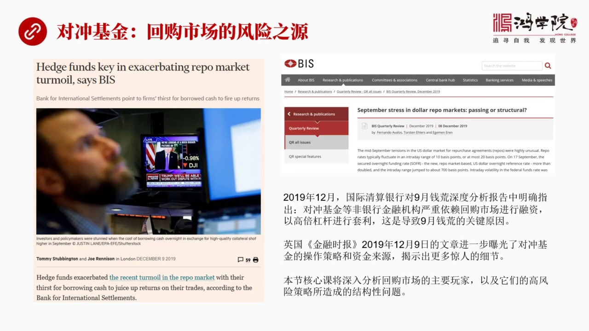

國際清算銀行對於發生在2019年9月的回購上升所出現的前荒他們的報告在這篇報告中專門指出了對衝基金等非銀行的金融機構這些機構嚴重依靠回購市場的融資然後進行高倍槓槓的風險投資那麼這種行為最終它是導致9月...

<strong>All subtitles</strong>

> 國際清算銀行對於發生在2019年9月的回購上升所出現的前荒他們的報告在這篇報告中專門指出了對衝基金等非銀行的金融機構這些機構嚴重依靠回購市場
> 的融資然後進行高倍槓槓的風險投資那麼這種行為最終它是導致9月前荒爆發的重要根源之一除此之外英國金融時報在2019年12月9號也有一篇文章這篇
> 文章在我看到了所有文章中揭示了兩個重要的細節就是對衝基金他們到底是怎麼操作的高倍槓槓是如何進行套利的具體的細節除此之外還有對衝基金的資金來源
> 到底是從哪來的這個錢當然是廣義上是從回購市場中這家融資用國債作為抵押去融資但是除此之外還有一些非常重要的細節問題也正是由於這一點所以我們這堂
> 核心課將研熱上堂課的思路更主要的去分析回購市場中的重要的玩家們特別是對衝基金還有它的融資渠道具體的操作策略那麼這種高風險高倍槓槓的操作模式究
> 竟對於9月前荒所造成的具體的又發的這種路徑是什麼這就是我們這堂核心課的一個主要內容我們看下一頁說到對衝基金呢對於我們很多人來說

---

### Slide 3

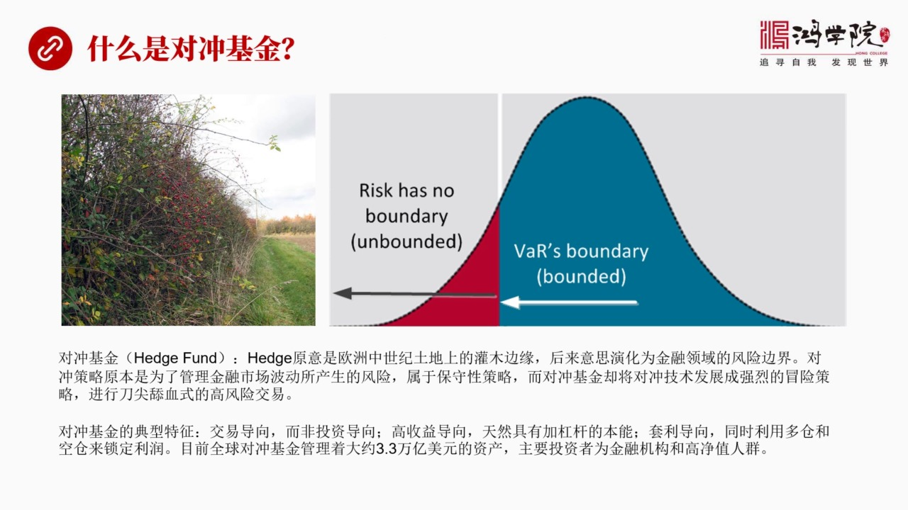

不太理解什麼叫對衝基金因為在中國的金融市場中對衝基金還是個新生事務應該說還沒有成型的類似於美國量的這種大規模的對衝基金咱們還沒有所以一般人提到對衝基金總是感覺到比較陌生對衝基金它這個英文這個Hatch...

<strong>All subtitles</strong>

> 不太理解什麼叫對衝基金因為在中國的金融市場中對衝基金還是個新生事務應該說還沒有成型的類似於美國量的這種大規模的對衝基金咱們還沒有所以一般人提
> 到對衝基金總是感覺到比較陌生對衝基金它這個英文這個Hatch放的Hatch按照我們翻譯叫對衝實際上它的英文原意並不完全如此它的原意是什麼呢它
> 原於中世紀歐洲的這種土地在這種開闊地上周圍會有一些貫穆從貫穆從的邊緣被稱之為Hatch這種Hatch就是所謂的邊界的意思後來這種礦野上的貫穆
> 從這種邊界的概念被引用到了金融市場中就變成了金融領域中的風險邊界從土中我們可以看到左圖這是中世紀的這個貫穆從在開闊地的邊緣會有貫穆從右圖是指
> 著金融市場中類似的邊界就是風險邊界那麼對衝基金的策略它主要原來是用於管理金融市場風險的也就是金融市場會有波動那麼在波動的情況之下如何控制風險
> 如何管理風險這需要一系列的所謂的風險對衝的手段但是最早這種風險管理手段它它屬於一種偏保守性的也就是我就是為了防暖風險因為我只有大量資產所以為
> 了防止市場波動造成我只有資產的損失我會想辦法去做對衝但是對衝基金特別是21世紀以來的對衝基金他們卻不是從保守的角度去考慮問題而是把這種對衝技
> 術發展成了一種強烈的冒險策略然後他們所進行的是高倍槓槓下的高風險的博弈我稱之為是刀疆田雪式的高風險交易也就是你要賺了有一家的槓槓你的利潤會很
> 高但是你要排了方向賭錯了那麼輕微的下跌也會使你滿盤結束所以由於這種加槓槓的高倍槓槓行為它就會是整個金融市場由於對衝基金的大量的交易就會是整個
> 市場變的從根本上來說就變得不太穩定了如果他們的槓槓被說加得太高整個市場它就會帶有結構性的問題嚴重時刻將會導致金融危機我們看到的2008年金融
> 危機和歷次金融危機都反覆說明了高倍槓槓下市場的輕微波動所導致了這種暴艙集圍暴艙現象一旦出現就會是大批的這種高風險的投資者面臨虧損然後由於它的
> 這種跳樓大甩賣資產拋售又會引發更大規模的金融機構被迫跟進他們的風險也爆出來了然後就會引發一系列的更大規模的金融上的拋盤這就是導致整個市場陷入
> 恐慌最後又發危機的最主要的一個路徑那麼對重基金它的典型特徵是什麼在我看了它有三個典型特徵第一對重基金它主要是交易倒向而不是投資倒向注意啊對重
> 基金並不關心所謂宏觀的形勢也不關心整個金融市場其他周邊的變化情況它只關心我所做的這個交易本身我根本不考慮24小時以外的任何事情也不考慮周圍的
> 全界各地發生的事情這跟我沒關係它是一種強烈的交易倒向也就是我的目標是不管市場怎麼包動我鎖定我要的利潤所以在這種情況之下它不是真正的投資人的這
> 種所謂超敵或者進行一種中長期的這種價值性的投資它們不是他們是交易交易就是快速的找到市場中價格的這種偏差所以它是一種交易為倒向的這麼一種行為第
> 二個特點它是高收益傾向就是天然具有加槓杆的這樣一種本能因為槓杆其實是整個金融市場中寄創造活力同時又創造了風險只要你加槓杆那麼你的交易就很可能
> 會成功當然更大的可能性會失敗如果整個市場中槓杆被收加了非常高的這種對中基金太多那麼當它們出現群體性失敗的時候就會導致整個市場失去一種穩定的狀
> 態嚴重的時候就會發生危機第三個策爭是什麼呢就是套力倒向也就是它在操作過程中會同時開多餐和空餐鎖定它要套取的這個立差所以對中基金跟其他基金不太
> 一樣的地方就是它大量使用作空的這種工具這個是很多其他的基金不太願意採取的除非是為了管理風險而它是把作空當成營利了一個重要的手段這是有差別的那
> 麼目前全球的對中基金大概管理著3.3萬億美元的資產美國加上歐洲那麼對中基金在整個金融市場全球金融市場的力量是相當強大的在90年代以前對中基金
> 還主要是一些個人玩家也就是有錢的高競職人士但是在最近十年以來對中基金的資金來源主要變成了金融機構當然也包括一部分高競職人群所以對中基金在國際
> 上上的影響力越來越大其實如果我們看美國的回構是你會發現對中基金實際上是美聯儲貨幣政策的真正執行者在金融市場中的執行者這是它的一個相當相當有意
> 思的一個定位或者叫角色美聯儲了所有的貨幣政策出來之後並不是像傳統利益這個模式一樣通過大銀行通過這個券商來進行傳導最主要的力量最活躍的因素是對
> 中基金他們其實扮演了貨幣政策執行者在金融市場中這樣的一個角色好我們再看下一頁在英國金融時報2019年12月9號的這篇文章中

---

### Slide 4

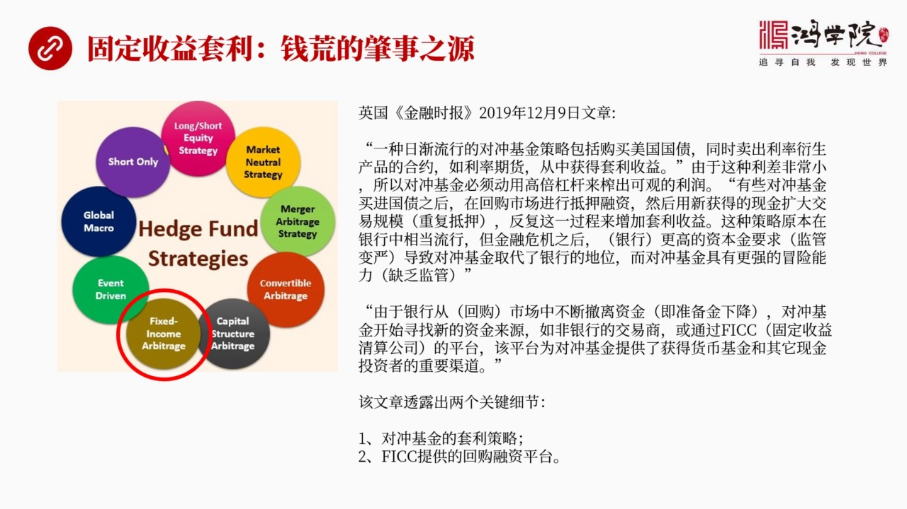

他們專門談到了一些這篇文章中專門提到了幾個細節這是我們這堂課需要重點分析的其實如果我們看很多文章吧你會發現你一遍渡下來之後你就發現哪些文章會有干貨打些文章是龍筒的這個敘述吧有干貨的文章你一眼就能發現他...

<strong>All subtitles</strong>

> 他們專門談到了一些這篇文章中專門提到了幾個細節這是我們這堂課需要重點分析的其實如果我們看很多文章吧你會發現你一遍渡下來之後你就發現哪些文章會
> 有干貨打些文章是龍筒的這個敘述吧有干貨的文章你一眼就能發現他提出了一些東西是你以前不知道的特別是一些具有高度含金量的信息這就是干貨文章我認為
> 英國金融時報的12月9號這篇文章是屬於帶有干貨性質因為他把對中基金的一些具體做法給出一個清晰的解答如果我們看對中基金他的操作策略其實有很多種
> 在走途中我列出了就是對中基金的常用的做對衝的這種策略當然今天跟我們這堂課有關的就是所謂固定收益套利我用紅色圈把它圈出來了其他的策略我們以後有
> 機會我們再錄取講但今天我們重點談這個這也是導致9月前荒的最重要的原因之一那麼在這篇文章他提到什麼呢這篇文章中他說到了在最近幾年有一種越來越流
> 行的對衝基金策略這種策略主要是通過共產美國國戰同時在利率調七市場就是利率衍生市場中做對衝從中實現套利收益主要這句話非常的關鍵他對於我們理解這
> 個美國的回購市場和他的高位槓槓的運作的策略包括與他相關的其他的市場都有非常深入的啟發也就是他是怎麼套利的他是通過大規模購買國債然後在另外一個
> 市場利率調七市場做對衝那麼在對衝了過程中套取中間的立插我們一會兒詳細地分析他這個過程如果我們來看這種普通的套利吧其實沒有錢可賺因為這個立插非
> 常的小那麼對衝基金為了在這種幾個積點或者十個積點以內的這麼一點點立插中間要像或許很高的利潤他就必須要加槓槓加十倍甚至加二十倍以上的這種槓槓他
> 才能夠把這麼小的一點點利潤把他炸舉出很大的一塊收益所以為什麼對衝基金天然具有加槓槓的本能就是因為正常操作普通人操作這無錢可賺但是對衝基金由於
> 他可以使用槓槓他可以把這塊利潤給做得比較大這是他們非常不一樣的一種操作手法另外他接著說有些對衝基金買進國債之後那麼他們在回購市場中進行抵押融
> 資然後用新獲得的現金進一步去買國債然後在抵押然後在買反反復復進行這個過程這叫什麼重復抵押反反復復進行這個過程會使它的國債擁有量變得越來越大這
> 也能夠幫助他放大他的收益也就是我的資產量大了比如說我有1000萬我現在如果加10倍槓槓我可以擁有一個億這樣的一個資產的規模當然這就等於是我的
> 收益加了10倍所以這種辦法這種策略是對衝基金貫用的策略那麼在回購市場中我們看到它這段話的敘述我們可以得到一個非常清楚的一個概念就是對衝基金實
> 際上是美國國債銷售的大戶或者說是美國國債得以順利進入市場的一個主要推手我們以前上街課講到了美國國債在外國投資人不買了美聯儲又買又從這個買家變
> 成了賣家在這種情況之下它喪失了第一大買家和第二大買家之後怎麼辦怎麼吸怎麼被這個市場所消化和吸收呢一個主要的主力大戶其實是對衝基金在大量買國債
> 因為他們買了國債之後再把國債抵押出去然後再買國債再抵這個過程實際上人為的放大了國債的需求量這是人為創造出來的需求量所以美國的金融體系能夠在第
> 一大買家和第二大買家停止購買的情況之下它能夠消化這麼大規模的美國國債的銷售量原因就是對衝基金發貨的極其重要的作用那麼這種策略以前是在銀行中特
> 別是一機交易商這種大銀行中它是比較通行的比較流行的在08年以前但是金融危機之後政府對於這種大銀行的監管變得越來越嚴也就是對他們提出了很多資本
> 金的要求巴塞爾協議專門制定一系列的這種對大銀行的管制的制度所以導致他們不再像以前那樣有比較大了自由度能夠調度資金能夠在這個市場中玩高倍槓桿所
> 以他們的地位逐漸被對衝基金所取代為什麼因為對衝基金沒有這麼多監管也就是他在缺乏監管情況之下能夠放量的玩資金的槓桿現在的銀行不行了所以對衝基金
> 頂貼了他們的位置那麼由於銀行從回購市場中不斷撤離資金這就是我們上堂課所講到了那個問題也就是銀行的準備金不斷的下降回購市場融資的這種源頭逐漸乾
> 河所以對衝基金必須要想另外的辦法來尋找新的資金來源這種新的水源來自於哪呢主要來自於FICC也就是固定收益清算公司他們提供了一種新的中資平台能
> 夠讓對衝基金可以非常方便的核現金納貨比如說貨幣基金貨幣市場的那些基金比如說楊老保險公司等等他們都是有大量現金的所以這篇文章提到了兩個重要的細
> 節第一是對衝基金的套利策略也就是通過買國債然後把國債在回購市場上做支架然後再買然後再支架同時在利率調期市場做對衝同時他們的資金來源從哪裡來現
> 在他有一個重要的新的資金來源是源於一個F叫FICC的也就是固定收益的清算中心清算公司是從這個平台上獲得了大量的資金所以好文章或者說有價值有干
> 貨的東西是他告訴了你他給出了你問題可能存在的方向其實在我掃這篇文章說我一下就被FICC這個詞抓住了因為當你月了這市場你就月左嘛你就知道他有問
> 題但是這個問題究竟出現在哪裡其實我一直在想這個事因為讀了起碼這個整個這個架期吧這十幾天一步也沒有出門當然這主要是與肺炎這個預期的問題當然更重
> 要的是我在仔細的看9月以來的所有各種渠道發表的報告文章所談論前方這個問題我發現只有幾少數的文章涉及到了FICC而在我看來FICC很有可能是整
> 個回購前方的一個重要的重大的這個線索這種就是你看多了東西之後看多了這些信息之後你自然碰到關鍵信息的時候你會變得超級敏感我一會會說為什麼FIC
> C這個公司非常地關鍵為什麼美聯儲現在號稱要振救對中基金其實不對振救的是他們這是我們一會要重點談論的好現在我們獲得了兩個重要信息我們就沿著這兩
> 個重要信息深入的挖掘對中基金他的套力策略究竟是怎麼來進行操作的下面我們看這就是最近我讀到的

---

### Slide 5

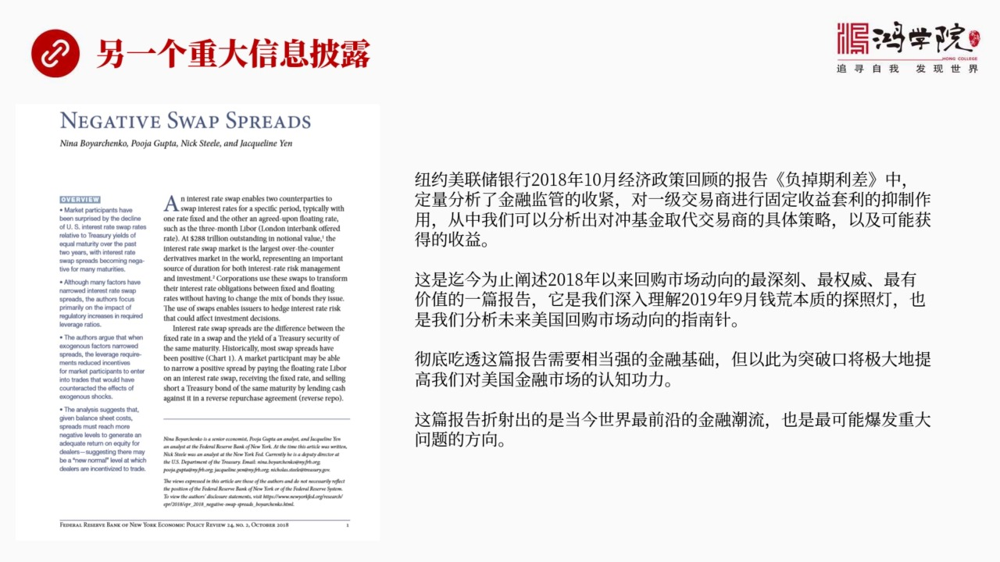

另外一片非常非常有重量級的就是非常寫得非常好而且信息量非常的足干貨實足的文章這篇文章是美聯儲紐約銀行在2018年10月也就是這次前方之前的一年前他有一個經濟政策回顧他美國一段時間會出一個回顧報告以前我...

<strong>All subtitles</strong>

> 另外一片非常非常有重量級的就是非常寫得非常好而且信息量非常的足干貨實足的文章這篇文章是美聯儲紐約銀行在2018年10月也就是這次前方之前的一
> 年前他有一個經濟政策回顧他美國一段時間會出一個回顧報告以前我也讀但是不是特別的經常讀這次在看前方這個問題說我反覆看了美聯儲的很多他們的報告還
> 有國際經營銀行的報告還有各大美國各大銀行的一些分析師的報告還有市場交易人士的很多私下的看法還有他們在各種論壇上的爭論等等起碼不下上百篇在這上
> 百篇文章裡面主要在尋找一個重要的問題就是對衝基金他是如何在回購市場中來做這個套利的具體的做法因為大體上大家都說啊這套的原則很簡單但是我們要想
> 把問題搞清楚必須要涉及到細節所有魔鬼都是藏在細節裡面的這篇文章恰恰提供了最重要的細節雖然他不是從對衝基金的角度來談的這篇文章他談的是站在的視
> 角是從一擊交易商的視角但是我們剛才已經推論出一擊交易商被對衝基金所取代了所以這篇文章這篇文章中也提到了對衝基金也可以做這個事也可以通過一擊交
> 易商做這個事只不過多一個步驟而已所以這篇文章所進行的理論推導包括他的案例數據和計算結果我覺得是可以一直到對衝基金上來的這就是他的重大價值看了
> 很多很多文章都沒有講清楚這些對衝基金們到底在怎麼玩這篇文章我覺得是畢竟為止我讀到的最近幾年以來對回購市長資金動向表達了最深刻最清晰同時也是最
> 有價值的一篇報告其實他幫助我一下子看清了9月回購在這個過程中之所以出現前荒他的本質究竟是什麼而且你把這個本質看明白之後你馬上就會對未來這個市
> 長中再次出現前荒的各種的可能性會有一個非常非常敏感的一種意識所以這篇文章非常棒我在我們的推薦文章中也把他的網址都列出來了當然要想把這篇文章徹
> 底吃透恐怕是需要下一番相當大的苦功夫需要很強的金融基礎我自己讀這個文章不下讀了五遍還用筆記本來和草突進行了仔細的分拆雖然他所說的這些概念我以
> 前就已經很熟悉了但是真正到操作層面上到資產負債表和現金流表他到底是怎麼賺到這個錢的中間涉及到哪些成本涉及到哪些費用這個計算過程相當复杂是比較
> 复杂了你必須要搞清楚所有的概念而且涉及到好幾個市場所以如果進一下進來讀這篇文章孤教讀三天左右你才能徹底把它吃透當然對於我們一般洪雪人同學恐怕
> 沒有這個時間和經歷所以我在分析這個這篇文章中我只是跟大家講結論但是對於特別有興趣的特別是某些同學就是出於好奇心也好出於自己想做對衆經驗也好出
> 於種種的原因吧想深入去了解的話我建議讀原文把這個原文真正吃透你把這個原文吃透之後就會在我看來就會對理解美國的回構市場會有一種認知能力上的飛躍
> 這篇文章我覺得它反映的是當今美國這個金融市場中最核心的也是最前言的東西因為我看了很多文章在談到這個問題說都沒有說透這篇文章把問題說透了當然它
> 是美聯儲內部的一個相當於正在回庫的報告並不是給市場或者給別人看的所以呢我們把它徹底理解吃透之後最重要的價值是幫我們能夠把握未來回構上要出問題
> 你應該朝哪個方向去想朝哪方向去看給我們一個探兆燈或者叫指南針的這樣的一種作用好我們下面就開始這個具體的分析好下面我們看一下在這篇文章中

---

### Slide 6

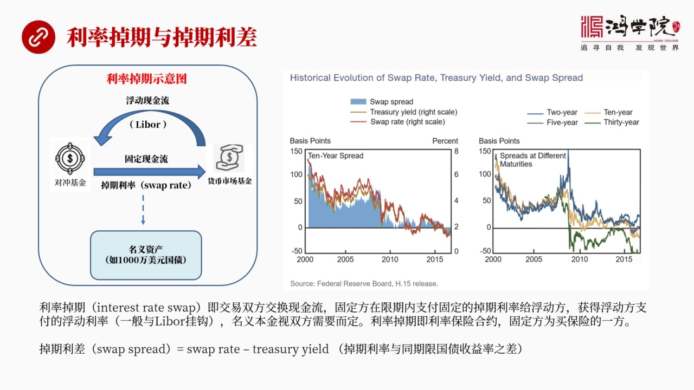

它首先強調了一個重要的概念就是利率調期和調期歷差我知道這個概念的我們很多同學恐怕沒有涉及到因為中國雖然有利率調期但現在還不是市場的主流沒有多人真正在玩那麼調期歷差那當然就更沒有人玩了這兩個概念實際上是...

<strong>All subtitles</strong>

> 它首先強調了一個重要的概念就是利率調期和調期歷差我知道這個概念的我們很多同學恐怕沒有涉及到因為中國雖然有利率調期但現在還不是市場的主流沒有多
> 人真正在玩那麼調期歷差那當然就更沒有人玩了這兩個概念實際上是源於利率調期這樣一種金融眼生產品它的一個體系關於這個利率調期我在貨幣戰爭五中間有
> 一張第四張是專門講利率調期他當年在2008年2009年金融危機那個期間吧還包括在隨後幾年是我形成和發展的一些過程那麼利率調期是什麼東西呢我們
> 可以簡單地把他理解成一個利率的保險合同就是有一方需要一種穩定的相當現金流吧也就是我要買一個利率保險還有一方是保險的賣家保險賣家就是我認為利率
> 就是我們可以說這雙方的他們對這個利率走勢的看法是不一樣的買保險這方就是我就想要一個穩定我就想要一個穩定支付的一個這個利率我不管以後你美聯儲升
> 息還是降息還是國債收益上天翻地覆我不管那麼多我只要知道我未來幾十年或者未來多少年我支出的現金流是穩定的就是我要一個固定利率還有一方就說他們相
> 當於賣保險就說我來給你擔保這個利率不會變所以這兩個方向是一個賣保險一個買保險的在市議圖中做圖中在這裡我標誅出來了對衝基金在我們現在所談論的這
> 個回購市場前方這問題上他是站在賣保險的立場上他要一個固定的現金流就是我不管天翻地覆我只要支付這麼多錢利率漲了那就漲了跌了就跌了跟我沒關係了我
> 現在就是要一個固定賣給他保險的人在我們這個例子中是貨幣市場基金有錢就像中國的這個餘惡保他們把錢匯擊起來主要是跟中國市場中間的貨幣基金對接貨幣
> 基金也就相當於我們這裡所講的美國上的貨幣基金是一個道理他們專門玩貨幣市場回購市場等等那麼貨幣基金有大量的現金這都是老百姓的儲蓄或者投資人的投
> 給他的錢那麼他是實際上是承擔了一個賣保險的角色好在這個圖中我們看到利率掉起了含義就是對衝基金向貨幣市場基金支付一個固定的現金流主要再一定期限
> 之內這個期限多長取決於他買什麼樣的資產我們一會兒再生出說這個問題如果說比如說吧我們如果買對衝基金要大量吞10年的國債那麼他就要求我要一個10
> 年固定的現金流固定了我每個月只支出這麼多每年只支出這麼多現金所以我要一個10年穩定的一個利率這個貨幣市場基金跟他做這個交易那麼也就是說貨幣市
> 場基金支付給對衝基金是一個浮動的利率是一個浮動的現金流這個浮動跟誰掛勾比如說可以跟Liber掛勾倫敦一向前插著上那個利率掛勾這個市場的利率美
> 國幾個月他要變動他是所以他就試了所以貨幣市場基金他要承擔一個利率變動的風險當然有風險他就要生意所以雙方通過這個利率調期各取所需賣保險的當然是
> 收的是保險費買保險是買一個穩定和對資產的保護那麼雙方到底誰付誰錢取決於當時美食美課發生的利率變化的情況那麼在這裡我們談到的是一個以固定現金流
> 交換未來浮動現金流的一個交易那麼他的資產基礎資產在哪裡基礎資產也就是所謂的民意價值要做多大呢這個民意價值在哪呢有沒有底下的資產呢在很多純粹的
> 這種所謂的博弈或者叫這種風險交易中他可以隨便虛擬一個數那麼在這裡我們這個例子中呢對重基金他是有自己的資產的也就是他買了國債所以他的要保護了國
> 債的這個資產的規模就決定了也就是他本金的這個數額有多大這兩者是一致的所以我們可以看到利率調期是什麼概念利率調期就是假如對重基金在市場中囤友一
> 千萬美元的國債十年期的那麼他在利率調期市場中就要做一個合約也就是他要一個十年穩定的現金流我要一個十年穩定的利率誰來跟我做好那麼有一家貨幣市場
> 基金說我來跟你做這個交易我來承擔利率上下波動的風險我給你每個月給你就是定期每年定期給你這個浮動現金流那麼這就形成了雙方的一個交易這個問題當我
> 們說到這裡的時候這就出現了一個新的概念叫調期立差我們如果把利率調期想像成一個他其實也是一種拆卸資金因為你有一個比如說一千萬的本金就是一千萬的
> 囤的國債好這個資產所產生的利率那麼實際上在這裡涉及到也是個融資支付成本的問題我們都知道在整個市場中國債收益率他是風險最小的他是應該是價值最低
> 的因為國債的風險最小美國政府不會違約這是市場市場的基本的共識所以在正常情況之下所有在十年期的各種貸款產品中間或者各種融資的手段中間國債的融資
> 收益率應該是最低的因為他有美國政府的擔保其他所有的融資的不管你是十年期的節債還是十年期的貸款還是十年期的其他的這種融資產品包括十年期的利率調
> 期你們的所有利率都應該高於國債的收益率因為國債是風險最低的他的收益率最低其他的人都應該高於他所以這就出現了一個新的概念這個概念就是所謂的調期
> 歷差調期歷差就是對中基金所進行的這個調期他要的是固定現金流他簽署簽署了這個合約的固定利率的部分就叫調期利率Swap rate這個調期利率他就
> 必然應該高於同時限的如果是十年的話就應該高於十年期國債的收益率顯而易見因為你是民間私人借貸嘛人家是政府借貸顯而政府借貸信用更高你的利率應該高
> 於他所以這就出現了兩者池差也就是調期利率簡去這個我們所說的國債收益率這兩者池差叫什麼呢叫調期利差這個調期利差的概念非常的關鍵如果我們看右邊這
> 張圖右邊這張圖就是美聯儲這個報告中所列出的你看在正常情況之下右邊這張圖的中間就是這個左圖吧右邊這張圖的左圖中間這張圖我們一看到這個藍色的部分
> 其實代表了就是調期利差微證的狀態這是正常狀態也就是你國債收益率低嘛然後我這個我這個調期利率高嘛所以兩者池差一定是個政治也就是調期簡去國債好這
> 個政治的部分這是正常的從2001年一直到軍衛機這都沒有問題但是到了2015年這個數變了我們看到2015年7月以後這個藍色的方塊調到領以下了也
> 就是他出現了負值這叫什麼這叫道瓜這個道瓜就非常了不正常為什麼因為道瓜這個事情響彩就是國債收益率居然高於你這個民間借貸的調期利率這不對呀難道國
> 債的風險比你這個民間十年借貸的風險還要大嗎這不應該呀所以我們看到這就是個反常現象其實這篇文章講的就是為什麼會有反常現象反常現象產生了根源是什
> 麼當然右邊這張圖不僅是十年國債收益率還有好幾種比如說兩年五年十年和三十年四種國債我們會發現在2005年之後2015年之後都分分出現了問題比如
> 說他這個圖中所顯示了十年國債收益率黃線掉到了零以下道瓜了掉的更厲害了是這個率線也就是三十年國債收益率跌得更厲害也就是三十年國債收益率和三十年
> 的調期利率相比高多了除了這個之外只有兩年國債收益率和兩年期的這種調期利差它是屬於政治五年的先是掉到復屬然後又反彈了所以我們在這要記住一個重要
> 的問題就是國債收益率居然高於掉期利率這不對頭這個道瓜是有問題的十年和三十年國債都出現了這個問題好記住這點我們再看下一頁

---

### Slide 7

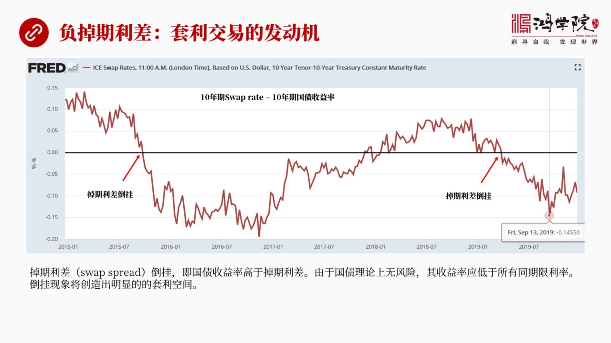

也就是負掉期利差也就是它這個一旦反轉之後到掛之後我們稱之為是負掉期利差出現這個問題意味著什麼意味著出現了套利交易的好機會它是套利交易的發動機為什麼這麼說如果我們看這張圖我在這張圖上是用美聯儲的他們的數...

<strong>All subtitles</strong>

> 也就是負掉期利差也就是它這個一旦反轉之後到掛之後我們稱之為是負掉期利差出現這個問題意味著什麼意味著出現了套利交易的好機會它是套利交易的發動機
> 為什麼這麼說如果我們看這張圖我在這張圖上是用美聯儲的他們的數據自己做的從這張圖上我這個計算方法很簡單就是十年十年期的這個掉期利率簡去十年期的
> 國債收益率只要它掉到零以下這就是出現套利的重要的窗口我們可以看到2015年的7月以後確實出現了這個窗口一直持續到2017年那麼在2019年年
> 初再次出現了套利交易的機會一直持續到現在也就是兩次出現套利交易這樣一個黃金17那麼這就出現了一個問題為什麼會出現套利為什麼會出現這個付掉期利
> 差的反轉或者就要倒挂呢我看了美聯儲這個報告它講了一些例子還有BS的一些報告他們也談了他們的觀點其實在我看來各說各有各說各有理吧我覺得都有一定
> 道理但是我覺得導致這個問題的關鍵還是在於美國國債的銷售量和市場的需求之間的差距2015年之後其實中國以及日本這樣的國際買家對美國的國債已經沒
> 有胃口了或者就沒有能力有胃口了因為2015年我們都知道中國出現了重要的這個重大的股市暴跌在2014年出現了美元環境反轉這些事情我們以前都說過
> 也就是在2015年中國日本等等其他的國家對於美國國債的需求量不可能太大沒胃口了因為我資本外流外貨準備下降我怎麼還能在新買國債呢買不了了所以全
> 球對於美國國債需求下降是導致出現這個所謂負調期歷差這個最重要的原因這是我的一個基本看法當然我們現在關注了不是為什麼會出現負調期歷力差而是如何
> 利用這個東西來賺錢對中基金怎麼利用這樣的機會好像現在出現了一個巨大的水位的落差怎麼用它來發電呢這就是我們下頁要講的重點我們現在看下頁下頁其實我們看到

---

### Slide 8

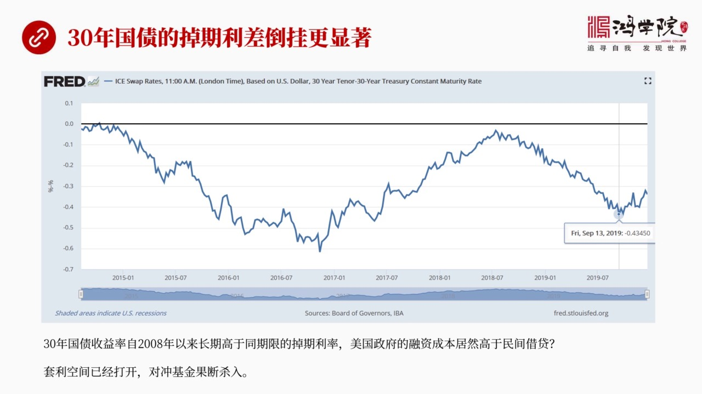

這是剛才展現了10年下頁我們看到了30年這個反轉或者叫這個倒掛的問題更嚴重在這個10年中間還有一些時間它是在浮在水上了那麼在30年國債的調期歷差中卻完全在水下而且這個時間早在2008年金融一之後一直到...

<strong>All subtitles</strong>

> 這是剛才展現了10年下頁我們看到了30年這個反轉或者叫這個倒掛的問題更嚴重在這個10年中間還有一些時間它是在浮在水上了那麼在30年國債的調期
> 歷差中卻完全在水下而且這個時間早在2008年金融一之後一直到現在他幾乎全在倒掛狀態十幾年了那麼這當然會存在很大的這種套利的機會當然我們現在所
> 說的套利機會只是理論上的你要實際進行操作還會有成本所以關於成本的計算才最重要對中基金要想把這個生意做起來它必須要精確的計算它的成本到底有多大這個成本怎麼計算我們看下頁好下頁我們看到

---

### Slide 9

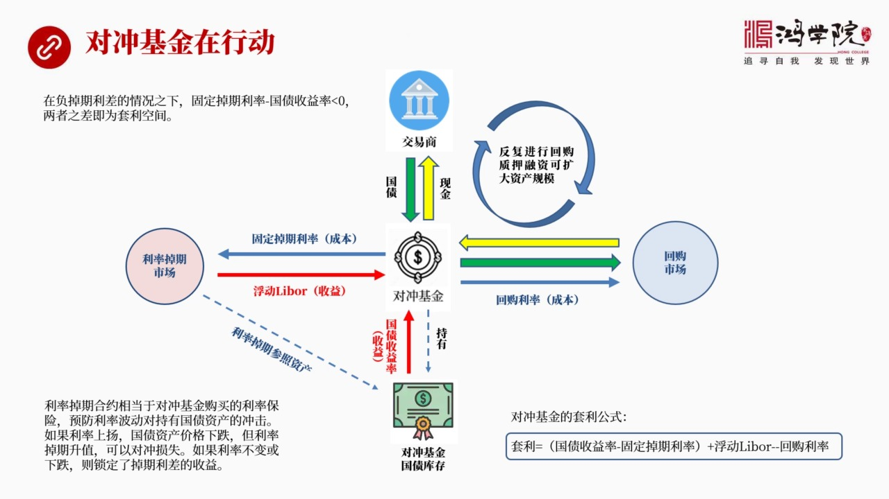

對中基金它如何進行這種套利這個是我在看了很多文章之後把各家學說中國在一起我覺得首先應該用一個直觀化的圖形來表達出來讓大家一看圖就知道這是怎麼回事而不是用語言所以我有個習慣凡是我覺得特別難以理解東西一定...

<strong>All subtitles</strong>

> 對中基金它如何進行這種套利這個是我在看了很多文章之後把各家學說中國在一起我覺得首先應該用一個直觀化的圖形來表達出來讓大家一看圖就知道這是怎麼
> 回事而不是用語言所以我有個習慣凡是我覺得特別難以理解東西一定要用圖來展現當然同時做圖的構成中也就是說你要把所有東西給吃透否則你畫出這張圖畫出
> 來也會出問題所以畫圖的過程即是我們理解一個很複雜問題的一個過程同時又是理性我們思路讓我們真正看到抓住問題的本質一目了然解決你都腦力所以在這裡
> 我把很多文章中看來的這個東西提煉出來它應該是這樣的一個交易結構在這個交易結構的中心正中心是對重基金也就是說我說的對重基金需要借錢買國債買國債
> 它用什麼比如說對重基金首先有一筆現金它支付現金到一筆交易商那買國債的一筆交易商就是美聯儲有24個交易商直接跟他們打交道這叫一筆交易商那麼對重
> 基金要從他們手上去買國債所以它要支付現金這是第一步然後拿回來是國債所以我在圖標中用黃色的箭頭代表現金用綠色的箭頭代表國債也就是支付現金拿回國
> 債這個國債拿回來之後我把它虛擬的放在一個倉庫裡這就是最下面這個對重基金它的國債倉庫它的庫存但是它不是把它放在那個地方我這只是為了這個圖星中表
> 達起來更明確實際上對重基金對重基金持有這些國債的庫存它不是把它甘放的倉庫裡不動而是把它轉手抵押到了回購市場這就是我們看到右邊這個箭頭把綠色的
> 國債抵押到了回購市場抵押它就會換回現金換回現金我還是用黃色的箭頭來標誌現金的流向好拿回現金之後我在第一項線用了兩個大圓圈表示這個過程可以反覆
> 進行也就是說我拿回現金之後我可以再買國債再到交易商賣國債然後拿回國債再到回右上做抵押然後再拿現金再買這個數量理論上來說受制於你得多壓多少錢多
> 壓多少資產因為它會有一個超額的一個準備就是你必須要多交一些少拿一些錢多交一些抵押品所以它限制了你無限周短的這種可能性但是對重基金會根據自己的
> 需要和自己對風險的判斷來做若干刺的抵押比如說它認為風險不大它可以進行若干刺十次八次或者更多看它對市場的評估所以這個過程可以反覆抵我們在上一堂
> 課中舉出了幾個最大的對重基金他們在國債這個問題上通過回購往往往的十倍槓槓也就是假設我們對重基金一開始的自由資金是一千萬美元那麼它可以通過回購
> 這種風方式加槓槓最後它可以買下持有一千萬美元的這個庫存它有一千萬本金它可以持有一個億美元的庫存放在這個圖的下邊加十倍好但是對重基金如果硬要這
> 麼幹不做任何風險對衝這是有問題的因為國債的價格它受供求關係的影響它一旦在市場中國債市場中二級教育市場中交易有蠻有賣呀它有可能下跌下跌它這個價
> 格下跌因為這收益率上升所以呢如果說它的價格下跌那麼就會出現我這個倉庫中這個財富受損的問題所以我要在利率調期市場上做對衝做防護也就是說我做好防
> 護之後如果你真的價格下跌那意味著這個利率上升了說一對上升了那麼我只要在那個地方對衝利利率上升這個風險也就是我買一個利率不上升的保險行嗎可以有
> 人給我做嗎有所以剛才我們講的利率要其實就是一線就是以這個例子作為一個基準對衝基金他有時候是賣保險有時候買保險取決他要幹什麼在這個情況之下他是
> 賣保險我賭利率不上升利率如果我買這個保險是壓利率不上升如果利率上升了我買的是個固定線金流而如果利是上升了對方要賠我錢所以這是他的一個基本思路
> 所以在利率調期市場在他的左邊我畫兩個鏡頭一個是對衝基金他要支付一個成本他這個成本是什麼就是固定的調期利率就是我未來多長時間我持有十年過代那麼
> 未來這個這段期限我就定期地給你這麼多錢固定的利息換回的是什麼對方給他支付的是浮動的浮動了Liber好我們看到這個交易結構中間最重要的其實是他
> 的他如何實現套利這個是問題的關鍵所以如果你是對衝基金你就在想我到底是靠什麼在賺錢我賺了多少錢這個東西應該怎麼來算我們可以首先忽略你到底存有多
> 少國債這個具體的數不重要重要的是幾個利率之間你最後利率是正還是負對吧那麼我在這裡呢為了給大家一個直觀的這個直觀的看法我用紅色的箭頭代表現金是
> 流進來的他是賺錢的部分也就是收入部分藍色的箭頭代表是成本的部分支出的部分只要這個紅色箭頭簡去藍色箭頭為正他就能夠套利成功只要套利存在這個正數
> 那麼我資產量越大我賺錢就越多那麼首先我們來看他的收益是什麼首先是國債收益率就是我們持有國債庫存嘛國債人家每半年要發自利息這個利息還有包括這個
> 其他的收益這都是屬於對衝基金的他本來就是要做這個事他哪怕抵押去回購這個錢也是屬於他的從快擊學角度來說只要他持有國債的庫存在製壓狀態上在製壓的
> 情況之下也屬於他所以這個錢都是留留給他的就留下他的這是國債收益是留到他這來了另外還有一個就是浮動利率就是浮動的Liberary率這個錢也是從
> 交易對手留下他的這兩個利率是他的收入根本就多少無關一分錢和一百萬一百萬億美元一樣注意我們在這就可以不用考慮他的持有資產的量大少我們只考慮只考
> 慮這個利率問題所以這兩個利率加在一起就是他的總收入他支出的成本是什麼呢當然第一個就是他要支出固定掉期利率這他的成本就是你要換回人家給你的Li
> berary浮動利率你得支付一個代價這個代價就是固定掉期的成本就是固定掉期利率這他的成本還有呢還有你要做回購做回購製壓做回購製壓相當於你要向
> 別人借錢借錢是要給利息的就是回購利率回購利率也是他的一個成本所以在這種情況之下套利他的公式是什麼是國債收益率簡去固定掉期利率再加上浮動的Li
> berary再簡去回購利率我們就可以算出他真正套利的空間有多大我們先看上面我解釋這一點吧在負的我專門要強調在負的掉期利差的情況之下正的情況比
> 較複雜我們在這裡先不考慮這個複雜情況先說簡單情況只要這個負的掉期利差情況存在也就是不正常的情況也就是這個我們所說的國債收益率低而掉期利率高我
> 們現在說的就是在負的在正常情況之下是國債是低的掉期利率是高的那麼這是正常狀態在不正常的負的掉期利差的情況之下呢這個情況就反過來了也就是國債收
> 益率高而你這個掉期掉期的這個利息要低所以在這種情況之下固定掉期利率簡去國債收益率是小於零的兩者之間的差距就是套利的空間當然這個套利空間要簡去
> 兩個成本一個是固定掉期利率成本一個是回購成本才是你進賺的多少錢只要存在這樣一個負的掉期利差就一定會存在套利空間如果你這個套利空間大於你支出了
> 支付了兩個成本你這個生意就能玩起來了那麼在這種交易結構之下掉期利率掉期合約西洋當於對衝擊金購買了利率保險他主要是為了預預防利率波動對於他持有
> 國債的衝擊剛剛我們已經說了如果利率大幅上陽大幅上陽情況之下國債價格降下跌那我持有這麼多資產怎麼辦他會損失不過由於利率大幅上陽那麼我在掉期這個
> 在利率掉期合約中我就賺產了因為別人付給我的就會要比我之前要高的多所以我會用我獲得收益的部分來對衝或者來彌補我在國債持有中所規則的部分這就是套
> 利的一個基本原則好如果利率不變呢就是跟現在情況一樣或者甚至下跌呢那就沒有更沒有問題了他就鎖定了掉期歷差的收益所以無論你出現什麼情況我這邊都能
> 吃到這個歷差在特定情況之下我賺了還更多我這個買這個我這個買這個保險我還能夠更多賺一些再差情況我也能夠我也能夠鎖死我的利潤這就是他的最重要的一
> 個策略但是這只有在負的掉期歷差的情況之下才會存在這種肯定的這種賺錢的機會千里條件還是我的歷差部分要大於我的兩個成本所以套利公式很簡單關鍵是真
> 正的計算卻不那麼簡單因為對衝基金要面臨到很多其他的問題這就是我們下一頁看到了具體計算好我們看往後翻下頁好那麼

---

### Slide 10

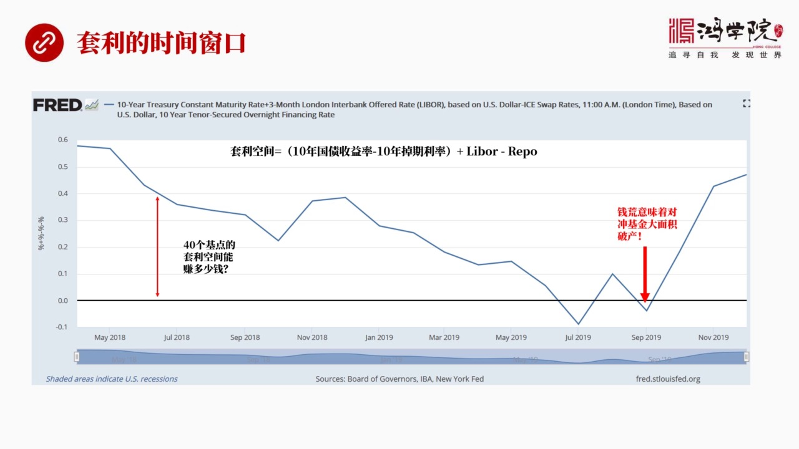

我們剛所說了只要存存在這種套付的這種套利的空間情況之下那麼它發生在什麼時間段呢因為我們上次講到了2018年對衝基金玩得特別火2019年也玩得很火那麼從這個圖我們可以看出這個時間窗口到底有多大這個時間窗...

<strong>All subtitles</strong>

> 我們剛所說了只要存存在這種套付的這種套利的空間情況之下那麼它發生在什麼時間段呢因為我們上次講到了2018年對衝基金玩得特別火2019年也玩得
> 很火那麼從這個圖我們可以看出這個時間窗口到底有多大這個時間窗口呢這也是美聯儲這張圖美聯儲的這個數據我也做了一個簡單計算就是這張圖所標誌出來的
> 這個套利空間所存在的時間窗口這個套利空間等於什麼呢等於十年過程收益率簡去十年調期利率這兩個就是所謂的那個歷差部分只要這個歷差部分它再加上我的
> 收入Liber部分再簡去我Reaper的成本這當然就是我的套利空間好這個套利空間經過這番計算之後畫出這個圖形大概是這樣的一個圖形從這張圖上我
> 們可以看到2018年真的是很好賺錢然後如果我們看2018年5月的時候這個這個歷差高達五六十個積點五十多個積點將近六十平均下來比如說在這個六七
> 月份的時候也有四十個積點所以這有我們可以看到這個歷差的空間有四十個積點只要這四十積點大於我的成本我就能賺錢那麼但是這個好事到了2019年的七
> 月特別是2019年的兩千段七月和九月吧我們知道九月爆發了錢荒如果說這個一旦是掉到了掉到了下面這意味什麼套利空間不存在跳的空間一旦不存在了這就
> 意味著你很多融資成本就飛上去了特別是在錢荒狀態之下我們知道對中基金玩的是高倍槓槓高倍槓槓它是從過回購隔夜拆借來維持比如說你有一千萬的這個自由
> 資金你維持了一個一個意義的國債的資產的總的規模這個倉庫巨大而你要維持這麼大的倉庫你每天都需要在回購市場上去借錢只要一天你借不到錢那你就完蛋了
> 你就會立刻崩盤也就是你如果是回購市場融不到錢那麼你整個這個遊戲就結束了就破產了或者你融資成本太高那也要不了多久你也會破產所以高倍槓槓的情況之
> 下當我們看到這個利率從2%飛升到10%這個回購利率的時候那對中基金新浪命都下出來了因為如果每年處不救他們就會死掉無論它資產規模都大都會死掉所
> 以這就是我們看到的套利的時間窗口我們看一下在這樣的一個玩法高倍槓槓的情況之下對從基金最怕的就是回購錢荒

---

### Slide 11

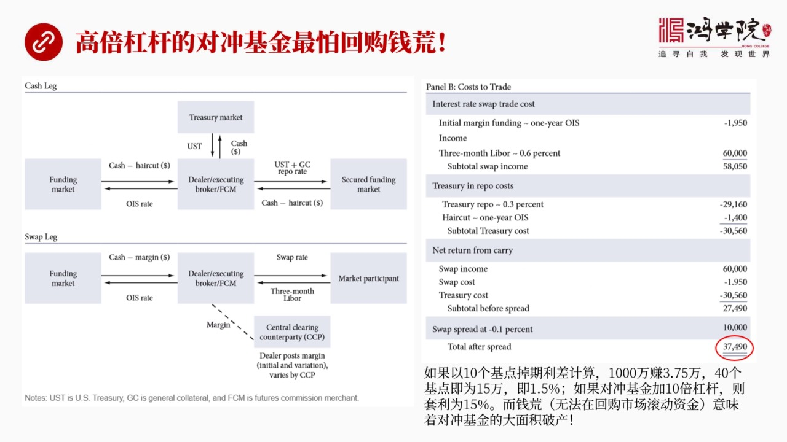

他們到底這個我跟他所說這40個幾點的立差他到底能賺多少錢這個叫算這就是我們說的這個美聯儲紐約銀行這個內部報告他做了一個非常仔細的推算這個仔細推算中間設計到大量的政府規則等等特別是面對一級交易商的諸多的...

<strong>All subtitles</strong>

> 他們到底這個我跟他所說這40個幾點的立差他到底能賺多少錢這個叫算這就是我們說的這個美聯儲紐約銀行這個內部報告他做了一個非常仔細的推算這個仔細
> 推算中間設計到大量的政府規則等等特別是面對一級交易商的諸多的槓槓率的限制資本金的要求還有諸多的這種內審的這種就是外部審查內部審查種種要求所以
> 我們在這裡拋掉這些細節因為這些細節對我們來說我們現在並不關心我們關心的是假如對從基金來做這個事他大概能賺多少錢所以我把中間跟對從基金相關的部
> 分抓出來其實就是雖然這是這個交易商在做但是如果換成對於對從基金他所面臨的成本變化跟這個是幾乎是一樣的我們可以看到這個整個的交易結構如果大家感
> 興趣的話最好是讀這個原文但整個交易結構我們可以看左邊這張圖他有現金這條腿還有掉漆這條腿兩條腿現金這條腿就是他交易商在這個圖中是交易商那麼在我
> 們的例子中應該是換成對從基金對從基金需要去借錢然後需要去買國債然後買國債之後再到這個市場中去抵押在回購上中抵押拿回現金來再買其實跟我剛才換了
> 那個人圖本上是一樣的只不過他現在多了一個短期拆借就是無敵要拆借這個市場這主要是由於你必須要事先押一定的保險金而這個保證金他都是考慮去短期市場
> 中去拆借所以這個地方是跟我們剛剛那張圖不太一樣的地方下面一張圖講的是歷著掉漆這個市場中他怎麼做也一樣把中間這個交易商想像成對從基金那麼他首先
> 也是跟左邊這個市場這個為什麼要跟左邊這個市場去做交易短期融資主要是因為你要在利率交易市場中去做交易需要中央清算那麼中央清算的公司會要求你交易
> 定的保證金大概是3.9%這3.9%這個錢也是需要到市場中去融資的所以他有這個市場那麼對從基金這個情況也是類似除此之外他還要跟市場中的交易對手
> 去做也就是我們剛剛那個例子中所說的這個這個比如說有錢的這個貨幣基金等等去做一個利率掉漆的智患他付給別人的是一個上面我們看到就是Swap ra
> te就是掉漆利率這是固定的收到的是別人給他的3月3月的利率但這張圖其實跟我們剛剛所說的所講的那個圖是一致的直播他按著交易的原則把它分成現金還
> 有這個現金這條腿還有這個這個7還有這個掉漆這條腿如果說加上對衝基金的話如果是從交易商的角度來說還要再增加一條跟他的客戶之間交易當然我們現在不
> 去討論這些細節問題我們最關心的是他到底是40個基點他能賺多少錢在這個例子中他假設他的基點是10個基點的立差10個基點的立差他大概能賺多少錢呢
> 大概能賺3萬740090美元1000萬1000萬大概能賺3萬7聽起來好像不是很多主要人家是玩高貝尷尬的假如是對衝基金來做這事高貝尷尬的情況可
> 不一樣剛剛我們所說這個例子是以10個基點掉漆立差來做一計算1000萬能賺3萬7500如果是40個基點我們剛剛所說的那個那段時間2018年的那
> 段時間40個基點他就能賺15萬也就是1000萬賺15萬我們可以把它想像成1.5%假如是對衝基金加10倍尷尬呢那就是15%的套利所以我們可以看
> 到這就是一個相當驚人的一個數字了因為在當今的這種情況之下你要想賺到這麼高的回報率其實是非常難的尤其是資料比較大的情況之下只有這個市場提供給大
> 家這麼好的機會當然如果是特別黑心的或者特別狠的那些對衝基金不過任何風險你當然可以加20倍加30倍加40倍都可以那這個數字還會大可以變成30%
> 50%60%看你感冒多大風險而已所以我們當我們聽到回報率很高的情況之下永遠意識到你這回報率永遠跟風險掛鉤的你越是風險貿易大當然回報率也大當然
> 反過來也一樣一旦風險太大了尬尬太高了一個小小的風壇就能把一個巨大的一個公司一下侵客之間就燒到所以在這種情況之下9月前荒也就是這些對衝基金由於
> 高被尬尬它沒有辦法在回購上上進行資金滾動了那你這個持有資產就必須要賣掉這就出現大問題了那麼如果前荒來到9月份那個情況這就意味著對衝基金很可能
> 會大面積破產由於回購率上上太快它的成本一下增加了很多它沒有來的急去做這個準備或者沒有對衝這個風險那就會死掉大批的對衝基金如果出現這個情況會爆發什麼問題我們看下一那會脫垮FIC

---

### Slide 12

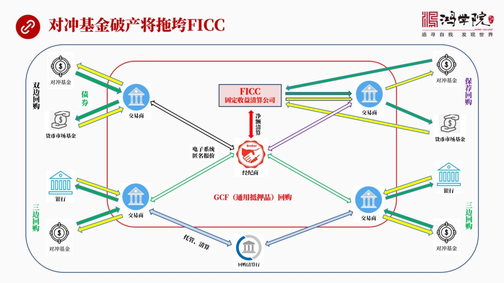

這就是那篇文章中他一提到這個公司我立刻就意識到這個公司實際上是整個遊戲的最重要的環節為了把他的結構搞明白我把美國回購上他的交易方從新化了一張圖從這張圖上我們基本上可以看清楚FIC他的地位美國回購市場包...

<strong>All subtitles</strong>

> 這就是那篇文章中他一提到這個公司我立刻就意識到這個公司實際上是整個遊戲的最重要的環節為了把他的結構搞明白我把美國回購上他的交易方從新化了一張
> 圖從這張圖上我們基本上可以看清楚FIC他的地位美國回購市場包括什麼呢最左邊這是雙邊回購對衝基金和貨幣上基金假如以這兩個基金作為例子貨幣金有錢
> 對衝基金需要錢通過交易商大家做一個雙邊回購也就是把這個綠色的還是代表國債黃色代表現金流那麼對衝基金把國債通過交易商抵押給貨幣這樣基金相反前流
> 向對衝基金這就是雙邊回購他們為什麼不自己找自己還一定要通過交易商呢我們想想看在一個市場中你手上又沒有庫存你也不知道這個市場中誰有有什麼樣的庫
> 存你怎麼能夠去直接去經驗交易一般來說都會打電話找自己最熟悉的比如說小麥布我們買東西都是首先想到身邊的一個小麥布然後到小麥布去看有沒有一個東西
> 其實在交易市場中也一樣大家首先要找一個交易商問他有沒有這個貨他在幫你找對家然後你們簽協議但是東西是通過他那走所以交易商是參與到這個事由於交易
> 商參與到這個事所以他的資產貨幣表會反映出來雙邊回購了一些信息也就是對衝基金實際上是跟交易商做交易商再跟貨幣市場基金作所以他的資產貨幣表被捆綁
> 住了這一點非常重要下面這個就是三邊回購左下角的三邊回購三邊回購比如說是可以是銀行也可以是貨幣市場基金反正有錢的人吧他們一方面通過交易商做這個
> 抵押回購另外他們還要把這些東西最後拖管拖管到一家清算就是回購清算房以前在美國市場中有兩個一個是傑平摩根一個是梅隆有月梅隆銀行傑平摩根大概在2
> 018年退出的這個市場所以現在只有一家梅隆銀行在做這個回購的清算以前他玩了很大特別在2017年以前2007年進入危機之前但是後來呢由於美國要
> 求所有的清算所有的這個回購清算要集中集中清算所以現在越來越多的生意轉向了FICC這支我們看到的中間這個正中間的這個固定收益清算公司FICC這
> 個圖除了這兩種清算的還有一種叫保健回購保健回購是2017年開始這兩三年吧發展了非常訊懵這個地方保健回購這個sponsorrepo這個東西其實
> 就是我剛才所說的英國金融時報所講到的這個融資平台這個融資平台是屬於誰屬於FICCFICC通過開放一個讓所有人都能夠直接跟他發生交易通過這樣的
> 一個平台能夠為對中基金提供一種新的融資渠道那麼這種融資渠道讓他更容易的獲得貨幣市場了資金或者是對於推游基金或者什麼共同基金可以更容易的跟他們
> 對接如果我們來看這個圖你會發現它形狀發生了變化對中基金和貨幣市場基金在右上角這張圖上兩者是直接跟FICC發生關係然後在FICC收到了低壓品之
> 後他在通過這個綠色的鏡頭也就是把這個低壓品通過交易商轉給貨幣市場基金貨幣市場基金再通過FICC把這個錢轉給交易商最後再給對中基金那麼左邊左上
> 角這個圖跟右上角這個圖有什麼不一樣呢如果我們自己看你會發現交易商擺脫出來了交易商他相當於沒有再跟對中基金和貨幣市場基金做雙方的直接的交易他從
> 交易中擺脫出來了這對於一億交易商來說一億重大等於是他不再為這個交易直接的參與不再直接參與這個交易而變成了擔保這會極大的釋放他的資產負債表的限
> 制就是本來政府有很多要求你要做這樣的一個生意那麼你需要拿多少錢在這放著萬一出現問題你這個錢要倒陪進去現在沒有這個必要了由於FICC介入了他就
> 解投出來了他只是變成了擔保商就是我擔保他們交易一定能成功所以我的帳幕上不用再存這筆錢在專門設置筆錢來防範直接交易損失那麼我這錢就可以拿去做其
> 他事了所以FICC的介入使得所有一億交易商都不再持有這樣的一個就是只要加入他的平台所有的人都獲得極大的解放資金上獲得極大的解放這就是為什麼F
> ICC成了非常重要的一個環節好另外還有一個市場就是我中間用紅色標誌出來的GCF市場GCF回購它實際上是一種通用的牙品通用的牙品我們說起到這個
> 說到以前雙邊回購的時候專門講過如果說有些情況下為什麼一定要雙邊就是我一定需要十年國債中間的哪一個序列我就是特定指定要這個的牙品我需要這個的牙
> 品我有我的用處在這種狀況之下我只能通過雙邊回購所謂通用的牙品回購是什麼意概念呢就是只要是國債都可以無論三年五年兩年十年反正跟我這個要求的期限
> 一樣我不再以它是具體哪一個品種這個叫通用這個通用回購主要是FICC為中心的交易商之間的這個回購的平台也就是如果說我們看到市場的左上角核右下角
> 就是屬於不同的交易商他們所管理的客戶兩人要發生交易關係怎麼辦呢你需要通過中間這個通用的牙品的回購他們兩個交易商之間還要再做一次回購交易才能讓
> 你們兩實現跨市場的交流那麼所有的交易商都在這個通用市場中間他們通過電子的電子的這個平台跟經濟商發生關係就是經濟商負責把所有人的信息集中起來電
> 子報價報給FICCFICC在幫你們實現清算實現這個進額清算的這樣的一種管理模式那麼在FICC他所在FICC他所提供的進額清算中進額清算這個非
> 常重要的概念就是所有的交易商大家不用就是不用以前我們專門講清算的時候講到了有雙邊的清算那很負責一對一的清算相當負責如果多邊進額清算呢就是我們
> 最後只算出一個總數每家參與交易人只支付一次就完事了在中國支付系統這個核心客中我們專門講過這個問題進額交易清算可以極大再次極大的釋放交易商們原
> 本雙邊清算所不得不保持的那些巨額現金再次被解放出來所以他們又有了更多的錢去幹其他的事去擴大他的這個囤的資產的規模所以一個是保健回購FICC提
> 供的還有就是他提供了進額清算這種機制使得交易商們獲得了雙重解放這就是FICC他的重要性當然這種重要性反過來說明他的脆弱性假如我們剛剛所說的2
> 019年9月爆發的前方這個情況持續下去每年處不救假如讓那個10%的利率保持個三五天會出現什麼情況會出現整個市場中大面積的對中基金破產對中基金
> 一旦破產注意他所形成的交易的對手方都完蛋了就是比如說我們說雙邊回購這個對中基金本來說好了跟會不會上基金說我過兩天還以前結過他沒還錢他先死了那
> 麼貨幣上基金就傻了因為他等於交易對手沒了他的這個資產就出了大問題他收不回這個錢他會出現嚴重虧損那麼這個問題一傳到整個市場中都會出現這個問題那
> 麼這個時候FCC所謂的金額清算機制也就崩潰了因為出現委員之後FCC有自己的一個就是他的成員吧交了一些分子錢他把這個分子錢作為一個委員的保證金
> 但這個錢如果被很快的消耗掉呢他就沒有辦法再進行金額清算了因為錢陪光了再出現委員他拿不出這個錢了拿不出這個錢怎麼辦那就會使得整個金額清算機制瓦
> 解金額清算機制一旦瓦解那麼所有跟他有關係的這種銀行也好保險公司也好還有這個交易商也好都會暴露他們的風險他們自然分在表上本來應該有一筆錢是為了
> 防範風險的結果我們搞了有了FCC我們有了金額清算我們有了保健回購我們不用設這個房了好現在他的金額清算機制一旦崩潰那麼我就必須得把我其他的資產
> 中間錢轉移部分過來來作為這個風險的保證金呢就要作為一個這個風險的賠償金呢立刻就會使我自然分在表立刻漏洞擺出達不到政府的要求達不到巴斯爾協議的
> 要求那麼所有的銀行金融機構都會被迫拋售資產或許現金來填這個窟籠這就出大問題了大家如果一旦一起這麼做這就叫金融危機資產價格所以FCC是整個遊戲
> 的關鍵它是整個回購市場中它是靈魂它如果一旦出問題那整個市場就完蛋了好我們再看下一集這個時候我們看到了2020年1月14號華爾街日報

---

### Slide 13

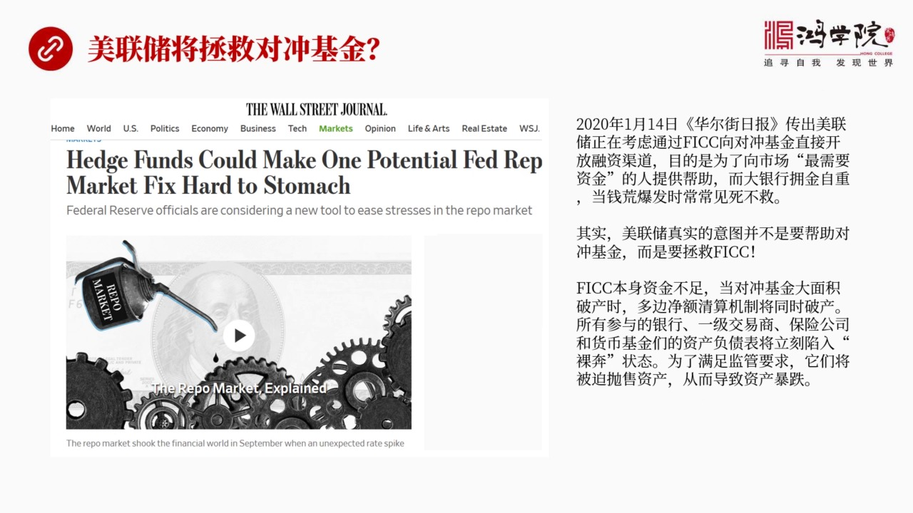

有一篇文章我一打眼就知道他這篇文章說的是什麼他這篇文章傳出每年出現在正在考慮通過FCC像對中基金直接開放融資通道什麼概念就對中基金沒錢了大銀行又不給因為什麼呢這個大銀行他出現前荒售他們肯定是不會給沒老...

<strong>All subtitles</strong>

> 有一篇文章我一打眼就知道他這篇文章說的是什麼他這篇文章傳出每年出現在正在考慮通過FCC像對中基金直接開放融資通道什麼概念就對中基金沒錢了大銀
> 行又不給因為什麼呢這個大銀行他出現前荒售他們肯定是不會給沒老板錢的這個時候對中基金就很可能破產那麼每年出現在設想了新辦法就是我通過FCC直接
> 給對中基金發放貸款幫助他們度過難關所以這篇文章說每年出這樣做目的是為了向市場最需要現金的人提供幫助大銀行這些人往往擁金自重前荒售發售經常就是
> 見死不救其實在我看來就是他只要說到這個問題通過FCC向這些對中銀行貸款我立刻就能夠想到這不是在拯救對中基金它實際上是要拯救FCC因為FCC的
> 重要性太太大他遠遠超過任何一家對中基金他要倒了整個美國金融體系就挖掘了回購市場就崩潰了所以美國在寫新聞的時候華爾街日報在寫新聞的時候永遠不把
> 最重要的東西寫的寫的明顯的地方他明明是要救FCC他反過來確實通過FCC向對中基金發放發放這個救助這就叫重要的問題也一定要親著說不重要的問題反
> 而強調的很很關鍵放很多筆末其實就是為了分你的神美國立讓你看這個精神出現了中多的類似案例就是把最重要的條款隱藏在某一個非常不齊不齊眼的角落中跟
> 著大的這個法案一下就通過了他是被埋藏在中間在利用大家都沒有注意的情況之下蒙控過關的其實在我看來FCC應該是9月前方中他的恐慌性應該是最強的他
> 要倒掉那就相當於雷萬公司破產再次爆發那麼FCC他本身的資金是不足的剛才我們已經說過所以他要一旦出問題特別是多邊境和清算一旦出問題還有這個保健
> 單保這種形式一旦保健這個回購一旦出問題那麼所有的市場交易者包括銀行保險公司依據交易商貨幣基金他們的資產貨幣表立刻會變成裸奔狀態這就這就會導致
> 這些公司被迫大規模拋售資產這就會又發進入危機好我們在家裡而FCC如果真的垮台

---

### Slide 14

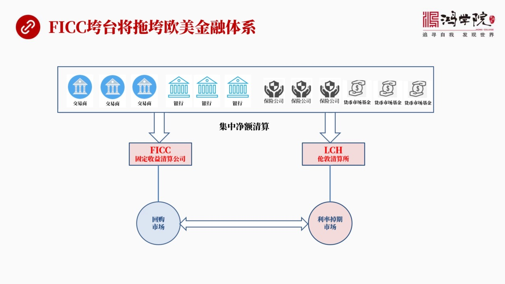

不僅是踏倒了而且將會破壞整個歐美的銀行系統金融體系為什麼這麼說我還是用這張圖來做一個解答FCC是固定說一類的全美國所有國債的清算是通過FCC來進行的那麼全世界所有利率調期的交易是通過LCH來進行的也就...

<strong>All subtitles</strong>

> 不僅是踏倒了而且將會破壞整個歐美的銀行系統金融體系為什麼這麼說我還是用這張圖來做一個解答FCC是固定說一類的全美國所有國債的清算是通過FCC
> 來進行的那麼全世界所有利率調期的交易是通過LCH來進行的也就是倫敦清算所我們剛剛已經講過了所有的回購中間它都要做利率的調期的這種對衝在哪做在
> 倫敦做所以這兩個清算所實際上的關係機器密切這兩個市場是分不開的而跟這兩個市場聯繫在一起的金融機構歐美的幾乎所有金融機構都要跟這兩家發生關係無
> 論你是交易商你還是銀行你還是保險公司你還是貨幣上基金還是種種的任何的金融機構包括這個對衝基金全部要跟這兩個地方發生關係因為你只要需要回購你叫
> 找FCC只要你要做利率調期就必須要找這個LCH這兩家它是密切相關的而且通過回購市場利率調期上是緊密結合在一起的兩事都進行進行清算那麼假如FC
> C垮了它的進行清算機制挖解了所有跟它相關的全世界的銀行金融體系對衝基金保險公司全都成了裸奔怎麼辦大家都要賣資產那麼這個市場就出現問題了回購市
> 場就會雪崩或者叫被凍結住一旦你被凍結好之所以我需要利率調期做這個生意我主要是為了防範我這邊的回購市場通過回購反正加上港所缺有大量資產好我這邊
> 要挖解了你那邊還崩得住嗎這兩邊會一期垮如果說利率調期市場也出現這個問題也出現風潭凍結它的進行清算機制也挖解了那麼全世界有更多的金融機構所有的
> 貸款產品所有的信用卡天天所有的債務都跟利率調期有關只要你要防範風險就必然做利率調期所以它幾乎會睡到全世界所有的金融機構這就是為什麼9月回購那
> 麼嚇人不是我們報章看到了就是一句話百分之二到百分之十如果你不懂你還真覺得這個事沒什麼大不了的你要真搞明白背後的邏輯關係和它的這個傳導鏈條你就
> 知道如果三天不救那就是一種重大的金融危機它不會比2008年金融危機的規模小因為它會睡到FICC很可能會垮胎它要一垮胎基本上會脫垮全世界所有的
> 金融機構這就是問題的要害搞明白這個東西之後我們以後會特別的關注只要美國華爾街日報或任何地方提到了FICC你就知道它再說重點問題了雖然說的是一
> 種很輕的語言但是這是要化重點的所以這就叫重點問題說三遍FICC值得我們每一個人在以後的這個不管你看報紙看新聞還是看電視只要聽到這三個字FIC
> C倫敦聽算所再加上回購只要你聽到這幾個幾個事說的一起了那你就知道這要出一種就是這要出事就是大事好那麼下一頁我們看為什麼我們認為錢荒仍然

---

### Slide 15

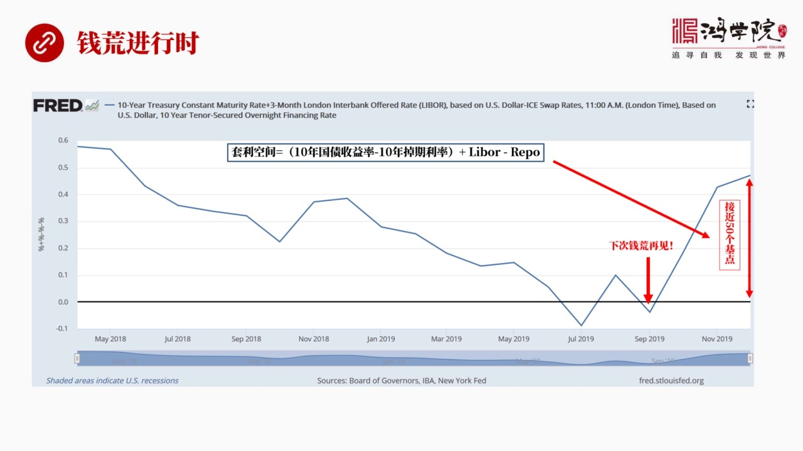

它沒有結束或者叫錢荒未來還會發生我稱之為是進行時就是因為套禮空間仍然存在也就是十年國家收益率進去十年調期利率加上LiberGen去Ripple這個值也就是我指向的現在2020年的1月份2月份仍然是一個...

<strong>All subtitles</strong>

> 它沒有結束或者叫錢荒未來還會發生我稱之為是進行時就是因為套禮空間仍然存在也就是十年國家收益率進去十年調期利率加上LiberGen去Rippl
> e這個值也就是我指向的現在2020年的1月份2月份仍然是一個非常高的一個高點在目前大概接近五十個積點剛剛我說了四十個積點就已經可以賺那麼多錢
> 了五十個積點不得了所以我們看到只要有這麼大的空間而美聯儲還在不斷的往市場中為了它為了拯救這個金融市場它一定會給會給回購市場輸血甚至不排除未來
> 真有可能通過FICC向這個對重基金進行放貸如果是這樣的話那麽整個這個遊戲還會不斷的重複只要炸光杆加到一定程度我們知道它一定會出現風險任何市場
> 小的波動都會導致它出現重大的風險這個風險反映出來就是前方的再次出現所以我在這說到2019年9月份所出現的前方下次還會出現好今天我們關於前方這個話題關於回購市場的前方還有包括

---

### Slide 16

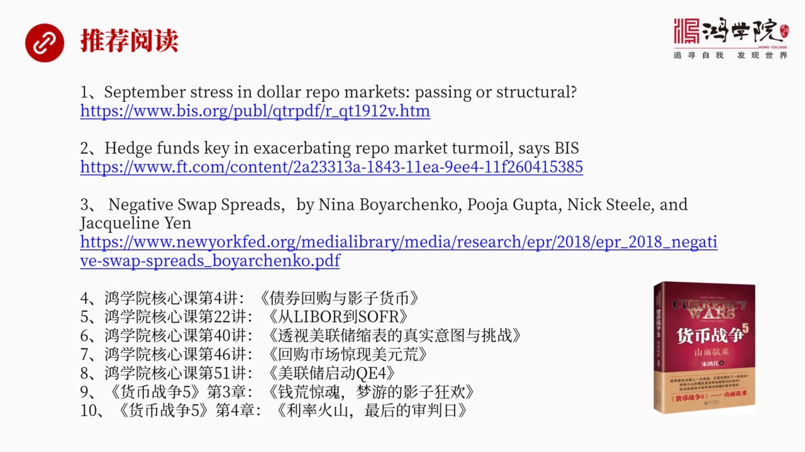

對重基金在中間發生了什麽作用包括FICC利率調期回購市場這幾者之間到底什麽關係這就是我們今天重點討論的內容通過這堂課我希望大家我們看下一頁這個推薦閱讀中我給大家推薦了我覺得寫了最好的三篇文章第一篇就是...

<strong>All subtitles</strong>

> 對重基金在中間發生了什麽作用包括FICC利率調期回購市場這幾者之間到底什麽關係這就是我們今天重點討論的內容通過這堂課我希望大家我們看下一頁這
> 個推薦閱讀中我給大家推薦了我覺得寫了最好的三篇文章第一篇就是當然就是BS國際新聞銀行的這個報告這個報告不長大概三頁吧第二篇就是這個金融時報的
> 關於對重基金所扮演角色的一個深度分析第三篇就是我說的美聯儲的這個關於負的立插的這個報告是寫得非常棒除此之外還有洪軒的一些核心課也都涉及到了相
> 關的問題還有貨幣戰爭五的第四章利率火山這個這張是專門講利率要其他的主要的特點還有他要完成的一些基本工作還有他實現的各種案例好今天關於這個話就我們就先聊到這裡歡迎大家參加洪軒打贏人生的貨幣戰爭

---

### Slide 17

好謝謝大家再見

<strong>All subtitles</strong>

> 好謝謝大家再見

---
