# 核心课视频-53、54  中国十大商帮之秦商崛起 — Detail Slide Notes

> **来源**：鸿学院核心课程  
> **幻灯片**：41 张

---

### Slide 1

中國實大商幫的第一部分,秦商崛起這堂課涵蓋的時間段是從1368年到1492年下面我們看第一頁說到全球化我們都知道現在全球化正在出現退潮

<strong>All subtitles</strong>

> 中國實大商幫的第一部分,秦商崛起這堂課涵蓋的時間段是從1368年到1492年下面我們看第一頁說到全球化我們都知道現在全球化正在出現退潮

---

### Slide 2

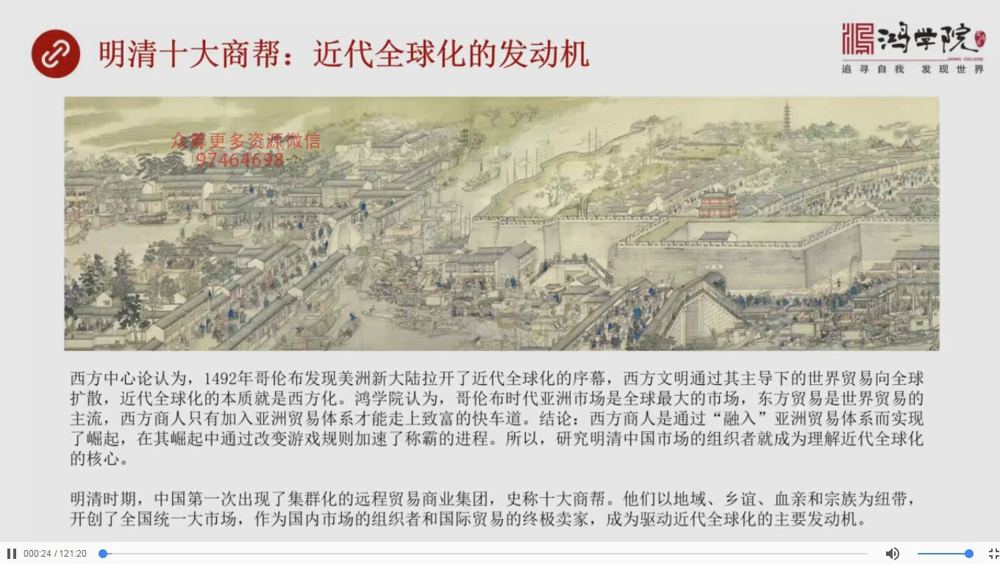

那麼當今世界的全球化從西方中心論的眼光來看它是起源於1492年哥倫布發現新大陸那麼西方文明是通過貿易課章軍事課章文化課章宗教課章等等手段最後變極世界各地,所以在西方人的世界觀裏面全球化了本質是西方化當...

<strong>All subtitles</strong>

> 那麼當今世界的全球化從西方中心論的眼光來看它是起源於1492年哥倫布發現新大陸那麼西方文明是通過貿易課章軍事課章文化課章宗教課章等等手段最後
> 變極世界各地,所以在西方人的世界觀裏面全球化了本質是西方化當然我們弘劍的觀點與此是不同的我們認為在哥倫布發現新大陸的那個時代也就是1492年
> 前後當時全世界的貿易中心並不在西方而在亞洲是中國主導了亞洲貿易體系,而這個體系是全界貿易的主流也是最賺錢的地方西方他們的商人必須要融入亞洲的
> 貿易體系才能夠走上發財支付的快車道否則他們是很難崛起的在融入亞洲體系的同時他們不斷地在改變遊戲規則同時利用技術上的突破就是工業革命最後加速了
> 成就西方霸權的這樣的一個進程所以真正的全球化要把它起源點它當時那種狀態研究清楚就必須要搞清楚中國當時作為全球化的中心地區那麼十大商幫崛起了過
> 程中發生很多細節問題實際上明星時期中國第一次出現了大規模的遠程貿易商業集團這就是史誠十大商幫這些商幫以地域鄉情還有血清中清為精神扭帶和利益扭
> 帶然後開創了全國統一大市場然後作為中國市場的組織者和國際貿易的最終的大賣家他們實際上是近代全球化這種動力的真正的發動機好我們看下一頁基於這樣的認識我們應該如何來

---

### Slide 3

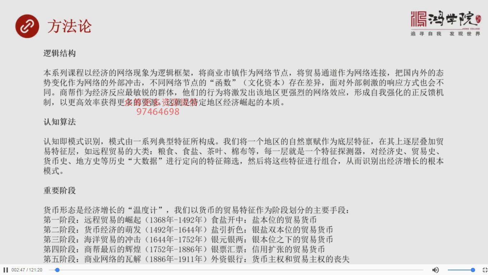

了解來研究明星時大商幫呢首先是方法論那麼邏輯結構我們這個系列課程強調的是經濟活動是一種網絡現象所以經濟的網絡它的這種行為方式是我們的理論的這種邏輯框架那麼以這樣的事要來看商業施政就是網絡的斜點貿易通道...

<strong>All subtitles</strong>

> 了解來研究明星時大商幫呢首先是方法論那麼邏輯結構我們這個系列課程強調的是經濟活動是一種網絡現象所以經濟的網絡它的這種行為方式是我們的理論的這
> 種邏輯框架那麼以這樣的事要來看商業施政就是網絡的斜點貿易通道就是節點之間的網絡連接國內國外的重大形勢變化王朝建立戰爭衝突等等竟然是屬於外部對
> 於網絡的刺激那麼這些網絡節點面對外部刺激的時候每個節點的韓數也就是我們所說的文化資本它是不一樣的所以它的應對方式也不一樣在這些節點中間商幫是
> 作為最敏感的群體他們的行為將會影響了更多的人更多的區域在這個過程中形成了一種自我強化的政返會機制獲得了越來越多的外部資源這其實就是某個地區經
> 濟崛起的本質那麼我們的認知算法是什麼首先認知本質上是模式識別而模式是一系列特徵它的組合典型特徵的組成那麼我們可以把一個地區它的自然貧富作為一
> 種底層特徵然後在上面竹層疊家貿易特徵比如說明清世代遠程貿易的幾個大類糧食食鹽茶葉棉布等等是竹層往上疊家每一層這個特徵層在我看來就是一個特徵探
> 測器我們閱讀歷史不管是經濟史貨幣史貿易史還是地方史所獲得的歷史大數據實際上經過這些特徵探測器之後被提煉出弱干典型的典型的一些特質然後把這些特
> 質和特徵進行組合從中我們就能實別出一個地區經濟發展模式的它的根本特點基於這樣的認識方法我們可以把明清是大上方發展的歷程劃分成五大階段在這裡我
> 的劃分的標誌是用貨幣的這樣的一種貿易特徵探所為區分的標誌為什麼因為貨幣是實際經濟增長的一個體文技也就是經濟好那麼貨幣就強經濟差貨幣就會貶值所
> 以通過貨幣我們可以知道每個時代經濟發展的基本狀態那麼用這樣的一種劃分的標誌我們可以把明清劃分成五大階段第一階段就是遠程貿易的崛起1368到1
> 4921492為什麼選這個時間點就是1492年有個重要的歷史事件不是根本不發現美洲新大陸從我們的社友來看實際上是戶部上書業期進行了變化也就是
> 把嚴引的制度從交涼式改成了用銀子去直接買嚴引買嚴的批文這個對於明朝的貨幣和財政發生了重大影響對貿易產生了深遠的影響所以我們把這個事件作為一個
> 分碎裏第二階段貨幣經濟的蒙發就是1492年到1644年那麼這段時間它出現的主要特色是有前半段的原本位變成了白銀和銀雙本位的貿易貨幣第三階段就
> 是海洋貿易的衝擊141644到1752那麼1644我們是清朝建立那麼1752是前隆最後決定把通商集中在廣州就是獨口通商那麼在那個時代貨幣出現
> 的典型特點是什麼就是外國音源流入大量國內貿易使用銀量1550使中國貿易進入了銀本位時代那麼第四階段商幫最後的規劃1752到1886為什麼選1
> 886作為一個轉折點就是因為中國在19世紀初我們的最立上最大的三個全球產品慈禧它已經衰落了那麼思仇別已經衰落了中國向西方主要出口生私而不是立
> 上出口了這個思仇成品只有茶葉還在維持一直到1886年中國的茶葉出口遭到了印度還有司令蘭卡這種新興茶葉的激烈競爭最後從剩轉向衰落這是一個重要時
> 間點那麼在這段時間商幫最後輝煌他體現出來的貨幣特色就是銀票和會票打發展他表明了一種貿易信用擴張的過程那麼第五階段就是商業網絡的挖解從1886
> 年到1911年聽到沒有網那麼這段時間裡面根本性的這種貨幣的主導力量就是外資銀行我們看到的包括最後抗爭的向湖員他們這個前裝票號的最後一把抗爭也
> 失敗了那是出現在這個時間段1883年到1886年之間所以1886年之後中國的貿易貨幣的主導權已經轉向了外資銀行那麼我們現在看下一頁除了方法論之外我們還需要有技術工具這就是本系的課程首次

---

### Slide 4

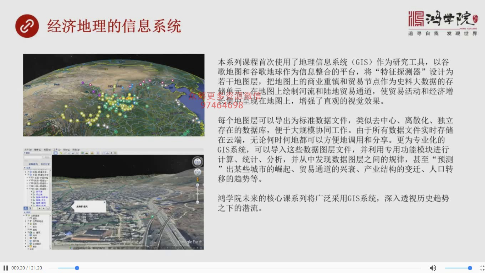

使用了地理信息系統我成為是經濟地理的信息系統就是我們不是主要研究地理而是利用地理的信息系統來幫我們集合經濟信息那麼我們的主要工具是谷歌地圖和谷歌地球作為整合經濟信息的地理信息平台然後把我們的特徵探測器...

<strong>All subtitles</strong>

> 使用了地理信息系統我成為是經濟地理的信息系統就是我們不是主要研究地理而是利用地理的信息系統來幫我們集合經濟信息那麼我們的主要工具是谷歌地圖和
> 谷歌地球作為整合經濟信息的地理信息平台然後把我們的特徵探測器貿易的分層的這種特徵探測器設計成了弱干的地圖層每個地圖層代表一種貿易類型然後疊加
> 在一起然後我們可以在谷歌地圖和谷歌地球上把所有的信息集中在一起來進行展示商業重鎮貿易節點他們就形成了一種能夠儲存信息的一種單元那麼在地圖上我
> 們可以繪製貿易通道合流也好、露跌也好那麼貿易活動、貿易承認和貿易通道就可以全部集中在地圖和地球上讓你一目了然而每個地圖層它又是一個標準的數據
> 文件可以把它倒出倒出成文件那麼這種文件就比較像一種敵散化區中心的獨立的存在的數據庫可以分享可以通過郵件傳送這使得整個研究過程可以進行大規模的
> 協同協同工作那麼這些數據同時又是實施存在雲端所以無論何時何地都可以方便的使用和分享那麼未來如果我們是用更專業化的JS系統可以把這些圖層文件在
> 導入進來利用這些專業化的JS系統中所提供的特殊功能可以對這些數據不同數據曾中間的一些共同規律進行分析統計計算從中找出他們一些共有了模式也就是
> 使得這套系統具有這預測能力你可以通過某種特點的分析設置一些標準然後來預測哪些城市會興起哪些貿易通道可能會改到哪些產業結構可能會發生電筆人口將
> 會向哪裡轉移這不僅是使用於研究歷史同時也可以研究現在包括也可以預測未來所以紅宣未來的課程中將大量使用地理信息系統然後通過這套工具技術手段幫我
> 們能夠更加深入的透視歷史趨勢之下的這種前流我們看下一頁那麼我們現在開始第一階段

---

### Slide 5

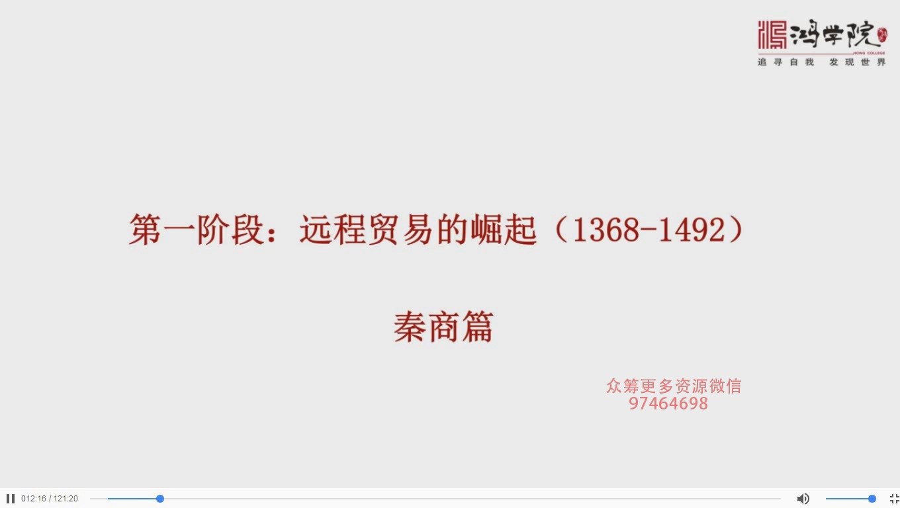

它的分析就是遠程貿易在中國是怎麼崛起的1368到1492首先我們講秦商秦商的崛起我們的續的課程將會在這一個時間段之內先講秦商然後是其他商幫都是在這一個時間段內同時崛起的他們之間是什麼樣的相互關係我們現...

<strong>All subtitles</strong>

> 它的分析就是遠程貿易在中國是怎麼崛起的1368到1492首先我們講秦商秦商的崛起我們的續的課程將會在這一個時間段之內先講秦商然後是其他商幫都
> 是在這一個時間段內同時崛起的他們之間是什麼樣的相互關係我們現在看下一頁首先我們要了解在明朝初年全國的經濟

---

### Slide 6

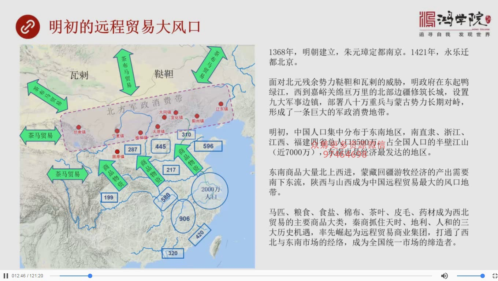

貿易人口各方面的總的趨勢為什麼在那個階段中會形成遠程貿易的大風口你比如說我們知道明朝建立是1368年首都是在南京1421年永樂千都遷到了北京所以在明朝建立頭幾十年中間南方是中國的政治和經濟中心那麼明朝...

<strong>All subtitles</strong>

> 貿易人口各方面的總的趨勢為什麼在那個階段中會形成遠程貿易的大風口你比如說我們知道明朝建立是1368年首都是在南京1421年永樂千都遷到了北京
> 所以在明朝建立頭幾十年中間南方是中國的政治和經濟中心那麼明朝建立之後面臨最大的問題就是遠朝的殘餘勢力雖然他們被打出了中原但是時刻想著反攻反攻
> 中原從因建立他們的政權所以明朝必須要防備北原的殘餘勢力娃勒娃勒還有這個打打打就是在他的就是在中國的北部邊疆偏東廁娃勒是偏西廁打打他們的特點是
> 他們屬於黃金家族的後裔就是當年成績思漢的家族的後裔那麼他們是政宗娃勒他們是屬於唐細的其他的蒙古的這種貴族但是雙方聯合在一起都對明朝形成重大的
> 壓力所以明朝必須要在北部設立一個龐大的軍事防禦地帶這就是九邊陣我們在地圖上可以看到這九個紅點代表著北方防禦系統那麼北方防禦系統駐砸了八十萬大
> 軍幾十萬批戰嗎他就形成了一個巨大的軍政消費地帶那個地方主要是在消費國家的財政因為他產出不夠我們看全局這個當時中國的整個經濟權局的話就發現中國
> 當時經濟中心在東南方向首先我們看人口因為人口在當年是最主要代表一個地區經濟發展很實力強弱的標準在東南遠海比說在長暫曉地區集中了兩千萬人口就是
> 南直地南直地當然是一個表達的概念包括安輝蘇尾但是如果把他的主要人口集中度来看的话主要还是集中的长层脚地区这个地区聚集了2000万人口第二个人
> 口比较多的地方就是江西江西在明朝是相当强的一个省份在中国应该是一线的经济发达区还有福建如果把南泽利然后江西福建这几个省家在一起东南总人口达到
> 了3500万也就是说占了中国人口的半币江山而其他地区呢我们一看就知道从人口上就知道他经济发展程度比如说广东地区 320万人他的经济发展一定不
> 如福建那么湖广地区湖南加湖北一共才580万人所以那个地区也是人家非常稀少比如说我们再看四川地区四川地区当年才199万不到200万人显然整个四
> 川几乎就是空的当然云贵人家就更稀少中原地带呢由于长期战乱这个圆墨民初的战争导致河南地区只有2001是7万人闪西地区只有287万人那么人口比较
> 多的一个是山东有将近600万还有就是山西有445万他们相对来说是北方人口比较多了河北地区大概310万这就是当年中国基本的一个人口和经济发展态
> 势在这种态势之下要保障北方90万大军的890万大军还要包括几十万批战马的军事补给那么就需要从南方大量调用两草调用这种各种各种各样的军需物资它
> 就自然会形成中国从东南向西北方向的大规模物资流动同时中国的北方和西部这些少住民族由物民族也需要跟中原地带进行贸易其实蒙古人跟明朝作战的一个主
> 要目标主要的目的就是要通贸易通商因为由物民族他们有各种各样的生产上的局限性所以他们不能够比如说获得足够的这种棉布不能获得比较充分的维生素这都
> 需要跟中原地带进行大规模物资交流就是茶马贸易还有这个不马贸易所以西北方向它的物资流是从西北向东南那么这两股物资流在中国的西北方向特别是在善西
> 和善西这个地带形成了一个贸易大风口那地方天然它就形成了一个贸易中转和交换的地带那么马匹梁是实验棉布茶叶皮毛药材就成了西北方向贸易的主要的商品
> 大类情商正是抓住了天使和地利人和抓住了历史机遇所以率先举起成中国第一个远程贸易集团打通了中国东部和西部的大市场形成了统一市场的一个这样的一种
> 大的发展趋势成为了第一批市场组织我们再看下野首先从民传角度来看在北方军事地带维持这么大规模的驻军

---

### Slide 7

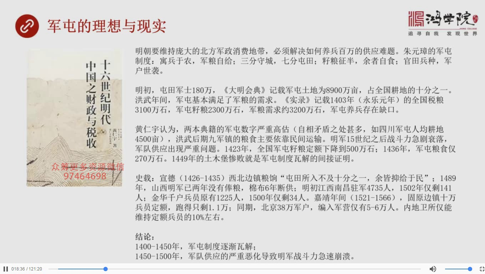

怎么养兵军队的补给这是签股的难题朱元章研究了历代的这个军事特别是军事囤田制度之后他就搞了一套一整套囤田的思路去囤田历史上一直都有包括曹曹都用过囤田但是朱元章把军囤发展到了极致他的军囤制度提炼出来主要是...

<strong>All subtitles</strong>

> 怎么养兵军队的补给这是签股的难题朱元章研究了历代的这个军事特别是军事囤田制度之后他就搞了一套一整套囤田的思路去囤田历史上一直都有包括曹曹都用
> 过囤田但是朱元章把军囤发展到了极致他的军囤制度提炼出来主要是三点第一点玉兵余农军量自己第二点三分手成七分囤田第三点子梁争扮余者自食第四点关田
> 民众关田兵众军户世细那么在明朝初年的时候囤田的总的军事有多少人呢一百八十万大明会典当时记载的军囤的土地的总量是八千九百万梦占全国当年的更地的
> 十分之一我们都知道这个现在吧当今我们说到中国人这个更地十八亿姆是个红线我们可以想象明朝的时候大概是九亿姆也就现在一半我们应该建立这样的一个数
> 量的一种观念那么在明朝初年红五年间吧军囤 军囤基本上可以满足粮食需求还是有一定差距但是基本上够吃那么后来呢到了勇勒元年1403年时候全国税粮
> 达到了三千一百万蛋其中军囤产量达到了两千三百万蛋加那一起就是明朝财政的总收入五千四百万蛋粮食当然还有些其他税时候那都是小头绝大部分是粮食收入
> 是财政的主要主要部分那么在这个军囤的数量两千三百万多年全部用于军事够不够呢其实是不够的因为当时全国的军量大概需要三千两百万三千两百万蛋所以中
> 间还差九百万蛋需要从民间收上来的税粮上要转移支付过去所以军囤养兵在勇勒年间他就有缺口这个缺口是主建越来越大的其实黄仁宇认为呀就是他有一本书叫
> 16世纪明代中国的财政和税收这本书在我看来他的学书水平远远高于他的万里十五年万里十五年只是一种通俗的书好多有意思但是真正的干货是在这本书里面
> 在这本书里面他其实提出了一个非常重要的重要的观点就是明朝的军囤实际上没有宣传和他们捧记就是所谓这些大名会典还有明时路上所宣传的那么好这个数字
> 是被严重高估了自乔矛盾的地方太多比如说四川军囤按照他的军囤人数土地人数一算好家伙人军更地四千五百枚这可能吗绝对不可能所以明朝的这个红武年间的
> 后期就一三九几年吧九军阵的粮食就主要靠民民间运输了军囤数量就不够了到了一四零年以后明朝军阵的作战能力就急速地摔减主要原因就是军事补击不足我们
> 知道到了一四二三年这个全全国军囤的粮食产量就下降到了五百万蛋1436年军囤这个粮食产量下降到了二百七十万蛋这笔红武年间中原章那个时代其实年前
> 三千两千三百万蛋那就少多了只是他的也就是十分之一左右吧所以到一四四九年我们都知道同步宝明朝军队跟这个蒙古军队作战惨败皇帝也被抓了这说明几十万
> 大军没有足够了作战能力间接证明了军囤制度已经瓦解了所以军新部闻战斗能力下降那么如果我们根据不同的历史的这种记载你比如说宣邓年间在西北边阵他的
> 两下已经达不到这个军囤时期的十分之一了其他掉靠民间来不及在一四八九年山西的明朝军队当年的奏者写给朝军的奏者上说到山西的军队已经好几年没有拿到
> 鳳梁眠部也断了六年还有江西的驻军原来是明朝初年是有四千七百三十五人到一五零二年只剩下141人金华也就是哲江的金华他的一个千户当时的兵员定额是
> 1225人明初到了明朝中业一五零年只剩下三十四人那么在家境年间就是一五二一年到一五六六年这个阶段顾原编阵是个最重要的一个九编阵之一他的兵员是
> 十万人最后到了家境年间跑了只剩1.1万人同期也就是哲江年间在北京有38万军户但是真正编入军队的只有五六万人说明大量的人员逃离了这个结论是什么
> 这个结论就是140年到一五1450年这五十年中间军团制度逐渐瓦解了1450年到一五零年这五十年中间军队的供应严重恶化这是导致明朝军队作战能力
> 严重摔减的重要原因好我们再看下一眼那么明朝军团制度同为什么会失败

---

### Slide 8

其实在我看来这好不奇怪因为明朝的军团本上是一种军事奴隶制这是反力是潮流的我们知道春秋战国为什么奴隶制会解体景天景天制会崩溃就是因为你採取这种奴隶制强获释的老闻方式你不可能去跟这个后来的封建社会也就是属...

<strong>All subtitles</strong>

> 其实在我看来这好不奇怪因为明朝的军团本上是一种军事奴隶制这是反力是潮流的我们知道春秋战国为什么奴隶制会解体景天景天制会崩溃就是因为你採取这种
> 奴隶制强获释的老闻方式你不可能去跟这个后来的封建社会也就是属于小农自主的经营农天这种积极性去PK所以这种制度一定是瓦解的明朝的军团本上来说是
> 一种军事奴隶制它带有非常强烈的这种强热性和剥削性你比如说军团土地是谁的国家的它跟农民阳比农民阳条件好了多农田是自己的军团的这些士兵既要扶兵意
> 同时你还得教比农民众的多的税土地还不是你呢那我为什么要玩命干活呢比如说军团军这个军队士兵教的这种税是普通农民的两到五倍所以军队的这些士兵是不
> 可能有劳动热情的它的地位也低于农民而且事实带带你一旦被鞭入军户你这户既是拖不掉的事实带来永远是军户最后的结果必然是发生大规模逃亡而且在这个过
> 程中由于这个军户的逃亡保持了威锁制度的解体这就必然会要求国家军队只能通过目兵制来解决就是给两下发发军想然后招募士兵但是发军想就需要强大的财政
> 而民潮的财政是一个死去这就是这个黄人羽在那边书中所重点强调的民潮的财政体制是一个非常原始的制度我用一个简单例子来形容就是没有操作系统的裸机就
> 像手机样没有操作系统所有的硬件资源调动必须要通过原代码就是通过底层的会编会编员会编代码去调用这些硬件资源当然如果你是一些简单的功能比如说你去
> 调用通信模块打个电话很容易实现效率很高但是如果你要加在呈现上万个APP要做各种样的抖音要做微信要做各种样的服务那你这个这套系统就完全玩不断了
> 也就是说这种非常原始的实物经济基础之上的不考虑货币经济的这种国家底层的这样的一种直接建立在配击之上的这种财政管理制度它只能适用于非常简单和原
> 始的经济这个经济一旦变得更复杂那么整个这套系统的效率将会直线下降这就好比一个比如说我们想象一个上万人的公司这个公司没有财务部所有的人都得自己
> 机枪自己负责财务的清算自己去做各种各样的这个实物的运输包括你机枪都不是用金钱机枪都是实物的条目机枪没法合并账目这个公司的混乱程度我们大家可以
> 想象一下当这个人这个公司人数越来越多做了经营越来越复杂的时候这个公司就完蛋了它的效率会非常的低所以明朝的这样的一种财政制度是它这个国家没法进
> 入没法良好运作一个复杂经济的一个根本性的原因结果呢就导致什么呢就是国家的财政能力很弱然后你收不上税其实老百姓的税率并不高普通能明是5%到10
> %各个地方能够达到15%到20%很少见的所以它是税并不重但是财政能力太差财政能力差了之后国家就没有办法提供良好的公共服务各种公共设施它的效率
> 就很低所以明朝是低税收再加上低效率同时并分特别是屏丰化发展了一定程度国家没有能力进行转移支付那么这个问题就会逐渐了恶化所以正是由于明朝的财政
> 制度太远时军团的良事生产不够国家财政又没有足够的军小怎么办政府就想我们必须要调动民间商人的积极性让他们来帮助国家解决运良的问题就是良草供应军
> 良和军事费用要由商人出但是你要让商人出就必须要给他足够的好处就是要给他给他这个官方所垄断的研贸易的特权让他能够通过研贸易来赚钱然后来贴补他的
> 这种军事费用的陪伴那么搞出这种制度在九边镇那样的地带那么从地利角段说哪里九边镇最近当时闪戏和闪戏所以闪戏和闪戏就是利用了这次重大的政策这个政
> 策的春风吧一月而起变成了经济发达省份但是他要有效地利用这个政策首先你必须要有足够的良事否则你看到这个政策你也拿不到你要有足够的良事就必须要他
> 有个前提就是必须要有充分的水利设施作为保证我们看一下一页那么观众地区恰恰是水利设施基础条件比较好的地区

---

### Slide 9

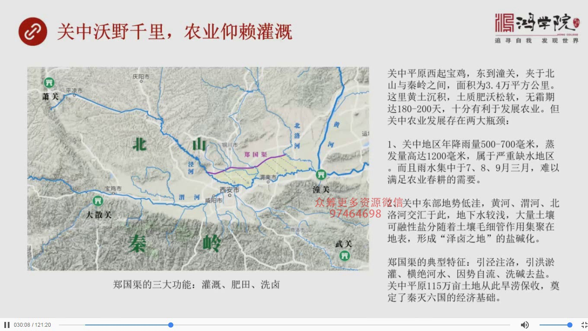

我们都知道观众我也千里农业很发达他农业是靠什么发达的主要靠水利因为观众平原嘛就是这个从西边从保际开始冬天到同关夹于北山和清零之间以为何为中心为何留意为中心的这一块土地面积大概三点四万平方公里这是中国立...

<strong>All subtitles</strong>

> 我们都知道观众我也千里农业很发达他农业是靠什么发达的主要靠水利因为观众平原嘛就是这个从西边从保际开始冬天到同关夹于北山和清零之间以为何为中心
> 为何留意为中心的这一块土地面积大概三点四万平方公里这是中国立上从周朝一直到唐朝两千年中国的经济中心都在这么一小块地方原意是吗原意是这个地方经
> 济发展基础非常好这里是黄土沉济土质资源就是土质非常肥沃而且很疏松非常容易更重而且这个它的含氧量比较高无双期180-200天也算比较长所以农业
> 发展的基础条件不错不过它又练个重要的平静一个平静是关中地区降雨量很少500-700毫米而且蒸发量很大蒸发量一年达到了一千二毫米这就导致它的降
> 雨量远远感不上蒸发量这个地方就会严重缺水而且它的降雨集中在七八九三个月其他的月份降雨很少那你春冬怎么办严重缺水所以这是它的发展的一个发展能力
> 的一大平静第二个重大平静就是它的地势我们可以看到它在这个东部观中平原的东部就是黄和北洛和河河卫水三者相交的同官这个地带你会发现这个地方的地势
> 特别的地挖然后地下水的水位比较高也就是贴近地表所以土壤中大量含严的成分就会被红锡效应被毛锡血管毛锡管的这个红锡的这种作用被吸附到土壤的表层会
> 导致土壤的严谨化所以这就是它的另外一个壁端那么观中要想发展必须要解决这两大平静所以自古以来观中特别重视水利比如说正国区秦国统一六国最主要它的
> 物资它的经济发展了保证就是靠正国区正国区我们看到就是这张图上的粉红色所标志出来的这条曲线正国区的主要特征是引进水注入北洛河那么在它独特的地形
> 之下这个地方就是它的粉红线的这个正国区这个地带它是属于在观中庭圆台阶的边缘地带地势较高形成那个水塔效应卫水卫河这边地是比较低所以它天然就会形
> 成的自流自流景的效应就是自流自流水在正国区南策挖开这个挖开这个核区这个水就直接可以灌溉下来所以黄色这个区域就是受受灌溉这个区域那么这是它的一
> 大特点第二大特点是隐红于冠就是把七八九三个月金水金和上这个红水爆发有大量泥沙引进到正国区之后然后进行大水漫关我们知道泥罗河为什么能够这个它能
> 够保持它的农业生产力主要原因就是泥罗河每年定期发大水大水之后就是泥沙的余极泥沙余极相当于不用湿肥了带来新的肥料那么正国区也能够把金和水上的金
> 和上游的这个泥沙用于灌盖所以它的引红于冠是非常好的相当于自动湿肥第三个特点就是红绝河水我们可以看到正国区它的北山山漫还有大量的其他的河这些小
> 河被正国区给阶段了这样的话就是个下游他们的河道能够接触出十万母的土地来而且这些河流被红绝之后这些河水就流入正国区增加正国区的水量增加它的灌改
> 面积也非常好那么因是自流这个我们已经讲过了还有最重要的就是一个洗剪去沿的问题就是大量金水被引到正国区之后在北洛河的下游形成了冲沙效应把土让中
> 间的延份大大的西式掉了所以它能够带来一个去剪的作用去沿的作用正国区三大功能概括起来就是灌盖肥田和洗炉正式正国区所带来的观众评论115万摩的两
> 田汉老宝收这电厅的秦国灭掉六国的重要的经济基础好我们再看下野所以司马天在这个时期中间就说到观众这个地方虽然不大

---

### Slide 10

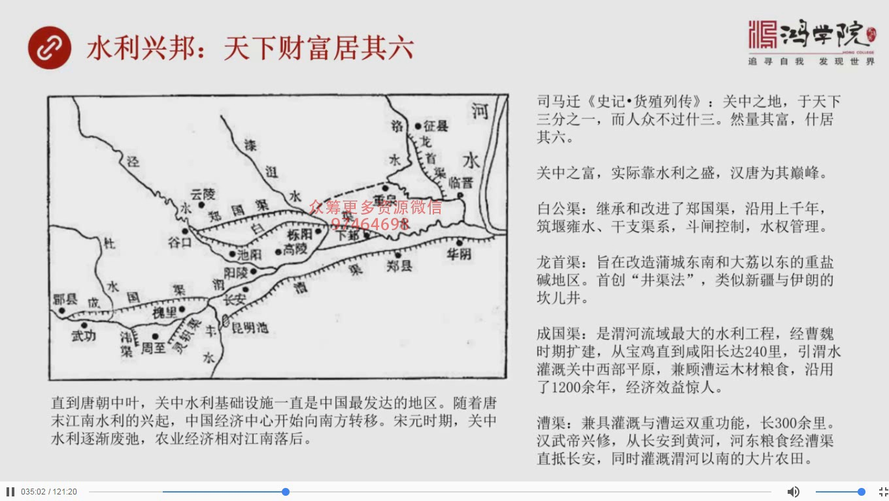

人口也人口和土地大概都占30%左右但是却占天下财富的60%为什么就是因为观众的富裕主要是靠水利特别是到了汉堂它的水利发展达到了顶峰比如说汉朝的时候从汉到堂拜兴趣的大量水利白宫区龙手区成国区草区这是四大...

<strong>All subtitles</strong>

> 人口也人口和土地大概都占30%左右但是却占天下财富的60%为什么就是因为观众的富裕主要是靠水利特别是到了汉堂它的水利发展达到了顶峰比如说汉朝
> 的时候从汉到堂拜兴趣的大量水利白宫区龙手区成国区草区这是四大水利工程如果从图上来看白宫区其实就是在发展这个正国区的灌盖灌盖的这个毛细血管系统
> 正国区是一条主干线它底下这个灌盖的这些支流支区是比较少的白宫区解决是这个问题增加了斗杂增加了干区增加了支区增加了水原管理龙手区是在右侧我们可
> 以看到在落水的附近龙手区主要是改造铺城东南和大利东的重严检地区那个地方主要用的是警区就是打树警然后在底下遭取就是现在我们看到新疆还有伊朗地区
> 的坎尔景不知道是谁先发明谁是这个手创则但是使用了方式完全一致第三个主要工程成果区这是在这个图的左侧成果区就是在现在的梅线其实它是从保际保际的
> 东侧开始修了一条人工运河这条人工运河主要是水利灌盖草位时期就是三国时期进行的擴建它既可以灌盖同时又可以运两草还有草区草区是汉务地修的也就是从
> 西安的坤明池一路修到黄河同官这就形成了一个三百里长的一个草运的重要的同道同时也可以灌盖为何以南的大量的两天所以一直到唐朝中夜以前观中水利始终
> 是中国水利最发达的地区投入最多时间最长几点最深厚当然唐朝中后期我们知道第二个水利大大工程它的集中地是在江南所以江南水利在唐朝中期以后进行大发
> 展大开放所以那个地方的水利解决之后它的农田产量农业发展就高速增长了这个时候中国经济重新才发生了像东南的转移所以水利始终是农业的命卖南地方水利
> 搞得好拿地方经济发展就快我们再看下夜那么到了明朝初年的时候由于唐代以后

---

### Slide 11

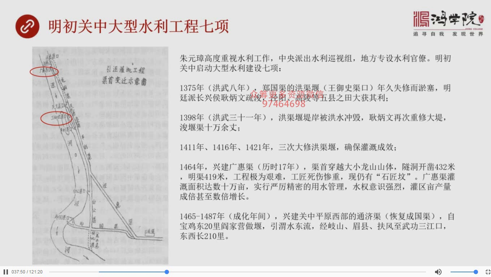

水利的主要集中地是在江南那么宋元时代观中水利就有点落后了就是长期没有人太多的投入所以农业发展也落后了水利也落后了主要原因就在这到了明朝之后观中水利开始重新复兴周园章这个人他是个农业出生非常重视水利工作...

<strong>All subtitles</strong>

> 水利的主要集中地是在江南那么宋元时代观中水利就有点落后了就是长期没有人太多的投入所以农业发展也落后了水利也落后了主要原因就在这到了明朝之后观
> 中水利开始重新复兴周园章这个人他是个农业出生非常重视水利工作中央这个级别派出了水利群世组地方上有专门的水利官员明朝在观中就开始大规模的水利建
> 设一共大新工程有七项比如说在正国区这个区道上就首先有好几次在红区院也就是现在王玉石取口我在这里用一个红圈标志出来的下面这红圈王玉石取口在这个
> 地方就进行了好几次的大型的工程主要的原因就是在红区口这个地方他由于这个长期师修之后会导致余急会导致这个渠道被破坏所以连续五次从1375年一直
> 到1421年连续几次进行大规模的整修来确保整个正白区就是正国区和白宫区包括后来的这个移系列这个正白区这个关概区的关概成效那么1464年又开始
> 新建这个广会区广会区就把这个区口网上推了我们可以看到红圈网上走了网上走了主要原因就是因为金河它有不断的下切作用就是它在地上切的越来越深导致你
> 这些取水的取口取不着水因为金河水已经到了这个取水口的下面10号级米所以你就必须要网上有球那么在这个广会区新建的过程中就碰到了这个大小龙山的山
> 体那有石头要开招延时你当时记得小简直是一件非常困难的事所以搞了17年才把这个广会区给修通修通之后关中水力又恢复了然后两个产量增加了那么到了1
> 465年到1488年又新修了这个通计区也就是恢复正过区就是在为何关中平原的西测当年的这个成果区又重新恢复那么又导致从宝鸡到这个经过其山梅线浮
> 风到武功这段路又重新修通了它的灌盖和它的草运恢复之后那么在关中西部又形成了经济发展的高峰我们再看下夜所以关中的农业之所以能够迅速发展

---

### Slide 12

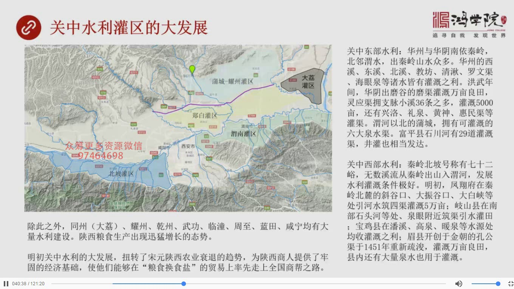

根本原因是水力除了我们刚才讲到的其他工程还有大量的小水利中销水利工程比如说在关中的东部地区我们去看到东部地区它的为何以南华山华洲和华阴它是在秦领的这一侧在秦领的这个北坡这一侧然后这个夹在卫水之间这个地...

<strong>All subtitles</strong>

> 根本原因是水力除了我们刚才讲到的其他工程还有大量的小水利中销水利工程比如说在关中的东部地区我们去看到东部地区它的为何以南华山华洲和华阴它是在
> 秦领的这一侧在秦领的这个北坡这一侧然后这个夹在卫水之间这个地方就新修了利用山上流下的水新修了大量的水利关盖的工程还有呢就在卫核的北侧像大利还
> 有这个铺城药州这个地区主要利用地下水泉水还有它的它的各种渠水渠泉水关盖渠还有这种景渠来进行关盖那么在西边西侧呢就是关中平坚的西部就是秦领的北
> 坡有大量的这种水这个河流注入为何这块地区形成了北坡冠区再加上以前的正白冠区所以整个关中地区到处都是水利水利工程那么正式有于民初在关中水利上的
> 重大投资这才扭转了从于送源以来闪心农业发展衰退的趋势为闪心商人从事这种严良貿易创造了很好条件所以也正式利用了严良貿易这个实验和粮食精交换才使
> 得秦商第一次走上了全国商邦了这种抗中大道我们看下眼如果我们从谷歌地形图

---

### Slide 13

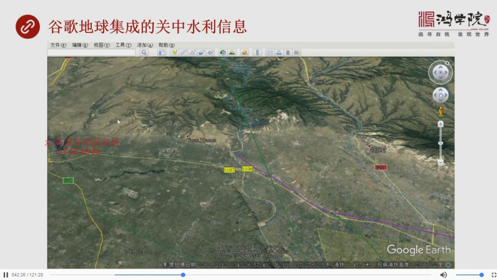

谷歌地球来看的话我们可以看到一个更全面更立体的这样一个关中水利的一个推进过程这就是谷歌地球谷歌谷歌地球我们可以非常清楚地看到

<strong>All subtitles</strong>

> 谷歌地球来看的话我们可以看到一个更全面更立体的这样一个关中水利的一个推进过程这就是谷歌地球谷歌谷歌地球我们可以非常清楚地看到

---

### Slide 14

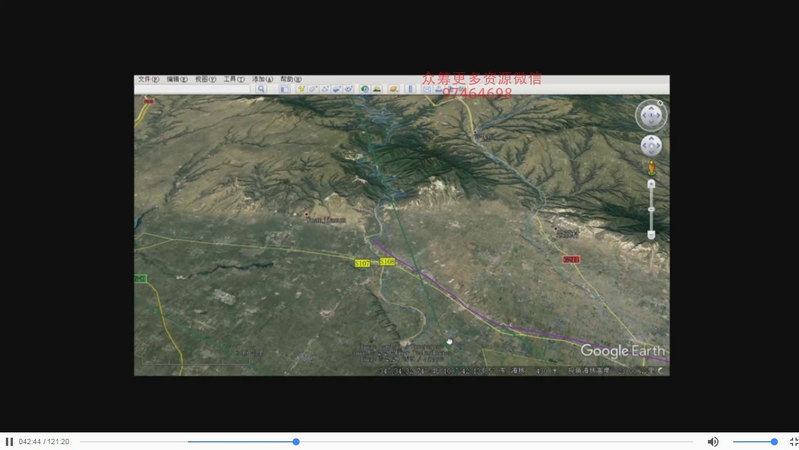

当年关中的水利建设那么我们可以看到这是金水流出北坡商卖之后在这里进入关中平原何道在这形成了一个湖形当年秦国的正国区的区執口就在这一代如果我们来看我会发现它很有讲究在关中平原它的第一级台阶的边缘它是严格...

<strong>All subtitles</strong>

> 当年关中的水利建设那么我们可以看到这是金水流出北坡商卖之后在这里进入关中平原何道在这形成了一个湖形当年秦国的正国区的区執口就在这一代如果我们
> 来看我会发现它很有讲究在关中平原它的第一级台阶的边缘它是严格这个边缘秀的

---

### Slide 15

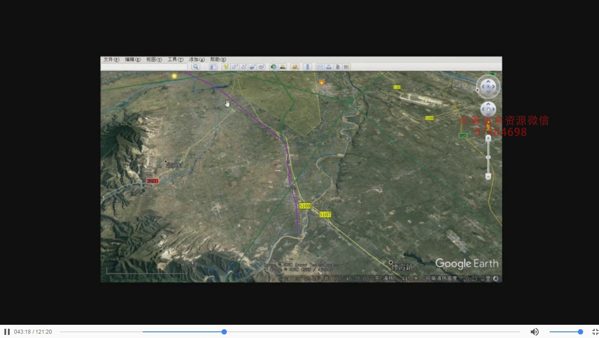

也就是它巧妙利用了这一侧的地形高而卫水这一侧的地形低所以引入金水沿着正国群向这边流动的时候

<strong>All subtitles</strong>

> 也就是它巧妙利用了这一侧的地形高而卫水这一侧的地形低所以引入金水沿着正国群向这边流动的时候

---

### Slide 16

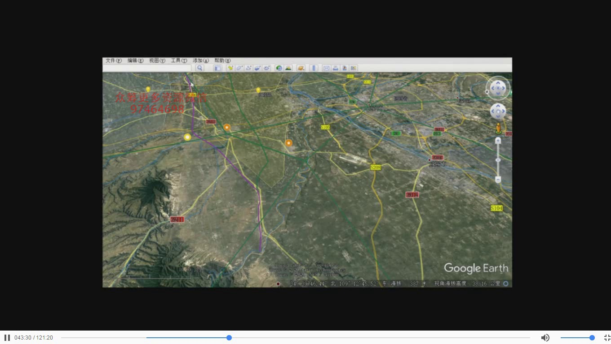

它如果在这一侧右侧开挖一些取口或者打开闹门水将会自动的从北侧流向南侧这就形成了自流灌盖的

<strong>All subtitles</strong>

> 它如果在这一侧右侧开挖一些取口或者打开闹门水将会自动的从北侧流向南侧这就形成了自流灌盖的

---

### Slide 17

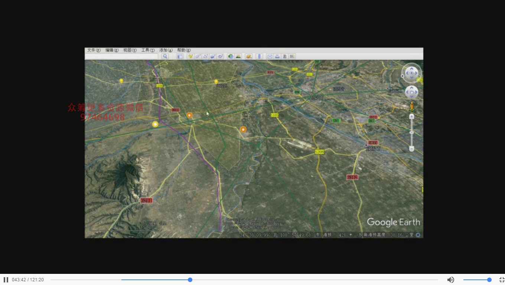

巧妙的效益那么这个黄色的区域就是当年正国区和卫水所夹的一个优良的灌盖区如果我们来看北侧的情侣到底也是一样前凌北坡和卫水也形成了一个高地是和低地是之间的这个落差那么清凌北坡有大量的河流

<strong>All subtitles</strong>

> 巧妙的效益那么这个黄色的区域就是当年正国区和卫水所夹的一个优良的灌盖区如果我们来看北侧的情侣到底也是一样前凌北坡和卫水也形成了一个高地是和低地是之间的这个落差那么清凌北坡有大量的河流

---

### Slide 18

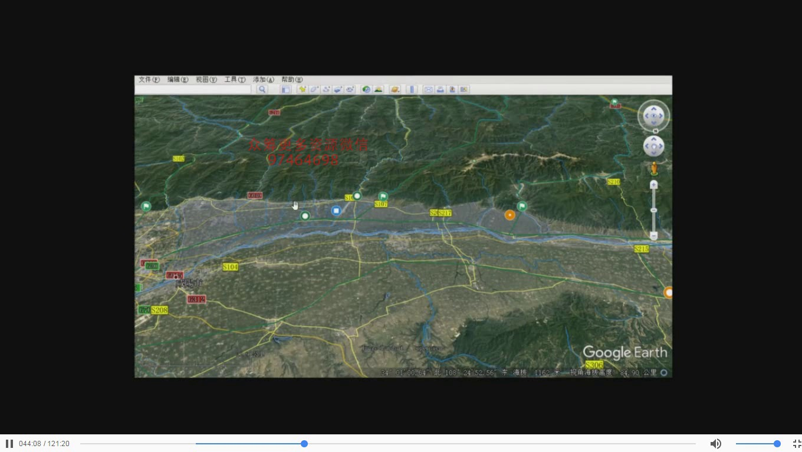

从南向北又入卫河明朝初年时候在这一代新秀的大量的水里工程然后来灌盖这个情侣和卫河之间的很多农田所以这个地区也形成了农业的生产的非常好的一个灌盖条件所以通过股个地球我们可以看到各种气息可以集成在一张地形...

<strong>All subtitles</strong>

> 从南向北又入卫河明朝初年时候在这一代新秀的大量的水里工程然后来灌盖这个情侣和卫河之间的很多农田所以这个地区也形成了农业的生产的非常好的一个灌
> 盖条件所以通过股个地球我们可以看到各种气息可以集成在一张地形土上把经济冒义资源水利

---

### Slide 19

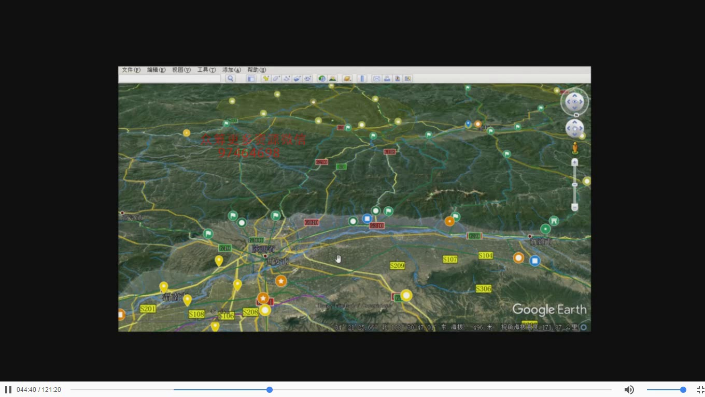

商业通道全部结果在一起让我们能够对关中地区的经济发展有一个全居性的立体性的认识我们再看下一也正式基于关中地区的水利和农业的发展

<strong>All subtitles</strong>

> 商业通道全部结果在一起让我们能够对关中地区的经济发展有一个全居性的立体性的认识我们再看下一也正式基于关中地区的水利和农业的发展

---

### Slide 20

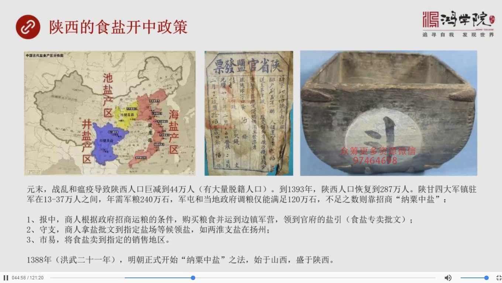

所以那个地方能够首先率先崛起搞实验的冒义实验和粮食的交换那么在中国的这个当年的全国经济发展的这个版图上来看吧闪息这个地方人口是比较少的由于圆末的战争导致闪息的这个人口下降到了只有44万人当然这是一个户...

<strong>All subtitles</strong>

> 所以那个地方能够首先率先崛起搞实验的冒义实验和粮食的交换那么在中国的这个当年的全国经济发展的这个版图上来看吧闪息这个地方人口是比较少的由于圆
> 末的战争导致闪息的这个人口下降到了只有44万人当然这是一个户基统计人口因为大量人在战断之后他会脱离户基跑进山所以呢其实人口并没有这么少只不过
> 登基再测的交税的人比较少经过明朝开国的几十年到了这个休养生息吧到了1393年闪息人口恢复到了287万人那么闪息四大军阵当时住了多少军队呢13
> 万到37万所以我们看一下这个人口才287万你军队就好几十万显然民力负担是非常沉重的那么闪息对四大军阵需要军阳一年240万旦当地的良事产出包括
> 军队自己种的军团的填只能满足一半也就是120万旦剩下的必需要靠招商来获得也就是那素重言那素重言就是官府希望商人你们来重量你们来把良事运到军阴
> 然后我给你实验专卖权这个实验专卖权你可以你可以赚取七八倍的暴力也就是我用实验的利润来支付给你帮我生产良事运输良事那么他包括三个部分第1个部分
> 就是暴中商人什么叫暴中就是商人根据政府招商的文书确定了条件然后购买良事然后把他们这些良事运到军阴指定了良倉运到之后根据你运来多少良事给你一个
> 对换的条件比如说你给你运来一旦良事我给你多少赢多少工金的或者叫多少金的严营有着这个严营之后你就可以到第2步第2步就手指拿这个严营比如说就到了
> 两怀严区杨州在那等候领颜那么第3步领到颜之后你可以把这些颜拉到指定的销售区到那里去卖如果我们看这张图中国的当年的实验效化分销售产区和销售区的
> 比如说海盐产区这个持延产区还有警言产区三大产严区还有销售区那么中间这张图呢就是这个所谓的严营当然这张这个这张图上是光续年间的严营明朝的那个原
> 始单狙找不着了但意思差不多然后这个最右边这是一抖一抖米你教多少抖米我给你一个严皮尔就是这个密合严之间的兑换比较这是朝商的条件那么从1388年
> 红五二十一年明朝政府正式开始纳肃众员之法那么这套方法首先用于山西但是最后大型祈祷是在闪西主要原因就是山西那个地方他的耕地不够水地条件不如闪西
> 那么好同时他那个地方人口太多人多地少所以山西人要想要想转这个钱必须要从山东去运辆那距离就远了因为中国有这股化千里不贩良你要是超过这个距离超过
> 一定的距离之后你的运输费用太高不可算好我们看一下也那么通过十年和两和两世之间的这种贸易到底

---

### Slide 21

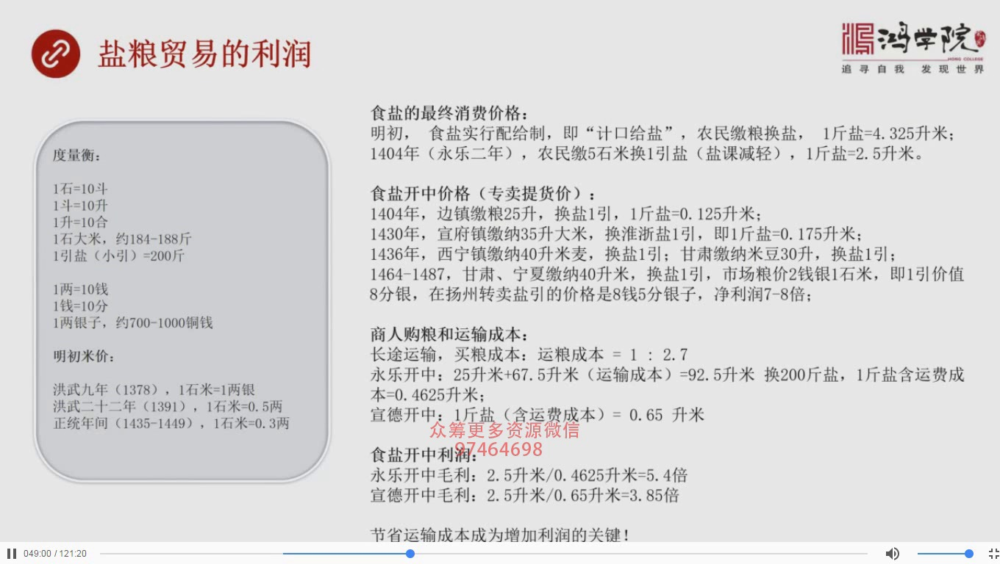

闪西商人能转多少钱呢要把这个问题搞清楚首先我们要对明朝的度量行要有一个基本了解明朝就是左边我们看明朝的一旦就是一旦米是石斗一斗是石生一生是石河一旦大米这是容极大米我们这还有重量一旦大米有多重呢大概是1...

<strong>All subtitles</strong>

> 闪西商人能转多少钱呢要把这个问题搞清楚首先我们要对明朝的度量行要有一个基本了解明朝就是左边我们看明朝的一旦就是一旦米是石斗一斗是石生一生是石
> 河一旦大米这是容极大米我们这还有重量一旦大米有多重呢大概是184到188斤为什么是一个区间呢因为你这个一个容极一旦一旦的容极里面装这么多米你
> 装的是超米还是精米呀它的重量是不一样的各个地方都有鞋位的差距所以它的这个大致的区间明朝的一旦大米大概是184到188斤然后这些米交到了边关你
> 能换来多少研研的度量横是一引一引研他是个重量单位一引研是200斤就是一引等于200斤当然这个叫小引政府用的是大引的概念一大引是400斤但是我
> 们在这主要用小引这个概念还有银子银子是怎么计算了一两一两一两一两一两一十前引子一前引子相当于十分引子所以我们现在说了远角分那个分一分前就是一
> 元的1%那么用这个概念来理解一分引子就是相当于一两一一相当于我们一分前那么一两引子相当于多少同钱一两引子大概相当于七百到一千个同钱在明朝初期
> 的时候这个是一个浮动的范围那么明初的米价红五年间一三七八年一旦大米大概能卖到一两引子到一三九一年一旦一旦米可以卖到五前引子就零点五两那么到了
> 正统年间一旦米可以卖到三千也就是两价再不断下跌那么在西北地区就是特别在西安那个地方在正统年间大概零点三两可以卖一旦粮食这就建立起了一个基本的
> 渡量行的概念我们再看实验实验到老百姓手上了最终消费价格究竟是多少其实在明朝初年的时候实验是没有市场价的因为全国实行的是计划经济配几制借口给言
> 你们家有多少人口没口人我册算出来大概小孩要吃多少今年大人吃多少今年我一年配发给你这么多言国家政府配发给你所以没有零售市场买不着言那么国家为什
> 么要配发给你呢因为你要向国家交两世来换言这个比较关系你交多少两世国家才会给你配这么多言呢平均下来一今年大概要交四点三二五生你四点三五生你换一
> 今年这是当成一种税交农业两世这种税然后得到实验到了勇乐永乐年间九到二年一四零四年农民也是通过这种办法来交言但是复担下降一些了你交二点五生大米
> 就可以换来一今年记住二点五生大米换一今年这个是国家配给配几给你的时候给你是对换价那么这些粮食这个闪西坚商人他们到军队去交两世国家给他们的这个
> 所谓的言影他这个比较关系多是多少呢就是你要调动商人的积极性你得给他多大的刺激呢比如说一四零四年勇乐二年在编证西北编证你交二十五生大米可以获得
> 一眼一眼是二百斤的所以一斤年换算下来是零点一二五生大米主要老百姓要交二点五生换一今年商人只需要交零点一二五生这中间差了二十倍所以这就变成一个
> 超级有立可图的一个生意了二十倍的差价到了一四三零年大概一斤年换算起来是零点一七五生也还是很有赚头的因为民间交十二点五生那么到了一四三六年到了
> 一四六四年这个期间我们可以基本上则算下来你在编官交两十后的研影最后卖到实验销售区总的利润敬利润大概是七到八倍那么这个七到八倍为什么不是我们刚
> 才所说的是一二十倍呢主要是因为买这个买两之后你要千里运两是有成本的这个运输成本我们可以大使计算下比如说以五百里路这个路路运输你要运一旦两十大
> 概要消耗二点二点七旦两十的运输费用所以你要这么则算下来这个利润并没有这么高比如说大概能够再勇勒年间吧你要是做这个生意的话大概能转五点四倍到了
> 宣德年间大概能转三点八五倍所以对于商人来说最重要是要省下运费怎么省这就是商团舅舅舅进就是离着这个军阵非常近的地方开荒重地这就是闪西闪商独特的
> 优势闪西让人为什么能正低统进就是因为他离边关离这些军阵很近所以他可以舅舅舅搞商团招勿这些流民来进行生产

---

### Slide 22

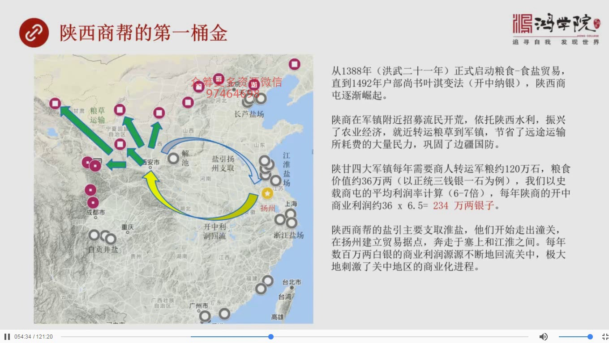

而且他的水利资源条件比较好有逛盖所以这些土地开发出来之后很快就能生产量是然后就能旧进转运到军事重阵他就可以结省下巨额的运费他就能转很多钱当这个商团不仅是解决了军队运输问题还节约了国家财政同时还发展了边...

<strong>All subtitles</strong>

> 而且他的水利资源条件比较好有逛盖所以这些土地开发出来之后很快就能生产量是然后就能旧进转运到军事重阵他就可以结省下巨额的运费他就能转很多钱当这
> 个商团不仅是解决了军队运输问题还节约了国家财政同时还发展了边疆的经济还给这些失去土地这些流民提供了就业机会拱过了边疆国防所以这个商团对于闪西
> 经济发展起到了巨大的推动作用那么闪西大概这个商人能转多少钱我们要算个总规模总规模就是闪西边阵大概每年需要一百二十万弹军量每弹军量按着政德年间
> 这个三这个三千营资买一旦凉士做以这个比较来算大概一百二十万弹凉士大概价值三六万两百营如果商团通过商团来计算平均率率大概是六到七倍的话那么每年
> 闪西商人通过给军队进行这个凉士补挤大约能转到两百三十四万两百营两百多万两百营这是个相当大的数明朝财政则算下来也就两三千万两一年所以闪运商人他
> 们的这个严营就是这个交了凉士拿到严营主要是在杨州取言这样的话他就形成了一个从关内就是从这个关中走出同官杀向杨州他就变成了一个全国开始走向全国
> 这是他的第一步形成了一个跨出省来进行精营和贸易的这么一个群体那么从这张图上我可以看到蓝色这个箭头代表着严营就是严营的距向到杨州黄色这条区效代
> 表着资金回流商业利润然后当这个商业利润白营回到了长安这个也就是关中地区吧那么他就会产生对商业贸易的强烈的刺医作用这里就会形成凉士的贸易中心和
> 凉士的运转基地比如说这些凉士一方面是运到这个北方边镇余林还有一个箭头是运向比如说营川营下镇还有呢是运到顾原镇还有运向张业干素镇还有运向这个新
> 宁地区所以由于这种低统金严实严和凉士交换转来了低统金这个低统金的回流刺激了整个关中地区商业贸易的大发展好我们再看下一那么这种严营制度怎么来理解他的本质

---

### Slide 23

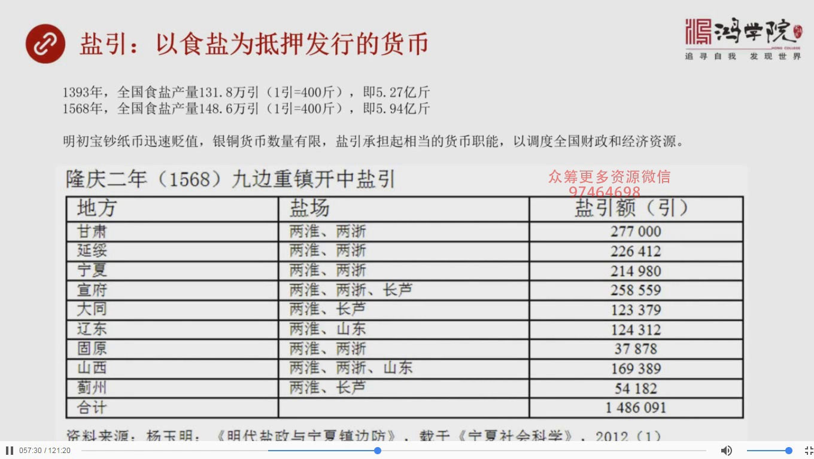

在我看来严营就是以实严为抵押发行的货币明朝的货币一开始是发行保潮发行潮票指币跟原潮售一样原潮又是学的送潮但是指币制度在红五年间就是在周园章那个时代就已经大幅变质了到了永乐年间变质更快基本上到了永乐了后...

<strong>All subtitles</strong>

> 在我看来严营就是以实严为抵押发行的货币明朝的货币一开始是发行保潮发行潮票指币跟原潮售一样原潮又是学的送潮但是指币制度在红五年间就是在周园章那
> 个时代就已经大幅变质了到了永乐年间变质更快基本上到了永乐了后期没人再用这个保潮制度了所以明朝的货币制度很早就崩溃了他要是崩溃之后市场上的同同
> 侧数量是很少的是不不够的白营也是有限的所以明朝最大的问题他发展货币经济没有很好的货币可用指币自己玩砸了同和营又不足怎么办你要想真正调动全国的
> 经济资源和财政资源只能靠严实严因为实严是人人都需要的所以以实严为抵押所创造那个严营那个批文就变成了能够吸引千军万马能够调动商人利益能够使所有
> 人都非常的出现三尺的这么一个调动大家积极性的相当于货币的智能所以人们是笨着潜引去的也就是潜引成了调动商业资源调动经济资源调动财政资源的最重要
> 的手段所以这个时间这个时间段我们称之为是以实严为抵押所发行的货币它作为貿易货币的主要特征好我们再看下野正是由于糧食和实严的貿易使得闪一闪人状的低统筋

---

### Slide 24

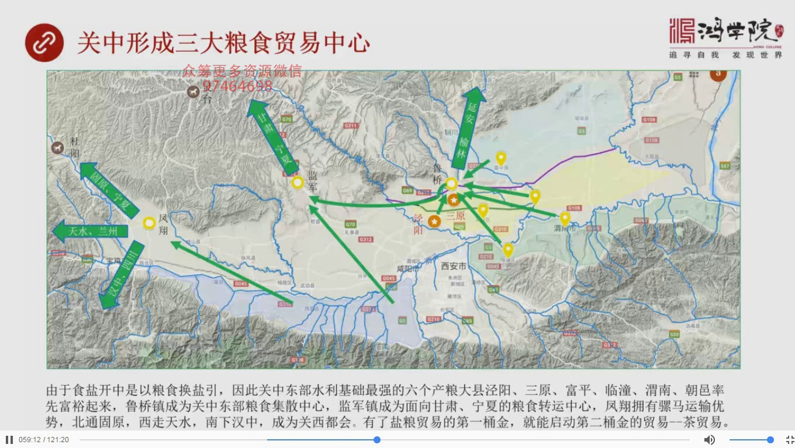

那么政府规定了它的一个换食严营的一个重要条件是一定要把糧食运到军营就是食物糧食必须得适千军产必须得有所以在闪吸水利资源最好的几个线就是正白曲它的灌盖曲这一地带6个产量大线晶洋三元副屏临统未南和潮艺这6...

<strong>All subtitles</strong>

> 那么政府规定了它的一个换食严营的一个重要条件是一定要把糧食运到军营就是食物糧食必须得适千军产必须得有所以在闪吸水利资源最好的几个线就是正白曲
> 它的灌盖曲这一地带6个产量大线晶洋三元副屏临统未南和潮艺这6个线由于它历史上水的条件就比较好所以它就借着这股东风成了粮食生产大线首先富裕起来
> 了关中平原的东部先富起来那么这些地方富裕起来之后要进行粮食贸易要向各军阵转运这个中心在哪就在鲁桥镇在三元的北测我们在途中可以看到关中地区有两
> 个重要城市一个是三元一个是晶洋他们当年比西安和险洋都重要了多晶洋和三元是当时闪吸真正的经济中心贸易中心还有金融中心其中鲁桥镇就是在三元北测鲁
> 桥镇是最重要的粮食转运中心周边六个线的粮食生产出来之后都在鲁桥镇集中然后从鲁桥向北运到延安和余林这个重要的军阵另外还有一个主要的这个粮食转运
> 中心是在监军监军阵监军阵是通向干素和宁夏的粮食贸易通道那么从鲁桥要往这边运的粮食先转运到监军还有其他就是在为何南部地区生产量是也运到监军这是
> 往盈夏镇和顾原镇送军阳的触发地还有就是关中平原的西部这个奉祥奉祥也是非常重要的贸易通道他向西北方向可以奔向顾原和盈夏往西可以到达天水兰州和西
> 宁所以这也是军阳运输了一个重要重要的军中短站所以由于粮食贸易由于实验贸易使得闪迹上人获得了第一统军之后形成了贸易中心然后有了钱他们就可以转第二统军这就是茶马贸易我们看下野第二统军茶马贸易

---

### Slide 25

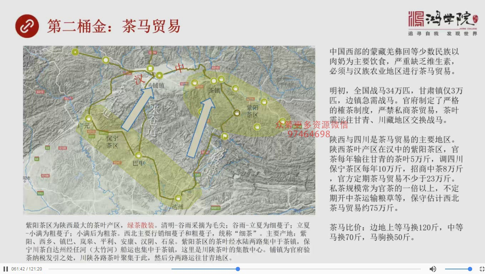

茶马贸易我们来看闪锡他的主要产杂地在哪里他主要产杂地实际上是在汉中地区为什么茶叶能够转钱因为西北的少数民族不管是猛族还是藏族还是其他少数民族他们长期都是主要是靠肉食肉和奶质品所以他们的也是中间非常缺少...

<strong>All subtitles</strong>

> 茶马贸易我们来看闪锡他的主要产杂地在哪里他主要产杂地实际上是在汉中地区为什么茶叶能够转钱因为西北的少数民族不管是猛族还是藏族还是其他少数民族
> 他们长期都是主要是靠肉食肉和奶质品所以他们的也是中间非常缺少维生素书菜不足那么这些维生素怎么来补充茶叶茶叶中间富汗大量维生素所以对于少数民族
> 来说他这个茶不是可有可无的是刚需没有茶他会生病的所以这种言茶茶的这个贸易是少数民族必须必须得有的这种贸易否则的身体吃不消那么明朝初年的时候全
> 国的战马34万品在干素镇只有3万品所以边这个边镇非常需要战马那么只有10亿只有用这个茶叶才能跟少数民族换到战马这个时候政府就要求所有民间生产
> 茶叶都不允许自己卖老百姓重茶可以你重了茶你自己只能留一个月的量剩下的全部得交给国家国家给你一个很低的价格收购然后这些茶全部集中运到边观在边观
> 举换这些少数民族的战马这叫确查制那么当年主要提供这种茶叶官方交易的地区就是汉中地区特别是紫阳茶区紫阳茶区就是以紫阳线为中心的6个重要的线在这
> 个图上我用这种草绿色这个区域这个就代表整个紫阳这个茶区中间这个紫阳线我用的是比较深一点的草绿中间放个茶壶这个茶壶就代表这是产茶区周围还有一些
> 线是属于也是产茶区那么产席的紫阳茶区大概一年能够提供观察也就是老百姓交出来的茶大概是五万斤这五万斤还不太够怎么办还要从四川再掉四川的茶叶那么
> 四川的茶叶叫保寧保寧府保寧府的茶叶就是从广元到八中还包括现在的达州中间一部分这个是当年的保寧府保寧地区也产茶叶保寧地区产茶叶更多大概能够每年
> 向观众地区提供十万斤然后观众地区它还定期地搞一些开中比如说开中政策比如说西北边政某个地区需要凉食那么我可以给你食言作为好处来诱惑你又和商人去
> 营养我也可以给你查营除了营营之外我也可以给你提供查营作为好处让取域凉食所以通过各种定期和不定期的这种官方的优惠政策导致整个这个穿茶保寧茶和紫
> 阳茶区每年用于西北换码的这样的贸易的总规模大概是75万斤那么延码的比例呢就是查码的比例都是多少斤茶换一批码呢当年这个比例一直在变在红五年间这
> 个比较是非常低的就是很少一点茶叶就可以换一批占码但后来逐渐变高了基本稳定的一个茶码比较是在边地就在西北边疆上上等一批上等的码大概可以换120
> 斤茶叶中等码换70斤马居或者叫普通码换50斤那么紫阳茶区它主要的它是闪戏最主要的一个茶区它的产茶是绿茶也就是没有发酵的茶而且它分成不同的党次
> 比如说在不同的季节在古语之前你采摘的叫毛奸毛奸茶在立夏之前采摘的叫西曼子然后小满之前采摘的叫初曼子小满之后叫粗茶西北的茶码贸易主要是用了细茶
> 那么这些地区它的茶叶在哪集中呢它有两个集中地一个是紫阳茶区是通过水路两路运到茶震就在地主上我们可以看到茶震这个位置非常重要还有四川保宁茶通过
> 立之道运上来的达州这个方向运上来的通过大洲河就是任何然后运到的集中地也是茶震所以茶震这个地方是当年非常繁华的是大量茶毛奸茶马毛奸的这个粗发地
> 大量的加工重新包装还有各种各样的这个跟茶香关的服务的工作都在茶震进行那么茶震的茶叶最后要向官方去申报就是你要实际上要获得这个茶饮在哪里获得在
> 汉中附近的十八里铺就是铺镇那么这个船实际上是从茶震出发言着汉水一直运到铺镇为什么只能运到这因为这个汉水它有哭水漆和胜水漆在哭水漆这个船只能走
> 到铺镇所以破震就成了整个汉中地去茶叶出发地的最后的一个集中地不管是穿茶还是紫洋茶都在破震进行政府的这个纳税向政府交税然后政府给你茶饮然后做好
> 包装驾驾完之后从汉中出发向西北进行运输好我们再看下野那么茶马贸易其实分西北线和西南线

---

### Slide 26

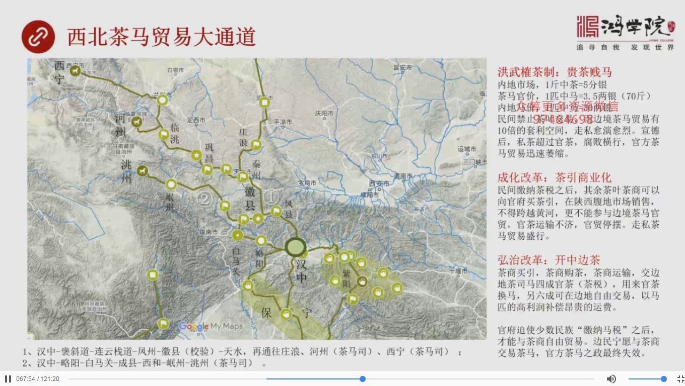

两条线路那么首先说西北线西北的贸易大通道它是从哪走呢它有两条路一条路在地上我用这个白色的一和二标志出来第一条路和第二条路第一条路从汉中都是从汉中出发汉中出发地经过这个当年的包鞋道然后再通过连云站道道达...

<strong>All subtitles</strong>

> 两条线路那么首先说西北线西北的贸易大通道它是从哪走呢它有两条路一条路在地上我用这个白色的一和二标志出来第一条路和第二条路第一条路从汉中都是从
> 汉中出发汉中出发地经过这个当年的包鞋道然后再通过连云站道道达奉献奉献是非常重要的地方经过奉献再到灰线灰线非常重要因为所有的茶你在汉中拿到皮围
> 之后拿到茶饮之后到了灰线要进入闪干了闭精之路要进入干轻地区灰线是闭精之路所以在灰线那一方我得查一下你的你的这个政府皮围和你的茶饮是不是皮牌啊
> 你是不是有加带撕货你的质量是不是有这个区径少量这个问题都在灰线进行教验教验之后好这一路查上就奔向秦州也就是现在的天水市到了天水之后有一路到装
> 了通过装了再到顾原和营川还有一路到宫昌然后到这个河州还有到西宁到这地方进行这个茶马贸易的交换那么在西宁河州和陶州这个地方我都用一个小马批这个
> 标志来替代这指表明他是重要的查斯马查斯马就是官方设立的茶马贸易的重要的牙门之所在第二条线路是从汉中处发走略阳略阳当年是非常重要的贸易重振通过
> 于略阳下一站就经过白马官到达这个到达这个呈现稀和然后最后经过这个民州到达陶州进行交换整个西北的茶马贸易的吧大概经过了三个阶段红武阶段成化改革
> 红质改革三次改革其实主要的思路就是红武那个阶段他是把把查定的特别贵把马定的特别便宜就强制性地跟少数民族换码你比如说内地市长已经查中查只卖五分
> 五分营好你这个内地的然后这个茶马关架你是一批中马换七十斤颜七十斤一批中马换七十斤查折算下来一批码也就才三点五两白营这也太便宜了这实际上是把少
> 数民族这个价格压得太低其实人家是这个这个太亏了实际上中间有三有十倍左右的这种差距这个导致你要关价定得这么低就会导致走私崛起因为大家一看官方定
> 价定得这么低你只要是私人来了随便出一个价捞这个边少数民族就愿意跟跟这个走私犯来交换那官方贸易就搞不了了所以私查迅速超过了观察然后观察制度腐败
> 横行因为中间利人太大官方查码贸易很快就不行了成化改革发现这个问题之后说查业确实要商业化但是呢我们为了不影响边疆坏码商业化是可以就是老百姓除了
> 交的关税交的这个这个查税之外多余的查可以自己卖但是不允许把这查业卖到边关去影响查码贸易那个比价因为政府还是要制定一个非常不合得的价就是商业查
> 只能在内地卖不能过黄河也不能到边疆只能在闪西复地卖当然这套制度显然也是维备经济规律的因为你在边关那话码太合算了你要这个私查一定会用过去这就出
> 现了红质改革到1500几年红质改革就说全面上一话关不了了那怎么办就是你要查商你要负责满引买查引然后你要负责自己收查自己运输到了边关到了这个这
> 个西北边这个查斯马地方你得交你运输来的40%的查业交给官方这相当于查税交税剩下60%你可以自由支配在那当地所以可以随便卖自由贸易然后用这种自
> 由贸易所获得了比较高的利润来贴补你的运输费用当然还有巨大的引力那么政府收40%干嘛他仍然要维持一个官方对换价一个非常高就是对这个查业来说定价
> 非常高把马批定非常低还是要用这个方式来交换那当然少数民族人不干啊他宁愿跟这些自由商人做贸易要核酸的多所以政府就把这个东西当成一种付税就是老百
> 姓在中原交两世你们少数民族藏族这东这些猛族你们得你们得交马批作为税收当然这就导致了这些少数民族抗决抗税就跟官方冲土最后你仍然挡住经济规律也就
> 是这个经济规律就是官府搞的这个交纳马税这个方法行不通了最后整个政府的马正查马正这个体制完全瓦解了好我们再看下一这是西北查马贸易还有西南西南四川地区也有查马贸易

---

### Slide 27

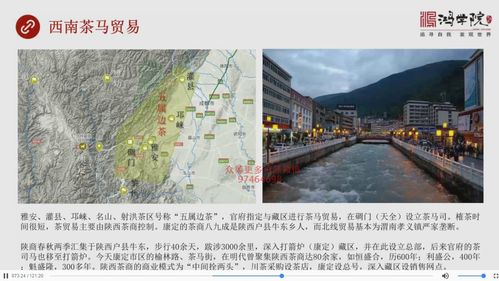

西南查马主要是这个贸易主要是四川南部的四个五个重要的线沿岸贯线穷来名山和涉侯这五个线生产查业叫无数编查在途中我用这个草率色把它换了出来这是无数编查区这里产生产这查业在沿岸进行集中沿岸的附近有一个地方叫...

<strong>All subtitles</strong>

> 西南查马主要是这个贸易主要是四川南部的四个五个重要的线沿岸贯线穷来名山和涉侯这五个线生产查业叫无数编查在途中我用这个草率色把它换了出来这是无
> 数编查区这里产生产这查业在沿岸进行集中沿岸的附近有一个地方叫雕门天权就是现在天权在雕门这个地方设立了查斯马在这里进行交税然后获得研引进行确查
> 管制但是确查也就是官方垄断贸易在四川地区執行了很短几年时间就结束了所以穿查它的查马贸易主要是自由贸易而这种自由贸易主要是掌握在产席上人手中比
> 如说在康定地区康定地区这个查上中间80%都是产席特别是产席互限牛东乡的人所以这个地方牛东乡的人很厉害控制了这个康定的穿查贸易同时四川查贸易一
> 条北线北线基本上被未难效益症的严加锁垄断那么每年到了春秋两季然后闪锡的查商们就全部到互限的牛东到牛东乡集合在那集合之后不行四落天从闪锡牛东乡
> 不行拔射三千多里到达这个打建楼打建楼就是现在的康定以前打建楼这个地方没什么人人家洗手传说是珠亮当时在打建楼这生产宫舰后来正是由于闪伤大量的这
> 个到达打建楼这个地方他们其实绕过了雕门就是不想在官方官方这个地方去经营他们深入葬区来到打建楼这做生意才是康定地区崛起因为这个地区崛起之后大量
> 的葬足的商人都在康定地区来买茶叶大家就不怎么去雕门了所以后来明朝的查斯马也被迫从雕门转移到的康定那么闪锡商人他们的基本经营思路叫商业模式吧是
> 这个中间算两头两头一头是这个五边产杂区贯线穷来雅安设红这些产杂区他们在那儿设立收购战同时在康定设立总号然后他们把自己的分销渠道失路到了葬区其
> 他地方比如说帽工啊道服啊里堂八堂很多地方都有他们的这个行销的渠道销售网点所以在康定这个地方形成了闪锡商人非常密集的一些街道比如说现在我们看到
> 像康定有很多像什么鱼林街呀还有这个很多其他的街道茶马街鱼林路这都是当年闪锡商人经营留下来的这些痕迹有很多闪锡商人的茶铺这个利金600年就是时
> 间历史非常悠久还有什么400年300多年的在明带的时候闪锡厂商在康定居然有80多价值多其实壟断了四川的茶马贸易好我们再看下一这个是从 JIS就是从谷歌地球上来看康定

---

### Slide 28

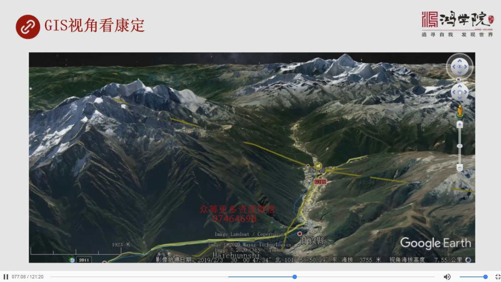

和茶马贸易通道由于视频我们可以做成小视频的做小视频占的空间太大这是一张图片从图片中我们看到这个绿线是我标注的商业贸易通道然后重要的时候我们看到康定它的地势你会发现它它是在一个升高之中两次都是高山其实我...

<strong>All subtitles</strong>

> 和茶马贸易通道由于视频我们可以做成小视频的做小视频占的空间太大这是一张图片从图片中我们看到这个绿线是我标注的商业贸易通道然后重要的时候我们看
> 到康定它的地势你会发现它它是在一个升高之中两次都是高山其实我们在说地理信息系统说不光是要看它的精尾度还有它的海拔高度和周边的地形因为它是个三
> 维立体的一个地理空间而不是一个地点的问题周围的山会影响它的贸易通道因为爬山的成本和通过合流或通过平原或通过山间的山谷那是完全不一样的成本的概
> 念所以要把每一条商业贸易通道搞明白的话一定要看当地的山形地贸和它的交通运输的成本之间的关系我们再看下一那么西南长崴通道我们可以发现它有三条路

---

### Slide 29

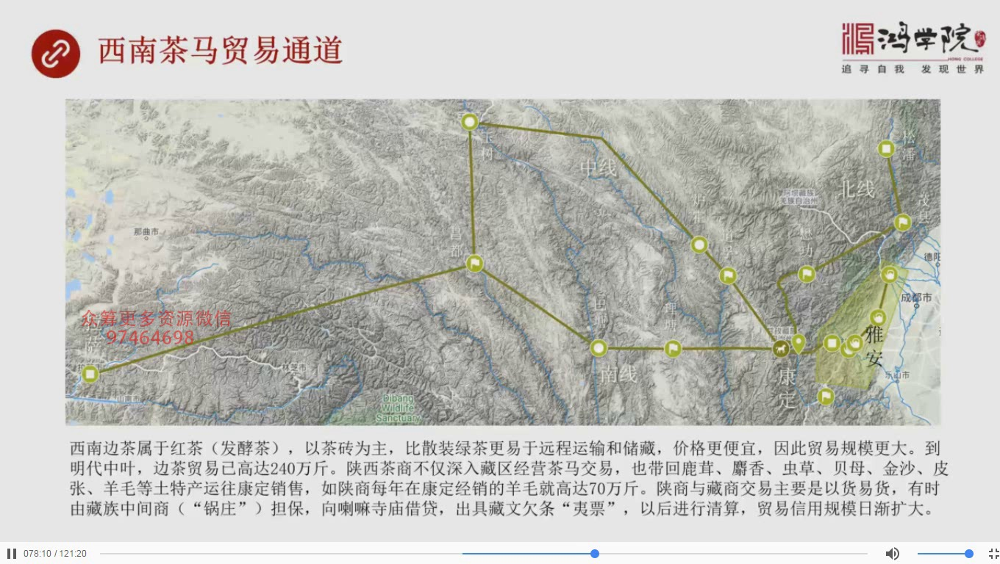

一条路就是南线从康定出发经过李唐八唐到昌都从昌都最后到达拉萨这是南线中线是从康定出发到道福盧霍然后到达玉树从玉树再回到昌都北线北线就是从康定出发经过冒工然后冒险到松汉也就到川西北这个地区进行查码贸易所...

<strong>All subtitles</strong>

> 一条路就是南线从康定出发经过李唐八唐到昌都从昌都最后到达拉萨这是南线中线是从康定出发到道福盧霍然后到达玉树从玉树再回到昌都北线北线就是从康定
> 出发经过冒工然后冒险到松汉也就到川西北这个地区进行查码贸易所以它有三条线那么西南边查跟这个西北边查最大的不一样就是西南边查是红茶区红茶就是发
> 酵茶主要是茶端为主我们知道绿茶是散的散装的茶叶一片一片但是这个西南查是发酵茶红茶是茶端由于茶端能够压得非常紧而且一块一块所以它更方便于运输和
> 仓处而且价格更便宜所以它的贸易规模要大得多非常大特别是照清朝之后就大得不得了那么到您带中业的时候边查提南边查的贸易已经达到240万斤我们知道
> 比那边西北边查要大三倍西北边是7000斤这边是这个240万斤那么闪心商人通过茶马贸易不光是进行茶和马之间的贸易也带回西藏有很多药材像鹿荣、
> 设香重草、被母、金沙还有各种皮毛、羊毛这些东西都很好他们不仅是换马皮换这些药材还有各种皮毛类的这种产品然后运回康定来销售比如说闪商在康定一个
> 地方每一年金销的羊毛高达70万斤这个是个天文数字了这个数量非常大那么闪商跟西藏商人藏商较到他们是怎么打的呢实际上是以货义货他们不是说给多少赢
> 子而是以货义货有的时候需要中间商就是如果双方比如说有一方缺资本不够或者货不够有欠缺对方实际上要给你收账这些收账就必须要有保证人这个保证人一般
> 是由藏商中间的叫郭装郭装这帮人来进行担保郭装什么概念呢就是明朝进行统治的时候比如说给少数民作也派了很多你应该服服的这种各种各样的杂义劳义还有
> 各种各样的比如茶马义舞等等这些义舞就使得很多藏民到他们要这个为民朝政府要提供服务所以就从藏区就打着帐篷就是背着帐篷牵着落土然后带着自己的锅到
> 了像这个茶帽一中心比如说康律附近就建立了很多临时居住区搭习帐篷然后买国造饭然后这个逐渐逐渐就变成了有木炸蓝变成了固定的建筑这个就叫郭装由这些
> 人进行担保担保之后向哪儿见像喇嘛喇嘛妙的去见我们知道四妙永远是最有钱的因为四妙必须要大家要贡献很多财富要不然仰不起这些喇嘛合上像西方的这个天
> 主教罗马教会为什么这么有钱就是因为大家要交十一税呀所以在世界任何地方宗教的四妙都是放败机构很有钱所以是喇嘛妙在提供放败他实际上某种一样类似于
> 银行的功能然后出具的是藏文的欠条这叫一票实际上也是一种票剧这个表明西南茶马贸易已经进入了信用贸易的这样的一个新的发展阶段好我们翻下一那么闪戏茶马贸易总的规模到底有多大能转多少钱

---

### Slide 30

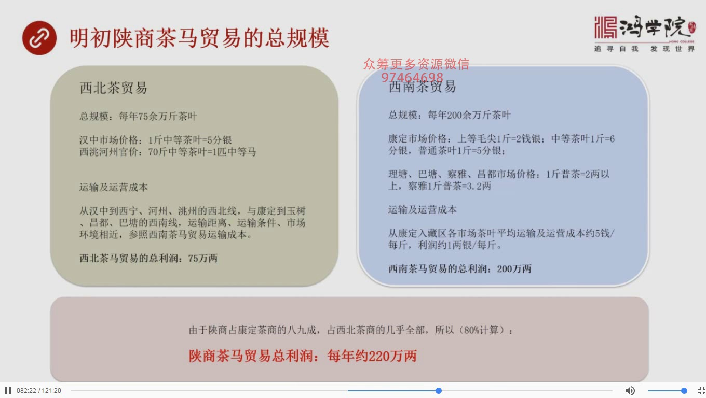

我们把这个总规模画分成西北茶贸易和西南茶贸易两边分着算那么西北茶贸易一年大概是75万斤茶叶这些茶叶它的价格西北地区的价格是多少呢比如说汉中市场价产差区的市场价已经中查中等茶叶的价格是5分5分营那么在西...

<strong>All subtitles</strong>

> 我们把这个总规模画分成西北茶贸易和西南茶贸易两边分着算那么西北茶贸易一年大概是75万斤茶叶这些茶叶它的价格西北地区的价格是多少呢比如说汉中市
> 场价产差区的市场价已经中查中等茶叶的价格是5分5分营那么在西宁逃州和州它的官方这个价格是多少呢就是进行茶马贸易的关价是70斤中等茶叶换一批中
> 等码那么运输成本跟西南区差不多因为我们考虑到汉中到西宁到河州到逃州的西北线和康定到运输到昌都到八堂的西南线运输距离运输条件市场环境都比较相近
> 所以我们用西南线的这个参考价因为不是每个地区都会记录非常相近的运输成本运价还有这个经营费用我们走的评估下来大概你比如说一斤茶叶它的运输的成本
> 最后它能够一斤茶叶靠州运输成本之后能赚多少钱大概能挣一两银子所以在西北茶贸易中间他们的总理人大概是75万两百一西南贸易呢它的总微模是200亿
> 万斤240万斤嘛那么康定市场价就是在康定那个地方茶叶最集中的地方市场价上的矛监查已经是两钱赢子非常贵中等茶叶是一斤6000销售量最大实际上是
> 普通茶叶一般藏名只喝了几普通茶叶一斤大概是5分营那么在里堂八堂茶叶长都这些藏区的茶叶价格多少一斤普通茶叶大概是2200亿以上茶叶到达了一斤普
> 通茶叶达到了3.2200亿的天价靠州运输成本之后我们会发现西南贸易这个茶马贸易的总的利润大概是200多万两所以加的一起再考虑到产业商量大概占
> 中间的80%左右全部贸易额所以它的利润大概一年是220万两百亿好我们再看下一这样的话我们就可以把10亿贸易两十贸易和茶马贸易并在一张图上来看

---

### Slide 31

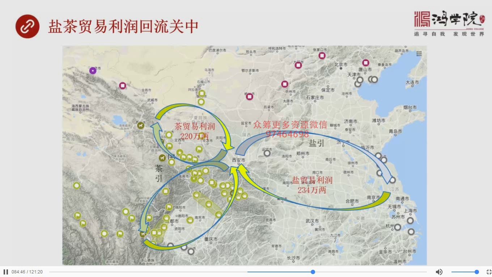

我们知道眼影就是10亿贸易和两十贸易转移圈回来大概能够转234万两百亿西北茶叶贸易和西南茶叶贸易转移圈下来大概能转220万两百亿加在一起大约是460万两百亿之间这些每年获得的数百万两百亿用回观中这将会...

<strong>All subtitles</strong>

> 我们知道眼影就是10亿贸易和两十贸易转移圈回来大概能够转234万两百亿西北茶叶贸易和西南茶叶贸易转移圈下来大概能转220万两百亿加在一起大约
> 是460万两百亿之间这些每年获得的数百万两百亿用回观中这将会极大了刺激观中的经济和贸易发展好我们看下一有了这些钱之后我就可以做更大的买卖这就是棉布贸易

---

### Slide 32

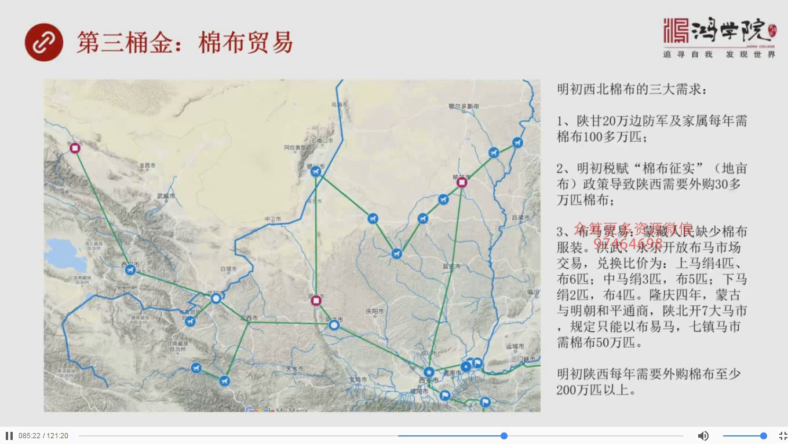

棉布贸易因为跨局更大然后他的他的各种要求的条件更高然后我们来看为什么闪心能够做棉布贸易因为在明朝初年时候西北棉布市场有三个钢性需求第1个钢性需求220万边方军包括他们的家属每年需要棉布至少一百万批第2...

<strong>All subtitles</strong>

> 棉布贸易因为跨局更大然后他的他的各种要求的条件更高然后我们来看为什么闪心能够做棉布贸易因为在明朝初年时候西北棉布市场有三个钢性需求第1个钢性
> 需求220万边方军包括他们的家属每年需要棉布至少一百万批第2个刚进需求的来源是明朝初年周圆章他曾经强行要求所有地方的老百姓都必须要自己众年化
> 自己来支部这叫地母部比如说当时朝廷规定你们家只要有五母帝到十母帝之间有这么多田地就必须要拿一母来众桑一母来这个众年然后自己来访佈不管你自己访
> 不访佈反正你得给我你有这么多田给我交得交这么多部你要自己部房就得到其他地方去买这叫地母部所以这导致了闪心这个地区每年至少需要到外地去採购三十
> 万批棉布闪心自己也访一些线也访一些部然后也众一些棉花但是量不够不能满足军区也不能满足朝廷争税这个需求那么第3个呢就是部马贸易因为这些蒙古、
> 新疆还有西藏宁夏甘肃这些少数民族呢他们缺少棉布的服装因为人家是永务民族没地方去种棉花也没法访现没法支布他们穿的都是皮咬皮衣服这种衣服冬天穿自
> 然是不错但是夏天穿秋天穿春天穿一年四季老穿皮衣服那就很不方便了所以他们也非常渴望能够有漢民族之的这种棉布穿着季舒服又暖和然后又非常经济使用所
> 以这就出现了部马贸易从这个红武勇勒开放茶马贸易这个同时也开放了部马贸易就是可以用布去换马对换比较呢不同时期对换比较不一样到了这个到了这个龙庆
> 就是明朝中期以后蒙古和明朝最后和平通商了这个闪西的北部就开放了四这个开放一系列的七大马市这个七大马市只能以马来换布这个七阵马市大概需要棉布五
> 十万匹所以明朝前中期每年大概需要从外地采购棉布两百万匹以上就是内部他没法生产足够的棉布需要到外地采购两百万匹以上我们再看下夜那么到哪是采购呢到江南因为江南

---

### Slide 33

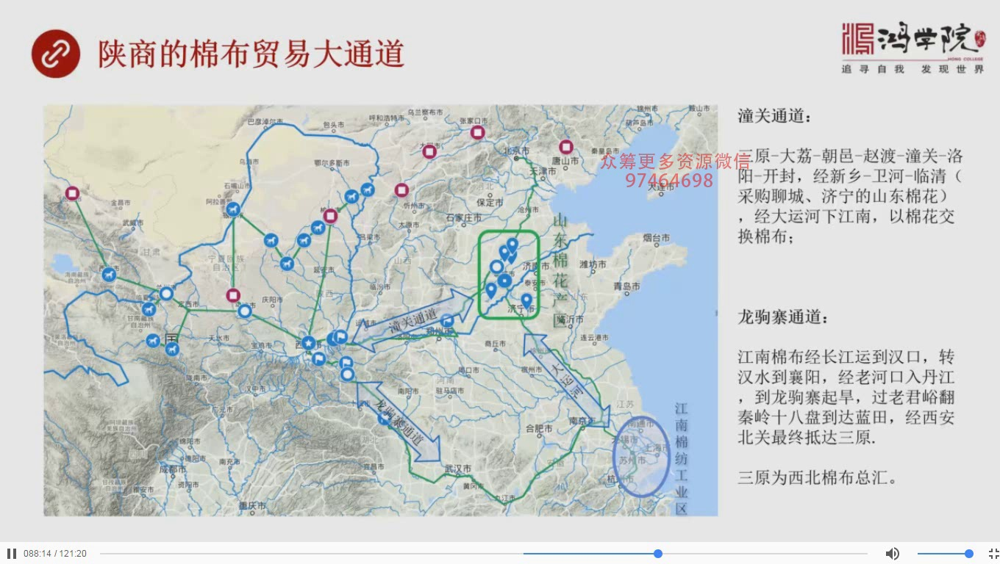

是这个原朝以后一直是中国棉布的生产的基地闪西让人怎么到江南去采购部呢他有两条通道一条是同官通道同官通道是他的出发点是三元从三元经过大力潮艺这个赵度震然后经过同官到洛阳再到开封通过开封到达新疆过黄河到新...

<strong>All subtitles</strong>

> 是这个原朝以后一直是中国棉布的生产的基地闪西让人怎么到江南去采购部呢他有两条通道一条是同官通道同官通道是他的出发点是三元从三元经过大力潮艺这
> 个赵度震然后经过同官到洛阳再到开封通过开封到达新疆过黄河到新疆然后经过为何到达林轻山东林轻也是大运河上一个非常重要的口岸当时是整个中国北方棉
> 布的转运中心林轻附近就是疗成和紧营地区有大量山东的连花山东的棉花产区就在这一代所以闪西商人是在林轻附近采购棉花之后延着大运河南下到达江南另外
> 一条通道是龙居债通道龙居债通道也是闪西棉商经常走的一个大通道那么在江南采购棉布他怎么往回运有一条通道在明朝中期以后越来越越来越吸引大家注意力
> 就是因为他都是水运水运沉门很低嘛江南棉布经过长江水道到达汉口经过汉口转运到了香洋经过汉水到了香洋然后经老河口进入丹江然后到达龙居债从龙居债起
> 汉也就是离开传运变成陀运过老军运翻秦领十八盘到达兰田经过兰田到达西安的北观最后到达最终目的地三远所以三远是整个闪西棉布贸易的这个中心就是棉布
> 贸易的总会就在三远我们看下一那么闪西商人经营的棉布他的贸易的规模和利润到底是多少呢

---

### Slide 34

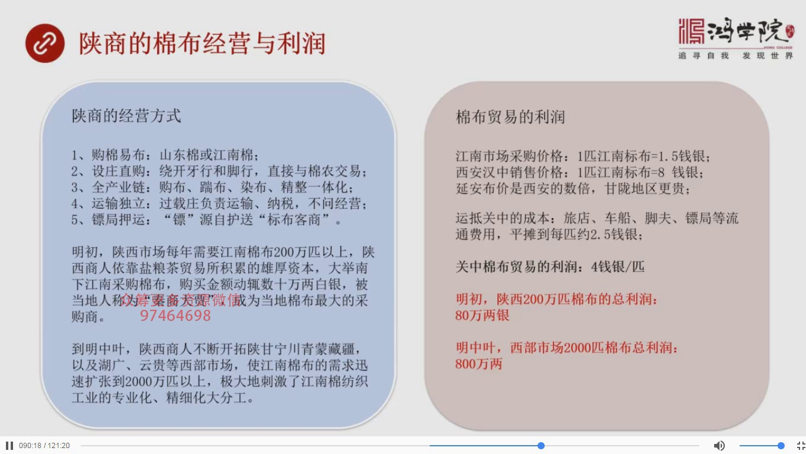

首先我们来看闪伤他的经营方式他们是在江南采格布他有五种方式来经营经营三种主要方式一种事这个构棉意布他在山东采格棉花也可以在江南产棉区采格棉花然后跟当地支部的人进行交换这叫不棉交换这是一种经营方式还一种...

<strong>All subtitles</strong>

> 首先我们来看闪伤他的经营方式他们是在江南采格布他有五种方式来经营经营三种主要方式一种事这个构棉意布他在山东采格棉花也可以在江南产棉区采格棉花
> 然后跟当地支部的人进行交换这叫不棉交换这是一种经营方式还一种是涉装枝构也就是我在那涉了一个采构棉布的这样一个装号然后在那直接向普通老百姓去这
> 个生产棉布的民众去收购重要这种枝构的方式是绕开了江南地区的亚航和脚航直接与棉布商打交道那么亚航脚航实际上是明朝和中国立代把都有这个规矩也就是
> 亚航是属于中间人要在政府要领牌照的所有生意必须要通过亚航做否则的话就不让你做亚航一般是本地的事生或者非常有在朝廷中非常有权有事这些人把持着亚
> 航就是他们赚的是一个稳赚不赔的买卖然后把价格还搞得非常高自己领刃非常非常大又不冒人或风险脚航是当地的一些地平忙或者是很有当地的这个地头蛇搞的
> 脚航就是负责当地运输的闪心上人到了江南你也得靠亚航和脚航否则你就不能够跟当地的这个棉布商棉布的这个农民直接打交道怎么办闪心上人就是绕开了亚航
> 和脚航直接建枝构的这种步装收购棉布这当然会跟当地人产生中手但是老亲人估计打架是很厉害所以当地人还真没有办法所以闪伤在江南搞了这个枝构直销非常
> 厉害第三种方式全产业链也就是不仅是在当地采个物采个物之后还要踹步踹步什么概念呢就是这个步都比较松软还没有染色比较松软踹步就是要用一个千金重大
> 时候压着它然后有人要在上面踩的时候不断的踹最后把棉布给压紧压实有光泽不容易起灰不容易粘灰等等然后再进行染色然后染完色之后再进行精整把它按照不
> 同地区的尺寸要求按照不同的包装方式来进行精整这就是全产业链条第四种就是经营方式就是经销和运输分开就是运输独立这就是过载装过载装是专门负责运输
> 的然后它负责运输负责到各个经过各个水路码头说要交税然后它是不问经营的我只是我只是承包运输这一件事所以运输的独立其实跟意大利翻月二倍四山意大利
> 商人在中世纪干那事是一样的他有罗马对也是专门的负责运输的中国也出现了就是闪商出现的过载装跟当年文艺复兴时期他们是一个道理第五标击压送我们知道
> 标举这个标从哪来的实际上是源于标课标布的课商标布是江南产部的一种一种步那么凡是经营这种标布的课商主要是闪商人、
> 闪商人这些人就被称之为标课所以为他们进行压运的这些武装压运的集团嘛就被称为标局那么最初就在明朝初夜的时候闪西市场每年大概需要购买江南棉部两百
> 万批以上那么闪商人又在西部市场上不断的扩大商业贸易的领域所以他们的购买的资本量非常大每次购买动作就是几十万两百亿至少也是上万两那涉及到都是百
> 万批以上的几十万批百万批的大买卖所以被当年称之为秦商大股很有钱那么到了明朝中夜的时候闪西商人在西北在西部进行大扩张开脱了向闪西甘肃影响注意当
> 时闪干凌都算闪西包括四川青海还有内蒙外蒙新疆西藏包括湖南湖北云贵都是闪西商人不断开脱了市场所以这些市场被他占领之后见面贸易局点之后对江南棉部
> 的续续量大增从两百万批上升到两千万批上升了一个数量机正是由于闪西商人对江南的大规模采购属于下定单生产使得江南的仿值工业进行了专业化的升级变成
> 了精细化分工所以极大了刺激了中国最重要的一个制造业的这个生产基地的他的生产和发跃那么棉部贸易他的总理论是多少呢江南市场我们要采购一匹布江南的
> 标布一匹多少钱1.5钱银子那么在西安和汉中销售价格是多少一匹江南的标布大概是八钱就是1.5和八中间就差了好几倍那么在延安更偏的地方延安的部价
> 是西安的数倍延安比西安要贵得多干冷地区那就更贵那么从这个从江南运输过来他的运输成本运底观动着这个观众地区的成本包括旅店费车传费脚服的费用标局
> 的互送费用等等这些流通用家在起平坦到美皮部上大约是美皮部2.5钱银子这他的运输成本所以观中棉部的贸易的利润大概是美皮能转4000银4000银
> 子以民初闪锡200万品棉部的总利润来计算的话大概是80万两百银但是到了明朝中液他这个销售的总规模达到2000万品白这个棉部之后他的总的利润就
> 扩张到800万800万两主意啊这就是棉部贸易跟我们刚刚所说的茶马贸易凉食贸易跟其他的贸易最大的不同就是他是制造业制造业可以大规模的扩张他的生
> 产力扩张生产的量凉食不行凉食还有上线茶叶也重不出来其他贸易发展一定程度都有上线但制造业可以十倍以上的增长这就是为什么棉部贸易后来非常重要他是
> 整个远程贸易中最重要的一块就是棉部因为他的生产量可以大规模扩张生产效率可以大量的扩张我们再看下液这样一来由于几种贸易迭达在一起他就使得整个西北的贸易网络

---

### Slide 35

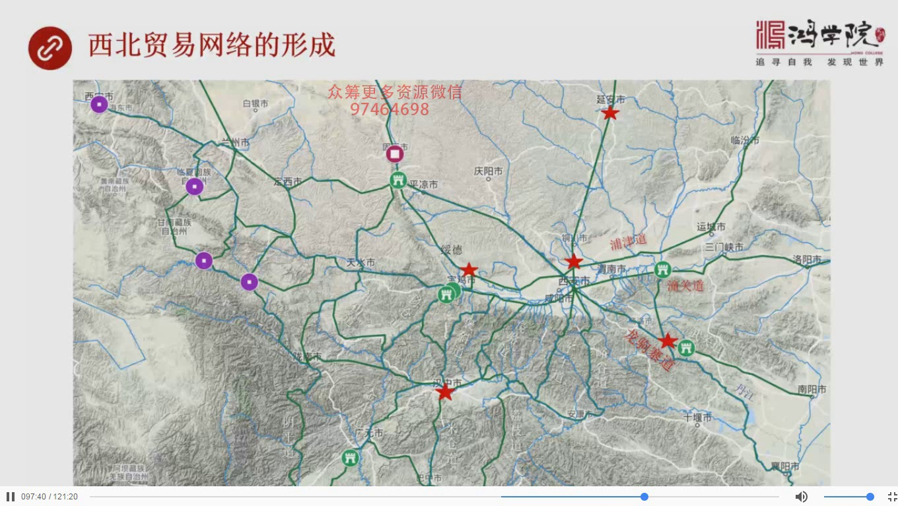

成形了这个贸易网络我们来看他其实是中心地区是在三元和津洋就在这张图了红武星的中心他的东西两亿西侧是奉朽东边是龙居战南北之脸北边是延安南边是汉中这样就形成了一个实资价交叉的贸易网络除了这个贸易网络之后之...

<strong>All subtitles</strong>

> 成形了这个贸易网络我们来看他其实是中心地区是在三元和津洋就在这张图了红武星的中心他的东西两亿西侧是奉朽东边是龙居战南北之脸北边是延安南边是汉
> 中这样就形成了一个实资价交叉的贸易网络除了这个贸易网络之后之外还有大量的绿色这些代表了商业贸易通道你比如说从四川地区进入观中有各种立场各种通
> 道比如说音频道是从江游通过龙南到达汉中地区还有金牛道是从广源到达汉中美藏道是从八中到达汉中历史道是从达州到达这个也是汉中地区吧然后从汉中地区
> 翻月秦领到达西安又有好几条道比如说七山道在最左侧沉苍道还有包鞋道躺落道子舞道遇古道这个是翻月秦领的路线那么闪西网东进行这个跟东南方向和东部进
> 行大贸易呢大规模贸易又有三条通道一条就是最难端的这个就是龙居站龙居站这条通道非常重要后来成为一条进入观中地区的主要干线因为他一直走单江可以到
> 龙居站然后到达龙居站红武行这个地方就在武官的西侧他既可以走蓝田道达西安和三远也可以向北道达同官再从同官道达西安那么这条这条路就是龙居站这条路
> 成了闪西最主要的条通道通向东南贸易在龙居站崛起之前是同官道最重要同官道主要是陆陆要从西安经过陀对经过这个罗马运输通过同官之后要到达洛杨经过洛
> 杨到达开封才能做传所以这条路的路运距离比较长那么还一条线就叫金普官普京官普京官当时是在这个黄河边上普京这个就是当年的普京道是从这个大力的东策
> 朝议靠近黄河这一策这是古代的这个普京官过了普京安就是闪西了他是通往闪西的一条贸易通道还有从这个三远向北经过这个陆桥镇同向盐安同向这个余林这个
> 方向这是军粮运出通道还有向西北方向到平粮平粮之后向北可以到顾原然后到营川这是去这个宁夏然后他再往西呢可以到达定西和兰州只笨西宁至到清海还有从
> 这个奉墙出发经过天水到达这个到达这个核洲陶州还有这个民州这三个前子色的边关除此之外还有大量的一些相关的通道所以我们可以看到由于西北地区特别是
> 以闪西为中心的商业贸易干道的形成他使得整个这个贸易出现了网络化网格化的趋势每个贸易节点都发挥自己独特的功能使得整个这套体系能够非常有效的整合
> 各种资源让他变得变成了一种政法会继致越来越多的可以获得资源是自己变得越来越强大这就是西北贸易网络的这种形成我们再看下野由于贸易网络形成之后就形成了大量的专业施政或者是商业承认

---

### Slide 36

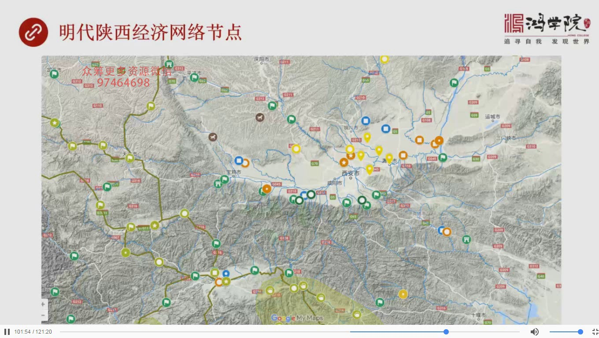

在途中我画出了其中一部分其中在关中平原的中部有两个五角形这个橙色狐角形靠南边这个是金仰靠北边这个是三元这两个地方是整个闪戏的经济贸易金融中心而不是西安河鲜仰当年的西安还更像一个军事重阵它的政治功能更强...

<strong>All subtitles</strong>

> 在途中我画出了其中一部分其中在关中平原的中部有两个五角形这个橙色狐角形靠南边这个是金仰靠北边这个是三元这两个地方是整个闪戏的经济贸易金融中心
> 而不是西安河鲜仰当年的西安还更像一个军事重阵它的政治功能更强而商业贸易不如三元和金仰除了这两地区之外周边的黄色的这些这些点是代表着是农业农业
> 经营的这种地区还有一些其他的地区是属于农产品的转运基地也是用黄色如果我们来看深绿色呢深绿色这些这些节点代表着它是木材交易中心然后这种潜绿色草
> 绿色代表这是茶叶的贸易中心或者叫贸易节点那么其他的普通绿色代表的是它是贸易干线上的重要的中短节点然后这种赫色的代表的画着小马的这一方代表它是
> 寻目中心它有大量的马皮萝萝藏还有这种落土可以提供这个运输服务蓝色的呢它是一种制造就手工制造业中心你比如说药州的陶瓷是属于闪吸的陶瓷中心还有皮
> 革制造中心还有烟火制造中心在谱城这些都是属于制造偏制造方面的好我们再看下一好现在说一下观中地区的它的重要的商贸中心

---

### Slide 37

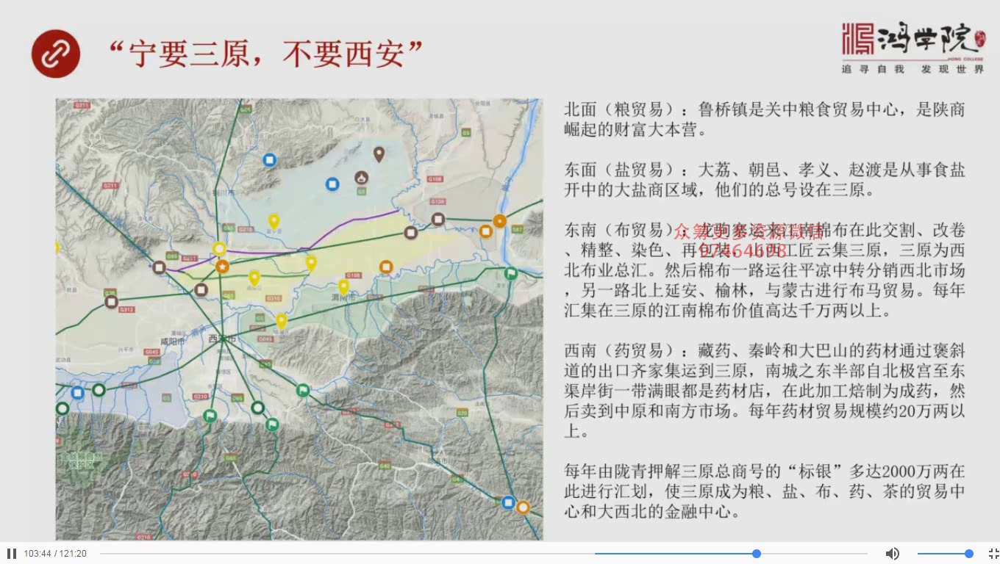

那么观中人有一句说法叫宁耀三元不要西安在明清时代三月的重要性要超过了西安三月就是我们这张图上看到了这个成色无角形的地方这个地方非常重要它的交通条件它所处的地理区位都非常好我们看它的北侧它的北侧就是乳乔...

<strong>All subtitles</strong>

> 那么观中人有一句说法叫宁耀三元不要西安在明清时代三月的重要性要超过了西安三月就是我们这张图上看到了这个成色无角形的地方这个地方非常重要它的交
> 通条件它所处的地理区位都非常好我们看它的北侧它的北侧就是乳乔镇乳乔镇我们说过这是观中粮食贸易中心也是闪伤崛起的财富大本营它就是靠粮食贸易发家
> 的那么它的东面呢东面是盐贸易也就是东边是正白区灌盖的这些地方这6个线都是靠粮食和盐的贸易在江南在杨州发的大财重荣重要的大盐商这些撞了钱之后驻
> 驻亚闪西的盐商主要集中在这个三元以东的地区就是因为他们究竟从那个地方出同官下杨州这些人最早而且规模做得最大所以盐商都集中在这个地区这些盐商他
> 们把总号都涉得三元东南方向东南方向自然就是龙居债龙居债主要是运缅布这条线所以江南的缅布是通过龙居债翻月秦领到达经过蓝田然后经过这个西安到达了
> 到达了三元那么这些这些缅布到达了三元之后要进行深加工缅布首先要完成交格然后要进行深加工比如说改卷改卷就是销售到不同地区的缅布的质量还有它的它
> 的宽服它的幅度都不一样所以在这要重新包装还有精整有些需要进行这个拆布染色还有塞包装等等山西工匠是最擅长于做这个的所以山西人大量云基在三元在三
> 元有一条街道叫山西街不抓现在还有没有立上是有那么山西工匠够用了这个除了山西工匠还够用了本地大量的工匠专门做布料加工深加工然后在这加工完之后它
> 的布料一路是通向平凉在平凉作为中短然后分销西北市场还有一路呢是通向向北通向延安和余林与蒙古进行不满交易所以每年集中在三元的江南眠布了货值高达
> 上千万两百亿就是越来越大这规模那么西南我们再看三元这个城市的西南它主要是靠不贸易发财是靠药贸易这个西南就是从秦岭和从西藏过来的这种藏药秦岭和
> 大巴山的这种山药材通过包鞋骨运出来包鞋到运出来之后包鞋到出口那个地方就是秦岭就是秦岭就是秦岭叫秦岭那个地方成了主要的山获了贸易集赛中心从秦岭
> 岭秦岭岭往三元运正好是从西南方向运过来所以在三元的西南这个城市的西南侧集中了大量的药垫这个它在南城这一侧吧集上大量要垫所有的要拿到这个南城三
> 元的南城秦岭加工然后秦陪制把它这个制成一种成药然后卖到中原和南方市场所以对药材的加工药材的这个背质再加上它的运输它的起点都是在三元然后每年药
> 材贸易的规模达到了20万两百亿以上另外从这个龙青这个青海啊西藏这地方运过来的标赢就是他们在三元以三元为总号这些商家在那边赚了大钱也马不马茶马
> 运这个赚来大钱之后最后都是运到三元来进行总会每年运到三元的标赢各个地方各路这个商号的标赢多达2千多万两百亿在三元进行会华进行结算清算会华所以
> 是三元成为两岩不药茶还有金融活动的中心呢所以这是一个贸易中心同时又是个金融中心这就是为什么三元非常非常的重要闪心人说三元比西安都重要在当年说
> 了就是这个道理我们再看下一好下一页我们讲到是金仰这也我们讲是金仰金仰在明朝初年时候他的繁华程度还赶不上三元

---

### Slide 38

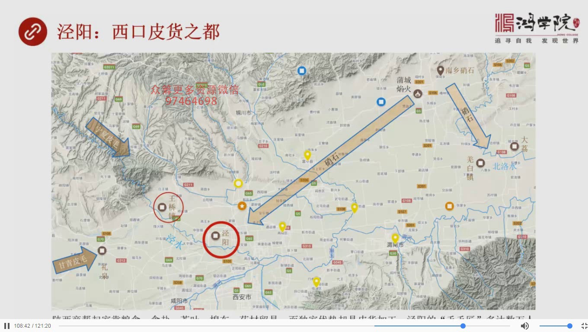

为什么呢因为金仰他当时最主要的发展的方向是皮货那么闪心上人起家他靠粮食靠食言靠茶叶靠面部靠药材但是这些东西其他地方也可以搞真正是他跟其他地方所有地方都不一样是他的皮货加工皮货加工是闪心上人最独特的一个...

<strong>All subtitles</strong>

> 为什么呢因为金仰他当时最主要的发展的方向是皮货那么闪心上人起家他靠粮食靠食言靠茶叶靠面部靠药材但是这些东西其他地方也可以搞真正是他跟其他地方
> 所有地方都不一样是他的皮货加工皮货加工是闪心上人最独特的一个优势也是成其他半闭江山的一个非常强大的一个商业贸易的这么一个行业那么这个皮货加工
> 为什么在金仰实际上他起源是在这个王朝镇王朝镇之我们在旁边画的图中画了一个红圈王朝镇就靠近郑国区的取口了主要我们来看王朝镇这个地方你要想发展皮
> 货加工最主要的需要具有三个条件第一是要有皮毛第二要有水因为它要漂洗第三要有消失进行柔制那么王朝镇这个地方我们可以看到从营下过来经过金水运输过
> 来金水就可以通行了到王朝镇营下过来的皮毛可以顺利到达那么从甘青甘苏和青海过来的皮毛也是首先到达王朝镇所以这个地方发展发展这个皮货加工也非常好
> 他有靠近金水好他就具有了两个条件第三条件呢消失消失的生产中心是在南湘也就在普城的东北方在这里我这画了一下南湘主要出产消失消失对于柔制皮责非常
> 重要因为生皮吧中间有很多教育人但白来有很多分子之类的你要想把它搞成成熟了这种这种架工程柔制成成熟的这种皮革要防这个防磨擦防剪防研防各种各样的
> 腐蚀你需要对它进行消化就是要把它柔制好这个需要原材料就是消失那么消失从南湘运过来运到王朝镇距离也是比较近的所以这地方先发生起来了后来这个皮革
> 加工中心越来越转向金洋金洋的定位是更好好除此之外我们看到后来这个闪锡的皮革加工中心有一部分像像这个锡签到了这个李全有一部分像东签到了这个大力
> 和腔白镇我们看一下这个不管是李全还是腔白镇和大力它都是靠近水源的大力和腔白镇这块东测它是靠近北洛水李全这个镇它其实是在精水的附近所以它们既可
> 以得到水源又可以得到皮毛同时还能进行这个消失的这个供应也非常方便这些地方就是皮货加工中心另外我们看南湘这个地方生产消失它附近的横层为什么是中
> 国烟火的制造中心历代这个烟火都是横层非常有名三大烟烟花就是因为横层离消失供应非常近一销二皇三木探嘛这是制造火药的基本原材料后来在金洋这个地区
> 在明朝的时候它就形成了整个稀口皮货的制造中心所以在金洋顾用了毛毛酱就是专门生产皮革加工的这帮人达到了数万人之多所以金洋的它的起步是靠皮货加工
> 后来越来越发展状态后来有加工茶叶那知道明朝后期和清朝它变成茶叶中心和变成了这个其他贸易中心好我们再看下眼通过我们这堂课的讲床的内容我们我们采取的方式是结取中间的实验段就是1368到1492

---

### Slide 39

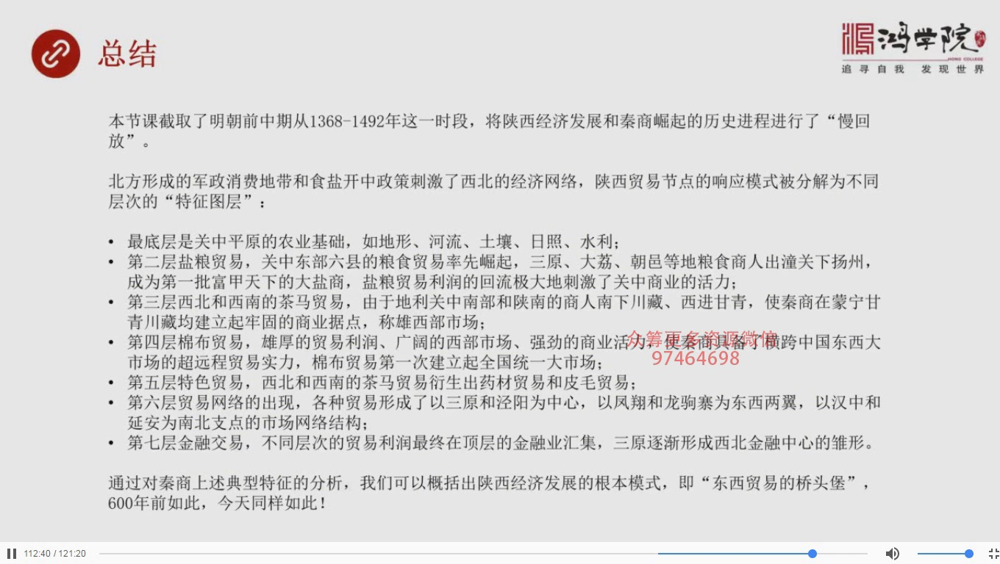

然后将闪西经济发展和秦商的崛起这个整个历史进程进行了满回放满放在这个过程中我们仔细观察仔细去考虑这中间有哪些典型的特征能够被抓取其实我们可以看到我们一开始讲的方法论中间提到的什么时候外部刺激整个经济网...

<strong>All subtitles</strong>

> 然后将闪西经济发展和秦商的崛起这个整个历史进程进行了满回放满放在这个过程中我们仔细观察仔细去考虑这中间有哪些典型的特征能够被抓取其实我们可以
> 看到我们一开始讲的方法论中间提到的什么时候外部刺激整个经济网络的冲击这个刺激来源哪就是北方形成的军政消费地带和国家政策形成了实验开中制这都是
> 外部的经济刺激这种刺激刺激了整个大西北的经济网络而在这个经济网络中的每一个城市都是一个节点这些节点的享用了模式我们要对它进行分解把它分解成不
> 同层次的若干层的特征图特征图层也就是每一个城这个地图层都代表一个特征探测器在这个特征探测上我专门捕捉历史信息或者大数据中间某一个我需要和我觉
> 得有必要去捕捉的这种信息然后把它提远成典型的特征然后再把若干层的特征进行组合来寻找它的模式那么最底层自然是关中平原的农业基础比如地形河流土壤
> 日照水利这是它的自然比赋这层是底层在这个底层之上往上叠加那第一层叠加的就是所谓第二层是什么呢盐良貌义关中东部的6个线两是貌义率先崛起所以三元
> 大力潮艺这些地方的两是商人出童观下洋周成为第一批负甲天下的大延伤盐良貌义的利润回流又极大的刺激了关中整个这个地区的商业的活力这就带来了第三层
> 再叠加一层第三层就是西北和西南方向的茶马貌义由于这个地利的原因关中南部和闪闪难的商人他们南下传葬习近干清时晴商在这个蒙古银下干素清海四川西藏
> 都建立起了劳顾的商业俱典所以闪伤能够称熊西部市场好再往上叠加一层就是棉部贸易有了熊后的贸易利润然后有了广阔的西部市场然后又有强硬的商业活力就
> 是这晴商具备了横跨整个中国东西部地区的远程贸易这种实力而且是超远程贸易因为你以前做茶马贸易只是从西北进一步往西走的西宁你现在要把生意要做到从
> 上海地区横跨中国东西部到达闪西观中地区再往西部推一直推到干素加预官是推到新疆这个横跨的距离就太大了这叫超远程贸易你要没有熊后的贸易实力你要没
> 有管过的西部市场你要没有强硬商业活力这事儿玩不转所以正式由于有了前三层的激烈采使的第四层的棉部贸易可以开展而棉部贸易又可以使生产规模就是棉部
> 生产规模可以大规模的放大可以上一个数量极所以使得棉部贸易成了后后来的这个主要远程贸易的主要支柱所以正式棉部贸易真正的打通了全国市场形成了全国
> 统一市场这是第一次由同样一帮人建立起来一个全国统一市场制定一套统一的市场标准就是变成了市场的组织者然后再次再叠加一层特色贸易由于西南和西北的
> 各种贸易比如是茶马贸易衍生出了新的贸易生动比如说药材贸易其实就是再跟藏民再做这个茶马贸易同时还可以顺道把西藏的一些藏药什么重草之类的运回来卖
> 所以这就衍生出来了专业性的贸易那么这就使得贸易的品种变得多种多样除了这个之外还有皮毛皮毛其实也是也是这个茶马贸易中衍生出来了那么再往上一层就
> 是第六层第六层什么呢由于这么多个贸易品种和这么多层贸易使得贸易网络用线出来了主要我们在这可以用网络这次用线那么这种贸易网络一旦用线出来了之后
> 他就会形成一个网格式的结构这个结构就是以三元和津洋为中心奉强和龙鸡寨为东西两亿汉中和盐安为南北之典这就形成了市场的网络结构然后再仔细上再叠加
> 一层就是津荣层津荣交易开始出现了因为所有底下不同层次的这个贸易的利润最后会云基造顶层进行津荣交易所以三元最后逐渐成了整个大西北的津荣中心已经
> 出现了出现好通过对这几层的特征探测对这些特征进行分析我们会发现闪锡它的经济发展跟本模是什么它一定是贸易的调特宝东西贸易的调特宝在过去是由牧民
> 族和汉民族或者叫由牧经济和农业经济之间的调特宝五百年前六百年前是这样今天同样是这样只不过今天我们把指头放得更大它是亚洲和欧洲之间面向大西就是
> 面向这个欧亚道路纵深的面向这个大西部的这样的一种调特宝所以我们通过历史的观察你会发现它的过去是这样现在是这样未来的根本发展之路也是这样就是一
> 定要面向大西部开发一定要面向欧亚道路的纵深去发展只要你不发展西部贸易闪锡面向东部它就永远落后因为它的地理条件决定了它靠近沿海太远每个省都比它
> 做得更好它的成本比所有人都更高它是如何发展的但是只要面向西部发展贸易那就没人能超过它因为它地理位置最佳它的成本最低而且最有历史的激烈所以整个
> 这个闪锡地区它的发展了这种基本的模式我们可以通过的这些分析没层的这种分析会最终实别出它的经济发展的这种模式的根本之道就是一定要做东西贸易的调
> 特宝这是它的最重要的一个经济发展之路好我们再看下一下一页就是这堂课我所读的一些书这些书底下

---

### Slide 40

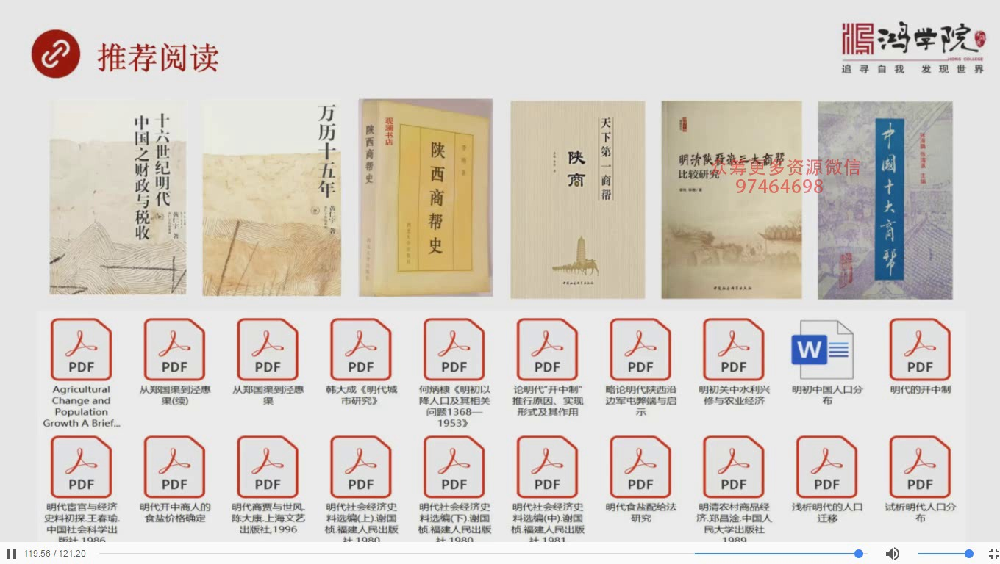

这些书各有不同的特点你比如说万里十五年它可能讲是明朝整体的财政制度黄人宇的中国财政和税收这个书主要讲是明朝的财政这方面的特定这样的一种制度税收等等这是比较宏观的还有包括闪伤专门将闪伤了一些书这些书就比...

<strong>All subtitles</strong>

> 这些书各有不同的特点你比如说万里十五年它可能讲是明朝整体的财政制度黄人宇的中国财政和税收这个书主要讲是明朝的财政这方面的特定这样的一种制度税
> 收等等这是比较宏观的还有包括闪伤专门将闪伤了一些书这些书就比较聚焦于闪伤是怎么崛起的一些聚体的信息底下那是一些文章这些文章就重点的就是讨论了
> 我刚刚所说的一些聚体话题比如说正国区它的灌盖面积到底有多大比如说它的明带的城市它是怎么发展的还有明带的开中置它这个盐量贸易这个开中置到底执行
> 怎么样还有军团等等每个文章是聚焦于中间的一个特殊的专业领域所以我把这些文章中间的一部分还有书记的看过书记的一部分作为推荐阅读列在这里大家可以
> 有兴趣的话可以参考我们今天这个课主要就讲这个明清五百年十大伤邦崛起的情商部分以后我们再讲这个事伤邦的其他部分今天我们的课就上到这里谢谢大家

---

### Slide 41

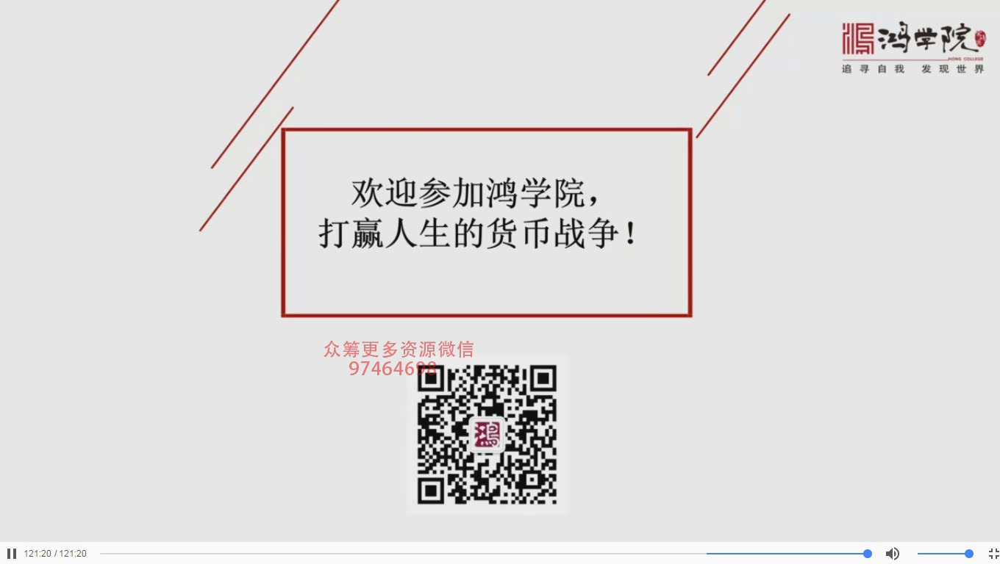

<strong>All subtitles</strong>

---
