# 核心课视频-55石油与病毒：全球市场的黑风双煞 — Slide Notes

> **来源**：鸿学院核心课程  
> **幻灯片**：20 张

---

### Slide 1

今天我們講核心課程的第五十五講全球市場的黑風雙上石油與病毒這個話題實際上是我們在3月14號週六直播課這是一節公開課所講的主要內容也就是回顧整個在3月9號到3月13號這個交易周吧發生的全球經濟是讓中大的突變我們這堂課加入了圖表加入了很多解釋所以這堂課是作為我們內堂公開課的一個補充現在我們看第一頁在這次...

<strong>Cleaned narration</strong>

> 今天我們講核心課程的第五十五講全球市場的黑風雙上石油與病毒這個話題實際上是我們在3月14號週六直播課這是一節公開課所講的主要內容也就是回顧整
> 個在3月9號到3月13號這個交易周吧發生的全球經濟是讓中大的突變我們這堂課加入了圖表加入了很多解釋所以這堂課是作為我們內堂公開課的一個補充現在我們看第一頁在這次全球股市的暴跡之中

---

### Slide 2

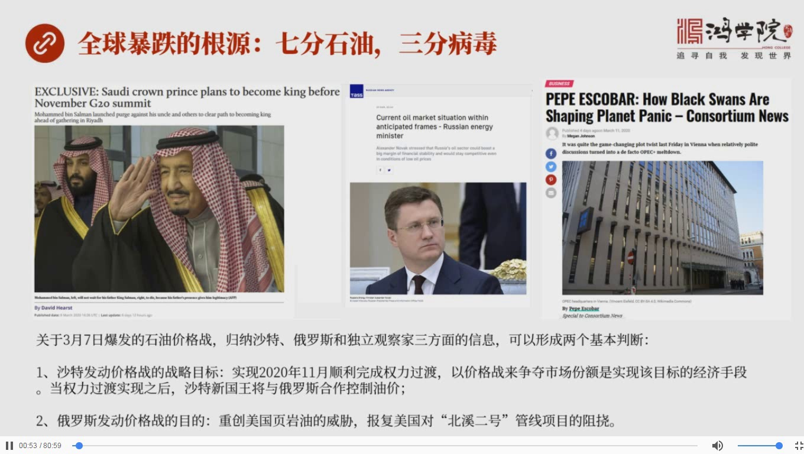

我覺得有兩個重要的原因一個是石油一個是病毒而且這兩者之間我覺得應該是七分石油三分病毒就是在整個上一週的暴跌航行之中那麼如果我們來看整個這個星期全球發生了些什麼情況我們做一個詳細的分析然後再來看為什麼我們說石油是導致整個一個交易周整個市場大幅波動的大幅震盪的一個根本原因首先我們來看在3月7號爆發了石油...

<strong>Cleaned narration</strong>

> 我覺得有兩個重要的原因一個是石油一個是病毒而且這兩者之間我覺得應該是七分石油三分病毒就是在整個上一週的暴跌航行之中那麼如果我們來看整個這個星
> 期全球發生了些什麼情況我們做一個詳細的分析然後再來看為什麼我們說石油是導致整個一個交易周整個市場大幅波動的大幅震盪的一個根本原因首先我們來看
> 在3月7號爆發了石油站那麼3月7號爆發了石油站如果我們歸納幾個方面的信息也就是從沙特方面傳出的信息從俄羅斯傳出的信息以及一些第三方的公開的披
> 露一些信息我們可以做一些分析所以我這裡以這三篇文章作為一個代表當然這後續還睡到其他更多的信息來源那麼我們可以看出我們可以得出幾個基本判斷首先
> 沙特沙特發動的這場價格戰就是石油價格戰它的主要戰略目標是什麼其實我們可以看到在3月6號俄羅斯和沙特在進行連續不斷的談判直到這個談判最後破裂其
> 實在3月6號以前前後幾天沙特還發生了些很多國內政治方面的動盪那麼根據我們看到的這些信息來源我們基本上可以說沙特現在準備執政的這個王處看來是想
> 在他父親身體還比較健康的時候提前接班也就是有可能會在2020年11月份在沙特要召開OPAC會議可能是希望在這個時間點順利完成全力交接當然由於
> 沙特現在經濟中央跨包括對外的政策還有很多國際上的影響對於現在這個王處來說並不是十分有利所以他非常希望如果我要搶在年底之前做好接班準備的話那就
> 非得需要有一些比較好的政績那麼從經濟角度來說就是他必須要把經濟增長率給提上去因為現在沙特經濟增長0.4%太低那麼沙特GDP中50%靠石油所以
> 從這點來看沙特除了讓石油的份額擴大之外沒有更好的選擇就油價來說當今世界經濟越來越疲軟各國都有可能陷入衰退現在新冠的預期又這麼嚴重所以沙特除了
> 強戰市場份額他不能指望油價能夠大幅提升消費不足需求不夠這是沙特發動石油價格戰的戰略性目標也就是為了完成2020年11月份順利完成這個權力的過
> 度這是他的戰略目標那麼他以價格戰來搶奪比如說俄羅斯在歐洲的原油市場這只是一個手段他不是目的他真正目的是為了服務於政治目的所以當這個權力交接完
> 成之後我認為沙特的這個新國王如果他能順利計位的話他仍然會跟俄羅斯練習手來控制油價因為這對他對沙特來說對俄羅斯來說都是有好處的所以我們需要正確
> 的理解他的戰略意圖那麼從俄羅斯方面來看俄羅斯的目的是什麼俄羅斯主要目的是為了利用這次機會也就是石油價格從去世來看他確實是在下跌的由於疫情由於
> 這個經濟疲軟導致對石油的需求不足所以他的價格下跌是俄羅斯單方面無法阻止的既然這樣我們所信利用這樣一次歷史性的機遇能夠重創甚至跟除美國的研究的
> 威脅這不是變壞是為好事嗎所以俄羅斯是想利用這次機會來進行一次戰略性的博弈正去把這個業業由這個新行業惡殺在遙難中主要原因是業業生產成本原比俄羅
> 斯和沙特要高除此之外還有一層目的是為了報復美國對於北西二號項目的組繞因為俄羅斯希望北西二號通過北西二號能夠把他們能源石油天然氣能夠更好的像歐
> 洲出口實際上是為了鞏固他在歐洲的市場份額那麼美國對這個事情長期打壓使得俄羅斯也想利用這個機會來收拾一下美國所以我們可以看到沙特和俄羅斯他們都
> 有共同的打壓油價的這樣一種想法但是出於不同的目的那麼這件事情可能會持續一段時間也就是一種惡性的這種放量生產石油這種現象但是這個過程不會永遠持
> 續當沙特內部的政治穩定了權力就完成了當俄羅斯起到了或者說他能夠看到他的目標實現了相當的部分那麼這兩方就會重新收手聯合起來再來管控全球石油市場
> ...

---

### Slide 3

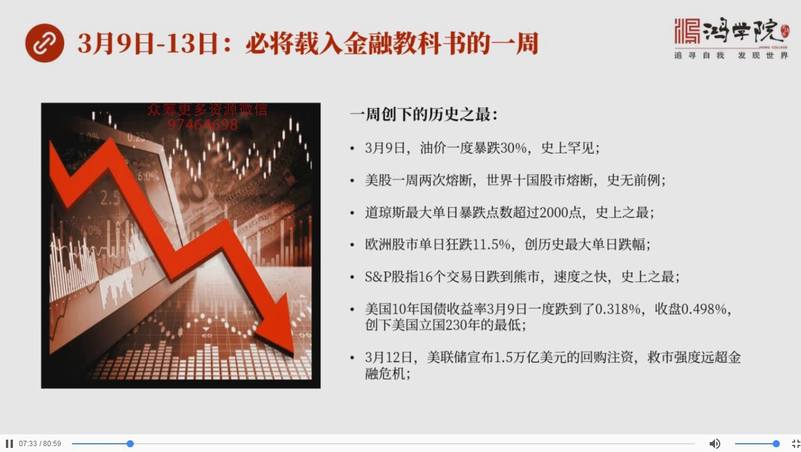

油價爆跌油價爆跌這個事情是直接導致3月9號到13號這一個交易州出現全球股市全球金融市場的大混亂我稱之為是這州必將載入史測會成為金融教科書未來的一個經典的教材這是一個非常重要的戰力所以我們非常需要仔細地去分析這個交易州中所發生的一些細節問題只有你把細節看清楚了你才知道整個市場運作了基本規律首先在這一州...

<strong>Cleaned narration</strong>

> 油價爆跌油價爆跌這個事情是直接導致3月9號到13號這一個交易州出現全球股市全球金融市場的大混亂我稱之為是這州必將載入史測會成為金融教科書未來
> 的一個經典的教材這是一個非常重要的戰力所以我們非常需要仔細地去分析這個交易州中所發生的一些細節問題只有你把細節看清楚了你才知道整個市場運作了
> 基本規律首先在這一州中我們看到它的動盪是非常強烈的創下了許多歷史之罪比如說3月9號石油價格原油價格1度爆跌到30%也就是歷史上非常罕見第二點
> 梅古一州容斷了兩次這也是前所未有的梅古以前容斷過出現過一次四個多年之後上次是98年四個這麼多年以後這回出現而且是一州出現兩次是相當相當罕見的
> 那麼世界全球其他國家的股市實國股市也跌到了地坪版全部都容斷了這也是15前例的還有就是道窮斯最大單日爆跌的幅度達到了2000點這也是創下了歷史
> 之罪我們看到整個全州每天上下震盪上千點是加上變範兩千點也不稀罕所以這州的距離震盪的程度是非常非常驚人的那麼還有就是歐洲股市也一樣單日下跌的幅
> 度也創造歷史的最大的跌幅梅古比如SMP它的股值在16個交易日中間就從高點跌到了熊市創下了歷史最快的速度這也是一個歷史之罪除此之外還有美國十年
> 國債收益率十年國債收益率在3月9號這一天一度跌到了0.38%0.38%當然收盤是收到了0.49%不管是這兩數中哪一個都創下了美國利國以來自從
> 發行國債以來它的最低一點連歷史上發生的重大的南北戰爭包括20大戰一次大戰這樣的大規模的社會混亂也沒有到達如此低的程度除此之外還有3月12號美
> 聯儲宣佈1.5萬億美元的回購駐資拯救金融市場這個就是規模的強度之大也是15000例的儘管是2008年爆發的金融危機那它的政治出財也是連續好幾
> 年做了好多次動作才能夠達到這樣的規模所以這一週我們看到的這種從市場的表現從政策方面從對全球各個市場的影響力衝擊力方面來說都是15000例的好我們再看下一頁這就要求我們需要把整個這一週

---

### Slide 4

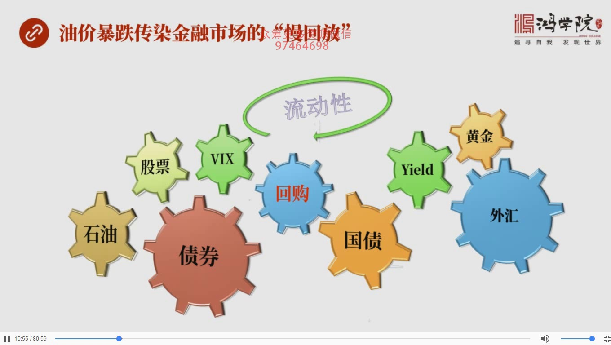

發生的很多細節進行慢回放也就是優價我們說了它佔了70%的佔了7%的這種比例對市場的影響那麼優價是怎麼來影響市場的呢在這張圖上我試圖用一個比較直觀的辦法來展現全球金融市場它的運作機制就像就像一個汽車發動機我們只是說金融市場中教書上有很多概念但是這些概念都是抽象的我們從來沒有把這些抽象的概念把它放到實際...

<strong>Cleaned narration</strong>

> 發生的很多細節進行慢回放也就是優價我們說了它佔了70%的佔了7%的這種比例對市場的影響那麼優價是怎麼來影響市場的呢在這張圖上我試圖用一個比較
> 直觀的辦法來展現全球金融市場它的運作機制就像就像一個汽車發動機我們只是說金融市場中教書上有很多概念但是這些概念都是抽象的我們從來沒有把這些抽
> 象的概念把它放到實際的市場中讓它轉動起來也就是我們不知道齒輪它是怎麼咬合的這套齒輪體系是怎麼互動的誰是主要的驅動力啊流動性是怎麼這個傳送帶是
> 怎麼牽動其他的市場轉動的我們其實沒有一個真正直觀的能夠徒刑化的一幕了然的這樣一種齒輪體系來理解金融市場這就是全球金融市場它的難以被很多人所理
> 解的重要的原因也就是不直觀當我們說這個概念內的概念說因為絕大多人記不住什麼的概念所以當你說了概念太多了人們已經昏掉了在我看來最好的學習方法和
> 最有效的這種理解的方式就是把你理解的東西化成圖視覺的它所帶來的這種直觀的理解力永遠超過文字也超過其他的方式只要你能看到像地圖一樣能夠把全球展
> 現出來你的理解力會大幅提升所以我們這場客其實就是根據這樣的一個理念比如說我話說這張圖雖然不是一個精確的概念不是一個精確的齒輪的這種設計圖但它
> 基本展現了一個思路我們看到從石油石油它是會牽著到債券的因為石油公司它會發行債券石油公司也會有上市公司的股票那麼石油價格如果出現暴跌就會驅動債
> 券市場股票市場那麼股票市場債券市場都有自己的相應的波動率波動性比如說股票Wix就是孔王指數當股票暴跌的時候也就是石油暴跌你會使得上市的石油公
> 司的股票暴跌然後那麼發行這些債券的石油公司的債券也會暴跌這都會影響股票和債券相對應的這種波動率這種波動率又會影響整個市場的心情也就是出現孔荒
> 孔荒就會使得市場中的流動性出現問題那麼這種流動性出問題會在回購市場會在國債市場都會發生相應的體現你如果國債市場出現了問題它的流動性出現問題那
> 麼國債的收益率就會上漲那麼國債收率上漲之後它就會影響美元的匯率影響外匯市場影響黃金市場影響很多市場影響整個金融市場市場的定價的機制那麼反過來
> 這些所有發生的事情都會相互的咬合在一起形成死所的關係所以我們這張圖只是一個概念圖但是通過這個概念圖你可以理解偶爾原來這麼多市場其實有幾整個在
> 一起的特別是我把回購市場放到中間因為回購市場是所有市場它的流動性的發動機是整個金融體系的心臟好有了這樣一個大致的理解之後我們再往下看下一頁好我們先來看星期一3月9號現在3月9號發生了些什麼

---

### Slide 5

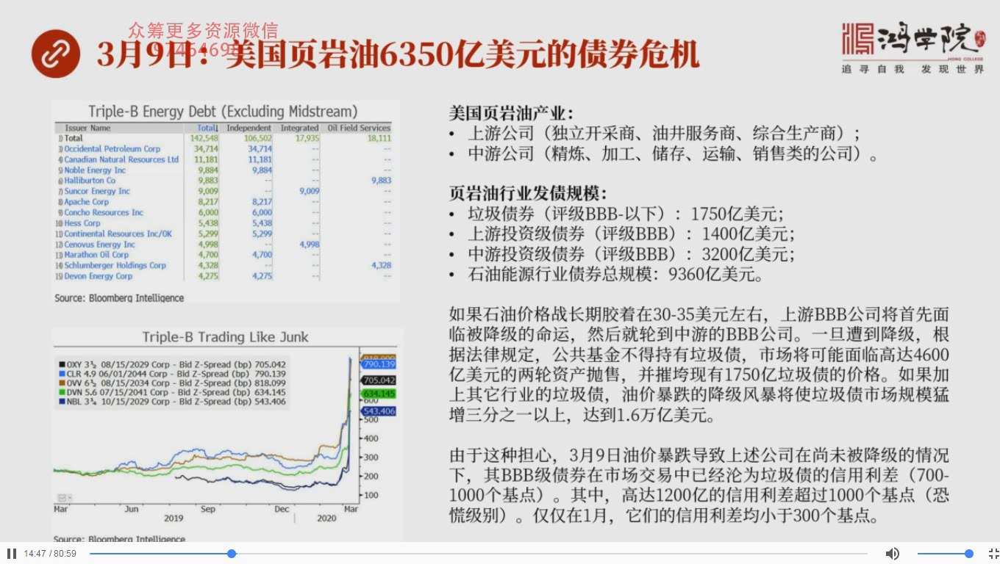

3月9號我們知道石油價格站在3月6號彈坊之後3月7號3月8號開始發作3月9號開盤星期一石油價格暴跌石油價格暴跌之後使得美國業員有行業出現了6351美元這麼大規模的債券危機要搞明白這個道理我們要先把美國業員有的行業大致的分類要搞清楚它分成兩類一類叫上郵上郵公司就是專門負責生產開財有警的這叫獨立開載商還...

<strong>Cleaned narration</strong>

> 3月9號我們知道石油價格站在3月6號彈坊之後3月7號3月8號開始發作3月9號開盤星期一石油價格暴跌石油價格暴跌之後使得美國業員有行業出現了6
> 351美元這麼大規模的債券危機要搞明白這個道理我們要先把美國業員有的行業大致的分類要搞清楚它分成兩類一類叫上郵上郵公司就是專門負責生產開財有
> 警的這叫獨立開載商還有就是有警服務商還有就是綜合性的生產商這叫上郵另外還有部分叫中郵公司中郵公司從上郵公司買他們的生產的成品也就是業員郵買了
> 之後進行經驗加工存儲運輸銷售這類公司叫中郵公司好那麼業員郵行業它發債的規模有多大首先在業員郵行業中有一些公司一開始它的經驗能力就比較差也就是
> 它占的資源不太好各方面經驗條件都很不好所以它一開始就是處在一種平積很差的情況之下也就是垃圾級的公司平積在BBB減以下那麼這些公司發行了債券就
> 叫垃圾債券他們的總量是1750億美元那麼除了他們之外還有就是上郵的開採型的公司這些公司中還有一些是屬於投資級的公司就是平積在BBB這個級別他
> 們一共發行了1400億美元還有第三類是中郵的投資級的公司平積也是BBB他們所發行了債券的總的規模是3200億美元當然除了這三類之外還有整個石
> 油的這一類這個板塊中間的行業他們發債的總規模是9361美元所以我們記住這是4個主要數字然後我們來估算大概總的影響力有多大那麼3月9號這一天我
> 們看到石油價格暴跌了30%跌到了30美元出頭甚至一度跌破了30美元如果石油價格站沙特、
> 俄羅斯將持在這裡保持比較長一段時間就在30到35美元之間震盪這意味著什麼意味著美國的研究行業整體來說它是難以生存的所以首先最脆弱的環節這個鏈
> 條會斷裂也就是上油負責這個挖井打井開採石油的這些上油的BBBB公司將手當其中面臨被降級的命運再過一段時間由於他們生產的原油賣給中油公司那麼中
> 油公司如果下油公司如果你的上油給你供貨商都已經垮掉了那麼你最後出問題也是吃早的事那中油公司也會出現問題被降級好如果他們被降級會出現什麼問題也
> 就是從投資級因為BBB再往下降一點點下面還有一個BBB剪然後再往下就是垃圾了就是垃圾拼擊了而美國的法律明文規定所有公共型的這種基金不管你是養
> 老基金政府退休基金還是各種各樣的基金都不允許持有垃圾債也就是對平級是有要求的所以當你這個平級一旦跌到了垃圾這個級別那麼這些投資人或者叫持有這
> 些債券的公司它本來買是買的投資級的現在被降成了垃圾級由於法律規定它不得不它必須得賣沒有什麼可可回旋的餘地所以這就會使得整個市場出現兩波重大的
> 拋盤第一波首先是那些上油的公司先垮掉1400億出問題被降級然後第二波是中油的公司3200億再出問題就是兩波累加在一起4600億這種債券的雜盤
> 會雜向市場誰來接當然就沒有人接因為其他的公司誰也不願意在這種情況之下去擁有已經出問題了垃圾債還有這個還有這個源油延期的公司所以這兩波拋盤雜下
> 來就會使整個這個行業出現重大的問題而且他們是由BB降下來之後會進一步壓這個打壓這個已經是垃圾的這些源油的公司就是BBB都降下來那你這個本來就
> 是垃圾你當然就會更慘所以這就像雙子樓恐怖分子襲擊了紐約雙子樓之後他的塌方是逐級加速也就是第一級燒燒垃圾之後重量壓到第二級然後一二兩級這重量加
> 在一起再壓第三級所以他的衝擊力是不斷增強最後一直壓到雞座這個源油出事的感覺跟這種狀態是差不多的所以我們會看到他會使得整個債券市場出現重大的危
> ...

---

### Slide 6

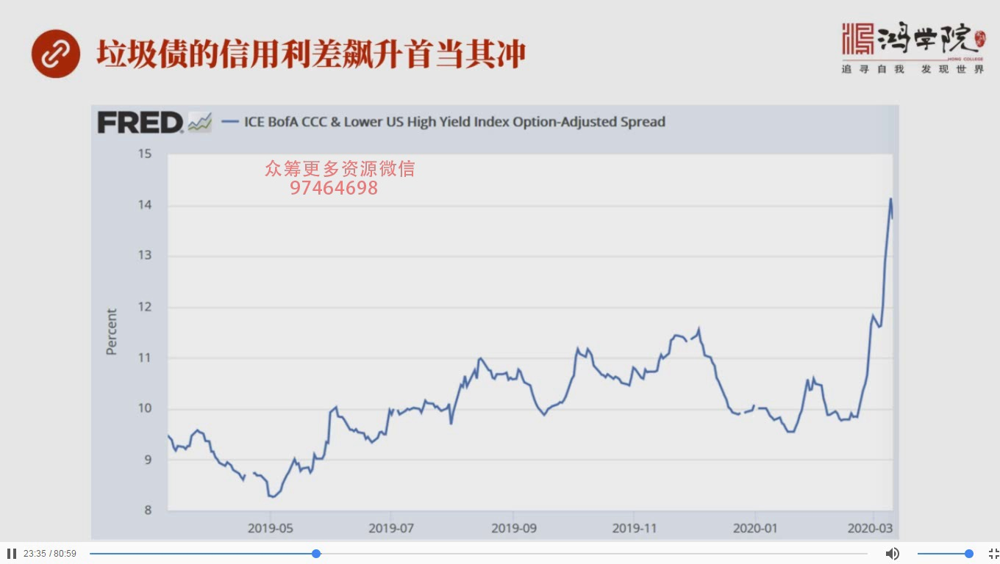

如果說顏油顏氣這個行業中投資籍別BVB的都已經跌成了這樣黑頭圖鏈的這些垃圾級別的一開始就出在垃圾級別的這些公司不管是顏油的還是普通的其他行業的公司反正是垃圾債券的這個級別的這些交易出來的信用力差在3月9號出現了一個標聲我們看到這張圖其實就是反映了3月9號是有一個報跌之後你會發現石油價格的報跌不僅影響...

<strong>Cleaned narration</strong>

> 如果說顏油顏氣這個行業中投資籍別BVB的都已經跌成了這樣黑頭圖鏈的這些垃圾級別的一開始就出在垃圾級別的這些公司不管是顏油的還是普通的其他行業
> 的公司反正是垃圾債券的這個級別的這些交易出來的信用力差在3月9號出現了一個標聲我們看到這張圖其實就是反映了3月9號是有一個報跌之後你會發現石
> 油價格的報跌不僅影響顏油顏氣行業它的垃圾債券同時影響了所有的其他行業的垃圾債券所以這個市場它是相通的不是顏油只影響顏油的公司而顏油公司一旦出
> 問題一旦出問題具有強烈的傳染性其他的公司無論你是生產汽車的飛機的還是賣面包賣汽舌的無所謂只要你是在垃圾債這個級別中全部受到了沉重壓力這就是金
> 融市場巨大的傳染性因為大家會聯想如果顏油不行了如果能源公司不行了還有再加上新冠的肺炎這個疫情未來幾年經濟情況不好消費者減少大家不出門了不消費
> 了所有行業能好的了嗎如果大家都好不了那麼最差的這些最沒有信用的最沒有根基的最沒有業績的沒有現金流的這個公司不手當其中會破產嗎所以這樣的聯想會
> 使所有垃圾債都會出現信用立查標聲也就是這個市場會出現嚴重的恐慌價格會大跌我們再加一這種心情不僅衝擊了垃圾級級別的所有債券也衝擊了所有投資級別
> 的債券注意啊他蔓延了不光是石油行業業油行業出了問題所有其他行業的投資級的債券同樣出問題他們的信用立查同步標聲這場所我們可以看到在319號這一
> 天整個美國市這個債券市場中投資級別的債券他的信用立查也出現了一個大幅標聲這就是我們看到的整個債券市場的恐慌心理加劇了這種恐慌心情當然每個市場
> 都會出現不僅是債券市場股票上也有所以油價暴跌衝擊了同時衝擊了若干的市場讓大家都處在一種慌恐慌金慌失措的狀態這就導致了恐慌指數在股市中的恐慌指
> 數出現了暴升暴漲關於恐慌指數我們以前在紅線核心客裡面專門有2講19講和20講專門講恐慌指數的原理專門講波動性其實跟這個概念大家如果不太理解在
> 這第一次聽話你可以回過頭來看19和20講那個把整個恐慌指數的原理講得比較清楚所以恐慌指數出現了跳聲而恐慌指數重現跳聲就會影響更大範圍的金融資產下個好我們再看下一頁那麼這張圖是一張從

---

### Slide 7

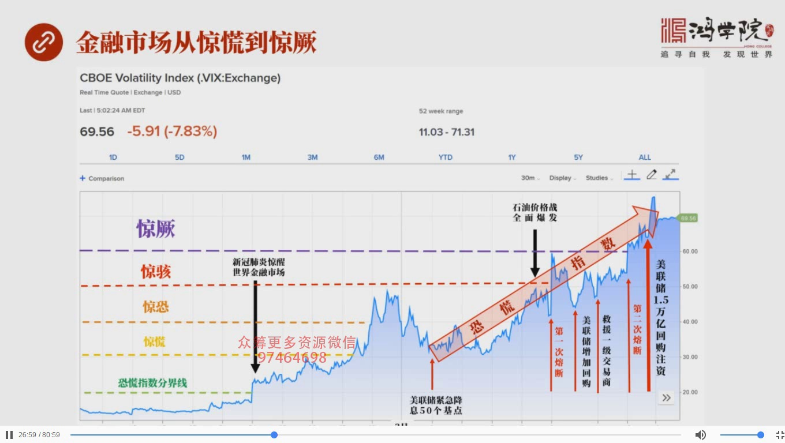

這個2月中旬一直到現在的一個時間圖這張圖我就是以恐慌指數作為一個重要的就是作為一個主要的一個參照的標準來看最近幾週最近一個月發生了市場的這個心態的變化首先我們來看這個恐慌指數從從我們看縱奪標右側這個數字二十三十四十五十六十七十這些數什麼意思呢就是Wix指數如果在二十以下我們看右邊我畫用不同的顏色的線...

<strong>Cleaned narration</strong>

> 這個2月中旬一直到現在的一個時間圖這張圖我就是以恐慌指數作為一個重要的就是作為一個主要的一個參照的標準來看最近幾週最近一個月發生了市場的這個
> 心態的變化首先我們來看這個恐慌指數從從我們看縱奪標右側這個數字二十三十四十五十六十七十這些數什麼意思呢就是Wix指數如果在二十以下我們看右邊
> 我畫用不同的顏色的線標誌出來如果是綠線以下二十以下代表市場的心態比較穩定如果在十以下那是超級穩定覺得市場完全不會有風險市場稍微有一點點這個小
> 不安但是基本也是穩定的好到了二十以上這個就開始出現變化了就進入了一種不安的狀態如果超過三十那就進入了金荒的狀態如果超過四十就變成金口超過五十
> 變成金害超過六十就變成金絕就昏倒了所以我們用這樣幾個詞大致來描述一下整個市場的這種氛圍那麼我們首先來看在二月二十四號我們看到基本上所有金融市
> 場都是從二月二十四號出現波動性大幅提升的什麼原因就是美國的金融市場和全球的金融市場在二月二十四號之前基本上認為新冠肺炎這只是中國的事兒不會影
> 響到其他國家沒有太大的擴散性當上大家也不太重視這個問題但是二月二十四號以後發生了重大了心態變化全世界開始意識到中國這個新冠的疫情將會波及全世
> 界所以市場出現了明顯的這種心理上的變化那麼如果我們來從這個恐慌指數來看的話它突破了二十就到二十以上了那麼另外一個重大的變化是發生在三月三號也
> 就是三月三號美聯儲已經發現市場中出現了許多的不安進去因為在那之前三月三號之前這個恐慌指數曾經一度達到了接近五十達到四十多那就到了驚恐了程度了
> 所以三月三號美聯儲做出了重大決定提前降息而且降了五十個紀點我們在直播課中分析過這個問題在這裡我就不再多說這個事了好這是三月三號發生的事情那麼
> 三月三號再往後我們看到到三月六號這個沙特和俄羅斯的談判破裂破裂之後三月七號三月八號兩個週末三月九號一開盤整個市場崩盤每股第一次壟斷石油價格佔
> 全面爆發那麼我們可以看到這個恐慌指數一下就衝到了接近紅線衝到了接近驚害這個程度然後第二天然後當天股市出現了第一次壟斷三月九號整個市場出現了荒
> 孔不安包括剛剛所說的債券市場股票市場還有他們的信用立差包括股指了變化包括信用立差的巨大的飆升到了三月三月三月三月九號到了三月十號星期二這個時
> 候美聯儲一看市場壟斷了不行得加碼這個拯救所以宣佈了增加回購的規模增加三百億美元本來市場本來他們認為這麼增加了流動率之後市場應該不穩定下來了但
> 是我們可以看到情況並不是這樣宣佈之後我們看到整個恐慌指數仍然在往上走所以在第二天三月十一號再次加碼再次加碼主要是為了省救移機交易商我們以後會
> 講到這個問題使得市場的流動性像市場移機交易商補充流動性否則他們已經不行了這個是發生在三月十一號然後再往後到了三月十二號你會發現整個市場恐慌這
> 個新情記憶不台生到了三月十二號就出現了第二次壟斷第二次壟斷的時候市場的恐慌指數已經達到精爵的程度超過了六十然後星期五也三月十三號然後這個還不
> 到星期五應該在星期四的下午收盤之前每年出汗燃宣佈1.5萬億美元的回購駐資希望能夠拯救市場的這種驚恐所以星期五我們看到的市場大部分談那麼恐慌指
> 數有所下降當然這個情況沒有至於多少到了週末、到了週日每年出突然宣佈降息到零同時搞7000億QE的這種緊接的計劃QE四市場當然當場就出現了暴跌
> 這個情況我們以後再專門去講我們先集中於這個星期上個星期3月13號到3月9號到13號這一週的行情好我們看下野由於3月9號出現了油價的暴跌

---

### Slide 8

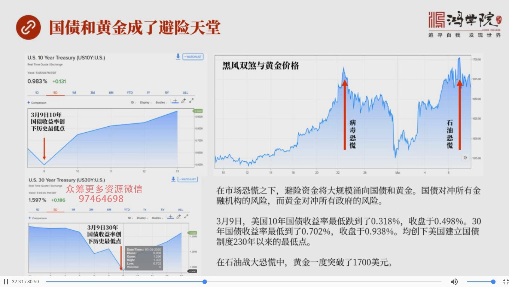

市場出現了精恐那麼資金出現精恐會怎麼辦會找避險天堂這種避險天堂當然就是國債和黃金我們知道國債它是國家政府發信的債務所以政府永遠比所有金融機構比所有企業都更穩定企業可以倒銀行可以倒但是政府不會倒所以大家認為當事情糟糕到一定程度的時候資產中國債是最安全的當然黃金黃金是終極的避險也就是當政府都垮了全世界政...

<strong>Cleaned narration</strong>

> 市場出現了精恐那麼資金出現精恐會怎麼辦會找避險天堂這種避險天堂當然就是國債和黃金我們知道國債它是國家政府發信的債務所以政府永遠比所有金融機構
> 比所有企業都更穩定企業可以倒銀行可以倒但是政府不會倒所以大家認為當事情糟糕到一定程度的時候資產中國債是最安全的當然黃金黃金是終極的避險也就是
> 當政府都垮了全世界政府都沒了出現重大危機了被推翻了革命了造反了等等那麼黃金仍然存在所以黃金是終極的對重政府危險這種風險的這兩個就成了避險天堂
> 所以我們來看左邊這樣圖你會看到這個10年國債收益率在3月9號跌到了歷史歷史的最低點跌到了0.318%那麼下面這張圖左下方是30年國債收益率也
> 跌到了歷史最低點30年國債收益率一度跌到了0.702注意30年國債才0.7幾最後說完說的0.938但是你要考慮到通貨膨脹通貨膨脹已經很高了遠
> 遠超過0.0.98那麼30年10年持有這種國債那麼虧死了但是在金融危機情況之下人們寧願持有這麼低回報率而且是付的付數從真實回報來說大家也要躲
> 避風險所以我們看到收益率大幅的下降收益率下降意味什麼意味著大家都去搶這個國債10年國債三年國債好大家搶得人多了國債是有票面價格的票面價格會上
> 漲從105從105漲的111等等但是每一張國債的政府給的這個固定回報是有限的比如說5%所以你要以越低的價格去獲得5%的政府給你的利息當然你就
> 收益就更高所以它的價格和收益率是相反的國債價格越高收益率越低國債價格的越低收益率越高所以我們現在看到兩個收益率10年30年都創了歷史新低說明
> 很多人在欺負這兩種目標這兩種債券當然右邊這兩圖我們可以看到黃金這就是黃金價格圖黃金價格圖首先這有兩個高峰第一個高峰是2月24號剛才我就說了就
> 是全球市場突然一直到中國的新冠疫情會影響全世界所以大家都把錢去投向黃金去避嫌出現了第一個高峰第二高峰出現在3月9號就是這個價格戰爆發所以我說
> 它是黑風霜上這兩個世界造成了兩個非常顯著的黃金價格的突起兩個高峰那麼我們看到在石油價格站的恐慌之中在3月9號黃金價格突破了一度突破了1700美元楊思好我們再看下一段但是到了3月10號

---

### Slide 9

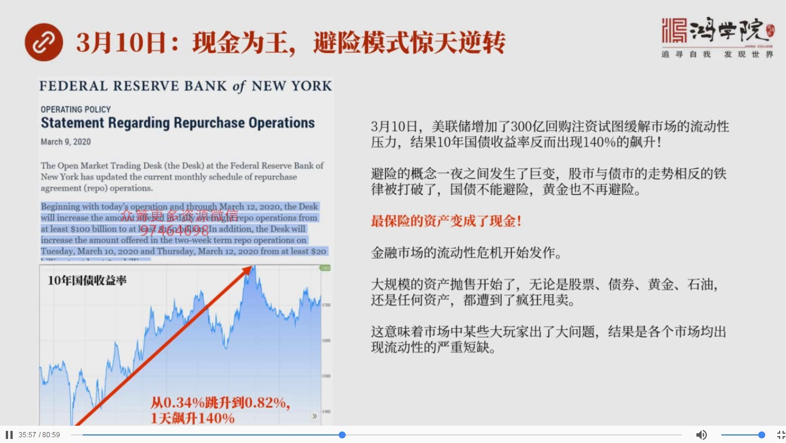

情況發生了突變3月9號的時候大家還認為黃金和國債是避嫌天堂3月10號突然這個概念發生變化只認現金為王也就是避嫌模式發生了今天大逆轉為什麼會出現這個現象我們會想想一下那就出現了重大的流動性的問題也就是市場中找不到錢了如果我們來看這個左邊這張圖這是美聯儲在3月10號的3月9號公布在3月10號執行的它的回...

<strong>Cleaned narration</strong>

> 情況發生了突變3月9號的時候大家還認為黃金和國債是避嫌天堂3月10號突然這個概念發生變化只認現金為王也就是避嫌模式發生了今天大逆轉為什麼會出
> 現這個現象我們會想想一下那就出現了重大的流動性的問題也就是市場中找不到錢了如果我們來看這個左邊這張圖這是美聯儲在3月10號的3月9號公布在3
> 月10號執行的它的回購計劃那麼3月10號這天美聯儲增加了311回購駐資試圖環節市場流動性的這種壓力注意出現了流動性的壓力所以美國國債10年國
> 債社會率3月9號駐底3月10號開始大幅反彈反彈的這個幅度是非常驚人的它從這個3月9號0.34%0.34%在一夜之間大概一天的一個教育日中間最
> 高就達到了跳升到了0.82%不要看0.82%這個數覺得數不高但是它從0.34跳到0.82%也就是一天左右的時間飆升了10%注意啊這個就非常的
> 嚇人了如果你看3月9號到理是一樣的也是出現了飆升謊言句話說在3月10號那一天人們的思想人們的精神狀態又發生了根本變化也就是股市、
> 債市都保險了黃金、國債也不必顯所有的資產都在下跌只有現金在升值我說現金升值就是所有人都拋資產搶現金這就導致了市場中在傳統概念中這個股市和債市
> 是喬喬表股市如果出現雄市的不好大家比較保守把錢就轉到債市中間吃一個穩定的回報如果股市情況好了經濟發展不錯機會多了那麼債券市場那些保守的資金就
> 會到股市去追求更高的回報所以這兩個市場應該是喬喬表如果股市不好債市應該不錯債市不好股市應該還可以應該是兩個是喬喬表的這種效應但是在3月10號
> 這一天所有資產價格都暴跌包括國債手續日上升意味著國債價格暴跌同時黃金也出現了暴跌這就是意味著金融市場出現了流動性的恐慌沒有現金了所以我什麼資
> 產都不要我必須得搶著現金因為我有其他的投資我要去不管是別人給我這個麻糬靠還是我要還別人債還是我要回購融資我必須要延展我的這個債務我都需要現金
> 其他資產沒有辦法實現這一點所以不管你是什麼股票債券黃金石油還是任何資產我通通拋售一定要追現金這說明市場發生了流動性恐慌這意味著市場中很多的就
> 很大一批超級大玩家出了大問題所以導致了整個市場他們瘋狂拋售的結果是市場沒有現金了大家可能會覺得這個現象很奇怪這個現金哪去了不是現金消失了而是
> 以有現金吹起了一個巨大的泡沫比如說如果說我們的這個現金全世界的現金比如說美國的現金資產有1萬億美元大家吹起這個資產泡沫可能是100萬億美元1
> 00萬億美元人都說我有1萬億美元的資產但是你有這麼多現金嗎沒有整個市場的現金只有1萬只有這個1萬億所以當大家都不要資產要搶現金的時候意味著1
> 00萬億的資產要去追要拋到這些資產要去追求這1萬億現金那當然現金會出現嚴重的息缺也就是現金會升值資產現金會大幅扁值這就叫流動性了嚴重了流動性
> 了風險包括黃泥在內包括所有資產在內都一樣好我們明白這個道理之後看下一頁所以3月10號爆發了流動性危機爆發流動危機

---

### Slide 10

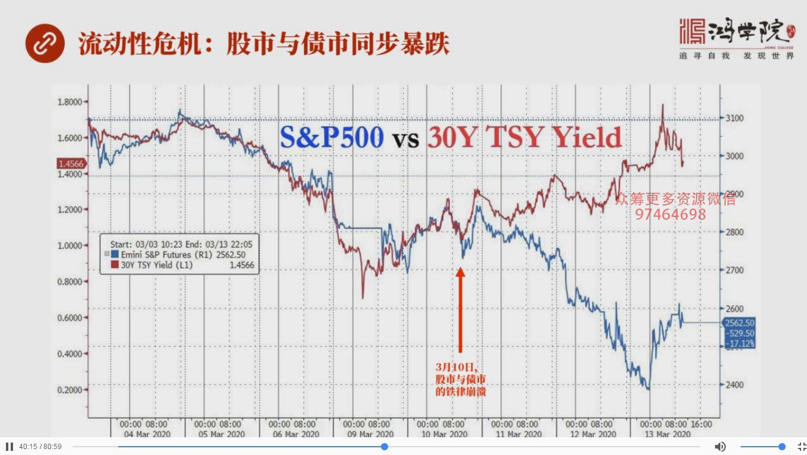

股市債市黃金一切資產價格都被拋售大家都要去搶現金所以在3月10號出現了股市和債市同步暴跌他不再是瞧瞧板了以前就是股市跌了資金都轉向債市去避險所以債市會好起來那麼我們從這張圖上可以看到在3月10號我這個箭頭指向了這就是3月10號發生事兒那麼股票市場SMP500代表股票市場它是一路暴跌30年瓜哥稍微率呢...

<strong>Cleaned narration</strong>

> 股市債市黃金一切資產價格都被拋售大家都要去搶現金所以在3月10號出現了股市和債市同步暴跌他不再是瞧瞧板了以前就是股市跌了資金都轉向債市去避險
> 所以債市會好起來那麼我們從這張圖上可以看到在3月10號我這個箭頭指向了這就是3月10號發生事兒那麼股票市場SMP500代表股票市場它是一路暴
> 跌30年瓜哥稍微率呢稍微率往上漲因為什麼因為這票面價值也在暴跌所以它這個分分叉口因為這兩個市場同時在暴跌好我們再看下一頁關鍵是哪些人出問題了就是趙世兇手是誰

---

### Slide 11

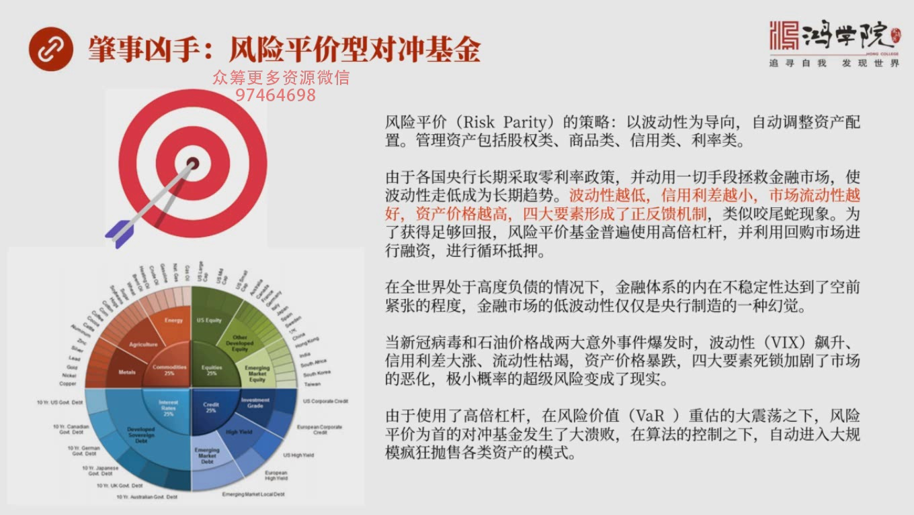

在這裡就是一個大家可能很多人如果你不研究金融市場可能都沒怎麼聽說過出問題的還是一方對衝基金他們叫風險評價型對衝基金什麼叫風險評價呢就好比我左邊這張圖你會看到下面左邊下面這張圖是風險評價策略的它所代表了這樣一種理念或者一種哲學吧這種哲學說白了就是相信市場上可能發生任何事情所以我配置資產的時候我一定什麼...

<strong>Cleaned narration</strong>

> 在這裡就是一個大家可能很多人如果你不研究金融市場可能都沒怎麼聽說過出問題的還是一方對衝基金他們叫風險評價型對衝基金什麼叫風險評價呢就好比我左
> 邊這張圖你會看到下面左邊下面這張圖是風險評價策略的它所代表了這樣一種理念或者一種哲學吧這種哲學說白了就是相信市場上可能發生任何事情所以我配置
> 資產的時候我一定什麼資產都要配置一些比如說在這個在這個做圖上我們看到它底下有比如說股票類的這個資產中國的美國的發展中國家新鎮上國家金專幾國等
> 等它進行每個國家挑一些資產來配置股票類的還有信用類的信用類就是各種各樣的信用性的資產除了這個之外還有利率性的資產各種各樣的債券主持策略還有商
> 品類的大宗這個商品比如說石油挖黃金還有其他的這種大宗商品所以它是把所有資產都進行了分布它根據什麼原則來調配來調整這些資產的配置呢因為我要買幾
> 十種至少十幾種資產放在一起放在一個籃子裡分成四個隔信用類的股票類的商品類的利率類的等等我根據什麼原則來隨時調整我的資產配置呢我要根據一個風險
> 原則就是我把市場出現了風險作為我的把標我來設建受到這個把信如果這個把標我就是以它為導向來調整我的資產配置如果這個市場比如說我以波動性我以恐慌
> 指數作為我的把標那麼當波動性大幅提高了好我這邊的資產就會自動地從一起拍它是靠算法靠自動的配置來完成資產之間的調配如果波動力下降了我又會調配波
> 動力下降因為這市場更穩定了好這個時候我覺得不錯我就多配置這些股票那麼少配置這些債券或者我看到通過膨脹表高我就多配置這些大動商品這些東西都是根
> 據一個市場的波動性也就是根據它的風險來制定總得一個原則由這個總的原則來駕馭所有資產的調配那麼由於各個國家長期採取就是金融移機之後各個央行採取
> 什麼的零利率而且動用一切手段央行動用一切手段來拯救市場不管出大事的小事只要出事的央行一定是印鈔票來穩定市場興趣99支十來年這個時間裡面養成了
> 大家一個投資人類一個心態也就是波動性肯定是長期走低的關於波動性這概念我們以前核心課1920講專門講過那麼波動性長期一定是走低的這就會導致波動
> 性越低那麼信用立差也就越低也就是同期線的企業債和國債之間的立差也會越小那麼他越小的話因為市場的流動性越好也就是你在市場中你想買和賣任何東西也
> 就是差在很小的情況之下很容易很快就出手這叫流動性也就是你想賣一個字化其外實的字化如果說我們說古玩市場或者叫古話是這個書畫市場非常非常活躍流動
> 是非常好的話那麼你出手跟你的教跟你的藥的這個價格差距很小出手越快也就是一天就能賣出來那就一個流動性你如果一個小時就出手了那就流動性更好而且價
> 格不跌所以一個流動性好的市場是買賣任何東西你的價差非常非常小而且成交速度非常快這就叫市場流動性很好那麼這種流動性越好資產價格也就越高所以幾個
> 因素波動性很低用立差很小市場流動性很強資產價格自然就很高所以這四大要素形成了一個正反虧機制資產價格越高反過來說明什麼市場穩定波動性低還有利用
> 立差小市場流動性好所以這幾個參數它是死守在一起形成一個正反虧機制相互彼此強化反過來也一樣當中間的某一個因素被打破了比如說波動性出現了大幅的標
> 稱所有這一切正反虧就會朝相反的方向也就是你本來是把好的東西不斷放大正反虧是不斷的強化了一種機制好你如果出現負面的消息負面情況它也會把負面的東
> 西進行高位放大越來越強自我強化好這就是一個我們以前說的搖尾舌線下為了獲得足夠的回報因為在一個波動力越來越低的市場中你要想獲得一點點回報是非常
> ...

---

### Slide 12

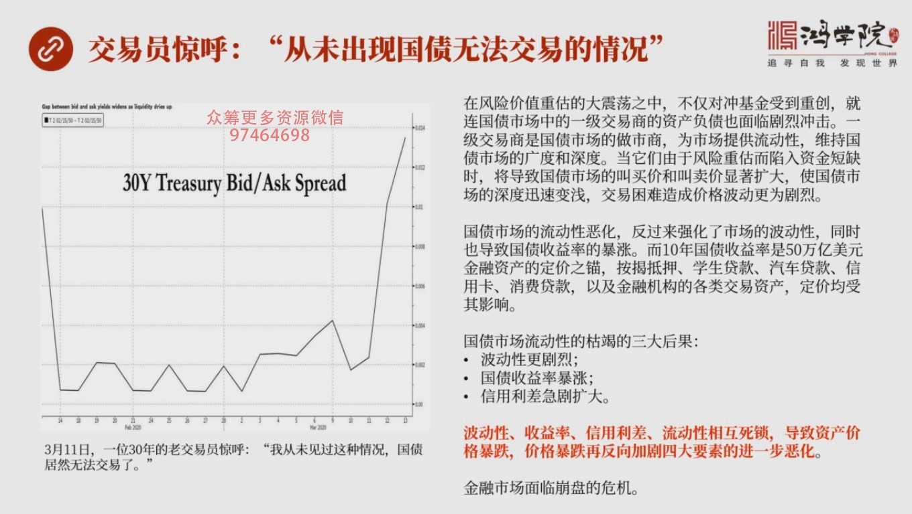

枯竭的危機爆發了所以我們來看在3月11號那天交易員有很多我看了報紙上新聞上有很多30年的老交易員金呼也就是它它是國債交易員它是從來沒有見過國債無法成交的這種情況國債都賣不了想出手出手不了從來沒有這種情況出現國債決任無法交易了因為美國金融市場它實際上最牛的是它的國債市場是它的債券市場流動性非常好深不見...

<strong>Cleaned narration</strong>

> 枯竭的危機爆發了所以我們來看在3月11號那天交易員有很多我看了報紙上新聞上有很多30年的老交易員金呼也就是它它是國債交易員它是從來沒有見過國
> 債無法成交的這種情況國債都賣不了想出手出手不了從來沒有這種情況出現國債決任無法交易了因為美國金融市場它實際上最牛的是它的國債市場是它的債券市
> 場流動性非常好深不見底的一個汪洋大海太平洋現在太平洋突然變非常非常錢湯水就能過去整個市場流動性突然蒸發了所以你的在市場中賣什麼東西都賣不了主
> 要問題出現在哪就是流動性枯竭的風險一旦傳染到國債市場它就會影響到國債的依據交易商我們知道美國有24個依據交易商他們跟美聯儲紐約銀行打交道紐約
> 銀行執行紐約美聯儲銀行執行任何貨幣政策並不是直接面向市場像所有幾千家銀行幾萬家銀行金融機構去買賣國債不是這樣他們主要是通過依據交易商通過24
> 家依據交易商來進行買賣包括執行貨幣政策買賣國債吞吐國債都是這樣依交易商出了大問題也就是讓它我們所說的風險價值重估這個大震盪不僅衝擊了對衝基金
> 同樣的原理波動性太高使得VX指出標準太快使得這些依據交易商有些是大銀行有些是大頭行有些是各種各國內的國際的都有美國和國外的都有那麼這些銀行它
> 的資產負在表上也突然出現同樣的問題也就是我以前低估了風險所以我留著現金不太夠現在風險定價重新重新計算發現我這現金根本就不夠因為風險太大了怎麼
> 辦他們也沒有現金了那麼依據交易商是國債市場和債券市場主要的流動性的供應商也就是他們要提供流動性服務也就是有人要賣國債首先它是給我打電話我作為
> 一交易商我不管在正常情況之下你要賣給我我給你一個告訴你一個我的買入價只要你按照這個價格賣給我我立刻就收我之所以敢吞貨這是要壓賺我資金的是因為
> 我根本不籌賣我一轉手馬上就能賣出去所以我不擔心但是如果我手上沒有錢了我拿不出這個錢了這個時候我就一點資金都不能壓賺了也就是你給我這個錢我必須
> 要先找到賣家就是你要賣給我一個資訊我必須要先找賣家這個事才能成交那就廢事了也就是它作為吞吐作為叫賣教賣的這個中間的做事商的功能嚴重衰退市場就
> 沒有流動性了所以我們來看這張左邊這張圖你會看到在這個3月13號這一天出現的就是這個情況30年國債你看它的教賣家和教賣家一下飆升上去了這是非常
> 非常非常非常重要的一個一個環節也就是國債市場上你想賣國債賣3千國債居然沒有人接沒有人接盤教賣家落差太大就意味著你賣一點點賣幾手國債就能把這個
> 價格給他讓他發生變動那還叫流動性很強的市場嗎因為國債市場之所以牛就是你拋一百億美元這個市場根本就沒有任何的這個一死威廊都不起就把你消化掉了你
> 現在賣一億整個市場價格出現劇烈的抖動這意味著什麼意味著國債市場變遣了一下蒸發了太平常變成一個很遣的壺找那麼就會導致國債市場流動性哭解那麼這種
> 流動性一旦哭解了賣什麼東西賣不掉了而且價格一點小的交易就會把價格砸下來這就是整個市場剝動性也就是它這個孔王只是會進一步上升那麼剝動了一上升反
> 過來又會使得資產價格暴跌這又出現了一個惡性循環同樣我們看到十年國債收益率還有三年國債收益率都出現了這個問題那就是收益率會暴漲暴漲之後我們看到
> 十年國債或一年一天一個交易日長14%我們都知道國債十年國債收益率它是一個定價基準是美國50多萬億美元金融資產的定價之矛不管是按階底要戴款學生
> 戴款其實戴款還是消費戴款大家都是按著國債收益率十年國債收益率來孤算我的價格它是一個價值之矛我的模型中間要根據它它的手入來計算我的定價標準它要
> ...

---

### Slide 13

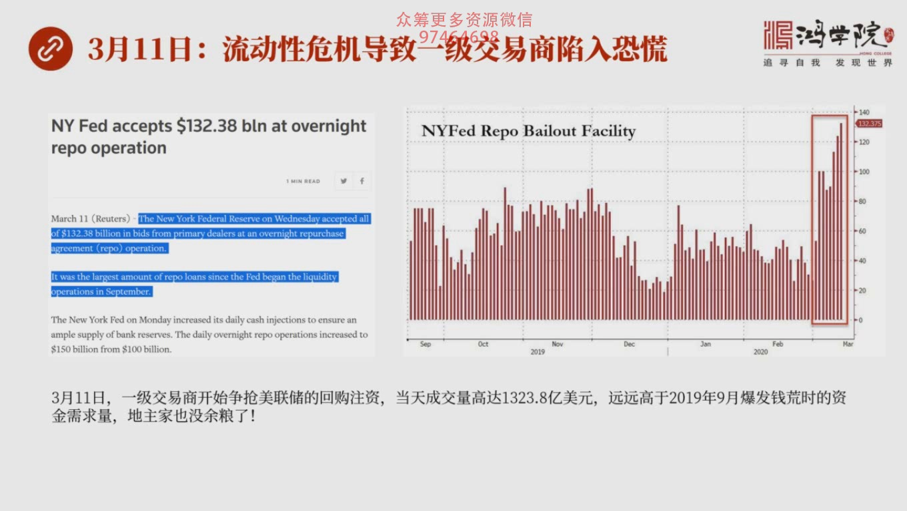

衝擊到了國債市場出現什麼情況出現了一級交易商陷入了恐慌它的錢不夠了他們錢不夠了怎麼辦呢我們可以從左邊這樣圖上看我們會發現在3月11號這一天向國債向一級交易商注入了1323.8億美元這個數可是個相當驚人的數它超過了如果我們從圖上看從右邊這張圖上看1323億美元是遠遠超過了9月份我們來看圖最左邊這是9月...

<strong>Cleaned narration</strong>

> 衝擊到了國債市場出現什麼情況出現了一級交易商陷入了恐慌它的錢不夠了他們錢不夠了怎麼辦呢我們可以從左邊這樣圖上看我們會發現在3月11號這一天向
> 國債向一級交易商注入了1323.8億美元這個數可是個相當驚人的數它超過了如果我們從圖上看從右邊這張圖上看1323億美元是遠遠超過了9月份我們
> 來看圖最左邊這是9月份這個隔夜回購這些金融機構一級交易商所需要這麼多錢現在要比9月回購了錢荒的時候要嚴重多了他們需要的資金量非常大說明什麼說
> 明一級交易商也沒錢了地主家也沒餘良了這就是剛才我們那張圖所說的國債3年國債收益率3年國債這個它的市場它變得流動性哭解收益率大漲然後這個市場沒
> 有流動性了好再看下一頁這就到了3月12號星期四星期四出現了第二次融斷

---

### Slide 14

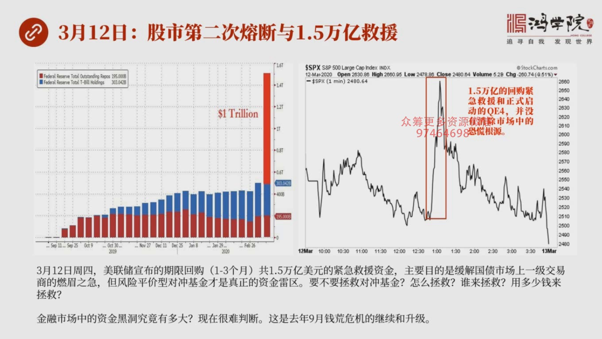

美聯圖怎麼辦呢就在這一天宣布注入1.5萬億美元的救援分成兩個兩個是3月期限的一個是1月期限的每次5千億加在一起1萬5千億分7分批的注入它的主要目的是什麼我們知道美聯儲通過回購向市場注入主要是跟24個1.5萬億交易商打交道所以這個錢首先是給了1.5萬億交易商在我看是環節他們的問題因為我們看到3年國債它...

<strong>Cleaned narration</strong>

> 美聯圖怎麼辦呢就在這一天宣布注入1.5萬億美元的救援分成兩個兩個是3月期限的一個是1月期限的每次5千億加在一起1萬5千億分7分批的注入它的主
> 要目的是什麼我們知道美聯儲通過回購向市場注入主要是跟24個1.5萬億交易商打交道所以這個錢首先是給了1.5萬億交易商在我看是環節他們的問題因
> 為我們看到3年國債它的流動性喪失意味著交這個1.5萬億交易商這些做事商沒錢了它的價值這個風險價值一重固它也沒有它也沒有活動活泛的錢了所以美聯
> 儲必須要先救他們這就是1.5萬億救援的根本它的本質首先是救1.1交易商1.1交易商救活了之後才能救國債市場國債市場有了流動性之後它的定價基準
> 這個定海神針定價值毛才能穩定其他金融市場了所有定價才能夠找得到參照物然後這個市場心態才能穩定下來所以1.5萬億美元的救援基金首先是拯救這些2
> 4個1.1交易商把他們救活了再有多了一千再去救其他人再去穩定其他市場所以我們可以想象一下如果說1.1交易商缺錢缺到這種程度那那些高幣槓槓玩1
> 0倍以上的這些高幣槓槓對重基金他們得虧多少錢這就是個相當驚人的數字了因為你從這一次救援規模上你就可以大致看到這個黑洞資金黑洞他的這個這個可以
> 說是身不見底由於這個錢給了1.1交易商1.5萬億但是1.1交易商怎麼給對重基金因為他們才是真正的雷區到底怎麼去救首先是要不要救這些對重基金比
> 如說風險評價型對重基金要不要拯救是通過FICC拯救還是通過誰來拯救怎麼救要不要救誰來救出多少錢這都是一系列的問題這些問題沒有搞清楚也沒有出達
> 任何政策也沒有具體的操作了這種這種先例可以這個遵守我們以前說過FICC很可能是一個用來拯救對重基金的一種機制但是這個機制只是一個概念提出來我
> 們在上級核心課中提出來這也是每年主正在討論這個問題還沒有幹過我們現在需要非常密切的關注這一次是不是要通過FICC來實行這種拯救因為不拯救可能
> 會一大批對重基金會搞畢而他們牽扯到的可能是數萬億管理的他們管理那麼原資產如果說這些資產都出了問題那可就是一場重大的進入危機了那就直追2008
> 年了甚至超過2008年規模這就是為什麼注入了1.5萬億之後市場還不行我們看到宣布這個消息之後市場進一步的就是好了沒多久然後進一步下跌當然新秀
> 無反彈了但是我們現在看到這個到星期六它的期貨包括星期也就是現在一開盤再一次跌停板這都說明一個問題市場的真正的雷區風險評價行了對中基金到底有多
> 大黑洞怎麼去填這個黑洞這個問題不搞清楚不解決掉進入危機它就完不了因為不確定是最大的危機好我們現在看3月13號新秀我股市強硬反彈股市強硬反彈解決問題了嗎

---

### Slide 15

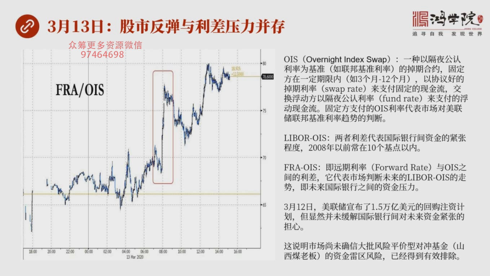

當然我們現在知道現在已經是3月15號了3月16號了我們知道美股現在跌了一塌糊塗它並沒有解決這個問題但是我們在上這堂課的時候是3月14號我們還不知道星期開盤會跌成這樣那麼我們的當時基本判斷是這事兒沒有完沒有完的主要原因是雖然股市當天反彈了接近2,900多點但是它的這個立差的壓力是存在的也就是OS和這個...

<strong>Cleaned narration</strong>

> 當然我們現在知道現在已經是3月15號了3月16號了我們知道美股現在跌了一塌糊塗它並沒有解決這個問題但是我們在上這堂課的時候是3月14號我們還
> 不知道星期開盤會跌成這樣那麼我們的當時基本判斷是這事兒沒有完沒有完的主要原因是雖然股市當天反彈了接近2,900多點但是它的這個立差的壓力是存
> 在的也就是OS和這個FORWARD之間它是有立差壓力的這個立差壓力代表著國際銀行之間的美元拆借這個市場存在著非常嚴重的這種流動性的壓力我們從
> 這張圖上可以直觀的看到在3月13號這一天也就是股市大漲的同時這個信用立差這個期貨這個立差和OS立差在顯著的跳升在擴大這說明整個國際上對美元拆
> 借未來的到底這個成本是多少是非常吃不准的認為這個以後借美元會越來越難這個是FORWARD READ和OS READ的支插的根本性含義當然我們
> 如果要進一步搞清楚什麼叫OS什麼叫Lybert和OS什麼叫FORWARD READ和OS其實我們核心課以前都講過如果大家感興趣可以翻回到我們
> 專門講這個OS這個課程和Lybert課程中都有相對應乾淨大家只需要記住現在只需要記住這個參數意味著海外的美元和美國國內的美元中間存在著壓力也
> 就是全世界的銀行在拆借美元的時候比如說我們用Lybert來觀察這是屬於海外美元市場的交易團市場利率OS它是跟聯邦基準利率掛鉤是美國國內的利率
> 這兩個利率不應該存在太大差別在2008年之前他們兩個基本上沒有超過10個基點但是進入危機爆發之後我們會發現海外美元跟美國國內美元好家貨都差距
> 可以達到上百個基點甚至更多所以人們才開始關注這個是兩者立場Lybert和OS的立場當然現在我們需要更超前的因為這個Fullware Rate
> 它實際上是對Lybert利率的一個預測所以Fullware Rate和OS就意味著對未來Lybert利率和OS他們支插未來是就是未來的預期怎
> 麼樣所以我們來看到這個市場的立場的擴大意味著全球美元海外的美元和美國國內的美元中間存在著一個巨大的壓力人們開始擔心未來找不到美元這是國際上的
> 一個普遍擔心這就是為什麼我們會看到這個市場中存在著美元指數出現暴跌黃金這個美元指數大漲黃金暴跌這樣的情況就是現在在世界範圍內出現了美元苦惑美
> 元流動性吸缺了哭結了找不到了所以美元就升值了這就是我們看到的很多人認為美國經濟好美的升值其實在相反情況之下美國越爆發危機金融系統越危險美元升
> 值得越協會越嚇人2008年就出現過類似的情況一旦美國金融體系出現全面崩盤那麼整個市場上如果銀行破產如果大規模銀行破產會導致市場中的美元流動性
> 消失掉如果你再想找美元找不著了那怎麼辦那叫非常高的代價才能獲得美元當然它就升值了所以這個叫流動性哭結型的美元會率上升現在我們看到了美元會率上
> 升就是這種力量所帶來的當然我們以前核心客反复講講過這個問題那麼現在看起來3月12號美聯儲宣佈了1.5萬億美元回購的資金注入並沒有從根本上緩解
> 國際間的美元的拆借的問題這個資金仍然是存在的這說明全世界的這種拆借市場中人們仍然在擔心就是那些風險評價型的對中基金他們管理這麼多資產這些玩得
> 跟善心沒老闆一樣非常的高風險的事他們這些到底靠不靠譜是多深的雷這個雷能不能順利的排掉不知道所以這個市場的心情這個它的恐慌程度是沒有辦法下降的好我們再看一下所以這就使得我們未來觀察

---

### Slide 16

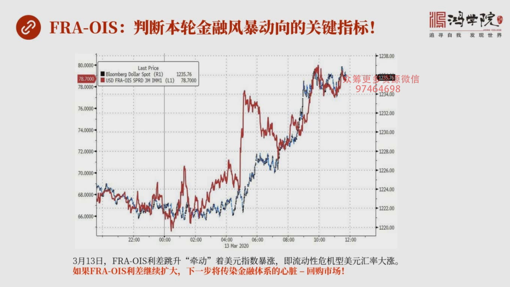

金融市場本輪或是叫這輪持續三週的這輪金融風暴它的一個風向標示就是這個for rate和 OS 利率兩者之差那麼這張圖我們可以看到在這張圖上這個紅線是代表就是說我剛剛所說兩個利率之差這個藍線是代表美元的指數你會看到實際上這個立差跳升在前或者叫這個立差把美元指數拉出來了所以我成為是海外和美國國內美元拆借...

<strong>Cleaned narration</strong>

> 金融市場本輪或是叫這輪持續三週的這輪金融風暴它的一個風向標示就是這個for rate和 OS 利率兩者之差那麼這張圖我們可以看到在這張圖上這
> 個紅線是代表就是說我剛剛所說兩個利率之差這個藍線是代表美元的指數你會看到實際上這個立差跳升在前或者叫這個立差把美元指數拉出來了所以我成為是海
> 外和美國國內美元拆借這種立差緊張程度簽動了美元指數暴漲這也就是一種典型的流動性危機之下的美元會的大漲如果這個立差進一步誇大下一步將會傳染到金
> 融體系的核心部分也就是它的心臟會構思場好我們再看一下3月15號這是今天我剛剛補上的PPT這是講這個美聯儲新政策

---

### Slide 17

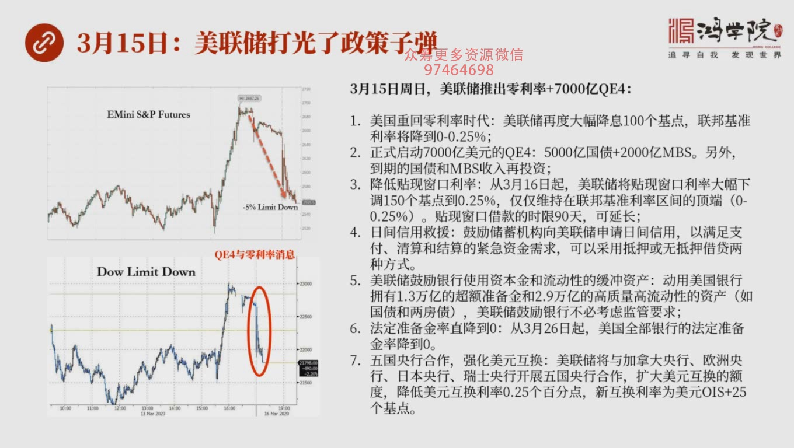

就是在週日我們的課是週六第二天我們在課上其實已經說過了美國到3月18號一定會宣布大幅降息100幾點同時還要搞得好看鬆只不過沒有想到它第二天就是星期日就已經開始執行這個政策那麼這個政策是什麼呢零利率再加上7000億美元的QE4它的主要的核心有哪些有幾點吧首先從為0.0率這意味著所有以前的加息要縮表這些...

<strong>Cleaned narration</strong>

> 就是在週日我們的課是週六第二天我們在課上其實已經說過了美國到3月18號一定會宣布大幅降息100幾點同時還要搞得好看鬆只不過沒有想到它第二天就
> 是星期日就已經開始執行這個政策那麼這個政策是什麼呢零利率再加上7000億美元的QE4它的主要的核心有哪些有幾點吧首先從為0.0率這意味著所有
> 以前的加息要縮表這些東西都白幹了反過來說明現在的情況其實跟2008年金融危機爆發的情況沒什麼兩樣也就是12年以來美國的經濟美國的貨幣美國的金
> 融體系都沒有真正恢復現在還必須得帶著貨幣這個呼吸機才能恢復正常體徵否則的話一把管子這個病人就會出事第二點正式啟動QE4我們上次周六說我們還在
> 討論QE4到底應該怎麼算實際上應該從3月12號算這回只不過給它蓋了一個大印說我們正式啟動了第三就是降低這個天焰闖口利率我們一般很少一般人很少
> 注意這個利率這個利率其實它是一個懲罰性利率就是好銀行大家都可以在銀行間這個市場裁界就是通過Foundrate就是通過聯盟接種利率你可以在銀行
> 之間相互裁界這樣形成的聯盟接種利率只有那些不行的銀行不好的銀行它在這個市場中其他銀行都不願意借錢給它所以它不得不找到美聯儲到天焰闖口說我想借
> 錢可以抵押那麼美聯儲借給它的利息是一種懲罰性利息一定是比聯盟接種利率要高的至少高50幾點好現在美聯儲的政策什麼呢就是它把這個懲罰性的這50幾
> 點抹平了你比如說現在降息之後是美聯儲的基準利率是0.25那麼正常情況之下這個貼線闖口的利率應該比它高50幾點也就比它最高端0.25再加上5幾
> 點應該是0.75現在把這0.75抹掉了直接降到了0.25這說明一個問題比如說明美聯儲可能已經預估到了大量銀行的流動性會出問題由於風險價值重孤
> 充當這個大增浪衝擊的太厲害很多銀行都會缺錢那麼它這流動性不足怎麼辦大家很可能不得不來找美聯儲借錢那些大銀行或者說其他的金融機構不好借只有來找
> 天焰闖口借找天焰闖口如果來人多了你這是所謂法不則重你要來的大批銀行都來了你懲罰就沒有意義了所以這意義為著美聯儲可能已經預感到大量銀行它的流動
> 性會出問題第四個就是日監信用救援我們再講美國支付系統核心課的時候其實講到了在整個支付體中間這個化賬轉賬的時間實際上會有一個資金占用問題就是我
> 要轉一筆錢我的資金可能在轉移過程中會被別人截流幾天其實每個人都在截流別人資金也在被別人所截流在整個金融體之內現在美聯儲是什麼呢美聯儲是鼓勵大
> 家向這個央行來借錢來滿足日長的交易清算、結算中間壓占資金的問題本來這個資金我們可以想想想在正常的情況之下這個資金不會太大或者不會對銀行構成沉
> 重的資金負擔但是如果說美聯儲聯這個問題都想到了都已經開始考慮這個問題了說明銀行之間的銀行之間的這種這種一資金壓占問題已經影響到它流動性了所以
> 大家可以注意一下最近一段時間全世界的銀行股我相信如果這些諸司馬其實正確的話說明很多銀行要出問題也就是銀行股一定會出現相當大的暴跌的行情才對否
> 則美聯儲不會去去想這麼細的事比如說第五點這個美聯儲鼓勵銀行使用資本金和流動性的緩衝資產這些緩衝自然以前是比如說巴斯爾協議要求你銀行必須要保留
> 多少資金要充足然後流動性要有一些巴粉要有一些緩衝來應付各種樣的監管同時美國還有多多富蘭克法案也是做監管用的為了防止華爾街這幫人再拿民眾的錢去
> 冒險所以各種監管使得大量的銀行的資金被作為一種緩衝資產凍結在哪或者不容易去用美聯儲現在股利銀行去用這個錢也就是美聯儲讓大家不要考慮監管的問題
> ...

---

### Slide 18

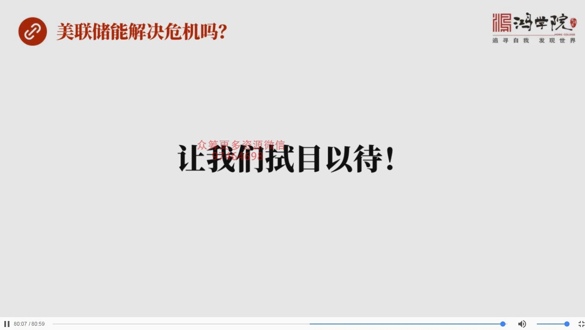

這個苦衷到底有多深黑洞到底有多大我們現在還不好說好再看下一頁這一頁是我們推薦閱讀

<strong>Cleaned narration</strong>

> 這個苦衷到底有多深黑洞到底有多大我們現在還不好說好再看下一頁這一頁是我們推薦閱讀

---

### Slide 19

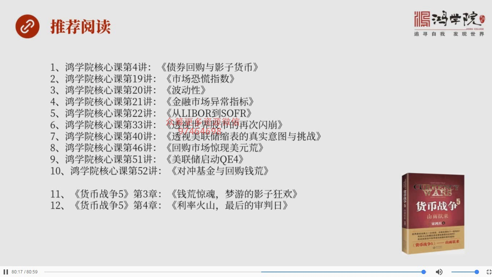

也就是我們紅選核心課中還有我的書中所講到了相關的理念大家如果對中間哪些地方不理解可以到這些核心課裡面去找從頭仔細聽一下就會明白好的我們今天課就上到這裡謝謝大家

<strong>Cleaned narration</strong>

> 也就是我們紅選核心課中還有我的書中所講到了相關的理念大家如果對中間哪些地方不理解可以到這些核心課裡面去找從頭仔細聽一下就會明白好的我們今天課就上到這裡謝謝大家

---

### Slide 20

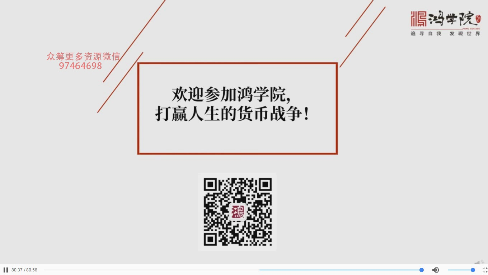

祝大家在人生中也能打贏貨幣戰爭另外在我們紅選中積極的能夠參與進來完成作業加強互動然後有什麼問題也可以給我們提出好今天課就到這裡謝謝大家再見

<strong>Cleaned narration</strong>

> 祝大家在人生中也能打贏貨幣戰爭另外在我們紅選中積極的能夠參與進來完成作業加強互動然後有什麼問題也可以給我們提出好今天課就到這裡謝謝大家再見

---
