# 核心课视频-56、57 3月金融风暴的逻辑复盘 — Detail Slide Notes

> **来源**：鸿学院核心课程  
> **幻灯片**：25 张

---

### Slide 1

今天我们第一次尝试用直播加PPT的方式来讲解我们的核心课如果在这个过程中大家出现掉线或其他什么方面的这种技术顾上不用担心因为最后这些课程我们都会出现在我们的录频的节目中大家可以回看这是我们今天要讲的一...

<strong>All subtitles</strong>

> 今天我们第一次尝试用直播加PPT的方式来讲解我们的核心课如果在这个过程中大家出现掉线或其他什么方面的这种技术顾上不用担心因为最后这些课程我们
> 都会出现在我们的录频的节目中大家可以回看这是我们今天要讲的一些主要内容今天我们这张课主要是回顾2020年3月全球金融风暴已经过去一个多月了我
> 们现在要进行一个逻辑复盘这就是我们核心课的第56和57讲我们今天讲第一部分应该说4月份花了将近一个月的时间详细输理了3月份发生的金融危机的朱
> 斯马技包括各种报道、数据进行了会边还有整理试图把这个逻辑线所给输理清楚因为我们说到金融危机说到金融风暴大家只是看到了很多报道、
> 听到了很多说法但是我们却没有建立起一个真正从逻辑体系角度来思考整个这个危机它到底是因为什么发生的在这个发生过程中有哪些重要的指标需要我们非常
> 关注也就是说我们没有建立起一个逻辑框架来理解整个危机这就是我们这趟课要重点解决的问题因为内容量非常大我估计可能全部课程加的期得6到7个小时所
> 以我们不得不把它拆成几个部分我们今天讲的是第一部分下面我们看企业那么在金融危机发生的这个过程之中

---

### Slide 2

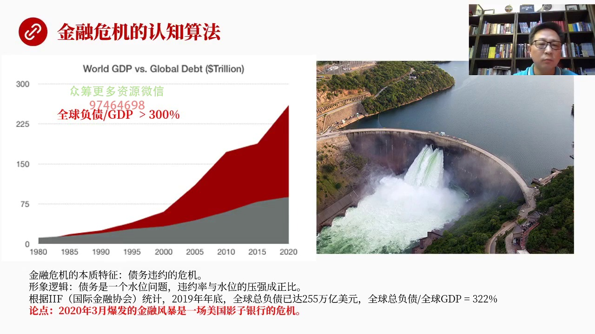

我觉得我们要认识这样一个金融危机这样一件应该说这样一个过程我们需要一套认识算法这套认识算法我成为是我们非常重要的一个认识金融危机的逻辑起点那么从认识算法这个角度来看我觉得首先要搞清楚金融危机的它的最本...

<strong>All subtitles</strong>

> 我觉得我们要认识这样一个金融危机这样一件应该说这样一个过程我们需要一套认识算法这套认识算法我成为是我们非常重要的一个认识金融危机的逻辑起点那
> 么从认识算法这个角度来看我觉得首先要搞清楚金融危机的它的最本质的特征我们以前讲过专门讲过认识算法核心课认识算法我们其实强调过认识算法不仅是用
> 于理解金融危机其实也是用于认识事件万事万物不管你是什么行业什么样的工作什么样的情况都可以利用这种认识算法来获得比较高的这种认识的效率那么在认
> 识算法中间最重要的就是提链一件事情的本质本质特征究竟是什么那么金融危机的本质特征是什么在我看来金融危机的本质特征就是债务违约的危机那么如果我
> 们来形象做个比喻什么叫债务违约的危机我们用一个形象的逻辑思维方式来思考这个问题其实债务从形象的逻辑来看它是个水霸的水位问题这就像我们这个左右
> 途中所显示出来的这样当这个水霸的水位高到一定程度的话它这个水位所形成巨大的压强会对这个低霸的每一块专头都形成强大的压力那么在这个低霸上最脆弱
> 的那些环节将会首先被压力这就是出现了这个低霸破裂的问题当然低霸破裂在金融危机上就好比是那些债务链条上最脆弱的环节出现了违约然后整个低霸出现塔
> 方这就是金融危机爆发了所以我们形象来看金融危机的本质是债务问题是债务违约的危机那么形象来看也就是它像一个水霸债务对级的越高水位越高它对于整个
> 金融体系世界的压力也就越大也就是违约率和水位的压强成正比那么如果我们来看全球的债务问题这就是我们左边这张图这个是IIF国际金融协会在今年1月
> 份发布了一个数据那么我们可以看到从80年代一直到现在全球的总债务除以GDP的比值再不断的攀升那么现在已经超过了300%这是全球GDP的增长速
> 度这是全球债务的增长速度显然全球债务增长速度超过了GDP增长速度要超过了很多所以现在形成了全球债务的压力越来越大就像这个水霸的水位越来越高一
> 样那么根据IIF这个统计到2019年年底全球总复债已经高达255万亿美元那么全球总复债除以GDP的比值现在达到了322%所以我们今天要谈的金
> 融危机的认知算法中间第一个抽象出来的最本质特征就是债务违约的危机那么我们今天的核心论点是什么呢就是2020年3月所爆发的金融危机从本质上来看
> 是一场美国影子银行的危机也就是这场金融风暴是一场什么样的性质是一种什么性质的风暴呢我们可以称之为是一场影子银行的风暴我们现在如果看下液首先我们在认知算法这个核心课里面

---

### Slide 3

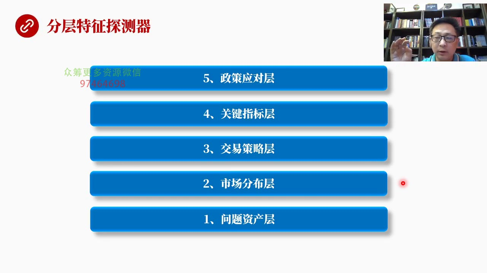

专门讲到过我们认识任何事务其实都要把它建立起来一套这个特征探测器的系统也就是我们需要把一个事务不同的侧面不同侧面中间那些点形的特质抽取出来什么叫抽取出来不断的舍气细节抽取那些点形的轮廓只抽取逻辑架构而...

<strong>All subtitles</strong>

> 专门讲到过我们认识任何事务其实都要把它建立起来一套这个特征探测器的系统也就是我们需要把一个事务不同的侧面不同侧面中间那些点形的特质抽取出来什
> 么叫抽取出来不断的舍气细节抽取那些点形的轮廓只抽取逻辑架构而抛弃那些细节所以我们今天所讲到的这个认知金融危机的算法实际上是建立在特征探测器这
> 样的概念之上的而且这种特征探测器是一种分层的就是底层然后逐渐往上一层一层的堆极每一层展现某一个侧面它是一个点形的特征抓取为什么它有分层其实我
> 们会看到金融市场中间出现金融危机的过程中它不是同时间的一起爆发的其实也是存在一个层次的建议的过程所以我们在认识金融危机的时候也需要有这样的认
> 识就是从危机的不同的侧面来找它最点形特征而且它是一个叠加式的也就是第一层是问题资产层这层有说明整个金融体中有多少问题资产这是形成危机的一个最
> 基本的东西就是如果没有问题资产也就不可能爆发委约也就不会有金融危机这是一切问题的底层那么第二层是什么呢是这些问题资产到底分布在哪些市场中间也
> 就是市场分布层那么第三层层次在这些分布了市场中间那些主要的玩家们会采取什么样的交易策略来持有和交易这些资产那么在这个资上那就出现了关键指标层
> 因为要交易就一定会出现各种各样的数据那么这些数据将会被体现为一些具有点形特征的这些指标所以我们在第四层专门抓取这些点形的指标那么第五层也就是
> 出现了金融危机之后那么政府不管是美联处还是美国财政部还是各国政府他们会采取什么样的政策应对的方式而这些政策应对的方式到底造效还是不造效所以我
> 们如果把日式金融危机把它分成若干个层次每个层次只抓最典型的特征它的好处是什么好处是我们在探讨每个层次的时候在探讨每一层的时候我们只关注它的点
> 形特征而不用去考虑其他层次的相关性这样的话会使我们的经历更集中会使我们的关注的焦点更加突出所以日式复杂事务一定是采取一种特征探设器这种方式那
> 么在金融危机认识过程中我们采取的是一个层级式的特征探设器分层式的我们在这里选取了五层这就是我们走的方法论下面我们再看下一页首先问题资产程

---

### Slide 4

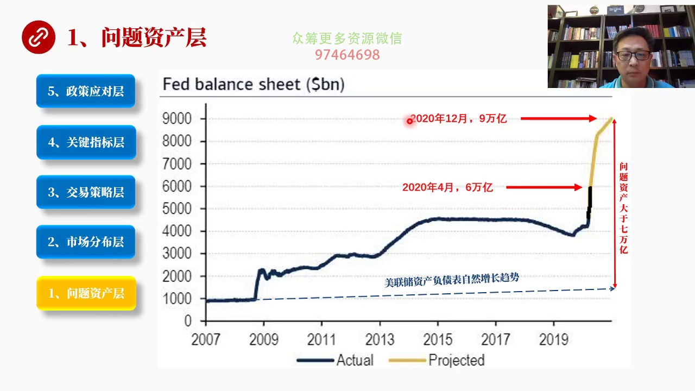

这是第一层次最底层的我们怎么来认识金融体系中存在着多少问题的资产呢其实我们可以从这个图中可以看到这是美联储的资产负代表美联储我们都知道是1913年建立的12月份他从1914年开始运转从1914年一直到...

<strong>All subtitles</strong>

> 这是第一层次最底层的我们怎么来认识金融体系中存在着多少问题的资产呢其实我们可以从这个图中可以看到这是美联储的资产负代表美联储我们都知道是19
> 13年建立的12月份他从1914年开始运转从1914年一直到2008年90多年时间在这么长的时间里面美国经历过一次大战24战还有越南战争朝鲜
> 战争等等一系列大规模的战争和局部战争包括最近的反恐战争还经历过十几次消条和经济危机所以每次经济危机每次战争都要靠中央银行提供资助尽管这样经过
> 漫长的90多年的时间美联储的资产负代表它是一个非常平缓的速度在增长如果这是1913年那么到2008年经济危机之前它的总数大概是8000多亿好
>  这是一个缓慢积累的过程如果我们按着过去90年积累的这个积累的速度来计算的话如果一切正常跟9过去90年一样的话那么我们看到美联储的基础资产负
> 代表到现在应该是15000亿左右这当然是个孤算但是我们可以看到美联储的资产负代表从2008年经济危机之后出现了大幅度的飘升以这样的速度在快速
> 盘升这是经济危机之后两个宽松一 两个宽松二这是两个宽松三然后开始缩表缩表到了2019年爆发前荒又开始反弹然后到了几年的2月份出现了新冠疫情之
> 后开始直线盘升然后再出现了这个石油危机之后就完全是一个事不可党的网上飘升了这样的一个态势那么到今年年底按照这个美国银行银行界的这个很多孤算美
> 联储的资产负代表将会突破9万亿也就是从2008年的8000亿到2020年底的9万亿中间会有一个庞大的一个落差这个落差就是我所称之为的问题资产
> 这个总金额应该大于7万亿因为正常的它的值应该在这儿1.5万亿而今年年底会到这儿那么这个7万亿的问题资产说明什么说明从2008年以来所积累下来
> 的旁大债有问题用正常的经济增长是消化不了的必须要靠中央银行印超票来化解这些烂帐而这些烂帐始终没有完全被冲销虽然今年在增长但是仍然冲销过完所以
> 他们预计在央行资产质表上长达十几年一直到现在已经达到了失控这样的边界所以我们可以从2008年以来所积累出来的巨大的一个问题资产的规模这是我们
> 现在认识这一轮金融风报的一个出发点很多人没有看到历史这种纵身所以认为现在出现了问题僅僅是今年或者去年短期之内爆发了一个临时性的问题其实不是这
> 是一个水位不断提升的过程这是水位不断在增高的这样一个过程所以我们应该把历史的眼光用历史的眼光来看这个问题所以整个这个问题资产的总规模应该是大
> 于7万亿的这是我们建立起来一个数量级的这样的一个概念那么这些问题资产主要集中在哪些方面我们知道2008级金融危机爆发的时候问题资产主要集中在
> 个人贷款尤其是按揭底下贷款方面那么这一次积累了这么长时间的这个债务主要的方面定不在个人贷款比如说这个按揭底下贷款还有个人消费贷款他们所占的笔
> 质应该说在金融危机之后有所下降那么政府贷款呢政府的这个债务虽然大幅攀升但是由于美国政府掌握的硬超机它实际上不在我们讨论范围之内真正大幅增长的
> 而且这样的比重越来越大的超过了个人和政府复债总合的实际上是企业债务我们看下一页这是美联储资产复杂表中

---

### Slide 5

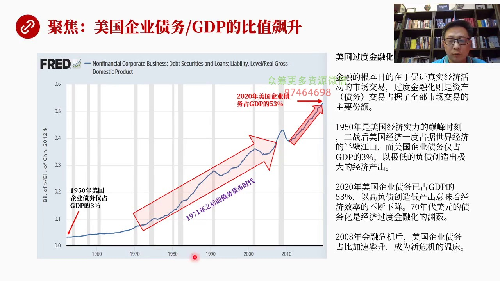

我们可以把所有美国企业非金融机构这些企业的总的债务加了一起除以美国的GDP我们会看到这样一条曲线这条曲线从1950年开始一直到现在2020年4月我们可以看到在这个漫长的过程之中美国的企业债就是企业债务...

<strong>All subtitles</strong>

> 我们可以把所有美国企业非金融机构这些企业的总的债务加了一起除以美国的GDP我们会看到这样一条曲线这条曲线从1950年开始一直到现在2020年
> 4月我们可以看到在这个漫长的过程之中美国的企业债就是企业债务占GDP的笔质是在不断的攀升而且越来越快比如说1950年的时候美国的企业债仅占G
> DP的3%是一个非常非常低的数值而现在呢达到了GDP的3%达到了GDP的53%这就是美国过渡金融化导致了严重后果金融了目的地是什么金融了目的
> 在于促进真实经济活动了市场交易而过渡金融化呢它是以资产所谓资产其实就是债务就是资产的交易分额越来越大占G了全部市场交易的主要分额比如说202
> 0年美国企业债务占到GDP53%就是严重金融化的后果或者叫过渡金融化的后果为什么我说它是过渡金融化实际上过渡金融化是一定会削弱一个国家的实力
> 的你比如说1950年美国经济实力应该说达到了它立上了顶峰的时候也就是二战之后美国的GDP一度占到全球经济规模的半笔江山而美国企业债呢仅仅占G
> DP的3%3%呢这是个极低的一个数字也就是当时的美国企业有这么强大的生产力有这么强大的实业经济的这种活力它才以3%的也就是极低的复债却能创造
> 出极大的经济产出这说明什么说明它的经济效率非常高当然它那个时候就是世界老大应该说毫无疑问它一个国家所产出的各种商品和物资提供了服务超过了全界
> 其他国家的总合所以它的效率高复债低那么2020年呢美国企业债占到了53%也就是以非常高的复债跟1950年相比去创造一个比较低的产出这意味着经
> 济效率在这过去几十年中不断在下降根源出在哪如果我们看这条曲线从1950年到1970年美国企业债务仍然非常低也就是5%到8%左右没有超过10%
> 这是10%但是从1970年之后也就是美国1977年废出了新闻位走上了债务货币这条道路之后我认为这是一条不归路在债务货币之下过渡金融化将会变成
> 一种自然而然的发展趋势因为货币没有刚性的这种货币纪的约束了它可以放量增长很多人都在说到这个好像现在经济发展越来越快然后黄金供应赶不上经济发展
> 其实是个明天大谎如果我们按不变价格来计算的话经济增长根本就没有这么快其实一个国家的经济如果能真是增长率能达到3%持续不断的有效增长率达到3%
> 这就是相当了不起的一个成就能达到5%到7%那就是一个天文数字了如果货币的它的价值稳定的话你可以看到经济增长不会那么快也不可能那么快我们现在看
> 到了各国经济的盟长是由于货币被严重住水所造成的也就是货币越来越贬值所以你看到总量再增加其实没有用就像我们80年代你买一斤猪肉跟现在买一斤猪肉
> 我记得80年代买斤猪肉是七毛八七毛八一斤现在七块八还是十七块八大家可以去想也就是货币贬值这么多倍你那个GDP的总值给你带来了财富的增长那完全
> 是一种虚幻没有意义没有价值所以这就是我们看到的当你把货币贬值之后就一定会吹一大债务的泡沫所有东西都变成了金融资产金融资产交易越来越从10月中
> 抽取现金流实际上对实体经济会产成极大的压制作用也就是到抽实体经济的血液去满足金融交易的这些人的利益换句话说从1997年之后美国已经逐渐走向了
> 金融资本主导这个国家的一切方程和政策特别是在2009年之后我们看到这个协率变得越来越短这说明美国已经轮落成了金融资本主义他的一个应该说操控之
> 下的一个经济体实际的财富被不断的挖空实际上是发生了财富转移这就是为什么美国他在最近是来年你会看到他的经济实力越来越下降从这个历史来趋势来看这
> 是必然的其实我在货币战争1235中回过这个世界各国历史你都会看到只要一个国家开始玩弄货币的开始动货币的手脚在贬值货币的道路上走了第一步之后就
> 说明这个国家的经济和他的实力将会不断的下降为什么因为货币是一个天平货币是一个经济活动的渡量横你不能随便去动它如果你签米你这个客你这个苗这些机
> 长大位在美式美客发生变化的话那么整个经济前会陷入混乱就像建筑工程师我如果米今年的米和明年的米差0.5%那么级你这个长年累月之后这个大楼就一定
> 会贪它如果我的时间每秒的这个机量标准也在发生不停的变化那么我就没有办法进行体育比赛因为我不知道白米赛跑在1984年和2008年这两场比赛在到
> 这有多大的差别那么一切经济活动都会失去所以当一个国家开始在货币上做手脚的这个时刻说明这个国家的货币的政策已经开始走向墮落也就是喪失了货币的刚
> 性继续地要求再往下走这个国家一定是摔落的这就是历史给我们的经验和教训所以我一观认为中国不应该学习美国的这种债务货币制度特别是当我们回顾历史之
> 后更要看到这种债务货币它最后走向的必然的一个发展趋势就在我看来必然发展趋势就是不断的弱化直到崩溃这就是我们看到当美国的企业债务占积率比值不断
> 标升的时候这说明2008年之后这种标升的速度加快说明企业债务成为新一轮债务危机的温床我们再看一下一些好 我们已经知道企业债会出问题那么企业债中间最贬型的特征是吗

---

### Slide 6

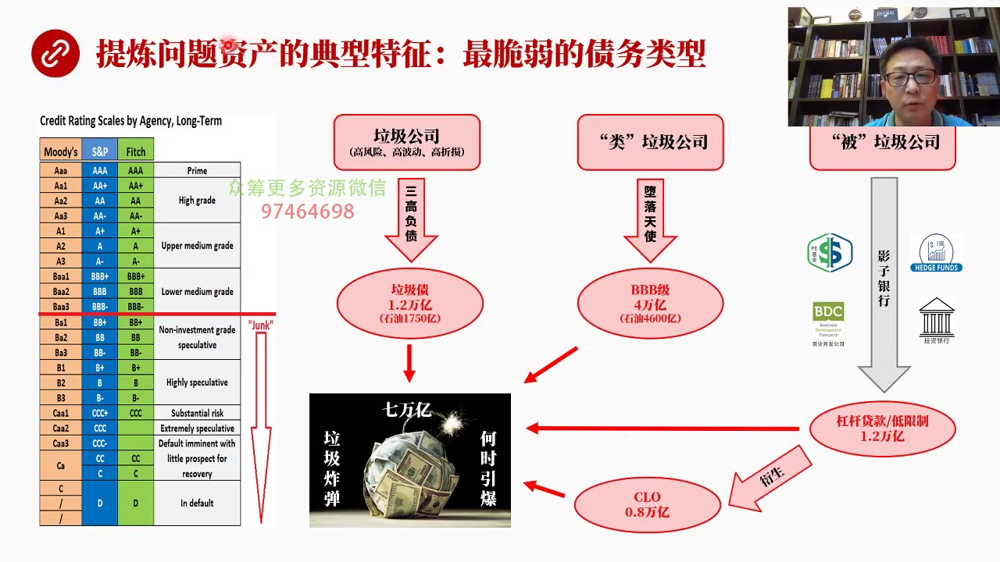

也就是提链问题资产的典型特征抽取最关键的那些信息它最脆弱的链条在哪里也就是最脆弱的债务类型是什么好我们如果来看右左边这张土这是美国平级公司三大平级公司所做的一个去用平级的一个基本的标准我们可以看到如果...

<strong>All subtitles</strong>

> 也就是提链问题资产的典型特征抽取最关键的那些信息它最脆弱的链条在哪里也就是最脆弱的债务类型是什么好我们如果来看右左边这张土这是美国平级公司三
> 大平级公司所做的一个去用平级的一个基本的标准我们可以看到如果我们也SMP作为标准的话那么这是一条红线这个红线以下的叫拉基债以上的叫投资债好也
> 就是在BBB建议下的通通属于拉基债我们来看美国企业债务中间最脆弱的环节当然首先就是拉基债也就是在BBBB建议下的这一部分就是拉基债拉基债可以
> 称之为是三高负债高风险高波动高折损也就是它的平级很低现金流也不够一旦发生问题它的资产价格将会以大幅波动如果出现纽约或者倒闭那么拥有它的债券你
> 的从这个一块钱中所捞回的这个损失挽回的损失这个比例是很低的所以这就叫三高负债美国拉基债它的总规模大概是多少1.2万亿注意我现在全部用金融风暴
> 之前也就是二月份发生金融风暴之前的数字来给大家做说明那么在这1.2万亿拉基债中间石油也就是能源岩游岩器这些行业中发行的拉基债券的总规模是17
> 50亿美元好我们知道这一块是整个水霸中间最底层的压力承受最大的而且它的质量最差的也就是最脆弱环节这是一个部分还有部分呢这是拉基公司还有部分叫
> 累拉基公司如果说拉基公司是三高负债那么这些公司叫墮落天使墮落天使就只了以前它是高平级的公司比较三个A两个A什么那么在最近一段时间或者由于它经
> 营不善严重下滑到BBB或者BBB节最明显例子比如说波音以前是个非常好的公司但是就是由于我刚才讲到它的金融资产过渡深化之后实业就没人干了这是一
> 个国家从领导人意制到每个员工普遍存在的社会现象不是某一个人某一个机构想改就能改的常年以来形成的几十年以来形成的这样一种大家种资产交易侵实际经
> 济的这种发展就会导致它基础设施投资越来越差基础设施还有这种稳定的这种各种服务的保障就会越来越低而且在企业内部也会出现人服于事或者说高兴闹脚或
> 者说真正搞技术人被踩在脚下一些玩馆里的学商业的搞这个法律的或者现在是投资银行这一帮人层层网上网上充所以这些被提拔实际上代表整个社会风气的恶化
> 而这些人把真正创造实在在价值人踩到了脚下博文公司就是最明显的例子之一这种现象出现的美国各大企业中间不光是飞机制造公司各种公司都存在这样一个问
> 题也就是真正老实的干本分工作的技术工作的这些鼓干在企业中并不是那么吃香所以他所代表了这种风气使得社会的对于这种质量对于这种精役球精的出突破他
> 的要求以博文公司为代表不断的下降所以博文也成了新的所谓斗洛天使掉到了BBB左右所以这就是我们看到类拉基公司类拉基公司他们的发信规模非常大高达
> 4万亿美元也就是说接近美国整个投资市场投资企业债市场的半笔江山那么在这4万亿中间有石油就是烟油烟气的这种BBB债券BB一下BB加以下BB亿和
> BB债以下的这一类在这两项中间他们一共赞到了4600亿美元那么第三类叫贝拉基公司就是公司本来还不错但是被掏空了所有的资产他们的资产被批移公司
> 被商业开发公司被对冲基金被投资银行不断的掏空这是一种类似于突救的那种精英方式结果通过影资银行体系把这些公司的真正的精华和财富进行了大规模的像
> 私人的转移使得这些公司被垃圾了那么他们最终体现的结果就是杠杆代款特别是第一线之类当杠杆代款杠杆代款总规模大概是1.2万亿第一线之类杠杆代款的
> 规模在1.2万亿中间占1万亿那么这些杠杆代款实际上又经过了再次衍生变成了CIO到目前为止接近0.8万亿所以我们把垃圾债1.2万亿BBB4万亿
> 再加上1.2万亿的杠杆债再加上他们衍生出来CIO这是单独交易的0.8万亿加在一起我们会得出美国最典型的问题资产的总规模大概是7万亿跟我们刚才
> 所说的资产负赛表所体现的概念是一个概念实际上这些就是常年累月经济用货币冲刷无法把它彻底洗掉的问题资产的总规模大概是7万亿好 我们再看下一这就是我们刚才所说的问题资产层

---

### Slide 7

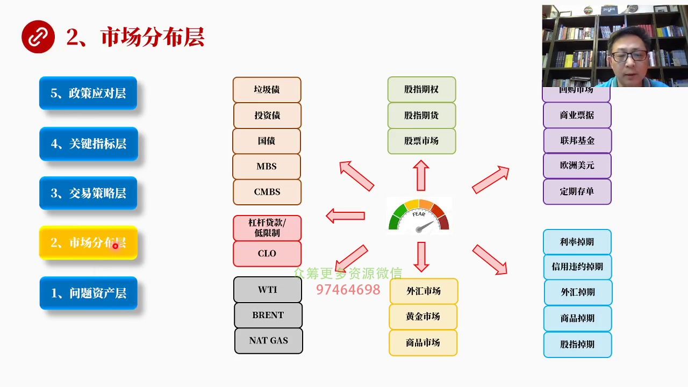

我们现在再来讨论第二层次在问题资产之上这些问题资产究竟分布在哪些市场中呢为了形象起见我把它化成了一个市场的一个包围中间的这么一个这样的一种这样的一种展现方式因为在展现市场分布的时候我们碰到了很多很多比...

<strong>All subtitles</strong>

> 我们现在再来讨论第二层次在问题资产之上这些问题资产究竟分布在哪些市场中呢为了形象起见我把它化成了一个市场的一个包围中间的这么一个这样的一种这
> 样的一种展现方式因为在展现市场分布的时候我们碰到了很多很多比较难的问题就是你理解一个概念和你用图形化把它展现出来其实是两回事那么在这张图上恐
> 慌指数也就是市场波动性放到中心我们看到市场恐慌的这种情绪会分别冲击不同类型的市场比如说在左上角我放的这一块就是债券市场从拉基带到投资债到国债
> 到NBS到CNBS这都是属于债券市场那么还有一部分就是非交易型的或者交易比较低的干干赖赖款当然还有它的衍生产品CIO那么除了这个之外还有原油
> 市场我把所有可能出问题或者问题资产最严重的放到最左边以便于移墨了人当市场情绪出现恐慌手首先冲击这是这一半这一策的这些市场但除了这些市场之外还
> 有比如说股票市场包括股票的衍生的股纸期货股纸期权等等那么在这一策这一块就是紫色的这一块标志的市场叫货币市场货币市场有回够有商业票剧有联邦基金
> 欧洲美元定单这个定期存单等等然后在下面这就是以金融衍生产品市场包括利率调期信用约调期外汇调期商品调期股纸调期等等那么在下面就是另外一种市场外
> 汇黄金商品当然还有其他各个种类的其他的市场但是这些市场是这一次受到这次金融风暴受到严重冲击的市场所以我们要重点下去讨论这就是我们看到的美国金
> 融市场的主要的组成部分债券股票货币金融衍生产品市场包括外汇黄金商品市场包括石油市场包括一些像杠杆代款和CIO这样的一些非标准的市场这就是美国
> 这一次金融风暴受到重创的一系列市场大家其实可以从这些市场的数量和它的种类就可以参加到我们要体验出中间的逻辑关系这将事件非常具有挑战性的工作就
> 是你要把各种这个市场之间的关联性关联的这种它的逻辑性要抓出来而且要找到相对应的指标而且要知道发生的顺序所以我在整个岁份花了整整一个月仔细书里
> 的过程中觉得这个问题是最具有挑战性的因为工作量极大那么这是整个市场它的空间分布和他们跟市场信心之间的关系我们再往下看那么要研究美国的金融市场我们首先必须要理解一个概念

---

### Slide 8

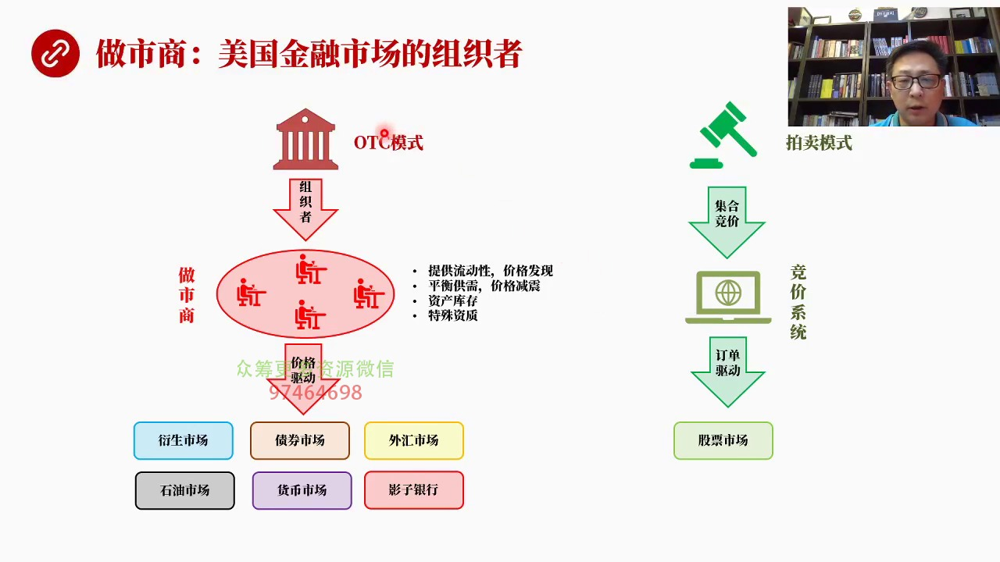

就是做事伤制度在我看来我们要研究市场就首先得知道它的市场组织者是谁应该说在美国做事伤是金融市场中最核心的组织者那么在美国金融市场中其实包括大致来说包括两大类一类是OTCOTC模式另外一类是拍卖模式OT...

<strong>All subtitles</strong>

> 就是做事伤制度在我看来我们要研究市场就首先得知道它的市场组织者是谁应该说在美国做事伤是金融市场中最核心的组织者那么在美国金融市场中其实包括大
> 致来说包括两大类一类是OTCOTC模式另外一类是拍卖模式OTC模式就是跪台如果我们想象这个直观想象一下就好比是小卖布那么拍卖模式就好比是能冒
> 市场这两种模式实际上代表着也包括全世界最有代表性的就是这两种OTC是你到一个店铺里面去买东西你其实并不是直接跟生产者打交道因为生产者店铺了老
> 板通过一系列的采购链条从生产者当而拿到了商品你最终你直接接触的其实并不是生产者这个就是跪台交易的一个典型特征那么拍卖交易拍卖模式就是所有人所
> 有买家全部在一个市场中然后大家进行进价出价高的先得股票就是最典型的拍卖模式而美国经常上我们可以看到OTC这个模式它的组织者是做事商那么这些做
> 事商它有什么条件首先你必须要有一些特殊的资质不是谁想当就能当的它主要的主要的功能就是为市场提供流动性帮助价格发现也就是说比如说我们举一个简单
> 例子在一些比较小众的市场上比如说艺术品收藏你有一幅橘杯红的话你现在要想在市场中把它卖出去你怎么卖呢因为不存在一个拍卖市场不存在一个大规模的所
> 有这个橘杯红的话全部按照标准化的像股票一样有很多人去买不是这样的市场你必须要在这个市场中找到一个做事商这个做事商就像这种专业的买家它从你手上
> 把橘杯红的话买回去然后再找另外一个卖家再卖给这个卖家所以做事商它是为市场提供流动性的也就是由于有他们存在你的橘杯红的话才能顺利卖出去当然它在
> 这个过程中也会进行价格发现它知道橘杯红了一幅画只多少钱然后这个市场也接受这个价格所以它实现价格发现当然还有就是平衡供需价格减震如果说有很多人
> 一起卖橘杯红的话那这个市场价格不就被砸了吗这样不行所以做事商在这个过程中起到了一个平衡供需也就是你如果抛到太厉害它就会在这个市场中控制卖家控
> 制卖家和卖家来减震而它同时需要一个资产库存所以这些做事商制度是美国最特殊的或者说是美国跟中国相比最独特的一种制度那么我们中国人一般想进入市场
> 其实理解的都是拍卖市场就是我们的股票市场比如说上海的股票市场深圳股票市场都是典型的拍卖模式就是集合净价千百万人一起勇向这市场发送订单这些订单
> 被集中在一起送进净价系统净价系统按着时间顺取按着价格高和低然后把这些订单输理出来然后在这个系统中自动挫合所以这种系统叫典型的订单驱动就是这个
> 系统本身没有价格偏向你只要给我的订单它的趋势是什么我就按着它的趋势走所以它是定单在驱动最典型的就是中国的两大股票市场而中国在中国的这个金融体
> 中间很少具有做事伤这个概念我们也没有这样的传统而西方基本上都是做事伤起来的主要原因就是又剩下文化资本了中国人不信任做事伤制度因为做事伤因为这
> 你要为市场提供流动性为市场提供服务而且你自质要特别好所以你要为市场提供做事的这种服务就必然享有特权而中国的市场和中国的高考是一个道理中国相当
> 强调这种公平性我不搞进行教育比如哈佛大学他可以不看高考成绩我就觉得你是我们的社会精英或者你妈式的社会精英所以我就要对你有优惠有照顾这就是美国
> 做事伤制度的教育版的体现中国不行中国必须人人都得高考哪怕你是国家领导人的孩子也得参加高考这是拍卖模式最典型的这种文化特征西方不是这样所以西方
> 的做事伤跟西方的这种所谓长春同大学是一个道理他们培养社会精英而社会精英也享有相当的特权所以美国民主制度实际上是一个特权精英主宰下的一种制度不
> 是我们所理解的法国证接级大革命所提倡的那个人人平等不是怎么回事所以你理解他的政治也好理解他的经济道理本上是相通的他有这套制度中国现在想学但是
> 我相信这套制度中国一定学不会比如说中国的股票市场中有新三版新三版也想搞做事伤制度但是他们倒是参与了各种教育但是他们并不提供真正的做事服务做事
> 伤的这种服务比如说中国的银行间教育省也采用了做事伤制度基本上也没有达到类似的效果换句话说我们没有这样的基因所以玩不断做事伤这种制度怎么事其实
> 道理都一样我们看到美国的整个金融体移中间做事伤制度实际上站了市场中的绝大部分真正的标准化的教育省很少比如说紐教所比如说美国的其他教育所中间可
> 能主要是以进价交易为主当然纳斯达克中间他就是采取的做事伤制度紐教所中间他是混合类的既有即可进价部分也有做事伤的这种制度而在这些市场基本上全是
> 纯做事伤也就是你买卖债券买卖国债买卖各种不同期限的这种企业债找谁啊找做事伤没有一个中央的市场让你在那儿进行教育原因很简单债券市场它的细分的标
> 准化程度比较低比如说某一个企业发行的一年期的三年期的五年期的七年期的有成坚上万家企业然后每个企业在发行弱干人不同品种的这种债券我上哪去找这么
> 多同时要参与这个教育的人做不到外汇市场一样比如说我们在买卖美元的时候你都跟谁做啊你当然是跟银行做你把你的人民币交给银行银行给你美元你从来不会
> 在一个外汇市场上像股票一样的你把人民币给他然后有人就自动的匿名的就把美元给你做不到其实不在美国石油市场货币市场影资银行基本上所有最主要的金融
> 市场全部都是做事伤制度所以我们要理解美国的金融体系金融市场你要不理解做事伤你就完全没有办法理解这个市场这就是中国和美国金融体系的非常不一样的
> 地方而我觉得大部分中国人在想金融市场说主要想的是美国的一个一个比较小的市场而不是而没有看到它这个真正市场的规模的主要部分是在这儿因为为什么我
> 们要了解做事伤其实就是因为这次这个在金融的这场风道之中美国做事伤制度出现了严重了问题其实我们看到了包括国寨市场的流动性的哭泉都是跟做事伤有密
> 切关系的所以如果我们不深入了解做事伤的这种运行的规矩这个规则我们就没有办法真正了解危机的一些细节我们再干下野那么做事伤究竟它有它出在一种什么样的内外

---

### Slide 9

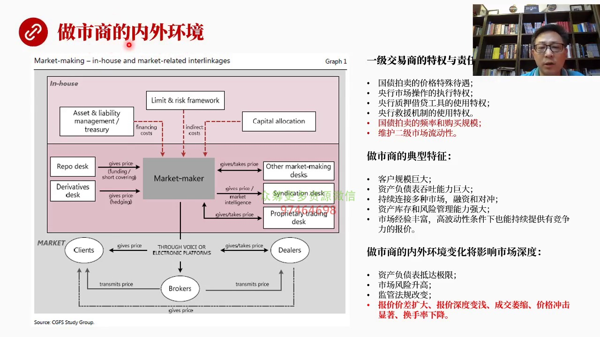

环境之下它到底在做些什么工作这张图是一个非常好的一个说明图我们可以把做事伤它到底做什么工作它停了哪些服务可以从这张图上看得非常清楚做事伤它分成内部的和外部的内部inhouse外部是这个市场交易的这帮了...

<strong>All subtitles</strong>

> 环境之下它到底在做些什么工作这张图是一个非常好的一个说明图我们可以把做事伤它到底做什么工作它停了哪些服务可以从这张图上看得非常清楚做事伤它分
> 成内部的和外部的内部inhouse外部是这个市场交易的这帮了这是两个两块在内部我们可以明显看到首先它有资产和复债的管理然后有资金的这种分布就
> 是出资金和负责配置资金的人这是两个我们还有风险管理这些人控制了这些人这三个部分占据着做事伤的一个核心的业务部门但除了这三个业务部门之外它还得
> 有跟外部进行交易的部门比如说repo就是回够为什么要采取回够呢因为做事伤需要融资以国债为抵押在回够上进行融资它要保持库存的话它自己资本金也不
> 够那怎么办我可以到回够市场上去制压我的库存比如说国债我去换取资金然后扩大我的资产负责表当然除了这个之外我要持有这么多国债风险大了怎么办我还做
> 对冲这就是金融衍生产品这个交易的交易部门的它的作用也就是我要在要在利率上做对冲还是要在七货市场上做对冲还是要做信委员要七的对冲所以它的融资部
> 门和它的对冲部门这是做事伤了一个重要的部分除了这个之外还有其他的市场的交易其他市场的这种做事伤的服务还有包括做一些独特的一些交易那么这些部门
> 构成了它内部的部门也就是在整个做事伤体制内资金怎么调度资产怎么管理风险怎么控制然后融资前从哪来对冲怎么做还有它一些独特的其他业务该怎么开展把
> 这套东西理润之后也就是在它内部形成了这套分工体系它会把资金的成本和资金的收益进行详细的计算之后然后向外报价也就是说我现在愿意为虚悲红的话提供
> 一个什么样的叫卖价和叫卖价这个叫卖价和叫卖价传避到Broker就是这个中介吧注意中介和Broker和Deler它是有区别的Broker一般是
> 自己不做任何交易自己也没有库存自己也没有钱Broker主要作用就是中介主要作用就是传遞信息一个我报价我就告诉客户你愿意买虚悲红的话还是愿意卖
> 我给你这个价叫卖价和叫卖价你接受还是不接受当然还有一种人呢Deler呢Deler它有时候也卖有时候也卖它有时候也传遞信息所以做事商把叫卖价向
> 卖价公布出来之后通过发动交易商和中介商然后通过他们的这种客户关系再向市场的其他的人进行通知所以这就构成了我们看到做事商提供流动性的主要的这样
> 的一个逻辑框架那么做事商中间最典型的当然是依税交易商依税商是有特权的也有责任比如说我们这美国跟美联储紐云银行打交道就24家依税交易商这24家
> 依税交易商如果大家看货币战争2我曾经书里过这些主要的依税交易商它从19世纪以来也就是从南北内战开始他们这24家是怎么发生起来的当然中间有些已
> 经被淘汰掉了他们这个财政部之间是什么关系比如说我当时举了美国国债的最重要的一个家族塞丽格曼家族跟美国财政部发行临肯绿壁和买卖美国国债的时候跟
> 财政部之间的合作和斗争你会看到依税交易商是打拼出来的即便是美国财政部也压不住它就像当于塞丽格曼跟美国财政部部长发生了多次公开的这种较量最后如
> 果这个财政部不通过依税交易商它的国债是卖不动的不管是在美国还是在欧洲市场上都卖不动所以哪怕财政部的部长也得向依税交易商也得买它的账否则的话你
> 的国债销售就一定会失败所以依税交易商的特权是经过上百年的这种上百年的这种激烈形成的他们在国债排卖过程中他又想有价格的特殊優惠那么央行市场操作
> 主要是交由依税交易商来执行他有执行特权当然执行特权就是他一定会附带某些一些特殊的利益比如说他会有市场限制权他会有某种其他的方面的这种执行方面
> 的一种特利他可以使用其他人不行除此之外央行制压借带工具的使用特权我们看到每年出搞了很多借带工具包括repo包括很多这种现在救援金微机搞出一系
> 列的比如说依税交易商救援工具等等只有这些人有权使用这是它的特权那么救援机制它也有使用的特权其他人不行所以依税交易商的特权它是经过历史的长期的
> 这种跟政府之间的酵量获得的当然它们也得承担特殊的责任它的特殊责任就是在国债拍卖了你得频繁参加它是有频率要求的你得每一手至少每一次购买至少要达
> 到一定的规模你要太小了那为什么还让你做依税交易商呢所以你必须要购买较大的规模而且必须要出息的频率要比较高在国债拍卖上那么除此之外更重要的是要
> 维护二级市场的流动性国债依税市场就是美联储跟他们做美国财政部跟他们做做完之后这些国债流到市场之后就像徐悲红的话这个二级市场流动性也得他们来维
> 护有人买有人卖你就必须得给我把买和卖给维持住那么谁能够做做事商呢他的典型特征有哪些呢首先做事商的这个他必须要拥有巨大的客户规模谁拥有越多的客
> 户就是谁手上客户越多谁卖东西就卖得快吞吐这样就大第二自展负贷表的吞吐能力要非常大也就是他有很深的口袋要大量的资金可以吞吐大量的国债第三他要持
> 续他要持续的连续接触多个市场进行融资和对冲就好像在这儿就像就像在这边这个做事商必须要接触同时接触什么呢再骗市场回够市场还有毕率掉期信用率有一
> 掉期还有外国市场黄金市场石油市场等等他接触的市场多他才能够进行对冲才能够进行融资所以他必须要有持续不断的接触多种市场进行融资和对冲的能力当然
> 他有维护一个非常大几千亿美元的资产库存他必须要拥有强大的风险管理能力除此之外还有他的市场经验有很丰富在市场波动性非常强烈的情况之下也能够提供
> 有竞争力的暴价也就是叫买价和叫卖价差距很小而且他还能赚钱这就是你的市场经验只有具有这些特征的人才能够成为做事商只有做事商中间的顶刮刮的人才能
> 进行成为一级交易商那么做事商的内外环境电话实际上将直接影响进入市场的深度比如说如果做事商自然筛表达到了极限他已经吃饱了已经把他的胃口全部撑到
> 了极限了他买卖不了了这个时候他将会影响市场的深度那么第二呢也就是市场风险如果大幅升高做事商不愿意冒险了这也会影响市场深度第三金融监管的法案发
> 生了变化越来越严那么也会影响市场深度什么叫市场深度市场深度包括五个方面第一个方面暴价价差扩大了比如说市场如果变钱了就是暴价价差很大叫买价和叫
> 卖价差了一帽子也许北红的话我一百万收我这个二百万卖中间这个一百万多落差这个就太大了正常情况是下我一百万收一百一万卖这也差不多所以如果暴价显住
> 叫买价显住扩大说明市场深度变钱还有暴价深度变钱这也说明市场变钱了什么叫暴价深度就是我同时能够就说我在市场中叫买价卖的时候不仅是交易就是我报出
> 的价格不仅是一个许北红的话我可以我一暴价就是十张画我都要或者一百张画我都要所以这个叫暴价深度如果你只有一张画的暴价那你是深度不够当然第三个方
> 面是成交成交规模成交如果伟缩了市场的深度变钱了第四个方面是价格冲击就是如果说人家卖一幅画就把这个价格给砸下来了那么整个市场的深度就比较钱就是
> 价格就是交易量很小的买卖就能够把价格严重影响就是价格暴价冒跌这说明市场深度很钱还有总的换手率比如说这个国债市场上50%就是在两年之内50%的
> 国债还没换手说明它的市场深度比较差总体而言这几个方面都影响市场的深度和流动性而做事伤最核心的它之所以拥有这种特权它最核心的责任就是要提供市场
> 深度的五个方面的保证如果做不到说明市场它将会严重个画我们再看下一刚才说了市场分布层

---

### Slide 10

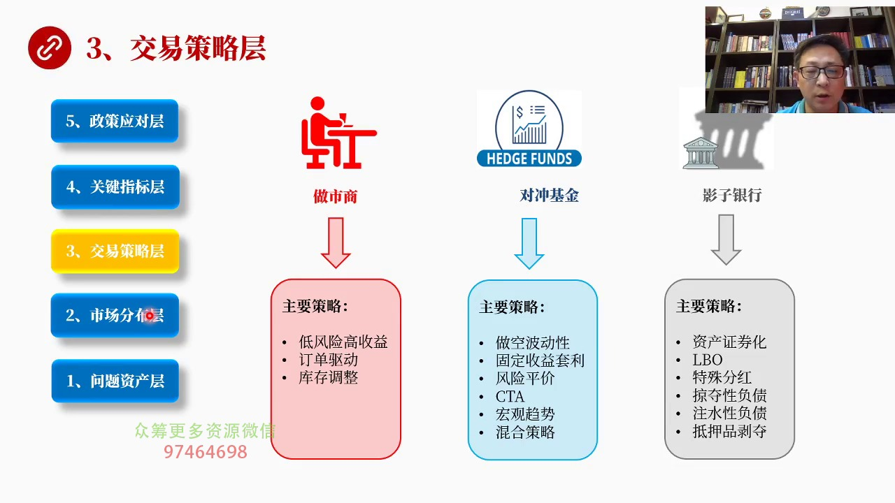

尤其介绍了做事伤制度我们现在来看一下交易策略层交易策略层包括几个方面的人市场组织者做事伤还有对冲基金因为对冲基金是这回出问题的核心缓解是踏出了问题第三 影子银行所以这三个方面这个市金融市场中这三个方面...

<strong>All subtitles</strong>

> 尤其介绍了做事伤制度我们现在来看一下交易策略层交易策略层包括几个方面的人市场组织者做事伤还有对冲基金因为对冲基金是这回出问题的核心缓解是踏出
> 了问题第三 影子银行所以这三个方面这个市金融市场中这三个方面的人当然还有其他的参与者但是这三个方面人是导致金融风暴爆发的核心的参与者所以我们
> 必须要重点研究他们的策略他们在当前的市场情况之下他们会怎么去选择配置资产怎么去选择进行交易比如说做事伤吧我们主要研究它它的策略是什么呢就是它
> 现在切换到了低风险高收益这样的一个策略它现在越来越变成了定单驱动它现在的库存它的资产库存正在进行大规模调整在金融积极之前应该说出现了大规模调
> 整那么对冲基金对冲基金的主要策略我们会讲到这个方面对冲基金的几种类型比如说做空波动性这是一种主要策略还有固定收益套利这有几种不同的类型还有风
> 险评价就是达雷奥他们出问题的这种策略还有CTA公关趋势火革策略那么隐自银行它的主要策略它娃的是资产争券化也就是把企业的这个干败贷款让点贷款去
> 收购企业的这个资产之后把这个形成这种债务进行政券化之后分成这个LBO特殊分红柳多性负债柱水性负债和资产底牙品的波多它主要玩这几种策略所以我们
> 在研究策略时候主要首先定位哪些是关键的玩家这些玩家的关键的策略是什么好 我们再看下一做事伤我们先研究做事伤做事伤

---

### Slide 11

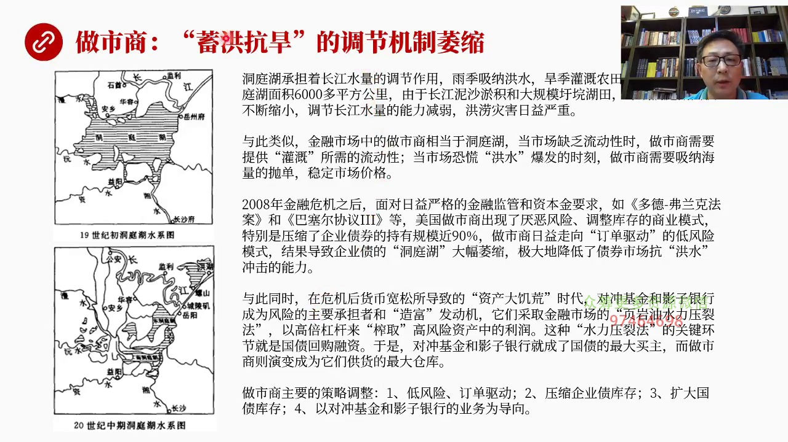

为什么发生了重大的它的策略的调整呢我想在这举一个以水利水利方面的例子做一个形象的比喻这就做事伤制度好比是动停糊我们知道长江是经过动停糊的这底下就是长沙月洋这些城市就是湖南的城市长江经过动停糊它有几个入...

<strong>All subtitles</strong>

> 为什么发生了重大的它的策略的调整呢我想在这举一个以水利水利方面的例子做一个形象的比喻这就做事伤制度好比是动停糊我们知道长江是经过动停糊的这底
> 下就是长沙月洋这些城市就是湖南的城市长江经过动停糊它有几个入水口也就是说动停糊是调节长江水量的最主要的一个吞吐的这么一个环节续红看汉每年暴雨
> 季节长江大量泥沙冲烧下来之后大量红水下来之后可以灌进动停糊它可以做一个有效的缓冲然后到汉底之后动停糊的糊水可以用于灌盖农田所以它是续红看汉这
> 套调节机制对于长江中游地区就有着重要的价值这是19世纪明清时代这个清朝的时候动停糊还有6000多平方公里那么到了1950年前后我们看到动停糊
> 就已经变得非常小了现在大概加在一起吧3000多平方公里比明清时候小一半这个时候它的续红能力就变差了那么长江一旦发红水如果没有长江三峡大壩的话
> 那么整个武汉这个湖南河湖位必然会造灾就在明清时代动停糊不断对于被预级之后这个长江中游地区经常发生大规模同老自然灾害做似伤起到的作用跟动停糊的
> 作用本身是一样的金融市场做伤相当于动停糊当市场缺少流动性的时候做伤要提供灌盖所需要的流动性当市场苦慌出现了红水爆发的时候做伤需要西纳海量的订
> 单然后来稳定市场价格现在的问题是它为什么策略会变化2008年金融一级之后面对越来越严格的金融监管和资本金的要求比如说多德福兰克法案还有巴塞尔
> 协议3等等那么美国做伤出现了一种非常强烈的业务风险调整库存的商业模式就是我不愿意再像以前那样冒很大的风险去吞吞吐很大量的这种库存保持一个很大
> 的库存因为风险太大了金融监管这么严我那么赚钱太累我必须得用其他的办法来轻松愉快的挣钱它要进行商业模式调整那么它最大的调整什么呢最显著的调整就
> 是压缩了企业债券的持有规模进90%注意它基本上已经不存企业债了以前它主要它的库存中主要是企业债而现在呢只是由以前的10%放弃了所以做事伤日益
> 走向定单驱动性就是我不愿意冒风险你们就像股票上拍卖市场一样你们告诉我定单然后我就顺着定单的趋势来走我不再做以价格来驱动这个市场的这样的一个模
> 式我走定单模式因为这样风险低那么这样做的结果是什么呢就是导致企业债这个市场动停糊大幅尾缩失去了吞吐能力当然了这就会降低债券市场看红水冲击的能
> 力那么与此同时在金融危机之后货币宽松造成了什么资产大饥荒啊因为力对太低了所以美国的金融机构赚钱越来越难那么在最近十年之内是哪些公司在承担造副
> 发动机这样的一个功能呢承担主要风险呢对重基金和影子银行他们采取了金融市场金融市场上我称为是类似烟油这个行业中间的水利压裂法用高贝杆杆来炸取高
> 风险自然中的一点点利润由于我加了高贝杆杆之后回报还比较高所以这可以形象的比喻成水利压裂法用高压水去把延世中间的油给炸取出来这跟对重基金玩的不
> 是一个道理吗这是谁逼的当然是中央银行比的因为它把利率压得太低所以低利率很多时候我们要降息要降息降息对失业经济对实际经济很好这完全说法了这个逻
> 辑是错的利息越低鼓励的越是对重基金和隐私银行那么实业反而受到更大的压制因为这帮人要玩才玩的都是水利压裂法他们炸取高风险自产这种利润之后还会留
> 有钱给实业发展呢实际上是倒抽利息压的越低实业被抽取的资金越高也就是利息越低金融资产交易规模越大实际经济的这种它的交易规模越小久而久之就会出现
> 实际经济整个的瓦解连根被拔掉所以低利息这种社会实际经济人长了对一个国家的财富的摧毁作用是非常激烈的是非常残酷的所以我认为要想就世界金融市场要
> 讲就这个世界经济吧只有采取加息而不是减息反正采取减息的办法我们刚才已经看到了美国那个长期的企业债务战GDP笔值的那个生长那个攀升速度发展的必
> 然趋势就是那样最后把自己的国家实际经济给整垮所以在这一轮的货币宽松之下对重基金和影子银行玩高贝尴尬那么他们就成了国债的最大买主注意啊以前美国
> 的国债最大买主谁啊是沙特是中国是日本是海外投资人美国2018年以后大量的发行国债主要是特朗普减税啊减税造成国债巨征财政赤字蒙长国债谁买啊中国
> 在减少美国国债日本也没有增加多少然后沙特没钱增加那么国外减少的美国国债再加上突然增发了这么多国债谁买了主要是对重基金和影子银行所以他们成了西
> 纳美国国债最大的一个出口而做事商呢谣生一变成了为他们提供倉处啊给他们共货就是你没有国债吗我这有我从每年处拿拿了之后就卖给你们或者我从财政部用
> 一击市场中拍卖大量国债然后准卖给你们所以他做事商他的策略发生了根本性变化成了对重基金和影子银行最大的供应参与要这么发展下去的话他当然不愿意再
> 持有具有风险性的企业债了我为什么还搞企业债呢国债不是吗没有风险吗风险很低啊所以这就是的企业债他的形式变成了一九五零年的动体糊没有看红的能力了
> 好那么我们来看做事商的主要策略调整体验在哪方面主要体验在第一风险定单驱动这在发生又模式的变化那么第二个主要特征就是压缩企业债的库存规模第三个
> 主要特征就是扩大国债库存因为玩国债给对重基金他们提供提供这个这个国债也包括资金这玩意儿比大量持有企业债要核算第四个特征就是以对重基金和影子银
> 行的业务为导向主要这是美国的做事商发生了本质性的变化在最近几年之内我们再看如果我们看这两张图我们可以把这个趋势看得非常明显

---

### Slide 12

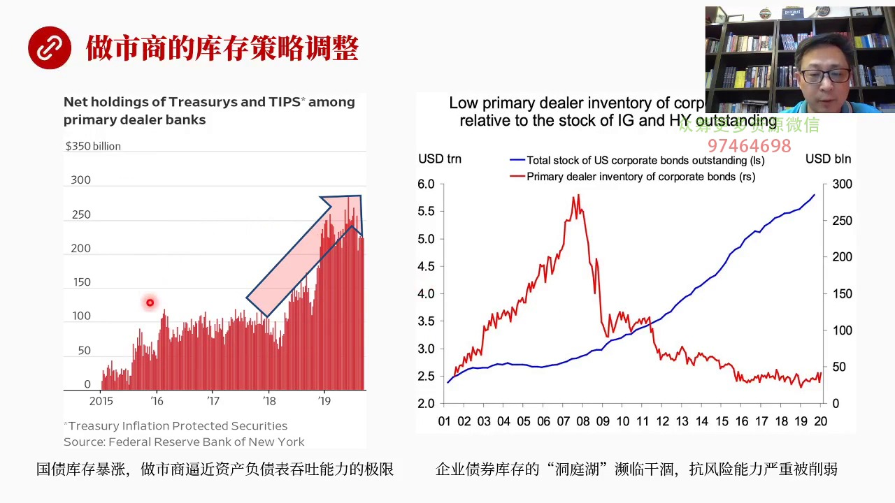

特朗普减税是从2018年之后开始导致财政赤字的猛增当然财政赤字的猛增自然会带来国债供应量的猛增这些国债供应量从2018年开始的大规模的国债增长被谁吹有了主要是被医疆医伤所吹有所以医疆医伤了仓库里面现在...

<strong>All subtitles</strong>

> 特朗普减税是从2018年之后开始导致财政赤字的猛增当然财政赤字的猛增自然会带来国债供应量的猛增这些国债供应量从2018年开始的大规模的国债增
> 长被谁吹有了主要是被医疆医伤所吹有所以医疆医伤了仓库里面现在主要存满了国债几千亿的国债最高受2019年的时候达到过接近三千亿所以医疆医伤主要
> 库存变成了国债而他们以前不是这样当然他纯粹这么多国债之后基本上吃饱了吃到责任的表吃到了他的极限也就是做事伤毕竟了自然负责表吞吐能力的极限这个
> 时候如果再发生企业债方面的危机他就没有能力去干预了因为那个他的库存已经严重下降了下降多少那当然就是这张图这张图我们看到左边这个数轴这是美国企
> 业债的总规模就是余俄那么我们可以看到美国企业债他的总的发行规模是这个栏线企业债发行的当然越来越大这是到2019年他已经六万亿我们看到这是企业
> 债那么红线代表什么红线是一级教育伤的库存一级教育伤的库存在2008年竞争危机爆发售曾经达到过三千亿也就是非常高的一个规模但是2008年竞争危
> 机之后普段下降下降下降了2018年一直到现在只有四五百亿美元所以一级教育伤实际上把国债的三千亿库存现在跟企业债的三千亿库存实际上跟国债做了一
> 个对换做了一个互换他们不再持有三千亿的企业债了现在换成了三千亿的国债所以这就是我们看到的企业债变得有企的威胁这就是我们看到做了商的策略小整对
> 企业债这个是让形成了巨大的压力我们再干下一对中基金刚才我们说了三个主要玩家

---

### Slide 13

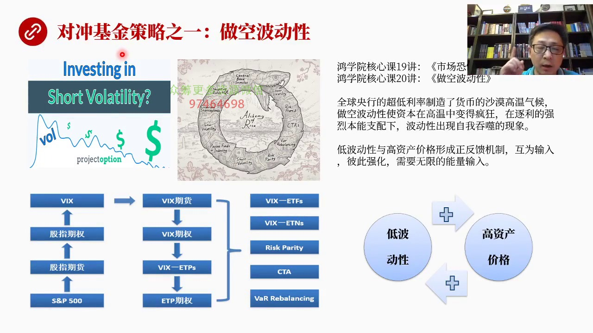

做事商的策略我们已经搞明白了对中基金策略第一个策略就是我们以前核心客中专门所讲的做空波动性在核心客第19、20讲讲了两次专门介绍了他的一些操作细节做空波动性是个什么概念我们可以把波动性和资产价格想象成...

<strong>All subtitles</strong>

> 做事商的策略我们已经搞明白了对中基金策略第一个策略就是我们以前核心客中专门所讲的做空波动性在核心客第19、
> 20讲讲了两次专门介绍了他的一些操作细节做空波动性是个什么概念我们可以把波动性和资产价格想象成一个相互互为输入的一个正反馈系统波动性越低资产
> 价格越高资产价格越高导致波动性越低这是个正反馈我们看到我是用加号代表它正反馈它不断的循环不断的循环导致波动性越来越低然后资产价格越来越高这个
> 过程能够永远持续不断吗不行因为任何正反馈体系都需要无限的能量输入从物理呀从各种模型中我们都能知道只要进入正反馈体系它必须要不断的给它注入更多
> 的能量一旦你这个条件满足不了这个正反馈体系立刻就崩其实全球化 目前的全球化它也是个正反馈体系走到了新冠疫情的这个时刻其实它是有刚性的意志这个
> 需求的也就是如果全球化持续不断这样进去它持续不断下去它需要越来越大的世界的财富去填充那么如果说我们现在达不到的话那么自然界会通过各种各样的形
> 式来压制会导致这个体系出现洁洁的趋势跟金融市场到底是一样的所以当然不是说这个过程不能持续只要再能量了允许反馈体系内它可以不断的循环这就是为什
> 么会有生命为什么会有有组织的一切东西因为有互伤的注入正反馈就能持续一旦能量注入终结受阻卡克那么这套体系就会挖解就会从有序走向无序相反它是可以
> 从无序走向有序的但是有边界条件那么我们讲到的这个做空波动性其实我觉得个例子这就好像一个摇尾蛇全球央行长期来采取超低利率政策实际上制造了一种沙
> 漠气候就是货币的沙漠气候利率非常低一旦有事中央银行就干预所以就没有风险了没有风险这个事让波动性就越来越小那么做空波动性大家都觉得这是一个自然
> 趋势波动性会越来越低那么我们就玩做空波动性这样的策略玩来玩去就使得波动性越来越低自展加个越来越高形成了这个正向的这个正反馈体系这就好像蛇在沙
> 漠的高温气候之下它没有办法它就它有助力的本能怎么办那就加段杆然后到出去找食物自展大金黄结果咬住了自己的尾巴最后一口一口把自己吞掉这就是我们看
> 到的正反馈体系最终的崩溃就是这个摇尾蛇现象的一种自然体现其实摇尾蛇现象早在古埃及三四千年前埃及人就用这样的一个点形的这么一个话体验出来了所谓
> 的正反馈体系不可持续当然正反馈体系在意有条件情况之下是可以保持的超越这个条件边界它就会崩溃其实这是我们认识很多问题的一个我认为是个中心逻辑是
> 一个最根本性的东西不仅存在于金融市场存在于生物界存在于社会组织公司管理存在于我们能想象的一切方面好那么我们来看做工波动性波动性的这个基本的这
> 些内容如果大家感兴趣可以看这两颗的内容也就是说波动性在波动性这个概念实际上它是一个它是SNP从SNP 500掩生出来的比如说这个这是股票市场
> 股票市场上会形成掩争出来股纸气货股纸气货股纸气货演成出来股纸气权股纸气权进行计算可以得到Wix指数孔黄指数孔黄指数又变成这个孔黄指数的气货气
> 权然后ETP也就是它的这个可交易的产品然后变成ETP的气权然后这几类在不断的掩生变成了Wix相关联的ETF1TN和包括封颜评价大量它们玩的C
> TA这是在这个气货市场中玩的这种策略还有所谓的资产的不断的这种跟波动性以波动性为核心进行资产不断的重新调整这一套做空波动性的策略我们以前专门
> 讲过这是对冲气晶的核心策略之一那么第2个策略就是固定收益策略

---

### Slide 14

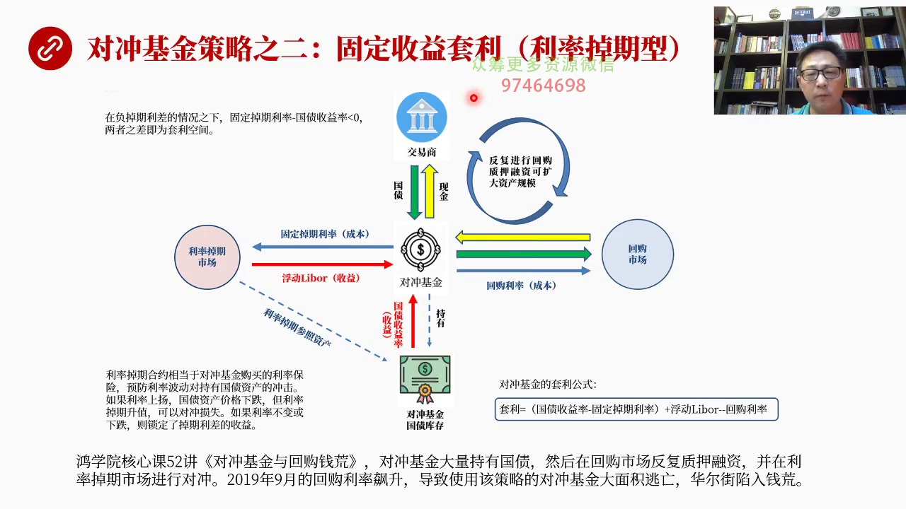

固定收益策略有两大类一类是利率调气行这个我们核心客中第52奖对冲气晶以回够前方中专门介绍过对冲气晶我们说想一下如果你是对冲气晶你持有大量的国债持有大量的国债之后那么你要做一些对冲防范我们想下这个过程就...

<strong>All subtitles</strong>

> 固定收益策略有两大类一类是利率调气行这个我们核心客中第52奖对冲气晶以回够前方中专门介绍过对冲气晶我们说想一下如果你是对冲气晶你持有大量的国
> 债持有大量的国债之后那么你要做一些对冲防范我们想下这个过程就是对冲气晶目的了资金之后他当然要从交易商那买来国债买来国债放到自己的库存里头当然
> 他想做大他的资产资产资产把这些国债拿到回够市场上做质压然后再换回资金然后再去买国债然后再质压再买他是可以已经反复回够质压融资规模可以越来越大
> 也就是他如果想做的话做成10倍尴尬做成50倍尴尬甚至100倍尴尬都是能做到的只要他感冒这个风险那么他由于持有太多的国债所以他一定要做风险对冲
> 这就是在利率调期市场上做风险对冲在利率调期市场上他跟交易对手做一个什么呢就是他要支付一个固定的成本支付一笔成本来换取浮动的收益也就是我要支付
> 一个固定调期利率获得对方付给我的浮动的收益也就是一般跟Libergog所以他的套利的基本的原理就是这个原理只要是付调期利率也就是固定调期利率
> 减去国债收益率相对应的期限小于零的情况之下两者之间就存在逃的空间那么他套利的规模有多大就是这个公式他的套利等于国债收益率减去固定收益固定调期
> 利率再加上浮动利率再加上回再减去回够利率也就是我们把收益红色的两个加在一起再减去成本这两个成本他就能套这么多钱当然我们知道在这个公式中间如果
> 回够利率爆长那这个游戏就崩了这就是为什么2019年9月回够前荒回够利率飙升从2%一口气跳到10%整个市场线入空间苦慌就是因为它个套利变成附数
> 而你加了弱干贝干贝20位50位100位在这样的一个公式之下你不是就立刻完蛋了吗所以2019年这个9月回够前荒这个回够前荒导致根本原因就是回够
> 利率的飙升导致了这种策略利率掉气性策略的对冲基金大面积逃亡华尔街线入的前荒所以看懂这个公式我们就可以理解对冲基金它玩规定收益套利中间的第一个主要策略利率掉气我们再看第二个

---

### Slide 15

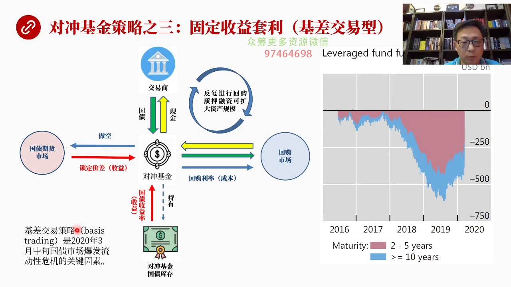

第二个是我们这次要重点就是要重点关注的第二个策略叫机插交易型也是固定收益套利也就是同样道理对冲基金持有大量国债经过反复循环抵押把这个国债规模做到了极大它进行了30倍50倍的杠杆放大之后持有大量国债那么...

<strong>All subtitles</strong>

> 第二个是我们这次要重点就是要重点关注的第二个策略叫机插交易型也是固定收益套利也就是同样道理对冲基金持有大量国债经过反复循环抵押把这个国债规模
> 做到了极大它进行了30倍50倍的杠杆放大之后持有大量国债那么它怎么办我们刚才说它可以在这个利率要欺赏上做封演对冲还有一种做法它是在国债的卸败
> 货和国债的期货市场之间做插架的这种套利也就是我把插架的这个插架把插架锁定锁定插架之后我不管长还是跌我都能够吃到一个锁定的这种收益这个叫机插交
> 易策略这个策略是2020年3月这个特别是3月9号以来美国国债上爆发流动性危机的最关键的因素就是这是这帮人玩玩是这帮人玩砸了这跟9月前方发生了
> 明显的变化如果我们自己拍脑门去想永远也想不到每一种基金策略因为基金策略有很多到底谁是使作勇者谁是赵氏者谁是投等的闯货的人必须要做深入的研究比
> 如说我最近在看就是MF和BS特别是BS这个国际经论银行他们的研究水平非常高而且有大量的跨国的这种数据这是其他一般的央行做不到的每年处你要是美
> 国的数据他可能比较多但是要跨国欧洲亚洲所以我讲他肯定还不如BS所以BS拥有着很多这种经论数据而且他的研究能力发表了这个报告水平都比较高建议大
> 家有机会多读一下我其实就是看到BS在4月10日的一篇文章这篇文章其实让我深受起发他这篇文章他虽然没有直接提但是他给出了相对一答我就一直在想到
> 底哪个对中基金哪种对中基金是这次真正玩砸的人他中间给了一张图通过这张图和他的一切的其他的分析我一下领无到了是这帮人玩砸了就是机差小疫情他们首
> 先出问题他们出了问题之后倒这整个对中基金进行了大规模的解档感形成了庞大的影子银行的精力机所以我们这次金融方报是一场典型的影子银行危机一点都不
> 夸张因为他发生在影子银行体制内这张图说明什么这张图说明美国的对中基金他们所持有国债的空仓在2019年的年中达到了5000多亿美元那么到了三月
> 爆发金融风报手也持有将近5000亿的空仓这个颜色的比较深的折色这代表两年的五年的国债蓝色是十年以上的这种国债那么这个规模说明对中基金在国债市
> 场上是开空仓同时又持有大量的国债的现货他要在期货和现货之间实现锁定差价肯定是这么玩的那么在这篇报告中他其实也提到了这些人是首先是最先开始逃跑
> 的所以我们可以推断出来国债期货市场和对中基金所持有的国债现货的价格在3月9号左右3月9号10号11号12号在这几天出现了严重问题导致它锁定策
> 略彻底失败这就是我们做出了一个重要推论我们再看第四种对中基金策略

---

### Slide 16

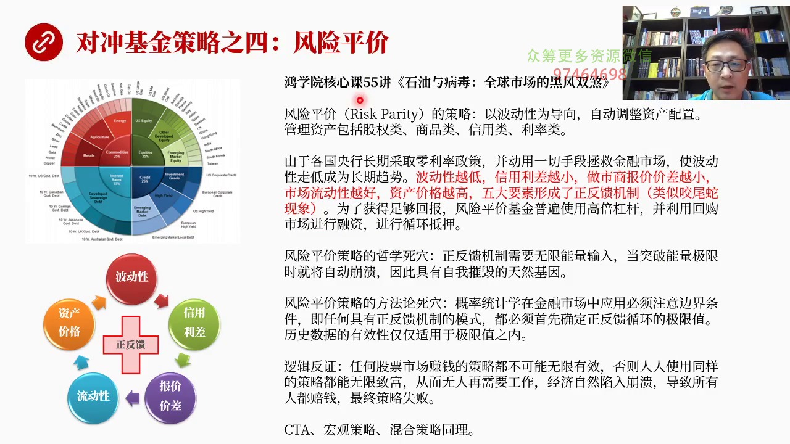

第四种就是风眼评价这是我们和陰克第五十五奖石油和病毒全球金融市场了黑风霜上在这个和陰克里面专门讲了这就是以达雷奥为代表因为它是风眼评价这个策略的组织益它最早提出我们可以用风眼评价来控制一些风眼那么它是...

<strong>All subtitles</strong>

> 第四种就是风眼评价这是我们和陰克第五十五奖石油和病毒全球金融市场了黑风霜上在这个和陰克里面专门讲了这就是以达雷奥为代表因为它是风眼评价这个策
> 略的组织益它最早提出我们可以用风眼评价来控制一些风眼那么它是以波动性为导向的就是市场的波动性这是我们丁准的把标然后只要波动用变我所有资产的配
> 置自动发生变化当然有的有的简单是根据时间每到季度末有的是根据我这个比例我在这个资产组合里面配置比如说我配置25%的债券如果这个比例被发生变化
> 我就要自动调整还有若干不同的这种调整的思路道理是一回事那么他们管理资产包括什么呢风险评价基金包括股权类包括商品类包括信用类包括利率类也就是说
> 所有的这些资产不可能同时出问题吧比如说股票叠了那债券可能会涨为啥呢因为这是悄悄玩那么如果是商品叠了那可能股票又在涨如果利率叠了其他可能在涨等
> 等所以他们认为我把风险平分的就是能够分配在不同类型的资产中间有些甚至还要做跨国资产配置我可以基本上抵御所有风险这就是达雅的一个重要的哲学思想
> 由于各国长期采取低率的政策扬航亚低率而且动用一切金融手段来拯救这个市场波动性当然是越来越低波动性越低信用率差越小我们就看这又是个正向循环正反
> 亏这套体系波动性如果越低那么信用率差越低信用率差是什么就是企业的债券发行的债券同期线的比如说你要是10年的你就跟10年国债比两者的这个率差是
> 多大他代表着金融市场的紧张程度所以波动性如果很小的话基本上没有什么太大的波动说明市场很稳定信用率差一定小做事上那边给出加满价就会非常低那么他
> 就会导致做事上的爆价差价爆价价差很小爆价价差很小说明什么说明买卖很流通就说买虚背红花卖虚背红花一叫卖一叫买立刻就成交因为抢了人多流动性好同时
> 他就会流动性越好自展价格越高自展价格越高波动性越低这就是一个正反亏体系他低就是由他开始他越低然后整个走一圈下来他就会变得更低然后这边就会变得
> 更高一圈一圈的不断的正反亏所以行政这套正反亏之后那么风险评价基金打了要有他们认为我要获得足够的回报我就必须要使用高碧尴尬否则波动性越来越低当
> 然是这个收益也越来越低怎么办加尴尬不断的加尴尬然后他们还要在市场上进行回购进行大规模融资进行循环抵所以才能持有越来越大的资产规模然后才能在一
> 个波动性越来越低收益越来越低的市场中能够转到足够的回报那么打了他这个评价策略的哲学史学是什么哲学史学我刚才已经说了他的根本问题存在于正反亏机
> 制需要无限能量输入如果能量这个如果这个输入能量能量达不到这个标准或者说这个突破能量极限这套体级就会自动崩溃所以这套体系具有的天然的自我撥回的
> 基因不发生任何威行没有…"新冠,"没有石油冲击这套体系也会崩这就是我们看到的为什么在2019年9月没有新冠时候美国也会闹前方为什么在2018
> 年2月没有什么这个沒有什麼這個新冠病情和石油危機的時候為什麼那時候經商也會崩它是周期性的崩主要原因它是存在著血死血的所以打了要在提出風險評價
> 的時候實際上我們我覺得西方人的思維方式他們比較擅長於演藝邏輯而擅長演藝邏輯的人我總覺得他們的全局性思維能力不行也就是在考慮類似於意經這種思維
> 方式說中國人是有看全局我們分析演藝邏輯的時候這是我們的弱項但我們看全局的能力比較強所以我們現在要學習西方這套邏輯體系中間的演藝邏輯要結合中國
> 傳統的這種總體看問題的這種歸納邏輯的這種優勢把兩者接在一起其實打了要這套東西一看就知道這顯然是玩不斷的這必然有問題我不理解為什麼很多人認為這
> 是一個了不起的一個策略在我看來第一眼看他就必然失敗大爾風險評價策略他還有一個方法論的思緒這是從一個很高的高度來看他的思維思緒他的方法論思緒在
> 哪就是概率統計學在金融市場中的應用必須要注意邊界條件現在這個概率統計就是這個其實所謂的風險策略型風險評價型一切的東西都是看數據統計都是看它的
> 標準方差有多大看它的概率發生幾小時間的概率有多大好他根據的是歷史的這種數據進行概率分析在我看起來這是一個重大的方法論的問題在金融市場上不能夠
> 這麼用就是你必須要注意凡事具有正反饋機制的市場或者任何的組織不管是企業、國家還是任何的軍隊只要有正反饋機制存在或者一切有生命體的東西都不能夠
> 隨便亂用統計學必須要首先確定正反饋機制的極限值突破哪個點他會崩潰只有意識到這點之後才能夠使用才會有比較好的效果所以歷史數據在計算概率方面他的
> 有效性僅僅是用於極限值之內超過極限值這套計算方法一定錯了比如說我們在這次這個金融風報中居然出現了8個標準方差的世界那就是跟地球的年齡差不多所
> 以這說明什麼這說明這個策略的方法論特別是大家如果學這個商業的或者學經濟的會大量使用這個概率和統計你會發現他們這個教科書在講這塊的時候完全沒有
> 提到他的試用機械沒有提到這個概念也就是說寫教科書的人也許沒有意識到其實像索羅斯這一人早就提出反生性原則反生性原則在我看來就是一個正反匯機制你
> 用正反匯機制非常容易理解這個概念用反生性或用其他的抽象的龍筒的比喻反而容易把人給繞暈學過李公科的人一提正反匯機制就知道他是不斷地把一種較小的
> 誤差不斷地放大不斷放大就像我們拿著話筒如果話筒跟這個喇叭靠到一定距離就會出現尖銳的測爾聲音這就是典型正反匯那麼如果我們從邏輯上反推為什麼憑風
> 險評價策略它是錯的到了也很簡單任何股票市場上賺錢的策略都不可能無限有效否則人人都會用同樣的策略都能夠無限制復比如說大家要是搞出了一個風險評價
> 策略如果真的是無限有效的沒有任何邊界條件的話那麼任何人都可以使用這套風險評價策略每個人都可以賺的無限多的錢所以沒有人需要再工作了如果沒有人在
> 工作就跟現在一樣經大家都宅著家裡經濟自然就崩潰了經濟崩潰之後所有人都賠錢了所以這種策略是必然失敗的這就是我們從哲學上從方法論上要對這套就西方
> 的這套體系金融的也好或者其他方面也好一定要站在批判性的思維的這種角度來看問題不要毛孟相信他們所說的一切在我看來中國傳統的經驗主義傳統的思維方
> 式特別是歸納邏輯這種思維方式東方的歸納邏輯跟西方不太一樣而東方的在考慮複雜問題上我覺得具有一種我自己感覺具有一種天然的優勢像這種東西其實異言
> 就能看出來根本不需要推倒而他們居然把這個東西當成一種聖經來執行這上我非常驚訝其實早在2008年以前在房裏美的時候我跟我們這個房裏美的風險控制
> 部門的頭就探討過這個問題我非常吃驚地發現他連這個簡單的在我看來非常簡單的這樣的一個哲學的概念都沒有想明白這就是為什麼在我看來一種非常直覺就是
> 直覺你就說明這套策略有問題而真正在執行中拍攝版的掌握我呈現上萬億美元的人居然他還真有可能搞不明白我自己是有社會體會的所以在這次金融危機中我們
> 再次發現很多對中基金放了嚴重的錯誤錯誤就在於很多人很聰明西方人很聰明邏輯演一奴邏輯能力很強但是他們未必善於考慮複雜問題所必須的那種綜合性的邏
> 輯歸納性的邏輯這一點還真不一定他們就更有比我們更強我覺得可能正好相反好 搞明白這些東西之後我們會發現其他的像CTA紅官策略 紅和策略其實基本
> 上犯了錯誤都跟封演評價是一個道理道理是相同的我們再看下一頁好 我們剛才所說的

---

### Slide 17

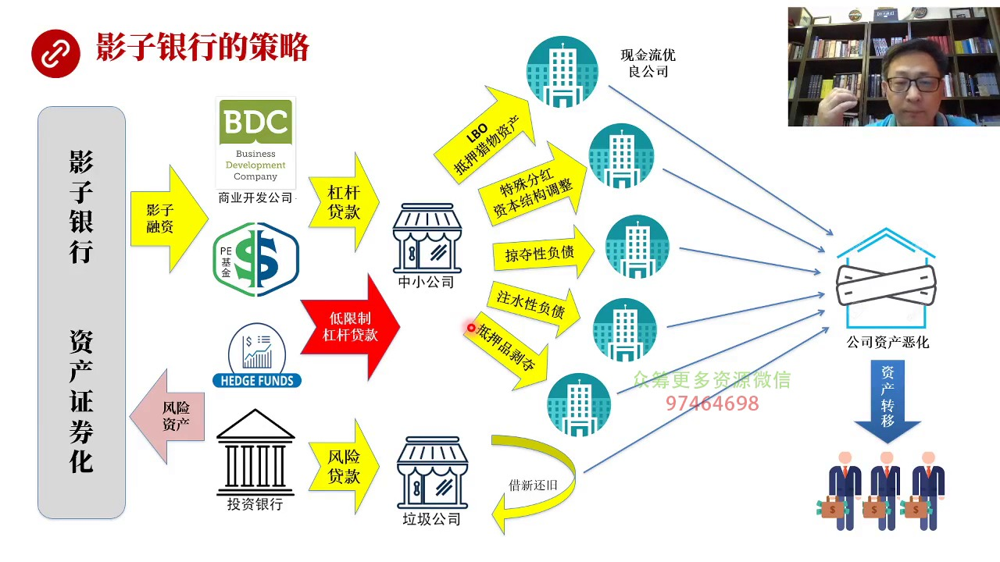

這個做事實上他的策略對中基金他的策略當然第三部分就是影子銀行影子銀行的策略主要是僅自產這麼決畫影子銀行包括哪些人呢商業開發公司其實商業開發公司類似於一種基金也比較它的公司結構比較像LAOC有限責任這種...

<strong>All subtitles</strong>

> 這個做事實上他的策略對中基金他的策略當然第三部分就是影子銀行影子銀行的策略主要是僅自產這麼決畫影子銀行包括哪些人呢商業開發公司其實商業開發公
> 司類似於一種基金也比較它的公司結構比較像LAOC有限責任這種公司也就是公司並不是一個精英的單位它實際上是一個稅它是一個稅務的這麼一種機制所有
> BTC的收入自動流的公司進入個人要報所以它沒有上任正稅公司不報稅 個人報那麼這個模式比較像一種基金P基金BTC也可以算一種基金對重基金還投資
> 銀行這幾個玩家玩的都是從影子銀行體系進行融資不管是個人的還是通過其他渠道來的還是銀行的還是這個其他金融機構來的錢然後把這些錢投向這種宗教公司
> 用使用槓槓耐款的方式然後對這些公司進行什麼呢這個抵押就是這個抵押利用資產比如說我要進行這個槓槓收購那麼我要把收購的對象的資產首先請抵押然後去
> 借錢借了錢之後控制這些公司還有一種方式呢就是特殊紛紅由於我拿下這些公司所以我要去一種特殊的紛紅權來滿足投資銀行需求還有就是抵押利用資產我讓這
> 個公司付很多債把中間的資產掏空注射性負債也是在財固上這個玩手腳目的也是為了挖空它的資產抵押品的抵押也就是我這個控制這個公司之後我讓我的優先權
> 高於其他所有人所以這個公司的抵押品實際上被我已經事先占有了在剛好在貸款中最危險的是低限制類剛好在款這種貸款沒有任何限制所以可以玩得非常的瘋狂
> 最後它的整個的這套玩法的最終結果什麼呢它可以產生很高的收益玩這圈之後它可以產生百分之它產生了這個收益可以達到9%13%甚至更高但它玩的結果什
> 麼呢是把現金流好的這些公司全部整個這個公司資產惡化因為它把它把這些公司給掏空了把這些錢把這些資產公司的資產挖出來之後是讓轉移到了個人個人的口
> 袋裡面就是這些私人投資者給BDC給P基金給HG放的這種投資這些人他們獲得了這些財富大量被轉移到他們口袋之中所以這些流程所產生的負債就是槓槓貸
> 款和高風險的這個CIO就是風險資產其實我們知道這套過程玩的是一種突救戰略把一家好公司最後給整殘了它的規模越大對實業的催淺越大當然投資人士轉得
> 很開心你想有這麼高的回報怎麼來啊那大把這個公司資產拿去賣了你就能夠拿到這麼多錢但是就整個國家的經濟而言這確實是一種非常非常不負責任或者非常有害的做法好這就是我們看到的這個三大玩家他們的主要的一種策略

---

### Slide 18

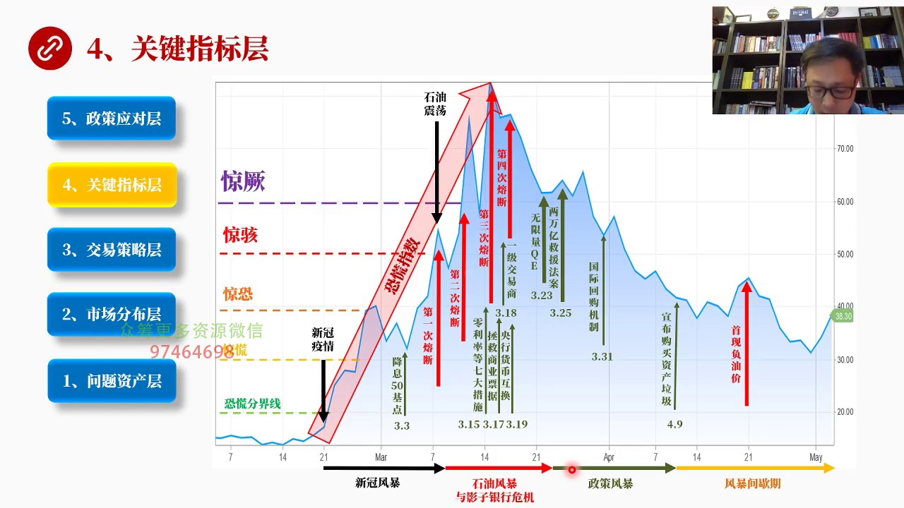

那麼我們下面再看關鍵指標層關鍵指標層其實是一個非常負責的一個問題因為我們剛才已經看到他設計到諸多的市場要理瞬他的邏輯關係要花很長的時間要做細緻的研究工作關鍵指標層我用這張圖來整體概括我們這個三月金融風...

<strong>All subtitles</strong>

> 那麼我們下面再看關鍵指標層關鍵指標層其實是一個非常負責的一個問題因為我們剛才已經看到他設計到諸多的市場要理瞬他的邏輯關係要花很長的時間要做細
> 緻的研究工作關鍵指標層我用這張圖來整體概括我們這個三月金融風暴的一個全過程我覺得總體來看他包括三個階段第一個階段我稱之為是新冠風暴從21號一
> 直到3月9號這是第一個階段第二階段就是3月9號開始是石油風暴一直持續到3月23號每年處無限量開始搞QE也就是建廠買傻就是沒有上線沒有底線沒有
> 旗線的這種量有寬鬆那麼從3月23號之後就是進入了政策風暴大量的救援政策和一些重大的一些舉措那麼一直持續到4月9號也就是每年處宣佈他準備開始買
> 資產都垃圾了連垃圾債他都買那麼3月9號之後一直到現在我稱之為是風暴借貼期也就是我們現在正在過渡這個期間這中間出現了包括石油副價格等等那麼我們
> 如果從這張圖來看這張圖的它的主要它是根據什麼來構造的根據恐慌指數Wix恐慌指數Wix就我剛才已經說它是源自於SMP500股票的一種波動力其實
> 所有的市長都有波動性不光是股票有波動性股票的波動性就是Wix債券有沒有有黃金有沒有也有所有市長都有波動力所有市長的波動力的勞這個勞祖先都是源
> 於他都是源於Wix指數所以Wix指數掩蓬大的波動性的家族當然以Wix指數它的影響力最大比如說債券市長他也有Move也是也是債券的波動力但是在
> 這兒我為了保溫體檢化保溫體給說明白我採用因為這種波動力指數Wix指數基本上是大家都同步的會有一些差異所以我用股票市場的恐慌指數來間接替代其他
> 市場的波動力到底是一樣的那麼從這個波動力上我們可以看到2月21號出現的第一次重大衝擊是源於新冠疫情在那之前市場基本上是平靜的也就是恐慌分界線
> 是2020以下基本市場是穩定的大家心態比較好覺得沒有風險可以冒險那麼20到30到了30之後就進入了金荒線就市場開始有點金荒失措了那麼到了40
> 我稱之為是金恐線要到了50就是金害到了60超過60那就金絕了就昏過去了所以如果我們把這個恐慌指數進行一個數量級的區分我用不同的顏色和自己的大
> 小來表明這個市場的金恐程度在2月21號之前一直到2018年甚至更長你會看到整個市場基本上是波蘭不經由於美聯儲長期的超低力率政策只要出點事他就
> 出手所以任何的這種風險都不會發作那麼大家時間長了就形成了一個貫性就認為市場沒有風險2月21號的時候我們會看到新冠疫情的這個影響力開始明顯影響
> 股市了我把這一天當成新冠疫情風暴的起點新冠風暴石油風暴和政策風暴21號2月21號相當於新冠疫情風暴的70點那麼從這天開始一直到3月9號第2次
> 石油政黨發生之前這段時間是第一階段但是這段時間並沒有導致危機雖然我們看到這個恐慌指數上升比較快但是還沒有爆發所謂的危機只是市場的一種不安的情
> 緒但是3月9號這一天石油政黨出現之後所爆發的堪稱是危機也就是影子養危機從3月9號一直持續到3月23號這段時間這段時間發生的是極其巨烈的是影子
> 養出現了重大危機連續出現了4次中斷我們一般報上看到了新冠媒體直講4次中斷而沒有講它背後什麼原因為什麼它會融斷呢哪出了問題呢出了多大規模的問題
> 呢誰出了問題導致誰跟著出的問題呢多名諾古牌怎麼倒下的沒有細節沒有這個深入的分析不光是我說的中國沒有我覺得我看了全世界很多不管是這種權威機構的
> 像BS或者是要美聯儲的報告還是這種各大金融機構的這個分析報告都沒有形象化的直觀的就是讓人一看就懂得這種金融危機的這種介紹主要原因我覺得可能是
> 真正懂的人特別懂的人所有我們講的東西對它來說都是常識它沒有必要再把它形象化去講給別人聽它沒這個時間也沒這個需求那麼對於其他人來說你真的不完全
> 搞搞明白這人來說它就沒有一個教科書也沒有一個學校的課程專門來分析這個問題因為學校的東西太理論化遠離市場操作所以我覺得在學術界大學金融系經濟系
> 跟市場實操的這個操判手之間存在一個巨大的一個控當這個控當就是沒有人去把這些理論東西跟實驗東西對決在一起沒有人願意去把這些複雜的東西變成形象的
> 東西能夠讓別人一聽就懂得這樣的一種體系讓大家能夠迅速掌握迅速瞭解而且提高自己的預測能力沒有也許是大家也許是真正的這個操判的人他不卸去做這個事
> 或者或者他沒有時間去做而學術界人又沒有時間和經歷去盯著市場賺所以這就是我們現在看到的不僅是中國也是全世界出現那個巨大的控當我們現在要做這事紅
> 燻燻做這事實際上就是通過填補這個控當主要物體其實還是在訓練大家的思維能力思維方法間接的可以幫助大家判斷一下市場所以從石油震盪3月9號一直要這
> 個3月23號這一段時間是影子銀行危機爆發期3月23號之後我們看到推出一系列重大的救援法案等等這些東西就代表政策風暴開始發作所以我在這個圖中用
> 紅色的標誌是典型的金融上的重大的一種危機性的事件包括負責石油價格用內線標誌的是美聯儲和美國財政部採取了各種各樣的救援措施我在這裡試圖把所有的
> 救援措施都放進去但是很遺憾由於這張圖太小而美聯儲推出的政策過於秘籍以至於我從這個圖上都很難找到市場的空間把它加到市場的位置上所以我只能把一些
> 最重要的東西加在這從這個圖上我們基本上可以看到金融危機爆發的全過程立體和直觀這是恐慌指數上漲的趨勢我們可以看到從2月21號一直要3月14號一
> 直要3月17號左右這個就是爬破斷從3月17號以後逐漸走下破斷它的趨勢很明顯而且在重要時間點發生了哪些重要的問題政府採取了或者美聯儲採取了哪些
> 救援的手段通過這張表可以螢幕了解我們再看下一頁第一階段我稱之為是新冠風暴

---

### Slide 19

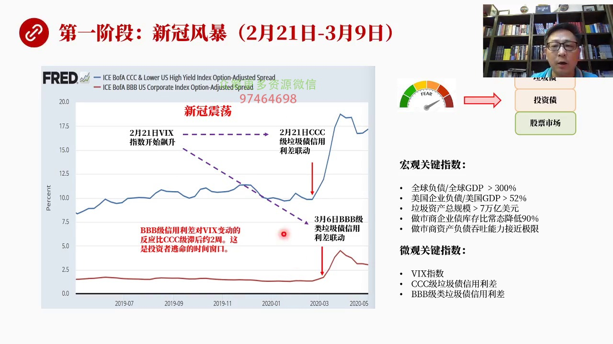

2月21號到3月9號新冠風暴注意啊這要談到第一組第一組這個指標了新冠風暴我們來看從一個減頭來看剛才我看剛才我畫了一個恐慌指數在中心旁邊圍著弱干市場而在這裡呢我們會發現第一階段2月21號到3月9號這段時...

<strong>All subtitles</strong>

> 2月21號到3月9號新冠風暴注意啊這要談到第一組第一組這個指標了新冠風暴我們來看從一個減頭來看剛才我看剛才我畫了一個恐慌指數在中心旁邊圍著弱
> 干市場而在這裡呢我們會發現第一階段2月21號到3月9號這段時間恐慌指數只影響到了幾個市場有限的幾個市場其他市場沒有受到太大的波及所以這個階段
> 我稱之為這個只是進入了只是進入了這個防禦的只是進入了一種狀態就是防禦的狀態還沒有爆發危機在這個階段中主要衝擊的是垃圾債投資債被波及還有股票市
> 場那麼我們如果從美聯儲這張圖上來看的話大家一定要學會使用美聯儲的數據數據因為它的數據最權威然後要學會使用中間的各種比較的工具計算工具進了方法
> 等等這些圖都可以自己做這張圖說明什麼呢藍色線代表著CCC或者更低等級的所以垃圾債券的合向對應七線的國債之間的立差信用立差信用立差說明市場它的
> 這種緊張程度我們可以看到新冠疫情在二月二十號二月二十一號開始衝擊市場美國金融市場第一次感覺到了新冠疫情不光是中國的問題有可能影響全世界它是在
> 這個實驗店感覺到我們從圖上看得很明顯那麼它感覺到了之後首先衝擊這是哪一塊我們剛才已經分析了在基礎資產程市場分佈層還有交易策略層我們都已經知道
> 了企業債肯定會显山路水因為它是所有鏈條中脆弱的環節是整個水霸中間最脆弱的那個石頭企業債中間的拉基債又是脆弱鏈條上最脆弱的環節所以當出現任何問
> 題的時候我們如果建立這場思想體制之後你首先想到我看第一個參數是什麼成百上前的技術參數我已經知道問題自然出在哪了所以我首先找的一定是拉基債的拉
> 基債的這個參數信用立插參數剛才我已經說了也就是同期線的拉基債的信用信用這個他的這個立這個收益率跟同期線的國債支插這個數據是第一個是整個市場中
> 第一個開始變動的出現明顯變動的數據如果我們從理論推找得出這個結論我們從實踐上觀察也能得出同樣的結論比如說我們可以看2月21號VIX指數一旦開
> 始飆升首先當天CCC拉基債的信用立插就開始連動他正是從2月21號開始往上走這天是個重要的拐點可以看得很明顯而BBB機就不一樣了BB機是3月6
> 號才開始動BBB是什麼就是投資機中間的類拉基債還沒有到還差還差一級才到拉基債我們剛剛所說的4萬億中間有大量的4600億的這個石油債等等都是包
> 括在BBB機的你看它的反應速度比CCC要明顯之後它是3月6號才開始發生變化如果說這段時間在那之前它稍微協力有一點點變化但是跟正常情況下沒有什
> 麼太大差別3月6號之後才出現了一個非常明顯變化這說明什麼說明春江水暖壓先之也就是在金融市場中那些最敏感的指標需要我們首先關注在這裡我認為明確
> 觀察到金融市場發生重大的這個重大的這個危機變化的這個數據這個指數是CCC及拉基債的信用立插它比BB級的信用立插變動要早兩個星期也就是如果你先
> 看它你會在兩星之後看到另外一個參數動所以這兩個星期就是投資者的逃命事件倉口如果我們明白這點之後你在觀察下次危機來臨之前你就知道該看什麼指數了
> 該看什麼技術參數了當然不是每一次信用立插上升都會產生危機它必須有一些大的方面的這個數據的大的環境所表現的數據的變化也就是說你不能只看純技術的
> 這種參數你還必須要關心關心宏觀的指數宏觀的關鍵指數是什麼我們第一個一開始已經說了全球負債和全球GDP的筆質超過了2300這導致了全球債務體系
> 對於金融體系所施加的這種嚴重的壓力就像水庫一樣已經到了無意負價的程度已經到了危機的邊緣所以我們知道從整體來看全球都面臨著債務危機的爆發只不過
> 我們不知道在哪時刻出現在哪裡而已除了看這個之外還要看到最脆弱的鏈條在哪裡是美國的企業負債和GDP筆質超過了50%這又是個危險性好第三個我知道
> 是企業負債會出問題我還知道我還需要知道企業中間最脆弱的拉機債的總規模我們已經算成了大於7萬億除了這個之外我們還知道在這個市場中最核心的玩家做
> 事商它的企業債的庫存嚴重降低它那個洞廳湖已經乾河了90%剩下幾百億的庫存根本不足以抵擋任何的風吹小洞除了這個之外我還需要知道做事商的資產資產
> 表已經吞吐達到了極限也就是它買了大戰國債把自己撐著了當企業債庫存出問題的時候它沒有能力去救援這五個條件全部具備情況之下我們知道我需要高度關注
> 這個指數了當然微觀指數就是首先看Wix當然各個不同的市場它的暴動性的指數不一樣但是我們在這為了簡化極限以Wix作為作為主要觀察目標在後續課中
> 我們會提出其他的類似的這種觀察目標它要變動之後就會導致ccc級垃圾在信用立插變化然後兩星之後會出現BBB級垃圾在信用的立插的變化所以我們觀察
> 指標的順序先看宏觀指標五個條件都具備了我再看微觀指標我先看誰所以我們一定要高度密切注視Wix指數它要變動之後我再看它變變變它如果明顯變之後它
> 變變變這兩者之間的時間差是我們投資的逃命窗口好我們再看下一頁新冠風暴啟動之後

---

### Slide 20

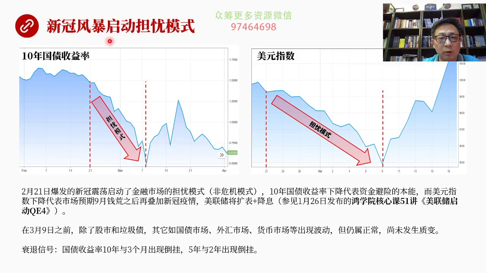

2月21號啟動之後它並沒有產生VG只是進入了一種擔憂模式也就是說我剛才所說三個市場三個市場中如果我們看三個市場之外的其他市場其實並沒有什麼VG性的表現比如說十年國債國債收益率國債市場吧國債市場十年收益...

<strong>All subtitles</strong>

> 2月21號啟動之後它並沒有產生VG只是進入了一種擔憂模式也就是說我剛才所說三個市場三個市場中如果我們看三個市場之外的其他市場其實並沒有什麼V
> G性的表現比如說十年國債國債收益率國債市場吧國債市場十年收益率從2月21號從這開始一日到3月9號它是一個擔憂模式這不是VG模式為什麼叫擔憂模
> 式呢大家都在你看收益率在不斷的下降一口氣下降到3月9號善道歷史最低點這個過程表明大家覺得新冠疫情要發作了經濟可能會不好怎麼辦我為了保護我的資
> 金我叫搶購國債大家都去搶國債就會把國債收益率價格給壓低國債價格往上漲收益率往下降反复收過這是個敲角板所以這是一種閉血模式沒有出現VG這個叫擔
> 憂模式並不是VG美元指數也一樣美元指數我們看到美元指數在2月21號到3月9號在新冠疫情這個新冠震盪這段時間之內美元指數不斷在下降而不是反彈反
> 彈的時候越來越越來越這個美元越來越強的時候說明什麼說明爆發了VG它不斷走低說明沒有爆發VG那它沒有爆發VG為什麼會不斷走低呢擔憂它是一種擔憂
> 為什麼我們其實在1月26號注意啊當時這個1月26號發布的紅旋核心客51講那時候還沒有出現美國的什麼新冠疫情還不知道有這麼嚴重我們就講了每年出
> 已經開啟了已經啟動了Q-1-4甚至當時我在做核心客說腦子內沒有新冠疫情這個詞不知道有這麼回事所以在這堂課裡面我們4號沒有提到新冠疫情但這張課
> 的我們我們的主要邏輯什麼就是在9月前荒之後那個之後美聯儲它的資產費代表在不斷的下降在不斷的擴大所以美元的指數會走跌這是我們這堂課的主要的一個
> 觀點美元會貶值新興市場的國家的貨幣會贏了一個小楊春當然前提示不爆發VG爆發VG立刻就反過來了金融體系會出現緊縮流動性會出協美元指數會大漲所以
> 我們在不考慮爆發就說如果沒有發生VG情況之下美元在2020年必然是走跌的當然如果我們後來再看假如市場認為這是我們的判斷市場也是這麼認為的那麼
> 現在市場出現新冠疫情它在跌加這個疫情大家就會相信美聯儲只有進一步擴表和降息這跟我們的核心課的結論是一致了才能夠是經濟付出或者才能保持經濟的這
> 個一定的增長所以當時大家在3月9號之前想到新冠疫情的時候都認為美聯儲必然才去擴表降息然後來維持經濟增長所以這不是危機模式這個是一種擔憂模式在
> 3月9號之前除了股票股市和拉基债其他市場、國債市場外購市場擴閉市場雖然出現了波動但都屬正常沒有發生智變當然這個衰退信號出現了衰退信號就是國債
> 收益率10年和3月出現了盜貨5年和2年出現了盜貨這預預示的衰退將會出現但是並沒有預示著經濟危機馬上就會來到真正導致今所謂影子銀行體系的經濟危
> 機叫影子銀行危機它是什麼原因導致了就是我們看到第二階段的爆發點

---

### Slide 21

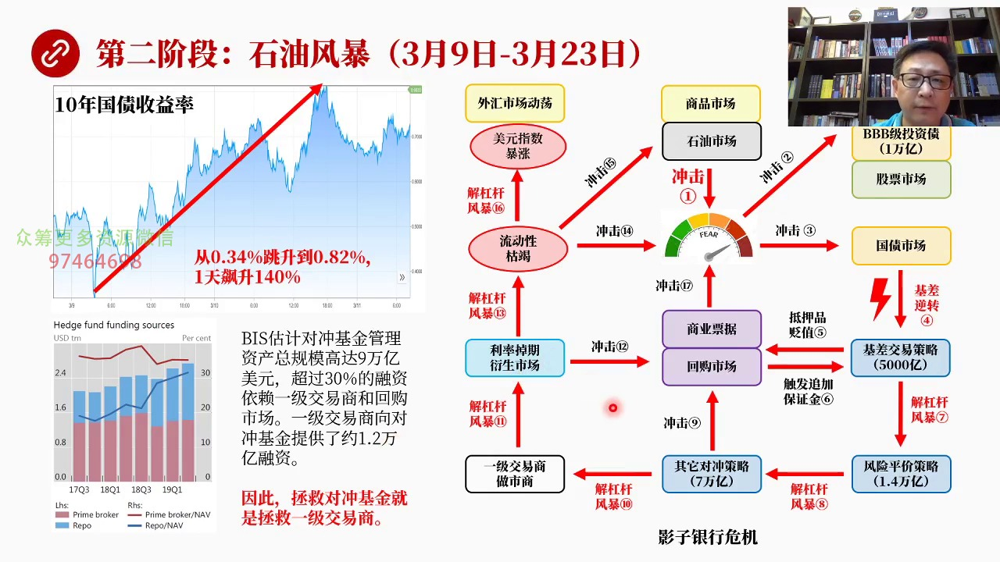

這個時間非常明顯3月9號持續到3月23號每年初開始宣布這個無限量的QE這段時間發生了是一次典型的影子銀行危機為了把這張圖給做出來這真是花了一個月的時間話出來是很簡單但是要把它中間的邏輯理順誰衝擊著誰第...

<strong>All subtitles</strong>

> 這個時間非常明顯3月9號持續到3月23號每年初開始宣布這個無限量的QE這段時間發生了是一次典型的影子銀行危機為了把這張圖給做出來這真是花了一
> 個月的時間話出來是很簡單但是要把它中間的邏輯理順誰衝擊著誰第幾步它的邏輯順序要理順這是一個非常大的工作量所以如果大家在看這張圖的時候需要非常
> 非常仔細去想中間的它的原理那麼首先我們如果看這個多米諾古牌怎麼倒下的我們首先要從石油市場開始它產生了第一次衝擊為什麼3月9號石油價格戰爆發俄
> 羅斯跟上市談崩了奧佩克不准沒管油價了這個時候出現的是石油價格爆跌我認為這是整個危機的多米諾倒下的第一張圖牌石油爆跌之後直接衝擊的VIX指數也
> 就是孔王指數它是第一個產生作用了孔王指數立刻談到了這邊談到了紅色什麼原因因為所有投資人假如我們做到中間比如說我們廣大同學們做到這你做這個醫療
> 盤前頭相當於你是個交易員你想想看你管理了龐大的資產資產中各種各樣的配置你聽到了石油價格爆跌你做到這想到是什麼你一定會想到石油市場石油的這個垃
> 圾戰市場因為大家都知道油價爆跌在美國經常上最鍋鍵是會衝擊一個龐大的垃圾戰特別是岩油這個行業的垃圾戰市場垃圾戰和類垃圾戰這個地方加在一起量著相
> 加有6351美元所以所有交易員聽到這個油價爆跌的消息會馬上想到我得賣這個資產如果我線手上有的話我必須得立刻泡瘦你那個時候打開電腦第一件事情就
> 馬上把我資產中這些資產找出來立刻向市場泡瘦所以聽到這個消息之後交易員們產生恐慌之後會第一個衝向這個市場賣掉這些資產當石油為主岩油為主垃圾戰出
> 現爆跌之後他就必然會影響BBB級的投資戰因為BBB級中間也有大量的能源企業大量的岩油公司騙人系公司他們的股票也會他們的債券也會受到泡瘦這就傳
> 導到BBB級了注意啊他們都是做事商制度也就是給他打電話了你這個交易員你不是在一個中西市場掛牌就把他賣掉了你首先要找到當然他有電子爆價系統也有
> 這個交易也有傳統那種系統你要找到你的做事商要拋掉這些資產怎麼拋那個時候做事商電話一定是打了想這個連續想個不停他得處理一批又一批業務所以這兩市
> 場受到衝擊之後當然股票市場也會受到震撼恐慌指數上來了股票能源公司的股票石油公司的股票這能不暴跌嗎當然由於他暴跌恐慌指數上升了所有股票都會下跌
> 因為恐慌指數本身就是源於SNP他的這個7權交易所以第二波衝擊衝現了這三個市場垃圾債市場投資級的BBB這個類垃圾市場還有股票市場第三個衝擊衝擊
> 哪第三個衝擊就是這些市場恐慌之後他衝擊到了國債市場這是3月9號發生的衝擊到了國債市場國債市場出現了一個非常嚴重的願望就是機差逆轉本來期貨和現
> 貨之間我跟他所說的那些做機差交易策略那些對衝擊金我本來已經套利穩固的套利實現了一個立差期貨和現貨之間國債期貨和國債現貨之間有一個穩定的一個立
> 差市場不管怎麼變我這個立差都能吃到的這個價差都是能吃到的但是由於這次衝擊太大恐慌指數上升過盟國債市場陷入了混亂整個債權市場都陷入了混亂那麼他
> 就導致了在3月9號這個時刻這一天出現了機差逆轉的情況也就是大量持有這個我們本來我們如果看這張圖國債收益率在3月9號這間出現了一個巨大的反轉在
> 那之前他是個連續不斷的下降過程因為大家都在閉血都在搶國債國債價格壓得很低但是壓到低到一定程度之後我們知道我這個國債現貨在這我的國債氣貨在這我
> 兩個中間的價差比如說這個有有百分之零點零多少好這個價差如果出現了反轉在大家這個市場混亂情況之下如果出現了反轉那會怎麼樣我是加了50倍槓槓的別
> 忘了我是加了30倍槓槓的如果這個這個是這個價差出現的反轉立刻這套策略就失敗了這個時刻發生在3月9號這一天準確實說就是在這個時刻吧出現了在3月
> 9號這天出現了機差逆轉之後這就使得高倍槓槓機差交易策略對重基金出現了大規模的問題他們持有了資金他們持有了這種資產這個美元國債高達5000億美
> 元如果5000億美元這個機差都消失了甚至變成復數我能怎麼辦大家想想看你是高倍槓槓之下你必須要馬上賣資產然後去搶現金的你的資產是什麼你的融資是
> 把國債抵押到回購市場上拿來現金再買國債再抵押現在你不得不去賣國債去要現金那麼當你賣國債這個過程會導致什麼國債價格會下跌然後金融然後國債收益率
> 會暴漲這就是這一天之內時間國債收益率從百分之零點三四跳成到零點八二一天標上百分之四十就是這個過程的在線也就是機差交易對衝策略基金所掌握的五千
> 億美元的國債在市場上被瘋狂的拋售去套取現金這就導致了你越拋售國債抵押品的下個月低國債抵押品價格月低回購市場的交易商這個做事商就會給你打電話讓
> 你追加保存金而你本來現在就沒有錢缺乏現金狀態因為你剛剛背率太大所以你就被迫賣更多的國債所以這又是個正反規機制你不得不賣國債導致你的抵押品貶值
> 收益率上升你抵押品貶值之後追加保存金的要求破勢你賣更多的國債然後你越賣追加保存金的量越大然後你就持續不斷的這樣折承下來這就會觸發追加保存金這
> 樣的一個大規模的惡性循環結果導致什麼解綱尬風暴發作這就是第七步解綱尬這個風暴發作之後直接衝擊評價基金注意這是打了要他們這些人在這他們手上掌握
> 了1.4萬億美元的巨額資金他們本來並沒有直接受到這件事的衝擊但是由於機召交易這幫人先失敗大規模的踩踏市場這就好像有兩條戰線有兩條這個陣線你這
> 邊這個是後備部隊第二批你前面部隊如果一起兵外出人到往後衝那麼你的第二踢隊根本就保持不了陣形立刻就會被衝亂所以機叉基金大規敗這5000億資金大
> 家套現導致回購市場出現嚴重的緊縮好回攻市場回購市場追加保證金不僅面這個不僅會導致他出現問題也會導致打了要傲出問題打了要也是玩30倍50倍槓桿
> 也是用國債底下做回購的所以他們導致回購市場追加保證金也會同時出現在他身上他也沒有多餘的現金所以風險評價基金也開始被迫大規模的逃亡傑剛爾這個風
> 暴衝擊其他對衝基金其他對衝基金還有龐大的資金量這個資金量高達7萬億美元整個對衝基金所掌握的資金掌握的資產規模高達9萬億所以這個機叉交易策略對
> 衝基金失敗導致了風險評價基金失敗評價風險基金這兩股加在一起又以更強大的風暴去迫使其他對衝基金去傑剛爾因為他們也會受到回購市場的壓力他們也要追
> 加保證金加得出來就只有賣這樣的話傑剛爾風暴就衝擊到了一劑交易商這就是這個BS提供了一張非常非常有效的圖非常有價值的圖從這張圖上我們可以看到這
> 是對衝基金所擁有的資金的來源我們從這張圖上可以看到紅色紅色的部分就是對衝基金的資金來源是源於一劑交易商藍色的部分是源於回購市場回購質疑我們會
> 看到一交易商可以對衝基金提供了大量的這種貸款或者叫這個賬戶保證金提供了大量的融資BS鍋鏡對衝基金管理的資產規模9萬億美元超過30%的這種融資
> 是一來一劑交易商和回購市場的一劑交易商要向這個一交易商向這個對衝基金提供了約1.2萬億的融資注意啊誰說一劑交易商沒有問題啊誰說高盛美林這些沒
> 事啊這張圖已經突出的顯示出來他們提供了多大的資金量如果說排山島海的解冠感9萬億資金在這個市場中出現了這個不斷放大的解冠感的風暴注意是他們給他
> 提供了這是一交易商給對衝基金提供了1.2萬億這些人如果都賠錢了都垮台了都倒閉了他能不垮台嗎能不倒閉嗎所以拯救對衝基金所謂拯救對衝基金他的真正
> 目的是為了拯救一劑交易商美聯儲的核心目的是拯救他但是要打上拯救市場的棋子而已所以一劑交易商當時應該已經出一土崩瓦解的邊緣了美聯儲不出手他們就
> 會出事他們一出事相當於雷曼相當於24個雷曼出事因為24個疫情要商大量參與這個市場這個市場面臨這麼大的解冠感這幫人垮了整個金融體系也就崩了他們
> 中間也有很多就是大銀行所以一劑交易商受到解冠感的巨大風暴衝擊他們作為所有市場的做事商都陷入了就是他們作為做事商不僅是在國代市場上也在加市場上
> 演生產品市場上他都是做事商所以他要資金陷入了極端的恐這個極端的緊張他的資產費在表馬上就面臨到千倉白孔了這這麼多對衝基金都破產了都不行了那他的
> 資產費在表起不需要出大問題他給他們停了1.2萬億所以他的資產負在表就不足以再提供給其他市場做事的資金了流動性就會下降所以我們看到國代市場的叫
> 買交賣價迅速放大利率調期市場上還其他演生產品市場上做事的能力都嚴重了萎縮那麼利率調期比如說利率調期他如果出問題他就會第二次衝擊回購市場主要回
> 購市場有兩種固定收益的套利方式一種是機差交易還有一種是利率調期模式你如果做不了利率調期的措施商這個市場冷卻了或是凍結住了沒有交易了那麼在利率
> 調期上上做風險對衝了回購基金會再次出問題這就會觸發另外一輪的這個解幹感的風暴由於我們沒有一個很好就是問題男生男在這我腦子脈是有這個概念但是怎
> 麼通過圖把他很清晰不混亂地表達出來這個是個非常大的挑戰其實我在這裏要畫的應該是第二輪的解幹感的風潮壓上來之後跟第一輪跌著在一起形成更大的解幹
> 感衝擊衝擊他然後產生了一個正反規的效應再衝擊他但是我現在還沒有找到一個很有效很直觀的個大方法這個意思我可以說清楚但是這個圖形很難畫因為它是一
> 個跌加的好由於金融眼神產品也出了問題那麼解幹感的風暴會進一步導致整個市場流動性的哭解不管你是債券市場還是國債市場還是股票市場還是其他的市場都
> 沒錢了都沒錢的時候叫流動性哭解流動性哭解當然會進一步衝擊進一步衝擊恐慌指數恐慌指數變得更高然後再來一圈它是一圈一圈的循環同時流動哭解還會導致
> 什麼還會導致油價進一步下跌商品價格進一步下跌沒錢了美元被摧毀了還有各國貨幣相對於美元貶值了這只是美元指數暴漲美元指數暴漲傳到到外匯漲就會引起
> 全世界貨幣的混亂大家對美元都暴跌找不到美元了就會陷入美元荒所以通過這個循環大家可以基本看出來它暴多米諾骨牌倒下的順序當然這些市場都出問題了還
> 會影響了商業票局上等等貨幣上然後再次衝擊恐慌指數所以我現在要畫的其實是三層跌加的循環不斷自我強化的三圈正反饋機制但是我畫不出來我只能用語言來
> 表達其實難就難在這如果我們能有一種立體的做途法或者說能夠展現一種立體的這種圖像我會把這個概念能解釋得更清楚當然要梳理清楚這個邏輯關係我大概花
> 了整整一個月的時間當然在一個月之前3月12月份我們都隨時跟進市場都在跟蹤但是沒有進行系統性的和邏輯順序的這種推演直到看到大量報告之後把這些數
> 據關心弄清楚之後才能夠畫出這張圖不過這張圖現在更重要的是邏輯關係出來之後我們要從指數層面上哪些指數從哪些指數上我們一看到這個市場怎麼受了影響
> 這中間123456789一直到17步中間有沒有時間差有多大時間差因為時間差是我們最關心的有時間差我就有討厭的機會沒有時間差我根本沒地方跑來不
> 及跑所以真正考驗就是真正一個更複雜的工作更系統龐大的工作是要找出所有邏輯關係所背後代表他們變化的那種指數這種指數高達幾四五十個要把它組合在一
> 起才能體驗這樣一個衝擊的邏輯關係這就是我為什麼說這堂課如果連續上下來需要七八六七個小時七八個小時否則的話講不完好我們今天講到了是一個這個第二
> 階段的邏輯關係講明白了從下堂課開始因為這堂課我們時間已經超過了兩小時了從下堂課開始我們將真正來進行指數的組合根據這個邏輯關係圖把指數指數層給
> 搞明白因為這是一個超級複雜的工作需要一整堂課才能把指數的關係給弄明白才能搞明白哪些指數是先期指數能夠體現多長時間他的邏輯關係應該怎麼來考慮另
> 外我們由於瞭解了這樣的一個規律之後特別是一交易商在中間向對中基金提供了多少融資1.2萬億搞清楚這個數字名之後我們才明白每年除了所有救援方案他
> 到底是為什麼他到底要拯救誰才能夠把他的政策層才能夠真正看透看明白好 今天我們主要的課程就講到這

---

### Slide 22

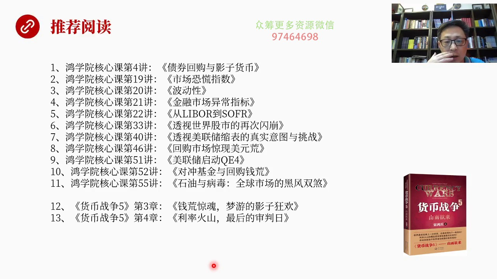

另外給大家推薦一些核心課還有我寫的貨幣戰爭舞系統性分析的對中基金還有影子銀行回購市場等等這就是我們核心課所系列講到的跟有關的一些課程還有書裡面這兩張除此之外就是最近我看到的一些

<strong>All subtitles</strong>

> 另外給大家推薦一些核心課還有我寫的貨幣戰爭舞系統性分析的對中基金還有影子銀行回購市場等等這就是我們核心課所系列講到的跟有關的一些課程還有書裡面這兩張除此之外就是最近我看到的一些

---

### Slide 23

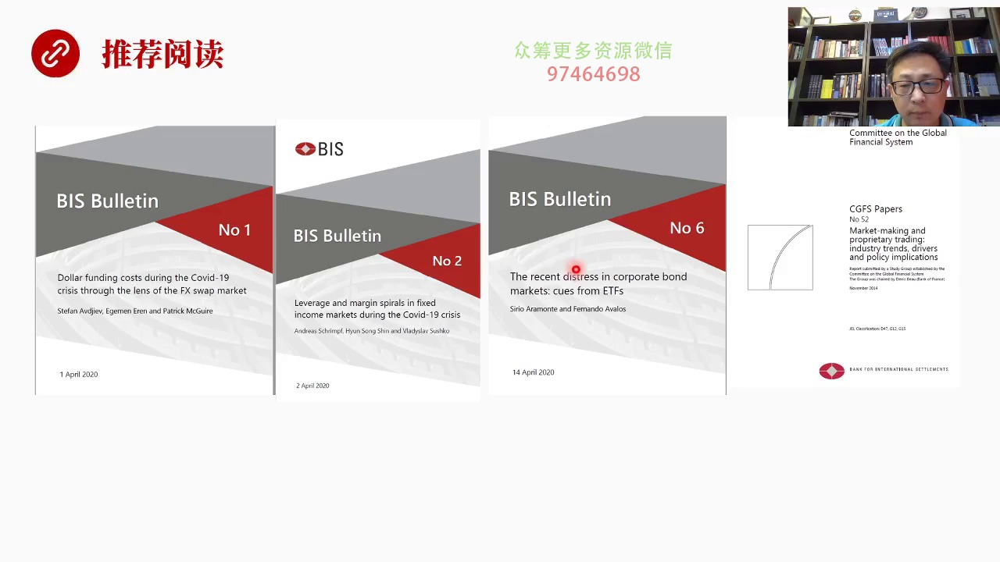

就是子系分析就是他這個時間都是四月以後的非常子系分析三月金融風暴的幾篇重量這個文章寫得都很好而且很有奇法性這篇文章是想的全球金融體系中間內在了一些問題這就是我們講到為什麼做事上他的經營策略會發生變化為...

<strong>All subtitles</strong>

> 就是子系分析就是他這個時間都是四月以後的非常子系分析三月金融風暴的幾篇重量這個文章寫得都很好而且很有奇法性這篇文章是想的全球金融體系中間內在
> 了一些問題這就是我們講到為什麼做事上他的經營策略會發生變化為什麼他的庫存會減少為什麼他調整潔債調整國債的庫存等等從這些分析大家可以看到真正要
> 做金融研究要做金融預測他不是個拍腦門的事一拍腦門說我覺得金融研究要來了我覺得金融研究已經完了我覺得哪個指數位會上漲指數位下跌不是拍腦門的事其
> 實要需要大量的這種數據研究還有邏輯結構的研究才能真正搞明白金融系統他到底發生正在發生哪一個問題他在這個市場發生的前流在什麼地方我們有學人說宋
> 老師你怎麼說這個石油負價格他就出現負價格了為什麼說我們去年年底就說今年垃圾債會出問題今年就出問題了這難道是拍腦門拍出來的嗎其實大家看了這堂核
> 心課還有我們可能後續的5月份推出的一系列跟這個相關的核心課大家就會明白推論是建立在嚴密的邏輯之上的是建立在非常仔細的數據分析之上好今天咱們的課就上到這裡

---

### Slide 24

謝謝大家週末這個特別是五一該休息的時候還參加我們的課程這說明大家是非常認真學習的非常想搞明白金融市場的內在規律的好謝謝大家祝大家週末一塊

<strong>All subtitles</strong>

> 謝謝大家週末這個特別是五一該休息的時候還參加我們的課程這說明大家是非常認真學習的非常想搞明白金融市場的內在規律的好謝謝大家祝大家週末一塊

---

### Slide 25

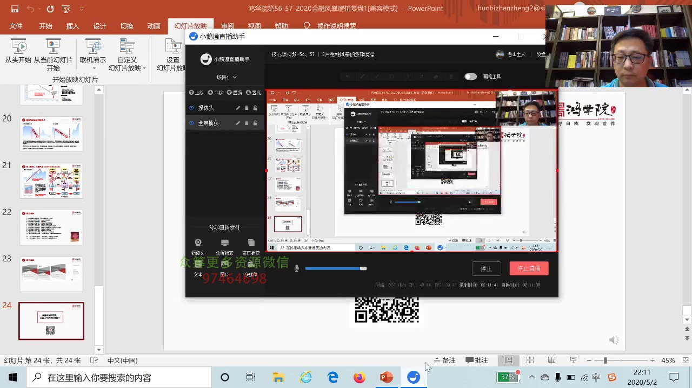

<strong>All subtitles</strong>

---
