# 核心课视频-58、59 金融风暴的逻辑复盘：关键指标层 — Slide Notes

> **来源**：鸿学院核心课程  
> **幻灯片**：34 张

---

### Slide 1

邏輯副盤的部分 也就是關鍵指標層關鍵指標層應該說是這個系列課程中最難的一部分因為這部分涉及到大量的數據的收集整理 規類還要體驗出中間的領先指標所以它花費的時間相當多那麼在我收集到的各種各樣的研究報告還有市場的分析文章中間我覺得到目前為止還沒有發現一篇完整的系統介紹整個這次金融風暴它的邏輯框架或者全景...

<strong>Cleaned narration</strong>

> 邏輯副盤的部分 也就是關鍵指標層關鍵指標層應該說是這個系列課程中最難的一部分因為這部分涉及到大量的數據的收集整理 規類還要體驗出中間的領先指
> 標所以它花費的時間相當多那麼在我收集到的各種各樣的研究報告還有市場的分析文章中間我覺得到目前為止還沒有發現一篇完整的系統介紹整個這次金融風暴
> 它的邏輯框架或者全景式的展現所以這是我們這張課要解決的問題那麼我們先看看第一頁這個是我們上堂課講整個的金融風暴的一個關鍵指標層

---

### Slide 2

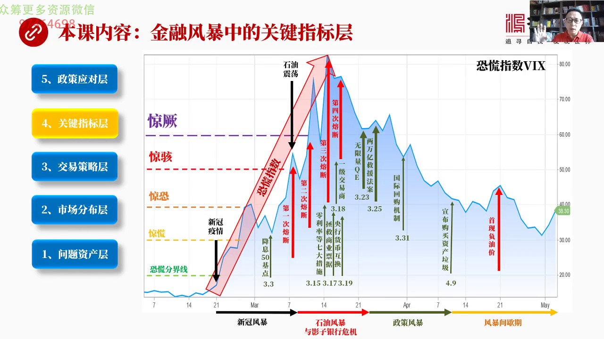

和與這項對應的其他的一些分層的信息那麼從這張圖上我們把整個金融危機化分成了不同的階段我這先把音光筆給打開那麼在這張圖上我們可以看到這場危機我把它分成三個階段從2月21號到3月9號這是新冠風暴從3月9號到3月23號這是石油風暴引發的影子央危機這一塊就是我們這堂課重點要講的內容今天我們講的內容主要是發生...

<strong>Cleaned narration</strong>

> 和與這項對應的其他的一些分層的信息那麼從這張圖上我們把整個金融危機化分成了不同的階段我這先把音光筆給打開那麼在這張圖上我們可以看到這場危機我
> 把它分成三個階段從2月21號到3月9號這是新冠風暴從3月9號到3月23號這是石油風暴引發的影子央危機這一塊就是我們這堂課重點要講的內容今天我
> 們講的內容主要是發生在3月9號到23號之間的所有的重要的指標除了這個之外就是3月23號一直到4月9號政策風暴那麼我們現在處於風暴的建械期這就
> 是我們對於這場金融風暴的總體人士在我看起來這個時間不會維持太長那麼也就是下一輪風暴肯定會來到我們之所以要花這麼多時間來整理思路來進行邏輯副盤
> 尤其是對影子銀行這一塊的非常精細的副盤主要的目的就是為了預測下一次金融風暴爆發的時候將會衝擊哪些市場它的眼鏡邏輯跟這次肯定是有所不同的但是中
> 間有一些關鍵的節點是繞不過去的也就是歷次未來過去和現在的歷次危機中總有一些繞不過去的點那麼這些點如果出問題我們可以非常非常有預見性的進行推測
> 那麼下一步將會出現什麼樣的問題也就是說我們研究歷史的全目目的就是為了預測未來那麼我們可以看到今天我們要講的那種主要是從3月9號開始然後一直到
> 3月23號之間這個市場到底哪出了問題它的原爆點究竟在什麼地方這就是我們今天的重要內容我們看下一頁在我看來整個3月份的就是3月9號到23號

---

### Slide 3

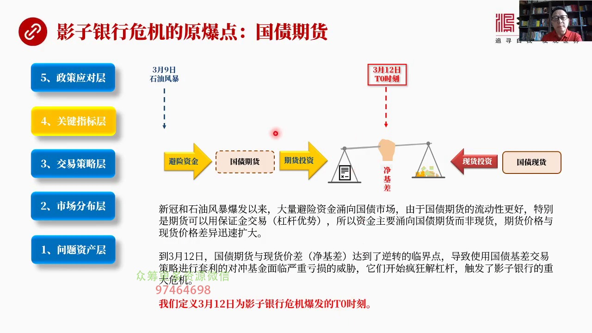

這次影子銀行危機的原爆點是在國債7或市場其實我們看到很多分析文章分析金融風暴如何如何但是你從他們的文章中你根本看不出來中間的邏輯關係到底是誰第一個發生問題第一個發生問題又是如何影響第二個市場如何影響衝擊到第三個市場基本上你從很多分析文章中你看不出它的邏輯順序因為作者本人沒有徹底搞清楚金融危機到底是怎...

<strong>Cleaned narration</strong>

> 這次影子銀行危機的原爆點是在國債7或市場其實我們看到很多分析文章分析金融風暴如何如何但是你從他們的文章中你根本看不出來中間的邏輯關係到底是誰
> 第一個發生問題第一個發生問題又是如何影響第二個市場如何影響衝擊到第三個市場基本上你從很多分析文章中你看不出它的邏輯順序因為作者本人沒有徹底搞
> 清楚金融危機到底是怎麼爆發的要想搞清楚這點必須要找到原爆也就是我們疫情中間所說的第一個病人在哪案例1是誰這問題必須要首先搞清楚我們才能把金融
> 危機的它的邏輯線所領出來所以我在這裡把國債7或市場美國國債7或市場定義為原爆點那麼這當然是經過大量的研究和數據分析的我用一個簡單的框圖把這個
> 概念做了一個基本解釋這是時間鐘3月9號石油風爆爆發3月12號我認為是這個影子銀行危機的原爆的起點時刻這個是地點這個是時間那麼這個T0時刻就是
> 發生金融合爆的準確實一點原理是什麼我們看到從2月開始的疫情和3月9號爆發的石油風道驅動了大量金融市場中間的必顯基金必顯的這種各種各路資金用向
> 了美國國債市場中的7或市場首先進了這為什麼他們不進入進入國債現貨市場呢這是國債現貨市場主要原因是國債7或市場有非常大的優勢因為國債7或市場流
> 動性比現貨上更好特別重要的是7或市場可以用保證金來經驗交易也就是有槓桿優勢投資人他要擁有國債現貨和國債7或2中選擇的時候他一般會進入流動性更
> 好而且可以使用槓桿的7或市場這就是我們看到的3月12號零點時刻發生的現象大量必顯基金融入了國債7或市場然後在7或市場進行大量的投資所以使得7
> 或我在這邊用7或代表就像天平一樣大量資金融入7或市場之後使得7或現貨之間的價格發生了逆轉這中間是進擊差也就是進擊差是一個支點進擊差如果出現了
> 平衡上的變化就會使得整個市場出現嚴重的問題所以理解進擊差這個概念就成為我們理解為什麼說國債7或市場是原爆點的一個邏輯出發點那麼我們看到到3月
> 12號這一天國債7或現貨的價差所形成的進擊差達到了逆轉的零階點然後導致使用國債機差交易策略我們上期分析已經說過這個總統的規模可能高達6500
> 億美元那麼大量的資金在這個市場中進行套利就是在國債的期貨和現貨市場上進行套利主要套利的模式就是圍繞進擊差那麼當進擊差發生逆轉的時候那麼進行這
> 種套利策略的對重基金6500億將會面臨嚴重的虧損所以他們開始瘋狂的解讓感由此觸發了影子銀行系統的重大危機這就是為什麼我們定義3月12號為影子
> 銀行危機爆發的T0時刻這個市場正式原爆點這是我們的結論現在我們要進行詳細的數據分析了為什麼我要得出我們能夠得出這樣的結論為什麼要進行這樣的這
> 是為什麼我們認為這樣推論合理的我們看下一頁首先我們要大治了解一下什麼是國債進擊差交易這個策略究竟是什麼回事

---

### Slide 4

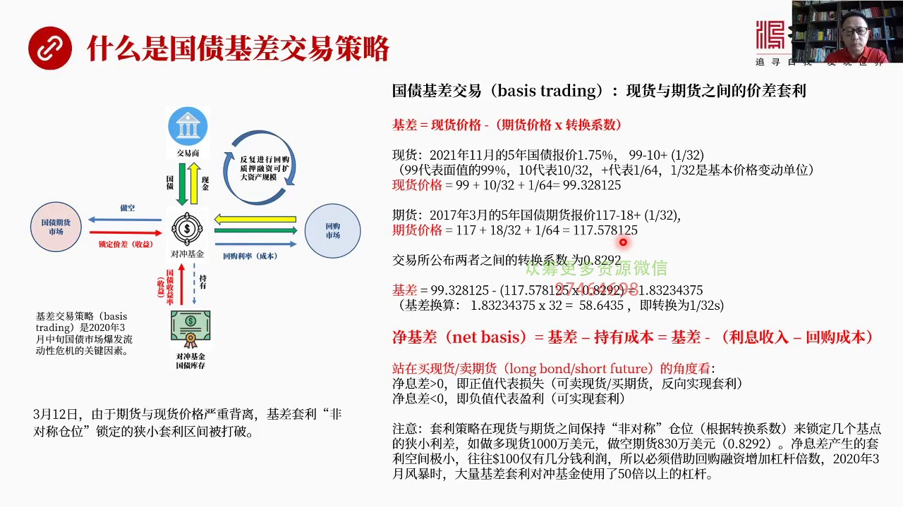

上期節目中我用了這樣一個框圖大治解釋了一下今天我們要說了稍微詳細一點也就是對重基金比如說國債集差交易的這種對重基金持有現貨同時在期貨市場上做空然後在這兩個市場中進行套利那麼他們可以把持有的現貨為了做大資產規模他們可以把持有的現貨在回購市場上進行抵押而且不是抵押一次是循環反覆的抵押可以把資產的規模做得...

<strong>Cleaned narration</strong>

> 上期節目中我用了這樣一個框圖大治解釋了一下今天我們要說了稍微詳細一點也就是對重基金比如說國債集差交易的這種對重基金持有現貨同時在期貨市場上做
> 空然後在這兩個市場中進行套利那麼他們可以把持有的現貨為了做大資產規模他們可以把持有的現貨在回購市場上進行抵押而且不是抵押一次是循環反覆的抵押
> 可以把資產的規模做得非常大做到50倍甚至100倍都可以所以它可以用一億美元的現金持有50億到100億的資產或者它有10億可以持有500億到1
> 000億的資產那麼在這個過程中它的全部的希望是為了鎖定國債和期貨之間的現貨和期貨之間的差價那麼紅色的箭頭代表著它獲得收益的比如說國債有利息會
> 有收益那麼固定價差會使它有收入但是它也有支出比如說融資成本回購就是它的支出那麼我們現在把這個框圖要進行一些稍微詳細的分析就是我們要看什麼是國
> 債機差交易那麼它的主要目的是為了在國債現貨期貨之間進行價格套利這就涉及到什麼叫機差國債機差國債機差的標準定義是國債的現貨價格簡去國債期貨價格
> 成為一個轉化系數這個是國債交易中間的一些基本的長時間在這裡我們不做深入解讀但是給大家一個基本概念讓大家清楚了解這個市場為什麼會出問題國債市場
> 它的報價還有它的成交方式包括交格的方式都是非常有特點的比如說我們先看現貨價格這個現貨怎麼來的現貨價格怎麼報的我們會看到它的報價方式是這樣的比
> 如說2021年11月5年期的國債現貨報價1.75%這個指著什麼這個指著是政府每半年給你支付的固定的利息這個不是國債收益率是政府給你的固定的利
> 息支出好那麼這是國家答應給你的利息半年一付的那麼後面這個數99%剛10%加32%1%這就什麼鬼東西這是美國國債市場的標準報價的方式99%第一
> 個數99%99%代表面質的99%比如說你是100美元那就是代表99%第二個10%代表的是它的32%擠的這樣一個表示你比如說這個10就是10除
> 以32%那麼後面這個加號是什麼意思加號是代表64%1%那麼在整個國債報價市場中32%1是基本價格變動的單位最小單位是32%1%當然有時候我們
> 會看到這個報價後面不用加號比如說用43%等等它分別代表這個最後尾數的這個國債市場的64%1%還是128%1%等等這個表達方式跟我們看到的實境
> 制非常不一樣這個原因就是建立這套體系的我在交易體系的是猶太金融家猶太金融家我以前在書中專門講過他們的小孩在中世紀開始他們大量做金融交易的時候
> 他們的孩子就已經從小進行訓練我們是被999懲罰表他們的小孩從小就要被比如說1%1等於多少等於實境制的多少16%1等於多少32%164%112
> 8%1等於多少因為所有積點的計算是基於16%164%32%1128%1所以他們的小孩必須要非常熟悉的記住這些價格所以在報價過程中他報了比如說
> 64%1我們的腦子當時沒有計算器比如說中世紀你根本就不知道他說的32%1是0.00幾你不知道但他腦子裡立刻就能換算所以用這種32%1這種進度
> 單位來進行金融的交易可以使他們獲得一個巨大的先罰優勢當然歷史上也曾經出現過這個不同的禁制人則算這種就是金融體重形成了管理這就是文化資本那麼如
> 果我們來看這幾個數加在一起他這個現貨價格究竟是多少現貨價格就是99.32825好我們再看7貨價格7貨價格與這相對應的是2017年3月的五年期
> 國債報價顯示品種顯示是117剛18加32%1應該說32%1是告訴你它是個單位所以它的報價是118港18家這是多少呢當然是117加上18出一3
> ...

---

### Slide 5

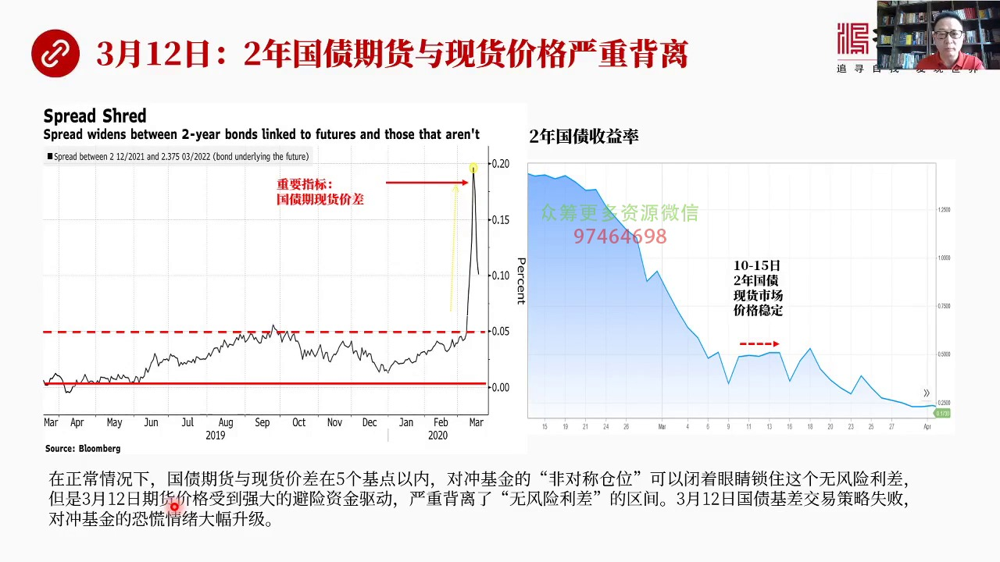

是兩年國債7貨出了問題先出問題兩年國債和現貨價格嚴重倍率這個是彭博社他們在當天的報導中間就是每天他們都有大量報導但是在這一天的報導中間我覺得有一個重要的信息他給出了一張數據圖這張數據圖我一看就知道問題出在哪了你比如說這是兩年期的國債現貨和期貨之間的價差圖你可以看到在正常情況之下兩者的價差只在5個積點...

<strong>Cleaned narration</strong>

> 是兩年國債7貨出了問題先出問題兩年國債和現貨價格嚴重倍率這個是彭博社他們在當天的報導中間就是每天他們都有大量報導但是在這一天的報導中間我覺得
> 有一個重要的信息他給出了一張數據圖這張數據圖我一看就知道問題出在哪了你比如說這是兩年期的國債現貨和期貨之間的價差圖你可以看到在正常情況之下兩
> 者的價差只在5個積點以內如果你往前延伸也一樣也就是它的鎖倉就是無論你這個市場怎麼變化超出5個積點以上的這種情況極其罕見概率極低我們先講過通過
> 統計概率來進行風險對衝的一整套他們的思維方式我認為整個思維方式就是錯的或者說從哲學一日來說是站不住腳的好在3月12號這天出現什麼是大量的資金
> 融入了7貨而沒有融入現貨把7貨價格一下子推高推高到接近20個積點跟這個現貨價格的落差我剛才已經說過了當初這些人在3月12號之前6500億的資
> 金在做這個遊戲的時候他們認為機差的範圍就在5個積點以內就在一個狹小的區間之內政黨不可能衝上去衝上去概率極低所以他們採用了非對稱鎖定的這種倉位
> 的方式是可以閉著眼睛賺錢的無風險套利我可以加50倍我可以加100倍只要我有多大點就能夠有多大產所以當他們發現3月12號7貨價格受到強大幣錢資
> 金推動嚴重倍離以前的鎖定的空間之後這個無風險立差的區間就被打破了這就導致了整個3月12號國債機差交易策略的大失敗所以對衝基金的恐慌情緒大幅升
> 級因為這意味著你要使用50倍的港港的話一點點落差價格的這種落差波動性都會導致你全軍覆沒那麼我們為什麼說前進了7貨市場沒有進現貨市場呢7貨市場
> 的價格兩者價差我們已經很明顯看到了我們再看兩年國債收益率的曲線圖在3月9號以後3月10號到15號之間在這幾天之間我們可以看到兩年國債收益率是
> 平的幾乎是平的這說明什麼說明它的價格收益率跟價格相反收益率如果大漲價格大跌收益率如果大跌價格大漲但是在這幾天我們可以看到兩年國債收益率是平的
> 也就是價格基本穩定價格基本穩定說明什麼說明在這5天之內資金沒有進入這個市場而大量進入了7貨市場才把價格給拉高了這就是一個雙向的邏輯推倒我看它
> 這張圖之後再去找兩年國債收益率的圖然後兩者再進行比較然後再查數據然後你才能夠得出一個邏輯上合理的結論也就是期貨市場出大問題了尤其是首先出問題
> 是兩年國債期兩年期的國債率先出問題好我們再看下一頁那麼在3月12號出現這個問題之後到了3月13號

---

### Slide 6

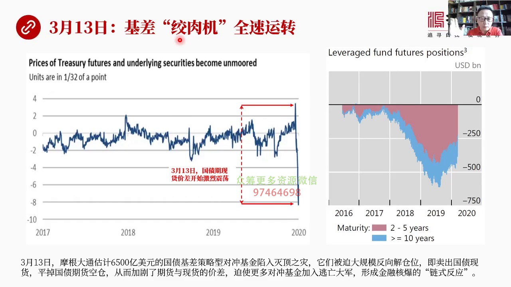

整個這個機差交易策略就出現了大規敗我稱之為是一個機差的繳肉機開始全速運轉這個是另外一張圖這張圖上講的也是期貨和現貨之間的價格的巨烈震盪這是發生在3月13號了我們可以看到3月12號的時候那個出現的價格震盪還不是太明顯就是有了明顯的這個提高直到3月13號以後這個價格的震盪的幅度變得越來越激烈那麼同時我們...

<strong>Cleaned narration</strong>

> 整個這個機差交易策略就出現了大規敗我稱之為是一個機差的繳肉機開始全速運轉這個是另外一張圖這張圖上講的也是期貨和現貨之間的價格的巨烈震盪這是發
> 生在3月13號了我們可以看到3月12號的時候那個出現的價格震盪還不是太明顯就是有了明顯的這個提高直到3月13號以後這個價格的震盪的幅度變得越
> 來越激烈那麼同時我們看到對衝基金這個是國際清算銀行他們統計出來的對衝基金的倉位在國債上的倉位我們可以看到在2020年3月前後大量的對衝基金是
> 做充國債的做充國債期貨的不明他們持有大量的現貨在期貨市場進行比如說83左右的就是83左右的所倉他們大概採用這樣一個策略持有現貨但是一定要做空
> 期貨來對衝做空期貨的結果期貨現在在價格大漲那你做空期貨方向就反了你整個套力的空間就鎖不住了所以這大批資金這大批的倉位都會受到嚴重的損失當然這
> 個是國際侵算銀行的數據我認為它在這個數據收集過程中一定有大量的漏報所以當時我看到看到大量就是3月12到15號各種分析報導分析報導中專門講到了
> 某根大通某根大通在當天有個估計他們的策算是大約有6500億美元的國債機差行的交易策略陷入了重大的困境當然它說得比較微晚但是你一看如果出現這麼
> 大的震盪那個鎖差的那個鎖法它肯定徹底失敗了所以這就導致了這麼大規模的數千億美元的這麼大規模的國債機差策略基金要進行大規模的反向解倉反向解倉就
> 是我要賣出國債我本來吃有國債我現在得賣出國債現貨然後要憑掉國債七貨的倉位就跟以前做法正好相反你要這麼一做那麼國債現貨價格就會下跌七貨價格就會
> 上漲那你亏了會更嚴重所以這就會導致其他沒有逃跑的對中基金他們也撐不住了因為有一部分人先解倉他們一解倉使這個價差進一步擴大那就逼著其他的對中基
> 金也必須要逃亡否則的話如果大家都這麼做你是最後逃跑那你就死定了所以這就產生了我稱之為是金融合報的劣勢反應有一部分對中基金先倒因為他們倍數太大
> 比如說100倍他們先倒之後進行大規模解倉賣現貨買七貨好又把這個價格推的這個價差推的更嚴重落差更大然後就導致第二批人比如說我只用了80倍的剛子
> 但是價不住這幫人的衝擊我一孤散我會虧慘那麼我也加入淘王大局這個幫人在影響只用50倍剛哪的人那就會形成一個戀式反應反應這個衝擊的對中基金的規模
> 會越來越大這就是我們看到3月13號機差繳繳機開始全速運轉我們我們再看下頁好關鍵是在這個過程中

---

### Slide 7

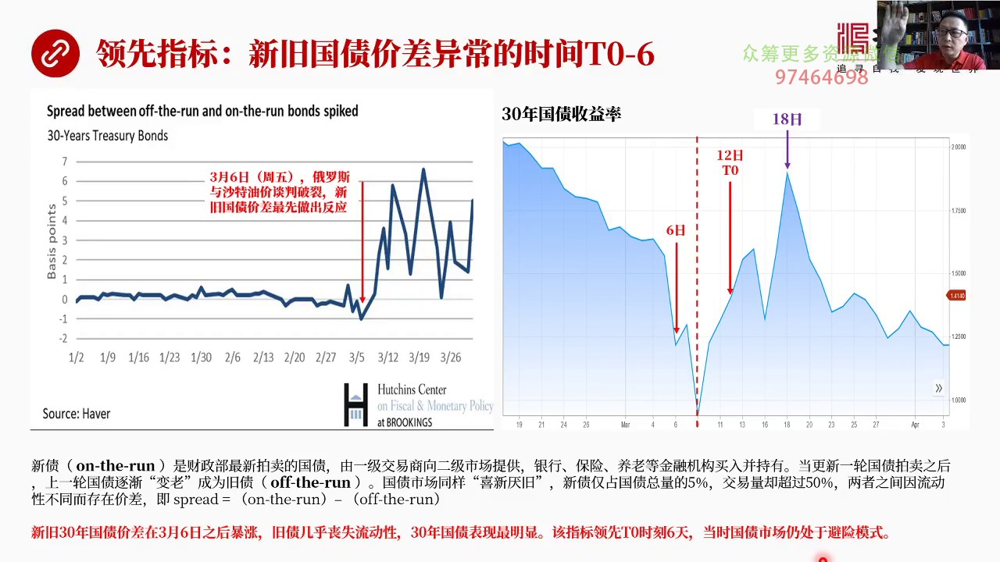

有沒有領先指標能夠讓我們提前做出一個預測現在我們反向來看我們能夠找到領先指標當然有人說這是事後逐量但是在我看來我們通過邏輯回推或者叫邏輯復盤找到了過去的領先指標也就知道了未來再次發生危機的時候我們應該先看哪些數據這個領先指標是什麼就新就國債價差是這個價差是一個領先指標它領先出現重大的提零時刻這個合報...

<strong>Cleaned narration</strong>

> 有沒有領先指標能夠讓我們提前做出一個預測現在我們反向來看我們能夠找到領先指標當然有人說這是事後逐量但是在我看來我們通過邏輯回推或者叫邏輯復盤
> 找到了過去的領先指標也就知道了未來再次發生危機的時候我們應該先看哪些數據這個領先指標是什麼就新就國債價差是這個價差是一個領先指標它領先出現重
> 大的提零時刻這個合報這個時間大概6天所以它有一個接近一個星期之時間能讓投資者從容測退或者叫成功逃脫我們來看這張圖這張圖是30年國債因為30年
> 時間比較長是最長期限的國債那麼它的心債和老債之間的這種價差就是一個提前量我們可以看到這個提前量在3月6號的時候你會看到新老30年國債的叫賣價
> 和叫賣價出現了明顯的異常注意這個時候國債30年國債收益率跟它相對應的30年國債收益率的曲線你可以看到整個國債市場上在3月9號之前這是3月9號
> 這條線3月9號之前這號是新冠病毒產生的避險效應大量資金融入30年國債10年國債10年國債圖這個非常類似這是一個避險情緒大家都跑到30年國債圖
> 來避險但是在3月9號之後到3月12號提零爆炸核爆開始那麼一直到18號整個這一段時間就出現了非常非常反常的也就是收益率飆升這意味著國債價格暴跌
> 從30年國債到10年國債都出現了海量拍賣就是拋售國債這個浪潮才會出現這麼明顯的這麼顯著的收益率爆炸好什麼叫新債和舊債之間的價差新債安裝他指的
> 是財政部比如說現在這個月拍賣的最新拍賣的國債最新拍賣國債很多是由一交一商他們買下來之後然後向二級市場提供提供這個批發業務然後銀行保險銀行保險
> 這些金融機構從一交一商手上買入這些新發信的國債然後持有那麼過了一段時間比如說到了下個月開始第二輪拍賣了也是10年期國債好那麼剛才就是上個月拍
> 賣的這個10年期國債就變成了老債就是慢慢變老了成為舊債那麼這個舊債往往就待在養老債金賬戶上一直到他退意為止到他整個到期結算為止大量的舊債是不
> 參與交易的所以在國債上同樣存在了一個洗新鮮舊的現象所有的市場交易者交易員各種金融機構都喜歡新債討厭舊債同樣都是10年期的國債但是新舊之間是有
> 差異的如果我們看新債的交易他的發信量其實只在國債總量的5%就是最新拍賣的新鮮出爐的只佔國債5%但他的交易量超過50%說明一半以上的這樣的一個
> 交易是由新債交易量構成的那麼老債呢交易顯然就不行所以兩者之間流動性一定會有差異流動性如果有差異他就一定會在價格價格之差所以他之間的價差等於這
> 個新債全新出爐的他的價格建區舊債這個價差在歷史上我們可以看到很小因為是國債嘛國債沒有風險所以會有一些我們往往看到在季度末或年末會出現一些小的
> 震盪這就是由於金融機構他要保表等等要做很多金融管理方面的控制所以他會在一定的周期內出現一點點7位的波動也就是0.2幾個幾點非常小可以忽略不及
> 但是在3月6號這天卻出現了史無前例的機差爆炸新舊國債之間的價差了爆炸這說明什麼說明30年的國債在3月6號之後兩者價差出現了明顯的差異舊的國債
> 明顯喪失了流動性為什麼要看30年國債因為30年國債反映了最明顯因為他期限長所以對他來說期限越長的他越敏感這就是我們下一次危機這時候你得重點關
> 注這個指標而這個指標是通過分析推倒出來的在通過大量的數據合長發現他是第一個出現異常的指標那麼這個指標領先了T0時刻領先金融合爆大概6天這就是
> 為什麼我把它定位成領先指標的原因好我們再看下一那麼到了3月12號T0時刻

---

### Slide 8

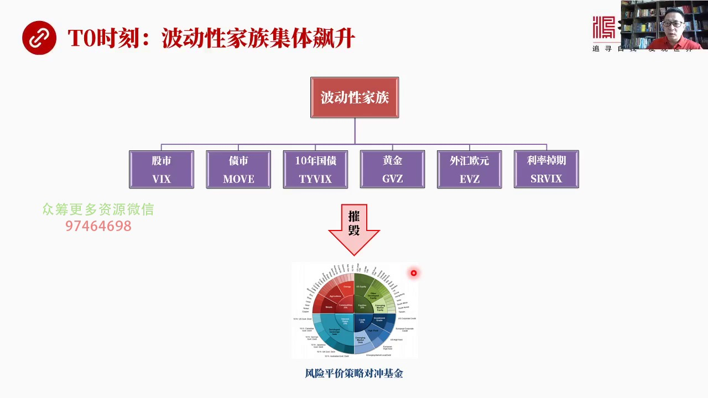

國債機差對重策略出現了大爆炸出現了合爆那麼他引發了什麼引發的是所有的波動性加足這些數據集體表生我們在核心課裡面曾經講過波動性講到2課那個主要是講的股票市場SNP500他這個Wix指數是怎麼計算的為什麼要這麼計算他為什麼對於預測股票有一定的幫助或者說對於評估資產價格有一定幫助當時我們談到的僅僅是股票的...

<strong>Cleaned narration</strong>

> 國債機差對重策略出現了大爆炸出現了合爆那麼他引發了什麼引發的是所有的波動性加足這些數據集體表生我們在核心課裡面曾經講過波動性講到2課那個主要
> 是講的股票市場SNP500他這個Wix指數是怎麼計算的為什麼要這麼計算他為什麼對於預測股票有一定的幫助或者說對於評估資產價格有一定幫助當時我
> 們談到的僅僅是股票的Wix其實出了股票之外這個所有金融市場都有自己的Wix指數Wix首先是由資價格這個交易所他們手創了發現這個指數後來特別紅
> 火就把它運用到其他的很多領域比如說債市的Move債市的Move並不是資價格交易所搞出來它主要是美零最早在這個90年代是美零最先推出來了後來成
> 為市場上大家最關注的一個指標所以債市的恐慌指數或者叫波動性指數是這個是美零搞出來的Move經過長期的時間大家都認同它抓很多信息抓了要更準一些
> 當然除了這個之外還有志家哥交易所搞出來的十年國債它的波動性黃金的波動性外匯歐元的波動性利率要70波動性等等我在這列除了這6個6個家族波動性家
> 族都是在T0時刻同時變化的家族還有一些波動性要晚於這6個核心的指標要晚弱甘天所以我們在這裡首先看到當你國債機差出現大問題之後6000多億對中
> 基金陷入恐慌那麼金融市場了其他的人必然會受到這種恐慌性裏的強力影響所以它在故事債市黃金外匯能源利率較期衍生產品整個這個資產體系中間引發了同步
> 的連動那麼這種同步標升直接摧毀了風險評價對中基金的策略這就是打了手創的風險評價它認為只要我把資產分佈在不同的領域分佈在不同的國家如果我同時計
> 配置股市又配置債市又配置10年國債還有黃金還有外匯還有利率要期還有其他的一系列資產那麼不管哪個市場發生問題那麼其他的市場相應會從中受益比如說
> 股市如果上漲那麼債市可能要受損值如果股市暴跌債市有可能獲得避險資金的擁入所以這兩者之間可以相互這種其他的這些也是一個道理它所進行的這種風險對
> 重策略是鎖定波動性的鎖定每個市場的波動性只要你波動性發生變化那麼我的資產的配置就自動發生調整但是它萬萬沒有想到的是或者說它的策略是基於一個基
> 本的假設就是同時所有波動性家族都一起出現大問題這個概率是至少是三個調整方程以外的事情那就是小於99點幾那只有在那麼小的概率之下甚至四個調整方
> 程之外的事情那就更小了所以它認為我賭不會出現那麼小的概率所以我把金融資產按照這樣的一種方式進行配置但是3月12號出現的情況正好說明它的它的策
> 略本身所謂幾個Sigma以上的事情幾個這個標準方程以上的事情真的發生了這些波動性同時上升意味著它的全部的風險對中策略同時失敗所以這就直接摧毀
> 了打了以後為代表的風險評價對中基金而這塊有多大呢這塊有1.4萬億所以兩者家和家在一起國債機差大概是6000多億它是1.4萬億兩者相加我們就看
> 到金融市場上突然用先出了2萬億美元的對中基金大規敗這就是我們看了下業我把它形容成金融合報這是原子彈的一個試意圖

---

### Slide 9

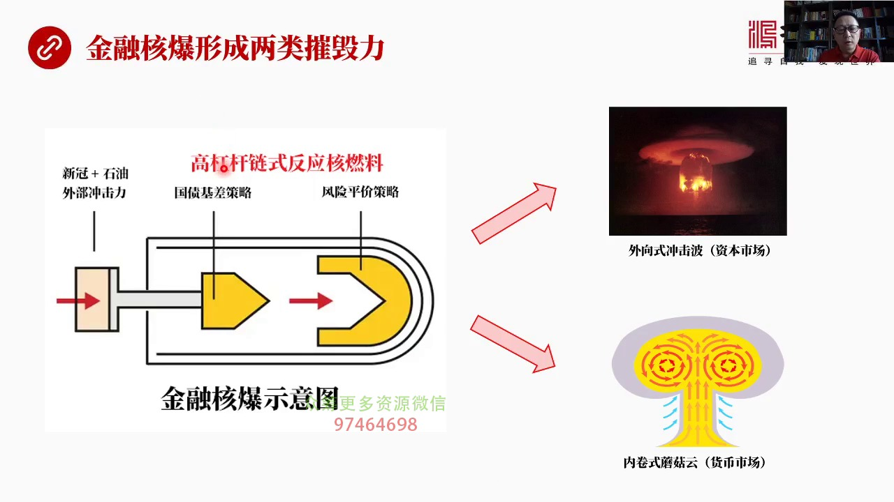

我把它改裝了一下我把它展現成了金融合報的試意圖你比如說我們知道在原子彈這個設計理論中間這兒是這個比如說這個U235這也是U235兩者如果不把它放在一起的話讓它隔絕的話不會發生鏈式反應如果兩者合併到了一起被這個炸彈外面的炸彈推過來把它推到這個位置讓它全部合併在一起這就會超越零技臉然後就會引發鏈式反應然...

<strong>Cleaned narration</strong>

> 我把它改裝了一下我把它展現成了金融合報的試意圖你比如說我們知道在原子彈這個設計理論中間這兒是這個比如說這個U235這也是U235兩者如果不把
> 它放在一起的話讓它隔絕的話不會發生鏈式反應如果兩者合併到了一起被這個炸彈外面的炸彈推過來把它推到這個位置讓它全部合併在一起這就會超越零技臉然
> 後就會引發鏈式反應然後就是巨大的合報我用了這張圖把外部推這個爆炸力我們可以用新冠和石油或者任何外部推力只要外部推力把這個高倍槓槓的反應就是這
> 個提供高倍槓槓這種鏈式反應的核燃料所有使用高倍槓槓的對中基金或者叫任何金融機構只要你用高倍槓槓那麼你就是合爆炸的基本燃料因為在非常小的價格波
> 動之下這套高槓槓就會結體和崩潰在這種情況之下你就必然會產生大規模的爆炸產生鏈式反應所以國債機叉策略這一部分受到新冠和石油外部爆炸的推動也就是
> 大量資金融向了國債期貨特別是兩年國債期貨使得這塊像這塊國債機叉策略在3月12號衝進了風險評價基金策略的包圍圈兩者和二為一然後超過了零借點這就
> 是戀式反應爆炸開始的原點3月12號那麼這個合爆產生之後產生了兩種不同類型的爆炸力一種我稱之為是外向的衝擊波大規模衝擊資本市場就是金融市場的外
> 部比如說股市債市大東商品外匯交易等等還有一個破壞力我稱之為是內卷式的魔鬼雲我們知道魔鬼雲的原理是當你在空中實現合爆之後它會產生巨大的這個高溫
> 除了向兩邊向四周輔設之外它會產生一個蒸空效應把地上的砂石各種地面上的東西都往上倒抽因為中間的7R小通過副壓的效應把大量的地面的這個灰塵圖這個
> 圖染還有石頭全部吸到高空這就是魔鬼雲的原理當然魔鬼雲內部還在發生各種各樣的旋轉而且產生了大量的輔設效應所以這個叫內卷是魔鬼雲那麼在金融市場上
> 我把它對應成貨幣市場就是金融市場的最核心部分貨幣市場所以這是兩種不同的爆炸力或者的殺傷力一種是外向衝擊資本市場一種是內卷導致貨幣市場上發生重
> 大危機然後引發更多市場出現問題好我們先來看外向衝擊波對資本市場的影響究竟是怎樣影響的首先外向衝擊波手先發力的自然

---

### Slide 10

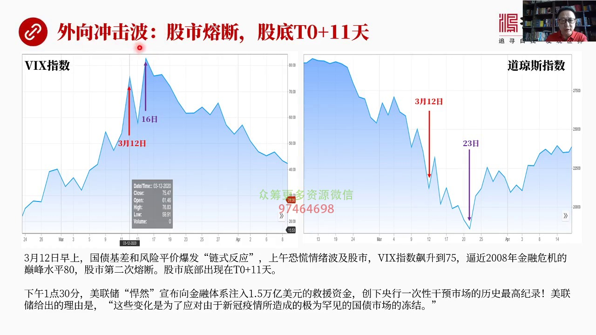

是股票市場那麼我們看到3月12號核爆產生了練習反應發生了那麼練習反應發生之後幾乎同時也就是3月12號早上發生了練習反應上午恐慌程序就已經波及到了股市我們知道股票市場在3月12號出現了第二次融斷Wigs指數在當天飆升到了75也就是2018年最高水平是80在3月12號逼近到75也就是非常接近08年金融危...

<strong>Cleaned narration</strong>

> 是股票市場那麼我們看到3月12號核爆產生了練習反應發生了那麼練習反應發生之後幾乎同時也就是3月12號早上發生了練習反應上午恐慌程序就已經波及
> 到了股市我們知道股票市場在3月12號出現了第二次融斷Wigs指數在當天飆升到了75也就是2018年最高水平是80在3月12號逼近到75也就是
> 非常接近08年金融危機水平但是它還不是最高風最高風發生在16號那麼股票市場的底部這是它的波動性的這個圖這邊是真實股價到從此指數的圖我們也可以
> 看到類似的規律3月12號形成核爆了這個時間點股市實在這它真正的股底是發生在3月23號所以如果我們能夠確定某個事件為T0時刻3月12號比如說我
> 們現在是要的3月12號我們實際上可以知道我們還有多少天到達股票的熊式的底部或者叫到達股底我在這裡我們統計是T0加11天當然每次金融危機一定會
> 有所不同我之所以要計算它的這個天數就是要做一個基準的測算這一次在加上2019年再加上2018年再加上2015年歷次的貨幣長出問題所導致的對外
> 部的衝擊力通過你要算一個大概了平均的天數這樣的話你就可以知道下次金融危機出現的時候那麼當股票市場上還沒有出現重大危機的時候在貨幣上上先出現危
> 機那麼會隔多長時間大致可能會隔多長時間會體驗在股票市場中這就是領先指數的意義領先指標的意義當然這個是需要大量的經驗或者說有很大的猜測程度在裡
> 面因為每次出現金融危機的時候美聯儲它的應對方式是不一樣的所以會使這個數據未必準確但是它可以給我們一個基本的參照就是當我們發現金融合報的原報點
> 之後股票市場的暴跌就叫它的股底發生在這個時間點之後若甘天那麼也正式在3月12號下午1點30分美聯儲汗染宣佈向金融體系注入1.5萬億的回購資金
> 就是通過回購來注入救援資金這是創下了央行一次性干預市場的歷史最高記錄美聯儲給出了理由是什麼就是這些變化這個示威了就是這個政策這個變化應對新冠
> 疫情造成了極微罕見的國債市場的凍結注意它提到了國債市場發生了凍結我們看到30年國債市場上出現了叫買和較面價的巨大的差異我們看到10年和30年
> 國債收益律市場出現了巨大的反展這兩個事件說明了國債市場上拋售的人很多其實拋售還有一部分最主要的部分是源於對衝基金的解放感已經說對衝基金是持有
> 現貨賣空國債期貨現在如果做反了它就必須要賣現貨買期貨在這個過程中現貨了拋售就變成了一個非常非常大的規模那麼就加上了你要考慮到這個國債機差交易
> 在加上風險評價跡量者和在一起是2萬億這就會導致市場上、國債市場上突然出現了2萬億或者跟這個數相匹配的某個比例相匹配的大規模的拋盤那麼這個市場
> 上肯定是招架不住的這就會陷入國債市場的凍結我們再看下一頁10年國債顯然受到了狂拋

---

### Slide 11

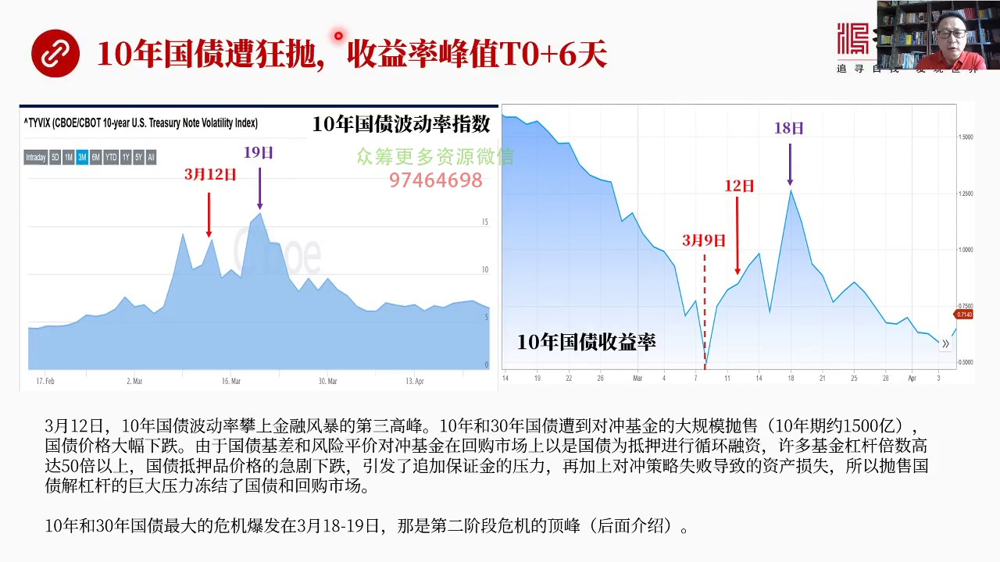

收益律風質是T加0、T0加6天也就是國債市場上我們可以看到3月12號這是一個第三高峰19號是最高峰波動率就代表它的巨大的市場不穩定性那麼3年國債我們剛剛已經看到了剛才我們看了一張圖說明3年國債3年國債這兩張圖都非常的類似他們遭到了對衝基金大部分不好受在10年基金國債中我查到數據是1500億對衝基金的...

<strong>Cleaned narration</strong>

> 收益律風質是T加0、T0加6天也就是國債市場上我們可以看到3月12號這是一個第三高峰19號是最高峰波動率就代表它的巨大的市場不穩定性那麼3年
> 國債我們剛剛已經看到了剛才我們看了一張圖說明3年國債3年國債這兩張圖都非常的類似他們遭到了對衝基金大部分不好受在10年基金國債中我查到數據是
> 1500億對衝基金的減倉所以我們可以肯定地說中基金在10年國債市場上狂拋了1500億美元當然會導致國債市場價格大幅下跌現貨市場大幅下跌當然這
> 田在收益律上現貨價格暴跌導致收益律暴漲收益律跟現貨價格相反由於國債機差和風險對衝基金他們都是在回購上以國債為底壓進行循環融資的而且放大了好幾
> 十倍那麼如果大家都在上狂拋國債導致價格下跌這就使得對衝基金他們在國債他們在回購市場上這個底壓品國債的價格就會有萎縮縮水這就會引發保證金的壓力
> 追加保證金而他們現在賬上嚴重缺乏現金也沒有更多的資產來進行保證金的這個底壓怎麼辦再加上對衝策略失敗已經導致了資產大量虧損所以他們在極種壓力之
> 下被迫進一步拋售國債解鋼管所以這一連串的事件導致了拋盤的壓力太大凍結了國債和回購市場那麼在十年和三年國債這個市場中最大的危機爆發在三月十八號
> 和十九號十年國債是這個三月十九號他的收益率到達頂點是三月十八號三年國債跟這個十年國債非常類似為什麼我現在要求就是希望他記住三月十八號十九號這
> 兩天為什麼這兩天國債到達了一個極端危險的一個階段這就是內卷摩固雲所謂第二階段危機的頂峰就發生在這兩天我們後面會專門介紹我們再看下一那麼在三月十二號T-0時刻

---

### Slide 12

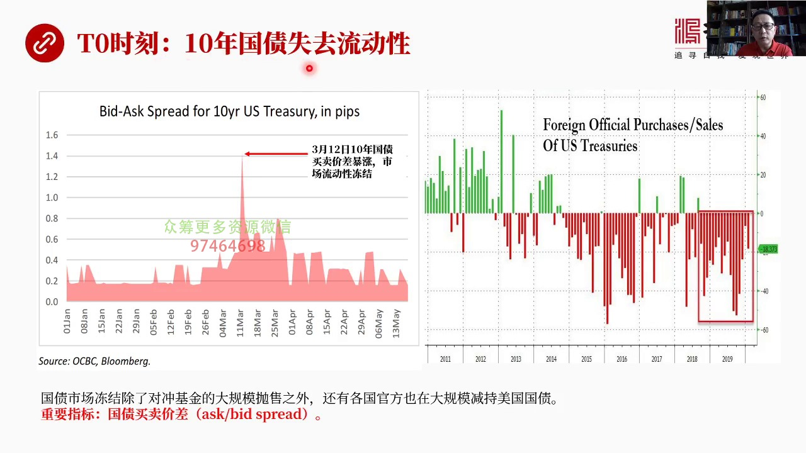

十年國債說他失去了流動性證據合在主要是可以看到在當天三月十二號十年國債的教買價和教賣價價格差距爆漲這意味著流動性陷入了凍結這可能是史上最高的一個差距了國債上從來沒有見過這麼嚴重的買賣不順暢這種惡化情況十五前例那麼國債上凍結除了對重基金大規模的解幹感拋售之外還有一個重要原因就是各國的官方也在大規模檢測...

<strong>Cleaned narration</strong>

> 十年國債說他失去了流動性證據合在主要是可以看到在當天三月十二號十年國債的教買價和教賣價價格差距爆漲這意味著流動性陷入了凍結這可能是史上最高的
> 一個差距了國債上從來沒有見過這麼嚴重的買賣不順暢這種惡化情況十五前例那麼國債上凍結除了對重基金大規模的解幹感拋售之外還有一個重要原因就是各國
> 的官方也在大規模檢測美國國債發生在同樣一個月同樣一個時段那麼外國解幹感或者叫外國的中央銀行或者是官方儲備或者叫主權基金拋售美國國債的重要原因
> 是因為他們短缺美元現金陷入了流動性的困境所以他必須得拋售美國國債換取現金才能夠應付國家所面臨的資本外流包括各種金融機構所面臨的巨大的金融風險
> 美元荒所帶來的金融風險所以這些國家一起在拋美國國債加上對重基金的拋售使著整個國債市場完全就凍結住了這就是我們看到的一個重要的指標如果我們在觀
> 察金融市場上你重點觀察比如說三年國債的他的新債就債的價差你可以提前看到很多息息如果你實施觀察的話你如果看到國債市場的買賣價差比如說十年國債出
> 現了這樣一個幅度的變化你也要小心了這個市場出了大問題但是這個是一個重要指標並非領先指標它是危機發生了狀態之中剛才我說的新就債之間的價差是發生
> 在那之前六天這是兩者差別就是你要觀察的一票盤有些是告訴你現實上正在出現問題紅燈閃爍還有一些指標是提前若甘天或提前若甘個小時告訴你這些指標這些
> 紅綠燈這些一把盤上這些紅燈馬上就開始閃爍這兩者是有區別的所以我用領先指標和重要指標進行區別我們再看下一頁我們剛說是股市和時間國債再看債券市場

---

### Slide 13

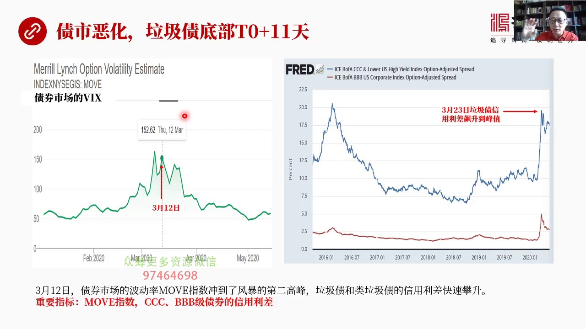

就是普通的企業債券我們看到這支Move就是債券市場的Wigs指數這個是美零搞出來的我們可以看到在3月12號它達到了歷史的第二高峰封告期間的歷史第二高峰它離垃圾債的底部垃圾債底部出現在3月23號垃圾債底部我們可以觀察美聯儲的數據表然後你做一下簡單的計算就可以做出這張圖也就是說藍線代表著美國垃圾級別的債...

<strong>Cleaned narration</strong>

> 就是普通的企業債券我們看到這支Move就是債券市場的Wigs指數這個是美零搞出來的我們可以看到在3月12號它達到了歷史的第二高峰封告期間的歷
> 史第二高峰它離垃圾債的底部垃圾債底部出現在3月23號垃圾債底部我們可以觀察美聯儲的數據表然後你做一下簡單的計算就可以做出這張圖也就是說藍線代
> 表著美國垃圾級別的債券CCC平級的它的收益率它的信用力差跟同期線的國債之間的收益率之差信用力差是這樣的一個變化區限那麼這個呢是BBB也就是僅
> 僅是投資級的我稱之為是類垃圾債投資級最底層的這些債券的收益率兩者之間的區限你看這個圖你就知道CCC級的信用力差對於金融市場更敏感所以你在選指
> 標說永遠選那些最脆弱的環境就是水壩之下那些最脆弱的砖頭最脆弱的金融鏈條那是應該關注的重點因為要出事這個地方肯定先出事所以我們可以觀察到3月2
> 3號是垃圾債信用力差標稱的頂峰也就是說從荷包開始一直到垃圾債頂峰這中間有11天的差距所以我們要觀察重要指標是一旦你判斷判斷出了金融荷包的時間
> 點原爆點是發生的這一天那麼你大概可以知道信用債垃圾債的信用力差在什麼情況之下或者在多長時間之後會達到惡化的頂峰在這次案例中我們錯了算出來應該
> 是11天所以你就知道在操作垃圾債的時候那麼這段時間肯定是垃圾債大幅下跌這個過程這就會給投資債券的人帶來一定的啟發當然同時投資債券人也會關注其
> 他的精采你會發現所有事件的連接他是幾密子結合成一個網絡不是一個單獨的市場每個市場都會相互影響我們再看下一頁黃金我們再看黃金的恐黃金值

---

### Slide 14

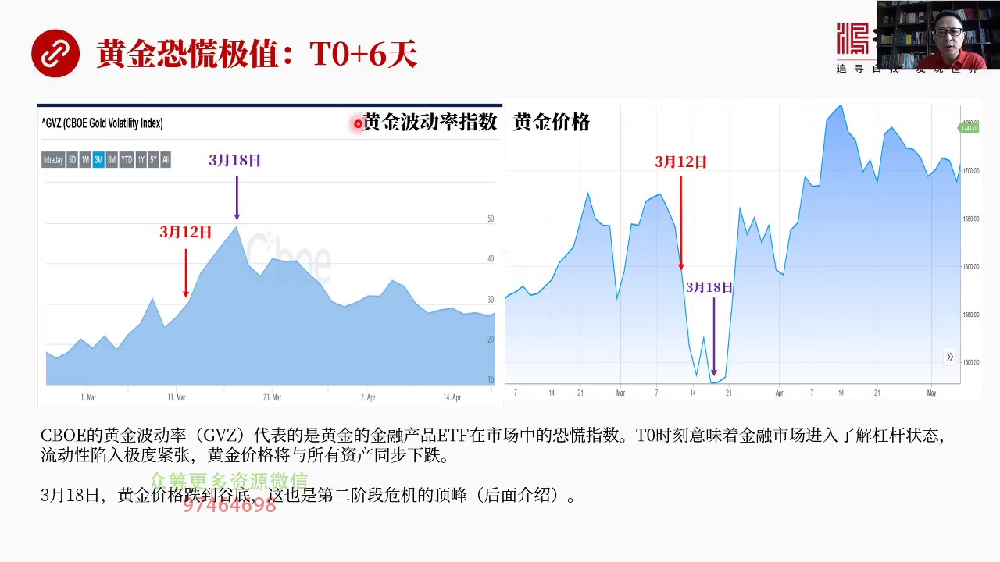

這是黃金的波動力指數這是黃金的價格波動力指數達到頂峰的時候黃金價格也會大幅下降波動力不但上升黃金價格就會下降3月12號是這樣我們看到3月18號黃金市場的波動力達到頂峰而黃金市場的價格現回價格也達到了股底這兩者之間是應對的什麼問題呢為什麼會這樣呢其實波動力這個這家哥教育所這個波動力他指的是黃金金融產品...

<strong>Cleaned narration</strong>

> 這是黃金的波動力指數這是黃金的價格波動力指數達到頂峰的時候黃金價格也會大幅下降波動力不但上升黃金價格就會下降3月12號是這樣我們看到3月18
> 號黃金市場的波動力達到頂峰而黃金市場的價格現回價格也達到了股底這兩者之間是應對的什麼問題呢為什麼會這樣呢其實波動力這個這家哥教育所這個波動力
> 他指的是黃金金融產品一TF黃金一TF在市場中的恐黃指數他是個金融指數所以提零價格我們知道整個金融市場進行進入了強大的解綱感狀態整個市場上都會
> 缺乏現金流動性酷節所以黃金的一TF將會跟其他金融資產一樣都會同步下跌3月18號黃金跌的股底注意我剛剛已經說了好幾次了3月18號是個非常獨特的
> 日期主要原因他是內卷蘑菇雲第二階段危機的頂峰所以我們看到因為這次影子影響危機出現了兩個爆炸的中心一個是外部中心一個是內部中心實際上出現了兩個
> 階段的危機我們一會兒會想一介紹我們再看下一頁外會長和利率調期市場

---

### Slide 15

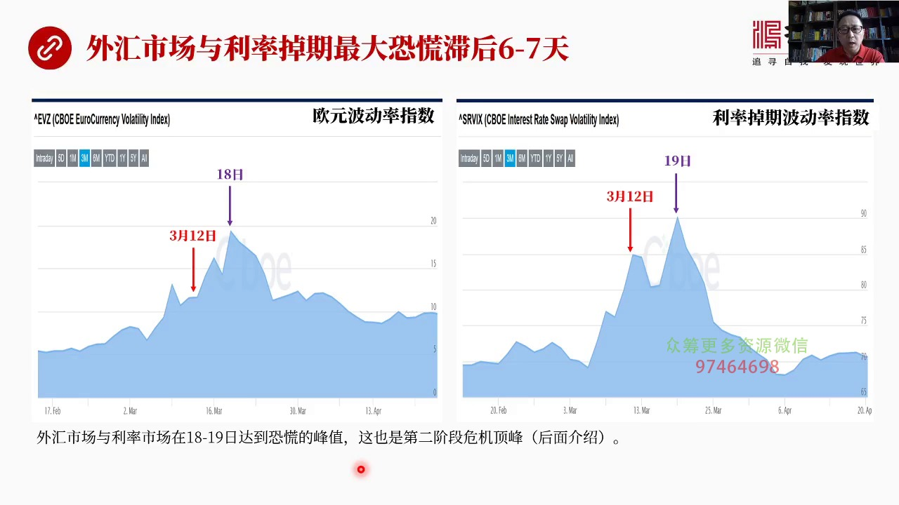

這兩個是他的最大恐慌的時間就是恐慌了極值時間3月12號到18號這是歐元波動率指數這是利率調期指數這兩個幾乎是一樣的也就是說3月18號19號達到了第二階段的頂峰3月12號這是金融合報爆發的實驗點所以我們通過當天3月12號出現這個合報之後你觀察對外衝擊的資產領域然後這些資產領域收到衝擊之後在什麼情況之下...

<strong>Cleaned narration</strong>

> 這兩個是他的最大恐慌的時間就是恐慌了極值時間3月12號到18號這是歐元波動率指數這是利率調期指數這兩個幾乎是一樣的也就是說3月18號19號達
> 到了第二階段的頂峰3月12號這是金融合報爆發的實驗點所以我們通過當天3月12號出現這個合報之後你觀察對外衝擊的資產領域然後這些資產領域收到衝
> 擊之後在什麼情況之下達到了恐慌的極大值在什麼情況之下達到了它的價格的股底我們剛才所做的這一系列分析你都會看到這個合報實驗點這個是一個領先的市
> 場了最大的恐慌和它價格的股底發生在這之後若干天有的是5天6天也有些是11天也就是在這個金融合報原報點找到之後大概一個星期不超過兩星期之內整個
> 金融市場將會陷入一片狼級那麼對於所有人來說這就具有著一定的領先指標的價值好我們再看下一頁到了3月16號

---

### Slide 16

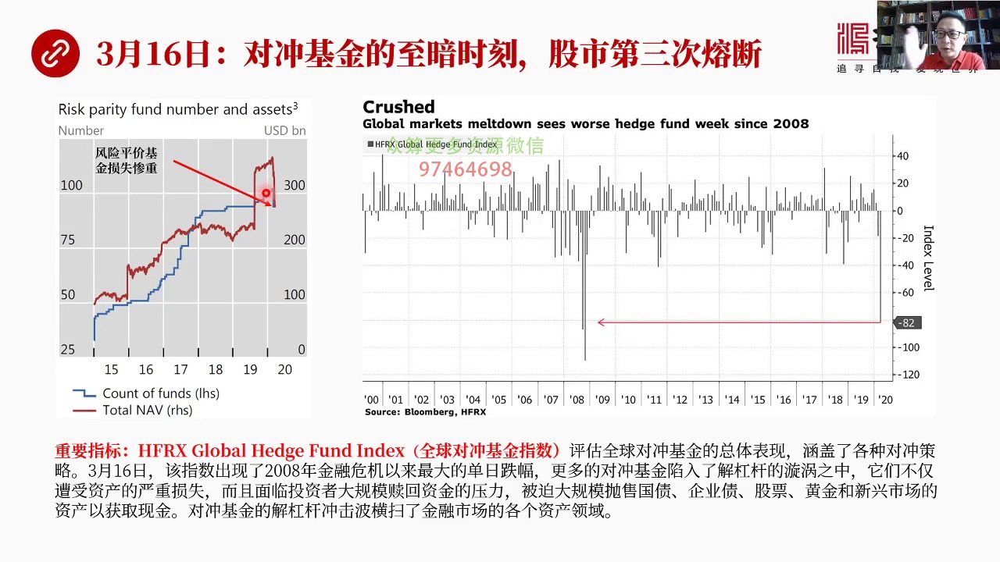

這是3月12號開始金融合報到了3月16號的時候對衝基金就已經迎來了自然時刻股票市場第三次總斷了3月16號我們可以看到出現了很多問題其中一個非常重要指標是全球對衝基金的指數因為這個指數也就是說我們在這兒看到3月16號這一天它暴跌的幅度達到2008年以來最嚴重的程度這個全球對衝基金這個指數它是評估全球對...

<strong>Cleaned narration</strong>

> 這是3月12號開始金融合報到了3月16號的時候對衝基金就已經迎來了自然時刻股票市場第三次總斷了3月16號我們可以看到出現了很多問題其中一個非
> 常重要指標是全球對衝基金的指數因為這個指數也就是說我們在這兒看到3月16號這一天它暴跌的幅度達到2008年以來最嚴重的程度這個全球對衝基金這
> 個指數它是評估全球對衝基金總體的表現涵蓋了上萬家對衝基金的各種各樣的策略所以它是一個總體的表現那麼這個指數在這一天出現最大的一個跌幅意味著對
> 衝基金它的恐慌也好它的資金也好它的各種各樣的策略的大規敗所引發的解冠感潮流解冠感這個懸悟達到了最嚴重的程度這些對衝基金他們不僅要遭受資產價格
> 暴跌這種損失同時還會面臨投資者大規模熟悔資金的壓力因為對衝基金損失慘重那些有錢人就要把錢取回來所以這兩種壓力迫使對衝基金大規模拋售國債企業債
> 股票黃金能源是由包括新市場的各種資產以獲取現金這種行為解冠感的這種衝擊將會橫掃整個金融市場全球金融市場的所有領域這就是我們看到的為什麼會出現
> 全球的金融衝擊為什麼所有資產價格都會暴跌因為對衝基金出現了大規敗而且他們他們在所有國家主要的資產領域都進行了配置所以它的大規敗會橫掃世界橫掃
> 全部進入領域從這樣突上我們可以看到風險評價基金在3月中旬出現了血崩之後不管它的資產比如說我們看它的紅色這代表它的資產禁止大幅下跌還有它的所謂
> 風險評價基金的這些數量也出現了明顯的下滑這說明風險評價基金是跟國債機差交易策略一樣是屬於核爆炸的原爆點之一我們再看下一頁好我們剛才所說是外部的衝擊力

---

### Slide 17

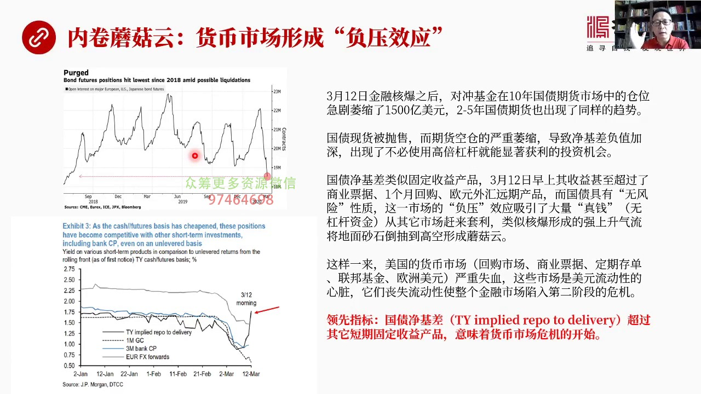

我們再回過頭來講內卷摩國雲內卷摩國雲主要是形成了貨幣市場這個形成了巨大的副壓效應就像核爆炸一樣中間是高溫就是在空中爆炸的核爆中間產生了高溫這個氣質之後大量的向外衝擊然後內部它就形成了真空或者是低氣壓的狀態這就會把地面上所有的泥沙全部給吸上來倒抽這就形成了摩國雲所以在內爆的過程中金融內爆的過程中會出現...

<strong>Cleaned narration</strong>

> 我們再回過頭來講內卷摩國雲內卷摩國雲主要是形成了貨幣市場這個形成了巨大的副壓效應就像核爆炸一樣中間是高溫就是在空中爆炸的核爆中間產生了高溫這
> 個氣質之後大量的向外衝擊然後內部它就形成了真空或者是低氣壓的狀態這就會把地面上所有的泥沙全部給吸上來倒抽這就形成了摩國雲所以在內爆的過程中金
> 融內爆的過程中會出現同樣的類似現象那麼貨幣市場上會出現副壓出現副壓的話將會把大量其他上的資金給抽過來從而引發其他市場出現重大危機好我們首先來
> 看左邊邊的圖這講的是債券市場在3月12號金融核爆之後對衝擊金的倉位在10年國債上的倉位我們可以看到這個過程持續不斷的下降萎縮了1500億那麼
> 當然在2年到5年期國債還有3年這個所有國債領域都出現了同樣趨勢除了短期國債之外我一會兒會講到為什麼一年以內的短期國債沒有受他的影響但是在一年
> 以上的各種類型的國債都出現了對衝擊金剪倉的問題好那麼對衝擊金一方面剪倉在這個國債市場上剪倉他出現了現貨幣拋售期貨空倉嚴重萎縮這是期貨空倉嚴重
> 萎縮了這樣一個圖那麼這會出現什麼情況這會導致近跡差負值加深我們一開始講到近跡差負值如果是為負的話那麼他就會出現一個很明顯的套利的機會也就是我
> 這時候如果跟他反著做我只有現貨賣出期貨我就能賺錢因為他拋得太厲害了出現這個投資機會的時候為什麼這些基金他不能反過來再接著這麼做再向以前這麼做
> 因為他已經已經避允破產了所以這些人死掉之後新的一批人要來填補他們的空白那麼國債近跡差類似什麼呢他類似一個債券或者叫固定收益類類的這種產品我們
> 看這張圖你會發現近跡差如果我們把它想像成一個固定收益類產品的話他在3月12號早成一開盤的時候他的收益率甚至超過了商業票據一個月的回購最遠期的
> 這種交易產品我們看到這個這條線代表他的收益率如果我們把它想像成債券收益率的話那麼他在3月12號這一天金融合報這一天超過了其他各種短期的收益產
> 品他一下就變成具有這巨大信利了這就是複雅效應貨幣漲上行程的巨大複雅效應就是由於國債機差市場爆炸之後還有風險評價基金爆炸之後產生了新的投資機會
> 這時候誰來了大量的真錢就是無槓槓資金從其他市場上紛紛敢來套利這就形成了類似於合報之後強烈上升氣流把地面實殺抽到高空形成魔鬼雲的這樣一個狀態但
> 是這麼一來我們看到這個樹標升之後的結果他就會把其他市場上錢抽過來其他市場上就會缺嚴重缺乏流動性也就是其他市場會缺血這樣一來美國的貨幣市場包括
> 回購市場商業票據定期存單聯邦基金歐洲美元市場都會陷入嚴重失血錢都跑到這來了因為國債市場上大家認為我買賣國債我如果不用槓槓我是沒有風險的因為美
> 國政府不會倒閉所以它不會讓國債市場違約那麼我買國債是絕對沒有風險我不用槓槓的話這個社會規律表明它不用槓槓的這些資金也能夠賺取比其他的短期回報
> 更高的錢所以這才把真錢給吸引過來但是由於美國的貨幣市場嚴重缺血它就會導致這些市場出現流動性的問題而他們的流動性是美國所有市場流動性的來源他們
> 是流動性的發動機這些市場如果沒有流動性了兩個金融市場就都出現重大的危機了這就使得金融危機要進入第二個階段了所以我們來看理解這是一個概念性的描
> 述理解這個概念之後我們會發現貨幣市場的複雅效應是導致第二階段危機升級的一個重要原因第一階段是貨幣機差和風險對衝形成的對外的衝擊波第二階段是貨
> 幣市場形成的複雅效應使得各大市場嚴重缺血導致更大規模的更嚴重的更複雜的危機爆發那麼它的領先指標是什麼領先指標就是這個國債禁機差國債禁機差或者
> ...

---

### Slide 18

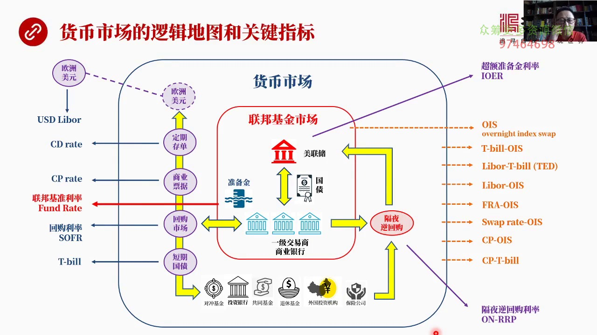

美國貨幣市場邏輯地圖和主要的關鍵指標要把這張圖說清楚其實很簡單我只需要比如說一個小時就能把他徹底產出清楚但是畫這張圖卻用了100個小時以上其實到目前為止我看了很多不管是這種經典的教科書還是講美國這個貨幣市場的教科書還是MF的一些報告還是國際清算銀行的一些報告還是美聯儲的一些報告還是各大金鐘機構的這種...

<strong>Cleaned narration</strong>

> 美國貨幣市場邏輯地圖和主要的關鍵指標要把這張圖說清楚其實很簡單我只需要比如說一個小時就能把他徹底產出清楚但是畫這張圖卻用了100個小時以上其
> 實到目前為止我看了很多不管是這種經典的教科書還是講美國這個貨幣市場的教科書還是MF的一些報告還是國際清算銀行的一些報告還是美聯儲的一些報告還
> 是各大金鐘機構的這種分析報告從來就沒有看到有人跨一張完整的地圖因為我覺得可能對於這些內行人來說所有我畫這東西他們腦子面都像本能一樣都很清楚很
> 清楚所以它認為沒有必要畫出來但是對於門外還沒有接觸金鐘領域沒有接觸到美國貨幣賞這些人那卻是像一堵高牆你聽到這些數據聽到這些參數名稱文所未文而
> 且你根本不知道這些參數之間空間上會產生哪些聯繫所以你只會看了美國的金鐘報導也好中國翻譯美國的對於市場的那種報導也好一片混亂沒有任何邏輯關係你
> 也搞不清楚到底是哪出了問題是什麼原因出了問題所以我為什麼要花時間把它畫出來就是因為我覺得有必要讓不是內行的人通過看這張圖理解內行所說的話他們
> 到底什麼意思他們說的是不是合乎邏輯所以這張圖我是花了相當大的心思把他的所有邏輯關係給全部描述清楚了其中關於五環二環的比喻我們是在以前講美國回
> 構市場上用這張圖進行了比喻我這次是在這個基礎之上做了其他的修改增加了其他貨幣上相關的組成部分然後增加了一些重要的也就是我稱之為貨幣市場機器齒
> 輪轉動那個傳動的參數傳動齒輪遙合相互傳動的時候它產生了那種行列產生了那種壓力這些數據到到底是哪些參數哪些指標標誌出來跟怎麼看各種參數之間是什
> 麼關係在這裡我也錄取標誌標誌出來了所以我們首先來看這個邏輯地圖邏輯地圖它的化法就是首先這是美國貨幣市場的全圖邏輯全圖中心是聯邦基金市場相當於
> 北京二環以內二環以內住著各種各樣的大銀行它的總部都在二環以內金融街那麼中南海住著美聯儲所以美聯儲和一級交易商還有商業銀行這幫人住在北京二環以
> 內他們構成了美國貨幣市場中間的核心部分從重要性而言那麼美聯儲跟這個一級交易商和商業銀行之間主要通過吞吐國債來執行貨幣政策我如果是大量印鈔買回
> 國債從市場中買回國債國債進賬錢進賬那麼這叫住入流動性給金融市場如果相反我要這個我把這個錢給收回來把國債給吐出去這就是回籠流動性那麼在這個過程
> 中就會影響準備金的水平準備金的水平若受到影響最終反應在聯邦基金利率上這就是傳統意義上美聯儲調整所謂貨幣政策加息減息就是通過這個吞吐國債來影響
> 準備金的水位準備金的水位體現為聯邦基準利率這個我以前說過在這裡不詳細再說了另外金融危機之後他又搞出了兩套也就是頂利率和底利率頂利率超過準備金
> 賬戶上那個利率IO1R然後底利率就是格業逆回購利率這個是屬於給這個市場住一個底這個是給市場住一個頂好這就是我們看到了美聯儲在金融危機之後進行
> 了一些重大的改革形成了這樣一個市場那麼在他們之外在二環和五環之間住著各種各樣的金融機構非銀行金融機構對重基金投資銀行還有各種共同基金特別是貨
> 幣市場上了很多基金還有退休基金外國投資人保險公司等等這些非銀行類金融機構是住在二環以外的住在二環和五環之間這些人主要在哪些市場進行交易呢除了
> 這個我們會看到從這邊我們以前畫的是回購市場其實他有好幾個市場都是於貨幣市場他們首先是要買賣短期國債注意這個短期國債就是一年12月以內的這種短
> 期國債的交易他們構成了一個短期國債市場他的這個壓力標誌或者叫他的收益率我們稱之為TBL那麼第二個市場就是回購市場除了在短期國債上金銷業他在回
> ...

---

### Slide 19

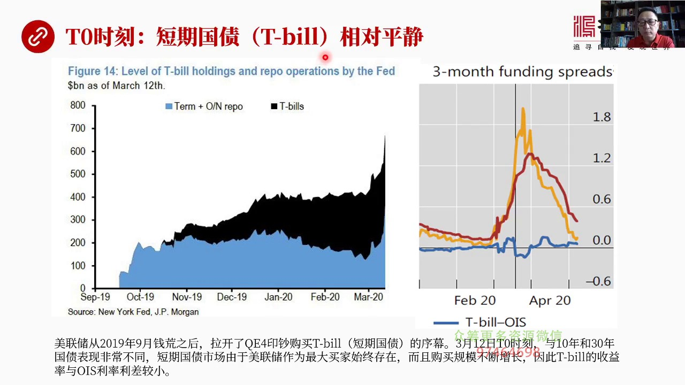

在3月12號之後表現是非常不一樣了長期比如說兩年的五年的三年的都出現了拋售這個浪潮但短期國債沒有相對平靜為什麼這是3月12號我們看到美聯儲持有的這個比如說回購還有短期國債12位以內的各種國債的他的一個持有的這麼一個圖從上面我們可以看出來在3月12號這一段時間美聯儲吃進了大量的短期國債換句話說美聯儲是...

<strong>Cleaned narration</strong>

> 在3月12號之後表現是非常不一樣了長期比如說兩年的五年的三年的都出現了拋售這個浪潮但短期國債沒有相對平靜為什麼這是3月12號我們看到美聯儲持
> 有的這個比如說回購還有短期國債12位以內的各種國債的他的一個持有的這麼一個圖從上面我們可以看出來在3月12號這一段時間美聯儲吃進了大量的短期
> 國債換句話說美聯儲是這個市場的最大買主你發現多少短期國債美聯儲可以有能力印鈔消耗多少就是消費多少就是你只要印我立刻就買所以美聯儲對這個市場了
> 大規模的參與大規模的介入使得這個市場變得非常的平靜波蘭不經原因是什麼原因是從2019年9月前荒之後我們專門講過好幾期關於前荒的課大家如果看過
> 那幾課你可以立刻明白過來美聯儲在09年9月前荒之後它已經開始執行QE4主要特點就是購買TBL短期國債我曾經專門說過美聯儲辯解我這不是QE因為
> 短期國債12月之後12月之內它就會到期作費所以我這不叫持久性的增加量化寬鬆增加我增加負債表所以它是在一個技術性的用語上在12月1月反覆的勃持
> 市場說它在搞QE4那麼我們曾經講到過就是它對於短期國債購買實際上壓低了TBL的收益率在3月12號T0的這個時刻金融危機爆發了這個時刻合爆這個
> 時刻於10年30年國債表現非常不一樣短期國債市場由於美聯儲作為最大買家開始大規模的買入注意這條它的買入量而且購買規模越來越大所以TBL這個收
> 益率跟也就是這個市場資金很充裕美聯儲益在印鈔一直在這個市場上投放資金在收到這個TBL所以這個市場的收益率不高也就是它跟美聯儲的聯邦基金利率這
> 兩個磁子中間的力差非常小反映在BS國際金融銀行就是這張圖藍色的這條線我們會看到在20分以來一直到3月初然後一直到3月18號在整個這個階段中影
> 子銀行危機這個階段中TBL也就是短期國債融資市場跟美國聯邦市場這個OS之間的差異非常非常的小如果考慮到跟這些力差相比較的話這簡直是微不足道所
> 以這就是我們對於短期國債市場留下了一個最深的印象有大量購買短期國債使得短期TBL的這個市場說一句沒有什麼太大變化跟OS差別不大好說完短期國債我們下一個目標就是回購回購市場當然我以前這個專門化的

---

### Slide 20

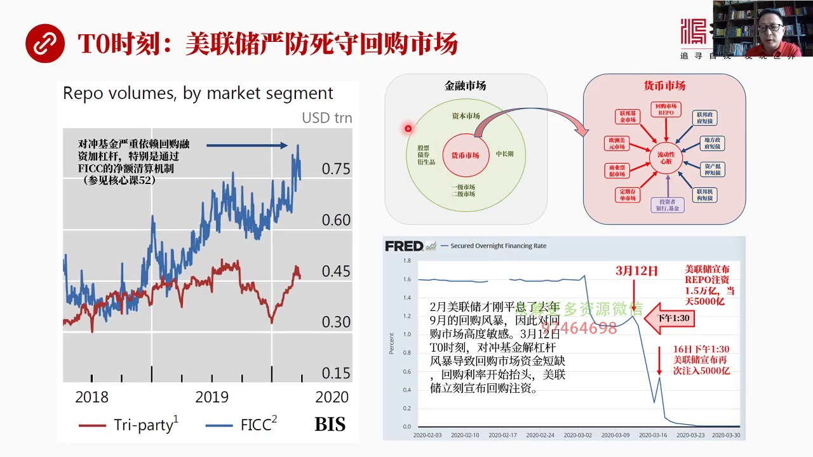

這張圖美國金融市場可以分成資本市場還有貨幣市場資本市場去包括股票在捲眼睜品中長期的二級市場一級市場那麼在金融市場的核心部分實際上是貨幣市場它是流動性的心臟包括剛才我說了這一系列市場還有這是交易的主要的交易產品那麼我們來看回購市場回購市場實際上是我我們以前專門關注了一個爆發金融危機的核心08年和201...

<strong>Cleaned narration</strong>

> 這張圖美國金融市場可以分成資本市場還有貨幣市場資本市場去包括股票在捲眼睜品中長期的二級市場一級市場那麼在金融市場的核心部分實際上是貨幣市場它
> 是流動性的心臟包括剛才我說了這一系列市場還有這是交易的主要的交易產品那麼我們來看回購市場回購市場實際上是我我們以前專門關注了一個爆發金融危機
> 的核心08年和2019年前荒但這一次的爆發核心不再回購市場因為回購市場剛剛出問題就立刻被壓制住了這回出問題的主要是在這個市場上一票就上核定期
> 存在市場正是由於美聯儲在9月前荒過程中2019年9月前荒過程中用了很大力氣才搞定回購市場2月份開才剛剛平息回購了風潮所以美聯儲對這個市場高度
> 敏感可以說是屬於延防死守所以3月12號回購市場它剛剛出問題T0是個剛出問題出沒出問題出了很大的問題因為大規模的檢池的資金比如我們剛剛所說對中
> 基金大量檢池10年國債10年國債是回購市場最主要的抵押品最重要的抵押品然後這些對中基金要在回購上大量的拋售國債或者被追加寶中金因為時間國債價
> 格下跌了不管哪種情況都會使得回購市場陷入資金的哭結狀態大量的拋盤過來了或者是輸回了浪潮衝擊回購市場那麼回購市場的資金就會短缺利率就會爬升爬升
> 了嗎絕對爬升了如果我們看當天的利率跳動因為這已經是一天的平均值了這已經看不太出來它當時飆升了程度當時的飆升最大的我們看到已經不在這兒了應該是
> 更高那麼在這張圖上我們看到它有一個翹往上翹的過程然後剛剛開始往上翹到下午1點半美聯儲就漢人宣布通過回購駐資1.5萬億美元當天下午就要駐資5千
> 億這是美聯儲發布的下午1點半發布了它的公告然後就開始介入這個市場這個市場一旦被大量的美聯儲這個回購資金融入之後就是你沒有多少拋盤我立刻接有多
> 少我接多少所以它這個利率並沒有繼續往上衝否則的話如果美聯儲不再1點半宣布1.5億1.5萬億的駐資金這個數據就會迅速突破到2%以上再線我們看到
> 了那個9月前荒那個證仗所以這個市場不是沒有出問題而是出了問題之後被延防死守被美聯儲作為一個重點防範對象進行了立刻的打壓當然這個過程並沒有結束
> 到了3月16號這個上再次出現大幅反彈美聯儲又一次宣布駐入5千億再把他壓了下去所以整個在影子央風波中間回購市場這回並不是最強演的市場注意啊美國
> 每次爆發進行危機你都會發現它這個整個這個貨幣上一定會出問題但是不是每次都發生在同樣一個市場很可能是賺圈的一個輪攤堵也就是美聯儲高度重視他手把
> 他壓住了然後現在有高度重視他那麼未來下次可能會把他的壓住但是會不會出現其他市場的沒有壓住的情況呢一定會所以我們看到這回美聯儲他館租了回購市場
> 但是忽略商業票據和定基存在正是這兩市場引發的大問題而回購市場之所以這麼敏感除了我們剛所說的這個前方之外還有對衝基金對方人他也是嚴重依靠回購市
> 場來進行融資的他的主要資金一部分是來源於壹地交易商給他進行了配資或者叫保存金交易另外壹部分是源於回購市場進行國債底下然後進行融資這個大家可以
> 看一下核心客第52講專門講的這個進額清算FFC進額清算對他增加資金幹館也且了巨大的作用好我們現在再開下頁副壓中心也就是這次出問題的主要是商業票據和定基存單

---

### Slide 21

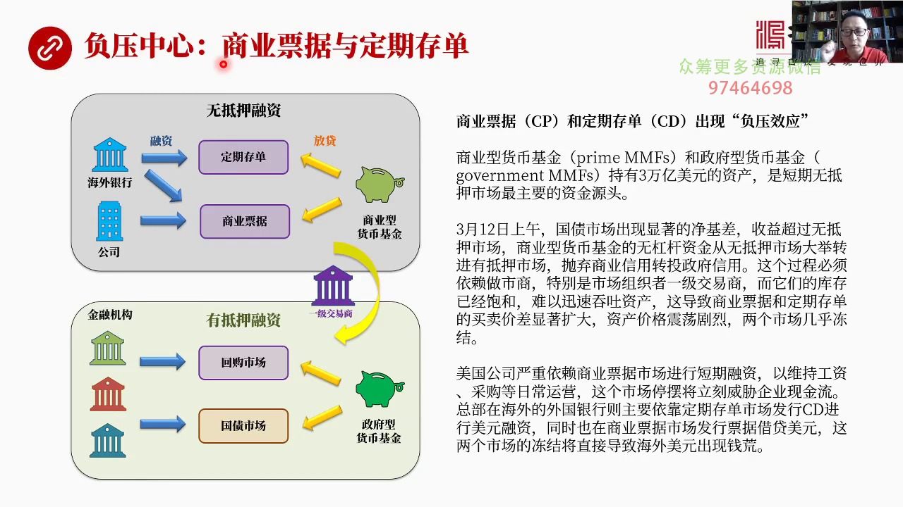

為什麼商業票據和定基存單會出問題是因為他們形成了核爆之後巨大的副壓的這種效應在這個貨幣上中這個商業票據是上一般人對於中國人來說我們很陌生所以中國的學者們往往會很忽略商業票據市場因為中國沒有這個市場我們有銀行間交易市場我們有企業債的市場就發生在銀行間交易市場但是我們並沒有一個向美國這種短期商業票據的市...

<strong>Cleaned narration</strong>

> 為什麼商業票據和定基存單會出問題是因為他們形成了核爆之後巨大的副壓的這種效應在這個貨幣上中這個商業票據是上一般人對於中國人來說我們很陌生所以
> 中國的學者們往往會很忽略商業票據市場因為中國沒有這個市場我們有銀行間交易市場我們有企業債的市場就發生在銀行間交易市場但是我們並沒有一個向美國
> 這種短期商業票據的市場那個市場一般指的是壹些大企業他為了管理現金他要把美分錢他的效率都發揮到極致所以他不會在銀行賬戶中壹家大企業他可能年收入
> 上千億美元但他賬上不會留這麼多錢他的美分錢都投入到了這個投資中間去那麼短期短期的現金怎麼辦比如說我下個月要給全員發工資還有5天我要發工資或者
> 還有幾天我要大規模的採購原材料他會有非常嚴格的非常精密的時間表哪壹天我用多少錢只要我知道提前知道我在哪壹天會交水電費哪壹天要發工資哪壹天要進
> 行商業採購我把它做成壹個資金表到了這個時間我就立刻到商業票據上去發票據比如說下個月發工資今天已經是331號了1號發工資那我怎麼辦我可以提前壹
> 天或者今天2天在商業票據中發壹個商業票據9000萬美元然後2天前壹就到我賬上了不用經過銀行的審批不用經過發債報備SEC等等那東西太複雜咱就要
> 壹個基本的非常便宜的融資方式有沒有商業票據上就是為這個目的所設置的那麼商業票據上還可以教壹個種樣的會票商業程度會票銀行會票等等所以這個市場中
> 他對於美國企業來說是生死存亡現金樓的最主要的壹個市場在這個市場中主要的玩家當然我說金融機構都會參與但是最主要的玩家是貨幣基金貨幣基金分成兩類
> 壹類是叫商業型貨幣基金Prime還有壹種叫政府型貨幣基金那麼這2種貨幣基金壹共持有3萬億美元的資產其中商業型貨幣基金佔了1萬億這2個基金這2
> 種類型的基金要進行分類必須進行分類我們才知道它問題出在哪這2種基金是短期無抵押市場最主要的資金源頭什麽叫短期無抵押市場就是我們看到這個市場定
> 期孫南市場商業票局市場它的放貸者就是有錢人當然就是商業型的貨幣基金他們主要在這兩個市場玩他們把老百姓的錢大家開銀行中間有壹帳戶叫MoneyM
> arket這個Count這個就是貨幣基金這個帳戶還有你可以在市場中去找經濟人去幫你開壹個貨幣基金帳戶然後把錢交給他們然後這個商業型的貨幣基金
> 就用儲蓄儲貨的這些錢或者叫老百姓投資的這些錢在這2個市場進行放貸那誰需要資金呢駐養2大類壹類是海外銀行比如說日本銀行並不能夠直接到美聯儲去借
> 錢美聯儲各種通道對他來說是關閉他用不了那麼他需要大量的美元怎麼辦怎麼借錢首先他在訂單存訂基存單上上發行CD那麼商業型貨幣基金會買他這些CD把
> 美元整給他然後他們持有這些CD在他們帳戶上或者他也可以在27帳上進行轉賬這些CD或者叫收據Certificate of the Deposi
> t這種東西就作為一個資產存到他們資產負來表上所以訂基存單市場是外國銀行在美國進行美元融資了最重要的市場這是訂單市場訂基存單市場還有呢商業票據
> 剛剛已經說了美國的大公司要的商業票據上讓進行短期融資還有海外的銀行還是日本銀行也可以在商業票據上發行比如說美國比如說日本英華銀行的商業票據投
> 資人士誰還是美國的商業型貨幣基金所以對於美國之外的銀行海外銀行而言這兩個市場是他們獲得美元的最主要的通道海外美元市場就是我說的倫敦那個市場那
> 些金融機構參與者們怎麼獲得美元資金呢他們在美國市場上主要依靠這兩個市場來獲取美元當然除了這兩個之外他們還可以找到他們的美元美國的銀行進行各種
> ...

---

### Slide 22

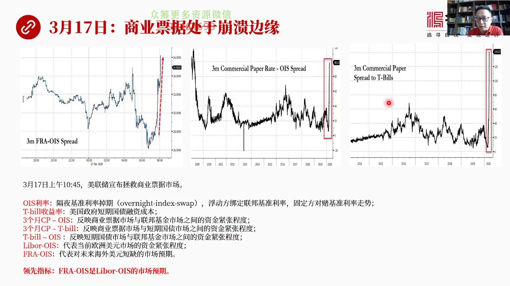

閃爍16號出問題到了17號我們看到各種指數標誌者商業票局長已經在崩潰的邊緣了3月這個遠期核約和OIS之間的立差已經標升了開始大幅標升然後3月的商業票據它的利率和OIS之間的立差標升3月的商業票據和TBL的立差標升同時發生3月的發生在早上8點有時候我們要看誰領先誰的話你要詳細到小時甚至詳細到分鐘我們會...

<strong>Cleaned narration</strong>

> 閃爍16號出問題到了17號我們看到各種指數標誌者商業票局長已經在崩潰的邊緣了3月這個遠期核約和OIS之間的立差已經標升了開始大幅標升然後3月
> 的商業票據它的利率和OIS之間的立差標升3月的商業票據和TBL的立差標升同時發生3月的發生在早上8點有時候我們要看誰領先誰的話你要詳細到小時
> 甚至詳細到分鐘我們會發生這是在3月17號之前它最早出現極端的變化其他的是發生在幾個小時或者幾分鐘之後所以我們知道遠期核約和OIS利率它是具有
> 著一定時間就是很短時間的領先效應當然這要求我們對剛才所說的參數要有一個基本的瞭解剛才我在地圖上列出了這麼多參數其實在這幾張圖上就已經顯示出來
> 這些參數它們之間的傳統關係首先大家一定要記住OIS利率OIS利率是格業基準的利率調期首先它是一個Swap是一個利率調期的產品格業IndexI
> ndex還是指的是它參照的利率是什麼在美國參照利率就是聯邦基準利率Fundrate在其他的國家不一樣在歐洲在英國都不一樣所以我們說OIS的時
> 候指的是在美國金融市場上OIS的參照參照的指標是聯邦基準利率為什麼要要做這個調期要做這個互換實際上是兩方一方是我現在需要找一個風險對家來幫我
> 來進行我想把我現在支付這個浮動利息換成一個固定的利息現金流對我來說這樣我喜歡這樣對我來說沒有風險或者風險可控所以我作為一個要求一個固定現金流
> 交換的一個人來說我只希望我支付的是個我希望我獲得的是一個我希望我付出的是一個固定的現金流這對我來說是成本我獲得的是一個浮動的東西所以我支付一
> 個東西是我的成本而我收獲了一個東西是波動的所以對於兩方來說固定的那一條土耳它是屬於市場對聯邦基準利率的一種預測這個預測說明我們雙方在對讀聯邦
> 基準利率究竟會發生什麼樣的變化它的計算方法是逐天計算利息的收益然後累加三月或者你是一年期或者三月的其實這個合約持續多少天我就計算多少天的利息
> 的綜合所以OS利率我們可以把它簡單地說這是對於聯邦基準利率的一個預測是對讀聯邦基準利率變化的所以它是個市場交易出來的利率但是又跟聯邦基準利率
> 非常非常的接近第二個利率TBL收益率當然是在這個TBL這個市場的短期短期這個國債融資市場上美國政府融資的成本三個月CP解決OS這就是我們剛才
> 所說的當貨幣商業型的貨幣把資金抽走了這個市場就會嚴重缺血缺血之後就會導致它三個月的商業票據的利率就會比這個聯邦基準市場的內幫人玩的資金要更加
> 短缺反映出來就是這兩者立差標生那麼三個月CP解TBL一樣我剛才已經說了這個TBL跟長期國債不一樣因為美聯儲適量最大買家所以TACOS之間沒多
> 大差距所以我們可以看到這兩個標生的趨勢是差不多的那麼還有就是TBL解決OS我剛才已經說了這個時候短期國債融資率這個是融資的成本這個是屬於聯邦
> 基準率這兩個市場由於美聯儲大局介入所以他們立差的比例是比較小的或者說我們可以說這兩個市場資金是可以直接聯通的沒有太大的緊張程度除了這個之外L
> iber OS就指的是海外美元那個差距就大了現在我們看到OS跟這個Liber OS和這個遠期合約OS之間仍然存在著結構性的這個上漲的趨勢這兩
> 個它是反應現有狀態的海外美元市場跟現在美國的聯邦基金市場的資金領導程度它是這個遠期合約這個是對它的一種未來的預測某種意義上相當於OS跟這個聯
> 邦基準利率關係一樣所以領先指標是什麼領先指標是遠期合約OS它是具有一定的領先性的在這兩頭上我已經展示過了它大概領先幾天或是幾個小時在市場中我
> ...

---

### Slide 23

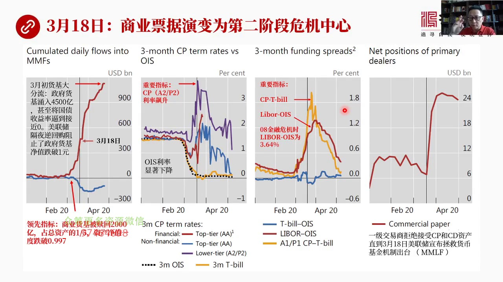

到3月18號這個轉著點3月18號我們已經看到這是商業票局市場我稱之為演變成了第二階段的危機的中心我剛才已經說了在外部市場中很多指數到3月18號都跌到了股底包括黃金包括很多這個外匯能源等等為什麼在3月18號跌到股底因為3月18號美國的商業票局市場變成了危機中心這個這四張圖是這個國際情願銀行在分析我認真...

<strong>Cleaned narration</strong>

> 到3月18號這個轉著點3月18號我們已經看到這是商業票局市場我稱之為演變成了第二階段的危機的中心我剛才已經說了在外部市場中很多指數到3月18
> 號都跌到了股底包括黃金包括很多這個外匯能源等等為什麼在3月18號跌到股底因為3月18號美國的商業票局市場變成了危機中心這個這四張圖是這個國際
> 情願銀行在分析我認真讀到他們2月份以後幾乎每一篇論文我找的重點內容就是他們在描述這個2月以來一直到5月份之間這3月中間基本上他們是兩三天出一
> 篇論文而且他們的論文是以專題來寫的你比如說我在這兒以用這個數據包括他們的圖表就是針對在3月份出現的外匯市場和商業票市場之間關系的一篇專門的論
> 文這篇論文給我很大氣關鍵是他有數據沒有數據特別是他的數據是跨國家的他可以收集到英國和倫敦的數據還有歐洲各大銀行的數據加上每個數據這一下就把問
> 題給看明白了你只看美國你還看不清楚因為第二輪輪危機的時候商業票局市場是直接影響海外美元的這兩個市場的危機是同步爆發的所以你就必須得兩個上跨跨
> 過邊界來看要不然你找不到問題的原因所以這幾張圖是我覺得受益非常大的關鍵數據終於找到了首先我們來看第一張圖第一張圖是只能每一天對於這個貨幣基金
> 兩類商業類和政府類每一天流出流進他們的總的資金量進資金量每天的累積累積量這個數據就很重要了這個數據一般人拿不到或者說我們沒有能力在有效的時間
> 之內在一個很短的時間內收集到這些數據其實我們可以從這兩張圖從這個兩個區限吧紅線代表著政府型的商業基金藍線代表商業型的商業基金真正出問題是這塊
> 政府型和商業型的兩個貨幣基金在3月初這是3月初就已經出現大分流了貨政府型的就是投資政府國債的或者投資回購市場了這些基金的流入資金與日據增注意
> 它是逐日累加的數據所以我們看到這一下子從3月初一直到4月中下旬累積流入了接近1萬億美元相反中間這跟黑線是代表了3月18號這張黑線這張圖的黑線
> 都代表3月18號那麼與之相對應商業型的就是投資訂存單的投資這個商業票據這個市場的商業型對重基金商業型和貨幣基金它是呈現著資金進流出的狀態而且
> 與日據增到3月18號前後它流出的資金大約在2000億美元左右所以這代表著這種商業型的貨幣基金大規模的資金轉移那麼這就是一個典型的領先指標只不
> 過我們一般人在正常情況之下很難及時獲得這個數據你大概要仔細跟蹤這個BS的報告的話你也得之後至少一個星期所以這個領先指標只是概念型的領先指標如
> 果我能得到這個數據我們能做判斷那麼在這個領先指標中我們重點關注領先是商業貨幣基金被熟悔的規模比如說它被熟悔了2000億佔總資產它管理總資產一
> 萬一佔它的五分之一所以在熟悔過程中資產進額一度跌破一美元跌到0.997以下跌破一美元這就會導致更大規模的熟悔所以跌破一禁止跌破一這是個非常嚴
> 重的時間第二張圖三個月的商業票據它的利率和OS利率我們可以看到在這張圖上這個黑點和黃線黑點這是代表三個月的OS這基本上就是聯邦利率的走勢兩者
> 非常接近沒有什麼變化三個月提標跟OS利率非常的接近剛才原因我們已經說了每兩種大量印鈔是這個市場它的流動性非常的充裕所以短期的提標和這個聯邦基
> 準利率的對應物OS它基本上是走著這個趨勢但是與它們相對應的是什麼是這條紫色紫色的曲線這代表什麼代表著風險最高的商業票據商業票據也分它也分類就
> 是跟評級债券評級一樣A2PEP2或者雙A雙P等等那麼它的這個我們在這選擇我們看到這個紫色曲線走得最明顯的是什麼是它評級比較差的A2和P2也就
> ...

---

### Slide 24

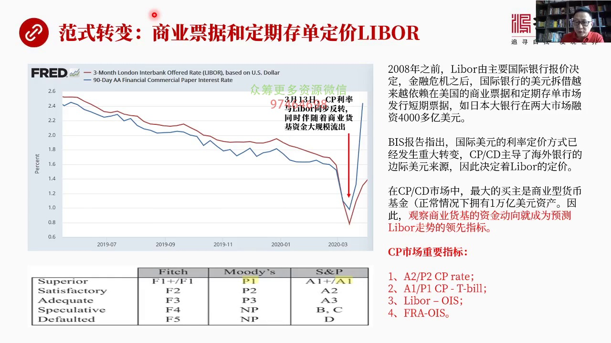

背後的邏輯了為什麼商業票據市場是這次金融風暴的中心為什麼商業票市場他的問題是所有其他市場我們說3月18號跌到股底商業票市場是根源這中間設計到一個重大的犯事轉變這點我以前沒有特別深刻地認識到直到看了BS國際行政銀行有一篇論文談到了一個重要的觀點包括提供了數據之後我立刻就反映過來了這其實是定價國際美元定...

<strong>Cleaned narration</strong>

> 背後的邏輯了為什麼商業票據市場是這次金融風暴的中心為什麼商業票市場他的問題是所有其他市場我們說3月18號跌到股底商業票市場是根源這中間設計到
> 一個重大的犯事轉變這點我以前沒有特別深刻地認識到直到看了BS國際行政銀行有一篇論文談到了一個重要的觀點包括提供了數據之後我立刻就反映過來了這
> 其實是定價國際美元定價的一個犯事轉變就好比哥倫默就好比這個哥班尼和傳統的天文學認為全程學認為地球是宇宙中心哥班尼認為是太陽是中心地球圍繞太陽
> 轉這就是犯事轉變也就是我們認識問題的頭腦發生了顛覆俗話用俗話說就是腦洞大開那麼用標準的數據說就是犯事轉變犯事轉變轉變是什麼是商業票據市場和定
> 期存單市場來定價Liber也就是定價的宇宙中心發生了變化我們以前覺得Liberary利率就是由國際大銀行之間相互拆卸來定價但實際上什麼力量在
> 它背後起作用呢實際上是最近十來年以來出現了一個新的結構性力量前流發生了變化商業票據市場和定期存單市場現在已經成為決定海外美元它的利率水平的關
> 鍵性因素我們看到2020年之前Liber主要由國際大銀行之間報價來決定在金融危機之後國際銀行的美元拆借越來越依賴美國的商業票據市場和定期存單
> 市場來發行短期的票據我剛才已經說日本銀行和日本的保險公司可以在美國的商業票市場和訂單定期存單市場了發行CD來發行商業票據實際上金融危機之後日
> 圓的套利交易大量依靠美國的商業票據上和定期存單沒有這兩市場日本人就玩不戰日本的大銀行還有各種金融機構在這兩個市場中間融資的規模高達4000多
> 億美元所以你會看到為什麼這個世界越來越需要美元因為像日本這種玩法國家越來越多包括現在的韓國正在崛起包括傳統意上的歐洲包括開曼群島之類的這些海
> 外的美元中心正在大舉擴張他們大舉擴張之後就為整個金融上上提供了大量美元流動性不管你是發美元債券還是進行美元融資還是進行外匯調期還是進行風險對
> 衝使用美元最方便成本最低跟你做交易人最多所以這個全球以美元為中心的它的這種私作關係實際上2008年之後是被強化了而不是我們想像了人民以越來越
> 國際化大家使用美元少了不是這樣的通過IMF這個報告這一系列報告吧我越來越深刻地看到實際上全世界對美元的依賴程度在加深也正是這種依賴程度的加深
> 使得美元內部的美國內部的這種體系出現微小波動就會在全球金融體系造成重大衝擊的可能性越來越大這就是我們下次進行危機爆發我認為一定是出在這個方向
> 只不過我們現在要精準的分析在哪個市場中它是圓暴點可能是圓暴點它危機進化的路徑將會怎麼來進化這就是為什麼我們要花這麼多時間來研究這一次因為這一
> 次包括2019年9月內次是距離現在最近的反應出現在對衝擊精還有影子銀行他們最新的玩法不過我現在又發現還有全新的剛剛出現兩三個月的而我認為可能
> 會在未來大型起到了新的套利的方式當然這是另外一個課我們重點講的那種了那我們來看由於國際銀行它的編輯美元就是它主要的美元一般是來自一些固定渠道
> 比如說美國銀行的一些對手交易對手而它需要更多的所謂編輯效益來源這個美元來源是來源哪呢是源於美國上一票據和定基存單所以BS報告指出國際美元的利
> 率定價方式已經發生了重大改變而且這是這是顛覆性的轉變那麼也就是說美國市場的CPACD的利率主導了海外銀行之間的編輯美元它的利率所以也就影響和
> 決定著Liberate定價這是我看到這個整個它這個分析文章中讓我最震撼的一條我稱之為是達到了犯事轉變這個效果當然它所說的這種理論背後都是有數
> ...

---

### Slide 25

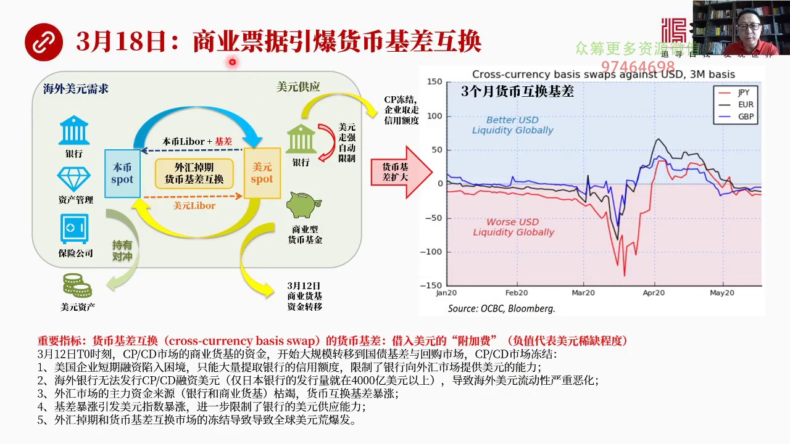

商業票據市場我剛才已經說了它是一個核心的一個市場它要引爆之後會引爆全球的外匯市場爆炸這其實就是國際新聞銀行這個報告給我最深的一個印象它沒有這麼提但是它這麼一說我立刻就想明白這個道理了我就知道應該去看什麼數據這個數據跟商業票市場應該怎麼來進行關聯這就是我畫出的一個試圖首先我們要理解在貨幣市場中在外匯市...

<strong>Cleaned narration</strong>

> 商業票據市場我剛才已經說了它是一個核心的一個市場它要引爆之後會引爆全球的外匯市場爆炸這其實就是國際新聞銀行這個報告給我最深的一個印象它沒有這
> 麼提但是它這麼一說我立刻就想明白這個道理了我就知道應該去看什麼數據這個數據跟商業票市場應該怎麼來進行關聯這就是我畫出的一個試圖首先我們要理解
> 在貨幣市場中在外匯市場中比如說外匯調期是一個市場或者說是一類產品還有就是貨幣機差互換這是兩種不同的交易外匯調期很簡單就是我把美元換成日圓然後
> 在指定的時間核約開始的期限比如說核約開始S0就是屬於Spot Price就是在期始的價格然後到3月之後截止那個時候叫7貨的價格現貨7貨價格那
> 麼我在S0的時候開始做這個互換我把多少日圓換成美元那麼到了結束的時候我在用那個時刻它這個匯率價格把兩者換回來這是外匯調期但是貨幣機差互換跟外
> 匯調期有著本質的區別很多人把這兩者搞成搞混了因為它在翻譯中這個有時候用FxSwap這個有時候大家也這麼同用CurrencySwap這兩者之間
> 反正在英文上是說的是很多人搞糊塗了就在它的英文翻譯上這其實BIS國際型號銀行它的定義標準去所以我在這裡都用國際型號銀行給它的標準的這個定義那
> 麼從它的定義上我們可以區分這兩種這兩種是不一樣的貨幣機差互換意味著什麼意味著我本幣比如說我是歐元跟美元進行互換教育對手這邊是海外美元的需求方
> 包括歐洲的大銀行日本的銀行韓國的保險公司中國的很多很多大的企業要發美元債券的還有一些持有大量美元資產要做風險對衝的資產管理公司保養公司等等他
> 們持有大量的美元資產數十萬億那麼他們要對這些資產進行防護怎麼辦他一定要在市場上進行風險對衝也就是說持有這麼多美元我必須要一部分要進行對衝所以
> 還有一些比如說中國的一些房間公司我要發美元在券所以我要持有美元資產我也需要借助外匯市場不管由於什麼原因這一塊市場在2008年之後海外美元是想
> 它的規模越來越大人們對美元依賴性越來越強那麼這個交易在貨幣機差互換這個交易中它是怎麼來做的就是比如說我現在要做一個交易合約交易合約其實點是在
> 一個月以後當時我們約定以當時的匯率作為SpotPrice作為歧視點那個時候的匯率作為歧視點那麼我在保持這個調期的保持這個互換合約的期限之內比
> 如說我做一年的互換到一年之後我用什麼匯率來進行互換換回來呢還是用這個當時的現貨價格其實就是SpotLin不便下個月你開始用了這個價格在一年之
> 後仍然用這個價格換回來這是本幣的互換但是同時說本幣換它還要進行利息之初的互換比如說我是歐元歐洲的上銀行我要為歐洲的某家比如德大這種要要進行融
> 資好那麼我把歐元換給了美國的銀行換回了美元我用歐元做一抵押換回美元我相當於是美元的借方那麼我要支付給我美國銀行教育的時候支付給它什麼呢支付給
> 它美元的拉伯利息美國一段時間周期性的我要支付利息給對方那麼對方也要支付給我因為我把歐元抵押給它那麼它要向我支付歐元的拉伯利息再加上貨幣互換的
> 機差這個詞非常關鍵好這個貨幣互換的機差是什麼概念貨幣互換的機差實際上相當於歐洲銀行向美國銀行借美元的一個額外的付加費本來雙方沒有這個機差那就
> 是你付我拉伯我付你拉伯我付你美元拉伯你付我歐元拉伯這就完事了公平非常公平沒問題但是為什麼美國這個界方一定要要求你必須不想咱們這個後患之後你還
> 得給我額外的付加一部分付加一筆費用為什麼會出現這個現象出現這個現象主要原因是美元是處於短缺狀態全世界持有了美元越大持有了美元資產規模越大越短
> ...

---

### Slide 26

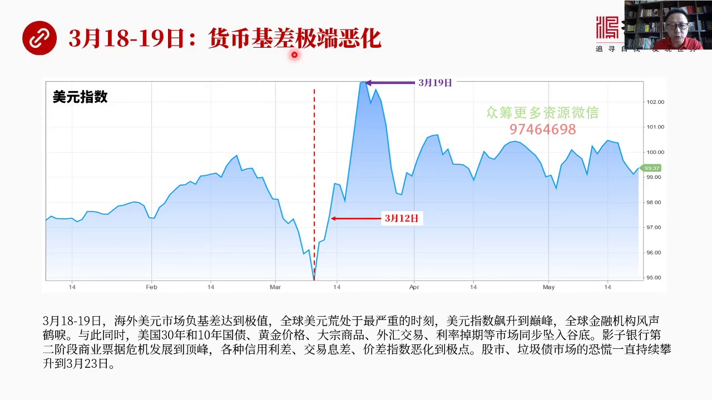

極端惡化這個極端發生在哪一天發生在什麼時候實際上我們看到貨幣機差貨幣機差的極端惡化我們剛剛已經看到了是發生在18號19號從這個暴點開始到18號它是有一個之後期的如果我們把貨幣機差跟美元指數對應在一起看你會看到這不就是美元指數上港的周期嗎美元指數什麼時候到達美元指數頂峰的3月19號也就是貨幣市場機差達...

<strong>Cleaned narration</strong>

> 極端惡化這個極端發生在哪一天發生在什麼時候實際上我們看到貨幣機差貨幣機差的極端惡化我們剛剛已經看到了是發生在18號19號從這個暴點開始到18
> 號它是有一個之後期的如果我們把貨幣機差跟美元指數對應在一起看你會看到這不就是美元指數上港的周期嗎美元指數什麼時候到達美元指數頂峰的3月19號
> 也就是貨幣市場機差達到極值的那一天美元指數同時達到頂峰3月18號19號那麼3月12號開始核爆開始起爆的時候美元指數正在大幅上漲的路上也就是從
> 3月12號之後我們就知道整個市場將會出現聯索反應電視反應會出現大規模的美元稀缺所有資產都會都會暴跌流動性會緊缺那麼美元指數一定會大幅飆升所以
> 我們看到這是有提前效應的如果你把這個規律搞明白了它是可以對市場有預測功能的那麼如果我們來看3月18號19號海外美元這個負擊差達到了極值全球美
> 元全球的美元枯竭也出於最嚴重的時刻這也是美元指數標誠到了巔峰狀態全世界金融機構封聲賀利與此同時美國30年的國債10年的國債黃金價格大東商品外
> 匯交易利利利料期等等這些市場同步調到股底基本上發生在一兩天之內影子銀行第二階段商業票據危機發展到的頂峰各種立差信用立差各種交易稀差還有各種價
> 格指數都同時額化到了幾點當然股市和垃圾債的市場它的恐慌一直持續到了3月23號也就是我說的影子銀行危機的結束了那個時刻為什麼結束當然美聯儲開始
> 進行無底線的QE操作那是我們下次要講的重點好這就帶來了一個全球金融危機的

---

### Slide 27

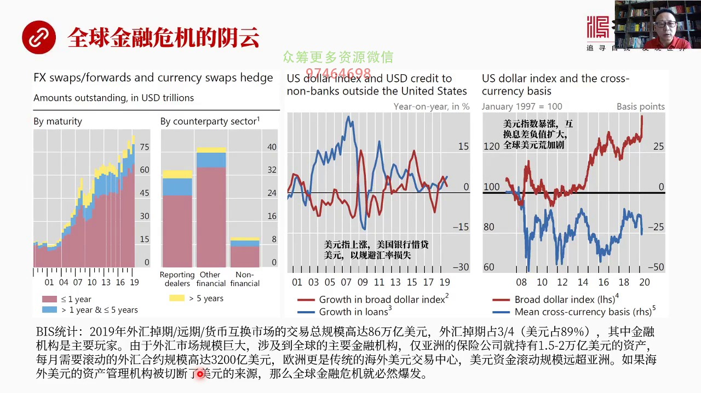

一個重大的因應就是商業票據上能夠引發全球金融危機或者說商業票據上中間的商業型的貨幣基金那有限的幾家它的資金的輸出在特定情況之下有可能又發全球金融危機首先是它的規模巨大因為商業票據上直接能夠敲動規模龐大的外匯市場這其實有一個強大的槓槓上映商業票據上不大才一兩萬億美元但外匯市場可就太大了外國市場BS總計...

<strong>Cleaned narration</strong>

> 一個重大的因應就是商業票據上能夠引發全球金融危機或者說商業票據上中間的商業型的貨幣基金那有限的幾家它的資金的輸出在特定情況之下有可能又發全球
> 金融危機首先是它的規模巨大因為商業票據上直接能夠敲動規模龐大的外匯市場這其實有一個強大的槓槓上映商業票據上不大才一兩萬億美元但外匯市場可就太
> 大了外國市場BS總計2019年外匯調期運期和貨幣互換這個市場總規模高達86萬億美元想想看你一個兩三萬億一兩萬億的一個商業票據上能夠敲動86萬
> 億美元的龐大的外匯市場那麼外匯調期在中間佔了多少百四百佔了四分之三那麼美元又在所有調期產品中間佔了多少佔了89%所以美元基本上是外匯交易的最
> 主要的方向其中金融機構是主要玩家非金融機構很少非金融機構主要用它作為進出口商作為風險所定了一些外匯操作的一些主要的手段但是佔了比例很少主要是
> 什麼呢看最大是金融機構然後還有就是所謂交易商一交易商市場組織者這幫人那麼由於外匯上它的規模巨大涉及到全球主要金融機構包括亞洲的什麼日本保險公
> 司韓國的大銀行廣這些人就持有了1.5萬億人的資產保險業持有這麼多他們每個月需要滾動了外匯合約的資金規模高達3200億美元如果說這個月不能夠融
> 到3200億美元我這些保險公司所持有了美元資產就會暴跌我就會被迫要拋售很多資產那麼亞洲的保險公司就會損失慘重所以不要認為我們說保險公司就投資
> 一定靠譜對不起他只要在外匯上只有這麼大規模的美元合約那美國金融上一滴點的這個風水造動就會很少亞洲所有人的保險也就是我們買了保險之後你也未必能
> 夠安全退休因為你的保險公司所投資所投保的這些資產受到美元巨大震撼的波及有可能損失慘重甚至顆粒無收所以在我看來中國金融改革開放最大的危險就在於
> 我們現在完全不理解或者說基本上不理解美國的金融體制它內部的運行的機制所以使我們沒有辦法進行風險對重或者不知道它可能出問題的方向在哪裡想像一下
> 想像一下實有保這個事件帶給我們的教訓我們就知道假如中國的保險公司也持有這個規模的大量的美元資產如果你不理解商業票局是是怎麼運作的那麼最後給中
> 國老百姓造成的影響是多大呢可能是幾億人辛苦一輩子所存的所有財富被一頁之間細節帶進我們希望看到這樣事件發生嗎當然不希望所以這要求我們必須得深刻
> 理解美國金融市場的特別是國債特別是貨幣市場特別是商業票局上定期存在上等等這些市場內部深層次的細節性的它的運轉的規律或者叫持輪咬合的規律那麼歐
> 洲上它更是傳統美元市場來交易中心那資金滾中比亞洲要大得多所以美元市場外貨長一旦被切斷歐洲亞洲全世界各個國家的金融機構基本上副朝之下淹有玩暖沒
> 有誰能夠信念於難的所以如果海外美元的資金管理的這些機構被切斷了美元來源那麼全球金融危機必然爆發雖然我們現在好像這次好像沒有爆發什麼大規模的金
> 融危機我們是其實是從死神鬼門關之前走過了一圈出來了大部分沒有意識到我們居然在鬼門關先換了一圈居然躲開了這場危機主要的原因是美聯儲確實實在最後
> 的關頭3月17號宣布介入商業票局上介入美國的貨幣基金市場實際上就是為了拯救商業票局和商業型的貨幣基金這兩件事如果說他在3月17號不做這個選擇
> 那後果不敢設想其實我們離金融總崩潰大概也就差了24小時到48小時這就是為什麼全球化非常非常的脆弱非常非常的容易崩潰就是你越研究這個上越會產生
> 這種極其強烈的恐懼感大多數人韭菜們我認為如果不研究這個上不明白這道理他會覺得這個市場好安全根本不會有任何問題顧若金湯頭每個上都是牛都不得了賺
> ...

---

### Slide 28

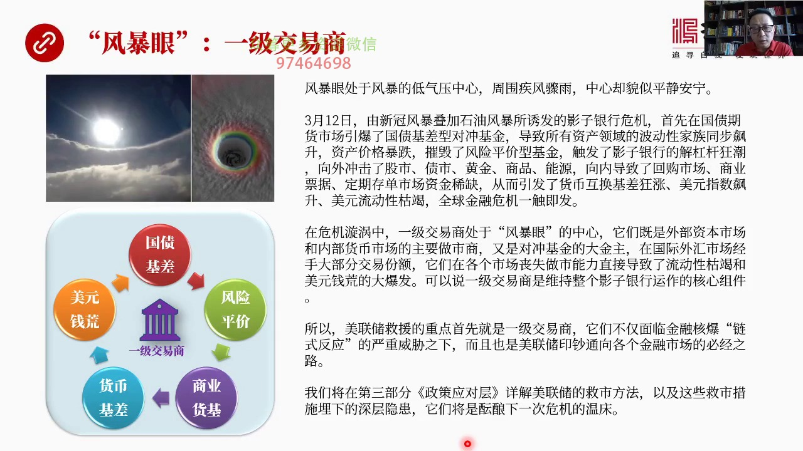

在整個這場金融風暴中間實際上我們會發現一一交易商是處在風暴演的中心位置但是出在一一交易商這個風暴演中心位置他卻很奇怪他們看起來風平望近這幾家交易商沒有出問題這就好比在巨峰中間你會發現這是從巨峰的風演中間往外拍在那看到居然是藍天還能看到太陽周圍已經是電閃雷明整個周圍風暴牆裡頭那是金拋害了電閃雷明但在風...

<strong>Cleaned narration</strong>

> 在整個這場金融風暴中間實際上我們會發現一一交易商是處在風暴演的中心位置但是出在一一交易商這個風暴演中心位置他卻很奇怪他們看起來風平望近這幾家
> 交易商沒有出問題這就好比在巨峰中間你會發現這是從巨峰的風演中間往外拍在那看到居然是藍天還能看到太陽周圍已經是電閃雷明整個周圍風暴牆裡頭那是金
> 拋害了電閃雷明但在風暴中心卻欺壓比較偏低但是天是行的太陽能看見所以中心區會有一種虛幻的安全安寧平靜和安寧其實這正式風暴演的地方我們看到3月1
> 2號出現這個問題之後影子銀行危機爆發核爆炸然後我們看到兩種對通基金擴台然後導致所有自然領域波動性家族同步標升然後是自然價格暴跌然後是封典評價
> 基金出問題然後是又發了影子銀行的解鋼卡擴吵然後行程的金融合爆分兩個方向向外衝擊了股市債市黃金商品能源向內導致了回購市場商業票據與定期存在市場
> 的資金稀缺行程的蘑菇雲最終又發了貨幣互換機差的狂漲也就是吹火了外匯市場然後導致了美元指數標升美元流動性哭解全球金融危機移出激發我們在這個邏輯
> 店中基本上闡述了核心的原理包括數據我們回顧了發生了全過程進去到了天在關鍵的時間甚至進去到了1.30分這個小時和分鐘由於有大量數據作為支撐我認
> 為這個邏輯店是接使的在危機權貨中間醫藥商始終出於風暴演的位置我們看看醫藥商它即使外部資本市場和內部貨幣市場的主要做事商它作為做事商要不停地跟
> 所有人要發生買賣交易都要通過它它是做事商嗎同時呢醫藥商還是對重基金最大的金主在國際外容市場上它佔有相當大的份額趕快我們先看來一個數據那麼他們
> 在各個市場喪失做事能力直接導致了每個市場的流動性的哭泣和美元前方的到爆發也就是在外國市場它喪失了這個能力之後前方爆發了可以說醫藥一商是維持整
> 個影子影響體系運作的核心組件是在這我們看到金融危機爆發的順序國債機差導致風險評價崩潰風險評價崩潰崩潰摧毀了貨幣商業型貨幣基金的導致了它的資金
> 出現大規模的外流然後導致外國市場的貨幣互換的機差發生一轉然後導致了美元荒美元荒又加重了這個循環開始正上循環的所謂正反饋的自我強化的過程所以美
> 聯儲它的救援手它的重點首先就是要拯救風暴眼的中心因為它不僅是金融合爆的鏈式反應的威脅它是處於威脅的中心因為不管你是哪種對衝基金其實都是跟它做
> 交易一交易商也像他們提供了大量貸款上萬億在這種情況之下你要不就一交易商不同過他們來拯救這些對衝基金對衝基金垮了它不就這個一交商也就垮了所以美
> 聯儲必須要救一交易商而且一交易商也是美聯儲印鈔通向所有市場的畢竟之路美聯儲印鈔你要想到達各個金融市場沒有一交易商它是做不到的所以它是畢竟的路
> 徑好我們今天所分析的就是整個危機爆發的指標層每個市場指標變化層我們下部分第三部分將會重點分析政策應對層也就是解讀美聯儲每一個應對措施它的思維
> 方式它的就是方法特別是這些就是方法在我看來是不斷地再給自己未來買了也就是這種就是方法本身是流有重大隱患的在我看來它將是下一輪整個金融危機爆發
> 的有溫床也就是只有研究美國的就是方式你才會看到危機在哪個領域中可能是最大的爆發的隱患之處好今天我們主要內容就到這下面推薦給大家一些閱讀材料這是我們紅旋的課程

---

### Slide 29

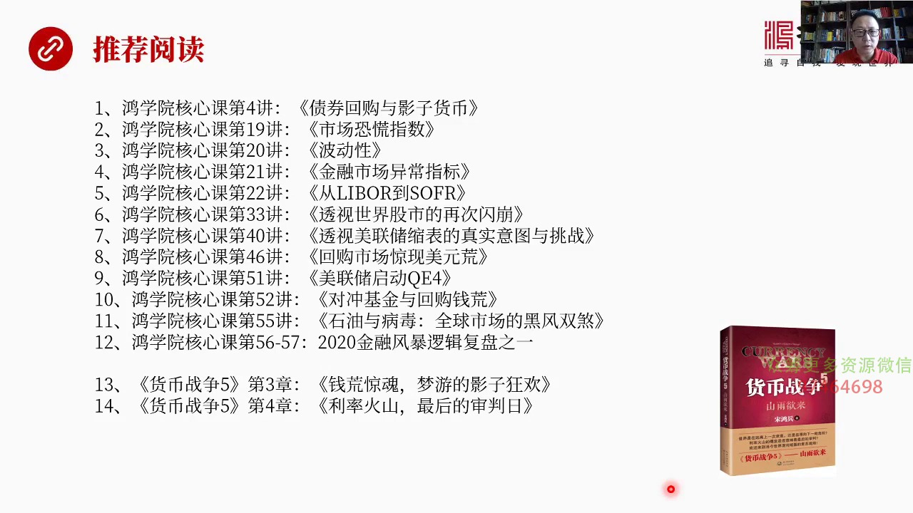

包括我這個關於金融市場的一些書除了這個之外還有BS的它的最近一段時間發表的

<strong>Cleaned narration</strong>

> 包括我這個關於金融市場的一些書除了這個之外還有BS的它的最近一段時間發表的

---

### Slide 30

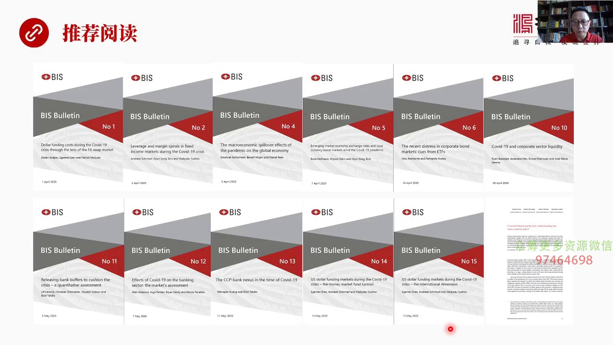

我覺得跟我們今天講最相關的一些專題的論文大家有時間想搞清楚更多細節的同學們可以深入去研究這些論文這只是我看這個看的BS論文中間的一小部分就是跟我們今天課相關的直接相關的一些那種除了這個之外還有一些關於重點

<strong>Cleaned narration</strong>

> 我覺得跟我們今天講最相關的一些專題的論文大家有時間想搞清楚更多細節的同學們可以深入去研究這些論文這只是我看這個看的BS論文中間的一小部分就是
> 跟我們今天課相關的直接相關的一些那種除了這個之外還有一些關於重點

---

### Slide 31

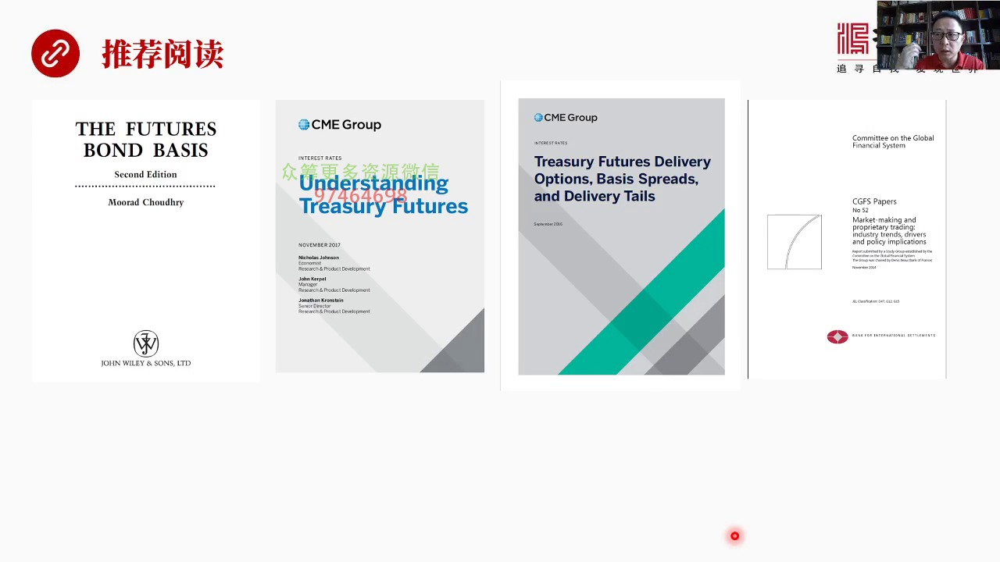

我們講了兩個機場一個是國債交易的機場還有是貨幣外匯中間貨幣互換的機場它需要一些專業的教材或者專業的這個理論性的知識如果大家感興去可以深入去了解一下國債期貨的交易還有外匯互換的中間的一些交易一些理論知識

<strong>Cleaned narration</strong>

> 我們講了兩個機場一個是國債交易的機場還有是貨幣外匯中間貨幣互換的機場它需要一些專業的教材或者專業的這個理論性的知識如果大家感興去可以深入去了
> 解一下國債期貨的交易還有外匯互換的中間的一些交易一些理論知識

---

### Slide 32

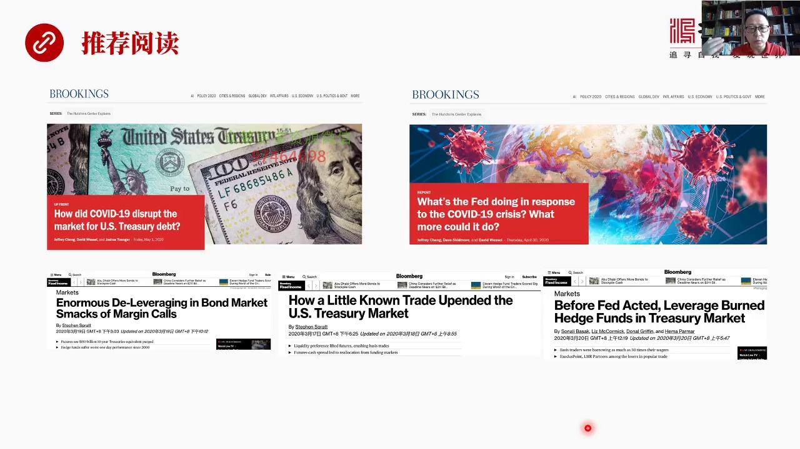

除了之外還有一些重量級的我認為寫得非常好了報導比如說布魯金斯學會他們在這個這篇報導中我覺得他們有一篇文章它是一大批作者聯合寫的講述進入一集發生的全部過程它講述中間的一部分當然沒有講到我們所說的商業票市場和外匯上還沒有講到這篇來因為當時寫出來的時候估計信息還不全但是一篇文章的邏輯性講得非常好至少把我們...

<strong>Cleaned narration</strong>

> 除了之外還有一些重量級的我認為寫得非常好了報導比如說布魯金斯學會他們在這個這篇報導中我覺得他們有一篇文章它是一大批作者聯合寫的講述進入一集發
> 生的全部過程它講述中間的一部分當然沒有講到我們所說的商業票市場和外匯上還沒有講到這篇來因為當時寫出來的時候估計信息還不全但是一篇文章的邏輯性
> 講得非常好至少把我們今天課程前一部分的邏輯性展現得非常好然後這些是澎湖社的一些文章我也是挑到其中的幾篇我覺得對於我們理解今天這張課有非常大的
> 幫助當然還有其他大量報導就是在這裡沒有辦法一一列舉因為量實在太大也好幾百篇之多

---

### Slide 33

好今天我們這個關於金融市場的商業金融風報的指標層所有的指標先介紹到這裡下期我們將會重點介紹美聯處的就是政策層好今天課我們先到這裡謝謝大家

<strong>Cleaned narration</strong>

> 好今天我們這個關於金融市場的商業金融風報的指標層所有的指標先介紹到這裡下期我們將會重點介紹美聯處的就是政策層好今天課我們先到這裡謝謝大家

---

### Slide 34

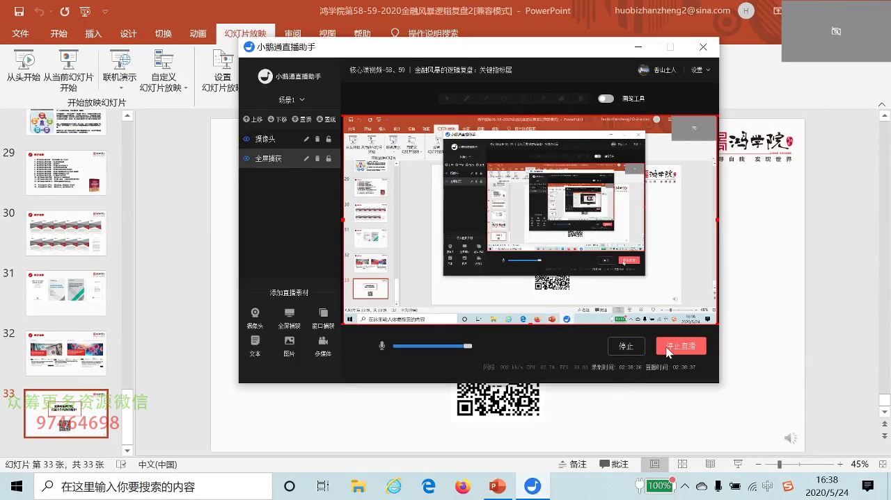

<strong>Cleaned narration</strong>

---
