# 核心课视频-60、61 金融风暴的逻辑复盘：救援政策 — Slide Notes

> **来源**：鸿学院核心课程  
> **幻灯片**：32 张

---

### Slide 1

同學們大家好 我們今天上核心課第60和61講這講是主要講三月金融風暴邏輯副盤的第三部分也就是政策風暴回顧那麼這也是這個系列的課程了第三部分 也是最後一部分通過前兩講我們可以看到我們把整個的美國金融危機的

<strong>Cleaned narration</strong>

> 同學們大家好 我們今天上核心課第60和61講這講是主要講三月金融風暴邏輯副盤的第三部分也就是政策風暴回顧那麼這也是這個系列的課程了第三部分 
> 也是最後一部分通過前兩講我們可以看到我們把整個的美國金融危機的

---

### Slide 2

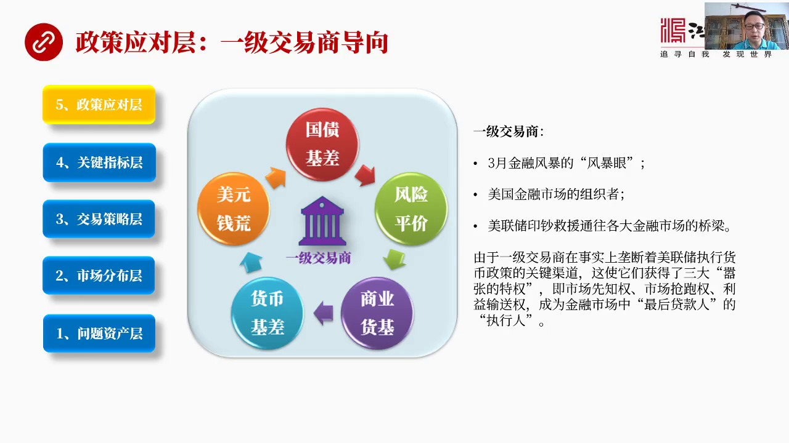

它的發生發展從一個分層的方法來進行解讀底層問題資產把問題資產這層搞清楚之後然後我們上升到市場分布再上升到交易策略然後是關鍵指標那麼今天我們講第五層政策應對層那麼這套思路實際上是基於我們同學們核心課認知算法其實借助於人工智能的深度學習理論所得出來了一系列的這種方法論那麼通過前兩講我們已經非常清楚地看到...

<strong>Cleaned narration</strong>

> 它的發生發展從一個分層的方法來進行解讀底層問題資產把問題資產這層搞清楚之後然後我們上升到市場分布再上升到交易策略然後是關鍵指標那麼今天我們講
> 第五層政策應對層那麼這套思路實際上是基於我們同學們核心課認知算法其實借助於人工智能的深度學習理論所得出來了一系列的這種方法論那麼通過前兩講我
> 們已經非常清楚地看到了在整個金融危機發展的過程之中它的核心點它的核心之處是在於EG交易商我們看到從3月12號爆發的這種可以說是金融核爆首先取
> 緣於國債機差然後轉移到了風險評價然後再逐漸轉移到了商業貨幣基金最後到達了外匯機差通過外匯機差放大影響到了外匯市場然後這個循環不斷的加劇使得危
> 機和問題越來越嚴重所以我們從這張圖上可以看出來在危機循環之中EG交易商始終是處在一個風暴眼的位置除此之外我們還知道EG交易商是美國金融市場的
> 各大市場的組織者無論你是股票债券還是外匯還是包括黃金市場還是其他的這個市場由於做事商制度是美國金融市場的主流的這樣的一種市場組織方法所以EG
> 交易商是美國各個核心金融市場的每個市場中的重要組織者除此之外這個EG交商還有一個重大的特點它是美聯儲你不管是推薦什麼樣的貨幣政策加息 降息 
> 還是QE還是任何貨幣政策美聯儲必須要跟EG交易商打交道就是紐約聯儲銀行的交易櫃台通過跟EG交易商24加EG交易商打交道買賣資產來影響各大金融
> 市場的資金的緊缺所以美聯儲印鈔就員各個市場那麼它必須要通過EG交易商也就是EG交易商是一個通往各大金融市場的主要的橋樑美聯儲繞不過EG交易商
> 它如果想執行任何貨幣政策的話所以這就使得EG交易商它在事實上壟斷著美聯儲執行貨幣政策的關鍵渠道它是不可預約的這就是EG交易商獲得了三個重要銷
> 章的特權第一是市場先支權第二是市場強跑權第三是利益輸送權這什麼意思也就是美聯儲要執行任何貨幣政策必須要先通支EG交易商我準備怎麼做所以它比市
> 場更先獲得美聯儲的政策執行的路線圖這就是使它獲得了先支權強跑權什麼意思因為EG交易商跟美聯儲進行對做跟紐約聯儲銀行進行直接交易所以所有的交易
> 實際上都要通過EG交易商來跟美聯儲進行資產交換所以使得EG交易商在整個交易過程中處在一個中間人位置上它可以比市場其他人首先獲得市場的信息然後
> 進行搶先進行交易這叫強跑權同時由於它獲得了這麼大的一個壟斷權它實際上是某種意義上是從美聯儲直接拿到的利益輸送因為所有交易都要通過它這是它的特
> 權這就是我們看到的今天我們要講了這個課程中我們會通過各個的救援機制你會發現EG交易商基本上都是處在中心位置上那麼整個救援這個行動我們知道美聯
> 儲被號稱是銀行的最後貸款人其實在救援行動之中美聯儲是把最後貸款人這樣的一個地位委託給了它的執行人EG交易商也就是說EG交易商演變成了美國金融
> 市場救援機制過程之中的最後的貸款人的執行人所以EG交易商是我們這堂課需要重點理解的美國的整個應對金融風暴的它的政策取手我們可以簡潔的概括為E
> G化就是EG交易商倒向行它的救援政策那麼首先我們來看一下這個執行這套政策的時間序列

---

### Slide 3

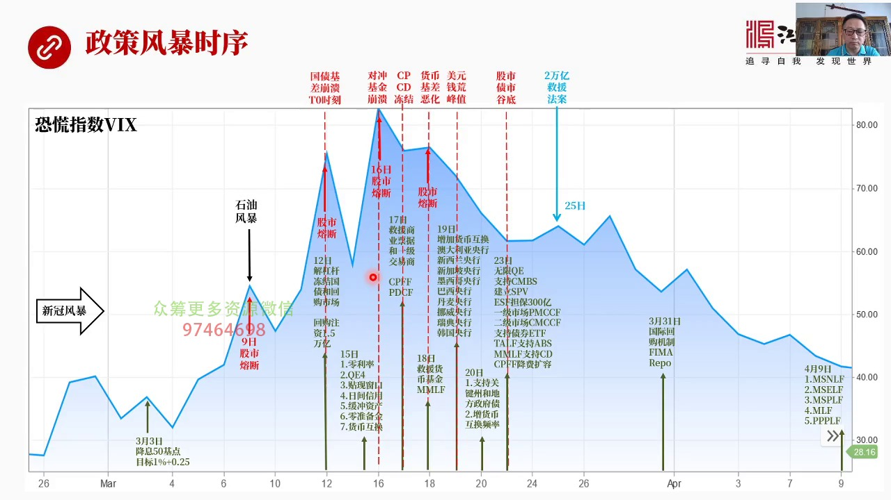

這張圖我們標誅出來了這是美國金融市場的恐慌指數股票市場恐慌指數Wix那麼我們可以看到新冠風暴從年初這個一直刮到現在衡冠了這個金融風暴的全過程石油風暴是一個點燃危機的導火所在這兒我們看到這是3月9號那麼在3月9號之後3月12號出現了重大的國債機差崩潰也就是我們說的T0時刻金融合爆爆發在這一天3月12號...

<strong>Cleaned narration</strong>

> 這張圖我們標誅出來了這是美國金融市場的恐慌指數股票市場恐慌指數Wix那麼我們可以看到新冠風暴從年初這個一直刮到現在衡冠了這個金融風暴的全過程
> 石油風暴是一個點燃危機的導火所在這兒我們看到這是3月9號那麼在3月9號之後3月12號出現了重大的國債機差崩潰也就是我們說的T0時刻金融合爆爆
> 發在這一天3月12號那麼在3月12號這天股市農斷同時國債機差引爆之後導致了對重基金大規模的減強感然後又發了另外一個對重基金另外一種對重策略就
> 是風險評價打了要他們搞了風險評價對重基金這種策略所以國債機差加上對重策略形成了這個國債機差加上這個風險評價對重策略這兩股力量形成了兩萬億美元
> 的大規模的減強感所以他們拋售國債這個過程使得美國國債市場陷入了凍結回購市場也陷入了重大的這個危機那麼在當天美聯儲緊急的向回購市場注入了1.5
> 萬億美元來緩解回購市場因為回購市場是9月前荒的一個中心市場所以美聯儲對這個市場特別關注稍微有點異常它就立刻進入這個市場進行干預然後隨後發生的
> 是危機的持續發展到了15號3月15號我們看到美聯儲推出了7大政策來挽救金融危機第一零利率那麼我們看到在3月3號說美聯儲市場已經降過一次息了降
> 75是個積點把它的目標值降到了1%到1.25%之間那麼到15號的時候乾脆就降到了0同時第二項宣布的重大政策是QE4也就是7000億每月700
> 0億的這個購債規模注意這還不是無限QE無限QE是23號推出來了第三個主要政策就是開放天然窗口這個天然窗口已經關密十多年了這一次重新打開因為美
> 聯儲預計會有銀行撐不住要到天然窗口來借錢那麼第四就是銀行體系之間的日間的信貸日間信用擴大第五就是對於銀行的監管中間的緩衝資產的這個類別進行這
> 個放寬政策放寬要不然他們資本金充足率各方面滿足不了要求第六項就是零準備金準備金降到零第七項五大央行了貨幣互換就是美聯儲包括英蘭銀行歐洲央行瑞
> 士央行再加上日本央行這是五大核心的全球核心的央行進行貨幣互換主要是為了向世界其他各國陷入美元荒樂國家就這五個國家提供大量的美元讓他們不至於出
> 現這個美元資金流斷裂這個問題這樣的話會導致全球美元資產的大暴跌最終會影響美元霸權那麼15號推出這個政策並沒有管用我們看到到16號我們在前兩期
> 專門講過這是對衝擊金大崩潰的這個時刻同時出現了股票市場融斷然後到17號17號我們在上一項專門講到是美國的商業票局市場和定期存單市場兩大市場凍
> 結結果這兩大市場凍結就導致了貨幣市場出現嚴重危機那麼17號推出了相應政策就是救援商業票局市場和一支交易商的兩個主要的救援工具一個是CPFF這
> 是救援一支交易商的這是救援商業票局的第二個PDCF這是救援一支交易商的但是到了18號問題進一步惡化股票再次融斷原因是什麼原因是貨幣機差惡化就
> 是我們講到了外匯外匯機差上一講講到的外匯機差出現了嚴重的惡化原荒的爆發那麼在這一天18號我們看到推出的主要政策是救援貨幣基金的MM這個每個救
> 援機制我們一會兒都會詳細去分析它的目的策略和它的效果那麼到了3月19號是達到了美元前荒的峰值所以我們看在峰值這一天我們看到美聯儲增加了9大央
> 行的貨幣互換包括澳大利亞新西蘭新加坡墨西根巴西丹麥挪威瑞典和韓國進一步把這個美元互換的網絡給擴大因為很多國家都在投資和持有大量美元那麼這些國
> 家的美元資產已經面臨嚴重的威脅所以必須要擴大救援網絡注意啊這裡面並沒有中國有韓國但沒有中國所以這個問題我們一會兒還會深入去分析到了20號我們
> ...

---

### Slide 4

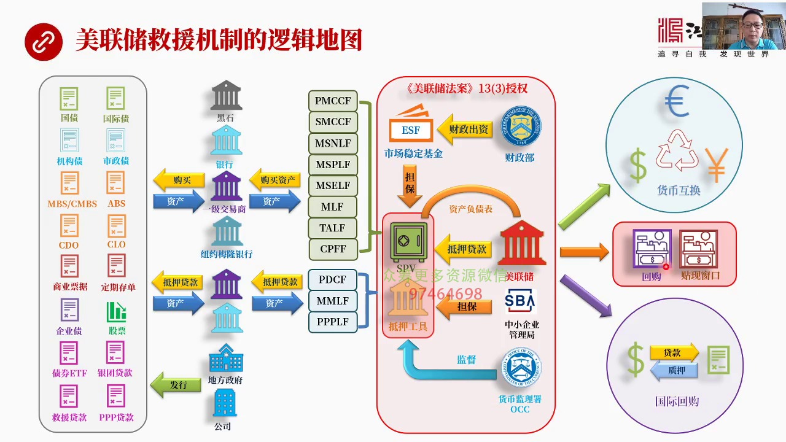

背後的美聯儲公布它的這個公布出來的執行的原因包括它的FAQ經常問答了問題還有它的救援條件貸款條件貸款人的條件等等進行了全面梳理一共十一項梳理完之後我發現它中間的內在邏輯機制它實際上是分創作這些模塊再跟我們前兩講講的經歷機爆發的時間順序和背後的原因相互進行印證然後再根據它的貸款的條件包括追鎖權等等我畫...

<strong>Cleaned narration</strong>

> 背後的美聯儲公布它的這個公布出來的執行的原因包括它的FAQ經常問答了問題還有它的救援條件貸款條件貸款人的條件等等進行了全面梳理一共十一項梳理
> 完之後我發現它中間的內在邏輯機制它實際上是分創作這些模塊再跟我們前兩講講的經歷機爆發的時間順序和背後的原因相互進行印證然後再根據它的貸款的條
> 件包括追鎖權等等我畫出了這張圖這張圖大概花了一個多月的時間因為要消化吸收要理解每個機制還有每個機制所有的時間和進入市場之間的對應關係包括它執
> 行的效果等等這需要大量的分析的這種大量的這種信息還有分析這些信息的腦力到目前為止我覺得這張圖在我看到了所有的國內國外的這個講究機制過程中沒有
> 這麼全面和直觀的這樣的一張圖沒有圖實際上這包就對於我們來說就形成了一個巨大的理解上的障礙在我看來你理解任何東西如果你能用圖畫出來那證明你真的
> 是搞明白了否則你這張圖是絕對畫出來的所以這張圖我稱之為是美聯儲救援機制邏輯地圖從這張圖上我們可以看到中間這塊是最核心的是美聯儲法案13條授權
> 之下的形成的一系列救援機制是一項同時還包括美聯儲的常規手法和這次採取了特殊的一些辦法比如說貨幣互換這是08年用過的國際回購這是新的包括對回購
> 市場通過回購市場駐資包括體驗窗口的開放2008年都用過這些東西這是常規手段那麼美聯儲法案授權的這一系列有些是08年用過的有些是新創的那麼所有
> 的這些救援機制這次的救援機制全部是源於美聯儲法案第13條它的授權我們以後會詳細分析這個授權是怎麼回事那麼從這個框圖中我們可以看到中心發力的是
> 美聯儲特別是美聯儲紐約銀行那麼美聯儲紐約銀行它對於整個金融市場怎麼進行救助呢它實際上是通過抵押貸款的形式它採取了兩個類型的機制一個是SPVS
> PV就是特殊的法律實體這個SPV是資產購買型的拯救也就是SPV拿到了財政部的錢之後可以到市場上去購買這些資產買完這些資產之後抵押給美聯儲獲得
> 新的錢再去買然後拿回來再抵押再獲得貸款再去買所以SPV這個機制是一個資產購買型拯救機制同時它還有另外一個類型抵押貸款工具抵押貸款工具它是一個
> 我美聯儲向這個工具進行貸款這是有抵押的同時抵押貸款工具並不是去購買資產而是讓這些資產留入進來之後作為抵押向它放貸所以這是美聯儲設計了兩個重要
> 的機制有本質的差別在SPV這個模式中間實際上美聯儲的資產出來表跟SPV是直接連在一起的在抵押貸款工具中間它實際上還是掛賬就是說某人借了美聯儲
> 的錢還沒有還那麼這兩種是不一樣的我們在看這兩種工具中上面部分我們看到財政部有財政部財政部其實要對SPV進行駐資它這個駐資是通過財政通過稅收的
> 錢拿出來駐資到市場穩定基金中市場穩定基金中播出一部分錢作為擔保作為一種子基金放在SPV中間如果說我們所說的這個購買資產這個行為囤積在SPV倉
> 庫裡面最後出現了委員和漫賬那麼首先規的是財政部的錢也就是規的納稅人的錢實在規的不行了這會是美聯儲的資產分別表受到損傷也就是美聯儲會出現虧損當
> 然美聯儲是絕對需要避免這一點的這有重大的政治風險那麼還有一種工具抵押貸款工具呢它實際上是一種另外一種就是由美國中小企業管理局還有其他政府機構
> 它來提供擔保比如說PPPLF就是這種情況那麼在這種情況之下也是政府的某個機構對於抵押貸款工具特別是針對它來進行的擔保所有跟它相關的貸款由政府
> 的中小企業管理局來付得擔保出現虧損它賠它賠是賠誰賠還是財政部賠財政部背後還是納稅人賠所以我們可以看到在這樣的一個機構機制之下納稅人首先要承擔
> ...

---

### Slide 5

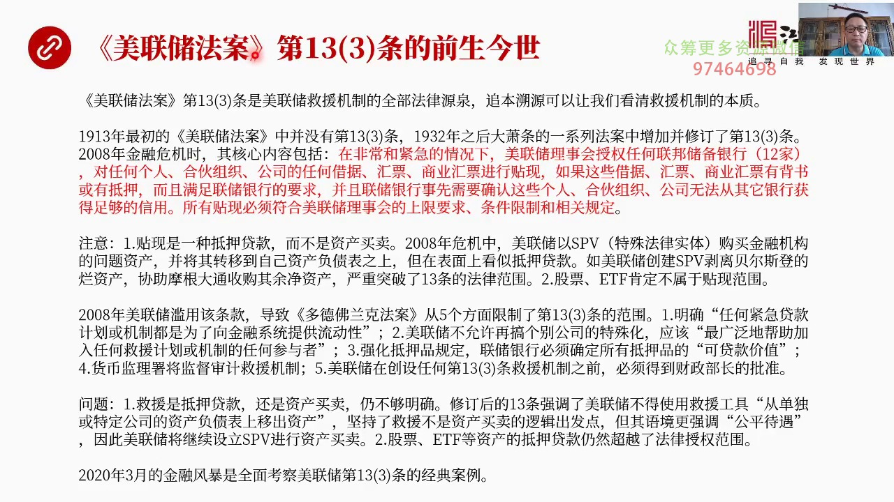

第三自然斷前他的前生金式美聯處法案這個在貨幣戰爭一中我專門講了這個法案形成了過程其實在美聯處原始法案中間也就是1913年最初通過美聯事法案中間並沒有第13條第3款或者叫第3段這樣一個條款沒有這個條款什麼時候加入的是1929年大小條之後特別是在1932年美國設立了一系列救援法案拯救經濟法案中間有好幾條...

<strong>Cleaned narration</strong>

> 第三自然斷前他的前生金式美聯處法案這個在貨幣戰爭一中我專門講了這個法案形成了過程其實在美聯處原始法案中間也就是1913年最初通過美聯事法案中
> 間並沒有第13條第3款或者叫第3段這樣一個條款沒有這個條款什麼時候加入的是1929年大小條之後特別是在1932年美國設立了一系列救援法案拯救
> 經濟法案中間有好幾條法案設計到了追加了第13條為了讓美聯處救助經濟追加了這個條款同時又被後續法案不斷修改最後形成了一個第13條第3段這樣一個
> 我們可以檢稱為美聯處13條的這樣一個法律授權這個授權一直到2008年經濟危機的時候仍然是當時的這個授權的內容它包括什麼方面呢如果我們仔細逐漲
> 逐漲的來理解這個法案的原文這個核心內容我基本上是根據它原文稍微做了一些經檢因為它原文有些地方實在太奧口它的核心內容包括在非常和緊急的情況之下
> 注意非常和緊急你看美聯處推出了很多救援機是說明中間首先上來就引用這條現在是非常而且緊急的情況原因就是這條沒有這個條款它就不能做這些事在非常和
> 緊急情況之下美聯處理事會就是華盛頓的那個華盛頓的委員會以報微爾為首的委員會授權任何聯邦處理銀行主要美國有12家有紐約的非常的上路易斯的等等那
> 麼這有12家聯處銀行再加上華盛頓的委員會共同構成了美聯處體系所以這句話說明是華盛頓這幫人開會可以授權12家美聯處銀行中的任何一家對任何個人合
> 夥組織還有公司的任何票劇就是借劇就是你只要借款比如說發行的債券就是一種借劇還有銀行的某種這個本票還有會票商業會票進行貼線只要是一種借劇型的東
> 西就是類似於債券型的東西就是我一定會在某個時間還你多少錢這種IO的形式進行貼線每一家聯邦處理銀行都可以對這一系列東西這些票劇把進行貼線如果這
> 些借劇會票商業會票有背書或有底這話什麼意思有背書就是有法律上的承擔責任的人比如說銀行程度也會票那如果會票出了問題有銀行負責來賠這叫有背書有底
> 就是如果這個票這個票劇背後是有實施在的東西作為底比如說我們所說資產底正確這個正確背後實際上是有房地產或者有陰收賬款的這種底所以必須得有底或者
> 叫有背書有人會對你這個票劇型負責除了問題我可以找到負責任只有這兩種情況美聯處才能夠對它進行貼線同時還要滿足美聯處的各項要求這個要求就包括美聯
> 處必須要事先確認這些個人和和組織公司無法從其他銀行獲得足夠信用就是它長適了所有的辦法之後都沒有辦法搞到貸款這個時候美聯處才能對它的票劇進行貼
> 線所有貼線必須符合美聯處理事會的上線要求不能超過一定的上線還有各種限制條件相關規定等等這就是我們看到美聯處13條給予剛才我所說11項救援機制
> 的全部法律授權的來源還有它的歷史在這中間我們需要注意兩點第一點貼線是一種抵押貸款而不是資產買賣什麼叫貼線就是你拿票劇到了銀行或者到了央行你把
> 票劇都制壓拿來的貸款你這個貸款是要還的所以貼線的本質是一種抵押貸款而不是資產買賣剛才我說的那個SPV在這個概念上它打了一個插邊球我一會兒會相
> 信講這個問題在2008年危機中美聯處以SPV特殊法律實體這個形式購買金融機構的問題資產並將這些金融資產就是有問題的資產轉移到了自己的資產負債
> 表上但是在表面上看似的抵押貸款我剛剛說了SPV它跟美聯處資產負債表是聯通的那麼它在法律條款上打了一個插邊球它實際的性質是購買但它表現出來了是
> 美聯處的銀行比如說紐約聯處的銀行向SPV進行貸款實際上SPV是在市場中真實購買但對於美聯處來說因為有了SPV作為防火牆它說我不是在市場上去買
> ...

---

### Slide 6

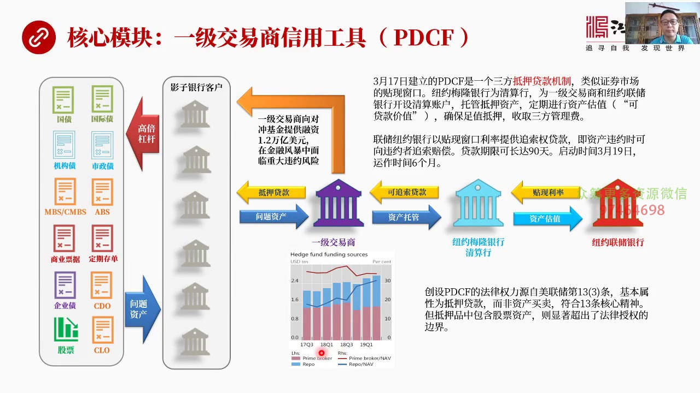

第一個核心模塊最主要當然是拯救一機交易商所以是一機交易商的信用工具這是PDCF一機交易商我們如果看這個框圖我們會看出一個基本規律就是一機交易商在創設一機之前大量了像它的影子央客戶注意它有很多影子央客戶包括對中基金各大對中基金都是一機交易商的重要客戶他們實不實地得到一機交易商去做生意在那開張戶包括融資...

<strong>Cleaned narration</strong>

> 第一個核心模塊最主要當然是拯救一機交易商所以是一機交易商的信用工具這是PDCF一機交易商我們如果看這個框圖我們會看出一個基本規律就是一機交易
> 商在創設一機之前大量了像它的影子央客戶注意它有很多影子央客戶包括對中基金各大對中基金都是一機交易商的重要客戶他們實不實地得到一機交易商去做生
> 意在那開張戶包括融資包括借錢所以一機交易商給對中基金高倍槓耳玩風險的這幫人提供了大量的銀行貸款或者叫這個融資規模BIS曾經做了一個孤算也就是
> 大約對中基金從一機交易商手中獲得了1.2萬億美元的融資錢誰出的他出的所以這些影子銀行獲得了這麼多錢之後在我們前兩講所講的高倍槓耳遊戲中間大量
> 持有國債大量持有各種風險資產然後再的回購上作抵押然後再在銀行再到利率調期或者其他眼睜市場中進行對衝然後再買國債再回購再製壓再回購再融資再買經
> 過幾十倍的這個輪迴之後大量持有這些資產高倍槓耳狀態之下了這些資產好現在新冠疫情爆發了石油危機爆發了這些資產它的波動性同時爆炸所以導致上價格暴
> 跌高倍槓耳稱不住了開始大量的甩賣這些資產都成了問題資產怎麼辦甩賣給誰這些資產要甩賣給一交一商而一交一商根本沒有足夠的錢來買下這麼多拋售的資產
> 怎麼辦它必須要向紐約聯儲銀行進行借貸所以我們來看到這個一交商這個PDCF它是一個它是一個抵押貸款型它還不是資產購買型也就是這些賣不動的上市流
> 動性的資產要抵押給一交一商來獲得貸款讓它們不至於破產這些問題資產又被拖關給了這個梅隆銀行最後從紐約聯儲銀行拿到了錢去挽救這幫哥們也就是對重基
> 金主要是對重基金陷入了嚴重的危機所以這套一交一商信用工具主要是為了拯救對重基金當然間接拯救對重基金直接拯救的是它因為如果對重基金全面垮台這些
> 一交一商所欠了1.2萬億也就收不回來了收不回來了他們將會全面破產它要全面破產了美國金融體系也就瓦解了所以當我們聽到什麼一交商信用工具的時候P
> DCF的時候我們腦子慢慢就想到這其實就是在拯救一交一商和它的客戶們它的具體機制3月17號建立的PDCF是一個三方抵押貸款機制紐約梅隆銀行是起
> 到中間清算行的作用某種意義上來說它類似政權政權市場中間的貼線窗口也就在政權市場中出現重大危機的時候是通過這個機制來貼線來拯救的那麼它的具體操
> 作方式紐約梅隆銀行的作用是什麼呢它是清算行它為一交一商和紐約聯統銀行各開一個帳戶紐約聯統銀行的帳戶是資金帳戶這邊的帳戶也有資金帳戶也有資產帳
> 戶那麼當這個一交一商把它它的客戶們的問題資產轉移到這的時候轉移到它的資產帳戶下之後梅隆銀行一查資產稻賬了然後梅隆銀行還要負責定價資產估值就是
> 剛才我說的多德芬蘭克哈法案規定的它進行資產估值到底能不能貸款可貸款多少然後向紐約聯儲銀行匯報紐約聯儲銀行聽到了資產已經稻賬了同時這個資產大概
> 值多少多少錢它就可以把錢剝到梅隆銀行梅隆銀行再把錢轉給一交一商一交一商再以這些錢到市場上進行跌倒在款把這些資產收過來然後放出去這些資產在不斷
> 地轉移到梅隆銀行的清算帳戶上那麼這個利率是多少利率是貼線利率也就是0.25非常非常低超低利息它是一種可追鎖貸款也就是說具有追鎖權這個追鎖權的
> 意思就是我剛剛所說的在罰案中間規定的你必須要有背書得有人負責如果一旦出現委約可追鎖貸款可以去每人處於紐約銀行可以去追查一交一商你給我的資產最
> 後委約了那你付什麼責一交一商你看也這麼回事那麼我再去追查前面的人誰把這個資產給我的我要追查你要追查不是說你抵押給我一百頁的資產就完事了我還要
> ...

---

### Slide 7

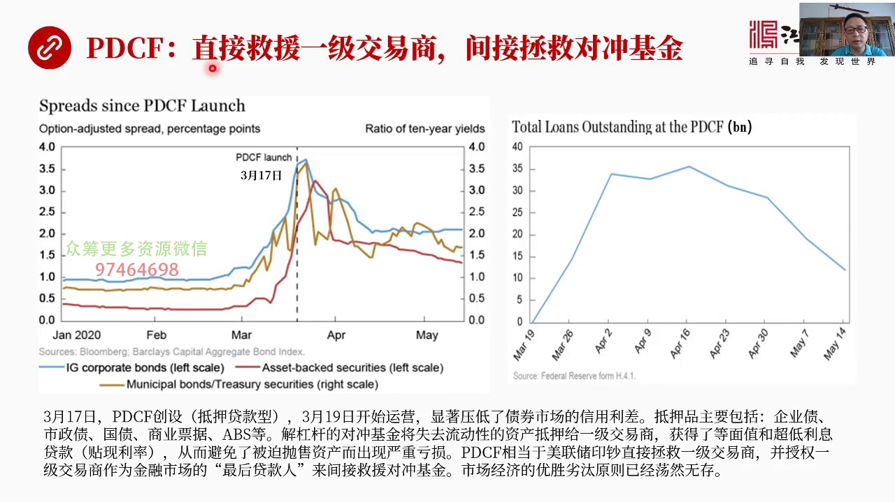

是為了拯救一交一商間接拯救的對重基金那麼它是19號開始創社19號開始正式運營開始購買我們可以看到19號這17號創社之後兩天19號以後那麼各種信用立插各種這個債券的信用立插比如說啟這個可投資企業債藍線在19號之後信用立插顯著下降也就是同期線的企業債和國債的收益率支插當然還有ABS資產底下證券化的這些證...

<strong>Cleaned narration</strong>

> 是為了拯救一交一商間接拯救的對重基金那麼它是19號開始創社19號開始正式運營開始購買我們可以看到19號這17號創社之後兩天19號以後那麼各種
> 信用立插各種這個債券的信用立插比如說啟這個可投資企業債藍線在19號之後信用立插顯著下降也就是同期線的企業債和國債的收益率支插當然還有ABS資
> 產底下證券化的這些證券產品它的這個信用立插顯著下降還有市政債它的信用立插顯著下降這都可以說明這個連儲銀行就是紐約連儲銀行開始購買開始進行這個
> 底下借貸上一交商提供底下借貸工具之後一交一商把對重基金的資產大量接收過來之後這是它購買資金的曲線我們可以看到3月19號開始運營之後它的投放量
> 越來越大也就是一交商獲得的錢越來越多在市場中把自己各種地球的人資產收了很多就是拿來做底下你們缺錢借槓杆你們不要在市場上賣你把這些資產給我我全
> 額幫你們做製壓然後拿出來貸款是0.25我只收一點手續費剩下你們就可以緩解重大的資產拋售的這種壓力所以我們可以看到傑槓杆的對重基金他們把上市流
> 動性的這些資產抵押給了一交一商獲得了等面之和超低利息的貸款貼線利率從而避免了被迫拋售而出現嚴重虧損這就是一交一商在拯救對重基金所以PDCF相
> 當於美聯儲應超直接拯救一交一商授權一交一商作為金融市場了最後貸款人來間接拯救對重基金這還有市場優勝列態的法則嗎市場經濟是什麼優勝列態你能幹你
> 有本事你多少錢沒問題你能幹你甘願貿高高風險出了虧損你應該你應該破產而被淘汰這叫自然的競爭的原理也是市場經濟優勝列態的基本原則現在還有嗎我認為
> 是當然無存了如果說50倍100倍的高位槓槓的對重基金也要拯救那你還有什麼紀律可言賺錢是他的賠了是納稅人都著其實從這個機制來看我覺得美國金融機
> 制金融體系從根的上已經開始出現08年之後出現了嚴重的腐化到現在我覺得已經腐化了不可就要沒有任何法能改得了沒有任何人能制約甚至公開的允許這種行
> 為大章起果的進行所以這都說明這是制度型的腐敗已經到了很難以挽救的程度另外我們來看這張圖是指了這個一交一商拯救工具它的資金投入規模我們看到似乎
> 這三乎百億350億左右的資金量不是太大注意這是這是餘額在這中間過程中發生了無數比交易而我們看不見因為它不會公布交易細節就像我們看到08年美聯
> 儲公布的說我的餘額最高餘額也就是猜一兩萬億但實際上它累計發生了貸款高達27萬億就是一個原理因為對於對於最終基金的拯救對於這種拯救往往是我給你
> 一筆貸款讓你不拋售保持幾天資產價格一回升就沒事了它不需要這麼大的貸款額但它周轉這個周轉量很驚人所以從這張頭上我們其實並不能準確的看到它的機制
> 運作一些細節問題但是我們可以看到危險持續的時間從就是從3月19號不斷地爬升一直到3月底從3月底一直持續到4月中才開始下降所以在這個時間段裡面
> 對於從基金還在增長還在經大量的這個資產的轉移這就是為什麼我們說每次救援行動之後它必須要有一個時間周期這個時間周期是用於填補它的資產負債表上的
> 黑洞只有把黑洞填補完之後這個資金才會向海外蔓延才會出現我們所說的美元環境反轉這個問題它需要一定的周期來消化這個周期是不是這麼長呢當然這個是屬
> 於對從基金的一個周期還有其他所有其他金融機構它也有一定的就是受到重創金融機構也有自己的這個相應的周期所以我認為現在基本上仍然處在填補黑洞這個階段再看第二第二和第三個合型模塊商業票據和貨幣基金救援工具

---

### Slide 8

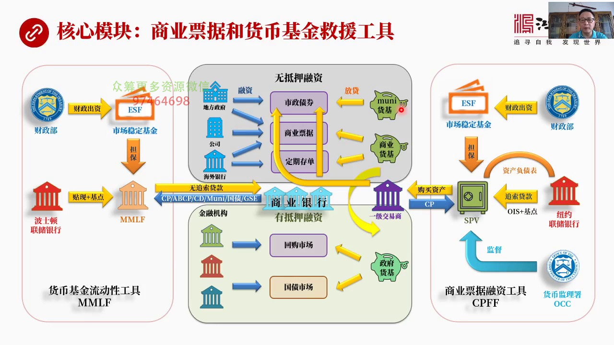

兩個一個是CPF商業票據另外一個時候貨幣基金流動性工具MMMMRF這兩個工具實際上是個聯體型而我稱為是聯體型而因為這兩個工具必須要聯合應用共同拯救主要省救商業票據市場定基存單市場也包括市政市場主要整個整個這個無底市場這都是屬於這個貨幣市場中的核心部分我們來看它的原理它的原理比如說商業票據市場它的融資...

<strong>Cleaned narration</strong>

> 兩個一個是CPF商業票據另外一個時候貨幣基金流動性工具MMMMRF這兩個工具實際上是個聯體型而我稱為是聯體型而因為這兩個工具必須要聯合應用共
> 同拯救主要省救商業票據市場定基存單市場也包括市政市場主要整個整個這個無底市場這都是屬於這個貨幣市場中的核心部分我們來看它的原理它的原理比如說
> 商業票據市場它的融資工具從這場通常我們可以看到同樣的規律財政部出錢給市場穩定基金然後穩定基金出種子錢已經放到SPV裡面用於購買資產凡是SPV
> 都是購買資產的凡是這種LF結尾的貸款工具的它都是抵押貸款型的這兩種是不一樣的那麼SPV這個成立之後我們看到OCC對它進行監管然後兩者的資產是
> 在表示連通的紐約聯種銀行對它進行了這種SPV還是一種追索型的貸款它的定價是OS加積點OS我們以前專門上一課專門講過好多好多這種利率中間的一種
> 其實就是市場吊七市場中對美聯儲未來的聯盟基金利率的一個預測我們可以把它簡單理解成它就是聯盟基金利率加上一定的積點服務費那麼這個SPV用了用於
> 什麼呢用於專門購買而且它只能從EG交易商庫存中進行購買購買什麼上一票據把上一票據轉移給它放它這那麼我們上次講到這張圖上一課講這張圖書講這張圖
> 書說了一個重要的當時出現情況3月12號金融這個合爆爆炸之後貨幣市場基金特別是商業商業型的貨幣市場基金還有市政型的貨幣市場基金他們的資金被大量
> 的熟悔然後轉移到了留點市場就是政府貨幣市場基金往這轉移從這個市場往這個市場基金轉移但是EG交易商卡住了所有這些轉移怎麼轉移賣掉資產賣給誰啊只
> 能賣給他因為他是交易商他是做市商所以他不願意接受導致這些錢出不來有無法進行順利轉移這就導致了這個市場出現了凍結這些資產被大量甩賣商業票據市政
> 債定期存在被大量甩賣無人接單這個市場被凍結住了然後就影響到外匯市場引爆了全球的美元荒是這樣的一個邏輯所以拯救商業票據市場定期市場實際上也是為
> 了拯救海外美元市場怎麼拯救呢這個融資工具主要出發點就是由他SPV向移交一商購買他的庫存購買他的庫存之後等於向他提供資金然後讓他再去買這些他們
> 的拋售了這種資產然後打通這個環節讓這個資金能夠順利流動所以這是從一個方向來解決另外還有這是從某一方向就是解決他們的庫存問題但是還有一個更多的
> 方向是要通過移交一商去直接購買發行者的商業票據我們上一課專門講過地方政府可以發行商業票據公司也可以發行銀行、
> 海外銀行也可以發行商業票據他們發行如果融入這個市場這個市場就會變得更困難洪水融進水庫了水膽更大了那就更麻煩所以他還有重要的只能是直接到他們發
> 行方直接購買你不用到市場上賣你直接賣給我賣給移交一商我轉手就賣給SPVSPV其實就是紐約聯儲銀行所以他的一個重要作用其實就是到前邊來直接從他
> 這買從購買從這發行端來購買簡清這幾個市場的上游水為壓力然後再把這些票據抵押給SPV獲得錢再幹這個事他怎麼幹得好處是什麼我購買定價市場我在我手
> 中我們從你這買是有折扣的我賣給他我是全額買賣所以我這中間會有一個無風險的套利的空間我知道我最大買家是美聯儲所以我擔放心大膽從你們手中買買了之
> 後我一轉手賣給他我中間不就賺錢了嗎所以這個是人家設計出來的利益輸送就是讓他中間賺錢除了這個之外還有貨幣基金流動信工具什麼呢是這樣的一套就是博
> 士頓聯儲銀行負責發起那麼財政部我已經市場穩定金來對他進行駐資他這邊是天堂口加上一定的積點然後他的主要作用我們可以看到他提供是無追所帶款就是我
> ...

---

### Slide 9

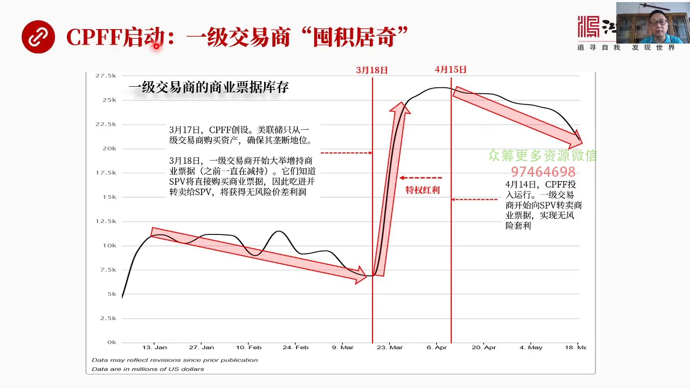

這個救援工具之後一交一商開始臀級居其我們來看這個實驗表可以看得非常清楚3月17號這張圖這個圖是一交一商的商業票局庫存這個是財政部的數據從這個數據中我們可以看到他們一交商的商業票局庫存出現了一個這樣的規律暴漲38號之後暴漲為什麼因為3月17號成立了商業票局的這種機制美聯儲保證只從一一交一商庫存中就購買...

<strong>Cleaned narration</strong>

> 這個救援工具之後一交一商開始臀級居其我們來看這個實驗表可以看得非常清楚3月17號這張圖這個圖是一交一商的商業票局庫存這個是財政部的數據從這個
> 數據中我們可以看到他們一交商的商業票局庫存出現了一個這樣的規律暴漲38號之後暴漲為什麼因為3月17號成立了商業票局的這種機制美聯儲保證只從一
> 一交一商庫存中就購買資產確保了他的壟斷地位也就是一交一商持有大量的商業票局的資產美聯儲只從他的庫存中買而不到市場中去買當然他就成了獨家壟斷所
> 以3月18號到了3月18號之後一交一商開始大舉的在市場中就從發言商那去直接購買前端直接購買商業票局注意在那之前他一直在檢測的從1月初一直到3
> 月份他一直在檢測也就是他本來應該起到吞吐商業票局搞活市場的功能但是他執行的正好相反所以我們看到3月18號之後他一看美聯儲要買人在他背後撐著他
> 有多少貨美聯儲的通知他才開始大舉購買的他買了所有的這些票局最後全部要轉賣給SPU中間獲得無風險差價這個無分也差價這個利潤就是他白癡了所以我們
> 看到他為什麼要這麼幹其實是獲得一種特權紅利4月15號之後這套機制開始正式的運作正式運作之後我們看到4月14號的時候這個這個這個依教商在CPF
> F開始正式運作之後依教上了庫存開始下降為什麼下降他開始出貨了像美聯儲轉價就是拋售中間實現套利就在這個過程中現在正在持續進行所以這套遊戲規則你
> 看到這張圖理解了那個邏輯框架之後立刻就明白了原來遊戲是這麼玩的我們再看另外一張另外一張圖另外一張圖

---

### Slide 10

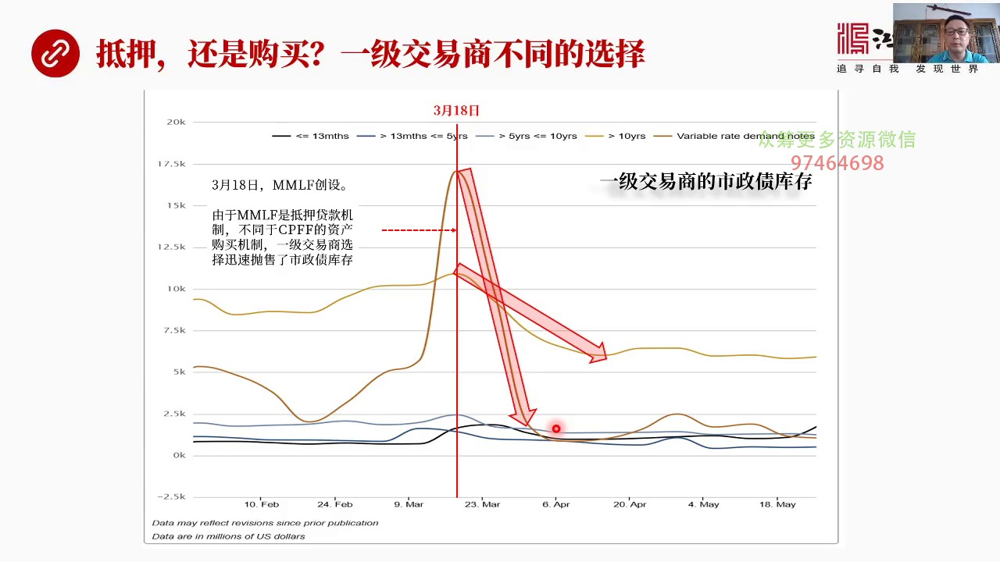

是依教一商在同樣情況之下在底壓貸款還是資產購買這兩種不同的拯救模式它是怎麼選擇的我們先看這張圖依教一商的市正市正債的庫存這也是財政部的數據從這張圖上我們可以看到這個依教一商對於商業票據和市正債的太多是完全不一樣的38號我們知道這個貨幣市長基金的拯救的這個機制創設但是這個機制它不是資產購買型它是底壓貸...

<strong>Cleaned narration</strong>

> 是依教一商在同樣情況之下在底壓貸款還是資產購買這兩種不同的拯救模式它是怎麼選擇的我們先看這張圖依教一商的市正市正債的庫存這也是財政部的數據從
> 這張圖上我們可以看到這個依教一商對於商業票據和市正債的太多是完全不一樣的38號我們知道這個貨幣市長基金的拯救的這個機制創設但是這個機制它不是
> 資產購買型它是底壓貸款型所以還是有一定風險那麼依教一商的選擇就是在這種情況之下我就不願意再持有市正債了我把它全部賣光我們看到它的不同期間上都
> 體驗說大幅建築這樣的一個特徵為什麼商業票據它趕持有為什麼背後有SPV大晚家在那但是這個市正債只是底壓貸款我以後還要還還是要持有還是要有一定風
> 險所以我乾脆不要或者盡可能的持有少的持有這就是依教一商的邏輯注意啊它本來應該是動停糊它承擔就是做事商的責任雖然它要雖然我們說它獲得了一定特權
> 它這個特權應該對應的它特殊的責任也就是在市場出現重大危機的時候你得刀著你得承擔虧損它現在只要優惠只要好處絕對不要壞處這就說我說這個機制開始墮
> 落還是腐化的一個重要的說明其實美國的這套機制歐洲這套機制都是屬於特權型的跟它的封建社會跟它的封建靈主制其實非常非常類似封建靈主我給你特權你可
> 以管想你的人民但是你也要負責你也要承受承擔它管理當地的責任和所有的費用責權利益一定要對等現在的這種我承之為是現代金融的貴族制它們是只要貴族的
> 特權但根本不承擔貴族應該承擔的責任比如說以前的貴族要發生戰爭它上戰場打仗必須要打仗這是它的天生的職責現在呢這些人只享受貴族的好處而根本出現問
> 題的時候根本不充在第一線這就是我們所說的看一個大國新衰它優勝轉衰那個轉折點在這個轉折點上你會看到諸多的這種細節比如說在歷史上我們看到了貴族的
> 這種墮落你會看到整個這個王國這個王朝可能會走下坡路那麼我們在金融上讓看到EG交易商這種金融貴族的墮落基本上可以認為我們可以從這線上可以看到法
> 律之約不了它們那麼再往下走這套制度一定是加速伏劃所以這就是我們看到美國新衰中間的一個重要的典型的細節的特征就是華爾街的墮落華爾街的金融特權和
> 金融貴族的這種墮落只要好處不要任何懷處所以這就是我們看到的建為之助講了就是這個道理我們再看CFFCPSFCPSF就是說我

---

### Slide 11

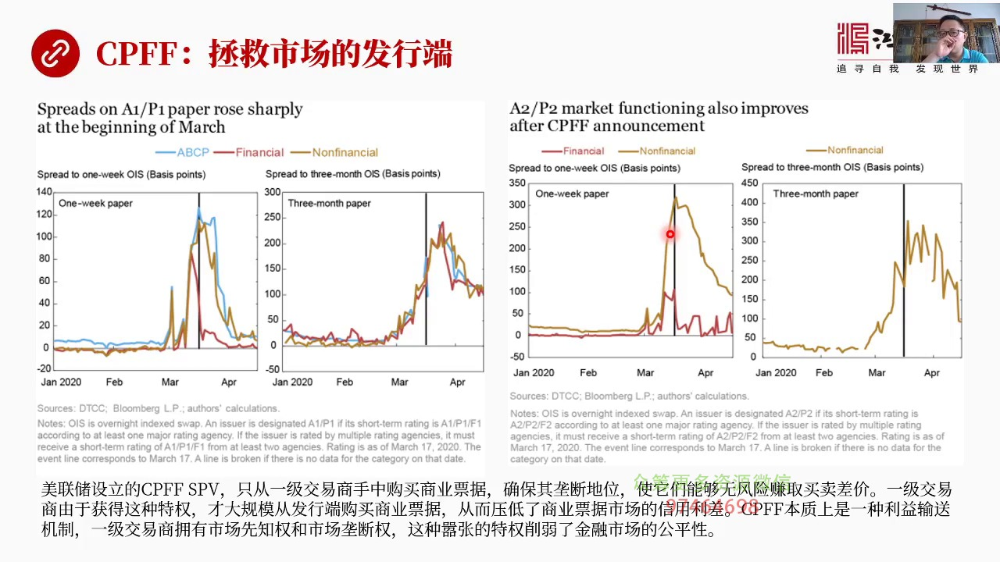

說的商業票據它主要是拯救市場的發行端我們剛才看到那個礦頭中間EG交易商到市政到公司到前端去購買你們發行商業票據就直接賣給我便宜點賣給我我最後轉賣給SPV這樣一來的話就使得商業票據商業票據上的利率顯著的下降所以我們看這個邏輯美聯手設立的CPSF只從EG交易商手中購買商業票據保護了它的壟斷地位是EG交易...

<strong>Cleaned narration</strong>

> 說的商業票據它主要是拯救市場的發行端我們剛才看到那個礦頭中間EG交易商到市政到公司到前端去購買你們發行商業票據就直接賣給我便宜點賣給我我最後
> 轉賣給SPV這樣一來的話就使得商業票據商業票據上的利率顯著的下降所以我們看這個邏輯美聯手設立的CPSF只從EG交易商手中購買商業票據保護了它
> 的壟斷地位是EG交易商能夠無風險的賺據買賣差價所以EG交易商由於有了這種特權才會大規模從發行端購買商業票據就是我們剛看到了那一張非常抖的一個
> 區限增長它要開始大量購買商業票據就會壓低商業票據上的信用立場我們看到這幾張信用立場出APE就是最好等級的商業這個商業公司發行的商業票據在這個
> 18號之後開始顯著下滑這是有抵押的藍線這是金融公司發行的這是非金融公司發行的所有的這種區限都在下降還有呢這個這個是他們跟一個星期的OIS的這
> 種立場這是跟三個月OIS的立場也就是三個月的美元基準利率的預期你會看到大幅下降說明什麼說明利率開始走低說明市場的緊張程序開始下降ARP是第二
> 等級的比較差一些的公司也同樣存在這個規律那麼CPSF它本身讓是一種利益輸送的機制在我看來就是美聯儲紐約銀行把利益輸送給了一級交易商讓它去辦事
> 一級交易商擁有市場先支權和市場壟斷權還擁有市場的所謂的強賣權因為它在一級上上去直接購買發行方的產品轉手賣給SPV中間沒人跟它競爭所以這種銷賬
> 的特權其實缺乱整個金融市場的公平性這哪裡還有任何公平性可言毫無公平性我們再看這個貨幣上級金的救援機制剛才那個是

---

### Slide 12

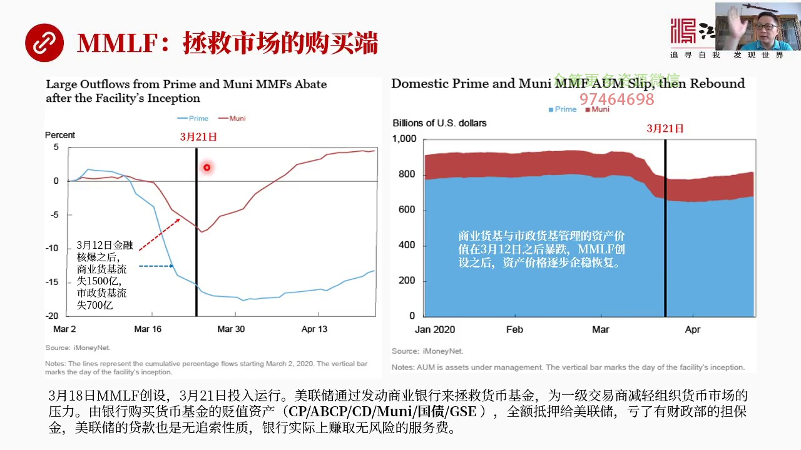

從發行端去購買這個是為了拯救市場的消費端也就是誰買這些資產主要是為了拯救後段一個是拯救全顿一個拯救後段我們可以看到在3月12號金融合爆爆炸以後我們看到這個商業貨幣基金的流失規模非常大所以我們看到紅線是商業型的這個藍線是商業型的這種貨幣基金然後這邊是施政型的貨幣基金兩者相加大概有2000多億美元的資金...

<strong>Cleaned narration</strong>

> 從發行端去購買這個是為了拯救市場的消費端也就是誰買這些資產主要是為了拯救後段一個是拯救全顿一個拯救後段我們可以看到在3月12號金融合爆爆炸以
> 後我們看到這個商業貨幣基金的流失規模非常大所以我們看到紅線是商業型的這個藍線是商業型的這種貨幣基金然後這邊是施政型的貨幣基金兩者相加大概有2
> 000多億美元的資金大規模被10回準備跑到另外一個上場去做回購去做這個國債這種無風險的交易但是出頭的資金導致了它的重大的市場凍結好那麼在3月
> 18號創社市場這個創社貨幣上基金之後3月21號投入運行美聯儲是通過發動商業銀行來拯救貨幣市場基金主要是買他們的庫存唯一要一商減輕組織貨幣市場
> 的壓力本來這個活應該是一交一商的活但是現在一交上自己承受不了了那就只能發動商業銀行你們來幫助貨幣基金賣掉就是清理他的庫存把這些跳到大甩賣的東
> 西刷給你們你們來負責成績然後又商業銀行負責去接收它的貶值資產包括這些然後全額抵押給美聯儲不是這個銀行然後如果虧了這財政部的擔保虧它的虧納稅人
> 美聯儲的貸款它也是無追所的貸款虧了就虧了然後也不追查它的上游那麼銀行在這個中間實際上鑽取的是無風險的服務費頒獄把貨幣市場基金它的倉庫中間的這
> 些貶值的資產或者失去流動性的資產頒獄給這個聯儲銀行頒獄到它那個抵押機制裡面然後它獲取的是無風險的服務費這就是我們看到銀行體系賺銀行體系錢一交
> 一商賺買賣差價各賺各的錢當然由於這個機制啟動之後我們看到在3月21號之後它啟動之後商業型貨幣基金和市政型貨幣基金管理的資產它的AOM在3月1
> 2號以後本來是出現爆跌在21號之後開始逐漸的奇穩開始穩定下來通過這個方式使得商業票劇市場貨幣市場都出現了穩定的局面我們再看下一所以商業票劇

---

### Slide 13

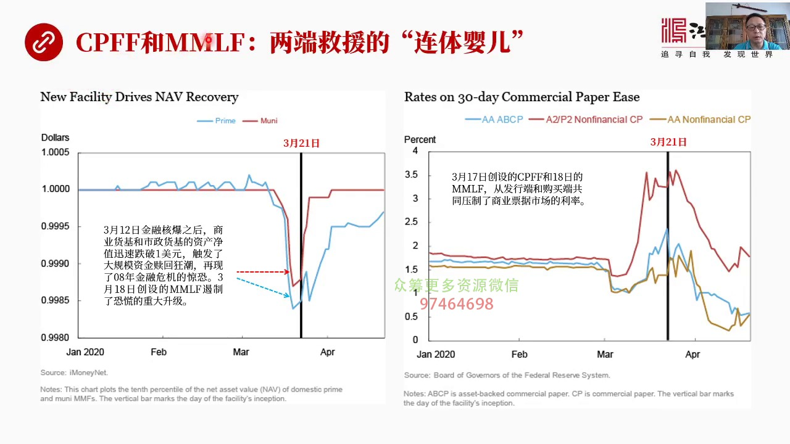

和貨幣市場整就機制這兩個東西實際上是從兩端整就它相當於一個聯體銀而這個聯體銀而的話我們可以看到在啟動的前後對兩個市場都有重大影響比如說在金融合爆之後我們看到貨幣市場基金不管是商業型的還是市政型的都跌破了億美元的面職跌破了億美元的禁止這基本上是2008年9月15號一半兄弟公司破產之後出現了一種嚴重局面...

<strong>Cleaned narration</strong>

> 和貨幣市場整就機制這兩個東西實際上是從兩端整就它相當於一個聯體銀而這個聯體銀而的話我們可以看到在啟動的前後對兩個市場都有重大影響比如說在金融
> 合爆之後我們看到貨幣市場基金不管是商業型的還是市政型的都跌破了億美元的面職跌破了億美元的禁止這基本上是2008年9月15號一半兄弟公司破產之
> 後出現了一種嚴重局面一旦出現這個局面老百姓可是把貨幣市場基金當成是銀行儲蓄儲蓄帳戶你的這個禁止如果跌破1的話那就說明連儲蓄帳戶都不穩定這會打
> 著嚴重的銀行幾對金融體系的大幾對所以這個過程不加以制止將會又發銀行體系的重大危機就是幾對會發生那麼3月21號建立這套機制之後這個資產面職也就
> 是它的資產禁止開始反彈挽救了整個金融市場這是從貨幣市場基金這個面職來看那麼從商業票據市場的利率來看也一樣啟動之後本來商業票據不管你是這個雙A
> 型的由抵押的這種商業票據還是刺激的這種商業票據它的利率都在向高都在向高迅速盤升但是3月21號之後這三個利率都在下降說明兩端救援的聯體銀而發揮
> 了相應的作用還有除此之外除了對美國金融市場發揮作用之外它更重要的

---

### Slide 14

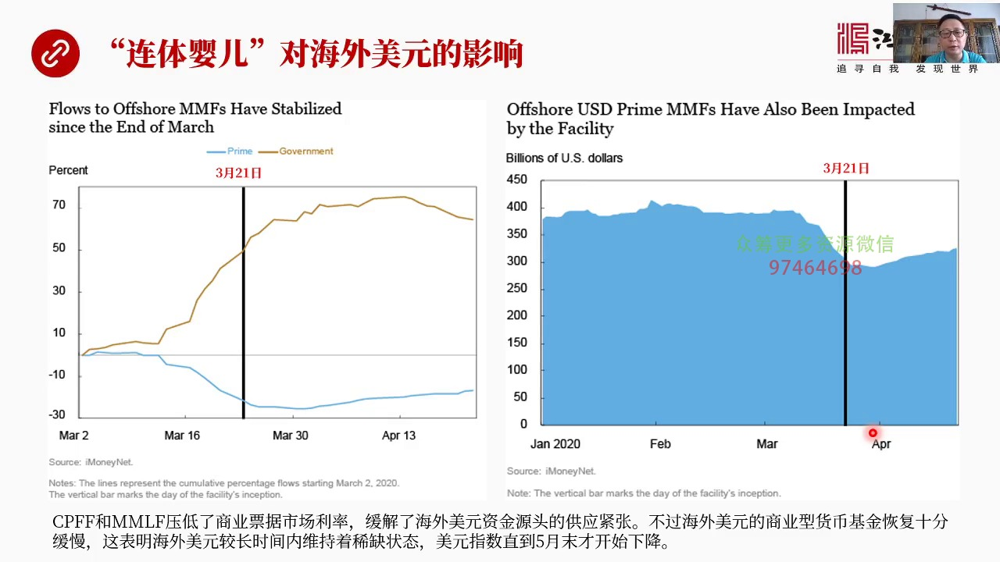

還對海外美元市場產生的重要影響因為海外美元市場它也有一個商業型的貨幣市場基金還有政府型的貨幣市場基金兩者跟美國國內類似我們可以看到從3月21號以後你會看到這個商業型的貨幣市場基金的流失資金流失的規模開始逐漸的減緩慢慢地爬升然後貨幣這個政府型的貨幣基金它的頂峰之後開始逐漸下降這說明是什麼問題呢為什麼我...

<strong>Cleaned narration</strong>

> 還對海外美元市場產生的重要影響因為海外美元市場它也有一個商業型的貨幣市場基金還有政府型的貨幣市場基金兩者跟美國國內類似我們可以看到從3月21
> 號以後你會看到這個商業型的貨幣市場基金的流失資金流失的規模開始逐漸的減緩慢慢地爬升然後貨幣這個政府型的貨幣基金它的頂峰之後開始逐漸下降這說明
> 是什麼問題呢為什麼我們說美元的指數會比較高一直到3月4月一直到5月下旬才降下來主要是海外美元的它所擁有了這種商業型的貨幣基金沒有恢復恢復得比
> 較慢這是判斷美元指數了一個重要的前期指標除了這個指外我們可以看到海外美元的這種貨幣這樣基金它也同樣受到了這個3月21號這個機制的影響觸底開始
> 反彈所以這兩個機制這個聯體因而這個機制對海外美元市場發揮了重大意發揮了重大作用這兩個工具同時壓低了商業票局市場的利率緩解了海外美元資金源頭的
> 供應緊張當然這個海外美元的商業型貨幣基金的恢復速度比較慢這表明海外美元較長時間之內仍然保持著稀缺狀態美元指數為什麼會持續到5月份才下降這個原
> 因包括它的恢復慢還有它的商業型貨幣基金恢復得太慢這是一個重要的因素這就是當我們一旦把金融市場的底層底層鏈條邏輯結果分析清楚之後你分析美元指數
> 分析外灰市場就不會再看那些後知後覺的指數因為那些東西都是以後表現出來的相當於我們開車看後知敬意沒有其實你要追蹤是先導指數或者是導致這個問題發
> 生的原因這個原因體現出來的那些指標才是你真正需要關注的指標領先指標好我們再看如果我們來看一交一商他們的

---

### Slide 15

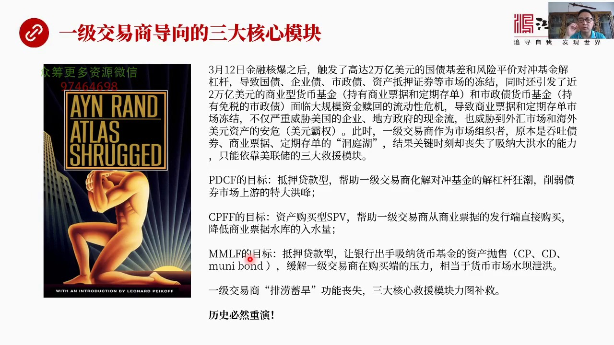

以他們為導向了三大核心模塊應該怎麼來看三大核心模塊是拯救一交一商的拯救商業票據的拯救貨幣市場基金的我稱之為這三個工具是真正的核心工具如果來點評一下我們可以看到3月12號金融合爆之後然後2萬億的美元的這個國債機差和風險評價對中基金開始解鋼管導致了國債、企業債、市政債資產抵押政券等等這些市場的全面凍結同...

<strong>Cleaned narration</strong>

> 以他們為導向了三大核心模塊應該怎麼來看三大核心模塊是拯救一交一商的拯救商業票據的拯救貨幣市場基金的我稱之為這三個工具是真正的核心工具如果來點
> 評一下我們可以看到3月12號金融合爆之後然後2萬億的美元的這個國債機差和風險評價對中基金開始解鋼管導致了國債、
> 企業債、市政債資產抵押政券等等這些市場的全面凍結同時還引發了近2萬億美元的商業型貨幣基金這些基金主要持有商業票據和定期存單還有市政貨幣基金主
> 要持有免稅的市場帶同時面臨大規模的資金熟悔的流動性危機這就導致了商業票據市場和定期存單市場嚴重凍結不僅威脅到美國企業和地方政府的現金流也威脅
> 到外匯市場和海外美元的安威重要這就涉及到美元霸權了為什麼美聯儲會優先動用向後必忽患這樣的工具如果說海外美元只有大量美元資產的這些公司全部倒閉
> 了現金流中斷倒閉或者背破全球拋出美元資產這將嚴重威脅美元霸權如果最後結果是球美元資產的這些公司倒閉待近那麼以後就不會再有人願意去持有任何美元
> 資產那美元在世界上的需求量將會極速的下降沒人再用美元了買石油用了幾個美元無所謂主要大量水用美元的是持有美元資產所以威脅美元海外美元資產的重大
> 了危機都是對美元霸權的直接挑戰直接危險它一定會拯救但是在這麼嚴重情況之下一交一商它作為洞廷糊吞吐市場大規模市場資產這個洞廷糊的作用基本上是它
> 洞廷糊早就已經被預計被這個填糊造填已經已經挖掘得差不多了所以這個洞廷糊的吞吐能力下降這導致只有一靠美聯儲的三大救援模塊才能夠弥補它的功能的上
> 市如果我們具體來看拯救一交一商它的目標是什麼抵押行它是抵押行的貸款幫助一交一商化解對衝基金的解幹感狂潮它是整個對衝基金解幹感的削弱債券市場上
> 有了特大轟封如果你不幫助一交一商來化解對衝基金這個解幹感的狂潮的話那幾萬億的洪水將會湧向整個市場那不得了然後商業票據市場它這個工具的目標是什
> 麼主要是它是主要的類型是資產購買型幫助一交一商從商業票據市場的發信端直接購買也就是降低商業票據水庫的入水量那麼貨幣市場基金呢它是一種抵押行貸
> 款型抵押貸款型讓銀行出手新納貨幣基金的資產拋售不管你貨幣基金吃有什麼樣的資產CP、
> CD還是市正在銀行出手來接環節一一一商它作為整個貨幣上總的水壩環節它的壓力相當於貨幣上進行水壩洩洪通過銀行的這個洩洪區進行水壩洩洪所以我們來
> 看一交一商排汗排落續汗的功能上施就是動停活的功能上施使得三大核心救援這個模塊得以建立它的主要目標是為了填補它的功能上施著動停活的這種作用在我
> 看來這種歷史必然重演下次出現危機一定會出院在上述這些領域中間尤其是以一交一商作為中心暴點的這個問題會再次出現會反覆出現因為這個制度本身就是這
> 麼設計的只要出危機都跟一交一商有關都跟一交一商貸款的或者提供融資的這些高風險客戶有關抓住這點找到下次危機的圓暴點我們再看下一頁除此之外除了這個一交一商還有拯救貨幣市場

---

### Slide 16

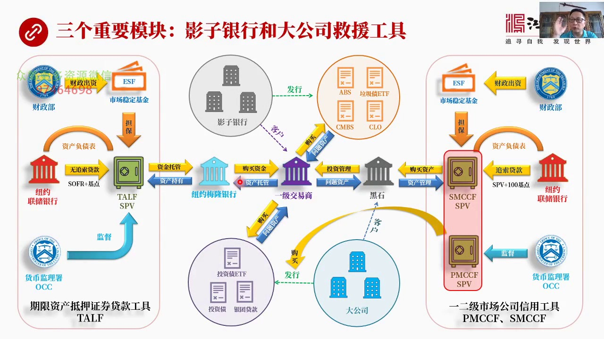

這三個核心工具之外還有三個重要的模塊這些就是剛才我所說是核心模塊這些這三個模塊是重要模塊是屬於比核心模塊刺激的主要是拯救什麼呢拯救影子銀行和大公司那麼我們來看這個圖大家如果看多了越看越習慣就好了它一個是什麼呢就是一個是TuffTuff主要是拯救資產抵押政權它的工具在我看來這是清理垃圾的工具我們可以把...

<strong>Cleaned narration</strong>

> 這三個核心工具之外還有三個重要的模塊這些就是剛才我所說是核心模塊這些這三個模塊是重要模塊是屬於比核心模塊刺激的主要是拯救什麼呢拯救影子銀行和
> 大公司那麼我們來看這個圖大家如果看多了越看越習慣就好了它一個是什麼呢就是一個是TuffTuff主要是拯救資產抵押政權它的工具在我看來這是清理
> 垃圾的工具我們可以把它想像成垃圾廠垃圾處理廠還有一二級市場公司信用工具PMCCF和SMCCF一級市場二級市場公司大公司的信用證究拯救工具這塊
> 是面向大公司的這塊是面向影子銀行的我們來看它是怎麼來操作先看影子銀行這塊我們來看發起人是紐約聯儲銀行那麼它通過無追蹤貸款向SPV進行抵押借貸
> 成本就是我們說的回購利率加上若干基點財政部來擔保承擔最初的損失貨幣監理局OCC來負責監管這個機制SPV面向誰面向一交一商主義紐約聯儲銀行仍然
> 是三方監管中間三方貸款中間的一個資產偷管房或者叫為兩邊開設清算帳戶這麼一個中間人也就是說兩邊依交一商和紐約聯儲銀行都在這開設了自己的帳戶然後
> 美容銀行對這些資產經評估之後爆價然後告訴他資產已經到帳了然後這邊把錢轉過來他再把錢轉給依交一商進行資產購買注意這是資產購買性所有SPV都是資
> 產購買性依交一商拿著這些錢買什麼主要買的是影子銀行的眼神產品比如說這個資產底下正確比如說垃圾站的壹貼FCNBSCAAO剛好帶款的眼神產品它主
> 要是買這些資產這些資產是哪裡出來的當然是影子銀行發行出來的影子銀行就是我們在三界客裡面第一界客所講到的包括對重基金包括投資銀行包括商業發展銀
> 行商業發展公司等等他們經過政權化處理之後把很多有毒的資產變成了眼神產品然後這些眼神產品出了問題之後被賣給了依交一商他買走了買走之後轉給了垃圾
> 處理廠這個垃圾處理廠是從紐約聯償銀行拿到錢是由財政部來擔保如果出現損失先虧納稅人的錢這就是整個這套遊戲那麼影子銀行這些人都是依交一商的客戶還
> 有各種各樣的投資銀行還有商業發展公司都是他的客戶他幫他的客戶處理他們的資產其實也是一種利益輸送幫助這些人解決他的危機然後這邊這一次是拯救大公
> 司的工具拯救大公司的信用工具我們看他是怎麼工作的他分成兩部分這個是拯救依交一商拯救依計市場的也就是在發行端一發行債券我就去買這個是二級市場二
> 級市場就說他在市場上流通的債券我都可以去買那麼他也是紐約聯償銀行發起這是提供了追鎖貸款主要是加100幾點他的成本監督是OCCE財政部出錢然後
> 擔保承擔規則自然分別表聯的一起我們來看首先來看一級市場購買他怎麼購買一二級市場其實都一樣都是要通過黑石黑石作為一個資產管理方他可以評估我要買
> 什麼資產那麼他這個評估其實某種意義上具有決定性因為他在管理這個錢該怎麼用所以他會優先挑選自己自己的客戶和自己開的各種一貼縫這個基金好那麼這兩
> 個機制都是聽他的話那麼聽他的話如果說他說我要在這個對我那些客戶對我那些關稀戶們進行照顧我會怎麼怎麼來做呢我會讓這個機制在這些公司發行債券的發
> 行的時刻在那購買就是發行的時候我用一個很優惠的價格賺到錢就是我用一個低價買然後我高價賣給SPV那麼在這個過程中中間賺取了利潤貴黑石當然也包括
> 依交商依交商也跟這個事兒官因為很多他是成交商是專門發行債券的所以這兩家其實要分這個利潤就是我們知道買家這個大買家是美聯儲因為我們在市場中拿到
> 一個比較好的價格之後我們高價賣給他中間的差價就是我們的同時對於我們這個大公司他說我給你壓低了利率你也有好處所以這個這套玩法是幫助大公司獲得超
> ...

---

### Slide 17

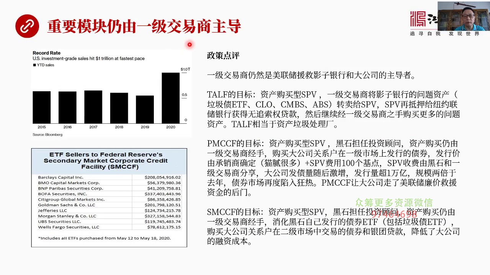

模化中仍然可以看出一交一商是主導的那麼這個資產資產的處理的資產處理廠我們可以這麼說它主要是一交一商將影子銀行的問題資產這些不管是垃圾債 ETFCIOCNBS還是ABS轉賣給美聯儲的 SPV在底下給紐約聯儲銀行獲得無追鎖帶款然後今一交一商之手購買更多的問題資產然後反覆反覆循環所以它相當於一個資產垃圾的...

<strong>Cleaned narration</strong>

> 模化中仍然可以看出一交一商是主導的那麼這個資產資產的處理的資產處理廠我們可以這麼說它主要是一交一商將影子銀行的問題資產這些不管是垃圾債 ET
> FCIOCNBS還是ABS轉賣給美聯儲的 SPV在底下給紐約聯儲銀行獲得無追鎖帶款然後今一交一商之手購買更多的問題資產然後反覆反覆循環所以它
> 相當於一個資產垃圾的處理廠反覆過程之中一交商賺越來越多的錢因為這個對它來說這是無風險的無風險套利這個一機市場的信用工具也一樣一商信用工具它是
> 個資產購買型的黑時擔任投資顧問資產購買人有一機交易商來驚手那麼購買大公司關係貨在一機市場上發行的債券發行價由程銷商確定程銷商裡面就包括一機交
> 易商這中間貓泥就很多了我們怎麼定一個對大企業最有好處的利率因為你利率定的其實你要是利息定的越低它越不好賣但是我知道我背後有個美聯儲大的一個買
> 主所以我就可以為大公司我的關係貨壓低人為壓低利率本來在正常市場上你肯定是賣不動的現在我知道有大買主的在背後所以我把這個發行價利率給定的非常低
> 反正我一轉手就賣給了美聯儲美聯儲再去做製壓好了所以在這個過程中它是幫助了大客戶獲得了非常廉價的成本然後它還賺取100個幾點的手區費但這個手區
> 費就是由一交商和黑時大家一塊分因為它的很多投資顧問的這個指令最後要一交上來進行執行所以這些導致大公司為什麼發債量會暴漲在3月份以後發信量今年
> 超過了1萬億美元量被於去年就是因為這套後門機制為大公司提供了一種超低的獲得融資的發債的一個通道債券上再次限入狂熱其實這個機制讓大公司走了美聯
> 儲聯價救援資金的後門它在正常的市場中沒有這個後門它不可能以這麼大規模以這麼低的成本去融資所以這是幫助大公司的一個最重要的工具那麼二級市場目標
> 呢主要是買的主要也是自然購買行黑時擔任顧問自然購買人有一級交易商的經手所以東西都是一級交易商來買賣主要目標是為了消化黑時已經發行的包括垃圾債
> 的一個當然除此之外還包括購買黑時的大公司客戶他們在二級市場上交易的債券和銀行貸款進一步壓低大公司的融資成本所以這兩個東西都是在幫助大公司壓低
> 這個融資成本我們可以看到在整個這個發債中間這個大公司的發債量在2020年上次突破了一萬億在這麼嚴重的疫情情況之下他們發了這麼多的債是去年發債
> 量了兩倍這才到才今年才6月現在6月為了還有12個未來還有6月12月這數值會更高在這種情況之下我們可以看到他為什麼要發這麼多債就是因為他可以拿
> 到廉價的資本廉價的融資所以這套機制對於大公司的發債企業直接的刺激作用當然二級市場這個目標現在已經開始可以看到了一貼F開始大量的把他們的這些各
> 種各樣的垃圾債還有這個債券的一貼F所持有的資產開始賣給了二級市場的工具這是列出了一些清單這只是5月12號的5月18號一些簡單的一個星期的數據
> 我們就可以看到開始自身轉移了開始進行垃圾處理了好我們再看邊緣某塊其實看來看

---

### Slide 18

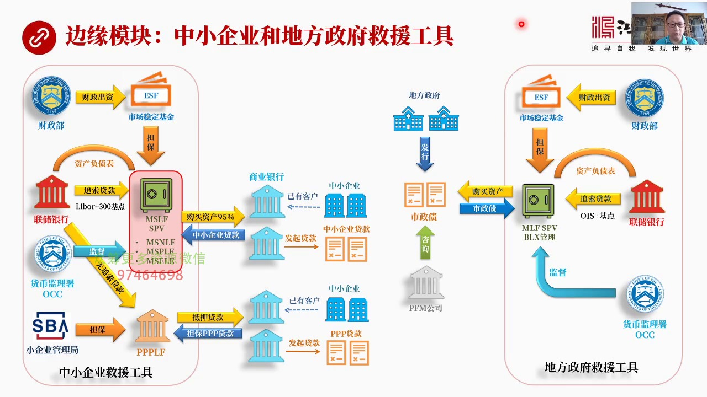

具只有邊緣某塊才有一定的拯救中銷企業和地方政府的才有一定的色彩邊緣某塊呢有幾個這邊是主階的中銷企業的救援工具這邊是地方政府的救援工具這邊有主階的貸款工具包括三個就是心中貸款優先貸款和貸款的延長三個工具它是用共同共享一個SPV但是是三個使用工具我們來看一下它運作的原理首先聯儲銀行各地的銀行都可以做這個...

<strong>Cleaned narration</strong>

> 具只有邊緣某塊才有一定的拯救中銷企業和地方政府的才有一定的色彩邊緣某塊呢有幾個這邊是主階的中銷企業的救援工具這邊是地方政府的救援工具這邊有主
> 階的貸款工具包括三個就是心中貸款優先貸款和貸款的延長三個工具它是用共同共享一個SPV但是是三個使用工具我們來看一下它運作的原理首先聯儲銀行各
> 地的銀行都可以做這個事它通過Liberary率加300幾點像它提供的大家貸款財政部進行監督還有出資進行單保納稅人錢進行單保同時這個OCC進行
> 監督這套機制在市場中主要去購買商業銀行他們對中銷企業的一些商業型的貸款也就是商業銀行發起貸款中銷企業的救援貸款和以前的商業貸款但是這些中銷企
> 業必須要已經是商業銀行的客戶也就在2019年12月31日之前就已經是要貸款客戶它才會去買他們的這種才會去幫助拯救他們的這些貸款所以我們來看這
> 個設計的原則是SPV在市場中購買95%的商業銀行所發行的中銷企業貸款銀行必須要自己持有5%它主要是標誌者你也要撐到一陣風險別多賣給我你也要6
> %我拿走95%實際上我拿走95%他們要持有10%的15%但是銀行不幹所以這個數字最後被調外到95讓它的風險更小所以整個設計的原則仍然是幫助銀
> 行來卸掉它的負擔賣掉這些中銷企業貸款之後銀行就沒有風險了風險轉嫁到他手上了誰被拯救了呢真正得到好處的中銷企業都是商業銀行已有的客戶實際上是在
> 拯救自己的關係戶除了這項工具之外主階所謂主階的待房工具主要是為了拯救商業銀行已有的關係戶那麼在拯救商業銀行過程之中商業銀行只成了5%的一點點
> 風險95%的風險全部轉嫁給了由納稅人的資金來擔保的SPP這是一個類型的主階拯救還有一個類型的PPPLIF就是新資保護這樣一個待款工具這個工具
> 在我看是唯一的真正對老百姓對中銷企業有幫助的一個工具我們看到聯儲銀行對這個工具提供的是無追所待款然後中銷企業局對這樣的一個只要你是保護新資的
> 也就是說你這個企業如果不裁員你將可以申請這個待款就是保護就業崗位的中銷企業管理局提供單保對這樣的一個待款提供單保所以這樣一個待款工具它的市場
> 中也是面量上銀行上銀行呢也是面量它已經有的中銷企業的客戶那麼他們對這些中銷企業發起一種救援性的待款叫PPP待款就是拯救新資待款就是這些企業你
> 只要不財人這些待款是給你發工資用的給你交水店費給你交房租用的不能用在其他方面這是專門的救援待款這種救援待款經過SBA的擔保之後被製壓給了PP
> PLF然後如果出現損失由政府來賠償由它來這個負擔所以這套機制和這套機制你會看到商銀行在中間基本上都沒有風險都在中間賺取大量手續費對它來說就是
> 一個五本的買賣五風險的一個高收益的買賣它在這賺取手續費反正你最後是政府擔保我不怕在這邊我賣掉95%我只剩5%了我也沒有什麼可擔心的所以這兩套
> 工具你會看到其實獲益的主要還是商銀行中銷企業間接就是他們的關鍵戶們間接有一些好處我們再看地方政府救援工具地方就政府救援工具聯儲銀行財政部和 
> OCC都一樣它對於 SPV的貸款是一種追鎖貸款然後是 OIS下幾點是由這張公司BLS公司負責管理它的主要目的是什麼呢主要目的是為了在市場中直
> 接去從地方政府發債發市政債我可以在市場中直接在發行的時候我就買你的債券買了這些債券之後放到這兒進行制壓然後再拿錢再買中間有一個類似黑石的公司
> 叫 PFM公司這公司是市政債中間的黑石它要提供資群也就是說我用我的經驗告訴你買哪個政府的或者哪個市的或者哪個縣的或者哪個哪個地方我認為比較好
> ...

---

### Slide 19

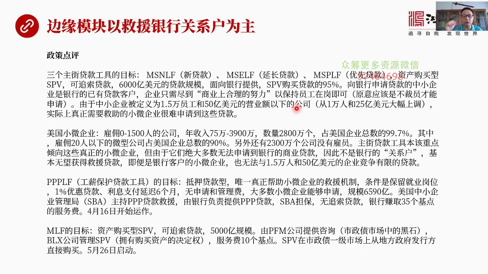

三個主階貸款工具不管是新貸款MSN是新貸款MSE是延長貸款MSP是優先貸款資產購買型它都是屬於資產購買型SPV那麼它總共有6000億美元的規模都是面向銀行來提供你看它沒有所有救援機構從來不是面向企業都是面向銀行由銀行獲得這些錢之後然後去帶給它的關係戶那麼在銀行向銀行申請貸款的重要企業它已經是銀行來貸...

<strong>Cleaned narration</strong>

> 三個主階貸款工具不管是新貸款MSN是新貸款MSE是延長貸款MSP是優先貸款資產購買型它都是屬於資產購買型SPV那麼它總共有6000億美元的規
> 模都是面向銀行來提供你看它沒有所有救援機構從來不是面向企業都是面向銀行由銀行獲得這些錢之後然後去帶給它的關係戶那麼在銀行向銀行申請貸款的重要
> 企業它已經是銀行來貸款客戶了而且這些企業本來這些所謂拯救貸款應該是有先例條件這個先例條件就是你必須要保證不財人我才能把錢給你但是以前是這麼規
> 定的後來這個條款很改了改成企業只需要進到商業上合理的努力保持員工再趕即可原來原來的條款是如果不財員如果你要財員就沒有資格去申請貸款注意啊這都
> 是我們看到是都是在拯救過程中出現的若干的自比行家的調整你其實代表了一個美國這個制度它的一種傾向性這肯定是銀行和企業當然說我可以拿你的貸款但是
> 我還要財員怎麼辦怎麼來解決這個問題就是要通過調整這些定義來解決其實實際上發生的也是這個情況大量企業拿到救援貸款之後照樣財人大規模財人為什麼美
> 國會失業這麼嚴重就是這些企業拿到政府的錢之後仍然在財人所以像這種救援政策幾乎無效對於拯救業拯救老百姓來說沒什麼效果而且還有一個很有貓膩的地方
> 就是它所說的主階也就是拯救中小企業這個中小企業的定義非常的有問題它這個救援機是定義中小企業被定義成15000顧元和50億美元的年齡業額以下的
> 公司我們先想看15000顧元這還叫中心公司小型公司嗎這應該叫大企業一年贏領50億美元這還是小微企業嗎這不可能是小微企業它原來的條款是一萬人和
> 25億美元這是被大幅調升了這再次說明在整個救援法案中間大公司的利益在中間起了巨大的影響包括金融機構實際上是救援不斷朝它們這個利益板塊進行清洩
> 而真正老百姓他們根本根本不管跟他們無關實際上真正需要救助的小微企業是很難申請到這些貸款的三個主階貸款工具對小微企業基本是關上大門的為什麼我們
> 來看美國真正小微企業的定義是什麼這是美國中小企業管理局他們自己的定義僱傭零到1500人的公司這叫中心企業小薪企業微薪也都包括在內年收入75萬
> 美元到3900萬數量整個這些企業數量有2800萬個占美國企業總書的99.7%注意這中間講到了15000人和50億美元的這些公司根本不是小微企
> 業的定義這些企業僱傭大多數創造大多數的機會占美國企業總書的99.7%其中僱傭20%以下這個才叫真正的小微企業微薪企業僱傭20%以下的占美國企
> 業總書的90%另外還有2300個公司沒有僱傭都是老闆自己干活這些人這些公司才是真正需要救助的因為他們真正創造了就業的大多數創造了就業崗位承擔
> 了稅收基本上都是他們的活但是這些20人以下的公司能有資格根本不可能主階代務工具本應該重點傾向於這些真正的小微企業但由於他們絕大多數無法申請到
> 銀行貸款他以前就不就很難申請到商業貸款他只能以老闆個人的信譽或者以房地產底壓去申請個人貸款然後用在商業上所以他們不是銀行的商業客戶所以他們也
> 就不是銀行的關係戶在這種情況之下基本上沒有希望得到救援貸款主階三個貸款跟他們沒關係即便是銀行就是真的是銀行給他們提供了貸款這些小微客戶他也沒
> 有辦法跟一萬五千人和五十億美元的大企業去競爭有限的貸款貸款只有這麼多先到先得拿完為止你想想看銀行在放貸的時候銀行有全部的權利來決定我放給誰不
> 放給誰你一個二世人的小公司向我申請25萬美元貸款另外一個申請25000萬或者兩億五千萬同樣的工作量我願意把貸款放給誰我當然願意放給這個大公司
> ...

---

### Slide 20

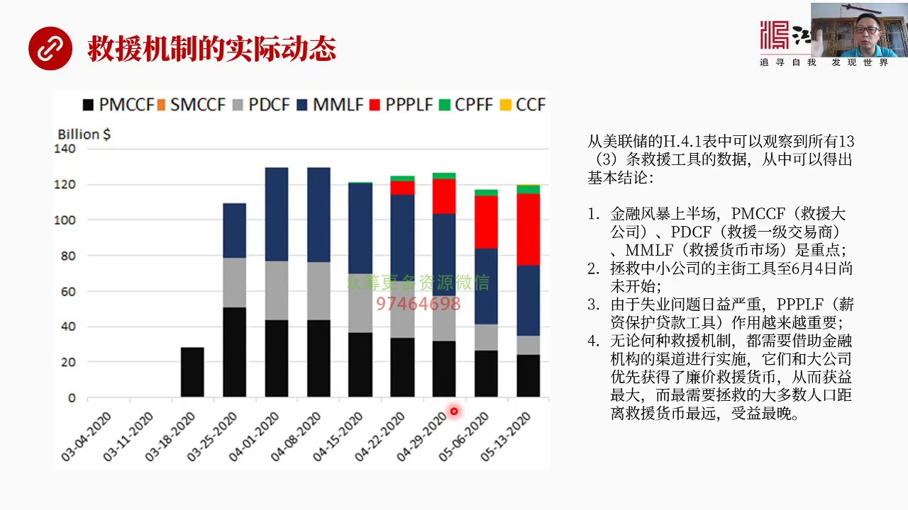

這11個主要的救援工具就是美聯儲救援這個美聯儲13條所授權成立的這11個救援機制我們可以看到他的基本的核心除了一個PPP其他都是面向一交一商和銀行體系主要正就是銀行機構對重基金、銀行和大公司中銷企業基本上很難獲益特別是小微企業、真正小微企業基本上無法獲益只有PPP、LF能夠提供有限的幫助我們來看這個...

<strong>Cleaned narration</strong>

> 這11個主要的救援工具就是美聯儲救援這個美聯儲13條所授權成立的這11個救援機制我們可以看到他的基本的核心除了一個PPP其他都是面向一交一商
> 和銀行體系主要正就是銀行機構對重基金、銀行和大公司中銷企業基本上很難獲益特別是小微企業、
> 真正小微企業基本上無法獲益只有PPP、LF能夠提供有限的幫助我們來看這個從執行的具體情況來看這就螢幕了然了3月18號開始啟動是一系列的工具我
> 們可以看到這些數據都會出現在美聯儲公布的H.4.1秒中間它會列出所有的每種工具的貸款娛樂我們可以從這些數據中進行分析得到一些基本結論在金融風
> 報爆發的最嚴重的時刻3個救援是主要方面是重點大公司PMCCF就是這款黑的他們占了相當大的比例第二是PDCF救援衣膠衣商就是這款灰色的這一款第
> 三是救援貨幣市場就是救援貨幣市場工具也就是藍色這一款這三個工具拯救的是誰大公司金融市場還有衣膠衣商數據說明一切我們不用說其他的你就看這一開始
> 看數據一到四月十五號之前這數據你就非常明顯看到有主階什麼事嗎有中銷企業什麼事嗎沒有有老百姓什麼事嗎沒有PVPLF是從4月22號以後才逐漸啟動
> 現在作用越來越大也就是10月人口很多但是4月24號之前拯救的主要還是美國的大公司金融機構和衣膠衣商所以你從政策執行這個劇情結果你就可以判斷美
> 國的政治的基本性質是保護大公司保護金融所以我說美聯儲以及擦所代表的金融體系是美國真正的決策人否則的話分錢這個事兒怎麼會這麼分呢實際上是金融體
> 系和大公司聯合執政的這樣的一種政治機制這個圖這些數據無可變薄的說明這一點主階的人在哪中央企業在哪中產階級在哪沒有拯救中央企業的主階工具一直到
> 6月4號其實也就到今天為止吧這套主階的工具都沒有啟動還是0如果我們看6月4號的H.4.1表你可以看到這個數是0所以中央企業那塊還沒有啟動呢失
> 業問題越來越嚴重這回導致社會動亂所以PPPLF啟動了而且規模越來越大第四個結論是無論何種救援機制都需要介入金融機構的渠道進行我們看到所有內容
> 框圖上不管你怎麼救援11種救援機制哪種救援都要通過銀行一交一商和銀行來進行所以金融機構和大公司優先獲得了廉價的救援資金每年出廉價印出的新潮票
> 首先到了他們手裡頭從而獲益最大而距離而最需要救援的大多數人呢那中產階級的幾千萬家小一企業呢他們離救援的貨幣最遠受益也是最晚所以這張圖已經說明了整個問題的性質我們再看除了11個救援機制之外還有就是

---

### Slide 21

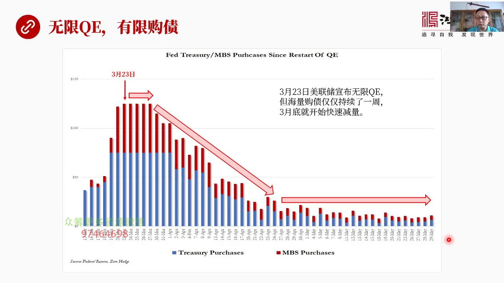

每年儲了兩貫充無限QE在3月23日推出但是你會發現這張圖這是每年儲夠債的規模紅色呢代表著NBS藍色是美國國債它每次購買大概分成一部分買國債一部分買NBS從23日宣布無限夠債之後你會發現這個規律有點奇怪它這無限夠債誰讓只持續了一週時間到3月底之後夠債規模就開始顯著下降到了4月以後4月底以後基本上吃平所...

<strong>Cleaned narration</strong>

> 每年儲了兩貫充無限QE在3月23日推出但是你會發現這張圖這是每年儲夠債的規模紅色呢代表著NBS藍色是美國國債它每次購買大概分成一部分買國債一
> 部分買NBS從23日宣布無限夠債之後你會發現這個規律有點奇怪它這無限夠債誰讓只持續了一週時間到3月底之後夠債規模就開始顯著下降到了4月以後4
> 月底以後基本上吃平所以這說明一個什麼問題呢無限QE確實有限夠債注意為什麼是有限夠債我們說無限可以有無限的買但是它實際上運作的時候它的量是有限
> 的我們一會會講到它有限夠債的真正的原因我們先看它開始無限夠債這個政策之後

---

### Slide 22

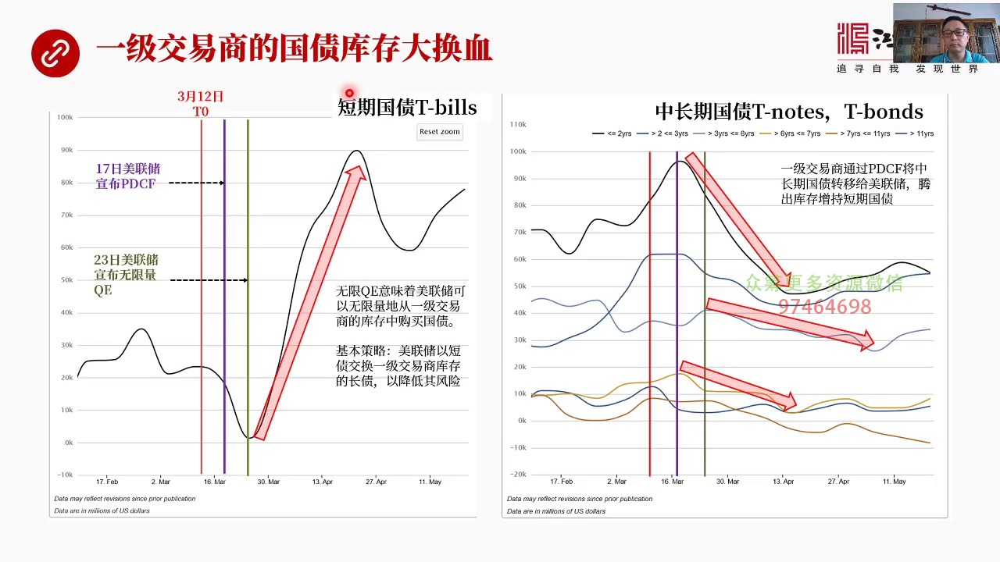

導致一季交易商的庫存出現了一個重大的變化我稱之為是庫存國債庫存大幻學比如我們來看3月12號金融合報T0時刻然後17號美聯儲宣布拯救一季交易商然後23號宣布無限量QE這13個時間線我們看到在無限量QE政策宣布之後美聯儲開始一季交易商開始大規模的增持什麼短期國債TB12個月以內了為什麼在宣布了這個政策之...

<strong>Cleaned narration</strong>

> 導致一季交易商的庫存出現了一個重大的變化我稱之為是庫存國債庫存大幻學比如我們來看3月12號金融合報T0時刻然後17號美聯儲宣布拯救一季交易商
> 然後23號宣布無限量QE這13個時間線我們看到在無限量QE政策宣布之後美聯儲開始一季交易商開始大規模的增持什麼短期國債TB12個月以內了為什
> 麼在宣布了這個政策之後它要做國債庫存這麼大調整呢與此同時它在大規模的減少中長期債券就是T0和T棒原因合債原因是無限QE意味著美聯儲可以無限量
> 的從一季交易商的庫存中購買國債美聯儲合一季交易商它是有一個策略的就是美聯儲一短債去交換一季交易商庫存中的長債降低一季交易商的風險因為短期國債
> 流動性更好風險更低美聯儲就讓一季交易商你來持有短債你把長債賣給我這是一季交易商國債庫存大幻寫了一個重要的原因當然由於美國的這個國債發向越來越
> 大一季交易商的庫存也會面臨巨大的巨大的這個壓力因為今年的財政赤子規模3萬億那誰來消化一季交易商肯定要承擔消化的一個重誕所以必須要雙方美聯儲合
> 一季交易商做好這個溝通你來買短債你把長債給我我以後主要持有中長債這樣的話才是一交商能夠有足夠的這個庫存的零貨性好我們再看下一從這張圖上

---

### Slide 23

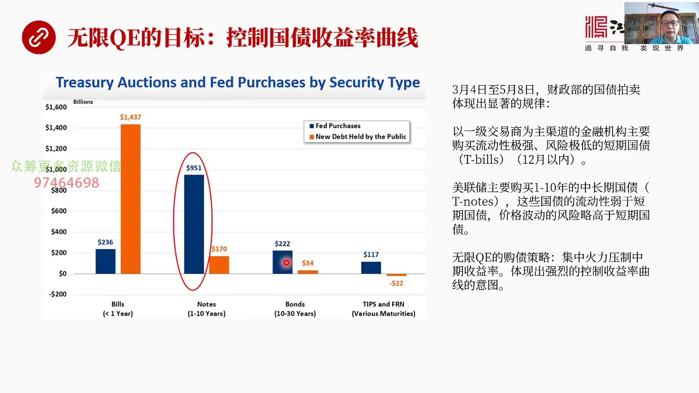

我們可以看到無限QE它真正目標其實是為了控制國債社會率曲線我們從3月到5月的這個財政部的國債拍賣中間就可以看出這個規律來比如說一季交易商主持到的銀行機構主要購買流動性已經非常強風險非常低的短機構債TBL12月以內你看這就是一季交易商的購買黃色是美聯儲的購買這個藍色是美聯儲的購買黃色是一季交易商的購買...

<strong>Cleaned narration</strong>

> 我們可以看到無限QE它真正目標其實是為了控制國債社會率曲線我們從3月到5月的這個財政部的國債拍賣中間就可以看出這個規律來比如說一季交易商主持
> 到的銀行機構主要購買流動性已經非常強風險非常低的短機構債TBL12月以內你看這就是一季交易商的購買黃色是美聯儲的購買這個藍色是美聯儲的購買黃
> 色是一季交易商的購買我們可以看到美聯儲重點購買的是這部分這部分是一到10年的中長債一季交易商一季交易商和其他金融機構主要買的是短債就是一年以
> 內的短債所以我們可以看到美聯儲主要購買長債而一季交易商主要購買短債它這樣幹也就是無限QE的夠債策略是什麼在我看來它主要是為了集中火力來壓制中
> 部的所謂中長期票據的收益率中長期國債收益率它是為了把它壓下來然後體驗出強烈的這個策略體驗出強烈的收益率曲線的控制的這種意圖就是我要控制收益率
> 曲線的好看的程度這個日本央行做的基本上是一個道理可以這麼說無限QE的它的最終目標是走日本央行那條路或者說它必將走向日本央行那條路我們來看一下下野這就是我稱之為是國債收益率曲線的美容

---

### Slide 24

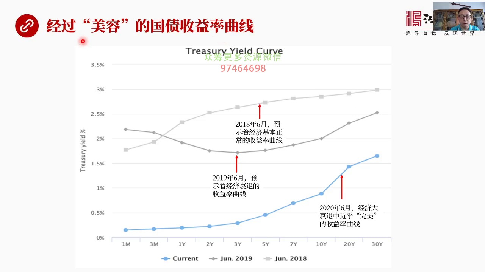

國債收益率曲線比如說這是某一個時刻對於不同七線國債的收益率的一個快照比如說在今天6月4號趴我照一張照片照出來整個市場中不同七線國債收益率交易出來收益率是這樣的一個曲線一個月的當然是收益非常低接近零然後30年的比較高比如說1.6然後中間借於兩者之間好我們如果時間拍的快照進行分析對比分析比如說2018年...

<strong>Cleaned narration</strong>

> 國債收益率曲線比如說這是某一個時刻對於不同七線國債的收益率的一個快照比如說在今天6月4號趴我照一張照片照出來整個市場中不同七線國債收益率交易
> 出來收益率是這樣的一個曲線一個月的當然是收益非常低接近零然後30年的比較高比如說1.6然後中間借於兩者之間好我們如果時間拍的快照進行分析對比
> 分析比如說2018年6月有拍的一張快照2019年6月6月5號我也拍的拍的一張快照好3個6月5號拍的快照3年的同的時間的6月5號同樣拍照我們可
> 以看出收益率曲線說明不同的問題2018年6月比如說這個時刻拍的快照說明什麼收益率曲線短期的收益率低長期的高應該是這樣因為短期風險更低長期風險
> 更高所以這個是一個正常的收益率曲線這條曲線預示著經濟基本正常但是到了2016年6月注意這就是我們去年開年中分析會的時候我們看到收益率曲線變成
> 這樣這什麼呢收益率曲線出現了盜礦短期收益率居然高於長期收益率比如說你3個月的居然高於我2年3年5年甚至7年10年你3月的比我這個都高那不是怪
> 了嗎因為10年的時間更長風險應該更大我收益率應該更高所以這種盜挂型的收益率曲線意味著經濟衰退即將來臨好我們再看現在在經濟衰退最嚴重的時刻出現
> 收益率曲線是啥樣是一個非常完美的收益率曲線是一個經濟收益率曲線6月美國的疫情已經200多萬人被感染11萬人死亡然後失業率已經達到了真失業率達
> 到16%如果是更大更寬的標準優6%的話是27%的失業率經濟衰退已經非常非常嚴重可能是僅次於大小橋以來了嚴重程度但是收益率曲線卻展現出了完美的
> 曲線所以這是一種美容每年主通過這種美容措施告訴以收益率曲線告訴大家你瞧我們現在的經濟非常健康或者經濟衰退馬上要來所以在我看來如果你把一種市場
> 就是把一種市場中間的一種參數變成了一種政策的工具那這個市場參數本身將失去任何價值它不再反映市場的一種基本的這種動態我們再看下一頁

---

### Slide 25

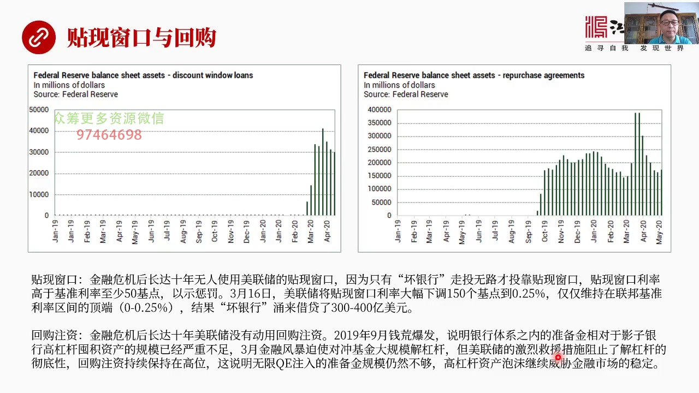

再看救援機制中的兩個長規機制貼眼窗口和回購這邊是貼眼窗口的數據我們知道貼眼窗口就是金融危機08年金融危機之後長達10年美聯儲式沒有動用貼眼窗口的因為什麼呢貼眼窗口的使用是換銀行走投物路情況之下才投靠貼眼窗口也就是它在其他金融市場中其他任何金融機構都不願意借成給它了它實在沒辦法才來敲美聯儲的窗戶到這兒...

<strong>Cleaned narration</strong>

> 再看救援機制中的兩個長規機制貼眼窗口和回購這邊是貼眼窗口的數據我們知道貼眼窗口就是金融危機08年金融危機之後長達10年美聯儲式沒有動用貼眼窗
> 口的因為什麼呢貼眼窗口的使用是換銀行走投物路情況之下才投靠貼眼窗口也就是它在其他金融市場中其他任何金融機構都不願意借成給它了它實在沒辦法才來
> 敲美聯儲的窗戶到這兒來進行貼線也就是抵押貸款那麼貼眼窗口的利率往往至少要高於基準利率50個積點已是懲罰因為你是金融不好沒人帶給你了你才找美聯
> 儲沒人所謂的懲罰你肯定會在基準利率之上加一個比較高的價錢來表示你做錯的事已是懲罰3月16號我們看到美聯儲將貼眼窗口的利率大幅下條150個積點
> 到0.25基本上調的跟基準利率一樣了抹平了這50個積點僅僅維持在聯邦基準利率上這個區間的頂端也就是0.25它就把它壓到0.25說明貼軟口的利
> 率跟聯邦基準利率幾乎一樣為什麼因為本來是懲罰性的東西但是美聯儲覺得可能會有不少銀行壞銀行出現所以我乾脆別懲罰了法不責重來得多了那就乾脆就全部
> 調成基準利率這就是壞銀行確實在3月20號以後開始大量跑來接待現在我們從一國上可以看到一直到現在還有340億的餘額掛在美聯儲的貼眼窗口這個帳上
> 這說明什麼有很多匿名的銀行到這敲敲來借錢這些銀行實際上已經到了走頭無路才會到美聯儲來借錢這銀行是誰呢還不太清楚但是這些銀行顯然已經面臨進行上
> 重大困難另外就是回購回購機制這是去年9月我們看到2019年9月爆發的前方以後回購回購駐資的規模越來越大但是到今年3月回購的量變得更加近人就是
> 經微機爆發那時刻就是經風爆發那幾天遠遠超過了前方雖然目前在下降但是仍然保持了一個相當高水平跟去年10月份的水平相當的一個回購駐資這說明什麼回
> 購這個東西也是長年沒有動用了在2019年前方爆發的時候開始動用回購說明銀行體育之內的準備金已經不足了雖然有1萬多億為什麼不足了因為相對於影子
> 銀行利用高倍槓杆把資產規模做得太大你相對於這個資產規模而言1萬多億根本就不叫足夠因為它一旦解槓杆你這1萬多億立刻就沒了3月金融風爆破制這個對
> 重基金大規模解槓杆但是由於美聯儲激烈的救援同時推出了這麼多救援措施其實阻止了這個對重基金撤去的解槓杆如果撤去解槓杆將會倒掉一大批對重基金當然
> 他們倒掉之後也會拉倒一大批銀行包括一交一商都會被他們戳垮這就變成了體系型的危機了所以很多人認為銀行沒有問題其實銀行是有問題的如果你不救對重基
> 金銀行的問題就會暴露那麼回購市場在這種大規模的解槓杆大規模的刺激和拯救情況之下仍然保持這麼高的這麼高的數額這說明什麼一直到5月底6月初這個數
> 字仍然沒有降下來這說明回購駐資保持在高位說明什麼說明無限QE駐入的準備金規模仍然不夠現在無限QE已經駐入了是美聯儲自然分量表突破了7萬億將來
> 駐了3萬億還填不滿這個庫隆我們可想而知這說明這個市場的資金的壓力仍然是存在了這就好像是無症的感染者你不要看他現在沒有發病他是帶有病毒的他這病
> 毒一旦是在合制條件之下開始傳染就會引發新的疫情爆發所以高被杆爾資產泡沫仍然繼續威脅著金融市場的穩定如果這個數還沒降下來說明問題還沒有徹底結束我們再看下一個貨幣互換貨幣換主要是美聯儲跟其他洋行進行的

---

### Slide 26

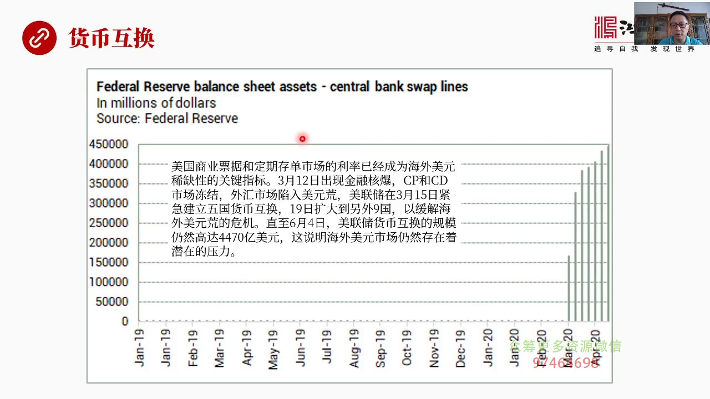

美元輸出的一種機制美國商業票局市場和定期存在市場的利率已經成為海外美元稀缺程度的關鍵指標也就是外匯市場在關鍵時刻他盯的是商業票據和定期存在市場的利率來決定Liber利率也就是美海外美元是不是稀缺你不能只看海外美元外匯交易那些邊緣性的或者叫很智厚的一些數據你實際上應該是重點分析商業票局和定期存在這個實...

<strong>Cleaned narration</strong>

> 美元輸出的一種機制美國商業票局市場和定期存在市場的利率已經成為海外美元稀缺程度的關鍵指標也就是外匯市場在關鍵時刻他盯的是商業票據和定期存在市
> 場的利率來決定Liber利率也就是美海外美元是不是稀缺你不能只看海外美元外匯交易那些邊緣性的或者叫很智厚的一些數據你實際上應該是重點分析商業
> 票局和定期存在這個實際上有沒出問題實際上他是這兩個指標應該是先導行的指標領先指標3月12號出現金融合報之後這兩個市場CP和CD快速凍結然後導
> 致外匯市場陷入美元荒美聯儲在3月15號緊急建立了5國貨幣貨幻19號擴大到另外9國以環節海外美元荒的危機但是到了6月4號美聯儲貨幣貨幣貨幻的規
> 模仍然高達4,471美元跟這個時刻危機時刻差不了太多也就是海外美元的貨幻的規模依照現在到6月4號仍然非常高這說明海外美元是長仍然存在的潛在的
> 壓力雖然我們看到美元匯率下來了美元的指數下來了不要忘了這個數字如果沒降下來說明你現在美元匯率下降或者說美元走弱是直接由於拯救措施也就是你脖子
> 還掛著這個呼吸機呢這個呼吸機一旦拆掉美元指數還會下降嗎就不一定了美元指數說並立刻大幅反彈海外美元荒說不定立刻爆發所以現在海外美元市場包括全球
> 匯率上是掛著呼吸機的一個市場這個呼吸機從數據來看體驗在4,471美元龐大的外匯掉期龐大的貨幣互換之上現在所有正常的匯率行為全部建立在呼吸機組
> 織上所以這個呼吸機什麼時候撤了下來我們恐怕要盡管其變要看其他的所以這實驗發展其他的變化好我們來看美聯儲資產負債表救援的終極體現

---

### Slide 27

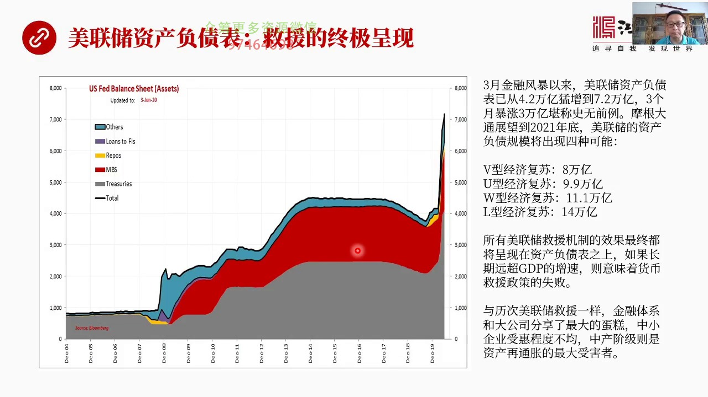

就是美聯儲在3月也風暴以來美聯儲的資產負債表已經從4.2萬億猛中到7.2萬億3個月的時間暴漲3萬億看成什麼史無前例這在美聯儲100年的歷史上他沒有出現過這麼猛烈的3月猛烈增加3萬億從來就沒有出現過這麼嚴重的情況現在某個大通他們展望2021年就是2021年明年年底美聯儲資產負債表的規模可能出現4種情況...

<strong>Cleaned narration</strong>

> 就是美聯儲在3月也風暴以來美聯儲的資產負債表已經從4.2萬億猛中到7.2萬億3個月的時間暴漲3萬億看成什麼史無前例這在美聯儲100年的歷史上
> 他沒有出現過這麼猛烈的3月猛烈增加3萬億從來就沒有出現過這麼嚴重的情況現在某個大通他們展望2021年就是2021年明年年底美聯儲資產負債表的
> 規模可能出現4種情況假如是微信付出現在已經突破7萬2千億假如經濟是微信付出立刻現在美國經濟就好了那麼資產負債表將不會超過8萬億8萬億是它的一
> 個卡當然我覺得這種可能性幾乎不存在優性付出那麼美聯儲資產負債表會膨脹到9.9萬億經濟是10萬億如果是W6型付出再次出現24億型的話就會充到1
> 1萬億如果是L型付出持續好幾年兩三年那就充到了14萬億我們的電腦屏幕就不夠了所有美聯儲救援機制的最終效果都會體驗在自然負債表上如果我們看這個
> 自然負債表長期以來它的膨脹的規模超過GDP的比如說2%到3%的平均的增長速度說明這套貨幣制度一定是出了嚴重問題貨幣政策出現了嚴重失敗與歷斯美
> 聯儲救援一樣金融體系和大公司分享了最大蛋糕這次是這樣上次是這樣這次還是這樣一樣的中小企業社會程度嚴重不均中產階級則是資產在通脹了最大受害者因
> 為中產階級大多數人其實沒有太多的資產你在自然膨脹過程中是啊好處都被大公司和金融基礎拿走了中產階級其實在這次危機之後會陷入更嚴重的平均化所以美
> 國的社會動檔它會加劇而不會減輕我們現在看到的這些騷亂這恐怕只是拉開了一個序幕如果是L型的這個經濟輔輸膨脹到14萬一未來兩三年經濟都沒有真正好
> 起來的話那麼再加上財富峰會分配嚴重不公所激發的很可能是相當相當激烈的社會動檔我們最後看這個當下一次危機來臨

---

### Slide 28

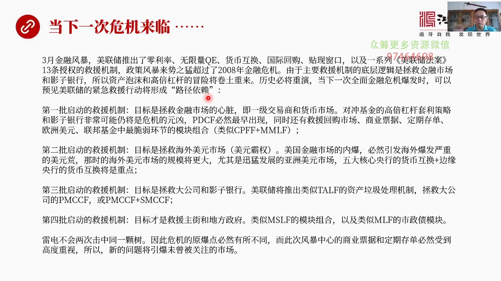

我們分析了這麼多其實說白了就是要搞明白市場和政策之間的關係當金融市場出現了這些問題是這個政府會用什麼樣的政策特別是美聯儲會用什麼樣的貨幣政策來拯救這是我們研究的重點為什麼研究這個重點主要是為了預測因為美聯儲上次08年這麼做過2020年再次這麼做下次它還會這麼做因為這是一種路徑依賴通過三次這樣的一個行...

<strong>Cleaned narration</strong>

> 我們分析了這麼多其實說白了就是要搞明白市場和政策之間的關係當金融市場出現了這些問題是這個政府會用什麼樣的政策特別是美聯儲會用什麼樣的貨幣政策
> 來拯救這是我們研究的重點為什麼研究這個重點主要是為了預測因為美聯儲上次08年這麼做過2020年再次這麼做下次它還會這麼做因為這是一種路徑依賴
> 通過三次這樣的一個行為我們基本上可以把它未來的未來的危機的應對方式可以看得非常清楚那麼3月峰報美聯儲推出了一系列的救援包括零利率無限量QE貨
> 幣貨幻國際回購天然窗口還有13條所授予了11個救援機制這種政策峰報的這個熊猛程度遠遠超過了2008年金融危機但是這個救援機制底層邏輯是什麼是
> 救援金融市場和影子銀行包括大公司在那樣所以資產泡沫和高貴幹館的風險必將捐土出來你把利率壓到0你讓對通基金怎麼活你釋放了這麼多流動性這些人在市
> 場中找不到收益率的產品找不到有收益率或者高收益率的產品他們就只能停而走線加槓杆把一點點利潤以50倍以前是以50倍現在得有80倍得用100多倍
> 的這種槓杆才能賺取跟以前一樣的利潤這不是會導致他們貿易更大風險嗎我們現在只是還沒有斷定他在哪個套利空間壓上上百倍的槓杆只要你知道在哪個領域中
> 他算做你就可以確定的知道下次金融危機將爆發在哪個他的原爆點將在哪所以歷史必將重演當下次全面金融危機爆發時候可以預見美聯儲的緊急救援措施他必然
> 形成路徑依賴就是前兩次都已經這麼幹了第二次一定會怎麼幹在我看來他一定會啟動四批救援第一批救援是什麼主要他的目標是救援金融市場的心臟就是依交一
> 商和他管理下的貨幣市場這是他首先第一批一定要救的立刻叫救的所以對中基金的高貝槓杆套利策略和影子銀行非常可能仍然是未來危機的援兇我們現在只需要
> 確定他們將會在哪個領域進行上百倍槓杆資金的套利那個領域就必然是下次危機的重點那麼為了拯救他們惹出來了重大解槓杆風波第一個出現的仍然必然是這種
> PDCF拯救EG交易商的救援工具為什麼因為他是所有市場的核心所有市場的這個中心是所有主要市場的做事商每個市場出問題都跟他有關係所以拯救他是必
> 然最早出現的當然同時還要拯救貨幣市場貨幣市場包括回購包括商業票據定義孫丹歐洲美元聯盟基金這五大市場中最脆弱的環節是一個還是兩個我們現在不知道
> 這要取得於對衝擊金在哪個領域進行大規模的槓杆操作這些槓杆操作有可能會衝擊到波及到哪些領域我們現在還無法提前預知但是我們可以判斷救援機制將會包
> 括類似於商業票據加上貨幣基金的這種救援機制這是第一批拯救金融市場的心臟第二批就是拯救海外美元市場這是拯救美元霸權這啟動僅次於救援心臟美元市場
> 的內報必然會引發海外美元市場的嚴重美元荒那麼到下次爆發的時候海外美元市場規模可能會更大尤其是去蒙發展中的亞洲美元市場特別是韓國為中心的現在正
> 在取代於取代日本為中心的亞洲美元市場說不定未來還會轉移到新加坡或者如果中國海南發展起來說不定會轉移到海南我們現在不知道但是亞洲美元市場的序生
> 上一定是越來越大的那麼在下次救援機制中我們會看到它必然會啟動以五大核心央行也就是美聯儲歐洲央行英格蘭英行還有瑞士央行還有日本央行為核心的貨幣
> 互換同時還要加上邊緣央行的貨幣互換邊緣央行就一定會包括韓國日本韓國新加坡是不是會包括其他的亞洲亞洲某個國家的這種央行現在我們不能隨便確定但是
> 在我看來只要哪個地區的外匯交易規模越來越大那麼這個所在地區的央行就有可能被納入未來的這個貨幣互換的網絡第三批是拯救大公司和影子銀行美聯儲將會
> ...

---

### Slide 29

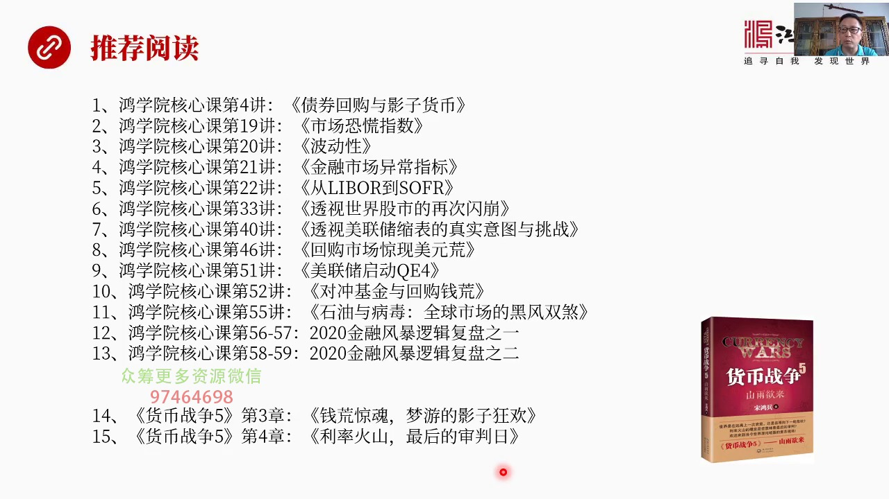

我們其實這三堂課三個系列吧主要是通過一種認知算法深度學習的模塊一層一層的體驗它的典型特徵然後對於檢驗車程進行深入分析之後然後再把它逐漸的還原從而對於整個三月金融風暴產生了一個更全面更深入的認識主要目標是為了幫助我們判斷下一次金融風暴爆發的原爆點在哪裡它的先決條件是什麼包括它先行指標有哪些其實主要是來...

<strong>Cleaned narration</strong>

> 我們其實這三堂課三個系列吧主要是通過一種認知算法深度學習的模塊一層一層的體驗它的典型特徵然後對於檢驗車程進行深入分析之後然後再把它逐漸的還原
> 從而對於整個三月金融風暴產生了一個更全面更深入的認識主要目標是為了幫助我們判斷下一次金融風暴爆發的原爆點在哪裡它的先決條件是什麼包括它先行指
> 標有哪些其實主要是來進行這種預測判斷出現危機之後美聯儲的它的政策選擇模塊組合它的執行的順序它的救援的原則策略究竟是什麼我們通過這三個系列的課
> 基本上把這個問題都做了一個非常系統的這個總結有了這套東西之後大家可能會覺得很複雜沒關係你看三遍看不明白四遍五遍你頭腦中建立起這樣一套框架之後
> 以後你看新門新門是流動性的信息是流動性的而我們今天所建立的這些框架是固定的所以你當大腦中建立起固定的分析框架之後大量的新的信息流流過的時候你
> 腦子面會快速高效率的對這些新的信息進行處理然後很快得出結論和判斷提高我們思維的效率特別是對金融危機分析判斷的效率咱們推薦閱讀包括核心課的立次
> 關於金融危機的講解包括我的書中關於金融衍生產品市場的一些分析這堂課其實我看了很多很多相關的文件

---

### Slide 30

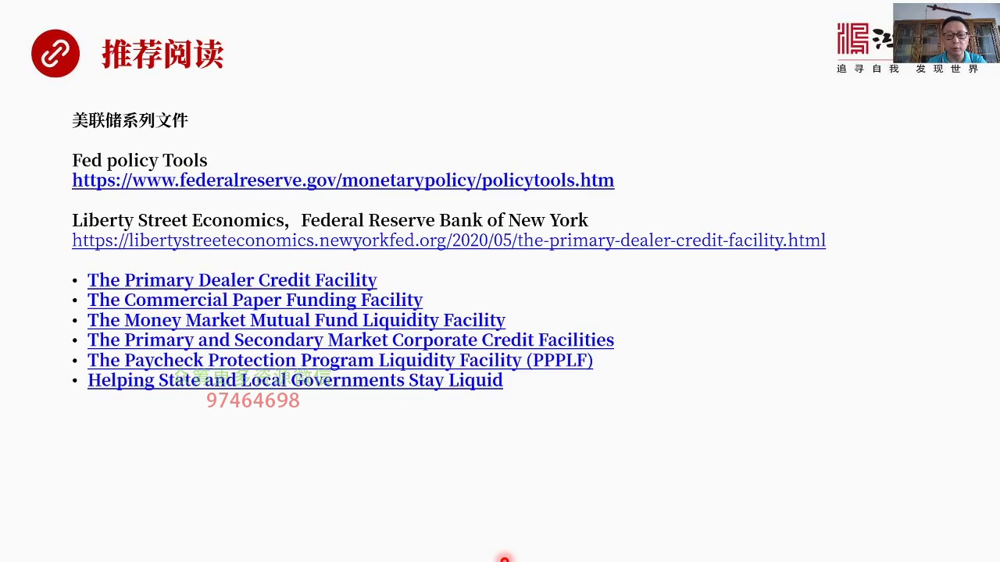

我這只是列出了一些因為太多我沒法全部列只是列出了一些最官方的特別是美聯儲的系列文件包括美聯儲的政策工具這是它的廣紙還有包括美聯儲女銀行搞了一系列的介紹它這個極大工具的一些使用方法其實除了這些之後之外還包括美聯儲的一些白皮書包括它的一些問題解答包括它的一些XL的一些文件數據包括財政部的很多數據包括國際...

<strong>Cleaned narration</strong>

> 我這只是列出了一些因為太多我沒法全部列只是列出了一些最官方的特別是美聯儲的系列文件包括美聯儲的政策工具這是它的廣紙還有包括美聯儲女銀行搞了一
> 系列的介紹它這個極大工具的一些使用方法其實除了這些之後之外還包括美聯儲的一些白皮書包括它的一些問題解答包括它的一些XL的一些文件數據包括財政
> 部的很多數據包括國際親身銀行和這個IMF就是國際貨幣基金組織著很多這種報導相關報導都對這篇文章我都借講這些文章的一些觀點和他們的數據好今天咱們的課就上到這裡謝謝大家祝大家週末愉快

---

### Slide 31

<strong>Cleaned narration</strong>

---

### Slide 32

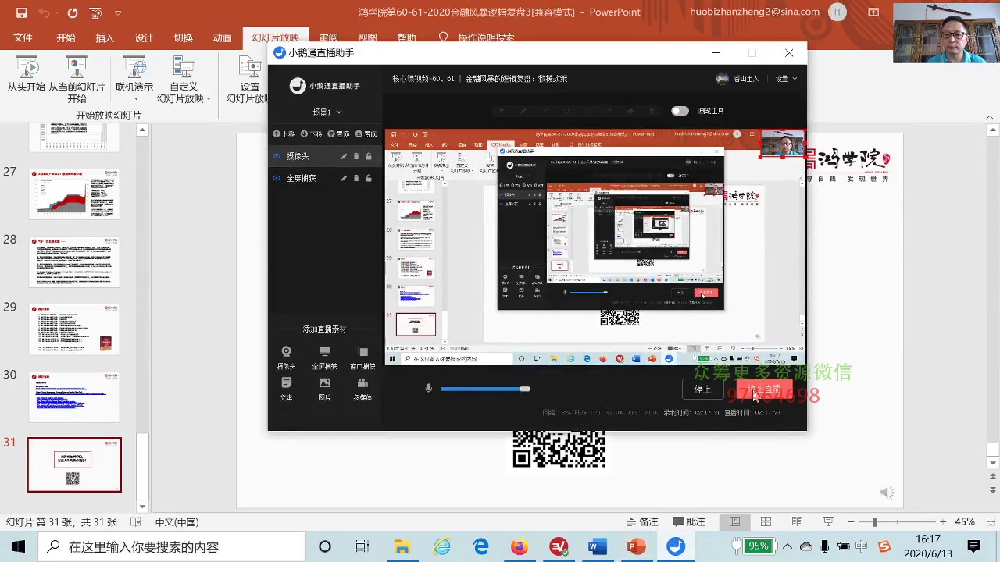

<strong>Cleaned narration</strong>

---
