# 核心课视频-62、63 美国金融风暴核心课系列专题答疑 — Detail Slide Notes

> **来源**：鸿学院核心课程  
> **幻灯片**：50 张

---

### Slide 1

逻辑复盘的达意一部分那么咱们在核心课第56到61

<strong>All subtitles</strong>

> 逻辑复盘的达意一部分那么咱们在核心课第56到61

---

### Slide 2

连续讲了六堂关于金融风暴的这个逻辑复盘这几堂课应该说是我们核心课中间应该说难度最高的这个系列所以很多同学听了这个课之后呢要大量的疑问这个其实很正常因为这六节课所涉及到内容量还有他的对金融问题的这个签入...

<strong>All subtitles</strong>

> 连续讲了六堂关于金融风暴的这个逻辑复盘这几堂课应该说是我们核心课中间应该说难度最高的这个系列所以很多同学听了这个课之后呢要大量的疑问这个其实
> 很正常因为这六节课所涉及到内容量还有他的对金融问题的这个签入了深度应该说都达到相当相当深的水平所以大家如果有什么疑问这很正常但是不到同学呢希
> 望我们有一堂专门还一堂答仪课因为大家问题很多所以呢我们今天这场课主要是对大家提出一些问题然后进行一个系统的答仪在这里呢我说到了很多同学提出了
> 问题今天呢我们就根据这个问题呢给大家做一个集中的答复那么比如说现在我看到了第一个问题是有同学问请问宋老师现在有观点说不能再用传统的周期理论去
> 分析现在的金融问题因为随着信息化的深入周期性越来越不明显宋老师怎么看这个问题如果周期性分析逐渐被淘汰应该向什么方向去研究这个问题呢首先提出了
> 周期理论我们知道经济发展中半岁这各种周期那么举减举个简单例子吧比如说传统经济理论认为生产消费它是存在周期性的除此之外呢债务也存在着周期性那么
> 从金融这个角度来说分析金融问题吗我觉得最重要的还是我们关心的还是债务周期周期这个问题在我看下是长期存在而且永远存在跟你使用的技术没有什么太大
> 关系什么叫周期举个简单例子我们每天晚上都要睡觉睡觉是8个小时你是肯定不干活的早上起来工作那么晚上下班所以人的一天也会呈现明显的周期性就是我们
> 人类活动总之要周期什么时候工作什么时候休息还有经济时候周期性很明显比如说中国的一年一度的春节只要到2月份或者3月份总有一个月大家是在放假的或
> 者2天所以那个月的经济数字一定是比较差的到底很简单大家都度假去了都放春节了回家团圆去了所以这种周期性跟你用没有信心话没有什么太大关系或者说我
> 们可以说吧随着技术发展周期性仍然存在只不过周期的如果我们用波用波动来思考的问题就是他的波长变短了频率变高了你要这么说是有道理的所以对我们来说
> 不是周期性不存在了或者周期应该是削弱了而是周期被压缩了压短了频率变高了尤其是从金融角度来看这个债务问题我觉得是在被压缩的你比说我们以前看的美
> 国的金融危机大概是每十年出现一次比如说从这个八千代以来吧九十年就是八千代末九十年代初出现了一次金融危机就是当年的铁带款按键铁带款出了大问题然
> 后在往后到20000年十年之后出现了IT房貌破裂就是20000年股市暴跌这又算一次金融危机再往后八年2008年金融海校然后2008年以后到现
> 在中间出现了若干自小的震荡2020年出现了一次比较大的严重问题其实在这些问题背后一个共同的规律是什么共同的规律是债务债务对级到一定程度崩盘债
> 务对级到一定程度崩盘所以从这个角度来说我觉得我们现在研究金融问题主要是研究债务周期可能更对我们来说更有意义所以如果说我们怎么去研究金融风暴其
> 实在我看来我们应该重点研究债务出问题的周期你比如说我们现在看到的这个三月金融风暴就是一次典型的典型的一个债务问题这个债务体验在什么呢体验在从
> 我们金融风暴这个逻辑复盘这个里面我们展现出来他的他的这个债务主要体验在对冲基金循环贷款就是我以国债作为抵押在回够上上融潜容来一笔钱然后把这笔
> 钱投下其他的金融市场然后进行套利然后不断的加上点不断这么做主要对冲基金积累的什么积累是债务就是我把国债质压出去借来钱这形成了债务就是我必须要
> 在规定时间把钱还回去所以我需要不停的滚动融资这就是一种债务我们可以称之为是引资银行所形成了这种复债当这个复债规模大到一定程度一个对冲基金比如
> 说他用一亿美元做大一百倍的杠杆使自己用一百亿美元资产的时候他中间签了多少债签了99签了99亿的债所以从这个议来说他的负债量他的增加了速度远比
> 我们以前看到传统银行放态然后做吃这个立插要比这个速度快多了所以我们未来要研究金融风暴要研究金融危机我就用我们的关注重点应该是关注到引资银行的
> 债务形成和引资银行这个债务周期变化了总的规律也就是说对冲基金的策略一旦发生重大的失效那么他所欠的所有这些债务将会立刻进入这个清长的状态这就会
> 触发解杠杆整个金融体系一起解杆杆大量对冲基金一起来做这个事那么这就会又发进入危机也就是流动性哭结整个市场上一切资产被拋售然后就会动结关键市场
> 然后就会引发全球美元荒等等这样的一系列重大的重大的这个危机所以我觉得对于未来我们要研究的重点方向实际上是要关注全世界的引资银行和引资银行债务
> 的形成它是债务的特点以及它发生内暴的总的规律所以我们要特别关注那些高位加范杆的对冲基金的动向和他们现在正在采取的策略因为这个将是未来金融风暴
> 的原爆点他们的失败将引发一系列的多民多股派效益这个就是我们我们看到的这个怎么来考虑债务周期的问题怎么来考虑影子银行债务的这个方向的问题第二个
> 问题有同学问宋老师你好非常感谢宋老师以扔者之心向广大同学传授金融知识现在我已经对全球金融市场有了一个基本框架但为了实现提前预防金融风险的目的
> 相关只是相关指标查询的网站以及具体网站查询的百块还不能独立完成宋老师能不能带着学员在具体网站上让大家跟着数据走一遍这个同学这个问题提的很好其
> 实也反映了广大其他同学的一些共同共同的一些问题就是大家现在已经建立起来一个理解金融危机的总的框架特别是理解美元体系的还留的一个总的框架现在因
> 为我们在核心克里面讲到大量指标大量数据和它的逻辑关系然后这个同学就问这些框架理解了那么这些数据怎么去找所以呢今天我们给大家做就是我们可以举几
> 个简单例子吧你比说这个我经常使用了经常使用了这个网站这是美联储有云行网站

---

### Slide 3

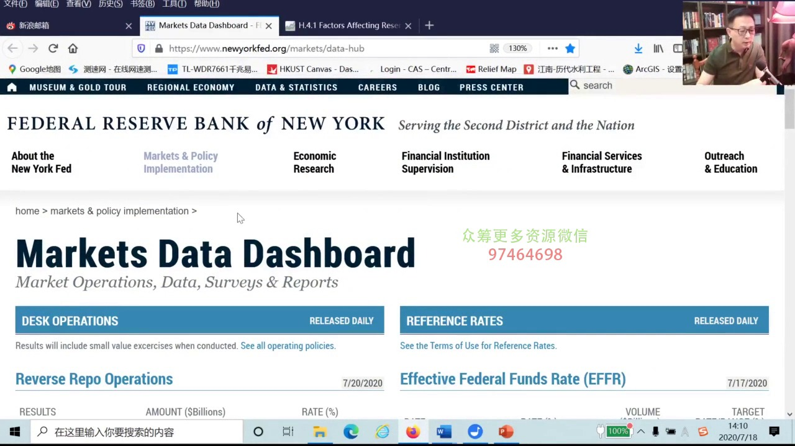

它有一个相当于数据集成的这么一个一个页面它在这个数据集成这个页面中呢它会把各种相关的最重要的比如说7月20号美国逆回构的操作它的数量然后一些相关的条件美国现在联邦基准力率的

<strong>All subtitles</strong>

> 它有一个相当于数据集成的这么一个一个页面它在这个数据集成这个页面中呢它会把各种相关的最重要的比如说7月20号美国逆回构的操作它的数量然后一些相关的条件美国现在联邦基准力率的

---

### Slide 4

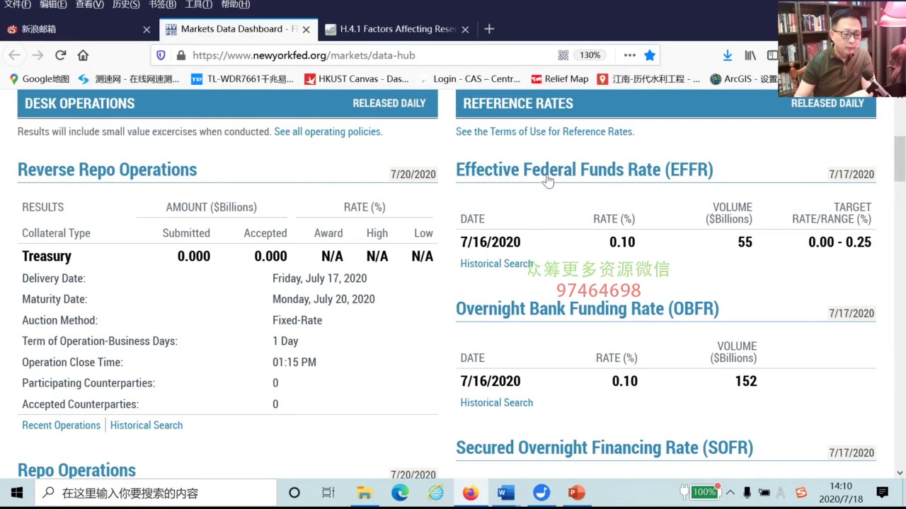

一些关键数据比如说这才能目标值零到零点二五到七月十六号现在中间价是多少是零一零点一然后中间成交的是五百五十亿美元然后呢还有隔夜银行的这种拆借利率然后呢还有回够利率我们可以看到回够利率七月十六号是零点一...

<strong>All subtitles</strong>

> 一些关键数据比如说这才能目标值零到零点二五到七月十六号现在中间价是多少是零一零点一然后中间成交的是五百五十亿美元然后呢还有隔夜银行的这种拆借
> 利率然后呢还有回够利率我们可以看到回够利率七月十六号是零点一二百分之

---

### Slide 5

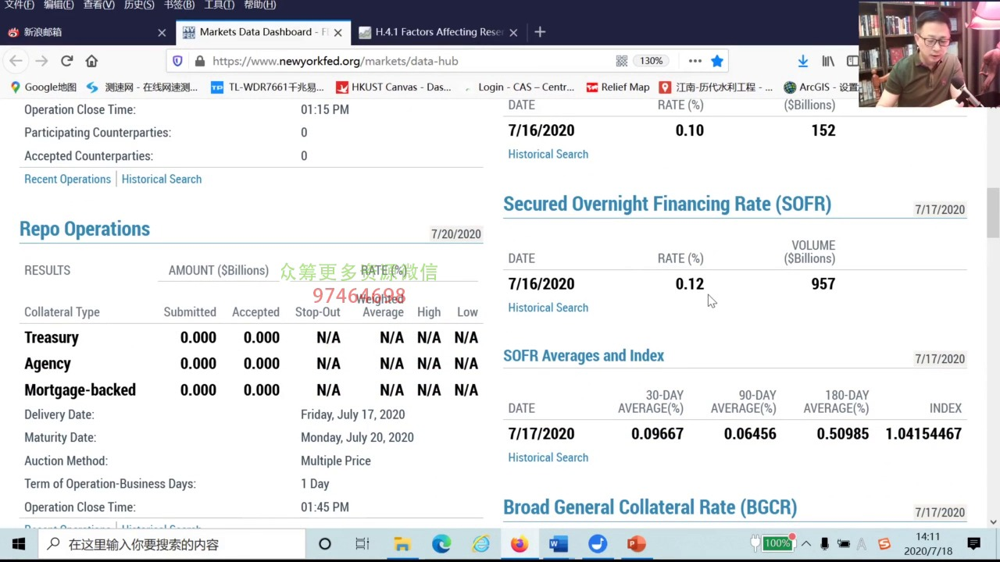

然后回够成交是接近这个然后回够操作以多少以国债为抵押进行多少以机构债

<strong>All subtitles</strong>

> 然后回够成交是接近这个然后回够操作以多少以国债为抵押进行多少以机构债

---

### Slide 6

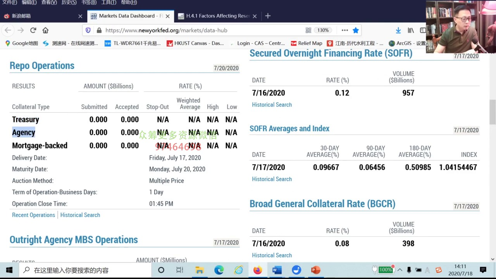

你安静点贷款这个NBS作为点成交的多少还有各种各样的其他的数据比如说回够利率的平均值还有它的其他的相关信息还有各种各样的比如说三方三方通用了回够的利率还有各种操作的成交的数据还有关于国债的它的交易情况...

<strong>All subtitles</strong>

> 你安静点贷款这个NBS作为点成交的多少还有各种各样的其他的数据比如说回够利率的平均值还有它的其他的相关信息还有各种各样的比如说三方三方通用了
> 回够的利率还有各种操作的成交的数据还有关于国债的它的交易情况所以我们通过这样的一些还有这个依据交易商的一些统计数据依据交易商又有多少美国国债

---

### Slide 7

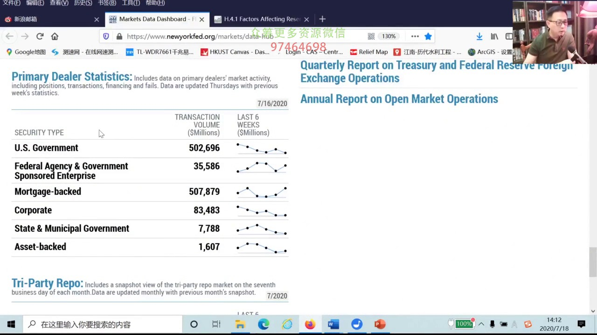

又有多少这个按照比较债还有多少机国债企业债还有市政债自然地亚政权我们可以通过这些数据可以掌握依据交易商的库存我们通过三方回够我们可以大概知道回够市场发生了变化所以我首先我给大家推荐的首先是纽约美联储银...

<strong>All subtitles</strong>

> 又有多少这个按照比较债还有多少机国债企业债还有市政债自然地亚政权我们可以通过这些数据可以掌握依据交易商的库存我们通过三方回够我们可以大概知道
> 回够市场发生了变化所以我首先我给大家推荐的首先是纽约美联储银行的

---

### Slide 8

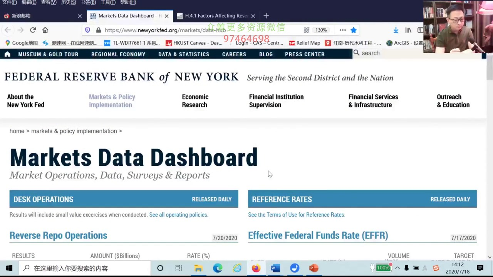

这个大家Market Data Dashboard这一叶大家如果看它的网站就是纽约美联储银行然后MarketsDataGAM这一叶基本上你可以看到美国核心市场的一些关键数据当我希望大家是

<strong>All subtitles</strong>

> 这个大家Market Data Dashboard这一叶大家如果看它的网站就是纽约美联储银行然后MarketsDataGAM这一叶基本上你可以看到美国核心市场的一些关键数据当我希望大家是

---

### Slide 9

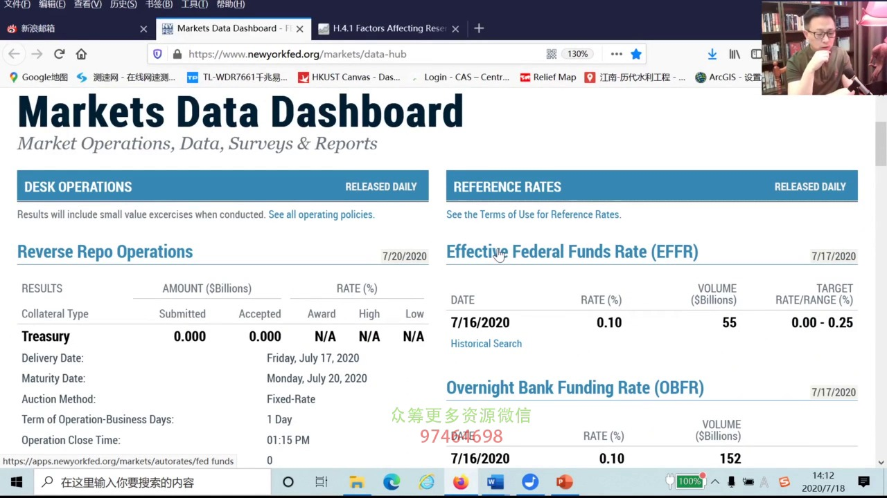

能够借用一些工具把你关注的数据全部像它一样提升在一个Dashboard 上提升在一个表盘上在这一表盘上你可以实施动态观察所有的你最关心的数据所以这个需要一定的工具来帮助完成比如说刚才我举着这个美联储银...

<strong>All subtitles</strong>

> 能够借用一些工具把你关注的数据全部像它一样提升在一个Dashboard 上提升在一个表盘上在这一表盘上你可以实施动态观察所有的你最关心的数据
> 所以这个需要一定的工具来帮助完成比如说刚才我举着这个美联储银行它这个安排方式就比较好所以这是一个

---

### Slide 10

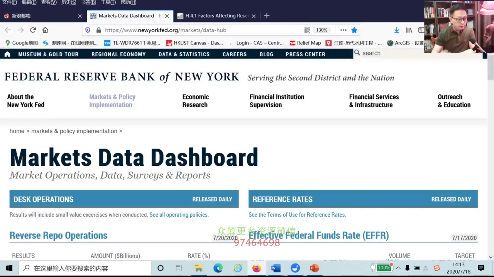

关键数据的查询的网站大另外还有比如说如果我们来看因为我自己收集了大量金融数据这些金融数据这都是相关金融数据的一些网站

<strong>All subtitles</strong>

> 关键数据的查询的网站大另外还有比如说如果我们来看因为我自己收集了大量金融数据这些金融数据这都是相关金融数据的一些网站

---

### Slide 11

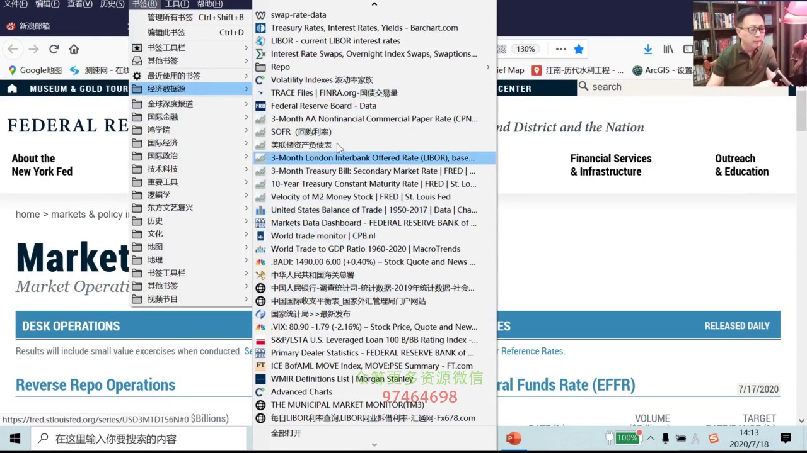

你比如说我要关心这个利率掉漆英镇类的Swap我会到

<strong>All subtitles</strong>

> 你比如说我要关心这个利率掉漆英镇类的Swap我会到

---

### Slide 12

相关的网站去查询今天咱们就网了有点慢我们再看其他的如果我关心美国的美联储的H.4.1这个表

<strong>All subtitles</strong>

> 相关的网站去查询今天咱们就网了有点慢我们再看其他的如果我关心美国的美联储的H.4.1这个表

---

### Slide 13

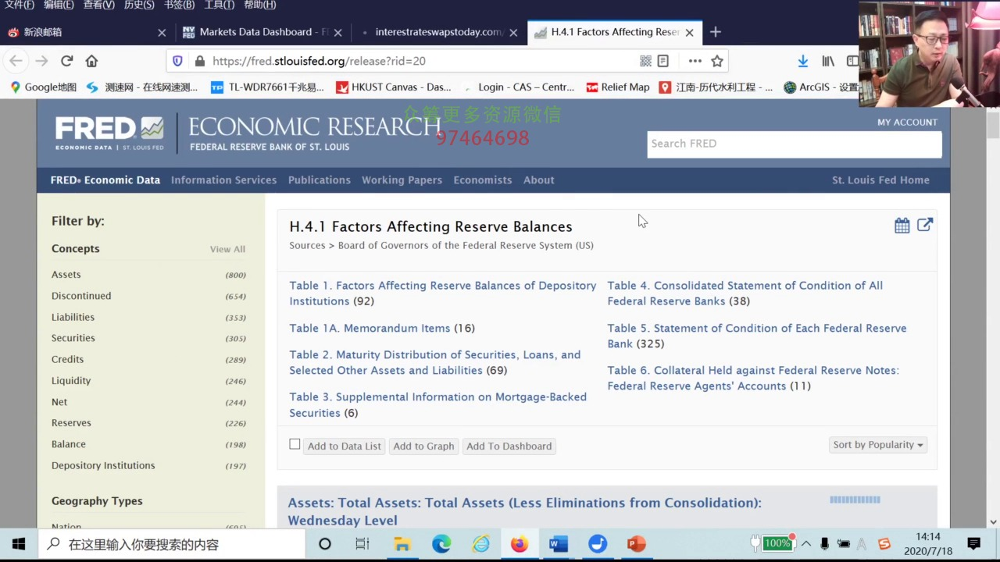

就是美联储资料表中间的一些细节问题我可以到美联储的相关的网站去查询如果我关心比如说美联储资料出来表吧那么我可以到美联储剩绿施银行它的网站上是长所以我们可以通过这张图你可以营幕了然的看到美联储自然是在表...

<strong>All subtitles</strong>

> 就是美联储资料表中间的一些细节问题我可以到美联储的相关的网站去查询如果我关心比如说美联储资料出来表吧那么我可以到美联储剩绿施银行它的网站上是
> 长所以我们可以通过这张图你可以营幕了然的看到美联储自然是在表的

---

### Slide 14

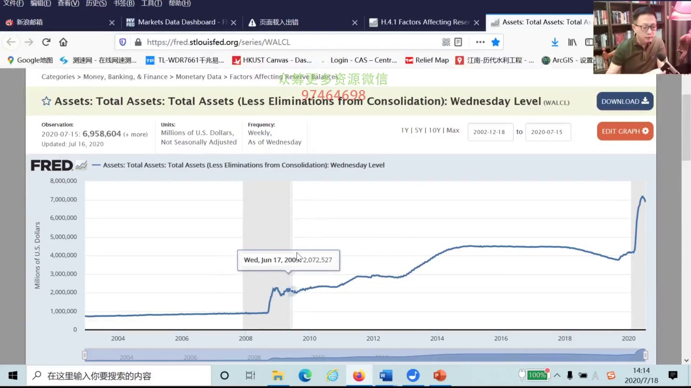

动态变化情况大家可以看到这个就是我们看到的美联储的一些重要的网站当然这些网站你还可以根据你的需求来做一些计算

<strong>All subtitles</strong>

> 动态变化情况大家可以看到这个就是我们看到的美联储的一些重要的网站当然这些网站你还可以根据你的需求来做一些计算

---

### Slide 15

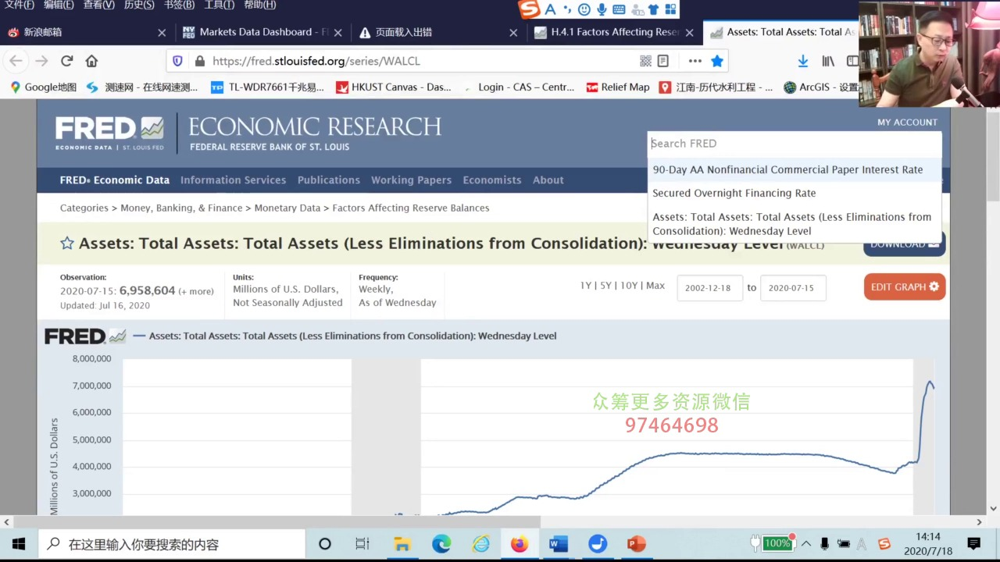

这个运算的方法你比如说我现在如果要查回够利率他会马上给我显示出回够利率那么如果我比如说我选一年

<strong>All subtitles</strong>

> 这个运算的方法你比如说我现在如果要查回够利率他会马上给我显示出回够利率那么如果我比如说我选一年

---

### Slide 16

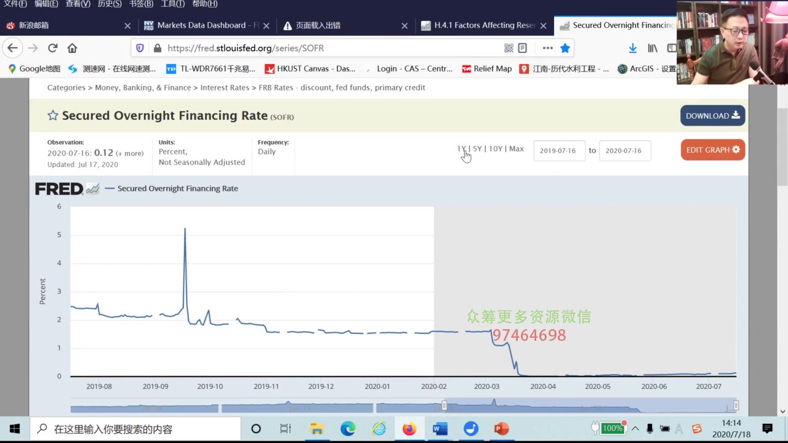

回够利率他的变化情况如果我想把这个数做一个计算那么我们可以操作的方法就是美联储这个网站它有大量的计算工具比如说我现在要计算回够利率跟蓝本利率之差那么我可以在这个他这个网站上直接做运算你比如说这就要求我...

<strong>All subtitles</strong>

> 回够利率他的变化情况如果我想把这个数做一个计算那么我们可以操作的方法就是美联储这个网站它有大量的计算工具比如说我现在要计算回够利率跟蓝本利率
> 之差那么我可以在这个他这个网站上直接做运算你比如说这就要求我们增加一个

---

### Slide 17

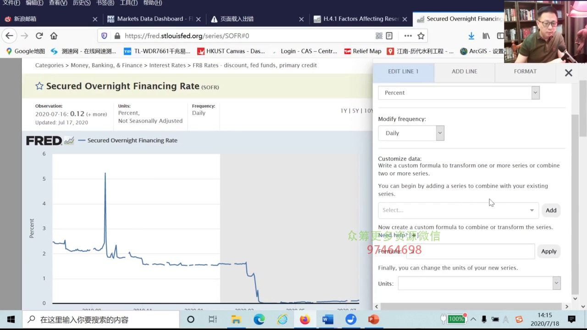

蓝本利率的蓝本利率的这样一个选项然后我把这个数据加上这个序列加上大家可以看到我们在这里呢有美国回够利率

<strong>All subtitles</strong>

> 蓝本利率的蓝本利率的这样一个选项然后我把这个数据加上这个序列加上大家可以看到我们在这里呢有美国回够利率

---

### Slide 18

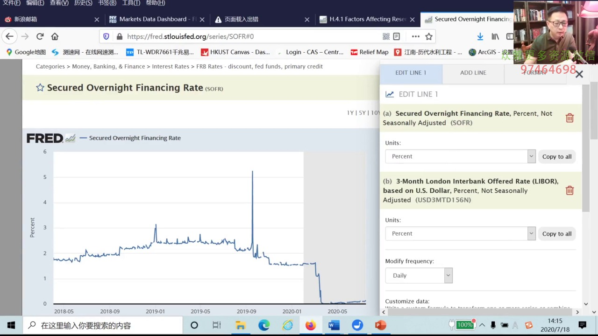

A和蓝本利率B那么其实我在这里可以做计算如果A解B是多少我需要在这个图形中把A解B给算出来这样让我一目了然看看美联储的看看美国的金融市场的核心利率跟海外美元的利率的差异我可以直接把它的立差给算出来

<strong>All subtitles</strong>

> A和蓝本利率B那么其实我在这里可以做计算如果A解B是多少我需要在这个图形中把A解B给算出来这样让我一目了然看看美联储的看看美国的金融市场的核心利率跟海外美元的利率的差异我可以直接把它的立差给算出来

---

### Slide 19

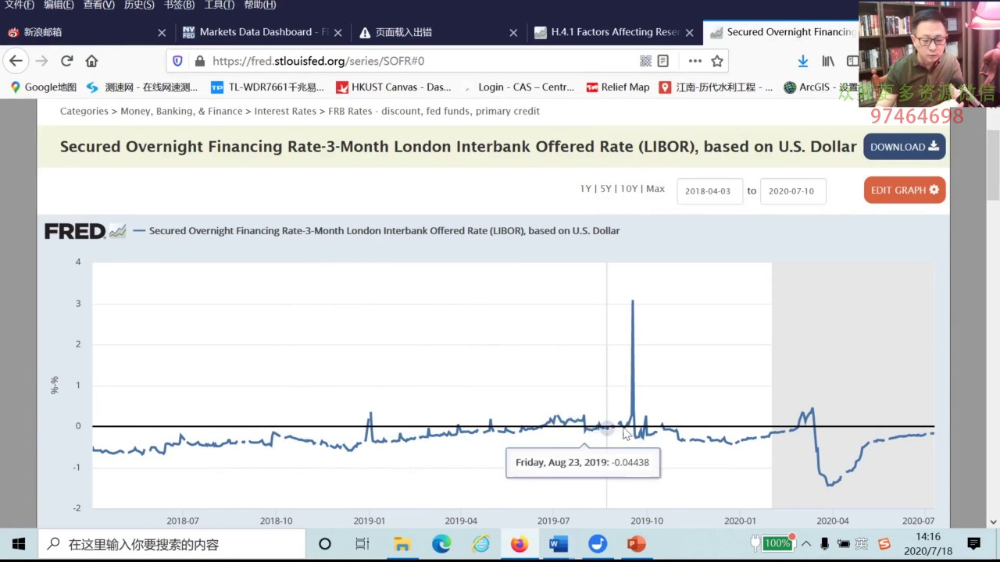

直净图表现出来半个话当然就一目了然了所以大家不仅要学会使用天网站而且要学会使用他网站中的各种计算方法和计算工具非常强的而且很方便同时又是全为数据更新速度也比较及时所以要了解美国货币市场的很多关键数据大...

<strong>All subtitles</strong>

> 直净图表现出来半个话当然就一目了然了所以大家不仅要学会使用天网站而且要学会使用他网站中的各种计算方法和计算工具非常强的而且很方便同时又是全为
> 数据更新速度也比较及时所以要了解美国货币市场的很多关键数据大家可以直接到美联储上路易思因行

---

### Slide 20

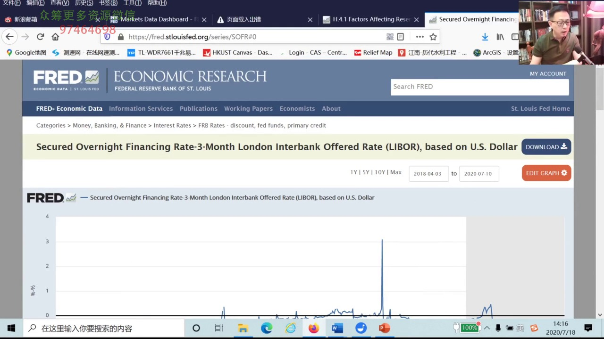

点欧阿记到这个网站上来查那么他其实这里面试试到大量的信息不只是我刚才所说的这个你比如说我要查商业票据的信息那么我们可以就打商业票据比如说这已经弹出来了就打卡门秀配盼然后我们可以看到商业票据的利息是什么...

<strong>All subtitles</strong>

> 点欧阿记到这个网站上来查那么他其实这里面试试到大量的信息不只是我刚才所说的这个你比如说我要查商业票据的信息那么我们可以就打商业票据比如说这已
> 经弹出来了就打卡门秀配盼然后我们可以看到商业票据的利息是什么样呢这些商业票据的利息走势所以在美联储的这个网站中集成了我们同学所需要的绝大部分
> 数据如果大家熟练的掌握这些网站而且包括掌握他的计算方法还有对比的方法你比如说我现在如果要把

---

### Slide 21

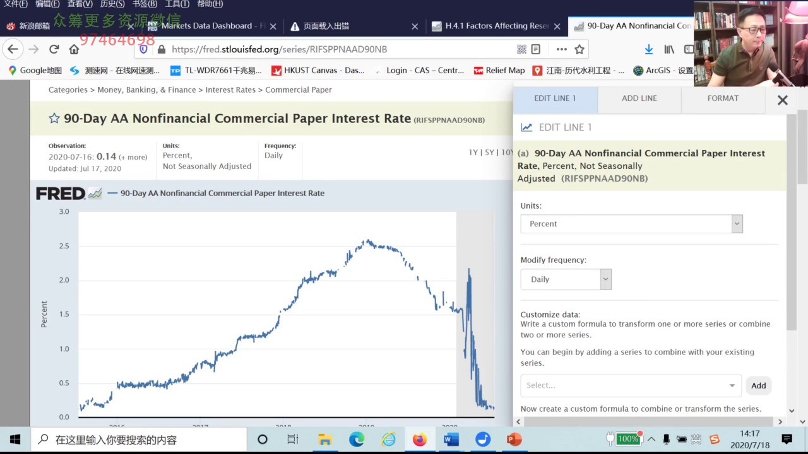

这个商业票据的利率我要跟Liberly率进行对比我要两张同时展现我就可以增加增加一个曲线比如说增加Liber增加Liberly率我可以看出两者之间的曲线在一张图上可以看出来大家可以看到现在我这张图上就...

<strong>All subtitles</strong>

> 这个商业票据的利率我要跟Liberly率进行对比我要两张同时展现我就可以增加增加一个曲线比如说增加Liber增加Liberly率我可以看出两
> 者之间的曲线在一张图上可以看出来大家可以看到现在我这张图上就出现了两条曲线

---

### Slide 22

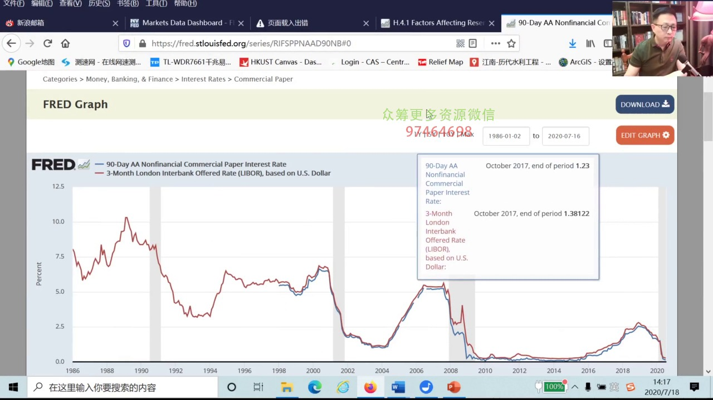

两条曲线我就可以进行对比红的是3月Liberly率蓝线是3月的这个商业票据的利率我一下就能看出两者之间的变化的曲势谁高谁低这就是同时展现当然我还可以加加更多的曲线我要可以加若干跳曲线再一起来进行比较

<strong>All subtitles</strong>

> 两条曲线我就可以进行对比红的是3月Liberly率蓝线是3月的这个商业票据的利率我一下就能看出两者之间的变化的曲势谁高谁低这就是同时展现当然我还可以加加更多的曲线我要可以加若干跳曲线再一起来进行比较

---

### Slide 23

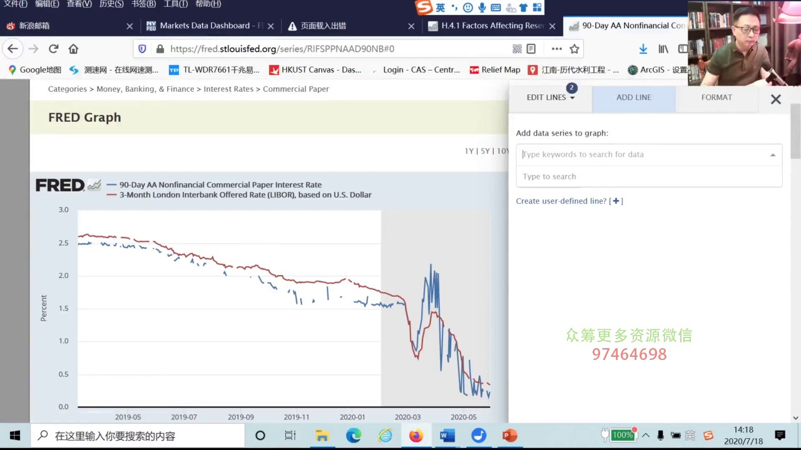

你比如说我再加回够利率可不可以没问题三条曲线都可以给你展现出来我们可以看看三条曲线同时展现出来的效这就是我们可以非常清晰

<strong>All subtitles</strong>

> 你比如说我再加回够利率可不可以没问题三条曲线都可以给你展现出来我们可以看看三条曲线同时展现出来的效这就是我们可以非常清晰

---

### Slide 24

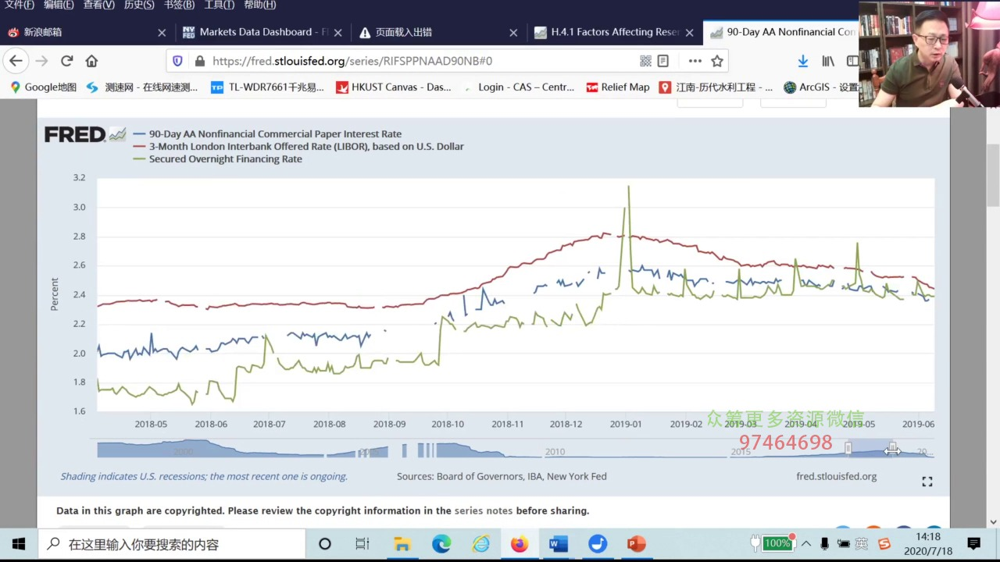

和明了的看到这些数据变化的规律所以大家学会使用这种计算方法使用多头同时展现让你一幕两人看到更清楚更直观的数据这个就是我们说的美联储是个很好的数据来源当除此之外还有很多你比如说我们如果是对

<strong>All subtitles</strong>

> 和明了的看到这些数据变化的规律所以大家学会使用这种计算方法使用多头同时展现让你一幕两人看到更清楚更直观的数据这个就是我们说的美联储是个很好的数据来源当除此之外还有很多你比如说我们如果是对

---

### Slide 25

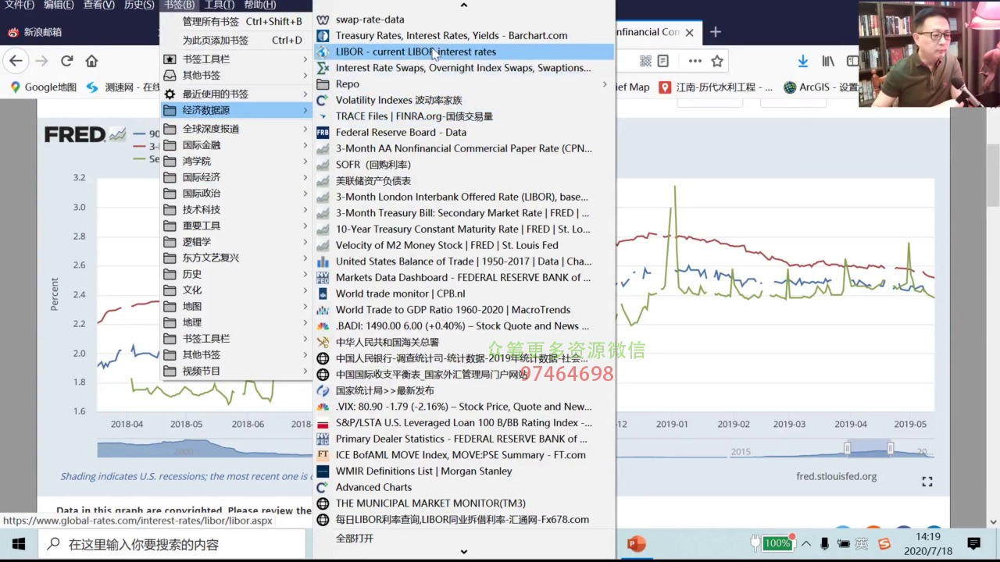

如果是被一些其他数据感兴趣比如说比如说波动率

<strong>All subtitles</strong>

> 如果是被一些其他数据感兴趣比如说比如说波动率

---

### Slide 26

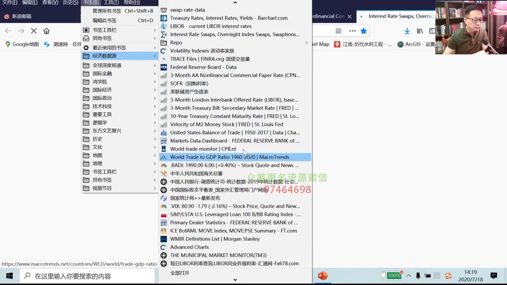

这也是大家经常会查询那一些一些数据波动率就是我们在核心肯定有人讲到的波动率是个家族家族我们可以从这儿看到VIX的指数它的报价情况

<strong>All subtitles</strong>

> 这也是大家经常会查询那一些一些数据波动率就是我们在核心肯定有人讲到的波动率是个家族家族我们可以从这儿看到VIX的指数它的报价情况

---

### Slide 27

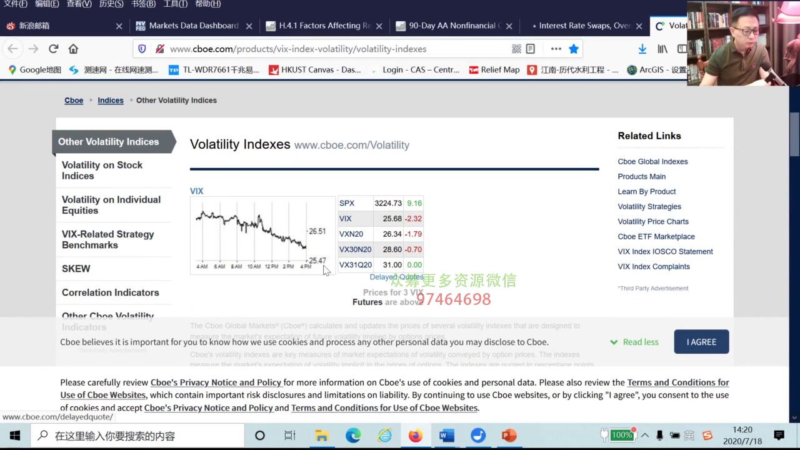

其实还有波动率对于其他的相关的资产的波动性真面都可以看到你比如说

<strong>All subtitles</strong>

> 其实还有波动率对于其他的相关的资产的波动性真面都可以看到你比如说

---

### Slide 28

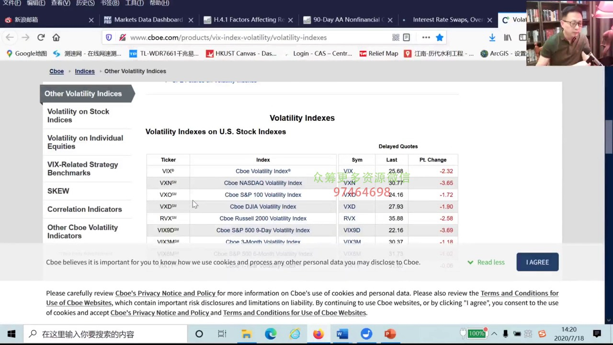

这个VIX指数有对SNP的有对NASDAQ的有对到程斯的罗宿的等等这些每一个数据你都可以进去看它的变化的变化的趋势和突兴所以呢这就是我们需要大家在经常使用这个你比如说这是VIX指数的一些变化的趋势如果...

<strong>All subtitles</strong>

> 这个VIX指数有对SNP的有对NASDAQ的有对到程斯的罗宿的等等这些每一个数据你都可以进去看它的变化的变化的趋势和突兴所以呢这就是我们需要
> 大家在经常使用这个你比如说这是VIX指数的一些变化的趋势如果你想关注其他的领域的资产的波动率也可以他这个上套有很多其他的资产的这种波动情况不
> 仅仅是针对故事那么他还甚至还可以看到每一个这个具体的这种这个股票比如说IBM的公司的股票

---

### Slide 29

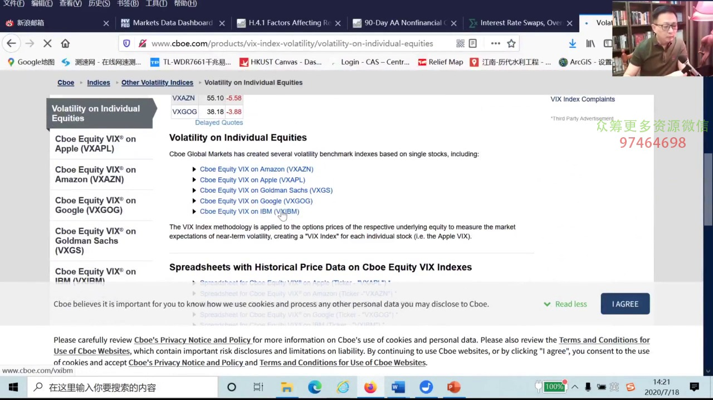

要么迅公司的股票每一支股票的波动率他也可以给你展现出来这样的话你就可以看到一些更细节的东西就是不仅是对于整个股市SNP或者NASDAQ或者到程斯

<strong>All subtitles</strong>

> 要么迅公司的股票每一支股票的波动率他也可以给你展现出来这样的话你就可以看到一些更细节的东西就是不仅是对于整个股市SNP或者NASDAQ或者到程斯

---

### Slide 30

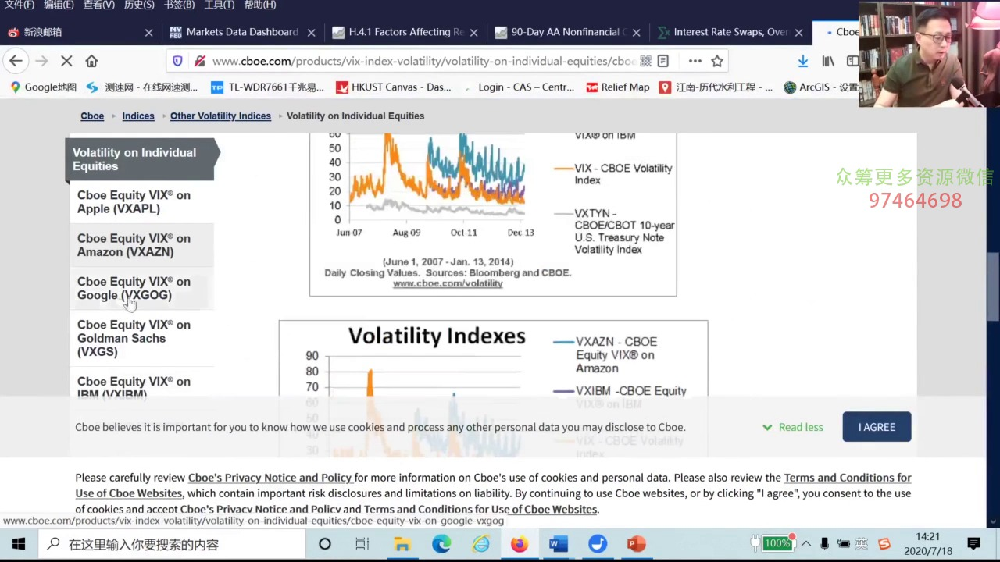

甚至你可以观察到每一支具体的股票比如说股哥股哥的波动率是多少然后你可以观察和分析这支股票本身他的波动的情况当然你甚至可以看到他有历史

<strong>All subtitles</strong>

> 甚至你可以观察到每一支具体的股票比如说股哥股哥的波动率是多少然后你可以观察和分析这支股票本身他的波动的情况当然你甚至可以看到他有历史

---

### Slide 31

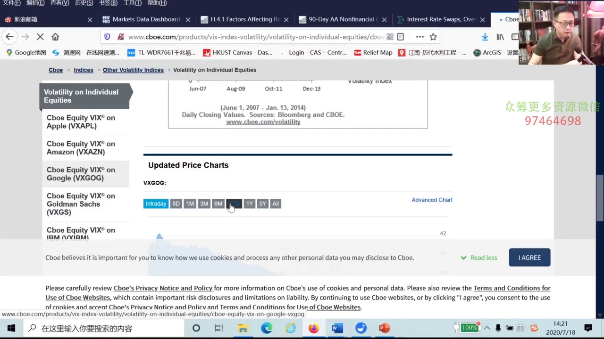

历史数据比如说你可以观察他6月的波动情况或者3个月或者1个月你可以用这种时间的办法可以把一个历史历史上的一个数据看得更清楚这样也变于我们对很多金融市场做更全面更深入的分析所以这个就是我们看到的波动率他...

<strong>All subtitles</strong>

> 历史数据比如说你可以观察他6月的波动情况或者3个月或者1个月你可以用这种时间的办法可以把一个历史历史上的一个数据看得更清楚这样也变于我们对很
> 多金融市场做更全面更深入的分析所以这个就是我们看到的波动率他的一些情况你别人说吧这个网站是

---

### Slide 32

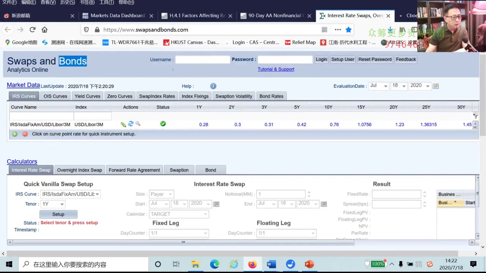

利率掉漆和债券之间的关系从这个利率掉漆中我们可以看到有关利率掉漆他的一些收益率的趋线比如说一年期的他是0.28两年是0.3三年是0.31五年是0.32这实际上你可以自己就可以把他这个图给画出来这样的话...

<strong>All subtitles</strong>

> 利率掉漆和债券之间的关系从这个利率掉漆中我们可以看到有关利率掉漆他的一些收益率的趋线比如说一年期的他是0.28两年是0.3三年是0.31五年
> 是0.32这实际上你可以自己就可以把他这个图给画出来这样的话我们可以看到比如说这是OS的我们有同学问OS怎么查想这些地方都可以看到比如说这个
> 一年的OS他的收益率趋线是一年的是0.22两年的是0.24一个星期的一个月的三月的六月的都可以看到你可以看到最新的成交时间7月28号这些就是
> 我们可以迅速的去查询我们最关心的比如说利率掉漆的情况比如说这个OS他的利率的他的利率的收益率趋线是个什么呀还有各种其他的收益率趋线比如说美国
> 国债所以我们从这网站上你可以找到利率掉漆的收益率趋线OS的收益率趋线国债的收益率趋线我们看到这是不同时期的国债一个月的三月的六月的一年的十年
> 的三年的我们都可以都可以清楚看到而且你还可以选择时间去查一些历史数据那么这里面当然还有一些其他的很有意思利率掉漆的还有这个掉漆的波动性的这些
> 数据应该说都非常的全对于我们做分析和研究可以起到很好的帮助作用这也是一个非常有价值的网站当然了这个大家可以大家肯定是希望把所有这些东西全部集中在一起

---

### Slide 33

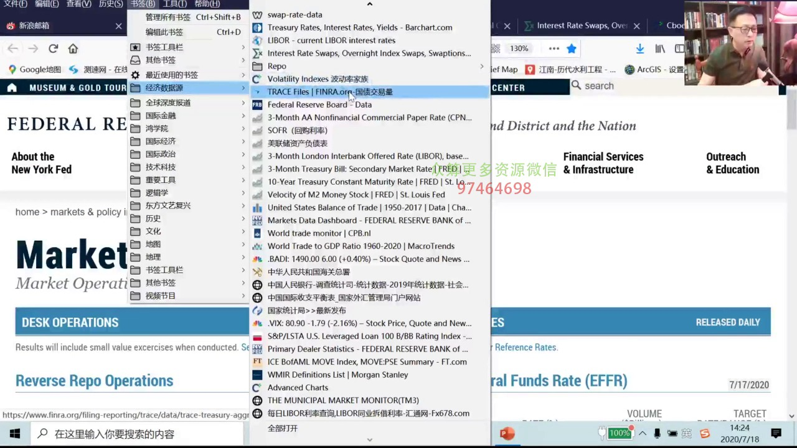

看起来最方便我也认为是这样所以最好的方式还是把找到一个有效的工具和有效的这种专业软件或者你去购买也行

<strong>All subtitles</strong>

> 看起来最方便我也认为是这样所以最好的方式还是把找到一个有效的工具和有效的这种专业软件或者你去购买也行

---

### Slide 34

然后把我们跟他所说的各种你关心的数据全部集中起来展现在一张一表盘上所以你每天打开你的这个打开你的网页你只需要到一个地方去看一组数据你就可以立刻判断现在经济市场的他的这一庞情况或者是不是出现了红色的报警...

<strong>All subtitles</strong>

> 然后把我们跟他所说的各种你关心的数据全部集中起来展现在一张一表盘上所以你每天打开你的这个打开你的网页你只需要到一个地方去看一组数据你就可以立
> 刻判断现在经济市场的他的这一庞情况或者是不是出现了红色的报警当然这个需要一定的IT的一些工作的经验这个是需要这是每个同学的情况不一样

---

### Slide 35

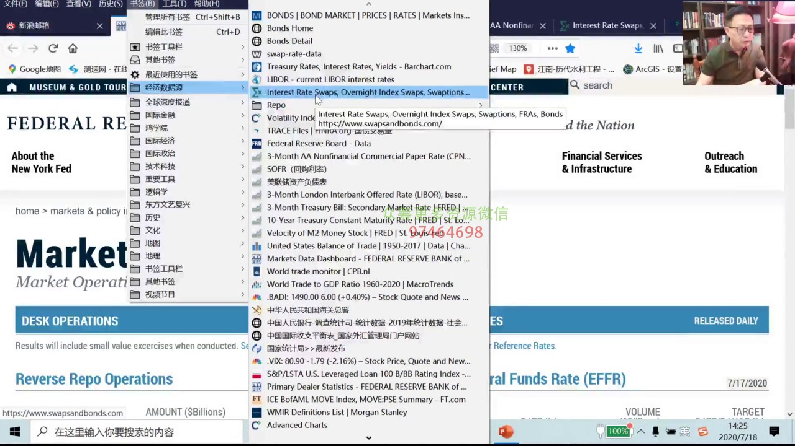

如果大家是你要是想要个非常取完的一个信息体系呢你可以去购买彭博社的他的服务中端当然这个价格是比较贵的比如说服务中端的价格大概一个月是2000多美元吧一年是2000多美元所以如果你是在金融机构工作那当然...

<strong>All subtitles</strong>

> 如果大家是你要是想要个非常取完的一个信息体系呢你可以去购买彭博社的他的服务中端当然这个价格是比较贵的比如说服务中端的价格大概一个月是2000
> 多美元吧一年是2000多美元所以如果你是在金融机构工作那当然是机构是一定会给你购买的但是彭这个彭博社的他那个问题就是信息量太大你还必须要摘远出你真正对你来说有价值的和你关注的这数据

---

### Slide 36

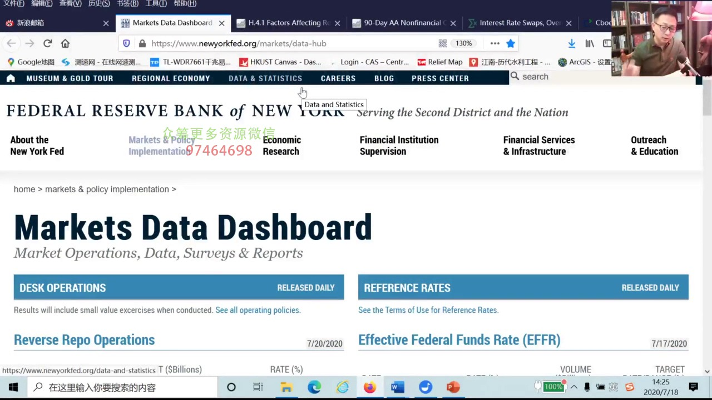

但是对于一般的我们的普通乐学院来说你花这么多钱去购买这个信息和数据显然就不一定值得所以有一些替代办法其实我刚刚给大家展现的这些网站就是一些替代的思路

<strong>All subtitles</strong>

> 但是对于一般的我们的普通乐学院来说你花这么多钱去购买这个信息和数据显然就不一定值得所以有一些替代办法其实我刚刚给大家展现的这些网站就是一些替代的思路

---

### Slide 37

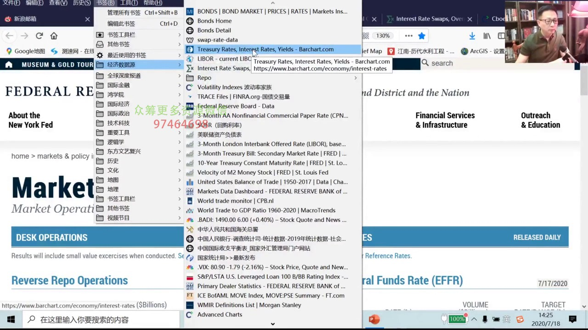

这些替代思路是你可以你其实可以通过剑进的办法把市场中最重要的数据集中起来而且价格很便宜

<strong>All subtitles</strong>

> 这些替代思路是你可以你其实可以通过剑进的办法把市场中最重要的数据集中起来而且价格很便宜

---

### Slide 38

有很多服务甚至是免费的这种办法我觉得可能对多数同学来说更适合一些好 我们再看下一个问题

<strong>All subtitles</strong>

> 有很多服务甚至是免费的这种办法我觉得可能对多数同学来说更适合一些好 我们再看下一个问题

---

### Slide 39

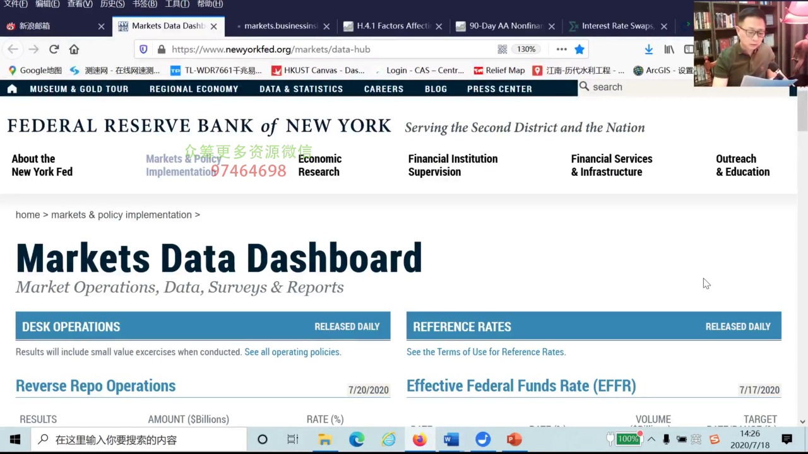

第三问题就是松老师讲套了美国金融但很少设计到欧洲金融有没有时间再分析了欧洲市场呢也许他们有共性但肯定有很多不同点欧洲金融市场当然是一块独立于美国的金融市场他应该能成伦敦为中心的海外美元市场还有欧洲大陆...

<strong>All subtitles</strong>

> 第三问题就是松老师讲套了美国金融但很少设计到欧洲金融有没有时间再分析了欧洲市场呢也许他们有共性但肯定有很多不同点欧洲金融市场当然是一块独立于
> 美国的金融市场他应该能成伦敦为中心的海外美元市场还有欧洲大陆的你德国法国为中心的欧洲大陆的金融市场这两个市场实际上还不太一样各有各的规律比如
> 欧洲大陆国家其实跟中国一样他比较他的整个金融体系最大特点是他还是以这个贷款比较传统的这种方式作为金融的主要手段只有在英国美国还有这种所谓安博
> 罗桑迅这个文化中间交易也就是货币市场他的重要性还有他这个这个影子银行和货币市场这种这种包括套利啊这种行为才极其了旺盛而在大陆系的国家不管是欧
> 亚大陆的东头还是西头不管是中国日本还是这个英国法还是这个法国和德国乃至其他的欧洲国家这些国家相对来说没有这么强烈的流动性和这个交易套利没有这
> 么强烈的充动当然在我看来这可能是有历史原因的因为安博罗桑迅在五百年以内吧他主要是靠海上贸易所以他对贸易主要贸易起源的国家特别重视这种资金的周
> 转资金周转的速度和效率特别重视低买高卖或者叫这个差价就是商品的套利我们说贸易嘛他根本上就是一个商品的套利那么加快资金流动速度实际上就相当于我
> 们对冲基金在套了一个很薄的力量的时候加段杆放到他的背书加快资金流动讲究资金效率其实就是在加段杆你如果一年只做一次生意我一年做十字生意我当然就
> 比你赚得多所以这个从历史干念中延伸出来的现在的金融体系基本上反映了欧洲大陆国家他们的商业贸易跟海洋贸易国家存在着根本差异所以从这样的文化基因
> 进化出来的两种金融体系也是特点非常不一样的你比如说这个应法他的股票市场就没有就是德法他的股票上就没有英国和美国那么宣销那么热闹你比如说货币市
> 场他的影响力那在美国英国那就是起到主导性的作用货币上来影响整个全国金融体系内所有的利率的水平但是在德法这样的国家他的银行贷款就像中国一样银行
> 贷款这种间接融资手段是最重要的决定利率的基本手段货币市场实际上是被贷款这个唐大的唐人大户所带动而在英雷正好相反英雷是货币市场决定其他的所有贷
> 款其他所有的金融的利率货币市场是心脏而在中国德国法国贷款才是金融的核心虽然我们现在的强调要发展直接融资发展债券发展货币市场但是显而易见重新还
> 是在银行贷款这个跟历史起源就有非常大的关系当然你要想把这个话题全面展开的话我们今天这个答案已肯定是不适宜的所以呢我想关于欧洲金融问题我们会在
> 核心课里面会展开当我们讲到日本金融欧洲金融还有外汇市场等等这都是为了一系列核心课要做的内容通过这些办法包括我们以前的核心课通过这一系列课程吧
> 让大家逐步建立起来一个全球金融市场它的连贯运作的你要理解它这套连贯运作的背后的齐轮体系各个不同类型的市场不同特点市场它的官策的指标的重新也不
> 一样比如我们在分析美国市场就特别强调货币市场的重要性五个核心的货币市他们中间怎么变会影响到传导到市场中的所有角落那么会产到到全世界那么从这个
> 角度来说我们需要一个系统的课程来进行完善第四个问题宋老师你好关于核心课第五十八五十九奖中的OIS指标没有听懂OIS是个什么样的概念咱们在核心课里面我记得我专门有一张图货币市场图

---

### Slide 40

在货币市场图中讲到了这个OIS这个概念这个货币市场图这个在这如果我们大家看这张图的话

<strong>All subtitles</strong>

> 在货币市场图中讲到了这个OIS这个概念这个货币市场图这个在这如果我们大家看这张图的话

---

### Slide 41

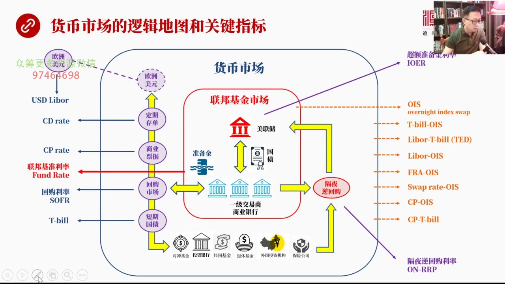

我们会看到货币市场包括中心的联邦基金市场欧洲美元市场定期存单商业票区回够短期国债那么在这中间联邦基准利率是这个利率是在这他反应的是联邦基金市场这个实质的水位美联储是通过吞吐国债来调节准备金这个磁子他的...

<strong>All subtitles</strong>

> 我们会看到货币市场包括中心的联邦基金市场欧洲美元市场定期存单商业票区回够短期国债那么在这中间联邦基准利率是这个利率是在这他反应的是联邦基金市
> 场这个实质的水位美联储是通过吞吐国债来调节准备金这个磁子他的水位然后来间接影响联邦联邦基准利率所以美联储加稀实际上是回收也就是把国债透出去把
> 流动性收回来实质准备金这磁子水位下降下降之后前少了利率就涨了如果是降稀过程相反道理一样所以在这个过程中美联储通过调节准备金这个水磁子来影响联
> 邦基准利率这是一个政策性的利率美联储他的政策利率OIS利率在这里OIS他的权成就是隔夜的这个基准利率的吊漆这个index指责什么如果在美国指
> 责是这个利率指责是联邦基准利率如果是在法国英国德国指责是当地的基准利率或者当地的最重要的利率如果我们以美国金融市场来说那当然就是指责是联邦基
> 准利率关键是他到底是怎么算的这是什么意思OIS讲的是双方交易的双方进行了一个利率吊漆的这样的一个操作有一方是作为固定就是固定方就是我要一个固
> 定的利率另外一方他是要一个波动的这样的一个状态其实我们可以说就是一种浮动和波动这个固定和浮动两者之间的对度为什么有人要固定自己的利率水平就是
> 因为他担心他有一种原因他担心利率波动会对他的资产造成损失所以他说我现在需要买一个保险这个保险要求我的风险对架注意啊所有衍生产品我们通通可以把
> 他理解成保险利率吊漆就是买利率的保险我要一个稳定值这就是我要买的保险我的风险对架承诺我一定会给你这个固定的利率那么在这个过程中向你卖保险就是
> 向你保证一定给你固定利率的这一方要承担波动的风险因为他在波动方你要固定的他要波动的所以这两者之间是一个对度关系你是买保险的他是卖保险的所以在
> 浮动方的一策永远是卖保险的他卖什么卖的是利率的保险那么我们以时就是我是固定方我是浮动方这个对方是浮动方浮动方以什么作为一个对赌或者双方在对赌
> 什么呢赌的是联邦基准利率浮动方认为联邦基准利率在未来一段时间里面可能是一个晚上也可能是一个星期或者一个月三月他认为这个浮动的这个就是联邦基准
> 利率的浮动范围是这样的范围而你认为我不管他是一个什么范围我就要一个固定感所以双方是以美国联邦基准利率作为一个赌注来对赌这个就是OS的基本的定
> 义那么他最后成交的是什么呢什么叫OS呢成交的是我这方固定的这一方就是我要买这个利率保险我要把它买在比如说现在美联储的基准利率是0.25我就买
> 到0.27我认为我要保证我一定要得到这个利率好最后这个成交的价格就叫OS实际上他反映了跟我对赌的那一方和我这一方买保险这一方双方的市场中的供
> 求关系的此生比较最后形成一个比如说0.27这样的一个OS利率这个OS利率是一个什么样的利率呢实际上是市场对于未来一个月一天或者一周反正未来一
> 段时间大家预期美联储基准利率会变成什么样我们可以这么来理解OS所以OS基本上他是对赌美联储的联盟基准利率所以很多认为OS是没有风险的因为他是
> 赌的是联盟基准利率所以这就是大家脑子面轻要清楚有一个干扰首先要非常清楚OS最后是一个固定的利率他将会非常靠近联盟基准利率比如说联盟基准利率现
> 实是0.12%他也应该在0.12%上下一点点所以在这个市场中OS利率被认为是市场化的就是联盟基准利率是未来储定的市场认不认同市场是不是也这么
> 看呢我要看OS利率所以OS利率在很大同上标志着美国的核心的联盟基金市场的未来一段时间市场化了判断是不是跟联盟基准利率一样或者非常的靠近如果这
> 两者非常靠近那说明这个市场运作是正常的如果OS跟联盟基准利率产生了差异那么就说大家认为未来这个市场的资金将会变得紧张虽然这个情况非常罕见但是
> 也的确存在和出现过所以呢这个OS利率我们这同学问的我过去很多同学都在这个问题上比较比较糊涂或者比较迷糊OS利率是利率掉漆是隔夜利率掉漆以谁做
> 基准以联盟基准利率他是交易双方中固定那一方最后大家达成的一个一个这个利率的利率的一个利率值吧双方最后达成的这个交易所以这个是我们判断现在越来
> 越多了金融市场或者金融工具把金融严生人品大家都选择OS作为一个定价的基准所以OS他在金融市场中的使用的普遍程度越来越高这个OS利率现在变成了
> 一个非常主要非常关键的一个判断美国资金市场的一个紧续程度的目标那么其他的很多利率我们看到市场中你比如说Liberliber减去OS这什么意思
> 呢Liber我们知道是海外美元伦敦那边银行差跌利率反映是海外美元的资金紧张程度OS反映是美国联盟基金市场的资金紧张程度所以两者之差是反映着海
> 外美元那个巨大的池子跟美国联盟基金市场这两个池子之间是不是连通了连通的效率怎么样连通的阻碍有没有阻碍就是比较两个池子的水位所以我们看到谁减谁
> 谁减谁都是在说我们这个问题两个池子的水通不通通的效率怎么样如果不同或者如果中间有阻碍有大量的阻力那么这个两个差异就会非常大这个非常大表明什么
> 表明金融市场出问题了因为在正常状态之下两个所有资金资金池子动员完全打通如果池子不通说明金融市场出现了不同的市场出现不同问题所以我们看到这一串
> 比如说TBL减OS短期国债跟联盟基金市场这两个资金的水池是不是连通连通情况如何来不儿减去TBL那就是海外美元欧洲美元跟国债短期国债这两池子是
> 不是连通了还有library 减OS就是海外美元跟这个联盟基金市场这个FORWARD和OS就是指着这个对Library率这个FORWARD 
> rate指的是对Library率未来的预期某种意义上就像OS对联盟基准力率的预期一样所以这两个概念类似于OS跟FATRATE还有Swabra
> te和OS职场就是利率较期利率较期和OS这差反应的利率较期市场那是另外一个主要是在伦敦运作全世界主要的利率较期的产品它的清算它的大量交易都发
> 生在伦敦某种意义上也是反应了在伦敦那个市场中的利率水平跟美国联盟基金市场的利率水平这两个池子相比到底差距有多大CP剪决YSCP当然我们知道是
> 商业票剧这个池子水跟这个池子连盟基金市场这两个池子水位差不多还是差很多连通情况如何还有包括CD和YS也一样还有CP和T bill就是定基存还
> 有这个商业票剧和短期国债这两这两个水池通不通然后连通效力如何所以我们把这些所有的概念全部搞明白之后无非就是个水池子两个水池子之间的水位进行对
> 比而已如果水位差距太大说明这两池子总有一个会出问题总有一个出了问题因为水位不应该有这么大差距所以把这一套东讯撤离理解之后这个东西难吗我因为理
> 解它的智商只需要出东西哪他小学别都可以正确理解关键是普通人对金融最大的不理解或者最大的混销在于搞不清楚这些概念到底首先脑子买没有这张地图没有
> 地图当人家说YS说你一下就被绕继续什么什么YS是啥玩意你被他依扰他再说一串属于你就晕了那就完全听不懂他的黑话所以如果你脑子买装着这张地图他讲
> 了YS而且你又对这个概念非常清楚他指的是在图形中指着哪块是哪个尺子跟哪个尺子水位到他还想绕继续你吗不可能因为你有强这个有非常强大的这种这种图
> 形还有对概念深入的点你以后有非常强的这种推理能力而且一听只要他说的靠不靠谱逻辑上正不正确所以这张图是我们所有同学都应该说是我们核心客里面这个
> 逻辑复盘最重要的一张图一定要把这张图印的脑子里要把所有这些概念他对应的磁子水磁子之间的这个差异性把这些概念反复的反复的这个在脑子里过一遍一遍
> 是这样过实面摆变牵变直到你形成一种本能一听一看立刻就知道对方在说什么要达到这种实验程度然后你听财经新闻你看国际实势你看电视中讲美联储家习或者
> 现在有个专家说海外美人士很紧张Liber和YS之差跳成了五十个几点你才知道他在说什么要不然的话关键跟不上所以这张图是我们理解美国金融市场理解
> 全球金融市场的一个关键第五个问题算是好我想请问您在核心科中所说的这些领先指标有没有具体的浮动空间就是说这些指标浮动多少提示这多晚七可能发生危
> 机还有就是美联储二次放水会在二次危机爆发之前还是之后我们在这里找一些找一个具体的例子吧比如说我们就以这张图来说

---

### Slide 42

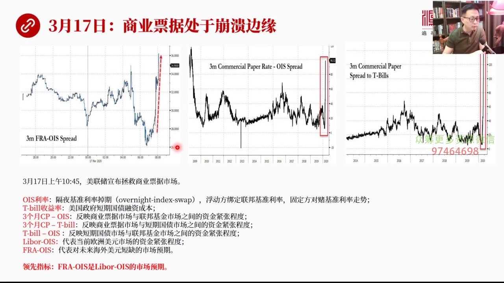

这张图我们可以看到是这有三个指标远期利率和YS之差三个月的这个商业票剧和YS之差还有三个月商业票剧和TBL之差我们可以长年可以通过一个长期的趋势来看比如说这张图就是长期图从2008年一直到现在十二年你...

<strong>All subtitles</strong>

> 这张图我们可以看到是这有三个指标远期利率和YS之差三个月的这个商业票剧和YS之差还有三个月商业票剧和TBL之差我们可以长年可以通过一个长期的
> 趋势来看比如说这张图就是长期图从2008年一直到现在十二年你从十二年中间来看三个月这个商业票剧利率和YS之差它的变化的趋线就能看出来2008
> 年09年冲到了100个几年以上这说明什么严重的问题商业票剧现在刚才那张图商业票剧是货币上中一个组成部分YS是指联邦经济市场大家对未来的一种预
> 期这两个市场如果出现它本来都在货币上之内应该完全临通如果它现在出现了100个几点的落差也就是说商业票剧币被凍结了或者商业票剧没有交易了没有流
> 动性了才会出现这么高的立差那说明什么商业票除了严重的问题从历史的这个曲线我们大概可以判断出出问题的一个幅度也就是我们这个同学所说的有没有一个
> 明确的界限或者说有没有一个浮动空间这种浮动空间要靠自己来判断如果从这张图上我们看到三月份比如说三月十六三月十七号你看的这个两者之间商业票剧和
> YS是差这个立差飙升到了95个几点你看这张图就知道哇塞这个问题相当之严重啊严重到跟零八年经济危机差不多的程度远远超过这十二年中间其他的这种不
> 动他的政府所以基本上可以判定这一定是一次严重的危机但是如果说只有六十个几点的差异呢这还不一定因为2016年也出现过超过六十个几点的这样的一个
> 浮动浮动所以说你可以判断超过五十个六十个几点这可能是标志着这个市场存在了潜在重大的风险但是还不能判定它一定会出现严重的危机但是冲到了95你知
> 道这个事儿一定是出事所以在我们说有没有是一个固定的指标没有所有东西都是靠你的经验靠历史数据靠你的分析和判断这张图我们一看这显显一见这个这个精
> 神出了大问题三个月上一票剧跟短期国债出现了这么大的这么大的差异远远超过2014年以来六年的水平你知道这个市场一定出问题了所以这某路易上来说不
> 是靠不是靠某个某个人规定的一个参数而是靠你的经验和职举这个经验不是没有道理而是根据历史数据形成的那么他他第二问题是还有美人厨的二次放水后面二
> 次放水会在二次危机爆发之前之后一般来说我们看到了这次两宽宗是出现的新冠疫情之后我们看到去年9月美国前方之后出现的回够注资所以美联储下一次我认
> 为同样会在危机出现之后正好相反其实美联储现在有收缩的意思就是跟我们很多人认为就是美联储这个宽宗要吃下去其实不对美联储现在已经有收缩的意思了为
> 什么因为对于任何一个货币当局来说作为中央银行在经济你如果说经济很好如果说你说经济负责还不错然后你还用这么极端的货币刺激手段来刺激市场自己经济
> 起的话显现是这个中央银行是会受到很多责难的他是有政治压力的就是你不说很好吗咱们是微信展台那你还要硬这么多商量干吗那你是是你傻呢还是市场傻呢所
> 以人们总是会质疑一旦市场平静之后中央银行如果还不退出的话人们就会质疑他甚至会把所有责任往他身上推所以通这个即便是考虑到政治上的可行性美联储也
> 会考虑现在经济上好了那么他他要怎么办呢我得撤我得收否则的话我就要承担巨大政治压力所以呢在这种情况之下这个过程他是收的过程收到什么时候收到经济
> 上再次爆破的时候然后在那之后再进行货币库上才说得过去所以美联储在我看来他即便知道可能还会出事但是他在出事之前也不会轻易动手这个道理就是大家仔
> 细去琢磨琢这个道理是什么呢就是我在危机出现之前应该大量潮票吧危机给压住了那么所有人就会问如果你不硬潮票危机未必会爆发你为什么这么干其实他在危
> 机之前释放货币虽然能够提前压住但是他会受人一笔这从政治角度来说这个来考虑的话是不明智的而在危机之后所有人都求他求他你赶紧超票啊他在印政治组立
> 最小而且还能赢得大家的在意换成你我相信换的你做美联储主席这位上也会用这样的思维方式来思考问题所以即便美联储知道未来还会出事他也不一定会提前做
> 因为提前做没有没有功劳连苦劳大家都不满账那有什么意思呢做这个事所以这个事我们需要考虑的正上了一种因素还有一个问题丧老师查到了资料美联储和他的
> 背后时间人物都有那么他们会认评经理机会到直到爆炸而不动于中吗其实我刚才所说的就是在回答这个问题对他来说他的考虑我做这个事既要大家欢呼对我这个
> 行为称赞同时我还不悲太大的责任所以在这种情况之下危机爆发之后我出手我是拯救别人危机之前我出手根本就看不出来有危机人家会指责你这么干不是胡来吗
> 谁说会有危机啊根本不会呀所以到那个时候你怎么说呢怎么说怎么被动这就是美联储他们的很多人的他真是想法是什么真要推动一个政策比如说我真要大规模印
> 超也必须要显得我是被迫的我真的是无奈市场把我逼到这个范儿了而不是过故意要放水造成朋友分化正家里别对着我来要对着新冠去或者要对着某一个这个危机
> 去实际上人同此心这就是我们看到了虽然他们可能知道会出问题但是他宁愿在危机之后爆发之后动手而不会在之前这个同学接着问这些人真的会为了为了自己的
> 利益而牺牲美国的整体利益吗我觉得这个问题就显得我们同学这个好像是第一次认识政治政治是什么政治是首先政治家的本能是先要保存自己如果自己都不存在
> 了还谈什么其他的国家利益谈不上了所以所有的政治的本能都是首先求自保首先保住自己然后我来改天换地如果把我都整没了还谈什么改天换地别人改天换地跟
> 我有什么关系这是政治家的执举往今来吧从有政治有人类文明开始所有政治动物或政治家的本能都会这么考虑问题这就是我们其实读读历史你会你会发现所有人
> 都是这么想的那么他还有个问题这次他们将利用危机来收获哪些财富收获财富我们其实今天晚上我们会讲到讲到一些这个具体的例子你比如说咱们可以看这个我们可以看到美国的这个出现危机之后你看看美国的三大银行高盛

---

### Slide 43

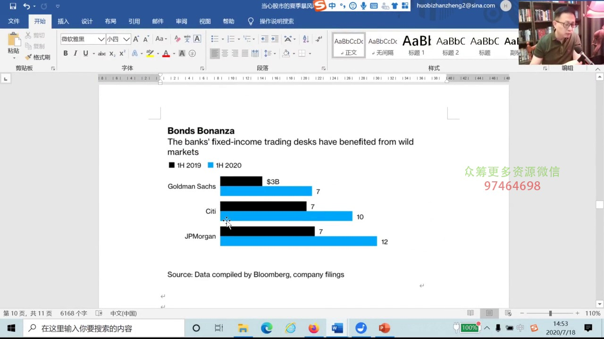

花旗和捷片默根这三个银行他的这个当然他的贷款肯定会出重大损失但是他的交易他的固定资产收益这个部门赚了聚额的利润比如说高盛他比这个今年上半年和2019年上半年对比他这个交易量就交易产生的利润发了一倍多七...

<strong>All subtitles</strong>

> 花旗和捷片默根这三个银行他的这个当然他的贷款肯定会出重大损失但是他的交易他的固定资产收益这个部门赚了聚额的利润比如说高盛他比这个今年上半年和
> 2019年上半年对比他这个交易量就交易产生的利润发了一倍多七十亿去年是三十亿花旗一行今年是一百亿去年上半年是七十亿捷平默根今年上半年是一百二
> 十亿去年是七十亿为什么这三大银行获得这么惊人的固定收益产生的交易交易的这种利润呢当然是美联储给的红包了就是美联储说我要大规模发行国载这些人都
> 是成销的然后他会正义大比费用然后美联储说我要搞一系列救援机制这些人很多人都是在中间做交易的所有社交美联储要买的东西都是经他们之手所以中间的利
> 润大大的友这就是经微机说什么东西问这个叫这是什么刺穹傅啊刺穹傅的像美联储 应超损失是全所有全世界持油美元货币的人损失是他们的购 money等
> 于是损失他们的财富以这些人拿走了呢这三个就是拿走了我们财富的显然然是人选他們的交易增加這是因為美人處硬超行為導致他們的收入暴漲他們的收入是源
> 於我們的如果你手上有美元中國是這個外務局被人用美元是源於你的損失所以這個一輪回你發現這麼一操作那就等於是中國的財富或者叫財富的購買力被大規模
> 轉移到了類似這三個三個大金融機構的漲上所以財富遊戲怎麼玩的就是這麼玩的搜刮誰的錢誰求美元全界誰求美元誰就是被檢養毛的被割韭菜的當你說我不想被
> 人割韭菜我不讓美元行不行那也不行因為你要是你要是沒有美元那你在世界上基本上是這麼難行你想發展貿易對不起沒人跟你做因為你支付的東西我不要或者說
> 我要進行轉賬投資做任何行為包括外商也沒辦法對你進行投資因為你那如果美元內於制裁那你什麼錢也收不到什麼錢也花不出去花不出去國際貿易幾乎挺擺那麼
> 這個國家的經濟就完蛋了所以你還必須得吃有持有之後你還必須得被他檢養毛檢了養毛之後你很抓狂但是你毫無辦法這就是美元霸權它的實質好我們再看下一個問題宋老師

---

### Slide 44

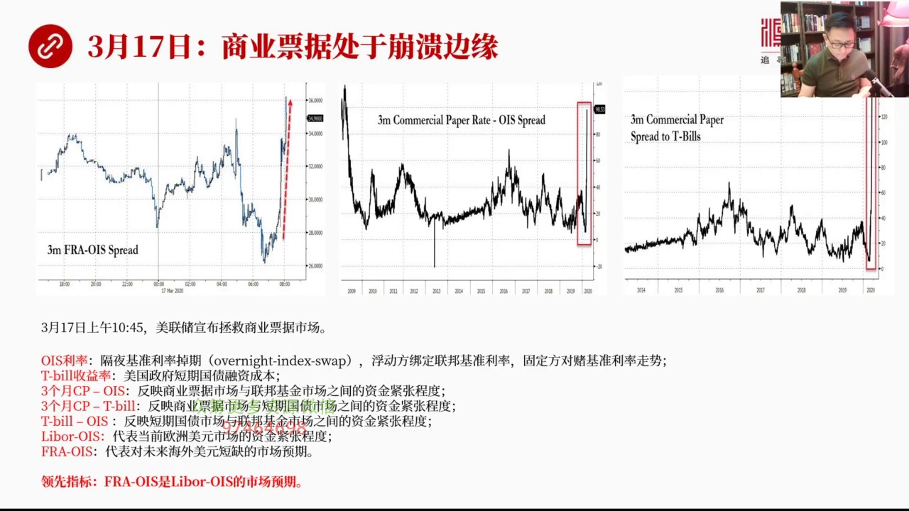

疫情發生以來美聯儲僅僅用了3個時間資產費代表規模就暴漲3萬億美元達到了7萬億美元以上有人預料美聯儲可能把資產費代表扣得到10萬億美元這幾位這黃金價格將會達到4000美元的水平你認為黃金白銀的牛是來到了...

<strong>All subtitles</strong>

> 疫情發生以來美聯儲僅僅用了3個時間資產費代表規模就暴漲3萬億美元達到了7萬億美元以上有人預料美聯儲可能把資產費代表扣得到10萬億美元這幾位這
> 黃金價格將會達到4000美元的水平你認為黃金白銀的牛是來到了嗎那麼在未來一兩年之內黃金是否能夠到2000萬美元左右白銀是否能夠在上50美元呢
> 還有就是你認為目前把金還有繼續上漲的趨勢嗎首先我覺得我們不能簡單的和挨板來看美聯儲資產費代表和貴金屬之間的價格或者說影響貴金屬價格的重要的因
> 素有哪些比如說我們能不能忘記一個印只要基礎資產表貴金屬資產表上漲美聯儲央行的基礎資產上漲黃金價格一定會上升我們能不能做出直觀的這種現性的邏輯
> 推理我覺得這是不行的為什麼呢因為美聯儲在擴大資產費代表的過程中我們可以看到他們沒有又發通過紅帳或者通過紅帳的問題不顯著一個主要原因是這些擴張
> 的貨幣怎麼擴張呢就是美聯儲印鈔買國債這是最主要手的無限兩款中印鈔票買MBS好我們設想這個貨幣我們假如自己是一張鈔票美元被新印出來之後那麼它通
> 過夠買24個交易商倉庫面的國債而進了24個一交易商的資產費代表然後這些錢去了哪裡呢其實又通過金融體系在金融體裡面這些21個一交商有錢了所以他
> 們可以貸款或者這個融資或者給其他人從他其他人手上再收國債比如從他的下家把資金提供給下家他是一層一層他是一個戶戶一層一層的這種戶戶然後這些錢到
> 了下家之後然後再到他的下家一層一層的把資金注入到一交商及其底下客戶群的他們的這套體系當然中間也包括它的重要客戶對重基金對重基金有了錢之後他們
> 拿來幹嘛拿來買國債買了國債之後又到回購市場做支揚支揚了錢之後又去買國債然後又去支揚然後又買國債又支揚你看看沒有這個錢始終在經體之內周轉而沒有
> 流出去對重基金經理可能會每天要吃飯每天要喝新華克的咖啡但是那才花幾個錢大量的資金都在經濟之內通過影子銀行不斷在放大資產的規模而根本沒有流向勢
> 力經濟在這種情況之下那麼外在的這個在經濟之外這個市場並沒有得到足夠的現金那麼這些市場的所有的物價同時在加上消費者們收入不好疫情這麼嚴重大家沒
> 工作了這些都使得夠買力也弄不足你一方面是錢沒有勇向勢力經濟一方面是消費者更買力不足所以物價它肯定起不來從傳統一來說黃金是對重通過工藏的主要手
> 段但是如果你看市場的物價甚至出現了通過通縮的趨勢通脹沒有起來那麼金價一定能起來嗎這是第一個問題金價不一定跟著這個市場分在表走因為通過膨脹沒起
> 來好我們再從另外一個觀點來看另外一個觀點就是什麼呢黃金是對重所有金融風險的最終對重者我們知道我們做任何套利對重金融做任何套利他都要做風險對重
> 而他的風險對重你比如說我吃有大量的國債就像我們以前講到的對重金金吃有大量的國債而且自己是循環體借了很多的槓桿他為了預防為了保護他的資產萬一利
> 率上漲了我只是資產一爆跌我不是虧從慘重我家這麼多的槓桿所以他一定要在利率調期上做保險要在利率調期上買保險來覆蓋來預防利率上漲給他帶來的損失這
> 個叫對重但是金融上的對重你會發現你這種資產這種配置方法我選利率調期另外一種配置方法我選另外一種非常具體的對重辦法但是當金融體系整體爆發危機的
> 時候所有對重辦法都會失效就是風險評價基金策略失敗就是這個原因所以在那個時刻實際上市場上需要一個普遍對重就是通用對重的手段不管你是股市暴跌還是
> 債市暴跌還是什麼暴跌我都能夠對重這就是現在對重基金經理非常喜歡黃金的原因他們認為黃金是個通用對重的手段只要金融市場一波動或者出現巨大陣的那麼
> 我只有了這個我的這麼大的資產我與其去買一個非常具體的利率調期這個保險我不如吹有黃金因為在這種地方之下黃金可能會變得比較堅挺所以這種行為也會影
> 響黃金的價格當然最終的根本性的影響是什麼是大家對於貨幣體系的信心其實我們現在看到黃金價格路段上著是大家對於這套體系的信心產生的動搖也就是說大
> 家認為美聯儲最終不得不走向付利率如果走向付利率一旦走向付利率美人資產進入了一個非常可以說話實在了一個新的通道之後黃金它的價格就會大幅上漲因為
> 如果說你的稅率為富我持有金融資產意義就不存在了我持有指幣我持有美元我持有任何主要貨幣的動機都不存在因為我在虧損那個時候黃金它實際上是在對衝整
> 個貨幣體系的風險它的重大價值就體現出來所以你要真要長到一個這樣的一個級別4000美元或者你說了多少美元一定是出現了貨幣的嚴重以及比如說美元調
> 到付利率這樣非常嚴重了後果整個美元的資產的收益率降到了付數這會激發整個金融市場對於美元乃至美元所代表了整個的性用貨幣體系會產生巨大的恐慌在那
> 種情況之下金銀把這些貴金屬才會跳升但是如果爆發那一點意味著全世界經濟將會大亂金融市場將會出現嚴重的混亂恐慌就不是現在我們看到三億風爆這個級別
> 了要比這個要大一個數量級所以貴金屬它真正的價值黃金真正的價值是在對衝整個美元體系的風險只有到那個時候我們才會看到黃金的價值被重新發現現在黃金
> 還僅僅是對衝通往膨脹對衝金融市場夠穩定對衝美元的一些較小的這種動盪的一種對衝手段還沒有把它上升到一個更高的層次這還需要等更大的危機人來到其實
> 所以我們在這預測它的價格就沒有什麼太大意義2500這其實在我看來這仍然是在對衝普通的金融體系的這種動盪的危機4000美元以上我覺得那就是一個
> 更高級別的了那麼白銀在什麼時候它能夠大上大上實際上是要出現美元整個體系的危機它再次被貨幣化以後跟黃金的作用類似它才會有一個跟現在果然不同的一
> 種價格其實說到底就是一切我們要看美元體系的穩定性美元體系的穩定性經過這一次3月風暴之後我覺得又再次受到削弱所以我們非常關心下一次再次出現金融
> 動盪的時候整個市場將會出現什麼樣的情況下一次會不會又發真正的體系的危機這個是我們需要高度關注的第八問題宋老師能不能說一下美元計價資產到底是什
> 麼美元計價資產為什麼需要吃吃去不斷的現金流美元資產去個簡單例子吧比如說我是日本人家養老機構然後我手上有大量的貿易順差所賺回來的美元那麼我拿這
> 個美元買什麼呢首先我會買很多美國國債或者美國的企業債這些資產叫什麼當然都是美元計價資產同時我這些錢還可以貸款通過銀行給香港的貿像公司我建就是
> 以美元的貸款形式給他所以我會形成債權或者叫貸款是以美元計價帶給香港的貿像公司他借我一千萬美元我帶給他同時還有人在香港市場上發現一千萬美元的國
> 債企業債我又購買了這些企業債這些企業債也是以美元債券的形式發現了所以我又擁有了美元計價的企業債這當然對我來說都是資產我把現金全部轉換成這些資
> 產行不行可以也就是說我可以持有美元貸款我可以持有美元的債券我可以持有美國的企業發行的美國的企業債就是在海外市場上可以存在著美元貸款海外市場可
> 以存在美元債券海外市場可以存在著很多類似的美元拆解所形成債務債權關係而我用現金去持有這些債權對我來說這都是我的資產好這些資產我越來越多多到一
> 定程度之後我會擔心的我會擔心什麼呢萬一美元到底萬一利息上漲出現這兩種情況我是不是這個資產都會貶值呢比如說美元價值要跌了那我持有這麼多美元我損
> 失慘重如果利息抱掌比如說每年主價稀或者每年主社會率美國的國債社會率大漲我持有這些國債我持有這麼多資產價格也會下跌因為收益率大漲對吧他會影響整
> 個力率水平這個水平高了我的增加低下來了所以我持有美元越多我越需要防範類似的風險我怎麼防範我當然要到金融演成市場中去買保險买各种各样的对冲好,
> 不管是我做利率调期的这种对冲防止利率的风险还是我做外汇的交易来防止汇率下跌美元下跌过造成损失我在这些金融市场上交易的时候我主要使用的是美元进
> 行交易比如说我买利率要7当然是要支付美元了我支付的日元人要不收所以我持有了美国资产美元计价资产越多而且需要买保险而这个保险全世界主要保险全都
> 是以美元计价的所以我花出去来还是美元来买保险持有资产量越大美元资产量越大我越需要大规模的够买保险这需要什么?需要美元现金美元现金从哪来我一定
> 要就是我持有资产量越大我越依靠美国的精神提供现金这是资产你要是负债呢你要是因为有大量的美元负债呢我借了好的美元债我我要还哪每到一定时间我得还
> 稳负息还什么还美元所以我无论是持有大量海外无论持有大量资产还是大量的美元的债务我都需要这个规模越大我越需要美元来帮助我对冲风险帮助我提供这个
> 滚动滚动的这些资金的需求或者帮助我持续保持我这个债务的水平形象说这就好像是一个300斤的大胖子他是靠吃糖把自己立刻吹肥了其他身体越重体重越沉
> 他越需要继续吃糖因为糖要断了他人就不行了所以我们看到一个超级大胖子他反而越来越需要食物而不能断掉他的食物美元自然正是这样所以我们现在看到了很
> 多人说美元在全球的这个影响力在下降不对因为美元出来了越来越多美元从美国流出来越多全世界持有了美元资产这样越大就越需要美元保证这个大胖子不被饿
> 死所以大家就更加以赖美元的供应所以这将造成全世界金融体系结构性的风险一旦供应的供应大胖子这个食物量要断了全世界持有美元资产都完蛋这就是我们看
> 到为什么每次出现金融动荡手都会出现全球美元荒美元荒是因为我们现在已经变成了的不是300金大胖子变成800金的大胖子了我们更加需要美国来提供食
> 物美国提供食物我们马上就活不了了所以全世界越是持有美元资产数量越多就越是依赖美国金融体系提供了美元对美元的依赖性军越强直到这个正循环这是一个
> 正反会体系直到这个正反会体系不多的吸收各种各样的能量最后外不能量不能保证它它只有崩溃只有到那个时候全世界的货币体系才会发生重大改变再次之前大
> 家知道这是有问题的但是摆脱不了除了这个问题还有第九问题算是你好你在七月十一号的客中还有六节这个美国金融危机的核心客提到了一些市场变化的新型指
> 标比如说美国外和市场中的商业票剧其他央行的货币互换Liber OIS之类的指标能不能相信说下在哪里可以获取这些指标实施数据以及这些指标之间的
> 逻辑关系和先后影响一遍我们在必要时候能够判断哪个市场可能会首先出现原爆点刚才我在一开始操作中已经给大家举了一些包括 OIS 包括Liber 
> 包括一些这些重要的力这个市场的力系的指标还有美联储的一个它的总的关于回够市场等等这些指标我刚才已经给大家看了如果说你要想了解更全的指标你比如
> 说刚才我们看到商业票剧的力率真的美联储网站上可以查到OIS 也可以查到还有这个T bill 这些都可以查到但是你如果需要一个更全面的更及时的
> 更全面的这个力率我觉得可能我能想到最主要的手段就是彭博的那个服务中端你可以一个月花2400美元去买这个中端这个它的数据肯定是最全的而且也是最
> 及时的当然它那个数据量太大就是太负担你其实用不了那么多它是把所有市场中哪怕一些很偏的市场中的一些数据全部收集权了它为什么这么赚钱就是因为这个
> 数据就是钱你只要知道怎么分析有逻辑你只要找到相关数据你当然对市场判断就会很准但是它们这个价格认为是非常非常的高对于我们同学如果不是专门做金融
> 的肯定很多人是不愿意负这个钱的如果你实在是需要那么你可以到彭博社去购买他们这个服务中端那么如果说要看这些指标之间的相互关系到底谁会影响谁谁先
> 出问题这个叫涉及到我们对金融市场那个一个总体的理解还是这张图不用这张图就可以把这个问题

---

### Slide 45

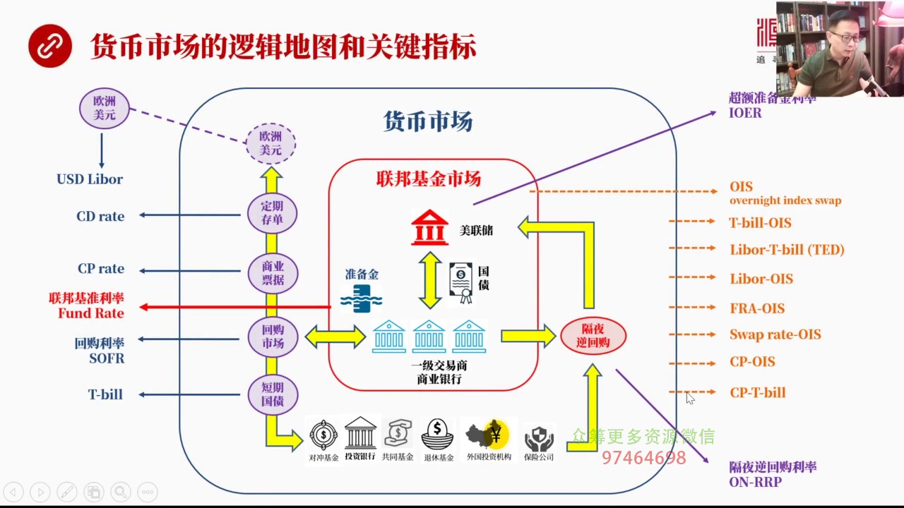

大概说清楚首先三亿金融风暴爆发的原爆点是在对重基金在国债立差就是国债套利中间出现严重问题然后对重基金在国债套利上出了严重问题之后导致了解上感解干感这个大潮以来注意所以对重基金都得首先使用回够市场都得使...

<strong>All subtitles</strong>

> 大概说清楚首先三亿金融风暴爆发的原爆点是在对重基金在国债立差就是国债套利中间出现严重问题然后对重基金在国债套利上出了严重问题之后导致了解上感
> 解干感这个大潮以来注意所以对重基金都得首先使用回够市场都得使使用回够市场来抵押融资所以大量解干哪意味着大量拋售国债套取现金大量人都在拋售国债
> 这个市场显然就被动结了因为没人做回够了大家都需要现金那么这个市场就会出现动结大美联储在三月份首先要救的就是这个市场然后这个市场出了问题之后引
> 发了商业票项也出问题也就是大概看上这么不好所以大量的商业货币基金从这个市场上撤出来流走就是商业类的货币基金流走的好几千亿美元这就导致这个市场
> 被动结住了商业票局被动结住了商业票局动结住了之后定期存单也被动结了这两个市场的重要性在于海外美元的主要货穷道就是通过这也就是比如说日本的银行
> 是在这两个市场发行定期存单来货取美元就是这些投资人用用美元他们把美元购买定期存单把钱送给了日本的银行或者日本银行在商业票局中发行商业票局融资
> 美元然后投到海外美元这个市场所以这两个市场被动结就是意味着海外的非常这个大胖子800斤的大胖子人都需要美元持续不断的供应这帮人得不到最重要的
> 两个市场他们的融资了也就是美元留下海外美元市场让两个最重要的通道被结断这导致什么情况导致海外美元市场拥有巨大的美元资产800斤的大胖子断了两
> 了这个体重越大海外美元资产这个规模越大越需要美元持续不断的供应这个市场立刻就会陷入崩溃就是我该对冲的风眼没有对冲那我资产出来的表决会露出个大
> 苦容这是拥有资产我该还美元在我还不上那就因为我委约无论哪种情况这个市场都会持有大量美元资产这个市场都会出现严重的暴跌严重下去之后人人都需要更
> 需要现金得不到怎么办整个美元体系海外美元体系这个资产市场会陷入可以说大地震超大地震那么如果说大家持有美元的下场是所有人都赔光了那么美元以后就
> 没人要这就会影响美元的海就是影响美元的全球化权所以美联储为了避免这个现场出现一定会从美联储这开一个直通车或者叫金融短路这就是货币互换这直接印
> 超把美元送过去然后你把日元送给我作为抵押然后我在打开那个通道送到英国央行送到欧洲央行瑞琴央行还有日本央行然后你们把各自货币送给我的作为抵押这
> 叫货币互换如果不打开这个通道的话那么美元市场或者让美元资产市场或者我们所熟知的美元霸权现在都已经不存在了全世界将会被电个个所以这就是金融它的
> 重要作用而且你越是了解这个它的重要作用你越是发现支撑全球化了整个这道体系中间这个脖子这个部分相当的脆弱800斤那个大胖子这就是脖子只有千比千
> 比那么细一旦这两个市场出了问题整个全世界的经营都会出现大问题全世界的银行金融体系都会出现严重的资产暴跌的问题换句话说庞大的800斤的美元资产
> 大胖子完全依靠一个千比千比那么细的脖子来从这两个市场输血最主要就是靠这两市场当然一些银行也可以给两代馆但是银行在金融危机式下什么也不会他们特
> 别紧震不愿意带所以他唯一来源就是这这没有了外汇市场就留中心就没有了然后这些美元大胖子就饿死了那么谁会影响这两市场对冲击金呢对冲击金稍有不顺就
> 把这两市场玩瓦这两市场移动节他就会影响全世界的经济发展这就是现在特别不合理的地方这是我们可以看到我用了一张图来展现这个问题全世界拥有88万亿美元的GDP

---

### Slide 46

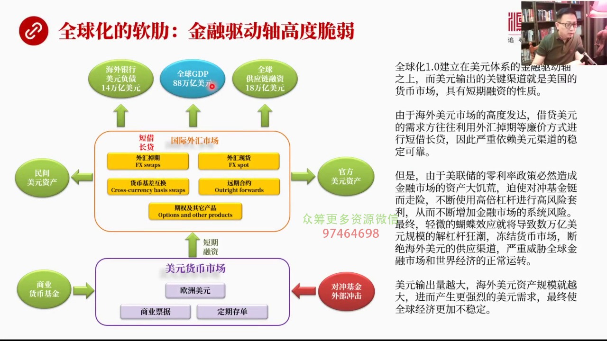

大量依靠外FDI国际直接投资海外银行复债有14万亿美元其实还有大量的非银行机构的这个资产也有17万亿美元全球供应链融资要用18万亿美元还有民间美元资产实际万亿官方美元资产也是将近10万亿所有要为直接资...

<strong>All subtitles</strong>

> 大量依靠外FDI国际直接投资海外银行复债有14万亿美元其实还有大量的非银行机构的这个资产也有17万亿美元全球供应链融资要用18万亿美元还有民
> 间美元资产实际万亿官方美元资产也是将近10万亿所有要为直接资产和为直接复债美元复债的全部要依靠外匯市场来供应美元而外匯长供应美元的主要现在最
> 主要通道是通过美货币市场欧洲美元商业票聚合定存在通过这来进融资这个大胖子就依靠这么细一个脖子在撑着而它的市场中的主要前货商也行了货币基金当然
> 还美国的银行体美国银行体系在发生危机的时候什么也指望不上同时影响这个市场还有外部对重基金的冲击他们要玩砸了玩200位杠杆就很容易把这个市场给
> 毁了这个市场一毁这帮人就会撤输贵资金那么这一标的脖子就死了这么大一个资产会活活了自己把自己给压死所以美元资产量越大越需要美元融资而越需要美元
> 融资提供美元通道这个非常窄的通道它的可靠性就越入这就是我们全球化现在面临真正的危险就在这儿好下一个问题请问孙老师OS Libert 远期OS
> 和远期 Libert 四个指标在哪里去找我刚才已经说了你要想找到这些东西可以看我刚才所说的那一网站也可以去买同伯社的服务中端第11个问题孙老
> 师好如果再次出现类似3月的危机美元会再次走墙根据地率管制国际资本账户开放会议稳定三者不可同时满足国内市场会放弃三个中端哪一个谢谢您的指点我觉
> 得我们不必去想什么三个不稳定三脚你不用这么去推就是你按照长理只能去推就行了不用受这些理论框架的束缚首先我们可以想如果中国再次出现3月金融风暴
> 会怎么样那肯定人幣会贬值毫无医院就让我们三个人看到了一样人幣贬到7.2坚持7.2那么中国怎么来应对在我看起来中国最主要的手段将会控制资本流动
> 也就是你想会美元你想换美元没门或者说我名义上可以让你换但是我给你设置总统账让你换不了你即便换不了你也会不出去有没有办法有的试办法比如说我可以
> 要求你只要你要动一万美元你就必须要提给我填一二三四五一直长期总统八代那你还怎么会啊这种手段是最有效的手段其次就是加稀人幣加稀我可以稀引这个这
> 个美元回流但是加稀在目前情况之下将会对经济进行重创所以在我看起来你不用考虑什么三角不三角你就直接判断就是这个逻辑是直通逻辑非常简单如果再次出
> 现三月金融通报那中国肯定是通过管制这个所谓的间接管制外汇流出来控制汇流问题啊名义上资本赏我还是开放但是实际上你前动了或者不好动第12第12问
> 题算上你好对重基金的机插套力为什么只对小扶波动有用大扶波动为什么会导致策略崩溃这个问题贴力还不错这个问题呢就是我们说到的美元为什么这个三月金
> 融通报出现重大危险的原因实际上我们可以看到国载机插套力主要是在7货

---

### Slide 47

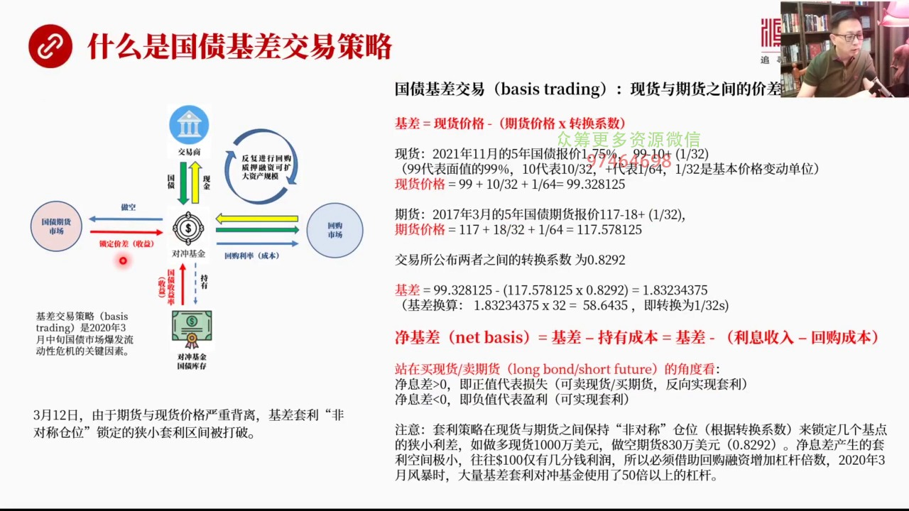

国载7货和现货市场上进行套力7货和现货市场并不完全一样我在这里面专门讲过机插这个国载机插交易它的一些基本的原理特别是敬机插一旦敬机插出现插艺就意味着出现了套力机会敬机插有正的和负的两边都可以赚钱但是由...

<strong>All subtitles</strong>

> 国载7货和现货市场上进行套力7货和现货市场并不完全一样我在这里面专门讲过机插这个国载机插交易它的一些基本的原理特别是敬机插一旦敬机插出现插艺
> 就意味着出现了套力机会敬机插有正的和负的两边都可以赚钱但是由于经验就是由于这个我们看到了这个长期来形成了一个经验这个正机插的数量非常小小到只
> 有几个几点比如说五个几点那么就意味着你一百美元做一笔交易大概只能赚几分钱的利润这个太少所以说在市场上人们往往玩摆背干干才能赚到百分之几百分之
> 四百分之五这样的利润是或者加干干它被出更多一些我还可以把这数量及做得更大型关键的问题是採取了非对称仓位的对冲比如说我应该持有现货我持有现货多
> 少同时我这个做空这个市场多少这两个如果是一笔一就是我持有一百块钱现货我在同时做空一百块钱的期货比如说都是国债那么我这是没有风险就可以把这个利
> 润给套住但是往往人们不这么干由于长期的数据统计因为我这么做相当于我这个做空部分相当于我买现货部分的就是做多货做空我持有当然现货同时做空这个做
> 空行为相当于买保险我这个保险是有成本的如果说我对这个市场非常的肯定或者基本看得准我就不需要买这么大的买这么多的结成保险的成本就会增加我的利润
> 所以他们往往才举非对称成为比如说我买一百块钱的国债现货我在期货上对冲我不是用的这么百分之百我用百分之多少比如说这就是一个转化细术大家往往很可
> 能用的是83%也就是我买一百块钱我只在市场上做空83块钱而不是全额做空不是全额的这个锁定风险而是根据比如说做多现货1000万美元做空7%或8
> 30万美元它之所以选择830万美元是因为这个转化细术是0.82这个0.89所以它取的是这样一个百分比所以这样的话就导致你不是完全对冲那么你你
> 锁定了风险就没有真正锁住一旦出现波动幅度比较大波动幅小还不影响你还不会使你出现严重速度如果波幅太大那么就会使你整个对冲测力出大问题所以我们来看长期来其实这个波动的空间

---

### Slide 48

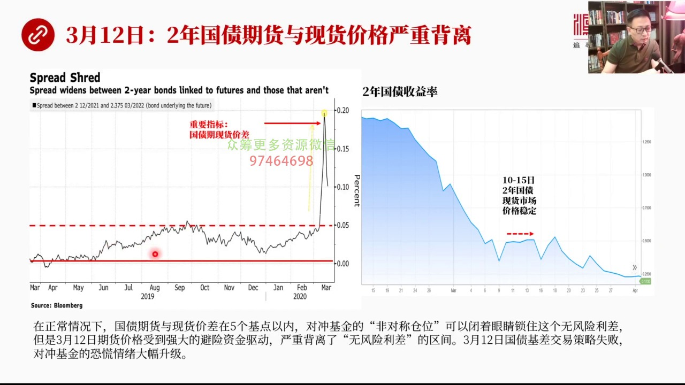

这个7%或6%的波动空间也就在5个几点以内基本都在5个几点以内所以它没有防范到它会出现一个超过5个几点达到比如说达到接近20个几点那么高所以它这个飞对冲的这个锁艰就会出大问题一旦超过了这样一个基础防范...

<strong>All subtitles</strong>

> 这个7%或6%的波动空间也就在5个几点以内基本都在5个几点以内所以它没有防范到它会出现一个超过5个几点达到比如说达到接近20个几点那么高所以
> 它这个飞对冲的这个锁艰就会出大问题一旦超过了这样一个基础防范的这个风险线就好像是黄和大低或者现在咱们是波阳火的大低一旦慢过大低哇塞那整个后果
> 不堪设下整个城市就被淹了原因就在于它用的是飞对冲的这种锁艰方法这是有问题的另外还有同学问宋老师您对这次金融危机的分析机器背后螺旗框架是完全它
> 是完全相信的但这些数据和螺旗链条美联储是否也能看到从这次美联储应对的速度之快也可以看出一些端理那么主要美联储即时关注市场数据变化就能够完全避
> 免市场危机再次爆发或者即便危机爆发也可以即时迅速的铺面这个问题我们刚才来其实谈到了一些就是美联储它有美联储对于金融事件了观察有两种可能一种可
> 能是他们的跟我们的分析是一样的我们看到问题它也看到了大差现在不能采取措施直接去这么去做因为这样在正常很不利因为现在对于它来说如果说假如说它看
> 到这点假如说它知道该怎么做它的选择无非就两个是车力区间控制另外一个是更大幅度的加强qe无论哪种措施都会使它自战非常表进一步膨胀而且膨胀速度会
> 非常快那么你怎么面对国会的秩序呢你要问你我们现在不是经常很稳定吗就是一下子搞好好吗现在你们印这么多钱都让华尔街转走了对国民界有什么好处啊对老
> 百姓有什么好处啊你们为什么这么干你想想看它做那个位置它怎么回答这些问题呢是啊现在也没有起风暴也没有什么金融市场这个很动荡我突然自然复杂表再来
> 个直线上我们再上升三万亿我怎么向国会去解释我怎么向媒体去解释然后这会出现更大规模的资产分配不均衡出现更严重的财富分配问题会受到更强大的政治压
> 力它怎么去解释呢所以这个是我们需要画面思考的你得站在暴围尔的角度去思考这问题当然从这个线这个线所来看从这个逻辑来看我们可以得出来暴围尔知道有
> 问题但是它现在也不能做因为现在做正常对它极其不利如果到了某个时刻几个月以后再次出现这个问题之后它再这么去做顺理成章政治压力几小这是第一个是这
> 个第一个视角第二是角是暴围尔暴围尔真没看出来大家会觉得很奇怪暴围怎么能不能没看出来呢其实我们如果反过去看我们在2019年9月前花内论时间做过
> 分析通过大量的细节你会发现暴围尔它真的是没有想到因为它在媒体中9月份这个前方暴发之后暴围尔曾在暴着上好几次在媒体中好几次提到直脑脑袋它不理解
> 为什么呀为什么回够市场就缺钱呢回够市场就要缺钱银行你们应该把你们准备进掉出来掉到这个市场中不是一下就把立堆给压下去了从10%那次有这么大立场
> 银行在美联储战亡中趴着13000亿美元的超准备金面对一个6%的立场为什么不来套利呀它表示强烈的不理解而且说了不止一次这件事情坚持在了将持了两
> 天之久它才最后下决心动手然后还犯了一系列操作上凑使这问题延迟了延迟了两天这个是我们当时你自己观察你又能发现它真的没搞明白问题出在哪其实在我看
> 来它没有真正看明白了因为它是经济学家美联储委员会那帮人都是经济学家经济学家的考虑问题它不是像市场的这些分析师或者像市场人士那么考虑问题它考虑
> 是理论问题什么不可能三角啊我给你提出一个公式或者什么什么啊提出一个公式但是这根本不是实际交易中间所发生的和市场交易人士所观众的那种问题市场中
> 真正出现问题或者我认为抱怨很可能真没搞懂的事对重基金在国债的期货卸卧上做这种套利它是加槓杆之后加槓杆之后它在就像我们刚才所展示这样它对赌的是
> 你不会超过五个基点的这样一个震荡幅度如果一旦超过超过的什么样的程度会使得整个这个体系解放杆抱怨去研究这个问题吗我持很大的怀疑因为这些问题是一
> 种基层的或者是一种美联储委它底下有很多研究机构是底层的人他们去做的工作这些工作做完之后最后给老板看的给上级领导看的就是一个很笼统的一个大图这
> 个大图就说我们现在可能经常让这儿有风险那儿有风险那儿有风险我们要做的是如何但是抱怨着自己如果不做这种分析不算这个系列中间去它看的这张图它也不
> 会有感它也不会有感觉这张图说明什么呢首先它就不知道对赌这个事有多少亿美元的资金呢你想想抱怨如果不是像我们一天十个小时在研究这个问题它怎么可能
> 了解这些信息因为这些信息上太大它底下人也没有办法把所有信都告诉它所以它如果自己不用信你给它看这张图它也看不出个所有人但是我们看这个图就知道这
> 背后有4000亿4000亿美元如果出现这么大的一个跳升那就意味着4000亿解冒感那最后呢它要达了1万6000亿但是等着呢风险评价也可能会被充
> 滑这样一连动起来哇散你那个就能联想到很多严重问题但是高高再上的这些人不成的市场底下这些人你给它看这张图你告诉它就有这个数据它脑子也要反映一段
> 时间这并不奇怪尤其是对于一些搞理论的金学家这种事情就太常见了你看咱们中国的这个经济学家们有谁去关注美国金融市场的这些底层的问题这是交源干的事
> 所以它不知道它也不了解也不关注所以美国出了问题之后大家都脑头就是怎么回事然后就给一些片汤就是给一些很龙虎的解释说这是美元整体出了一个问题然后
> 这个问题不是什么大问题所以说一通关话其实根本就没说到点上我认为某种意义上美联处的这个高层的进去家也会犯这样的错误因为太远的市场研究的东西太旅
> 动化不够接地气第13问题丛老师他这问题还没有完就是说美联处它如果爆发危机也可以及时封面没错我们现在已经看到了美联处一旦出现这个危机它可以马上
> 释放流动性把紧急的问题压住但是含认一句话这个大胖子你如果出现危机它如果是出现危机之后你马上再敢注射很多很多这个紧急注射一些就急的这些药品或者
> 是普通堂或者是崔肥寂它的体重会变得更胖变得更胖之后结果是吗就像对中基金你把利率1到0就逼得对中基金赌得就不是五个级点的上下幅度了它可能赌三个
> 级点的上下幅度或者赌五个级点上下幅度加200倍尴尬而不是100倍因为我没签可赚了你把我逼到绝路了这就好比这个大胖子身体不是800帮长得了一千
> 帮一千帮体重人供应它还是那个签比头那么细的管子你想想这个问题会严重还是会变得环节了在我看它这个问题只会越来越严重所以每两种级变是能够迅速压下
> 去但是产生了问题会更大而且爆发的周期可能会缩短因为大胖子300帮的时候300斤的时候我有跟管子还能够成几个月还能成一年半载你现在是800帮了
> 800斤了那我只能成6个月如果是一千斤呢如果是2000斤呢那你对这个体系的压力会越来越大直到这个雪碗根本就称入你维持所以这个爆发周期会变得非
> 常短风暴电池会变短所以这个难道能够叫即使铺灭吗其实它这个即使铺灭几十不了问题而是在创造更大的问题而且更快的创造问题对十四个问题算了上三月金融
> 海峡之后美元流动性枯竭导致股市当中的美黄金全部暴跌美联储组合策略缓解了流动性之后资产价格回归甚至更高请问下一轮危机来临之后来临之后还还是不是
> 这个规律暴跌到货币红水然后再次产生资产价格上涨这个规律应该是没有变也就是下一次暴跨会再次重演这一次的所有全过程我认为到划中心仍然在货币市场货
> 币市场中的某一个市场被动截然后这个市场又发商业票剧和定仪存单被动截然后导致海外美元钱荒大胖子没这个这个供给它养掉那个管子断了然后再次导致全界
> 出现严重美元房然后每年主必须要再次大规模通过央行货币伙伴直通车来压制所以在这个过程中再次会出现石油暴跌黄金贸跌然后这种资产暴跌然后每年主资争
> 之后通了之后这些东西都会反弹包括美国资产价格都会反弹然后这个过程平凡震荡次数越来越多周期越来越短第15个问题孙老师你好之前不是说美联储决策几
> 乎都是纽约美联储的人制定好拍板最后有美联储執行的吗那么纽约联储人怎么会允许美联储退出市场干预毕竟关系到华尔街的利益这个问题我其实刚才咱们反复
> 谈到了美联储联邦这个联邦委员会那些美联储委员会在皇上顿那些就是报委员他们就帮金融人家们他们在我看来是什么的是汉县地法律复以他们复以他们的权力
> 很大但他们执行权力的能力很弱或者他们没有真正能够他们又爪牙能够真正去执行他的政策然后纽约联储的人是真正执行有落地手段的这些人这些人都是华尔街
> 的人纽约联储银行是私有银行是私有银行在里面当董事会的所有董事长们他是文班做的今天高盛明天花期后天蒙跟探同大家轮流做所以这些人所制定的一切的他
> 掌握这货币政策的所有的执行权某种意识来说你汉县地民意上你比潮潮倒是你的臣子你可以让潮倒去干事潮倒表面上也见得汉县地也渴头也说胜上万岁然后你胜
> 上说什么命令我当然要执行实际上是谁掌握大权的其实这是个简单的对比当然是纽约联储银行这帮人掌握这大权或者是华尔街掌握这大权好那么也就是汉县地不
> 得不听曹操的话但是汉县地难道一点他就一点反抗意识都没有他就甘心做做这个亏蕾皇帝吗其实也不是我们独立使汉县地曾经安写血照让国就董诚去招募这种外
> 方的这些终于汉试着这些大将的然后把潮倒也干掉把汉县地给救出来汉县地也干这事对吧所以报尉尔干这事我觉得很正常因为他是做到一个法律的寿语的拥有合
> 法权力的地上所以你们这些老要执受我你们这些潮倒的老要要让我做这个做那个我在喊他重上我也我的考虑也就说我现在如果一出手在金融市场没有出危机的时
> 候我就出手让自然飞标再上升三万一国会的人是我顶五是我去顶雷我怎么去解释这个问题你们怎么不替我考虑考虑啊所以他有他自己的想法或者那些金居家做到
> 美联储决策的那些那些理事们有自己的想法这非常正常因为他的位置决定了他一定会有自己的意志这种意志跟华尔街的意志显然不一定永远是一样的产生纠纷的
> 时候怎么办那华尔街就说我认为现在必须要多硬潮票我没法受不了了那报处说你有啥受不了你先不好了吗各种市场数据显得一切正常为什么我现在一定要这么做
> 你把我逼到那个路上我会很难受的我正常会很被动的说妈会不会这么正常一定会我现在相信发生的就是这种正常暴围而知道金融市场可能会出问题也许他知道也
> 许他不知道这无关紧要重要的是他现在不愿意出手再次硬潮票不愿采取这个这个收益力控制也不愿采取无限qe无限放大让自己很被动他也许意识到有危机也许
> 没有意识到咱们不去猜最重要的是他现在政治上没有动机这么去做华尔街是在给他施加压力但是他有可能不听有可能不听华尔街说那咱们走着瞧你不听我的那最
> 后看谁是谁受不了所以最后我在我看来这次政策上的犯错有极大的可能性就刚所以我刚刚所说的这种原因双方不买账或者双方有一定的这种争议就是你不要指望
> 汉言定会老老实在那他一定也会搞事汉言定也有自己的意志抱我眼也有自己的意志你压他压他运程度他说我有法律授权我就按着我的胜质意图作怎么样吗201
> 9年9月我认为发生了就是第一次冲突现在发生了是另外一次冲突所以从这个角度来说我们才能真正还原这个政治国意中间那一些微妙的东西不是说华尔街说了
> 算之后对方就这个美联储在华尔顿的这个委员会这人就老老实实本本分分这些演员都没有继续执行这何复逻辑吗其实不何复真实的逻辑双方是在斗但斗的结果是
> 华尔街总之取胜但是在美联储这一人也不服气不一定会服气因为他有学者大家可以想象学者总是有点熬气的你有钱就让我做这个事平日吗他一定会有一种学者的
> 熬气所以在这个问题上双方的争夺和意见不合是非常非常可能的而且非常现实在这种情况之下出现政策最后的失误这个可能性我觉得还是蛮大的还有就是这些问
> 题还有还有很多问题我们还有一些海外同学也有问题有个同学问这一轮美联储的就是7月底基本告一段落但是疫情却更加严重基本面也在逐渐的恶化经济评论是
> 比营起下一轮的就是觉得美联储子弹是不是够用在我看下这个第一问题我认为美联储以现在的拯救规模要想持续下去要想持续进入上稳定不出乱子这是不可能的
> 现在子弹现在已经投入了子弹是不够的从这个意来讲华尔街说的是对的现在钱肯定不够还会出事那么如果说下次再出问题美联储的子弹够不够美联储现在最最主
> 要的子弹降息已经没有了它已经这条路总通了所以它剩下的只有qE但是qE在我看起来它这个qE会选择什么呢我觉得可能会选择收益的区限控制收益的区限
> 控制也就是我把从一个月一直到30年的每个点全部固定住然后告诉市场就是我未来的整个社会收益的区限大家不要去猜了也不要去跟我国议国议也没有我肯定
> 把你肯定把你压倒所以市场就会形成一个稳定收益的区限的预期这种情况之下将会产生问题将会产生大规模的套利因为短短和长短收益率的这个立差是很明显而
> 且是固定的那只要我在短短借钱到长短去套利这就是百分之百赚钱而且毫无风险所以围绕着收益的区限进行套利的行为将会爆炸现在澳大利亚就出现最严重的就
> 是问题你既然已经把底牌放开了那就是市场还有什么好由于加上哪儿拼命加然后最后就会导致我们看到这个美联储就会陷入更大的被动所以美联储要想拯救现在
> 所面的问题还有一个选择就是复利率但是要搞复利率我刚才已经说了这会直接影响美联资产在全球的价格也就是美联资产很可能会全面崩盘不管是中国还是海外
> 国家还是任何国家你如果告诉我我今年投一百亿明年只能拿回98亿只价值98亿的话这时候我一定不会干没有国家会这么干现在虽然咱们扣掉通过工赚之后很
> 可能复收益但是民意上我还是正的你让我们民意上都变负那怎么向全国人民交代每个国家都会面临这个问题所以要是那样的话所有人都不敢成为原资产所以这是
> 美联复利率最大的最大的一个担心也就是虽然复利率有可能继续能够推高自然价格但是复利率也有巨大的风险和负作用从这个议来讲我觉得美联储恐怕只有一条
> 选择就是无限qe持续下去特别是收益率选控制可能扫真正唯一的比较现实选择第二问题您认为怎样解决就是的就是的钱在金融体系之内空赚的情况怎么才能真
> 正帮助需要资助的企业这个其实某种意识大家说整个金融体系的设计本身就有问题你比如说回够市场回够市场对金融来说是一个很方便的市场但在我看来所有的
> 问题金融空赚的问题都是要经过回够市场的放大的有一个算一个无论你进行什么套利对重基金什么策略最终你总是要落实在回够市场上加上感所以你要想真正克
> 制这个问题只要它能够在回够市场不但加上感这就意味着它可以把钱不断地在金融上反复操作整个钱在金融系体系之内空赚根本播留下实际经济然后还能获得很
> 高的收益这个是金融制度设计和会议市场设计中一个严重的问题你要怎么才能够解决这个问题在我看起来回够只能做一次就是不能循环待款这就是一个重大游戏
> 规则改变就是我满100块钱国战之后我可以抵押一次抵押一次拿到钱之后如果我再去买再抵押这个事不能允许或者说更聪明一件办法是在你循环的压过程中我
> 增加你税收的成本我让你这么做超过你融资就是这个成本再加上你融资回够带来成本超过你的收益我让你不划算这可能是一个不通过改规则但是改变税收你周转
> 次数月多你交质税月多通过这个手段你也可以克制和压制这种金融空转的现象但是要这么干那就必须要修改法律华尔街不会允许这样法律通过所以你像资金周转
> 次数对他进行收税这个事少越人提出根本就真心不了因为要这么执行的话华尔街就没牵涨了所以这个问题涉及到蛋糕分配的问题很难是没有办法有办法真心不了
> 还有同学问第二同学问是马来西亚的同学孙老师也好请问孙老师关于国债的外债和内债的区别和怎么看一个国家的外债多还是少还是内债多他说我在危机百格中
> 看了一些资料但是有些名词还搞不太清楚中间提到了2020年美国联邦债公众持有联邦债的规模19.05万亿然后这个政府之间持有是5.9万亿总国债是
> 24.95万亿这什么意思美国国债他有我们知道他这个列出数字当限制数字26万亿不管怎么样他说24.95万亿那是整个国债的总数整个国债的总数中间
> 有19.05万亿是被公众持有是交易出来了就是到市场上去发售还有公众9万亿到哪去了还有公众9万亿是直接被美国的阳老基金比如说我们的退休基金这些
> 基金要持有相当多的国债作为他们的资产这些国债是直接化的他们账户上去了所以他并没有参与交易就已经化过去了所以在市场中真正参与交易是19万亿但是
> 总债502024.95万亿这是这个概念解释还有大2019年底公众持有的债务是GDP的72%大概是然后这个公众债务中大概37%是被外观持有的所
> 以美国是拥有世界上最大的外债的国家就是外观持有你的持有你的资产持有的多当然你就是欠外观任钱了然后呢他听说过就是大疗说过美国的债务很难控制是因
> 为美国这个债务大多是外债而中国和日本的债务却不那么容易发生委员问题因为他们的债务大多是内债请问是不是这样我觉得大疗这个说法我不知道你从哪里看
> 到但我觉得说法显然是有问题了美国是不会出现委员的因为持有他持有他的债务也多少是外观而是因为他找不到印美人的权利所以哪怕美国国债或者美国所有债
> 务都是外观持有他也绝对不会发生委员我就印就完了呗怎么印我印前来收购在上城收购国债收购企业债收购任何东西我都可以收购里面他说印超票我可以印一百
> 亿美元收购一块石头然后我自然负赛表上同样可以发生美元出去向整个体积之内注入一百亿美元我可以印超票去买收购是音车我可以印一百亿美元收购泡头曼铁
> 只要我认为这儿资产我都可以把他帮的资产分在表上然后把货币放回去我怎么会有委员当然不会有委员所以哪怕百分之百的债务都有外观持有美国也绝对不会有
> 委员从这个角度来说不存在这个问题中国和日本债务不容易发生委员因为债务大多是内债这个话当然也没错因为中国和日本情况也是这样我不管欠点多少亿人民
> 币的内债说白了中央银行随时可以印超票把它全部填了无非就是我印超票买你债务吗买了这个债务不就是成我的资产了吗然后你不就有现金了吗你不是就没债务
> 了吗资产在中央银行资产表上我过十年慢慢就把它住销了它有些伟约了然后就把它填了然后有些慢慢慢慢到齐了然后就慢慢好了其实可以通过印超解决国内债务
> 的所有问题日本也是这么干的所以日本现在扶带率也很高从这个角度来说只要是掌握在自己印超机设成之内的事都好办都不会出问题然后这个还有些问题还有问
> 题是为什么低率率会鼓励大家加上感这个问题问的就比较深刻了低率鼓励大家加上感其实就说如果每连处把利率压到了零压到零之后我们想象一下你要是对冲基
> 金你要是市场中的比如说你要是买房人人首先你按一些带款的利率就变得很低了比如说现在美国是30年按一些带款是2.2%2.9%是创立是最高最低这样
> 的一个极限如果说你借30年的带款利率在2.2%那几哇塞那我肯定是买房了买了房之后我把房子做低再融资之后我再买房了因为我的利息很低我可以周圆好
> 多次然后我还款的压力虽然欠这种很高但我还款压力很低因为利息太低了所以我这种行为叫利用房地产来加上感普通投资人中国的草荒房阁场景们都理解这点那
> 么在金融上对重基金也是一个道理对重基金就说我如果说你把利率压到零那就意味着我套利这个空间在所有的一种套利空间都变得很小我要想获得一个跟以前差
> 不多的回报率投资社会率我就需要我一旦把这个立差给锁住之后我就要对这个立差进行加速这个立差进行加倍的杠杆操作就是把国债拿去抵押融资再抵押再融资
> 这个圈数我要绕200圈以前绕100圈够了现在我多绕100圈好然后再能取得跟过去一样的一个回报率但是你要绕这么多圈那么显然你的杠杆率大幅上升所
> 以当央行把基准利率压低了要成零了或者市场率的压得非常低那就只大幅除了加杆耳没有其他选择要不然就没钱转要不然就没有受益率这就是为什么低利率会一
> 定会鼓励大家加杆耳好那么还问题是中国不允许外资加杆耳那么外国人在中国炒资产怎么炒呢这问题问题也不错中国其实回够市场上个人做回够你不能够加杆耳
> 金融机构是可以的如果你有金融机构的排罩像外资金融之后它是有排罩的它是可以按照同样的美国的回够上的操作买企业债去制压然后再买企业债债再制压它可
> 以滚多很多次的所以它的中国市场上当然可以玩尴尬而且中国比美国那个回够还宽松一些美国回够现在主要只能是国债和两王债中国现在是国债当然可以还有企
> 业债也行所以它的范围更大我持有企业债我抵押我在债融资然后再购买然后再抵押再购买再抵押这个干嘛别说当然可以玩下去所以当我们看到你外资取有中国比
> 如说两个5万亿债券之后这个才没有5万亿到底它是动用多少现金买的还是说它使用干嘛加出来的这个我没有看到因为官方没有报到这方面统计数据当然我相信
> 中国一行年期会应该有这个数据也就是外资实际上流入债势有多少他们有没有把购买的债券拿去做回够底然后拿钱再买债券有没有这样干干什么这个干干行为发
> 生了多少次干干背率有多高为什么需要孤算这个东西你要孤算它的风险你得考虑到这帮人如果说把这个游戏玩得比较狠就像美国对冲基因那么玩它玩咱的可能性
> 也很大或者说在美国另外一帮人对冲基因玩砸了迫使他们这些人也受影响因为对冲基因很多钱它也是从也是从这个这个美国经常上容来的如果美国经常被动劫比
> 如说我跟他所说外汇市场再加上商业票剧丁存在如果一旦被动劫他在中国这个加在干哪他也受不了因为他是从美元换成人民币的如果他的资金来源断了那么资产
> 他也这边保不住他必须要狂抛人民币如果他加了干干那抛数量就非常的惊人因为他突出速度会非常快就像这种大红水一样偷天在地球就上来了你甚至还没有防范
> 道还没有进行这个集食防范中国在这点上我觉得跟美联储还是有差距的美联储我毕竟是酒精沙场所以他的应对速度非常快中国以前没有碰到过这个问题没有开放
> 过精神上你是大规象上叫投一回所以怎么应对的流程操作规范有没有进行过压力测试有没有进行反复的训练呢如果真是让你15分钟做决策然后五分钟启动然后
> 开始一分钟之内开始操作咱们能达到这样的速度和效率吗还说一旦出现了解干干外资解干干干你得向国院申请得报告现在说了什么情况国院的开会开会之后咱们
> 在招奖行然后一年会整天会大家做一起然后我们在讨论具体執行策略三五天过去了金融上能够给你三五天时间吗给你的只有三五个小时这套快速决策的机制和马
> 上开始实现的这是一套机组是师美联储是有的他从08年见面的一些这些各种各样十几个机制他这回是直接用这套机制的操作流程包括他公布的所有的资产底下
> 清单这都是以前就有的所以很简单很方便咱以前根本就没这套东西你这周期会比他长反应周期会比他长一旦出现这个问题三五个小时之内你要把这些事情全部做
> 起备咱们的效率有这么高吗如果没有的话那这个事就出道理了所以在我看来我们现在都在都在这个唱战歌说外籍竟然越对好人民币资产特别有心力不错人民币资
> 产当然比美联资产他这个立插放者咱们立插高咱们的力气收入高他一定会进来关键是竟然是什么人是长期投资的这没有问题很好欢迎还是短期的对冲击心这帮人
> 要格外党信来了之后这边使用干干吗我相信他们会使用多少败呢怎么监控他的风险啊特别你要注意这些人使用高卫港港这些对冲击心心美国国内对冲击心之间只
> 要有一逃出了问题这边也会完蛋所以这些问题都需要防范在先都要做好预案和准备另外就是为什么低波动率会导致低利率会导致低波动性这个问题体内很好低利
> 率把利率压低之后资产价格就会上升资产价格和利率是反向的利率越低我们可以想象防价可能会导因为贷款的利息低了所以利率越低防价越上涨资产越上涨好资
> 产越上涨波动性会下降怎么理解这个事因为波动性我们以前讲过Wex指数的计算方法那个计算模式你可以明显看到它就是一个对冲资产价格暴跌的这么一个谷
> 指欺权那个计算公式人们只是在持有大量自然防价暴跌的时候我才去买这种合约如果我看到自然不断向上走我有什么必要去为我资产价低做保险呢特别是如果整
> 个上都看都看好这个市场会越来越高所以我买保险的欲望会越来越低这个所谓的保险是什么那么就是Wex指数或者波动率吗所以参与这个保险的这个市场人变
> 少了这个市场不活跃了所以它这个指数也会下降因为它反映是欺权价格了从这个脚来说利率低了资产高了资产高了形成长期的趋势之后大家不认为资产需要保护
> 资产下跌这个事情需要保护保险市场就没得做了保险市场没得做了那么Wex指数就下降了或者叫波动率就下降了然后还有还有一个就是这个信用立插CCC的
> 信用立插标升会出问题如果每年处做事这个做事上该做的工作比如说春土国债这个问题还有国债社会立插长社会立会降低它讲了信用立插信用立插就是信用立插
> 其实就是比如同等期线都是五年的你这个CCC级别的垃圾公司发行的这种债券和五年期的同期线的国债都是五年的那么这两者之间社会率是有差异的这个差异
> 就叫信用立插好那么现在出现金融一基础的民主它是如何压缩这个信用立插的呢当然我们可以看到每年处它通过各种机制就元机制比如说我们最近看到了什么二
> 基市场就元机制一基市场就元机制还有各种各样的就元机制然后通过这些就元机制某种人上它可以在这个市场中去购买高风险的这种资产比如说债券的ETF比
> 如说垃圾债甚至包括垃圾债本身它这种购买信用就会使垃圾债的价格台生收益率被压缩所以跟这个同期间国战稍微率这个立插会被缩小这就是我们看到了为什么
> 每年处于出手CC级别的这个债券的信用立插迅速的被压缩而且问题就涉及到机插为什么会反转还有这个机插策略为什么会出问题这个货币这个就涉及到国代市场那个七货现货支插了这个就是我们一开始讲到了3月9号

---

### Slide 49

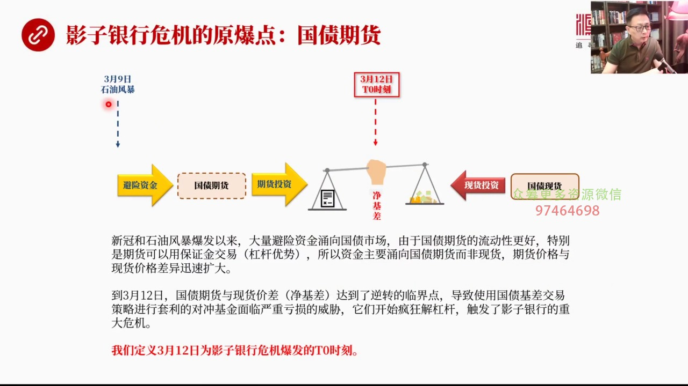

你会看到石油红红爆发之后大量避险资金用下了七货市场而现货市场并没有得到太多的资金所以大量资金融向的七货市场就抢七货市七货价格和现货价格一下就像这个天平一样一下就反转了反转的而且幅度还特别大这就使得本来...

<strong>All subtitles</strong>

> 你会看到石油红红爆发之后大量避险资金用下了七货市场而现货市场并没有得到太多的资金所以大量资金融向的七货市场就抢七货市七货价格和现货价格一下就
> 像这个天平一样一下就反转了反转的而且幅度还特别大这就使得本来我是套力五个基点的而且非对称所仓的这帮人他整个对冲的策略就完全失败了谁也没有想到
> 会从这个事情上爆发了一股避险资金冲击的七货市场七货市场价格和跳上一反转谁都不会想到有这么一个突然事件出现所以这就是导致他这个防范特略这个特别
> 定的仓位就出了大问题逼迫这些对冲基金解决方法在金融市场中我们永远无法预期这种事件比如说石油风爆什么爆发新冠肺炎什么爆发这种事件你是判断不了的
> 你也很难判断出来资金会从这个方向引进七货会导致七货和现货出现大幅多的这个镇荡七货国带七货和国带现货基本上长年以来都是非常稳定差几个几点而已差
> 五个几点了怎么会一下出现了二十个几点了落差呢不可能的事立场没有出现过这样的情况所以我在做风险对冲时候不会考虑这个现象这就是金融市场的危险之所
> 在每一次爆发金融危机都是从不同的方向由于不同的原因甚至包括这件事情国带现货习货这么巨大的这种落差也是从来没有发生过这这是第一次但是对冲基金在
> 这个计查中加五十个将一百倍尴尬这种事情是永远存在的所以我们要明白金融危机的真正的核心爆发它的基本规律是套利的行为永远存在而且都是加了尴尬有时
> 候是在国带现货习货之间进行套里有时候是在国带现货跟立举条7市场上进行套里有些时候是在其他市场上进行套里在时间上进行套里在空间上进行套里在正式
> 上进行套里在地园上进行套里法律上进行套里五华盘门不业而足反正是套利把这个利益插锁定之后反复加尴尬加尴尬的行为造成了金融危机最本质的一个动音至
> 于金融危机在哪个市场中由于哪个事情驻发这个东西是随机的所以我们现在真正要关心的是随机世界所触发的高背尴尬的爆破性引发的解尴尬尴尬尴尬冻结一系
> 列核心市场之后将对全世界将对全世界的美元造成重大的影响引发世界性的新动危机我们把这个逻辑可以看得很清楚而且知道它的哪个市场冻结会出什么样的问
> 题现在唯一不确定了下次唯一的爆发是不确定哪个世界在哪个方向上触发了哪个对冲击经济策略失败我们现在还没有肯定的一种结论和答案但是长期关注金融市
> 场你会对一些市场的反应会越来越敏感比如说你会看到现在欧洲有些对冲击经玩的新的做法实际上是把股票像国债样进行反复这样这个就是一种新潮流三月份以
> 后才出现了新潮流当你知道对冲击经一定会玩早的时候你就会关注新闻报道还有这些对冲击经济的聊天还有他们的推特博客他们的Facebook他们所谈到
> 了所有新的套利的方法你会对这个事很明白一旦你发现这些新的套利的方法形成一个逐一股潮流以至于引起一些大媒体的报道说你就知道这已经发展成了一个相
> 当大的一个规模的潮流而且看到他们已经用广尔广尔数据看他们这个广尔数据逐漸做大你就可以基本上判断出几个危险的方向然后跟进然后看他们广尔的这个对
> 数的上涨的速度最后锁进哪个市场是最有风险的哪一帮人是最有风险的然后在盗着来看进入市场的所有的被洞捷的这些这一系的市场然后在关注什么时候爆炸什
> 么时候这个市场洞捷那个市场洞捷一连串的行为怎么发生然后你就可以完全预测美元什么时候长黄金生物肉跌石油什么时候爆跌然后美国的救援措施像什么基本
> 上都是一套成续化的东西所以当我们对三亿金融风报这堂课我建议大家反复看看了变数越多你对金融危机爆发的逻辑的理解性就越强然后对中间那些逻辑地图理
> 解就越深同时对于对冲基金在这个中间中发挥着重大的危机的这个叫什么就叫引心的作用理解了也就越明白然后你对对冲基金的投资策略它的风险的冒险的方向
> 就会变得非常敏感我相信大家通过这堂课反复学习之后对美国金融市场买至于这个金融危机的爆发的整体的过程还有世界其他金融市场的理解都会大大加深好今天咱们打一刻就到这里谢谢大家再见

---

### Slide 50

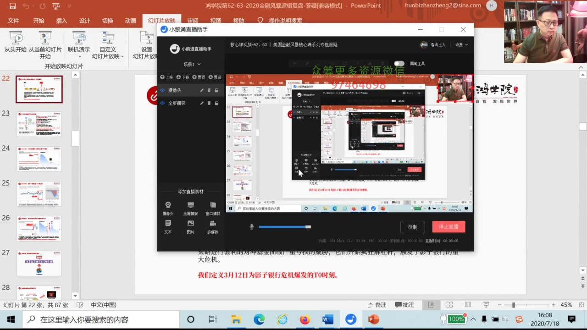

<strong>All subtitles</strong>

---
