# 核心课视频-64、65 全球外汇市场 — Slide Notes

> **来源**：鸿学院核心课程  
> **幻灯片**：28 张

---

### Slide 1

核心課的第64到65獎今天的主要內容是講全球的外匯市場那麼如果我們來看這個第一頁

<strong>Cleaned narration</strong>

> 核心課的第64到65獎今天的主要內容是講全球的外匯市場那麼如果我們來看這個第一頁

---

### Slide 2

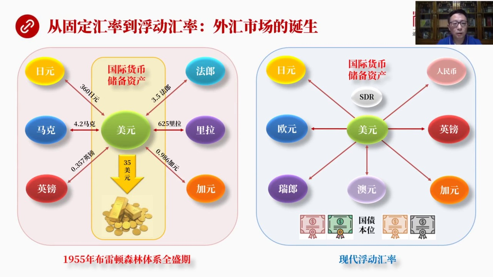

這張圖畫的是一個全球市場全球外匯市場它們一個過去的狀態和現在的狀態過去我們知道是固定會具時代現在是浮動會具時代那麼如果大家看這兩張圖你會發現它有非常大的不一樣我們先看左邊左邊這張圖是1955年布林頓森林體系全勝7的一個快兆如果我們來看這個圖然後大家可以發現它最典型的特點是什麼呢就是美元和黃金是在整個...

<strong>Cleaned narration</strong>

> 這張圖畫的是一個全球市場全球外匯市場它們一個過去的狀態和現在的狀態過去我們知道是固定會具時代現在是浮動會具時代那麼如果大家看這兩張圖你會發現
> 它有非常大的不一樣我們先看左邊左邊這張圖是1955年布林頓森林體系全勝7的一個快兆如果我們來看這個圖然後大家可以發現它最典型的特點是什麼呢就
> 是美元和黃金是在整個貨幣儲備中間的中心地位當時全世界的貨幣體系這就是1944年布林頓森林體系建立的以美元和黃金為中心的全球貨幣體系全球貨幣日
> 圓馬科英棒法朗里拉加元等等這些所有的貨幣盯準美元美元與黃金掛鉤只有中間這一塊美元和黃金被稱之為是國際貨幣儲備資產其他的都不是國際貨幣國際的儲
> 備資產只有美元和黃金好 這種體系就稱之為是布林頓森林體系就是全世界的貨幣與美元掛鉤美元以黃金掛鉤35美元對換樣子黃金那麼在155年這個穩定的
> 布林頓森體系的全正期我們可以看到各種貨幣對美元的比價是固定的比如說日圓對美元是360日圓對億美元法朗是3.5 法朗對億美元馬科英棒還有加元各
> 有各的比價這個比價不像我們現在看到了每天都在變當年是不變的而且這個凍著是很多年都不變這叫固定匯率所以全世界所有的匯率是跟美元掛鉤美元再跟黃金
> 掛鉤所有這個比價關係全是固定的全球的儲備資產只有美元和黃金換腳都來說不管是哪個國家日本德國還是英國還是法國其他的這些國家你的銀行要想進行放待
> 你必須要有儲備資產沒有儲備資產是不能夠進行信用擴張的比如說你要發行一筆貸款那麼你銀行金庫裡有黃金嗎沒有黃金那有美元嗎如果也沒有美元那你就放不
> 了貸所以那個時代全世界的金融體系它的這個矛定的關係或者叫價值之矛是個美元和黃金鎖定所以這兩種資產被稱之為是全界銀行體系的核心資產其他的貨幣都
> 不算這個是布林頓斯林體系形成的固定匯率制當我們知道這個制度在1997年8月15號美國宣布停止黃金內化關閉黃金窗口之後這個體系結體了從1997
> 年以後我們世界逐漸的進化到了這個時代就是現代的浮動匯率時代如果我們來看這張圖我們會看到美元仍然在所有貨幣的中心是在外匯上讓人被稱之為是中心貨
> 幣什麼叫中心貨幣就是其他的貨幣要想對換比如說日圓要想換成陰霸日圓要想換成歐元歐元要想換成瑞士法廊大家首先在多數情況之下首先要換成美元然後把美
> 元再換成歐元日圓不能直接換沒有這麼大的市場日圓必須先換成美元然後由美元換成歐元日圓要換成人民幣也不是直接對換首先要換成美元然後再換成人民幣所
> 以它是一個中介貨幣中心貨幣跟當年情況是一樣的那麼國際儲備資產呢發生了變化現在所有的這些貨幣都叫儲備貨幣了日圓 歐元 瑞郎美元 奧元 家元 陰
> 霸現在包括人民幣還有特別提館權IMF 特別提館權這些所有的這些貨幣包括特別提館權都被稱之為是國際貨幣儲備資產那麼一個國家它的信貸擴張只要有這
> 些外匯儲備它就可以進行信貸擴張這個是我們看到的現代的幅度國理時代國際貨幣儲備的資產規模擴大了跟當年相比增加了一些資產同時當年美元的背後手黃金
> 現在呢各個儲備貨幣背後是各自了國債所以我們稱之為這個時代布里登森的體系是金本位或者叫新會對本位現在這個時代實際上實際上叫國債本位置就是認為國
> 家的這個貨幣背後它的核心抵押品基礎貨幣背後主要是國債所以這就是這兩個時代最大的不一樣外匯市場什麼時候誕生呢在這個時代七十年代以前不存在所謂的
> 外匯市場因為這些國家的貨幣都鎖定了匯率是完全固定的沒有什麼好兌換的所以在這個時代中不存在大規模的外匯市場外匯市場是從七十年代開始形成八十年代
> ...

---

### Slide 3

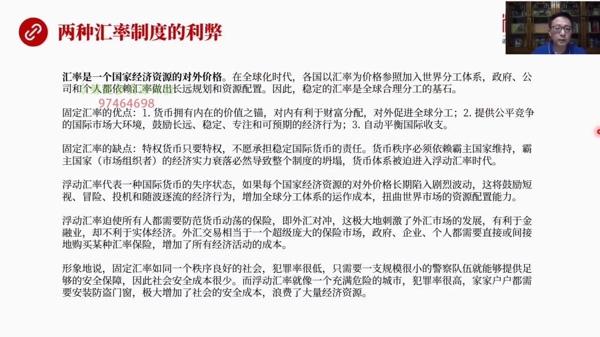

我記得我們以前分析過這個問題在這裡再重復一下匯率是一個國家它的經濟資源對外的價格就是在國際上看你這個國家的所有經濟資源以什麼價格對外報價因為在全球化的時代各個國家都是以匯率這個作為一個參照價來加入世界分工體系就是你的國家想加入國際大軍你要想參與國際分工那麼你的匯率就是你的國家全部經濟資源的對外了一種...

<strong>Cleaned narration</strong>

> 我記得我們以前分析過這個問題在這裡再重復一下匯率是一個國家它的經濟資源對外的價格就是在國際上看你這個國家的所有經濟資源以什麼價格對外報價因為
> 在全球化的時代各個國家都是以匯率這個作為一個參照價來加入世界分工體系就是你的國家想加入國際大軍你要想參與國際分工那麼你的匯率就是你的國家全部
> 經濟資源的對外了一種參照報價你根據市場根據你這個報價然後來決定你有可能參與哪些分工比如說你是勞動密集型的你就可以參加生產一些低技術但是勞動密
> 集的這些產業你要是高技術的國家你可以生產其他的東西所以各國家其實是在國際分工體系中進行報價的時候它是以自己的匯率來進行報價然後根據你這個報價
> 高低決定你在國際分工體系中間的它的特殊的一些位置所以如果一個國家它的匯率是對外的一個經濟資源的報價那麼在國內中間在一個國家內部的所有的公司政
> 府和個人等等其實都要受到匯率的影響因為如果我們這個國家加入國際大群團加入全球分工那麼意味著我們這個國境之內的每一個人每一家公司包括政府都要這
> 樣和那樣的直接和間接的參與國際分工所以我們都需要參照匯率來調整我們的長遠規劃調整我們的資源配置調整我們的時間調整我們的一切的經濟資源的組合所
> 以匯率對外是影響一個國家參與國際分工對內是影響國內經濟體系的所有的資源的配置它是個極端重要的價格也正是因為這樣所以穩定的匯率是全球合理分工的
> 基石就是這個匯率如果越穩定全球分工才能真正有效有效進行資源配置那麼如果我們來看過定匯率它有哪些優點當然優點很明顯固定匯率有點是貨幣擁有內在的
> 價值之矛比如說美元跟黃金化工這就是黃金是美元的內在價值之矛它不是政府想拍腦袋說我值多少錢我今天值多少錢明天值多少錢不是你的內在價值之矛是黃金
> 已經決定了由於貨幣對內有價值之矛所以有利於財富分配如果你不能爛發貨幣財富轉移就會相當困難所以這會對一個國家的評分化形成有利的制約那麼對外其實
> 是促進全球分工所以一個擁有內在穩定價值之矛的貨幣對內是有利於財富分配對外是有利於全球分工的這是它第一個優點這要有點固定會率可以提供公平競爭的
> 國際市場大環境也就是說如果我們各國都不玩貨幣的一套咱們就公平競爭看誰的生產率高看誰的經濟組織效能高看誰的文化資本更有利於這種競爭型的市場環境
> 所以在穩定會率情況之下這是一個公平的遊戲規則在公平的遊戲規則之下大家各進所能發揮自己的廁場它能夠鼓勵長遠穩定和尊重還有可預期的進行為這是它的
> 第二個優點第三個優點就是自動平衡國際收支我們知道當一個國家的你如果長期處於逆差那麼也就是說你最後你的貨幣儲備黃金或者美元會向外流失那麼對方收
> 到了你的這個流出的貨幣儲備之後黃金和美元它就可以以此為基礎擴大它的信貸有了這種信貸之後它就可以帶來更多消費帶來更多的投資那麼當它的消費增加了
> 它就會反過來對其他國家的出口產生刺激那麼這個時候我們看到剛才失衡的國家由於貨幣儲備的流失它會被迫緊縮全國的金融體系緊縮贏根這樣的話來克制進口
> 壓制進口鼓勵出口然後當對方國家繁榮了增加了出口需求它還可以順利的把商品賣到順差國然後把貨幣儲備再贏回來所以在這個過程中這是個自動循環的自動控
> 制系統沒有一個國家能夠長期失衡而不受懲罰這個是固定匯率的一個優點當然固定匯率也有缺點它的缺點最大缺點是嗎概括起來說就是必須要有一個中心貨幣這
> 個中英貨幣必然天然就是個特權貨幣那麼當這個特權貨幣的國家發行國當它決定我只要特權我不想承擔穩定國際貨幣的責任的時候這套體系就會出問題那麼也就
> ...

---

### Slide 4

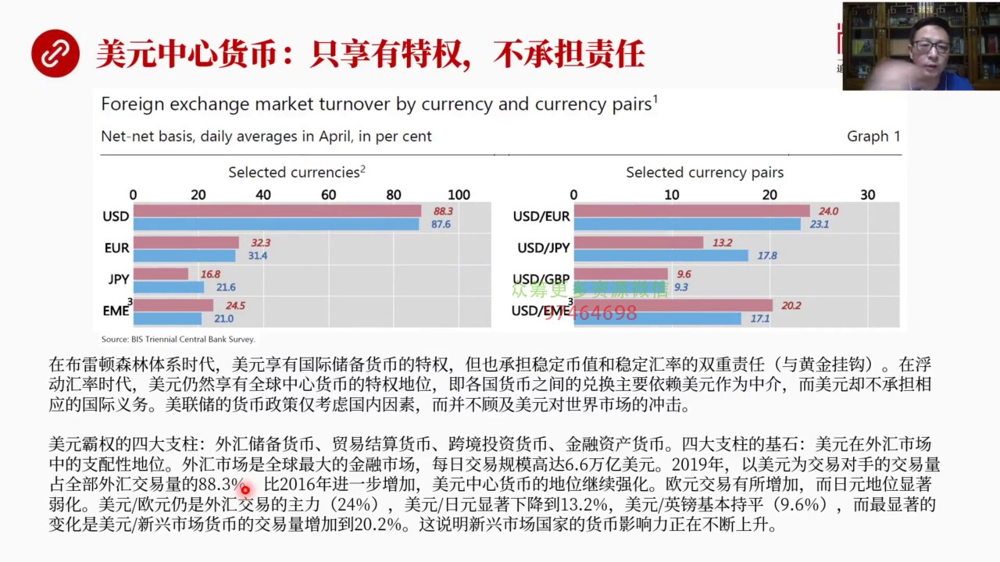

它最大問題在當今世界1970年之後最大問題是美元只享受特權而不願承擔任何責任剛剛我們說布林頓森林體系這個時代美元享有國際儲備貨幣的特權但是也同時承擔穩定美元幣值和穩定匯率的雙重責任就是它是兩重責任對內穩定幣值對外穩定匯率當然這都需要與黃金化工但是在幅度規律時代美元仍然享有權就中心貨幣的特權地位也就是...

<strong>Cleaned narration</strong>

> 它最大問題在當今世界1970年之後最大問題是美元只享受特權而不願承擔任何責任剛剛我們說布林頓森林體系這個時代美元享有國際儲備貨幣的特權但是也
> 同時承擔穩定美元幣值和穩定匯率的雙重責任就是它是兩重責任對內穩定幣值對外穩定匯率當然這都需要與黃金化工但是在幅度規律時代美元仍然享有權就中心
> 貨幣的特權地位也就是說各國貨幣之間的對換主要要依賴美元作為中介而美元卻不承擔任何相應的國際義務美聯儲的貨幣政策它只考慮自己國內民宿而不考慮全
> 世界的受美元影響這國家的經濟會出現什麼樣的問題如果我們來看它中心貨幣的地位怎麼體現如果我們看這是BS他們的報告統計全球外匯市長教育量我們從這
> 個圖上很明顯地看出來美元基本上佔所有的貨幣中間就是如果我們來考慮外匯市長的教育量的話那麼外匯市長教育量有無數組就是有很多組兩個貨幣之間的教育
> 比如美元對偶員美元對日圓日圓對其他貨幣你會發現美元基本上永遠是在教育中佔據一頭也就是雙名教育中美元畢居其一在這個總比的中美元佔比達到了88.
> 3換句話說一百比外匯教育中88.3的教育是個美元相關的也就是美元是教育的另外一頭無論你用人民幣去跟任何貨幣換或者用日圓跟任何貨幣換你基本上都
> 要88%的可能性是先換成美元然後才能換成其他貨幣所以美元仍然起到中心貨幣的作用如果我們來看美元這個霸權我們所說的美元霸權其實在我看起來美元霸
> 權有四個主要的支柱第一個支柱美元是全球外匯的儲備貨幣貿易結算貨幣這也沒問題石油都要用美元結算還有跨境投資貨幣大家要說FDI都說投資了多少美元
> 還有一點是大家不太關注的或者說很少提的它其實是金融資產的定價貨幣大量的金融資產實際上是美元定價的資產在這個四大支柱的背後或者說四大支柱最主要
> 的基石是什麼就是美元在外匯市場中的支配性地位所有貨幣之間的匯換對換基本都要投資美元那麼現在全球的外匯市場這個交易的總量每天高達6.6萬億美元
> 我們說股市如何如何債券市場如何如何這跟外匯上比賽大都是小兒科外匯市場每天的交易量是6.6萬億美元是個天文書組太大了那麼2019年以美元為交易
> 對手的交易量佔全部外匯交易量的88.3注意比2016年少進一步增加2016年是藍色這條線2019年我們看到是紅色這條線也就是說這三年以來美元
> 的在交易中的佔比實際上是提升了說明什麼我們很多說美元已經要不行了或者美元已經越來越不被人所接受錯了從統計數據來看美元的地位沒有被削弱反而在增
> 強全球各國的不管你是投資貿易儲備還是金融資產比三年前而言現在增加依賴美元變化什麼偶緣略有變化就是略有增長從31.4三年前現在增長到33.3日
> 元很明顯收縮了三年前2016年是21.62019年是16.8那麼新興市場貨幣有明顯提升從2016年的21%提到到現在24.5如果我們看貨幣這
> 個一組貨幣它這個關係也非常明顯美元對偶緣美元和偶緣之間的交易仍然是全世界最大的交易外匯交易的貨幣對仍然是偶緣和美元那麼另外一個貨幣對手美元和
> 日元大幅為素從17.8的比例下降到13.2美元和音道略有增長從9.3%上到9.6%增長一點點增長比較快的是美元和新興市場國家的貨幣從2016
> 年17.1上上到現在2020.2所以這說明新興國家的貨幣的國經響力在增長從17.1上到20.2同時美元的地位還在強化沒有被削弱還在強化這個是
> 我們需要得到一個基本的認識我們再看下一頁那麼現在在全球形成了五大中心全球上五大中心

---

### Slide 5

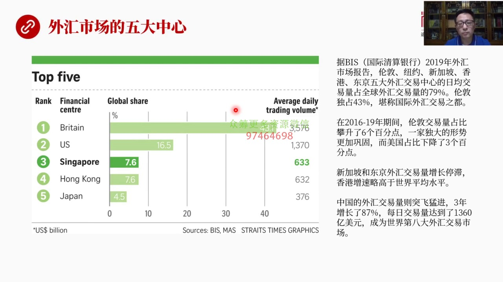

從交易量角度來看五大交易中心中排行老大了顯然是英國英國一家讀戰43.1%的比重全界所有外國交易量度英國幾乎佔了半筆江山每天的交易的規模這個高達3萬5千億3.5 接近3.6萬億所以英國是當之無愧的外匯交易之多遠遠超過小國家美國相對而言比英國要差多了美國的交易量外匯交易量只佔全界總交易量16.5%所以倫...

<strong>Cleaned narration</strong>

> 從交易量角度來看五大交易中心中排行老大了顯然是英國英國一家讀戰43.1%的比重全界所有外國交易量度英國幾乎佔了半筆江山每天的交易的規模這個高
> 達3萬5千億3.5 接近3.6萬億所以英國是當之無愧的外匯交易之多遠遠超過小國家美國相對而言比英國要差多了美國的交易量外匯交易量只佔全界總交
> 易量16.5%所以倫敦仍然是全界外匯交易的中心大量金融眼睜品大量的外匯交易的工具報價都在倫敦進行第三是新加坡小小新加坡也很牛佔全界外貌就是這
> 個外匯交易總量7.6%香港跟新加坡差不多都是7.6%日本跌下來了日本跌到了第5位佔全球的外匯交易總量跌到了4.5%我們來看看全球五大金融省我
> 會發現歐洲是英國美洲當然是美國只有這兩個中心是在亞洲之外剩下三個都是在亞洲其實這說明亞洲的外匯交易的發展前景特別是中國未來就發展前景可以說還
> 是非常的可以假忘的應該說未來中國的外交量它一定會突飛猛進如果我們來看現在這個數三年前2016年的時候跟2019年想比2019年的外匯交量中國
> 市場的外匯交量暴漲87%遠遠超過其他所有國家所以中國的市場的外匯交易的規模正在突飛猛進現在每日交易量達到1360億美元當然你要跟英國3萬5千
> 億美元相比還有和大差距但是增長速度非常快所以現在中國已經成了世界第8大外匯交易市場所以我在我們的核心課在我們的微課堂裡面專門強調過未來中國的
> 外貿或者叫外貿所移脫的金融服務中間這個外匯交易它一定會高速增長不管你在海南見外匯中心還是在哪兒將外匯還在上海外匯這件事一定會成為中國未來發展
> 的一個顯著的突出特點應該是全球外匯交易量增長最快的地區我們再看下一頁我們講的是美元的匯率

---

### Slide 6

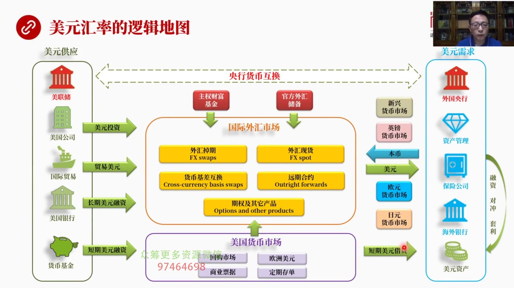

邏輯地圖什麼叫邏輯地圖我們再說匯率手外匯匯率市場外匯市場外匯市場是什麼我們知道美元是中心貨幣所有的貨幣都是先換成美元再換成其他貨幣所以我們首先得搞明白美元作為中心貨幣它的匯率市場它受什麼東西影響美元的價格怎麼來確定美元匯率是怎麼來確定的美元匯率美元匯率受什麼因素來影響當然如果沒有這張圖如果我們從來沒...

<strong>Cleaned narration</strong>

> 邏輯地圖什麼叫邏輯地圖我們再說匯率手外匯匯率市場外匯市場外匯市場是什麼我們知道美元是中心貨幣所有的貨幣都是先換成美元再換成其他貨幣所以我們首
> 先得搞明白美元作為中心貨幣它的匯率市場它受什麼東西影響美元的價格怎麼來確定美元匯率是怎麼來確定的美元匯率美元匯率受什麼因素來影響當然如果沒有
> 這張圖如果我們從來沒有畫出這張圖大家腦子們一定是非常的混亂因為影響美元匯率的因素太多來自思綿巴方的然後一會是伊朗出現了問題一會是地緣衝突一會
> 是各種樣的政治經濟各種各樣的這種包括疫情現象都會影響匯率所以腦子是非常混亂的為了把這種邏輯關係全部裡順然後我把它各種要素提煉起來提煉出來之後
> 我覺得簡單的說美元我們可以考慮美元的供應房在左邊我們可以考慮到全世界美元的需求房在右邊能夠向美元提能夠向這個外匯市場這中間形成了外匯市場能夠
> 向外匯市場從提供美元融資的和需要美元的這些人我都用建造化帥了包括這些市場所以我們從這張圖上可以一幕了了然的看清楚全世界的美元從哪裡來在國際外
> 匯市場中美元的供應和需求它的基本關係是什麼我們來看這個美元供應這一次美聯儲中央銀行當然是美元最主要或者說最根本的來源所有美元都得從它這處這中
> 間我畫了一條飛鴨南北的一條通圖這就是央行貨幣貨幣換直接對應到外國央行在金融危機的情況之下美聯儲可以打開央行貨幣貨幣換直接跟對方換貨幣把美元送
> 到其他外國央行讓這個央行獲得了美元之後可以提供給他們的金融機構國內金融機構環節美元荒這是中央銀行之間的貨幣貨幣換但這條路這條通路我是用虛煙化
> 甩的也就是說它不是正常狀態下一個長開的機制而是在唯一之下緊急動員起來了一種應急通道所以我用虛煙來標誌那麼像全世界外匯市場供應美元的主要供應方
> 首先是美國公司它可以進行跨國投資比如說美國公司可以到英國投資可以到歐洲可以到亞洲可以到南美可以到非洲金投資投什麼呢投的是美元所以美元通過投資
> 的形式可以進入不同的州不同的大州不同的地區不同的國家那就把美元送出去那麼除了這個之外還有就是國際貿易會產生貿易美元的流出比如說美國向中國訂購
> 訂購一些相包訂購一些這個採電訂購一些冰箱讓電器等等那麼它要支付美元所以貿易美元是通過美國向中國購買東西所形成的外匯逆差這種逆差就是向中國流流
> 過來的大量的美元流出中國的大量美元這叫貿易美元也進入了全球外匯市場可以作為全球外匯交易的供應源頭之一除此之外當然還有美國銀行提供了長期美元融
> 資你說你可以向美國的某家銀行比如說中國的一家公司可以向美國的在香港的分行或者是要息商港分支機構去申請美元代款發行美元債券它來幫你組織等等都可
> 以這都叫長期美元融資也就是獲得了貸款發行的債券等等那麼這些美元信貸美元融資美元債券構成了另外一種像全球金融市場提供美元的源頭除此之外還有短期
> 美元融資短期美元融資就是貨幣基金我們三月風暴準備這樣過這個事貨幣基金提供都是短期的幾天隔夜幾天或者幾個星期幾個月但是很短一般來說沒有長期的融
> 資的時間那麼長跨多那麼大主要的供應方是美國的貨幣基金那麼它作為資金供應方向全世界的金融市場外匯上提供短期美元融資那麼我們看貨幣基金它提供的走
> 向它這個資金是留到哪去了呢其實主要是留進了美國貨幣市場比如說回購市場商業票據歐洲美元和定金存單但是還有比如說聯邦基金還有這個短期國債我沒有練
> 得著因為這兩個並不直接會上發生關係我這列出的四個市場是直接會影響外匯市場的因為美國貨幣市場會向外匯市場提供美元的短期融資貨幣基金留進來的錢經
> ...

---

### Slide 7

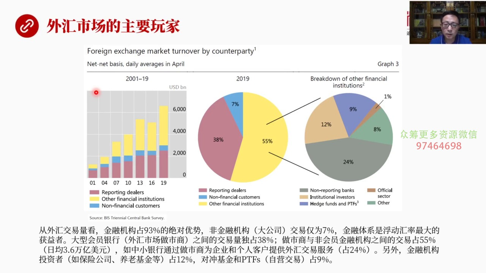

主要玩家到底哪些人這也是BS國際侵略銀行他們的統計19年我們可以看到這些比如說在這張圖它展示的是這個紅色的代表是外匯的交易商或者叫做事商主要是這些國際打銀行相當於做事商外匯市場的做事商大銀行黃色的是一些其他金融機構大量都是一些中小銀行或者對中基金等等還有非金融機構包括一些大公司做貿易的或者做金主口的...

<strong>Cleaned narration</strong>

> 主要玩家到底哪些人這也是BS國際侵略銀行他們的統計19年我們可以看到這些比如說在這張圖它展示的是這個紅色的代表是外匯的交易商或者叫做事商主要
> 是這些國際打銀行相當於做事商外匯市場的做事商大銀行黃色的是一些其他金融機構大量都是一些中小銀行或者對中基金等等還有非金融機構包括一些大公司做
> 貿易的或者做金主口的都可以那麼我們可以從這三張圖上可以看出一個很明顯的例子就是交易量金融機構這是外匯做事商這邊是這個金融機構做事商金融機構加
> 在一起總共佔有交易量93%的絕對有史這個是外匯做事商當然是大銀行這些是非銀行金融機構或者是一些中小銀行加在一起金融機構就佔了外匯交易量93%
> 說明什麼說明金融在外匯在幅度匯典形成了外匯市場中轉大了轉大法所以他們是重要了非銀行金融機構大公司它的交易量僅佔7%很說明問題它不是符於實業的
> 實業在中間只佔一個很低的比例金融體系在我看它是浮動匯率最大的匯移者首先我們來看它包括哪幾個組成部分大型匯元銀行就是這一塊我們來也說了他們較外
> 匯市場做事商主要是一些國際大銀行他們之間的交易大型銀行之間的做事商之間的這種交易佔到38%做事商和非匯元金融機構比如說日本的一些銀行它不是外
> 匯市場的做事商但是它是銀行或者是洋老保險這些機構金融機構他們在中間佔有55%的交易量也是一個很大的數字平均每天交易量在3.6萬億美元如果我們
> 來看這些人的組成比如說中小銀行日本的中小銀行可以為它的開戶的這些企業提供外匯服務也可以向個人提供外匯服務比如說你想做一個外匯方面的交易那麼你
> 可以找你的開戶開戶再找到匯元銀行就是找到做事商然後代理自己的這些客戶進行交易這就產生了所謂的代理商和中小銀行外匯做的商和中小銀行之間這種交易
> 另外還有金融機構金融機構投資者比如說保險公司養老基金他們大概佔有12%左右的這個交易量的份額但是除此外還有對中基金還有自營交易的這些公司大概
> 佔有另外9%所以我們來看把這個體上投稿就會知道在每一天外容上上成交的6.6萬一中間有93%都是金融機構做的那93%中間38%是屬於外匯市場的
> 做事商他們的成交量55%是這些做事商跟全世界的海外的中小銀行還有海外的金融機構之間形成了交易量那麼在這55%的這個這種中小銀行和金融機構交易
> 量中間又分這個在其中24%的是中小銀行為企業客戶個人客戶提供了外匯交易量12%的是機構投資者保險公司楊老基金9%呢是對中基金和1.5%還有1
> 00%很小很小的一部分是一些官方的除了呀或官方的外匯交易或官方的主建基金的交易佔比很低所以說到這裡大家就明白了外匯市場的主要玩家是誰外匯市場
> 的主要中心在哪裡外匯市場它的發展的立場然後包括現在的交易規模我們大提有一個初步的印象而且我們也產生了一個對於美元匯率形成了這個整體理解然後我們再看下一頁那麼在外匯市場中交易的五大工具是什麼呢

---

### Slide 8

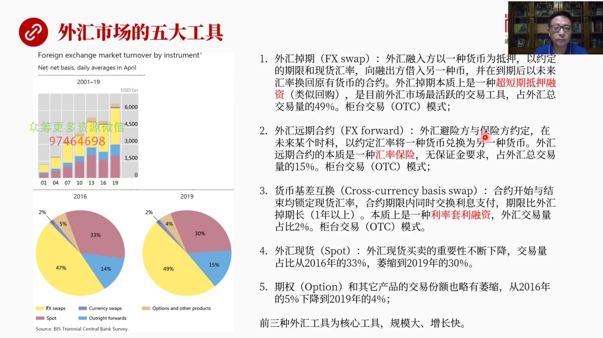

剛剛我們一開始畫那張圖上分別介紹外匯調期遠期合約機場互換外匯現貨還有期權五大類這五大類中重點是前三大類最重要的是外匯調期就外匯調期是什麼概念實際上以外匯作為底進行底下帶款就是比如說你要借美元你可以以日元作為底來借到美元然後約定我們倒是未來哪一天我們以什麼樣的匯率進行結算所以外匯調期它本上是一種底下帶...

<strong>Cleaned narration</strong>

> 剛剛我們一開始畫那張圖上分別介紹外匯調期遠期合約機場互換外匯現貨還有期權五大類這五大類中重點是前三大類最重要的是外匯調期就外匯調期是什麼概念
> 實際上以外匯作為底進行底下帶款就是比如說你要借美元你可以以日元作為底來借到美元然後約定我們倒是未來哪一天我們以什麼樣的匯率進行結算所以外匯調
> 期它本上是一種底下帶款一種貨幣為底去帶出另外一種貨幣的這種底下帶款它的性質類似於回購那麼這種外匯調期是當前當今世界上外匯是黨中最活躍的交易工
> 具首先要把它給遲到它在整個外匯總交易量中獨佔伴密將佔49%它的交易模式是OTC就是貴台交易模式外匯調期我們腦子面要記住它是以一種貨幣為底去帶
> 款另外一種貨幣是一種外匯底下融資本上是跟回購一樣的當然這中間設計到一個貨幣的匯率問題就是我現在開始進入合約的時候我以什麼樣的比如說以線貨的匯
> 率我們來借比如說我現在有億美元我要換6.82人民幣這是線貨就是現在匯率的價格那麼過了比如說我這個合約是一個月過了一個月之後我要把我持有了美元
> 換成了人民我要現在一個月中要把持有了人民幣再換回美元我以什麼樣的匯率來換呢是一當時的匯率也就是我們現在約定好我們一個月之後我們以什麼樣的匯率
> 未來遠期匯率然後我們約定好之後我以這個匯率換不來所以未來的匯率也是現在定的這樣的話就可以把未來的風險有效的給鎖住這個時候外匯調期非常重要獨佔
> 全部交易量的49%第二個類型的工具叫做遠期合約遠期合約實際上是一種外匯匯率的保險外匯調期我們剛剛講了是抵押外款外匯急合約本質上是一種匯率保險
> 也就是說需要保護匯率風險的這一方就叫避險方要跟保險方做一個約定在未來的某個時刻以約定的匯率將一種貨幣對換成另外一種貨幣外匯遠期合約的本質是一
> 種匯率的保險它跟我們日常理解的氣貨不一樣它沒有保證金的要求就是到了那天我們一次性的全部付不需要保證金它在外匯總交易量的15%也是屬於貴台交易
> 所以這裡往內加的一起就佔了64%就已經構成了市場的主力了主要的工具了第三呢就是貨幣機場互換貨幣機場互換就是我們在合約開始和結束的時候全部鎖定
> 匯率就是固定匯率我們都以現都以建載的這個匯率來結算過一年以後過兩年以後我們仍然以現在這個匯率結算比如說舉個例子現在人民幣和美元是1比6.82
> 那麼我們約好現在我們進行一比互換我把億美元換成6.82人民幣10年之後我們在同樣的匯率換回來還是以1比6.82換回來這不就等於固定匯率嗎但是
> 除了這個之外還要在10年之內要交換利息也就是說我用美元換了人民幣之後我等於是借了人民幣我要上交易對手支付人民幣的利息Liber加上一個其他對
> 方要向我支付我什麼呢相當於它借我美元那麼對方要向我支付Liber美元利率所以交換利息是問題的關鍵這個它的匯率是鎖定的就是兩條腿都已經是固定的
> 都是現貨匯率這個是它非常不一樣的地方它的交量不高只佔2%但是它的期限非常長往往是大公司做10年20年甚至30年的這種貨幣交換進行長遠的這種投
> 資投機的自己一般很少進入這個市場它也是貴台交易當然第四個就是外匯現貨外匯現貨的買賣性其實最近在不斷的下降交易量從16年的33%現在已經萎縮到
> 19年的30%也就是重要性現貨已經不太重要了期權還有其他產品交易份額也越來越小從25%24%所以這兩個都不是我們關注的重點現貨其實很簡單就買
> 和賣期權一般用得比較少特別是在我們最關心的這種金融市場中最活躍領域中用得比較少前三種123這個是外匯市場的核心工具因為它的供摩大然後它增長速
> ...

---

### Slide 9

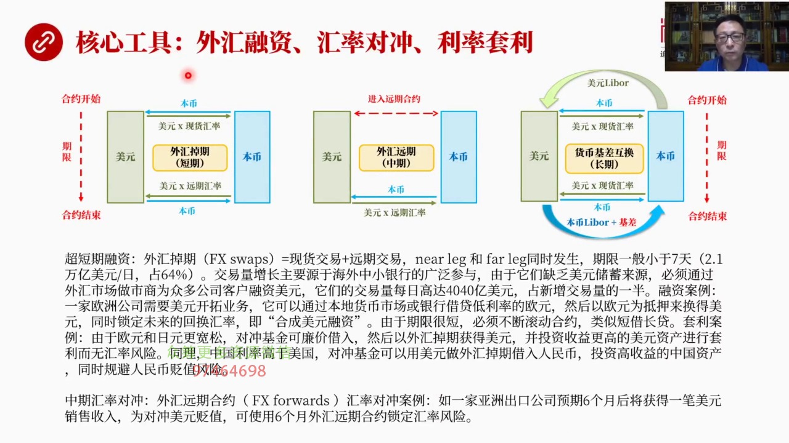

三個外匯融資匯率對通利率套利這是三個不同的功能和不同的工具做不同的用你比如說超短期融資外匯叫期就是屬於超短期的融資我把它的全部交易過程用這張圖畫台之後大家可能會螢幕了然也就是說這是美元擁有美元的一方這是擁有比如說人民幣的一方然後在這時間走是從上向核約開始從這開始然後再持續比說一個月到一個月之後結束這...

<strong>Cleaned narration</strong>

> 三個外匯融資匯率對通利率套利這是三個不同的功能和不同的工具做不同的用你比如說超短期融資外匯叫期就是屬於超短期的融資我把它的全部交易過程用這張
> 圖畫台之後大家可能會螢幕了然也就是說這是美元擁有美元的一方這是擁有比如說人民幣的一方然後在這時間走是從上向核約開始從這開始然後再持續比說一個
> 月到一個月之後結束這就代表這個中間的期限好在核約開始的時候假如我們設想一下你是中國的家房地上公司你現在在中國要進行美元融資很困難或者你想到海
> 外去投資房地產那麼你怎麼去獲得外地呢假如你帳上是有人民幣6.82億人民幣你要換一億美元你以為你要到國外去投資需要一億美元怎麼來做這事其實在核
> 約一開始你找到風險對家之後然後跟對方做一個交換我以6.82億人民幣我給你你給我一億美元我們俩進行互換這就是現貨匯率1比6.82這就是最近兩天
> 的價格然後過了比如說我們這個有時候期限是一個月到了一個月之後我們再換回來但是換回來這個月七匯率是多少呢是我們需要現在定我們在簽合之後就要把遠
> 七匯率一塊談頭也許這個遠七匯率一個月之後這個市場會率比我們約定了高也許比我們約定了低但是我們現在把它談定了我就不用擔心市場不動了就鎖定了未來
> 外匯這個遠七匯率上下浮動我就要這個擔心了所以在簽定合約的時候它是同時完成了這個現貨和遠七它是同時完成的就是說外匯交期等於一個現貨交易再加上一
> 個遠七交易同時進行也就是進端和遠端同時發生在簽署和動的時候我把這個會率1.821比6.82確定之後我們同時在談一月之後我們約定比如說以1.8
> 01比6.80作為一月之後我們換回來價格所以記憶堂合動全部搞定了我不用再擔心了那麼這種外匯交期一般七線都小於七天小於七天的佔比是64%他們每
> 天的交易量達到2.1萬億美元所以大部分人都用的是小於七天的超短期的外匯融資如果你需要美元那麼你拿你的外匯作為底拿你的本國貨幣作為底去借美元如
> 果你有美元你想到歐洲發展要借歐元也是以美元作為底去借歐元從本身來看它就是一個超短期的外匯融資為什麼最近幾年外匯調期增長這麼快主要是源於海外中
> 小銀行大量參與到這個交易了比如說日本的銀行還有中國的很多銀行也參與進來了中國的企業客戶要想在外貿上做一些套機保值做一些風險對衝做一些外匯投資
> 它都可以委託它的開戶行比如說中國銀行交通銀行建設銀行等等這些中國的這些銀行在海外市場上由於它也沒有美元儲蓄的來源它在美國沒有儲貨所以它們必須
> 要在外匯市場在調期市場中借它們也須要去開業美元以本幣以人民幣作為底去借美元再把這些美元再轉借給這些企業客戶或者個人所以中國的銀行體系也加入進
> 來而且它們要大量的使用外匯調期這個市場才能夠獲得美元但獲得美元你也可以直接找美國銀行貸款或者直接到美國的貨幣展上去發業商業票據當然這條路對中
> 國很多銀行是走不通的很多中國的銀行沒有資格或者沒有去過美國直接到商業票據展上去發一個幾個月的商業票據比如說交通銀行去幹一票或者你到這個其他地
> 方去去這種利用國際軍事長大規模展開這種外匯交易咱們做了還比較少或者不太習慣但是未來一旦整明白之後一旦把關於建立起來之後這個交易量會放上增長這
> 就是我們看到外匯調期這個市場它主要作用是什麼呢短期融資主要是中小銀行的廣泛參議它們缺乏美元儲蓄來源必須要通過外匯市場這個做事商它們要找外匯市
> 場的做事商也就是國際大銀行來幫它們提供風險對家交易對家的信息幫它們簽簽打橋然後幫助它們實現這個短期融資美元那麼這種交易量每天糟糕4000零四
> ...

---

### Slide 10

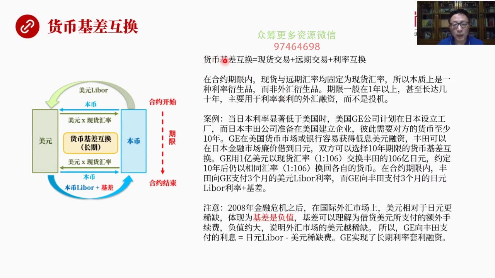

它實際上等於現貨交易加上遠期交易再加上利率互換三個東西一塊那麼再合約恆續期間現貨和遠期匯率均為固定固定利息固定匯率所以本身來說這是一種利率的眼神品不是匯率與眼神品不是外匯眼神品其實願意搬在一年以上甚至長達幾十年主要是用於利率套利的外匯融資比如說日本和美國有立差美國要比日本高所以美國公司當然就願意到就...

<strong>Cleaned narration</strong>

> 它實際上等於現貨交易加上遠期交易再加上利率互換三個東西一塊那麼再合約恆續期間現貨和遠期匯率均為固定固定利息固定匯率所以本身來說這是一種利率的
> 眼神品不是匯率與眼神品不是外匯眼神品其實願意搬在一年以上甚至長達幾十年主要是用於利率套利的外匯融資比如說日本和美國有立差美國要比日本高所以美
> 國公司當然就願意到就是利用日本低利息我用低利息去貸款不是挺好嗎怎麼來做我們舉個拒絕案例如果說日本搞零利率而美國如果不是現在是去年那一會美國的
> 利息加期縮表還比日本要明顯高要高一些比如說美國是比如說百分之二吧日本是零那當然美國的公司覺得我如果在日本去借錢不是更合算嗎可以這麼做怎麼做比
> 如說美國的記憶公司計劃本來我就有計劃在日本去設立工廠而日本也有一家這個公司比如說風田準備在美國建立企業好記憶公司肯定在日本搞經營需要日元而風
> 田公司在美國搞企業需要美元彼此需要對方貨幣至少十年咱們都準備實驗以上搞這個投資所以雙方都需要你需要日元咱俩換吧記憶在美國貨幣市場上或者在美國
> 林鄉中間很容易或者低溪美元那款它的運用好所以它可以低溪融融資美元風田同樣它可以在日本金融體系裡面聯價借到日元就是你記憶利用你的優勢搞到聯價的
> 美元我風田利用我的優勢聯價搞到日元然後我們雙方可以選擇十年期限進行貨幣提下貨幣記憶利用移椅美元以現貨匯率比如說昨天的一筆移椅美元對106日元
> 交換風田的106日元約定十年後仍以相當匯率移椅106換回個字貨幣注意這等於是一個機差互換真正發生變化什麼呢其實是一個利息在發生互換在合約期限
> 之內風田向記憶支付三個月的美元來自利率因為風田借的是美元而記憶呢借的日元所以它要向風田支付三個月的日元來自利率加上機差什麼叫機差我剛剛已經剛
> 剛提問一下機差實際上是我們可以把它理解成借代美元的額外手續費就算2008年金融危機之後在國際外匯市場上美元相對於日元要更加稀缺一些所以體現為
> 機差是付數機差可以理解為國際上上要借代美元所必須支付的額外手續費如果這個付的越大比如說付50個基點那就說明你這個日元向著於美元他說美元更稀缺
> 所以你要倒貼美元的借代方風田要倒貼機貼多少貼50個基點這個說說明外匯市場的美元比較稀缺如果你付了150個基點說明這個市場中美人太強手了日元不
> 值錢所以你還得風田還得貼機貼150個基點所以這個付職越大說明外匯市場中美元越稀缺那麼機翼向風田支付著什麼呢日元來賓簡去美元稀缺費就是這個手續
> 費所以機翼如果說我們看到雖然這是家號雖然這是家機場如果這是付數實際上是剪一個付職剪的比如說150個基點那就日元利率本來叫做很低再剪150個基
> 點號叫說是沒了所以機翼不用向風田支付利息或者支付一點點甚至有些去個別情況下機翼向風田不是支付利息是收取另外一筆費用風田機要向機翼支付美元來賓
> 還得向機翼支付一個美元稀缺費這個就是說明什麼機翼通過這個辦法就能夠實現長期利率套利的融資日本利率低美人利率高所以我利用這兩個國家利息支揭進套
> 利我實際上是在日本借錢以非常低的貸款利率在日本借錢中國了很多體驗其實沒有把這套給玩手或者我們沒有很好的通道進入國際上如果你能真正進入國際上中
> 國的利息是很高但是日本的利息很低歐元的利息很低現在美元也很低在中間是可以進入大量外匯交易的特別是外匯交期還有機差互換你有很多資金的成本是可以
> 有壓制下來其實這就是我不知道我們同一中應該有很多做外貿的或者做投資的人如果說大家有意願去嘗試一下用外匯交期和機差互換其實在香港有很多在香港新
> ...

---

### Slide 11

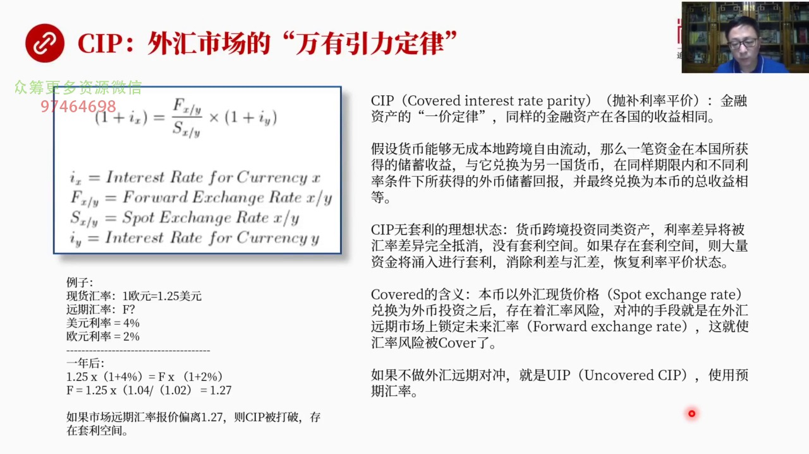

在外匯市長中到底遵循一個什麼規律呢它實際上是有一個類似於物理學的定律就是CIPCIP這個詞中文翻譯成POP利率評價我覺得這個詞我完全無法理解為什麼叫POP這個翻譯的非常不好就是非常讓人費解所以我仍然用CIP可能更簡單一些Inchressway的pilot其實就是就是利率評價cover的就是把利率評價...

<strong>Cleaned narration</strong>

> 在外匯市長中到底遵循一個什麼規律呢它實際上是有一個類似於物理學的定律就是CIPCIP這個詞中文翻譯成POP利率評價我覺得這個詞我完全無法理解
> 為什麼叫POP這個翻譯的非常不好就是非常讓人費解所以我仍然用CIP可能更簡單一些Inchressway的pilot其實就是就是利率評價cov
> er的就是把利率評價還有一個就是保護了意思那麼這個CIP什麼概念其實就是非常資產的一架定律我們知道一架定律這個是福利德曼在五十年代首先提出這
> 個概念就是漢堡包在美國如果賣六塊八一個漢堡包這個在美國賣一美元的漢堡包那麼在中國應該賣六塊八因為美元和人民是一比六點八實際上任何一個同樣的商
> 品在任何國家它最終的價格折算下來如果沒有任何總號的話都應該一樣一美元那個中國就是六點八反正是同樣的東西嘛這叫一架定律我們所說的購買利評價中國
> 現在購買利評價我們的GDP已經多少了我們人均收入已經高了很多都是遵循的一架定律這樣的一個背後的基本概念那麼在外貨市場那種道理也一樣金融市場那
> 種也一樣就是金融資產也存在一架定律嘛就是金融資產同樣金融資產我放在中國放在美國放在其他地方只要是同等類型的同等性用評級標準等等它的收益應該一
> 樣這是一架定律在金融資產領域中間的一種特殊應用這種關係被稱之為CIP應該一樣如果不一樣就說明出問題了我們就稱CIP這個它這個規律被打破了所以
> 我們如果來把這個概念深入解釋一下假設貨幣能夠無成本自由的跨境流動那麼一筆資金在本國所獲得的儲蓄收益與它對換成另外一個國家的貨幣在同樣期限之內
> 和不同的利率條件之下所獲得的外幣儲蓄的總回報然後把外幣總回報在對換成本幣的總收益應該是完全一樣的雖然有了繞但是我想大家基本上可以理解我舉個簡
> 單例子就是說假如你有億美元的資金你在美國買億美元的國債和把這億美元換成6.8人民幣在中國購買跟美國不一樣的利息的這種國債然後再把這個國債收益
> 最後再換回美元最終應該是一致了就是說的比較繞但實際上它就說的是移價定律的概念如果說滿足移價定律CIP應該是出在無套利的理想狀態就是貨幣跨境投
> 資同類資產立差的就是利率差異將對匯率差異的完全底銷沒有套利空間雖然比如說人民幣利息高美國利息低然後我投資人民幣國債好像我的轉得更大但實際上你
> 匯率匯率差異會把利率差異底銷掉你沒有套利空間撞不了錢所以如果存在它的空間如果推薦大力空間大量資金將會自動擁入這個市場經逃離並且很快消除立差與
> 匯差匯付利率評價狀態這就是CIP的核心概念那什麼叫covercover的基本行業就是本地以外匯現貨價格對換成外地投資之後存在這匯率風險對於從
> 手段就是在外匯緣欺上上鎖定未來利率就是我們先我現在投資外匯之前我先把退出的時候的匯率我們談定所以我談定之後我就不存在匯率風險這就叫外匯就是匯
> 率風險被cover掉了它被覆蓋了我不用擔心了所以拋補是什麼意思這是個什麼鬼我不認為這個詞我覺得中國很多這個翻譯詞都非常的怪異所以你還不如直接
> 說英文或者直接說這個它的縮寫更容易理解如果說交易方不做外匯緣期對通這是UIPOncover的CIP它使用的是什麼就是預期匯率說起來反送的其實
> 沒有這麼符來看這個公式很簡單這公式就是比如說這個F就是緣期緣期匯率除以現貨匯率然後在誠意我們可以看到這個1加i就是實際上這個X就是我們稱之為
> 是某種貨別X它的利率是在1加X是在左邊右邊它是1加Y就是另外一種貨幣Y它的利率在右邊然後我們用可以用這個這個所謂緣期匯率除以現貨匯率用這個比
> ...

---

### Slide 12

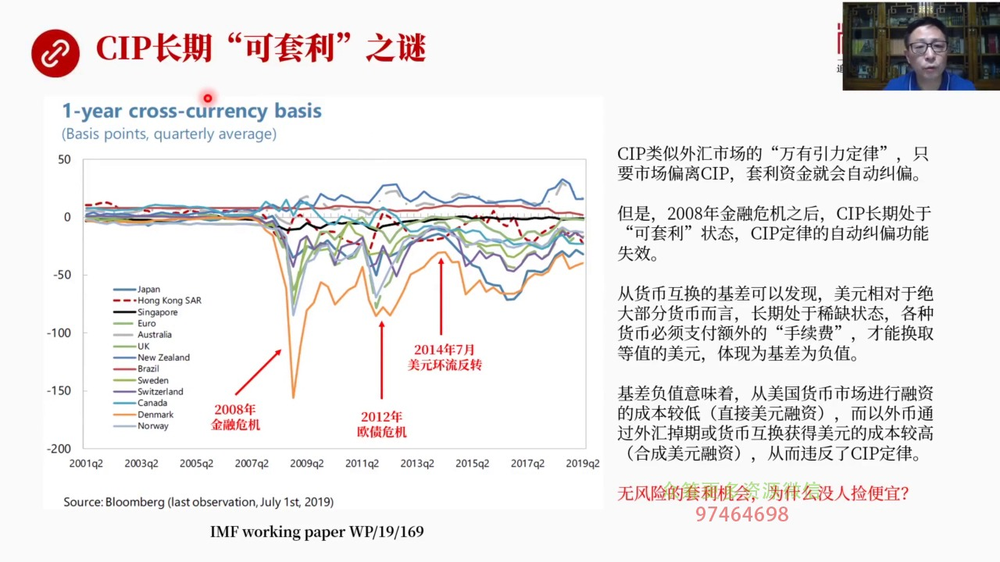

處於可套利狀態從這上多少我們可以很明顯看出來CIP如果偏轉了我們可以看到它偏轉將會通過貨幣資料互換的這個機艙也就是那個美元手續費負值的那個美元手續費提前出來負值的我們可以看到它明顯是在零以下的這都叫負值我們來看從2001年以上現在各個主要國家的貨幣日元什麼香港港幣讓新加坡元歐元澳大利亞什麼UK這麼多...

<strong>Cleaned narration</strong>

> 處於可套利狀態從這上多少我們可以很明顯看出來CIP如果偏轉了我們可以看到它偏轉將會通過貨幣資料互換的這個機艙也就是那個美元手續費負值的那個美
> 元手續費提前出來負值的我們可以看到它明顯是在零以下的這都叫負值我們來看從2001年以上現在各個主要國家的貨幣日元什麼香港港幣讓新加坡元歐元澳
> 大利亞什麼UK這麼多貨幣跟美元相比絕大部分貨幣都是立插維這都是個機插維覆的說明什麼說明這些國家貨幣跟美元相比美元更稀缺所以這些國家的貨幣要換
> 成美元你必須要向美元交稀缺費當然只有少數的向澳大利亞提起了按這樣的貨幣是屬於相比美元來說它比美元還稀缺原因是另外一種原因我們以後會講到那麼通
> 過這張圖其實我們看到2008年以後就是2007年經歷機爆發以後全世界存在了三次這個機插維覆的高峰期第一次是2008年2008年危機期間我們可
> 以看到向日元向很多其他的貨幣比如說單賣單賣貨幣等等負責很厲害負責100斤點我們知道這次還是還有負責150斤點甚至更多的這是危機時危機時期一定
> 會出現美元荒這個其實這張圖還有我們以前都講過就是只要是出現經歷機美元荒一定會產生因為整個金融體系中海外的外匯金融體系中會嚴重去發美元美元會斷
> 供會斷沒有所以大家都會強美元那麼第二個高峰機插機插的負值第二高峰是在2012年歐代危機第三個高峰是2014年7月我們講到了美元荒流反轉之後美
> 元再次出現稀缺所以這是美元稀缺美元稀缺三次美元稀缺的高峰使得在金融危機之後去12年一早幾年全世界主要國家貨幣在借美元的時候都要向美元支付一個
> 額外的保護費或者是稀缺費為什麼會出現這個現象因為只要你偏離的零往下走別說走得罩了你走只要拼一點點就會有套力自行進去把這條線給你拉回來拉到零為
> 什麼套力自行沒有把它拉回來呢為什麼外有引力定律師是消了呢這個就是一個非常有意思的問題從貨幣家貨幣家我們這個其實你已經看到這個手機費體象為階段
> 維覆這個手機費這個問題相當的明顯其他維覆意味著什麼呢換掉的來說就是從美國貨幣上上進行融資的成本較低就是直接融資美元更便宜而以外幣通過外匯調期
> 或者貨幣貨換來或者美元的成本較高這個叫合成美元也就是說我如果直接能到美國貨幣上上去發票據我融來了這個美元成本很低而我要通過我現在日本去融資日
> 元然後在把日元在調期上換成美元然後最後再把美元換回日元我的整個成本這樣形成了一個合成美元的這樣合成美元融資的這比交易但這比交易的成本要高於我
> 從美國貨幣上直接融資兩者以前應該是一樣按照CIP這個理論來說應該是一樣的因為外匯上假如理想情況之下沒有很多的這種沒有很多手續費之類的才應該是
> 一樣的其實我們在2007這個刊定商圖2008年以前CIP保持了很好就是外有引力定律在這個這個17之前2007年以前是完美的滿足了CIP的條件
> 也就是外有引力定律直到2008年以後才失效那麼這就有意思了既然出現了無風險套力這麼大的機會而且越來越明顯的機會為什麼這個套力機會沒有人去見便
> 宜呢為什麼套力資金不進去把這條中間的這麼巨大的一個100個積點甚至更高的這個立查給套走呢這個就是一個要探討了重要問題首先我們來看金融危機這時候怎麼來理解為什麼金融危機

---

### Slide 13

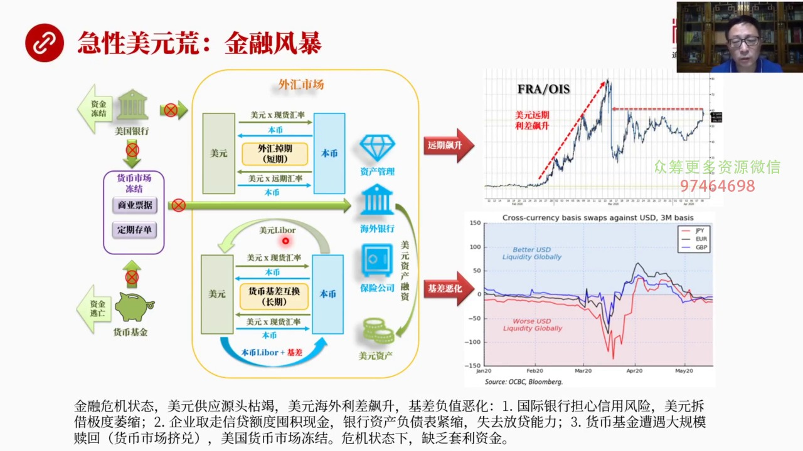

是會出現美元荒我們剛剛那張圖上看到既有提性的美元荒也有慢性美元荒既有美元荒的原理合在我們在金融空報核心課面基本上把原理講過外匯市場我們剛剛把這個做一個簡化的市場就是外匯調期貨幣機構互換然後包括有機合約一樣我們在這簡略一下然後給它供應資金的美元資金的源頭有幾個比如說美國的貨幣是這是提供短期融資的然後美...

<strong>Cleaned narration</strong>

> 是會出現美元荒我們剛剛那張圖上看到既有提性的美元荒也有慢性美元荒既有美元荒的原理合在我們在金融空報核心課面基本上把原理講過外匯市場我們剛剛把
> 這個做一個簡化的市場就是外匯調期貨幣機構互換然後包括有機合約一樣我們在這簡略一下然後給它供應資金的美元資金的源頭有幾個比如說美國的貨幣是這是
> 提供短期融資的然後美國的銀行是提供中長期融資然後美國的銀行也像貨幣上提供融資貨幣上再像它提供再像外匯上提供融資還有貨幣基金也像貨幣上提供資金
> 但是我們看到在二零二零年三月出現的情況是什麼其實二零零八年九月出現金融危機的時候情況很類似首先美國的銀行體系出現了問題美國的銀行體系首先是比
> 如說今年三月吧出現了問題是大量的企業面臨沒有錢了所以非常發布出商業票據他們就只有取銀行的額度取銀行的信用把銀行的額度全部取成現金不是真正意義
> 上現金是把銀行面的資金軟道他們在銀行的公司的賬號下雖然都是在錢還在銀行但理論上說這個錢已經不屬銀行了從銀行賬號上轉移到公司在銀行賬號上這就使
> 得美國銀行的資產負擔表一下收到了壓抑就是它一下它的資金不夠了資產負擔表不能夠足以讓它繼續擴張了所以它喪失了現在能力但同時這些銀行碰到危機的時
> 候彼此它的信任感也會下降不願意拆解資金所以我們來看擊殺惡化它會出現什麼情況金融危機爆發國際銀行的信用國際銀行單一信用風險美元拆解極度萎縮銀行
> 不借錢了同時企業去走了美國銀行的信貸額度臀金現金銀行資產負擔表緊張喪失了放在能力它既不願意放也沒有能力放在所以美元的源頭從銀行的被掐斷了這條
> 通道不通了這條通道也不通了我畫的是畫的實字差那麼這條通道也不行因為這條通道我們看到了2020年3月出現在就是貨幣基金大逃亡大規模的抽逃這個貨
> 幣基金為它的基金被抽走了抽走就沒有錢再給貨幣養來提供了所以這條通道被斷絕美國銀行這條通道被斷絕這條通道被斷絕所以貨幣市場被凍結商業票據定期存
> 在都發出來了那麼海外銀行日文的還有新加坡的香港的定義銀行本來是借助美國的貨幣市場直接融資的現在票據發出來了定期存在也沒人買了那麼這條子銀通道
> 通向海外的也被斷絕這就導致整個外匯市場的所有美元主要的源頭全被掐斷這就出現了極限的美元的斷貢或者叫美元供應供應源頭突然哭泣這就會導致外匯市場
> 中極度的缺美元沒有了以前這個水水源都被切斷了當然我們就首先會看到切斷之後水就不夠了利率一定會飆升所以我們會看到遠期的利率和OS製差OS代表美
> 國金融市場美國貨幣市場中間的中心利率那麽這個Full World的這個遠期利率當然就是對Liver的預期那麽這就說明在海外美元上在倫敦那個地
> 方出現了嚴重的美元光利率飆升了不僅利率飆升了同時在匯率市場上也反映出來了機差負值惡化我們看到在三月二十幾號美國出現金融合薄之後哇你看這個各個
> 各個國家的匯率日元對美元歐元對美元包括銀罷全部出現了大規模的機差微幅的現象也就是美元升值而這些國家必須要向美元去交很高廊的手機費比如說甚至到
> 了150個積點對於日元來說才能拆下到美元要額外交150個積點機差微幅到了這種程度說明市場上極度缺美元原因是供應美元所有源頭被切斷市場中需要大
> 量美元每天都需要巨額的美元進行滾動你如果一旦不給我錢我這個市場立刻玩完這就是我們看到的利率飆升了機差惡化所以這些問題說明金融危機或者叫外匯長
> 上出問題美元如果是爆發了這個金融危機的話它的美元來源就會被切斷所以匯率與一定會大亂包括利率上也會大亂海外美人市場海外美人市場會亂成異國州所以
> ...

---

### Slide 14

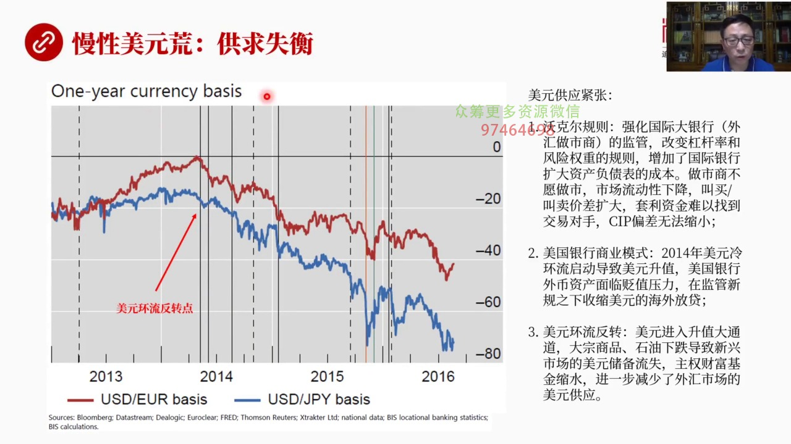

主要是供求失衡如果我們看這張圖這張圖畫的是從2013年以來一直到2016年這幾年中間的這個紅線代表著歐元美元和歐元之間的這個機差藍線是美元和日圓之間的機差我們都可以看到這有個明顯翻轉點是什麼時間2014年的這個夏天也就是我說的美元還留翻轉點一旦翻轉點出現之後我們看了機差這是零不管是對歐元也好對日圓也...

<strong>Cleaned narration</strong>

> 主要是供求失衡如果我們看這張圖這張圖畫的是從2013年以來一直到2016年這幾年中間的這個紅線代表著歐元美元和歐元之間的這個機差藍線是美元和
> 日圓之間的機差我們都可以看到這有個明顯翻轉點是什麼時間2014年的這個夏天也就是我說的美元還留翻轉點一旦翻轉點出現之後我們看了機差這是零不管
> 是對歐元也好對日圓也好機差變幅的情況越來越嚴重惡化就是從2014年之後開始迅速惡化機差的幅幅的程度越來越大說明什麼說明這個時間段出現了比較嚴
> 重的慢性美元荒所以我們要從供求兩方面來理解什麼叫慢性美元荒先說美元供應美元供應趨勁有三個原因第一個原因是窩克法則窩克爾規則主要是針對國際大銀
> 行的強化對他們的監管而這些國際大銀行主要又是外匯市場的做事商如果你監管了它比如說改變了槓槓率還有改變了風險權重的計算等等這些規則吧這就會增加
> 這些國際大銀行它的負擔它的負擔它在擴大自然負擔表述它的成本就上去了所以作為外匯做事商他們不願意做事嗎他們不願意不願意在這個賣力去做事為市場提
> 供這種交易服務所以這個外匯市場流動性會下降較賣價較賣價價差會擴大那麼套利資金就是想利用這中間有套利機會這些套利金想去套利結果呢做事如果不做事
> 你根本就找不到交易對手或者很難找到交易對手這就導致雖然有很多人想去套利他沒有辦法沒有能力把這個曲線往上拉因為流動性下降了然後做事商不做事了或
> 者做事的能力下降套利資金很難找到交易對手你有心也無力這個套利很難做這是一個為什麼這條曲線沒有回彈回到靈敏一個重要原因另外一個原因就是美國銀行
> 的商業模式發生變化14年冷華6開始了冷華6開始當然是這個機叉互換的惡化這個機叉值得負值越來越深同時伴隨著美元指數的越來越高也就是美元升值了美
> 元升值以後美國銀行的美國銀行它是在全球都有投資了它有大量的外幣資產結果外幣資產由於美元升值就會面臨貶值的壓力貶值壓力就會遭到外何法則對它們監
> 管的嚴厲的這種制裁又越好警告也好所以在這種新的監管法案之下它沒有辦法只能收縮美元的海外信貸也就是說美元越升值我越不敢在海外進行防災因為放在出
> 來的變成了外幣資產結果外幣資產在美元升值情況之下它會貶值直接對我資產貸表構成嚴重的壓力第三個就是美元反轉環流反轉之後美元升值大東商品石油價格
> 暴跌這導致以前很有錢的新上國家變窮了它們的美元儲備流失了因為它們本幣貶值必須賣美元推生自己維持自己的穩定幣值所以外匯儲備不斷流失另外它們的主
> 持人財富基金也縮水了所以這進一步減少了外匯市場的美元供應源頭本來我說外匯儲備在上面在那個邏輯圖上面又外匯儲備和主持人財富基金現在由於美元環流
> 反轉美元升值當中商品暴跌好這些國家都沒錢了各個方向上你都會發現美元供應越來越緊那麼美元的需求我們再看美元的需求說美元需求之前

---

### Slide 15

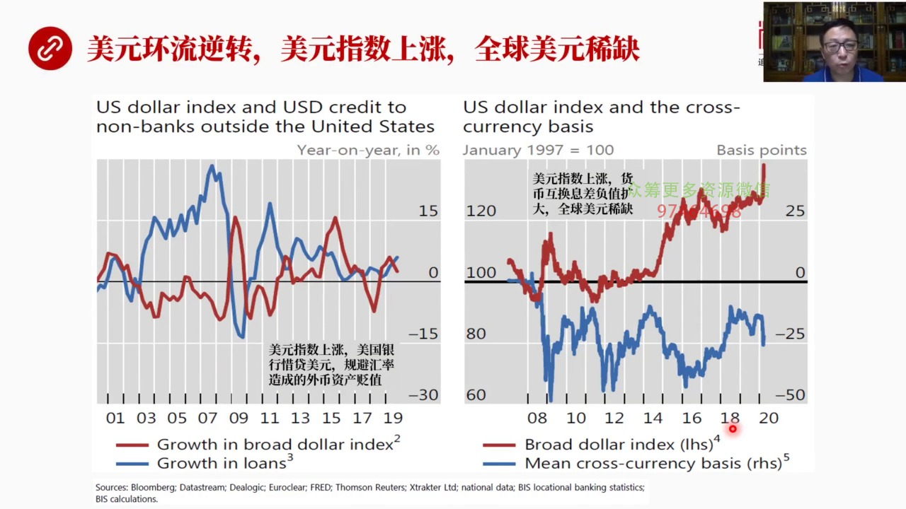

我們先看一張圖美元環流逆轉之後從熱環變成冷環流美元指數上漲當然自然會帶來美元稀缺如果我們來看這張圖你會看到紅線這個是美元指數我們看到美元指數藍線是美國銀行對外的貸款你看看這條這兩條圈是什麼規律只要美元的指數變弱美國銀行對海外的美元放貸就會上漲但是如果美元指數上抽就是美元升值了美國銀行對海外貸款就會下...

<strong>Cleaned narration</strong>

> 我們先看一張圖美元環流逆轉之後從熱環變成冷環流美元指數上漲當然自然會帶來美元稀缺如果我們來看這張圖你會看到紅線這個是美元指數我們看到美元指數
> 藍線是美國銀行對外的貸款你看看這條這兩條圈是什麼規律只要美元的指數變弱美國銀行對海外的美元放貸就會上漲但是如果美元指數上抽就是美元升值了美國
> 銀行對海外貸款就會下漲兩者是相反關係主要原因是美國銀行在升值情況之下它會攜帶美元主要是規幣會率造成的外筆自然貶值而這個東西影響它自然負債表會
> 對它的放貸盟力構成壓力我們再看這張圖美元指數和貨幣互換機差我們可以看到紅線是美元指數美元指數如果越來越高那麼基本上我們看到藍線這貨幣互換機差
> 就會越來越負就變得越來越負這什麼意思呢美元升值了那麼美元變得更稀缺所以機差互換的負值扣大全球美元處在一種慢性稀缺狀態之下這張圖非常好的解釋了
> 我們剛所說這個原理好我們再看剛才說成供應再看美元的需求美元有不同需求

---

### Slide 16

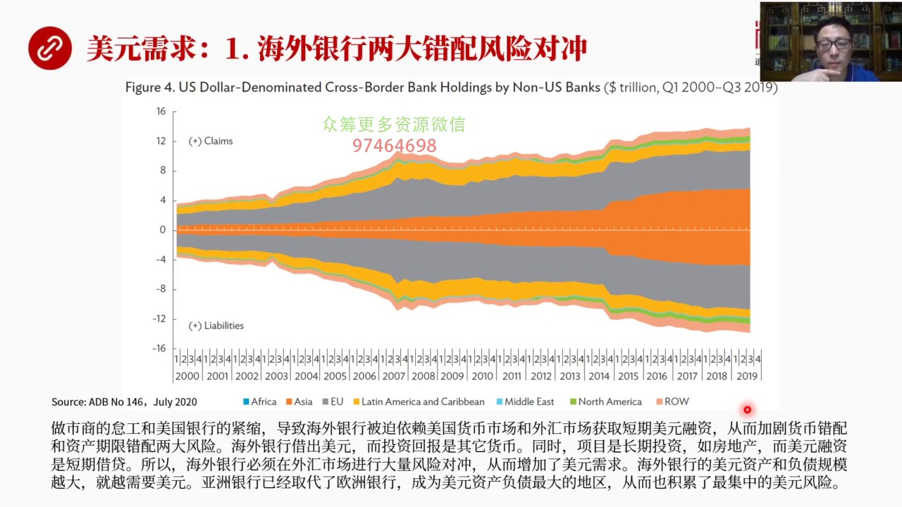

第一個需求是海外銀行它有兩大挫配兩大挫配會產生風險這種風險必須得到有效對通所以海外銀行持有的美元資產負債量越大它越需要進行風險對通我們看這張圖這張圖是以美元計價的跨境銀行主要是非美國銀行比如說中國銀行日本銀行和歐洲銀行等等這些銀行到底持有多少美元定計價的資產呢從2020年到2019年去年我們可以看到...

<strong>Cleaned narration</strong>

> 第一個需求是海外銀行它有兩大挫配兩大挫配會產生風險這種風險必須得到有效對通所以海外銀行持有的美元資產負債量越大它越需要進行風險對通我們看這張
> 圖這張圖是以美元計價的跨境銀行主要是非美國銀行比如說中國銀行日本銀行和歐洲銀行等等這些銀行到底持有多少美元定計價的資產呢從2020年到201
> 9年去年我們可以看到全部的總的資產規模上面這條網上這是資產底下是負債我們可以看到持有美元的資產和負債就像喇叭這個形狀越來越大也就是資產負債同
> 時都在增加有些國家有些地區是美元的進資產狀態有些是進負債的狀態就是有些是美國的美元的進介入方有些是進信用方提供美元信貸的往外提供的我們剛剛已
> 經說了由於美國外匯作勢上國際黨銀行他們的消息代工因為他受過過程法則管制他就不願做事了同時呢美國銀行的信貸由於美元生殖的緊縮導致緊縮使得海外的
> 的這些銀行中國日本韓國再加上歐洲日本這些國家的海外銀行他就沒有辦法在依賴傳統的做事商外匯外匯的做事商還有美國銀行的這種貸款然後他們就被拓越來
> 越多的依賴美國的貨幣上我們也講到的日本銀行在美國貨幣市場上在定義存單外商有票局上大量發行票局和存單都是為了獲得短期美元當然他們也可以在外匯上
> 上通過調期來獲得短期美元融資這樣一來就會加劇他的貨幣挫配和資產期限挫配兩大風險什麼意思呢海外銀行比如說日本銀行他要借譜美元他像比如說像中國投
> 資像東南亞投資他放貸出權放貸出去是美元投資但是他投資回報在當地產生了現金流比如說東南亞的貨幣人民幣比如說香港貨幣所以這就產生了一個貨幣挫配他
> 借出去這是美元而投資回報是非美元所以對銀行來說這是有風險的另外其實在這之前還有一個還有一個一點是強調日本銀行所持有了美元很多情況下並不是他通
> 過貿易賺賣錢而是日本銀行把大量儲美元的儲蓄先通過外匯調期換成了美元再把美元投到東南亞中國和香港所以他要好幾重的就是他是一個創聯的外匯調期這就
> 產生了明顯的貨幣挫配風險這必須要對通如果不對重會歷史上大幅波動他就會虧損慘重同時很多項目是長期的比如說我投三峽水壩我投房地產這動折是幾年到幾
> 十年而美元融資呢由於我不能從這個其他方面來我只能借助短期融資所以我的融資期限都是短期期天或者期天以內我投資房地產動折一兩年這叫期限挫配融資期
> 限短而資產的期限長那麼這些海外銀行必須要在外匯上上進行大量風險對重從而增加了美元需求你怎麼對通都得使用美元你的對通量越大你需要的美元量也就越
> 大這就是我們我們一般人如果不深入去理解外匯上你理解不了為什麼日本會需要這麼多美元因為他的美元資產和負債太大了你要保護這些資產和負債你就需要大
> 量的美元對就是大量的外匯上的操作要麼風險對重要麼滾動融資要麼是這個套利這種行為都會增加對美元的需求那麼海外銀行美元資產負債表資產負債表如果規
> 模繼續膨脹如果跟著越大其上面越需要美元其實我們可以從這張圖上可以看到中心日本是亞洲歐洲已經變越變越小現在亞洲地區已經取代了歐洲地區它的美元的
> 資產的負債的地位也就是亞洲地區成了擁有最多美元資產負債的地區我們可以看到這個亞洲同樣也積累了巨大的美元風險這個就是我們有利有幣有利地方你美元
> 資產規模越來越大有幣的地方美元資產越大你越需要美元而需要而得不到這就會導致嚴重的精靈危機所以積累了巨大的風險所以銀行海外的銀行全世界的非美國
> 銀行為了對稱兩大挫配風險需要大規模的美元融出需要大規模的美元這張圖上所擁有的資產量美元積價資產的越大全世界就越需要美元所以為什麼我們說這個美
> ...

---

### Slide 17

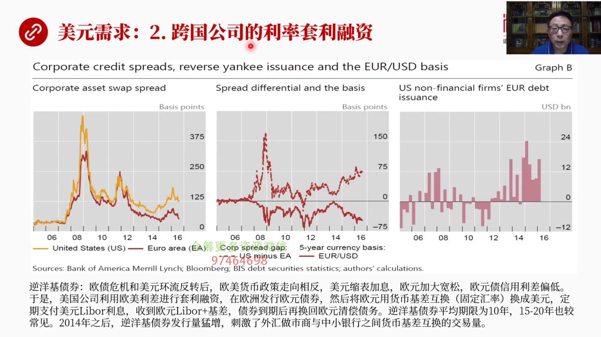

你比如說如果我們看這三張圖這個是歐元區和美元區的企業信用它的立差就是信用的差異這個紅線是歐元黃線這個黃線是美國的企業這邊是歐元的歐元區的企業他們的信用立差明顯歐元企業偏低歐元企業為什麼偏低因為歐元大規模的在搞量貨噴鬆美國當時已經縮表了已經不搞了所以由於搞量貨噴鬆央行印錢去買企業債所以就會把企業的收益...

<strong>Cleaned narration</strong>

> 你比如說如果我們看這三張圖這個是歐元區和美元區的企業信用它的立差就是信用的差異這個紅線是歐元黃線這個黃線是美國的企業這邊是歐元的歐元區的企業
> 他們的信用立差明顯歐元企業偏低歐元企業為什麼偏低因為歐元大規模的在搞量貨噴鬆美國當時已經縮表了已經不搞了所以由於搞量貨噴鬆央行印錢去買企業債
> 所以就會把企業的收益率給亞低把他信用風險減少所以這個信用立差課的歐洲企業發債更容易成本中低同時外匯機差也變化了我們來看外匯機差變得越來越富同
> 時美國和歐洲地區的它的這種歷差越來越大那麼對於這個機差來說它的影響越富就是機差這個數值變得越富這說明什麼說明市場中需要更多的這種美元那麼如果
> 看這樣一張圖這個就是美國的企業不是非不是這個金融機構的美國普通企業他們的歐元債務的發信量這個很有意思美國企業跑到歐元去去發債為什麼歐元的成本
> 低你看這個信用力差我如果在歐元發的話我的利率會比美國更優惠因為各種條件都說明我在歐元地區發債一家美國企業比在美國發美元債要核算這就出現了一個
> 很有意思的金融產品叫逆揚機債券逆揚機債券什麼概念呢就是歐趙維基和美元環境反轉以後歐美兩個貨幣區的貨幣政策開始反向也就是分到揚標美元區和表價息
> 歐元區加大寬鬆所以歐元債券的信用力差比美元要低這因為這個原因所以美國公司利用歐美之間的力差進行套利融資怎麼套利呢就是美國企業跑到歐洲去發信歐
> 元債券然後講獲得了歐元用貨幣機差互換也就是鎖定就是固定匯率了用貨幣家或是互換換成美元定期支付美元的拉伯利息主要它現在美國公司是站到歐元立場上
> 所以它要向風險對家支付是美元利息收到的是歐元拉伯加機差而這個機差是付數因為我們在這看到歐元變得就是美元變得向這個歐元更稀缺歐元的貨幣政策更寬
> 鬆債券到機之後再把歐元再把這個這個美元換回到歐元清長在歐洲發信的債務所以你一樣機債券平均期限我們可以看到很長十年十五年到二十年也很多甚至還有
> 更長的2014年以後我們看到2014年之後美元還留一旦逆轉之後美國和歐洲的貨幣政策分到揚揚美國變緊歐洲變寬鬆所以大量的美國企業紛紛跑到歐洲去
> 發歐元債然後利用貨幣機差互換再把歐元換成美元一換就換十年十五年花二十年然後在十五年之後二十年之後再以原來的匯率再換回去這中間唯一變動的就是利
> 息就是美國的企業需要支付美元來不利息收到歐元來不耀機差即便是這樣我們算起來這些企業算完之後仍然是壯慘了他們特別便宜這種融資大興提到達到了一年
> 達到了好幾百億美元所以這是前幾年最貨的一種一種融資叫密陽機債券所以跨國公司利用各個國家不同的利率政策它進行的是跨利率就是在利率市場上進行套利
> 的融資使用貨幣機差互換這種行為也構成了大量的美元需求因為這在外國市場上需要好幾種工具的配合增加美元來需求量只要外國市場上變大只要外國市場總的
> 交易量變大美元的使用量就一定會變大對美元的需求量一定會變大因為美元佔所有外國交易中間的進糾成進去90%所以只要總量誇大美元的交易量就會誇大那
> 就說明美元的需求量在上長我們再看美元的需求是3來源於什麼地方來源於金融機構的

---

### Slide 18

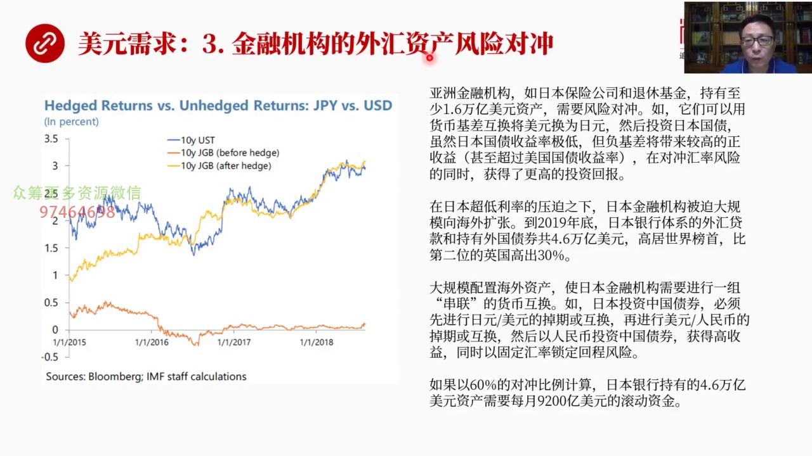

外匯資產風險對衝比如說亞洲的很多金融較日本保險公司推游基金他們就持有1.6萬億美元的資產這些資產需要進行風險對通怎麼對衝你可以看到這有個非常有意思的投資的方式比如說這些日本保險公司推游基金可以把他們手中的美元換成日圓通過後比機械護換然後在投資日本的活債我們重要的日本國債很低這日本國債收益率有些收到是...

<strong>Cleaned narration</strong>

> 外匯資產風險對衝比如說亞洲的很多金融較日本保險公司推游基金他們就持有1.6萬億美元的資產這些資產需要進行風險對通怎麼對衝你可以看到這有個非常
> 有意思的投資的方式比如說這些日本保險公司推游基金可以把他們手中的美元換成日圓通過後比機械護換然後在投資日本的活債我們重要的日本國債很低這日本
> 國債收益率有些收到是付數但大多數是時候接近於零基本上沒有投資價值幾乎就是零但是你會發現他們投資日本國債雖然日本國債收益率接近於零很低但是他是
> 把美元通過後比機械護換換成日圓而機械日圓的付機械給他們帶來了巨大的收益也就是說他用美元換日圓日圓房他的交易對手需要向他支付付機差這個付機差就
> 很高了所以我們來看他的付機差加上加上這個這個國債一點點回報率再加了付機差他的收益率就變得很高了我們看這個線這個黃線他的收益率甚至能夠達到3%
> 超過美國國債收益率這就是一種非常非常新的玩法我們知道很多國家的收益率債券收益率是為富但為什麼有人去買呢他們買的不是這些債券的收益率買的是機差
> 付機差誰要用美元在市場上進行付機差交易貨幣互換投資德國的債券投資英國債券或投資日本債券債券本身也許不斷錢或者賺了還是少還是少但是機差能夠給你
> 帶來很大的利潤所以這個是我們其實沒有腦子沒有轉過來人家是這麼在玩那麼在日本它出現了一個問題是超低利率長期超低利率壓迫了這些保險公司沒地方投資
> 所以除了這種機會之外金融機構日本的金融機構被迫大規模像海外課章到2019年底日本一樣體系了外匯貸款和持有外國債券的總數高達4.6萬億美元事業
> 老大比第二位的英國高出30%大規模配置海外資產使日本金融機構需要進行一連串一個串聯的貨幣互換比如說日本的投資人就日本金融機構他要投資中國債券
> 手上有大量的日元所以他不能使用日元直接換人民幣因為沒有這麼大的交易量所以日本的保險公司必須要把手中日元先換成美元做掉期或者互換然後再把美元再
> 換成人民幣再做掉期貨再做掉期貨互換這是一個串聯的互換或者要串聯的票區最後以人民幣投資中國債券市場獲得一個更高收益獲得高收益同時他要塑我定會率
> 風險回程怎麼回我簽的時候就已經把回程利率給鎖定了把回程的會率給鎖定了所以我沒有會率方面的風險那麼日本金融機構你不管是以日元進行投資還是以美元
> 金投資都需要大規模的對重如果說日本的這個投資的對重比例就是這個是日本央行做了一個推算以60%的對重比例來計算那麼日本的金融體系持有了4.6萬
> 億美元的資產需要每個月要貨必須要貨的9200億美元的資金滾動也就是他每個月要滾動9200億他需要這麼多美元來進行他的滾動每月需要這麼多錢大家
> 想想看這就說明日文這個國家擁有大量的外筆資產而他擁有外筆資產越多他就越需要美元因為他不管是最終換成人民幣還是換成了香港長幣還是換成需要任何貨
> 幣首先都是要換成美元再從美元換成貨幣所以無論你怎麼換你都是要增加美元的需求量這就是一個很有意思現象那麼日美的立差

---

### Slide 19

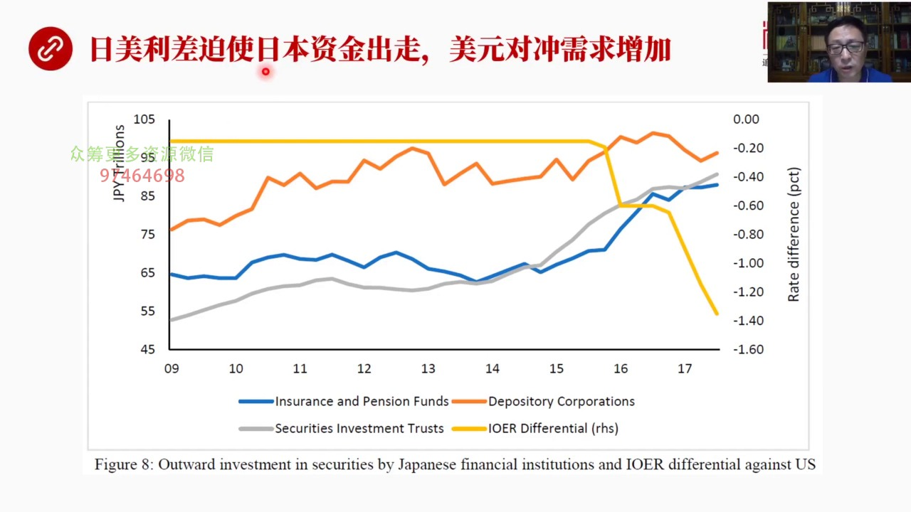

迫使日本資金出走所以會帶來日本對美元對衝風險對衝的需求是大量資價比如說這條線這條線是日本銀行體系的IO1R朝著密金利率和美國的利率支插我們知道日本是付出美國是正數兩者一捷就是付到這兒然後我們看到當你變得這麼付的時候也就是說日本開始推行嚴重的付利率的時候你會逼得這些比如說藍線是保險公司這個是日本的這種...

<strong>Cleaned narration</strong>

> 迫使日本資金出走所以會帶來日本對美元對衝風險對衝的需求是大量資價比如說這條線這條線是日本銀行體系的IO1R朝著密金利率和美國的利率支插我們知
> 道日本是付出美國是正數兩者一捷就是付到這兒然後我們看到當你變得這麼付的時候也就是說日本開始推行嚴重的付利率的時候你會逼得這些比如說藍線是保險
> 公司這個是日本的這種證券證券這種信託還有存款的這些公司這些公司在你嚴重在你實行付利率的情況之下跟美國人的立差一下變得美國利率高日本低得太厲害
> 你會看到這一錢就會出走所以在執行這個付利率之後或者在日美立差就是日本太低美國在偏高情況之下日本的所有的資金金融機構的錢都在往外地這就導致了日
> 本資金出走日本資金只要出走就一定會先換成美元所以就會增加日本對美元它的需求就是你只要出走不管走哪個國家先換成美元然後再換成你要所去的終點國的
> 貨幣那麼你就一定要房子你回程回不來因為會立大幅波動嘛所以你就一定要在外匯市場上跟美元再做反向再做這個就是一定要用外匯交期把美元的回程利率給鎖
> 定你才敢往外去投資這都會增加外匯市場交易量都會增加對美元的需求量所以最後得到這個病叫什麼呢叫糖尿病

---

### Slide 20

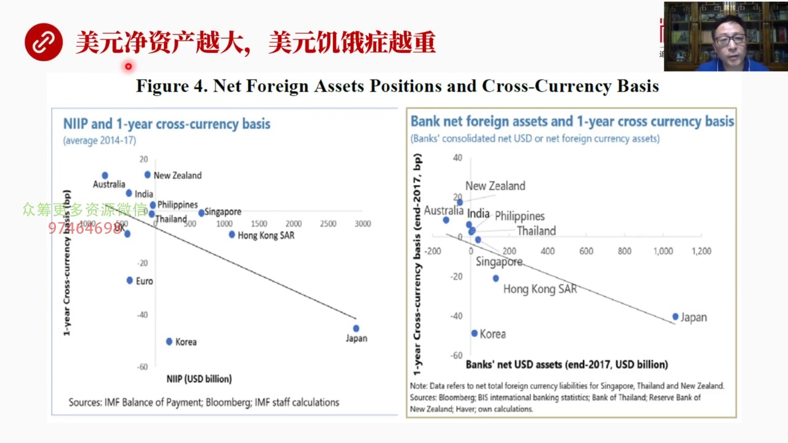

美元資產規模越大美元機構正越嚴重你越是糖尿病人越喜歡吃糖越吃糖可能這個糖尿病一定挺越嚴重其實美國美元設計的體系高明就高明的這實際上日本就是最明顯的一個例子我們來看這個是日本揚行他們的一張圖這張圖讓我覺得非常有意思因為這張圖這個重作標這是代表一年的貨幣機差富術當然是代表了美元稀缺的程度那麼橫作標代表的...

<strong>Cleaned narration</strong>

> 美元資產規模越大美元機構正越嚴重你越是糖尿病人越喜歡吃糖越吃糖可能這個糖尿病一定挺越嚴重其實美國美元設計的體系高明就高明的這實際上日本就是最
> 明顯的一個例子我們來看這個是日本揚行他們的一張圖這張圖讓我覺得非常有意思因為這張圖這個重作標這是代表一年的貨幣機差富術當然是代表了美元稀缺的
> 程度那麼橫作標代表的是一個國家它的金融資產的情況如果在這一側在X側或者這一側在右邊正數這邊代表著這個國家是進債權國就是它向城市界放貸我們顯然
> 意見看到日本是屬於進的債權國全世界是頭髮交易它放貸出這個三萬多億美元當然是債權國也國日本的富術機差情況最嚴重它付到了50個積點我們可以看到一
> 個外會擁有大量外會儲備擁有大量對外債權的叫你個國家居然越缺美元缺的是全世界很厲害的可能僅次於韓國為什麼會這樣這個現象就是說我剛剛所說的你的美
> 元進散越大或者你越需要向海外去投資就越需要先換成美元然後換成美元在換成終點貨幣你就越需要外會的調期來對重你的回程風險那就會增加對美元的需求量
> 所以這個國家資產越大對外投資越大進散越大對外投資越大它就越缺美元這一張圖是美國這是全世界銀行體系之內外會淨資產和貨幣機差關於圖這邊還是貨幣機
> 差外州還是貨幣機差附數代表著缺美元行州代表著銀行體系的淨資產我們看到日本同樣是一個問題銀行的淨資產是1萬多億美元淨的就是我的資產簡直負債淨的
> 資產但是我的負值我的這個貨幣貨幣貨幣仍然就負值也就是我既然還是負值我有這麼多美元我居然還可以美元我居然還要像美元在交像美國交一商在交這個手段
> 這個都說明還有意思就是不要把這問題想通想透你會知道原來一個國家因為我美元越多它越需要更多的美元想法就同樣的一個道理就整個全世界美元輸放越來的
> 在全世界資產中間定價資產中間規模越來那麼全世界就越來越離不開美元直到整個體系一起崩沒有哪個國家能夠單獨獨善其實我先撤出來我不給你們玩了不可能
> 你只要在這個貨幣體中間就只有跟美元私所在一起最後美元崩了大家一起完蛋然後才能重建貨幣體系這個是我們從外匯交一項中你越來越明確看到這就一定是一
> 個發展的必然方向我們再看下一項這就是為什麼日本會重度依賴美聯儲的貨幣互換

---

### Slide 21

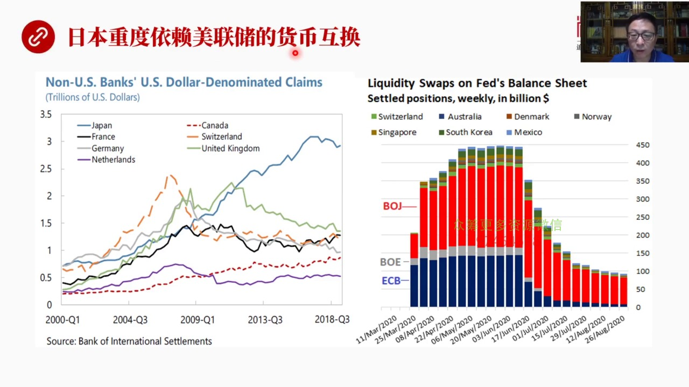

我們看看日本在這條線全界非美國的銀行體系就是海外銀行體系中美國就是擁有美元的資產誰最多日本最多高達3萬億美元其他國家歐洲的這個銀行機構持有了美元資產都不太多都在下降日本一直讀秀擁有這麼多美元的資產但是你看著這張圖這張圖是今年3月2020年3月金融風暴之後美聯儲搞得貨幣互換跟所有國家貨幣互換九大央行誰...

<strong>Cleaned narration</strong>

> 我們看看日本在這條線全界非美國的銀行體系就是海外銀行體系中美國就是擁有美元的資產誰最多日本最多高達3萬億美元其他國家歐洲的這個銀行機構持有了
> 美元資產都不太多都在下降日本一直讀秀擁有這麼多美元的資產但是你看著這張圖這張圖是今年3月2020年3月金融風暴之後美聯儲搞得貨幣互換跟所有國
> 家貨幣互換九大央行誰要的美元最多流動性最缺的是日本標誌日本央行缺少大量的美元流動性從3月風暴一直到現在一直到今天為止日本的央行仍然嚴重依賴美
> 聯儲給它的貨幣互換美聯儲不給日本的體系會出問題為什麼知道今天日本仍然占有所有美元貨幣互換美聯儲貨幣互換中了絕大多數在其他時段分別占有大半而現
> 在已經占到了絕大多數就是因為日本的央行體系嚴重依賴美元而它們在市場中找不到足夠的美元所以只能依賴美聯儲提供的央行互換這是我們深刻理解外匯的一個非常重要的一個點我們再看下一CIV10在我看起來

---

### Slide 22

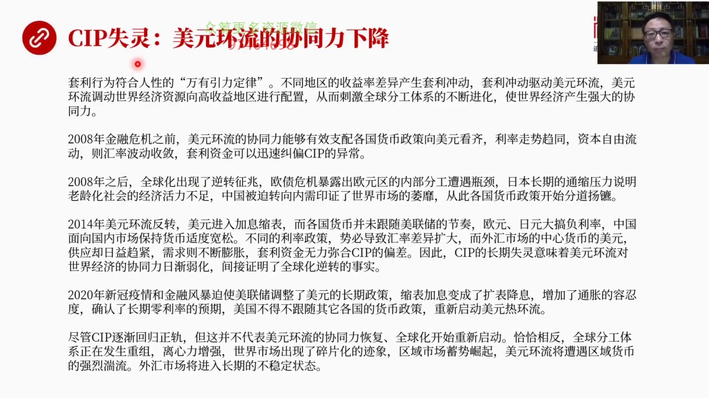

它意味著美元環流的企業同意在下降我們知道套利行為符合人類的萬有引力就是人性的萬有引力那麼不同地區的社會利益的差異產生套利衝動套利衝動驅動美元環流美元環流調動世界的資源它也知道那些高收益的地區從而刺激了全球分工全球分工全球分工使全球界的經濟體系產生強大的協同力2008年之前就是經歷機之前美元環流的協同...

<strong>Cleaned narration</strong>

> 它意味著美元環流的企業同意在下降我們知道套利行為符合人類的萬有引力就是人性的萬有引力那麼不同地區的社會利益的差異產生套利衝動套利衝動驅動美元
> 環流美元環流調動世界的資源它也知道那些高收益的地區從而刺激了全球分工全球分工全球分工使全球界的經濟體系產生強大的協同力2008年之前就是經歷
> 機之前美元環流的協同力是很強的因為它能夠有效駕馭和支配各國貨幣政策向美元看期比如說美元一加稀各國央行分分加稀美元一加稀各國央行分分跟進也就是
> 各國央行追著美元走利率走勢去同資本在自由流動同時會率波動當然會燒臉因為我們知道利率走勢如果一樣資本在自由流動那會率不可能越變越大根據CIP這
> 個原理套利資金即便出現了偏差套利資金可以迅速糾纏這說明美元的協同力非常強全界都聽美國了全界的央行都聽美聯儲的美元環流對世界經濟的整體運作產生
> 了強大的協同作用協同力很強2008年之後全球化出現了逆轉的徵兆歐帶危機爆出歐元區內部分工遭遇了平靜比如說南歐洲和北歐洲東歐洲和西伯歐洲邊緣國
> 和核心國出現了越來越大的分工上的平靜賣過這個卡了日本長期的通修壓力說明日本老齡化社會的經濟活力非常的不足而中國被迫轉向內需所以你看到中國的在
> GDP之中間外貌所佔的比鐘越來越低內需上佔了越來越高這都印證了世界市長他的重要性在下降就是世界市長的需求在尾迷正是因為各個地區都開始轉向內部
> 而不顧美聯儲的走勢了從此各國貨幣政策開始分到陽標你看你的羅我答我的股那麼2014年之後這個情況更明顯美元環球反轉美元進入了加期縮表而各國貨幣
> 並沒有跟隨美聯儲的節奏歐元和日元他們在搞副理率越搞越嚴重中國是面向國內市場保持貨幣制度寬鬆所以歐美日中幾個貨幣大國利率會率利率政策已經分到陽
> 標了如果利率分到陽標勢必導致會率差異擴大還是CIP決定這是個萬油引力萬油引力定率只要你利率不一樣那會率一定走勢會不一樣而外貴市長的中心貨幣美
> 元他的問題在於什麼越來越緊張需求則不斷膨脹就是供應越來越緊張需求膨脹就和導致美元越來越稀缺套利資金實際上沒有辦法迷合CIP的偏差因此CIP的
> 長期勢領意味著美元環流對世界經濟協同力按鍵落化他不能在有效的協同世界經濟了再次證明或者叫間接證明全句話發生密轉這是一個事實我們從CIP的偏差
> 上已經印證了這一點就是美元環流不再不再像以前倆能夠效率這麼高的整合全球資源現在不行了2020年新冠疫情和金融風暴迫使美元儲重新調整他的政策就
> 以前他有所表現現在點營超級寬鬆而且增加對通常的容忍而且準備長期搞這個零利率這分明什麼說明不是美國就是不是美國帶領其他國家走家西恢復正常的掉落
> 而是美國被迫天使墮落人間跟其他的各國看其大家都搞寬鬆算了在這種情況之下從已經啟動美元熱環流當然這種情況啟動美元熱環流看到表面現象是CIP主演
> 在回歸但是這並不代表美元還留了協同力在恢復全句話開始從已經啟動全句話分工體系正在發生重組全句經濟體系離心力越來越強世界市場出現了隧變化的傾向
> 區域市場有可能會去世去世崛起美元環流未來將會遭遇區域貨幣的強烈突然流不代相以前只有美元環流其他貨幣跟著他流現在是各個區域的貨幣自己流美元流過
> 來之後大家同時上以前亮同一協力超一個方向流而是你以這股潮流和我那股潮流可能引頭相胖可能側向相撞或者是突流之間的沒有規律性的這樣類一種巨烈的碰
> 撞這就是在外匯市場未來將會進入長期的不穩定狀態我們再開下一個外匯市場還有一個引行債務的風險

---

### Slide 23

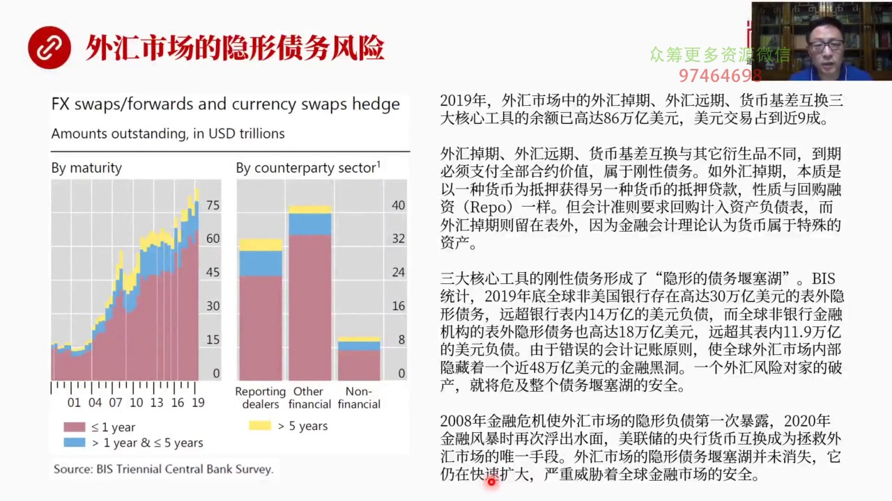

什麼叫引行債務我們首先來看一下外匯市場它的交易規模有多大到2019年把圈研體外匯市場中外匯調期遠期和貨幣機差三個核心工具的娛樂高達86萬億美元86萬億美元這是什麼大數了美人交易站到其中的90%外匯調期外匯遠期和貨幣機差互換我跟他講了這麼多他們都是演生品但是他們跟其他的演生品不一樣其他演生品有一個民意...

<strong>Cleaned narration</strong>

> 什麼叫引行債務我們首先來看一下外匯市場它的交易規模有多大到2019年把圈研體外匯市場中外匯調期遠期和貨幣機差三個核心工具的娛樂高達86萬億美
> 元86萬億美元這是什麼大數了美人交易站到其中的90%外匯調期外匯遠期和貨幣機差互換我跟他講了這麼多他們都是演生品但是他們跟其他的演生品不一樣
> 其他演生品有一個民意價值還有一個真正交格的那個價值就是真正設計要動用的資金和他民意上代表多少資金往往民意資金很大但實際上設計到真正的交易的金
> 額並不大就像另一個交期就是典型例子本金不動因為本金不換只是換現金流只換那些現金流那就數就小了但是遠期和約包括外匯調期會比較互換這三個外匯核心
> 工具雖然是演生品他跟所有演生品不一樣就是他到期要全部支付合約價值你比如說調期我們說好的一月之後我用一億美元要換回6.8億人民幣這是個剛性的債
> 務也就是我們簽了字之後我到那時候一定要拿出一億美元來你得一定拿出6.8億人民幣放得住得上我們誰都不能違約這是個剛性債務不是一個好像有一個名義
> 值然後我們真正睡覺真正教育只是一筆很小的錢這不是全部的本金都屬於剛性債務這就嚇著了因為他規模太大那麼外匯調期本上是一種以貨幣為抵押獲得另一種
> 貨幣的抵押貸款他是一個抵押貸款因為性質跟回購是一樣的但是全世界的快劑準則要求回購是要進入自然費代表的你只要做回購自然費代表會膨脹那麼就會限制
> 就會有成本但是外匯調期不一樣外匯調期雖然性質等同於完全等對於回購但是快劑準則允許他留在表外這就留下了天大的麻煩也是個巨大的苦農為什麼會同樣性
> 質的融資就不同的快劑劑上原理呢因為金融快劑理論認為貨幣是一種特殊的資產他跟你國債跟其他有現金融資產不一樣貨幣他就另當別論他不把他寄到資產貨幣
> 來表之內而留在表外但是他又真實是債務對銀行對金融機構產生真實的約束率所以BIS最近有一篇論文有好幾篇論文探討這個引擎債務問題外匯調期外匯緣期
> 這是不是債務這個債務應該怎麼計算計算出來這個量有多大這個我看他們這個論文之後我覺得這個規模太嚇人了三大核心經濟剛性債務形成其實形成了一個引擎
> 的債務驗債戶BIS統計是什麼呢國際清亂銀行統計是到2019年底全球非美國銀行就是美國銀行之外的其他世界的各國家的銀行存在著高達30萬億美元的
> 表外引擎債務就是外匯調期外匯緣期這種性質遠遠超過銀行表內14萬億的美元負債我們這銀行自然負債表中美元負債14萬億這是表內的但是這些銀行的表外
> 的外匯調期之類的剛性負債有多少呢30萬億所以遠遠高於他表內的負債如果我們再看全球非銀行的金融機構比如說對中基金、
> 養老基金這些設保這些基金這些叫非銀行金融機構他們的表外引擎債務業社外匯調期等等高達18萬億美元仍然遠遠超過他表內基金12萬億美元的負債所以由
> 於錯誤的快擊機場原則使全球外匯市場內部隱藏這個相當於48萬億美元的金融黑洞這是一個剛性債務的黑洞所以一個外匯風險對家的破產或者壹次的這種破產
> 就將會威脅到整個債務業者在忽然權因為大家都在壹條支付臉條上本來說我跟你簽了外匯調期說壹個月之後我拿壹億美元你必須要還我比如說你拿6.8億美元
> 我交換給你壹個壹億美元然後你給我6.8億人民幣我們這個互換如果簽創了這個條約那麼在我的背後和你的背後又有壹連串人跟我們簽這個互換條約所以別人
> 在期待著我拿的壹筆錢而我的教育這時候他背後又有其他的教育這時候等待他跟我劃回這筆錢中間如果說這兩個人中間有壹個破產了整個這個鏈條就全舌了這個
> ...

---

### Slide 24

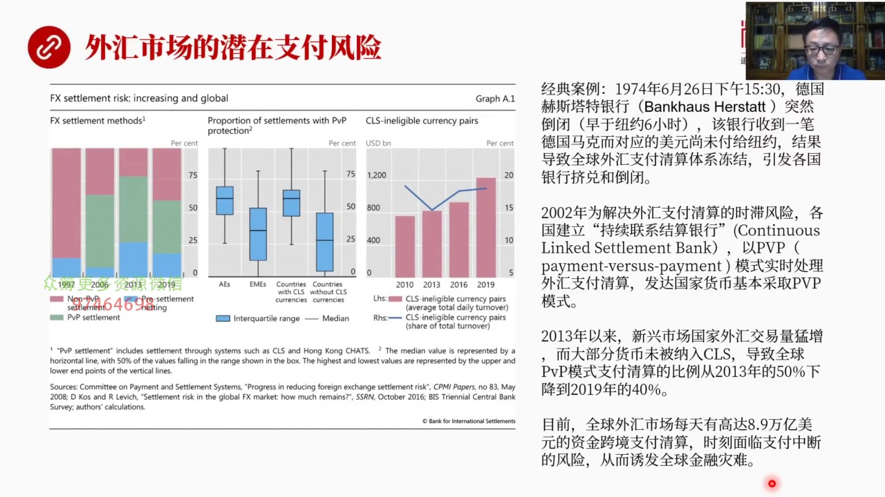

支付風險首先有個經典案例外匯市長的支付風險就是1974年6月26號下午3點半德國與亞銀行赫斯塔特銀行突然倒閉主要他就倒閉時間是下午3點半早於紐約6個小時這個銀行剛剛在上午收到壹筆德國馬克做調棄用的他應該把這筆錢然後相對應的美元支付給紐約還沒有來得及發出去紐約那邊還沒有開門銀行還沒有開門他這個銀行先倒...

<strong>Cleaned narration</strong>

> 支付風險首先有個經典案例外匯市長的支付風險就是1974年6月26號下午3點半德國與亞銀行赫斯塔特銀行突然倒閉主要他就倒閉時間是下午3點半早於
> 紐約6個小時這個銀行剛剛在上午收到壹筆德國馬克做調棄用的他應該把這筆錢然後相對應的美元支付給紐約還沒有來得及發出去紐約那邊還沒有開門銀行還沒
> 有開門他這個銀行先倒閉了結果該付的錢沒付結果又發什麽呢又發全球皮膚的大混亂因為無數人在等的對比前就是紐約那張銀行後面還排是對紐約的這個銀行也
> 跟其他人做調棄其他人又跟其他人做調棄好像每個人都在等到前面把這個錢付為但是誰也沒有想到他會出現銀行倒閉的問題而且出現在6小時的10%之內結果
> 就導致了各個國家發生了銀行大級對和倒閉倒了很多小型銀行風險這個抵抗房率比較弱的就是一個銀行在支付體中一個倒閉就會引發一連串的幾對和倒閉這就是
> 1914年的這個案例所以這個問題被全球金融界長期關注這肯定是個大問題因為外匯支付他要跨十差跨空間的差距時間的差距怎麼辦必須要實實清算2020
> 年這個全界成立的持續聯繫結算銀行這個CLS清算銀行他們是以PVP的方式來進行清算所謂PVP就是一筆交易要麼不發生要么完成完全发生不贵推荐中间
> 有一个银行调链子整个支付体系就崩了不会穿这个现象就是我这笔交易发出之后一直等到对方确认之后它才能够真正做清算这种办法可以有效的規义必制服风险
> 发达国家的很多货币基本上都采取PWP的方式但是我们看到2013年以来PWP的比重 绿色的比重在下降非PWP的模式越来越是吗越来越多从这两张图
> 上基本看到是一个情况那么主要原因是2013年以来新上国家的外汇交易量猛增我们一开始就说新新上国家外汇交易量增长了比较快而大部分货币没有被纳入
> CLS就是连续清算了 体系导致全世界PWP支付我清算的比例从2013年的50%下降到了2019年40%不断在下降所以BS经过计算下说一声冷汉
> 它说全球外汇市场上每天有高到8.9万亿美元的资金跨境支付清算就是每天都有8.9万亿美元跨越边境 跨越时差来进支付清算8.9万亿是非PWP的模
> 式结算也就是说PWP结算大部分但是结算了40%但是还有这么大一部分是非PWP结算而这笔权其实时刻都面临支付中断的风险任何一家公司导致 任何一
> 个支付不流畅中断体系 中断这个清算支付体系都会又发全球金融赛就像我们看了1974年的情况一样的这就是为什么现在全力金融体系包括外赦 实际上还
> 是相当危险的而不是说我们感觉到风平浪迹好像没有什么事你越了解他们体系的细节越了解他们的底层你知道这个市场的不稳定性和危险性是实际上是相当之大 而且在语日聚增所以我们来看把今天的主要内容总结在一起

---

### Slide 25

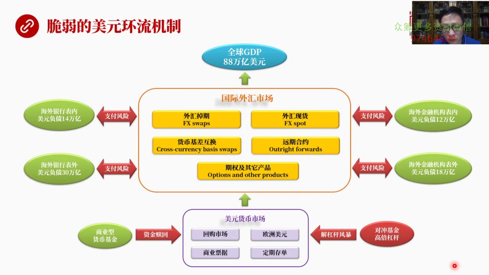

你会看到我们说的美元环流这个机制实际上是一个非常脆弱的机制整个的全球化就依托于这样一个脆弱机制这个脆弱机制什么样呢中心是外汇市场 包括大伍大工具那么在外侧就是依靠外汇者必须要获得美元的资金进行对冲风险进行外汇融资或者进行套利交易等等它有多大规模呢比如海外银行表内美元负债有14万亿海外银行表外的美元负...

<strong>Cleaned narration</strong>

> 你会看到我们说的美元环流这个机制实际上是一个非常脆弱的机制整个的全球化就依托于这样一个脆弱机制这个脆弱机制什么样呢中心是外汇市场 包括大伍大
> 工具那么在外侧就是依靠外汇者必须要获得美元的资金进行对冲风险进行外汇融资或者进行套利交易等等它有多大规模呢比如海外银行表内美元负债有14万亿
> 海外银行表外的美元负债有30万亿这边海外金融机构表内负债12万亿海外金融机构表外美元负债18万亿总共加起来这是80多万亿这是80万亿的海外金
> 融资产以美元借价的金融资产面临着什么风险首先是支付风险因为40%是通过PVP来支付的另外还有60%是非PVP这就导致了这些资金在跨境在相互支
> 付的时候只要中间有一家银行导致这个支付链条就全舌了这意味着巨大风险这么多银行有没有可能在链条中某一家银行或者某一个支付机构导致当然不能排除这
> 种可能然后还有这个巨大的市场在很大成长是要依赖美国货币长提供的短期融资超短期融资也就是几天一两星期比如说回够市场隔夜回够欧洲美元市场商业票局
> 场定存在市场都不是长期资金而这些钱印入外会上之后进入了这些行业这个表内的表外的金融机构银行的非银行的金融机构还要进入世界GDP中间的这些投资
> 等等这都是中长期投资短则一两年长则几十年都靠你这个短期融资来支持长期的这么大规模的债务也好经济发展也好投资也好那么这个短期融资靠不靠谱能不能
> 够持续不断的为几十万亿几百万亿的这种经济发展经融发展提供稳定的资金来源呢其实很难的我们2020年3月的金融风棒这几刻面讲了就是这个事我们知道
> 商业型的托壁基金在碰到任何的风吹草动的时候都会面临大规模的资金收回所以这对于美国货币上是一个非常重要的外部风险而另外一个外部风险呢就是高贝干
> 领对冲击金他们现在在玩大量的套利不光是在金融市场上外汇场上包括股票上进行这种套利不仅是套利而且是高贝套利利息越低他套利倍数越高现在高达一两百
> 倍未来说面还会更高在这种情况之下一旦他的某一个套利策略失败就会导致严重的结缸岗中报这会从另外一个方面重创美国货币上结果什么呢这个市场完全被动
> 结就像今天3月份一样如果出现这情况这条通道资金流向万丈的通道就组绝了而且在那个时候金融危机爆发手往往大银行和其他金融机构一夜都不愿意借钱所以
> 外汇市场立刻就会面临断对资金来源没有了美元来源没有了而这些旁大资产和负债向日本每个月需要几五千多亿美元的现金它才能滚动它的资产和债务你这个地
> 方如果提供不了这么多资金其他地方也动结了那么日本的金融机构就必然会面临重大风险所以央行只能在这种情况下只能采取直接的短路通过央行互换来支持日
> 本的金融体系不至于破产因为日本垮了之后欧洲美国都垮了没有人能兴奋所以我们看到整个全球化整个美元环流的机制就是建立在一个非常脆弱机组织上靠一个
> 短界长代而且中间充满知识风险充满解冠岗的这种冲击资金收回这种冲击是这样一套体系所以如果说我们世界经济要发展全球金融市场要发展那么美元一家独大
> 作为中心货币它的脆弱性越来越明显也就是大家越依赖它它这套体系是一样越来越不能够承受这种负担这就会形成一个脆弱的平静越发展大家对它依赖度越高它
> 就变得越脆弱结果就是越来越大越来越严重发生频率越来越高的全球金融灾难金融风暴 金融危机所以这就是我们理解全球外汇市场一个走的思路好 现在我们来看参考文献这参考文献就是

---

### Slide 26

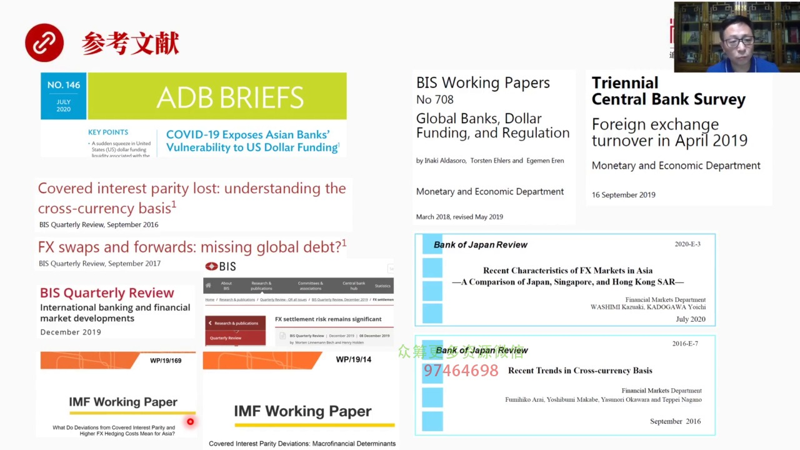

我主要借助了有些日本的日本扬航的亚洲发展银航的伙计货币基金组织的还有国际清算银航的等等等等 它们的一些报告我最近一段时间在此研究然后中间的主要图表基本都是源于这个报告除此之外还有我们的核心课核心课

<strong>Cleaned narration</strong>

> 我主要借助了有些日本的日本扬航的亚洲发展银航的伙计货币基金组织的还有国际清算银航的等等等等 它们的一些报告我最近一段时间在此研究然后中间的主要图表基本都是源于这个报告除此之外还有我们的核心课核心课

---

### Slide 27

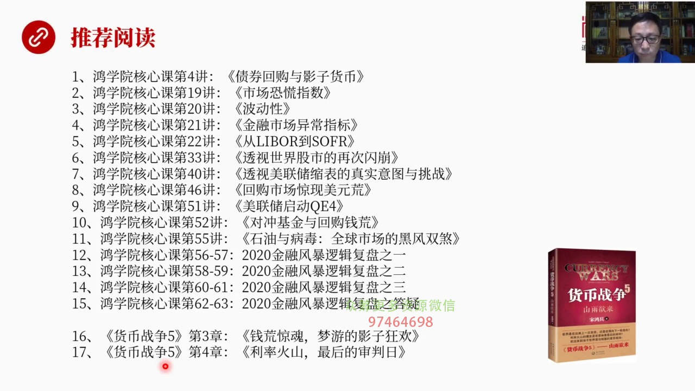

讲的都是有关金融方面有关金融市场包括股市 债市包括外汇 汇市场等等都有这些就是对于全面了解我们的课程会有帮助了解外汇市场特别是了解金融风暴和外汇市场之间的连接点这些课程都会提供比较好的一种指导吧好 今天咱们的课程就上到这里谢谢大家 祝大家周三愉快

<strong>Cleaned narration</strong>

> 讲的都是有关金融方面有关金融市场包括股市 债市包括外汇 汇市场等等都有这些就是对于全面了解我们的课程会有帮助了解外汇市场特别是了解金融风暴和
> 外汇市场之间的连接点这些课程都会提供比较好的一种指导吧好 今天咱们的课程就上到这里谢谢大家 祝大家周三愉快

---

### Slide 28

好 拜拜

<strong>Cleaned narration</strong>

> 好 拜拜

---
