# 核心课视频-66、67 期权大决战 — Slide Notes

> **来源**：鸿学院核心课程  
> **幻灯片**：33 张

---

### Slide 1

同一們大家好我們今天上核心課的第66和67講這講主要是談NASDAQ9月出現的重大的鼓災我們這一期課程的題目是7全大決戰因為這主要涉及到NASDAQ7全出現的嚴重問題那麼我們先看第一頁大家如果關心美股的話我們都知道在今年

<strong>Cleaned narration</strong>

> 同一們大家好我們今天上核心課的第66和67講這講主要是談NASDAQ9月出現的重大的鼓災我們這一期課程的題目是7全大決戰因為這主要涉及到NA
> SDAQ7全出現的嚴重問題那麼我們先看第一頁大家如果關心美股的話我們都知道在今年

---

### Slide 2

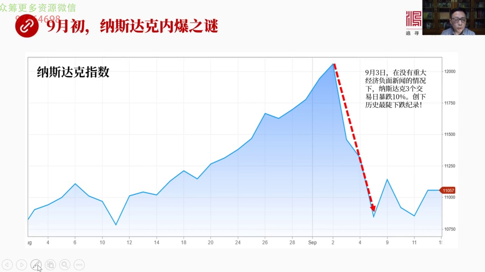

這個9月吧9月3號NASDAQ突然發生了一次哭起來的內暴我們在9月初的威克堂免專門介紹過NASDAQ他出現內暴的原因提出提到了像軟銀在中間起的作用我們需要注意到是NASDAQ暴跌的時候美國乃至全世界並沒有出現重大的經濟負面新聞但是NASDAQ9月3號開始一口氣在三個交易之內三個交易日就跌掉了10%這...

<strong>Cleaned narration</strong>

> 這個9月吧9月3號NASDAQ突然發生了一次哭起來的內暴我們在9月初的威克堂免專門介紹過NASDAQ他出現內暴的原因提出提到了像軟銀在中間起
> 的作用我們需要注意到是NASDAQ暴跌的時候美國乃至全世界並沒有出現重大的經濟負面新聞但是NASDAQ9月3號開始一口氣在三個交易之內三個交
> 易日就跌掉了10%這可以說是有史以來最抖的下跌紀錄這個現象就很值得關注了因為我們在威克堂免在9月初的威克堂免點平電視事情的時候我們曾提到了一
> 個重要觀點就是美元環流沒有發生改變所以這次NASDAQ出現了這種內暴不同於3月份3月份這次重大的鼓災習卷全球他根源在於美國的貨幣市場首先發生
> 重大危機導致了流動性的哭泣就是美元的流動性的心臟突然停止跳動然後引發的這個貨幣市場出現重大危機然後橫掃了其他各大市場包括股市在內所以3月金融
> 風暴美國股市的暴跌是外圓形的也就是源於美國的貨幣市場源於美元流動性本身有一流動性哭泣導致股票市場暴跌那麼9月這一次不是這樣因為美國的貨幣市場
> 在整個9月份一直包括了現在運轉基本正常我們從美元環流報告中也可以印證給一點所以我們在威克堂里發生了這次暴跌之後我們得出這個定性是這是一次股市
> 的內暴關鍵是為什麼股票市場在沒有什麼明顯的負面情況之下沒有什麼明顯的負面新聞怎麼就會突然陷入內暴呢這是我們本南克要談的一個重點問題我們再幹下一頁這就是我們認識股票市場內暴的一個認知算法

---

### Slide 3

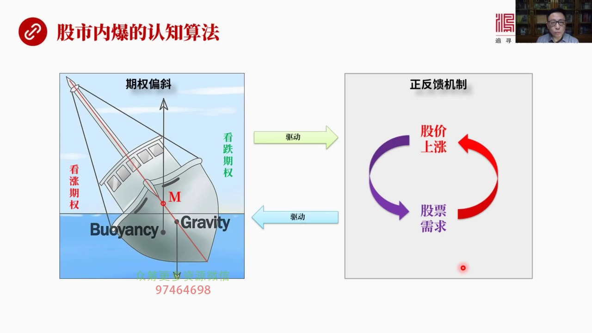

其實我們可以在一週之內就是爆發產品之後一週之內可以把這個問題說的很清楚但是如果要把所有細節歡迎出來要把所有的數據對上要把原理給說套其實我花了整整一個月應該說9月份整整一個月主要時間經歷是花在怎麼把這個原理怎麼把他的邏輯結構清晰、明了、生動形象的展現出來包括做圖這些方面其實要花更多的實驗和經歷而且在這...

<strong>Cleaned narration</strong>

> 其實我們可以在一週之內就是爆發產品之後一週之內可以把這個問題說的很清楚但是如果要把所有細節歡迎出來要把所有的數據對上要把原理給說套其實我花了
> 整整一個月應該說9月份整整一個月主要時間經歷是花在怎麼把這個原理怎麼把他的邏輯結構清晰、明了、
> 生動形象的展現出來包括做圖這些方面其實要花更多的實驗和經歷而且在這個過程中你會反覆的推敲自己的邏輯會反覆利用數據來印證這個推理合不合是是不是
> 有什麼披露所以這個過程花了很長的時間那麼經過這一個月的反覆思考加上月度上百天的各種各樣的分析文章我把這次股票市場內報提煉成了這樣一個簡單的兩
> 張圖我認為這是我們認識這一次NASDAQ爆跌的基本的認知算法左邊邊兩圖就是7全清晰這個概念這是非常關鍵的其實我們在2018年的時候用過這個概
> 念那麼由於7全清晰導致了或者叫刺激了股票市場進入了一種正反饋機制我們就要正反饋是不斷自我強化正反饋機制會產生劇烈的震盪而且需要越來越大了從外
> 部或許能量當然這種機制是不可能持續存在所以一旦股票市場進入了正反饋機制他就一定會崩盤這就是我們這堂課他的一個核心邏輯7全清晰也就是在兩種7全
> 看漲和看跌之間出現了嚴重的偏寫大部分的市場的市場的交易者們站在了傳的一策使得這個傳體嚴重清晰那麼這種嚴重清晰本身也會刺激或者驅動股票市場形成
> 一個價值上漲需求增加的正向循環刺激那麼反過來股票市場越是上漲需求越是激增反過來又驅動這個7全清晰的更嚴重所以最後的結局是整個這個船會翻倒也就
> 是翻船這就是我們看到了股票市場在9月3號發生的暴跌所以這個是我們認識納斯拉克股票暴跌的一個核心邏輯這堂課就是圍繞這個核心邏輯在展開我們再看下一那麼我們的方法論仍然是採用人工智能的這個

---

### Slide 4

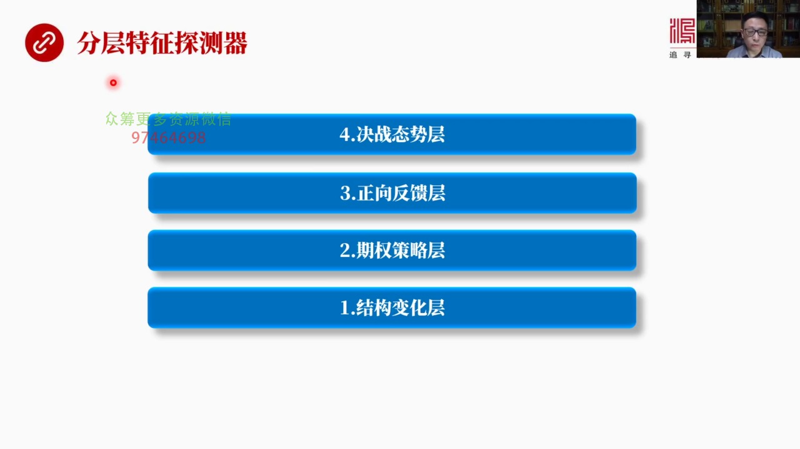

特徵碳的氣那麼我們在分析3月經風暴的時候我把特徵探測器分成了若干層這次我還會沿用這個思路也就是從整個市場的底層開始逐層進行特徵體驗然後把這個事情說清楚所以我們這堂課我把整個股票市場發生了這個情況分解成4個層次從4個層次來分別認識最後得出結論那麼它最底層第一層是什麼就是結構變化層也就是美國股票市場發生...

<strong>Cleaned narration</strong>

> 特徵碳的氣那麼我們在分析3月經風暴的時候我把特徵探測器分成了若干層這次我還會沿用這個思路也就是從整個市場的底層開始逐層進行特徵體驗然後把這個
> 事情說清楚所以我們這堂課我把整個股票市場發生了這個情況分解成4個層次從4個層次來分別認識最後得出結論那麼它最底層第一層是什麼就是結構變化層也
> 就是美國股票市場發生了結構性的變化是什麼探討清楚這層之後我們再探討第二層次在結構股票市場結構發生變化之上就是這次出現的新問題7權策略7權策略
> 層這層主要蓋過了在最近一段時間那次達課出現的反後機構投資人對中基金高頻交易基金等等這些人他們為什麼要使用7權他的策略是什麼那麼把這個問題探討
> 清楚之後我們再進入一個更高的層面探討這些的行為如何是市場進入了正反愧的狀態也就是正向刺激7權清協之後導致股票市場進入了一種風牛狀態風牛市出現
> 了那麼這種狀態持續到一定時間到了9月初我們就進入了第四個層次決戰態時層其實市場上分成了多空兩方大決戰所以今天我們的課程是以這種特徵探測器四層
> 來做一個系統性的產數我們看下一頁首先我們來看美國股票市場結構性發生了變化

---

### Slide 5

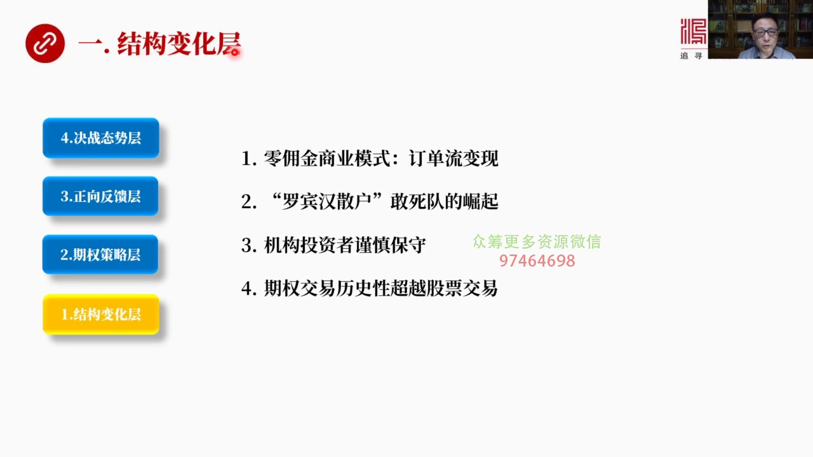

我認為有四大變化提煉出來第一是零雲金的商業模式它的核心是什麼訂單流變線這跟中國股市非常不同跟美國傳統的股票市場也非常不同這種商業模式改變使得整個股票市場它的根基它的結構發生了重大變化第二個重大變化是羅賓汗散戶們的崛起桿死隊這些人沒有玩過股票或者沒有意識到股票的巨大風險所以他們就像桿死隊一樣衝進股票市...

<strong>Cleaned narration</strong>

> 我認為有四大變化提煉出來第一是零雲金的商業模式它的核心是什麼訂單流變線這跟中國股市非常不同跟美國傳統的股票市場也非常不同這種商業模式改變使得
> 整個股票市場它的根基它的結構發生了重大變化第二個重大變化是羅賓汗散戶們的崛起桿死隊這些人沒有玩過股票或者沒有意識到股票的巨大風險所以他們就像
> 桿死隊一樣衝進股票市場航衝指撞大量使用期權那麼第三個結構性變化就是在今年三月金融風暴之後美國的機構投資者變得非常的謹慎小薪和保守也有客觀原因
> 的限制由於他們在金融風暴中受到了重創所以不得不小心謹慎第四個結構性變化就是期權交易期權的交易量在歷史上第一次超過了股票本身的交易量我們知道期
> 權是股票衍生出來了衍生品的交易量超過了基礎資產的交易量這在歷史上還是第一次所以正是由於這四個結構性的變化使得美國股票市場它的結構已經不同於2
> 018年也不同於以前的美國股市這是我們認識這次NASAQ危機的這個前提條件必須要先把它的基礎變化結構性的變化搞清楚我們再干下一首先來看什麼叫零擁金的商業模式定編也就是所謂定單流變線是怎麼回事

---

### Slide 6

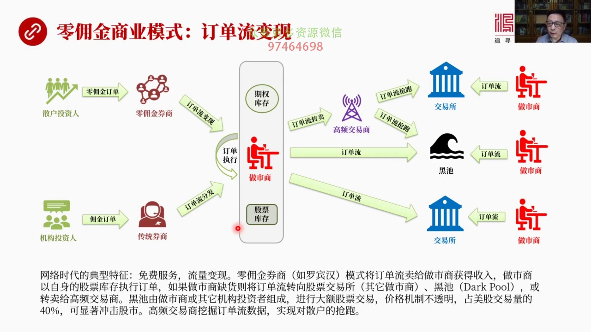

那麼在這個圖中我把美國現在的它的股票投資包括期權投資蓋過成一張圖我們從這個圖上可以看到這次是散戶投資人和機個投資人這是投資人這次他們以前主要是跟這些傳統券商打交道這些券商們呢他是要收擁金的你沒比定單他大概要收取擁金多少但是現在出現的新情況是出現了零擁金的券商比如說羅冰漢就是個零擁金的我不收擁金的我這...

<strong>Cleaned narration</strong>

> 那麼在這個圖中我把美國現在的它的股票投資包括期權投資蓋過成一張圖我們從這個圖上可以看到這次是散戶投資人和機個投資人這是投資人這次他們以前主要
> 是跟這些傳統券商打交道這些券商們呢他是要收擁金的你沒比定單他大概要收取擁金多少但是現在出現的新情況是出現了零擁金的券商比如說羅冰漢就是個零擁
> 金的我不收擁金的我這交友不收你錢那麼難道羅冰漢是在做雷峰嗎?不是因為它轉變了盈利的模式服務免費但是你們這個給我送來的訂單會產生一個訂單流的數
> 據大數據那麼這個訂單流我是可以把它賣掉的叫訂單流變線所以我們來看由於出現了羅冰漢是這樣的一種零擁金的券商現在我們可以看到散戶投資人很多人都是
> 用這條通道零擁金獲得了免費服務但是你的訂單信息會被賣掉當然還有傳統的機構投資人不少仍然在使用擁金訂單傳統模式通過券商然後來執行訂單我們來看這
> 兩股力量零擁金的這種券商變賣了訂單訂單流變賣給了誰呢還是首先是變賣給了做事商那麼傳統券商訂單流分發也是要分發到做事商為什麼大家都要經過做事商
> 因為美國股票市場是一個做事商制度我們以前在金融風暴那個系列核心客中專門談到了要瞭解美國的股票市場運作它完全不同於中國這種股票交易所的這種即和
> 淨價這種模式它是做事商制度每個做事商成千上百上千的做事商大大小小做事商是這些人組成了美國的股票交易所而不是政府開辦股票交易所然後政府來對大家
> 負責不對美國的股票交易所這些交易所背後的主要的組成成員都是做事商一級做事商二級的三級的四級的層層級級的這些做事商們組成了股票交易所所以我們在
> 股票上在美國股票上做了任何交易都不是你跟賣家直接的交易而必須要通過做事商做事商一般會擁有它自己的庫存比如說它會擁有股票庫存它如果是七權做事商
> 還會擁有七權的庫存那麼你的訂單樓送到做事商站做事商為了相互之間競爭它會花錢去購買訂單樓這也是羅銘漢的銀利模式之一如果我們看羅銘漢今年的第一季
> 度第二季度它的銀利相當的驚人它賣訂單樓一個季度就能賣出將近1.8億美元應該說是2018年數據的三到四倍可見2020年它這個訂單樓便宴這個業務
> 量有多大這是一個季度所以它今年的銀利會非常的瘋狂那麼這些訂單樓被便宴到了做事商站之後做事商首先在自己的股票庫存裡面匹配如果你想買匹扣股票而我
> 有匹扣股票我就從我的股票庫存中直接來執行訂單完事當然美國的政權交易法要求做事商們這是一個做事商的總的概念做事商們必須要以你能獲得交易所所有的
> 交易所中間最好的交易價提供給你的客戶這是一個基本的要求那麼做事商如果能從自己庫存中找到匹扣股票賣給你這就完成了訂單執行其權也是你散歐投資人送
> 回來了其權訂單他也在自己的其權庫存裡面給你匹配或者他在市場中找其他人或者他自己開一張其權跟你進行對做這就是做事商他起的作用好如果做事商發現他
> 與其自己在庫存中匹配賺取的這種賺錢的這種盈利程度吧如果不如把訂單流賣給其他人比如賣給高拼交易商賺的更多的話他就會賺賣訂單流給高拼交易商高拼交
> 易基金這些人獲得了這些訂單流之後大量散戶訂單流之後他就可以研究進行訴求挖記錄研究這些散戶們準備賣什麼股票賣什麼股票賣什麼氣權賣什麼氣權然後高
> 拼交易基金可以強討在發現你們訂單趨勢之後我搶先一步去做跟你們同向的交易所以我的價格比你低這就是高拼交易商賺錢的方式然後我再轉手賣給你們獲賣給
> 其他人我就能盈利所以高拼交易商獲得了訂單流之後他也要花錢買從做商賺買然後高拼交易商再把訂單流進行強討然後再交易所進行執行或者在黑池進行執行我
> ...

---

### Slide 7

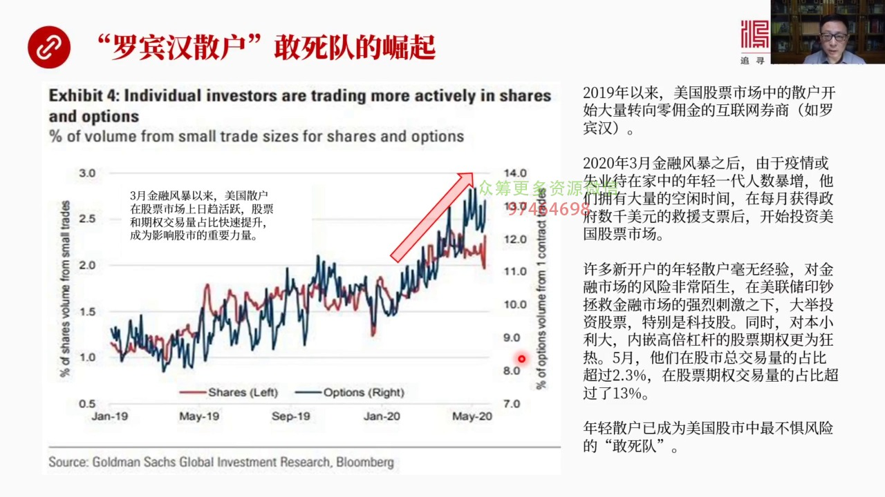

其實我們如果來看這個整個羅冰漢這些就所謂散戶吧從2019年開始他的我們可以看到他們的股票買賣量和侵權買賣量股票對應左邊侵權對應右邊我們可以看到從2019年一年前1月一直到現在在這個時間段裡面散戶們他的股票交易和侵權交易是逐步上升的速度比較慢但是趨勢是向上的我們在這看到了三月金融風暴的重大衝擊暴跌然後...

<strong>Cleaned narration</strong>

> 其實我們如果來看這個整個羅冰漢這些就所謂散戶吧從2019年開始他的我們可以看到他們的股票買賣量和侵權買賣量股票對應左邊侵權對應右邊我們可以看
> 到從2019年一年前1月一直到現在在這個時間段裡面散戶們他的股票交易和侵權交易是逐步上升的速度比較慢但是趨勢是向上的我們在這看到了三月金融風
> 暴的重大衝擊暴跌然後散戶們迅速的恢復了元氣然後在股票交易市場上和侵權交易市場上進一步的活躍尤其是侵權他們的戰比越來越高主要原因是這些羅冰漢散
> 戶們大多數都是這些年輕人這些年輕人在疫情期間失掉的工作或者在加上班然後擁有大量的時間本身又能量過剩所以他們又獲得了政府幾千美元的一個月救援支
> 票然後開始大距進入美國股票市場而這些人出生牛毒不怕火沒有什麼風險的意識也不怕市場下跌他們認為市場一定是上漲了再加上美聯儲了救援政策應超票所以
> 大家一片看好所以這些資金大量去朝美國的科技股那次他課了特別是五大龍頭股而且這些人由於比較喜歡刺激年輕人然後沒經驗但是有創進覺得普通買賣股票不
> 夠刺激所以他們大量使用了7權我們看他們的7權的佔比佔整個市場的佔比要遠遠高於他們股票交易在股票市場的佔比7權內欠高倍槓桿所以對他們來說玩起來
> 更爽那麼到5月份的時候他們在股票市場交易總量佔比超過了2.3%這仍然比較低因為美國股市上主要還是靠機構的資金但他們在7權交易仗上佔比超過2.
> 3%這是5月份我們可以看到當然散戶是非常喜歡玩7權的那麼從此我們可以看出美國的散戶們特別是這些年輕的散戶們應該說是市場融現在最不怕風險的桿死隊我們再看下一頁那麼第三個結構性的變化就是散戶非常勇猛

---

### Slide 8

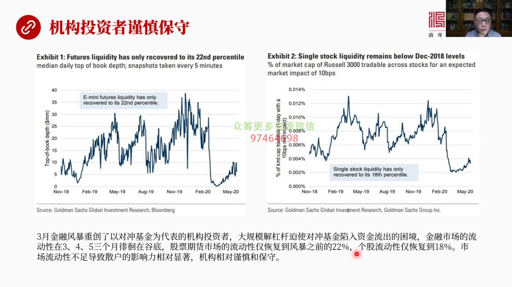

第三個變化呢投資者機構投資者變得非常保守和謹慎主要是3月金融風暴重創對中基金我們3月金融風暴連續的核心坑本專門講過他們被迫解槓桿由於他們的策略失敗那麼以他們為代表的機構投資者都陷入了類似的資金坑金而且變得比較近聖和小心所以整個金融市場不管是股票的期貨市場還是股票的個股市場他的流動性在三四五三個月都在...

<strong>Cleaned narration</strong>

> 第三個變化呢投資者機構投資者變得非常保守和謹慎主要是3月金融風暴重創對中基金我們3月金融風暴連續的核心坑本專門講過他們被迫解槓桿由於他們的策
> 略失敗那麼以他們為代表的機構投資者都陷入了類似的資金坑金而且變得比較近聖和小心所以整個金融市場不管是股票的期貨市場還是股票的個股市場他的流動
> 性在三四五三個月都在股底徘徊你比如說他的期貨的流動性在五月份的時候大概恢復到了金融風暴之前的22%非常的低個股的流動性恢復到了18%很顯然三
> 四五三個月整個市場的流動性是非常少的也正是因為流動性比較少所以散戶的作用就被放大了散戶因耀力變得相當的顯著而同時機構由於總統原因變得保守變得
> 緊繩變得不像散戶不像散戶這個投資者那樣衝進十足這就是我們看到了三四五三個月的一個基本態勢我們再看第四個結構性的變化那就是

---

### Slide 9

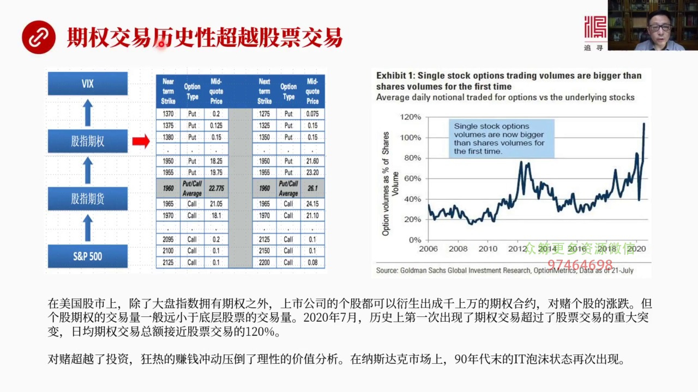

七權交易歷史性的超過了股票交易量咱們中國也有七權然後美國這個市場的七權不僅是大盤指數有七權比如我們以前在我們的核心課面講波動性那一課專門講過比如說SMP500它是一個股值的這個期貨有股值期貨這個股值期貨之上又衍生出了股值期權再往上當是Wix指數也就恐慌指數所以美國的股值期權這個期權可以對應的一個大盤...

<strong>Cleaned narration</strong>

> 七權交易歷史性的超過了股票交易量咱們中國也有七權然後美國這個市場的七權不僅是大盤指數有七權比如我們以前在我們的核心課面講波動性那一課專門講過
> 比如說SMP500它是一個股值的這個期貨有股值期貨這個股值期貨之上又衍生出了股值期權再往上當是Wix指數也就恐慌指數所以美國的股值期權這個期
> 權可以對應的一個大盤的股值同時每家上市公司的個股都可以衍生出成績上萬張七權合約所以對於投資者來說你可以去做大盤的七權的看長和看空的交易同時你
> 也可以選蘋果公司股格公司耐飛公司或任何一個你感興趣的技術公司的個股的期權的看長和看跌對股個股它的漲跌但是一般而言美國個股的七權交易量源源小於
> 底層股票的交易量比如說蘋果蘋果當然有它的七權交易看長看你看長看你都有而且不同不同這個新宣價不同期限的這個七權成績上萬這個七權合約成績上萬但它
> 總的交易量仍然非常低比如說在正常年份吧這個個股的金融危機這個時代金融危機這個前後這個時代吧個股的七權交易量大概佔到股票交易量的20%左右它是
> 個比較小的交易量並僅是衍生品但是我們看到在2018年以後大概這個比例從30%吧不斷上漲不斷上漲一日到今年的7月份個股的七權的交易量達到了股票
> 交易量的120%換句話說7月份美國市場中個股的七權交易量首次超越了股票本身的交易量這是一個重大的突變這說明在金融方報之後幾個月之內七權變成了
> 整個市場上流動性最好大家最熱門最想投最火爆的交易產品也就是說七權對賭什麼呢它這種對賭這個投資的對賭性超過了理性分析賺錢的狂熱壓倒了價值投資所
> 以納斯拉克整個市場上陷入了我認為是90年代末IT泡沫之後再次出現了強烈的泡沫化的傾向好我們再看下夜這不是有了我們對於美國股票上底層了這種四個結構性的變化的認識

---

### Slide 10

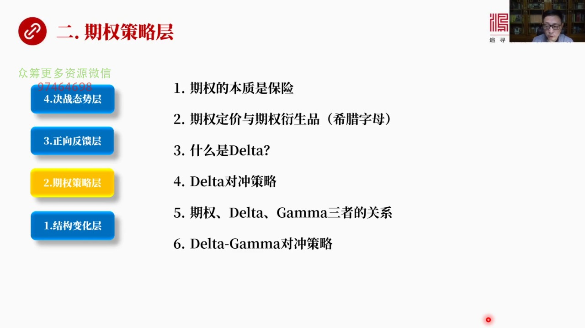

然後我們再看在這些結構之上七權交易它發生了些什麼樣的變化有什麼主要的特點這些參與企業交易的玩家們他們的主要策略是嗎所以在第二層面我們重點講七權它的本質是什麼當然是一種保險所有金融眼睜品的本質都是保險當然除此之外我們還要涉及七權定價七權定價的模型包括七權定價他說七權定價它的眼睜品就是七權的眼睜品就是所...

<strong>Cleaned narration</strong>

> 然後我們再看在這些結構之上七權交易它發生了些什麼樣的變化有什麼主要的特點這些參與企業交易的玩家們他們的主要策略是嗎所以在第二層面我們重點講七
> 權它的本質是什麼當然是一種保險所有金融眼睜品的本質都是保險當然除此之外我們還要涉及七權定價七權定價的模型包括七權定價他說七權定價它的眼睜品就
> 是七權的眼睜品就是所謂西大字母涉及到比如說Delta之類的那接下來我們就要講這些包括Delta策略包括七權Gamma策略他們幾者之間的關係包
> 括做事商們還有一些大的機構們玩的一種對重策略他們的目的和意識是什麼搞明白了這個層次的東西我們才能夠理解為什麼會發生正反跪寫下好我們再看下一七權的本質和一切金融眼睜品一樣都是保險

---

### Slide 11

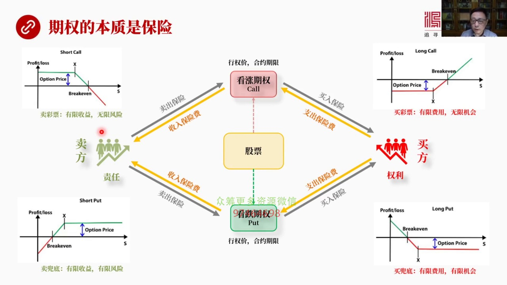

那麼如果我們來看這張圖的話股票是核心資產或者叫抵騰資產股票衍生出來這叫看長七權靠靠平還可以衍生出來看跌七權破大平這只是兩種我用紅色來表示這是一種看長的傾向綠色當然是看跌跌到臉都綠了這個當然中國人比較習慣這樣紅色代表看長在其他市場不一定這樣或者正好相反我們按照我們的習慣來那麼我們可以看到七權的交易分成...

<strong>Cleaned narration</strong>

> 那麼如果我們來看這張圖的話股票是核心資產或者叫抵騰資產股票衍生出來這叫看長七權靠靠平還可以衍生出來看跌七權破大平這只是兩種我用紅色來表示這是
> 一種看長的傾向綠色當然是看跌跌到臉都綠了這個當然中國人比較習慣這樣紅色代表看長在其他市場不一定這樣或者正好相反我們按照我們的習慣來那麼我們可
> 以看到七權的交易分成買方和分成這個賣方和買方賣方就是賣保險的買方就是買保險的賣方這個這個買方他主要是什麼他為什麼買呢他買的是一種權利也就是說
> 如果買看長七權我支出的是保險費我要付保險費給賣方我拿到了是買勁的是我手上拿了一張保險實際上是一張權利書這張權利書就是說如果我看長蘋果股票未來
> 會長到二百美元那麼我可以買二百美元的看長七權星期二百兩百美元如果長到了二百以上那麼我就賺因為到比如說長到二百一那麼我手上這個七權我如果在未來
> 六個月之內就行權的話那麼我行權的時候市長價已經漲到二百一每一張每一股我就可以賺十塊錢如果沒有漲到如果只漲了一百八那就相當於我花這個保險費打水
> 票了作費了所以對我來說我可以選擇行權也可以選擇不行權所以這對我來說是一種權利我買的是一種權利那麼賣方就不是了賣方是一種責任就是說我賣蘋果股票
> 他的看長七權我是賣方我是賣看長七權股票未來六個月我認為這個不太可能漲到兩百但是如果漲到兩百以上我都認那麼我就按照兩百這個按照兩百這個價你要多
> 少股票我給你多少股票我如果沒有怎麼賣我到市長上限買假如蘋果公司六個月之後漲到兩千呢漲到兩萬呢漲到二十萬一股呢買方通通得認賬所以買方承擔的是一
> 個無限風險他是責任對方如果選擇行權他沒有任何的理由拒絕他不能拒絕只能去對線除非他破產如果這麼好他就會破產所以我們可以看到對看長七權他的賣方來
> 說對於這次來說他相當於是賣彩票他的收益很有限但是風險是無限的如果我們從這張圖上可以看到他收貨的收益就是保險費人家支付的保險費他收入了保險費他
> 的收入保險費是有限的比如說你要賣二來美元六個月之後那離現在一百多那差了差了老鼻子源的這個價格所以這個這是個小概率時間這個收入也不會太高比如說
> 這個億美元那麼你在這裏只能獲得一個很少的收入但是如果股票市場不斷上漲看這個股票如果不斷上漲那麼你面臨的風險越來越大如果超過了二百呢這是二百新
> 經驗價超過二百漲到二百零一了呢就把你的利潤給吃掉了把你的保險費給吃掉了再往上漲漲到了兩百五或者漲到兩千五兩萬五二十萬這個公司就破產了賣彩票了
> 就破產了賣方就會承擔無限責任賣方當然不是這樣他相當於買彩票買彩票就是我是有限費用我只花億美元去買未來蘋果公司六月之後漲到二百美元以上的這種可
> 能性我像那獨一把這個可能性很小我知道但是我損失也不大我就花一塊錢甚至不到一塊錢幾毛錢我買個看上漆圈我損失很小嗎我買一百五我才一兩百美元或者是
> 不到一百美元那麼我我賭個大的我伯格大的這就是一種買彩票的心態所以我的費用是有限的但是機會是無限的他萬一漲到了兩百兩百以上的我一漲到二百五我一
> 漲到三百那往上去還可以漲到兩千呢所以對於買看漲漆圈人來說他是一種買彩票的心理所以我把看漲漆圈簡單定義生是一種保險是一種彩票的保險賣彩票的保險
> 這方就是說你怕的是趕不上車也就是錯過了報長行情你擔心這是這個風險我賣給你一個這個彩票的權利賣給你這個彩票的保險那麼你就可以搭上這場車買保險買
> 彩票這些人呢就是我只要花有限的費用可以獲得一個未來無限大的可能性這種性質我們可以稱之為一系統彩票性質買賣這個看漲漆圈是一種高度風險的對這表來
> ...

---

### Slide 12

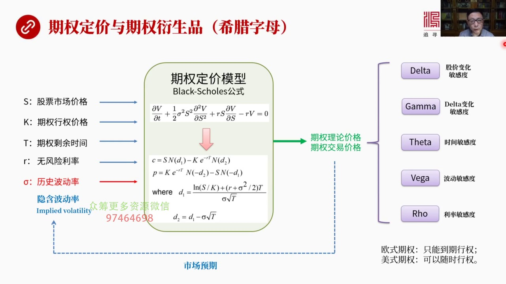

簡單談一下期權定價它的原理是什麼很多人其實做期權也許有不少的做期權但是估計很少有人去研究期權定價模型期權定價模型是7年代三位經濟學家其中最主最著名的就是這兩位Black ShowsBlack Shows這個公式也就是著名的期權定價公式但是它這個公式主要是面向歐式期權我們一開始再說歐式期權每時期權的區...

<strong>Cleaned narration</strong>

> 簡單談一下期權定價它的原理是什麼很多人其實做期權也許有不少的做期權但是估計很少有人去研究期權定價模型期權定價模型是7年代三位經濟學家其中最主
> 最著名的就是這兩位Black ShowsBlack Shows這個公式也就是著名的期權定價公式但是它這個公式主要是面向歐式期權我們一開始再說
> 歐式期權每時期權的區別這個公式是什麼意思就是在交易上中這個Op性的概念就是這個期權的概念早就有了但是人們一直不照它的雖然我們可以交易處於一個
> 價格但是我們始終搞不清楚這個價格它的內在合理性合在我們怎麼用理論上把它推倒出來或者我們怎麼用理論上把它驚奇化出來我才知道我做對衝的時候應該驚
> 切到以什麼倉位來驚對衝這是實際上的一個需求但是以前一直解決不了一直到這兩位在1973年提出這個公式其實它首先是建立在一個PiaV1分方程的基
> 礎之上用這個方程在一定限定強量之下推出的這個公式這個公式當然我如果大家感興趣的話我們以後和音客可以專門講它這公式怎麼推倒的如果我們在這裡的偏
> 眾意識見的話我們腦子在既下這個公式就行或者說對這個公式有一個徒刑的這個基本判斷就可以我們只需要知道看著其權和刊跌其權c和p這是看著這個是刊跌
> 它的計算公式大致是看起來是個這個形狀如果大家第一次看可能會覺得這是個什麼東西就是看的不是很明白其實簡單說起來它也並不太符的比如說我們首先看這
> 一次吧這次如果我們把它當成一個黑鞋子的話那麼它有五個輸入變量s是股票的市場價格k是其權的新鮮價t是其權還剩多少時間因為它有期限而是無分限利率
> 比如說每年處利率os利率或者美國國債短期國債交易出來的就是個收益率然後它是歷史波動率代表著股票市場上的過去一段時間所形成的漲幅大概有百分之多
> 少的漲幅由這些變量輸入進來之後我們可以通過這個公式來計算出其權的理論價格看長期權就是這個就是這個公式來表達它的意思是什麼呢我們知道s是股票市
> 場價格k是行權價這個n是什麼這個n其實是個正態分布的一個韓數這邊是一個正態分布我們可以想像正態分布那個曲線其實正態分布是你不無論輸入這個第一
> 和第二是什麼東西的最後得出了一定是一個零點起的概念零到一這個概率之間一個什麼樣的概念然後這邊也是這樣就是不管你第一第20是什麼內容但是通過正
> 態分布這個韓數我透出來的這個陀東西就是個零點起那麼這個這還有一個比較奇怪的這是什麼意思這個我們知道這個是自然數然後再加一個加一個RT它的它的
> 概念是什麼它的概念其實我們以後反正看到這種在金融上基本上都是把未來的現金貼現到今天就是如果未來是一百塊錢三個月之後如果我們把利率零速靠著進去
> 如果按著每天的這種速力來計算那麼三個月之後的一百塊錢相關於今天的多少錢這個數就是算這個所以我們可以看到這個行權價成一個把未來現金流貼現到今天
> 再成一個零點起換句話說這個看漲其權的核心就是未來就是現在股票的市場價成意就是以以蓋率政態分佈的蓋率做一個權衡簡去未來這個行權價到底中間差價是
> 多少當然我們知道我們買了這個東西買了這個其權我不就是為了在未來我的價格看漲其權我就是為了讓這個希望未來這個市場價高於高於我的這個行權價嗎高於
> 我才有賺錢的才有賺頭嘛所以這兩個相檢是我的內在價值這是很螢幕了然的事這是可以理解的屁與此相類似好在這個黑閒子接受到了5個這個數量之後突出的就
> 是其權的理論價格當然我們可以看到這四個變量其實沒有什麼太多的花頭或者它是基本穩定的股票價格我們一查就查出來了行先價和通常寫的T也能算出來而也
> ...

---

### Slide 13

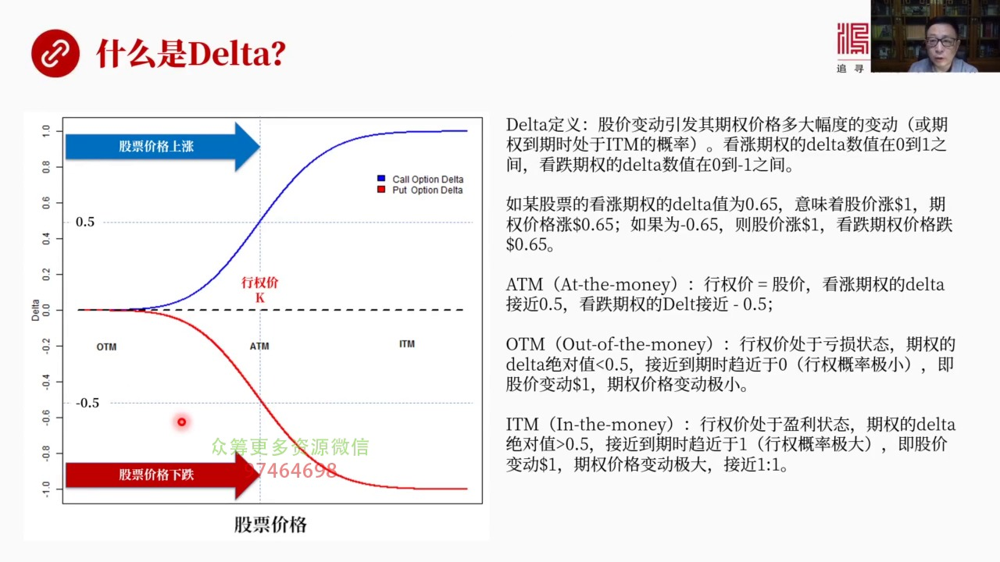

我剛剛已經說Delta它就是基礎資產股票它變動引發七權價格多大幅度變動那麼當然這個它是一個概率是一個比如說我們可以從這可以看到它是零到一對開展極權對看階極權是零到負一也就是在零到一之間的一個一個小數比如說零雜五零點零雜六零雜八什麼什麼的或者負的零雜五或零雜八這個是我們對於Delta的一個認識但如果我...

<strong>Cleaned narration</strong>

> 我剛剛已經說Delta它就是基礎資產股票它變動引發七權價格多大幅度變動那麼當然這個它是一個概率是一個比如說我們可以從這可以看到它是零到一對開
> 展極權對看階極權是零到負一也就是在零到一之間的一個一個小數比如說零雜五零點零雜六零雜八什麼什麼的或者負的零雜五或零雜八這個是我們對於Delt
> a的一個認識但如果我們說這個某一個七權的Delta是零雜五这还意味着某种意义上交易员们会经常认为这意味着期权到期的时候这一张期权处于能够所谓
> ITEM就是因的盲令它的概率有多大因的盲令就是它处于可以行权了有赚钱的可能性了就是有赚钱的希望了那么这个概率有多大或者说我们可以说是期权进行
> 权的概率我最后选择行权概率有多大那么如果我们几个具体例子如果说某个股票看上期权的Delta为0.65那么意味着股价每上的意义每员期权价格将会
> 讲6毛5如果是数的0.65比如说看跌期权那么每股价每上的1块钱看跌期权价格将会跌0.65好 这就睡到三个三个有意思的概念atm  outm和
> itmatm 就是atm的盲令就是正好行权价和最后的股价是一致的比如说你到行权那一天了期权到了你看这两东西是一样的比如说你买的屏果股票真涨到
> 200了6月之后这一天正好两个商等这个叫atm的盲令这个概念什么呢就是看涨期权的在这种情况之下看涨期权的Delta是比较接近于0.5的看跌期
> 权是接近负的0.5的从这张图上我们可以看到这是股票市场这条线如果是你看涨期权我们就把股票它是按这个方向上涨也就是说股票在往这个方向不断上涨那
> 么Delta数值的电话我们可以看到一开始这个在所谓 outm也就是远离赚钱的这种可能性新增价太离谱了就说你根本不可能赚的钱那么在这种情况之下
> 我们可以看到它的Delta是不断在方向变化一点点方向变化然后这个概率越来越高到了0.5正好达到新增价然后随着股价进一步上涨这个Delta数值
> 越来越大最后驱进于1所以这个是看涨期权看跌期权呢这个方向是反的股票市场是从高往第一走走出这样一条曲线也就是说它在这一侧是远离这个行权的可能性
> 的在这儿是正好在这儿是这个行权的可能性最大到底很简单在这儿远离也就是说它这个我是看跌期权就是要低到一定程度比如说我这次苹果如果这是200我是
> 在50或者比如说我在50刚才做的这个看跌期权那么在这里我肯定不会行权因为我太高了我我这么做虧色但是过了50之后呢再往下跌跌到30之后越往越往
> 这边让我们看到股票是这样下跌的越跌越凶最后我行权可能性变得接近于1所以通过这张图我们可以把OTMATMATM和他们所对应的看长期权和看跌期权
> 的数值大概建立起一个数量关系这么好的行权价这个位置AT们状态之下是0.5我们非常需要记住这个数这个数越是这个就是它越是兔在引力状态下越是因的
> 盲力那么它的数值越大如果0.8以上基本上可以认为它是一个非常大的这个非常深的ITM状态如果在新宣价以这个以向它的这个调查数值就很小所以我们脑
> 子里也要记住这张图尤其是要记住行权价在ATMATM这个情况之下等于0.5然后越到因这个越是第1的盲力就是越是赚钱的可能越大调查数值越大我们再看下眼为什么要研究调查这个东西

---

### Slide 14

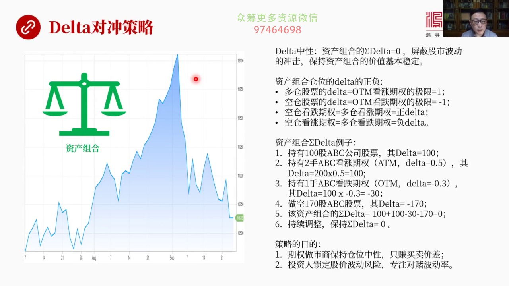

它有什么价值这就是涉及到调查对冲策略的意义比如说我们看那斯达哥股票如果是这么股价是这么长跌的话我们一般散乎可能会觉得无所谓反正我买了股票不管买苹果还是买股哥还是买什么反正他长跌我就是要不撞了我要不培了我就是在那只能被动等要不然我就卖或者我如果不卖我就扫着忍着但是对于机构来说它不能这么考虑问题它有一个...

<strong>Cleaned narration</strong>

> 它有什么价值这就是涉及到调查对冲策略的意义比如说我们看那斯达哥股票如果是这么股价是这么长跌的话我们一般散乎可能会觉得无所谓反正我买了股票不管
> 买苹果还是买股哥还是买什么反正他长跌我就是要不撞了我要不培了我就是在那只能被动等要不然我就卖或者我如果不卖我就扫着忍着但是对于机构来说它不能
> 这么考虑问题它有一个资产组合这个资产组合中既有股票又有期权既有看涨又有看跌既买股票还有做空股票有大量的这种资产组合我如果拥有一个比较复杂的资
> 产组合我要求的是在很多情况之下我要求的是无论你股价怎么这么震动你不要影响我的总价值也就是我的总价值要被屏蔽在波陶熊永的市场起伏之外你在怎么长
> 我也不变我的总价值也不变这个感觉就很像一个汽车的非常高效的简震器在通过非常丁薄的录矿的时候它的做到车里面你会没感觉做得越好说明你这套对冲策略
> 越高明这就是得到它对冲策略它的价值所以我们看到很多机构会提得到它中性这个概念什么叫得到它中性就是这个整个资产组合的辽塔相加它的总合为零有正有
> 富加在一起反正得零就说明我这个简震器简的非常好效率很高任何股票涉案的波动股价的波动都不会影响我资产组合的价值所以这个对于很多投资机构来说这是
> 一个非常重要的一个要求当然对于我们散步来说你说我当然是不想跌我肯定是看涨了我为什么不看涨呢所以对于很多散步来说它不太理解为什么我需要得到它中
> 性因为这对我来说涨价我也不赚钱降价我也不赚钱我不是疯了吗但是我们以后会说到在不同情况之下这些机构有他们独特的需求好我们再来看资产组合的怎么来
> 计算它的仓位得到它的政府呢我们在这儿把它的政府分成几种情况凡是多层股票的就是凡是你手上持有股票的你这个Delta都是正数都是1就跟Otium
> 赚钱看涨基权在远离在这种极限的情况之下是一个道理所以我们在这记住所有持有股票的Delta都等于所有做空股票Delta等于富依那么那些空仓看跌
> 期权他的性质等于多仓看涨期权多仓看涨期权我们刚才讲了多仓看涨期权这什么这是在买股票里就是买股票那帮投资者买彩票那些人空仓看涨这个看跌期权是什
> 么呢是那些卖兜底的那些人这两伙人实际上是一种人他们都是看多市场的所以卖空或者叫销售兜底保险的也就说在一个教会之下我通知的那些人实际上对市场是
> 看多的这两种人是一个性质都是看多市场所以他们的Delta为正空仓看涨期权也就是卖彩票的和买兜底的这都是看空市场所以他们的Delta为富我们举
> 个资产组合怎么算Delta的假如有一个人持有100股ABC的股票只是一家公司 虚拟公司他的Delta也就是他只要持有100股那当然如果我们说
> 多三股票是1的话那是持有100股他就是手上100Delta正的然后他持有两手就是两张合约看涨期权而且是在ATM状态之下我们知道ATM状态之下
> Delta是等于0.5股价每上涨一块钱期权上涨0.5所以他Delta等于0.5那么200两百股所以0.5所以他的总的Delta是正100另外
> 他还持有一手ABC公司的看空期权而看跌期权而看跌期权是在OTM状态之下所以他的Delta是富的0.3那么他的总Delta是100成一富的0.
> 3等于富30同时他做了第四步还做空了175的ABC的股票做空可不可以没问题做空股票当然Delta也是为富所以是富17那么我们把这个总的Del
> ta计算一下那就是100加100减30减100期当然等于0也就是说这个基金经理只有这样一个简单的组合他确保了他的Delta的中性的仓位股票上
> ...

---

### Slide 15

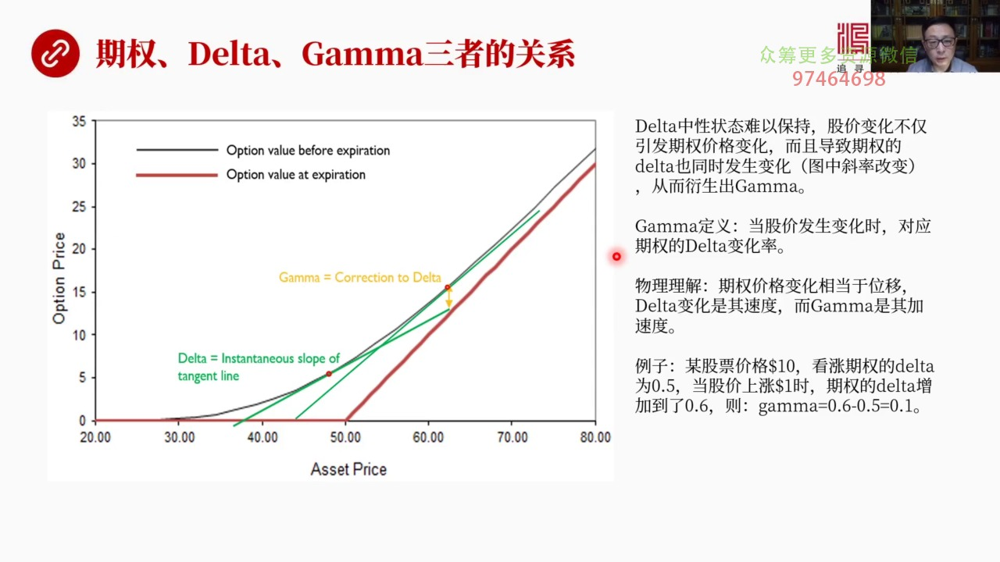

改码期权调查改码这三者之间到底什么关系如果我们来看这是期权价格这是股票价格我们说股票价格每一块钱期权价格也会动一点我们注意期权价格是这样的一个曲线这是扩奥平就是看着期权的这样的一个曲线我们会发现实际上调查的概念相当于这个曲线上了一条切线相当于协律的概念好如果股票是让这个股价发生变化这个期权的价格从这...

<strong>Cleaned narration</strong>

> 改码期权调查改码这三者之间到底什么关系如果我们来看这是期权价格这是股票价格我们说股票价格每一块钱期权价格也会动一点我们注意期权价格是这样的一
> 个曲线这是扩奥平就是看着期权的这样的一个曲线我们会发现实际上调查的概念相当于这个曲线上了一条切线相当于协律的概念好如果股票是让这个股价发生变
> 化这个期权的价格从这一点移动到这一点我们会发现它的切线其实也发生了变化这是第一个时间的切线这是第二个时间的切线或者两条切线的协律发生了变化就
> 是股票价格变了期权价格变了Delta也就是这个它的速度也在发生变化这就产生了一个测量速度变化的一个改码的概念这是一个加速度的概念这个加速度在
> 这里就体现在体现为两条切线协律之差这什么意思呢其实对改码的定义就是当股价发生变化的时候所对应期权的Delta它的变化率是多大这个是改码那么我
> 们刚才所说Delta中性呢这个状态也是很难保持的或者很难尝尽保持因为股价变化不仅以发期权价格变化而且导致期权的Delta也在变这样的话就眼神
> 出了改码这个概念如果我们从物理的角度来理解期权价格变化想像从这点到这点这是发生了唯一期权价格变化Delta变化呢就是从这个协律变成了这个协律
> 从这儿变成了这儿这两个甲脚代表它的协律的话这相当于速度改码呢相当于加速度因为我们来看举个简单例子如果某个股票的价格是十块钱看长亲权的Delt
> a是0.5当股价上涨一块钱的时候这个亲权Delta增加到了0.6就是从这个协律变成了这个协律那么改码是什么呢是0.6间0.5就是1就是0.1这就是这三者之间的关系搞清楚这三者之间的关系目的是为了了解

---

### Slide 16

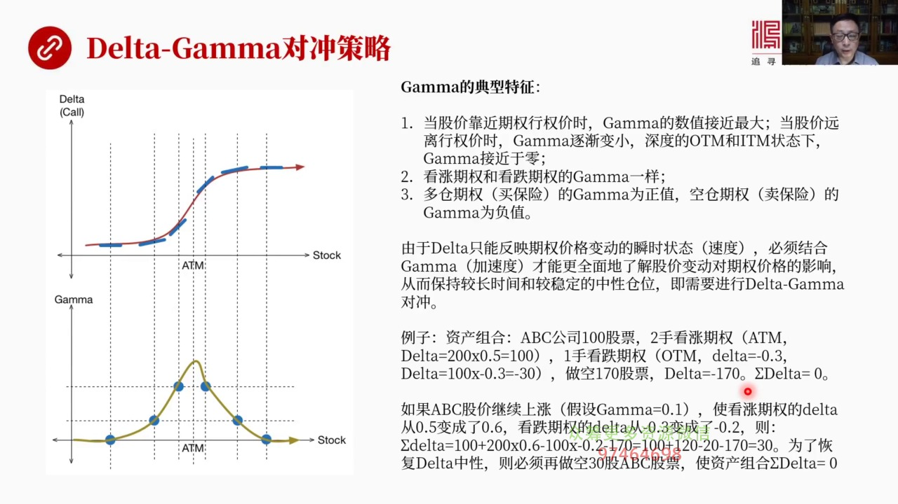

自我失伤还有很多机构他们必须要采取所谓的Delta Gama对重策略仅仅对重Delta是不够的因为股价一变Delta也变了所以你必须还要加上Delta Gama对重所以加上Delta Gama对重之后我们可以看到这条区线的变化就是这是Co这个是所谓看长期权的Delta的区线在ATM状态之下它是0.5...

<strong>Cleaned narration</strong>

> 自我失伤还有很多机构他们必须要采取所谓的Delta Gama对重策略仅仅对重Delta是不够的因为股价一变Delta也变了所以你必须还要加上
> Delta Gama对重所以加上Delta Gama对重之后我们可以看到这条区线的变化就是这是Co这个是所谓看长期权的Delta的区线在AT
> M状态之下它是0.5然后在这边是接近于是一个比较低的然后这边是这边接近于0这边接近于1那么Gama是什么概念我们刚才说的它是鞋律的概念Del
> ta是鞋律的概念Gama是把这些鞋律组合在一起你会看到它变成了这个形状所以这个就是Gama图这个就是它的Delta图相对硬所以从这两档图上从
> 这档图上我们可以看到Gama的一些点形特征又是当股价靠近形犬价的时候也就是在ATM附近的时候Gama数值接近最大你看它的波风在ATM这个点上
> 当远离形犬价的时候不管高还是低不管低还是高我们看到Gama逐渐变小逐渐去进于0它就在中间非常的大所以在深度和在深度的这个OTM和ITM情况之
> 下Gama都是距离0的那么这是第1个特征第二特征看长计权和看跌计权CorePort它的Gama都是一样的第三多藏如果你是买保险的多藏计权不管
> 你是买看长还是看跌它的Gama都是政治空藏计权你是卖保险这一侧的就是在我们的左手这边的从那张图上大家记住那张图你是卖保险在左侧买保险在右侧如
> 果你是空藏卖保险的你的干辣是肯定是附数所以我们由于把Gama和Delta它两个概念搞清楚Delta只是一个瞬间的情况也就是它反应的是一个顺势
> 状态所以我要加速度这个概念就是我得把速度和加速接在一起才能更全面的了解整个股票市场中价格变化对于我称位资产组合称位的它的一个全面性的了解而且
> 我需要不断进行调倉来保持我的这个中性称位就是我必须得进行不仅是Delta对重还要进行DeltaGama对重举个简单例子还用刚才那个例子资产组
> 合ABC公司一百股看长期权这么多看长期权这么多做空股票这么多总的Delta是零这是初始时刻假如ABC股票继续上涨这个时候我们假设资产组合中这
> 个期权它的Gama是零点一那么看长期权它的Delta从零点五变成零点六因为这中间增加了零点一看低计权从零点三变成零点二那么我们再算一下这个G
> ama总它的总值呢就是一百家这个时候再减去这个再减这个就我们会发现股票上涨了一块钱之后它的Gama变了变成了正数了看来这就说明你不是零不是零
> 就暴露了风险所以为了恢复Delta中性必须要再做空三十股股票因为三十股是富数这个正三十减富三十使得整个自然组合重新回到零所以这就是为什么要进
> 行Gama对重尤其是想做这张这种它不希望暴露任何的方向性的这个风险无论你是涨而跌你都不要影响我的总价值我不需要你这个总价值发生变化我只转差价
> 的钱叫买价 叫买价值差钱所以他们非常非常关注这个问题好 我们再考虑一下这就是我们把七权那些

---

### Slide 17

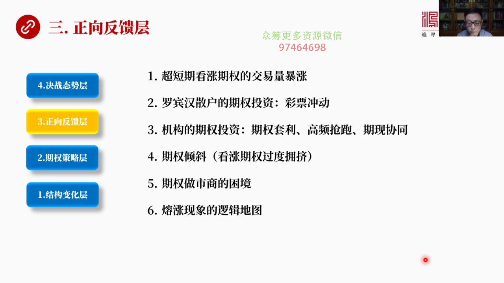

策略性的东西为什么做这张会有这种想法为什么投资人会有另外一种想法做了一个分析之后建立起了一个基本框架和理解它的一些基本的概念有了之后我们再往上看第三层正向反馈正向反馈从它是怎么形成的我们将通过六方面来给大家做一个解读我们看一下一页首先是超短期

<strong>Cleaned narration</strong>

> 策略性的东西为什么做这张会有这种想法为什么投资人会有另外一种想法做了一个分析之后建立起了一个基本框架和理解它的一些基本的概念有了之后我们再往
> 上看第三层正向反馈正向反馈从它是怎么形成的我们将通过六方面来给大家做一个解读我们看一下一页首先是超短期

---

### Slide 18

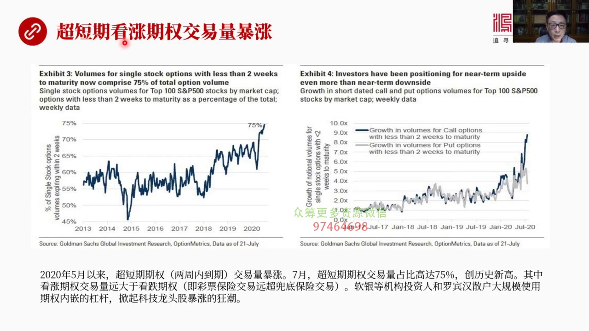

看长期权它的交易量包涨什么叫超短期就是两周之内到期的交易量两周之内到期的期权交易量包涨从这上突然我们给看到现在2020年之后我们特别是在3月经风暴之后两周之内看长期权的交易量已经达到了7月份已经达到了75%我们想想看两周之内到期这是非常短只有时间8天达到了整个交易量75%是说明大家都在超短线期权因为...

<strong>Cleaned narration</strong>

> 看长期权它的交易量包涨什么叫超短期就是两周之内到期的交易量两周之内到期的期权交易量包涨从这上突然我们给看到现在2020年之后我们特别是在3月
> 经风暴之后两周之内看长期权的交易量已经达到了7月份已经达到了75%我们想想看两周之内到期这是非常短只有时间8天达到了整个交易量75%是说明大
> 家都在超短线期权因为有很长你比如说到明年1月份或者到10月份10月份都有都几个月现在居然14天之内到期的账到75%而这75%是什么性质呢主要
> 还是看长期权我们可以看到看长期权在这看跌期权在这尤其是在这个期权以后可以说看长期权远远高于看跌期权在整个的交易量中间超短期这是第1个关键字超
> 短期的看长而看跌超短期的看长是现在期份以后美国股票市场中期权交易的总体的特征就是决大部分的交易是超短期的看长期权交易他的交易量包涨为什么会出
> 现这个情况就是软银这些机构特别是软银调投引发了很多人这个跟风大规模使用了期权其实期权是内线尴尬的我可以用很少的一些资金控制很大一个仓位然后他
> 的主要目的是为了先起科技龙头股包涨的库朝那么看长期权上两百分之七数这个战整个交易量的就是整个超短期的这个交易看长期权交易量包涨这意味着什么意
> 味着脉意味着彩票彩票这种形式的交易远远超过都抵性质的交易我们知道彩票交易就是看长期权内的交易刀底的交易就是所谓看跌期权的交易在这个领域中我们
> 已经发现了彩票现在是最强手的而刀底现在反而没人要或者说不在市场上不被人看好所以我们第一段脑子们要留下印象7月份以后正市场变成了什么样第二也我们再看下一也

---

### Slide 19

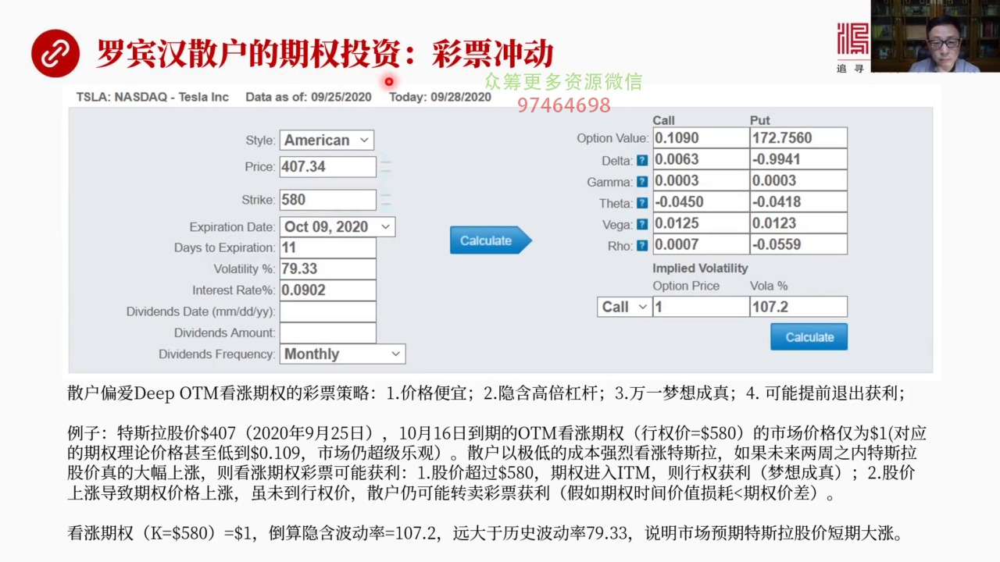

罗宾汉散户的七圆投资他为什么进行七圆投资他的动机是什么他的策略是什么我称之为是一种典型的彩票冲动因为罗宾汉散户他在七圆交易量中占比越来越高而且是超短期的看长期权所以我们分析了散户的特征之后你会发现他们非常喜欢远离也就是远离行权价的那些OTM那种类型的看长期权很便宜远离有4点首先是价格非常便宜因为他远...

<strong>Cleaned narration</strong>

> 罗宾汉散户的七圆投资他为什么进行七圆投资他的动机是什么他的策略是什么我称之为是一种典型的彩票冲动因为罗宾汉散户他在七圆交易量中占比越来越高而
> 且是超短期的看长期权所以我们分析了散户的特征之后你会发现他们非常喜欢远离也就是远离行权价的那些OTM那种类型的看长期权很便宜远离有4点首先是
> 价格非常便宜因为他远离行权价太远比如说我刚说苹果是比如说我们在这把用特斯拉做一个简单例子这是9月28号我们看到特斯拉的股价是407什么叫远离
> 如果我的Streb Price就是我的行权价是580那当然是远离行权价格这显然看起来非常没有可能性所以这种期权价格很便宜如果我们选到期价到期
> 时间是10月9号如果我们看到他的历史波动率是709.33然后无封限力率是0.09这基本上就是每年处的联邦记者利率注意背后这是5个变量了输入进
> 去之后通过这个Black Shows这个公式我们一案计算这是一个自动机会器我们立刻就会算出他们的理论的价值是一毛钱或者是要0.1美元它的扣非
> 常的便宜聊他是增长这么大干嘛是这么多然后这些相对应的眼神眼神数据都在这所以散户们非常喜欢买这种愿离市长价的这种新天价为什么要这么做价格便宜啊
> 我这才花一毛钱理论上来说那当然很便宜了其次由于他价格第一所以我用同等的资金可以控制更多的股票也就是我引含了更高倍的感感本来我用一块钱去控制多
> 少股票那么我现在如果说这个价格比一块钱更低我可以控制更多的股票所以我引含了更高倍的感感第三我的动机是万一梦想成真的呢万一到十月九号的时候股价
> 特资把股价真从四百零七挡到五百八呢我不就赚了嘛这叫万一梦想成真万一梦想成真它有强烈的这种实际上是赌土心态我买的才会说万一重的怎么办人是需要有
> 梦想实现的怎么办所以这是它第三个动机第四个动机就是我也可以提前退出货力所以我们还是用这个作为刚刚我们所说的这个例子四百零七这是九月二十五号的
> 它的市场价十月十六号到期也就是两周左右到期了OTM看长期权行员价是五百八在这里它的市场价格是多少是亿美元注意啊这个亿美元跟理论值可差的差的很
> 大呀所以理论值算算应该是一毛钱而市场交易出来是一块钱说明市场仍然非常超级乐观看好特斯拉股票继续包涨那么散户可以以非常低的价格一块钱以非常低的
> 成本强烈看长特斯拉如果未来两周之内十月九号之前特斯拉股价真的包涨那么看长期权这种彩票是有可能货力的有两种货力方式或者叫货力场景第一是股价超过
> 五百八梦想成真了我这个期权价进入了ITM状态我可以行权立刻货力这是一种就是涨过了五百八那我当然就货力了我就行权了就赚钱了第二个场景是股票价格
> 上涨导致期权价格上涨虽然还没有到五百八比如说涨到了五百那可以比四百高的多啊那么我的期权价格上涨了别忘了我是一块钱买的我是一块钱买的那时候如果
> 是高于一块钱我那个时候可以把它卖转卖彩票我是可以货力的卖给谁我可以卖给卖回给做事上一般卖回给做事上就是一开个相反的跟它一样的一样的这个这样的
> 一个合约就把自己以前的合约给关掉你就实现了套利就是卖还给这个做事上提前卖可不可以假如你的期权时间期权时间我们只会它是会带来一些价值损耗的就是
> 期权价格所以这时间特意它是会出现一些损耗的如果这个价值损耗小于期权差价就是你买金价和卖出价卖还给做事上的价格或者叫跟做事上了解这个价格价差你
> 如果小于它的话那你虽然可以引力所以它有两种引力的可能性当然一般都会被这个数给吃掉所以看涨期权等于如果这么做的话它其实有两种引力可能我们关键是
> ...

---

### Slide 20

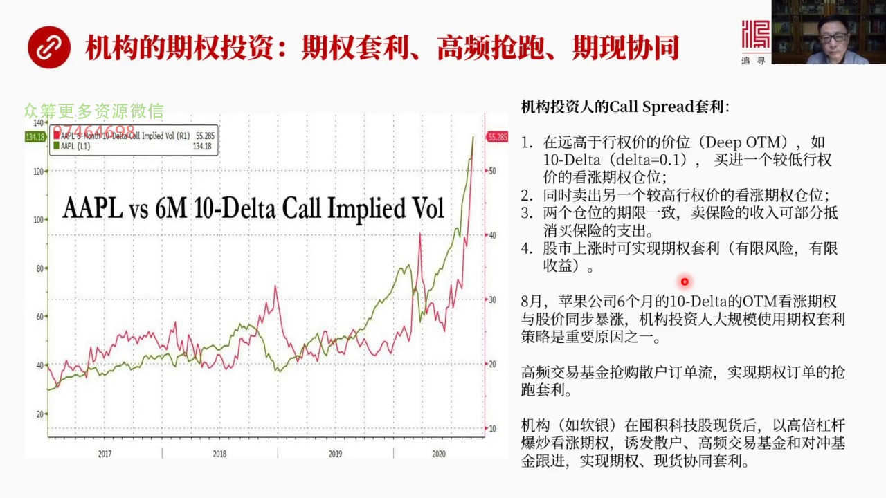

零机构的期权投资它没有什么思路它们在这里我列出了它们三个比较主要的思路比较主要的策略第一是期权套利第二是高拼强跑第三是期限协同什么叫期权套利期权套利机构投资者我经常玩的什么就是在远远高于新军降价位如果这个例子就是比如说10个调踏我们刚才所说这个时降调踏之什么概念的就是调踏仓位等零点一我们如果记住刚才...

<strong>Cleaned narration</strong>

> 零机构的期权投资它没有什么思路它们在这里我列出了它们三个比较主要的思路比较主要的策略第一是期权套利第二是高拼强跑第三是期限协同什么叫期权套利
> 期权套利机构投资者我经常玩的什么就是在远远高于新军降价位如果这个例子就是比如说10个调踏我们刚才所说这个时降调踏之什么概念的就是调踏仓位等零
> 点一我们如果记住刚才那张图你会发现这个行业价是属于太离谱了远远脱离的限价这个范围几乎不能实现只有零点一的这个10%的这种可能性未来能赚钱但是
> 交源一般用对它们来说一手一个合同相当一百股所以它们一般报价是报10所以我们看到10调踏的时候你就知道它说是调踏等零点一如果是50调踏的时候它
> 说的调踏等零点五正好在中间那个位置行业价是一样的那么我们看它们会怎么操作它会在远远高于现在市场价的这样的一个倡位上设一个购买它是设一个行业价
> 这个行业价偏低买一个看长期圈然后同时在另外一个更高的价位上比这个价低行业价还要更高的一个行业价上再卖出一个看长期圈主要它在刚才我说了卖保险和
> 买保险它同时做了两件事在价低的情况之下卖保险在价高的倡位上卖保险而且这两个倡位的期限是一样的原来合约期限是一样的主要目的是我在卖保险时候会获
> 得一笔保险金的收入我在买保险时候会支付给别人而我寄卖又买我可以转一些保险的费用来底常买保险的支出如果股票市场上涨那么我就可以实现七圈之间的这
> 种差价的套利这种套利方法有一定方险收益也比较有限但是它的可靠性比较高所以不少投资机购人其实我们一定要认识投资机购的这些人它要的是无风险收益就
> 是在风险集体情况之下我还尽可能获得较高手而不是去拼很高的风险或者即便拼很高的风险我要做风险对冲那么我们来看八一份八一份看到一个非常奇怪的现象
> 就是苹果公司6个月就是6个月到7的这种七圈而它的调查是10也就是0.1小代率的原源高于它市价的这样一种看涨七圈它的所对应的引寒波动力当然也就
> 是七圈本身包装它跟股票价格一起包装这一种情况的出现就是由于有不少几个投资人在玩这个七圈套力当然很多散户比较复杂散户估计也会这么玩直播他们资金
> 量有限所以这个是一个我们看到的这是几个投资人的一种策略还有第二种就是高拼交易基金墙墙桃因为他们买了大量散户定能流之后分析散户的数据知道散户准
> 备买什么样的看涨机宣买谁的看涨机宣 七圈价是什么这个七线多少它把你的定单都拿到了你的所有信心都知道所以我只要比你先下手比你早成交就行我就一定
> 赚钱了因为我比你跑的钱通回首卖给你我就能实现套力所以高拼交易基金它玩的是七圈的墙桃墙桃套力还有机构投资人比如说像软银软银它在图计上大量的科技
> 股在五六七几个月图计了数十亿美元的五大科技垄通股这种股票现货然后以更大规模加到干干的这样的数十亿美元在投资在报朝看涨七圈这样一来七圈价格报涨
> 我们就会看到苹果公司呈现出这样的一个报涨趋势包括股价和七圈价格一起报涨以韩波动力的业报涨这个以韩波动力代表的市场对于未来苹果公司继续上升这个
> 上涨的波动力的一个一种强烈的预期所以这样一来的话就会又发大量的散户高拼交易基金是跟着散户的对中基金又跟着它所以几帮人一起充进去大家一起买股票
> 和七圈所以对于这个软银来说它就实现了现货和七圈之间的邪同套力两个都断先囤现货再用七圈去敲整个市场然后敲的时候引来了更多人加盟然后使这个市场规
> 模这个上涨速度规模变得更大然后两边我都实现套力我们再看看下一当然这种做法

---

### Slide 21

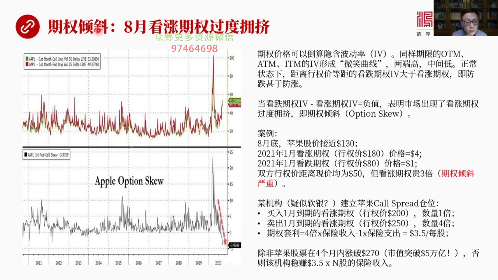

就会导致一个现象就是七圈清洁这个是问题的关键七圈清洁我们看看8月份以后看涨七圈过度拥挤了比如说从这张图上我们看到苹果公司它当月的马上要到期当月到期的这种它的看涨和看低七圈的隐含波动率它的质它的两者之差变成了富数什么概念我们这七圈价格根据刚才我说完那个公式大家脑子里面把这张图给印的大脑中间七圈的价格算...

<strong>Cleaned narration</strong>

> 就会导致一个现象就是七圈清洁这个是问题的关键七圈清洁我们看看8月份以后看涨七圈过度拥挤了比如说从这张图上我们看到苹果公司它当月的马上要到期当
> 月到期的这种它的看涨和看低七圈的隐含波动率它的质它的两者之差变成了富数什么概念我们这七圈价格根据刚才我说完那个公式大家脑子里面把这张图给印的
> 大脑中间七圈的价格算出来这个七圈价格有一个理论价格还有一个成交价格如果我们在市场上看得查到了成交价或者你的交易商报给你的成交价你有这个成交价
> 之后可以通过七圈公式抱着算隐含波动率iVimpliedVortility隐含波动率在不同的情况之下同样七线的OTM,ATM和ITM情况之下它
> 会形成个微笑曲线也就是两段高中间低正常状态之下如果说我们看到微笑曲线这种它是一个比较正常的情况之下那么距离形成价等距离的看涨看低七圈看低七圈
> 它是职会大于看涨七圈因为市场往往是房就是为什么我们要保有保险就是房跌甚于房涨我不怕它涨但是我怕它跌我更怕它跌所以如果我们从头上看它是列两个微
> 笑曲线看低七圈再上看涨七圈再下也就是看低七圈价格更贵一些因为主要它就是提到一个房跌保险作用而大部分人在市场中应该是房跌的所以它的市场需求来应
> 该更大如果说烦了如果说看低七圈价格低于看涨七圈或者要看涨七圈明显高于看低七圈在同样的情况之下这就会发生负值现象如果出现这个负值表明市场出现了
> 看涨七圈过度优积的状态也就是七圈清晰如果出现这个现象说明市场已经开始扭曲了那么我们在苹果公司这个七圈的这个清晰中间可以看到它是在这个苹果公司
> 是在七月和八月入序出现八月以后变得非常严重越来越严重出现了一个非常明显的一个七圈清晰问题也就是看涨七圈比看年七圈还要贵没这个天理因为大家买看
> 买七圈主要是为了房届结果看涨七圈反而就是反而这个变得更强手看结七圈没人要这个是无微反常识的我们九个例子吧八月底苹果公司的股价接近130美元一
> 股那么2021年的看涨七圈看这个到期的看涨七圈它的行政价是188也就是比现在的这个市场价要高50美元价格是多少呢这种看涨七圈没股价格是4美元
> 同期限看跌七圈它的行政价是80比现在这个价格低50注意这个是高50这个是低50它的价格只有1美元也就是双方行政价一个188一个80距离现在的
> 市价都是差50两面是等距离的但是看涨七圈却要贵三倍我刚才说看跌七圈应该更贵在同等期限同等距离情况之下看跌七圈应该比看涨七圈更贵而现在看涨七圈
> 比看跌七圈贵的三倍这意味着七圈以严重清晰这是一个相当大的就是如果我们发现市场出现了这么古怪的现象就应该足够引起你重视说明这个市场即将出大事要
> 出大事那么最近我看了很多这个分析文章也包括其实也包括很多交易员他们的提供了一些数据有一天我注意到有些交易员在他们的洽里的对话框里头有一些交易
> 员这些机构的这些人这些机构他们就说他们有些客户然后有人说你们是不是在说软银他们没有正面回答画了个笑点所以我认为是一次软银在他们因为他们是一个
> 交易平台在他们交易平台上建立了苹果的就是所谓7000套礼的参业他公布的参业是这样的某机构可能是软银买入了1月份到期的看涨期权行权价是200注
> 意苹果公司当时的股价是130他买了看涨期权在200这太高了原缘原缘超突了可能性在这样的一个价位上建立200就是买入200美元的新鲜价的看涨期
> 权数量是一倍他没有说多少股不知道是100万1000万还是一股这个是我没有告诉我们当然他看涨期权他只是一个眼神的东西并不代表他真是拥有什么的股
> ...

---

### Slide 22

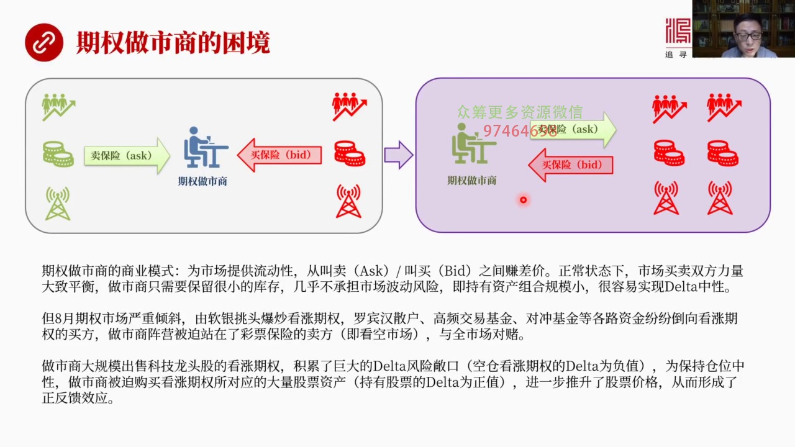

不过这么一来显而易见做事伤幸福的困境因为做事伤的模式这是传统模式市场中的买家散户对冲基金高兴交易基金在这一侧在他们的另外一侧还有一些看空市场的既有卖保险的也有买保险的双方大体上是军力敌做事伤7权做的伤他是一个我用蓝丝带给他很冷静既不是卖的也不是卖的我只是帮你们搓合的你们有卖的有叫卖的也有叫卖的刑我在...

<strong>Cleaned narration</strong>

> 不过这么一来显而易见做事伤幸福的困境因为做事伤的模式这是传统模式市场中的买家散户对冲基金高兴交易基金在这一侧在他们的另外一侧还有一些看空市场
> 的既有卖保险的也有买保险的双方大体上是军力敌做事伤7权做的伤他是一个我用蓝丝带给他很冷静既不是卖的也不是卖的我只是帮你们搓合的你们有卖的有叫
> 卖的也有叫卖的刑我在这里我给你搓合我赚的是你的叫卖价和你的叫卖价之间的价差这是我卫视上提供流动性应该得到了爆差所以他只做这个事转差价在这种情
> 况之下他不需要保存他不需要自己保留一个非常大的资产库存因为他不需要因为他只是搓合只是在赚你们的这个叫卖和叫卖的差价所以他没有必要自己持有很大
> 的仓位也非常节省自己风险也很小不承担市场的波动风险由于他持有资产组合非常小所以很容易实现带到他对重由于他波动因为我仓位小买卖一些股票就行了如
> 果我有1万股我就调整几百股可能就平衡了但是如果你如果现在情况变成了这样整个市场中被软医他们炒的爆炒看哪几句爆炒股票所有市场参与者全部站到这一
> 侧变成这种情况所有人都变成了买保险的而买保险的没了只剩做事商了而做事商为了给市场提供流动性他不得不站在所有的市场的交易方的对立面所以如果大家
> 看文章一般会说这什么The market就是市场中的力量这一帮人做事商或者叫做事商阵营吧叫The Street在大街上交易这个做事商的这批人
> 他们已经跟整个市场在对赌所以我们看到8月由于期权市场严重清晰由微轮调头爆炒这个看涨期权罗宾汗散户在上高屏对中基金高屏交易基金在上对中基金各路
> 资金纷纷倒向看涨期权的买保险的做事商阵营被迫站在了他们的对立面站在了卖发也就是看公司上与全市场对赌你想想看对下它的倡位就变大了因为他要他要什
> 么呢他要他需要一个倡位的中性也就是做的商如果我卖这么多保险给你们也就是我卖卖彩票给你们卖保险给你们我会及了一个非常巨大的达到它的风险场口我们
> 开始说了你卖出这么大规模的这个看涨期权卖出达到是负质我这个风险场口就会变得非常大万一我都卖保险我说整个市场这个苹果不会涨这么多他真涨到二百以
> 上了我要承担无限风险所以你们在过对赌的时候你要二百五的保险要两百的保险好我都卖给你的卖给你的时候如果是苹果股票真的涨到这个质上所有的风险都是
> 我自己扛这不行所以他为了保持倡倡位的中性做事商被迫主要这是复数他会让调查等于零他必须要去购买大量的股票资产因为持有股票资染的调查为政治才能对
> 冲卖保险所带来了巨大的调查风险所以做七圈做事商卖保险的同时必须要大量买进他卖保险这些七圈他的底层的股票资产他以这么大的规模卖保险然后同时要以
> 更大规模来买底层的底层资产因为这动用的资金少而底层的动用资金非常大所以他就成了股票资染了最大的买家之一结果他被迫成了买股票的买家进一步推成了
> 股票价格他实际上被这帮人绑架因为他卖保险是看空市场而这些人逼迫他为了调查中性他被迫又加入他们这活能买股票所以他是被绑架通底了被绑架来资助敌人
> 这一下子就形成了一个强烈的正反亏效益你买七圈七圈长七圈长之后带动股票长股票长了之后迫是做事商为了调查中性因为他是卖保险的他必须要买大量股票股
> 票长得更凶所以这就进入了一个正反亏的状态这是理解整个这次大树牙克内暴的最重要的一个逻辑其实很多人并没有真正懂为什么做事商要加入敌对方还要报朝
> 股票把自己逼上角落主要原因就在于调查对重他必须要保证调查为中性这是他陷入困境的主要原因

---

### Slide 23

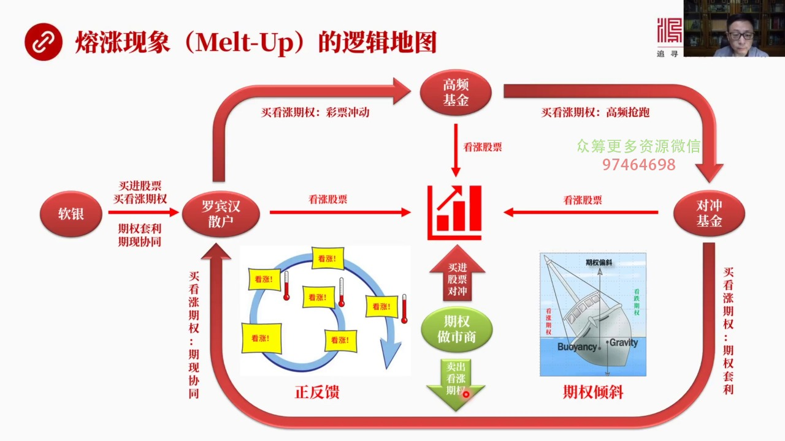

好有了这些概念之后我们最后用一张逻辑地图来概括整个八月份和九月份出现的情况就是乱营调投他是一个大火锁他大量吃进科技股的股票数以十亿计美元同时又花了将近四个亿美元买看长期圈那他对应的股票量那就是四百亿甚至五百亿美元的大规模的不多买集中在少数几只股票上那当然会产生非常精神的效果他的思路刚才我已经说了期圈...

<strong>Cleaned narration</strong>

> 好有了这些概念之后我们最后用一张逻辑地图来概括整个八月份和九月份出现的情况就是乱营调投他是一个大火锁他大量吃进科技股的股票数以十亿计美元同时
> 又花了将近四个亿美元买看长期圈那他对应的股票量那就是四百亿甚至五百亿美元的大规模的不多买集中在少数几只股票上那当然会产生非常精神的效果他的思
> 路刚才我已经说了期圈套利还有期线系统他既有期货又有限货两个一块转他的这种集中的力量在少数几个龙头股上这么狠狠的下单当然会断期之内刺激这些股票
> 上涨然后就会刺激罗宾汉散户成天上万罗宾汉散户冲架进来而且他们主要是买期圈买看长期圈他们动机是买彩票而且买的都是远离市场价的那种价格非常便宜的
> 干嘛背出非常大的想重彩票的那种看长期圈同时把他们也买股票所以他们也看长股票他们这种行为被对冲这个高拼基金发现之后高拼基金强讨你没有买这个看长
> 期圈你没有买股票我会下单比你们更快我的量会比你更大我要赚你们的钱当然这一系的行为就会刺激对冲基金也跟他大潮走就是你们如果大家都这么干我这么干
> 我也能赚钱所以对冲基金也是看长股票同时买看长期圈然后期圈套利或者是期圈系统他两个都玩所以我们来看到这个看长期圈的正兴欢体系软银刺激了罗宾汉罗
> 宾汉掌户刺激了高拼基金在买看长期圈再刺激了对冲基金一圈接一圈的下来这个看长期圈的价格就越炒越高而市场中唯一跟他们对做了就是期圈做事上期圈做事
> 上被迫卖出看长期圈来满足他们的需要因为他是做事上必须要提供流动性你没有买我就只有卖我要卖出看长期圈就必须要买进对应的股票来进行对冲所以他就成
> 了最大的股票的买家所有的都看好股票所有人都下单买股票所有人都看好看长期圈所以你都买看长期圈你想想看这就变成了一个期圈上严重清晰在看长期圈这一
> 侧实际上卖保险就只剩下做事上剩下所有人全部集中在这边做事上集中在他实际上集中在看跌这个方向上所以整个市场的如果像一艘传这个期圈的市场出现了严
> 重的偏袭就是期圈做事上跟所有人对做而且股票市场形成了一个强烈正反会所有人都看长一圈一圈长一圈长下来这就是一个正反会我们知道一切正反会最终都是
> 崩溃因为正反会系统需要无限的能量注入你的涨幅越来越大需要越来越多的资金维持同样的涨幅那你这个资金就会对不断吸到股市面然后才能满足这个正反会的
> 需求全业资金如果都被吸引去了这个股市上涨也要到头当然原来在那之前正反会系统就会崩溃所以我们在这里其实已经看到了如果在没有美元流动性危机的情况
> 之下股票在特定情况之下也会发生内报就是自我崩溃这跟我们以前2018年二月那次股在的情况是一模一样我们上次讲过做公播动性最后是一个谣伟说自己把
> 自己吞试那样的情况这次再次发现就是2020年9月出现了那次的客股在也是一种自视现象想为说咬到自己的尾巴了然后当肉池越吃越饿就把自己火火吃掉了
> 所以我们已经看到了股票市长发生内报或者叫股票自崩溃的一个电型的逻辑结构这两者是完全一样的我们再往下看

---

### Slide 24

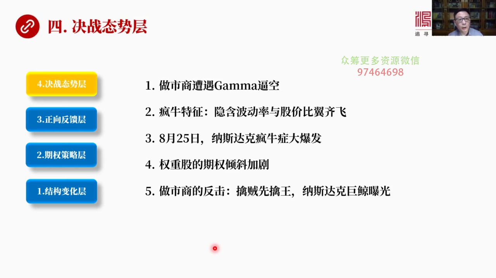

下面就睡到学站太时层学站太时层我们会分几个方面来论数我们先看第1个方面其实在8月份9月份的时候

<strong>Cleaned narration</strong>

> 下面就睡到学站太时层学站太时层我们会分几个方面来论数我们先看第1个方面其实在8月份9月份的时候

---

### Slide 25

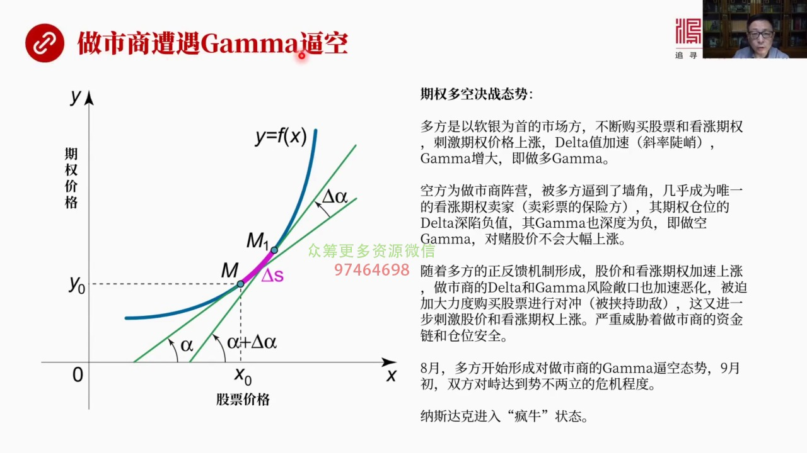

做事上遭遇到了是一个B空是叫GamaB空为什么呢如果我们看这张图这张图我觉得话的它虽然不是侵权那个图但是我觉得它这个曲线话的更清晰我们用这张图可以做一个进一步的解读X轴代表股票外轴当然就是欺权我们看到这个曲线就是欺权的一种韩数这条曲线就是欺权的这种曲线随着X变化欺权也会发生变化那么在M点和M1点这是...

<strong>Cleaned narration</strong>

> 做事上遭遇到了是一个B空是叫GamaB空为什么呢如果我们看这张图这张图我觉得话的它虽然不是侵权那个图但是我觉得它这个曲线话的更清晰我们用这张
> 图可以做一个进一步的解读X轴代表股票外轴当然就是欺权我们看到这个曲线就是欺权的一种韩数这条曲线就是欺权的这种曲线随着X变化欺权也会发生变化那
> 么在M点和M1点这是两个不同的位置比如说股票市长从M点从X0涨到了X1对M1点股票上发生这么大变化我们会看到欺权也就是Delta它的欺权从这
> 条线变成了这条线两边有个甲脚这个甲脚就是Gama这个Gama就是我们刚所说的股票市场上涨一美元Delta变化多少变化这么大所以Gama主要是
> 测两个斜线之间斜率它所夹的这个脚度或者叫斜率之差这么来理解就容易了或者叫物理学生我们可以理解什么加速度现在出现的情况是欺权多空的绝站在8月份
> 以后多方是谁当然是软明为首的市场方这帮人不断购买股票还有购买看涨期权刺激了期权加个大涨然后股票也大涨这就导致它在这个过程中导致这条线越来越抖
> Delta它的较大值开始变得加速越来越快也就是斜率变得更短就是欺权仗个变得越来越短因为大家都在吵买家太多 卖家太少所以这条线变抖了Delta
> 值加速了当然你要这条线变得更短你夹脚两个时刻的夹脚就会变得更大所以Gama一定会变大也就是软银这帮人市场方是做多改码的那么空方是做事上阵营不
> 是一个做事上而是一级做事上二级三级四级是一批做事上他们够成了做事上的阵营够成了美国的赞全市场股票市场够成一切金融市场的主力的玩家包括交易所都
> 是以他们为核心这些人代表空方因为他们被逼到逼到强角市场只有他们一家被迫在卖这个保险他们成了几乎成了唯一的看长保险看长七圈的卖家就是保险的卖房
> 所以他们的七圈餐位得要造值是严重的负值那么他们的夹码也是严重的负值所以对于做事上来说他们叫做空改码跟这个多方正好相反所谓做空改码的概念做空改
> 码他对应什么呢就是他认为市场变化率不会这么大就是市场的未来向上涨比如说苹果往上涨的这个动力不会那么忙他是看空的所以他对赌股价不会大幅上涨如果
> 赌股价大幅上涨的话他这个改码是太大他还要进行再对冲还需要买更多的股票随着多方正反亏机制形成然后做商也加背破加入所以股价和看涨期团变成了加速上
> 涨的这种模式结果做商了调查和改码的风险场口变得越来越糟然后破起他们加大购买股票进行对冲这就是我说的被邪迟来帮助敌人这有进一步刺激了股价和看涨
> 期团的上涨最终什么他严重威胁着做商的资金链和倡美安全做了商他也是有自己的资产负贷表达他也没有更多的钱钱可以无限量去扩大自己的库存比如说买股票
> 对他来说我不靠这个资金我只靠差跃资金钱我花这么多钱囤这么多股票干什么对他说是没有意义的而且要占用他大量的资金同时你这个价格涨了越猛我做了对冲
> 越多其实对我的倡美安全来说是一定有负面作用的一个对冲不利或者变化太快倒着我对冲失利这种案例太多了所以这个多方也就是做事商被空方这个这个空方这
> 个做事商被软刑这帮人逼到了绝路上逼得越来越危险到8月底的时候双方其实已经形成了整个市场对做事商它形成了一种干嘛逼空那种态势9月初双方的对峙达
> 到了事不两例的危机程度就说这个危机一度气发一定会爆发所以那个时刻纳斯达克进入了风牛状态好我们再看下一

---

### Slide 26

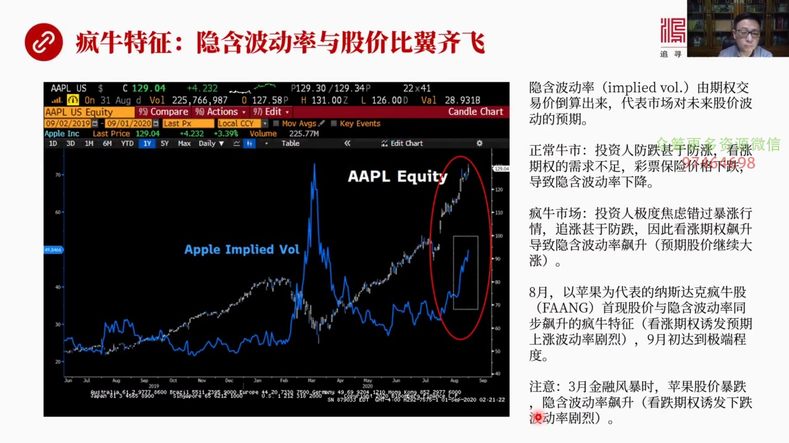

好我们现在关键需要判断风牛的特征实别风牛的特征我们怎么说一个市场进入了风牛状态在我看来就是这条曲线这是苹果的这个它的银涵波动率和苹果的股价我们看到当这种信仰出现的时候这就一定说明它换上风牛状这个信仰说明什么苹果公司的银涵波动率和它的股票价格同步爆炸这是不对的这是有问题的我们看到苹果公司或者叫股票上上...

<strong>Cleaned narration</strong>

> 好我们现在关键需要判断风牛的特征实别风牛的特征我们怎么说一个市场进入了风牛状态在我看来就是这条曲线这是苹果的这个它的银涵波动率和苹果的股价我
> 们看到当这种信仰出现的时候这就一定说明它换上风牛状这个信仰说明什么苹果公司的银涵波动率和它的股票价格同步爆炸这是不对的这是有问题的我们看到苹
> 果公司或者叫股票上上波动率不就是广望指数吗一般在牛市的情况之下你像在2019年我们看到苹果公司的股价虽然一直在涨但它的波动率是很低的因为牛市
> 吗牛市上涨一般投资人士房跌不房涨上涨我就持有股票了下跌我才会买保险去防止它下跌就是买这个买刊跌期权然后我是为了防止下跌结上我的损失了所以一般
> 而言在正常牛市之下随着股价的上涨波动率会比较的低或者持续走低那么在这个时刻我们看到今年3月份出现金融风暴的时刻苹果的银涵波动率爆炸为什么因为
> 苹果股价爆跌疫情爆发了金融风暴爆发了每个人都预期股票还会下跌所以这种银涵波率的上涨是代表了市场预期未来苹果股市还要大幅下跌是向下跌的波动率代
> 表下跌的波动率还会猛烈的增加波动率是两个方向既有上涨也有下跌的在这种情况下市场预期下跌的幅度会很大好但是8月以后我们开这个7月份以后在7月份
> 以后我们可以看到尤其在8月份变得更短看到什么呢看涨期权看到这个银涵波动率和股价同步爆炸这个现象说明这个市场变得非常不正常风也有市场同个人级绿
> 他们陷入了级度的焦虑焦虑什么呢焦虑错过爆涨行情所以他们这个心态是追涨甚于房地他怕赶不上这班车而不怕苹果公司的股价爆跌我记得我们同学有爷同学在
> 做美股就说过这问题他已经迟避官望了好久留有资金观察很长时间越等越焦虑生怕错过这班车这些人在风牛市场情况之下他的焦虑使得银涵波动率大涨因为他要
> 追涨是与房地所以银涵的就是看涨期权价格飙升他实际上是预议市场引涵所谓市场预期波动率会飙升而这个波动率是指着股票向上的波动率这个苹果公司股价还
> 会大涨8月份以苹果公司为代表纳斯拉克风牛包括放这股价第一次出现股价和引涵波动率同步飙升的风牛特征看涨期权又发的预期上涨波动率的预议上涨这种波
> 动会变得非常距跌9月初达到了极端的程度注意这跟3月份这个情况是不一样的3月份苹果股价是爆跌银涵波动率与飙升这是看跌期权大家都在买看跌期权又发
> 的下跌波动距跌的这种预期所以当我们时候什么时候看到了看涨期权什么时候看到了银涵波动率和它的股价同步飙升的时候说明这个市场进入了风牛状态

---

### Slide 27

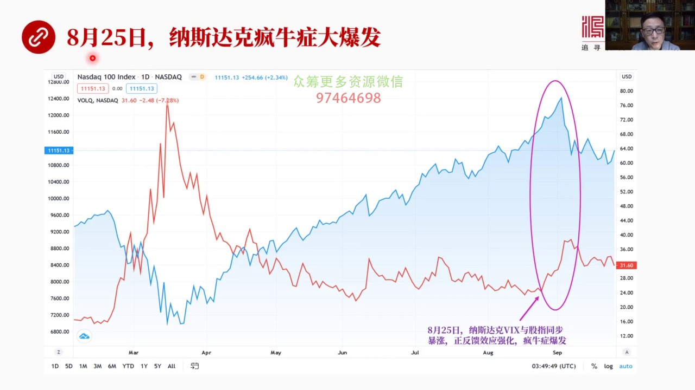

我们再看下跌不仅是苹果公司整个纳斯拉克风牛都具有这个典型特征时间是8月25号所以我们可以把时间锁定在8月25号纳斯拉克的VIX指数这是纳斯拉克100的VIX指数这是纳斯拉克100的谷指我们看到在8月25号这一天这两者出现了同步的现象也就是你的股票这个大势股票大势在网上盟长同时你的波动性你的恐慌指数也...

<strong>Cleaned narration</strong>

> 我们再看下跌不仅是苹果公司整个纳斯拉克风牛都具有这个典型特征时间是8月25号所以我们可以把时间锁定在8月25号纳斯拉克的VIX指数这是纳斯拉
> 克100的VIX指数这是纳斯拉克100的谷指我们看到在8月25号这一天这两者出现了同步的现象也就是你的股票这个大势股票大势在网上盟长同时你的
> 波动性你的恐慌指数也在网上长当然在我看下这个VIX这个恐慌和3月份的恐慌不是一个代言3月份的恐慌是恐慌下跌这个恐慌其实是恐慌上涨就是我怕赶不
> 上车赶不上抱的跌这个行情所以在这种情况之下处于一旦出现了这两者同步上涨这意味着正反亏效应开始变成强化启动了并且越来越强化这意味着整个市场爆发了风牛症

---

### Slide 28

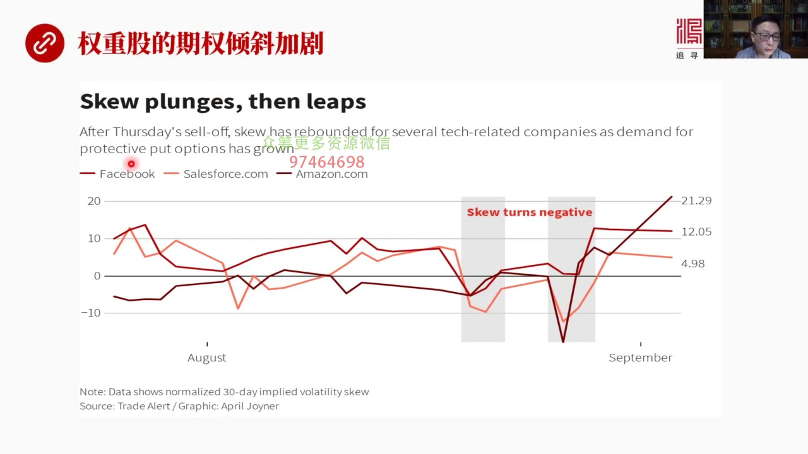

我们再看下野但不仅是苹果也不仅是整个市场我们看了一些众投这个全众股它的气权清洁问题都很严重我们可以看到他们在8月底9月初他们的所谓气权清洁的问题都变得非常严重这就是股票市场爆跌之前的所谓危机之前的前召我们再看下野当然我刚才已经说

<strong>Cleaned narration</strong>

> 我们再看下野但不仅是苹果也不仅是整个市场我们看了一些众投这个全众股它的气权清洁问题都很严重我们可以看到他们在8月底9月初他们的所谓气权清洁的
> 问题都变得非常严重这就是股票市场爆跌之前的所谓危机之前的前召我们再看下野当然我刚才已经说

---

### Slide 29

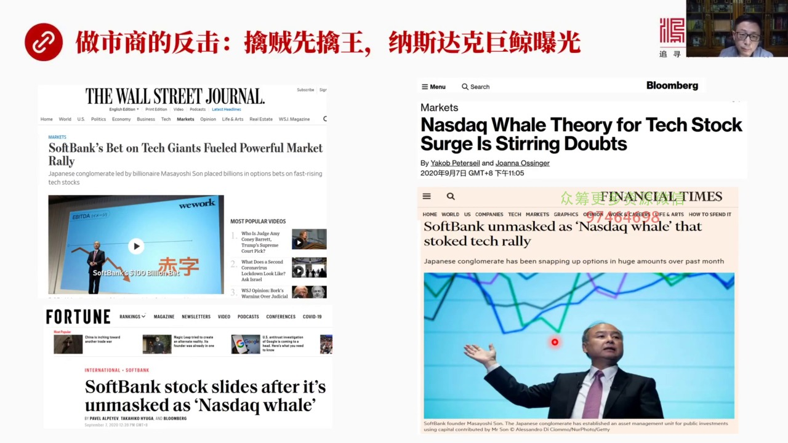

这等于把做事上冰上的决路你威胁到做事上的资金安全威胁到它的资金链也威胁到倉位安全所以做事上整个被逼空逼到决路上而且再这么发生下去整个市场都会出现重大灾难所以做事上不要忘了他们是知道谁在对付他的因为他掌握着交易的定单流所以定单流不都要经过做事上吗人家一分析就知道哪个人和哪个人在整我们当然很快就会发现软...

<strong>Cleaned narration</strong>

> 这等于把做事上冰上的决路你威胁到做事上的资金安全威胁到它的资金链也威胁到倉位安全所以做事上整个被逼空逼到决路上而且再这么发生下去整个市场都会
> 出现重大灾难所以做事上不要忘了他们是知道谁在对付他的因为他掌握着交易的定单流所以定单流不都要经过做事上吗人家一分析就知道哪个人和哪个人在整我
> 们当然很快就会发现软银肯定是最贵货手或者是调调头轮那么做事上的反应就是勤贼先进王纳斯拉克据经暴光我们可以看到那里几天集中暴光孙正义你看看华尔
> 街市报讲孙正义的软银的时候他派了一个孙正义的赤字其实是他做PPT讲的微货这个项目这是个失败项目把这样的标准和一个失败项目挂上高显而易见华尔街
> 市报是在贬损孙正义或者说是在强烈暗示科技股的报仗都是孙正义在导规是他的Bat是他的东博所以我们来看这些媒体的人手段包括做事伤做伤谁啊不就是高
> 盛对网人吗不就是某个大通这些人吗还包括一些其他的这个人这些人就是华尔街的主力啊就是他的医生医商啊也是最大的做事伤啊同时又是每连处主要的股东啊
> 那华尔街不是听他们的吗他们是一伙人的所以当他要划拿出这张图片来说孙正义说那显然是别一样而且对孙正义这已经是秦泽先亲王的下事我只要把你的这些定
> 单一报光我把你的这个策略一报光你立刻在全世界就成了人人喊打的挑动金融市场股东金融市场现在是混乱的你成了个打断鬼了这一报子打下来说你是个纳斯拉
> 固据金没有人再敢跟你合作没有人再敢跟你投资了所以我只要曝光你你就已经死了就不能再跟我玩这套而且我还要你赔钱所以各大媒体积极曝光迫使孙正义迫使
> 软音赶紧开内部董事会赶紧去反思这个我们这个策略是不是有问题去媒体后来也报道了这一首就是我们看到做事伤的反击所以这一场齐全大决战虽然孙正义他们
> 这一帮这个市场方把做事伤逼到强角但是做事伤的反击也是一枪致命只要曝光孙正义打掉了龙头老大或者打掉了调头闹事这一个人农民起可以很快被镇压下去所
> 以现在整个市场逐渐恢复正常但是逐渐恢复正常之后如果没有孙正义这样调头的人要想再次发动全市场逼空做事伤这样大规模的战役让整个股价和齐全价的看长
> 一个暴涨再来一个人暴涨这可不是短期之内这个市场能量所能够重新聚集起来的所以在我看起来他这个盘整会持续相当一段时间

---

### Slide 30

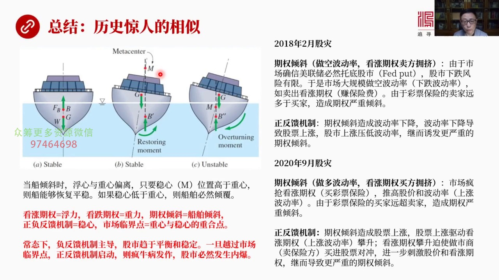

最后我们来看总结历史精神的相似我们主要是要对比2018年2月的股灾和2020年9月的股灾这两次他的逻辑结构在哪里是完全一致的在我看起来首先齐全清晰这是完全一致的正反归机制是完全一致的我们来看只不过清晰全清晰的方向不同2018年2月这一次齐全清晰主要是这帮人在做空波动力如果大家感情去回头看一下我们的核...

<strong>Cleaned narration</strong>

> 最后我们来看总结历史精神的相似我们主要是要对比2018年2月的股灾和2020年9月的股灾这两次他的逻辑结构在哪里是完全一致的在我看起来首先齐
> 全清晰这是完全一致的正反归机制是完全一致的我们来看只不过清晰全清晰的方向不同2018年2月这一次齐全清晰主要是这帮人在做空波动力如果大家感情
> 去回头看一下我们的核心科的前期讲当时做空波动力成了一个主要的一种盈利方式还有人把做空波动力当成一种类似于债券这样的因为做空波动力我只要是卖券
> 呢其实我不就说保险费吗我把保险费不就像那些你牛妈把现金流打包成一个债券类的固定社会类产品没问题所以这都是那个时代发生的事当时的股阵清晰主要是
> 做空波动力市场集中做空波动力看着齐全的卖房过渡雲集大家都在卖保险都想获得现金流都想收益保险费导致了齐全清晰为什么会清晰清晰由于整个市场上确信
> 每年处必然会托试就是所谓的Fart FootFart Foot就是每年处在卖的看空梯全的保险就是刀底保险每年处大家所说Fart Foot意味
> 着每年处十个准备着市场跌到一定程度股校市场跌到一定程度它就会刀底你们有多少你们有多少我要多少低约这个行程价我通知这不就看多市场吗所以既然每年
> 处脱底股市那股市风眼下跌就这个风眼就很有线啊大家开始大规模做空波动力也就是不认为股票市场会大复下跌方式卖出看朗齐全收保险费甚至做成固定收益类
> 产品由于彩票这种保险的买这个卖家太多大家争相卖保险而买家不足所以造成了这个保险价格下跌也就是这个波动力不断的下跌这种情况引发了齐全的严重的清
> 洁也就是看长齐全的卖方太多而这个买保险人太少传往这边协的它的正反归机制是怎么形成的呢就是齐全清洁造成了波动力不断下降波动力下降注意那个公式记
> 得那个公式吗波动力下降在五个三十中间输入进去之后会导致股票价格上涨股票价格上涨会进一步压低波动力然后又发更严重的齐全清洁卖保险的更多更拥挤买
> 保险的更不足这一条一条就会使这个传越来越骗最后翻过了一个临界点头他就会翻船2021年9月份今天9月份的股灾呢也是齐全清洁但这回是做多波动力市
> 场集中在做多波动力看涨齐全的买方拥挤就是像软银这些人都是买保险的我要买看涨帮看涨的保险我要买看涨的保险谁是买方做伤势买方市场风强看涨齐全就是
> 买保险推高了股价和波动力当然这种波动力是上涨股价上涨市场上涨的这种波动力由于保险的买家太多而买家太少最后只剩下的一家所以造成了严重的齐全清洁
> 这个反馈机制是怎么形成的就是齐全清洁造成股票上涨股票上涨驱动看涨齐全或者叫看涨的波动力上涨看涨齐全攀升最后迫使做职商就是所谓买保险方被迫买进
> 股票进行对冲这样一来就会进一步刺激股价和看涨齐全进一步上涨距而导致更严重的齐全清洁然后再来一轮再来一轮再来一轮正反馈就会不断放弹最后当然只能
> 以崩盘稍微这个现象如果我们提练一下我想很长时间在网上找了很多形象里因为这个道理要想讲清楚不难但是要想让大家直观的理解是有难度的所以我找了很多
> 传方面的例子我觉得这个传的这个稳定图特别具有的说这个直观的说福利就是我们看到在这个福这个这个杭海在杭海这个行业中间每一艘传都有福利和重力所谓
> 的这个纪点就是它的它的重心避免就是它的福心然后你会看到这是它比较稳定装的之下是是这样的一个状态就是它的重心和福心是在一条线上当时当传发生清晰
> 的时候注意啊它的福心变了不在这了变到了事了避典变成避贬同时重心也发生了变化这个时候还有一个就是这个传体有一个自身的自身的一个纸线同时福利也有
> ...

---

### Slide 31

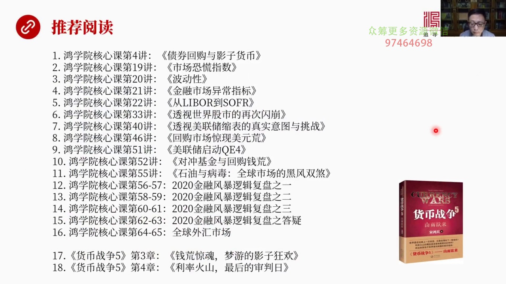

非常有助于大家提高自己的对股票市场的认知而且包括提高自己对投资对很多领域的理解能力最后我们这是我们的推荐的月多的材料

<strong>Cleaned narration</strong>

> 非常有助于大家提高自己的对股票市场的认知而且包括提高自己对投资对很多领域的理解能力最后我们这是我们的推荐的月多的材料

---

### Slide 32

好 今天咱们的课就到这里谢谢大家祝大家国庆中秋一会再见

<strong>Cleaned narration</strong>

> 好 今天咱们的课就到这里谢谢大家祝大家国庆中秋一会再见

---

### Slide 33

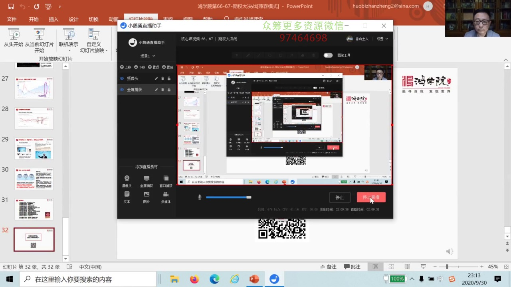

<strong>Cleaned narration</strong>

---
