# 核心课视频-68、69 东方文艺复兴（三）北方文明的曙光 — Slide Notes

> **来源**：鸿学院核心课程  
> **幻灯片**：31 张

---

### Slide 1

這回我們還是講東方文藝復興的系列我們今天講第三部分北方文明的暑光我們看畢業北方文明在九千年前就已經出現了

<strong>Cleaned narration</strong>

> 這回我們還是講東方文藝復興的系列我們今天講第三部分北方文明的暑光我們看畢業北方文明在九千年前就已經出現了

---

### Slide 2

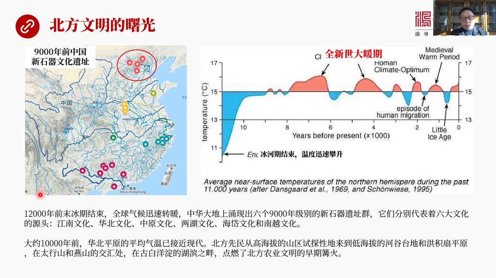

如果我們來看九千年前中國的新時期文化移植分布我們大概可以看到這樣的一個局面在我們上唐克講的是江南文明請人於上山立區這一塊是最早發洩上萬年文明移植這是我們上次課講的除了江南之外其實當時中國還有好幾片地方出現了古老的文明也就是新時期時代早期這個早期我定義為至少九千年前我們可以看到華北出現了文明移植山東出...

<strong>Cleaned narration</strong>

> 如果我們來看九千年前中國的新時期文化移植分布我們大概可以看到這樣的一個局面在我們上唐克講的是江南文明請人於上山立區這一塊是最早發洩上萬年文明
> 移植這是我們上次課講的除了江南之外其實當時中國還有好幾片地方出現了古老的文明也就是新時期時代早期這個早期我定義為至少九千年前我們可以看到華北
> 出現了文明移植山東出現了文明移植中原另外還有就是長江中有的湖南當然最多的出現在廣東廣西以待還有湖南南部這塊是最密集的所以我們可以看到大約在九
> 千年前中國已經出現了應該說六個最主要的新時期移植群這六個地區我覺得他們分別代表了後續發展起來的六大文化江南文化華北文化中越文化兩湖文化海帶文
> 化還有就是南越文化他們的源頭在九千年前都已經站入出來那麼我們這張圖顯示的是全新式大暖期所謂全新式就是一萬兩千年以來一萬一千七百年以來一直到今
> 天我們都是全新式出在全新式這個時代我們可以看到從一萬兩千年開始兵擇期結束然後溫度迅速的升高大約在一萬年左右的時候就已經接近現代這個溫度了當然
> 這是個全球的平均值每個地區會有顯著差異然後這個溫度在現在平均值上下不大的區間之內波動有時候偏冷出現了一些冷事件有時候偏暖 高於現在然後在八千
> 年左右的時候進入了一個全新式大暖期就是非常溫暖 失潤比現在溫度還要高中間雖然中斷了一節出現了一些冷事件然後接著又是大暖期這塊是我們理解整個農
> 業文明起源的關鍵那麼我們來看大約在一萬年以前華北地區的平均氣溫就已經接近於現代了北方鮮民從山區 泰航山和淹山紛紛的試探性的到平原地帶還有低海
> 拔的核古地帶來發展農業文明所以北方文明的起源實際上是在泰航山和淹山夾腳這個地區而且當時白洋電已經到達了附近白洋電當時擴張了很規模很大所以在淹
> 山和泰航山交繪處在古白洋電的湖民之派誕生了北方最早的農業文明好 我們再看下野首先我們還是要研究一下華北地區的它的文明槍體

---

### Slide 3

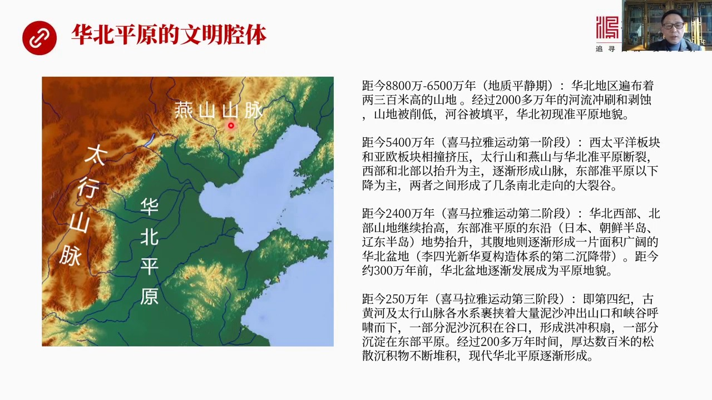

就是這種文明它願意在一個什麼樣的一個自然狀態和自然環境之中那麼我們可以看華北平原的西冊是泰航山賣 北冊是淹山賣泰航山和淹山山賣他們有個共同的特點就是淹山的西北部 泰航山的北邊這邊地是最高再往這邊是張北高原那麼他們這個山形面向平原這次比較抖翹淹山也是面向平原這次比較抖翹而面向高地這次比較平緩所以把華北...

<strong>Cleaned narration</strong>

> 就是這種文明它願意在一個什麼樣的一個自然狀態和自然環境之中那麼我們可以看華北平原的西冊是泰航山賣 北冊是淹山賣泰航山和淹山山賣他們有個共同的
> 特點就是淹山的西北部 泰航山的北邊這邊地是最高再往這邊是張北高原那麼他們這個山形面向平原這次比較抖翹淹山也是面向平原這次比較抖翹而面向高地這
> 次比較平緩所以把華北平原加在了中間那麼整個華北平原形成的我們從地質的這個時代來看的話它分成幾個階段首先是距今8800萬到6500萬年在這個時
> 間段裡面當時的地質條件是比較比較平靜的華北平原當時不叫華北平原應該說有很多兩三百米這種小的秋林最高也有五百多米的所以華北是一塊山地它不是現在
> 的一望五季雜平原而是到處都是小山還有些山比較高那麼經過2000多萬年的河流沖刷因為河流沖刷的效應還有波士效應它是從時間角度來看要有幾百萬年1
> 2000萬年它會發生巨大的作用所以經過這段時間之後中間那些古地被填平了山地被削低了這個時候就形成了華北的準平原的這種地貿6500萬年前我們知
> 道這個惠星撞力球引發了恐龍的滅絕好 那麼距今5400萬年這個時候鞋馬拉雅運動開始了第一階段西太平洋板塊和歐亞板塊相撞然後擠壓這個時候太陽山和
> 淹山與華北平原就發生了斷裂發生斷裂之後這次西冊和北冊開始抬高形成了山脈東部這些平原就開始下線下降為主所以兩者華北平原和太陽山淹山脈兩者的交界
> 處形成了很多大裂固就是地層板塊斷裂之後形成了裂固沿著這一線裂固就是我們看到的地震帶比如說唐山大地震唐山在這個地方形臺地震 形臺在這次所以在斷
> 裂帶上的很多地區在歷史上發生過很多很多次地震那麼到了距今2400萬年這就進入了西馬拉雅的第二階段造成運動第二階段我們看到這一側華北平原的西冊
> 還有北冊了高地繼續往上台它的東部平原它的這一側東岩東部邊緣地帶比如說朝鮮還有日本 遼東半島這側的地勢開始抬升抬升之後這邊也高 華北平原北面也
> 很高華北平原就變成了一個盆地這個就是李思光新華夏構造體系的第二層間第二層降帶第一層降帶是海然後龍起帶 然後是層降帶那麼到了距今300萬年前華
> 北平原逐步的形成了現在的這種平原地貿到了距今250萬年前這就是現在所謂的第四季從250萬年開始這就進入西馬來亞運動第三階段這個時候古皇河還有
> 太航山的各大知識流就是各大水系協代了大量泥沙從這一側和山頂之上清晰而下果脅了大量泥沙堆疾在華北平原這就形成了華北平原的靠近太陽山東路的衝擊山
> 或是叫洪擊山洪水衝擊出來的善行地帶這些泥沙沉淹的這邊形成了洪擊山還有很多河流包括黃河帶來泥沙沉積在東部平原經過200多萬年這個時間的漫長的堆
> 積在華北平原上就堆積了高達數百米的各種各樣的沉積物這才使得華北平原今天面貿呈現在大展面前我們再看下一頁山潛衝擊山這是理解北方農業文明起源的鑰匙

---

### Slide 4

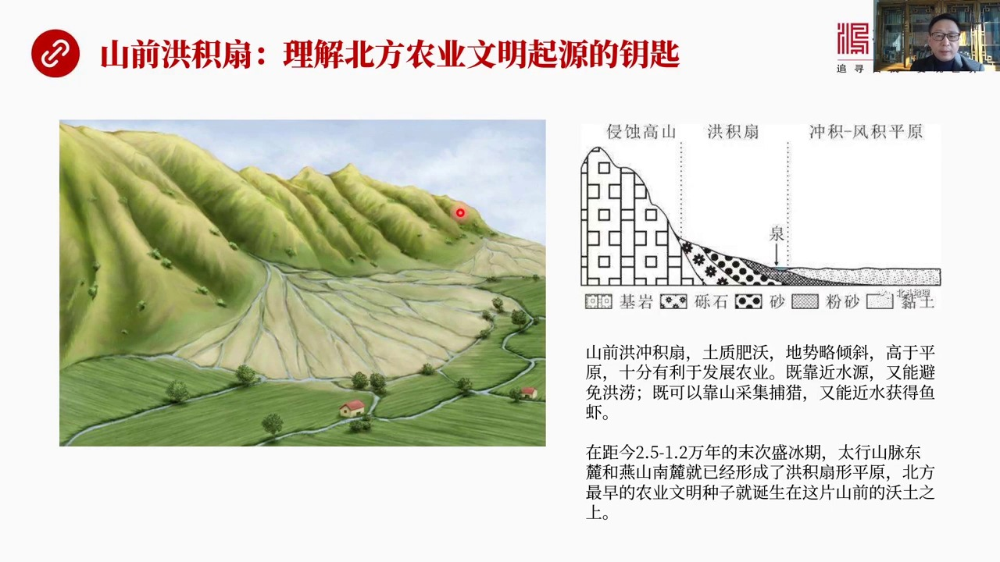

我們W雷同學他提供了這張圖比我以前用的圖更加清晰和直觀的展現了山潛洪擊山的形態這是山中的峽谷大量河水從峽谷中湧出然後果雪的泥沙堆積在山潛的地帶形成洪擊山善形的一個沖擊山然後在上面有很多汁流這就是所謂的變狀就是像遍子那種形狀的河流這塊的土地是非常非常肥臥的如果我們看它的側面的這種圖可以看到高山遭到河水...

<strong>Cleaned narration</strong>

> 我們W雷同學他提供了這張圖比我以前用的圖更加清晰和直觀的展現了山潛洪擊山的形態這是山中的峽谷大量河水從峽谷中湧出然後果雪的泥沙堆積在山潛的地
> 帶形成洪擊山善形的一個沖擊山然後在上面有很多汁流這就是所謂的變狀就是像遍子那種形狀的河流這塊的土地是非常非常肥臥的如果我們看它的側面的這種圖
> 可以看到高山遭到河水獨斷清晰之後寫在大量泥沙然後在洪擊山地區進行堆積然後進一步用向平原形成沖擊和封擊這種平原我們可以看到山潛洪擊山它最大的特
> 點是什麼土滯肥臥因為大量的山中的泥沙流所果帶的泥沙用下來我們知道泥羅河很肥臥主要是因為大量的這種果斜的泥沙相當於一次又一次給泥羅河兩岸施肥所
> 以它的土滯非常肥臥而且它的地勢略顯清晰它是高於平原的所以這塊地方非常有利於發展農業靠近水源我們可以看到它周圍有大量的變狀河所以非常方便灌蓋同
> 時又能避免洪浪因為它地勢比較高洪水將會向平原清晰而它這個地方相對於平原它的地勢更好同時還可以上山進行採集和熟練還能夠進水獲得泥沙因為周圍會有
> 大量糊破特別是洪擊山和平原之間會有一些低挖地帶這種行程糊漲所以可以在河流糊漲中補魚撈蝦這就是我們理解山錢平原發展農業就是北方農業企園它到底全
> 雲哪都是錢雲山錢的洪擊山那麼在距今25000年到12000年就是上一次冰期的最勝的那個階段太陽山東路和岩山南路的洪擊山就已經形成了就是從北向
> 南連成一片形成了一個連續的洪擊山平原帶北方最早的農業文明它的種子就剝鎖在洪擊山上我們再看下一頁所以我們今天來看一下這是華北平原它的考古遺址

---

### Slide 5

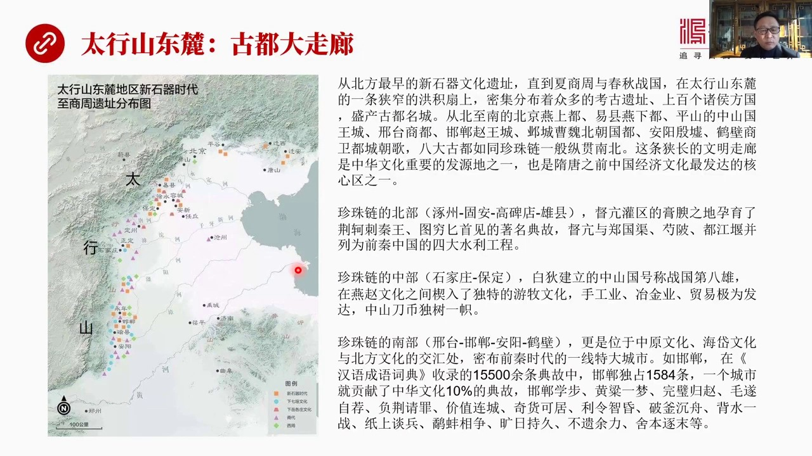

就是從新世紀時代一直到商舟時代考古遺址發覺點的分布圖這張圖其實一幕了然就會發現這邊是岩山這邊是太陽山所有的考古遺址基本上全岸在山前的洪擊帶地區這邊是岩山的洪擊帶和洪衝擊山這邊是太陽山的洪擊山地區基本上我們可以看到華北上華北平原上發現的所有考古遺址全部在洪擊山這條帶上所以太陽山東路又被稱之為是古都的大...

<strong>Cleaned narration</strong>

> 就是從新世紀時代一直到商舟時代考古遺址發覺點的分布圖這張圖其實一幕了然就會發現這邊是岩山這邊是太陽山所有的考古遺址基本上全岸在山前的洪擊帶地
> 區這邊是岩山的洪擊帶和洪衝擊山這邊是太陽山的洪擊山地區基本上我們可以看到華北上華北平原上發現的所有考古遺址全部在洪擊山這條帶上所以太陽山東路
> 又被稱之為是古都的大走狼從北方最早的新世紀文化以指一直到下商舟和春秋戰果太陽山東路這一帶形成了一條這是一條狹窄的洪擊山地帶形成了一條古都大走
> 狼比如說從北向南我們會發現北京當然就是最早的岩上獨異線這是岩下獨還有平山線的中山國的王城另外還有商舟的獨城商舟有很多獨城了其中就包括行臺然後
> 包括寒丹的趙王城還包括葉俊葉城是草味三國時代草味和北朝的很多時代的國都當然還有安洋的依需大家都很熟然後我賀壁賀壁的旗線當年是商舟還有後來的魏
> 國的獨城招割所以在從北京一直到旗線這條帶上分布著八大古都縱橫縱灌南北這條線也是中華文化最重要的一條起源地帶起源地帶之一也是隨堂之前中國經濟發
> 展的核心區直到今天整個華北平原最富裕的地區也是在這條線上如果我們來看著珍珠鏈的北側如果我們把它想像上一條珍珠的項量那麼它的北部也就是捉線捉州
> 固安高威電和雄線這一帶這個地方它的最重要的經濟發展的根源是由於建設了當年最大的都抗冠區都抗冠區所灌蓋了肥沃的土地使得煙果它非常富裕我們都知道
> 金科次秦王徒窮避守線這些點故其實就出現在這個地區煙王岩太子丹當時為了抗衡秦這個秦王所以讓勇士金科去刺殺秦王那麼勇士金科怎麼才能接近秦王呢因為
> 都抗冠區水利工程非常非常的有名在歷史上跟鄭國區卻被杜江岩並列為中國前秦的四大水利工程所以秦王非常想得到這塊土地都抗冠區的水利灌蓋地形圖金科送
> 的就是這張圖在展開圖的過程中最後藏了把鼻手這就是個點故的來歷所以在這一代有著中國最重要的也是發源最早的重大水利工程都抗冠區我們再看這個珍珠鏈
> 的中部就是保定和實價裝這一代這個地方在歷史上有一個非常有意思的國家就是白黎建立的中山國這個國家它是由污民族所建立的歇在了沿國和照國兩大中原的
> 這種強國之間號稱是戰國第八雄它的手工業以及業貿易都非常發達尤其是它的貨幣中山國的刀幣是非常非常讀數一致再看珍珠鏈的難端這部分是華北大平原上文
> 明最密集的地區由於它地位是非常堵這個德天堵厚它寄根北方的文化有交流同時又跟中原的文化有交流還跟海帶文化山東內帶的文化是三種文化的交界地帶所以
> 在前勤的那個時代在這條線上秘籍部秘籍出現了當時的很多一線大城市像韓丹就是個超一線的特大形城市當年韓丹的地位比現在深圳北京上海要牛多了韓丹古都
> 我們都知道中國有很多成語點故在漢語成語次典中間收入了15000多條點故出自韓丹這個地區的點故一個城市就佔了1584條獨佔中國全部成語點故的1
> 0%大量的成語都是源於韓丹比如說韓丹學部黃良一夢環璧歸照毛隨自見父親請罪價值連城等等等等這都是源自於韓丹所以我們可以看到紅雞扇對於我們理解整
> 個北方文寧具有著決定性的意義他說我們理解北方為什麼能夠發展他的農業文化怎麼起源這是一把關鍵型的鑰匙我們再看下一頁我們剛才看了這張地圖

---

### Slide 6

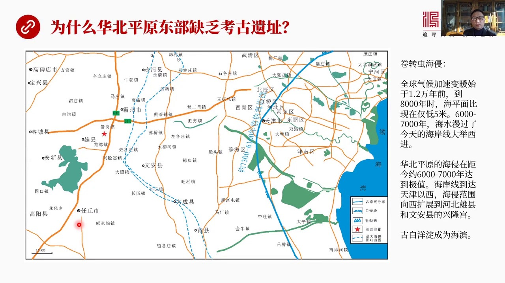

很有意思因為所有的考古一指全部偏向太航山東路那一側下場地帶而整個華北大平原的東部和中部幾乎找不到考古一指為什麼為什麼華北平原的東路沒有發現考古一指呢當然一種可能是我們還沒有挖到但是考慮從概率分布角度來說挖了這麼多年現在挖出來的概率分布來看明顯是偏向太航山的而在天津在靠海靠波海這一側沒有發現什麼原因我...

<strong>Cleaned narration</strong>

> 很有意思因為所有的考古一指全部偏向太航山東路那一側下場地帶而整個華北大平原的東部和中部幾乎找不到考古一指為什麼為什麼華北平原的東路沒有發現考
> 古一指呢當然一種可能是我們還沒有挖到但是考慮從概率分布角度來說挖了這麼多年現在挖出來的概率分布來看明顯是偏向太航山的而在天津在靠海靠波海這一
> 側沒有發現什麼原因我覺得這是可以解釋的主要是海清原本從海清我們再講上升文化說就專門談到過當時海平面上漲上漲不僅對江南有影響其實一直到北方到波
> 海灣都會造成海清就是海水上漲超過現在的海岸線向內部入侵我們可以看到在一萬兩千年前全球氣候不斷加速加溫升速到了八千年的時候海平面比現在基本上就
> 只差五米了六到七千年這個時候是華北地區最暖或者時候海水漫過了現在的海岸線大舉向西侵蝕到這個地帶這是七千三百年到六千一百年的海岸線這篇論文我看
> 了之後因為它的精確度輕易度比較高所以我覺得它比以前很多人很多文章和書記中畫的我覺得可能更靠谱就是它的測量精密度更高所以我們可以看到在華北地區
> 的華北平原的東部特別是在波海灣這個地帶天津以西的地區都是海岸這裡面都是大海海岸現在在這海岸現在在這海清線可不在這海清線要進一步了往這邊推因為
> 漲潮或者一些輕微的海平面的波動會是海水蔓延到這個地區我們可以看到這已經到了文岸線特別到了最遠到了新龍公正這裡現在的白洋電競在直尺當年的白洋電
> 比現在大了多所以白洋電當時很可能就是海這個海冰那麼像北一直到了湧清一直到了現在的廊房這一帶像南一直到了清線以西這一測都是被海水清漠的地區所以
> 在華北平原的東部不大可能出現考古一致因為當時這是海大海和大海經常衝刷的地區沒法發展農業文化我們再看下一頁那為什麼華北平原的中部東部我們說這是海清區

---

### Slide 7

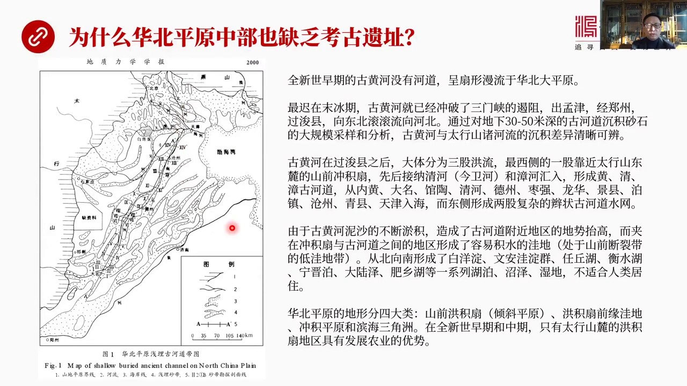

海岸線和海清區佔了很大一塊那麼中部平原為什麼也沒有發現考古一致呢這個就跟黃河有關了黃河在全新市早期就是現在聚集一萬年左右古黃河是沒有河到的除了夢今之後黃河是成一個巨大的善形像北一直流到天津像南一直湧向懷河在一個巨大的善子面上航掃平原所以我們可以看到中國北方和黃河和懷河之間的河流都不是正東正西的全部是...

<strong>Cleaned narration</strong>

> 海岸線和海清區佔了很大一塊那麼中部平原為什麼也沒有發現考古一致呢這個就跟黃河有關了黃河在全新市早期就是現在聚集一萬年左右古黃河是沒有河到的除
> 了夢今之後黃河是成一個巨大的善形像北一直流到天津像南一直湧向懷河在一個巨大的善子面上航掃平原所以我們可以看到中國北方和黃河和懷河之間的河流都
> 不是正東正西的全部是成一個善形的面這邊是東北走向這邊是東南走向成善形發散主要跟黃河橫掃華北大平原是有關的而且現在的黃河線基本是黃河衝殺出來的
> 一個高地就是長期岩的地上線路走這邊就形成了一個比較高的地勢所以我們知道大雲河不是從北京水一直流下來的中間這一塊地勢是高的所以按著天然地勢大雲
> 河的水應該往這邊流河往這邊流當然中間也需要建立大量的傳扎來邊水我們可以看到黃河最大的特點是沒有河到或者叫曼流於整個華北平原上那麼黃河什麼時候
> 形成它這個河到當然我看了很多有關的論文還有一些專注大家現在普遍認為至少在莫兵七就是距今一萬五千年前後古黃河就已經衝出了三門峽然後形成了通向大
> 海的河到就是出夢經經鄭州然後過巡線向東北滾滾流向華北然後最後分幾路湧向大海不海灣那麼我們現在是怎麼知道這一點的這當然就要靠在古河道上進行大量
> 的鑽口然後取出三十到五十米這個深度的大量的古河道的成績凝殺然後做各種各樣的禮化分析來判定這些成績的沙跟三門峽那個地方的沙是不是同樣的物理性質
> 化學性質所以我們根據這樣的一些就是考古學家和特地質學家聯合根據這樣的一種基本原理描繪出了一萬年前左右的河沙分布圖在我看來這個河沙分布圖基本上
> 也就是黃河漫流的一個一個所謂黃飯區的一張圖我們可以看到整個滑北地區中部就全是黃河或者說這一片都叫黃飯區當然它形成了一些比較能夠辨認的一些河道
> 你比如說泰航山靠近泰航山西冊這有一條河道還有東冊這大概可以分成兩骨也就是它一共在滑北出現了三大骨但是有八九條進入懷海的進入這個薄海的這樣一個
> 黃河最終的湧向大海通道那麼我們可以看到泰航山靠近泰航山的黃河我們稱之為是主航主河道它主要是經過哪些地方它主要是經過鄭州之後然後接納清河也就是
> 現在的位河張河這兩條河會在一起所以當年的骨河道是黃清張三河一的骨河道然後從這個內黃大名管逃然後到清河然後到山東的德州然後到早強龍華景線倉州清
> 線最後通過天津入海那麼東冊這兩條河現在就很難分得清楚了因為它河道很亂所以我們來看骨河河在這個地方形成了大面積的飯爛這個地方當然就沒有辦法發展
> 農業文化由於骨河河您殺了不斷餘集造成了河道附近的地勢被排高那麼我們剛才說這測是山前的洪基山這測的地勢被黃河餘高的時候中間就形成很多低挖的地帶
> 當然他們本來就處在泰航山和華北平原的斷烈帶上從地質結構上它也是塌線的所以這個華北平原的中部就形成了個巨大的凹線地帶就是所謂的季中的凹線區在這
> 個區中間形成了大量的湖長還有湖泊找遮水檔子比如說白洋墊還有文安的挖墊區還有人秋湖現在都已經沒有了但是現在橫水還有個巨大的橫水湖還有寧靜婆大陸
> 澤肥香湖從北到南至一系列全是湖所以在這個地方是沒法生存的也沒法發展農業就是因為它要麼是找遮要麼是湖泊要麼是黃泛區這個地方不適合人類居住那麼我
> 們來看整個華北平原的文明槍體就可以看得很清楚了它的平原地帶大概分成四大類三前紅機扇這是一大類清洩的平原還有紅機扇前面的是挖墊也就是白洋墊在你
> 白洋墊為代表了中間的低挖了湖泊區還有衝擊平原這是黃河衝擊出來的華北大平原另外就是冰海的三角洲只是最後河水進入大海最後逐漸填餘出來的冰海的平原
> ...

---

### Slide 8

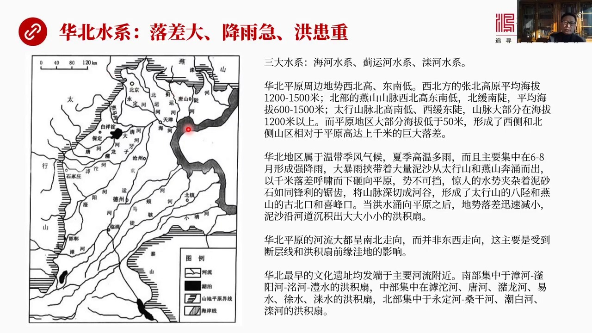

基本上它是三大水系海河還有基雲河鑼岸河這三大水系我們可以看到海河它的特點是在中國所有主要的河道裡面海河是比較多的當然海河從這看只有這一段其他是包括紫牙河還包括福洋河包括湖濤河這些都算是海河的水系它最大的特點華北平原最大的特點首先是要看它的地勢華北地區西北側要高一些就是西北高東南低然後在這側的張家口這...

<strong>Cleaned narration</strong>

> 基本上它是三大水系海河還有基雲河鑼岸河這三大水系我們可以看到海河它的特點是在中國所有主要的河道裡面海河是比較多的當然海河從這看只有這一段其他
> 是包括紫牙河還包括福洋河包括湖濤河這些都算是海河的水系它最大的特點華北平原最大的特點首先是要看它的地勢華北地區西北側要高一些就是西北高東南低
> 然後在這側的張家口這一帶的張北高原平均海拔是1200米到1500米之間岩山山脈它是西高東低這邊只有五六百米然後這邊有一千多米一千五百米岩山山
> 脈的這一側這一側它的東面最低有大概六百米太航山也是北部高南部較低但是大部分山脈都在一千二左右而平原華北平原的海拔高度普遍低於50米所以我們可
> 以看到山區和張北高原在不遠的距離之內從一千到一千五百米這麼高的一個海拔高度一一下子降到了50米所以這個地勢是非常抖翹的就是說它的河流它的波度
> 是比較大的有上千米的巨大落差而華北地區這個地區的氣候它是溫帶季風氣候下跡高風多雨暖時氣流衝上以後在這代形容大大範圍降雨而且主要降雨集中在六到
> 八月份三個月集中降雨所以大量的暴雨果斜著泥沙從太航山和岩山山脈以千米落差之勢可以說呼笑而下雜象平原這是很大的一個洪水的隱患而且這麼大的水勢中
> 間還裹學了大量的泥沙這些泥沙跟河流搣在一起你這麼高的速度衝顯是相當於什麼相當於一把巨大的巨子不斷地在太航山脈切反覆的切最後就將整個山脈太航山
> 脈岩山脈切出了很多口子就是所謂深切合骨太航山有八形就是八個主要通道通過這八個主要通道可以進入河北然後河北可以進入山西南側也有然後在岩山上切出
> 了兩個巨大口子這就是我們所說的菇薇口菇薇水震還有就是洗風口這都是兩條這都是落乾條河流反覆切切出來的那麼當這個洪水湧到平原之後由於落差沒有了就
> 是一下變成大平原所以它的流速減慢了所以就會使得這些泥沙迅速成績這樣就會出現大大小小的洪基山從岩山的南路一直到太航山東路這一片都形成了洪基山地
> 帶那麼河北平原我們來看它的河流都是斜的它沒有正東正西的基本上都是從西南偏向東北主要原因是什麼主要原因是受到了地層斷裂線就是山脈和平原之間的斷
> 裂線還有洪基山前面的這些瓦地受到這些地勢的影響所以形成的是西南和東北方向的河流那麼河這個華北最早的話一直基本上都發生在這些河流的附近比如說它
> 的南部主要是張河和福洋河它的中部包括湖泥河河包括唐河、朱農河、溢水、許水在這個區域還有北部主要金融在湧定河還有上游的桑干河、
> 潮白河蘭河在這幾條衝擊站上這就是我們通過對華北的平原地形對華北的水系對華北的山前、
> 洪基山有了一個大致的瞭解之後我們基本上就對整個北方文明的起源它的地理環境就有了一個清晰的認識我們再看下一頁我們再看它的農業起源的氣候條件

---

### Slide 9

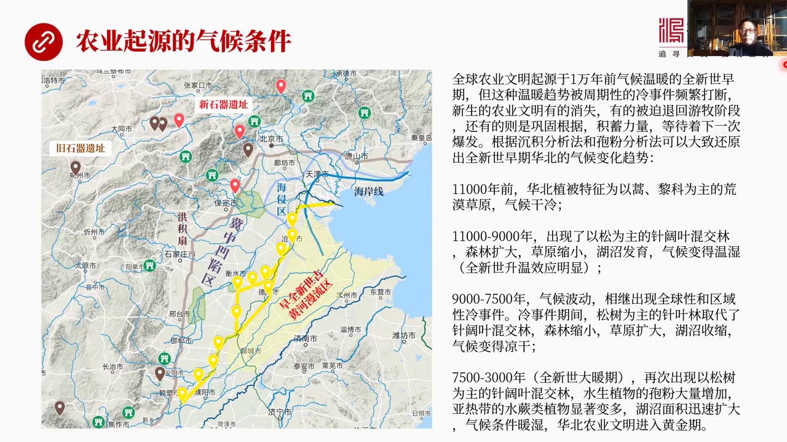

這張圖是我用谷歌的JS把我剛才所說的各種各樣的情況包括山前、洪基山、洪基山的地區包括海岸線、海清線包括谷、谷、黃河的河道還有當年的黃泛區還有古代移植考古移植的重要發現還有太陽山的一些山口岸山山漫的山口全部標誌在這張JS地形圖上谷歌地圖有個很好的功能可以讓你把不同的信息跌交在一個地圖之上、地形圖上所以...

<strong>Cleaned narration</strong>

> 這張圖是我用谷歌的JS把我剛才所說的各種各樣的情況包括山前、洪基山、洪基山的地區包括海岸線、
> 海清線包括谷、谷、黃河的河道還有當年的黃泛區還有古代移植考古移植的重要發現還有太陽山的一些山口岸山山漫的山口全部標誌在這張JS地形圖上谷歌地
> 圖有個很好的功能可以讓你把不同的信息跌交在一個地圖之上、地形圖上所以可以讓你一幕了然你如果不想關心黃泛區在哪可以把這塊關掉就看不見了你如果不
> 想知道湯山路和岸山山路、洪基山你可以把這塊關掉你也可以讓它一氣顯示出來你比如說白陽鏈、
> 當時白陽鏈大概是這樣的一個範圍而大陸則大概是這樣的一個範圍這些功能吧讓我們很好地可以把各種信息跌在一起把它集中在一張圖上進行展示如果我們來看
> 這個主要的移植吧這個赫色的用赫色標誌的這是90期時代的這種移植非常有意思就是即時代的移植山西非常非常的密集但是新時代的移植在山西卻比較有限也
> 就是在山區發展97而在平原進行農業文明那麼在北方最重要的所謂9000年以上的現在的移植發現了4的就是新時期移植余家溝然後我們可以看到這是懷業
> 入的轉年這是東庫林這是華北的河北的南莊頭這4個是畸境為止發現了最主要的北方文明起源的農業文明起源的點實際上北京這個地方還真的是北方農業文明起
> 源的最重要的一個出發點特別是東庫林就在門頭溝在湧進河汁流之上這個地方很重要其實離北京市區也就70公里左右所以北京確實是德天土後在太陽山和岩山
> 夾角的角落裡面向大平原然後地是又比較高它在紅機山上所以站進了各種各樣的優勢如果我們來看氣候條件的話我們知道一萬年前氣候開始轉暖然後這種轉的總
> 趨勢中間被肉乾刺了冷事件打斷在冷事件爆發的時候或者氣候變得惡劣的時候我們可以看到有的這種農業文明有的地區農業文明消失了就是被惡劣天氣打敗了有
> 的被迫退到山上上山去了重新退回到油木階段還有的就是不斷地鞏固自己的根據地等待下一次爆發等天氣轉暖之後生存下來了的文化再次下山就會形成重大的發
> 展這就是後來在河北的南部爆發的新的新倫農業文明的擴張但是這是幾千年以後了我們現在關注的是一萬年前後這個地區最早出現了文明火種它的氣候條件到底
> 怎麼樣總體來看河北地區在一萬一千年以前也就是如果我們說一萬一千七百年是作為一個分水林最後一次這個兵和兵事件結束之後一直到現在它的分水林應該是
> 在一萬一千七百年從那個時候一到一萬一千年在這段時間裡面我們可以看到河北的職貝它是以這種豪草離科為主的荒原荒漠草原氣候它的氣候可以說比較乾冷當
> 然大家可能會問我們怎麼知道一萬一千年前河北平原的氣候呢這當然是通過成績分析因為你的土層中會有大量的成績物在這個成績物中還有大量的包粉而這些包
> 粉是特別能耐高溫耐低溫耐腐蝕它不會變那麼這種當年的這種花粉通過對於這種植物包粉的分析就可以分析出來當年在土層中它的含量然後可以進一步去推測出
> 來是哪些樹種或者哪些草種在當年的植貝這個條件之下會有哪些草有哪些樹都可以推著出來所以在一萬一一千年以前基本上華北地區它就是一個荒漠草原因為氣
> 候還比較乾也比較冷那麼一萬一千人一萬一千到九千年這段時間這兩千年中間我們可以看到華北平原的很多地區出現了鬆樹或者叫以鬆樹為主的珍貴林混嬌林森
> 林地區在不斷的擴大而草原在縮小湖長在發育像古白洋墊變大了氣候總體來說變得越來越溫和濕潤這就是生溫效應整個全新是開始之後的整體上的一個生溫效應
> ...

---

### Slide 10

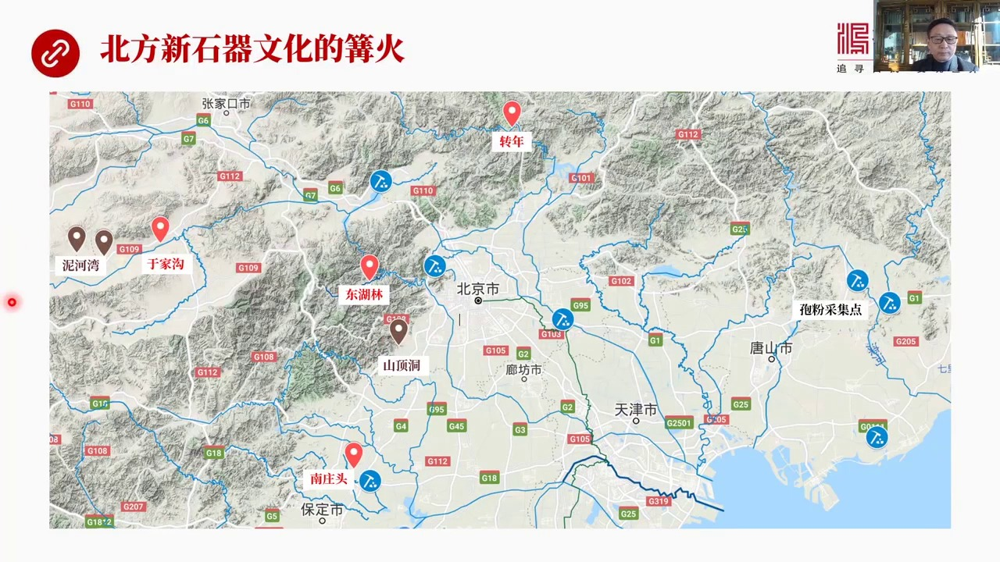

首先是魚架勾我認為這是北方新時期的文化的出發地這塊僅靠它的97椅子群叫尼河灣椅子群這塊有著眾多數量眾多的舊時期時代的椅子魚架勾相當於就在區域之內在它範圍之內所以97文明的很多技術比如說戲師業技術比如說鑽孔技術石墨就是石墨和石墨這種技術都很可能來自於97代的技術積累然後魚架勾醞釀了一些新的新時期文化的...

<strong>Cleaned narration</strong>

> 首先是魚架勾我認為這是北方新時期的文化的出發地這塊僅靠它的97椅子群叫尼河灣椅子群這塊有著眾多數量眾多的舊時期時代的椅子魚架勾相當於就在區域
> 之內在它範圍之內所以97文明的很多技術比如說戲師業技術比如說鑽孔技術石墨就是石墨和石墨這種技術都很可能來自於97代的技術積累然後魚架勾醞釀了
> 一些新的新時期文化的種子特別是淘氣帶著這種文明基因然後沿著河流不斷的向一些低海拔地區進發比如說東河林它的海拔只有400米而魚架勾是900米主
> 要年也是400米所以它是從一個高海拔的太陽山賣的山區像中低海拔的這些地方轉進然後最後發展到平原南中頭那麼中間我畫了一些標誌赫色的標誌代表這是
> 97代的椅子比如說山頂洞紅色這個標誌代表是新時期文化的椅子那麼這些開挖地點這是包粉的採集點所以我們在說任何結論的時候顯然你背後必須要有論文必
> 須要有數據必須要有鐵證如山的東西否則的話就不能這麼說準備這個系列文明東方文藝父親的早期這個系列是需要參看大量的考古考古論文和專業書記的否則的
> 話你根本不知道為什麼這個地區在那個時代是這種氣候或者拍腦門或者想像就毫無意義了所以我覺得我們要想了解早期文明這個基本功需要做得比較扎實才能夠
> 看清就才能夠真實地看清歷史本來的面目我們再看下一頁余家溝我稱之為是高海拔新文化的出發地

---

### Slide 11

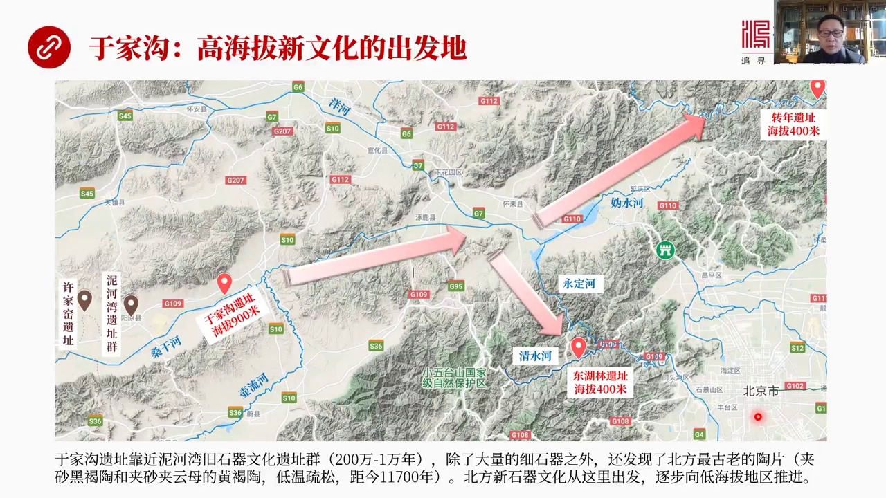

余家溝移植的海拔900米我們可以看到它旁邊有好幾個就是氣勢代的椅子它的地點是在桑桿河上桑桿河邊然後旁邊還有這個湖流河跟它會交在一起然後會集成用定核的上游余家溝這個地方靠近這個尼河灣90期時代的文化椅子這個地方的文化椅子就很古老了最早的有200多萬年發現的這種時期還有這個人類活動椅子一直到現在一直到這...

<strong>Cleaned narration</strong>

> 余家溝移植的海拔900米我們可以看到它旁邊有好幾個就是氣勢代的椅子它的地點是在桑桿河上桑桿河邊然後旁邊還有這個湖流河跟它會交在一起然後會集成
> 用定核的上游余家溝這個地方靠近這個尼河灣90期時代的文化椅子這個地方的文化椅子就很古老了最早的有200多萬年發現的這種時期還有這個人類活動椅
> 子一直到現在一直到這個全營是早期的一萬年所以它涵蓋的時間範疇非常的大而且也是可能也是全世界非常罕見的從200多萬年一直連續到一萬年前它的這個
> 如此密集的文化椅子代在這個地區那麼除了在余家溝除了大量的氣勢器之外還發現了北一方最古老的逃票這個我們說過南方至逃要遠遠早於北方南方是在兩萬年
> 前就發明了逃棄而北方大概落後南方接近一萬年我們所說的最早的北方的逃遍就發現在余家溝距今有一萬一千七百年它的稍至方法當然是比較低火候夾殺黑河逃
> 還有夾殺黃河逃這兩類但是出現逃棄這是一個非常重大的非常憂可以說是話實在意的一件事因為我們說過至逃跟時期是完全不同的東西至逃是一個技術進化了巨
> 大的平台它可以涵蓋很多技術領域可以進行大規模的急生放心但時期不行時期是個專業技術按照我們現在的話說那麼逃棄相當於一個平台而時期無論怎麼高金間
> 它也是一個專業化的產品所以平台這個思路是我們現在分析新時期時代文明或者叫農業時代文明一個非常重要的標誌三大標誌嘛逃棄應該是其中之一代表為它手
> 工業的水平農業定居農業和定居這是另外兩塊定居代表著你文明可以開始積累農業代表你的經濟模式發生了根本性的轉變所以逃棄農業和定居這三個條件加在一
> 起形成了我們對新聞化或者叫新時期文化或者叫農業文明了一個基本的判斷標準那麼從余家溝出發的這種高海拔的新聞化沿著桑甘河跟洋河會流之後這就變成了
> 有定河的上游然後沿著歸水河轉進到了轉年移植這是海拔四這個四百名這個移植也是大約一萬年余家溝稍微早一些余家溝是一萬一千年然後轉進到了東湖林沿著
> 湧進河東湖林大概也是一萬年他們倆的時間是比較相近的略晚於余家溝而且這兩者的海拔都比它要低它是9萬米這兩個都是四百名這兩個地方是什麼呢是一個比
> 較低海拔的可以叫河谷的台地是這樣的一種地形所以我們可以看到整個農業文化它的進化規律首先它需要有一個出發地出發地帶有一種原始的文化基因然後出發
> 地轉進到了一個海拔較低的地區比如說東湖林我稱之為是北方農業文化的巨型巨大的實驗基地在這城這個市農業文明的很多東西形成和發育到一定程度再轉向平
> 原進行擴大基本上是這樣的一個規律我們再看下一頁東湖林它就起到了一個巨大實驗基地作用

---

### Slide 12

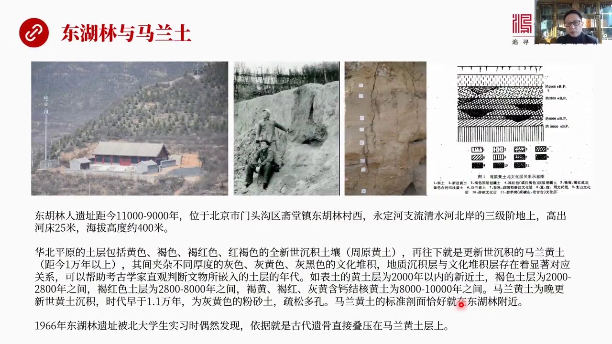

東湖林這個移植它是怎麼發現這個跟馬蘭土馬蘭黃土有很大的關係這個是東湖林移植的一個遠景圖它大概就是這樣的一個地勢海拔四百米左右前面是清水盒也是永靈盒的支流然後它離河面移植離河床大概有二十五米左右它的時間是距離一萬一千年到九千年之間這個跟上山文化基本上是同時的南北各自出現了一個一萬一千年到九千年這樣的非...

<strong>Cleaned narration</strong>

> 東湖林這個移植它是怎麼發現這個跟馬蘭土馬蘭黃土有很大的關係這個是東湖林移植的一個遠景圖它大概就是這樣的一個地勢海拔四百米左右前面是清水盒也是
> 永靈盒的支流然後它離河面移植離河床大概有二十五米左右它的時間是距離一萬一千年到九千年之間這個跟上山文化基本上是同時的南北各自出現了一個一萬一
> 千年到九千年這樣的非常古老的文化那麼它在北京市門頭溝區宅堂鎮東湖林村的西部當時發現這個移植是北大的一個學生好手鋼它當時在帶了一幫人在這兒可能
> 是搞一些參加一些農田的勞動然後在這樣的一個地形上或者叫黃土的鋪面上發現這兒有一些死人骨頭一般我們沒有說過訓練人一搭眼看這兒一個死人骨頭有就有
> 杯你也不知道是什麼時代的但是北大的學生它是地理系的學生學過地藏學的一些基本概念它一看埋死人骨頭的位置是在馬蘭土之上底下這是馬蘭土上面是後續堆
> 積的黃土它立刻就反映過來了如果這個死骨在這兒沒有被動過的話這將是一個一萬年左右這樣的一個古老的東西原理是嗎原理就是馬蘭黃土和地藏學考古學和地
> 藏學的一種結合華北平原這些所有的黃土大概分成幾層比如說有黃色的赫色的赫紅色的紅赫色的這都是全新式以來一萬兩千年以來所積累的土壤這種土壤在考古
> 學生有人把它定義成周園黃土周園黃土是源於閃息一個標準破面那個地帶所形成的黃土被通稱為是周園黃土在一萬兩千年之內從西偉通過河流通過風遇到了各個
> 地方比如說華北太陽山東路那麼這些地方所積累的是黃土是周園黃土在往下就是更早期更新式晚期積累的馬蘭黃土了至少是聚金一萬一萬年以上然後在這麼多層
> 黃土之間還有一些灰色的灰黃色和灰黑色的文化聚集所以這中間就有一個很有意思的問題了這是人類文化留下的一劑那麼很多逃遍死人骨頭各種各樣的考古一劑
> 實際上都是在人類活動堆積中發現的那麼這種土壤所形成的地質穿積層和文化堆積層之間顯然存在著對隱關係可以幫助考古學家平直觀就能判斷如果一個文物在
> 什麼土層裡頭我直接就能說出它大概是聚金多少年比如說這有個對照表這上面是表層黃土如果是表層黃土的話它代表2000年以內的這是2000年以內的新
> 的新進土如果你在這一層黃土面發現的各種疑惡代表它是春秋戰國以後的或者叫秦國以後的這是屬於新進黃土赫瑟土層大概代表著2000到2800年之間赫
> 紅色是2800年到87年之間赫黃赫黃灰黃涵蓋的涵蓋結合的黃土為8000到1萬年之間馬蘭黃土那就更古老了它是碗更新式黃土的成績時代早於1萬10
> 00年主要測驗是灰黃色的粉末土疏鬆多苦馬蘭黃土它的標準破面恰好是在東古林村的附近有一個地方叫馬蘭階地在那個地方所發現的這種黃土破面被作為標準
> 破面全中國任何地方的土要跟它進行對比這就是標準的破面所以從標準破面上我們可以直接對應不同顏色的土它挖出來的這個文物大概是什麼年代你在做任何建
> 定之前直觀用眼睛就能判斷所以這對我們來說是一個非常有意思的一個一種考古學的知識這也告訴我們如果我們哪一天到黃交眼影去看考察什麼東西如果看到一
> 個土層如果看了一個堆疾你如果發現中間有一些有意思的東西其實奇怪怪的事其實奇怪怪的這個平民觀怪你能不能夠說出它所對應的年份這是一種有意思的這種
> 嘗試實際上我們知道的越多眼睛所受的這種訓練越強你就越容易發現一些其他人發現不了的一些奧秘比如說北大學生他就平受眼發現他這個地方是肯定一萬年的
> 考古的遺址所以立刻打電話通知他的上級通知考古部門到處來看果然發現了一個重大的移棄東湖林靠了就是對馬蘭土的直接的視覺的建定主要的一句是什麼呢就
> ...

---

### Slide 13

最近我看到中國考古2020年第七期也就大概是一個月前發表了一篇文章這篇文章就是對於北京東湖林遺址的植物它的遺存進行服選對服選結果進行分析看了一下它的研究報告讓我覺得非常震驚因為它發現了很多探話的包括植物的種子過河等等特別是植物種子從這些探話的結果探話種子的結果中可以分析出素和屬兩類栽培股物聚進的時間...

<strong>Cleaned narration</strong>

> 最近我看到中國考古2020年第七期也就大概是一個月前發表了一篇文章這篇文章就是對於北京東湖林遺址的植物它的遺存進行服選對服選結果進行分析看了
> 一下它的研究報告讓我覺得非常震驚因為它發現了很多探話的包括植物的種子過河等等特別是植物種子從這些探話的結果探話種子的結果中可以分析出素和屬兩
> 類栽培股物聚進的時間大概都是一萬年素就是我們所說的小米古人稱之為寄比如說老情人的祖先就叫後寄江山社寄這個寄他什麼意思呢就是素是小米當然我專門
> 看了一下因為古代的古書裡面對寄到底是什麼東西蒸的一大幅度蒸了大概混亂了上千年我看了一些文章專門分析的問題我覺得寄中國了五股倒數寄賣書這個寄如
> 果不是素的話就不合理了因為有人說它是屬那這不就是一股嘛這五股就變成四股了嘛所以我認為我傾向認為這個寄就是小米素它的野生的祖先是什麼狗為草大家
> 看一看我覺得全中國乃治全界每個野生的地方都會發現這種像狗以拔的這種狗為草狗為草的顆粒非常的小就是它的種子非常小其實狗為草就是現代小米的祖先小
> 米就是從狗為草循化而來循化成這樣顆粒變大了毛變短了然後這就是素中國古代北方最重要的食物來源就是素那麼素這種小米跟天然的野生的狗以拔草狗為草的
> 這種種子有什麼差別呢當然它的力度還有它的長寬的比例等等都不一樣經過分析你會發現現在發現的這種碳化的速力跟當今的小米的種子它是非常接近的所以發
> 現這種形狀的包括對它進行建定所得出的結論是素的循化基本上已經完成了已經非常接近現代的小米了屬就是這個黃米這個黃米它跟小米不太一樣屬在國際上一
> 般被認為是起源於印度或者西亞有人說是起源於北非但是東古林發現的這個食物萬年食物碳化數量可以說基本上直接推翻這個結論我的發現真的東西在這另外東
> 古林發現了很多豆科植物的比如說江豆樹的很多碳化種子江豆樹中間包括很多豆類綠豆、江豆、
> 紅小豆等等當然還有包括一些蔬菜、辭菜還有包括中藥黃薄種也發現了還有葡萄種葡萄在國際上認為是起源於西亞或者黑海結果在東古林都發現了中國的無谷賣
> 屬、寄賣書東古林就佔了三種所以我們說東古林堪稱是北方農業文明的實驗基地當然在這個地方我們還要附加一下說明就是這個碳化的速力我看一下這個論文上
> 說這個速力的數量還不太夠碳化的速力只發現了一口這也就是說它在做真正的測年用測年來判斷它的時間的話這個量不太夠所以我們現在要打一個問號就是我們
> 說它是一萬年這到底是多少年需要精確測量而精確測量的話你這個樣本的數量不夠其實就很難測定好就好在我們還有一些其他的發現出來就是在同樣地層中發言
> 出來一些其他的東西內地東西數量足夠大我可以測出它的對應年份那麼這些東西買在一起顯然我們可以合理的推論大概是一萬年是沒有問題的好我們再看下一頁那麼東古林這些人生活的它的聲稱環境是個什麼樣

---

### Slide 14

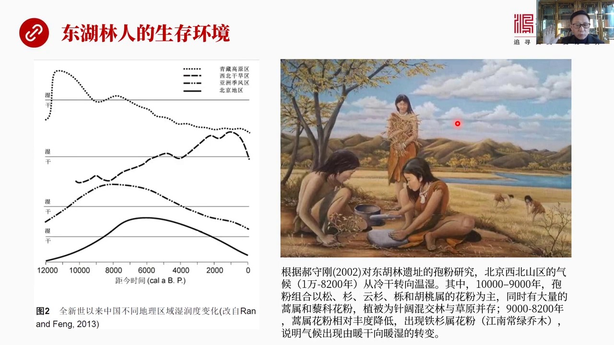

這就是我們看到模擬東古林的生活環境所做的一個環園圖據說是好手鋼就是發現東古林以指的當時北大學生現在北大了一個教授他在2002年對東古林地區做了大量的這種包粉研究其他研究了很多窩牛之類的生活習性因為東古林人特別愛吃窩牛在當地以指中發現大量窩牛的一技他對東古林的這個包粉研究2002年做到看到他的論文那麼...

<strong>Cleaned narration</strong>

> 這就是我們看到模擬東古林的生活環境所做的一個環園圖據說是好手鋼就是發現東古林以指的當時北大學生現在北大了一個教授他在2002年對東古林地區做
> 了大量的這種包粉研究其他研究了很多窩牛之類的生活習性因為東古林人特別愛吃窩牛在當地以指中發現大量窩牛的一技他對東古林的這個包粉研究2002年
> 做到看到他的論文那麼顯示出來當時東古林的氣候也就是北京西北山區的氣候從一萬年到兩八千兩二百年之間他的氣候特徵是什麼是從冷干轉向溫室其中一萬年
> 到九千年之間包粉的組合以松山雲山利數胡桃鼠的花粉為主同時有大量的各種各樣的草類的花粉職貝是珍貴林的混嬌林和草原並存所以我們可以看到圖中有樹還
> 有大量的草地它是一個草原和混嬌林的並存的一個這種植物 植貝條件在九千年到八千二百年之間我們可以看到出現了江南的長麗小木就是鐵山屬的花粉出現了
> 說明氣候變得更加溫暖潮時在另外一篇論文是其他人講中國氣候全經是氣候的他們結合了北京地區的和全國地區清海地區清戰高原地區不同地區的對濕度的測試
> 化出了一種全國濕度一萬年以來的變化情況我們也可以從中看出北京地區這條線在一萬兩千年到八千年之間就是緩慢的越來越潮是從乾越來越濕 到了九千多年
> 之後到九千年前後 從乾轉向了濕然後在七千五百年前後達到了濕潤高溫的一個頂峰狀態這就是華北農業文明大發展的時期我們再看下一頁那麼東古里人它的生活場景是什麼樣我們可以根據在東古里地區發現的一些

---

### Slide 15

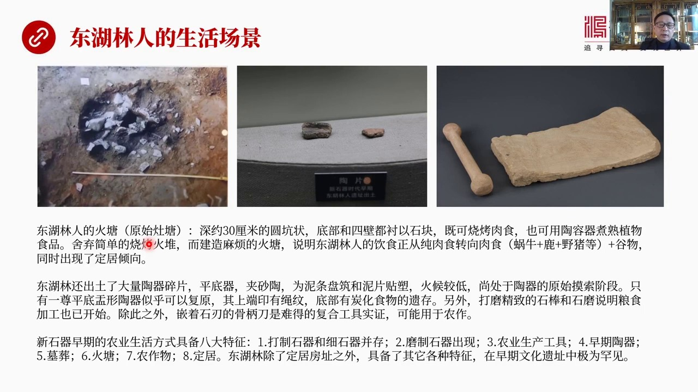

典型的器物 典型的一些生活的使用的一些東西來看比如說火糖我們現在北方的農村有的還燒這種燥糖就是爐子 或者叫燒燥那麼它這個火糖是個什麼情況 大概是一個圓形的生大概三十米 三十一米是三十一米的圓坑狀然後它的底部和四周都用石頭維起來了 或叫趁已十塊就是用十塊做糖的內趁這樣的話 形成這個火糖即可烤肉也可以用...

<strong>Cleaned narration</strong>

> 典型的器物 典型的一些生活的使用的一些東西來看比如說火糖我們現在北方的農村有的還燒這種燥糖就是爐子 或者叫燒燥那麼它這個火糖是個什麼情況 大
> 概是一個圓形的生大概三十米 三十一米是三十一米的圓坑狀然後它的底部和四周都用石頭維起來了 或叫趁已十塊就是用十塊做糖的內趁這樣的話 形成這個
> 火糖即可烤肉也可以用陶融器來攀煮食物攀煮植物性的這種食品所以這是一種明顯的變化因為在以前我們發現的一直中很少出現火糖就是其實在燒烤 主要是吃
> 肉吃肉的話就沒有必要去搞個火糖因為搞火糖 必盡要投入人力物理還要把它碼得很圓還有到處找那種驚喜的石頭給它趁趁上爐糖的內趁我幹嘛要這麼廢事呢如
> 果主要是吃烤肉的話如果說我搞這麼複雜的投資和建設去興建火糖 而且不只一個說明我現在不僅要燒烤了我還要用融器 就是用陶器來煮食物特別是植物性的
> 食物我要把它煮熟了才能吃這個說明農業已經出現了而且說明什麼 說明大家傾向於定居生活因為在游動情況 每天都在游動情況之下我沒有必要去挖很多火糖
> 因為我可能明天就換地方如果出現大量的火糖說明大家願意在這個地方長期居住所以才有必要進行時間和人力物理的投入把它修成比較規整的火糖除了這個之外
>  還有發現了大量陶器的碎片現在雖然沒有能夠直接復原成陶器的但是我們基本上可以通過分析和對比發現這些陶器主要是平底器 主要是夾插陶製作方法主要
> 是泥條盤重和泥片貼素這都是我們上當課 講上山文化手 專門都講過它的火候也比較低可以看出來這種陶器還處在摸索階段然後只有一尊平底這個漁形這個彈
> 語 漁形的陶器似乎可以復原在這個陶器上有一些神文 主要這個是裝飾 上面已經出現了一些裝飾底部它有些碳化的食物移存就在陶器的底部有一些碳化的食
> 物移存說明它燒過食物另外它有就是打磨比較精緻的石棒和石墨 說明可能被用於糧食加工除此之外 還有一些骨餅刀就是骨頭和欠入的刀它是一種組合或叫復
> 合工具那麼這種工具 還有可能是用於濃做的在新時期早期的農業生活方式一般我們評價一個椅子它有沒有農業生活的方式有沒有這些點一特徵一共有8個主要
> 特徵來斷定第一是有沒有打制時期和細時期病存如果說你有既有打制時期又有細時期那麼說明這個地方正在處於轉型過程之中就是去轉向新時期第二 磨制時期
> 出現也就是新時期靠磨顯然這標誌著新時代來臨第三農業生產工具 比如說石墨和石墨第四 早期陶器 比如說這個第五 墨藏 第六 火堂 第七 農作物第
> 八是定居東烏林其實已經除了這個定居防止還沒有找到之外其他的東西都已經找到了這在一萬年左右的這種文明中是相當少見的極為喊見所以東烏林的考古發現意義重大我們再看一下東烏林他們的這些人的服飾

---

### Slide 16

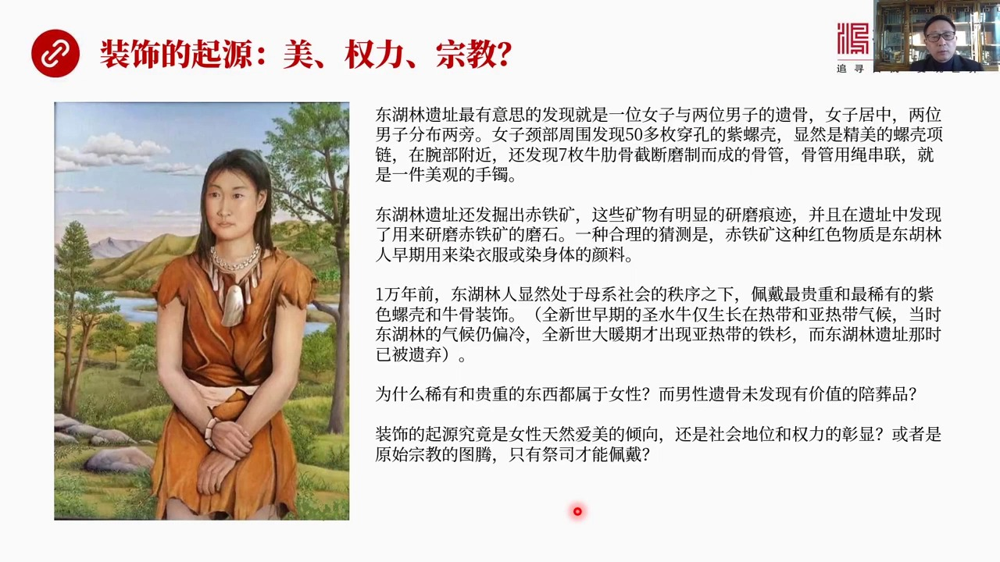

就是他的裝飾我覺得提出一個很有意思問題比如說東烏林他發現的是一個一位女子和兩位男子的一骨這大概是一個十六歲的小女孩這個女子居於中間兩位男子是分布在兩邊最早發現他們一骨的時候然後在這個女孩的警部周圍發現了五十多名穿孔的這種子羅殼就是這種羅斯的殼而且顯而易見這是一條非常精美的項鍊在他的萬部發現了牛勒骨階...

<strong>Cleaned narration</strong>

> 就是他的裝飾我覺得提出一個很有意思問題比如說東烏林他發現的是一個一位女子和兩位男子的一骨這大概是一個十六歲的小女孩這個女子居於中間兩位男子是
> 分布在兩邊最早發現他們一骨的時候然後在這個女孩的警部周圍發現了五十多名穿孔的這種子羅殼就是這種羅斯的殼而且顯而易見這是一條非常精美的項鍊在他
> 的萬部發現了牛勒骨階段之後摩制出來的骨管骨管用繩子穿連起來顯然是一個非常美麗的手奪這是復原之後大家想想出來它應該是一個這樣子一個項鍊和手奪這
> 樣一種裝飾品當然在東護林一直還發現出很多刺激礦就是顏摩之後變成紅色染料這些礦物都有顏摩藤劑而且也有發現了顏摩的摩石所以合理的推測是這種紅色染
> 料被用餘染衣服或者把身體染紅那麼一萬年前東護林這個地方顯然處於母系式族的秩序之下所以最貴重和最稀有的比如說子羅殼和牛骨裝飾都給了女性為什麼牛
> 骨裝飾當時你也很稀缺就是因為在全身是早期吧中國的水牛還沒有出現只有野生水牛叫剩水牛只有這一種但剩水牛和所有的野水牛都一樣喜歡熱帶和鴨熱帶因為
> 牛嘛它身上沒有太發達了汗線皮肤又很厚它只有在水裡它才能夠順利排熱所以只要出現剩水牛說明這個地方一定是熱帶或者鴨熱帶氣候而當時東護林的氣候還偏
> 冷所以在那個地方發現牛骨頭這說明牛骨一定是比較稀缺的好 這就提出有意思的問題為什麼非常稀有和貴重的東西是屬於女性的在她這個女孩旁邊的兩位男性
> 師骨沒有發現任何有價值的賠浪品這就很有意思了他們男性身邊沒有賠浪品而女性脖子上手桌上手上帶了這個裝飾品而且都是非常稀有和貴重的這就提出了一個
> 有意思的問題這種裝飾它的起源究竟是女性愛美的天性呢還是社會地位和權力的象徵呢或者是宗教原始人一種圖騰只有季司還能配待呢這就提出了跟我們現代人
> 不同的一種一種分析問題的方法我們不能夠就是我們不能夠從現代人的角度去揣測一萬年前人的心靈其實這就是我們需要有一種新的認識歷史的思路和方法當你
> 看到象律你認為這一定是現代女孩帶了象律上做一個好看的東西嗎未必因為我們現在很難去想像在那個時代中人們的心靈狀態文化心理是什麼樣它怎麼看待宇宙
> 怎麼看待天空怎麼看待大地怎麼看待它周圍的這些人怎麼判斷它自己這個其實是非常有意思的的話題但考古學基本上沒有研究這個思路去探討因為大家無法說清
> 楚當時人是什麼心理我們看到這些象律的時候可能會猜測按著現代人的心理猜測它是為了裝飾但是不一定它有可能是權力和地位的章錢也有可能是這個女的天生
> 就是祭司都有可能這個是我們需要在考慮當時發現的谷歌的時候我們要做最大的努力把自己想像成一萬年前的人而且整個我們的大腦是混頓出開我們根本沒有現
> 代這種意識根本沒有現代的各種知識和學問沒有現代這種經驗你往往全權作為一個一萬年前從混頓中湧現出來的一個生命體你怎麼感知這個世界這個就是我們需
> 要我覺得是需要下功夫而且是一個前景非常遠大的一個學科就是文化心理文化心理怎麼去了解古人的文化心理我們再看下一個當然還有木藏木藏是最能說明定居文化意識已經開始出現了

---

### Slide 17

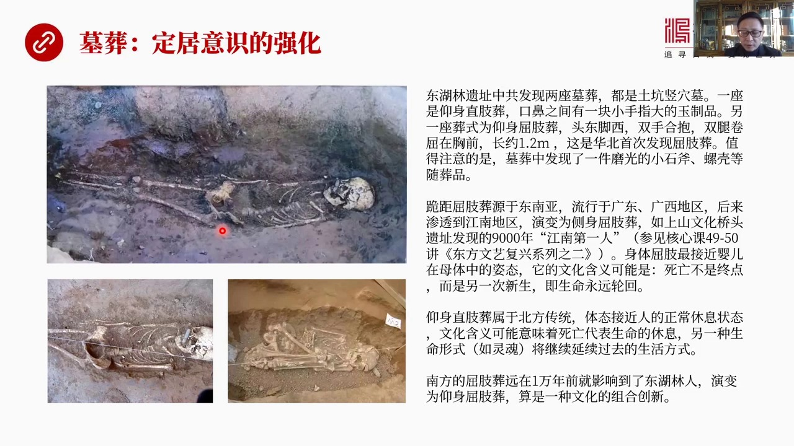

因為如果是油木它其實沒有必要搞非常精細的木藏它沒有這種需求我們在東湖林以指中發現了兩處木藏都是土坑數學藏一座是養生殖殖藏養著的身體是殖的這是正常的基本上所有北方的文化都是養生殖殖藏有意思是在它的口鼻之間還有一塊玉這個玉是什麼意思為什麼要放到口鼻之間這就是我們不理解一萬年前人類的他的心靈他到底為什麼要...

<strong>Cleaned narration</strong>

> 因為如果是油木它其實沒有必要搞非常精細的木藏它沒有這種需求我們在東湖林以指中發現了兩處木藏都是土坑數學藏一座是養生殖殖藏養著的身體是殖的這是
> 正常的基本上所有北方的文化都是養生殖殖藏有意思是在它的口鼻之間還有一塊玉這個玉是什麼意思為什麼要放到口鼻之間這就是我們不理解一萬年前人類的他
> 的心靈他到底為什麼要這麼幹為什麼要這麼放他到底是出於什麼樣的一個心靈他所在那種心靈之下這個世界是個什麼樣這點我們現在還不知道另外一個木藏是養
> 生殖殖殖藏這就比較有意思了因為殖殖藏我們在上山文化中我們講過他是源於東南亞從南邊傳過來的這是在華北第一次發現還有區執藏而且他的木藏旁邊這個裡
> 面還有一把魔光的小師傅羅殼培藏品為什麼培藏小師傅這也是一個比較有意思的現象我們都知道區執藏他源於東南亞廣泛流行廣東廣西地區後來滲透到江南這個
> 地帶在江南我們看到上山發現的橋頭陣發現了九星年前江南第一人他是廁神的區執藏我們這個核心課49到50講專門講過為什麼會區執藏呢因為他最接近陰兒
> 在母體中的姿態所以他可能帶有一種文化含義式死亡不是重點而是另一次新生這是一種生命永遠輪迴的理念而養生執藏他是屬於北方傳統北方傳統他這個養生是
> 什麼呢接近人的正常休息狀態大家睡覺不就養生執之藏不就養生執之躺那嘛所以這種藏室是說人們接近於正常休息的狀態那麼他的文化含義是什麼呢可能代表著
> 死亡是一種生命的休息另一種生命比如說靈魂將會繼續延續過去的生活方式但這都是我們現代人對一萬年前人們心靈那種猜測南方的區執藏遠在一萬年前就已經
> 影響了東湖林所以這是一個非常值得注意的現象就是雙方的這種交流我們再看下一頁好 那麼從東湖林

---

### Slide 18

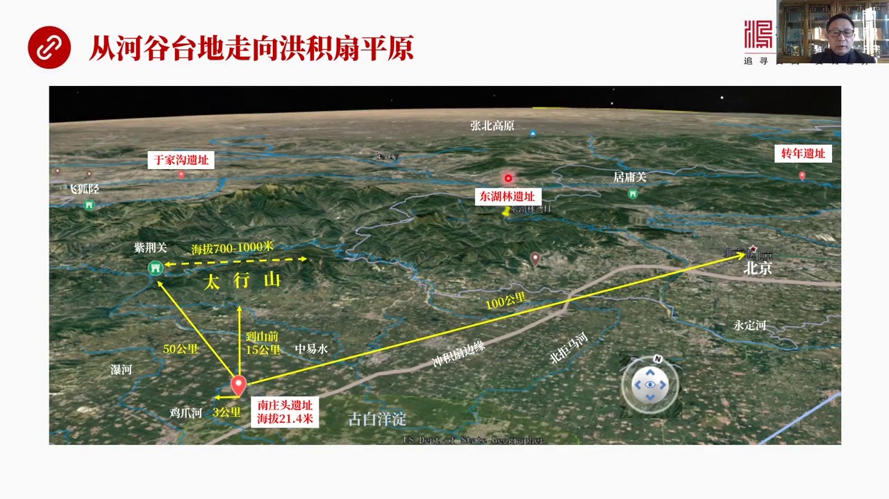

這還是海拔四百米進一步就要往山下走了就是從河谷台地走向洪濟善平原在這完成了農業文明的初期的實業然後要到南莊頭來進行大平原地帶進行大規模的出擊了我們來看當然我們今天不講轉年因為它跟東湖林比較類似我們就從東湖林直接嚇到南莊頭我們來看這幾個地區的採拔高度余嘉購這是九百米東湖林這四百米轉年是海拔四百米而南莊...

<strong>Cleaned narration</strong>

> 這還是海拔四百米進一步就要往山下走了就是從河谷台地走向洪濟善平原在這完成了農業文明的初期的實業然後要到南莊頭來進行大平原地帶進行大規模的出擊
> 了我們來看當然我們今天不講轉年因為它跟東湖林比較類似我們就從東湖林直接嚇到南莊頭我們來看這幾個地區的採拔高度余嘉購這是九百米東湖林這四百米轉
> 年是海拔四百米而南莊頭一直是海拔僅為二十一點四米也就是說這兩者之間就差了四百米跟它相差九百米我們再看一下周圍的地形這當然是泰航山這是北京這個
> 南莊頭這個南莊頭很有意思居然是我的老家而且就是這個村的很有意思所以我看這個考古椅子覺得很震驚居然是華北地區整個北方地區第一個發展農業文明居然
> 就是在我們的村這個事兒確實很讓人震撼那麼我們來看在泰航山上有很多這種合流切出來的口子比如說子寧官還有軍官這都是合流切出來的還有這個我們看到的
> 一些海拔在南莊頭到泰航山這一線這次的山賣大概平均的海拔是七百米到一千米那麼從南莊頭要退到山上去它的距離是15公里到子寧官是50公里到北京實現
> 距離是100公里然後古白洋墊已經發育到了南莊頭的旁邊它實際上就在古白洋墊的湖邊旁邊還有一些合流比如說基爪和平河之類的然後溢水南巨馬河然後我們看到這是整個它的地形圖我們再看下野南莊頭的泉帽是個什麼樣

---

### Slide 19

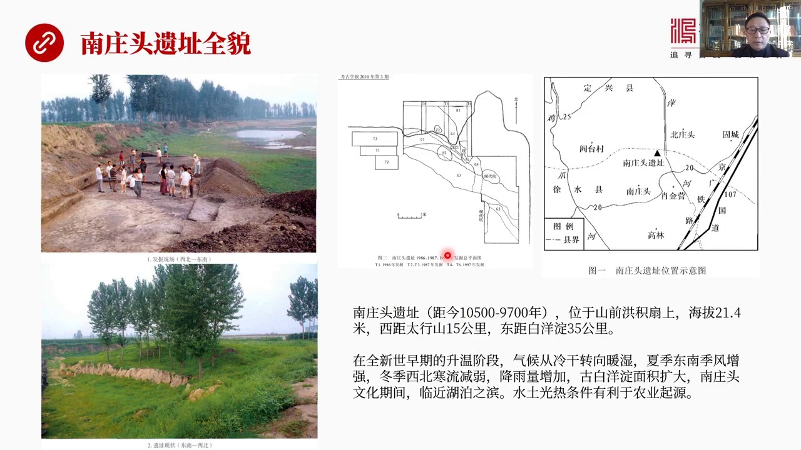

南莊頭我們可以看到一眼看上去它是個平原地帶注意以後我們凡是看到這樣的黃土層都需要非常非常的敏感因為這個黃土層上你看不同土層有不同的顏色不同的顏色代表不同的顏帶一眼看上去一只要在這個地層上發現有一個桃畫那麼你馬上就應該反映出來這大概是什麼年代的文化對急所以我們需要有一些這種基本概念這是發覺現場的一腳當...

<strong>Cleaned narration</strong>

> 南莊頭我們可以看到一眼看上去它是個平原地帶注意以後我們凡是看到這樣的黃土層都需要非常非常的敏感因為這個黃土層上你看不同土層有不同的顏色不同的
> 顏色代表不同的顏帶一眼看上去一只要在這個地層上發現有一個桃畫那麼你馬上就應該反映出來這大概是什麼年代的文化對急所以我們需要有一些這種基本概念
> 這是發覺現場的一腳當然我們可以看到這是另外一腳它整個地形圖發覺的地形圖是這樣的一個地形圖它的地理位置南莊頭一只南莊頭 北莊頭 顧城顧城是我媽
> 的老家南莊頭是我爸的老家他們倆相隔就幾公里這就是一只所以這個地方我覺得挺有意思這邊是平和這邊是這個基爪盒那麼南莊頭的一只它的時間大概是距離1
> 0500年到9700年之間那麼位於3000紅機站上海拔高度是21.4米然後距離太陽上距離是15公里現在到白陽電是35公里當時白陽電 顧白陽電
> 就在一只旁邊那麼在全醫室早期就是一萬年前後這個升溫階段氣候是從冷乾變成暖濕下跡是東南季風非常強東季西北海流不間不斷地減弱降雨量增加顧白陽電的
> 面積是在擴大的南莊頭文化期間它是冰林 湖畔所以它的水土光熱條件都非常有利於農業的起源我們再看下一頁南莊頭的環境條件注意我們以後到任何地方去

---

### Slide 20

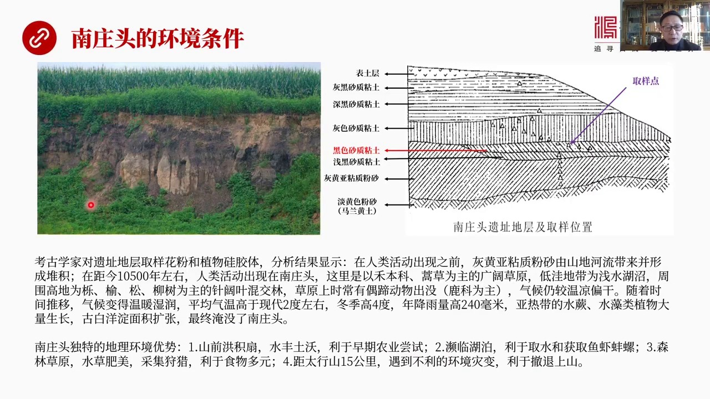

首先要觀察土層這些土層如果我們熟悉河北地區的土層你看腦子面就應該轉化成這樣一個土層對照表這個就是南莊頭側面暴露出來的土層從這個土層我們可以看到考古圈按照這一系列線進行大量的取樣取樣之後我們可以看到這些土層分成什麼表層土然後各種黑色灰黑色和灰色的各種樣的黏制土然後包括這種砂質黏土包括灰黃 雅黏制粉砂還...

<strong>Cleaned narration</strong>

> 首先要觀察土層這些土層如果我們熟悉河北地區的土層你看腦子面就應該轉化成這樣一個土層對照表這個就是南莊頭側面暴露出來的土層從這個土層我們可以看
> 到考古圈按照這一系列線進行大量的取樣取樣之後我們可以看到這些土層分成什麼表層土然後各種黑色灰黑色和灰色的各種樣的黏制土然後包括這種砂質黏土包
> 括灰黃 雅黏制粉砂還有彈黃色粉砂這就是馬蘭土一萬一千年在馬蘭土之上又堆積了這一層這一層是什麼呢實際上是從高地就是從山區衝下來的馬蘭土形成了灰
> 黃色的黏制粉砂跟它略乎不同所以這個是原生的這種土一萬一千年在它之上又堆積了河流衝刷下來的一些堆積土而這個是出現了一些潛灰色的一層這個當然就是
> 有水的成績現象人類的活動南莊頭的文明是出現的這一層然後後來又被水淹了一直到現在所以我們可以看到這個通過這些取樣我們可以看到在人類活動之前就是
> 一萬一千年以前灰黃色這個泥沙土就是這一層它是由山地河流帶來並形成堆積再往下這是馬蘭土了這個是河流帶來的那麼在距今一萬零五百年左右人類活動開始
> 出現出現了這一層然後當時主要是通過這一對這一層的採樣你會發現主要是河本河本科還有各種各樣的草類的他們的花紋比較多所以可以判斷出這是當時是一個
> 廣闊的草原第一瓦地帶有潛水沼澤周圍高地長滿了比如說利數、漁數、松數、溜數為主的珍溃林、
> 混嬌地帶草原上市場有一些路在出墨所以便於首列氣候仍然是溫涼偏乾隨著時間的推移氣候變得溫暖、
> 濕潤平均氣溫高於現在兩度左右冬季要高得更多、高四度年降雨量大概高240米比現在當時還出現了雅熱帶的水絕水澡類的植物大量生長、
> 古白洋鏈的面具擴張最終把南章頭給淹沒了這些黑色的土層就是湖、湖項成績湖預計的這些泥沙、
> 橙黑色和黑黑色所以南章頭這個地帶它有一些明顯的獨特的地理環境優勢第一是山潛紅雞扇山潛紅雞扇最大特點是什麼水土、
> 風厚有利於早期農業場式第二是冰林湖畔所以它利於取水和捕捉魚蝦第三是森林草原、水草很肥美這樣的話就會吸引烈物這樣的話對於他們來說採集和手裂也都
> 很方便有利於15多元化第四是巨湯山、巨里表境只有15公里如果遇到環境上重大的災變大家還可以撤上山躲避自然災害我們再看下野在南莊頭發現的最重大的突破之一

---

### Slide 21

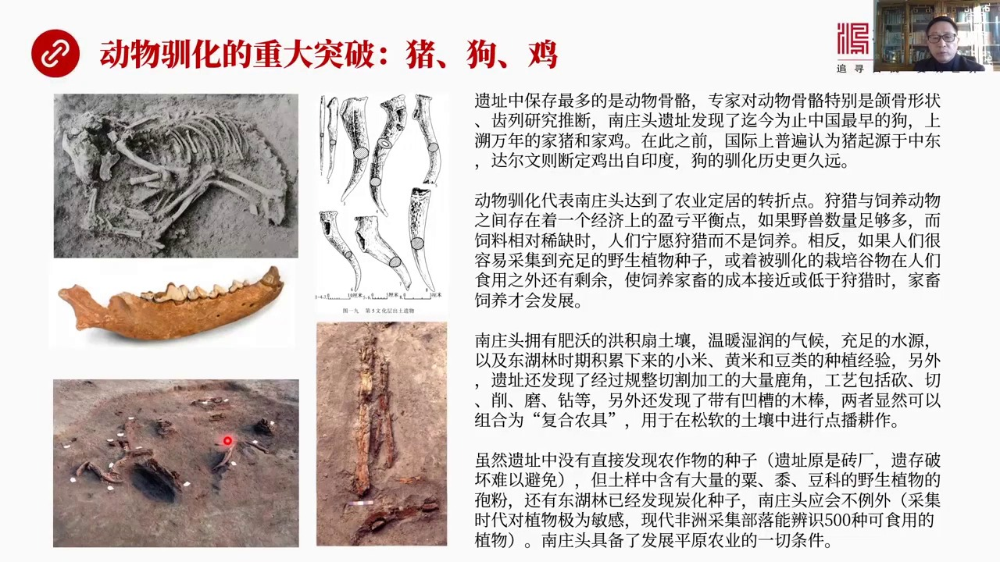

就是發現了家養的巡化動物、豬、狗和雞這是當時出土發覺出來的很多動物的遺憾保存最多了其實發現最多了就是動物、動物骨骼對包括對狗的牙齒對這些家豬、對豬的一些骨隔禁分析考慮學員們認為南莊頭以指發現了中國氣晶為止最早的狗上述五萬年的家豬和家雞再次之前我們知道國際上普遍認為豬是全於中東的達爾文曾經斷定機是出自...

<strong>Cleaned narration</strong>

> 就是發現了家養的巡化動物、豬、狗和雞這是當時出土發覺出來的很多動物的遺憾保存最多了其實發現最多了就是動物、
> 動物骨骼對包括對狗的牙齒對這些家豬、對豬的一些骨隔禁分析考慮學員們認為南莊頭以指發現了中國氣晶為止最早的狗上述五萬年的家豬和家雞再次之前我們
> 知道國際上普遍認為豬是全於中東的達爾文曾經斷定機是出自印度的當然狗的巡化至少是在一萬五千年以前有好的地方都巡化出了狗那麼動物巡化它是個非常重
> 要的標誌標誌什麼?標誌著農業定居生活的一個轉折到達了一個轉折點為什麼呢?因為我們從經濟學角度來看首列和四氧動物之間是存在著一個銀規平衡點的如
> 果說我打列非常方便因為列誤很多很多而四料卻很難找在這種情況之下我肯定選擇打列而不願意選擇去四氧加勤或者豬和狗豬狗雞這種巡化動物我不願意因為什
> 麼呢?我打列更方便成本更低相反如果出現了家處說明什麼?說明人們很容易採集到足夠的野生植物的種子或者被巡化的比如說素、
> 屬之類的植物除了人們使用之外還有剩餘因為養家處說明你的食物剩餘了否則的話你就不可能有東西為它所以如果說有足夠的食物是四氧家處的成本接近或者低
> 於首列的時候家處四氧才會發展所以這是個經濟問題是個經濟平衡點這個經濟平衡點的問題如果出現了家處說明我的食物已經多到我吃不完可以為家處了這麼做
> 比我去打列更核算我才會這麼去做這個說明什麼?說明南莊頭的食物超出了生活的必須的水平它有積累了所以家處出現了那麼南莊頭還有非常肥臥的紅雞扇土壤
> 氣候溫暖潮濕充足的水源還有東福利那個時代積累下來的向素、屬、豆類之類的種植經驗另外還有我們可以看到這些路角被加工過這個加工路角的工藝我們可以
> 發現有砍削、鑽膜等等它把這些遍遍交給全部替乾淨了切割乾淨了然後在周圍還發現了很多中間被掏空那些木棒如果把這兩者綁在一起這就是符合農具在鬆軟的
> 紅雞扇上黃土之上可以進行點波、點波更重非常方便雖然這個椅子中還沒有直接發現農作物的種植主要原因是尊重頭的地方倒是有個專場專場對椅子造成了難以
> 挽回的一些損失所以我們可能永遠丟失了很多信息但是這些土樣中其實通過保粉分析發現了大量數和數的包括豆磕的這種野生中路的保粉當然還有在此之前動物
> 林已經發現了探化種植這樣的話我們可以合理的推論南裝頭肯定也有類似的種植因為當年的採集部落對周邊的植物是非常敏感的所有可以使用的東西他們都會收
> 集起來原比我們現在人對植物的敏感性要高得多比如說非洲現在採集部落能夠變別周圍村落周圍大概500多種各種各樣可實用的這種植物所以我們可以看到南
> 裝頭其實具備了發展平原農業的一切優勢我們再看下野除此之外還發現了農業文化了一些典型的證據

---

### Slide 22

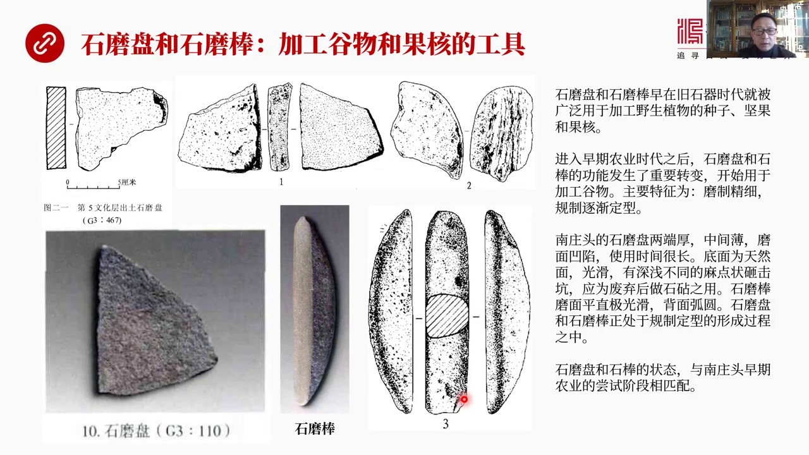

比如說石墨盤石墨盤這主要是加工股物或者股核的工具這些石墨盤當然完整已經不存在了我們現在發現的是一些碎片包括石墨盤從這些碎片中我們可以看到石墨盤石墨盤它的功能在發生變化在90期時代也發現了很多石墨盤和石墨盤它主要是被用於加工也生植物的種子堅果和果核等等進入農業時代之後這個功能發生了這組工具的功能發生了...

<strong>Cleaned narration</strong>

> 比如說石墨盤石墨盤這主要是加工股物或者股核的工具這些石墨盤當然完整已經不存在了我們現在發現的是一些碎片包括石墨盤從這些碎片中我們可以看到石墨
> 盤石墨盤它的功能在發生變化在90期時代也發現了很多石墨盤和石墨盤它主要是被用於加工也生植物的種子堅果和果核等等進入農業時代之後這個功能發生了
> 這組工具的功能發生了重要變化主要是用於開始加工股物特徵是什麼就是它的模式水平越來越高越來越精細而且製作的規範就是規制逐漸定型我們可以看到南裝
> 頭它出土的這種墨盤兩邊是比較厚的我們可以看到兩邊比較厚中間是一個凹槽是一個比較凹的這種形狀凹陷然後它的包括很多石頭的雜點很可能是廢棄之後拿來
> 做其他作用而且它的石墨模式非常的光滑背後是成糊原形這些現象跟後來我們看到北方發展的石墨盤和石墨相比一會發現這正好是處在規制定型它的形成過程之
> 中也就是慢慢標準化它是在標準化過程的初期剛剛形成有這樣的一個標準化的思路和規制化的思路以後都是從這個思路往下不斷地去延伸去發展最後定型成我們
> 現在看到的墨盤很磨棒也就是說石墨盤和石墨盤的狀態與南裝頭早期農業的長世階段是相匹配的我們再看下一頁南裝頭逃棄的進化

---

### Slide 23

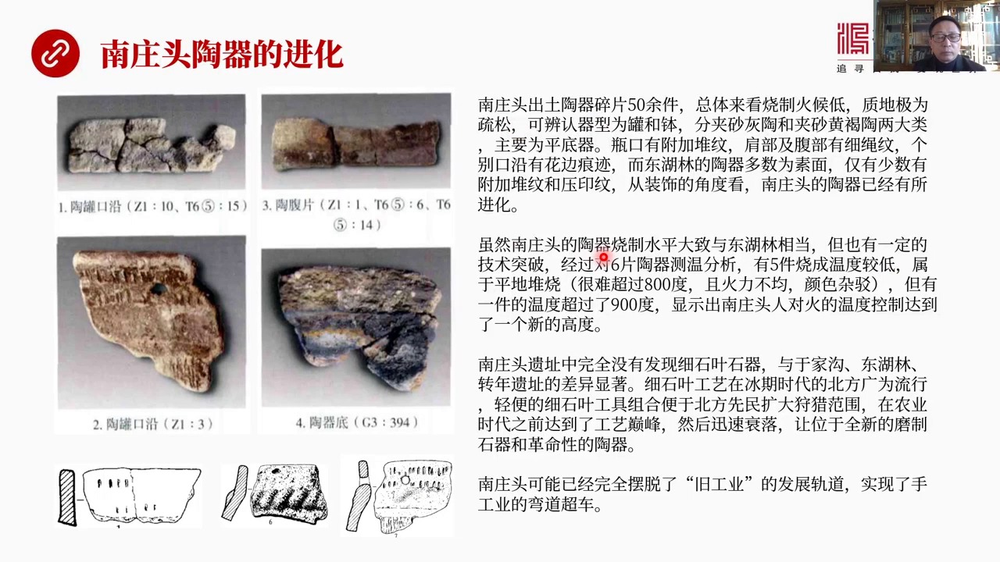

我們可以看到南裝頭的逃棄比東古林的逃棄就有明顯的一些變化南裝頭出土的逃棄片也比較多雖然總體來看商致火候還是偏低制定比較疏鬆可變人的氣形主要是掛和補包括加沙的和加沙的灰桃和黃橫桃兩大類還是平底氣為主平口主義它的平口出現了一些文式這些文式可以看起來像一些附加堆紋肩膜和腹部這個肩膜和腹部我們可以發現出現了...

<strong>Cleaned narration</strong>

> 我們可以看到南裝頭的逃棄比東古林的逃棄就有明顯的一些變化南裝頭出土的逃棄片也比較多雖然總體來看商致火候還是偏低制定比較疏鬆可變人的氣形主要是
> 掛和補包括加沙的和加沙的灰桃和黃橫桃兩大類還是平底氣為主平口主義它的平口出現了一些文式這些文式可以看起來像一些附加堆紋肩膜和腹部這個肩膜和腹
> 部我們可以發現出現了省文這種裝飾各別的地方還會出現花紋那麼東古林的逃棄多為素面就是沒有任何裝飾僅有少數的附加堆紋和壓硬紋所以我們可以從裝飾這
> 個角度來看南裝頭的逃棄已經比東古林有所進化了就是它的裝飾越來越明顯那麼逃棄本身燒製水平南裝頭跟東古林大致相當但是南裝頭也出現了一些明顯的技術
> 突破比如說這個國內的一些考古學家對於南裝頭出土了一些逃遍有6片進行了測溫實驗就是看它是燒成溫度是多少有5片介於500度到7800度之間就是燒
> 成了溫度比較低屬於平地堆燒我們在上山文化中間也講過了平地堆燒是通風條件是完全敞開的沒有盧搖所以它的溫度很難超過800度火力不均所以形成的色彩
> 比較雜薄大部分都是處在800度以內的但是有一片就有一件這個逃遍它的溫度測溫的結果顯示超過了900度超過900度基本上就需要極高的控制溫度的水
> 平要麼它是有盧搖要麼它是用一種特別畢風的一種手段或者毛泽手段能夠使溫度達到900度這是不容易的所以這一點顯示出了南裝頭這種文化它已經達到了對
> 火的溫度的一個控制的新高度這一點是超過了於這個魚架構包括超過了東烏靈和轉年它達到了一個最高風還有南裝頭一指鐘沒有發現細實業時期與魚架構東烏靈
> 和轉年一指差異顯著細實業時期這個工藝吧在兵核時期主要為北方文化所擁有吧主要原因是什麼就是那種驚喜的建築就是工建還有各種刀器必須要清辨以便於它
> 進行大規模的壽列因為天而太冷了兵核期碼動物減少了動物減少你首列的範圍叫擴大首列範圍要擴大你的工具包工具盒這套組合工具組合就需要輕巧靈辨要不然
> 就跑不了那麼遠所以細實業工藝在北方在農業文明出現之前達到了一個非常高的工藝高峰工藝顛峰然後迅速摔落讓位於後來的魔制時期就是新時期包括具有革命
> 性的桃器完全淘汰了細實業工藝在其他三個一指出發地獄架構然後在大實驗時東烏靈轉年都出現了細實業和桃片同時存在的這樣的一個現象但是南裝頭沒有它完
> 全沒有細實業說明南裝頭很可能擺脫了我稱為是舊工業的發展軌道實現了手工業的彎道超車它直接開始做比較先進的桃器而繞開了細實業或者就完全不是那群人這點是非常不一樣的地方我們再看下一頁如果我們來對比南北方

---

### Slide 24

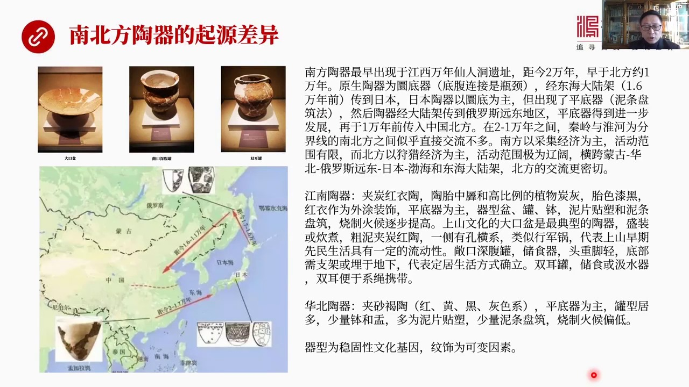

桃器的起源的話我們會發現南方桃器最早出現在江西萬年先人洞至今兩萬年早於北方大概一萬年原生的這種桃器最早的桃器基本都是原理器也就是由於它這個桃器它的底部和它的腹部你如果有轉角如果是沾在一起它非常非常的不方便或者很難把工藝做到讓它不漏水所以原理器它就是全部連在一起的底和腹連在一起便於製作這說明桃器的製作...

<strong>Cleaned narration</strong>

> 桃器的起源的話我們會發現南方桃器最早出現在江西萬年先人洞至今兩萬年早於北方大概一萬年原生的這種桃器最早的桃器基本都是原理器也就是由於它這個桃
> 器它的底部和它的腹部你如果有轉角如果是沾在一起它非常非常的不方便或者很難把工藝做到讓它不漏水所以原理器它就是全部連在一起的底和腹連在一起便於
> 製作這說明桃器的製作還比較原始然後這些桃器從江西通過東海大陸架傳到日本怎麼過得去因為一萬多年以前至今兩萬年一萬六七五六年前一萬五六六六五十年
> 以前氣溫是出的冰河七個狀態這邊東海大陸架完全落路所以基本上可以突步橫跨東海走到日本但是在日本進行了比較大的改革日本出現的桃器除了原型底之外還
> 搞出了平底器平底器就是泥盤調駐它是容易做平底然后又通过步行走到远东走到俄罗斯远东地方在这个地方平底这个陶级得到进一步发展然后再通俄罗斯传到了
> 中国北方所以它是一个这样走的一个很有意思的这么一个陶级发展路线而不是从南向北直接传递为什么就是因为在一到两万年之间秦领和怀疑和这条分界线阻挡
> 了南北方之间的交流南方主要是采积经济因为当时气候太冷它主要是采周围的这种植物产品所以它的活动范围是很有线的运动的范围不大而北方在寒冷的兵科期
> 它主要是首列必须要扩大范围找列物所以它的活动范围非常的广泛横扩了蒙古华北一直到俄罗斯远东一直到东海大陆价日本海大陆价然后一直到日本然后这一片
> 都是它广泛的活动的区域所以这个就是说明北方实际上在兵科期的时候它的活动范围要原品南方大的多交流更加平淡那么南方讨气后来当然传到江南就形成了上
> 山文化那种特殊的讨气它有什么特点呢甲碳红这个甲碳的红一讨甲碳这是江南讨气最典型的特征你看华北的讨气湖南的还有其他地方都没有甲碳甲碳是江南讨气
> 一个非常独特的一套一套制逃的手法也就是说在淘汰中间穿和高比例的植物的碳灰所以它的胎色是黑色的然后红衣是作为外图怪图的装饰图上去了所以它的外表
> 红色是一个装饰用的平底气围组也就是它越过了早期的原底气那个时代已经进化到比较高的一条盘制阶段了然后它的气形是盆大口盆就是这是它典型的气形贯和
> 补那么它的烧制的火候是一步一步提高的大口盆是最典型的气形关键大口盆为什么要搞这么大的盆主要是用于成装或吹煮它的一侧会有一个孔这个孔是拿着干嘛
> 继繩子用的所以我们现在可以判断它它的作用有点像行军锅背着就可以跑这代表上山早期的鲜民它的生活是有一定流动性的不完全固定但是到了这个阶段身复怪
> 身复怪什么呢它一定是蠢蠢食物的头中脚轻这个上面怪很大底下的脚非常小底部它需要支架或者满于地下要不然放不稳当这种气形出现的时候说明农业定居一方
> 式已经确立了因为你这个东西要背着走或者流动情况之下要想把它放稳是非常不容易的你只有定居把它埋起来或者带支架它才能放了稳双耳罐这当然就是用来处
> 这个处食物或者打水用的双耳主要是便于继繩的鞋带所以江南讨计我们可以看到在同样时代中它的气形还有它的标准的知识都已经成体系了而北方南庄头我们看
> 到跟江南讨计还是有所差距的所以华北的讨计同样一个时代它主要是夹杀的赫讨赫包括红黄黑灰四种赫色构成了华北讨计的主要的特点它的夹杀这个杀主要是食
> 营杀而且它也是平底气为主因为华北讨计很可能是从俄罗斯远东传进来的惯行它的惯行它这个气形以过耳为主就是惯的还有少量的薄和鱼主要是一片贴素比较原
> 始少量是泥调盘柱然后烧制整体火候是偏低的注意当我们看到这个陶器的时候要知道什么东西它是一种稳定的梦啊基金什么东西是可编的因素气形就相对而言它
> ...

---

### Slide 25

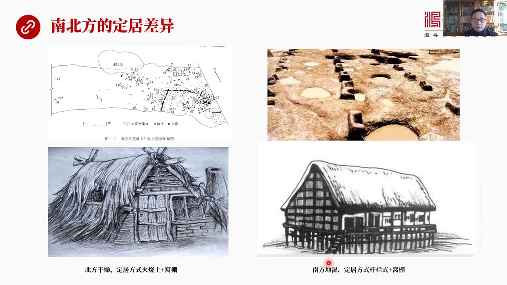

我们以前说过这个上山遗址的时候上山人居住的是干栏式建筑也就是在这个泥找地带打下很多装子或者打下很多柱子柱子条还可能还垫上这个石片石板 让它有支撑力然后上面都是柱子这就上山遗址发现了万年万年支柱的洞那么在一个朝师地带把整个把整个房子往上顶顶上一层这是干栏式建筑然后上面铺上木板人是住在里头的这叫干栏式建...

<strong>Cleaned narration</strong>

> 我们以前说过这个上山遗址的时候上山人居住的是干栏式建筑也就是在这个泥找地带打下很多装子或者打下很多柱子柱子条还可能还垫上这个石片石板 让它有
> 支撑力然后上面都是柱子这就上山遗址发现了万年万年支柱的洞那么在一个朝师地带把整个把整个房子往上顶顶上一层这是干栏式建筑然后上面铺上木板人是住
> 在里头的这叫干栏式建筑隔开了水隔开了水舌隔开了各种样的朝师使得人们可以在南方比较这个第一师地带能够很好生活北方就没有这个问题了北方的土是比较
> 干燥的所以北方的窝泡是直接盖在红烧土上的南方的窝泡是盖的一个沾栏木架子上都是窝泡但是北方不用把它架高所以它的地面会有大量的红烧土就是火烧就是
> 用火把它烧红的这种烧土地带烧了非常硬烧了非常硬可以隔潮然后再加上它土是本身就很干燥所以直接在上头架上木装的搭上茅草就可以居住两者的区别仅仅在
> 于土它是湿还是干建筑风格基本都是茅草屋盖在火烧土上茅草屋还是盖在干栏的干栏是这个支架上所以我们可以看到南北方其实从定居方式就已经感觉到它的文
> 化差异水湿这两点是南北方的一个重要差异我们再看这个南装头之后北方的文化成绩了上千年

---

### Slide 26

因为南装头仁大概是在一万零五百年到九千七百年在那个地区生活大概八百年炒到出中国北方的第一个定居文化开始在开门的平原地带实践刚刚出现的农业文明但是一切新鲜事务它毕竟是脆弱的南装头它的规模足迅规模比较小当然还有组织能力也不行还有它的技术水平生产工具物种的寻化的能力重养值的经验贸易交流 物质储备各方面都比...

<strong>Cleaned narration</strong>

> 因为南装头仁大概是在一万零五百年到九千七百年在那个地区生活大概八百年炒到出中国北方的第一个定居文化开始在开门的平原地带实践刚刚出现的农业文明
> 但是一切新鲜事务它毕竟是脆弱的南装头它的规模足迅规模比较小当然还有组织能力也不行还有它的技术水平生产工具物种的寻化的能力重养值的经验贸易交流
>  物质储备各方面都比较脆弱也就是处于相当原始的阶段如果说自然环境发生轻微的震荡都有可能摧毁整个根基不牢的定居文化的基础那么我们可以看到整个北
> 方的气温在逐渐升高湿度在不断的加大虽然中间出现了肉感测冷空气的袭击就是冷事件但总的趋势一直到七千多年一直是这样的一个发展趋势那么随着这种气候
> 的好转温度的升高胡泼在发育找则在扩张最终把整个南装头压到了这个埋在了湖底那么南装头人去了哪我认为很可能是转移了特别是像山区高地转移为什么因为
> 整个温暖湿热的气候一直持续到七八千年为什么人们会上向高海拔地去重新转移主要我觉得就是气候条件的改变我们说全新市早期的快速升温对人类的生存是非
> 常有利的但是对于农业文明的盟牙却不一定因为这中间我们还是要计算营亏平方点当气候转的非常地转为非常地弄暗示的气候这个时候森林会扩大直背会向高海
> 拔移动在高海拔地区动植物反演会更加新望在这种条件之下在山区经首泪和采集的投入产主比很可能会超过比较简单比较选择性比较小的平原早期农业南装头人
> 很可能是到了高地生活就乐不思属不愿意在下山了因为有一定海拔的高度它有利于塑造物种的多样性就像非洲大略股你可以看到它的在很短的空间之内有2,0
> 00多米的落差2,000多米就是从热带一直到寒带所有的植物都可以集中在一个空间非常小的一个地域当然是有利于塑造物种多样性的这样的话就会增加食
> 譜的范围人们在海拔落差表大了地区它就可以很容易获得大量的食譜的补充如果我仅仅在平原我的选择范围是相对较小的因为我的那个地方职位也好动物也好它
> 的多样性不够还有平原容易受到红水的吸击等等包括打裂吧那动物很远就能看到你你也不容易去守裂不像山区打裂你可以有很强的隐蔽性所以当温度不断升高的
> 时候其实山区的综合优势反而更有心力了这就是我们看到为什么南装头仁在温度改善情况之下非但没有扩大农业的尝试反而可能退到山区去享受山区更美好的守
> 裂和采集生活所以我们来看总体先进农化模式也是非常有可能出现阶段性的倒退当然从我们现在角度来看是倒退但对于当时生活的人来说是选择了一种更优的品
> 质更高的更自由获得食物更多样我领养更好然后我投入工作时间更少的一种更好的生活方式那么从南装头仁撤退撤退之后整个太阳山动物遥迫的红鸡大平原上农
> 业文明的勾火应该说沉寄了上千年也许是我们现在的考古学还没有发现所有的遗址但是到目前为止我们发现的下一波文明的星期那是到八千年前后此生文化的星
> 期就是在珍珠链的南侧了这中间大概中断了一千多年甚至达到一千五百年这么长时间整个华北大平原上就没有文明遗址了不是说没有人到河北大平原去打猎生活
> 可能有但是没有定居或者我们还没有发现这些定居的遗址此生文化后来带来了我觉得是带来了更先进的文化基因然后你看此生文化的发展状况立刻比南装头也好
>  东库林也好那一下就高出了一大节肉严可见的文明的进步所以这一千多年这些文化是从哪里计电的是怎么传到辞山的这是一个很有意思的话题我们以后再接着
> 讲然后这一次在辞山爆发出来农业文明那就是形成了遥远知识了再也没有熄灭过好 在这里最后我们需要做一个历史哲学的思考

---

### Slide 27

什么叫历史哲学就是站在哲学的高度上来反思历史因为我们现在研究的东西越多细节越多 头脑 其实越乱我们怎么才能够把这么大量 这么庞杂那么多的跨学科的东西规整在一起 形成一套体系这是实际上是需要哲学的高度的哲学它的本身是什么就是归脑和抽象知识和经验背后的统一规律西方称之一真理 称之为真理我们称之为道历史哲...

<strong>Cleaned narration</strong>

> 什么叫历史哲学就是站在哲学的高度上来反思历史因为我们现在研究的东西越多细节越多 头脑 其实越乱我们怎么才能够把这么大量 这么庞杂那么多的跨学
> 科的东西规整在一起 形成一套体系这是实际上是需要哲学的高度的哲学它的本身是什么就是归脑和抽象知识和经验背后的统一规律西方称之一真理 称之为真
> 理我们称之为道历史哲学的意思它的含义就是要对历史识功中所发生了一切人类的活动进行归脑和抽象并且试图理解人类的总的命运当然这种历史哲学有很多礼
> 物派比如说布罗代尔我以前专门谈过它把时间分成长适量的地址时间历史时间和事件时间三个层次这就是我们所我所经常说的前流的概念就是源于布罗代尔的时
> 间分层然后所有的事件按着这个时间分成进行过律然后你会看到完全不同的历史景象这叫历史哲学误了自谈把各个地区的发展分成核心区半边边区和边缘区然后
> 通过贸易核心区变得越来越复杂边缘区变得越来越简单这就是我们所说的保姆理论它的源头就是误了斯坦的核心区和边缘区的画分这也是一种思考历史的哲学高
> 度当然还有布尔在我们讲的从文明道从这个这个里面到衰落讲的西方文明五百年所发生的各种各样的各个文化艺术教育然后建筑音乐等等各个领域中大料碎片画
> 了这些文化的艺术的背后这些碎片其实有个共同的指向它有一种深刻的内在一致性它把这种一致性作为判断历史命运的一种标志当然还有斯坦格勒这是我们最近
> 谈到的包括我们马上都是会要讲的它把历史是各种有形的有机的生命你从新生到发育到旺盛到衰劳和死亡这跟一个完整的生命周期是一样的所以每一种文化都有
> 生命周期我当然可以跨越时空把任意两个文化进行对比这叫形态学文化的形态学和官像法然后唐英伟他也是一种他也是一种这个计程了斯坦格勒的文化形态学然
> 后他就进行广泛的二十多种文明进行综合对比然后他提出的机制就是挑战和应对来作为品判一种文化是否进步怎么进步他进步的程度作为一个判断型的标志所以
> 我们来看这些伟大的历史哲学的这种思想和方法给我们什么起发就是我们在考虑这些考古的问题在思考中方文明在思考东方文艺复兴整个这个过程中最重要是什
> 么最重要是我们缺少足够高的历史哲学的高度就是没有历史哲学的高度我们实际上是无法价率这些历史细节的如果没有历史哲学的力度我们是很难穿透这些迷悟
> 重重的历史的这种阴障的所以要想理解历史的命运我们首先需要反思历史哲学的方向也要实现东方文艺复兴前提就是要创造新的历史哲学的思想体系而我们红旋
> 的核心课也好读书也好 威克堂也好一方面要做细节研究另一方面需要在更高层次上研究这种研究所谓研究这种研究其实就是在居高零下的不仅看不仅你自己在
> 做事还有另外这眼睛居高零下看你是怎么做事的这就是研究这种研究行为本身所以在这个过程中我们会逐渐形成红旋自己的历史哲学体系好 这就是我们今天的主要内容下面给大家推荐一下一些书籍有一本书叫全一式气候变化

---

### Slide 28

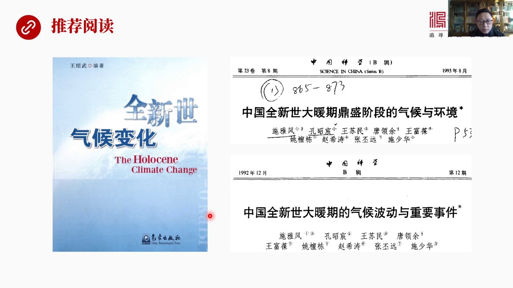

它主要是讲整个这一半多年以来全世界它的气候变化当然还有大量的历史还有大量的地址从地址的视角看气候变化等等谈到了历史诸多的冰河漆这本书写的很有意思而且大量精确的数据和投表就是让我们得出截断时候你很有底气但是除此之外还有很多雜质比如说专门分析中国雜质上了一些论文开幕上的一些论文专门分析中国全因是大暖气的...

<strong>Cleaned narration</strong>

> 它主要是讲整个这一半多年以来全世界它的气候变化当然还有大量的历史还有大量的地址从地址的视角看气候变化等等谈到了历史诸多的冰河漆这本书写的很有
> 意思而且大量精确的数据和投表就是让我们得出截断时候你很有底气但是除此之外还有很多雜质比如说专门分析中国雜质上了一些论文开幕上的一些论文专门分
> 析中国全因是大暖气的气候波动和环境包括一些外国条件等等另外还有南装头以指的一些考古报告

---

### Slide 29

包括发觉报告包括职辈古环境的变化人类活动之间的关系报告等等另外还有海清研究我们要研究华北平原它的海清问题也有一些这种专业报告另外还有专门研究北京地区的全新是职辈和气候变化的研究这些论文除此之外还有黄土地层

<strong>Cleaned narration</strong>

> 包括发觉报告包括职辈古环境的变化人类活动之间的关系报告等等另外还有海清研究我们要研究华北平原它的海清问题也有一些这种专业报告另外还有专门研究
> 北京地区的全新是职辈和气候变化的研究这些论文除此之外还有黄土地层

---

### Slide 30

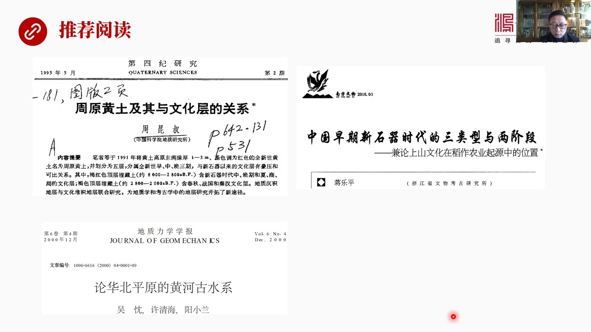

就是周园黄土和文化层之间的关系还有整个华北平原上黄河谷水系不是说大雨那个山比那个还早五六千年当时黄河流进华北的时候在一万年前流进华北的时候到底是一个什么样的状态还有就是南北方的新世期时代陶器也好 农业重制也好各方面也好它有什么可比性或者双方的差异的呢好 今天这就是我们这个核心课的者

<strong>Cleaned narration</strong>

> 就是周园黄土和文化层之间的关系还有整个华北平原上黄河谷水系不是说大雨那个山比那个还早五六千年当时黄河流进华北的时候在一万年前流进华北的时候到
> 底是一个什么样的状态还有就是南北方的新世期时代陶器也好 农业重制也好各方面也好它有什么可比性或者双方的差异的呢好 今天这就是我们这个核心课的者

---

### Slide 31

内容今天课就上来 谢谢大家

<strong>Cleaned narration</strong>

> 内容今天课就上来 谢谢大家

---
