# 核心课视频-70、71  股份制的进化 — Detail Slide Notes

> **来源**：鸿学院核心课程  
> **幻灯片**：22 张

---

### Slide 1

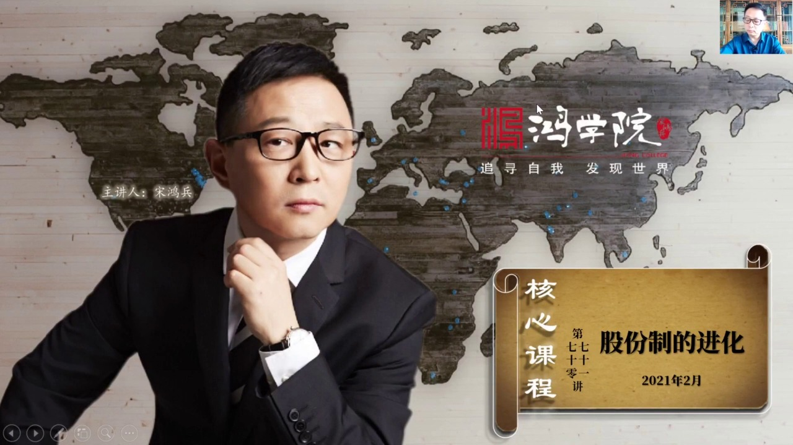

请问大家好 祝大家牛年 牛转前坚坑咱们今天上核心课 第七十和七十一讲这堂课是讲股份制的进化原本这堂课我是准备把它做成一个介绍股市的这么一个基础性的大致文化的这么一种减借但是通过研究 通过不断的球挖掘 ...

<strong>All subtitles</strong>

> 请问大家好 祝大家牛年 牛转前坚坑咱们今天上核心课 第七十和七十一讲这堂课是讲股份制的进化原本这堂课我是准备把它做成一个介绍股市的这么一个基
> 础性的大致文化的这么一种减借但是通过研究 通过不断的球挖掘 觉得它的内容量比我原先设想了大很多所以我大概用了一个多月的时间 包括整个春节基本
> 上全部花到了这堂课的准备上所以内容量越来越大然后我就把它做成了一个一个比较完整的涵蓋面很宽的这么一个课程作为我们对股份股份制 还有股票市场交
> 易的一个前导性的细的课程之一吧首先我们说到股份制的时候 我想大家可以看一下这张图 我把全世界的股份制的进化路径通过这张图 把它画了出来

---

### Slide 2

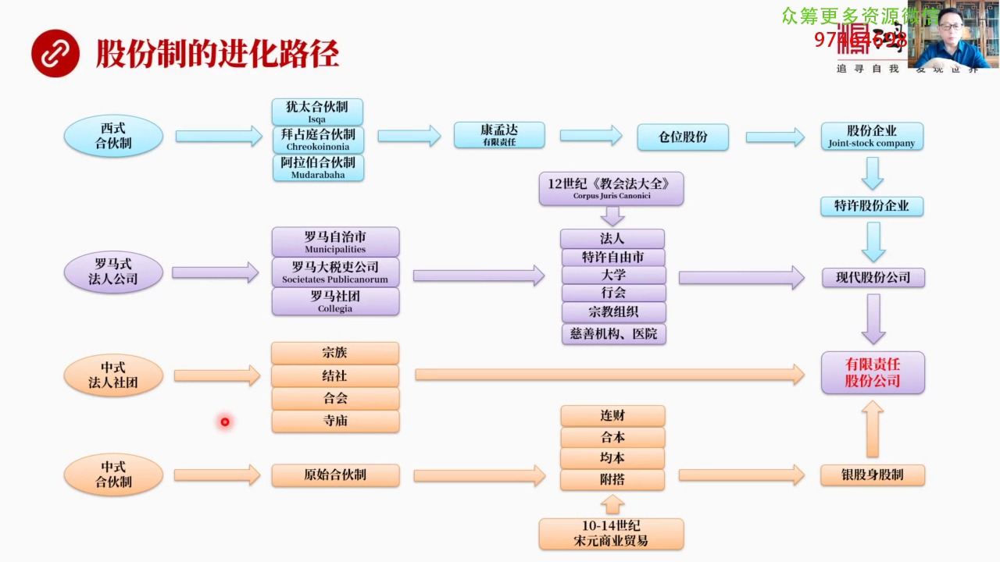

从这张图上大家其实已经可以看出来它的内容量还有东西方吧 两种不同的合伙股份 包括法人有限责任等等这些概念 它是怎么进化最后怎么进化成了一个共同的 像共同路径 不断的发展首先我们来看 当我们说到股份制的...

<strong>All subtitles</strong>

> 从这张图上大家其实已经可以看出来它的内容量还有东西方吧 两种不同的合伙股份 包括法人有限责任等等这些概念 它是怎么进化最后怎么进化成了一个共
> 同的 像共同路径 不断的发展首先我们来看 当我们说到股份制的时候其实首先明白 它是从合伙制 从一种以营利为目的合伙制发展起来的所以我们一开始
> 会介绍稀释的合伙式 就是整个西方 它了合伙制是怎么发展起来的在这里我们重点介绍犹太 犹太商人的合伙制还有拜占庭的合伙制 阿拉伯这三种合伙制 
> 它们各自的特点和进化的方向 为什么会从犹太合伙制往拜占庭和阿拉伯这个方向进化然后这三种联合的进化方向 最后导致了康孟达的出现就是一种有限责任
> 的 出现在中世纪 商业革命时代的一种新型的合伙制当然 再往后 从康孟达就进化出了热闹亚的仓位股份制那么再往前发展 就变成了英国荷兰的那种股份
> 制企业再往后就是像东英路公司 英国荷兰这种政府特许型的股份制企业再往后发展就发展到现代股份公司但是从这种合伙制往这个方向进化 其实中间还有一
> 个卖不开的一点就是合伙制 毕竟只是合伙制 而不是这种公司制公司制又怎么进化呢 实际上是从古老马 他的法人公司 这个概念开始进化的所以我们会分
> 别介绍在罗马共和时代 他其实就有了当时的公司比如说罗马所有的自知事 包括整个罗马这个国家 其实都是公司的形势在运作包括罗马当时很多的大税利公
> 司专门负责经营和管理国家的或者说是公共的这些财富资产 比如框山 余业 还有森林 没框等等当然还有各种各样的罗马社团这个构成了公司所以我们当说
> 到公司的时候 你要想到罗马时代的公司 实际上都是公共组织面向公众为公众提供服务的这种组织 叫公司罗马帝国崩溃之后 他就发展成了教会计程的公司
> 这个概念所以12世纪教会法 就是罗马教厅搞了教会法的会边第一次 接受了罗马的公司制之后 第一次在12世纪开始确认法人这个概念法人这个概念非常
> 重要 因为公司是公司 法人是法人这两个合在一起才能变成法人公司然后从法人这个概念加上罗马的公司 两者合并在一起 进化出了在欧洲很多这种封建领
> 立中间有大量的自由式就是自制的这种城市 包括汉萨同盟等等这六七十个城市都是自由式还有周世纪的大学航会 还有各种各样的修道 修道院等等上耶稣会
> 这都是宗教组织 这都是法人公司 当然还有慈善机构和医院这一套体系 最后跟营历性这都是非营历性的 所以有跟营历性的合伙制合并在一起才衍生出了现
> 代的股份制的法人公司然后现代股份制的法人公司又经过医系列法律的变化在特别是在1844年英国立法之后才变成了现代的有限责任的股份公司所以我们看
> 到他是从合伙制加上罗马的公司 再加上中世纪的法人 联合形成的股份有限公司那么不光是西方有股份制 中国其实也有 所以我们会谈到中世的合伙制也就
> 是中国历史上出现的合伙制 包括从西州开始春秋 战国 包括秦汉 未尽南美朝 都有合伙制当然 在我们发展到了宋朝和元朝的时候 也就是跟欧洲的商业
> 革命几乎是同时代的宋元商业贸易出现了大发展 海上贸易 空间发展在这个时代 中国也出现了大量的类似抗蒙达 参为股份这样的一种股份制的企业比如说
> 包括宋朝的连财和本 军本复达 这是四种不同的合伙方式我们一会会这个一介绍然后由这些股份制的这样的一种出型 最后进化出了明清时代的十大商帮时代
> 的 比如说晋商的票号中间的营股生股制当然 我们仅仅进化到了营股生股制就进化不下去了后来晋商票号这套体系垮台之后我们是从西方的有限责任制直接转
> 基金了他们的有限股份包括现在中国的上市公司基本上都是直接架劫的从19世纪20世纪以来学西方的然后直接使用那么中国其实也有法人的概念跟罗马法人
> 是不太一样的我们的法人是基于封亲 就是一个宗族包括结射 合会 四秒等等而这套法人体系并没有跟我们的合伙制合并在一起而是单独进化最后直接我们转
> 基金了西方的有限责任股份制所以他是直接跟这套体系合并在一起出现了建国以后 特别是改革开放之后出现的法人这个概念这都是从西方进化来的我们直接引
> 用的概念所以从这张总得股份制的进化路径途中我们可以一目了然的看清楚每个时代每种文化在每个地区它的大概进化的这个时间和进化的方向当然这张图大家
> 最好能记得脑子里因为我们一会讲具体内容的时候可能会反复提到这些概念如果能把它记得脑子里或者以后提到这些具体概念是回个头来看就会一目了然所以画
> 这张图就花了好几天的时间需要把所有这些概念所有这些细节的东西全部要理顺然后才能画出这张图所以这张图非常重要希望大家把它尽可能细下来有了这张整
> 体的地图我们再看每个具体的细节就比较容易理解了我们先从西方的合伙之开始先看猶态拜登亭和阿拉伯的合伙之看这条线路是怎么进化的然后我们再跳到这条
> 线路再讲这个线路是怎么进化的然后我们再跳到中式合伙之介绍中国的发展体系然后再到中式的法人社团是怎么进化的最终解释清楚什么是现代的有限特论制公
> 司中国为什么现在我们的股票市场我们的金融市场在我看来是魂不复体实际上是我们这套体系我们直接借用别人的而这套体系要想建立离不开它的文化背景和法
> 律背景它深深植于它的宗教它的文化它的贸易习惯特别是法律体系的构建所以我们如果没有这套体系直接引用它的概念是很难真正走笑的这就是我们最后总结手要重点谈了问题我们现在看第一页首先介绍游泰合伙治

---

### Slide 3

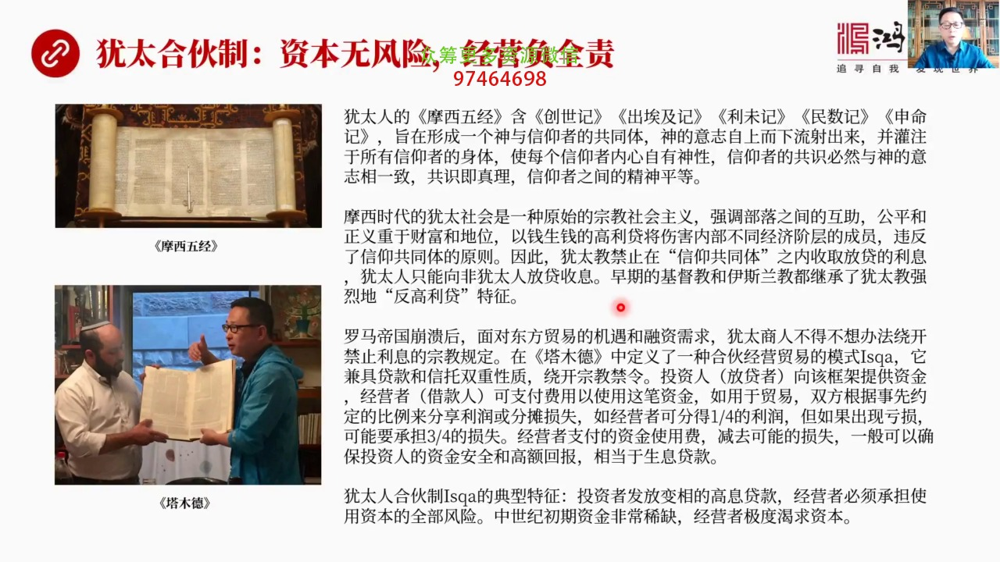

游泰合伙治我称为是资本无风险经营负权责其实我们说到任何的合伙治股份制就是一种合伙所有的合伙都是人与人人与资本和资本之间的一种联合经营也就是前和经营者出自人和经营者两者之间的结合这种结合它需要有很多情理...

<strong>All subtitles</strong>

> 游泰合伙治我称为是资本无风险经营负权责其实我们说到任何的合伙治股份制就是一种合伙所有的合伙都是人与人人与资本和资本之间的一种联合经营也就是前
> 和经营者出自人和经营者两者之间的结合这种结合它需要有很多情理条件比如说大家如何建立一种信賴的相互信賴那么它需要有一套法律机制的保护它需要有一
> 套文化背景作为法律体系的支撑需要有大量的文化层面的东西甚至包括宗教这种东西来支撑所以当我们理解合伙治的时候首先要理解它的文化理解它的宗教理解
> 它的法律这样才能够有效地明白合伙治为什么对不同的文化对不同的时代对不同的地区它的合伙的方式是不一样的比如说犹太的合伙治它基本上属于一种变相的
> 高利带就是犹太教不允许对犹太人进行升级贷款为什么呢因为犹太人的模型武经也就是我们就业中间也包含着模型武经其中包括创始级、
> 初埃及级立位级、民宿级和生命级这个武经实际上是犹太人犹太人真正的宗教的信仰经点它的主要目的是为了形成一个神和信仰者之间的一种共同体我们读过斯
> 宾格勒的西方的墨洛这个书我以前在读入会中专门解释过犹太人和序利亚人、波斯人等等这一片地区我们通称为是序利亚地区大序利亚地区包括安娜托利亚半岛
> 的相当一部分包括现在的序利亚、以色列、巴勒斯坦等等还包括伊拉克、伊朗地区这都算是一种大序利亚文明地、
> 文明区这些地区在加上北非的阿拉伯地区北非的地区阿拉伯地区还有大序利亚地区这都是一个所谓的沙漠草原地代这个地代我们通称为是一种马格文明的一种心
> 灵这种心灵的人他在看世界的时候想象了这个世界是一个黑暗的穷龙中间涉及一道光斯宾格勒把穷龙中间黑暗中出现一道光作为它整个这片地区的一种共同的文
> 化意向我觉得体谅是非常有意思的为什么我们看到了所有医生教从犹太教、从基督教、从这个后来的伊斯兰教这其实都是马格心灵创造出来的一种宗教心态所以
> 我们需要理解它们是一种什么样的心理为什么它会把这个信仰者、这个人群这个群体跟神之间进行这样的一种结合其实我们想象就是黑暗穷龙中间一束光光代表
> 神涉向黑暗的穷龙中间是所有的被这种光所感昭的信仰者们结合成了一个共同体所以这个共同体、
> 神和信仰者这共同体是理解三大宗教的一种非常重要的钥匙那么神的意志就像光一样是从上、
> 从雄龙之上向下留摄出来的并且贯助在每一个信仰者的身体之中使每个人的心灵中、信仰者的心灵中间都自然带有神性所以在这种宗教体之内信仰者的共识就是
> 我们所有的人身上都有一部分神性我们之间所产生的共识必然代表神意必然跟神的意志是一致跟神的想法是一致这个其实就是我们要理解基督教创教之后他这个
> 宗教会议因为宗教会议的概念就是如果我们所有信仰、宗教的人信仰这个基督教人都有完全一致的看法那么我们不可能错因为我们每个身上都有神性我们所有人
> 共同意见必然跟神的意见是一样的其实犹太教他的拉比制度伊斯兰教还有这个基督教在这个意义上是完全相通的共识即真理如果说所有信仰者达成了共识这就一
> 定是真理所以既然是这样的话每既然每个信仰者身上都有神性那么信仰者之间精神上应该完全平等而在摩西这个时代猶太社会他是在比如说在埃及他是一种原始
> 宗教的社会主义布罗之间是高度平等的强调布罗之间要互助要公平还有在这种布罗中间他当时的社会状态是一种我们更强调布罗之间的互助我们更强调大家之间
> 这种正义他比财富比地位要重要所以既然我们信仰上是一致的我们的精神上是平等的各方面都是信仰的共同体的话那么以前生前这种高利带就是一种非常非常糟
> 糕的经济行为也就是说你怎么能利用布罗之中大家本来是平等的你利用你的一定的优势你通过放待去收取利息去剥削另外一个信仰相者共同体中间的一个平等的
> 成员这是不能允许的所以猶太教禁止在信仰者共同体之内放待收利息就是猶太人不允许贷款给猶太人收他的利息这是违反宗教法律的当然早期的基东教和伊斯兰
> 教其实都是原域猶太教都是继承了这套体系当时猶太教坚决的反高利带基东教和伊斯兰教同样如此都有强烈的反贷款收取利息这样的一种特性反高利带那么在罗
> 马帝国崩溃之后我们知道我们在核音客里面讲过市场的计划在罗马帝国崩溃之后帝中海贸易一开始猶太人是其中的主力打主力的跟东方的贸易事件是猶太人在做
> 所以猶太商人不得不想办法绕开禁止收取利息这样的一种宗教规定那么在堂摩哲中间堂摩哲就是我去一次列的时候跟一个猶太拉比他们家是一个拉比市家然后我
> 们再看到这就是堂摩哲有很多券从堂摩哲这个手中你可以看到他们家的祖先甚至七八百年之前的祖先跟更早的祖先通过在堂摩哲这个他们最古老的这种谨刺于圣
> 经的整谨刺于摩西五经的这样的一种圣书旁边做了批读他们的祖先们可以建格几百年通过批读而进行相互交流所以猶太人是非常重视堂摩哲的在堂摩哲中间定义
> 了一种合伙制是允许的就是Escar这种合伙制是具有贷款和信托双重性质它是可以繞开宗教的禁令的它的基本概念和基本玩法是怎么样了就是投资人没有钱
> 其实是一个放代者那么这种投资人可以像一个猶太合伙制Escar这样的一个合伙制的框架提供资金注意不是放代的名义而是联合经营的名义提供一笔钱经营
> 者也就是具体去操作资金去经营投资的人或者叫借款人它必须要支付一定的费用来使用这笔资金然后它使用这笔资金可以用于贸易可以用来买卖可以做资产投资
> 那么双方会事先约定要有一个分层比例或者要有一个分台损失的一个比例比如说举个例子经营者可以分得1%的利润但如果出现亏损经营者可能要承受3%的损
> 失也就是说这个钱某种意义上我是贷款给你的所以你要对这笔钱的损失对这笔钱的本金要负有责任经营者它事先支付了一笔使用费用然后我可能还要蒙受一定的
> 损失这两者支插一般都可以可以确保投资人给的这笔钱的安全性和获得相当的回报实际上是一种变相的高利贷或者叫生息贷款也就是说你交易笔钱来对付这个钱
> 然后你还要拿一笔钱来准备损失然后这两笔钱经过这个计算之后我发现我肯定不会赔我才会把钱给你用所以它这种由太人的合伙至它的点营特征是什么就是投资
> 人投资者发放的是变相贷款是收取利息的变相贷款而经营者必须承担使用资本的全部风险中世纪初期我们知道罗马帝国崩溃之后当时地中海贸易中非常缺钱所以
> 钱非常昂贵而人相对来说比钱没有那么有价值所以说我们可以说商人们是极度可求资本资本就开出了很高条件我可以给把钱给你用但是你得承担所有的风险得承
> 担所有的责任而且要给我一个非常高的回报这就是中世纪早期在地中海贸易中由太合伙至基本特点资本是没有风险的经营者要付全部的风险本金的风险我们再看下夜那么到了公园

---

### Slide 4

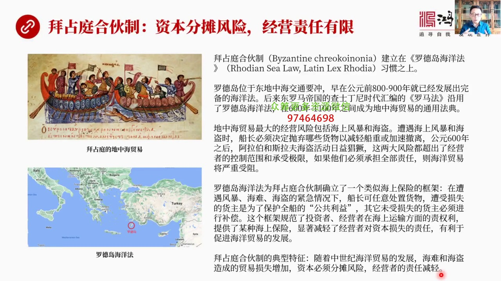

六七世纪以后就是拜占庭帝国星期了拜占庭帝国就是东洛马帝国他们在西罗马帝国崩溃之后继续存在一次五二年又存在了将近一千年那么拜占庭帝国他从罗马帝国崩溃之后也就是从公园五百年前后一直到公园大概一千一百年在这...

<strong>All subtitles</strong>

> 六七世纪以后就是拜占庭帝国星期了拜占庭帝国就是东洛马帝国他们在西罗马帝国崩溃之后继续存在一次五二年又存在了将近一千年那么拜占庭帝国他从罗马帝
> 国崩溃之后也就是从公园五百年前后一直到公园大概一千一百年在这五六百年中间他是比较昌盛的比较繁荣的主要就是因为他的地位置非常好拜占庭他大致着位
> 置相当于托尔齐包括欧洲部分希拉这都是拜占庭帝国的江土他最远的时候占领了蓄利亚然后打到了白级甚至到了西班牙基本上恢复了罗马帝国还要占有一大例南
> 部基本上恢复了罗马帝国的全部领土那是在他最恢复的时候所以拜占庭当时几乎拥有地中海贸易和黑海贸易两海之间的重要的交通书扭当然同时还拥有从中国到
> 西方的四州之路陆地四州之路是从伊朗伊拉克杭川托尔齐然后通过伯斯布洛斯海峡进欧洲所以他相当拥有的陆地四州之路和海上的交通线的一个十字书扭他这样
> 的一个战略地位他的位置非常好所以他很挣钱贸易很繁荣那么拜占庭的合伙制最大了特点是建立在罗德岛海洋法系海洋法了一个习惯之上罗德岛在哪里实际上是
> 在接近克里特和托尔齐本土之间离托尔齐本土距离非常近那么这个罗德岛这个地方大家从地上可以看到他其实是从希拉半岛希拉这个包括伊大利过来到岛达地中
> 海东岸蓄利亚这块贸易最繁荣的地区他实际上是在中间的一个中卷战场地的位置极其重要自古以来罗德岛都是一个非常重要的一个海上交通要冲所以他在立场形
> 成了一整套海洋贸易的一套规则他早在公元前八九百年也就是在希拉崛起之前了古希拉崛起之前河马史时那个时代稍晚大概同样一个时代他就已经发展出了一种
> 非常完备的海洋法这套海洋法后来被东洛马帝国查识丁尼黄帝他那个时代做了一个罗马法的大会边他这个会边实际上我们以前讲过斯宾跟乐在叛倒罗马法的时候
> 也专门提到过罗马法其实并不是一套逻辑上很完整的一个通用性的法典罗马法他主要特点是把各个地区的法律进行会边但是并没有把它做成一个通用的逻辑结构
> 并不是从一个通用了逻辑结构出发然后整合在一起而是把每个地方行之有效的法案直接会变在一起罗德岛的这个法律就是这样被会边进来的那么这个地区的法律
> 在公园600年到1100年这500年中间成为整个地中海贸易中间的最通用的法典那么地中海贸易它最大特点是什么最大特点是风险高啊因为地中海它的由
> 于地中海气候了一些特殊的原因所以它冬季它的风暴是很厉害的还有它的海盗也是比较厉害的所以呢在海上进行贸易最大的风险就是海上风暴还有碰到遭遇海盗
> 在这种情况之下船长必须要做决定也就是我这个船碰到风暴之后怎么办船太重了要沉所以我必须要舍气气货物要抛要把这个货上面货物丢掉剪清船的重量来自保
> 或者是海盗冲过来了我得加速逃跑我也得抛气气货物船长有权力去决定抛气哪些货物抛气多少货物那么特别是在公元600年之后我们这阿拉伯是离决起了阿拉
> 伯的海盗斯拉夫的海盗都非常常决那么这一种海盗在家上风暴这两种风险这个带来的这种巨大的精英风险实际上超过了这些商人们的控制力也就是说你把钱给我
> 我代表你去用就是实际上代理投资人去经商但是我这风险太大了而且这个风险完全超过超过我的控制力就是我没有办法控制风道我也没有办法控制我什么时候能
> 碰到海盗所以在这种情况之下如果我遭受了损失你还让我赔赔本金我是赔不起的超过了这些商人的成熟级线如果他们这时候承担全部的资本的风险就别发展了没
> 人愿意干这活那么罗德岛的法律其实提供了一种类似海上保险的一种框架主要是为拜达廷和火制提供了一个非常有效的一种框架如果说遭到了风暴遭到了海难或
> 者遭到了海盗在这种紧急情况之下传长可以任意处置货物遭受损失的货主肯定有些人的货受了损失但是他这种损失是为了保护全船的公共利益就是每个人的利益
> 都在他受损失的情况下得到了保障和保护所以其他没有受损失的传组必须要对受损失的这个人进行补偿当然这样一来的话就是这个大家的风险相对来说是降低了
> 因为军摊如果碰到风险我们每个人培议一点点这个风险我们就能承受所以这个框架其实规范了投资者经营者在海上运输方面的责权力提供了一定程度的海上保险
> 特别是减轻了经营者对资本损失的这种责任就是他的风险变小了以前是什么呢以前是资本是投资人身一点风险的不贸15%我不贸任何风险只是全是你来背只要
> 我资本受了损失你就得陪我我们想象一下现代的股份之企业你能让CEO陪上公司的损失吗不可能因为他是他是我只是经营这家公司经营公司亏和损对于我个人
> 的工资来说对于我自己这个CEO的身家来说没有任何印象当年可不是你要把公司整培本了把投资人钱整培本了你得拿你的身家来贴来倒补当然这样了就使得经
> 营者的风险很大但是逻达到这个法律其实是最早提供了一种分散风险的一种有效的方式对于经营者来说这下子如果说他在这个船上的货物遭到了损失的话其他船
> 主会培给他所以他的责任就下降了或者他的风险就下降了这个就是得参与投资的投资者成大的一部分风险因为他的货物有可能遭到损失人家虽然培他一点不能百
> 分之百的培而别人的货物出现损失他也要培一些所以对于投入资金的人来说他实际上是成大的风险而对于经营者来说他的风险下降了所以拜登庭和我指的点营课
> 正是什么就是随着中世纪海洋贸易的发展贸易量越来越大钱越来越多涉及到金额越来越大海岛和海南造成的贸易损失这个量就增加了这种情况之下资本必须要分
> 散必须要分贪一部分风险使得经营者的这种风险和责任有效、減轻、否则的话这个事儿玩不了经营者干不了因为风险太大好所以我们从这个猶太人的合伙直到拜
> 登庭和我指大家就已经发现了资本在中间对于风险的承受力不断的上升而经营者的风险在不断的下降原因是什么原因是中世纪不断的发展贸易不断的繁荣大家挣
> 钱越来越多资本变得更充裕了而经营者的经验相对资本来说在升职就是钱开始找人而不是人求着钱我们再看下一页下一页就是阿拉伯的合伙指

---

### Slide 5

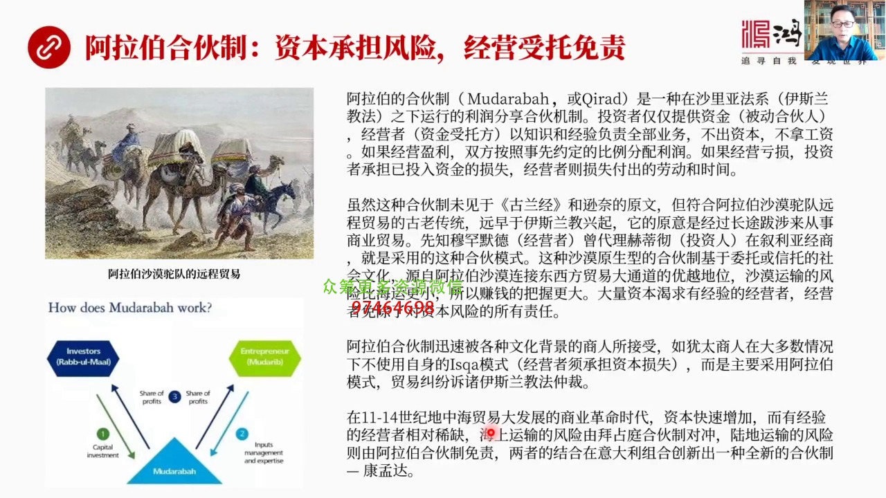

阿拉伯的合伙指他的总的特点是什么就是资本承担所有风险经营者是受托免责经营者对于资本金的损失不负任何责任这就是阿拉伯合伙指的典型特征阿拉伯的合伙指马德瓦把这套合伙指他是建立在一种沙漠妥对基础之上的特殊的...

<strong>All subtitles</strong>

> 阿拉伯的合伙指他的总的特点是什么就是资本承担所有风险经营者是受托免责经营者对于资本金的损失不负任何责任这就是阿拉伯合伙指的典型特征阿拉伯的合
> 伙指马德瓦把这套合伙指他是建立在一种沙漠妥对基础之上的特殊的经营方式他存在于沙利亚法系就是伊斯兰教法所规范的种种的商业贸易行为中他是受这个法
> 系保护的伊斯兰教他是承认利润分享这种合伙经营的方式沙利亚法这个教法是承认的投资者仅仅提供资金就是你出了钱之后啥也不用管所以叫被动合伙人投资人
> 出钱的就是被动合伙人经营者或者叫资金受托方以他的知识和经验负责全部的投资业务他自己是一分钱都不出的他也不拿工资如果经营引力了双方按照事先约定
> 的比例分配利润如果经营亏损亏保了投资者承担已经投入资金的全部损失投入多少我就承担多少损失经营者的损失是什么经营者只损失了他付出了劳动还有他搭
> 进了时间所以我们看了阿拉伯和伙治比拜战亭和伙治又有一个巨大的飞越就是资本承担了所有的风险而经营者他的风险降到了非常低亏本之后经营者不负任何责
> 任这一种方式在古兰经里面是没有的我们都知道阿拉伯这个世界他的杀利亚教法还有他的包括一切的方面社会的一切方面都要讲究就是要追寻你这样做这样做事
> 的源头在哪里古兰经是不是规定可以这么干或者训内是不是说我们可以这么做古兰经当然我们知道这是他的一三教的圣变经典训内就是先知还有先知们他们所说
> 的言和行就是他们所说的和他们的行为经过这些伊斯兰教的学者们他们进行了大量的追踪、研究然后可以把所有社会中一切行为包括言论可以追踪到古兰经或者
> 追踪到训内就是这些先知们的言行虽然没有写到古兰经里但是也能够通过一个传一个一个传一个最后能够较准、
> 确认这些先知们说过这话干过这事儿那么都是合法的那么阿拉伯的合伙是并没有出现在古兰经里面也没有训内中的原文中也没有提到这个事儿但是呢他仍然是被
> 接受的主要原因是他符合阿拉伯沙漠妥对远程贸易的传统这个传统发源很早几千年前就有了原人早于伊斯兰教的星期他这个话这个合伙制这个沐德拉伯他什么意
> 思呢他的原因原因就是经过长途的陆地拔射来从事某种事业在这里当我们说是商业贸易其实我们看先知沐海莫德我以前在红关进步中专门介绍过他和他的出自人
> 赫迪测沐海莫德是精英者赫迪测就是他后来他的妻子当年是投资人就是有钱的一个寡妇把他的财富拖管给沐海莫德然后沐海莫德就跑到大马士阁跑到这个伊陆沙
> 漠这边去搞精英活动其实先知沐海莫德和赫迪测之间的关系就是采取了阿拉伯和伙制也就是说赫迪测出钱沐海莫德出力那么赫迪测承担所有的损失如果说发生了
> 任何意外那么如果赚了钱双方按照约定的分程比例还进行分配利润这就是阿拉伯和伙制的一种基本的方法这是一种沙漠原生性的和伙制他其实更像一种信托或者
> 伟托这就是为什么精英者的责任很小他不承担责任对你是伟托给我或者你信托给我我只是按照我的经验和知识帮你做那为什么他不用承担风险呢主要是阿拉伯沙
> 漠的地理位置很重要阿拉伯沙漠基本上是连通东西贸易他的毕竟之路不管你是来自中国还是印度不管你是走海路还是走路路不管你是路地四周之路还是海上海上
> 走你都卖不过去就是阿拉伯沙漠他是一个东西贸易大通道的书牛他地理位置得天堵厚所以如果你把货从东方运过来唯一导手卖的西方这个东西是铁转的是百分之
> 百转钱的只要我的运输不出问题我不碰上巨大的灾难我不碰上这个倒贼打结的我就肯定能赚这个钱而我们知道沙漠中间搞运输跟地中海搞运输最大的这个风险海
> 上运输是风暴是海上风暴这个是中世纪的传运技术很难克服的但在沙漠中间妥对碰上风暴他就没有机会碰上风暴所以他的这种自然灾难运输中间出现的损失会很
> 小当然沙漠中也会有道贼就像海上有海道一样这两者如果出现的概率一样沙漠搞运输运输中间的损失相对于海上贸易就会更小所以赚钱的保卫性更大这就出现了
> 在中东很富有大家都是做保守贸易的赚了很多钱资本很风欲很丰厚而有经验的这种精英者愿意跑这个到处跑的精英者相对有限所以是金钱追的投资人追着这些精
> 英者在走所以精英者就会提出各种条件比如说我就不能承担你的资本的风险这个就形成了阿拉伯贺贺贺质的一个最重要的特征当然这就对精英者来说非常有利其
> 实我们看到虽然有钱的人就是有钱钱越来越多但是你要想钱生钱其实最重要是还是要靠商人就靠精英者通过他的经验他的知识他的投入他的眼光去赚更多的钱那
> 么一种进化的总体方式是你必须要对精英者越来越好他的条件会越来越优越你这个钱才能够他才能够愿意接受你这个钱所以阿拉伯贺贺质当时就被各种文化背景
> 人普遍接受比如说猶太人猶太人以前那种变象高利贷后来猶豫出现了阿拉伯贺贺质的竞争他们猶太商人就非常不愿意用猶太人自己那套玩法全部转向了阿拉伯市
> 的这种合伙质主要就是阿拉伯的合伙质对于精英者来说非常有好如果说猶太人在比如说地中海出现了任何贸易纠纷比如说在阿拉伯贺家出现了这种贸易纠纷他们
> 往往会采用伊斯兰教法去到当地申请重裁就是找当地的伊斯兰教法的这种法院或者叫这种商人亚法系的法官来精英重裁按着什么重裁按着阿拉伯贺贺质的方式精
> 英重裁欧洲的商人到了伊斯兰地区到阿拉伯这个地区也是采取伊斯兰教法精英重裁所以这套游戏这套游戏规则就逐渐地确立起来那么在11到14世纪这地中海
> 贸易大发展的商业革命时代资本越来越多有经验的精英者相对习缺所以在这种情况之下海上贸易的风险有败占庭的合伙质有效对冲了陆地运输了风险由阿拉伯的
> 合伙质基本免责两者的结合就在意大利组合创新出了一种全新的合伙质这就是康梦达我们再看下野

---

### Slide 6

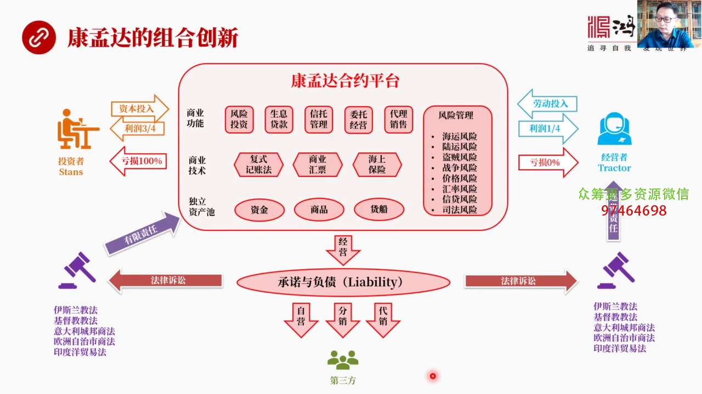

下野我们会支立张康梦达的基本的概念图康梦达就是把伊斯兰教的阿拉伯人的模式在加上败乱庭的模式在加上游炭的模式在加上各个地区普遍通行了模式把它的重要的优势还有当时已经发展出来一些商业技术进行了有效结合融合...

<strong>All subtitles</strong>

> 下野我们会支立张康梦达的基本的概念图康梦达就是把伊斯兰教的阿拉伯人的模式在加上败乱庭的模式在加上游炭的模式在加上各个地区普遍通行了模式把它的
> 重要的优势还有当时已经发展出来一些商业技术进行了有效结合融合了大量商业功能形成的我称之为是一个法律契约的开放型的平台那么如果我们来看两个方向
> 一个方向是投资者还有一个方向是精英者投资者就出钱出钱的人是百分之百资本投入那么精英者他是完全以劳动投入他一分钱都不出然后投资者如果说通过康梦
> 达这个运动方式挣了钱他拿到利润他可以拿到利润的四分之三而精英者由于他不贸任何资金的风险他可以分得利润的四分之一这是固定的那么如果出现亏损在资
> 本他已经投入了资本中间亏损怎么办全亏光了他承受百分之百的损失投资人全部陪伴他承担所有损失而精英者一分钱损失都不承受这就是康梦达当然康梦达中间
> 融合了大量的不同的合伙资中间的一些精英特点比如说他包含有风险投资的功能还有生息贷款就是犹太人这种生息贷款就是变向收利息他也有这个功能因为你分
> 来的利润这中间就包其实包扣了贷款利息信托他实际上又结合了阿洛伦的信托和委托这两种方式同时还有代理销售的这样的概念所以他包含了好几种商业功能同
> 时还吸取了大量的商业技术的革命比如说富士机上法商业会票还有海上保险这是1300年之后出现了海上保险然后第三个最重要的特点是他形成了独立的资产
> 池投资人投资出的什么资金或者出货商品或者出传也行或者三个都出或者三个中间出的两个都行这些资产形成了独立的资产池如果发生法律就分或者说整个精英
> 排了排什么排独立资产池里面的钱他个人是不会再赔任何钱的赔光了资产池的钱他就没有任何责任了所以这就叫有限责任对于投资人来说他投入的投入进独立资
> 产池里面全部资产是成就风险的把这些钱全部亏光了他个人身家是不受不受影响的这叫有限责任质这是第一次出现用法律合约明确规定的有限责任那么他这个咖
> 梦达平台还有一个最重要的功能是管理风险因为风险太大了在海上在海上搞贸易咖梦达主要是用于海上贸易然后路底上也有一些使用咖梦达平台的主要是海韵那
> 海韵中间有海韵风险比如风暴路韵当然也有风险还有碰上海到了风险还有碰上正在打仗战争出现了损失的风险还有价格风险万一你从这儿买了皮货到那儿价格变
> 了你可能亏本还有匯率风险这国家货币跟另外一个国家货币不一样匯率出现升值贬值也会造成精英风险还有信贷风险比如说你把钱委托给另外一个代理人去买货
> 结果这个人跑了吸管而逃这是风险或者你把钱借给某个人没有还也是风险私房风险就是你毕竟再过再做跨境吗你如果你在一个不友好的某一个小国采取不同的教
> 法或者法庭采取不同的法律体系最后可能大家比较排外对你做出了不利的判决你也会损失卡莫达平台其实要综合处理所有这些问题所以它是一个复杂的契约的法
> 律契约组成了一个开放价格的平台那么独立经营者获得了经营权之后它怎么使用资产池呢它可以去运作这商业功能使用这商业技术主要经营是它来负责比如说它
> 的经营过程中会使用自营自己买和卖会采用分销会采用代销跟第三方进行买和卖来赚钱但是这个经营活动中就会形成潜在的负债或者承诺比如说我拿了你批货我
> 承诺要付你钱结果由于种种原因没负或者说我的经营过程会负债经者会借其他二人钱加上杆然后来进行自营分销和代销无论是你承诺别人没有负的还是你借别人
> 钱加上杆的都会形成负债所以如果出现法律诉讼第三方没有拿到钱或者你欠别人钱没有还或者海外发生任何意外比如说你到1313这个社会中的某个地方杀了
> 一个人好 当立法院判你培你要培罚金这都是一种潜在的负债所以这就会出现法律诉讼法律诉讼是在13教法基督教教法一大力各个城邦的商法还有欧洲北海这
> 些自由市面这种商法还有印度洋因为印度洋也采取抗蒙达和约所有的这些地区这些城市法或者宗教法都承认抗蒙达大家都会接受这种法律诉讼好 那就出现了两
> 种判决一种判决是对于投资者来说如果说经营者由于他的承诺没有到位或者负债了怎么办 培罚了培罚了把本给培掉了法律诉讼就说那么培 培什么呢培独立自
> 战持里面的所有钱培光这个所有钱这叫有限责任他投资人是不负任何责任的在各种这个历史文件中就记录了比如说热闹亚商人到埃及的亚利山大港去做贸易投资
> 人不去投资人是留在热闹亚那么他们伟派的经营者到亚利山大去做贸易结果贸易培了出现了负债判决是什么呢这个伊斯兰的法院只是扣留这一船的货物而不会去
> 到热闹亚把他给抓起来扣他的房产和这个扣他的房产和他的现金那是不可能的所以伊斯兰教法已经非常明确地说你这船货出现了问题我只扣这船货判决你该培多
> 少培光你这船货里面所有这些东西为止而远在意大利这个人不承担任何风险不承担任何超越他已经投入本金的任何责任所以这叫有限责任你的有限限制于什么限
> 制于你自战池面所有的东西你的负债超过了这个东西再多你就没责任了那么对于金者来说他却要承担另外的法律诉讱比如说他杀了人杀了人让他他赔一个一百个
> 金币这个这个事跟人家投资人一毛钱关系都没有那么或者说他承诺要尝换别人多少钱但这个事情他没有做到或者加了杠杆他没有做到投资人责任是有限的而他的
> 责任其实是无限的你要杀一个人赔一百个金币倾张大坦也得赔或者你加了杠杆借了一百个金币其实你没这么多钱一定要冒风险那这个风险是你冒的跟人家投资人
> 没有关系投资人只跟你十个金币结果你要做一百个金币生意那是你自己倒霉所以他是要承担连带责任的这种连带责任可以是我上不风底所以金者如果你是谨慎小
> 心的经营你使用了资金不超过投资人给你的钱那么你就不可能冒任何的风险如果你非要是玩比较邪惑的加了杠杆那你要承担所有这个其他的超过于投资人资本金
> 的这些风险这个大概就是康孟达的一个整体的非常规范的功能非常强大的而且跨文化跨宗教跨地区的一套体系在印度洋贸易中在黑海地中海北海还在欧洲在北非
> 在中东大家通用康孟达这套体系所有法院都能接受进行类似的判决我们再看下眼

---

### Slide 7

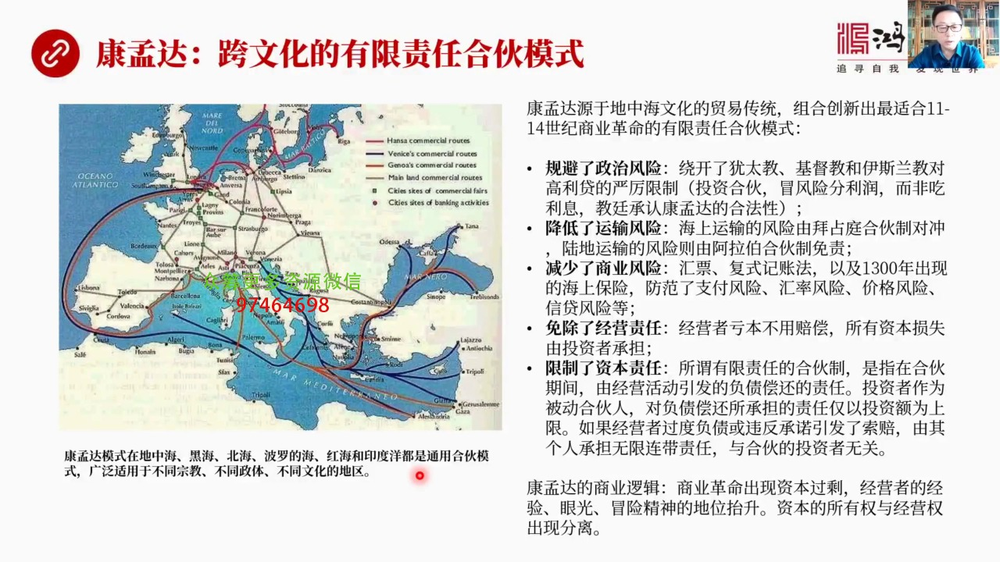

那么康孟达它是一种真正的跨文化的有限责任合伙制跨文化指的是它在地中海贸易中间北海贸易中间播了地海贸易中间黑海所有这些地区设计了不同通教不同文化不同城市有各自不同的法案还有教会法等等等等大家通认康孟达模...

<strong>All subtitles</strong>

> 那么康孟达它是一种真正的跨文化的有限责任合伙制跨文化指的是它在地中海贸易中间北海贸易中间播了地海贸易中间黑海所有这些地区设计了不同通教不同文
> 化不同城市有各自不同的法案还有教会法等等等等大家通认康孟达模式判决方式都差不多所以它是一种跨文化的有限责任合伙制也只有这种方式它在中世纪商业
> 革命时代就是11到14世纪这300年商业革命时代起到了巨大的作用也非常适应适合于当时的经济和贸易发展的这样的一种情况主要原因它有效地进行了风
> 险的对冲管理的风险比如说什么呢首先它规避的政治风险什么叫政治风险当年政治风险就是教会严厉的反对高利贷所以它这个康孟达模式可以绕开猶太教基督教
> 和伊斯兰教对高利贷的严厉限制为什么因为所有宗教都承认你如果什么活都不干你就是把投资就是把钱借给别人然后收别人高利收别人高利息你这个叫布劳尔霍
> 这叫剥削你这是这个要下地域的这是不行的但是康孟达什么康孟达是投资我是投资我也变成合伙人之一虽然我是被动但我也也是合伙人我是要冒风险的我是分利
> 润的我不是做的那儿布劳尔霍的所以我是冒风险分利润而不是吃利息这就是为什么罗马教庭还有猶太教了拉比还有伊斯兰教法的这些人都承认康孟达的合法性所
> 以用康孟达这个模式可以有效规闭政治风险还有什么呢还有康孟达这个模式可以降低运输风险我们刚才说了海上运输风险拜登停了合伙制也就是康孟达的中间一
> 个组成部分他可以有效对出路地上的这个风险是阿拉伯合伙制既行免责所以路地和海上的运输风险降到了最小还有什么呢减少商业风险比如说商业风险中间的支
> 付风险会票还有各种样的这种出现的比如说支付风险会的风险价格风险现在风险等等这些风险通过康孟达这个手段也能进行有效对重还有呢进行风险免出了精英
> 者的他的风险或者说叫免出他精英责任精英者商人代理投资人去做任何投资亏损他是不用赔本的就是亏本他不用赔偿一分钱都不用赔所有的资本损失都有投资者
> 来承担这对精英者来说是一种巨大的利好或者叫非常友好这就极大的鼓励了大家去冒险去经商去开拓市场去用自己的眼光和经验去冒险还有呢他限制了资本的责
> 任就是投资人所谓的这个投有限责任的合伙制就是投资人他的风险在哪里他的风险是在合伙期间就是在我们联合做生意合同约定的时间之内由基因活动所引发的
> 复债长还的责任这个叫有限责任的这个他所指了范围就是我如果由于精英我产生了复债对复债的长还所承担的责任是不是有限的如果是有限的这叫有限责任投资
> 者他主要是作为被动合伙人对复债长还所承担的责任仅仅是我投入金钱的上限我投入100斤幣我就只承受最高不超过100斤幣的长还复债的风险超过100
> 斤幣跟我就无关了不到100斤幣我还能上一些但是如果精英者过度复债或者违反承诺引发了各种各样的所培那跟投资人就没有任何关系了那是由精英者自己去
> 承担无限的连带责任那么卡蒙达的商业逻辑是什么就是在商业革命的11到14世纪出现了巨大的资本过剩贸易空线房间钱非常多而精英者的眼光他的经验冒险
> 精神相对于资本来说他的地位越来越高这个时候就出现了资本的所有权和精英权要彻底分离出钱的就是商业培馆经营的付全部的他负担全部的经营责任他负担全
> 部的这个经营上的这事都归他馆而且他培了本他不用培这样的话就对精英者非常的有利我们再看下野倡位股份

---

### Slide 8

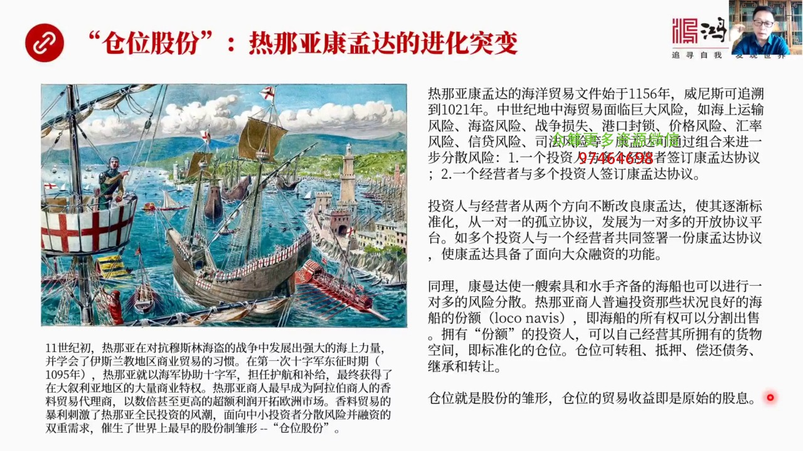

这个是热闹亚搞出来了是热闹亚对于康孟达这种模式的进一步的发展或者叫产生了一种进化突变我们知道这个热闹亚和微妻司都是意大利发展最早的这个海洋贸易的两个重点城市一个在东西一个在西正好在意大利那个大腿的左右...

<strong>All subtitles</strong>

> 这个是热闹亚搞出来了是热闹亚对于康孟达这种模式的进一步的发展或者叫产生了一种进化突变我们知道这个热闹亚和微妻司都是意大利发展最早的这个海洋贸
> 易的两个重点城市一个在东西一个在西正好在意大利那个大腿的左右左右根捕那么热闹亚是在是在他的这个地了年海这一侧微妻司是在亚德利亚海这一侧那么热
> 闹亚它是什么时候崛起的热闹亚主要是在十一世纪初主要是在对抗穆斯林当时有很多海道经常结略这个意大利严海地区热闹亚是在这个对抗穆斯林海道这种大大
> 小小战争中间不断发展起来的形成了一个比较强大的海军力量而且在跟穆斯林打交道过程中不仅是在意大利亚海后来还打到北飞沿海他们就逐渐学会的伊斯兰教
> 这个伊斯兰教这些经商和商业的一些习惯比如说用什么方式经商比如说怎么使用会票比如说如何如何进行法律的重裁等等就慢慢学会了那么在第一次十字军东争
> 十七大概就是1095年以后吧这个段时间之内热闹亚热闹亚由于它海军力量表发达它就提供海军协助十字军东争主要是单单互航不及这种海军的任务最后十军
> 东争在地中海东岸建立比一系列基础教了这种小国这些小国由于热闹亚提供了大量帮助所以就给热闹亚大量的商业特权比如说在耶路撒冷给它一块致命地或者给
> 它一块商业的特许的这么一块地方它可以在那儿有自己的领事来负责自己的种材等等商业活动还有各种方面都免税所以获得了大量的特权这个时候热闹亚就成了
> 在训练大训练地区成了最早的基础教国家的这些商人那么它们也最早的跟阿拉伯商人联手来做商量贸易商量贸易我们都知道是中转站它们负责中转中转卖到欧洲
> 交给谁呢以前可能是交给游泰商人现在我把这个所谓的代理权转给了热闹亚商人也就是说我们从印度洋从中国运来的这个种商量从东南亚运来的商量我以前是卖
> 给卖给游泰商人我现在全部卖给热闹亚商人热闹亚商人负责在欧洲进行批发这样就是亚商人一下辩得非常的获得了一个非常大的商业机会因为这个商量的利润当
> 时非常高几倍到几十倍超高利润所以商量贸易大发展之后就刺激了整个热闹亚大大小小的这些投资人包括城市的居民官员还有学图上到七十老人下到七八岁孩子
> 包括什么既女包括这些教会教室包括各种样的甚至包括一些修道院的人都参加海上贸易都想赚钱所以掀起了热闹亚全民投资的风潮就像现在大家买基金一样全民
> 都疯了都买那么这种海船或者这种海上贸易由于一船的载活量表大而且资金量也表大所以为了分贪风险也给中小投资人提供机会提供融资的就是有融资和分贪风
> 险双重需求老百姓也愿意买所以这个时候热闹亚最早开始搞出了一种仓位股份把我的货仓平均分成若干个标准的仓位然后把货仓在市场上卖给不同的大大小小投
> 资人标准化的货仓所以这就是货仓的仓位股份的一个基本来源那么他从法律上来说也就是说中世纪的海上贸易还是面临很大的风险所以分贪风险这是最主要的一
> 个需求怎么分贪呢当时在热闹亚港口他有几种方式就是一个投资人出版之前我可以跟好几个比如说我跟10个金营商金营者我有钱但是我不能把所有钱都压到一
> 个人身上万一这个人出了什么问题我平坦给10个人我跟10个金营者签订抗蒙大协议这样我就分贪了风险还有一个金营者也就是我要金营传货物我也不能够掉
> 在一个投资人上我也要面向多个投资人甚至面向整个城市人大大小小的投资人所以就出现了一对多两个方向的一对多投资人和金营者从两个方向都可以这个不断
> 地改良抗蒙大这个合约体系然后使抗蒙大这个合约越来越标准化就标准化到最后大家就避免您签就完了因为所有变量全部会控制住之后你只需要填几个具体的数
> 因为分成了比例等等这东西都是标准化协议不能改也不用改所以由于从两个方向都是一对多的话就会形成一个把以前的一对一的这样一个孤立的协议就变成了一
> 个一对多的开放性的这种契约的平台它就变成开放框架很多投资人都能够参与进来比如说很多投资人可以跟一个金营者共同签署一份抗蒙大协议这就使得抗蒙大
> 具备了面向大众融资的功能就是我刚才所说的倡位股份倡位股份也要通过抗蒙大的形式来签协议所以我们脑子面想到任何的这种合作合伙制首先想到它协议应该
> 什么样它的法律合同应该什么样你必须得用一对多的方式就是一个金营者面对多个投资人这种抗蒙大协议才能够发行出售你的倡位股份所以我们搞明白这个道理
> 之后我们就会看到倡位股份它的发展的进化的动力来源那么它最早是一个什么概念呢就是一个所具和水手期权的海传是可以进行一对多风险的分摊的很多人的商
> 人大家都投资因为我要投资好几艘传的这种份额这样比较保险这个海传的所有权是可以进行分割出售的也就是说如果一个投资人买了某一条传上的弱干个份额那
> 么它就拥有了相当于对应于这个份额所对应的物理空间或者叫倡位空间这个倡位空间一般都是标准化的所以它可以把倡位空间进行转租或者底压或者用了倡位贷
> 款甚至可以继承和转让也就是可以买卖这就会形成股票市场倡位标准的这种倡位就是股份的出型倡位的贸易收益就是原始的股息好我们再看下眼

---

### Slide 9

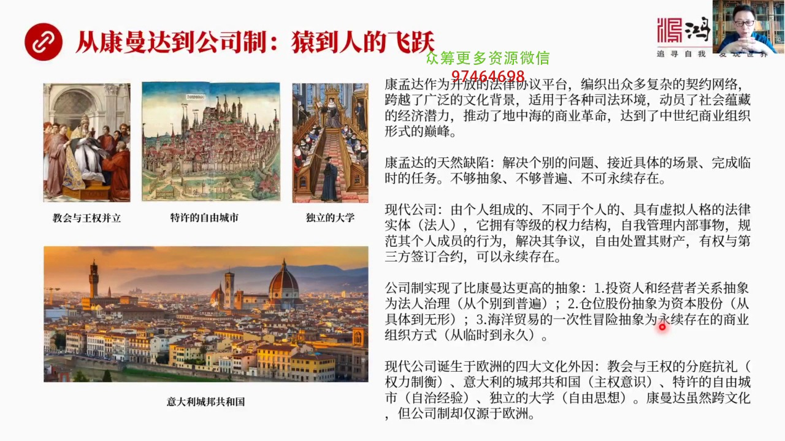

那么从康梦达到公司制这是一个从源到人的分阅康梦达只是一个协议注意它只是一个法律的合同它存序的时间就是一搜传出海和回来这一段联合我们大家人和资本联合在一起我们只是有限时间之内做一笔具体的买卖回来之后把货...

<strong>All subtitles</strong>

> 那么从康梦达到公司制这是一个从源到人的分阅康梦达只是一个协议注意它只是一个法律的合同它存序的时间就是一搜传出海和回来这一段联合我们大家人和资
> 本联合在一起我们只是有限时间之内做一笔具体的买卖回来之后把货分完了卖完了我们康梦达协议就结束了公司可不是公司是永久存序的一个固定的机制这两者
> 是非常不同的从康梦达要进化的公司还有一个巨大的分阅康梦达是做一种开放的法律平台通用于地中海的各个地区不管你什么宗教背景还是文化背景都可以接受
> 所以它极大的它就好像一个绵密的七月的网络把各个文化各个各个国家各种内部的这种精力量全部动员在一起共同来推动商业革命这种形式在中世纪发展到了一
> 种顶峰的状态就是康梦达但康梦达的天然缺烟是什么仅仅是解决个别问题就是热闹要到亚利山大港我们就跑这条线然后我们就运某种肉贵的香料就做这一笔买卖
> 一次性的所以它是个别问题接近具体的场景完成是个临时任务简单说这套组织模式不够抽象不够普遍不可永续存在而现代公司就不一样了现代公司是由个人组成
> 的又不同于个人的具有虚拟法律与人格的这样的一种法人实体它内部具有这层级性的一种权利结构它是自我管理的规范每个内部成员的行为包括解决内部的纠纷
> 自由处置财产有权和第三方签订合约而且可以永远的存在所以我们可以看到现代的公司质跟commoner之间相比的话公司质实现了比commoner更
> 高的抽象程度比如说第一投资人和精英者之间的关系抽象成了法人质力比如说commoner协议中是个非常具体的非常个别的一个规定就是说我是一个投资
> 人我投入100g密我分成的时候分这就是一个具体的一个事而我如果把它作为一个法人质力就说如果我们变成股份之公司所有这一切都是法人质力范围之内要
> 解决的问题所以我们就不用一向一向在把所有具体东西都规范清楚而法人质力结构中这些东西都包括了这就要从个别抽象到了普遍用法人质力来涵盖所有类似这
> 样的一种具体的这种这种关系第二倡位股份抽象层的资本股份倡位股份是一个有型的东西是一个具体的看来看来见摸得着了甚至可以用多少立方、
> 立米来计算了一个非常具体的东西资本股份我一个金币战役股这是一个抽象的东西所以公司要实现比commoner更高的比commoner中间倡位股份
> 更高的一个抽象程度就是从一种具体的东西到一种无形的东西第三海洋贸易的一次性贸易他要抽象层永续的商业组织方式就是从零时到永久公司制对commo
> ner进行了高度抽象之后就形成了一个更就接触性更强更稳定更持久的一套体系来使得所有的这种商业贸易活动能够更有序更持久更有效率的进行大家需要注
> 意commoner这套机制是全界所有国家都能接受的但是公司公司制的起源commoner是起源于多种文化的可以这么讲但是公司制只起源于西方只起
> 源于欧洲为什么这是因为欧洲我觉得有其他文化区所不具备的四大文化的万因第一是教会和网权分厅抗力就是皇帝神聖罗马帝国皇帝跟教皇之间PK了好几百年
> 那么网权和教权在很大程度上形成了权力制约大家在中国是显然不到了你这个皇帝难道都不过少林肆的这个方章吗都不可能的事下个命令是抓起来的在欧洲不行
> 你教会了教皇甚至可以免除可以对这个这个国王或者皇帝进行处罚我开出的教极你连其都教的教徒都不是了那你底下的贵族还要底下你成名还愿意效忠于你吗效
> 忠于你此后要下地狱的所以教皇对于皇帝和国王有强烈的这种制约能力这个是其他社会所不具备的权力制衡第二个特点什么一大例当时是存在大量成功俄国包括
> 我们讲的佛罗伦萨米兰这些都是城市共和国它是享有主权的所以它有一种主权意识这是其他地方所没有的还有欧洲有大量特取的自由城市比如说我们说的六七十
> 个汉萨同盟的城市它都是在得一之地国境内神盛罗马地国境内通过特取获得了自我管理的这样的一种权力购买特取状然后买了之后你皇帝就不要管我怎么管理这
> 个城市了所以它是有相当程度的自治经验的还有独立的大学独立大学有自由的思想因为大学在中时几天是一种公司它是具有完全独立的这样的一种精神的就是独
> 立于皇权受基督教的一定的影响但独立于皇权所以我们可以看到康盟达虽然可以看文化但公司制仅仅源于欧洲其他各种文化都不具备这些条件好我们再看下一页

---

### Slide 10

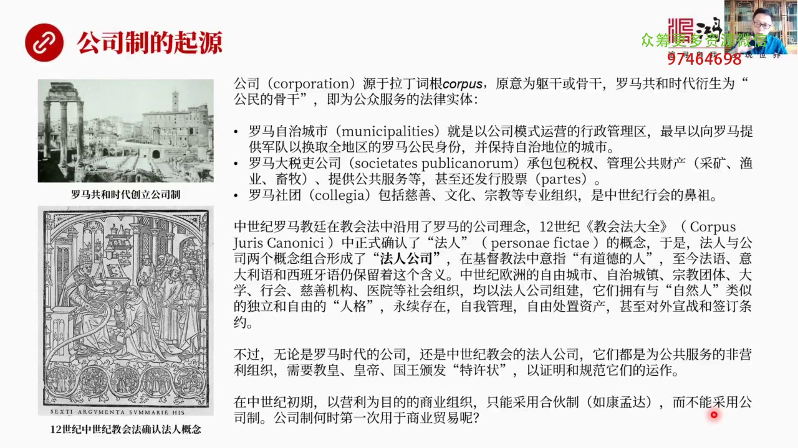

这是说到从经营角度从营利性的合伙制的角度这第一条线索第二条线索你要发展成股份制的公司这个公司是从哪里来的公司制的起源是从什么时候起来的这就涉及到公司Coporation我们今天所说的全界所说这个Cop...

<strong>All subtitles</strong>

> 这是说到从经营角度从营利性的合伙制的角度这第一条线索第二条线索你要发展成股份制的公司这个公司是从哪里来的公司制的起源是从什么时候起来的这就涉
> 及到公司Coporation我们今天所说的全界所说这个Coporation这个词这个公司它对道理从什么地方起源的它其实是源于拉丁此根Copp
> er's原意是什么原意就是人的去干或者古干在罗马共同时代它可以引身为什么呢公民中间的古干换句话说也就是为公共服务这个为公众来提供服务的一种法
> 律师体比如说罗马的自由式自治城式这个自治城式我们现在看在欧洲和美国大量的这种自治城式仍然是也用罗马当年的这种法律上的这样的一种观念的罗马自治
> 是怎么来的就是以公司模式来运营的行政管理区主要它是公司最早是以向罗马提供军队比如说罗马征服了一个地方然后我加入罗马我变成罗马公民我这个城校极
> 其加入罗马公民我还向你提供军队换取公民身份同时保持我这个城市的自治的权利罗马有大量这样城市全部都是以公司的刑事在运作当然甚至我们可以说整个罗
> 马共和国就是一家公司从这个国家的整个主体的方式运作的方式都是为公众服务的所以城市甚至政治政治体的主干部分都是公司除了这个之外还有很多公共服务
> 的商业性的公司比如说罗马大税的公司他主要是成包包税权比如说我征服一个地方色雷斯地区这个地区应该叫多少税但是政府又不想花这么多人力务力去收这个
> 税我就把征税权转包给某个大商人包税然后你向我买段比如说我今年本来准备计算征收100个金幣好你说打了七车你给我交七十剩下的我就不管了国家就不管
> 了你自己去征你征的一百你给我交了七十你就转三十除了这个之外还有管理公共财产权比如说采矿余业序幕等等还有提供各种各样的公共服务有些罗马这个税的
> 公司还发行自己的股票那么除了这个之外还有罗马各种社团比如说宗教比如说慈善文化书里面等等这都是专业组织这些罗马社团也是公司他们就是忠实计的西方
> 的行贿的比組所以我们说的忠实计的行贿那一定是公司那么忠实计罗马教庭他的教会法中间是也用了罗马的公司这种理念就是凡是为公众服务的这样的一种法律
> 实体罗马教教会所形成的教会法大拳大拳全部認可這是12世紀進行教會法大拳的匯編在中間還認可了正式確認了一個概念就叫法人這是羅馬共和時代還沒有了
> 一個新觀念這個法人就是跟自然人相類似的以公司形式存在的法人公司所以我們看到這兩概念一結合就變成了法人公司在基督教教法中間這是有道德的人其實我
> 們至今在今天的法宇義大利與和西班牙語中間只要說到這個詞仍然它的本義中包含了這個意思就是有道德的它是一種法人公司這樣的概念都是源於中世紀羅馬的
> 教會法大拳那麼除此之外中世紀的所有自由城市、自由城鎮宗教團體大學行會、慈善機構、醫院等等社會組織全部都是以法人公司的方式來組建的他們擁有和自
> 然人相類似的獨立和自由的人格是永遠存在的自我管理、自由處置、自己的資產甚至可以對外宣戰和簽訂條約比如說德國的這個德意志帝國的很多自由城市它經
> 常跟封建規都打仗雙方還簽訂戶不侵辦條約還有培章條約等等所以這種法人公司以法人公司所存在的自由市是可以有簽約和發動戰爭夠和這樣的權利的它就是一
> 個完整的有獨立的人格和自由的意志的這麼一種類似於自然人的這樣的法律實體那麼其實不管是羅馬時代這種公司還是中世紀的這種公司認可的這種法人公司他
> 們都是以為公眾服務為導向的就是他們都不是營利的非營利的如果說你要想做點有點商業方面的這種需求的或者是營利的或者非營利的只要你想是法人公司想以
> 這個形式存在都必須要叫皇皇帝或國王頒發特許狀特許狀就證明你是一個為公共利益服務的公司而且你的所有行為受到特許狀的供應範和管理假如有一天發現你
> 超出這個範圍之內你是要受處罰的所以必須要有特許狀有特許狀才能成為公司才能成為法人公司在中世紀初期我們看到營利為目的的商業組織只能採取合伙制比
> 如說抗蒙達你不能採取公司因為公司只能面對公共業務服務的公共利益服務的比如說教會比如說修道樂或者大學這些才能是公司你說我要做一筆買賣做一個生意
> 做一筆海外貿易你就不能用公司這種體制不能用公司這個區體區殼那麼公司到底是什麼時候開始第一次用於商業貿易呢我們再看下野

---

### Slide 11

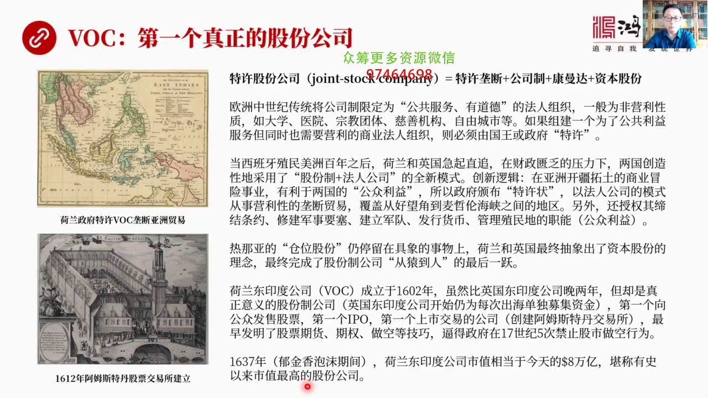

第一個真正的這種公司股份之公司是荷蘭的東印度公司我們看一下這個就是所謂的特許股份公司的概念特許股份公司包含幾個含義特許就是特許狀就是政府頒發的特許而且是帶有壟斷性質的特許狀還有它一定是採取公司制人還有...

<strong>All subtitles</strong>

> 第一個真正的這種公司股份之公司是荷蘭的東印度公司我們看一下這個就是所謂的特許股份公司的概念特許股份公司包含幾個含義特許就是特許狀就是政府頒發
> 的特許而且是帶有壟斷性質的特許狀還有它一定是採取公司制人還有它是吸收了抗蒙達中間的有限責任部分還有就是它採取了超向的股份制就是超向意義上不是
> 藏衛股份而是真正出資戰友一個等比例的股份的這種資本股份制要把所有這些概念的細節一邊點扣出來需要花大量時間因為我們現在想當然的接受了所有東西但
> 是你到推到歷史中間你會發現每個概念都是單獨有個進化路徑的在什麼情況之下中和病的密期這需要花很多時間自己去研究中世紀的傳統公司限定為為公眾服務
> 有道德的法人法人組織一般都是非營利性的這種性質比如說大學醫院宗教團體慈善機構自由城市等等如果組建一個為了公眾利益服務但同時也需要營利的商業法
> 人組織呢這就必須由國王和政府特許這種特許它有一個重要時代條件以前是不允許的出現了一個重要時代條件之後後來組建成為可能的什麼事件呢?就是西班牙
> 殖民美洲我們知道1492年西班牙這些殖民者開始發現美洲新大陸開始殖民搞了一百年之後英國和荷蘭開始分起殖追但是這兩國家當時已經落後了財政就比較
> 愧乏在殖民行這個世界中落後了財政就沒有什麼錢又不想貿這麼大風險財政就脫不起所以它要搞殖民怎麼辦只能創造性的採取股份制再加上法人公司這兩種模式
> 的合併它的創新邏輯是什麼?就是在亞洲開疆拓土要搞商業之命地要從事商業貿易活動這種行為是有利於公眾利益的不管你是英國還是荷蘭我們如果到亞洲去搞
> 了這個貿易之後會給我們帶來就業機會會給我們帶了很多收益所以對於兩國的公眾來說是有好處的注意你要把它變成公司前列條件就是有沒有被公眾服務有大家
> 認為有所以政府可以頒發特取狀然後以法人公司的形勢來從事盈利性的壟斷壟斷貿易就是因為要創建一個殖民地需要大量投入需要去興建各種各樣的這種比如說
> 堡壘軍事組織還有軍隊等等要花很多錢那麼如果不給你壟斷貿易的話你就賺不出足夠的資本來所以壟斷是覆蓋從好望角非洲裏面一直到賣這輪從南美之間這兩塊
> 中間的之間的地區所有貿易全部交給東印度公司來做當然主要指的是東南亞的相量貿易同時還授予這些這個公司一系列特權比如說你可以地結條約你打了印度或
> 者你打到印度你下可以跟當地的同志者簽訂條約可以修建軍事要塞建成寶可以建立軍隊所以東印度公司是有自己軍隊的還可以發行自己的貨幣還可以管理當地殖
> 民地的就是相當於你就是個地方政府了管理當地殖民地的各種各樣的政府智能你都要幹所以這就是為什麼要給他公司的地位因為他為公眾提供服務了那麼熱納亞
> 他搞出來這個倉位股份制還停留在一個非常具體的事務中就是傳倉到六都大這是個非常具體的事兒那麼河南和英國主要這兩個是熱漫國家熱漫國家最終按照這個
> 斯賓格勒的觀點是他們特別善於什麼呢抽象在熱漫畫中他的文化印象是什麼力量、無限和空間對所有東西都進行大量抽象他把熱納亞的倉位股份抽象成功了抽象
> 出了資本股份完成了從編導人的最後一月其實我們可以看到所有的西方的重大的突變實際上確實是起源於1600年前後而不是文藝復興不管是自然科學還是我
> 們看到商業還是各行各業吧大規模型抽象這都是熱漫文化這個完成了這樣一個文化上的跳躍其他的包括義大利文藝復興義大利包括我們說的佛羅倫薩、
> 米蘭還有這個威尼斯的熱納亞其實還是沒有真正做到抽象抽象思維和抽象的能力是我們看到當今世界或當代西方發展的最有力的武器或者說最有效的思維方式的
> 這樣一個典型特徵是抽象思維其他的各民族各文化都沒有做到這一點這是這些國家最後一月一月而起成了近500年以來吧它成了全世界全人類的領頭羊靠著什
> 麼靠著就是強大的抽象思維能力就是歸納而且是歸納成有型的法則歸納成有型的原則朝這個方向進行歸納沒有這個能力就創造不出科學理論來就創造不出任何理
> 論來其他的各種仍然僅僅聽都在就是論世具體的各別的進場的孤立的而不能進行框架不能進行大規模的平臺式的框架式的整合再思想上完成不了主要原因就是其
> 他各種的話缺乏抽象歸納成具體原則的這個類型的抽象思維能力這其實也是我反复強調東方要搞文藝復興必須要過這一關過不了抽象思維能力這一關就是歸納思
> 維這一關捕捉典型特徵這一關你就創造不出現金理論來那就沒有辦法從原到人東英東的公司其實比英國這個這個荷蘭東英的公司比英國這個東英的公司要成了要
> 完幾年完兩年雖然他比英國完但是他是真正意義的股份之公司英國東英的公司一開始頭幾十年還經常是這一圈我去做一筆生意我單獨進行一次目擊資金實際上還
> 是就是論世還是一個熱納亞式的為了一個具體的事件為了一個具體的貿易的形成來進行融資這根本還不是還沒有抽象到那個程度荷蘭是一開始就把倉位股份合一
> 次性的這種這個經商的冒險行為抽象成了一個結構抽象成了一個可持續性的結構從這個一來講荷蘭東英的公司是真正的股份之公司而且它也是第一個像公眾發射
> 股票的也是第一個進行IPO的也是第一個上市交易的公司包括整個阿姆斯的單這個交易所就是荷蘭東英的公司創建的還有荷蘭東英的公司這幫人最早發明的股
> 票7貨包括7權 作空這都是在16幾年人家就玩出來了投50年股票市場出現了7貨7權和作空荷蘭政府在16幾年就是70幾五次禁止市場作空行為這就說
> 明荷蘭人搞這套東西的確是全開天下之風氣之鮮沒有人搞出過這種股票交易所沒有人發明過股票7貨和7權作空我們現在在研究7權研究7貨研究作空人家荷蘭
> 人早在16幾年400年前就在玩這個東西所以他們是真正的完成了一次偉大革命的商業上偉大革命的這樣的一個國家這個東映的公司也確實是第一個真正的股
> 份之公司這都比英國還要早1637年就是在預經相泡沫17吧荷蘭東映的公司的市值大概折算成相當於今年8萬億美元超原人超過現在任何上市公司堪誠由事
> 以來市值最高的股份之公司這就是我們看到1612年阿姆斯的單股票交易所建立被誰建立的就是被荷蘭東映的公司建立的

---

### Slide 12

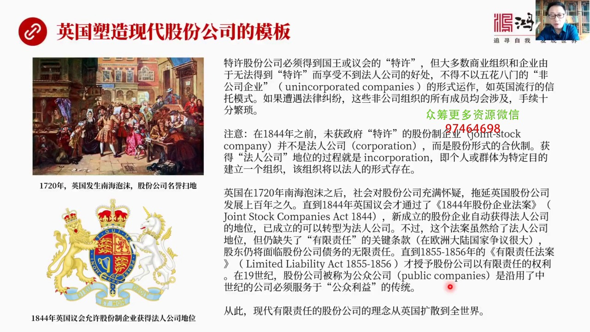

我們再往下看當然雖然荷蘭搞出了這個東西最早但是後來英國是把這個這套模式電競成了所有現代股份之公司的標準模板是英國完成的為什麼呢這跟英國後來取代了荷蘭的海上貿易霸主地位包括荷蘭最後在大國競爭中拜給了英國...

<strong>All subtitles</strong>

> 我們再往下看當然雖然荷蘭搞出了這個東西最早但是後來英國是把這個這套模式電競成了所有現代股份之公司的標準模板是英國完成的為什麼呢這跟英國後來取
> 代了荷蘭的海上貿易霸主地位包括荷蘭最後在大國競爭中拜給了英國是有直接關係的特許股份公司必須得到國王和議會的特許才能夠成為一個法人質的公司但是
> 大多數17世紀大多數企業包括18世紀19世紀大多數商業公司商業組織包括企業不能隨便叫公司因為公司是特質的在當時是特質的能拿到政府授權的特取的
> 或者是非營利的如果你是商業型的你要賺錢的都得不到這種特許你也都不是法人公司就是既不能叫公司也沒有法人的概念而這些人怎麼辦呢我還要做生意啊那怎
> 麼辦你只能組織成五花八門的非公司企業來進行運作比如說在英國從17幾年到18幾幾年最流行的是信托大量的信托模式信托模式呢很複雜它因為信托人可能
> 會射到幾身人上百人如果遭遇法律糾紛如果你沒有法人的概念的話那就相當於這種非公司型的商業組織如果射到一個人告你們整個這一群人的話那你幾百個人都
> 會面臨官司這打起官司來手續很複雜你不像跟一個法人公司這是很簡單的一件事情這使得整個這個經濟運營這套市場的組織體系非常複雜成本也相當高在這裡我
> 們需要注意一下在1844年之前沒有獲得政府特許的股份制企業比如說叫John Stark Company這個 Company就不能夠翻譯成公司
> 它只能叫企業或者叫一種商業組織雖然是一種合股形式但仍然不能叫公司這種企業並不是法人公司法人公司有個專門的名詞叫Copperation這叫法人
> 加公司法人制公司而這些非法人公司這些股份制只能叫股份制的合夥制以股份型的體驗出來合夥制那麼什麼叫做就是什麼叫做法人什麼叫做股份制公司它就必須
> 要首先或者法人的地位獲得法人公司這個地位的過程在英文中被稱之為英Copperation所以我們現在很多人經常搞不清楚Copperation和
> 英Copperation兩個都是名詞有什麼區別嗎有Copperation指的是法人公司英Copperation是指著你怎麼獲得法人公司這樣的
> 地位這個過程所以我們經常會看到這個詞有說作為動詞有說作為什麼什麼詞是因為它指的是一個過程它指的是個人或者一群人為了特定目的組建一個組織該組織
> 最後以法人的形式存在著所以這個是我們只有你把它的歷史搞清楚你才會對這種詞和這種概念才會特別敏感英國其實是在一開始也是最早的第一批搞股份制企業
> 或者叫特許公司的英國荷蘭但是英國後來出事了這是一七二零年南海南海泡沫破裂南海泡沫南海就是一家特許制的這種股份公司玩砸了玩砸之後就導致股份制公
> 司它的名譽受到嚴重的懷疑英國人不相信就覺得這幫人就是偷錢耍滑就根本不是正經的生意人所以對股份制公司這個模式產生了巨大的懷疑它拖延了整個英國股
> 份制公司發展上百年之久一直到1844年英國議會在通過了1840年股份企業的法案這就是1844年這個法案是非常重要這是話實在的這個法案規定什麼
> 所有新成立的股份制企業以前叫股份制的合夥現在你們只要組成了股份制的這種合夥你會自動你可以自動去獲得法人公司的地位只要交五英棒完成第一到手續之
> 後以後再交五英棒你就能夠被incorporated或者叫獲得法人公司的地位那麼已經成立的這些所有的各種各樣商業組織給你們一個很好的條件你們可
> 以選擇轉行為法人公司這是1844年一個非常重要的法案以前所有成立的商業組織全都是合夥制除非政府特別授權的特許的公司之外剩下全是合夥合夥就是有
> 很多不方便的地方1844年之後所有新成立的這些公司都可以自動成為法人公司如果你是股份合夥制都可以成為法人公司很簡單但是這個法案雖然給了法人地
> 位法人公司的地位但是仍然不給有限責任的這個關鍵的好處因為法人公司就像我剛剛所說的這個荷蘭東印度公司它是有有限責任這個防護條款的如果你沒有這個
> 防護條款市場上買了比如說某家公司的股票它也是一家公司是法人地位但是如果說這家公司規本了現出了巨大的賠償那麼我這投資人仍然有可能被超加被法院凍
> 結我的所有財富這個東西就太嚴重了為什麼這個有限責任條款不給呢就是因為在歐洲大陸國家很多國家爭議很大所以英國展示沒有推沒有給這個有限責任的條款
> 誰想看如果你現在比如說你買毛牌的股份買了毛牌股份之後如果毛牌抽了什麼巨大的籌銀欠了很多債你最後你們家產被超了你的車和房子被被債權收走了你這個
> 誰還買股票或者你買了海航這樣的公司那這個可能就去更大了這條什麼時候被加進來的就是有限責任什麼時候加進來的是1855年的1866年有限責任法案
> 才正式授予了股份公司一有限責任的權利在19世紀股份公司被普遍成為公眾公司我們也是所說公眾公司以為是上世公司的意思其實不是公眾公司還是沿用了中
> 世紀和羅馬時代的傳統公眾公司一位著你必須為公眾立服務所以你叫公眾公司二世紀之後這個概念才發生了變化這都是我需要我們把很多名詞和它的歷史發展的
> 邏輯搞清楚你才能夠理解為什麼現在叫公眾公司從此以後現代有限責任的這種股份公司的理念才從英國擴張到全世界

---

### Slide 13

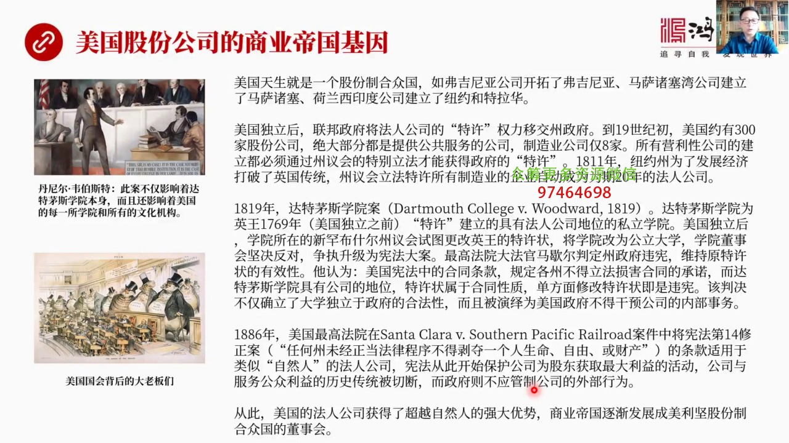

我們再看美國美國的股份公司怎麼發展了美國其實天生就是一個股份制的共和國為什麼因為美國的主要殖民力比如說福金釀就是由福金釀公司開拓的這都是合股公司馬薩珠塞他是由馬薩珠塞彎公司建立的還有荷蘭新的公司建立的...

<strong>All subtitles</strong>

> 我們再看美國美國的股份公司怎麼發展了美國其實天生就是一個股份制的共和國為什麼因為美國的主要殖民力比如說福金釀就是由福金釀公司開拓的這都是合股
> 公司馬薩珠塞他是由馬薩珠塞彎公司建立的還有荷蘭新的公司建立的紐約和他拉華兩個州美國很多殖民力都是股份制公司所創建的所以這個國家天生的基因就是
> 以公司制運作的一個合動國簡單說就是一個股份制共和國為什麼美國有商業基因因為他殖民力就是這麼建立的整個國家就是這麼聯合在一起的所以他從根本上來
> 說有一種大股東股東這個董事會控制一切的強烈的這種一川基因我們可以稱為是商業帝國的文化基因美國獨立之後我們可以看到聯邦政府把法人公司誰能夠成為
> 法人公司的特許權聯邦轉移給了周政府因為周政府是真正擁有主權的周政府你也決定給誰特權讓他成為法人制的公司到19世紀初的時候美國大概有三百多家股
> 份制的公司絕大部分公司都是提供公共服務的比如說提供水提供什麼這個城市公共管理的等等這還是研究了中世紀和羅馬時代的這種概念就是只有提供公共服務
> 的公司提供公共服務的這種法律實體才能被稱為公司製造業的公司一共只有八家所有盈利性的公司所有盈利性的公司的建立都必須要通過周一會要特別搞一個立
> 法會議通過一個特別的法案才能夠獲得政府給你的授權你才能變成一個法人公司那麼到了一八一年第一個突破這個傳統的是紐約州紐約州為了發展經濟打破了英
> 國傳統主要英國是在一八四四年才立法改變這個傳統的歐洲這個紐約州是在一八一年周一會就立法特取所有製造業的公司製造業的企業你一成立的時候只要你是
> 合股制的你就會自動被授於法人公司的地位為期二十年我們以前在我在後面這種講到美國的第一銀行第二銀行的時候為什麼授權他二十年經營七主要就是因為你
> 這個中央銀行第一銀行是以一個法人公司的形式存在而法人公司必須要特別的政府授權或者叫特取而且要給實現給你二十年時間大二十年之後不蓄這公司就結體
> 了就沒了在美國內上還有一個重要的公司法的一個大案就是一八一九年達特毛斯學院案達特毛斯學院案主要是指的是達特毛斯學院就像中世紀所有學院一樣都是
> 公司它不是我們現在說的大學什麼什麼什麼其實大學也好宗教教會也好還是醫院也好全是中世紀的公司制它這個公司什麼時候授權建立的是英國國王在1769
> 年也就是美國獨立戰爭爆發之前英國國王授權建特取建立的具有公司法人地具有這個法人公司地位的私立學院它就是一個公司美國獨立以後這個學院所在的心悍
> 波士爾州這個州議會就試圖說我們已經獨立了跟英國沒關係了他們就試圖要更改英國國王給的這個特取狀把這個學院從一個私立的學院轉變成一個公立的大學但
> 是學院的董事會堅決反對注意啊這個學院董事會為什麼要有董事會因為學院大學它是源於公司制大家如果仔細去研究你甚至發現倫敦這個城市也是源於公司制所
> 以學院是有董事會的學院董事會堅決反對這個這就跟州議會打起官司來了最後從州的這個法院一直打到憲法打到最高法院為什麼這種東西可以升級到憲法呢憲法
> 要到最高法院解決問題就是在州之內解決不了的或者跨州的行為或者是睡到一個更普遍現象的一個問題這就可以打到最高法院當然這個州議會這個學校董事會這
> 邊就請了他們的校友微博斯特丹尼爾微博斯特這個人就很厲害他是個非常了不起的一個法學家也是一個著名的政治家他在最高法院說這個做這個這個辯論的時候
> 就提到他是這個法案這個案件不僅會影響著達特毛斯學院本身而且會影響著美國未來的美所學校和所有文化機構的他們的命運然後最後我們可以看到大法官馬席
> 爾這個判例非常著名他判定州政府偉縣偉反了憲法為什麼他認為就說這個美國現法中其實並沒有關於公司地位的這樣的條款但是美國現法中有一條是關於合同的
> 條款他其實大法官馬席爾把關於合同的條款隱身到了這個判決中間來這個合同條款說什麼現法中間說各州不得立法損害合同的承諾我們知道合同是需要他是一個
> 商業合同需要這個有法人地位的公司來簽署而達特毛斯馬席爾認為具有這公司的地位特許狀英國國王給他的特許狀屬於合同性質所以單方面修改特許狀那就是州
> 政府您偉縣因為你偉反了合同法合同規定你只要是公司性質的法人公司性質簽署獨計就不能變州政府也不能變所以這句話這個判決後來被隱身成一個著名的一個
> 觀點就是美國爆發的獨立戰爭哪怕是一場革命或者戰爭都不能改變私有財產權的合法性和私有合同的神聖性就是從這個案例中引進出來了其實在這個過程中馬席
> 爾實際上在創造現法美國最高法院的功能非常強大因為現法只有這麼多條款不可能涵蓋所有東西怎麼解釋現法其實解釋現法的過程就是創造新見法條款的過程你
> 比如說沒有公司法沒有公司法的情況讓馬席爾把合同條款隱身之後實際上創造了公司的地位深圳不可侵犯美國政府不允許改變公司內部的事務你不能干預公司內
> 部事務所以這個判決不僅確定了美國大學獨立於政府的合法性而且被演繹以為美國政府不能夠干預公司內部事務的重要的先例那就形成了一個全新的傳統其實它
> 在創造憲法當然更有利的更強的一個法案是在1886年美國最高法院在這個Santa Clauser這個案件中把憲法第14修正案隱身到了公司憲法第
> 14修正案主要是南北戰爭爆發爆發之前講的是要給黑人人權的這樣一個法案一個修正案中間有一條中間有一條就是任何周未經政黨法律程序不得剝奪一個人的
> 生命自由或財產這主要是面對黑奴所制定的一個條款那麼這個條款被隱身被最高法院隱身到了是由於公司因為什麼呢因為公司是法人而法人可以類比於自然人如
> 果任何周未經法律程序不得剝奪一個人的生命自由或財產那麼延伸出來就是任何周未經法律政黨不得剝奪一個公司的所有的自由的權力所以這樣以來憲法又變性
> 質了憲法開始從此保護公司為股東獲得最大利益的所有的活動就開始保護這事了以前憲法從來沒有說要保護這個公司創造最大效率給股東從來不會明確規定這條
> 這個憲法這麼一解釋就變成了憲法從此開始保護公司的利益公司利益是什麼為股東創造最大效益這就完全改變了憲法的性質這樣就使得所有的公司從歷史傳統來
> 來看它應該是最高的歷史服務於公眾利益現在變成了我服務於股東利益它就跟歷史的傳統完全被切斷了所以這就被隱身成政府不應該管制公司的外部行為這兩個
> 法案一個是1819年大盪毛司案隱身隱身成為美國政府不得干預公司內部事務1886年這個判決就使得美國政府不得干預公司的外部行為這變成商業帝國了
> 嗎因為公司想有大量的免稅和各種優惠條件比自然人好得多你的憲法這麼一保護公司法人而它又具有強大的優勢這就是公司法人的競爭的優勢會遠遠超過自然人
> 發展下去一百年兩百年下來之後整個這個國家就不再是由公民組成的了就變成了強大的法人公司或者叫強大商業帝國控制整個這個國家的局面這就是為什麼美國
> 會發展成現在這個狀態每一間合眾國它實際上是每一間股份制的合眾國商業帝國就成了這個合眾國的董事會而董事會決定一切國家的大政方針那還有你普通的公
> 眾或公民的活路嗎因為這些董事會說的算這就是為什麼美國它走在了一個包括我們現在看到民主黨上臺國國黨上臺實際上誰上臺也改變不了這個發展的路徑這是
> 由美國這裏兩個重要的法案憲法解釋所造成的一個後果公司權力變得越來越大遠遠超越了普通公民它的地位這就是這個國家已經變成了商業帝國支配下的國家

---

### Slide 14

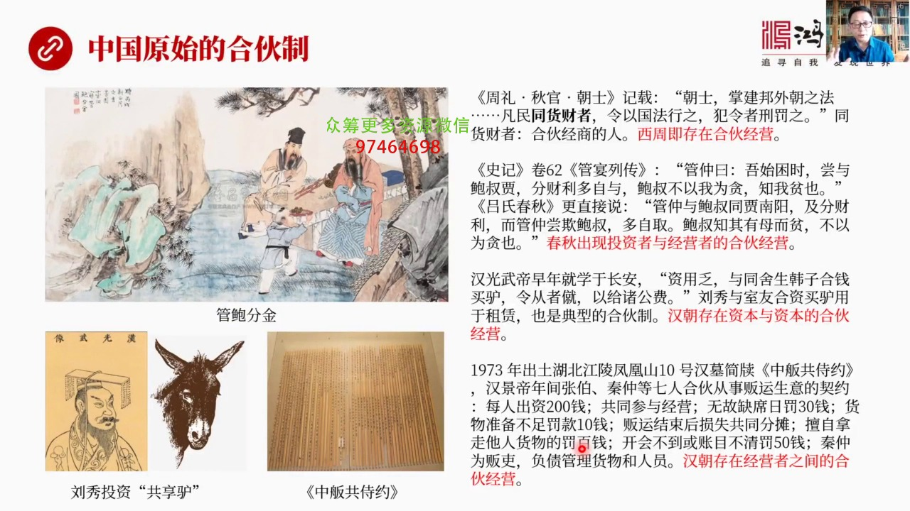

我們再看下一剛才我們說的是西方的股份制包括它的合夥制還有它的法人是怎麼進化我們再看中國中國其實跟西方一樣我們一開始也也是有合夥制的中國原始合夥制最早是什麼時候記載的周理中間就記載了比如說朝市掌管這個朝...

<strong>All subtitles</strong>

> 我們再看下一剛才我們說的是西方的股份制包括它的合夥制還有它的法人是怎麼進化我們再看中國中國其實跟西方一樣我們一開始也也是有合夥制的中國原始合
> 夥制最早是什麼時候記載的周理中間就記載了比如說朝市掌管這個朝廷內部的各種樣的立法凡民同貨財者就是凡事老百姓中同貨財就是把貨合財搞得一起來經營
> 的這叫合夥經營那麼另一國法行之犯令者行法之也就是說西州就存在著合夥的商人合夥經營的這種商業群體如果他們犯了法那就跟普通的人犯法是一樣必須要用
> 國法來執行這是最早在文件中出現的同貨財者那就是合夥經商的人除此之外在實際中比如說這個最主民的管報分金這個故事管重又年受家裡很貧困然後他跟這個
> 報書一塊兒做生意在南洋然後在分立論的時候經常自己多拿一些報書不認為管重很貪婪因為知道他們家有老母親所以很貧困這個報書是就是願意讓他多拿一些律
> 師春秋記錄了更明確一些就是管重和報書同古南洋意在南洋做生意分財就是分立論的時候我們知道這個抗共拿分立是大家是有一個標準的一個分立方法分立的股
> 份實際中沒有記載這個報書和管重是怎麼分立的但是談到了管書長期 管重長期報書多自取也就是他多拿了一些報書知道他有母親而且很貧困也就不認為他這個
> 人很貪所以我們可以看到春秋的時候就已經出現了投資者和經營者合作的經營因為報書很有錢他們家是王宮貴重出身的管重他們家很窮所以報書相當於他是一個
> 出資者或者叫投資人管重是經營者他們倆聯合在一起做生意除了這個之外我們在很多記載中你看到漢武帝漢光武帝這個流秀流秀當年在長安讀書家裡也沒什麼錢
> 家裡很早就壞了沒有什麼太多的所謂的太多的儲蓄所以他跟同事的好友是有一塊合資買鋁然後出租這個鋁發展共享鋁的生意就做共享鋁的模式來賺錢貼補上學的
> 費用這也是典型的合夥制說明在漢朝的時候已經存在資本和資本的合夥經營了也就是流秀和他的事有一塊極資買鋁然後搞共享鋁的生意也行還有就是我們看到1
> 973年初土的湖北江林鳳凰山漢幕中間的簡讀中間有一條叫中版共識約當然也有人說這應該是販賣的飯也有人說傳版了翻版這個版講的就是漢警立中間這個年
> 間有七個人一塊合夥做販運生意寫了一個企業在這個企業中間談到了每個人出租多少共同參與精英管理如果無故缺席的每天要罰三十錢貨物準備不足都要罰款多
> 少販運結束之後損失要帶著共同分貪善自拿走貪人財務的要罰多少然後招集開會不來的或者賬務來的時候賬務不清的發多少然後誰誰作為領導了負債管理管理負
> 債和管理貨物人員這說明在漢朝就存在著精英者之間的合作精英就是一些手工業者因為每個人自己去找別人去搞運輸很貴我們還不如七八個手工業者我們自己聯
> 合在一起然後我們出錢然後我們搞販運這個販運為我們這七個手工業者提供公共服務所以這個叫手工業者所謂精英者這間他們不是有很多的資本而是我們大家都要出力我們搞聯合精英這是中國

---

### Slide 15

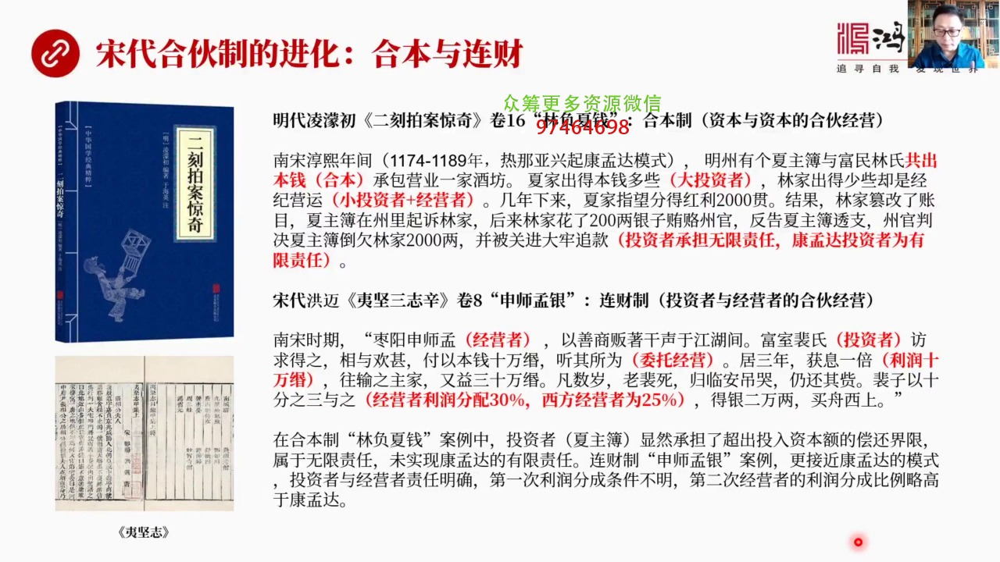

這個史詩中所記載的這樣的先例當然這種先例一直經過兩近南美朝然後隨堂一直在發展但是沒有什麼本質性的突破到了送貸開始出現了一些明顯的進化或者叫進化中的突變這就是出現了合本和聯財制合本這個概念大家萬文思義萬...

<strong>All subtitles</strong>

> 這個史詩中所記載的這樣的先例當然這種先例一直經過兩近南美朝然後隨堂一直在發展但是沒有什麼本質性的突破到了送貸開始出現了一些明顯的進化或者叫進
> 化中的突變這就是出現了合本和聯財制合本這個概念大家萬文思義萬文生意就是聯合我們的資本聯財就是把我們的利潤進行聯合在一起然後進行利潤分成實際上
> 我們來看二客拍案驚奇這個書很多同學可能看過但是不太注意中間的一些案例其實這個案例是商演例比如說中間有一個故事叫林副假前這就是一種典型的合本制
> 就是資本和資本的聯合經營它講的是難送難送年間正好也是熱鬧樣它的抗盟打模式興起了那個時候明週有個下主步合有一個很有錢的所以臨勢共同出資也叫合本
> 經營承包一家酒房這個酒房當時送朝要搞任何的合酒啊這些生意你必須要向官家去買去買一個執照所以這兩家這個合資去買了一個執照在經營酒房這個下主步他
> 們家出了本錢多一些我們稱之為是大投資者林家出錢少一些是小投資者但是他同時負責經營搞了幾年合夥之下來這個下家就大概算了覺得扣出所有的他們大概能
> 夠分得紅利兩千塊一貫大概相當於一兩白銀也就是兩千兩銀子這是能夠分得到的結果呢沒想到經營者林家篡改了賬本下主步就不幹了他就在州裡就開始起訴林家
> 後來林家花了二百兩銀子繪路了周官打官司的時候下主步輸了然後反告下主步投資結果周官判下主步道歉林家兩千兩並被關進大牢追鎖這個千款從這個案例中我
> 們可以看到下主步他作為投資者大投資者他承擔是無限責任而扣問答投資者是有限責任為什麼是無限責任你被關起來了也就是說你本來投入資金然後你作為沉默
> 投資者跟你沒關係了你怎麼能吃官司呢怎麼能為關進大牢呢當然不行所以這就是我們的這個當時這個合本制和扣問答這間的一種明顯差扣問答他肯定是有限責任
> 的還有呢就是紅麥寫的這個一之間一堅制三券中間有一券中間講了一個故事神是孟銀神是孟是一個他這故事講的是連殘制就是投資者和經營者之間的合夥經營這
> 個一堅制是講的大量的這種古代的這種各種各樣的故事非常浩凡他講的這個故事講的就是難送時期這個早養有一個神是孟很有名在節目上做生意大家都比較認所
> 以神是孟是一個相當一個經營者有一個富豪培飾他家裡很有錢叫投資者然後聽說神是孟很會賺錢就跟他交談聊得還不錯然後就給了他10萬名就10萬罐大概相
> 當於10萬兩名字聽其所為這個聽其所為就非常像阿拉伯的委託經營就是我把錢給你了你怎麼做我不管虧損了呢我這個投資人承擔所有的這種虧損然後過了三年
> 這個神是孟賺了這個賺了很多錢賺了一倍也就是你給我10萬罐本錢我給你賺出了10萬罐的利潤然後他就把給利潤送到主人家當然是本金家利潤一塊送到主人
> 家然後我們要做一個侵障然後這個主人家這個培飾一看哇這麼能賺錢很好很不錯分完之後就說那行再給你30萬罐你再去做然後又過了幾年這個培家這個富豪死
> 了然後回到了航州這個生生孟就跑到航州然後然後培家這個第二次又給了他大概30%33%的這個經營利潤經營者利潤大概是30%我們知道西方的這個抗孟
> 達大概是15%所以比較一下我們基本上可以看到這個連財制了分成比例還有他這個經營的方式非常像抗孟達何本質呢這個顯然不太像抗孟達因為它最主要特點
> 是有限責任而這個林副下錢這個案例中是無限責任連財制這個生生孟贏這個案例中間比較接近抗孟達的模式投資者和經營者之間責任非常明確出錢了就是出錢直
> 管出錢不管經營經營者負責全全部的經營活動當然第一次分到這個分成比例不太清楚因為門中沒有交代第二次說著很明白30%

---

### Slide 16

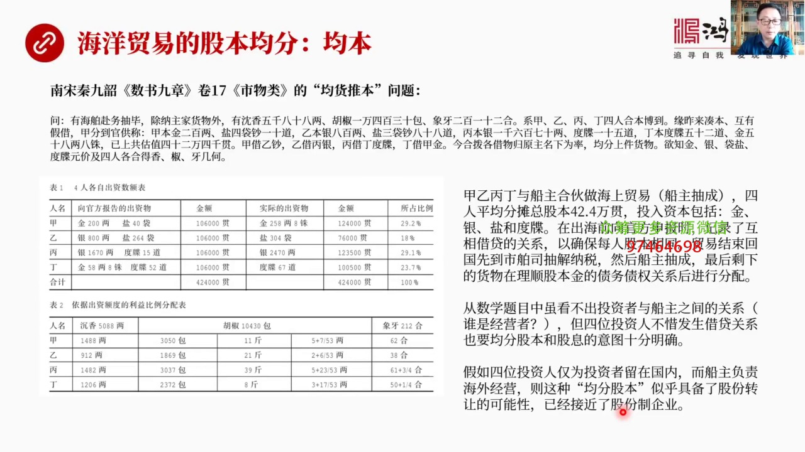

略高於抗孟達這是送貸的何本和連財再看下一當然送貸和原貸的海洋貿易發展的是比較比較繁榮的應該說中國歷代最繁榮的海洋貿易就發生在送源那麼送源出現了一種新的核古制度實際上叫軍本這個難送請久勢奧寫的數學9張我...

<strong>All subtitles</strong>

> 略高於抗孟達這是送貸的何本和連財再看下一當然送貸和原貸的海洋貿易發展的是比較比較繁榮的應該說中國歷代最繁榮的海洋貿易就發生在送源那麼送源出現
> 了一種新的核古制度實際上叫軍本這個難送請久勢奧寫的數學9張我們在中小學的時候都知道這個書但是很多人可能沒有注意到中間的一些細節比如說中間也到
> 提供軍貨推本軍貨推本我們根據做貿易剩下的貨我們到推當年入股的本錢每個人入股的多少所謂我把它剪成為軍本軍本就是我們到推回來我們當年入股的本金平
> 均下來每個人出了多少就是比如說一百兩百一我們如果四個人每人出了252這就是我們要算的要到這算那麼這種它這道題比較符答大家有興趣可以去看一下就
> 是只在加一餅林四個人和傳主一塊聯合做海上生意傳主是要抽成的那麼四個人平坦的這個總顧本大概是42.4萬塊這邊是四個人加一餅林它的出資額然後最後
> 他們投入到南海金貿易他們首先投入的資金包括有金有銀有銀有銀還有杜迪杜迪南宋時期這種特殊的類似於貨幣的就像出家人要買個買水平正就是我要花錢買一
> 個杜迪就是我要成為出家人了當然這局意味著你可以免稅我們可以簡單列成免稅平正然後這也算是一種錢因為它有交易價值在出外錢這些人就到了官府世博斯進
> 行申報而且記錄了四個人之間的借貸關係因為很多有人出現少但是要保證每個人入股是平均的大概每人十萬股多一點那麼我們之間有些人錢多的就借一些錢給錢
> 少的中間還形成了相互的借貸關係都要在官方報備確保每個人的股本相同這叫軍本就是股本平均貿易協助之後首先到世博斯抽捷納稅抽捷就是你比如說新我抽二
> 十個他就把食物向牙給拿走了還剩八十個向牙這叫抽抽捷相同一種納稅然後政府拿去賣然後傳主還有抽層傳主還要比說抽層百分二十剩下的剩下的比如香料還有
> 各種樣的珍珠麻島等等香料還有這個向牙我們這些人根據當時有人出現多有人出現少我們有債務債權關係理順債務債權關係之後到底應該分多少這些具體的貨物
> 這是要算的這道題還是有點符的但是是能算出來的如果大家有興趣的話可以去解解這個方程式從這道數學題目中間雖然我們看不出投資人和傳主之間的關係到底
> 傳主是不是經營者還是投資人跑到海外去經營我們沒有看出來因為這是一道題但這四個投資人不惜發生借貸關係也一定要保證股本平均和最後股息有效這個合理
> 分配成筆的分配這個意圖是非常明顯的也就是說大家入股的時候股本要一樣分配股息的時候也要按照股本金來計算股本金我媽的藝人比如說都是十萬萬一股然後
> 我們先分這些貨分清楚之後再根據我建議以前還是你借我錢然後我再把這些貨只要再能錢再轉移給你就要把這個分成比例要搞清楚但是他入股的時候平均股本是
> 非常清楚的假如這四位投資人經濟作為沉默投資者留在國內而傳主負責海外經營那麼藝人出十萬萬這個均分股本平均的股本其實就具備了股份轉賬的可能性這就
> 已經像合股企業了就像股份置企業了所以從這個角度來說難送的時候中國就已經出現了明確的股本的所謂

---

### Slide 17

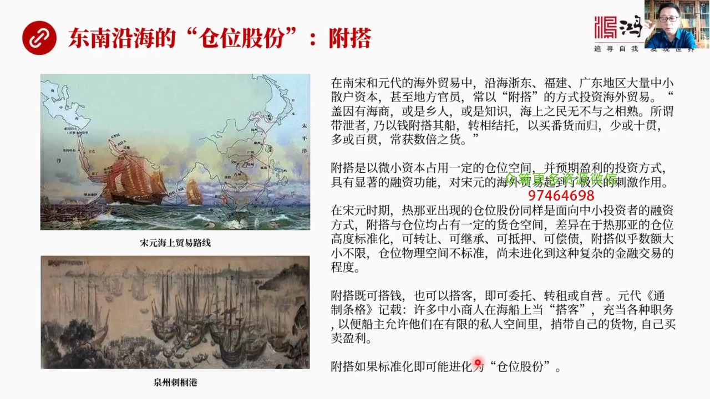

平均股本的這樣的一種近次於股份置的這樣的企業我們再看下一其實當時中國還出現了類似於熱鬧亞參會股份的這樣的一種模式也是送給海上貿易搞出來了叫負搭因為宋朝做了海上貿易難送是以全州作為主要出發點像東南亞還有...

<strong>All subtitles</strong>

> 平均股本的這樣的一種近次於股份置的這樣的企業我們再看下一其實當時中國還出現了類似於熱鬧亞參會股份的這樣的一種模式也是送給海上貿易搞出來了叫負
> 搭因為宋朝做了海上貿易難送是以全州作為主要出發點像東南亞還有像非洲包括中東地區做貿易那麼當時在海外貿易中間沿海的比如說哲江還有福建廣東地區有
> 很多中小的散戶資本大家都想參與海上貿易包括地方官員他們怎麼辦他們藏以負搭的方式投資海外貿易主要比如說他們因為認識海上或者一些鄉這個鄉親然後這
> 些人就脫這些海上進行就是我給你投個時關或者一百萬搭著你這個船然後一塊做到生意然後這種投資方式就叫負搭往往能夠獲得幾倍的貨物他買來貨然後再賣就
> 可以獲得幾倍的這種利潤這種負搭顯而言是一種微小的資本用一定的傳倉的倉位空間並且通過預期營利的並且它可以預期一定我會賺錢的投資方式這當然就具有
> 著類似於熱納亞這種融資功能對宋元的海外貿易其實起到了非常重大的刺激作用那麼熱納亞出現的倉位股份它也是同樣的類型負搭和倉位它都是占有一定的獲倉
> 的空間只不過差距在於什麼呢倉位的倉位是高度標準化的每個倉位是可以買賣轉讓繼承底壓還可以支付債務負搭似乎這個數量大小不限你可以出個時關也可以出
> 個100萬所以我認為它倉位所對應的物理空間可能不是標準化所以它還沒有進化出一種像熱納亞那種自由負搭的自由交易和負搭的轉讓這種關係當然這個負搭
> 既可以搭錢還可以搭客我拿就是我出一筆錢我同時人也可以坐上去坐到這個船上去這個叫搭客那麼搭客呢它是一個什麼樣根據原來這個規矩它可以作為船上的船
> 員或者叫水手充當各種植物然後作為補償船主允許它在它住的這個很小的個人空間裡頭可以有一點點有一點空間是給它放自己的貨了然後它可以在海外自己買自
> 己的貨回來做自己賣可以賺一點這個買賣的利潤這叫搭客其實負搭不管是搭錢還是搭客我們都可以看到這就是一種倉位股份的一種概念只不過這個負搭沒有標準化不過標準化之後也是有可能進化

---

### Slide 18

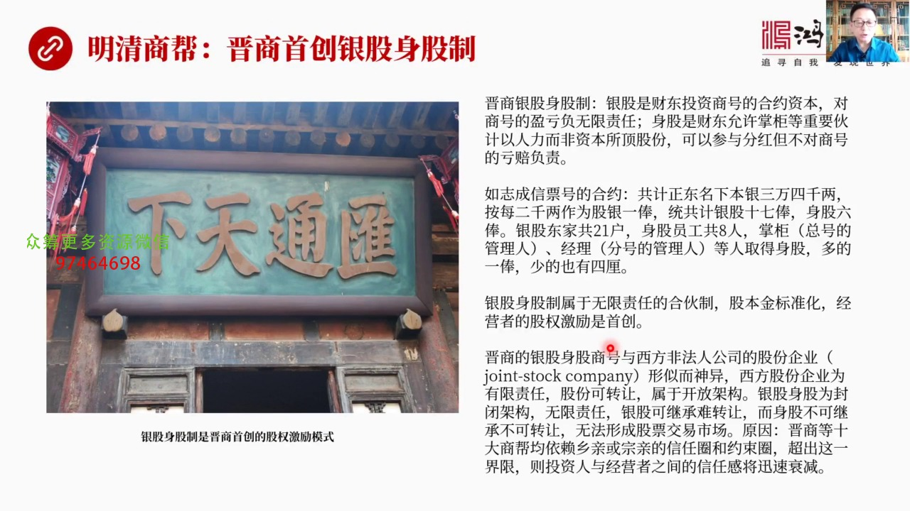

進化成倉位股份這個熱鬧壓這個概念好我們再看下一頁當然這個送源之後到了明星中國星期的師大上邦海外貿易進一步發展那麼禁傷手創了一種新的這種就是銀股和深股制禁傷了這個銀股深股制主要是銀股就是出錢的投資人他所...

<strong>All subtitles</strong>

> 進化成倉位股份這個熱鬧壓這個概念好我們再看下一頁當然這個送源之後到了明星中國星期的師大上邦海外貿易進一步發展那麼禁傷手創了一種新的這種就是銀
> 股和深股制禁傷了這個銀股深股制主要是銀股就是出錢的投資人他所對票號出了這個投資的資本那麼投資人是要對票號的銀規要付無限責任的就是票號嘛他是個
> 無限責任制的這樣的一個合夥制深股就是說這些長貴的或者重要的火技他以自己的勞動力而不是出錢來獲得了一種股份他可以分紅但對於這個票號的銀規他是不
> 負責任的所以我們可以看到禁傷的銀股就相當於投資人投進去的錢虧了那全部由銀股的股東來承擔而禁影者長貴的對於股本金的虧損他是不負責任的那麼一般的
> 一個票號比如說這城信的票號的合約我們可以看到他的股東投銀股的一共投入本金是三萬四千兩然後大概兩千兩百銀是一股或者叫股銀是一奉一共大概是銀股是
> 十七股深股大概是六股銀股東家一共有二十一個人二十一戶出三萬四千兩每人有的是兩千兩億股有的是半股等等不一樣或者幾離深股員工一共是八個人從長貴的
> 到經理然後不少人獲得了這種深股有的是多的是一股少得也有四離四離就是0.4股那麼銀股的深股制他首先是屬於一種無限責任制無限責任合夥制他的股本金
> 也是標準化了一股價值兩千兩這就是標準化的股本金經營者在中間獲得股權這是股權激力的一種手創這個在我查到了資料中比西方還要早銀股深股這個深股的股
> 權激力中國開創是很早的經營商搞出來的屬於原創式的這種創新經營商商號和西方非法人公司的股份之企業看起來是比較像但實際上就是刑事而神意西方股份之
> 企業它是一種有限責任當然我們知道經營商這個是無限責任它的股份是可以轉讓的西方的股份是可以轉讓的它是一種開放架構但銀股深股它是一種封閉結結構它
> 是無限責任封閉結構這個銀股它可以繼承但是沒法轉讓比如說我禁傷了股權我不可能轉讓給灰傷這是打破圈子了因為我們需要一種信任感我東家和經營者這間必
> 須保持強烈的強烈的信任感你要把禁傷了股權你要轉給灰傷那灰傷跟我這個經理人之間就不是一火人或者不是鄉親也不是有血親我平常信任他對吧這就會出問題
> 而深股不可繼承也不能轉讓這個火技掌柜的死了之後你比如說可以分在一兩個帳期三四個帳期面繼續分帳但是再往後就沒了所以深股和銀股都不可能形成交易這
> 就不可能出現股票交易市場為什麼禁傷和西方的股份結會出現這種差異主要就是禁傷還有所有中國的傷亡嘛主要依賴鄉親和中親的信任圈有信任才會有約束就是
> 我們都有共同的比如說鄉親或者是一個宗族的人我們都有人做重裁比如說我們如果是一個宗族人我們有組長有宗詞來給我們評理有這種約束也就會產生相應的信
> 任但是一旦超過了這個界限跨了鄉親跨了血親之後立刻投資任和金者這件信任馬上迅速衰竭很快就沒了所以這個是中國股份是搞不好或者沒法進行主要原因就是
> 我們沒有辦法建立超越於鄉親和中親的大範圍的這種信任投資任和金者相互之間是不信任的包括我們現在上市公司我們知道買股票我根本就沒打算長期只有因為
> 我不信任這個經理人他到底會拿我錢怎麼辦我只能剝短期收益同樣經理人也是我跟投資任期沒有相互之間我也不認識他都是公眾公司我憑什麼要對他負責對於經
> 理人來說或者對於這個上市公司來說全把錢我這走了所以雙方的信任感是很難穩固和建立的這就導致你整個市場那就是一個超短期就是一個炒作的市場而不可能
> 是進上這種相互絕對信任然後彼此鼓勵然後共同發展它就不可能是這樣一種

---

### Slide 19

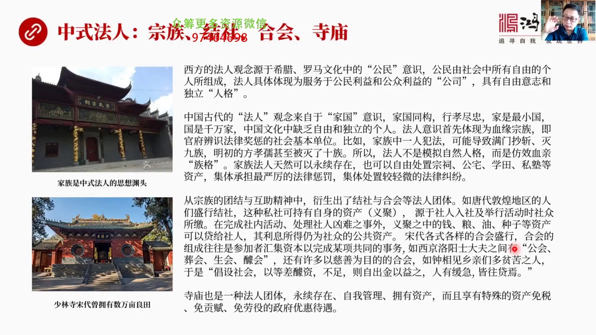

信任感很強的這樣一種合夥模式我們再看下一頁中國除了這個合夥制之外沒有超股份制沒有發展人性現在股份制起還有一個重要原因就是我們沒有法人公司這樣的概念我們有法人忠實法人是有的但是沒有公司忠實法人這是什麼忠...

<strong>All subtitles</strong>

> 信任感很強的這樣一種合夥模式我們再看下一頁中國除了這個合夥制之外沒有超股份制沒有發展人性現在股份制起還有一個重要原因就是我們沒有法人公司這樣
> 的概念我們有法人忠實法人是有的但是沒有公司忠實法人這是什麼忠族 截射 合繪 四秒這都是法人我們這西方的法人關鍵是源於希臘羅馬時代的公民公民的
> 意識公民是由社會中所有擁有自由個人自由還有擁有獨立人格的人組成的一個團體法人具體體現為為這些公民利益和公眾利益服務的公司它是可以公司所謂公司
> 就是為公眾利益服務的法人具有這自由的意志和獨立人格法人也要自己的意志也有自己的獨立人格而中國古代的法人呢我們沒有我們對應的概念中我們沒有一個
> 中文化中是沒有一個獨立和自由的個人的概念的我們有的是什麼我們有的一個社會我們的法人是源於家國意識家和國是同構的就是家裡面有家長國要有國家的老
> 大所以家庭內部要行校在國家內部要進中家是最小的家是最小的國國是千萬家這是中國人從一開始大雨之水那個時代就形成家國意識這是中國的法人的概念的總
> 的源頭我們認為法人是源於家國這個概念的不是源於公民個人就完全獨立自主了個人組成的公民你是我們是沒有這個意識的我們一個一罐認為法人或者我們一個
> 團體是源於家家族家族構成國家所以法人的意識是源於一個雪清的有雪原的宗族這是官府來辯認整個社會基本運行單位我跟你講還是跟你講這是一個基本運行單
> 位就是家族比如說家族中一個人犯法可能導致滿門超展滅舊族西方的法理中不可能有什麼滿門超展滅舊族因為每個人都獨立的每個人都只為自己的行為負責跟你
> 的老老舊老老舊就有麻煩性嗎沒有所以這個西方法理中每個人是自己成難法理責任而中國不是中國我們的法人就是犯法要抓的人是誰是宗族一個宗族誰也跑不了
> 所以我們可以看到一個著名的比如說名出的方向如它頂壯了就是拒絕配合諸地吧結果被滿門超展不僅是滿門超展滅舊族而且似乎也是立上第一個被滅了十族的人
> 包括朋友也被滅掉了想想看這是什麼法律我們的法律是一個宗族一個十族或者一個宗族作為一個整體懲罰的單位這就是我們的法人建立的一個最原始的最基本的
> 這樣一個邏輯所以法人中國的法人中國文化中間的中式法人不是在模擬自然人格而在模擬血清的族革我們是模擬家族的家族法人天然就可以永續存在也可以自由
> 處置資產比如說宗慈比如說公宅比如說學田思熟這都是家族擁有的資產可不可以也可以擁有也可以自由處置然後這個家族集體承擔最嚴厲的法律制裁比如說滅舊
> 族謀反這一定是要滅舊族的整個家族調共同承擔還有如果一些細小的內部的糾紛是家族內部處置它可以作為一個內部調解糾紛的這麼一個處置單元從宗族的團結
> 和護住精神中間衍生出了中國的截射合會這樣的法人的團體為什麼中國叫社會因為截射和合會是兩種不同的這種法人團體比如說在唐朝唐朝燈荒地區大家就上行
> 截射這種這種私人截射這種私射可以持有自己的財產這種這個所謂法人的資產叫異劇比如說攝人要加入入攝手你要捐一些錢還要搞活動手你也要繳那一些公共財
> 產這就形成異劇這些異劇是可以拿來放待的比如說攝人如果是碰到自然災害碰到什麼需要錢的時候你可以到異劇中來見錢糧有種子都可以見這個當然你要付利息
> 付的利息也是涉重的公共財產除此之外宋朝還有很多合會這個合會就是參加參加這個合會的人為了某個共同的理想、
> 事業或者為了某個共同的事務來組建了一個組織比如說當年在習近平洛陽世代府中間就會很多合會比如說藏會、
> 生會、聚會、公會這就是為不同目的組建了這樣的一個組織還有慈善為目的的合會比如說這個例上記載了中相他看到相親很貧困他就唱的要搞一個社會搞一個其
> 實是指了一個合會然後來籌集資金如果不足的話他就自己出錢借給老百姓人們如果有了集事都可以到這個到這個合會中來借錢除了這個法人之外還有四秒也是一
> 種典型的法人團體中世的法人團體他可以永續存在可以自我管理擁有資產而且起享受國家特殊的免稅待遇免共富、勞益這都是政府的優惠待遇所以唐朝的時候宋朝說少林四口不得了

---

### Slide 20

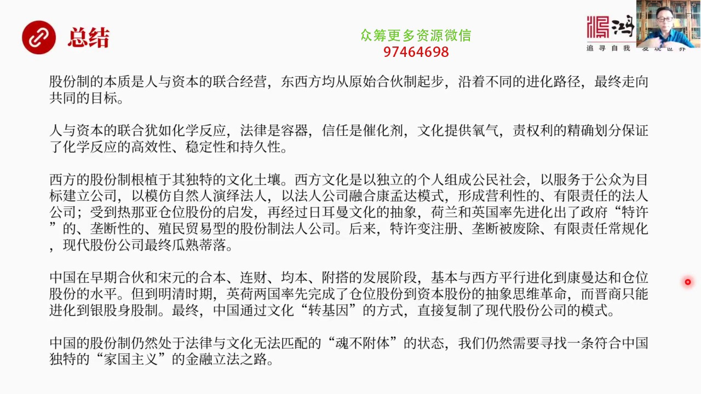

擁有兩天好幾萬目他可以養貨很多人這是中世法人的概念明白這些之後我們做一個總結總結什麼呢就是股份制他的本質是什麼本質是人與資本的聯合經營東西方都是從原始的合和制起步沿著不同的進化路徑最終走向共同的五標當...

<strong>All subtitles</strong>

> 擁有兩天好幾萬目他可以養貨很多人這是中世法人的概念明白這些之後我們做一個總結總結什麼呢就是股份制他的本質是什麼本質是人與資本的聯合經營東西方
> 都是從原始的合和制起步沿著不同的進化路徑最終走向共同的五標當然人和資本的聯合在我看來他就像一種化學反應法律是一種容器因為你簽了企約人與資本是
> 在這個企約之內活動的所以法律是一種容器信任是催化劑人和資本出自人和經營者雙方為什麼會產生信任這個信任有多深信任越深你的這個催化效果越好那麼這
> 種文化不管你是基督要文化基督要文化還是中國這種文化它提供是一種社會提供是一種氧氣因為你要發生這樣的話語反應是需要文化來提供輔助的則權利必須要
> 進行精確化分它是保障這個化學反應它的高效性穩定性和持久性那麼西方的股份制它其實是根據於西方獨特的文化圖讓西方文化是什麼以獨立的個人組成公民社
> 會以服務於公眾為目的建立公司以模仿自然人自然人它的演繹法人以法人公司來融合抗蒙達這個模式最後形成營利性的有責任有限責任的法人公司然後再受到熱
> 浪要參為股份的啟發再經過熱漫文化的抽象荷蘭和英國率先進化出了政府特許的壟斷性質的殖民貿易型的股份制法人公司再後來1844年經過英國的立法特許
> 與變成的註冊壟斷被廢除了有限責任變成了一個常規化的一個特徵現代股份制公司終於掛屬地落那麼再看中國中國在早期的合夥製裏面還有宋元時期的和本聯財
> 軍本還有這種複搭的發展階段基本上我們會發現是平靜於西方一起在進化的基本上進化到了西方的抗蒙達和熱浪要參為股份這個水平但是到了明清時期英國和荷
> 蘭率先完成了參為股份到資本股份的抽象了四位革命而盡商沒有能夠做到這一點只能進化到了英股和生股受到文化的制約比如說信任文化中國是個同心源的一個
> 社會我們的信任不能超過一個太大的圈超過這個圈迅速學界所以我們這種信任同心源這種文化限制了大規模的交易大規模的所謂的投資人和經營者相互信任的這
> 樣一種文化的支撐就沒有氧氣了就發展不起來了最終中國文化是通過轉機一的方式直接複製了西方現代股份的模式這就是我說的現在中國的股票上仍然存在著法
> 律和文化沒有辦法匹配的魂不復體的狀態未來怎麼辦中國仍然需要尋找一條符合中國獨特的加國文化加國主義的金融立法之路我們只能走這條路因為這是我們的
> 基因不要看我們能夠照超美國的法律政院法一字不漏表點方法一個不錯我們仍然做不到因為這背後是有了幾千年連續進化的觀念它的進化的鏈條還有各種法律這
> 種基因在裡面而我們沒有這套東西其實很難真正的複製它的這種形式這就需要我們一定要走出一條獨立的道路但這條路怎麼走中國是了獨特的加國主義如何跟我
> 們的當今社會和當代世界發展的共同的方向如何匹配這是一個天大的一個挑戰也是我認為東方義復興要解決的核心的核心的問題之一因為只有解決這個問題你才
> 能夠是中國的這套模式這套理想這套社會預先的方式乃至股份制乃至金融金融市場一切才能具有著被其他國家消化和吸收的可能才能具有號召全世界的這種能力
> 否則的話你搞這套東西別人是不能深刻理解的不能接受的所以我們需要在加國主義和個人主義中間找到一條非常有效率的結合之路要讓兩者發生話題反應加國有
> 加國的好處個人主義有更多好處怎麼進行調和怎麼進行融合融合成一個能夠堅固的一個中庸的模式所以我覺得中國和西方並不是個人主義和積極主義積極主義這
> 個詞非常不準確應該叫加國主義更準確好今天這就是我們這個股份制進化這張課主要要講的內容如果大家對這張課聽完這麼多老子還不太清醒的話可以回個頭來
> 看第一張的進化路徑圖有了這張進化路徑圖然後在對照今天我們所講的內容就會越來越清晰這概念越來越清晰然後對這個內容越來越熟悉最關鍵是我們要訓練這
> 些大腦想任何問題的時候要從表面要滲透到股子裡從股子裡要看到背後的文化思想這方面的這種邏輯的路徑你才能夠理解

---

### Slide 21

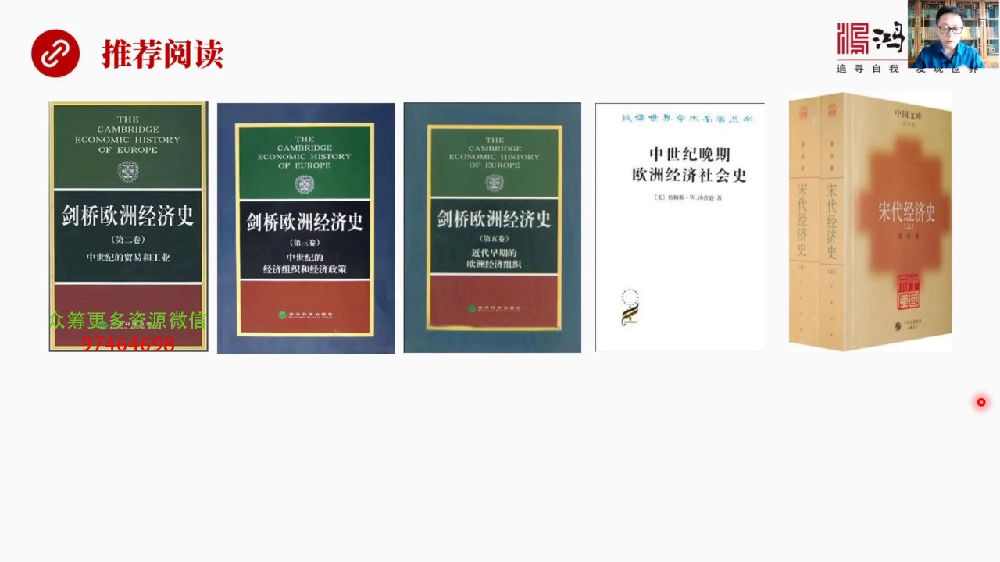

兩種文化兩種制度它到底差別在哪好這個最後是推薦給大家的一些閱讀閱讀的參考材料主要是英國建橋經濟史還有中施基地系數還有送貸的原貸的一些經濟史當然還有一些西方的中國的一些論文大家有時間可以參考一下好今天我...

<strong>All subtitles</strong>

> 兩種文化兩種制度它到底差別在哪好這個最後是推薦給大家的一些閱讀閱讀的參考材料主要是英國建橋經濟史還有中施基地系數還有送貸的原貸的一些經濟史當
> 然還有一些西方的中國的一些論文大家有時間可以參考一下好今天我們的

---

### Slide 22

我們的合音課就上到這裡謝謝大家

<strong>All subtitles</strong>

> 我們的合音課就上到這裡謝謝大家

---
