# 核心课视频-72、73  国债收益率震撼与回购负利率惊魂 — Slide Notes

> **来源**：鸿学院核心课程  
> **幻灯片**：24 张

---

### Slide 1

这段课我们主要是复盘美债收益率二十分的这个对全球市场的一个震撼好 我们先看第一业首先我们还是要分析一下为什么我们要做复盘这个事

<strong>Cleaned narration</strong>

> 这段课我们主要是复盘美债收益率二十分的这个对全球市场的一个震撼好 我们先看第一业首先我们还是要分析一下为什么我们要做复盘这个事

---

### Slide 2

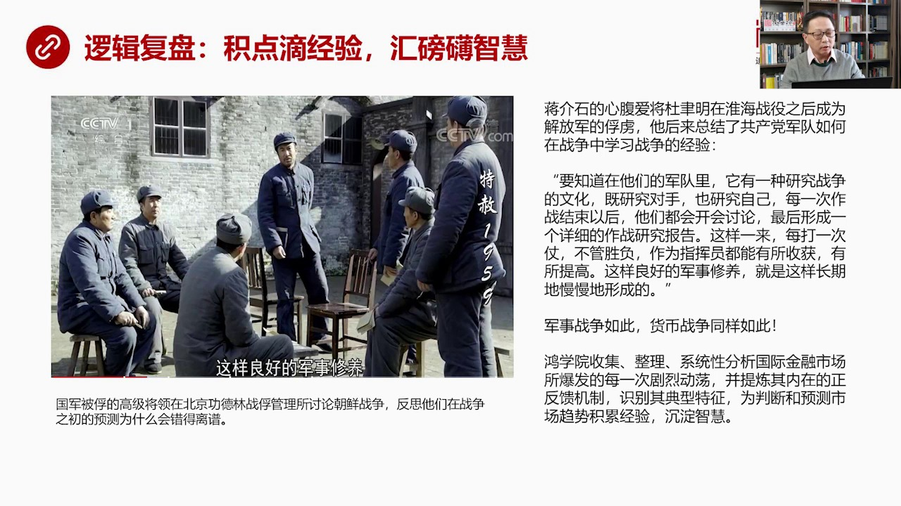

因为逻辑复盘在我看来非常重要我最近呢看了一个电视具有点挺好看就是讲公多林国民党战福高级将你们在解放战争中对付了大量的高级将领那么在公多林进行战福的教育和改造在这个片子里啊就讲到了像国民党的一些像杜毅明啊黄维啊这些高级将领他们在怀疑战役在解放战争的各自战役融被扶他们一开始啊其实是很不符共产党的这个打法...

<strong>Cleaned narration</strong>

> 因为逻辑复盘在我看来非常重要我最近呢看了一个电视具有点挺好看就是讲公多林国民党战福高级将你们在解放战争中对付了大量的高级将领那么在公多林进行
> 战福的教育和改造在这个片子里啊就讲到了像国民党的一些像杜毅明啊黄维啊这些高级将领他们在怀疑战役在解放战争的各自战役融被扶他们一开始啊其实是很
> 不符共产党的这个打法的觉得解放军不过就是碰运气直到朝鲜战争爆发之后国民党的高级将领呢在战福管理所普遍预测朝鲜战争爆发之后他们认为共产党军对打
> 国民党的打着比较顺手是因为预济好但是打美军基本上是一边倒他们认为一定会失败但是随着朝鲜战争的这个战局的推进这些高级将领们突然发现这个美军和这
> 一军交战怎么会也被打得落花流水打得非常的狼狈这个片子其实讲的就是这些高级将领在战斧英面讨论到底是我们哪里还搞错了为什么我们对战争的叛断预测错
> 的如此离谱呢那么对于民他在跟大家解说就是为什么我们对于战争啊对于这个朝鲜战争预测的错了反思对于这个解放军的战法和支援军的战法到底他们哪地方没
> 搞明白他后来总结了一段话我觉得非常精彩他这话是什么是怎么说的呢就是要知道在共产党军队员他有一种研究战争的文化既研究他们的对手也研究自己每一次
> 作战结束之后都会开会讨论最后形成一个详细的作战研究报告他说这样一来啊没打一仗不管胜负作为指挥员都会有所收获有所提高他说共产党军队的良好的军事
> 修养就是这样一步一步慢慢地培养起来的我就这话说的非常的到位当时我看之后很受启发其实军事战争和金融战货币战本上是一样的就是在一种具烈的博弈的充
> 满动态充满了不确定的这种战场上吧指挥员在我们金融上叫袍子者如何面对变局如何认识这些战争的规律实际上是跟他个人认修养军事修养或者叫金融市场的修
> 养有关的所以我们在这里我觉得我们的所这个红旋所做这些事情很像在研究战力其实我们从红军成长大姐帮军然后到后来看原则之间去你可以看到他们每一次作
> 战都会对作战的细节进行体列进行整理进行分析最后把它做成一个让所有人都能有所收获的这样一种研究的研究的体系集类不断的集类这些经验最后获得那种这
> 个非常后的一种我们可以称之为非常高级的一种智慧作战战争的一种艺术所以我们现在做也是这个事就是要收集整理系统分析国际金融市场所爆发的每一次动荡
> 并且提炼出这些动荡背后的在我看来是那种正反会机制就是导致一种行情剧烈加强这个震荡剧烈加强的这么一种核心的机制究竟是什么就是正反会机制其实我看
> 来就相当于金融市场中的战争的最后决定性的那个转折的那个状态是什么我们要识别他的点心特征这样才能够为预判和分析判断这个市场集类经验传遍智慧这就
> 是为什么我们要做逻辑复盘我觉得每一次市场动荡都要深入去分析都要提炼他的正反会机制也就是识别战场拐一点前流翻转这个点在什么地方我们翻下液这个呢是我这两经济来绘制的

---

### Slide 3

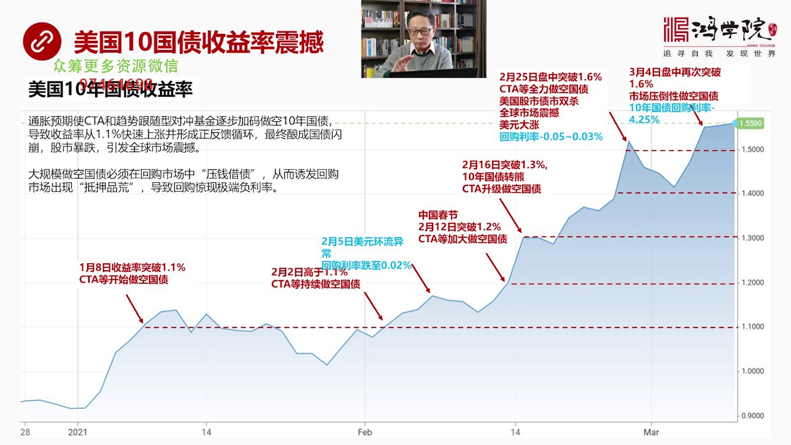

美国十年国大社会率对全球市场震换了一个时间图还有各种事件进入在一起这样变于大家一模了然在将图上我们可以看到美国十年国战收益率从去年的从去年年底吧11月以后我们看到这个他的他的发展趋势有一种不断的强化有这么一种趋势那么我们可以看到到今年年初以后美国国战收益率他的爬升速度越来越快然后2月以后加剧一直到3...

<strong>Cleaned narration</strong>

> 美国十年国大社会率对全球市场震换了一个时间图还有各种事件进入在一起这样变于大家一模了然在将图上我们可以看到美国十年国战收益率从去年的从去年年
> 底吧11月以后我们看到这个他的他的发展趋势有一种不断的强化有这么一种趋势那么我们可以看到到今年年初以后美国国战收益率他的爬升速度越来越快然后
> 2月以后加剧一直到3月份我们现在看到的比如说昨天吧上周五的十年国战收益率再次突破了历史高点就是最近一段时间的高点达到1.624那么这个过程我
> 们可以用一段话来经济提炼一下什么导致了这次十年国战收益率上长他的根本的原因呢我们可以看到其实是一种通脏预期起到了一种核心的推动核心通脏预期使
> 得CTA这种类型的对重基金还有趋势跟最新的对重基金他们开始逐渐加码来做空美国十年国战做空国战的期货导致现货价格也出现了下跌然后使得收益率开始
> 爬升从1.1快速上涨而且形成了正循环这样的一个反馈机制正反馈的循环机制最后导致了2月25号我们看到国战产中然后股市暴跌进而引发了全球金融市场
> 的震荡那么大规模做空国战必须要在回够市场上去剂就是压钱去剂国战所以又发了回够市场出现了国战荒或者叫抵押品荒最后使得国战市场中出现了10年国战
> 抵押的这个利率打到这个非常惊人的复利率的视频也就是负了4.25前所为所以我们来看这个时间它这个进程美国时间国战收益率在2020年基本上都是在
> 1以下很低年初以后开始迅速爬升到1月8号第一次突破1.1%突破1.1%之后CTA开始做空国战到了2月2号这一天很关键2月2号跟1月8号不一样
> 1月8号国战社率上来之后还跌下去了并不稳定2月2号之后美国时间国战社率高于1.1了而且持续一直保持到现在再也没有低过1.1所以这个转折点使得
> CTA还有其他的趋势跟随性的对冲进行开始加倡做空国战变成一个持续的工作不断加倡只要你国战社率上升我就做空国战而且力度越来越大2月5号这一天是
> 我们在美元华流报告中第一次发现美元华流出现一场的这个时间点美元华流一场体现在回够力力上回够力力我们知道美元储设定的是零到零零零二五的联盟基准
> 力率那么它的中间值实际上是0.1%而回够力力远远低于零点一变成了零点零二就是仅仅高于零两个几点这就说明了回够力力没有跟踪中间力力而是出现了巨
> 大的降幅接近零这是相当不正常的一个现象所以我们看到回够力力得到零点零二这是出现的二月五号我们知道二月五号美元华流已经出现了一场其实这个时间点
> 应该是我们作为预测第二天以后到二月二十五号实际上这个美元华流报告这个指数提前了二十天就发现这个市场可能会出问题这再次说明只要我们把美元还流研
> 究清楚我们是有可能提前发现金融市场可能中间动荡这再次提醒我们要关注美元还流的动态到二月十二号当然正好是中国的春节我们看到二月十二号十年国债收
> 益率突破了1.2突破1.2之后CTA开始加大做空国债的力度然后我们看到国债收益率上涨的速度明显加快到了二月十六号突破了1.3这个1.3十年国
> 债收益率这个数字是一个预值超过了1.3之后十年国债这个市场转入了雄市一旦转入雄市就不光是CTA升级做空国债了所有其他的各种类型为背中基金都开
> 始纷纷的出向国债上开始做空国债所以二月十六号这是个分水领这个分水领一旦突破了1.3一旦突破了国债进入了雄市那么做空的力量会进一步加嘛然后在这
> 个过程中我们看到最终到二月二十五号这一天国债这个率失控了从1.4级超过了1.5再超过1.6最高达到1.6一连续突破了1.51.6两个关键的这
> ...

---

### Slide 4

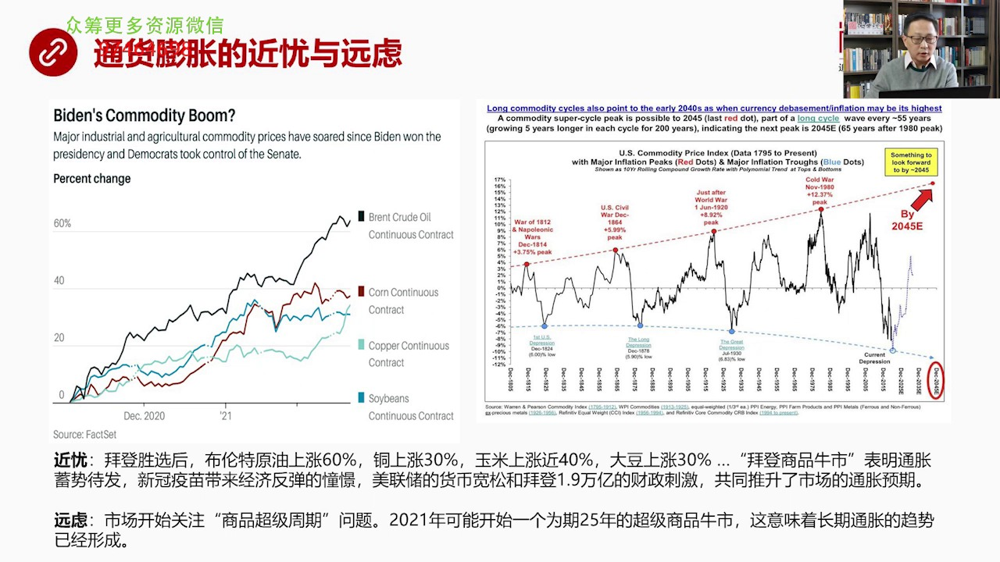

当然我们认为是通过红帐的一种预期当然这种预期包括进优和远律两个方向所谓的进优就是拜登当选之后就是在2020年11月以后拜登当选了我们可以看到各种大中商品的指数都在大部分上长从11月算起意志要现在顾论特园油广上长60%包括玉米上长了40%还有头上长30%当然还有各种各样的大豆之类的这些这些商品吧都出现...

<strong>Cleaned narration</strong>

> 当然我们认为是通过红帐的一种预期当然这种预期包括进优和远律两个方向所谓的进优就是拜登当选之后就是在2020年11月以后拜登当选了我们可以看到
> 各种大中商品的指数都在大部分上长从11月算起意志要现在顾论特园油广上长60%包括玉米上长了40%还有头上长30%当然还有各种各样的大豆之类的
> 这些这些商品吧都出现了上长所以这个牛是被号称是什么呢拜登牛拜登商品牛这是我们看到多晚期的出现了拜登商品牛原因是什么原因是拜登上台之后所推出的
> 财政刺激我们已经看到最近已经通过了1.9万亿这是一个强劣的一个财政刺激的一种政策它的力度跟去年第一次爆发新冠疫情受力度差不多而且这次主要是财
> 政上使出了一个巨大的刺激手段也就是去年2.2万亿再加上特朗普搞了几次再加上今天再来一次1.9万亿应该说在最近不到1年的时间里面吧美国在财政上
> 加上货币上一共刺激的总经额达到了7.8万亿金融上上我们这每天主在买占各种各样的国债扩大资基础资料资料表这大概有3万亿财政的各种自己加在一起累
> 计有4.8万亿之多在这么短的时间里面一个GDP25%左右的力度来刺激经济的话那当然会对整个通过膨胀对物败会让人受到了极大的这种刺激吧我们可以
> 想像这个市场对未来物价上涨它是有种强烈预期的这就是为什么拜登上他以来我们看到了出现了所谓的拜登商品牛这是一个方面另外一个方面是新冠疫苗新冠疫
> 苗出现之后而且现在拜登抛成这样加大注射的力度那么让大家觉得可能疫情在今年夏天前后基本上就会结束或者被限制在一个有限方面之内这就会带来一个大家
> 消费的旅游消费外出去比如说这个旧餐看电影等等这种经济活动就运转起来尤其是对于这种服务型经济为主的发达国家它的70%以上都是靠服务业服务业受到
> 疫情的影响最严重而你一旦疫情解除之后服务业反弹会非常猛烈所以这也带来了经济反弹的前面的预期那么这些因素加对期共同推进了市场对于通过膨胀的一种
> 短期的预期非常强烈除了这个之外其实还有一种长期的我称为是远绿的通过膨胀的短期因为现在市场上美国市场上越来越多的金融机构他们开始讨论一个商品超
> 级周期的概念也就是说从过去二百年以来吧从一八一五年拿过程战争时代开始一直到现在我们会看到从大东商品的价格走视情况之后这个趋势吧可以看到明显有
> 四个多了四个常播那么现在有可能是第五五次出现一个大的上升的这样一个波达大东商品有可能走一个长达二十五年的超级商品牛市这个利益这个过去二百年以
> 来历次的这个行情有一种非常共同一种一种模式吧所以大家强烈预期可能二零二零二零二一年有可能是商品的一个底部从此这个二十五年之内将走向一个大牛市
> 一直到二零四五年大了中间会有反复就像我们看到两次播风之间必有下跌中间还有一辆那么这次也不例外我们看到冷战高风之后中间冲了一次就是我们看到二零
> 零八年进入危机之后冲了一次大东商品然后跌下来跌到二零二一年这回反弹冲到零点之后应该还会下跌还会有一些反复吧但是总的趋势应该是一个大富上涨的一
> 个趋势当然这是长洲七理论长洲七理论我觉得到目前为止我从逻辑上还没有完全幸福当然从通讯上我们能够看出来是有一定规律但是这个规律到底是可变的还是
> 不可变的你说从南博战争开始往后推这二百年可能看起来是有规律但是背后也有可能有一些基本的因素发生重大变化比如说东西方的力量的对比等等这因素会不
> 会影响这个二百年长期的大趋势呢也就说我们在化或者在思考一个超长洲七的过程中可能有一些因素吧我觉得他到目前为止还只是一种经验我们把途径化的点觉
> ...

---

### Slide 5

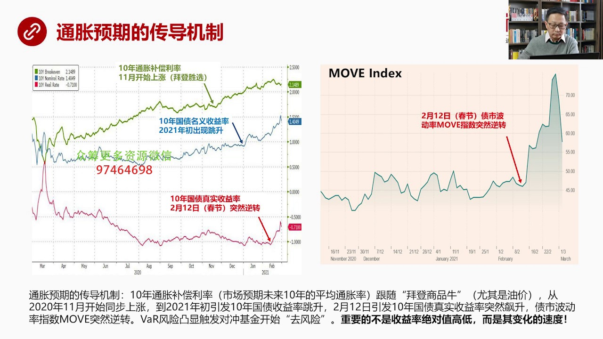

他先跟随拜登的商品牛市开始往上涨那么他的涨这个开启涨的时间是从11月拜登这个胜选开始到了2021年年初引发了十年国债收益率的跳升然后到了2月12号引发了十年国债收益率的真收益率的标升然后引发的债券市场波动率就是墨址受的逆转然后又发了所谓的风险评估的一个重大的估值调整也就是Value at risk就...

<strong>Cleaned narration</strong>

> 他先跟随拜登的商品牛市开始往上涨那么他的涨这个开启涨的时间是从11月拜登这个胜选开始到了2021年年初引发了十年国债收益率的跳升然后到了2月
> 12号引发了十年国债收益率的真收益率的标升然后引发的债券市场波动率就是墨址受的逆转然后又发了所谓的风险评估的一个重大的估值调整也就是Valu
> e at risk就是如果波动率上升得太快猛烈距离抖动那么我的资产这个估值就会发生变化我的风险就会发生变化这就会迫使大量队中基金开始去风险或
> 者就要解决减少未来市场波动率产生的这个巨大的风险它一定会卖一些资产调整这个过程让我们发现一个道理最重要的不是一个收益率绝对数值的高或者低最关
> 键是它的变化的速度它是突然涨的吗涨是有多逗因为这种据列上了协率非常高的蒙掌会时这个风险重新估值的这个这个压力会突然变大那么就会迫使市场进行紧
> 急调整因为大量基金要一起卖如果时间压得非常压得非常躲完这些人穿过如果压得非常非常躲的话那么就会出现集中拋售这对市场会各层巨大的价格波动风险我们再上下液如果有价格的起落当然就会有赚钱的机会

---

### Slide 6

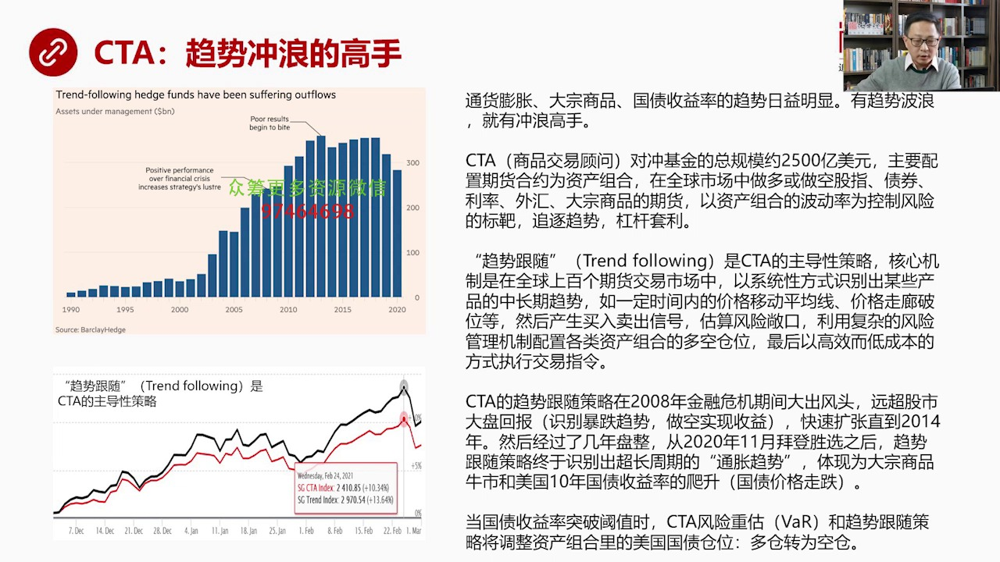

所以赚钱对于很多职业的基金比如说像CTA这样的基金来说那就是一个跟随波浪的一个过程他们可以说是一种趋势充浪的高手就像我们看到充浪你只要有波浪就有人能够利用波浪产生的提度差或者是要高波风锋底的这种高度它就可以利用这个势能进行充浪那么通过膨胀也好大动上面也好国载收益也好它的上涨已经成了一种明显的趋势那么...

<strong>Cleaned narration</strong>

> 所以赚钱对于很多职业的基金比如说像CTA这样的基金来说那就是一个跟随波浪的一个过程他们可以说是一种趋势充浪的高手就像我们看到充浪你只要有波浪
> 就有人能够利用波浪产生的提度差或者是要高波风锋底的这种高度它就可以利用这个势能进行充浪那么通过膨胀也好大动上面也好国载收益也好它的上涨已经成
> 了一种明显的趋势那么既然有这种趋势波浪就一定会有充浪的高手CTA就是其中的典型代表CTA就是所谓的商品交易顾问这是一种类型的对中基金他们现在
> 掌握的市场的总规模掌握这个资产总规模大概是2500亿美元它主要做什么呢主要配置是期货合约是它的主要的资产配置所以它叫商品交易顾问这么做期货以
> 期货交易为主期货是它主要的资产组合那么它在全世界其实要做很多种类型的很多种类型的市场比如说它在很多地方要么空苍或者多苍一些市场的股票指数股质
> 期货或者是债券利率大动商品还有外汇等等这些期货期权它都做包括严能产品它都做那么它会组成一个资产组合一个一个就是不同类型的资产组合然后以这些资
> 产组合的波动率作为控制风险的一个标法或者叫导向在这种资产组合波动率作为导向的封演控制的机制中如果能把这个波动类的控制中或者波动率不高的话我就
> 可以放心大胆的追逐趋势我可以加上哪儿然后加大套利的套利的实现那么这样一种追逐趋势的这样一种操作实际上是有一种策略吧就是趋势跟随形这个是很多很
> 多对中基金所供有的特性CT对于CT来说是它的主导性策略主要用的就是这个策略那么如果我们来看它的核心机制就是在全线好几百上百个这个机会教育市场
> 中它是用一种系统性的方式用算法来识别每一类金融资产的价格它的中长期的趋势有没有发生变化比如说一定时间之内的价格移动移动线比如说我们说五十五天
> 的军线一百天的两百天的这个价格的移动线还有它是不是一个价格走狼破味了跌破了或者向上或者向下这些趋势一场的信号都会产生买个卖的指令就是都会产生
> 该买了该卖了都会产生这样的一个报警这个报警出来之后趋势跟随形对中基金它要通过复杂的评估机制来计算风险场口我这么干我会报了多少风险然后利用它的
> 风险管理机制自动来调配各种类型自产组合的多空仓位哪些该开多哪些该开空比例数多少然后最后再以一种高效而低成本的方式之心交易指令就是我用什么样的
> 交易平台用什么样的一系的交易指令我能达到最低的成本最高的效率那么CTA的趋势跟随形策略在历上曾经大出风头金融市场这个特别是在金融机之间我们可
> 以看到这是趋势趋势跟随形对中基金也包括CTA吧他们在2008年的时候表现非常好因为2008年股市暴跌金融上暴跌但是暴跌对它来说不可怕只要我能
> 判断金融它的暴跌的趋势我就能在暴跌中转天我无非是个空而已所以在2008年之后趋势跟随形策略一炮走红大出风头他们的税率远远高于市场然后一直扩张
> 到2014年这个时候我们知道美元还流反转了然后反转之后他们对于趋势的预测出现很多粗问题所以进入了盘整一直到2020年拜登上台2020年11月
> 拜登胜减之后再次出现了一种大趋势就是通过红障的趋势出现了还有商品牛还有10年国载税率的爬升这几个趋势变得非常明显这个时候CTA开始重新火爆起
> 来专门做空国战那么如果我们来看CTA的他的主导性的这个策略就是去世跟随的话应该占他的他的主要部分我们可以看CTA他的投资回报中间如果我们看到
> 红线是CTA就若干个CTA的这种基金嘛他们的总体表现比如说到目前为止他的回报率是跟去年是月比吧他总的回报是10.34那么趋势跟随形呢在中间是
> ...

---

### Slide 7

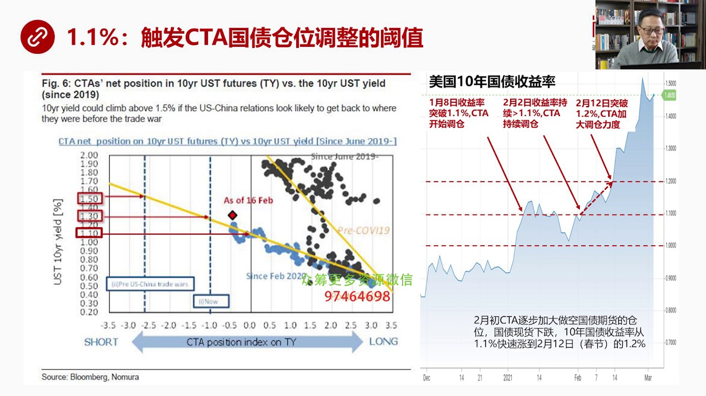

调整倉位的预执实际上是1.1%从这张图上我们可以看到这是CTA它的实验国载竞持倉实验国载期货竞持倉的这样的一个趋势图从这个趋势图上我们可以看到这根黄线代表势这根黄线代表势以前2020年新冠爆发之前它的基本走势而这条黄线代表势新冠疫情爆发之后它的基本走势那么它的横作标是代表的CTA这种基金它的倉位正合...

<strong>Cleaned narration</strong>

> 调整倉位的预执实际上是1.1%从这张图上我们可以看到这是CTA它的实验国载竞持倉实验国载期货竞持倉的这样的一个趋势图从这个趋势图上我们可以看
> 到这根黄线代表势这根黄线代表势以前2020年新冠爆发之前它的基本走势而这条黄线代表势新冠疫情爆发之后它的基本走势那么它的横作标是代表的CTA
> 这种基金它的倉位正合复如果是在零右边这代表它是做做多的做多美国国载的在零的左边代表是做空的那么纵作标呢就是10年国载收益率从这张图上我们可以
> 看到一个什么趋势呢如果美国国载收益率比如说从1.1不断的网上走升到1.3 1.5或者1.7或者2.0那么这根黄线所指示的方向代表着CTA这种
> 对重基金他们做空美国国载的倉位将会或者叫力度会不断的加强所以这张图表现出来了一个非常重要的信号就是在这个零附近也就是它到底是做多还是做空国载
> 在这两个选择它的一个零界点这个零界点所对应的美国国载10年国载收益率是多少呢是1.1换句话说假如国载收益率从1.1网上走或者说从这个今年2月
> 2号之前上升到1.1这就会引发这个最近基金要进行调倉就开始做空美国国载所以1.1是一个调倉的预值如果国载收益率继续严着黄线网上走就是网1.1
> 网上升的话那么CTA做空美国国载的倉位将会不断的越来越大而且力度会越来越强这就是我们看到1.1是一个转折点到1.3又是一个到1.5当然是另外
> 一个转折点再往后每个台阶网上走CTA对于美国国载的空倉的这个力度会越来越强那么也就是说现在我们看到美国国载是为率在3月12号再次突破1.6那
> 么说明CTA由于它的算法和对于趋势的判断都是自动完成的调倉也是自动完成只要你搭这个数它就必然会有这么多空倉不断地被生成也就是它对美国国载市场
> 上做空的力度还会增强这个就是我们看到这张图的一个非常重要的数据只是作用那么我们从右边这张图上可以看到他们的行为对美国国载社会造成什么样的具体
> 影响2月初也就准备说是2月2号翻过了1.1之后这个1月之后CTA开始逐步加倉做空美国国载然后做空导致美国国载现货不断地下跌现货家里也导致10
> 年国载社会率不断地上涨从1.1开始快速涨到2月12号春节前后的1.2所以我们可以从这可以看1月8号第一次突破CTA开始做空了2月2号收益率新
> 年国载社会率持续大于1.1了再也没掉下来过所以CTA做空国载的这个倉位是不断地放大不断地加倉你越涨我越放空越做空然后他这个行为就导致了国载社
> 会率的进一步的快速提升到了2月12号这又打到这个重要转着点突破了1.2那就是不仅CTA会加倉做空美国国载而是其他的趋势跟罪行也会这种队中基金
> 也会加大做空美国国载的力度当然他们俩的这个做空还会加强很多其他内心的队中基金比如说红关趋势内等等这些基金都会加入做空美国国载的大军这样的话就
> 会使美国国载的上涨的速度社会率上涨速度会越来越某这就进入了一种类似正循化的状态正反亏循化的状态好我们再看下野那么这种上涨到了2月16号我就是达到了一个

---

### Slide 8

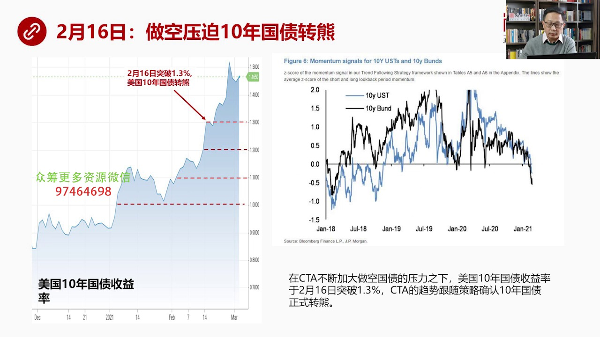

新的高度也就是说2月16号是个重要分水领美国时间国载从16号以后也一旦突破了1.3社会率突破了1.3整个市场与转为熊市这个确实就被确认了那么当他一旦转入熊市之后所有的基金都纷纷的看空美国国载这个发展再往后就难以恶质了这个正反亏力到就会越来越强因为市场达成了越来越强大的共识这个技术上的预执1.3一旦突...

<strong>Cleaned narration</strong>

> 新的高度也就是说2月16号是个重要分水领美国时间国载从16号以后也一旦突破了1.3社会率突破了1.3整个市场与转为熊市这个确实就被确认了那么
> 当他一旦转入熊市之后所有的基金都纷纷的看空美国国载这个发展再往后就难以恶质了这个正反亏力到就会越来越强因为市场达成了越来越强大的共识这个技术
> 上的预执1.3一旦突破之后市场基金做空美国国载达上了更高度的一致性那么他往上走的速度就会加快如果我们看这个趋势跟随行们这些他们的分析的分析的
> 指标可以看到10年美国国载是在2月16号从看多转向从这个偏牛转到了偏熊分水领次在2月16号一旦过着11点他就掉到了熊市以下他就开始变熊了当然
> 与此同时比如说德国十年国载比他比美战还稍微早几年应该是2月12号掉到了熊市现在我们可以看到一个正反亏的循环正在逐步的加强CTA就是主要的推手
> 由于他们从2月2号不断开始加大做空美国国载这个压力越来越大导致美国十年国载税率不断的台升从1.1到1.2然后到2月16号了1.3马上这个市场
> 时间国载信号就变了就进入熊市了趋势跟随策略就确认他正式进入熊市这一旦确认就会又发更多的基金加入做空美国国载的行业那么当然这种力度一加上来之后
> 我们看到美国国载收律上涨价格下跌的趋势就难以恶质所以这个2月16号突破1.3是个这个国载转熊市的一个重要的分碎我们再看下野所有这些家里不断推高美国十年国载税率

---

### Slide 9

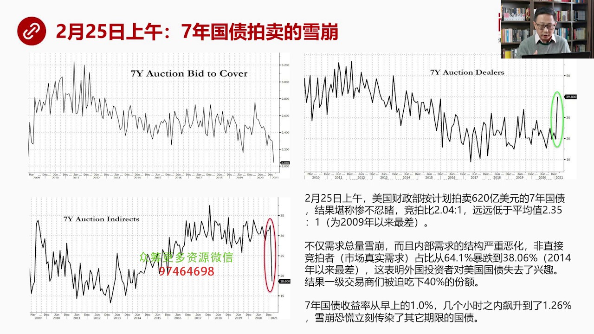

也就是说美国十年国载的价格同步在不断的下跌这两者是相反的国载下跌收律上涨他背后的原理我们几个简单例子就像很多人就是我看了大家提了问题很多人对这个基本干净还不太明白为什么十年国载价格下跌收律率收御率会上涨我觉得在这我们可以用房子作为一个作为一个比喻房价就好像是十年国载的价格房价那么十年国载税率就好比是...

<strong>Cleaned narration</strong>

> 也就是说美国十年国载的价格同步在不断的下跌这两者是相反的国载下跌收律上涨他背后的原理我们几个简单例子就像很多人就是我看了大家提了问题很多人对
> 这个基本干净还不太明白为什么十年国载价格下跌收律率收御率会上涨我觉得在这我们可以用房子作为一个作为一个比喻房价就好像是十年国载的价格房价那么
> 十年国载税率就好比是房租的回报率如果房价越低我租金相对是稳定的一个月我租一万块钱这个房子如果一百万那我租金的回报就很高那么如果房价涨到了一百
> 一十万我还是只收一月收一万的这个租金那我租金回报率就下降了如果房价跌了呢从一百万跌了九十万呢那我租金回报率就上去了所以房价跟租金回报率永远是
> 成反比的国载性质一样国载价格相当于房价房价下跌了那我当然同样投资很多钱我买了价格便宜然后国家给我的利息定期给我的残酷定期答应于我的钱用又没有
> 渐少那我总的回报当然高了这就是两者的这个逻辑关系那么如果国载市场上显示出十年国载非常不看好大家都在抛这种力量在二月二十五号各种力量这个相互循
> 环相互这个产生正反贵这个循环之后到二月二十五号达到了一个重要的一个突破值达到重要的一个分税这个分税领在七年国载拍卖的时候引爆了七年国载市场这
> 就是二月二十五号上午我们可以看到七年国载拍卖出现了非常不好的一个现象就是他的这个近排比近排比高的时候你比如说是二点三六比一也就是二点三六深购
> 最后有一块钱成交那我相当于二点三六个人在抢最后只有一人抢着那我这个东西很抢手啊就像我们拍卖房地产当然来的人越多这个举牌的人越多说没有这东西越
> 抢手啊要是没人举不就留拍了吗到底是一样的所以这个近排比很重要二月二十五号上午美国国载这个拍卖七年国载拍卖才能够拍卖了六百二十六百二十亿美元它
> 的结果非常的惨近排比从百分之二点比如说二点三五吧这个是平均值过去多少多少个月平均值在这一天掉到了二点四比一说明什么说明买的人太少近排的人太少
> 某种意义上类似于我们说的流拍这是这样低的近排比相当于是2009年经萎机之后最差最差了一年一次这是十几年来最糟了一回那么不仅是我们看到这个近排
> 比反映是总体对七年国载需求在巨烈的伪缩实际上出现了雪崩没人要不仅是没人要总体需求在下降更重要的是内部需求的结构严重恶化就是在剩下的需求中间也
> 出现了恶化的趋势非直接近排者因为美国上中有直接近排非直接近排两种非直接近排者是反映市场真是需求的也就是非直接这个近排者代表着比如说外国的投资
> 人各国的主权基金还有各种各样的这个代表国家的这些投资机构他们一般在美国国载市场上要去近排要去买不是直接近排他们只能通过医疾胶以上带他们近排所
> 以他们这个叫非直接近排者外国投资人是中间的非常主要的一个代表那么他的战比也就是他们在整个成交中间的战比从64.1%报跌到38.06%这是20
> 14年以来的最差的一个表现就说明什么外国投资人对于美国国债的需求在严重的恶化从64.38.06%这说明什么外国投资人不愿再碰美国国债了对美国
> 国债失去了兴趣也就是说你未来还要发还要再搞1.9万亿还要再发更多的国债这玩意你让我们买我们就觉得未来通过膨胀这么高我就没有兴趣了除非你给我更
> 高的一个回报也就是社医率要更高我才愿意买这也是为什么社医率会被低着广场长的一个原因就是你在这个价格卖给我我不接受因为通过膨胀这么高我买了你这
> 个会亏格这是一方面还有呢就是如果说外国投资人都不买剩下最后接招了只能是一交一商了一交一商24家我们以前他们强调过他们是市场主要的做事商那么他
> ...

---

### Slide 10

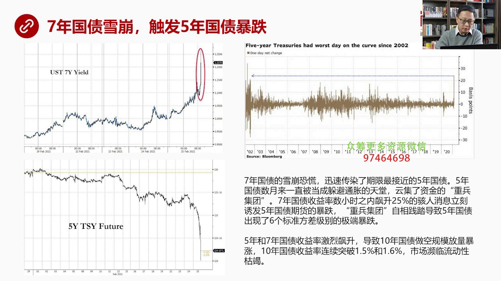

我们看到7年国债收益成直线暴涨这说明价格暴跌那么他接着同时引发的就是5年国债7货价格的暴跌在当天出现这么大幅度的暴跌是个什么数量级呢是6个标准方差级别的极端暴跌我们知道6个标准方差也就是百万分支3.4如果用100万个交易日来评估的话也就是从新时期实在开始兵科技结束以后意料现在这种5年国债暴跌的幅度也...

<strong>Cleaned narration</strong>

> 我们看到7年国债收益成直线暴涨这说明价格暴跌那么他接着同时引发的就是5年国债7货价格的暴跌在当天出现这么大幅度的暴跌是个什么数量级呢是6个标
> 准方差级别的极端暴跌我们知道6个标准方差也就是百万分支3.4如果用100万个交易日来评估的话也就是从新时期实在开始兵科技结束以后意料现在这种
> 5年国债暴跌的幅度也就出现过几次而已一万年以来所以我们可以看到5年国债暴跌这个幅度非常的惊人达到了6个标准方差的级别几小几小几小的概率百万分
> 之几为什么主要原因是7年国债雪崩恐慌他传到了首先是5年国债离他期限是比较近的而5年国债最近一段时间以来特别是拜登上他以来他一直被当成躲避通过
> 文章的天堂大量的资金从长端向短短转移因为长端比如说30年国债时间国债大家知道社会对如果大幅标升国债价格会下跌社律上上涨原因是因为通过文章再上
> 涨了而这个东西是不肯逆转的或者说大家认为是长期趋势那么我持有长端的国债我就会吃亏呀所以我就不愿意持有长端的国债我就把资金从长端向中端向短端来
> 撤退所以5年国债这成了一个躲避通过文章的资金的撤退的集算地变成了一个重兵集团云集在5年国债上这成了一个特别突出的一个像华尔战一种徐州一样聚集
> 了好几十万大军80万国军聚集在徐州他有点类似这个现象如果青年国债在他旁边一个市场黄博套集团负面了那么严重冲击了徐州的首军黄博套就是青年国债他
> 被尖灭了那么5年国债这个重兵集团的东云民集团在徐州的就受到了惊恐那么就引发了重兵集团自乡渐踏相互踩踏这样的一个悲惨事件结果就是他当天的价格震
> 撼出现了6个标准方差级别的集团暴点那么5年和7年国债社会对的激烈的标升已经成这个形状和这个形状的6个标准方差级别的这样的一个激烈的航行导致1
> 0年国债做空的规模放量增长5年崩了7年崩了10年也崩了受不了了那么做空的势力就会加大做空力度所以10年国债税率在25号下午1年以后开始连续暴
> 涨突破了1.5然后突破1.6甚至出了1.6.1整个国债市场兵灵流动性枯竭的状态这个市场没法玩所有人想卖根本没人买这就出现了重大的风险类似于2
> 020年3月的金融风暴我们再看下一节这就出现了我所说的正反会循环的

---

### Slide 11

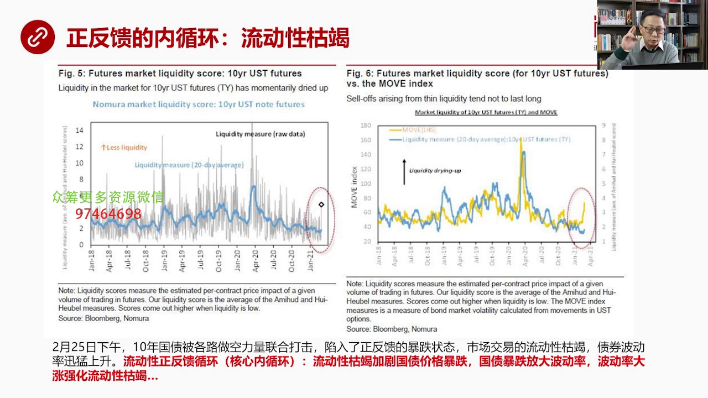

实际上我们会看到最后一张图我会讲好几个循环这是其中之一这是一个核心循环也就是国债市场这是个核心循环这个核心循环又存在这双循环内循环和外循环我们首先看这个内循环就是国债市场到了最紧急的关头报罪续报罪性的这个循环叫内循环实际上叫流动性枯竭循环没有流动性我们可以看一下这个国债流动性这个国债市场上这个时间国...

<strong>Cleaned narration</strong>

> 实际上我们会看到最后一张图我会讲好几个循环这是其中之一这是一个核心循环也就是国债市场这是个核心循环这个核心循环又存在这双循环内循环和外循环我
> 们首先看这个内循环就是国债市场到了最紧急的关头报罪续报罪性的这个循环叫内循环实际上叫流动性枯竭循环没有流动性我们可以看一下这个国债流动性这个
> 国债市场上这个时间国债期货流动性在2025号这一天突然出现一个大幅上升这个高度越高代表它越缺少流动性那么在市场中国债的这个流动性的枯竭猛烈的
> 上升导致了什么呢债券市场的目指数也开始表声所以我们可以看到国债其他的收益率会影响债券市场而债券市场会影响股票市场这就是一个连接点从一个循环会
> 绕到另外一个循环从内循环会绕到外循环和侧循环所以这回出现正反馈一共出现了三个大循环一个核心循环内外两层再加上一个外部的股票循环再加上一个旁边
> 的一个侧循环这个侧循环就是我们一会看到的这个MBS这个侧循环所以三大循环不断的相互加强最后导致了冲击全世界的金融市场我们首先需要把这个原理讲
> 想清楚讲明白想清楚然后大家才能理解为什么世界这个金融市场会乱成这样我因为大多富人士不能够清晰理解背后的逻辑链条的也正是这种知识上的差距导致有
> 些人对出现某些信号他高度敏感但是大多人毫无知觉毫无知觉就变成是韭菜而高度敏感人就能够提前脱逃那么我们看在2月25号下午1点钟之后10年国载被
> 个路做空力两连和打击所以险若正反亏的暴跌状态正反亏就是相互彼此加强各种力量彼此加强市场交易市场整个这10年国载交易量进入这个险若流动性枯竭的
> 陷阱然后债权波动力大幅上升所以我称之为这是一个核心反亏正反亏循环中间的内循环我称之为是流动性正反亏循环流动性循环他主要讲是流动性枯竭的问题流
> 动性枯竭了就会加剧国载价格的暴跌因为买卖价格之间价差拉拉了然后你我想100块钱卖没人没人买比如说正常市场啊99就有人接韩结果没人接90才有人
> 接那这个暴跌就会加重了所以流动性枯竭会加剧国载价格暴跌国载要暴跌了就会放大波动率因为波动力本来就是根据你这个暴跌的幅度来测算了一个重要指标嘛
> 如果你这个价格落差太大波动力就上升了波动力大涨就会强化流动性枯竭你波动力太大那当然更没人员接盘了对吧那我从一百九十块钱没人接好再过一会儿再一
> 看只有85才有人接韩好家伙这就放大了这个流动性枯竭这个循环一圈接一圈下去赚下去结果会不断的使问题恶化最后就导致简直就没有成交量成交不了因为教
> 买价差距太大还怎么成交这就陷入了内循环的最极致的状态整个危机就暴和在25号这一天25号下午1点到3点之间出现了流动力枯竭的问题这种枯竭的程度
> 仅次于去年3月份了金融风暴达到那种水准这就是为什么我们看到上海股市和全世界股市受到重大冲击受这个事实验影响我们一会儿会讲到其他外国市场怎么受影响好我们再看下液主要这是我们所说的核心反亏的内循环

---

### Slide 12

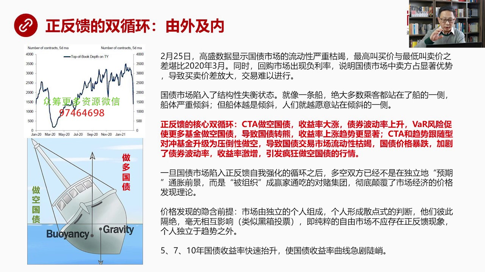

我们再看其实这个正反亏还有个外循环而且内循环的出现最严重局面是由外循环恶化逐渐引爆内循环的恶化最后出现了个正反亏的双循环彼此前方才会到最后就是危机首先我们看25号高胜数据显示国载市场的流动性严重枯竭我们刚才已经收到了其中最重要的一个标志是最高的叫满价和最低的叫卖价之间的差距就是我一百块钱卖我期待人家...

<strong>Cleaned narration</strong>

> 我们再看其实这个正反亏还有个外循环而且内循环的出现最严重局面是由外循环恶化逐渐引爆内循环的恶化最后出现了个正反亏的双循环彼此前方才会到最后就
> 是危机首先我们看25号高胜数据显示国载市场的流动性严重枯竭我们刚才已经收到了其中最重要的一个标志是最高的叫满价和最低的叫卖价之间的差距就是我
> 一百块钱卖我期待人家九十九是有人接盘结果没有人家最高的九十才接盘那我从意外直接掉九十了那这个那我对于我这个这个人来说这个就出现了什么的五个月
> 卖不愿意卖这个流动性就没有了当然我说这个用一个极端的例子来给大家加深这个印象叫卖价和叫卖价之间的差距如果放大了说明什么说明这个市场呢成交变得
> 越来越困难交易难以进行而且这个市场中出现了卖方占显重优势没人买了没人买就导致这个交易更加难以进行所以这是一个相互不断的一个相互强化的过程回够
> 也出现复利率回够出现复利率双云市场中国债市场中卖方占据显重优势而买加不足这就出现了国债市场上陷入了一种我称为是结构性失衡的状态这就好像一双船
> 在这个船上做空国债人占了绝大部分做多国债人太少就是卖人太多卖人太少这船就清洁了而且越清洁就会导致人们越愿意占的清洁地方没人愿意占的这一方这市
> 场出现了结构性的恶化越是清洁导致它清洁程度越大这就是一种正反会那么我们来看核心的这个正反会的核心双讯还他是一个什么概念首先我们刚才所说是内讯
> 还我们再说外讯还外讯是CTA从2月2号开始做空国债导致国债收益率不断从1.1到1.2到1.3到1.4然后突破1.5和1.6那么这就导致债圈的
> 收益这个波动率会不断的上升这种上升就迫使这个风险评估这个压力就迫止很多基金开始做空国债规避风险或者来这个对冲风险那么做空国债就会导致国债转雄
> 这么多人做空国债国债就从1.3到2.16号那个转正点就开始进入雄市了进入雄市之后收益率上涨这个趋势就更加显住更加显住所有追随跟随趋势这帮人就
> 更的就是更加加大做空国债力度然后这个循环就一遍一遍的外循环就一遍一遍加大使得这个船越来越清晰这就是外循环当它7月到一定程度到2月25号这个船
> 清晰到一定程度就触发了内循环就说刚才我们讲来那个流动性哭结这个内循环的它的引爆就是CTA和趋势跟随形的对冲基金乃至所有的基金全部升参为压倒型
> 的做空国债这就导致国债交易市场中流动性哭结了没人交易了或者没人买了所有人都在卖这就导致国债价格进一步暴跌加剧的市场波动率债券市场的波动率波动
> 率加强强化变大了收益率国债收率就会击争国债收率击争就会引发更加疯狂的做空国债的行情那就市场更没有流动性了更没有流动性价格跌率就更猛然后波动率
> 会更强然后债点收率会更窄然后就一圈一圈最后引爆了再几个小时之内就引爆了最后的疯狂整个国债市场崩了闪瘩所以我们看到一旦国债市场现入正反亏循环的
> 自我强化这个循环之后多空双方其实已经不是在对赌所谓通货膨胀预期了我们看到大多数分析文章讲到2月25号还在说多空双方还在对赌膨胀预期根本不是这
> 么回事所有人都被破选边站也就是说看多和看空已经根本跟通膨胀预关了而是被一种强大的正反亏的强大的力量被组织起来了这种力量把大家都组织起来要么你
> 是民家要么你是书家两大集团看贼不两力跟你的观点也没关系了你要选个书还是选个赢而不是说我看多空通膨胀看空通膨胀跟这种没关系了你只能选择要么站在
> 这一方要么站在另外一方站在这一方你可能已经站在那一方就输得得掉掉你怎么选所以这其实一旦这个市场进入正反亏循环之后我认为从李敦仁来说市场价格发
> ...

---

### Slide 13

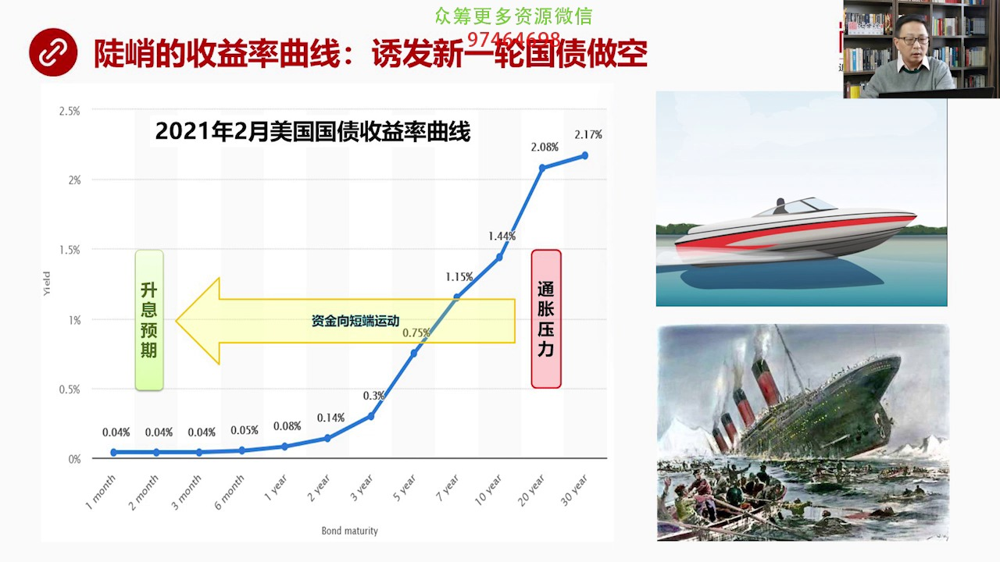

抖架收益的趋限他会又发新一轮的国债做空什么叫收益率的趋限呢比如说国债收益率我们看到有一个月的国债两个月的三个月的六个月的还有一年的两年的三年的我五年七年十年二十年三十年国债收益率好比是我们在国债市场中在比如说今年三月十三号的上午九点一开盘怕我用状上机把所有国债收益率拍一张快照在这个时刻每一个不同期限...

<strong>Cleaned narration</strong>

> 抖架收益的趋限他会又发新一轮的国债做空什么叫收益率的趋限呢比如说国债收益率我们看到有一个月的国债两个月的三个月的六个月的还有一年的两年的三年
> 的我五年七年十年二十年三十年国债收益率好比是我们在国债市场中在比如说今年三月十三号的上午九点一开盘怕我用状上机把所有国债收益率拍一张快照在这
> 个时刻每一个不同期限的国债都会有自己的一个收益率这市场交易出来的我拍成一张快照这就是今天我们称之为是2021年今天的一张收益率快照过了一年之
> 后2022年了我们到三月十三号再拿出当天的快照跟今天相比看看收益率趋限变成什么样的其实收益率趋限就是无数张快照就是这个一张收益率趋限就是一个
> 时刻的一张照片如果我们把每一天收益率趋限都做一张快照我们就会看到收益率建变化的一个趋势那么整个收益率趋限我们可以看到它现在的态势是一个非常抖
> 架的态势而2月25号五年七年十年国债分别崩盘之后这个趋势变得更倒了为什么会更倒呢我们可以涉展一下这个抖架收益趋限这边是有一种就是在长端利率长
> 端三月这段时间以上吧这一段有一个通过膨胀的压力然后在短端这边有个生气的预期我们把它形象来说就是如果说收益率上涨太快这个曲线一下过了几天之后这
> 个曲线已经不是这样而而是变成这样更倒了变成直上之下的甚至越来越倒变成这样说明什么说明曲线变倒了那么也就是说人们对于未来通过膨胀的预期变得非常
> 的强烈我持有长端的国债显然一件事非常非常的愚蠢越来我越不想持有长期的国债所以资金就会从长端向短端运动而且由于如果收益率缺帘变得非常抖这意味着
> 经济会过热经济过热央行会加稀所以我现在把资金运动到前方来一旦加稀我这钱是活钱我马上就可以享受到加稀的好处所以在收益率缺帘不断变抖情况下资金会
> 加速由长由长端向短端运动运动的结果是什么呢是短期国债收益率回够利率不断的下滑现在只有0.04再往下滑呢有可能跌到复数这就变成了一个更倒的一个
> 曲线更倒的曲线呢当然有两种解释一种是乐观解释就这种经济加速了经济加速我们看看如果我们把这个传头选项成长端收益率这个形狂也比较像短端短端利率想
> 想像成发动机这个这一侧那么如果跳跳手的这种就是这个传跳手加速这代表的经济发展很好啊这是一种乐观的预计呀加速情况之下我们知道快艇都是跳着跳着传
> 头保持一个高速运动状态减少的阻力啊所以我们说收益率变逗是经济看好的一个标志这是美联储的官员呢他们的解释但还有一种情况如果你太逗了如果我们看到
> 如果短短利率掉到复数长短利率运动到这个方向它就变成直上之下了就变得非常逗了那就变成太坦尼克了太坦尼克传尾着沉到水底了传手被跳了起来再往后什么
> 它会沉默呀这就是悲观的看法悲观的看法就是经济可能会陷入制裁这个传如果跳成这样特别是短短利率如果被压到了复数大量的资金没处没处躲没处藏从头偶像
> 压力中不断向短短运动这就刚才我们说刚才徐州战役的时候大量的短这个资金从长短运动到了五年这个句点徐州汇集了八十万国军结果被青年国载一下一个冲击
> 产生了个恐慌这玩意也崩溃了就像更短短的运动如果说大量资金全部云击到短短呢就会打得压到复数包括回够利率也会被压到复数因为大家有太多的现金而没有
> 投资的办法没有任何避险的方式所以利率会变成复数大家可能会说变成复数我不是亏本吗大家认为未来韭菜汤更多会有更多的资金转移到前方所以你现在买了这
> 个国载表面上说一类为复但是由于别人一来抢你可能还赚钱因为还有更少的韭菜在后头等着或者每年土药加稀我这短能力气立刻我就可以赚钱我利用美美国这个
> ...

---

### Slide 14

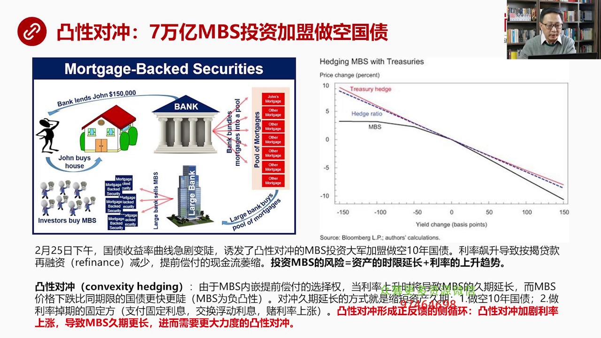

7万亿美元的按杰迭战券的NBS的投资者他们也开始作空国战NBS是什么干净的按杰迭更圈化那么如果我们用这张图来大治了解一下按杰迭正确化是什么概念比如说作为一个买房人你向银行贷款去买一栋房那么你向银行贷款时候签了一张白条签银行三十年的贷款每年每个月花多少利息对银行来说你的这张签条就是他的资产但是银行手上...

<strong>Cleaned narration</strong>

> 7万亿美元的按杰迭战券的NBS的投资者他们也开始作空国战NBS是什么干净的按杰迭更圈化那么如果我们用这张图来大治了解一下按杰迭正确化是什么概
> 念比如说作为一个买房人你向银行贷款去买一栋房那么你向银行贷款时候签了一张白条签银行三十年的贷款每年每个月花多少利息对银行来说你的这张签条就是
> 他的资产但是银行手上拿了太多成千上万人的这个资产之后他觉得套住套住了我因为我还想做更大的生意你把我的资产贷款给压满了几满了让我没有活动空间了
> 所以我想能不能快速出手把你这贷款卖出去我不要你的签条了我卖给市场中然后我中间可以吃一定的利润我就加快资金重转行不行可以有一段就是正确化我把几
> 十万三十万个贷款这个白条全部打打成包做放了一个资产池里头在这个资产池里面然后我做七分根据共同的一些特征比如说画分成三一级了或者几一级的然后根
> 据一些共同的风险共同的这个收益共同的承担那些种种的政权化了一些特征我把它做成标准化的债券形象说吧几十万个单独的个人的签银行的白条相当于几十万
> 头生猪我如果让消费者让投资人你买一投猪去把或买一片猪肉这太大好几百斤吃不了它的流动性很差但是如果我把几十万个这个生猪全部加工做成碎肉然后最后
> 做成猪肉贯头每个猪肉贯头就一公斤等重等量等制那么这个东西就好卖因为市场购买人这帮购买人我可能只买一个贯头也可以买十个贯头流动性大大增加所以按
> 揭抵押政权NBS就好像最后的猪肉贯头而贷款原始贷款就是当初生成了原始的生猪肉那个那个生猪肉贯头猪这样理解大家就就理解了所以NBS这种债券就是
> 标准化的债券化的类似猪肉贯头的一个一种债券那么这种债券实际上跟普通的企业债和银行和这个这个美国政府发现的国债它是不太一样的不太一样的地方在哪
> 呢不太一样的地方在于如果说比如说我们拿这张区件来看如果说红作标代表的是生意率纵作标代表是个债券的价格我们知道生意率上涨债券价格会下跌因为他们
> 是互相关系我们已经说过了就相当于房价和猪金回报率是一个道理那么如果它增长或者说这个收集率变大那么票面价格债券票面价格一定会下跌所以我们知道这
> 两者是一个互相关互相关呢到底是个什么曲线呢因为它是个寒树关系嘛我这边越大我的红作标越大我做作标越小那么这是个孩子关系具体化出来的寒树究竟是个
> 什么样呢NBS是这样的一个图形这个图形我们可以看到这个曲线中间有个突出的像肚子样的地方这个这个所谓的图形convetic这叫图形就是好像一个
> 人的肚子突出来了这个convetic是什么概念呢就是非现性的表明债券收集率上涨和它的价格成非现性的这样一个关系而且我们会发现随着收集率上涨我
> 这边涨越快我做作标跌的价格跌得愿愿猛在这边的时候我这个收率上涨价格跌得不明显而我过了这个这个点之后我价格如果跌了这个不断下跌的过程中我这边会
> 跌得更猛也就是协率会发生变化这个协率是什么东西呢其实我们可以跌成这个所谓的97的概念就在这也就是说一个债券的价格跟它的收益这个收益率变化它对
> 这个价格对收益率变化得晏感度如果收益率变化一点点价格跌得很猛说明我的突退性很大这个肚子凑得很圆如果说我价格变得很大而突形不明显或者叫价格跌得
> 不明显说明突性没有这么大或者说垫性没有这么大所以97这个概念带表呢这边的价格 收益率价格变化对于债券票面价值的影响力或者叫债券票面价值对于收
> 益率的变化的敏感度我们可以把它想成一条鞋线那么这一种NBS债券跟其他的国债债券有什么不一样其他国债的债券和其他的企业债券它的肚子是向反方向突
> ...

---

### Slide 15

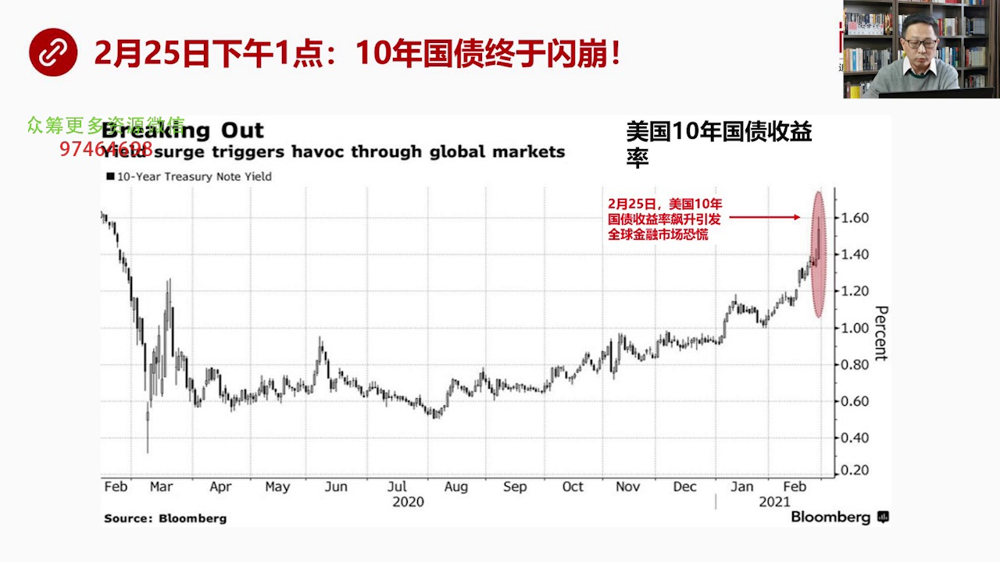

闪瘋这个闪瘋刚才我所说的一切其实在很短时间之内一个套一刻的一个套一个正循环不断的连锁爆炸到下午十年国债收益就标升了就会出现一个连续突破1.51.6从我记得在前1.2月24号国债税率是1.38开盘之后从1.38突破了然后这个开盘不久突破了1.41.5 1.6夸一下掌门基本上在当天就出现了个标升这种标升...

<strong>Cleaned narration</strong>

> 闪瘋这个闪瘋刚才我所说的一切其实在很短时间之内一个套一刻的一个套一个正循环不断的连锁爆炸到下午十年国债收益就标升了就会出现一个连续突破1.5
> 1.6从我记得在前1.2月24号国债税率是1.38开盘之后从1.38突破了然后这个开盘不久突破了1.41.5 1.6夸一下掌门基本上在当天就
> 出现了个标升这种标升导致了十年国债整个这个市场贪瘓它没有流动性了崩盘了闪瘋了然后导致了債券市场波动率大幅低升然后导致了后续连锁反应冲击了全球
> 金融市场最后出于了上海股市上海股市暴践而我们对冲基金经理或者是我们的共同基金经理或者我们的这个这个超股票这些基金经理把完全就没有搞懂国际上跟
> 发生上他们太年轻了既没有经过零八年金融风暴也没有对国际上有深入的透露者了解所以他们是不看外部市场或者不理解外部市场怎么冲击中国市场那在这种情
> 况下他的配置是不可能可信的或者在重大风暴之前是不可能有抵抗能力的而我们一般的金融的白领或者我们一般的金融的小白们更不懂国际金融市场所以你只能
> 说把钱委扣给这些二杆子的或者扮掉半层水的这些基金经理在帮你管理你能指望他能够对抗全球金融风险吗他根本就没有这样的意识也没有这样的知识也没有这
> 样的经验所以亏损是必然的这就是我们看到这次再次说明这个道理我们要真正要把中国市场做好你也对需要了解全球的金融市场如果缺乏这种经验就得在一帐一
> 帐的战争中间得从战争中学习战争从每个战役中间去积了经验去搞清楚这些政法会循环形成的核心点为什么会循环政法会什么样的政法会会导致现在市场出现这
> 样的表现我应该怎么办我们再看下眼好这个就是我们说的第三个循环政法会的外循环

---

### Slide 16

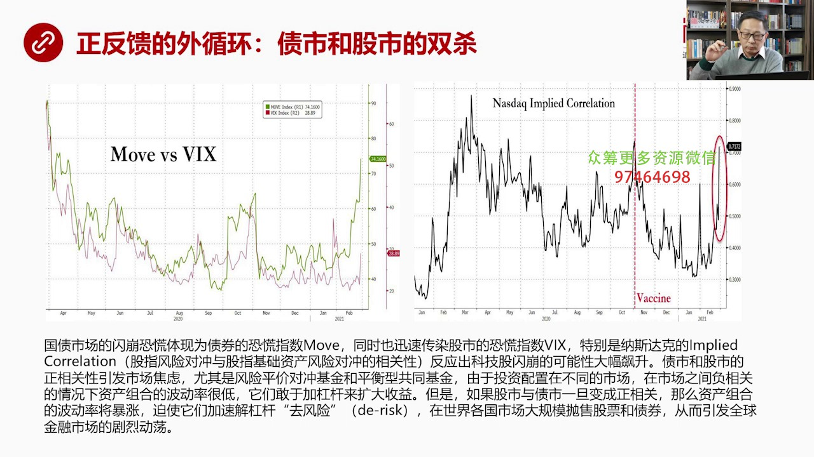

主要我们说的第1个循环是核心循环核心循环有两个一个是C天造成了外部的国载国载不断的被做空社会局不断上涨这是一个循环还有一个是李涛的小循环就是到了一定程度流动性会哭解国载会突然没有交易然后社会立会爆炸然后赞全波动立会爆炸这是核心循环内外两层还有一个是策循环NBS这是策循环现在我们要讲外循环是第三个循环...

<strong>Cleaned narration</strong>

> 主要我们说的第1个循环是核心循环核心循环有两个一个是C天造成了外部的国载国载不断的被做空社会局不断上涨这是一个循环还有一个是李涛的小循环就是
> 到了一定程度流动性会哭解国载会突然没有交易然后社会立会爆炸然后赞全波动立会爆炸这是核心循环内外两层还有一个是策循环NBS这是策循环现在我们要
> 讲外循环是第三个循环政法会第三循环是什么再是和股市的双杀为什么载是国载市场上出现这样的流动性哭解会导致股市爆炸会导致股市和载是一起爆炸因为我
> 们知道股市和载是两者应该是反方向应该是这种副相关载是如果出现这么大爆炸那资金应该永不股市来这个来寻求股市的投资收益相反如果股市出现爆炸大家会
> 到载是去避险这才合理这是过去很多年的经验但这次会没有出现股市载是同时爆炸其实不只是股市载是同的爆炸还有很多上投资也出现的爆炸这再次说明了这是
> 零进金融危机的状态零进金融危机的状态是流动性哭解流动性哭解会是所有自然的同时爆炸而美元升值美元的会立会升值正式二月二十五号一直到现在出现了一
> 个普遍的情况就是这样的一个行情那么我们来看为什么会出现这个现象比如说我们看到Move这个是债券市场的波动力Wix这是股票市场的恐慌指数这两个
> 是两个是不同市场的波动力但是在二月二十二十五号这一天却出现了同向债券市场的波动力的爆炸带动了股票市场的恐慌指数爆炸这就让我们看到一个连动关系
> 了国债市场的闪瘋它这种恐慌体现为债券市场恐慌指数Move指数的上涨同时Move指数的上涨也迅速产生到股市Wix指数的恐慌上涨当然特别是扣技股
> Nasdaq它中间的所以隐含的相关相关这个指数就是指个股指风险股指风险的对冲还有这个股指所对应的基础资产这间的对冲这两者这间相关性那么我们可
> 以看到这个指数也大幅上升这反映出了Nasdaq扣技股闪瘋的可能性飙升了其实我们最近看到所谓两个市场的分道阳标只要国载顺利的上涨Nasdaq跌
> 得更么有时候甚至到程私在上涨Nasdaq也会下跌什么原因就是这个原因债券是和股市之间它出现了正相关性这个引发市场很大的焦虑因为市场中很多基金
> 比如说风险评价基金还有平风型的这个共同基金等等这些基金都是在股市这个债是同时配置大量资产的我两个都配置的资产我配置在不同的资产如果说是副相关
> 情况之下我可以相互抵抄波动性的风险但是如果变成正相关那我们提择到副相关的情况之下波动率很低两个市场组合产生的波动率很低所以正式越波动率低我以
> 它为倒下我就敢于加上岗来扩大收益但是如果现在变成正相关那这个东西就危险了我的波动力机会大幅上升大幅上升我就没有办法再加上岗来扩大收益了我必须
> 要解决岗岗去风险解决岗岗去风险就意味着我要在股市债是终同时拋售资产而且不仅在美国由于这些基金都是全球配置的所以在世界各国市场上我需要大规模拋
> 售股票和债券所有市场上我都得拋从而引发了全球金融市场的具体动盘我们再看下夜那么具体产生交叉传染就是从债氏传染的股市

---

### Slide 17

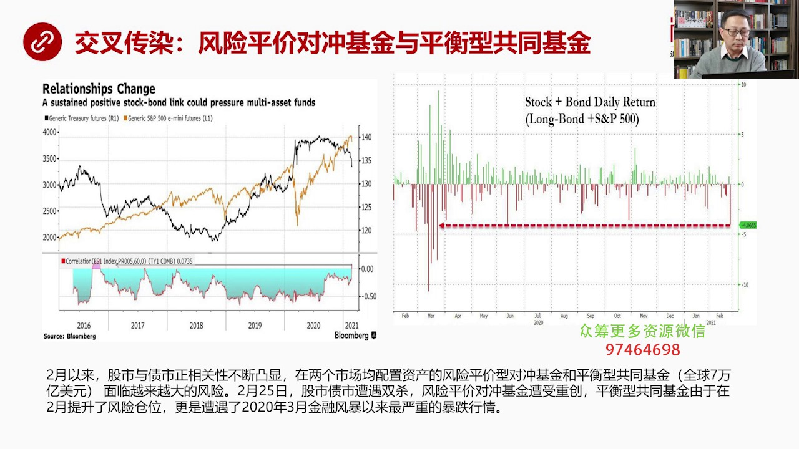

靠谁呢当然就是风险评价对冲基金还有平风形的共同基金如果我们来看这个两个市场的关系股市我们可以看到这是SNP的变化然后这个国债期货是黑线所以两者在二月在二月份的时候出现了正相关本来长期都是副相关一旦突破了零在这个点上突破零变成正相关好这个市场的反转就出现了这个反转疫出现就会出现我刚刚所说的弥联串的这两...

<strong>Cleaned narration</strong>

> 靠谁呢当然就是风险评价对冲基金还有平风形的共同基金如果我们来看这个两个市场的关系股市我们可以看到这是SNP的变化然后这个国债期货是黑线所以两
> 者在二月在二月份的时候出现了正相关本来长期都是副相关一旦突破了零在这个点上突破零变成正相关好这个市场的反转就出现了这个反转疫出现就会出现我刚
> 刚所说的弥联串的这两个类型的基金就得就得面临他们的资产他们的债券和股票资产所形成这种组合的波通的上升他就被迫要解放法被迫要去风险所以二月以来
> 由于这两个市场正相关性不断突显最后终于翻证在这两个市场均配置资产的这两种基金比如说平衡性共同基金他就有7万多亿美元我们再加上刚才做NBS投资
> 的也有7万亿平衡性内容基金也有16000亿所以这些基金加了一期这个资产是非常巨大的由于这两种基金面临越来大的风险所以他们被迫解放法解放法就是
> 一起炮股市债势股票债券一起炮2月25号股市债势遭遇了双杀风险平价基金遭受重创平衡性共同基金他在20份实际上升高了仓位更是遭到了2020年金融
> 风暴以来最严重的爆炼行情我们也从他这一天的爆炼行情中可以看到这些双配置的股票市场和战争上60到40这种配置比例的这种平衡基金遭到了重创这一天
> 下跌的幅度也是非常仅仅执追去年的金融风暴所以这两类基金风险平价和平衡性共同基金都遭到了重创这就是为什么会产生全球金融风险金融市场动荡那么我们在他为什么美债爆炼会重新中国市场很简单

---

### Slide 18

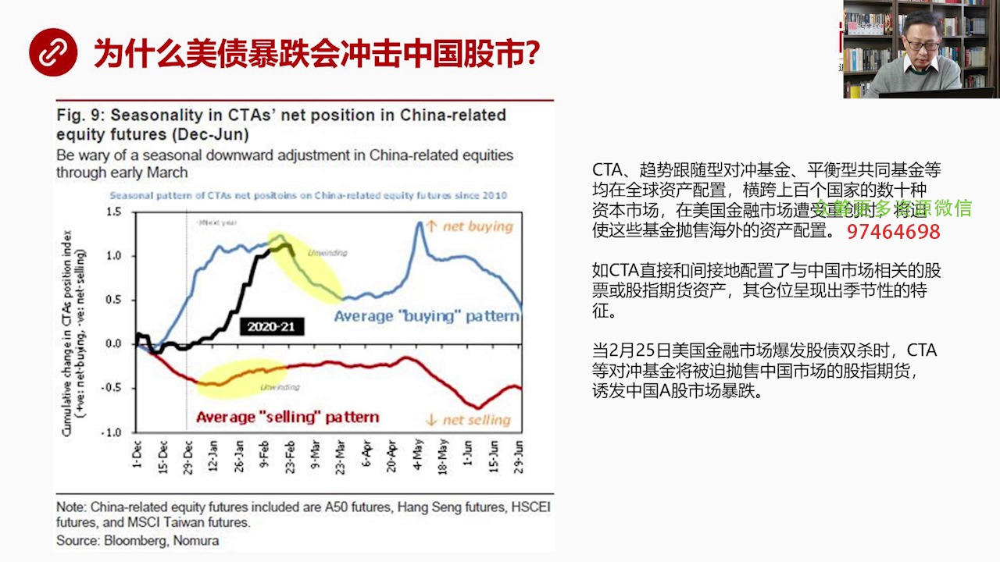

CTA这种对重基金趋势更最新对重基金平衡性共同基金还有风险平价对重基金急等等这这几种对重基金还有这个共同基金都是全球配置资产的而且他配置的资产横跨了上百个国家几十种资本市场如果他们在美国金融市场遭受重创由于他的资产波动力大幅上升他被迫解干干抛弱各种各样的资产所以他那个时候将被迫抛受这些基金加内企被迫...

<strong>Cleaned narration</strong>

> CTA这种对重基金趋势更最新对重基金平衡性共同基金还有风险平价对重基金急等等这这几种对重基金还有这个共同基金都是全球配置资产的而且他配置的资
> 产横跨了上百个国家几十种资本市场如果他们在美国金融市场遭受重创由于他的资产波动力大幅上升他被迫解干干抛弱各种各样的资产所以他那个时候将被迫抛
> 受这些基金加内企被迫抛受海外资产的配置比如说CTA其实CTA长期来一直在中国进行资产配置他直接和间接配置了与中国市场相关的很多股票或者股质期
> 货的资产他有的是在中国境内有的是在香港有的是在其他地区都可以配置只要跟中国市场相关的这样的一种资产配置他的倡位已经显示出了在2020年到20
> 21年已经显示出了一个继续性的调倡的这样一个规律比如说这是卖的一个继绩调倡的规律这是境卖这是境卖所以他在最近一两年已经形成了一个继绩性的调倡
> 的就是什么时候我买什么时候卖集体的这种行动其实已经存在了对中国市场继绩性的冲击性那么到2月25号美国金融市场爆发的股市股债这个股债双杀的时候
> 金融市场崩溃股债市场流动性没有了那么CTA等等这四种对中基金就会背破炮售在中国资产中国资产这个市场上所有的相关的资产包括股市期货包括中国的股
> 票当然这样的一种集中的发作集中的力量爆发永远不是资产大和小的问题而是在一个很短时间里面你有个爆发力爆炸力这个是最重要就好像我们说少临四的武功
> 他这个异阳纸或者他这个武功他真正的力他真正的绝强是在最短时间里面集中全身力量打击一个点产生高压强那个压强就是在一个基本时间里面在一个点的突然
> 发力是武功的全部的核心金融市场也一样如果这些基金背破在一个很短时间里面在一个市场中的某一个点上集中发力这个市场就会爆的所以这就是我们看到中国
> 股市受到了外股市场的强烈冲击不仅仅是心理冲击而是一大币人在一个市场的一个点在基短时间里面突然爆发就是让就会出样的问题而这个市场一旦出现了崩塌
> 这个跡象正反会循环就会加入比如说其他的基金就会跟进然后把散货带进来如果最后是大家瘋狂出逃会形成一个人家马翻相互见踏的这么一个局面这就是为什么
> 我们需要了解全球经济上变化的规矩好 我们再看下夜虽然就是说我们现在回过头来看我们的美元行李报告

---

### Slide 19

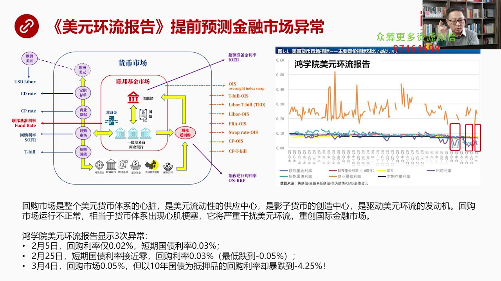

其实是提前预测的经济市场的一场你比如说在我们的这个行李报告中我们知道我们核心的货币市场地图是这一场美国的核心货币市场包括联邦基金市场还有短期国债回够商业票据定期存单和欧洲美元然后他们通过各种利率各种利率就好像是测试这些六个货币市场不同的温度不同的压力不同的流动性等等通过这些利率来做测试美元行李报告每...

<strong>Cleaned narration</strong>

> 其实是提前预测的经济市场的一场你比如说在我们的这个行李报告中我们知道我们核心的货币市场地图是这一场美国的核心货币市场包括联邦基金市场还有短期
> 国债回够商业票据定期存单和欧洲美元然后他们通过各种利率各种利率就好像是测试这些六个货币市场不同的温度不同的压力不同的流动性等等通过这些利率来
> 做测试美元行李报告每次关注的就是这些关键的测试点是不是反映这几个市场的正常运转那么我们从美元行李报告中间已经可以发现每一期的货币报告中都会累
> 积这个数据我们可以明显地发现在2021年2月5号这一天我们已经发现这市场出现一场了就是我说的短期国债还有回够利率在这一天明显偏离平均线0.1
> 2.0.1出现了一个大幅下跌还有2月25号这次还有3月4号这一次连续3次出现了所谓的我们看到回够市场的異常或者叫美国货币市场的異常回够市场我
> 们反复讲调是整个美元货币体系的心脏是美国流动性它的供应中心是美国影子货币的创造中心也是驱动美元还流全球还流的发放机所以回够市场是问题的中心也
> 是问题的要派如果回够市场长期出现运转不正常就相当于货币体系出现的心机肯色它将严重的干扰美元货币严重的时候会重创成就正常所以我们一旦看到这样的
> 一个现象就应该报警这个货币市场的这个警民就应该想起来或者红灯就应该开始闪烁从我们的美元货币报告中我们可以发现有3次一场2月5号回够利率跌到只
> 剩0.02短期国债利率跌到只剩0.032月25号短期国债利率接近0回够利率跌到0.03最低跌到0.05跌到复利率了3月4号回够市场利率跌到0
> .05但以10年国债为底下的回够利率却报跌到0.05的4.25这是个非常惊人的数字好我们现在看一下这几个时间点到底出现了什么看下眼为什么回够利率会在3个时间点出现一场如果结合我们刚刚所说的

---

### Slide 20

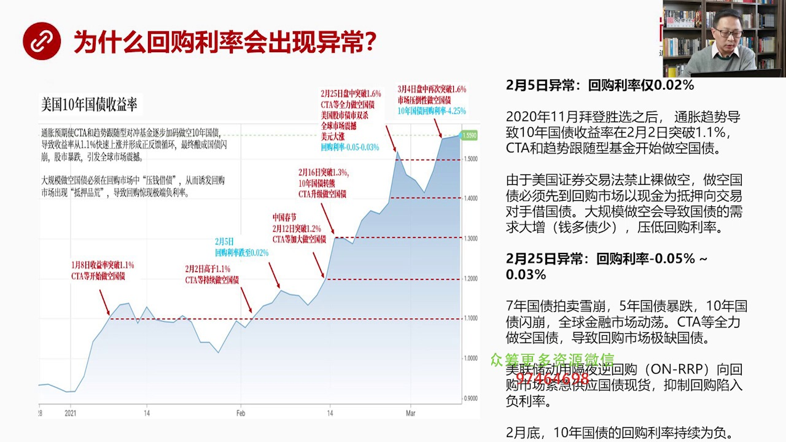

这个对美债对美国国债他的内外循环的这个正反亏这机制的产数我们就应该对这上号2月5号这一次也就在这回够市场回够市场的利率跌到只剩0.02什么原因因为拜登圣选之后通脏于7导致时间国债社会率在2月2号在这个时间点突破了1.1所以天和趋势跟随行对中基金在这开始做空国债做空国债由于美国政权交易法它是禁止罗造空...

<strong>Cleaned narration</strong>

> 这个对美债对美国国债他的内外循环的这个正反亏这机制的产数我们就应该对这上号2月5号这一次也就在这回够市场回够市场的利率跌到只剩0.02什么原
> 因因为拜登圣选之后通脏于7导致时间国债社会率在2月2号在这个时间点突破了1.1所以天和趋势跟随行对中基金在这开始做空国债做空国债由于美国政权
> 交易法它是禁止罗造空的就是你必须得手上得有货或者能搞到货你才能够去卖空你不能够说你啥都没有就卖空所以这帮人要想做空美国国债必须要先到回够市场
> 上以现金为底向交易对手去借国债注意你是以现金为底去借国债这个时候你对国债的可求超过了现金的价值就是现金对于那时候可能不算啥而国债非常保归而大
> 规模做空会导致国债的需求上大增也就是钱很多而国债相同叫少抵押品生质了抵押品生质就意味着回够利率会下降据个简单类子如果说我们到如果把回够上理解
> 成这个山西票号或者山西这个商劲商的这个弹扑如果你压的是一个破壁这个皮牢人家收获的时候就说破壁烂熬一件中间又有葫芦又有洞还掉了扣子猪子死在的他
> 要压低压低这个商品的价格或者压低他得压价格本来你值一百两营的他说你只值七十两然后还给你个很高的利率因为那时候钱更之前但反过来如果我压的是个宣
> 众爐情况就不一样如果说宣众爐全中国没有几个或者没有多少这个东西太罕见了太罕见他的价值非常高那么我抵押的时候这些大户老板大家有钱人多的事但是宣
> 众爐没见过这个时候就会出现对宣众爐的竞争或者叫拼强有人说你宣众爐如果是一万两营资我给你一万一万零三百怎么样有人说我给你一万零五百怎么样我就想
> 拿着宣众爐我看一看拿手上摸一摸也好所以我愿意给你的意价我收你的宣众爐作为抵押品我还给你手续费倒给你钱这就是复利率概念就是收你的抵押品我还到复
> 你抵押品的手续费放着我这儿我还到复你钱这就是回够利率为负的概念那么二十二十五号出现的异常回够利率跌到负的零点零五为什么会出现这个现象因为当天
> 七年国债拍卖选丰了五年国债暴跌十年国债闪瘋这三个国债整个社区的期限全崩了全球精神市场动荡CTA这些队中基金全部都在作空美国国债导致由于作空大
> 家到处回够上去接导致回够市场极度断缺国债国债限货没了所以我们的环境报告中指出美联储动用了格业匿回够向回够市场紧急动印国债限货因为国债限货都被
> 激光了那怎么办美联储通过格业匿回够向市场紧急动印国债限货就是你们把钱给我罢就是你们把钱给我压到我这我把国债提供给你们然后你们有着这个国债逃去
> 作空或者满足作空条件或者去压评议这个对国债这个需求那么美联储这么做是主要目标是为了一致回够限制复利率但是格业回够这个匿回够它有很多限制比如说
> 一个教育对手我只能给你三百亿美元的国债的上限不能插过这个数所以我没法给你更多这是美联储自己定的规矩那么也就说这个紧急动用了这个紧急格业匿回够
> 并没有真正能够挽救限制复利率这样一个局面那么到了二月底十年国债回够复利率变成了一个持续的长期现象一直为复怎么办说明回够上出在严重不正常的状态
> 同时也说明在国债市场上做空美国国债的力量仍然非常强的我们再看下野那么到了三月四号市场甚至出现了极端复利率的情况

---

### Slide 21

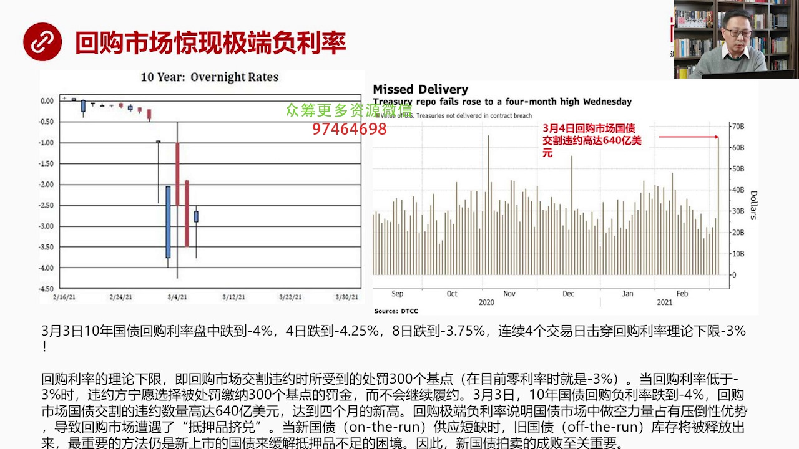

我们可以从这段头上可以看出来十年国债抵押的回够利率早在二月底的时候就已经出现了复利率的情况只不过没有这么明显到了这个二月三月三号时候就已经复了百分之一了注意超过百分之一复了百分之一这叫显著的复利率到了三月四号却到了百分之四点二五这就出现了严重的复利率就这个线然后再往后我们可以说连续好几天从三月十号开...

<strong>Cleaned narration</strong>

> 我们可以从这段头上可以看出来十年国债抵押的回够利率早在二月底的时候就已经出现了复利率的情况只不过没有这么明显到了这个二月三月三号时候就已经复
> 了百分之一了注意超过百分之一复了百分之一这叫显著的复利率到了三月四号却到了百分之四点二五这就出现了严重的复利率就这个线然后再往后我们可以说连
> 续好几天从三月十号开始跌到负的盘中跌到负的负了百分之四四号跌到负的百分之四点二五八号跌到负的百分之三点七五然后连续四个交易日都集团了理论下限
> 值百分之三这有三次超过了下线理论下线有四次超过百分之三的理论下线就非常非常令人震撼因为这样的情况非常很几乎很少出现那么同时我们可以看到另外一
> 个非常异常线就是三月四号当出现百分之四点二五负的百分之四点二五极端这个复利率情况之下三月四号还出现了国债交格委员率达到了一个非常高的一个点四
> 百六百四级美元委约了交不了了这两个事情要结束在一起我们才能理解回够市场出现了什么首先我们来看为什么负的百分之三是个理论下线就是回够市场交格委
> 约它会受到处罚处罚多少呢比如说清算所处罚你三百级点那么现在是零利率也就是负百分之三也就是如果说你要做空国债最后你还要把国债买块交给我还给别人
> 最后你在市场上买不到了怎么办你可以委约你可以选择委约委约罚你负了百分之三如果说回复利率跌于这个低于负的百分之三那么委约罚它宁愿选择我就被你处
> 罚就放我不会再继续执行这个合约因为对我来说委约更便宜一些更合算一些3月3号10年国债回复利率跌到4%回够市场交过了交过了委约数量高达640亿
> 美元达到了一个4月的新高那么回够出现了这种极端负利的说明什么说明国债市场上做空国债的力量占据了压倒性的优势导致在回够市场上抵押品变得非常罕见
> 非常稀缺就是导致抵押品的几对导致的对10年国债的几对那么在市场中新国债就是安德朗比如说3月份拍卖这次国债3月10号拍卖360亿美元这个美国新
> 年国债这个拍卖的时候出现这个当月的当季正在流行的叫新国债然后这个拍卖完了之后最后通过一交易商转到了保险公司转到了各种基金它的压仓库的不在市面
> 上流行了比如说过了好几个月了就变成了老国债这叫奥特朗我们所说的国债收益率指的都是新国债安德朗的国债所形成了交易的价格因为老国债一般很少交易流
> 动性很差新国债它的收益率交易出来收益率是用新国债作为这个机架标准的如果现在出现的情况是回够市场中一交易商库存没有了美联储的库存被一交商也借光
> 了然后市场中能找到的时间国债新国债也没了出现了这种情况而且在这种情况之下三个地方都找不到国债加内期还不行出现了富的4.25这样的集团复利率那
> 怎么办大家只有翻箱导归着找老国债了老国债库存将会被释放出来来环节这个压力所以最重要的问题仍然是抵牙品的严重稀缺严重稀缺就时间国债不够了怎么办
> 只有新拍卖国债才能环节这个问题这就是为什么我们说新拍卖国债的成败至关重要我们上周所说的比如说十年国债二月份他拍卖了比如说四来多亿国债那么他过
> 一个月会重新叫Reopening再卖一次跟上跟这个二月二十号相跟二月十号相对应的同样的条件的十年国债再卖一次这次就是361然后再过一二十年还
> 要再卖一次两次Reopening另外一次还是361第一次大概481所以我们所说的不是就是我们这个重点谈到了不仅仅是三月十号卖的这一次还有第二
> 次361的国债拍卖这两都是Reopening对二月份所发现的国债一次补充发行所以这两次国债拍卖是我们需要观察重点这大概在未来一段时间需要重点
> ...

---

### Slide 22

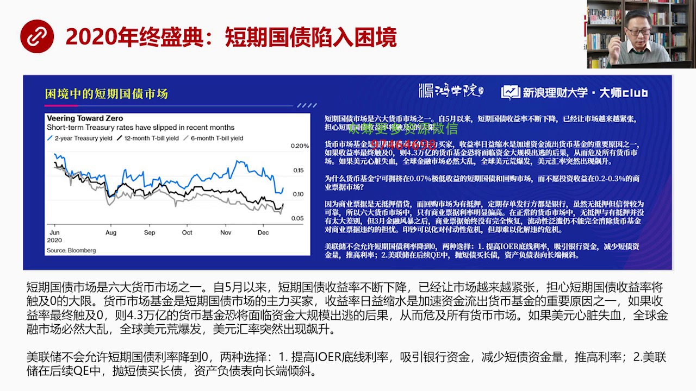

还有一个现象就是短期国债陷入了非常低的也是0.0202030这么低的一个困境我们所说的未来有一段时间有可能短期国债也会跌到复利率什么原因就是我们看到社区区限越来越倒大量资金从长端向短端大规模的转进导致短期国债这个承受成秀价利越来大大家都风强强就有可能强了数数同时在加上美国财政部还要大规模的在未来半年...

<strong>Cleaned narration</strong>

> 还有一个现象就是短期国债陷入了非常低的也是0.0202030这么低的一个困境我们所说的未来有一段时间有可能短期国债也会跌到复利率什么原因就是
> 我们看到社区区限越来越倒大量资金从长端向短端大规模的转进导致短期国债这个承受成秀价利越来大大家都风强强就有可能强了数数同时在加上美国财政部还
> 要大规模的在未来半年之内要大规模的把现在处置在美联处仗上前要转到金融市场里头来也就是要转向要花一点1万亿支出这一点1万亿支出只不管你是个人还
> 是政府这种支出最后都会通过不停的周转都会转到金融体系之内都会免行的上上那么免行将会在未来很短时间里面增加1万亿的现金而它资产负赂表已经无法承
> 受1万亿现金的库存量它吸收不了这么多吸收不了这么多现金因为它现在资产负赂表被挣着索死了如果三月底不能得到延长化就是所谓的SAL2就是補充这个
> 槓杆利率如果補充槓杆利率如果不能得到释放的话那么它就会出现水漫金山的现象1.1万亿进入金融体系金融银行底下收不了那就会转得货币基金货币基金就
> 只有投到国债而国债如果是短期国债如果是一个附数好家伙那就出大问题了这其实是我们在2021年年龄圣典12月份就已经说到这个问题就是短期国债已经
> 限制了困境短期国债利率从去年年中就一直下降到现在跌得更厉害了只有两三个几点了那么这就会出现问题因为我们看到了这个货币上基金它是短期国债的主要
> 买家由于收益率日件所水变越来越少实际上导致了货币市场基金的大量的资金的外流从去年到现在我们看到了商业票举市场的利率上跟这个事儿就是直接相关的
> 如果收益率最后碰到了零跌到了零甚至跌到了附数货币市场基金就没法办了它就没有地方投资了这个时候我们会发现4.3万亿的货币市场基金将会面临资金大
> 规模出逃的后果大量熟回基金因为货币市场基金没法逃了如果说短期国债只有零利率甚至附利率我还逃什么那我为什么还把钱放在货币市场基金我这会大量抽逃
> 一旦货币市场基金的钱被抽光了它就会影响其他货币市场了比如说商业票举市场没钱了因为这些钱也是来自于货币市场的它没钱了那所有其他回够市场包括这个
> 商业票举市场定期存在上这不都出问题了吗这就会导致整个美元流动性心脏实写也就是美国的六大货币市场相机都会发生问题那全球金融上必然大乱这就会导致
> 全球的美元换货发美元汇率会大幅比较生这种现象怎么避免每年处其实没有什么好的办法只有几种一种选择就是要么你放开被银行的管制让它能够心脏更多的信
> 金否则的话它要心脏不了就会转到后面上货币市场被逼及了逼到货币的他们资金会被抽逃全部的货币市场都会出问题这是一个办法第二就是提高超准备金的底线
> 利率西纳是银行的金头脑纳减少对短債的压力还有就是抛短外卖长債就是所谓有趣操作或者是进行社会的期间的控制无非这是几种办法当然还有一种我上次也提
> 到就是取消两个警国兆中间的一个一个是对第一个是对银行的资格表现第二警国兆是对隔疫匿回够的限制取消它让货币上基金可以把隔疫匿回够作为一个投资的
> 方式让它来吸纳大量资金现在三百亿太少取消了之后你多出了一万一两万一我都可以这个每年处然后通过隔疫匿回够来赚钱所以这几种方式必举其一我们最后看
> 这次美债社会对震撼我用这张图来总结这场震撼它的形成的机制和对外部长冲击的它的原理大家可以想想就是我们看到大量的文字性的东西

---

### Slide 23

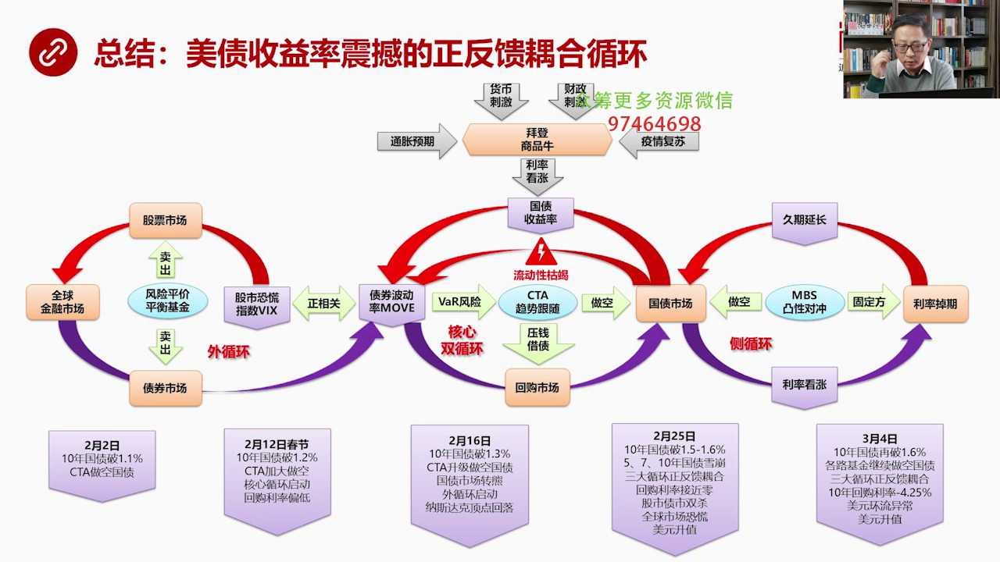

然后看到很多说明性的东西它们看到很多数据我们把这个背后的逻辑慢慢的理论画点时间还是能做到但是脑子面有了这些逻辑有了这些数据之后怎么把它图形化把它画出来特别是把中间一圈它为一圈的这个正反备机制给画出来这个事儿可太难了其实我理解这个机制时间很短但是要画出这场图来起码画了两个星期时间一直在做我们怎么展现怎...

<strong>Cleaned narration</strong>

> 然后看到很多说明性的东西它们看到很多数据我们把这个背后的逻辑慢慢的理论画点时间还是能做到但是脑子面有了这些逻辑有了这些数据之后怎么把它图形化
> 把它画出来特别是把中间一圈它为一圈的这个正反备机制给画出来这个事儿可太难了其实我理解这个机制时间很短但是要画出这场图来起码画了两个星期时间一
> 直在做我们怎么展现怎么把逻辑给展现出来才能够最形象最深度的说明这次收益对报长所产生的正反亏的我和了这种循环究竟是怎么引爆这种事场所以直观形象
> 画是最具挑战性的一个工作在这里我画了三个循环什么来引爆这三个正反亏循环当然这个是通过膨脏预期通过膨脏预期从外部施加压力再加上疫苗复苏从外部施
> 加压力再加上美联储的货币观众政策的刺激还有拜登的财政刺激几个似乎离达加内期造成了拜登上台之后他盛选之后出现了大东商品的一个牛市号成拜登商品牛
> 拜登商品牛代表着各种物价资源的和长期的到大东商品的价格都在上涨这些东西上涨必须要要求利率必须要求一个补常条件你看这东西都涨了我未来投资我这个
> 通过膨脏肯定会上涨那我利率你必须要求必须要有更高利率要不然补常不了通过膨脏筍时所以就会形成利率看涨的预期这几种利量通过商品价格上涨传导到金融
> 市场上就是利率看涨这是一个大势所区那么利率看涨就会影响国债收益率刚才我们说了四三个国债收益率通过膨脏预期的收益率还有十年国债的一个名义收益率
> 再加上真是收益率就会影响国债收益率而国债收益率上涨这是大2月2号突破了一点大2月2号突破了一点一之后就导致CTA开始做工作债了然后在2月12
> 号前后就形成了债券的波动率的上涨就是我们一开始那样突所以国债收益率上涨到一定程度就会激发债券波动率的上涨这是所谓的这一圈外云还债券波动率上涨
> 之后才就会导致风险评估的重新进行风扇评估的风险加大了就是我现在用了资产在波动率上涨情况之下我风险变大我怎么办我需要解岗岗我需要去风险这就会促
> 使CTA对中基金和趋势形容对中基金他们开始做调整要做空国债怎么做空我要到回够市场上去借钱我要压我的现金借国债然后拿这国债来做空国债事当然我也
> 可以做做空国债的七货市场但是做空国债七货市场最终你还是要去找国债因为你要最后要把市场中做空国债之后你要交哥对吧要交哥也是需要国债的当哪去找还
> 是要回够市场去找所以他的逻辑是这样的由于大家都做空国债国债价格就会下跌国债价格下跌稍微就会上涨然后又循环回来然后上升到1.23之后也就2月1
> 6号之后这就变成了你国债就变成熊市了变成熊市之后更多人开始做空债券导致波动力更加上涨然后导致更多人做空这个进行风险重工然后导致更多趋势跟随形
> 和CT这些基金做空国债然后到回够上借钱然后再进一步强化国债上做空这个外循环一圈一圈一圈从2月2号一直持续到2月25号终于2月12号春节2月1
> 6号2月25号终于引爆了内循环圈内循环圈就是国债生间国债流动性枯节到下午1点2月25号下午1点国债生间国债税标升然后导致生间国债流动性枯节然
> 后导致它的委员导致这个债权波动率大幅跳升也就说国债没有成交了成交都成交不了了然后这些东西就会加剧在2月25号进入了一种疯狂的一种恶化状态这就
> 导致美国时间国债崩盘这个是我们讲清楚了内循环的原理这个核心循环包括外面圈包括里面一圈里外那么除了这个之外爆了2月25号它又引爆了这个市场就是
> 突性对冲这个循环的这个正常会循环的加速突性对冲我们已经讲了突性对冲它有两个问题一个是97延长就是我持有NBS它的7件变长了同样呢出现的趋势是
> ...

---

### Slide 24

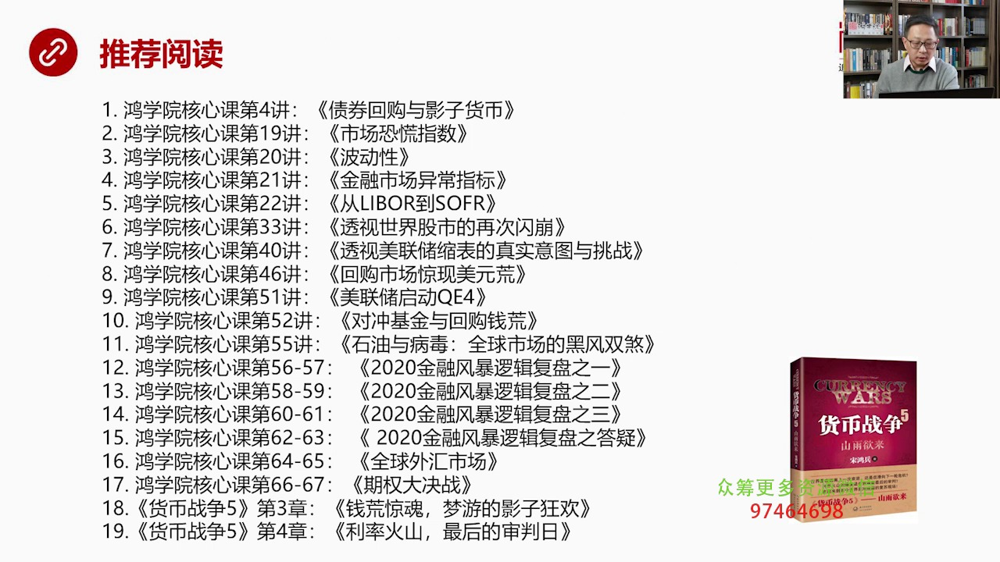

下验就是我们推荐了一些月毒的材料关于我们核心课程讲跟股票市场在任市场相关的这一系列的核心课程我们已经讲了很多期了中间大家可能会对某些概念比较生出比如说什么叫波动性什么叫广防指数比如说什么叫回够什么叫这个七圈决战什么叫外汇还有包括一些书里面的一些内容大家搅在一起就会形成一个对于这次美国国债社会对于大幅...

<strong>Cleaned narration</strong>

> 下验就是我们推荐了一些月毒的材料关于我们核心课程讲跟股票市场在任市场相关的这一系列的核心课程我们已经讲了很多期了中间大家可能会对某些概念比较
> 生出比如说什么叫波动性什么叫广防指数比如说什么叫回够什么叫这个七圈决战什么叫外汇还有包括一些书里面的一些内容大家搅在一起就会形成一个对于这次
> 美国国债社会对于大幅标升导致全球金融圣汗就会有个更全面更透明的明景好今天我们的课就到这里谢谢大家

---
