# 核心课视频-74、75 _ “辩证法”的手术刀 — Clean Slide Notes

> **来源**：鸿学院核心课程  
> **幻灯片**：23 张

---

### Slide 1

---

### Slide 2

今天我們上核心課第74和75講黑格爾變成法的存在論部分黑格爾這本書我們在讀書會的收關解讀中大致講了一下但是黑格爾這個小邏輯很難懂主要是由於它的表達方式還有概念的抽象性這些東西如果不經過圖形化的處理或者把它轉變成一種我稱之為是一種用直觀的形式來展現的話那麼將會大大影響大家的閱讀的效率就是看不明白你也不...

---

### Slide 3

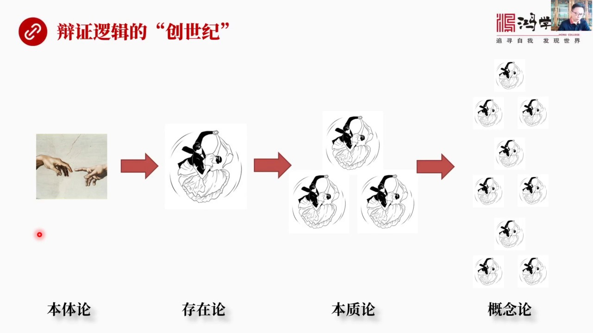

在我看起來它是一種變正邏輯的創世紀也就是它在西方哲學體中間它的作用比較像聖經中的創世紀也就是它試圖從一個本體論的角度出發通過嚴密的邏輯然後來逐步推導這個世界是如何從混沌出開的狀態然後逐步發展和演變成現實世界所以我們這一張圖我稱之為是變正邏輯的創世紀的總圖通過這張圖我們大概可以看出黑格爾的全部的它的思...

---

### Slide 4

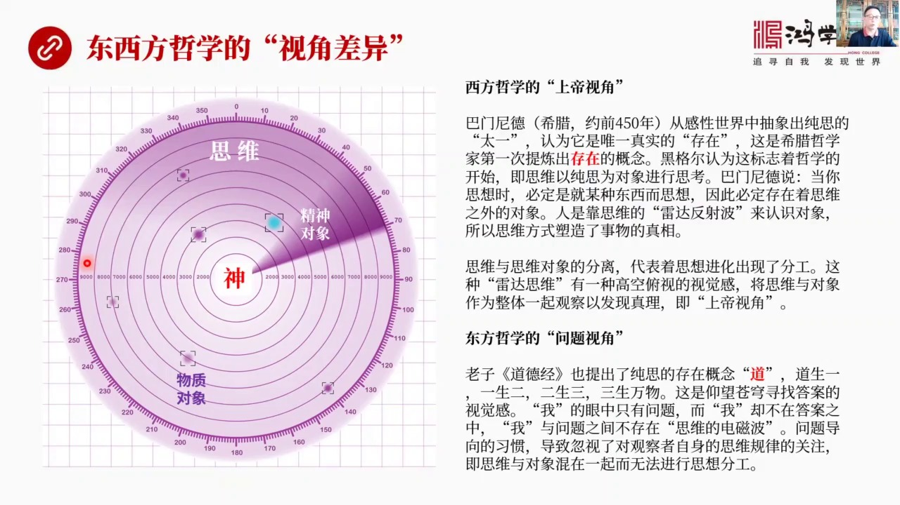

這個問題我其實一直在琢磨因為我們讀黑格爾小邏輯的時候所以到了痛苦就是你讀它的表達習就表達這個用詞和習慣用於你會非常的不習慣你不太理解它為什麼會這麼說它這麼說的它這個表達習慣跟我們非常不一樣其實表達習慣的不同代表我們思維的方式或者叫我們看問題的視角存在重大了差異越是你看不懂的地方你越琢磨它你才能真正發...

---

### Slide 5

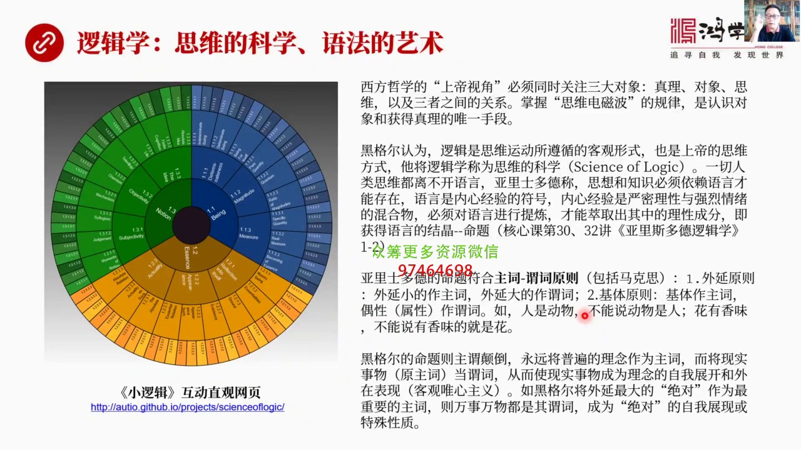

所以他必須要同時鍋關注三大對象就是真理對象和思維因為我們在想問題的時候尋求答案的時候這叫真理然後這個問題本身就是對象所以中國哲學由兩個觀察對象真理和對象這兩者但是我們不觀察思維而西方這個上帝視角使他同時關注這三個目標我們只關注這兩就是真理對象和思維以及三者之間的關係所以西方的哲學認為我們只有徹底的理...

---

### Slide 6

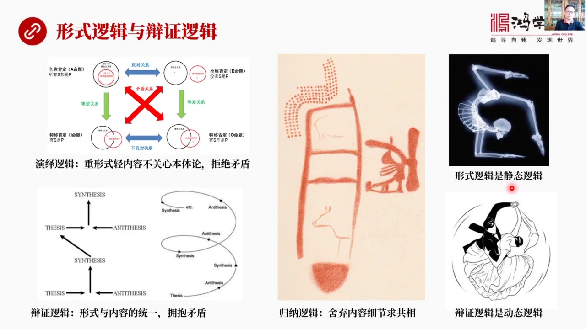

我們從亞利斯多德那個核心科裡面我們講過傳統的邏輯是演藝邏輯歸納邏輯這都通稱為是形式邏輯我們核心科裡面專門講過演藝邏輯演藝邏輯重視什麼重視形式而親內容我根本不管內容是什麼我只管形式也不管新世界的本體到底是怎麼來的怎麼創造宇宙的這個事兒給我沒關而且演藝邏劇拒絕矛盾因為矛盾一出現矛盾這個命題就是假命題了不...

---

### Slide 7

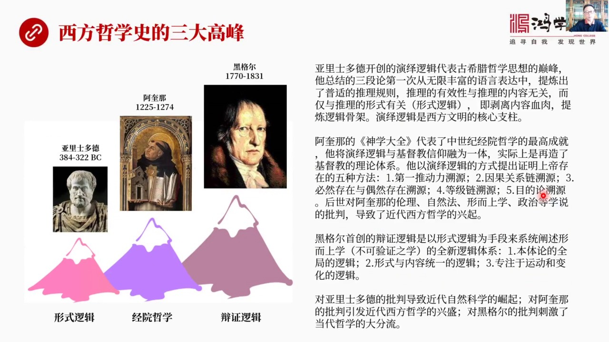

第一個高峰就是古希臘到了亞里斯多德那個時代達到了頂峰亞里斯多德最大的貢獻是創造了演藝邏輯提出了著名的三段論三段論是第一次從無限複雜的語言表達中間提練出了普遍性的推理規則這個推理的有效性與推理的內容毫無關係而僅僅和推理的形勢有關所以它為什麼叫形勢邏輯你說的具體內容我通通不管只要你滿足我這個三段論的基本...

---

### Slide 8

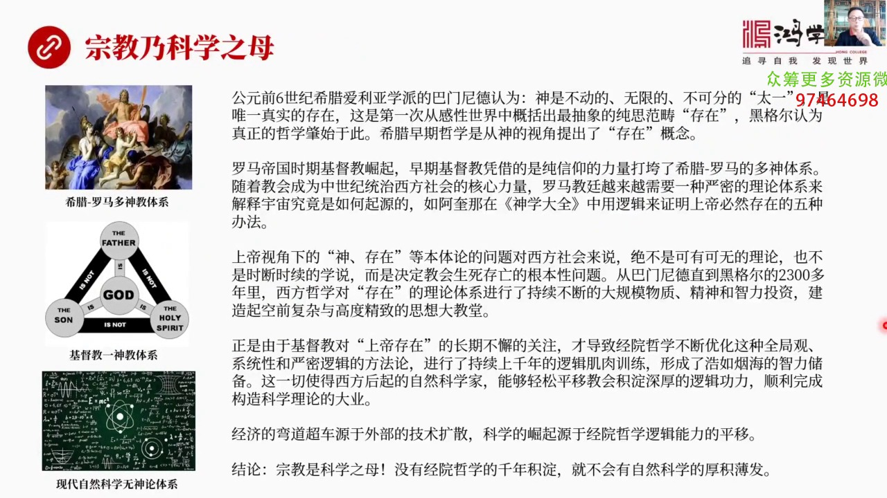

是科學之母這是我們提出了一個新的論點我們都知道宗教和科學是矛盾的但實際上矛盾又是對立統一的你比如說從宗教科學進化的全過上來看希臘羅馬那個時代是多審教這個艾里亞學派的巴比尼德說了神是不動的就是太一黑格爾認為這個馬文尼德這個概念很好第一次提出了純粹思維的東西存在這個概念提出標誌著哲學開始了它也是從宗教開...

---

### Slide 9

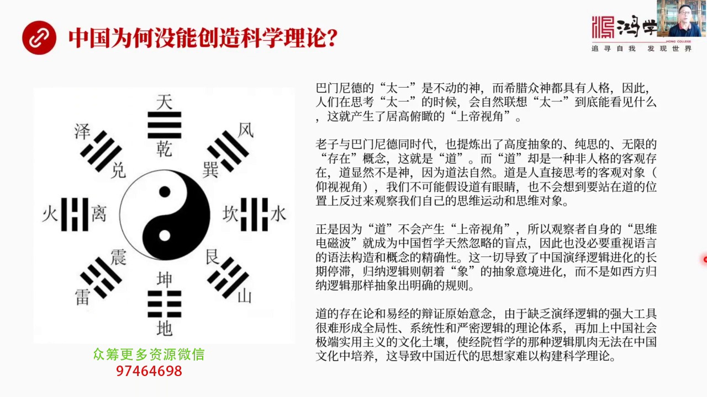

巴門尼德說的太醫是不動的神他是神而希臘所有的神其實都有人格所以我們在思考太醫思考神的時候我們首先就會自然聯想到這個神到底能看見什麼這就產生了高空腐視下面這個上帝視角他有視覺感因為他有人格我們把它理解成人但老子他的道可不一樣道也是高德抽象的純思的無限的存在但道是一種非人格的東西它是一種客觀存在沒有人格...

---

### Slide 10

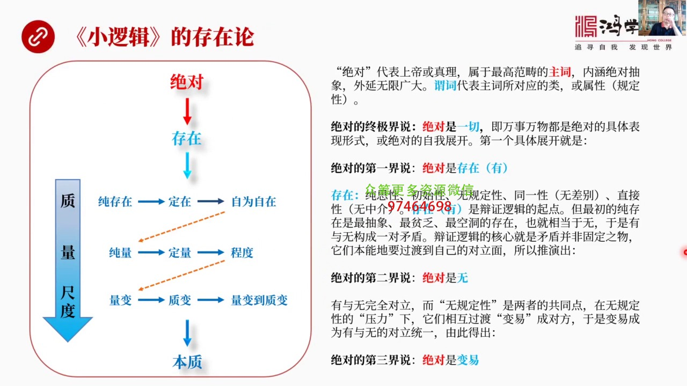

所以我們特別需要學習我相信這種邏輯肌肉訓練是可以通過學習掌握的就像肌肉可以通過氧來斷臉是一個道理小邏輯這本書就是最好的磨刀石去練我們這思維的手術刀去磨這手術刀去練我們的思維邏輯因為小邏輯很難懂小邏輯非常難懂這其實反過來說明我們知道它是個極大成者黑耳它的書很難懂說明我們跟它的差距非常之大所以這個時候正...

---

### Slide 11

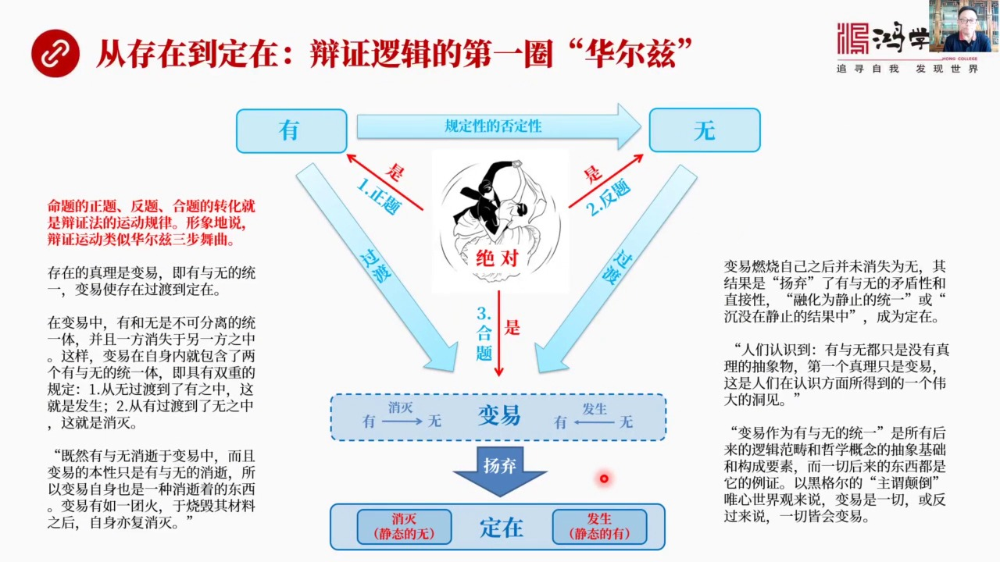

其實就代表了正反合三個合體關鍵是怎麼形象來展現它這個問題是非常燒腦子的我用了各種辦法來試圖形象化想了想說我想了現在這種形式在我看來是比較好的展現了我想表達了東西就是從存在到定在我們來看變正邏輯的第一圈華爾茲是怎麼跳的這就是用形象的方式來展示正反合這個華爾茲三部無曲怎麼跳首先中心的地方當然是華爾茲無曲...

---

### Slide 12

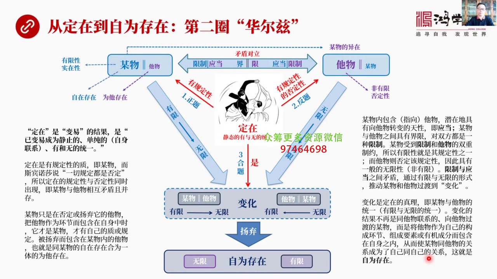

這圈是小邏輯存在論中寫的最會色最難懂最複雜的這一段就是第二條華爾茲涉及到大量新的概念我們在讀小邏輯的時候我自己覺得最大收穫就是你看它對概念精雕細著它反覆不惜用大量很繞的詞其實就在反覆定義反覆去雕著這個概念本身的精確性雕著它的內嚴和外涵把它搞得非常的精緻用了很多很多詞就相當於我們搞裝飾把這個東西這個概...

---

### Slide 13

這兩個矛盾對立體它怎麼進行辯證運動呢在書中小羅集中黑格爾定義了一種壞無限的方式和一種真正無限的兩種不同的方式什麼叫壞無限從圖上就可以看出來謀誤這是有限的我們知道剛才已經說了它的有限性它受到自己對立物的限制受到界限的限制所以雙重限制使它變成了一個有限的謀誤它過度到對地面過度到非有限內側非有限其實還是有...

---

### Slide 14

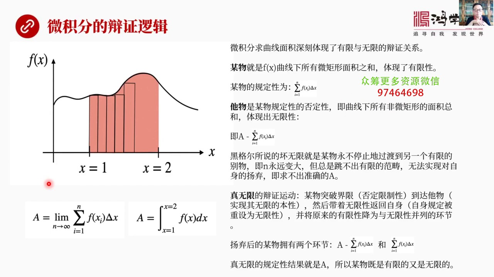

我們都知道他就是一種對立統一既有有限性又有無限性比如說危機分的這個長健力問題求這條曲線所包的面積面積之和這個面積到底有多大這就是深刻體現了有限和無限的變成關係我們用黑個耳的思路去套一下在套之前我們先想想我們自己想想這個問題這個我要求他的面積當然我知道定積分怎麼做但是在沒有定積分之前這個事比較腦頭也就...

---

### Slide 15

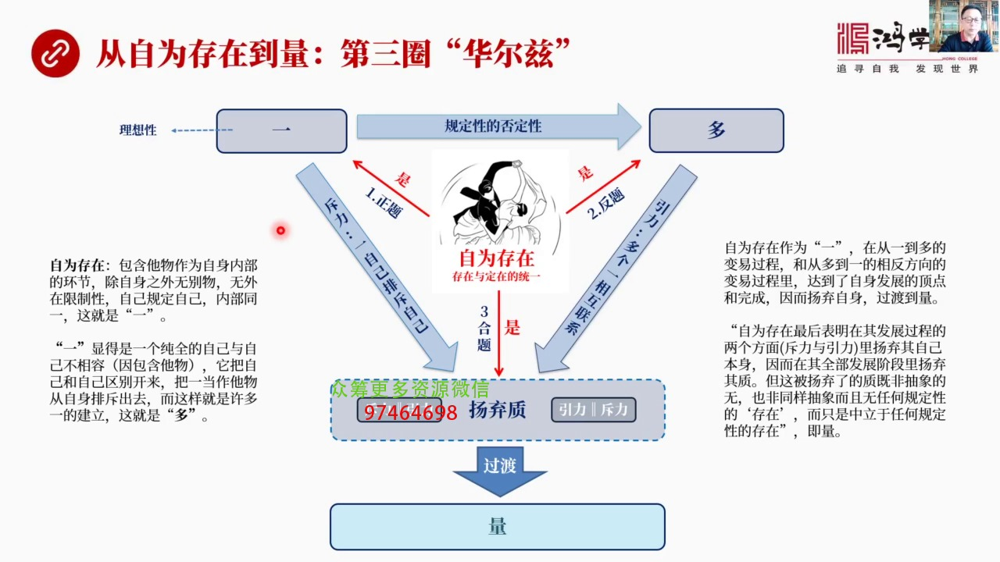

自為存在讓它我們已經說了它是存在和定在的統一什麼叫自為存在就是包含它物作為自身環節我們已經把合對暗的人抓過來了然後放到我們大營裡面我們大營既有原來的人馬又有抓過來的人馬兩邊住在一個住地裡頭那意味著什麼意味著大家都住在一塊兒了除了自身之外再也沒有敵對方了除了我自身之外再也沒有敵對的對手了沒有外在的限制...

---

### Slide 16

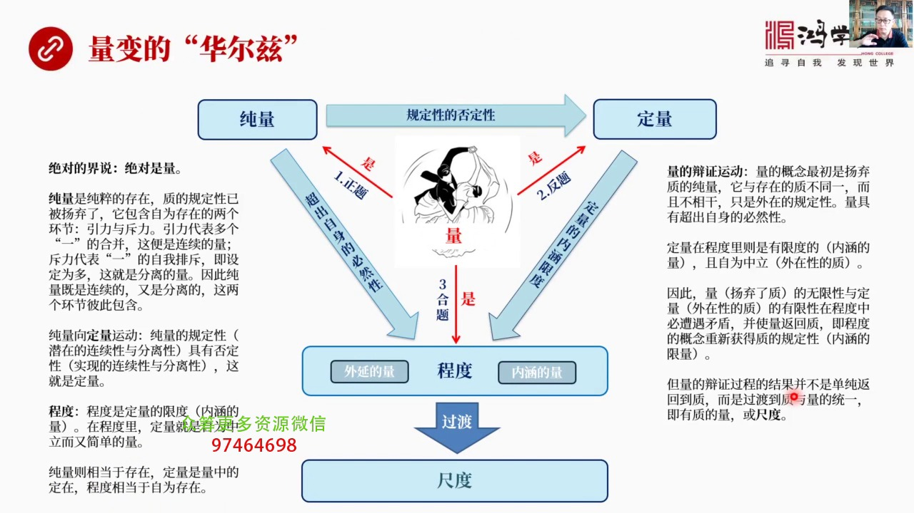

自為存在從這個自為存在這個智最後一步跳到了存量到了量這就開始跳量的花兒子了量了花兒子一看很明顯量是什麼量是存量量又是定量存量和定量就是相互矛盾的因為存量的否定性導致定量的出現這兩者又是相互否定的所以量是存量量是定量兩者的合體什麼量是程度程度陽氣自己過渡到的尺度我們來看我們來看這次這個文字解釋絕對的解...

---

### Slide 17

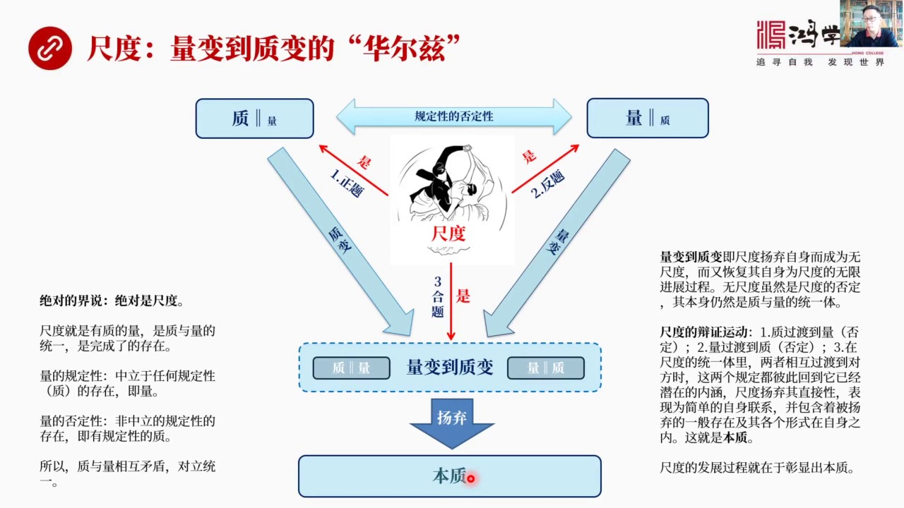

我們知道這個黑耳變成法中焰三大規律量變到智變就是其中之一還有對立對統一還有否定之否定剛才我們已經說過了什麼叫量變到智變量變到智變的花耳朱怎麼跳我們再給絕對下個階說絕對是遲度我們來說絕對是量沒問題絕對還是遲度所有對絕對的階說都可以加上這些話沒錯遲度什麼呢遲度就是有智的量是智與量的統一是完成的存在量的規...

---

### Slide 18

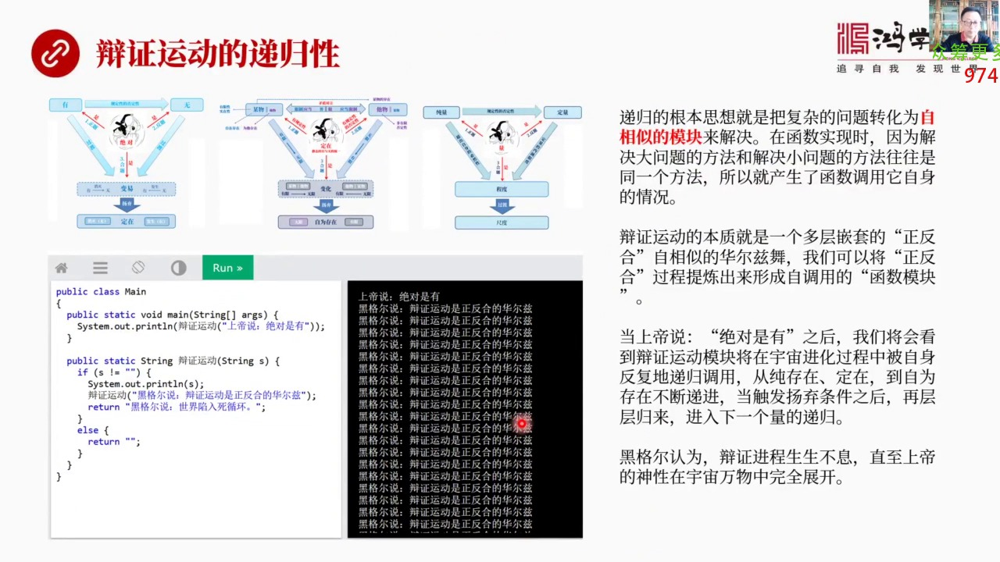

什麼叫地歸性地歸性我們用韓數來理解一下地歸的本質就是把複雜的問題轉化成自相似的模塊來解決在韓數實現的時候因為解決大問題的方法和解決小問題的方法往往都是一樣的或者各種各樣的問題都是類似的問題所以就產生了韓數調用自身自己調用自己的這樣的一個情況這叫地歸我們來看變證運動你看這基本上都是一個三步無曲華爾茲跳...

---

### Slide 19

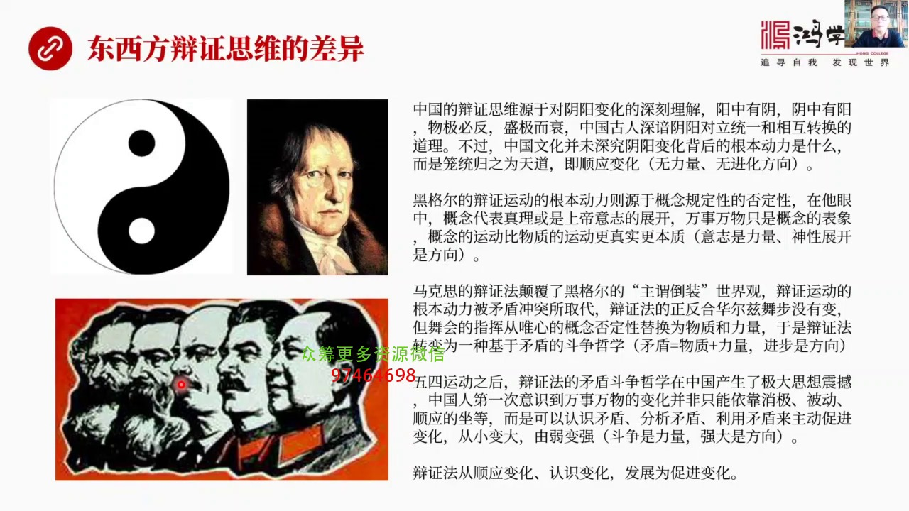

再看一下東西方思辨思辨或者叫辨證思維它的差異性合在我們東方這個辨思維的就是我們看的音揚音揚圖這是電型這是辨證思維最經典的例子黑耳也有黑耳的辨證思維馬克思有馬克思辨證思維毛澤東有毛澤東的辨證思維每個辨證思維貌似相似實際上是有有些不同的比如說中國的辨證思維它源於對音揚辨證深刻理解揚中有音音中有揚誤積幣繁...

---

### Slide 20

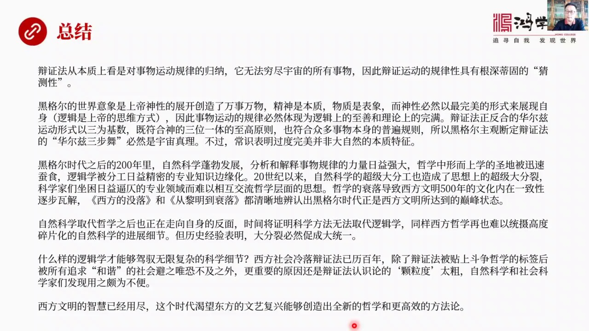

我覺得是對萬事萬物運動規律的一種歸呢但是它無法窮進宇宙的所有的事物因為宇宙事物是無限所以我不能窮進所有事物因此變證運動的規律性具有著深刻的猜測性由於我不能窮進的所有事情所以我不能夠斷然下結論所有東西都變是這樣我只能說我看到50%我看到30%的事物是符合這規律所以我猜剩下東西也符合這規律這叫猜測黑鬼的...

---

### Slide 21

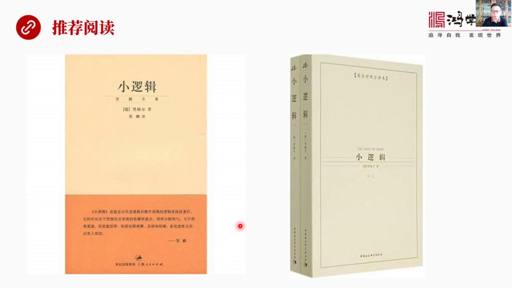

就是它是真正的思維肌肉的最好的就是思維手術到最好的磨刀石要拿最難的書練而且這個最難書被證明是最有價值的是極大成的這種書就要拿這種書來開鏈練自己的邏輯能力看多了你自然就會了會了之後你自然就到發展的熟練到一場程度你就會用好這就是我們今天這個合型開始主要內容

---

### Slide 22

謝謝大家

---

### Slide 23

---
