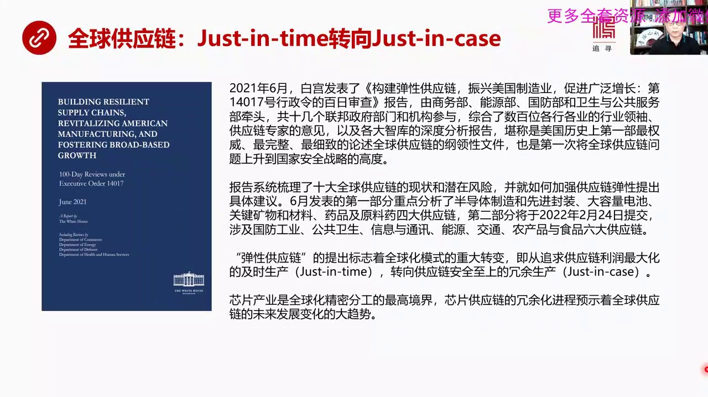
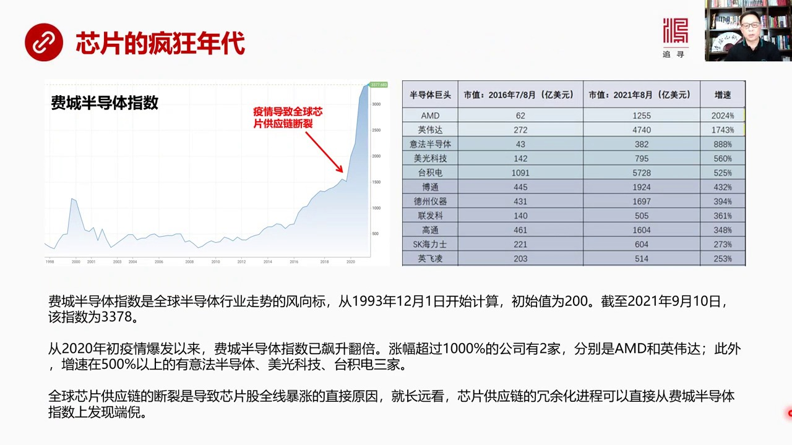
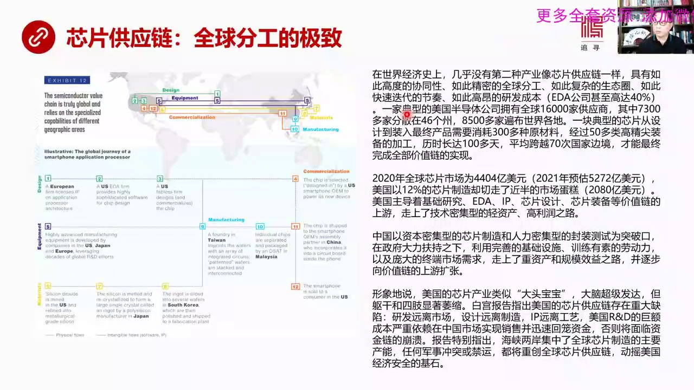
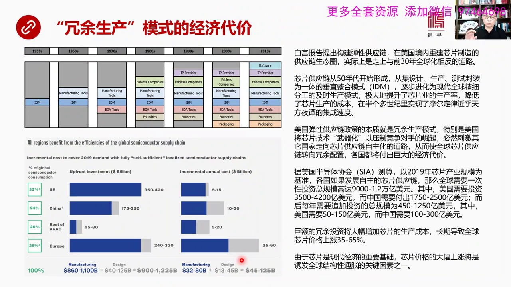
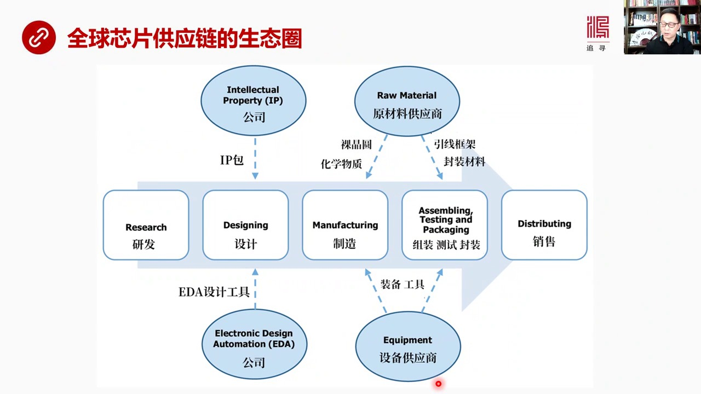
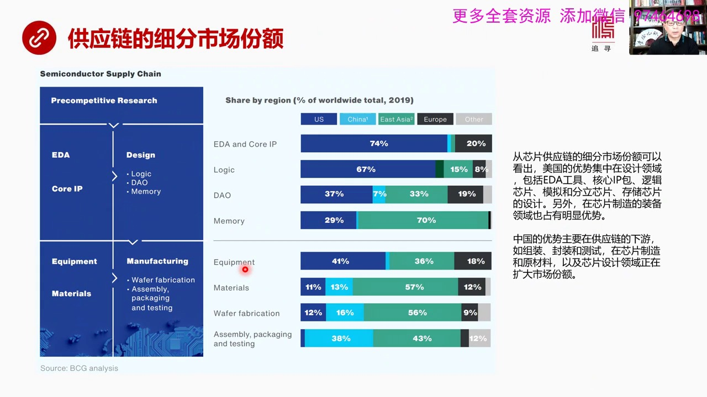
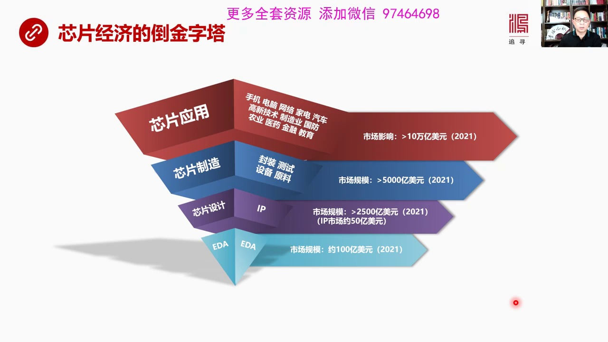
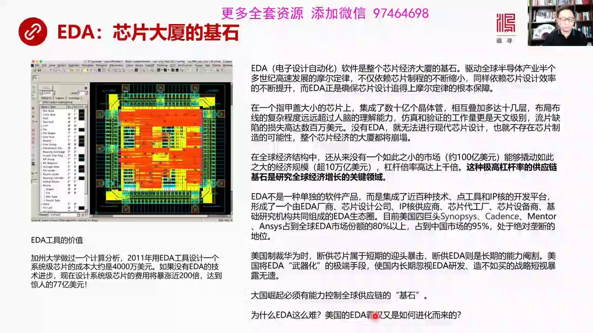

# 核心课视频-78 - 全球供应链-芯片篇（一） — Slide Notes

> **来源**：鸿学院核心课程  
> **幻灯片**：9 张

---

### Slide 1

這是個系列我們今天講的是芯片芯片供應鏈的上半部我們先看第一頁為什麼要講這堂課這個源頭是因為2021年6月

<strong>Cleaned narration</strong>

> 這是個系列我們今天講的是芯片芯片供應鏈的上半部我們先看第一頁為什麼要講這堂課這個源頭是因為2021年6月

---

### Slide 2

白宮發表了一篇非常重要的報告就是構建彈性供應鏈主要的目的是為了震息美國製造業那麼這篇報告是由美國的商務部能源部、國防部還有衛生與公務服務部這幾個部門牽頭總共有十幾個聯邦政府部門還有很多機構參與進來這個報告的賺血綜合了好幾百位供應鏈方面的專家、行業領袖大家共同幾次廣義當然還包括各大智庫他們對於芯片供應...

<strong>Cleaned narration</strong>

> 白宮發表了一篇非常重要的報告就是構建彈性供應鏈主要的目的是為了震息美國製造業那麼這篇報告是由美國的商務部能源部、
> 國防部還有衛生與公務服務部這幾個部門牽頭總共有十幾個聯邦政府部門還有很多機構參與進來這個報告的賺血綜合了好幾百位供應鏈方面的專家、
> 行業領袖大家共同幾次廣義當然還包括各大智庫他們對於芯片供應鏈的一些深度分析報告所以這篇報告可以說是美國歷史上第一步最權威、
> 最完整、最細緻的論述全球供應鏈的鋼琳性文件也是第一次把全球供應鏈上升到了國家安全戰略的高度就是國家安全、
> 經驗權與供應鏈之間的關係那麼這篇報告系統輸理了十大全球供應鏈的現狀還有潛在風險並就如何加強供應鏈彈性提出了很多具體建議我們看到這個六月份這篇
> 報告是他的第一部分他是個系列報告第一部分重點分析了半導體就是芯片產業包括先進風裝這個行業它的供應鏈的情況除此之外還有大容量電池關鍵礦物和材料
> 藥品及原料藥四大供應鏈第二部分將在明年2022年2月24號提交第二部分將會涉及到國防供應公共衛生信息與通訊能源交通農產品和食品六大供應鏈所以
> 加在一起這個系列報告包括十個供應鏈的全面分析雖然我們以前看到了很多供應鏈的一些報告但是這些供應鏈報告多半是從行業角度進行分析很少有站在國家層
> 面上一個國家安全戰略的角度去評估、去分析所以這篇報告我覺得非常有價值讓我們通過這篇報告能夠站在政府的高度站在全球的這樣的一個事業來看供應鏈和
> 安全戰略之間的關係那麼在我看來這個彈性供應鏈這個概念的提出標誌者全球化發展模式的一個重大轉變我們以前的全球化追求的是供應鏈利潤的最大化這種模
> 式即使生產模式加斯林探現在這個彈性供應鏈它強調的是榮譽生產就是安全之上它在英文中又叫加斯因Kase所以這是兩種完全不同的思想方法所以它會影響
> 全球化未來發展的方向那麼我們這次課具體彈芯片供應鏈因為芯片供應鏈是全球發展最精密的分工達到全球精密分工最高境界那麼芯片產業從加斯林探轉向加斯
> 因Kase那麼這種切換也就是說從進化分工走向榮譽化發展就是各個國家試圖發展自己完備的芯片供應鏈這個進程將會預示著全球供應鏈未來發展的大趨勢所
> 以芯片供應鏈我覺得是一個代表一個發展的前照就是從芯片供應鏈我們可以看到未來全球化道理會走向深入發展更經濟化還是走向一種倒退逆潮甚至分工聯繫那
> 麼從芯片供應鏈我們都能看到這樣一個兩種趨勢發展的這樣一種偵照好我們看下一頁首先下一頁我們看到了非常半導體指數

---

### Slide 3

這是一個從股票市場的反應從股票市場的角度來看芯片現在它的一個瘋狂程度這個非常半導體指數它是全球半導體行業的風向走這個風向標代表全球芯片行業的走向那麼這張圖其實可以從90年的末開始一直到現在我們可以看到它在90年代末200年前後出現了一個IT泡末然後200年以後一直到2016年17年這段時間是一個比較...

<strong>Cleaned narration</strong>

> 這是一個從股票市場的反應從股票市場的角度來看芯片現在它的一個瘋狂程度這個非常半導體指數它是全球半導體行業的風向走這個風向標代表全球芯片行業的
> 走向那麼這張圖其實可以從90年的末開始一直到現在我們可以看到它在90年代末200年前後出現了一個IT泡末然後200年以後一直到2016年17
> 年這段時間是一個比較平穩發展的一個狀態那麼從2019年底到2020年也就是新冠疫情發作前後我們可以看到整個半導體的行業指數開始出現了標聲短短
> 應該說這個不長的時間它的指數就翻了一倍到2021年9月10號我們可以看到從新冠疫情爆發之初一直到現在2021年的9月指數整整翻了一倍那麼我們
> 看到這種半導體或者叫芯片工業的在股票指數上這種巨量攀升或者叫標聲它說明一個問題說明全球半導體它的供應鏈出了問題我們現在看到的很多新聞談到了半
> 導體工用鏈對汽車工業的影響很多大車、大車場、背破、序間產量因為芯片供應不足還有其他行業也出現了類似的情況其實這次半導體在股票上上這個表現的如
> 此量力很大從程度上跟全球半導體供應鏈出現斷鏈有關如果我們來看具體的公司表現的話你會發現有兩家公司上漲的幅度超過了一千相當驚人那麼這兩家公司一
> 家是MD一家是英尾達這兩家公司上漲倍數最高但除此之外增速在五百以上的公司也有很多比如說一法半導體這是歐洲的半導體公司美國科技還有台積電這些公
> 司上漲幅度也非常驚人就長遠來看芯片供應鏈的榮魚化這個發展過程就某種意義上類似於現在芯片供應斷鏈兩者可以進行類比榮魚也就是說供應鏈條出現了一些
> 供應不唱的問題他意味著未來整個半導體供應未來發展的榮魚化的進程那麼我們可以從肺成半導體指數從這個指數表現上最先找到這個問題的多你就說未來一段
> 時間我們觀察這個指數如果他繼續標聲說明芯片供應還是存在問題榮魚化其實某種意義上類似於芯片供應鏈出現問題就是大家都在搞自己的一套每個國家都要自
> 主化要全鏈條的生產那麼就會是投資過度就會是各方面的生產的效率下降同時推高成本我們再看下一頁芯片供應鏈在我看來是全球分工的極致

---

### Slide 4

就是在所有產業鏈條中芯片供應是達到了最高水平在世界經濟史上幾乎沒有第二種產業像芯片供應鏈一樣具有如此高度的系統性如此精密的全球分工如此複雜的生態圈如此快速跌倒的節奏如此高王的研發成本像芯片供應鏈中間的源頭1.0公司它的研發成本佔收入甚至能夠達到40%那麼這種分工填在半導體這些企業公司中間它的採購商就...

<strong>Cleaned narration</strong>

> 就是在所有產業鏈條中芯片供應是達到了最高水平在世界經濟史上幾乎沒有第二種產業像芯片供應鏈一樣具有如此高度的系統性如此精密的全球分工如此複雜的
> 生態圈如此快速跌倒的節奏如此高王的研發成本像芯片供應鏈中間的源頭1.0公司它的研發成本佔收入甚至能夠達到40%那麼這種分工填在半導體這些企業
> 公司中間它的採購商就是它採購鏈條上下游的採購鏈條非常的長比如說一家典型的美國半導體公司它在全球擁有16000多架供應商上下游的其中有7300
> 多架分佈在美國的46個州有8500多架遍佈世界各地而一塊典型的芯片從一開始設計一直到最後裝入最終產品需要消耗300多種原材料經過50多類高筋
> 間的半導體的裝備它的加工生產整個歷史長達100多天平均跨越70多次國家邊境才能最終全部實現價值鏈的整體如果我們來看這張地圖其實非常鮮明地提前
> 了這一點它的全球分工那麼從縱向來看設計包括裝備還有原材料橫向來看是設計生產和商業化我們可以看到在不同的階段這些廠商分佈在不同的國家比如說在設
> 計階段有歐洲的公司有美國的依跌公司有美國的芯片設計公司歐洲公司比如說二門專門提供這樣的一個指令機架構美國的依跌三大巨頭提供設計芯片的工具美國
> 的芯片公司利用依跌這些工具來設計芯片那麼在這個階段中還有裝備當然我們知道歐洲的光客機還有日本還有很多國家國家他們的生產的這種半導體裝備主要金
> 融在發大國家那麼原材料集中在美國日本包括韓國在製造階段用藍色標記我們知道台積電是最大的代工廠當然除此之外還有韓國的三星還有很多其他的國家包括
> 中國正在新建大量的芯片工廠有代工的也有專門做存儲芯片的等等當然還有馬來西亞以馬來西亞為代表的外包型的這樣的一種公司它也是在生產的領域中在製造
> 領域中在後端發揮重要作用商業化當然美國的設計公司最後它要把商品整合成產品在美國上上銷售中國也是個巨大的消費半導體的消費最終地還有其他的半導體
> 的公司所生產的很多中間建最後被組合到消費品電子消費品和加電或者電腦手機等等最後預銷發大國家市場那麼全球的半導體市場規模2020年是4404億
> 美元2021年預計將會達到5272億美元增長幅度非常高19%而在全球整個市場總盤的中間美國12%的芯片製造卻切走進半的市場蛋糕總規模4404
> 億去年美國只生產和製造12%的芯片卻獲得了2080億美元的總銷售額所以它在芯片領域中是佔據這上游那麼美國佔據優勢的方面包括基礎研究EDA還有
> 智慘權IP還有芯片設計芯片裝備這都是駕駛鏈的高端駕駛鏈在駕駛鏈的上游美國走上了一條什麼樣的道路我稱為是技術密集型的清資產高利潤之路那麼中國現
> 在正在極速發展中國的半導體供應鏈那麼中國的模式是以資本密集型的芯片製造和人力密集型的封裝測試作為突破口在政府大力扶持之下利用完善的基礎設施訓
> 練有速的勞動力以及龐大的中端消費市場走上了重資產和規模效益之路並逐漸向駕駛鏈的上游擴張中國的芯片製造只要是一道製造不管你是純粹的芯片還是邏輯
> 芯片還是各種其他的芯片都要大規模的投資所以你的資金量特別大需要資金的需求特別大而你怎麼賺錢呢必須靠規模效益因為我這是全球最大的消費市場之一所
> 以我這一年要消費幾千億美元的芯片那麼我的大功能生產最後被我大功能市場消化之後會是為了單位成本下降所以我是靠規模來賺錢中國和美國這兩種模式一個
> 是清資產高利潤一個是重資產規模效益代表了現在世界發展的兩個非常不同的模式那麼美國這個報告就是白宮發表這個報告我看了之後我得出了一個基本結論就
> ...

---

### Slide 5

這當然是要付出經濟代價的如果我們來看全球分工是怎麼形成的我們可以看半導體工業的形成過程從50年代開始最早是垂直的從生產設計依照包裝測試都是有一家公司來做垂直的IDM模式到60年代出現了生產設備製造上70年代又出現了新片的設計工具1.80年代又出現了新片設計公司存設計公司它不搞製造它沒有工廠同時也出現...

<strong>Cleaned narration</strong>

> 這當然是要付出經濟代價的如果我們來看全球分工是怎麼形成的我們可以看半導體工業的形成過程從50年代開始最早是垂直的從生產設計依照包裝測試都是有
> 一家公司來做垂直的IDM模式到60年代出現了生產設備製造上70年代又出現了新片的設計工具1.80年代又出現了新片設計公司存設計公司它不搞製造
> 它沒有工廠同時也出現了專門的代工代工模式比如說台積電這是80年代中後期形成的到90年代又多增加了IP供應上就是製產權因為大規模機中間電路的設
> 計在很大重上很多模塊是可以重複利用的所以每個設計公司不必重新發明輪子輪子已經有人設計好了已經經過潛水擺鏈了已經經過市場的考驗了所以這些模塊拿
> 來就可以重新用可以大大縮短設計時間降低設計成的那麼200年以後又出現了專門的包裝、
> 封裝測試那麼最近依照現在還出現了專門的各種各樣的硬軟件跟它相匹配所以我們來看整個芯片整個產業鏈從50年代依照現在長達60多年時間你會發現它是
> 逐步進化成一個高度精密化分工的全球合作體系而白宮提出了這個構建彈性供應鏈在美國境內重新建立芯片製造的供應鏈的生態實際上與前30年全球化走的是
> 一個完全相反的道路前30年全球化走的是個精密分工而現在你要搞榮譽生產它的精神實質是完全違背的而且由於美國戴頭這麼做其實中國也要做因為美國要不
> 搞這種精密分工了我們就得有自己的一套相對應的體系就是我也得發展自主化其他國家也被迫進行自主化這將會導致這種行為本身將會導致榮譽生產從一個概念
> 變成實際全球分工體系出現瓦解這就是從一種理念的提出到雙方都這麼幹到引發更多的國家根據那麼全球經濟分工也就結體了也正是由於全球分工體系在過去幾
> 十年發展了非常好所以摩爾定律每十八個月集成過而這個經濟館的集成度提高一倍這樣持續了半個多世紀這是由於全球經濟化分工所帶來的效率的提升而現在美
> 國現在動不動用開始把芯片技術當成武器來使用來壓制進程對手的崛起華為就是一個非常非常典型的例子這當然會刺激中國進行芯片供應的自主化就是自己搞一
> 套最終的結果就是各個國家都跟進那麼最終的結果是什麼每個國家都會付出巨大的經濟代價這就是這張圖所顯示出來的美國辦到底工業協會據他們測算如果以2
> 019年的生產的規模來進行測算的話每個國家都要自主發展芯片供應鏈那麼全球需要一次性的總規模的投資要達到9000到1.2萬億大家如果都是搞自己
> 的生產線自己的這個全鏈條的芯片供應鏈那麼一共全世界需要一次性投資9000到1.2萬億美元其中美國需要投資3500億到4200億美元一次性中國
> 需要付出1750億到2500億美元而後就是一次性投資之後每年還需要追加投資每年需要追加投資451到1250億美元其中美國需要每年繼續投資50
> 到150億美元中國需要111到300億美元這就是走向全球從全球分工經營化分工走向分裂大家各搞各的這就是總的經濟代價這種榮譽的投資將會大規模的
> 提升芯片生產成本就是因為它效率下降了不是每個人都在做自己最擅長的事情而是你我不擅長的會我也被逼無難去做這當然會降低我整體的生產效率降低我整體
> 的生產率那麼長期將會導致全球芯片價格上漲35%到65%這是美國半導體協會的一個測算由於芯片是現代經濟的重要基礎如果說在未來中長期之內芯片價格
> 由於各搞各的一套都搞榮譽生產芯片價格它這種大幅上漲將是難以避免的那麼它的結果是什麼呢就是全球結構性通脹所以芯片走向從經營化分工走向榮譽生產它
> ...

---

### Slide 6

這張圖我們可以看得非常清楚最早第一階段當然是研發工作從研發到設計到製造再到組裝測試和封裝最後進行銷售那麼在設計領域中又包括了兩個組成部分一個是製產權的供應商IPIP公司還有就是一跌公司來給芯片設計提供工具那麼在製造領域還有這個封裝測試這個領域還有一些其他的供應商比如說設備供應商光刻機就屬於設備那麼設...

<strong>Cleaned narration</strong>

> 這張圖我們可以看得非常清楚最早第一階段當然是研發工作從研發到設計到製造再到組裝測試和封裝最後進行銷售那麼在設計領域中又包括了兩個組成部分一個
> 是製產權的供應商IPIP公司還有就是一跌公司來給芯片設計提供工具那麼在製造領域還有這個封裝測試這個領域還有一些其他的供應商比如說設備供應商光
> 刻機就屬於設備那麼設備和供應給生產製造包括測試封裝提供有效的裝備和供應而原材料供應商在這個位置上原材料供應商提供比如說羅金園還有包括各種化學
> 的氣體和化學物質用於生產製造同時還向封裝測試提供比如說隱線框架封裝材料等等所以這幾大部分構成了全球芯片供應鏈的核心的生態圈那麼我們今天這堂課
> 重點其實講的是設計部分設計包括IP和EDA因為我們大家一般說的芯片絕大部分人注意的是後半部分就是製造測試封裝還有光刻機原材料等等但實際上在我
> 看來設計這個部分更重要因為它的上游而且它的利潤還有它的增加值得貢獻部分還有它的它的所謂市場組織者的地位其實是要高於後半端了真正的整個鏈條組織
> 者是設計就是我要生產我要設計成一個什麼樣的產品我需要採取什麼樣的製程我需要使用什麼樣的體系架構我需要哪些IP我需要什麼樣的工具來輔助這些東西
> 都是在上游決定的實際上是設計決定了生產決定了最後的銷售那麼在我看來這堂課的重點是放在設計放在軟的方面而不是放在這個硬製造的方面硬製造方面我們
> 是放到芯片供應量的第二節課專門講製造部分我們看下一頁如果我來看一下

---

### Slide 7

芯片供應鏈的細分市場份額我們可以看到中國和美國之間的顯著不同先看這張圖這是半導體供應鏈的一個基本框架前期NU在這裡然後是設計設計部分在這設計部分主要使用的工具是EDA還有設計需要大量使用IP核就是資產權不用重新發明輪子那麼芯片設計主要包括邏輯芯片存儲芯片DAO就是那種模擬獨立的包括光電的這樣的一些分...

<strong>Cleaned narration</strong>

> 芯片供應鏈的細分市場份額我們可以看到中國和美國之間的顯著不同先看這張圖這是半導體供應鏈的一個基本框架前期NU在這裡然後是設計設計部分在這設計
> 部分主要使用的工具是EDA還有設計需要大量使用IP核就是資產權不用重新發明輪子那麼芯片設計主要包括邏輯芯片存儲芯片DAO就是那種模擬獨立的包
> 括光電的這樣的一些分立的這樣的一些芯片所以一共是三大類從設計這個階段來看我們可以看到EDA和核心IP美國所佔的市場份額非常高74%佔壓到性地
> 優勢中國可以忽略不計邏輯芯片美國的設計佔了67%那麼在模擬和光電包括分立這些芯片中間美國佔了37%這個比例也非常大中國佔17%在存儲這個芯片
> 這個理由中美國佔129%所以在整個的設計階段美國佔比都非常高這是它的獨特優勢在裝備製造階段和材料這是生產製造了那麼我們可以看到美國的半導體的
> 生產設備佔41%這也非常這個比例也非常大還有包括半導理員材料還有這個芯片的最終製造美國佔12%如果我們來對比這兩張圖這一塊和這一塊我們會發現
> 從細分市場份額從這個圖中可以看出美國的優勢是集中在設計領域的包括1.1工具還有分核心IP包還有邏輯芯片模擬芯片這些芯片的設計另外在芯片的製造
> 裝備這個領域也佔有明顯優勢那麼中國呢中國的優勢主要在供應驗的下游比如說組裝、封裝和測試中國佔比是38%這塊是比較大的因為它是人力密集型的那麼
> 在芯片製造和原材料領域中包括芯片設計中國正在逐漸的擴大市場份額比如說原材料還有芯片的製造中國正在大力投資建廠那麼在一些芯片設計領域比如華為這
> 些華為海斯這些設計芯片的公司也在全球市場上獲得一定的份額那麼從這張圖上我們基本上也能看出來中美時間是一個非常強的互補的關係美國佔著上游中國佔
> 著下游正在向中游擴張所以雙方固域鏈是高度互補的我們再看下一頁在這一中我畫了一個芯片經濟的道晶字塔

---

### Slide 8

是我覺得這場客裏兩個道晶字塔中間之一非常關鍵非常重要就是在整個芯片經濟中最底層的是什麼最底層的是EDA就是電子自動畫的設計工具在一個指甲蓋這麼小的一個面積上你要設計幾十億個經濟館靠人工是絕對無法完成的超越了人腦的理解能力超越了我們的眼睛超越了我們的手的一切的操作能力你的思想跟不上思維跟不上你的行為也...

<strong>Cleaned narration</strong>

> 是我覺得這場客裏兩個道晶字塔中間之一非常關鍵非常重要就是在整個芯片經濟中最底層的是什麼最底層的是EDA就是電子自動畫的設計工具在一個指甲蓋這
> 麼小的一個面積上你要設計幾十億個經濟館靠人工是絕對無法完成的超越了人腦的理解能力超越了我們的眼睛超越了我們的手的一切的操作能力你的思想跟不上
> 思維跟不上你的行為也跟不上所以EDA是進行芯片設計的潛力條件沒有EDA工具你根本就設計不了芯片沒有芯片設計你就無法進行芯片製造沒有芯片製造也
> 當然不會有芯片應用所以它是個道晶字塔經濟結構這塊塔方EDA要塔方整個芯片經濟全部塔方那麼我看很多人其實並沒有意識到EDA的關鍵性大家還認為中
> 國可以製造芯片可以設計和製造芯片比如華為海斯不就自己設計了很多芯片嗎不要忘了華為海斯設計芯片用的是美國的EDA華為自己是沒有EDA工具的假如
> 美國在EDA上卡斷華為不給它新的軟件或者不給它更新那你拿什麼去設計芯片呢難道用尺子嗎用千筆嗎那是無法想像的這也是美國斷供華為芯片斷供和EDA
> 斷供這兩個相比我覺得EDA這個東西更致命因為它是一個能力的嚴格這就是要求我們要從一個形象和直觀角度來認識一個到晶塔形結構EDA的市場並不大它
> 的市場規模只有100億美元左右可能今年會達到110億美元吧這個110億美元應該是去年的數字今年應該有可能達到110億那麼芯片設計是基於EDA
> 工具的沒有EDA是沒有芯片設計的芯片設計還有大量使用IP這個市場規模今年預估是2000億美元以上那麼IP是想市場大概它的規模是50億美元設計
> 出來圖紙之後才能用於生產就是芯片製造芯片製造包括當然封裝測試設備原料還有代工等等這構成了芯片製造它的市場規模大於5000億美元今年應該超過5
> 000億美元了那麼芯片應用基本是各行各業手機電腦、網絡加電、汽車、高興技術、製造業、國防、農業、
> 醫藥、金融教育基本上找不到這個行業完全不用芯片的那麼整個芯片應用就是芯片的經濟體系這個到今支撐起來芯片應用體系它的市場規模是多大呢至少在10
> 萬億美元以上當然有人說是這個數更大但是我測算結果幾算億美元有點誇張10萬億是絕對不止那麼也就是說整個這10多萬億美元的芯片經濟它的基石是1B
> A工具在我們腦子面需要有一個非常直觀形象非常深刻地印象1BA是芯片經濟到今塔的基石我們再看下眼那麼這個1BA到底有什麼牛的地方

---

### Slide 9

加州大學部可以有一個計算分析這個有一個教授他做了一個分析測算就說如果2021年用1BA的工具就是當年的壹類工具設計壹個系統機芯片成本大概是4000萬美元假如從2021年到現在壹跌沒有進步沒有任何技術進步我們也不考慮時間上的這個成本現在你要用當年的工具來設計壹個現在這麼複雜的這麼精細製成和這麼複雜的芯...

<strong>Cleaned narration</strong>

> 加州大學部可以有一個計算分析這個有一個教授他做了一個分析測算就說如果2021年用1BA的工具就是當年的壹類工具設計壹個系統機芯片成本大概是4
> 000萬美元假如從2021年到現在壹跌沒有進步沒有任何技術進步我們也不考慮時間上的這個成本現在你要用當年的工具來設計壹個現在這麼複雜的這麼精
> 細製成和這麼複雜的芯片費用將會達到多少將會爆長200倍達到驚人的77億美元從4000萬長到77億美元意味著什麼設計費用會爆長200倍那麼現在
> 為什麼長得沒有備數沒有這麼高呢主要是壹類工具在不斷進步能夠進行更精細製成的芯片設計就是它提供了工具可以讓你保證28納米然後到14納米然後再到
> 7再到5再到3你這個所謂精細化精細化這個程度到能到什麼樣的製成我的設計工具能夠跟著你壹起走所以壹跌這個工具很了不起所謂電子自動化電子設計自動
> 化是整個芯片經濟大廈的基石驅動半導體工業半個都設計的發展模式定律我們一般人都知道它是不斷依賴芯片製成的縮小但其實同樣同時它也得依賴壹跌工具設
> 計效率得跟得上就是你的芯片設計能力必須要跟著半導體的這個製成的進程壹起往前走而你怎麼才能保證芯片設計效率全靠壹跌所以壹跌是確保模式定律的兩個
> 重要基礎之壹樣現在在壹個只要跟著大小的芯片上我們可以繼承幾十壹個經濟管相互跌加多大十幾層所以它這個佈局佈線的佛達程度遠遠超過人類大腦的想像超
> 過我們的理解能力你要對這樣的芯片設計那麼多幾十壹個經濟管然後它是中間的佈線那簡直佈達到無異佈家了你要對這麼佈達電路進行訪真進行驗證這個工作量
> 那是天文級別的那麼訪真和驗證的重要性在於你芯片製造跟壹般軟件和其他生產不壹樣芯片要做出個流片來你要發現有壹個缺陷或者哪個電路的功能沒有實現你
> 壹報費就是幾百萬美元打水票甚至幾千萬的美元打水票這是個驚人的數字而沒有壹跌就沒有辦法去訪真沒有辦法去驗證沒有辦法去自能部線那整個設計就會癱瘓
> 根本無法進行設計可以說沒有壹跌根本無法進行現在芯片設計也就不存在芯片製造的可能性所以整個芯片經濟都將不存在在我看來全球經濟結構中由事以來還從
> 來沒有出現過壹個這麼小的市場一百億美元能夠敲動這麼大的經濟規模超過十萬億美元這個槓耳倍率高達上千倍這種極高槓耳率的供應鏈供應鏈的這種基石是研
> 究全球經營增長的關鍵領域就是如果這個基石不發展它是效率不提升你上面的東西都搞不出來當我們說到全球供應鏈手不是壹個水平的壹個鏈條向後搭建在壹起
> 它其實是壹個空間結構是壹個到基石卡型結構所以當你研究每個這個供應鏈手首先找到誰是基石上面所有東西都是架在基石之上的基石不發展上面壹切都發展不
> 了這就是我們在研究全球化研究全球經濟增長的時候要高度重視這種高倍槓耳率的供應鏈的基石原因就在這而且壹個強國必須要掌握這個基石的技術否則無法崛
> 起人家壹制裁或者這個供應壹出問題你的所有東西都發展不起來都會談話那麼這個壹跌其實不是壹種單獨的軟件產品而是集成了幾百種技術包括點工具IP核是
> 壹個共同的研發平臺是個開發平臺而且是個巨大的生態包括壹跌的廠商包括芯片設計公司包括IP核的供應商包括芯片代工工廠包括芯片的設備商還有基礎研究
> 機構共同組成了一個巨大生態權那麼當今世界主要控制壹跌的就是美國幾個巨頭新斯科技還有凱登還有這個門圖就是名圖現在應該是被那個新門子收購了還有安
> 斯斯這幾家公司非常厲害站到全球壹跌市場的80%以上站到中國市場的95%以上所以他們在中國市場上乃至在全球市場上都處於絕對壟斷的地位中國的芯片
> ...

---
