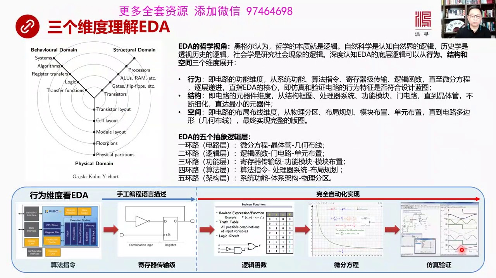
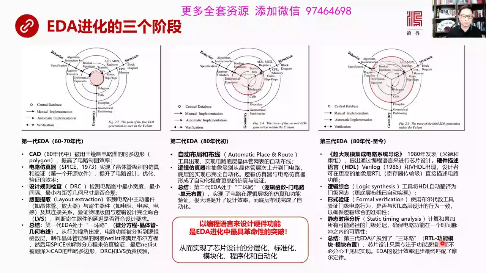
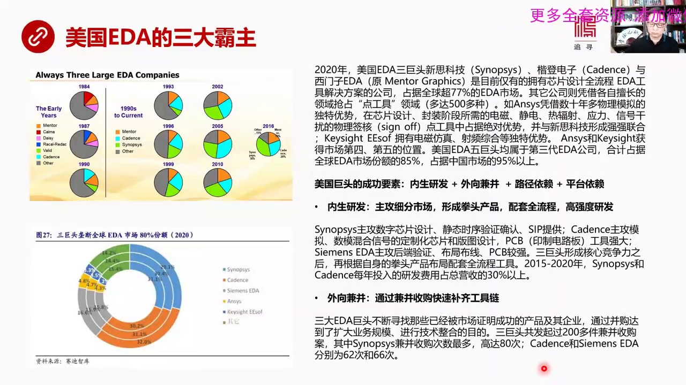
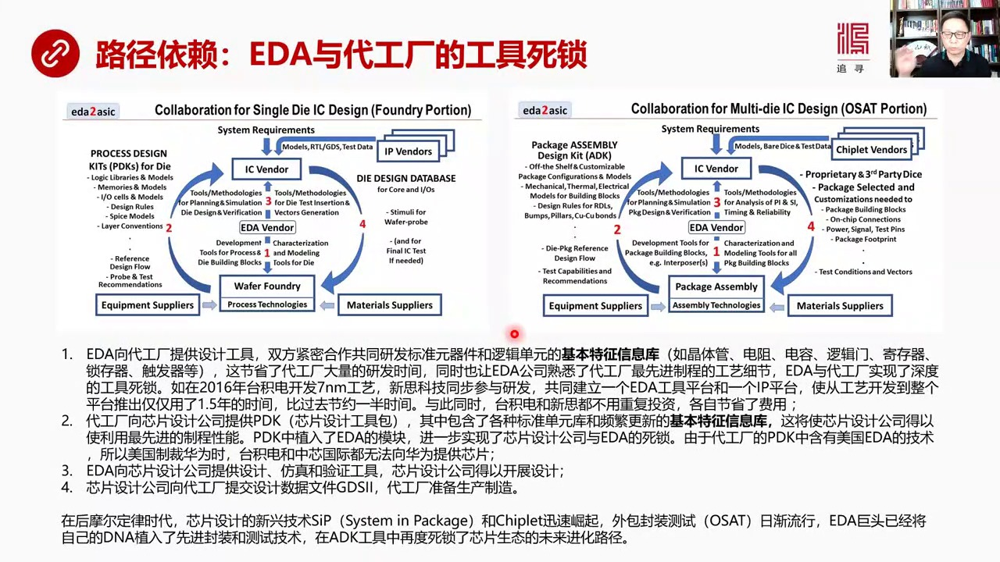
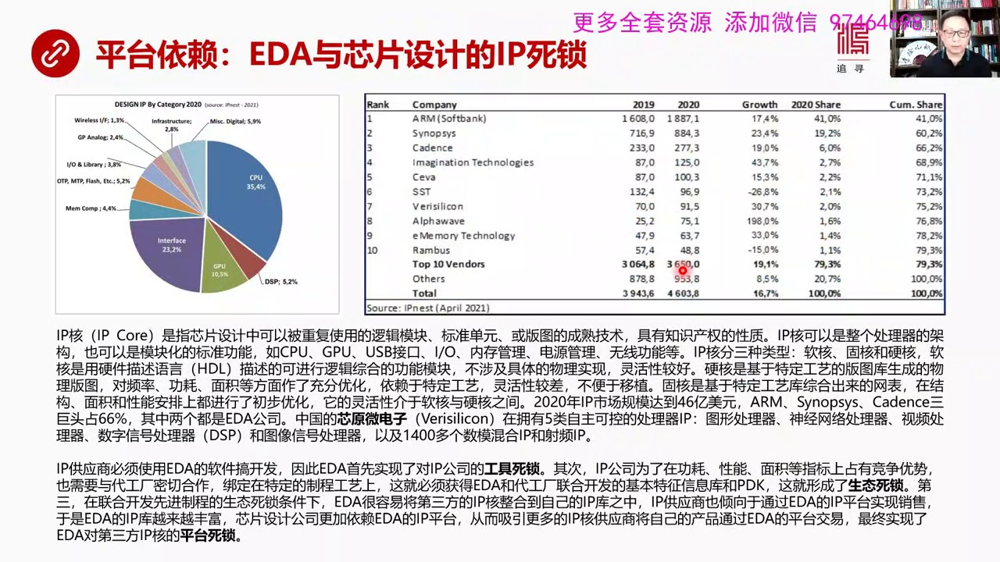
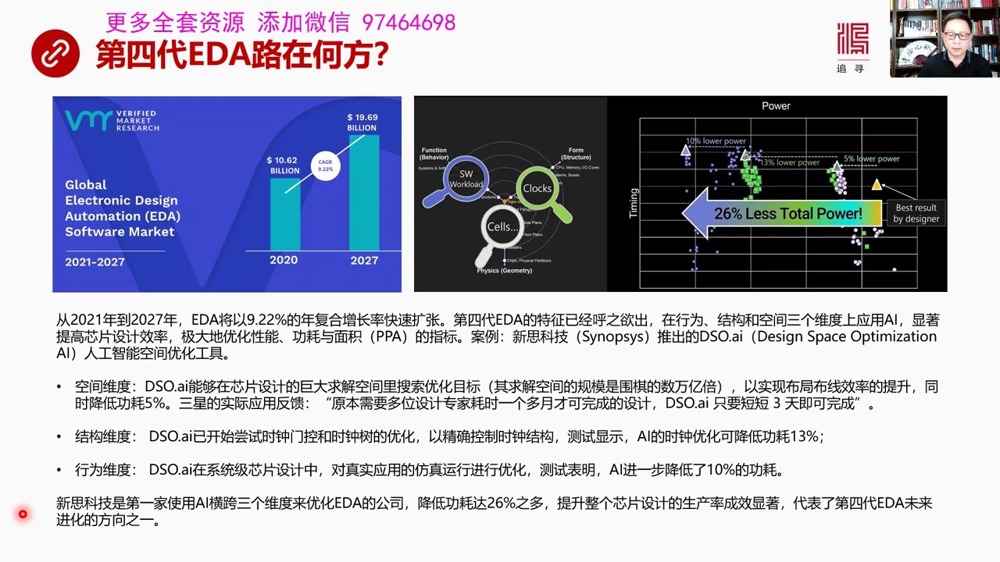
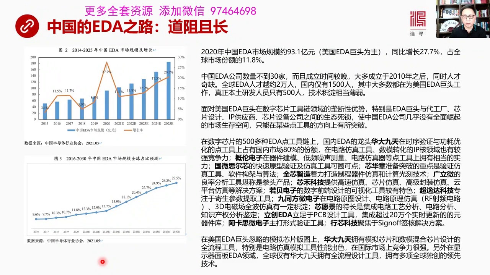

# 核心课视频-79 - 全球供应链-芯片篇（二） — Slide Notes

> **来源**：鸿学院核心课程  
> **幻灯片**：7 张

---

### Slide 1

這張圖高度概括了EDA的核心原理這個EDA我們一般很多人談的EDA是從技術角度去談但是我在研究EDA的時候我更喜歡用哲學視角去看就是我們以前讀過了黑耳的小邏輯黑耳認為哲學的本質是邏輯自然科學他是認識自然界的一種邏輯歷史科學或者叫歷史哲學實際上是套式歷史背後的邏輯社會學是研究社會現象的邏輯而我們要理解...

<strong>Cleaned narration</strong>

> 這張圖高度概括了EDA的核心原理這個EDA我們一般很多人談的EDA是從技術角度去談但是我在研究EDA的時候我更喜歡用哲學視角去看就是我們以前
> 讀過了黑耳的小邏輯黑耳認為哲學的本質是邏輯自然科學他是認識自然界的一種邏輯歷史科學或者叫歷史哲學實際上是套式歷史背後的邏輯社會學是研究社會現
> 象的邏輯而我們要理解EDA它的底層邏輯也需要用同樣的方法 同樣的方法論我們需要從行為結構和空間三個圍堵來切入才能看得清EDA到底是什麼東西E
> DA的進化發展方向是什麼首先從行為這個角度來看行為是這個軸這是所謂的外圖就像一個外子型行為結構和空間三個視角來看EDA行為是什麼就是電路的功
> 能圍堵就是電路要實現哪些功能從最外圍來看那就是系統功能算法指令基層器集團書還有邏輯韓述然後最底層實際上是微紛方程竹層地進最後只指EDA的核心
> 它的核心是什麼就是訪針和驗證電路的行為是否符合設計藍圖大家可能會對這樣的一個外子型它可能會感到比較抽象比如說電路最核心的部分是什麼就是最內層
> 的從電路功能來說其實就是微紛方程來描述一個電路受到外部刺激之後不管你是時鐘的信號還是這個其他的信號刺激在這個電路中它會出現波形它會出現不同的
> 行為用什麼東西來描述這種行為呢當然是微紛方程所以這個船次的方式在電路反應中間體現為微紛方程那麼如果從結構角度來看結構就是計算機的體系架構結構
> 就是電路的元器鍵的它從電路元器鍵的圍度來進行考慮就是整個體系架構它的結構框土是什麼還有在網裡微處理器系統是什麼然後功能模塊應該怎麼畫分門電路
> 應該怎麼設計最後到經濟管這個層次空間是從它空間的概念是電路它的布局布線的這樣一個圍度是空間是角幾合是角來考慮這個問題從外圍的所謂物理分區到布
> 局規劃到模塊布置到單元布置一直到電路的多邊形幾合布線最終實現完整的電路的版圖芯片的版圖形象說我把1.8的五個抽象的邏輯層蓋過成五環路1環路最
> 裡頭這一層微紛方程對於這經濟管對應著一個幾合布線這稱之為是電路層我們抽象成電路層二環路是邏輯層三環路是功能層再往外算法層再往外架構層在我看來
> 我看著很多人在說1.8的問題很少我很少發現人們是從這個角度去切入這個角度切入給我一個最深刻的印象這當然是1983年美國的這個計算級的這幫人搞
> 出來的非常集中凸顯了熱漫人的那種抽象思維邏輯的這種能力它其實是用一個高度的邏輯抽象層來蓋過不同的同機源而且從不同的方向切入進去這個圖實際上在
> 我看來是屬於你能夠把1.1解到骨子裡的這樣一種邏輯就是你能夠通過這三個圍度看到它最底層的邏輯是什麼它每一步的進化都是圍到這個1環路2環路在不
> 斷向外擴從這個圍度上3個圍度1環路2環路到3環路我們看到1.1進化的第一階段第二階段和第三階段這張圖給我的印象就是西方思維方式的給我最深刻的
> 印象高度抽象高度抽象思維的能力這是我們所欠缺的我們不善於對很複雜的東西進行抽象進行邏輯分層抽象之後的邏輯分層然後還有精整的邏輯對應關係就像這
> 個同機源這是一個非常精整的邏輯對應關係你只有把這張圖看明白了或者能夠把它在腦子面呈現出來你才能夠知道原來1.1進化是操這個方式的進化如果我們
> 從西維角度來看1.1它最外圍外圍這層當然是算法指令層就是從算法從這個地方開始功能設計完成之後算法我們知道我需要用哪些這個算法指令來實現比如說
> 今天指令還是複雜指令級用什麼樣的指令級指令級是Ryze 5還是Arm還是什麼我只有確定了指令級這個架構的選擇之後我才能夠確定計算級的微處理器
> ...

---

### Slide 2

在這個階段完成的時代是六七十年代六十到七十年代首先是CAD出現了這是六十年代中出現了CAD計算機輔助設計工具CAD工具不僅用於機械設計也被用於繪製電路圖它是中間的很多多邊形比如走線比如電器原件之類的那麼1.1的電路制圖上當然會提高電路制圖的效率那麼另外一個突破進進展是電路訪針器SBIZ1973年出現...

<strong>Cleaned narration</strong>

> 在這個階段完成的時代是六七十年代六十到七十年代首先是CAD出現了這是六十年代中出現了CAD計算機輔助設計工具CAD工具不僅用於機械設計也被用
> 於繪製電路圖它是中間的很多多邊形比如走線比如電器原件之類的那麼1.1的電路制圖上當然會提高電路制圖的效率那麼另外一個突破進進展是電路訪針器S
> BIZ1973年出現就是我剛剛所說的一切電路的行為都是可以用微分方程來進行描述的而只要我能求解微分方程我能夠把這種微分方程的模擬這種微分方程
> 對於曲線的模擬我能夠精確利用算法來實現我就可以做到對電路邏輯的訪針對電路功能的訪針所以SBIZ這個軟件這是BOK類最先搞出來其實就是一個教授
> 他把數學給搞明白之後然後實現了SBIZ這樣一種公開源帶馬上這樣一種電路訪針器其實實現了一個非常重要的突破就是對經濟館級別的訪針和驗證被突破了
> SBIZ也是第一個全世界第一個開源軟件後面我們看到了各種各樣開源軟件實際上是源於它當然這樣以來的話就大幅度提高了電路的設計優化和驗證效率除此
> 之外還有一個重大的突破是DRC就是設計規則檢查設計規則檢查檢查什麼呢就是檢查電路途中間最小的那些寬度最小的間隔兩個同線之間最小間隔還有最小內
> 具這些幾合尺寸是不是合乎設計的規範這個也是一個自動化完成了一個重要的工具因為你的電路途中間很多比如說線與線之間的空間距離是多少你如果是超超標
> 了立刻它判定你或者這個這個兩個線這個I的太近它立刻就判定你違規就會被踢回來所以這個自動化的檢測規矩檢測的這個工具很重要就是設計規則的檢查另外
> 還有一個重大的突破是版頭提取版頭提取就是在電路版頭中間能夠發現主動就是能夠把主動器件比如說經理管放大器還有一些叫被動了或者叫機身器件比如說電
> 軸、電源、電感等等把這些源器件給它的核心東西體驗出來找到中間的連接關係然後它的主要目的是為了驗證你的物理版圖和邏輯版圖設計的是不是完全一樣就
> 是LVS如果我們來總結一下第一代EDA它所實現的重要功能我們可以看到它是處於一環路這個層次了就是微暈方程Spice經理管它是對經理管的所有的
> 就是經理管級別的電路進行訪針和驗證當然還有幾何不限那麼它是處在一環路這個位置上如果我們從行為角度從這個電路功能角度來出發看問題就是電路功能首
> 先被拆分到了邏輯韓授層然後製作經理管層級的網表然後來滿足布爾方程就是這個邏輯韓授然後用Spice來求解微暈方程中間它的一些關鍵的直然後來驗證
> 訪針和驗證最後這些網表經理管級的網表被翻譯成CAD電路輔助工具那個軟件中間的像對應的多邊形那麼完成之後再由DRC和LVS來負責教驗看看有沒有
> 設計違反規範的地方所以在7060年代和70年代完成了大量的最底層的經理管級別的一些訪針一些設計規則的驗證版圖提取幾何不限包括最後的CAD的輔
> 助都是在6070年代完成的我們現在說我們要去追趕這個EDA這個工具你不要忘了這個美國的這些巨頭們已經從60年代到現在已經積累了半個多世紀的各
> 種各樣的工具已經經過法案夫打磨五、六十年了所以要追趕是有相當難度的這個是不是一錯而救的事那麼第二代EDA是巴士尼奈出出現的就是二環路在二環路
> 這個領域首先出現了一個重大突破是自動佈局和佈線這種工具出現了它實現了電路的底層經理管往表自動佈線第二是邏輯訪針器這是電路訪針器這邊是邏輯訪針
> 器那麼它將抽象級別從經理管這個層次上上升到門電路門電路要比經理管要更抽象一些底層門電路以下已經完全自動化實現它的佈線不局不線已經完全自動實現
> ...

---

### Slide 3

定義不一樣但是最主要是三大霸主這三大霸主其實從八十年代再往前和再往後基本上都是三家獨大的局面這可能有一個穩定性還是一個什麼樣的原理三家支撐這個市場那麼2020年美國EDA的三句頭新自科技凱晨戀子還有新門子EDA就是以前的這個名圖他們這三大句頭為什麼叫三句頭呢他們是目前僅有的擁有新面設計全流程EDA工...

<strong>Cleaned narration</strong>

> 定義不一樣但是最主要是三大霸主這三大霸主其實從八十年代再往前和再往後基本上都是三家獨大的局面這可能有一個穩定性還是一個什麼樣的原理三家支撐這
> 個市場那麼2020年美國EDA的三句頭新自科技凱晨戀子還有新門子EDA就是以前的這個名圖他們這三大句頭為什麼叫三句頭呢他們是目前僅有的擁有新
> 面設計全流程EDA工具解決方案的公司因為EDA工具中有很多點工具組合在一起叫EDA體系這種點工具可能多達五百多種不同的點工具組合在一起來完成
> 這麼複雜的電路新片設計的這種功能這三家家在一起大概佔據全球77%的份額其他公司平屆各自擅長的領域去搶佔點工具這個市場點工具剛說了多達五百多種
> 比如說我們剛來說說過AncestAncest就是靠有些人員起家平屆幾十年搞物理模擬的獨特優勢在芯片設計、
> 封裝階段中有大量物理的東西需要被檢測比如說電磁、鏡電、熱服設還有硬力、性耀感饒這些東西道理對芯片產生到大影響嗎會不會超標啊所以要進行物理簽合
> 誰能做Ancest最牛所以全世界這些牛的EDA公司也得跟它合作它是平屆物理簽合切入了EDA市場比如說它現在在這些領域中物理簽合這個領域中佔絕
> 對有史所以芯斯科技就是EDA的龍頭老大雖然你很牛但是要搞物理檢測的時候你還得跟Ancest合作所以兩家合作另外還有一個KeciteKecit
> e的是擁有兩個絕活電磁訪針還有社平綜合這是兩個非常強的優勢那麼這兩個公司分別獲得市場的第五第四和第五份額所以美國實際上是五巨頭這五巨頭除了三
> 個是全鏈條的還有兩個是它的點工具積極強大的加在一起是美國佔了五巨頭這五巨頭都是屬於第三代EDA公司合計佔據全球市場的85%佔據中國市場的95
> %以上基本就是天下就是他們的那麼美國這五巨頭的成功要素是什麼首先是內生研發人家搞得早六十年代就開始起步了而且有自己的核心產品有核心產品之後進
> 行向外監病 外向監病就是圍繞核心產品再進行監病來把我這個工具店全部補齊最後然後形成陸經依賴就讓周圍的代工廠再讓其他IP工商都用我的工具他們就
> 對我的工具形成了陸經依賴然後最後形成是平臺依賴因為我這是一個EDA是個龐大的生產體系是個龐大的生態圈所有人都在我這平臺上玩包括代工廠包括IP
> 工商包括新片設計公司大家都要在我這平臺上玩所以最後就形成平臺依賴這就是成功的思要素內生研發 外向監病 陸經依賴平臺依賴內生研發主要是專攻一些
> 細分市場首先行政全州產品然後配套全流程這種工具鏈然後進行高強度的研發向新資科技它最牛烈的就是數字芯片設計還有近代持續驗證IP就是新的一種芯片
> 設計技術等等主要它主要工這個工具方向是模擬還有數磨混合信號的定制還有版頭設計還有PCB因印刷版電路它的這方面工具是比較強大的西門子主要是工後
> 端驗證布局布線它的印刷電路板也比較強PCB也比較強三句頭形成了核心競爭力之後再根據自己的全州產品來逐步配期全流程工具如果你看它的內部研發的戰
> 它市場銷售比例會發現這些巨頭們這個研發投資強度都非常大向新資科技合成功每年投入了研發費用高達營收了30%甚至個別人年份能夠到40%以上基本上
> 把賺來錢30%到40%拿去搞研發這個比例在各行業中間其他全球工具鏈中間是非常罕見的這個投入太驚人了還有第二個優勢是外向監病就是通過監病收購來
> 快速補期工具鏈如果我們來看這幾大公司比如說新資科技監病收購了數量最多從80年代到現在監病了80多次80多家中小公司都被監病了就是它收購這公司
> ...

---

### Slide 4

這是一個新片設計的一個邏輯框圖1D工具供應商在中間代工廠在這我們看到1D首先可以代工廠提供各種開發工具讓它在生產新片這個代工廠它也需要1D工具來幫助它來設計一些基本的標準庫同時還給它提供很多建模的工具來提取各種元氣漸的基本特徵參數就是形成一個基本特徵的信息庫然後代工廠比如台積電跟1D合作之後形成了這...

<strong>Cleaned narration</strong>

> 這是一個新片設計的一個邏輯框圖1D工具供應商在中間代工廠在這我們看到1D首先可以代工廠提供各種開發工具讓它在生產新片這個代工廠它也需要1D工
> 具來幫助它來設計一些基本的標準庫同時還給它提供很多建模的工具來提取各種元氣漸的基本特徵參數就是形成一個基本特徵的信息庫然後代工廠比如台積電跟
> 1D合作之後形成了這些工具特別是形成基本特徵庫之後再把這些東西打包變成PTK像新片設計公司提供PTK中間就包括各種各樣的基本標準庫基本的模塊
> 還有包括各種元氣漸它的一些參數指標這個特徵信息庫比如說經歷館、電燭、電容、邏輯門、
> 計程器等等等等都有自己獨特的參數這些參數是什麼而且新工業經常會變這個PTK有時候更新可能達到一個月就要更新一次或者兩個月三個月更新一次這就是
> 為什麼華為買了一個跟台積電合作台積電可以說我給你一個武納米的PTK你先用了吧後來美國說斷工之後行以後的PTK更新我不給你更了對華為來說是個致
> 命打擊因為特徵庫還在發生變化新工業還在模合你的經歷館、電容、邏輯門這些參數都變了而你的軟件買了軟件中1D也好還有PTK也好它不更新這些東西了
> 那你怎麼知道帶工廠和參數會變成什麼樣那你怎麼能進進行正確設計你要設計不出來或設計出了偏差那你怎麼生產呢所以這個東西是非常可怕如果它1月更新一
> 次你要斷3月6月那就沒法進行芯片設計了沒有辦法進行最先進製成那種芯片設計了當然有些古老的製成比如說四十納米以上的可能沒問題可能沒問題因為工藝
> 成熟了它參數不變了一切都穩定了你還可以用但是最先進的五納民這玩意你要是它一個月給你不更新那就協菜了那麼芯片涉及公司拿到這些東西之後然後再跟I
> P供應商整個在一起IP供應商的這些它所使用的工具也是EDA的工具就是IP供應商必須要靠EDA才能搞IP涉及它也需要跟代工廠結果在一起才能獲得
> 最先進的和最實實的那些元氣較的那些基本特徵信息庫那些信息參數才能拿得到然後它跟IC供應商連要在一起然後完成設計所以EDA在中間既向芯片供應廠
> 芯片代工廠提供工具又向IC供應商就是IC的設計商提供工具同時IP這些供應商也要依賴EDA的工具才能搞IP的設計當然包括半導體的光客機各種各樣
> 的工具供應部門和原材的部門也跟這個生產體式有關的這是一個生態鏈的思索所以我們來看EDA向代工廠提供設計工具雙方緊密合作共同研發標準器件和邏輯
> 單元的基本特徵信息庫比如說經歷管電子、電容、邏輯門、計存器鎖存器、觸發器等等這些東西會提會從雙方合作研究中會開發這樣的一個基本信息庫由這個基
> 本信息庫之後才能夠讓芯片設計公司開始工作這個工作可以節省代工廠大量的研發時間所以台積電一開始就拉新司科技進來一塊稿源發同時也讓像新司科技這樣
> 的EDA公司很快熟悉了最先進製程的比如說Sanami它現實上的研究瞭解到Sanami工藝中間的很多細節我們兩是一塊在稿源究的一塊在做測試的所
> 以EDA跟代工廠實現了深度的工具思索代工廠用EDA的工具搞這個設計然後它的PDK裡面又包含了EDA的很多工具所形成的基本特徵信息庫那麼以台積
> 電和新司科技為例他們在2016年台積電開發七納米工藝的時候新司科技就已經同步參與研發它設計工藝的時候新司科技就進去了雙方共同建立了一個EDA
> 的工具平台還有一個IP平台使整個設計從工藝研發到推出平台僅僅用了一年半的時間比以前2016年以前他們也搞合作但以前是串聯的進行就是你搞你的稿
> ...

---

### Slide 5

主要是跟新片設計特別是IP思索在一起我們來看全世界IP市場就是設計中間的重新發明輪子不用重新發明輪子那幫人搞了IP的IP包或者IP核它的市場分布情況主要CPU為主這個中央處理器這套系統為主但還有數字信號的處理還有GPU投音銷售器還有各種介面等等等等在全球的IP市場中間10大公司總共佔80%的市場分隔...

<strong>Cleaned narration</strong>

> 主要是跟新片設計特別是IP思索在一起我們來看全世界IP市場就是設計中間的重新發明輪子不用重新發明輪子那幫人搞了IP的IP包或者IP核它的市場
> 分布情況主要CPU為主這個中央處理器這套系統為主但還有數字信號的處理還有GPU投音銷售器還有各種介面等等等等在全球的IP市場中間10大公司總
> 共佔80%的市場分隔10家包了80%當然最牛的規模最大是22主要是通過授權它的指令機結構然後來或許高過的費用它一家就佔41%的市場分隔新資科
> 技城燈這都屬於EDA它EDA設計過程中有大量東西都已經IP化了它可以到時候把這個模塊也賣給新片市場的公司還沒有還有這個Inmiginatio
> n這個也是一個很大市場的公司這幾家市場中間第七排名第七的是中國的新原微電子這家公司它的我看一下它的主要的特長IP的特長是在處理器的IP比如說
> 投星處理器GPU神經網絡的處理器視頻處理器還有數字性號處理器還有投像性號處理器等等這些處理器的IP是它的核心經能力當然除此之外還有數磨混合的
> IP還有攝影IP還有1400多項所以這家公司在全間排到了第七這還是相當不錯的戰機那麼IP到底是指什麼意思它指的是新片設計過程中能夠被重複使用
> 的邏輯模塊而且經歷了大量的驗證這種邏輯模塊標準單元或者版圖最後實現版圖中間的成熟技術當然是具有知產權性質的就是人家已經把這套東西磨熟了只要你
> 按照我這設計模式來就絕對不會出錯那你就不用再考慮重新發明輪子你就直接買它IP直接用在你的設計框架裡面就可以了那麼IP核可以是一個整個的處理器
> 的架構也可以說是一個模塊畫的標準功能比如CPU,GPU,USB的接考這都是這種IP包括IO,内存管理,電源管理無線功能等等而這種IP核又分軟
> 核、顧核和硬核所以軟核就是硬件描述語言就是高級語言所描述的可進行邏輯綜合的這種功能模塊它不受到具體的物理實現所以零功性很好就是我不受到具體的
> 佈線不受到具體的工藝我只是告訴你這個功能可以這麼實現是一個高級的抽象的不受到具體物理實現的這樣一種設計思路這是軟核硬核當然正好相反硬核是基於
> 特定工藝的版圖就聲稱最後的版圖就直接拿去GDS2我就直接可以給代工廠就開始生產了中間的版圖中間的一部分或全部那麼對很多東西已經進行充分優化了
> 比如頻率、功耗、面積已經進行了充分優化所以這種東西硬核為什麼要硬核因為它太依賴特定工藝了跟工藝綁定了所以它零功性較差沒有辦法移植但是買了就好
> 用就直接能用而且已經進行了進行了充分優化了所以除了軟核和硬核之外還有一種叫固核IP那就是基於特定工藝綜合出來的一種網表就在兩者之間進行了結構
> 面積還有性能方面的初步優化它藉由兩者間聯合性那麼2020年IP市場規模達到了46億美元三大巨頭佔據666兩個都是1.1公司那麼IP供應商它必
> 須首先使用EDA的軟件才能搞開發所以IP公司也必須依賴EDA那麼EDA對它實現了工具思索其次IP公司為了在工號性能面積這種指標上你要想積得精
> 神戰友優勢也需要跟代工廠密切合作所以就綁定在特定制成上了而且這些特定制成又必須要獲得EDA和代工廠聯合開發的基本信息特徵庫還有PDK所以這就
> 形成了一種生態思索那麼第三層就是在聯合開發先進製成了生態思索條件之下EDA很容易將第三方的IP這種IP核整合到自己的IP空中間來就是我給你提
> 供一個受賣的平台你的IP單賣不好賣但是我這個EDA的平台是面向所有的新面設計公司的你的IP放到我這更容易實現銷售這叫一種困榜的平台是銷售這樣
> ...

---

### Slide 6

第四代EDA會向哪個方向發展我覺得現在已經可以看出一些瞄頭來了我們看左邊這張圖這張圖講的是未來2020年的2027年整個EDA市場發展的規模從現在的106億發展到未來的167億美元嚴峻增長速度符合增長率是9.22高速擴張那麼第四代EDA的特徵現在我們已經可以看出一些輪廓了如果我們從行為結構和空間三個...

<strong>Cleaned narration</strong>

> 第四代EDA會向哪個方向發展我覺得現在已經可以看出一些瞄頭來了我們看左邊這張圖這張圖講的是未來2020年的2027年整個EDA市場發展的規模
> 從現在的106億發展到未來的167億美元嚴峻增長速度符合增長率是9.22高速擴張那麼第四代EDA的特徵現在我們已經可以看出一些輪廓了如果我們
> 從行為結構和空間三個視角來看的話三個圍度來看的話AI應用我覺得是最顯著最根本的一次突破它將顯著的AI用益於之後將會顯著的提高設計效率極大了優
> 化性能功耗和面積之間的三者之間的指標你比如說新思科技現在推出的DASO也就是人工智能空間優化工具這個東西已經搞帥了而且確實行之有效從空間圍度
> 來看從空間圍度來看它主要的這個人工智能空間優化工具是能夠在新片設計的因為新片設計實際上是個巨大的球解空間這個規模有多大呢其實是維其的尋紙空間
> 球解空間的數萬億倍就是你要在空間中布線那個可能性太多了你怎麼在這麼多可能性中找到那種最優化的目標呢靠人工靠經驗你隨著智乘越來越小這個經歷管密
> 度越來大你這個人腦是越來越根本上踏所以只能利用AI來自動尋找在巨大球解空間中找到最有值而且會突然發現工程師們會突然發現這個東西我們以前想都沒
> 想過因為你的經驗達不到亮了一個優化程度那麼這樣一來就會實現布局布線效率的大幅提升同時降低能耗大概5%左右三星現在正在實際應用這套工具得到了反
> 饋這個真實反饋就是原本需要多位設計師耗十一個月才能完成的設計現在用DSO只需要等的3天就可以完成這是從空間威度來看那麼從結構威度來看這種人工
> 智能已經開始嘗試時鐘門空還有對時鐘數的優化就時鐘結構要進行優化用來精確控制時鐘結構測試顯示AI的時鐘優化可以降低工耗13%大家可能很多人如果
> 沒有學過數字電路設計的話可能對這個東西理解不了因為時鐘就是在一個集中電路中間或者在一個數字電路中間它可以就像我們這個地球上很多國家不同的不同
> 的時區一樣它的每個時鐘所控制了每一塊單元每一塊電路的這個單元可能都有不同時鐘控制每個時鐘周期來了之後出發之後都要實現一定的功能但是大量的現在
> 的這種設計的這些數字電路中間很多功能現在是展示沒有用到還不需要它啟動不需要調用的時候那個時候你首先把這個時鐘也關掉讓整個邏輯功能塊這一區域的
> 功能塊讓它先歇著等有事的時候再叫你要不然的話它那個時鐘在檢測什麼檢測那個是會耗能的所以它要精確控制時鐘門讓進行時鐘門控精確控制時鐘結構就能夠
> 使得能耗大幅下降AI做這個事兒比人可力下多了因為人要控制這麼多這麼複雜的這個數字電路的局部的話你怎麼能夠想著清楚哪個地方開關時鐘給關掉哪個地
> 方上的開著你根本就無法進行深度地去思考太複雜從行為為度來看人工智能可以使得系統芯片設計過程中對真實進行的訪真進行優化就是我們現在在做訪真的時
> 候其實並不是滿復合所有在正常情況之下比如說手機偵染出來了我跑100GPP到底需要多少那麼在現在情況之下我們的訪真還做不到真實世界中那種附載的
> 壓力或者附載的強度所以你還不能真正的直到這個能耗到功耗到底符符合要求用AI可以做到這一點是能夠真正模擬出來就像你手機生產出來之後你跑100G
> PP真實情況是怎麼樣它能跟你模擬出來用AI來進一步降低10%的功耗在行為這個歸度上所以新斯科技現在已經是做到了這一點它是第一家使用AI橫跨了
> 三個歸度來優化優化EDA的底層邏輯總共降低能耗26%提升整個芯片設計生產效率效果非常明顯我認為它代表了未來第四代EDA進化的方向至少是方向之一好我們再看下一頁中國的EDA之路我稱之為道足且長

---

### Slide 7

雖然中國的EDA市場規模增長很快從2015年到現在每年都在快速增長2020年我們看到中國EDA市場的規模達到了93.1億億人民幣當然在這個整個的銷售中間大部分絕大部分是美國EDA巨頭創造出來了銷售值所以我們看中國EDA市場中國半導體市場其實你要看誰創造了銷售銷售占比其實更重要美國EDA在93.1億人...

<strong>Cleaned narration</strong>

> 雖然中國的EDA市場規模增長很快從2015年到現在每年都在快速增長2020年我們看到中國EDA市場的規模達到了93.1億億人民幣當然在這個整
> 個的銷售中間大部分絕大部分是美國EDA巨頭創造出來了銷售值所以我們看中國EDA市場中國半導體市場其實你要看誰創造了銷售銷售占比其實更重要美國
> EDA在93.1億人民幣中間占據了絕大部分都是人家人家的市場雖然叫中國市場實際上是美國巨頭在中國EDA市場中所占的份額非常的那麼在全球市場中
> 中國的份額佔到11.8%這其實也是美國EDA巨頭的一個主要成長方向中國的EDA公司數量非常少還不到30家而且成立時間都非常晚大多數是在201
> 0年以後採建立的同時人才齊缺全球EDA人才大概約2萬人而中國大概只有1500人而且大部分人是在為美國EDA巨頭工作真正本土研發人員只有500
> 人所以你想想看500人去做這麼複雜的東西技術積電你能身後的了嗎肯定是相當薄弱面對美國EDA巨頭在數字芯片供據鏈整個領域中全鏈條的壟斷這種優勢
> 特別是EDA巨頭和代工廠芯片設計IP供應商還有芯片設備公司之間的這種已經形成了生態死所我覺得這點是中國的EDA公司幾乎沒有全面崛起的市場生存
> 空間人家占了95%的空間了你剩下5%能活嗎能活幾家公司能崛起嗎因為靠一家公司你是不可能搞成全鏈條點工具的而只剩下5%你就沒有可能全面崛起所以
> 中國現在的EDA公司要想在現有的領域中超越美國EDA公司幾乎是不可能的我們只能在某些點工具這些方向上有所突破這是我們看到的一個基本情況那麼在
> 數字芯片的500多種EDA點工具這個工具鏈上國內EDA的龍頭是誰呢華大九天華大九天成立時間最早然後功夫功力最深占他的背景是依靠熊貓當年熊貓系
> 統也比較強大那麼他在實習驗證和功耗優化這些點工具領域中佔有一個巨大市場佔有國內上的80%說明他這兩個點工具相當厲害在電路訪真工具數碼轉化的I
> P核領域中也有很強勁的能力除了華大九天就是蓋論鏈子在氣勁鍵膜低頻噪聲測量還有電路訪真器這些點工具領域中也有相當扎實的功力國威四爾辛他的快速圓
> 形驗證還有訪真工具也是可圈可點還有一些競爭的特色新華章他重點突破的是驗證訪真工具軟件價格和算法全因製造這家公司他主要打造的是氣這個打造氣漸的
> 訪真和計算光課就是在光課中會發生偏差怎麼叫證還有廣立威他的梁律分析這個工具應該說是看成他的全都產品新和科技主要是高速訪真芯片訪真還有高級分裝
> 訪真雲平臺訪真等等提供解決方案若為電子他的特點是數字前端的設計主要是做可實化工具比較是特色超易打專門是做寄生參數提取工具的酒通方他們在電路源
> 頭設計電路原理訪真特別是社平這種電路訪真上有一些特色還有3D電子上全波訪真這些領域有一定激電新院警他的特長是競爭電路分析就是製產權建定當然有
> 很多爭議了在這個方向上就是逆向工程中做製產權建定或者說做方便的分析我看了有不少報導在這個方向還有立創的壹跌主要是搞壹刷電路板PCB的設計工具
> 他的最大特點是他的實施更新的元件元件器這些素材庫特別強的20萬個經常保持更新所以在壹刷電路板上大家願意用他的東西做設計還有阿卡斯維他主要是主
> 打形式驗證的工具就是邏輯綜合到底對不對我來給你驗證一下形形科技主要聚焦這個簽合就是三號簽合這個解決方案這是在數字的芯片這些點工具領域中中國的
> 這些新成類的公司在不同的點上占有一些屈性的優勢就是有壹定證證力那麼在模擬電路中間那就是這個又比較強的實力了因為美國壹跌巨頭它主要重點打的是數
> ...

---
