# 核心课视频-80 - 全球供应链-芯片篇（三） — Slide Notes

> **来源**：鸿学院核心课程  
> **幻灯片**：12 张

---

### Slide 1

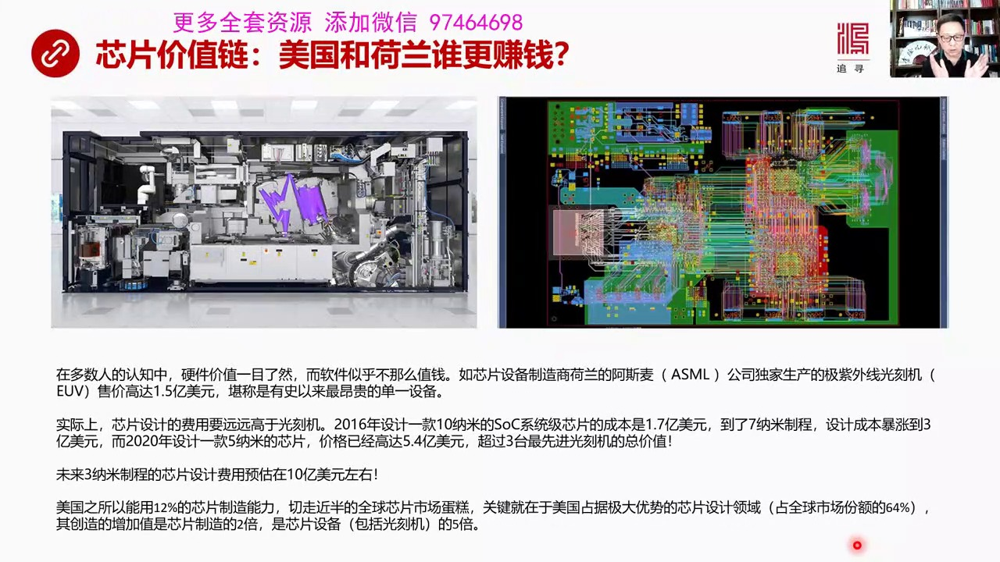

我们再看一下芯片设计本身 芯片价值链我们经常说光颗积极光颗积极如何了不起 或者光颗积如何如何赚钱但是你看看在芯片设计链中 美国和河南谁更赚钱大多数认为肯定是硬件赚钱 而且是这么高端的硬件阿斯麦搞着光颗积 极字外线 极字外线的光颗积UV 售价一台高达1.5亿美元 堪称是由事以来最贵的单一设备这能难道不...

<strong>Cleaned narration</strong>

> 我们再看一下芯片设计本身 芯片价值链我们经常说光颗积极光颗积极如何了不起 或者光颗积如何如何赚钱但是你看看在芯片设计链中 美国和河南谁更赚钱
> 大多数认为肯定是硬件赚钱 而且是这么高端的硬件阿斯麦搞着光颗积 极字外线 极字外线的光颗积UV 售价一台高达1.5亿美元 堪称是由事以来最贵
> 的单一设备这能难道不赚钱吗 是很赚钱但实际上 芯片设计的费用要远远高于光颗积2016年 设计一款石纳米的系统积芯片的成本是1.7亿美元到了7
> 纳米的质成 设计成本抱掌到了3亿美元到了2020年 设计一款5纳米的系统积芯片 价格是5.4亿美元设计一个芯片这个设计一款5纳米的系统积芯片
> 的成本超过了三台最先进的极字外线的阿斯麦的光颗积的总和你说谁更赚钱未来三纳米质成的芯片设计费用 预估在10亿美元左右那就更吓人了这也是美国之
> 所以能用12%芯片制造能力却切走50%的全球芯片蛋糕 靠什么 靠的就是它占极大优势的芯片设计 占全球设计市场的64%这一款是利润最大的一块 
> 是蛋糕奶油最多的一块那么芯片设计所创造了全产业链的增加值是芯片制造的两倍 设计是制造的两倍是芯片设备包括光额积了5倍所以芯片设计才是真正奶油
> 中间的蛋糕中间的奶油部分是整个产业链最高的部分 也是美国牢牢控制的部分可以说 中国和美国的差异最主要的体验是在软的部分而不是生产制造的部分 
> 生产制造的美国它12%但是软的部分它占的比例就大了 尤其是在底层的1D那占据就太大了我们看下一 芯片设计增加值占供应链的半壁江战

---

### Slide 2

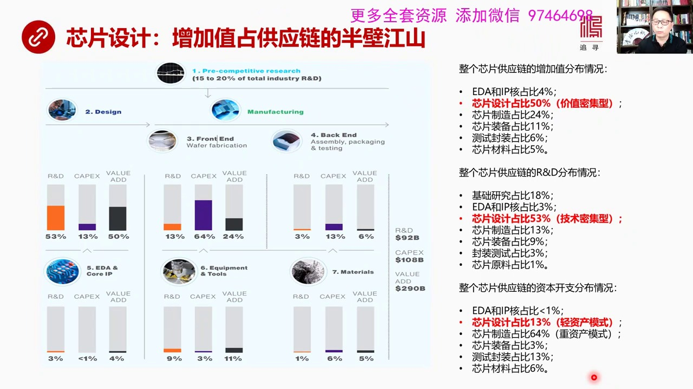

就是一半的半导体的供应链全链条了供应链增加值的部分 芯片设计占了一半如果我们来看从芯片的研究设计到生产制造你会看到中间这一块是设计部分中间有1D公司 有IP商在设计部分有设计公司 这是1D和IP核心供应商在生产制造部分有代工厂 还有半导体的人装备公司那么在后端有封装测试 还有半导体的原材料通过这些比...

<strong>Cleaned narration</strong>

> 就是一半的半导体的供应链全链条了供应链增加值的部分 芯片设计占了一半如果我们来看从芯片的研究设计到生产制造你会看到中间这一块是设计部分中间有
> 1D公司 有IP商在设计部分有设计公司 这是1D和IP核心供应商在生产制造部分有代工厂 还有半导体的人装备公司那么在后端有封装测试 还有半导
> 体的原材料通过这些比例 就是R&D 研发比例 还有资本开销 资本支出还有增加值 所占的比例我们可以看到整个供应链上增加值分布的情况1D和IP
> 核占增加值4% 因为它们1D规模比较小芯片设计占50% 所以我称之为是价值密集性增加值半高中间它贡献了一半芯片制造只占24% 你的代工厂逃了
> 钱很多很多但是增加值才创造24%芯片封装才占11% 还有芯片装备包括光刻机 正移动才占11% 还有测试封装占6%还有半导体原材料占5%所以这
> 块奶油最大的是芯片设计 价值密集性在R&D领域中 芯片设计独占53% 所以是技术密集性在资本开支方面 芯片设计占比13%所以它是清资产型 就
> 是清资产技术密集然后是价值密集 所以清资产高利润就是这样一个原因 从数据上我们一幕了解我们所看到的中国大量投资之前其实都是在搞芯片制造而芯片
> 制造无论从增加值的角度来说还是从其他基础研究R&D的角度来说 它占比都比较低那么只有在资本开支方面它占比最大所以它是个重资产的模式所以中国的
> 模式是重资产靠规模效益来赚钱我们再看下一 芯片设计它的思维结构是什么样

---

### Slide 3

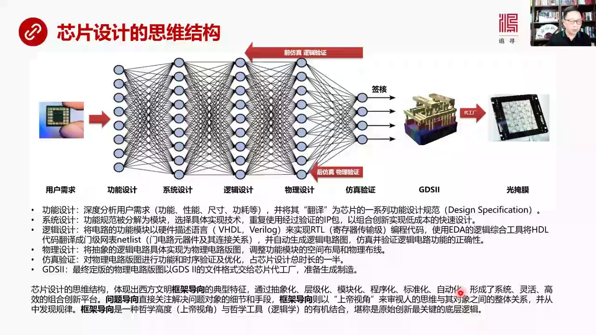

我在这里用的不是标准的电搞芯片设计芯片设计它的芯片设计流程土我觉得没有什么太大技术性太强我现在是用人工智能的分层的深度学习的分层的理论来探讨或者来归那芯片设计的思维结构用户首先要提需求 我准备设计一个什么样的比如说其林芯片 我要设计成一个多大的功耗多大的面积 多大尺寸然后它的性能如何那么用户提要求然...

<strong>Cleaned narration</strong>

> 我在这里用的不是标准的电搞芯片设计芯片设计它的芯片设计流程土我觉得没有什么太大技术性太强我现在是用人工智能的分层的深度学习的分层的理论来探讨
> 或者来归那芯片设计的思维结构用户首先要提需求 我准备设计一个什么样的比如说其林芯片 我要设计成一个多大的功耗多大的面积 多大尺寸然后它的性能
> 如何那么用户提要求然后芯片设计公司接到这个要求之后要进行翻译 功能设计 就是深度分析用户的需求功能 性能 尺寸 功耗等等并把这种需求翻译成为
> 芯片的一系列功能设计规范规范是什么 有了然后转向系统设计 就是结构 整个是提价构功能设计规范 要被分解 分差分开成若干的模块分成若干模块之后
>  选择模块的聚集实验技术然后大量使用经过验证的IP包就是降低 成本 加快速度搞组合创新来实现一个高效低费用的快速设计这是系统设计对不能要完成
> 的还有就是逻辑设计 系统设计完了之后就到逻辑层面了逻辑层面就是将电路功能模块以硬件描述语言来实现技存器传出极的编码呆 这个编程内我们一开始已
> 经说过了然后再使用1.8的逻辑综合工具把抽象高层的语言翻译成门集 门集的网表就是门集电路语言器件和它的连接关系就是一张表格这边有多少门集电路
>  这边有多少连接关系然后有了这个表之后就会自动转化成再被自动被移跌工具自动转化成逻辑电路图在这个工程中生成了电逻辑电路图之后要进行逻辑功能的
> 访真验证看它的功能对不对 跟我设计栏图是不是完全一样然后功能验证完成之后逻辑这个门集访真之后就要进入物理设计所以物理设计就是把抽象的逻辑电路
> 转化成实际的物理的电路这个电路板图就是要变成电路板图了然后调整功能模块在空间的布局布线等等等等这是物理设计物理设计完了之后还要再进行访真教验
> 对物理电路板图进行功能它的简验还有实讯验证包括各种各样的优化访真验证要占到芯片设计总长度的一半而这个访真有分前访真和后访真前访真是访真逻辑成
> 看它的逻辑功能对不对后访真是访真物理电路它的功能对不对跟设计的基本要求一不一样还有各种各样的优化是不是达到最佳效果当这些过程都完成之后最后签
> 合没问题了最后变成GTS2这种数据文件这个文件被传给台积电或者叫代工厂然后在代工厂用这样的数据文件来生成光野模然后用光科机来真正来课这个电路
> 板这个就是我们看到的芯片设计的一种思维结构我觉得非常像人工智能深度学习我看了芯片设计的结构还包括人家做事的方法我有一种深刻的体会我觉得整个芯
> 片不管是EDS设计还是芯片设计的基本思路体验出了西方文明框架导向的典型特征比如说这种东西叫框架设计就是我在思考把用户的要求最后转变成一个文件
> 的时候我并不是说围绕这个最后的目标来进行来进行这个问题导向的思维方式比如说问题导向就是说我如果要实现一个复杂的电路功能我上来就想怎么去实现 
> 怎么去实现 怎么去实现想到各种电路的最后的成型的结果我围绕最后成型结果来思考这叫问题导向是 框架导向不是框架导向是从这儿到这儿有一千条路每条
> 路都能实现最后的目标但是框架导向是考虑这一千条路 共同的规律我把这一千条路分成落干 抽象成落干的逻辑层没层只做它应该做了事儿 比如说功能设计
> 层 系统设计层逻辑设计层 物理设计层 包括签合层我把成千上万条道路中间的共性点营责争抓去出来之后进行归纳把它压收在落干的逻辑层上然后每个逻辑
> 层上会有不同的厂家来竞争来实现这个逻辑层最佳的工具的设计然后进行组合进行进行这个监病然后形成一个大的巨头这叫框架性的思维方式就是通过抽象化 
> ...

---

### Slide 4

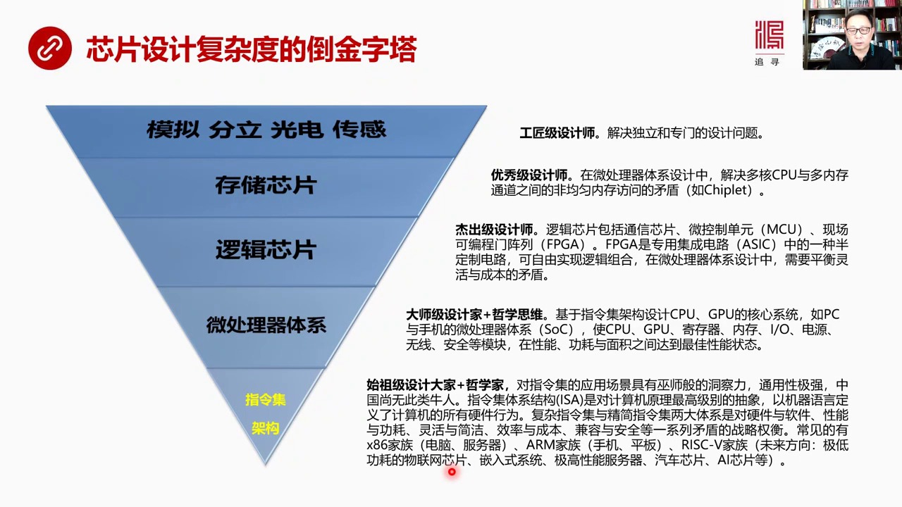

我也搞了一个道晋塔形就是芯片设计的复杂度道晋塔我认为芯片设计它从复杂度角度来看的话最底层的晋塔的机时是指令机架构在此之上才是微处理器体系在网上是逻辑芯片然后是纯主芯片然后是模拟分立光链和传感器它的难度是不一样最往下越往下越难能做指令机架构了我称之为是十组机设计大家加哲学家这是计算机行业的哲学哲人哲学...

<strong>Cleaned narration</strong>

> 我也搞了一个道晋塔形就是芯片设计的复杂度道晋塔我认为芯片设计它从复杂度角度来看的话最底层的晋塔的机时是指令机架构在此之上才是微处理器体系在网
> 上是逻辑芯片然后是纯主芯片然后是模拟分立光链和传感器它的难度是不一样最往下越往下越难能做指令机架构了我称之为是十组机设计大家加哲学家这是计算
> 机行业的哲学哲人哲学家只有哲学高度人才能创造这种东西对指令机它的应用场景我称之为是具有一种无事般的动察力所以它搞出了指令机的这种架构通用机枪
> 我觉得到目前为止中国还没有这样的牛人至少我不知道有这样的牛人能把指令机玩套了而且你设计指令机未来三五十年来验证它成了发展最旺胜的就是在各行各
> 业旅中应用最广的指令机构你能创造那个吗那个是最牛的你比如说IP我们现在说的IP包互联网络最底层的突破是源于IP包人们把数据打成包在网络中传输
> 这个就是一个非常牛掰的一个设计思路如果没有这个设计思路就不会有现在互联网上的一切不会有所谓的信息经济当初设计IP包的这个概念这个人把它设计成
> TCVIP这样的架构的这帮人也就几个人这是不是像无事一样具有着长远的动察力它知道把这个数据传输用数据包打包在一起在线路中这种传输有未来无线的
> 可能性可以服务于无线的通用性有无线的进化的扩展性如果换成另外一个人没有这样的十足级别这种设计能力和哲学思路的人很可能把电路互联网电路设计成很
> 疆化的一个东西就像IP出现之前的其他的各种设计这种东西就叫十足级设计大师指令级体系结构ISA是什么意思是对计算机原理的最高级别的抽象是用机器
> 原来定义计算机所有硬件行为的根本大法我称之为是宪法就是对硬件用计算机语言来描述硬件一切行为的宪法先看看宪法制定那可太有水平了就是我可以规定硬
> 件这么工作也可以规定硬件那么工作没有技术上的难度但是有哲学上的难度他难不是难在技术上不知道怎么实现比如说寻指空间有多大比如说一个时钟之星几条
> 指令比如说指令几个复达指令还是简单指令等等这些东西本身并没有什么技术上的难度但是把它组合在一起要让这个价构偷用于世界未来万十万物的发展你要做
> 精密化的思考你要做高度抽象的分析你要不然设计出来的东西要么过于疆化要么过于复杂所以能把这个东西设计的特别好能够在未来全世界所有应用领域中大型
> 起到了这种设计师当然是十足极设计大家而且是哲学家现在计算机领域中间包括复达指令机和经典指令机这是两大阵营这两大体系其实是对硬件和软件性能与功
> 耗灵活与简洁效率成本尖容与安全一系列矛盾的战略权衡没有能还是不能两条路都能走但不是哪条路走出来通应性最强或者叫最优而且它对未来的尖容性升级尖
> 容擴展要非常强常见的指令机比如说X86这种家族我们现在绝大多人用的电脑包括服务器但还有二名家族我们所有人用的手机平板还有就是今天指令机第五代
> Risk 5它未来的方向现在还没有刚刚提出来还没有真正成绩后未来方向是极低功耗的物联网芯片切入式的系统极高性能的服务器切成一片AI芯片等等我
> 们以前上大学的时候学过指令机这还是一门课但是20岁的时候你却没有真正理解它背后的哲学含义你只是从简单的电路电路设计既然机设计原理却理解它就觉
> 得这个东西好像看不出有什么看不出有什么特别牛白的地方看不出有什么特别深二的地方现在你回头来在发明好家伙指令机架构这是创造26个字母的那帮人是
> 非几人就是我为什么要创造26个字母而不是28个字母而不是32个字母呢就是我创造32个字母来表达东西好像也没问题但是荣誉了多了过上了不经历我要
> ...

---

### Slide 5

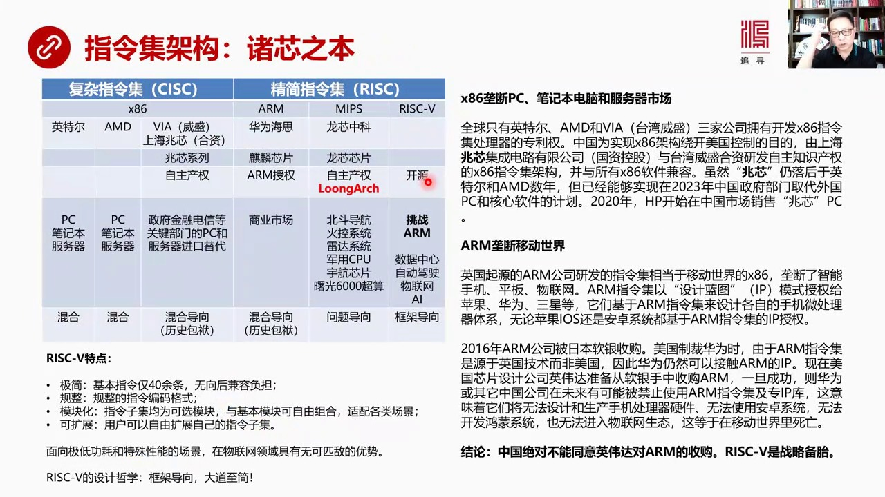

是所有体系的最核心的基石是芯片设计的根本我们来看现在芯片设计大概分成两大类这个指令极复杂指令极这是一个阵营还有今天指令极是另外一阵营复杂指令极包括X86加足重要厂家英特尔AMD还有Wei台湾的微圣这个一般人知道比较少只有这三家公司拥有合法的86X86加足的复杂指令极的扩展权或者叫它全部的知识产权只有...

<strong>Cleaned narration</strong>

> 是所有体系的最核心的基石是芯片设计的根本我们来看现在芯片设计大概分成两大类这个指令极复杂指令极这是一个阵营还有今天指令极是另外一阵营复杂指令
> 极包括X86加足重要厂家英特尔AMD还有Wei台湾的微圣这个一般人知道比较少只有这三家公司拥有合法的86X86加足的复杂指令极的扩展权或者叫
> 它全部的知识产权只有这三家有所以正是因为微圣有那么中国政府想繞开英特尔和AMD的对这个政府部门的PCG的全面的笼端和控制就是你芯片只能用英特
> 尔的你不能用自己的芯片这哪行它有个安全性论题所以上海成立了一家就跟微圣就上海政府跟微圣成立一个上海赵心生产X86系列的赵心赵心芯片系列虽然赵
> 心芯片系列它在性能上比英特尔和AMD还有一些差距但是它是完全的自主制裁权因为它也是三个拥有产权的拥有方之一我跟它合资了我也拥有它的自主产权我
> 不用再去找它找英特尔和赵AMD去请示我可以改制定期这是我的产权那么英特尔AMD当然就是PC笔记本服务器这是我们看到基本所有的电脑用了都是英特
> 尔和AMD上海赵心生产的东西主要是要未来要用于政府军方金融电信这些最关键部门的PC和服务器的进口替代中国一定要用自己的因为有自主产权的东西而
> 不再用外国的芯片来替代来替代国外产品那么它从涉及思路来说就是框架导向和问题导向它是混合的因为为什么因为X86加足时间太早了所以它历史包覆很沉
> 重我从20年前睡到现在30年前睡到现在无数个以前的版本我都得向前肩融向后肩融我都有个巨大的一个历史负担所以搞得搞去我计算机技术在进化架构在进
> 化现在架构更简单但是我必须要向过去肩融以前比较普达的东西和以前留下了一系列乱七八糟的东西我都比肩融因为软件人家生态已经形成了我不能说我搞出一
> 个新的比如说X86的一个新的指令机以前都已经没法用了这个生态就完蛋了所以这就形成了问题导向、
> 加框架导向混合的一种模式今天只领机最著名的2就是所有手机移动世界基本上用的都是2它的壟断Mibs这个现在基本上已经淘汰出局了还有Risk 5
> 这个我认为未来是非常有前景的一个技术RM中这个阵营中华为海斯华为海斯主要苗象是商业市场RM也存在一个混合导向的问题就是历史包覆很重那么还有一
> 家中国的公司很有意思叫龙新中科这跟一家的中国来的NTC我们是说RM都是一家我们是一家这一家我们是一家我们是一家我们是一家我们是一家一家我们是
> 一家一家一家一家一家一家一家叫《龍星中科》 《中科院》計算所他們設計的芯片是《龍星系列》
>  《龍星系列》芯片它一開始走的是MIFS路線也是今天這領域的一個分枝吧後來由於各種各樣的原因吧他們放棄了MIFS 搞出了自己的完全自主制產權
> 的這個《龍2》這是一個中國人自己搞出的一個真正的指令級除此之外我沒有看到誰還搞出過指令級但搞出指令級本身是很簡單任何一個搞計算級的你可以自己
> 高興也可以寫一個指令級但問題是能不能夠形成生態有沒有進化的可能性能不能被商業化那就不知道這個《龍星》
> 的指令級是他們自己搞出來的《龍星指令級》它主要用於什麼用於北斗 北斗導航 用了芯片是《龍星》
> 火空雷達這個軍工系統包括雷達系統 包括軍用CPU還有與航芯片 屬光6000超算這用的都是《龍星》
> ...

---

### Slide 6

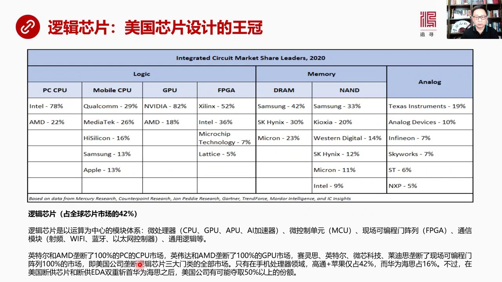

設計上的一種亡觀它最牛了就是芯片設計而芯片設計除了我所指定機之外微處理器之外最重要的就是這個邏輯性片當然這種劃分有兩種有一種劃分大邏輯把CPU、GPU也加在裡頭也可以我們現在說的是一個大邏輯性片就是所有微處理器的部分再加上可編程控制器的部分都加在一起叫邏輯性片邏輯性片佔全球性片市場的4%邏輯性片就是...

<strong>Cleaned narration</strong>

> 設計上的一種亡觀它最牛了就是芯片設計而芯片設計除了我所指定機之外微處理器之外最重要的就是這個邏輯性片當然這種劃分有兩種有一種劃分大邏輯把CP
> U、GPU也加在裡頭也可以我們現在說的是一個大邏輯性片就是所有微處理器的部分再加上可編程控制器的部分都加在一起叫邏輯性片邏輯性片佔全球性片市
> 場的4%邏輯性片就是什麼叫邏輯性片就是以計算以運算為中心的模塊體系CPU、GPU、APU、
> AI加速器這都是為了高速運算服務的核心還有微控制單元MCU就是以前叫單片機還有現場可控制門鎮鏈隨時可以調整這個可以進行調整的就是半固化的芯片
> 還有通信、通信模塊比如說社群、Wi-Fi、藍牙、理態控制器等等還有通用邏輯的各種功能芯片這些領域中佔了全球市場的4%這個是屬於複雜芯片設計在
> 這個領域中邏輯面領域中英特爾和AMD壟斷了100%的PC市場然後我們可以看到音尾達還有AMD控制了100%的GPU市場就是通信加速器然後這些
> 美國的公司薩林斯、英特爾、微信科技萊迪斯壟斷了現場可編成門鎮鏈100%市場四個邏輯芯片的板塊中三者被美國佔了100%可見它的優勢之明顯當然在
> 只有在手機CPU領域中出現了便宜因為手機是一個新生事物只有在新生事物中你才有可能崛起所有已經成型人家已經固化已經新生生在生態死所了你基本上沒
> 有機會在一個城市市場中打敗絕對壟斷的對手這是不可能的事手機新起的比較完美國的公司還沒有來得及鋪向市場壟斷這個市場中國跟他們同步崛起所以華為、
> 海斯能夠佔到16%的手機CPU市場就是個道理你讓華為再去公公司PCCPU你試試看能公了下來嗎公不動新興領域中是最容易切進來的老市場動不了因為
> 人家已經形成了賽道各種賽道和生態的死所沒戲那麼高通還有蘋果佔了合計佔了2%、華為佔了16%但是由於現在美國斷共芯片和斷共1.2所謂的雙重斬首
> 雙重斬首海斯之後海斯如果不給你提供就是不給海斯提供這個1.1不讓你更新你還設計什麼芯片沒法設計芯片因為你的酷了新興的這個元氣劍三納米的信心都
> 沒有五納米的更新東西你也沒有那麼你手上掌握都是一些都是一些很大這層很就制成上那些不變的東西那那些東西肯定搞不出最高端的手機你就基本上被邊緣化
> 了這招比斷共芯片還要很因為它基本上裡面設計能力都沒有了你就無法設計那種芯片了斷共斷共芯片有召一日中國還可以從其他地方買三星或者其他的公司或者
> 中國自己搞的這個芯片還有可能買得到但EDA如果生長不出來自己不能搞自主EDA的話那就真的是麻煩了那麼如果把海斯展手之後美國公司有可能奪去50
> %以上的份額這個是邏輯芯片我們再看存主芯片存主芯片當然就包括兩大類

---

### Slide 7

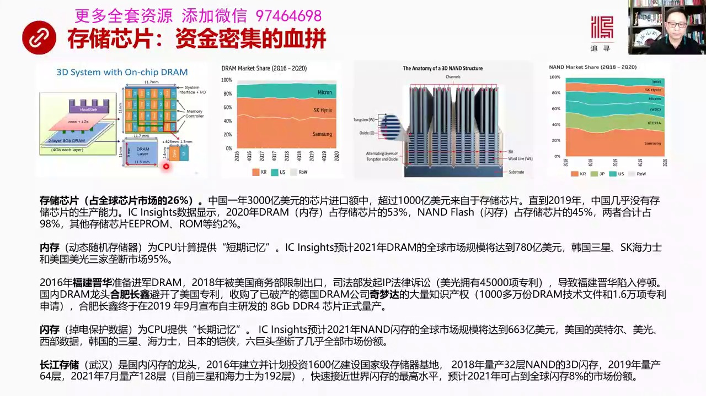

存主芯片占全球芯片上了26%中國一年要進口3,000億美元的芯片其中有超過1,000億美元都是買的存主芯片那麼一直到2019年中國幾乎沒有存主芯片的生產能力這個很多研究部門他們做了研究顯示2020年內存D-RAM這個內存占存主芯片的53%這個閃存占存主芯片45%兩者合計占的98%其他存主芯片比如說1...

<strong>Cleaned narration</strong>

> 存主芯片占全球芯片上了26%中國一年要進口3,000億美元的芯片其中有超過1,000億美元都是買的存主芯片那麼一直到2019年中國幾乎沒有存
> 主芯片的生產能力這個很多研究部門他們做了研究顯示2020年內存D-RAM這個內存占存主芯片的53%這個閃存占存主芯片45%兩者合計占的98%
> 其他存主芯片比如說1,1RAM1,1PROM和RAM占版賬其實我們說的存主芯片就是一個內存一個閃存這兩個是最主要的芯片內存和閃存這兩個這兩個
> 東西這兩個市場基本上都已經實現了三D的對敵技術大好多層像三D的閃存它可以現在能夠達到最先進的達到192層那麼這兩種芯片有什麼區別內存是什麼內
> 存是動態隨機存儲機一定要電數據沒了就是內存就像我們買電腦你要看多少多少內存這個內存就是調電就沒了它是靠電容來存儲數據不斷需要刷新沒有電流電容
> 上存都將不符存在所以內存是給CPU提供短期記憶的2021年D-RAM這個全球市場規模780億左右三星 韓國的三星這個海利市和美國美國三家壟斷
> 市場95%所以內存市場中這三家已經壟斷了95%的市場2016年福建進華準備去進軍D-RAM市場結果18年就被美國上部限制出口司法部發起IP法
> 律訴訟被美光告美光擁有45000項各種各樣的技術專利接下來這一下導致的福建進華陷入了長期停頓那麼國內D-RAM最厲害的龍頭老大是河肥長新所以
> 我們講到中部崛起的時候河肥是一個科技創新之都包括武漢各有各的擅長的地方河肥是專門搞D-RAM的就是搞這個動態層主器的搞內存的他們避開了成功避
> 開了美國制裁主要是因為他們用的是德國技術就是秦孟達德國的D-RAM公司在08年破產了他當時留下大量制裁權這個制裁權被河肥長新買了不少1千多萬
> 份D-RAM的技術文件還有16000項技術專利正是依靠制裁權這些不受美國制約的制裁權河肥長新才在2019年9月自主研發成功了8G、
> DDRS、DDR4的芯片內存的這個芯片正是量產終於實現了零的突破閃存閃存就是吊了電就是沒電之後它不會丟就是我們看了那個FlashFlash 
> Drive就是閃存的這種優頓還有各種各樣類型的閃存他們主要是為CPU提供長期記憶現在閃存全球上了跟模式663億2021年那麼它的它的壟斷情況
> 稍微好一點沒有這麼多分成幾家公司來壟斷因為美國的英特爾還有美國西部數據韓國的三星海利市和日本的這個凱霞6家巨頭壟斷了幾乎全部市場分隔中國也在
> 供這個市場主要是誰呢武漢的長江存儲所以武漢和河肥這兩個地方都是有些半導體工業的產生存儲是國內閃存的龍頭2016年他們這個計劃投資1600億當
> 是國家界的投資建立國家及存儲基地2018年他們已經開始量產32層的閃存3D閃存19年變成642021年7月我看最近的報導是已經可以量產128
> 層了李一木前三星和海利市最高水平192層還有一點差距但是已經接近世界閃存的最高水平當年韓國就是靠價格戈後戰把日本芯片這個業給幹掉了特別存儲這
> 個存儲行業特別是在這個D-RAM0一中拼得很厲害日本被擠出來了現在長江存儲要開始大規模生產的話有可能再次採取水平價格的戰術戈韓國人的喉那麼預
> 計2021年長江存儲的長江存儲所生產的閃存芯片將會佔到全球市場規模的8%所以這塊咱們也能崛起存儲器我們再看下一頁3分天下之DAO

---

### Slide 8

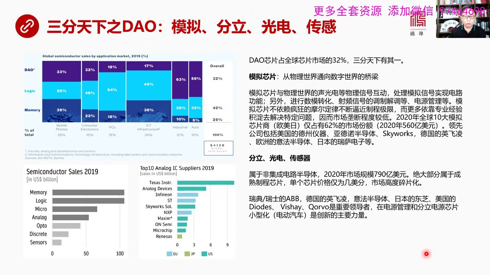

就是模擬分立光電和傳感如果我們來看這個DAO市場它的它在全球芯片市場的份額的話大概是佔有32%正好是3分天下有7億模擬芯片模擬芯片就是從物理世界通向數字世界的橋樑模擬芯片指的是物理世界中它的升光電各種各種這個壓力硬力然後輔射各種樣的物理世界中的信號是通過模擬芯片然後才能夠進入數字世界被進行基礎裡當然...

<strong>Cleaned narration</strong>

> 就是模擬分立光電和傳感如果我們來看這個DAO市場它的它在全球芯片市場的份額的話大概是佔有32%正好是3分天下有7億模擬芯片模擬芯片就是從物理
> 世界通向數字世界的橋樑模擬芯片指的是物理世界中它的升光電各種各種這個壓力硬力然後輔射各種樣的物理世界中的信號是通過模擬芯片然後才能夠進入數字
> 世界被進行基礎裡當然模擬電路它有就是模擬有模擬的電路和模擬芯片存模擬芯片也可以處理相當的這種相當复杂的功能就是模擬電路存模擬電路另外模擬信號
> 物理世界的各種各樣的這個外界的信號可以進行數碼轉化變成數字信號然後經過調整解條然後發射出去然後等等等等包括很多包括電源管理等等進入數字世界之
> 後被基礎機CPU所處理模擬芯片跟數字信變最大不同就是模擬芯片不依賴瘋狂的模耳定律不斷逼近製成了極限它沒有這麼高的要求為什麼因為模擬芯片主要更
> 多是依靠是專業經驗靠的是處理問題的一種積累去解決某種特定的問題因此市場並不存在一個高度壟斷的一個份額的就是高度壟斷市場份額的問題2020年全
> 球十大模擬芯片商歐美日僅佔全部市場的62%份額就是壟斷度還沒有這麼高大概在2020年是560億美元左右領先的這種公司包括美國的德州一氣亞東諾
> 半島體Sky Works包括英國的英飛靈把歐洲的義法半島體還有日本的瑞薩瑞薩電子等等這些公司大家都比較分散因為模擬芯片本來就不存在一個這麼激
> 烈的競爭因為沒法爭各搞各的我研究這塊你研究那塊主打的市場就是市場碎片化所以它很難形成高度壟斷中國的芯片設計模擬芯片在這個市場中是有發展空間的
> 那麼分立光電和傳感器這都屬於飛機程電路半島體機程電路和飛機程都可以搞的半島體都可以搞芯片那麼2020年這個市場的規模是790億美人絕大部分屬
> 於成熟製程的這種芯片每個芯片的價格僅僅為幾美分非常超級低點相當的便宜所以在這些市場上市場是高度碎片化的大家都都在搞比如說我們說的武漢的光顧搞
> 的光電轉化分立包括傳感器那就在光顧那個地區在武漢的光顧會有一個就中國比較集中的產業集群那麼全世界其實在整個半島體市場中這都是屬於切的比較碎的
> 這些領域就是光電傳感器和分立沒有一家絕對壟斷的老大或者前幾大的這種公司那麼不同的公司像瑞典瑞士的ABB英國的英飛靈德國的英飛靈包括意法半島體
> 日本的東織美國的各種各樣的這種公司他們分別在不同領域中有所擅長比如說電源管理分立電源芯片還有小型化包括電動汽車是不同領域中的領袖和代表者但是
> 沒有形成一個通用的分立光電傳感器它本來就不是一個統計市場是個碎片化市場所以沒有一個絕對的老大我們再看下一頁芯片設計實力的對比我們看一下總的新片設計

---

### Slide 9

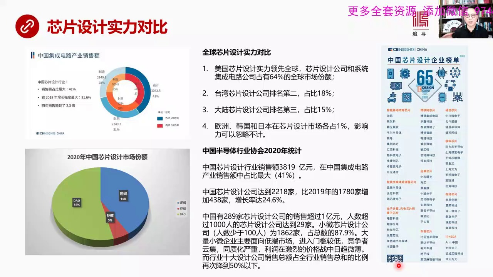

一個對比情況中國金融電路銷售的設計佔全部金融電路市場的比例大概是41%所以中國也是一個設計佔了很大比例的國家就是在半島體工業中間設計佔41%這是很大比例那麼在設計市場分額中間我們可以看到最大一塊是DAO就是模擬分立光電傳感等等這塊佔了54%說明中國的芯片設計水平複雜度是比較低的是解決很多具體問題的是...

<strong>Cleaned narration</strong>

> 一個對比情況中國金融電路銷售的設計佔全部金融電路市場的比例大概是41%所以中國也是一個設計佔了很大比例的國家就是在半島體工業中間設計佔41%
> 這是很大比例那麼在設計市場分額中間我們可以看到最大一塊是DAO就是模擬分立光電傳感等等這塊佔了54%說明中國的芯片設計水平複雜度是比較低的是
> 解決很多具體問題的是在金字塔頂肩的是在金字塔的上面的到金塔的上面這塊市場很大但是設計難度不大所以這塊是中國設計市場的主要部分邏輯部分佔了41
> %這個比例也不低但是這個東西是偏向一些比較簡單的邏輯而不是比較複雜的邏輯還有存儲內存設計相對佔比表低因為中國剛剛常常存儲和合肥剛剛才亮彈所以
> 設計部分在中間佔的比例也表低全球芯片設計實力對比美國肯定是老大芯片設計公司再加上系統集成電路公司中間的設計部門它自己也有自帶的設計部分一共佔
> 有全球市場份額的64%絕對老大台灣芯片設計公司排名第二佔18%大陸芯片設計公司排名第三佔15%歐洲 韓國和日本在芯片設計市場中各佔1%他們的
> 影響力可以忽略不計所以我上次專門講過日本為什麼在芯片設計中他們沒有什麼影響力就是因為這個比例太低韓國也不行 歐洲也不行相對來說 美國 大陸和
> 台灣還比較強那麼中國半導體行業協會2020年一個統計就是在中國芯片設計行業中間它的總銷唄是3819億在中國機身電路銷唄總額中間佔比最大佔有4
> 1%的份額中國芯片設計公司現在達到了2218家比2019年1780家增加了438家增加幅度非常大就現在大家都在搞芯片設計那麼在中國真正大較大
> 規模的芯片設計就是銷唄蘿超過1個億的只有289家人數超過1000人的芯片設計公司只有29家就是上千人的才29家小微芯片設計公司太多了人數少1
> 00人有1862家佔總數新年芯片設計公司總數的87.9%所以中國芯片設計是大量小微企業主要這個面向第一端市場進入門口很低競爭很激烈 通知外嚴
> 重然後利潤非常微薄而行業十大設計公司的消失總額在全部銷唄中間佔比再次調到了50%一下這說明芯片設計遊戲有優好的方面是數量增加很多包括銷唄蘿變
> 大的就銷唄蘿超過1個億的公司也越來越多但是同時它不好的方面就是競爭小微企業競爭太激烈而且這個童中話非常嚴重 利潤很薄利潤薄的時候就沒有科技沒
> 有經費搞科技研發所以後進就會受到嚴重制約這些小微企業應該轉型的方向是做那種驚特高驚特這種方向 就是你有讀門絕活才能活得很好 利潤才會比較高而
> 不是說大家都拼類似的這種領域和類似的工具那就沒意思了 只能拼價格了這邊是中國2020年新片設計的企業的一個排行榜各個不同的一種有不少公司在不同的一種進行鋼銀我們再看下一頁下一頁是總結

---

### Slide 10

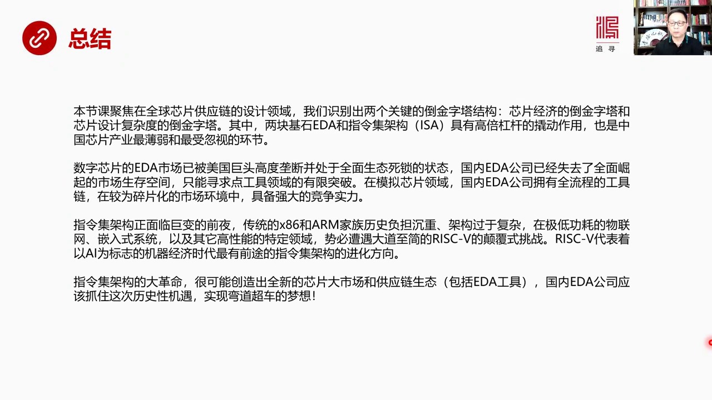

我們這場課聚焦在全球芯片供應鏈的設計領域在講科國人中我們實別出了兩個關鍵的道晶塔結構芯片經濟的道晶塔和芯片設計複雜度的道晶塔其中兩塊雞石 一個是一跌 另外一個是指令雞架構這兩個雞石都具有高倍槓槓的敲動作用也是中國芯片產業中最脆弱 最容易受忽視的環節兩個都是特別薄弱而且不受人帶點 不受人重視一跌好點 ...

<strong>Cleaned narration</strong>

> 我們這場課聚焦在全球芯片供應鏈的設計領域在講科國人中我們實別出了兩個關鍵的道晶塔結構芯片經濟的道晶塔和芯片設計複雜度的道晶塔其中兩塊雞石 一
> 個是一跌 另外一個是指令雞架構這兩個雞石都具有高倍槓槓的敲動作用也是中國芯片產業中最脆弱 最容易受忽視的環節兩個都是特別薄弱而且不受人帶點 
> 不受人重視一跌好點 IC 指令雞架構基本上沒問題芯片 數字芯片它的壹類市場現在已經高度壟斷了美國巨頭 高度壟斷而且全面死所了這個賽道就是你工
> 具被死所了 生態被死所了在這種情況之下國內壹類公司已經失去了全面崛起的市場生存空間我們怎麼喊口號 沒有用這個市場已經不符存在了你只剩5%的市
> 場份額95%被人家所壟斷你的口號再大 你再牛也不可能躲下95%的市場因為全部的生態都被死所了所以中國的壹類公司在現有環境情況之下只能尋求點工
> 具領域的有限突破在模擬芯片領域中 國內壹類公司像華大九天這樣的公司擁有全流程的工具就是工具鏈很齊全在比較散碎 比較碎片化了這個市場環境中還是
> 具有相當強大競爭設立的所以在模擬設計 模擬性面設計領域中中國公司是可以做大的那麼第二塊即時 指令機架構我覺得指令機架構正在面臨巨變的前頁傳統
> 的X86和二門家族由於歷史負擔太承重他們的架構 過於負擾在集體功耗這種物聯網的場景之下在簽入系統的情況之下還有很多專用的特殊的高性能特定領域
> 二門和X86都沒有勝算那麼在這個領域中他們一定會遭到大到世界的Risk 5的顛覆性挑戰第五代Risk代表著以AI為標誌的機器經濟時代最有前途
> 的指令機架構的進化方向我們以前講到機器經濟的時候就講技術革命說講過機器經濟就是越往後發展其實不是人類的傳代進行物聯網的這種配置而是傳染器遍佈
> 地球大量的生產活動大量的這種加工活動技術活動是在機器是在人以下的機器之間進行完成的而且是自動完成 是智能完成的所以未來真正經濟體的大頭是機器
> 經濟不是人的行為帶來的經濟效果而是機器之間的交流他們之間的數據傳輸他們之間根據智能化的判斷所進行的創造所進行的生產和製造形成了經濟活動的主流
> 所以未來物聯網的發展是往機器經濟發展的發展而且驅動力是靠AI是靠人工智能在驅動在這個領域中我認為只有今天指令機第五代具有著強大的進行勢力傳統
> 的XXR6XXXX86還有這個HARM家族我覺得他們已經根本就沒有競爭優勢在這個領域中所以我們現在全世界正面了一個指令機架構的大革命很有可能
> 創造出全新的芯片大市場和全新的供應鏈的生態包括EDA工具國內EDA公司應該抓住這次歷史機遇才能實現不到超出的夢想好這個就是我們今天的主要內容大概兩個小時四十五分鐘左右下面就是推薦閱讀這列出了最近讀的

---

### Slide 11

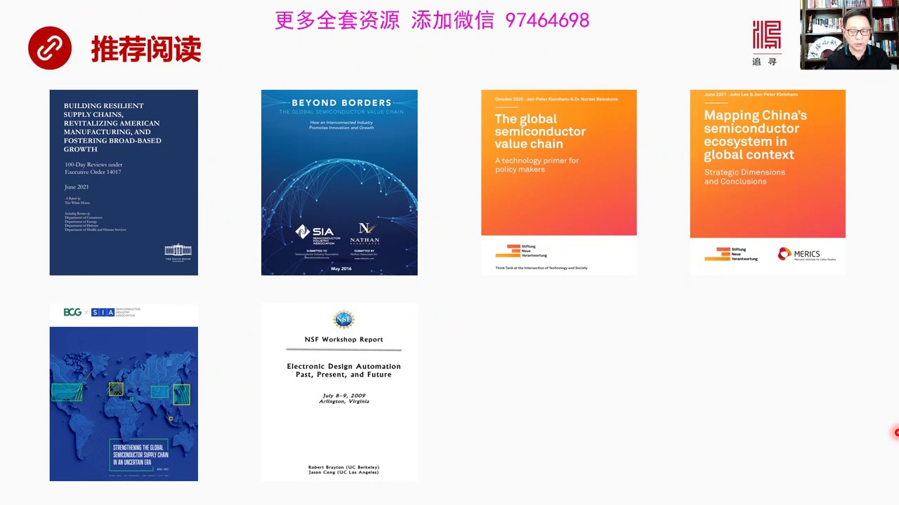

因為最近研究這個問題研究很長一段時間將近一個月是我們核心課裡面花時間經歷比較多的一節課那麼這只是我看到了各種各樣的研究報告各種各樣的研究報告中間的一小部分好這就是我們芯片上這個芯片這個系列

<strong>Cleaned narration</strong>

> 因為最近研究這個問題研究很長一段時間將近一個月是我們核心課裡面花時間經歷比較多的一節課那麼這只是我看到了各種各樣的研究報告各種各樣的研究報告中間的一小部分好這就是我們芯片上這個芯片這個系列

---

### Slide 12

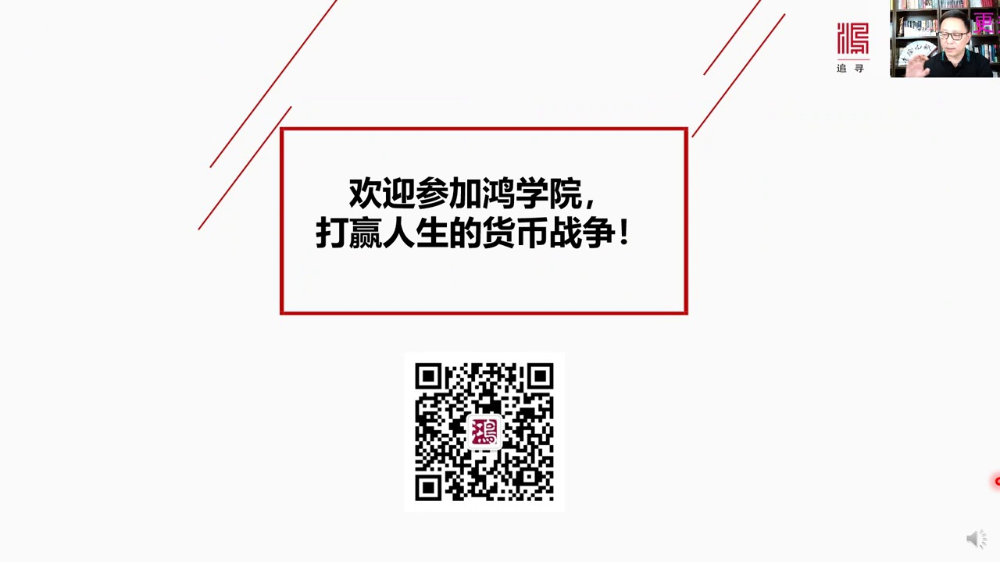

它的第一部分我們以後再做第二部分今天的課就到這裡謝謝大家

<strong>Cleaned narration</strong>

> 它的第一部分我們以後再做第二部分今天的課就到這裡謝謝大家

---
