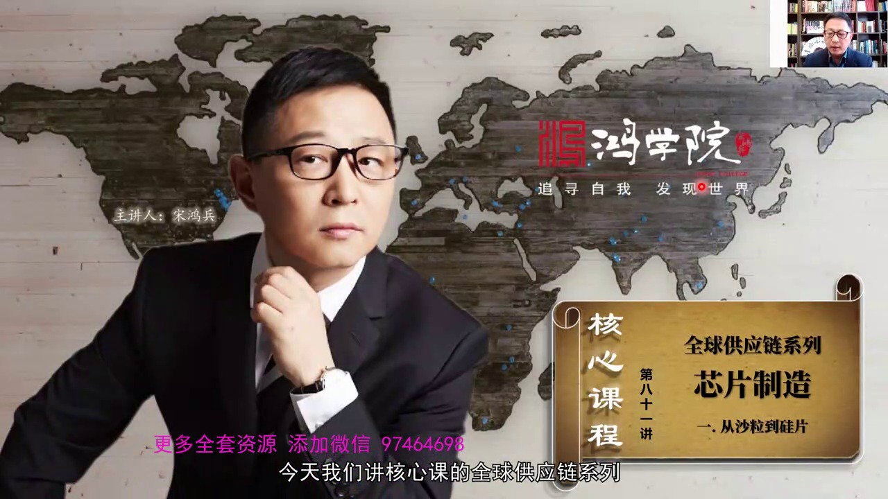
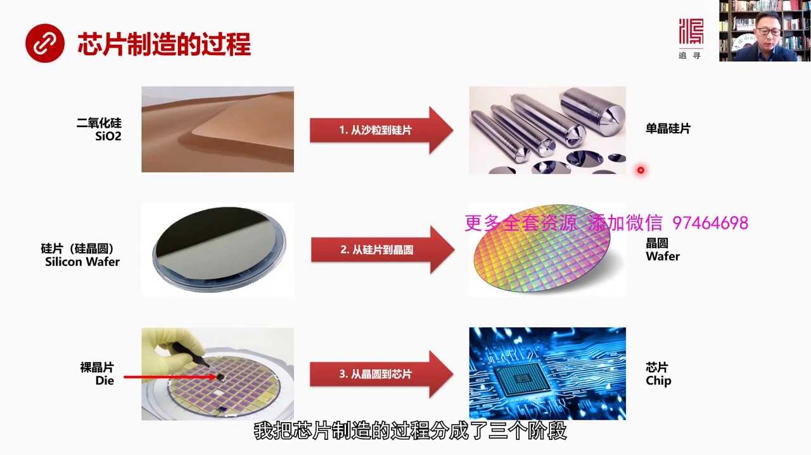
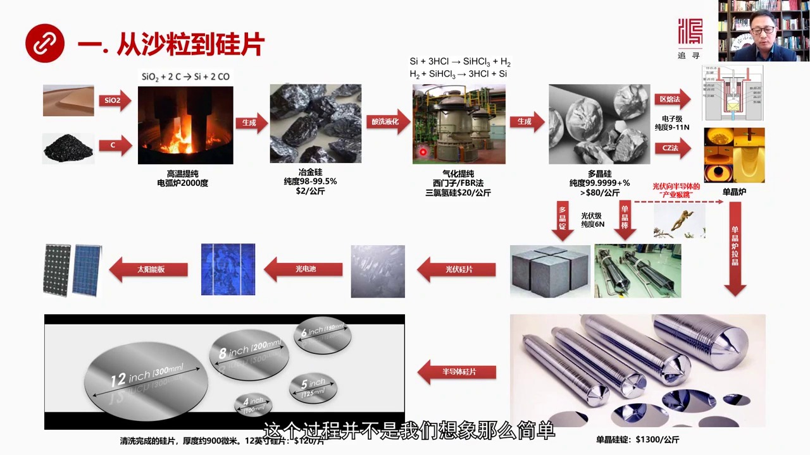
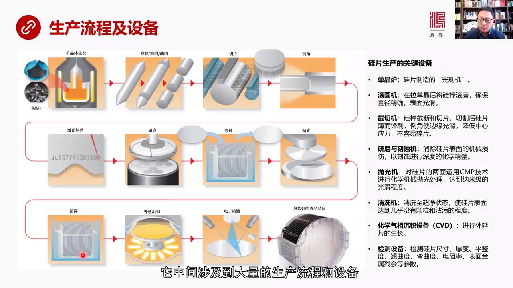
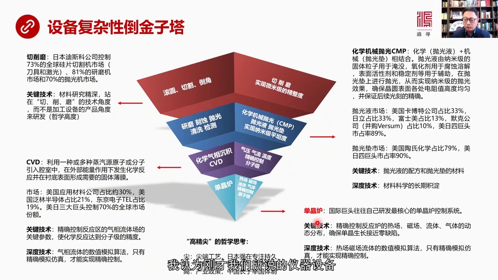
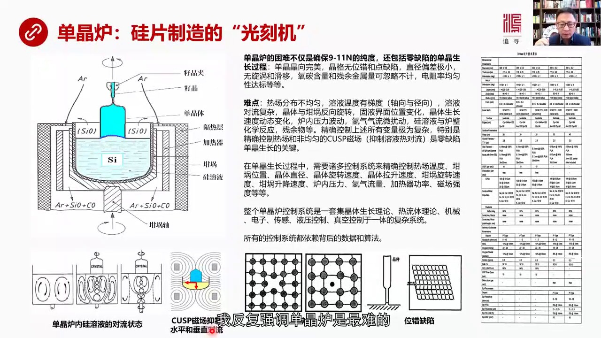

# 核心课视频-81  全球供应链芯片篇四 — Detail Slide Notes

> **来源**：鸿学院核心课程  
> **幻灯片**：6 张

---

### Slide 1

咱們今天重點談芯片製造我們現在看第一頁我把芯片製造了過程分成了三個階段

<strong>All subtitles</strong>

> 咱們今天重點談芯片製造我們現在看第一頁我把芯片製造了過程分成了三個階段

---

### Slide 2

第一個階段 頭 殺力到歸片我們知道最後做出的芯片它的最初始的原材料實際上是沙子 也就是二氧化歸那麼經過一系列的加工過程變成了擔經的歸片那麼第二過程 就是從歸片開始經過一系列加工 變成了金圓注意這個用詞...

<strong>All subtitles</strong>

> 第一個階段 頭 殺力到歸片我們知道最後做出的芯片它的最初始的原材料實際上是沙子 也就是二氧化歸那麼經過一系列的加工過程變成了擔經的歸片那麼第
> 二過程 就是從歸片開始經過一系列加工 變成了金圓注意這個用詞歸片又叫歸金圓 英文是Cylican Weifer那麼最終經過光課等一系列的這種
> 微電子的加工技術最後產生的這個東西叫金圓 Weifer所以這兩個都是金圓但是含義有所不同歸金圓 也就是歸片在我們這堂課裡面我會這兩次是通用的
> 在不同場合我會用不同的詞它代表是最初始的歸的原材料歸片的原材料然後經過一系列的加工最後變成了半導體的金圓在這個金圓片上我們可以看到它有弱乾個
> 小方塊那麼每個小方塊其實就是一個單獨的機身電路這種小方塊 單個的機身電路就叫裸金片 或者英文叫代所以英文中它對每一個概念都會有比較精確的定義
> 我們在中文中也應該這樣那麼這種裸金片被切割切割之後 最後也就是從第三步 從金圓再到芯片這些小的機身電路這種裸金片經過包裝經過瘋裝測試等等最後
> 變成了我們看到最終消費品消費電子中手機中的那些芯片所以我覺得從這樣一個分類的方法分三個階段來理解這個芯片製造會讓我們對這個過程有個非常清楚的
> 認識我們對講哥過程中我沒有採取一般的介紹芯片製造比如說先講半導體材料再講芯片製造的設備然後再講瘋裝測試等等因為我覺得對一個不了解芯片製造這個
> 全過程的人來說你把前端中端和後端的一系列設備混在一塊兒說人很容易聽音或者你把整個生產流程中不同階段的半導體源材料混在一起說人們很難以理解所以
> 從認知角度來說我們採取辦法就是按照最普通的認知方法來講解也就是說你如果是個對半導體對芯片完全不了解的人那麼你從沙子開始一直走的晶片在這個全流
> 程中涉及到什麼設備我們就講什麼設備涉及到什麼材料就講什麼材料涉及到哪些公司我們就講哪些公司這樣的話從認知角度來說可以降低難度從而是我們能夠更
> 加深刻地理解芯片整個供應鏈的全流程那麼今天我們這張課重點講第一部分從沙利到歸金到歸金源好 我們再看下一說到從沙子到歸金源你知道歸片吧這個過程並不是我們想像

---

### Slide 3

那麼簡單實際上是個非常複雜的生產流程第一步就是我們採集到了原材料當然就是沙利再加上碳我們知道沙利主要成分是二氧化歸那麼碳這兩者混在一起經過高溫提純比如說用電戶錄加熱到2000度那麼它的反應方程式就是最...

<strong>All subtitles</strong>

> 那麼簡單實際上是個非常複雜的生產流程第一步就是我們採集到了原材料當然就是沙利再加上碳我們知道沙利主要成分是二氧化歸那麼碳這兩者混在一起經過高
> 溫提純比如說用電戶錄加熱到2000度那麼它的反應方程式就是最後產生了歸和一氧化碳通過這個反應之後我們就提煉出了野金歸野金歸的純度是98%到9
> 9.5%大家聽起來覺得很純其實這裡半導體的生產離芯片製造這還差的18000里那麼野金歸的純度雖然98到99.5%聽起來很高但實際上不足以滿足
> 半導體工業的需求所以它的成本非常便宜大概一公斤是兩美元左右那麼野金歸純度不夠怎麼辦需要繼續提純那麼這個繼續提純首先就要通過酸 洗和葉化這就是
> 著名的西門子的這種提煉方法它其實是兩個方程式兩個化學反應組成的第一個是把野金歸這種粉末倒碎然後加上鹽酸產生三路清歸和清氣這個三路清歸是液態的
> 這是第一個過程也就是我們把歸粉變成了液態的三路清歸然後怎麼辦第二個反應是一個相反的反應那麼把三路清歸和清氣再混在一起然後重新還原成歸這個過程
> 是西門子所謂西門子這個最早發現的這樣的一種提純的方法通過這種反應爐經過這種提純之後我們就會得到純度更高的多金歸那麼如果我們來看這個價值鏈的升
> 值野金歸一公斤是兩塊錢那麼三路清歸美工金是20美元所以價格長得很兇也就是說在這個過程中增加值增加了很大增值幅度很大那麼這種多金歸它的純度就很
> 高了可以達到97.99%那麼這種多金歸實際上它就有兩種產業發展的方向這個多金歸作為原材料它既可以走光腐這條線也可以走半導體這條線它在這分差了
> 如果是走光腐我們照中國的光腐產業發展的非常的訊謀那麼光腐用的多金歸它的純度不需要太高純度6個N所以6個人就是99後面加4個9加在一起是6個9
> 這就可以滿足光腐發電的需要那麼這種多金歸價格就比較便宜大概是80美元一公斤但是比以前的這些價錢又進一步增值了那麼多金歸如果進入光腐領域要麼它
> 是通過單金的方式拉單金變成單金棒要麼它走是多金的方式變成多金定然後不管在哪種方式最終是要把它切成光腐的歸票利用光腐發電的效應最後生展出光電池
> 然後再安裝在太陽能板上進行發電這個並不是今天我們要講的重點只不過讓大家明白其實半導體發展的這條線路跟光腐發展的線路兩者是有重合度的那麼如果說
> 你要進行半導體的歸票生產那就要走這條路這條路就是電子級的多金歸這條路是光腐級的多金歸這兩者純度是不一樣的這個是6個N這個要達到9到11個N也
> 就是11個顧原子中間有一個雜誌的原子11個11分之1的這種錯誤率可以想像它的純度非常高這就要電子級的多金歸在前幾年電子級的多金歸是要進口我們
> 自己很難生產這幾年有所突破也就是解決了這個半導體歸票的原材料的問題得到了部分解決現在可能主要還是要依靠進口但是我們已經有一定的生產能力了那麼
> 這種電子級的多金歸辦法進行體驗大家說已經到了這麼高的純度還需要體驗體驗嗎我們知道要搞現在比如說這非常貼近致乘三大米、
> 五大米、七大米那對歸票的要求是非常高的也就是這種歸票必須要達到非常平整各種參數都要達到極高的求所以多金歸不行因為它的金格是多金狀態多金狀態中
> 均因程度各方面的參數都達不到半導體歸片特別是先進半導體歸片那種致乘要求我們需要把多金變成單金那麼多金變成單金呢有兩種辦法一種是驅榮法一種是C
> Z法這是兩種不同的辦法那麼從目前的發展的態勢來看這種直拉單金的CZ法占90%驅榮法占10%左右的生產量所以以這種方法為主也就是多金歸把它在單
> 金爐裡面進行拉金所謂拉金就是我們一會兒會想起講到單金爐的一些具體的技術細節基本的原理就是我把多金歸作為原料放到高溫爐裡面把它融化然後用一個單
> 金的子力這種子金接觸到融業的表面上然後它的作用就是讓所有的多金歸按照這個排頭冰重新排的組合變成單金結構然後這個子金不斷的往上拉通過旋轉棒不斷
> 的往上提拉最後就拉出一個這個單金的歸棒這個就是最後生產歸片的這個單金規定那麼除了這個之外還有一種辦法是驅融法驅融法跟這個這個直拉單金是不一樣
> 的它的主要原理就是它的加熱部分是為是它在動規定棒本身是不動的而這個相反是規定棒不斷在提拉從業體中往上提拉這兩種方式它根本的區別是驅融法它這直
> 徑比較小很難拉出很粗的這種單金但是由於它的特殊工藝使它它的純度很高而且韓亞韓探的這種雜誌比例比較低所以它特別適合於做這種功率企劍而這種CZ法
> 拉出的單金它比較適合於做這種比如說邏輯芯片類存芯片等等就是這種低耗能低功率的就是絕大部分我們半導體用中都是低功耗和這種低功率的它在這些領域中
> 用了會更好所以它的使用量更大那麼如果我們來看光腐產業和半導體產業的話我們會發現很有意思其實在我看來中國現在發展這個半導體歸彩料之所以能夠進步
> 得比較快在很大程度上是因為我們率先發展了光腐產業光腐產業雖然它的純度沒有這麼高但是光腐產業確實整個這個供應鏈就是這個多金歸和多金歸上下由於供
> 應鏈發展起來了特別是2005年以後大力推進了這個光腐產業有很多光腐企業向以後純損一般著涨成長這些江熱企業家進入了這個光腐產業之後第一次了解了
> 整個這套全流程比如說怎麼拉丹金怎麼搞多金那麼經過10年以上的這種技術產店特別是大量技術人員的培養實際上就建立起了出擊的單金歸多金歸這樣的一種
> 產業這種供應鏈有人才有技術有設備然後當中國開始轉向半導體級別的單金歸這種產業鏈的配套的時候我們會發現由於有了這些沉墊在光腐產業的沉墊使得這些
> 人員技術和設備在很大從上可以被平移過來這就是我們先講到的喉跳理論兩個產業中間有相似性那麼先發的產業就會形成人才技術設備的積電當你後發展一個產
> 業時候這些人才設備和技術就有可能實現喉跳所以現在中國了很多這種規篇生產企業常跨了兩個產業計搞光腐又搞半導體就是這個原因所以我們可以從光腐產業
> 向半導體材料進行越牽這個過程可以深刻理解我們以前講的和金客中所談到的那種網絡經濟學經濟的網絡它是怎麼進化的喉跳是怎麼產生的從這個具體案例我們
> 可以看到一種非常形象的直觀的這樣的一個進化過程那麼半導體單金爐這是一個可以說整個規篇生產流程中最難的一部分堪稱是規篇製造中的光刻機它所拉出來
> 的單金規望就是我們現在看到不同直徑有300毫米的200毫米15的等等那麼對這些單金的規望進行切割我們就會得到所謂的歸金源也就是規篇這些規篇就
> 是半導體的規篇我們可以看到分成若干個不同的這種尺寸比如12英寸這是300毫米的800毫米的6英寸154英寸155英寸等等一般我們所說的大規篇
> 指的是8英寸和12英寸8英寸以下456這都是小規篇這是國產中國國產這幫企業就已經可以搞定的難在8英寸特別是12英寸的國產化上也正是由於這種喉
> 跳技術產業的喉跳的現象使得中國的很多光腐產業的這幫人能夠對小規篇半導體規篇進行割產化那麼現在問題是8英寸的大規篇或者碰到很多問題今天我們這個
> 合音課其實重點分析的是整個流程中間真正卡脖子的地方它到底是卡在哪我們需要通過這個案例來分析做哲學深度的體驗就是技術我們的精密製造的技術為什麼
> 跟西方跟日本有差距從哲學一來說是什麼樣的差距如果我們再看一下增值鏈從兩美元一公斤也經歸到三綠情歸二十美元一公斤再到多金歸八十美元然後再到這個
> 擔經的半導體的歸金棒這就變成了一公斤一千三萬美元了到了規篇比如說十二英寸的規篇像日本信略公司的它的報價就是一百二十美元一片這還是二零一七年價
> 格就是按片的賣了所以我們可以看到從沙利一直到這種規篇它的增值幅度是非常驚人的當然你如果在這個規篇上進行深度的加工製造經過光課等等一系列的這種
> 規篇子的這種幅度那就變成了芯片那價格就更貴所以我們可以看到從沙利一直到最後的芯片每道工序每道工藝都在不斷的增加人們的勞動而且複雜程度越來越高
> 所以我們從這個沙利到規篇這個整個過程中我們可以看到這種勞動的複雜性和設備的複雜性在不斷的提升那麼現在中國到底是卡在什麼地方這是我們這堂課要講
> 的關鍵我們再看下一頁從沙利一直到規篇它中間涉及到大量的生產流程和設備

---

### Slide 4

特別是一些高間間的設備抗脖子就是這些設備我們自己沒有還有原材料比如說我剛才所說的電子級的多金歸我們還很難滿足這個市場的供應那麼如果我們來看生產設備的話咱們拋開前面的一部分不講從多金歸已經有已經有電子級...

<strong>All subtitles</strong>

> 特別是一些高間間的設備抗脖子就是這些設備我們自己沒有還有原材料比如說我剛才所說的電子級的多金歸我們還很難滿足這個市場的供應那麼如果我們來看生
> 產設備的話咱們拋開前面的一部分不講從多金歸已經有已經有電子級的多金歸了怎麼變成規篇首先這些多金歸電子級的被注入單金這個單金爐也就是要進行單金
> 的生長我們可以看到在這個爐子中在這個爐子面是一種高溫把軌融解成一種業態上千度的高溫怎麼加溫呢旁邊有電阻絲有乾鍋然後通過加熱把它把這個軌給徹底
> 融化掉變成業態軌然後把子晶這個放在融業的面上放到融業面上由於它是單金的那麼融業中間的多金歸就會按著單金歸就按著這個單金體按著它的方式來重構自
> 己然後這個子晶被不斷的往上提升提升有軟軟提升也有硬提升就是軟提拉和硬提拉這是兩種模式不管哪種模式它基本原理是把這個子晶形成的單金歸不斷的往上
> 提升旋轉提升所以就會拉出一個單金歸棒當然融業就會越來越少一直只剩單金棒這個就是它的單金爐的主要原理那麼這個單金爐拉出的單金棒就是這樣一個形狀
> 兩邊是堅的到底很簡單一開始拉出來很細然後到一定程度之後然後保持一個圓住型所以在這種單金歸棒上要做切割我們需要掐頭趣味進行檢驗首先適量合不合格
> 然後還有進行滾膜還有節切滾膜就是要把它磨成這個直徑非常均勻的這樣一種圓住型然後節切投合尾然後再對中間進行切片這就是切片機這道公義切片之後我們
> 看到這種歸金片就已經成型了但是由於切片機切的這個每個切出來片這個腳都會比較尖銳所以要進行倒腳也就是把這個歸片在倒腳機上高速旋轉倒腳機上把它打
> 磨非常打磨成非常圓化的狀態所以我們來看它主要設備單精爐這是歸片製造的光刻機滾圓機就是把一個比較矛操的這樣一個圓住可以滾圓確保它的直徑非常的精
> 確表面相當的光滑節切機節切機就是要把這個歸金棒切斷和切片然後是倒腳這個倒腳公義使這個邊緣變得非常的光滑主要目的降低中心的硬力使這個歸片不容易
> 破碎因為以後你在進行光刻在進行製造芯片那個過程中如果你這個東西太脆也不行硬力不均勻不行這個工程這個工義完成之後就是機光刻嘛機光刻嘛標明它的型
> 號規格等等然後進行研磨這個研磨是什麼為什麼要進行研磨因為你用這種比如說各種各樣的切割機吧它都會造成規片表面的一些機械的損耗或者機械的傷害破壞
> 了它的表面的一些金額等等所以要進行研磨研磨和刻式這兩道工義都是在於要消除規面表面的機械損傷然後用化學刻式的方式進行深度的化學精整然後嚇到工序
> 就是拋光拋光機也是非常重要的一種設備拋光機它的主要作用是對規片它的兩面運用這種化學機械的CMP技術進行拋光處理既有化學的方式又用機械的方式對
> 它進行拋光它最終要達到納密機的光畫程度就是極其光畫然後清洗就是要把它清洗到非常超接近的狀態沒有任何的顆粒和軟的程度然後這些規片可以進行外延生
> 產也有的就直接銷售了比如說拋光片就是其中之一但有些廠家的要求拋光之後我還需要做一些新的處理這叫外延晨機外延晨機主要用的設備就是化學氣象晨機設
> 備CVD就是生產外延片我們以後還會細講這個問題然後這種外延片再經過電子檢測看看它有沒有什麼缺陷看看它的厚度平整度敲取度關區度還有電阻率還有表
> 面金屬的殘餘等等經過這種電子檢測之後確認它的品質達到了合格水平然後把這些片規片放到包裝盒裡就可以運輸進行下到公益了就到晶片代工廠就是晶元代工
> 廠上台積電就開始進行光客開始進行後續的真正的晶片製造了所以我們通過這個流程大概可以看到它需要一系列的設備才能夠最後生產出合格的半導體規片好我
> 們再看下一頁那麼如果我們輸了一下這些設備我認為剛剛我們所說到的一系設備

---

### Slide 5

它的複雜性是不一樣的在我看來呈現出典型的到晶塔型結構這個到晶塔型結構我們來看它的最底層是擔金爐也就是說是最複雜的設備號稱是光客機它的難度跟光客機是差不多的它是屬於技術含量最高的設備其次是化學器量成績C...

<strong>All subtitles</strong>

> 它的複雜性是不一樣的在我看來呈現出典型的到晶塔型結構這個到晶塔型結構我們來看它的最底層是擔金爐也就是說是最複雜的設備號稱是光客機它的難度跟光
> 客機是差不多的它是屬於技術含量最高的設備其次是化學器量成績CUD技術所運用的設備在網上是研磨刻式拋光清洗檢測做使用的設備在網上是滾圓切割和導
> 角這些機械類的設備為什麼我要梳理它的難度的到晶塔或者叫複雜性的到晶塔其實我們研究任何一個供應驗首先得知道什麼東西是最卡伯子的它為什麼卡在哪裡
> 某種意義上需要去研究一些技術上的論文比如說在理解擔金爐塑就讀過很多很多這個論文有國內這些學者寫的當然也有國際上這些大學和工廠發表了一些一些技
> 術性的文章然後在對比雙方的思維方式和視角然後來琢磨為什麼這個東西難它到底難得哪然後其他設備你比如說為什麼這些設備都有外國的比如說美國日本歐洲
> 的它的廠商算壟斷它為什麼能形成壟斷到底難得哪所以根據這種複雜性我書裡出了這個到晶塔這個複雜性的原則是什麼就是你控制這個流程控制整個生產流程的
> 精密度到什麼級別你比如說古原機切割機導角機切割磨這個過程它主要實現的是微米機的精整度就這個片切出來要達到微米機很精細了吧是很精細但是還不夠到
> 下一個階段比如說到了CMP化學機械磨化學機械拋光這個過程比如說要用拋光頁要用拋光頁對於這種規片進一步身家工的時候它要實現的是納米機的平坦度這
> 中間可差差得很遠微米機和納米平坦度當然你要實現納米機平坦度你的技術難度要高得多複雜性要高得多所以這個CMP化學機械拋光應該要比切割磨更難再往
> 下化學氣象成績就是薄膜生長技術這個東西就更難為什麼因為它要控制的精確的級別到分子甚至到原子級別那比納米還小那麼它需要控制氣壓氣流和溫度就控制
> 很多複雜的因素辨量讓所有的反應薄膜的生長能達到分子級和原子級的精確度那麼單金爐那就達到極限了就是它單金爐內最複雜的熱場慈場流體還有氣態的各種
> 變化氣壓等等還有反應爐和歸中間發生很多化學反應產生的雜質每一個辨量它這個辨量就更加複雜化更加多樣化和複雜化而且非常動態非常難以控制你要精確控
> 制到整個實驗流程要達到原子級的精確度沒有確定了單金爐當然難度就更大了正是由於我們看到它控制的精密度不同從微米級到納米級到分子級或原子級一直到
> 原子級所以從控制精密度這樣一種複雜性我們可以建立這個道金擦型結構如果我們來看最上面這層滾圓還有切割和導角在這個領域中誰最牛日本公司最牛切薇膜
> 是日本迪斯科公司最擅長的這一家公司佔據了全球73%的規篇切割機的市場不管是用刀劇切還是用激光切它一家佔到73%還佔到81%的嚴摩機市場和70
> %的拋光機市場所以整個劇薇膜導角這一塊是被一家公司壟斷這是相當驚人的那麼為什麼日本迪斯科公司這麼牛它的關鍵技術究竟是什麼一方面當然能夠看到的
> 這個工廠本身的技術資料是有限的但是我通過很多渠道看到這個迪斯科公司的老總接受採訪這個美國的記者就問他日本迪斯科公司你們以前是靠沙鑼起家的就是
> 在二戰期間就是靠沙鑼然後打磨一些軍工產品然後從沙鑼開始一步一步激電它的技術特別是它的刀劇切割了這種刀劇技術非常的牛這個美國記者問的是你們的特
> 長是在那個領域就是對材料非常的切割材料非常的有機電很牛但是為什麼你們轉向機光你們又不是搞光學的從來沒有搞過光學沒有任何這種技術機電結果搞機光
> 切割機能在一兩年之內迅速又成為世界老大一些專門搞機光切割的有長期幾十元機光經驗的這一公司都拼不過你們原是什麼這個迪斯科公司的老總她說了一句話
> 我覺得非常的精彩她說我們是站在切割模的技術角度來思考切割的就是來思考這個問題來思考怎麼搞技術研發而不是站在設備角度來進行思考了設備是一種產品
> 角度而我們是站在技術角度也就是說你無論切這個規片而切什麼東西切割的工具切割的東西是次要的這個手段和方法是次要的最重要的是你要達到什麼樣的切割
> 效果切割模的效果是什麼所以日本迪斯科公司由於他們對材料有幾十年的這種非常深度的研究所以他們對於切割最後要達到了效果比誰都清楚他們所建立的所謂
> 評估軸體系也就是說你切規片你無論拿機光切還是拿刀劇切還是用線劇切就是金剛線線劇切無論你用什麼什麼樣的辦法最終我要知道的是切割之後的那些歸的表
> 面的金格就是每一個圓子會體驗出什麼狀態注意啊他站到這個角度來思考問題所以他首先建立是評估體系就是我要搞我要搞清楚他由於對歸進行幾十年的研究把
> 歸的特性歸圓子的原子極的這種特性研究的特別清楚所以他首先制定了圓圓复杂於其他任何競爭者的這種評估體系就是切完之後這個歸圓子金格破壞成什麼樣我
> 必須要制定非常嚴密的數據標準然後我在想為了滿足為了達到我這麼高金間的評估標準就是歸的表面圓子金格結構破壞的這種程度我反過來想我用什麼東西來做
> 到假如說我要用機光那麼我就要根據我最終的結果來選擇機光的光源來選擇它的配件選擇各種各樣的機光有關的設備我只是組合他們來實現我最終的切割目標我
> 如果用其他的材料做切割機到底是一樣的所以我看他這個介紹之後我覺得深受起發我覺得迪斯哥公司的老闆有一種哲學高度他是把問題給看透了就說他的強強項
> 是對材料的深入的研究機電對於他所達到了效果的這種數據的評估方方面面這種評估體系的強大先有這個再去想用什麼東西切用什麼東西磨用什麼東西消具體內
> 的東西就變成產品組合那就變成我有了這種技術標準之後我去選割類的產品來達到我這個技術標準這就變簡單了相反我覺得我們大多數中國的產業首先是想我要
> 把工具會要把產品搞到我用這個產品然後來驚切割切割完了是什麼效果我在評估實際上走反所以應該站在技術角度來思考切削磨這是他的本質把這個問題想清楚
> 之後再去考慮產品的問題而不應該是先考慮我有什麼工具有什麼產品然後我切完之後再檢測整個邏輯是反的所以在所有高境間旅遊我們看到實際上是檢測在先你
> 知道最終目標在先能訪真能磨你再先然後才是具體去動具體去做這基本上跟我們的工廠的思路是完全相反的這個是從這個層面來看那麼從化學機械拋光CMP的
> 角度來看它主要難是男的拋光液和拋光鏈它要實現納米級別的平坦度它是怎麼做的化學機械拋光化學就是它的拋光液機械呢就是拋光鏈這兩者相組合這個拋光液
> 裡面有納米級的固體例子主要是用於淹沒最後包括氧化劑用於腐蝕容液表面活性劑和穩定劑用於腐住然後整個這套拋光液的體系必須要有一種精密的配方這種精
> 密的配方配合在一起能使這種納米級的固體例子能夠起到像砂子那種作用起到淹沒的作用然後拋光鏈拋光鏈是機械機械領域的拋光鏈又是有相對應的這種納米級
> 的技術所組成的所以既有化學的固體例子在拋光液裡又有拋光鏈兩者之間進行淹沒最後才能實現納米級的拋光效果納米級拋光效果它有什麼作用首先是要確保這
> 個規片在所有方向上它的電阻值都是高度均勻的你不能在有些點上有些區域附近電阻高一些在家的地方電阻地一些那你還怎麼搞三納米五納米的東西根本就不行
> 而且高度拋光之後才能夠確保光刻的時候不會發生偏差你就面不平有些被光照到有些地方沒照到或是產生偏差那還搞什麼高清間的東西如果我們來看這個地方業
> 市場拋光業市場你會發現美國日本這些公司佔據了大頭比如說美國的卡伯特佔市場佔比是33%日利佔比33%富士美佔比是13%默克佔比是10%所以這些
> 巨頭加在起四個巨頭是佔率是89%拋光電兒呢美國逃失化學一家就佔79%然後再加上日本的其他的幾個公司每日四巨頭市佔率是90%我們看到在這些領域
> 中這些原材料拋光電拋光業這個領域中為什麼我們趕不上人家還包括在切削膜滾圓切割倒腳這些領域中我們趕不上人家的原因是什麼它的關鍵技術是配方和拋光
> 電的材料拋光業的配方和拋光電的材料拋光電的材料但是除了這些關鍵技術還有底層技術或者叫深度技術我們看到的是配方好像就是一個一個秘訣我只要知道這
> 個配方比例我也能生產或者拋光人的材料我只要知道這個材料是什麼東西我也能生產其實不是那麼簡單這些關鍵卡伯子的背後是一個深度的技術積累尤其是對材
> 料科學的長期積電這個是中國在很多基礎學科或基礎研究領域中長期落後於人的關鍵原因我們缺少對各種材料到分子級到納米級的長期的研究包括這種分子納米
> 分子級納米級這些這些材料中添加什麼東西會變成什麼樣的東西會產生一種什麼樣的新的物理化學特性這方面我們的極點太少日本就這方面最強他們對材料科學
> 包括美國美日他們對材料科學的研究是經歷了幾十年上百年的幾點所以他能夠知道故意裡面參加一點什麼什麼東西他就可以變性然後各種半導體中間或者什麼樣
> 的東西可以做半導體的新材料其實對材料的理解是在原子級別中金格的變化和參加一些其他的東西發生化學反應之後或者發生原子級別的這種化學界的反應之後
> 那麼會產生什麼樣的新的物質這種物質會具有什麼樣的新的特性這是成千上萬或者成千億上萬億的可能性這需要大量的積累你不積累你怎麼知道故意和其他的東
> 西會體現一個新的特性你怎麼知道石墨西亮了一種單層的原子那種碳會出現一種什麼樣的奇奇特的這種東西這需要大量的研究精細的研究成系統的研究長時間的
> 研究沒有這個就不可能去追趕美國和日本這種最先進的技術我們再看化學機像成績CVD主要是利用一種或多種蒸氣源它是一種氣體這種氣體是以分子或原子的
> 這種蒸氣源把它們導引到一種反應槍裡面就是反應如臉這個槍式中間然後在外部能量作用之下它發生化學反應然後在刪底比如說歸刪底在它的表面上進行固態這
> 個薄膜的生成它是靠分子一顆一顆掉下來發生化學反應你必須要精確控制分子甚至是原子在什麼條件之下發生什麼樣的化學反應在什麼地方進行成績這就是一個
> 我說的CMP還難的技術這個市場你看它的市場戰友率美國應財的公司一家佔比30%范林半導體佔比21%東京戀子佔比19%每日三句頭控制70%全球市
> 場看看越是精確的東西你越會發現美國和日本當然也包括歐洲在這個旅中比我們確實要領先和強大很多說到底一切都是由於精密精細的程度造成的那麼最難的單
> 金爐當然不用說國際這些句頭都是自己研發最核心的單金爐控制系統因為它控制的東西太負擔所以從CVD一直到單金爐我們會發現都有一些共同之處它的關鍵
> 技術都是精確控制反應精確控制一個化學反應的過程或者一個反應爐裡面發生的各種各樣反應的過程那麼對於CVD來說它要精確控制是氣象流體在氣象流體在
> 這個槍使中這個氣象流體場各種各樣關鍵的參數以便使這個化學反應能夠達到分子級的精度單金爐也一樣它要精確控制反應爐中間的熱場、
> 死場流體還要氣體、氣壓等等因為它是動態分布的一直在變你只有把它進行精確控制才能確保單金生產沒有缺陷那個金額完全沒有缺陷完美無缺這是原子級的控
> 制所以這兩者的深度技術都是類似的也就是說氣象流體的數值模擬算法很重要就是你不能檢測不能模擬就無法控制和生產只有精確的模擬反針才能實現精確控制
> 單金爐也是你只有對熱場、死場流體等等等等的數值能夠準確的模擬背後其實是算法你只有精確已經反針和模擬你才可能去精確控制它要不然自輪控制系統我們
> 學得自輪控制你背後沒算法你沒有這種東西你怎麼控制啊沒有數據怎麼控制啊所以這些頂譽是我覺得中國歐美、
> 日本最大的、最大差距就是實際上我們的思維方式有問題做事的方式思維方式有問題就是我們達不到那樣的精度是由於我們的思想方法沒有做到那一點這就讓我
> 對高精間的概念產生了一種一定的哲學思考首先這個數據應該翻過來尖尖是什麼是尖端的工藝這是日本的特長日本強在專注和持久比如說研究材料它的系列公司
> 研究歸研究了八九十年研究這樣的一些重要的一些基礎的原材料能夠極點這麼多年這需要一種強大的專注力和持久力所以日本的工藝非常強尖是進去控制這是美
> 國和德國歐洲國家和美國的一種特長它剩在哪剩在算法邏輯就是面對一個複雜的比如說樓體比如說熱場詞場混在一起的一個情況之下我用什麼方法去模擬它去建
> 立算法體系去對它進行訪針臂臉您想想如果告訴你一個非常佛達的樓體體系如果你沒有精確算法和精確算法背後的邏輯思維能力讓你去原創重要我們卡著卡在這
> 實際上我們沒有思想方法去模擬這個事當然高我覺得中國它是剩在高也就是我們產業政策比較高它能夠進行舉國體制的配置資源配置然後能夠用國家的力量來實
> 現產業的目標而日本和美國包括歐洲很多國家它是靠企業作為主導在推動這個技術發展中國是發現了哪些東西卡我的脖子我可以積全國之力在這個旅程進行追感
> 進行感超所以這是中國高的地方如果不這麼做是沒有出途之日我們再看下一這個單金爐今天是就是我們在講設備說我反個強調

---

### Slide 6

單金爐是最難的規片製造在規片製造這個過程中它相當於是光刻機難在哪首先我們要理解它的難度為什麼我說它是一個光刻機的難度首先單金爐我們知道拉出單金是9到11個N的這種純度9999991數十一個不僅是個純度...

<strong>All subtitles</strong>

> 單金爐是最難的規片製造在規片製造這個過程中它相當於是光刻機難在哪首先我們要理解它的難度為什麼我說它是一個光刻機的難度首先單金爐我們知道拉出單
> 金是9到11個N的這種純度9999991數十一個不僅是個純度問題它更重要的是零缺線零缺線的單金生長過程就是單金的金項要完美金額無謂錯也沒有點
> 缺線直徑偏差很小沒有窩血沒有華儀含氧和碳的含量殘於金屬量可以忽略不計電阻率、均於性要達標什麼意思比如說我們看平常這張圖點缺線如果是原子的金額
> 結構是這樣的它本來應該是整整起起的結果中間出現了一些比如說中間出來一個點空了其他的地方沒有這條線不直金額的結構它就不完美金項就不完美還有這個
> 中間在這個金額就是中間出現一個一個莫名其他多了一個原子雜誌原子是整個金額結構產生了一些偏移主要我們現在說都是原子級別還有比如說在拉丹金的時候
> 從融業中拉丹金拉著拉著有些時候你拉快一點有些時候拉慢一點這就會產生未錯這也是一種缺線也就是你本來應該是完全雲速的拉出來每個金額應該是高度嚴謹
> 的高度嚴重的一點都不帶未錯的結果你看在這種情況之下它會出現一些扭曲這叫未錯缺線想想看要在一個丹金爐裡面拉出一個完全沒有缺線的丹金這個事該多難
> 當然還要涉及到雜誌含量非常低電阻率要非常均勻也就是說你拉出來了這個丹金的結構金項十分完美電阻在各個方向上在各個點的各個方向都完全一致完全均勻
> 要達到什麼樣的精確度要達到右邊我列了表的這種精確度非常非常的嚴苛這個是丹金爐最大的困難它的難點在哪它的難點是丹金爐裡面的各種各樣复杂的情況是
> 相當的可以說是令人頭疼的比如說我們來看這個丹金爐的拋面結構首先多金歸 電子金多金歸被到到這個干鍋裡頭加溫 通過加熱器電阻塑這些加熱把它加熱了
> 高溫之後一千多度之後它就完全變成了液體液態歸但是不要忘了在液態歸裡頭會產生諸多的反應比如說它跟干鍋會發生化學反應會有一些雜誌到液體中間來還有
> 各種各樣的氣體比如說它會形成氧化歸有一種雜誌氣體會散發出來而且整個爐子面必須要是只有這種墮性氣體比如說壓氣沒有其他任何氣體要在這樣環境之下拉
> 丹金所以這種氣象的一些干擾是有的雜誌一些干擾是天然存在的除此之外動態的情況就不要複雜了動態情況是這是子晶這個子晶甲這個甲子夾著一個條向前筆這
> 樣一個子晶然後這個子晶一開始的位置是在液面上是在融化的歸的液面上然後把它插到這個液面上時候這個液態的多金歸就會根據丹金就好像根據這個排頭冰的
> 它的一種就像我們看到軍隊說這個消息歷證然後向排頭冰看起所有多金歸的原子會向丹金這個子晶的排列方式會自動進行重新排的組合全部排成這個丹金子晶的
> 這樣一種態勢這樣一種方式然後形成了一定的這種排列組合之後然後這個子晶就會被旋轉比如說上面有一個有跟十二拉著它它就開始進行反射程旋轉然後把這個
> 把這個歸晶棒往上拉要按著一定的速度往上拉當然這個液面就會不斷的下降因為多金歸這些液體不斷的變成了丹金歸棒不斷在往上走上面再不斷的冷卻然後同時
> 這個干鍋軸是反向旋轉的丹金拉著是兩個正好的反向旋轉所以這個爐子本身是順時真轉這個丹金棒是反時真轉這就會產生大量的懸歐比如說這些懸歐包括哪些懸
> 歐呢首先我們看這個丹金路面歸融液它的對流首先上下對流它會有上下對流這個問題因為熱度不一樣有熱梯度它就會形成這種對流還有呢如果你上面歸棒旋轉丹
> 金歸棒旋轉就會產生很多突然流那這個液體對流就會變得更負擔假如底下還在轉干鍋也在轉那就是歸棒轉和底下這個干鍋軸兩個對轉會形成更負擔的突然流所以
> 我們會看到這一鍋歸融液高溫的歸融液可不得老實它是一個廢騰狀態或者是一個內部有大量懸流的狀態在這種情況下拉丹金就變成個極其困難的事因為你在這個
> 子晶和歸融液的液面上你必須要保證它的高度均勻生長速度必須高度均勻然後你往上拉才能夠拉出一口一種沒有比如說未錯缺陷沒有點缺陷這樣的一種歸棒如果
> 好家貨你這個接觸面就是這個晶體接觸面一直出在混亂狀態一直有大量的溫差一直有對流一直有穩流還有各種各樣氣壓等等等等那拉出了這個丹金質量肯定過不
> 了關這就是它的難度也就是熱場分布不均勻這邊在加熱加熱在兩邊所以這個液體的每一處的溫度是不一樣的容液溫度有提度軸向和淨向都有上下溫度有提度然後
> 左右溫度也有提度就是它的軸向和淨向每個地方的溫度都不太一樣所以歸融液對流很複雜液體跟乾鍋反向旋轉然後顧液面位置在不斷發生變化經濟生長的速度也
> 在發生動態變化爐內氣壓就是各種壓力波動也存在還有壓機氣流會產生微擾動歸融液和規避發生化學反應會產生殘於物等等等等要精確控制上述所有的變量這是
> 一個極端複雜的事情特別是精確控制熱場和非均勻磁場的問題那就是一個更複雜的問題為什麼會有非均勻磁場呢我們知道如果液體這麼動的話顯而易見你是沒法
> 控制它的生長過程的擔心生長過程的無缺陷所以必須要遏制必須要一致歸融液的對流靠什麼意志啊靠磁場磁場有幾種垂直性磁場磁力線從上到下或者水平方向的
> 磁場但是經過很多實驗大家發現各有各的好處但是都不能達到真正的目標真正達到目標我們需要有一個這種形狀的磁場這是乾鍋這是歸棒我們通過這樣的一個磁
> 場它的佈置你會發現這種磁場它所形成的在水平面和在競項和軸項兩個方向都能夠一致歸融液的對流為什麼路輪子力啊就是當你歸流動的時候你實際上是帶了電
> 的如果我用磁場這個產生的強大磁場用電流這個線圈產生的強大磁場我是會產生力這種力叫路輪子力可以有效的一致歸一的這個歸融液的流動在水平方向上我可
> 以一直在垂直方向我也可以把它一直住這樣的話歸融液不就處在一種沒有太多的突然流這種狀態了嘛那麼我控制這種經體的生長不就更容易了嘛所以它的磁場控
> 制非常重要磁場控制當然就是通過電流在線圈裡流動的電流我控制電流來控制磁場的強弱那麼在理解這個過程中這我讀了很多篇論文逐漸搞清楚了這些工程師或
> 者這些研究者們在涉及單金爐在進行大量科學研究說他們真正的難點在什麼地方它的困難處在什麼地方你只有去瞭解這個級別和這麼底藏的細節才能夠真正理解
> 從哲學上理解我們被卡到什麼地方在單金生長過程中需要很多控制系統來精確控制比如說熱場溫度比如說乾鍋的位置比如說精體的直徑還有精體旋轉的速度精體
> 拉傷的速度還有乾鍋旋轉速度乾鍋生降速度爐內壓力壓氣氣量加熱氣的功率磁場強度通過電流控制等等等等你需要諸多的控制系統來進行精確的控制才能夠實現
> 拉出了單金沒有缺陷但是這些控制系統背後靠什麼控制你怎麼才能控制它你難道用手控制嗎不可能不可能用經驗去控制所以背後精確的控制背後一定是精確的算
> 法就是背後必須要有數學公式要有算法否則你做不到整個單金爐控制系統它是一套極精體生長理論熱熱流熱流體這種理論包括機械電子傳感夜壓還有真空控制是
> 幾個學科中共在一起的一套很複雜的理論體系而所有控制系統背後都要依賴算法和數據這就是我們真正看到的單金爐作為卡伯子的一個非常重要的一個一個難點為什麼我們支持突破不了或很難取得突破性進展難是男的事

---
