# 核心课视频-82  全球供应链芯片篇五 — Detail Slide Notes

> **来源**：鸿学院核心课程  
> **幻灯片**：12 张

---

### Slide 1

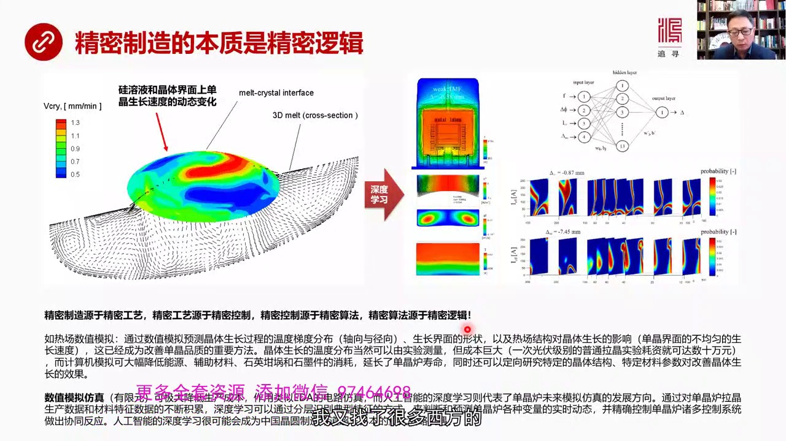

包括德国的 美国的很多这种科学文件我发现人家对于这个问题的理解因为读文字的论文你始终能一想让这个东西会复杂到什么程度结果读到别人的一种科学文件的时候你会发现它能够把它访真出来做事让你看这就是我在这个这...

<strong>All subtitles</strong>

> 包括德国的 美国的很多这种科学文件我发现人家对于这个问题的理解因为读文字的论文你始终能一想让这个东西会复杂到什么程度结果读到别人的一种科学文
> 件的时候你会发现它能够把它访真出来做事让你看这就是我在这个这页上展现的这是美国的家公司做软件访真的专门访真单净如里面的热长了动态的变化那么这
> 张图我们看到这个切面相当于这个炉子的内部的归容业它的动态流动的派是这个原型的是一个精体生长这个固体和归容业之间的切面我们可以看到这张图非常准
> 确的或者非常形象的展现了这个事复杂到什么程度那么在这个旋转来这些动态的生长面上红色代表着归的这个单净归在这个红色里终生长速度会叫快比如说每分
> 钟生长多少好米红的非常快比较快而蓝的越蓝的越慢整个生长面归单净归的这个原子所拉出来的要拉这个单净归在每处生长的速度是不一样的而且是不停在动态
> 的变化原因是底下这个业体归容业在不停的翻腾各种样的对流再发生变化我在这里看到这篇文章的时候看到这个论的时候包括他们做这个软件我就在想假如给我
> 们这样一套给你展示出来这个事这么复杂所谓原始创新就是你来设计一种精确的数学的算法或者一种微分方偏方程也好或者什么方式也好你来描述这个现象有没
> 有这个能力实际上恰恰在我看来这是原始创新的本质到我们看到这个复杂体系的时候我们如果想不出来我应该怎么来模拟它我应该怎么用数字来访真它试问如果
> 你做不到这点你拿什么去控制你用什么东西去告诉电机告诉电流控制电流这套控制体系电流应该大还是应该小应该提前应该之后提前机几位秒还是提前几毫秒你
> 怎么去控制这个事怎么去控制热茶怎么去控制其他的诸多的这个控制系统干过应该怎么转这个担心办法应该全转多少速度应该往上拉的这个每分钟应该上上几个
> 毫米你怎么会能够控制了这个事所以在我看来精密制造远于精密的工艺精密工艺远于精密的控制精密控制远于精密的算法精密的算法远于精密的逻辑也就是说首
> 先你必须要在逻辑层面上来描写它来描述它比如说偏远远方程能解决这个问题吗如果能你就用偏远方程来模拟它当然这玩意不是我们搞出来的欧洲人美国人发明
> 的有线园有线园也可以模拟这个非常动态了一个变化情况有线园也是一种方法还有人工智能也是一种描述这个状态获得数据或者未来能够依靠这种深度学习的方
> 式能够有效控制整个反映炉的热场还有它辞长变化了一套有效的工具注意无论是偏远方程的方法还是我们所说的有线园的方法还是人工智能的深度学习没有一项
> 是中国人发明的难我认为中国和西方最先进的国家差是差在精密的逻辑精密的算法就说我们没有能力去创造人工智能深度学习方法或者用发明创造有线园这个方
> 法来描述这么复杂的这个变化情况或者你更牛或者用偏远方程来解这个方程式来模拟它做得到吗做不到做不到这一点是我们跟西方最本质的差距我们的思维方式
> 我们的脑回路现在还没有能够真正建立起精密逻辑这样一套思想体系所以碰到这么复杂问题你无助下手假设我们能从西方买到设备从美国从日本买到这个设备但
> 是当需要革命手需要更先进东西试问你连想法都没有你都不知道换了一个场景出现更复杂情况你用什么数学工具你用什么人工智能工具你用什么样的算法工具来
> 实现如果你没有这种思路就不可能超越你就只能跟着它走它给你先进设备然后你用先设备来生产满足消费者需要这是我们的墙下但是原始创新中创新那种算法是
> 需要非常严密的逻辑的是需要精密逻辑的这是我们现在一大落下或者叫根本性的差距比如说这个热场的数据模拟通过数据模拟我可以预测经体生长过程中的温度
> 踢渡的分布不管你进行来走向我能够预测还有生长界面的形状还有热场结构对经体生长的影响就是担经页面它不均于生长这个速度你必须得通过热场通过自然很
> 多种方法必须要对它进行精确预测还有经体生长内部的这一套东西如果我没有数据的办法来进行模拟的话我就得用实验来测量每个点在什么位置上在什么位置在
> 什么时间在这个炉子空间中间的每个点它的温度是什么样的你可以去做实验测量存实验的办法也可以但是这个成本非常惊人比如说光浮级别的普通拉筋这个实验
> 你要想做出这个图来一次头料就是数十万元你不要说半导体了更贵了用实验的办法就是我要用料去堆然后测每个点的温度测每个点的这个磁场的强度等等等等的
> 那是一个非常成本高到牛法接受的程度也就是说如果你没有办法解决模拟的问题没有办法进行数据的这个没有办法通过算法和数据模拟来预测这个反应轮发生了
> 这个情况的话就没有办法去精密地控制所以计算机模拟可以大幅降低能源辅助材料是应该过和时末这样的这种耗损延长担心路的壽命同时还可以定向研究特定的
> 金格结构特定了材料参数对改善经体生涨的一些效果所以模拟是关键数字模拟和访真是一切的关键我得知道在不头料不用生产情况之下我就能预测它里头是个什
> 么状态所以我用这个办法可以很好的指导实践比如说数字模拟的有线原办法它现在就是普遍应用了这种办法可以极大的降低生产成本所以这种模拟的这种算法它
> 的功能和作用类似于我们上唐哥讲的1DA1DA的电动访真其实在我看来未来发展方向肯定是走向人工智能我们以前专门讲过深度学习认知算法中间讲过深度
> 学习深度学习就是我可以根据你热场中间的一些检测出来的现象然后我通过若干层的识别抓住它的点形特征我可以能够精确的识别出来这个热场变化的一些特征
> 抓出来也就是说用这个人工智能深度学习办法在我看来从本质上优于有限源从本质上也优于偏威特方程那种传统的自动控制那套东西人工智能能够更有效解决这
> 个问题所以如果说经过不断的数据积累不断的材料的特征数据也需要积累深度学习可以通过分层识别特征点形特征的方式来判断和预测担经路内部各种变量的实
> 施状态并且同时能够精确控制诸多的控制系统做出鞋东性的反应而产生你所需要的效果所以在我看来人工智能这个东西对中国来说非常同样这可能是中国班到超
> 车的一个截净因为日本人掌握了担经路技术在很大程度上还有经验的上升在里面虽然学习了美国和欧洲先进的算法但是在实践中还有大量的经验它有些决门的独
> 门烂器就是经验那么用人工智能的深度学习其实在某种意义上是把美国的算法就是美国或者叫日晚人那种精确的算法和精确的逻辑再加上日本人的经验2和1就
> 是我既能够学这个融合西方的高精尖这种算法同时又可以把日本的经验工程上供应上的经验结合在一起这是需要深度学习网络来完成的所以在我看起来深度学习
> 人工智能这种东西是未来数值模拟是未来访真是未来控制整个担经路体系担经路内部生长的最关键的因素就是最关键的一种办法这很可能是我们最后能够超越他
> 们的出发点但是问题在于即便是我们用了深度学习超越了他们但最终下一波问题是人工智能深度学习理论我们能创造出来吗我们能创造出来比他更高明的东西吗这是真正的挑战我们再看下一眼有了对这些基本的认识之后

---

### Slide 2

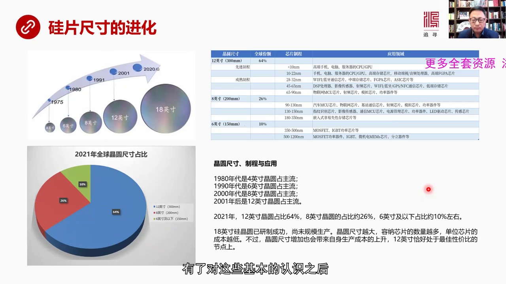

担经路是怎么回事然后它会各种设备是怎么回事然后我们再来看规篇整个产业它是怎么进化首先是尺寸的进化从尺寸进化角度来看我们知道70年代4英寸比较小的这种规片是战主的80年代6英寸90年代以后8英寸2001...

<strong>All subtitles</strong>

> 担经路是怎么回事然后它会各种设备是怎么回事然后我们再来看规篇整个产业它是怎么进化首先是尺寸的进化从尺寸进化角度来看我们知道70年代4英寸比较
> 小的这种规片是战主的80年代6英寸90年代以后8英寸2001年以后12英寸那么现在18英寸也出来了但还没有真正投入实践没有投入真正的生产在一
> 系列的这个规片中间我们会发现最大比例的是12英寸这应该是主流664%然后8英寸的战26%然后6英寸以下的战10%也就是说8英寸的12英寸一共
> 战了市场的90%也就是8英寸12英寸这两者被称之为是大规片大规片战了整个市场分了90%而大规片正是我们的弱项那么如果我们来看这些经缘的尺寸或
> 者叫规片的尺寸不同的尺寸对应于不同的制程不同的制程对应于不同的比如说芯片的制程对应不同的芯片的比如说是12到10到22纳米或者小10纳米我需
> 要什么样的这种规片它是有对应关系的那么一个生产规片的公司作为供应商它首先要跟代工厂打交道代工厂是接受新片设计公司的委托来代工生产的而代工厂需
> 要这个规片的供应三者之间是这种关系那么代工厂这帮人它需要12寸比如说它需要12营寸的规片但是这12营寸如果是用在某一个制程的一中比如说28到
> 32它所对应的最终产品也就是说芯片设计公司我要设计一个纯主经验所以由于我设计这个纯主经验那么我要求是28到32纳米这样的一个制程然后我把这样
> 的一个制程反馈给代工厂代工厂在告诉经这个规片生产厂你按着12营寸但是按着这个制程这个标准来给我生产某一个规格的规片注意这是双重编辆第一是不同
> 的代工厂会有不同的需求它会对于这个规片的规格会有不同的要求然后不同的最终的这些应用也对规片它的规格有不同的要求这个我们才能真正理解为什么生产
> 规片它难度是很大的因为它要面临一个不同规格的不同产品不同规格的要求还有不同代工厂的不同规格的要求这就使得这个问题变得比较复杂了越是大尺寸的规
> 片越有这个问题那么现在我们刚刚说到18营寸这种规片也已经产出了已经研制成功了但是为什么没有规模生产呢它的好处是我们看到规片的面积越大里面可以
> 刻出的这种单个的机身电路数量就会越多那么当然单位的机身电路成本就会下降每个小块就是你面积越大中间可以分成小块越多每个小块对于一个芯片那么规片
> 面积越大当然产出了芯片的数量越大平均每个芯片的成本越低但是越大的规片它自身的生产成本也会很高比如说拉丹金那个丹金炉那就得从今设计你越大的直径
> 好家伙里面热场资产变化的情况就越复杂那我需要投入更多的时间精力金钱去研究这个东西怎么搞出来这会极大的增加它的生产成本所以这两者在12营寸形成
> 了一个最佳的性价比的平衡点这就是为什么18营寸搞出来了但太贵因为以生产这样的丹金炉拉出这样的丹金归好家伙你的成本太高以至于你在芯片中能产出大
> 量芯片的总产量所赚来的钱不足以贴补你投入的钱那何必要做这个事呢这就是18营寸到目前为止还没有大规模应用但未来会未来法不是丹金炉的技术一定会有
> 更大的进步如果我们采用人工智能深度学习内容的方法来进行更加精密的对于丹金炉里面各种参数进行更加精密的控制的话那么它的产能还有它的生产成本都会
> 发生变化有一天它的性价比就会出现突变18营寸就会大型起到所以现在我觉得18营寸它真正生产成本的卡式卡的丹金炉它的成本特别是对它进行数据模拟的
> 办法还没有找到还不够好导致浪费太大导致它的成品率是有问题的这是未来发展的一个重要方向我们再看下液除了尺寸之外晶片的这个规片的结构也再发生进化

---

### Slide 3

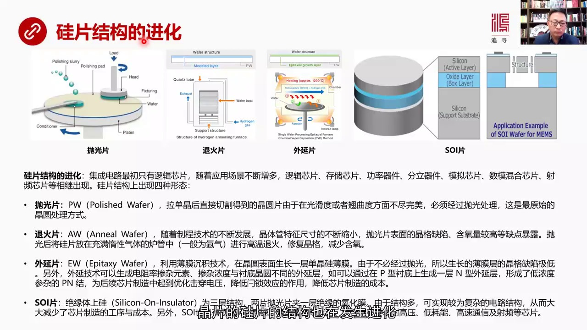

因为这个规片一开始只有逻辑芯片这个五六十年代它非常简单那个时候芯片非常简单只有逻辑的但是随着应用场景不断增多出现了逻辑芯片存种芯片公寓器件包括分立器件模拟芯片树模这个混合芯片等等包括设品芯片那么为了应...

<strong>All subtitles</strong>

> 因为这个规片一开始只有逻辑芯片这个五六十年代它非常简单那个时候芯片非常简单只有逻辑的但是随着应用场景不断增多出现了逻辑芯片存种芯片公寓器件包
> 括分立器件模拟芯片树模这个混合芯片等等包括设品芯片那么为了应对这么多应用场景具有会要求规片结构发生变化这就是出现了四种形态第一种炮光片炮光片
> 就是我们所说的拉筋之后切割得的这种规片它的光芳度是不够的敲几度方面是不够完美的所以要进行炮光处理这就是最原始的炮光片处理方式炮光片就是我们刚
> 才讲到了这个炮光电和炮光业这是炮光业不在网上低炮光电是黄色这一块然后这个规片被固定在这然后这个轴有一种压力从上到下一种压力压着它固定在炮光电
> 视然后选转然后不断加业体这业体里面有纳米籍的固体在业体中间然后在这种炮光电两者这种之下对表面进行严谋进行炮光能够达到纳米籍的这样一种炮光度能
> 够修复金格在很大种上形成了炮光片这是最初级的炮光这个空序所以炮光片是作为规片的一种这个最基础的东西最早最早最原始的一种处理方式除了这种炮光片
> 之外还有退火片退火片为什么搞退火片就是这个半岛体不断发展所以先进制程要求经历馆的尺寸越来越小那么炮光片表面当时是存在一些炮光都会有一些金格缺
> 陷包括含氧量比较高这些缺点越来越明显所以炮光后要把这些规片放在墮性气体的这种比如说反应楼里面一般是亚气进行攻退火刚刚退火的主要目的是修复金格
> 然后减少含氧量这就产生了退火片但在岛后又发展出了外延片外延片就是利用伯伯产的技术规片的表面生长出一层单金这种单金规的薄膜然后由于不用进行炮光
> 它是炮光片之后做外延片所以长出那个单金的薄膜它基本上没有金格的缺陷它是长出来了另外外延技术还可以增加一些而物是变独立变的发生变化然后它的濃度
> 和称理的经缘不一样产生一个外延层这个外延层会使半到底形成偏结那么这种偏结在未来加工和制造芯片制造过程中它会起到一种比如说优化机串电压然后等等
> 它是为了极量低芯片制造的成本也就是进行了就是外延片已经开始进入了芯片制造的一种初计程序就是很多工序我东西我可以放在前端来进行这是退伙片我们可
> 以看到退伙片的原理还有外延片的原理另外现在也比较流行是SOI片绝园体上归这就是一个SOI片的一个基本结构它实际上是个三层结构就像汉马包一样三
> 层结构就是两边都是泡光片中间夹一个绝层绝园的氧化膜它的结构就比较复杂结构多那么它就可以实现更复杂的电路的这种架构如果说我把它用成面向不同的应
> 用会把一些初级的芯片制造的东西移到SOI片上来做就可以大大减少未来芯片制造的工序和成本那么SOI片同时还有低耗能高速高可可性等等优势特别适合
> 在耐高压低耗能高速通信和涉平晶片中进行应用所以我们看到归片的结构也在发生进化然后我们再看归片的材料归片的材料

---

### Slide 4

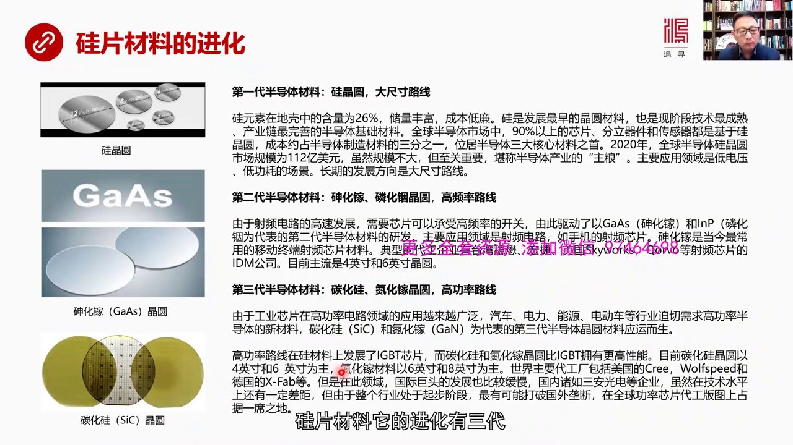

它的进化有三代第一代归金园走的是大尺寸路线为什么归金园现在仍然是主体呢主要原因归金园在地壳中的含量很高占126所以处量非常丰富价格也很低连那么到目前为止仍然是最成熟产源链最完善的半导体的基础材料在全世...

<strong>All subtitles</strong>

> 它的进化有三代第一代归金园走的是大尺寸路线为什么归金园现在仍然是主体呢主要原因归金园在地壳中的含量很高占126所以处量非常丰富价格也很低连那
> 么到目前为止仍然是最成熟产源链最完善的半导体的基础材料在全世界的半导体市场中间90%以上的芯片专利期间传感器都是用的归金园它的成本占到整个半
> 导体原材料这个总盘子的三分之一也就是半导体原材料的最大的这个战比最大的一方那么2020年全球半导体归金园市场规模一共是112亿美元听起来不算
> 大但是归金园非常的重要可以说是整个半导体的产业的主量没有归金园的供应那就啥也搞不了了它主要的应用方向归金园现在还是低电压低功耗的场景长期发展
> 了方向仍然是大尺寸路线就像我刚才所说18寸早晚会派上用场只要解决单金路它的数字模拟的技术和访争的包括对它这个热场思想进行精确控制这种控制系统
> 一旦解决的话那肯定大尺寸会占有更大的优势第二代半导体生化家零化音这些金园走的是高频率路线高频路线为什么呢因为社平电路现在越来越多高速发展需要
> 新片它必须要承受这种频繁的开关高频率的这种开关所以这就开始驱动一种新的材料比如说生化家零化音为代表的第二代半导体材料开始出现了主要与应用领域
> 就社平电路比如说我们知道每个手机上都有社平晶片社平晶片主要的使用的这种材料就是生化家当然有一些全世界的主要工厂都在生产第二代半导体材料像台湾
> 的稳贸红结美国的Sky Works等等它的主流的方向还是四营寸和六营寸还是偏小第三代半导体材料就是以探化归和淡化家这种经缘为代表驱动它的主要
> 力量是高功率因为在工业芯片应用中大量的场景是高电压高功率的比如说汽车、电力、能源包括电动汽车等等非常需要半导体这种新材料能够承受这种高功率的
> 这种生物这个工作场景的要求淡化归淡化归就是点形的代表第三代半导体的代表高功率的这个芯片就是归材料的芯片主要是IGBTIGBT就是归材料以归经
> 缘为代表的发展方向而淡化归和淡化家在功率控制方面BIGBT的这种归材料有更高的性能就是归经缘做出来了半导体这个功率弓力气劲其实赶不上淡化家和
> 淡化归和淡化家这是两种第三代材料它的优异性所以这两个东西现在发展也很快第三代半导体淡化家还有这个淡化归现在全世界虽然有一些工厂在生产但是这些
> 工厂因为第三代半导体还是个新生事物这些国外的工厂他们的发展也比较缓慢所以国内的一些企业比如说三安光电等等这些搞第三代半导体的公司虽然在整体技
> 术水平上还有一定差距但是由于整个行业但是由于整个行业刚刚起步我觉得在新赛道上最有可能打破国外龙段在高功率这个功率气劲上功率这个芯片带工工上有
> 可能能够占据一席之地我们再看看下野那么如果我们从整个规片产业的发展历史

---

### Slide 5

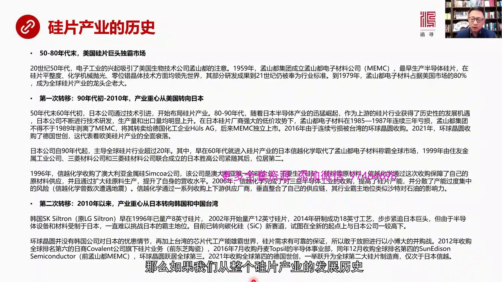

刚才我们所说的规片在尺寸结构和材料在不断的进化这种进化就会使得规片产业不断发生进化那么它的进化史我觉得可以分成两个阶段也就叫两次转移吧首先是它的第一阶段就是五千代到八十年代末美国的规片巨头独吧世界市场...

<strong>All subtitles</strong>

> 刚才我们所说的规片在尺寸结构和材料在不断的进化这种进化就会使得规片产业不断发生进化那么它的进化史我觉得可以分成两个阶段也就叫两次转移吧首先是
> 它的第一阶段就是五千代到八十年代末美国的规片巨头独吧世界市场因为在二十年代二十几五十年代电子工业兴起了当时最早进入规片领域是美国的孟山都我们
> 知道它现在是生物质药公司当时孟山都也是最早的规片的龙头老大1959年孟山都成立了孟山都电子财料公司孟山都电子财料是最早生产半道体规片的然后提
> 出了一系列技术标准比如说规片的平整度化学机械模光CMP技术包括零位错经济技术等等等等都是孟山都最早创建的然后一直到今天其中很多技术标准仍然是
> 全世界的好准79年上孟山都电子财料占据美国市场的80%是全世界规片产业的龙头老大第一次转移产业转移发生在九年的初到2010年主要转移是从美国
> 转向的日本日本是怎么崛起的就是美国开始搞半道体售日本也开始紧追从五年代末6年代初日本就开始已经进美国技术开始进行规片的生产布局到80年代日本
> 半道体特别是它的内存芯片等等非常迅猫然后这种芯片半道体就是纯粹半道体需要大量的规片所以对于上流的日本公司起到很好的刺激作用就是上流的规片行业
> 获得了很好的发展级地然后日本在发现的末它的出口量生产量就是规片生产量出现逐渐上升然后日本厂商对美国厂商形成了很大的低价的所谓哥侯站的这样的一
> 种态势孟山都争不过日本的规片厂在85年到87年连续三年线入亏损结果没办法孟山都集团把它剥离了就这个89年剥离了孟山都电子材料然后把它转卖给德
> 国的化工企业后来孟山都电子材料又独立上市最后到2016年由于连续被亏损被台湾的环球经典所收购同时我们最近看到2021年环球经典还收购了德国释
> 创这都是这些发展的这个态势表明转移欧美的规片生产已经全面转向了亚洲欧美规片生产产业基本上都塌方了全面摔落了那么日本公司从9年代起开始主导全球
> 规今远产业超过20年他的老大就是日本信跃化学在60年代就已经进入了这个产业在90年代取代孟山都电子材料撑霸全世界另外一家就是99年由住有金属
> 工业公司还有30材料还有30归材料联合成立的日本升高这两家公司日本信跃和日本升高分别占据了第一和第二个位置当然信跃他的成长一个主要成功的一个
> 案例是通过大量收购比如说96年收购了澳大利亚金属归SIMCO公司这是澳大利亚唯一的生产归的企业主要生产比如说归矿归粉这些原材料信跃化学通过这
> 次收购供顾了自己的原材料供应而且扩大归的原材料生产使得自己不收水平进一步提高另外还有一个就是06年这个信跃化学完成了对三亿半导体的收购提高了
> 归片的产能而且分散了它的产能过度集中的风险比如说信跃化学它的很多工厂遭到过过好几次地震的袭击那么导致信跃化学的产量机它将影响到全世界很多产业
> 的发展它现在分散它的产能也取得相当成效通过这些供顾了上下游进行了垂直整合霸主地位现在信跃化学的霸主地位可以说就像沙特对石油的影响力一样在全界
> 归片这个产业中绝对了龙头老大那么这个产业第二次转移是2010年以来产业重新从日本转向了韩国和中国的台湾比如说韩国的SK这个修创它这个它是韩国
> 唯一的家生产规片的企业而且发展也很早96年时候就已经可以量产八英寸的规片2002年开始量产12英寸的规片跟日本其实只差一年2014年沿着成功
> 了18英寸的工艺18英寸规片的工艺所以它其实走都很靠前步步紧追日本的巨头但是韩国发现半导体的设备和材料是设置于日本的比如说我刚刚所说的那些设
> 备从单经路然后一直到导角研磨机包括CMP等等等等日本占据了绝对的优势包括原材料电子机的这种也经规电子机的这种单经规还有泡光液泡光量等等等等这
> 些原材料也受制于日本所以如果日本要压制韩国的话可以在原材料高端设备上断共一旦对韩国进行贸易制裁韩国的这种规片生产就很难突破日本的限制所以韩国
> 现在是明白这一点的我觉得这一点对于未来中国也很有起发因为如果中国的规片生产达到一定程度挑战了日本的霸主地位日本不会动用对韩国的手段来对付中国
> 比如说对很多东西进行限制不出口 断共等等而中国如果不能实现那些关键设备的替代你就没有办法去超越它甚至没有办法生产韩国的思路是转向探化归就是我
> 搞功率半导体绕开日本的最擅长的这种归经缘我搞的是探化归的经缘心塞导所以这是韩国的一种思路那么台湾的环境经缘跟韩国的思路不太一样因为台湾跟日本
> 的关系比较的密切所以它没有日本它没有韩国公司对日本那种优患没有那种优患意识还有一个原因是台湾的芯片代工产能是全球老大那么如果台积电这种芯片代
> 工的企业要代工的话就一定需要归一片的供应所以韩国经缘在台湾能够很好地跟台积电进行配套它的需求、
> 它的市场有很可靠的保证这是它敢于放胆的一小伯大展开一系的病毒战的根本原因韩国经缘曾经在2012年时候收购了全球当时排名第六的日本的Copla
> nd公司它底下的晶片归晶片的业务以前是属于东之逃辞的2016年7月收购了单卖的Topseller的半导体事业部同年12月收购了全球当时排名第
> 四的桑埃德森也就是前孟山东电子才在公司被韩国经缘收购了这个时候韩国经缘在2016年就越举了全球第三今年2021年又收购了全球第四的德国市场现
> 在如果完成到今年年底完成收购2021年年底完成收购的话会一举越身为全球第2大归骗的制造商僅次于日本信跃所以我们可以看到全球归骗的产能正在逐渐
> 朝韩国和中国台湾地区还有大陆地区正在向新的方向进行擴散我们再看下一现在全球归骗的四剧头我刚才已经说了这四家了日本信跃

---

### Slide 6

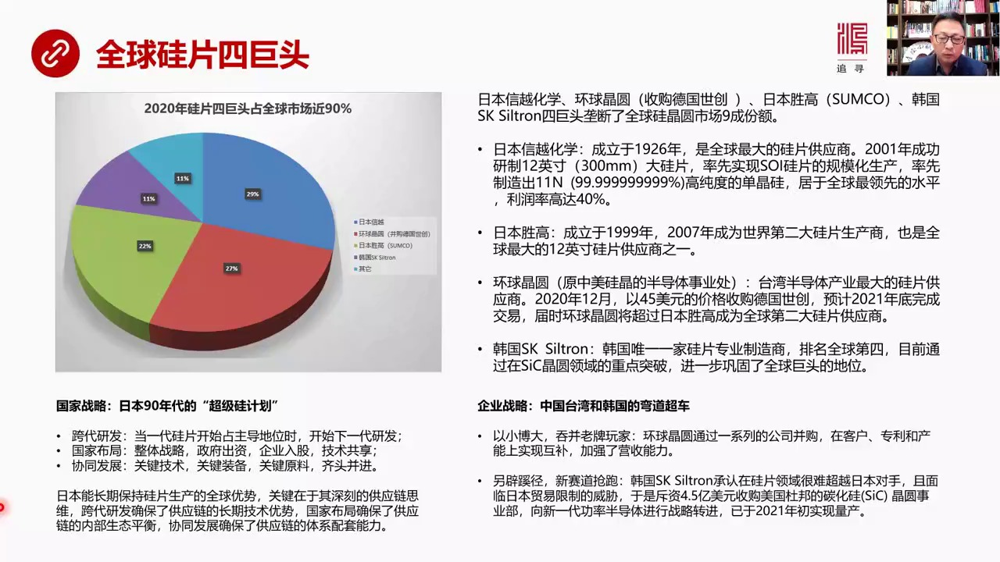

还有环球经缘还有日本盛高包括德国SK这四家剧头壟断了全球90%的份额那么日本信跃不用说了它是龙头老大成立非常早26年成立的是全世界最大的规遍供应商2001年首先成功研制出了12英寸的大规骗量产还有在世...

<strong>All subtitles</strong>

> 还有环球经缘还有日本盛高包括德国SK这四家剧头壟断了全球90%的份额那么日本信跃不用说了它是龙头老大成立非常早26年成立的是全世界最大的规遍
> 供应商2001年首先成功研制出了12英寸的大规骗量产还有在世界上首先实现了SOI规遍的规模生产然后在世界上首先制造出了11个高纯度单进归各个
> 领域它都基本上出于世界最领先的水平它的规遍利用率非常高高达40%圣高排名老二是第二大规遍供应商环球经缘通过一系列收购之后现在有可能会超越日本
> 圣高成为第二大供应商大学战友感觉27日本信跃战友29圣高大概战22韩国SK所以说它基本上是现在转向重点要突破探化规走半导体功率半导体那条路线
> 而放弃了在归经缘在归片上直接挑战日本的这样的一种选择因为这样太难而且受到日本的贸易制裁的可能性非常大我觉得可以借件的是日本的一种国家战略它也
> 是跟中国一样有一套国家战略这就是日本90年代搞的超级规计划日本能够超越美国在很大程度上是它的政府进行了非常有效的组织超级规计划就是其中之一了
> 比如说超级规计划它们当时三个核心点第一是跨代研发当八英寸的时候八英寸规片刚刚在90年代初开始战剧主导地位的时候马上就开始研究这个更大的12英
> 寸的这种晶片的研发也就是说它们是这个跨代晶片研发当这一代刚刚起来然后马上研究下一代还有国家布局国家布局就是一种整体战略政府出资设立一个核武公
> 司然后关键企业来入股搞出了所有东西大家技术共享还有协中发展协中发展就是日本当时考虑到关键技术关键设备关键原料三者必须启动病禁不能说像现在我们
> 如果搞大规片突然发现导角机要从日本进单金融要从德国进或者其他的CMP要从美国进那就不叫协中发展协中发展就是在进行下一代布局的时候我得考虑哪家
> 公司去做单金融哪家公司你给我专门去做电子籍的单金贵这个多金贵哪家公司去做什么什么各种原材料各种设备要启动病禁一起发展这个叫协中发展我觉得这个
> 对于中国来说启发非常也是非常深刻的我们在布局半导体大规票的时候有没有系统性像日本当时考虑到必须得协中发展原材料 设备还要生产制造这三者要启动
> 病禁谁应该担当主宫谁应该担当每个领域的主宫大家应该怎么配合谁唱 A 脚谁唱 B 脚等等都需要有精确的协调那么日本长期保持了这个规篇生产的这种
> 优势我觉得是他们深刻理解了供应链的思维跨代研发是为了保证供应链长期的技术优势国家布局确保了供应链内部的生产平衡协中发展 确保了供应链成体系的
> 配套能力这是中国特别应该学习的当然企业战略就是如何实验弯道超车台湾是一小伯大吞并老泡弯家赶上我们说过了韩国是另一批习近抢战新赛道我觉得中国在
> 未来发展规票的时候这两种道路都可以参照特别是另一批习近 抢新赛道更值得去考虑一小伯大 吞并老泡弯家我觉得现在对中国来说恐怕国际条件不太理想我
> 们再看下一个现在对中国来说其实面临了第三次规片产业转型的历史性机遇

---

### Slide 7

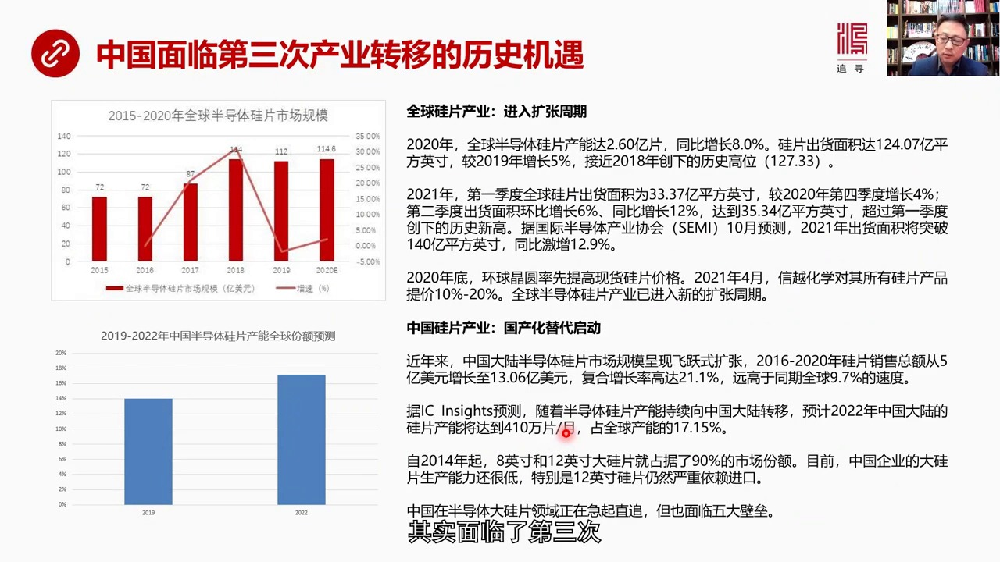

如果我们看全球规片产业这是过去15年的2020年规片产业发展的基本态势市场规模变化的情况那么现在就是从去年以来我觉得全球规片产业进入了一种扩张的新的周期比如说2020年全球规片产能时2.61片同比增加...

<strong>All subtitles</strong>

> 如果我们看全球规片产业这是过去15年的2020年规片产业发展的基本态势市场规模变化的情况那么现在就是从去年以来我觉得全球规片产业进入了一种扩
> 张的新的周期比如说2020年全球规片产能时2.61片同比增加18%这个比例非常高规片出发面积它是以平方因此来计算平方的这个因存来计算了是12
> 4那么创下了增长是5%的增长率超过了2018年的历史最高是127.33那么第一季度2021年第一季度和第二季度我们看到它的出发面积同比增长还
> 比增长2.4%还有6%同比增长2%达到35.34亿平方因存超过第一季度的历史最高水平如果按照国际半导体协会的预测2021年出发面积将突破14
> 1平方因存同比集算了12.9%那么2020年底我们已经看到《花球经园》已经率先宣布提高规片价格2021年4月新月化学宣布对所有的规片产品提下
> 10%到20%这说明再加上我们看到全球供应链性的混乱说明全球半导体产业规片产业已经进入了新的库上周期可能未来会持续好几年那么从中国的规片产业
> 来看中国现在已经启动了替代的这个规片国产化替代这样的一个进程最近几年以来中国大陆的半导体的规片市场规模可以说是发展的非常迅猛从16年到20年
> 规片销售了总额从5亿美元增长到13.06亿美元年军符合增长率达到21.1%远高于同期国际19.7%的诉讼如果根据IC因塞他们的预测随着半导体
> 规片现在正在向中国大陆进行转移预计到2022年中国大陆规片产能将会达到410万片每个月产能17.5%2019年我们猜占14%所以这个占比是迅
> 速在提升的从2014年开始现在大规片就是8英寸12英寸的占据了市场分额的90%目前中国企业的大规片生产能力还比较弱特别是12英寸的规片仍然严
> 重依赖进口虽然中国在大规片领域正在极其直追但是我们现在面临还面临很多问题特别是面临5大毕雷我们看下议这5大毕雷

---

### Slide 8

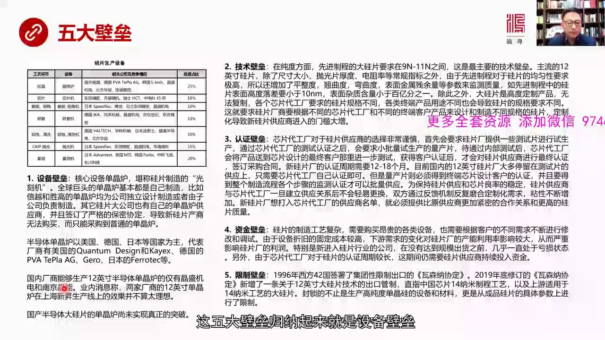

归纳起来就是设备毕雷技术毕雷认证毕雷资金毕雷和限制毕雷设备毕雷我们一开始所说的单金炉这种光刻积极别的设备现在全球的巨头像信岳像圣高摊们的单金炉都是公司自己设计的不从外面买或者只从外面买一些卤体、卤枪之...

<strong>All subtitles</strong>

> 归纳起来就是设备毕雷技术毕雷认证毕雷资金毕雷和限制毕雷设备毕雷我们一开始所说的单金炉这种光刻积极别的设备现在全球的巨头像信岳像圣高摊们的单金
> 炉都是公司自己设计的不从外面买或者只从外面买一些卤体、卤枪之类的硬件控制系统一定是自己搞其他的这种大公司他们也都有自己的专门的单金炉的共货商
> 而且签订了非常严格的保密协定中国新上一个新规片的厂商你没处去买这种高金尖的单金炉只能采购到普通的单金炉普通单金炉共银商也主要以美国、
> 日本和欧洲为主有代表了由美国这个宽灯、比赛和这些公司还有德国的一些公司包括日本的公司他们只能提供普通的还可以的单金炉而最牛的单金炉像日本、
> 信岳和圣高的这种单金炉全是自己搞而单金炉的控制系统就是我刚才所说的那种精确的模拟精确的访真这是它中间的关键关键的关键是核心的核心是没有技术积
> 累没有说干净积技术积累是很难通过的这就是我们中国现在国产厂商现在想做这个事面临很大的评计现在国内厂商能够生产12营寸半导体单金炉的只有两家公
> 司精胜积电和南京精能但是我看了很多新闻业内消息说这两家公司的12营寸单金炉在上海大规片企业比如说上海新生虽然采格了这两家的单金炉但用起来效果
> 还并不算太理想在我看一点都不奇怪因为你要攻破12营寸单金炉那么复杂的控制系统因为我没有看到这两家具体的技术上的一些比如说论文或者对他们的单金
> 炉那些重要的一些论数我不知道它怎么控制了如果我知道这帮人或者这些设计人员和这些他们的技术古怪能够流露出一星半语的这些技术细节的话我们大概才能
> 够看得清它的技术水平跟日本和美国大概有多大差距国产半导体我觉得从现在来看单金炉还没有真正时间突破虽然我们在媒体中经常看到今天重大突破明天谁谁
> 又搞出单金炉怎么怎么样如果说真的懂细节真的懂技术层面的细节的话你一分析一看就知道它大概是一个什么水平到目前为止我觉得我们在单金炉领域中我觉得
> 差距还是很明显的不是那么容易就能够真正产成突破还有第二个必类是技术必类技术必类的纯度19到91根这是非常难力一点还有12英寸的规片因为制程要
> 求对这种芯片对于规片的除了传统的直征大小泡光后度还有电组率这种常规要求之外还有军性提出更大的要求比如说平整度敲取度关取度表面金属参与量等等一
> 系列参数来监测它的质量比如说先进制程中规片的12英寸规片的表面的落差不能大于10纳米10纳米是很小很压的一个数字相当于一个足处场一个足处场的
> 面积中它的起伏不超过这个4分之一英寸非常非常小还有表面杂质含量要小于百亿分之一除此之外这个大规片12英寸8英寸还是高度定制产品就像我刚才所说
> 由于它定制产品所以它很多规格没有办法复制各个代工厂要求不一样各个中南产品要求也不一样所以你新搞一家规片厂你得根据不同代工厂要求还有根据不同代
> 工厂所生产不同产品的要求去设计不同规格的规片这当然这种定制化导致的新规片购义商进入了门槛大幅提升因为它不是一个纯标准化的一个产品它是高度定制
> 化第三是认证必赖认证必赖就是新片代工厂他们在选择自己的规片购义商说非常隐瞻一旦选定之后不会轻易这变为什么呢因为它是经过长期的模合的比如说你一
> 家规片购义商要想加入它的购义面新片代工厂会首先说你给我一些测试片我来试一下然后经过内部认证就是新片代工厂的测试认证之后然后说行你再给我小批量
> 生产一些量产片然后再经过内部测试代工厂觉得还行然后会把这些测试的这种芯片发给它的测试结果发给芯片的设计设计的客户我们知道设计客户是真正的最终
> 客户他们根据测试的结果然后再验证客户认证之后然后代工厂然后代工厂新片代工厂才会对规骗规刑商进行最终的认证然后才开始签订小批量的采购合同整个这
> 个审批过程大概要12到18个月那么现在我们看到国内的很多新报道说我们上了很多12英寸规骗这些大的产能其实绝大部分是停留在测试片这个阶段

---

### Slide 9

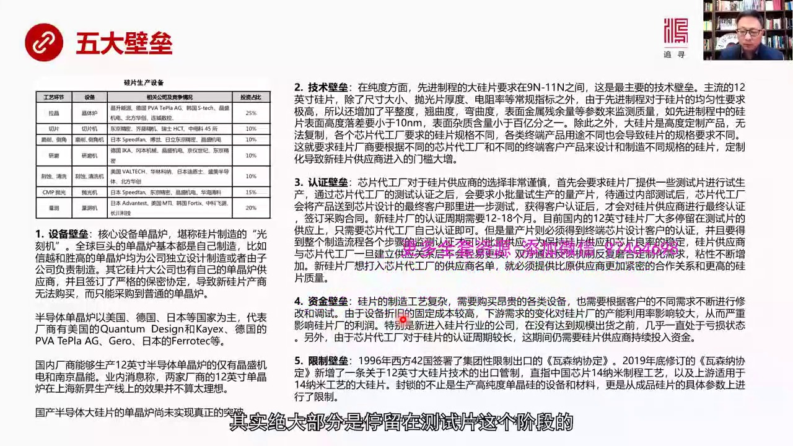

还没有进行大规模的量产而测试片的生产它比较简单因为只需要新片代工厂比如说中芯国际它一家内部认可就可以了但是要想大批量生产必须要得到这种最终客户的认可最终客户怎么认可你它还要到整个你的生产的制造的全流程...

<strong>All subtitles</strong>

> 还没有进行大规模的量产而测试片的生产它比较简单因为只需要新片代工厂比如说中芯国际它一家内部认可就可以了但是要想大批量生产必须要得到这种最终客
> 户的认可最终客户怎么认可你它还要到整个你的生产的制造的全流程中间每个步骤还要重新的监测确认然后才能批量生产所以我们来看这个过程也就是一家新片
> 代工厂如果选定为规骗供应商之后双方经过长期模合已经稳定下来了就是新片就是规骗的供应稳定新片的良率也比较稳定那么我就不会轻易地换人因为换一家新
> 的供应商我不知道对方这种对定制要求它是不是能够满足啊然后它的规骗供应它的品质如何啊然后对我的新片最后的制造代工这个良率会不会有不良的影响所以
> 新的厂家要上打入现有的供应商名单那是非常之难你必须要提供你更好质量的规骗更高质量的规骗代工厂模合得更好所以这就是一个认证这个也是很复杂的一件
> 事还有呢 资金必赖规骗它的制造非常复杂而且大量进口设备都是非常昂贯的设备然后还要根据客户不同的要求不断修改和调试所以你新版的大批设备然后吃吃
> 不能投量产你的折救成本是非常高的还有下游这些变化代工厂 新面代工厂各种变化然后对于你的产能利用率它的影响也是比较大的所以这些因素都会影响规骗
> 生产厂 伤的它的利润如果你是个新入行的进入这个行业的你没有达到规模规模化出出货之前基本上是出在亏损状态如果认证期要长大一年半甚至更长这段时间
> 里面还要求你持续不断的投入资金所以你没有量产就是如果你没有通过认证你的亏损你即便通过认证还没有达到大规模量产出货所以这一个阶段的资金的现金再
> 加上设备折较的亏损会让很多亏损状态承受不了这个压力特别是新入行公司第五个就是现质必赖我们都知道1999一方42国签署了现质出口的瓦斯纳协定1
> 9年协定了瓦斯纳协定专门针对大规片有一条控制进行出口控制其实就是为了对付中国的主要是中国14纳米以下的芯片生产14纳米以下这种制成的上流的大
> 规片都受到电质现质什么现质生产这个制成它所设计到了大规片的单金规的设备单金罗比如说还有原材料比如说电子集的单金规多金规还有甚至包括比如说抛弓
> 链 抛弓链等等是不是在现质之内就要看美国和中国的技术冷战发展的状态还有最后从成品规的参数上也要进行限制所以它是从成品规规片的参数上到着推应该
> 限制你什么设备限制你什么原材料这个对中国的影响还是非常巨大正是因为这五大壁极大限制了中国大规片项目的实际投产能力我们看下一中国的感超之路也就是说中国虽然上了很多

---

### Slide 10

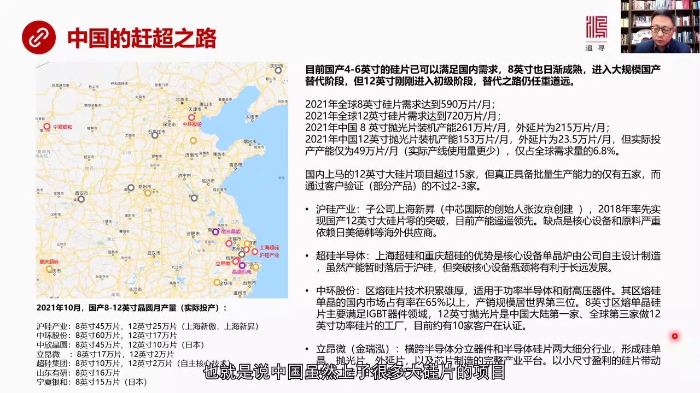

大规片的项目但是真正能够实现投产的现在还非常的少目前中国的小尺寸的4-6英寸的规片已经可以满足国内需要了基本上玩光服了那些人玩4-6英寸已经玩了很久了没问题但是8英寸现在还没有完全投过正在日区成熟我们...

<strong>All subtitles</strong>

> 大规片的项目但是真正能够实现投产的现在还非常的少目前中国的小尺寸的4-6英寸的规片已经可以满足国内需要了基本上玩光服了那些人玩4-6英寸已经
> 玩了很久了没问题但是8英寸现在还没有完全投过正在日区成熟我们可以认为8英寸也进入了可以国长大替代的阶段不过12英寸这个规片现在还在初级阶段要
> 想替代国外的产能还有相当远的路认重道源如果我们来看这个寸的厂家和它的内部的报导信息全部集中在一起做的详细的分析在这里用红用红色标注的这是大概
> 现在已经能够实际生产12英寸的工厂有哪些黄色代表能够生产8英寸的工厂在哪里有哪些然后根据各种各样的新闻报导和业内的这些人士的评价估算出他们真
> 实的产能投入生产线真实实现的产量到底有多少得出了数据就在下面截止到2021年10月国产8到12英寸的规片业产量实际投产和生产的业产量应该是这
> 样的一个数量户规产业这是龙头老大它的8英寸的业产量是45万片12英寸是25万片8英寸主要是靠上海新奥12英寸主要是靠上海新生户规产业相当一个
> 某种一上相当于一个投资的投资公司并够了上海新奥并够了上海新生实际上产能是在这两家公司里头上海新奥主要就用在8英寸上海新生主要搞12英寸上海新
> 生的现在目前的产量每月25万片据说到年底要扩大到30万片它这个数是比较实在的因为它的创始人是中心国际的这个张路金这个人可不得了所以张路金创造
> 了企业它的可信度它实际的管理这个企业的能力跟国际结果的这个能力都是无用质义的所以上海新生实际上是中国现在12英寸真正最强的生产厂家中华股份天
> 津的在全国也有一些其他的产也有一些其他的基地它的产能主要集中在这个8英寸它能够生产6万片每月12英寸17万片也不错中心金源其实是一家日本公司
> 它的技术肯定没有问题它的8英寸是45万片12英寸是10万片两位这是一个杭州的公司这家公司呢它现在8英寸是17万片量12英寸刚刚开始跑测试片就
> 是送给客户进行测试这还没有进入真正的量产另外就是超规集团上海超规和重印超规这是一家集团它的8英寸是10万片12英寸是2万片超规集团我觉得它前
> 一表达因为它的核心技术担心炉是自己搞的上海新生虽然产量大但它担心炉是从外国进口的你如果能够在核心技术担心炉上有所突破虽然产量很低但你改进了鱼
> 地大未来上产能的空间就会很大还有山东有研在德州它的主要金融在8英寸是16万片的产能银下银合这实际上也是日本的这个中心经验它是一张公司一家产业
> 集团它的主要集团在8英寸是5万片的产量所以如果我们来看全球现在8英寸的需求量还有22英寸的需求量包括中国现在的装击产能8英寸的12英寸装击产
> 能我们大概计算一下可以知道中国的装击产能12英寸能够达到153万片每个月万元片泡光片是这么多万元片是23.5万片但实际投产的产能只有49万片
> 而实际能够大批量生产通过客户验证的那就更少了所以我们现在虽然号成我们的产能很大但实际上真正投入生产运营大批量出货能赚钱的太少太少了我们要注意
> 当你不能批大生产兽这些企业都出在亏损状态投资量越大亏损击别越高现在国内上马的12英寸大批片的项目超过15家但真正具备大批量生产能力只有5家就
> 是我可能练的这5家而通过客户验证而且仅仅是部分产品不是全面验证也减少2到3家护卫产业这是没问题它算一家上海新生它的产能是120线缺点是合音设
> 备和原材料比如说泡光地尔泡光液还有我们所说的电子级的丹金规、多金规原材料都是源于其他国家的上游供应商超规、
> 大脑体、上海和重庆的超规他们的优势是核心设备丹金炉最重要是丹金炉是不是自己设计呢如果这个不能自己设计就永远被别人卡着拨的中华古分中华古分天津
> 这个他们的真正的优势是什么呢是它的驱荣刚才我说了丹金规生产有驱荣拉丹金有驱荣还有CZ驱荣规片他们的技术是相当熊厚的驱荣规片是用于半导体和耐高
> 压的旗舰那么中华古分它的驱荣规片能够在国内上占有率达到65%产胶规模去世界第三位它的八英寸驱荣丹金规片主要可以满足IGBT就是这种功率半导体
> 的应用12英寸的泡光片是中国第一家也是全球第三家做12英寸功率半导体的工厦目前正在十家客户那里进行语证所以中华古分驱荣也就是它的功率半导体这
> 个方向比较强梁威最早他很早就收过了精锐红这家公司的特点是他横跨半导体分立旗舰和半导体规片两大西分产业也就是他形成了一个完整产业他既可以生产规
> 单金泡光片万元片也可以生产具体的芯片就是芯片製造他的半导体很多功率他也自己生产所以他既生产规片又用他自己生产规片来做半导体旗舰来说芯片这是他
> 的独特的地方他现在虽然主要的生产是这个八英寸的还有八英寸一下的但他未来发展方向是要搞大尺寸的12英寸的他的方式是用小的小尺寸的这些规片所创造
> 的利润来一样大规片的发展进行研发和工业化所以这四家公司各有特色应该说都是未来中国半导体规片里一中可以说是跳出级别的产业跳出级别的这个公司还有
> 很多公司也在生产炮称自己生产这个大规片但是我觉得绝大部分公司并不靠谱上马炮称下上马的公司很多但是我观察了一些公司你比如说在长山角地区有一些公
> 司我就觉得不是那么靠谱虽然我不想直接说他们的名字因为我看了这些公司炮称投资111要见12英寸大经骗搞出来之后大规片搞出来之后要占中国要占全世
> 界产能的产量的10%口气不小但是你看一下这些公司的主要的研发人员的旅例你会发现非常不靠谱有很多人有一些人一看就不是像张书经这样的搞过很多大型
> 工厂的建设的很多只是一些国际公司的底下一些部门的经历或者叫项目经历这个纪别然后还有一些是学者一看是拉来冲速的所以这些公司能不能然后你一查它是
> 专利专利数是0我觉得这种公司在中国还受不少我觉得这可能就是来圈例的来圈前的但是我很怀疑你这样的研发的核心团队的能力能够搞出大规片来相当不现实
> 而且一个专利都没有这怎么搞所以我们在看新闻的时候在看中国又上了多少段大的项目的时候不能够被这个新闻所所目导因为上项目虽然上了多很多地方都想上
> 比如说我用这些深灰色标准的地方都要上大规片有人吗有技术吗资金够不够特别是这些核心的技术核心的装备怎么搞有没有这种经验到我们学这个了解整个规片
> 生产流程之后我们会对这些公司会有一种套势能力一搭眼就知道这些公司可能能成另外些公司可能成不了所以中国赶超之路在大规片里一种还有相当的道路要走
> 不是像现在媒体所爆炉所爆出来了那么乐观还需要相当地周期最后总结一下今天这场客的内容

---

### Slide 11

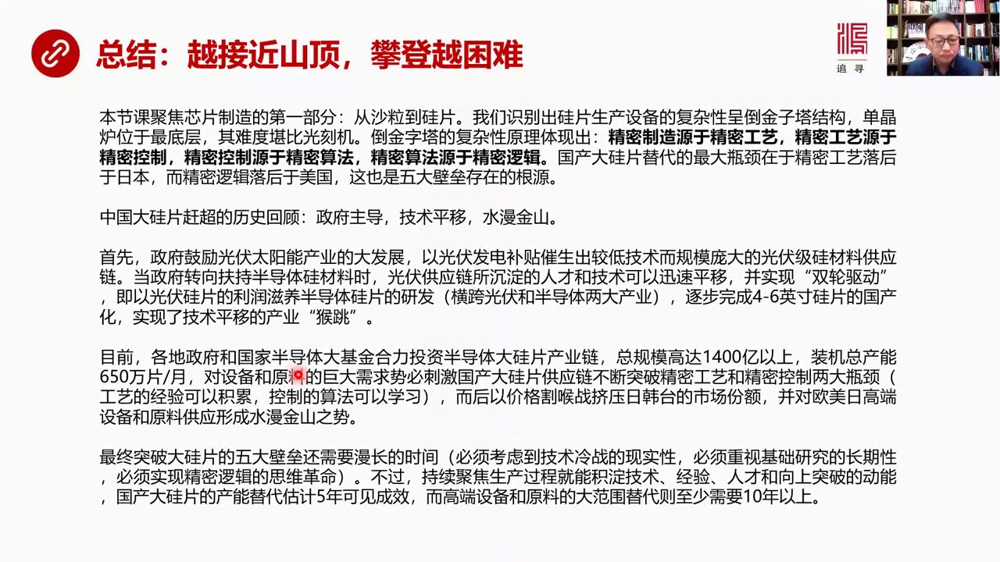

一句话的总结就是越接近山顶山顶顶就越亏了我们这场客聚焦是芯片制造的第一部分就是从沙利到规片那么首先我们试别出规片生产设备复达性也是一个道晋子塔结构单晶炉是在最底层它的难度看比光刻机道晋子塔的复达性体现...

<strong>All subtitles</strong>

> 一句话的总结就是越接近山顶山顶顶就越亏了我们这场客聚焦是芯片制造的第一部分就是从沙利到规片那么首先我们试别出规片生产设备复达性也是一个道晋子
> 塔结构单晶炉是在最底层它的难度看比光刻机道晋子塔的复达性体现出一种普遍原理这种普遍原理就是精密制造原精密工艺原于精密控制精密控制原于精密算法
> 精密算法原于精密的逻辑国产大规片替代的最大平静在于精密工艺方面我们落回于日本而精密逻辑方面我们落回于美国这也正是五大壁壘存在的根源那么中国大
> 规片赶超的过程如果做一个历史回顾的话我们会发现三个特点第一 政府主导第二 技术平音 第三水漫金山首先 在2005年前后中国政府在鼓励光福派案
> 当发电再加上当时欧洲对光福进行大量的财政补贴所以中国的光福产业得到了续演冻的话争催增出虽然技术降低但是规模相当庞大了光符及归材料供应链所以当
> 政府转向要符持半导体归材料的时候那些以前所十年以来所击电的光符供应链所击电的人材和技术可以发生迅速的评仪并且实现双轮驱动这些公司他们可以以光
> 符归骗的利润来资养半导体归骗的研发其实我们看很多公司的介绍他们都横跨光符和半导体两大产业一脚踩着光符转现金一脚踏入半导体转未来转移期这些公司
> 的存在所以他们帮助中国完成了4-6营存归骗的国产化实现了技术评仪产业的侯跳那么现在各地政府包括国家半导体大基金现在正在合理投资半导体的大归骗
> 产业链现在我统计叫总的投资规模高达1400亿以上装机总产能达到650万骗每月12营存那么对设备和原料的巨大需求势必会刺激国内大归骗不断的突破
> 两大平进这个精密工艺和精密控制这两个最难的地方因为在我看起来工艺的经验可以激累控制算法也可以学习没有什么卖不确识卡然后突破这两大平进之后然后
> 中国可能会以价格各候战就是把一个高端产品卖什么来再加来挤压日韩台的市场分额并且对欧美日高端的设备和原料供应形成水漫金山之事这是发展了一个必然
> 趋势当然中国最终要突破大规片了五大壁雷还需要很慢长时间就是必须要考虑到现在中美技术冷战的现实性必须要重视基础研究它的长期性必须要实现精密逻辑
> 的思维革命这三点必须要实现才能够真正突破五大壁雷但是就长远而言如果中国持续聚焦在生产过程这件事情上每天琢磨这个事它就一定能不断的击电技术、
> 经验和人才以及向上突破的动能所以我认为国产大规片的它的产能替代估计在五年左右可以见成效而高端设备和原料大范围替代做至少需要十年以上原因就是考
> 虑到技术冷战考虑到我们基础研究的博弱考虑到实现精密逻辑的思维革命或者说叫东方那么一复兴这还是一个相当漫长的突破到最后替代是我们原创性的思想原
> 创性的技术能够实现从设备到原料再到生产加工全链条的替代是当然需要至少十年以上这就是我们今天课程主要内容谢谢大家我们下堂课讲芯片制造的第二部分

---

### Slide 12

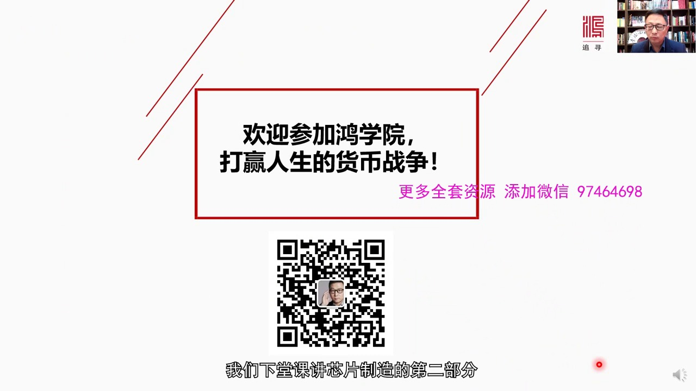

今天课程就到这里谢谢大家再见

<strong>All subtitles</strong>

> 今天课程就到这里谢谢大家再见

---
