# 核心课视频-83、84 - 黑格尔辩证法-本质论（上） — Slide Notes

> **来源**：鸿学院核心课程  
> **幻灯片**：16 张

---

### Slide 1

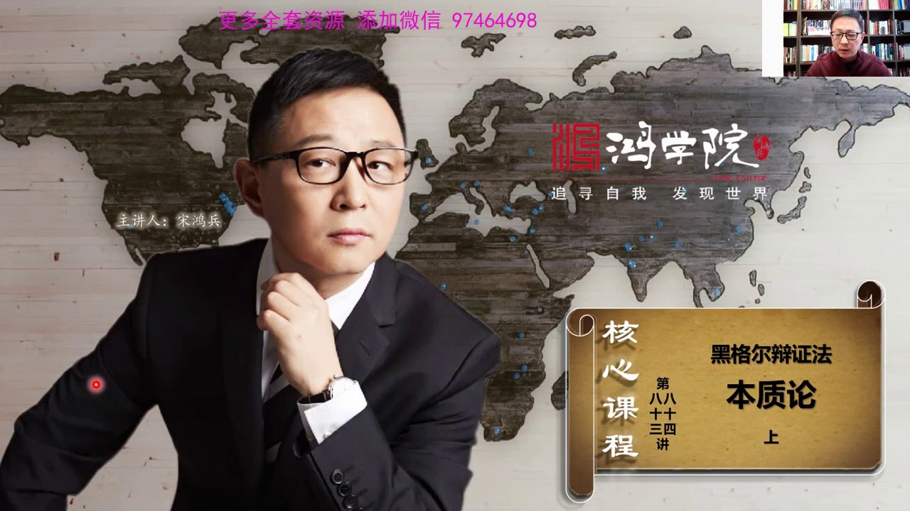

上半步因為本質論內容非常的龐雜而且是黑格爾變成法中最深奧、最難懂但只有最核心的部分所以我們把它分成上下兩個部分黑格爾本質論別看它總共的內容只有70多頁但是我去花了大概有小半年的時間在研讀過程之中經常每天從中午12點一直看到凌晨三、四點鐘為什麼要花這麼長時間來研究本質論因為本質論的確是非常的難懂、超級...

<strong>Cleaned narration</strong>

> 上半步因為本質論內容非常的龐雜而且是黑格爾變成法中最深奧、最難懂但只有最核心的部分所以我們把它分成上下兩個部分黑格爾本質論別看它總共的內容只
> 有70多頁但是我去花了大概有小半年的時間在研讀過程之中經常每天從中午12點一直看到凌晨三、
> 四點鐘為什麼要花這麼長時間來研究本質論因為本質論的確是非常的難懂、超級愁像但同時讀完本質論給我的感覺是四位能力獲得了極大的提升看問題的深度還
> 有對數的理解的程度都有這同步的提升所以我覺得這堂課非常的關鍵當然這堂課也非常的艱難我相信很多同學聽實辯未必能夠聽明白這就像我開始看這本書基本
> 上看了頭實辯之內沒有什麼太多的感覺但實辯以後你慢慢地覺得了它這本書的閃光之處到二十辯以後你可能能夠發現它的腦洞大開的這種起發力和穿透力可能到
> 三、四十辯以後你才能夠真正受到震撼就是它給你起發的給你揭示的怎麼去思考問題怎麼用邏輯的辦法去一層一層的解開事物的本質這種精細的像外科手術刀一
> 樣的非常封力非常精密的分析的隨方式讓我覺得腦洞大開確實受益費錢當然黑格爾也是西方應該說五百年以來最偉大的哲學家應該說沒有之一因為它是個極大成
> 者把從古希臘時代一直到現在幾百年應該說應該有兩千多年歐洲歷史上所有的偉大哲學家所做出的一些理念一些分析進行了一次極大成的綜合所以它的水平非常
> 之高在讀這本書的時候實際上我覺得最重要的東西不是去記它的結論根本不用記最有價值的是研究它的推理過程就是怎麼從一個概念推到到另外一個概念中間的
> 細節我覺得它的細節你要讀明白之後真的會讓你眼睛大開所以這堂課很難但是不要緊如果你聽完這課同時結合書的話至少這個直接讀這本書是有困難的但聽完這
> 課之後會給你很大的幫助因為我把中間最抽象最難懂的東西用圖形化的東西表現出來所以通過看圖通過聽講解能夠讓你比較容易的看懂小邏輯的援助當然我覺得
> 光靠聽課本身是不足以讓你真正領會到這本書的精妙之處的所以援助必須要讀而且不是一變也不是十變可能需要幾十變才能真正的掌握中間的精髓然後還需要用
> 活學活用很重要這需要更漫長的時間但是這個思想方法這個黑格爾的這種變證思維邏輯的這種我覺得非常了不起的一種思維方式是人生了一個巨大槓槓越早學會
> 它你在未來學習生活工作中受益越大而且越是早地讓你的孩子們去了解這種思維方式對他們的人生改變也會越來越大這就是為什麼我們要講本質論為什麼要講它
> 最深奧最精采的部分但是也最燒腦好我們現在看下一頁我們知道黑格爾的小邏輯

---

### Slide 2

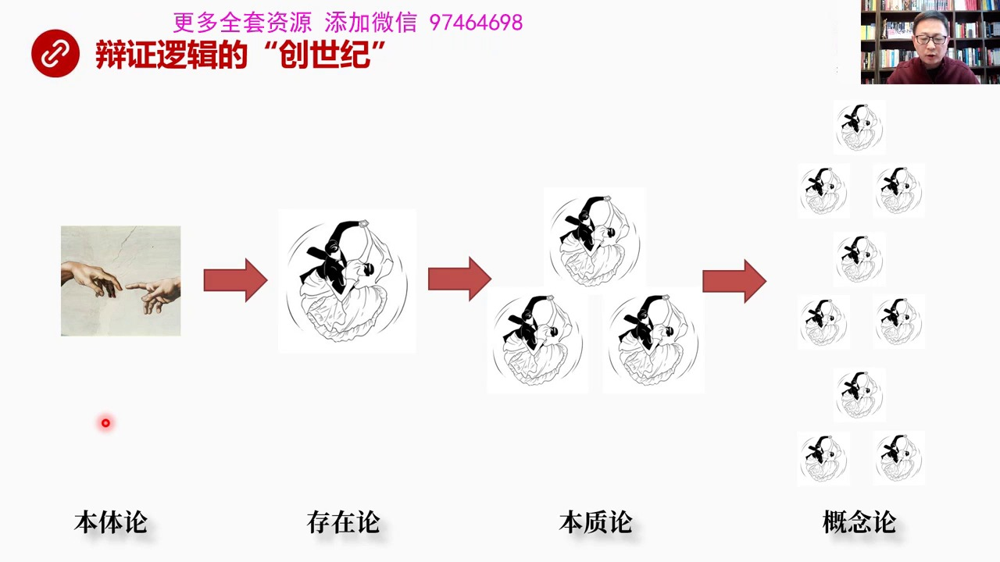

它是分成幾大部分中間設計了本體論的問題就是世界的本源是從哪裡來當然黑格爾認為是神創是神創造了萬事萬物然後是存在論這就是我們上一堂核心課專門講過的今天我們重點講的是本質論當然最後一個階段是概念論怎麼來認識它所謂客觀微信主義在我看來我們可以忽略世界的本源是什麼因為世界的本源可能是物質也可能是精神的可能是...

<strong>Cleaned narration</strong>

> 它是分成幾大部分中間設計了本體論的問題就是世界的本源是從哪裡來當然黑格爾認為是神創是神創造了萬事萬物然後是存在論這就是我們上一堂核心課專門講
> 過的今天我們重點講的是本質論當然最後一個階段是概念論怎麼來認識它所謂客觀微信主義在我看來我們可以忽略世界的本源是什麼因為世界的本源可能是物質
> 也可能是精神的可能是神創的也有可能是宇宙大爆炸為什麼我們這個階段可以不考慮這個問題因為這不是我們關注的重點真正重點是黑格爾從創造宇宙之後的推
> 論這個思想方法的推論我們用了華爾茲三部無曲變正邏輯的正反和三部無曲做了一個概括我們可以看到世界的本出從創造之後首先是存在然後從存在進入本質這
> 就是一個華爾茲無曲越跳規模越大越跳數量越多然後一直到現實生活中的萬事萬物都可以用變正邏輯的三部無曲華爾茲來進行一種描述它厲害之處就是從所有事
> 物的底層邏輯中抓取出來了它的形式就是三部無曲正反和的華爾茲那麼通過這套推論我們其實就可以建立一種邏輯框架這個邏輯框架就像一個巨大的尺輪系統無
> 論第一推動力是神創還是宇宙大爆炸無論它是一種精神力量還是一種能量不重要重要是有了第一推動力之後整個尺輪的運轉體系它的設計構造和運行所以假如我
> 們不考慮宇宙或者世界原始之初那個第一推動力的話它剩下的邏輯結構剩下這個巨大的尺輪系統是怎麼搖合的怎麼推動的也非常具有價值其實正是這部分的價值
> 才能夠使我們能夠有效地提煉出來一種思想工具或者叫思想武器能夠用於解決我們現身中的很多問題學習工作生活都可以使用這套工具來加以處理這就是我們要
> 了解黑格爾哲學它最重要的一個方便但除此之外我覺得通過研讀黑格爾的這個尺輪系統最重要的收穫是我們懂得了怎麼去構建理論你知道了在什麼層子上進行邏
> 輯抽象進行抽象思維怎麼對這些事務進行邏輯的分層然後你知道這種閒接邏輯推到原理過程中的這些閒接它是怎麼做到的然後你在詳細推理所有細節過程中你看
> 它那種精妙的這種組織技巧精妙的穿插轉折和精妙的構造這種概念體系形成理論的那一整套思想方法我覺得這個對於我們來說應該說是我們話中天然缺乏的所以
> 通過這種學習可以斷戀我們的思維肌肉有了這種思維肌肉之後我們就能夠創造自己的理論這就是為什麼我們要深入去了解本質論的另外一個重要原因我們看下一頁首先本質論我們要看它的邏輯分層

---

### Slide 3

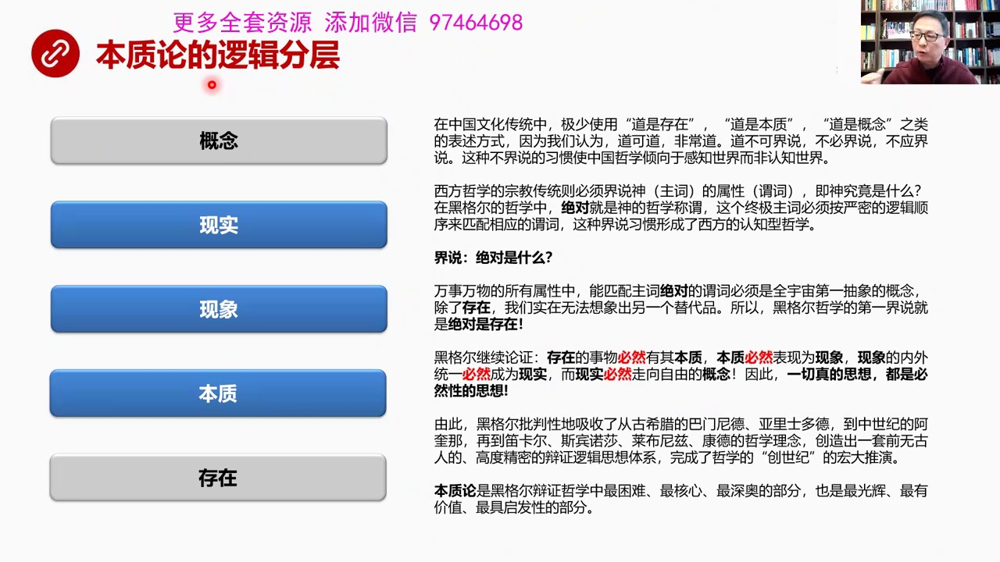

我們以前專門上過人工智能的深度學習網絡從深度學習網絡中我們已經改誤到了這種分層去處理問題的強大的功效也就是說我可以把一個複雜的事物進行抽象高度抽象之後我把它精確地分布在各個邏輯層上在每個邏輯層上我只抓最重要的點心特徵在分析這個邏輯層說我不考慮其他的問題可以失我專注可以失我更加聚焦失我的能量能夠更有效...

<strong>Cleaned narration</strong>

> 我們以前專門上過人工智能的深度學習網絡從深度學習網絡中我們已經改誤到了這種分層去處理問題的強大的功效也就是說我可以把一個複雜的事物進行抽象高
> 度抽象之後我把它精確地分布在各個邏輯層上在每個邏輯層上我只抓最重要的點心特徵在分析這個邏輯層說我不考慮其他的問題可以失我專注可以失我更加聚焦
> 失我的能量能夠更有效的釋放出來所以這個邏輯分層非常高的境界怎麼分才合理每個層面上分布著不同的概念這些概念之間再用演藝邏輯去把它穿起來然後再用
> 分層的方式把每層的概念組成一個巨大的體系形成理論這個是非常重要的我們首先看本質論的分層首先萬事萬物首先必須要存在沒有存在就談不上一切有了這個
> 基礎之後然後是本質本質之上是現象現象之上是現實現實之上是概念那麼在本質論中它聚焦在這個存在本質現象現實沒有涉及到概念好我們來看這些詞我們都很
> 熟但是讓你對它下定義呢比如什麼叫存在什麼叫本質什麼叫現象什麼叫現實其實我們一般人缺少一種精確的定義這些概念的這種奇怪為什麼呢這是我們傳統文化
> 的儀傳基因你比如說中國文化中或者在我們的傳統中很少談到存在這樣的概念我們如果看中國古典的書記的話幾乎沒有人提到存在為什麼因為存在是個高度抽象
> 詞我們一般就談樹就是樹花就是花鳥就是鳥太陽月亮這是一個具體的東西我們能夠直接看了電摸得著所以我們直接就說我看見了太陽或者有竹 有風 有花有眉
> 但是我們從來不說什麼存在或者存在怎麼怎麼樣不知道大家注意到沒有我們的文化中我們的日常生活中沒有人這麼去說那麼在中國傳統文化中我們再說到比如說
> 到家這個到我們基本上不使用倒是存在 倒是本質倒是概念之類的表述方式為什麼因為我們的老祖宗從一開始就認為到可到 非常到就是一個大道理一個天道一
> 個宇宙萬事萬物背後總的規律和真理如果能夠被清楚地說出來的話那它就不是那樣的了不起的東西它就不是那個真正的大道所以中國人認為道不可借說也不必借
> 說不應借說就是我們不應該去定義什麼叫道這種不借說的習慣是中國哲學傾向於感知世界而非任知世界這兩者區別在哪任知世界就一定要談規定性而且必須從規
> 定性出發比如說道你就必須要把道是什麼給我說清楚第一條規定第二條規定第三條規定如果沒有這樣的思維方式就不叫任知世界你只能感覺由於我們放棄了規定
> 性從一開始就放棄了對所有像大道和一切概念性的這種規定性的話我們就只能用直覺用頓誤用感受用強調那種直接達到數本質直接能夠抓住問題的要害強調這種
> 直覺和動物這種思想方法當然進化成了非常了不起的一種另外一種抽象就抽象成一年抽象成境界抽象成一種沒有規則沒有具體東西束縛的高度自由的東西這是中
> 國文化中達到了一個很高的境界但是用這種方法卻沒有辦法去詳細的解剖和任知世界所以這種思想方法從一開始當我們放棄規定性的時候其實就已經放棄了進化
> 現在自然科學社會科學經濟學和所有各種各樣現在理論的可能性我們沒有選擇這條路所以李約瑟說為什麼中國五百年以來經濟還不錯在世界上很有競爭力但是我
> 們沒有搞出現代自然科學理論在我看來不是五百年之內的事而是老子在第一道的時候合了他以後的立朝立代了所有的人都認為不應該去借說到不應該去借說一切
> 倒以下的各種各樣的概念我們走向了另外一條路所以從那個時代從2000多年甚至更早的時候我們就已經放棄了發展現在自然科學所需要的那種思想的工具和
> 武器我們放棄了走發展思想工具這條道路而西方呢西方哲學從古希臘時代他就有一種宗教傳統這個宗教傳統就必須要借說神是什麼你必須要把神他的定義說清楚
> ...

---

### Slide 4

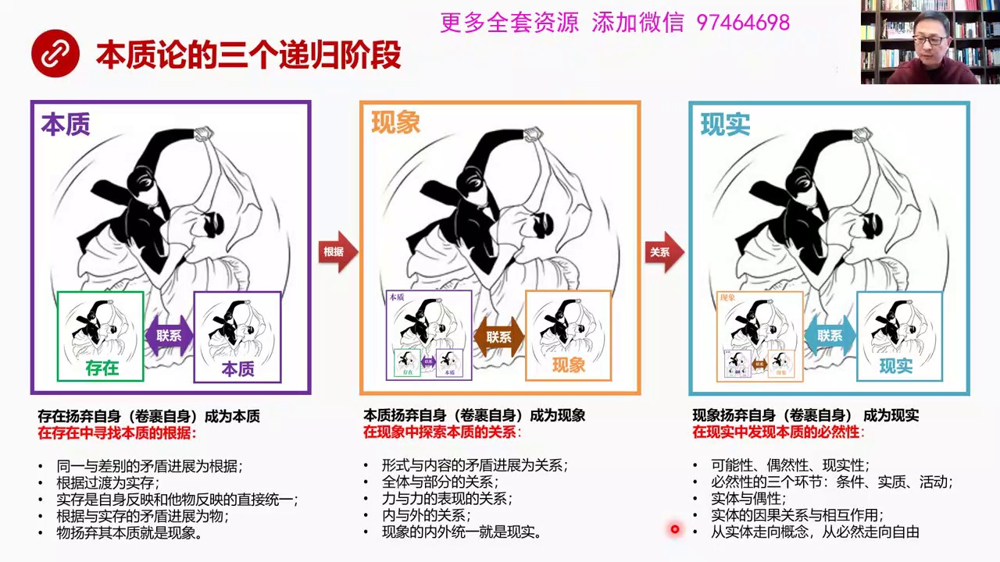

可以分成剛才我說的是幾個邏輯成四個主要邏輯層現在我們再從時間上劃分成三個階段我稱之為是地歸階段地歸當然是現代數語就是層層欠套那麼我們看到首先存在陽氣自身成為本質這個陽氣在德語中間是既有捨棄又有保留歷史但是非常地抽象每次我讀到這哪怕你已經呈現上萬次讀到了陽氣這個詞你還是腦子會被卡一下降低我的思維效率所...

<strong>Cleaned narration</strong>

> 可以分成剛才我說的是幾個邏輯成四個主要邏輯層現在我們再從時間上劃分成三個階段我稱之為是地歸階段地歸當然是現代數語就是層層欠套那麼我們看到首先
> 存在陽氣自身成為本質這個陽氣在德語中間是既有捨棄又有保留歷史但是非常地抽象每次我讀到這哪怕你已經呈現上萬次讀到了陽氣這個詞你還是腦子會被卡一
> 下降低我的思維效率所以我乾脆通過大量的分析之後我認為陽氣自身的概念就是把自己捲國起來就像我們的滾雪球你一開始那個雪球很小但是你越滾越大就是那
> 個意向陽氣自身就像滾雪球一樣把一開始的小雪球滾在裡面叫捲國自身繼續往前滾越滾越大這就是陽氣陽氣自身它的一個形象化的理解當你有了形象化理解之後
> 當然黑格很不喜歡形象化的邏輯它不喜歡這種徒刑邏輯或者叫形象邏輯它認為這個是比較樓的表現但是人類進化的發展的幾百萬年其實主要是靠這種形象邏輯也
> 就是說我們自古以來從原人那個時代就是對形象更敏感因為我們要找吃的我們要躲避也受我們要採集等等這些行為都是靠眼睛主要是靠眼睛視覺去發現而且你會
> 對這種形象更敏感更容易藉著住所以我們大腦的結構包括我們的記憶中間的特點是記形象的東西更容易而且一個抽象的概念會非常的累因為你的進化就不是這麼
> 進化出來的腦結構腦回路就不是這麼長的所以當你想當你想一個抽象概念的時候你往往想很多遍哪怕你對它已經非常熟了你還是經常會覺得這個效率比較低只要
> 繞到抽象概念你就會停頓你就會耗時間這就是為什麼獨黑格非常的累因為它全是純抽象的概念全是純粹的四遍這玩意兒獨起來我每天獨十四個小時的黑格那絕對
> 是腦子會疼的是會癱瘓的是會腦癱的所以我們在這裡要大量使用形象的這種邏輯去替代純抽象的東西就是為了結成我們的腦消耗量結成我們的腦力那麼存在陽氣
> 自身成為本質這句話怎麼理解就是存在就像一個血球樣把自己捲過在裡頭所以它失去了直接性因為它跟外界的其他的血失去了直接的聯繫它被包著裡面了存在全
> 國自身成為本質所以我用這張圖表示就是存在就是用綠色代表存在生生不稀嘛全國自身變成本質一部分所以在本質大的框架之下跟另外一種存在另外一種這個存
> 在存在全國成本質之後它也一樣所以在這個框架中我們看到是存在和另外一種存在的聯繫所以本質第一階段本質論的第一個階段是研究在這個框架之下在本質中
> 間它到底要研究什麼其實我們得出一個結論就是在存在中要尋找本質的根據這個就是第一階段的重要任務什麼是這個什麼是本質論的第一個階段本質論的第一個
> 階段研究了中心問題是什麼就是在存在的這個邏輯層面上這個邏輯抽象層上去尋找本質的根據主要當我們第一次聽到根據的時候我們日常生物中常用的根據已經
> 對我們大腦形成了一種固化我們一想的根據就是內根據實際上這是哲學意義上的根據這就要求我們在讀黑格的時候一開始你要意識到什麼是我們日常生物中得出
> 了一種經常性的概念而這個經常性的概念並不是哲學中所精確對應的概念根據是什麼根據就是由它生發掩生由它導致的一系列的現象所有現象的根據是在這是在
> 這個概念上所以它是我們簡單說它是一種原因由這個原因由根據導出了很多結果所以我們知道研究本質研究什麼其實研究這是根據這個根據派生出了萬事萬物根
> 據是什麼根據是怎麼來的這個是第一階段研究的重點那麼大體分起來大體來說起來它分成幾個層面首先同一和差別的矛盾進展為根據就是這是整個本質論最核心
> 的東西就是在這個本質這個邏輯層上最核心的東西就是研究同一和差異同一和差異相互矛盾相互對立然後他們倆鬥爭的結果是根據有了這個根據之後就會派生出
> ...

---

### Slide 5

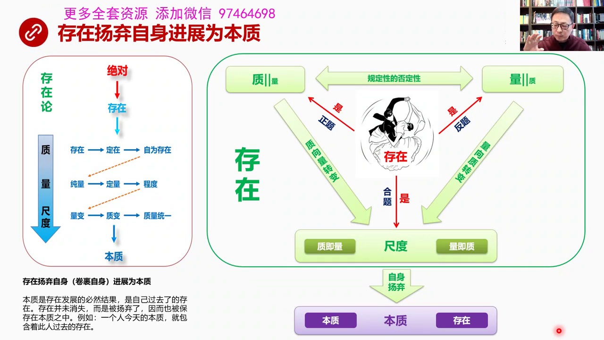

我們得知道本質是存在捲果自身發展成本質的那麼存在就是我們以前和一個客裏面講了存在又是怎麼捲果自身發展成本質的呢我們知道存在論咱們已經講過了就是從存在經過智量和齒度發展完備之後然後捲果自身變成了本質智包括存在定在自為存在然後過渡到量量有存量定量和程度然後過渡到量變智變這就是齒度級別了量變智變和智量統一...

<strong>Cleaned narration</strong>

> 我們得知道本質是存在捲果自身發展成本質的那麼存在就是我們以前和一個客裏面講了存在又是怎麼捲果自身發展成本質的呢我們知道存在論咱們已經講過了就
> 是從存在經過智量和齒度發展完備之後然後捲果自身變成了本質智包括存在定在自為存在然後過渡到量量有存量定量和程度然後過渡到量變智變這就是齒度級別
> 了量變智變和智量統一然後發展成本質所以當我們說存在的時候包括這九個範疇它的規定性九個範疇的規定性全部被打包在一起發展成本質它最後一個狀態就是
> 這個狀態因為存在無非是量智智量和齒度三個方向來代表來描述存在我們說任何一個事物的存在當然你要解釋它怎麼去解釋它從三個層面來解釋它的智這個事物
> 它的它的智是什麼它的量是什麼它的齒度是什麼你把這三個圍度或者叫三個邏輯層描述清楚了你就把這個事物存在的特徵給抓出來了我們知道智和量智中隱含著
> 量量中隱含著智這都是我們上午也課講過的那麼它的規定性的否定性會互相就是智中含有量它就必然會向這個方向去隱形量中含有智它就必然朝這個方向去隱形
> 量著在中間實現碰撞之後形成就是正題向這邊運動反提向這邊運動然後形成的合力向這個方向運動最後變成齒度所以存在存在有智存在也有量存在有齒度或者叫
> 存在是智存在是量存在是齒度最後發展結果是這個概念中包含兩個兩個概念做它的內部環節就是齒度實際上中間包含著智就是量量就是智這兩個環節然後齒度把
> 自己打包把整個存在打包把九個範疇機器規定性包括規定性之內的差異全部打成一個包然後全國自身發展成了本質所以本質中間既有本質自己的環節只有它自己
> 的範疇和它的定義同時又包含所有存在的範疇和定義那麼要研究這兩者之間本質和存在之間的關系這就是從圖形上去理解本質論它的第一階段那麼我們從文字上
> 看存在陽氣自身進展為本質就是存在把自己包過起來往前滾發展成了本質本質是存在發展的必然結果沒錯因為它是往前滾所以滾到了本質它就是發展的必然結果
> 那麼存在那麼本質是自己過去了的存在這話怎麼理解當然你把自己包過在裡頭了也就是說這個存在是一個過去式但是存在並沒有消失因為它捲滾在裡頭它只是被
> 陽氣了被陽氣就是捲滾在內部了捲滾在核心了所以它也被保存在本質之中比如說我們舉個例子一個人今天今天的所有的東西就是今天它體現出了本質其實包含它
> 過去的存在就是一個人過去從小長到了20歲30歲40歲50歲這個過程中它過去的存在全部捲滾它它這個人中間我們不能說一個30歲的人它過去就不存在
> 了存在了它30年以前所經歷的所有的一切全部在它的內心之中所以我們說今天這個人本質是包含它過去的存在的而且捲滾它過去的存在它在同年在少年時代所
> 受到的各種刺激磨難都變它今天本質一個重要組成部分這就是這句話的意思就是本質是自己過去了的存在好這個基本概念搞明白之後我們看下一頁第一階段第一階段

---

### Slide 6

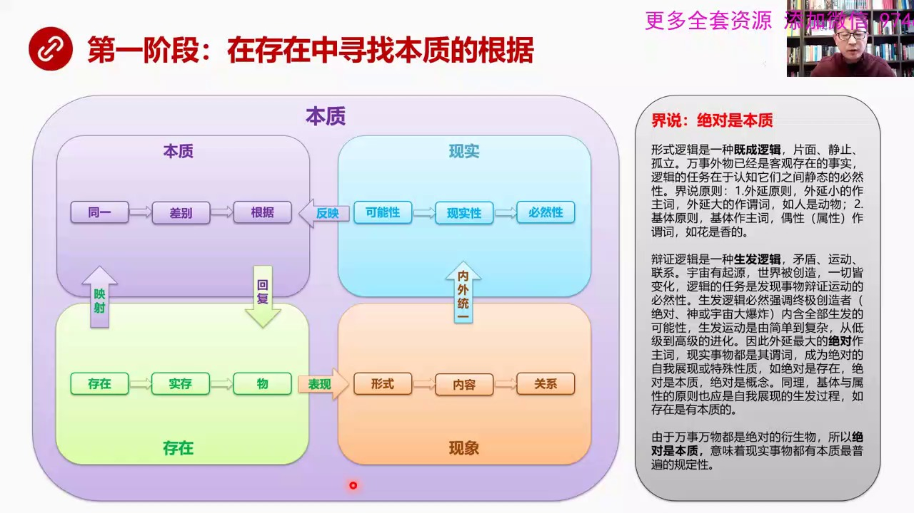

什麼在存在中尋找本質的根據就是要第一階段核心是要找根據那麼我剛剛說了邏輯層有四層存在本質現象和現實這好像四個像線那麼這是四個邏輯層然後在四個邏輯層中間它的進化又分成三個階段我們第一個階段的重點任務是要找存在和本質之間的關係這是存在綠色的本質我用紫色代表綠色代表長清代表生命那麼首先存在和本質這兩者之間...

<strong>Cleaned narration</strong>

> 什麼在存在中尋找本質的根據就是要第一階段核心是要找根據那麼我剛剛說了邏輯層有四層存在本質現象和現實這好像四個像線那麼這是四個邏輯層然後在四個
> 邏輯層中間它的進化又分成三個階段我們第一個階段的重點任務是要找存在和本質之間的關係這是存在綠色的本質我用紫色代表綠色代表長清代表生命那麼首先
> 存在和本質這兩者之間這兩個邏輯層之間的關係是第一階段我們研究的重點這兩者之間的關係是什麼是要找到根據今天這堂課就是本質的上半部分我們主要也是
> 講的這兩塊存在和本質這兩個邏輯層之間的關係然後下半部分主要講的是現象和現實這兩個邏輯層之間的關係這四者的關係我們可以大致先簡單描述一下存在中
> 間最核心的是首先是存在本身就是質量和齒度捲過自身打成包了然後然後它進化到了本質捲過自身進化到本質這種捲過自身滾到本質意味著什麼意味著它被包在
> 裡面了本質是外面的一張一張皮裡面包著存在了合但是這種捲過我們好比是堅命果子由調被包在裡頭那就是存在外面包了一張面餅那個是本質但是兩者之間還有
> 硬色關係這個是本質論中間是描述本質這個概念中最重要最核心的東西是硬色兩人寄捲過在一起同時存在還硬色在本質之中理解硬色也就是黑耳所反覆強調的反
> 思這個是本質中間這個概念中間最繞人最繞人頭疼的地方你得花大量的時間可能得需要幾個星期來琢磨這兩指間究竟是個什麼樣的細微關係有什麼樣的差別那麼
> 我們一會兒再詳細涉及到這個問題的時候再去分析我們先從大邏輯架構來說存在硬色在本質之中也捲過在一起那麼就會存在這個在本質中就會出現同一本質中這
> 個存在到底是不是同一的其實同一中是有差異的不完全是個純粹的東西中間還有差異而同一和差別之間的對立矛盾然後鬥爭產生運動產生結果就是根據所以這是
> 本質層面的三個核心概念同一差別和根據這個根據形成之後它還是一個本質性的東西還不是實實在在的所以它又要回復到存在回復到存在之後它以實存的方式體
> 現出來而實存的家族一個體系一個組一個有機組成部分的所有實存構成了物這個物就是康德所提出物自體的這個概念黑耳在這做了修正那麼這個物陽氣自己的本
> 質然後它要表現為現象也就是說本質存在經過本質繞了圈回來之後表現成一個具體的物這個物其實是還有本質的在陽氣自身表現為現象而現象中又有三個重要的
> 環節首先這個物在現象中體現是什麼體現是外表體現是形式所以形式是現象研究了第一個環節而形式變化成內容就是形式像內容轉化其實這是變成法中間一個非
> 常非常重要和核心的理解我們以前講到形式與內容關係我們對內容的理解是有問題的大部分人是理解的不到位的形式和內容就是內容是什麼內容是形式轉化的結
> 果或者說形式運動創造內容那麼這兩者最後的形式和內容相互轉化之後出現了就是現象之間的關係然後現象之間的關係當內容多到一定程度現象內容的關係這個
> 現象之間的關係越來越複雜當內容多到一定程度的時候就會達到內外統一的程度就是這個現象內和外是統一的就是它直表現就是內和外就是相互表現是一個統一
> 的狀態內外的統一現象就全國自身進化到了現實當然現實裡面重要的三個概念就是可能性什麼是現實可能性什麼是現實的可能性什麼是現實性什麼是必然性當然
> 必然性之後還有必然性推出的實體實體的相互作用就是英國關係還有充分的英國關係就是相互作用等等往前繼續推那麼在現實這個邏輯從中間我們看到現實實際
> 上是反應本質了就是其實一切的這些現象和現實你都得有一個存在了根據根據從哪來根據是從本質來那麼這四者之間關係形象來說就是一個堅民國這個形狀存在
> ...

---

### Slide 7

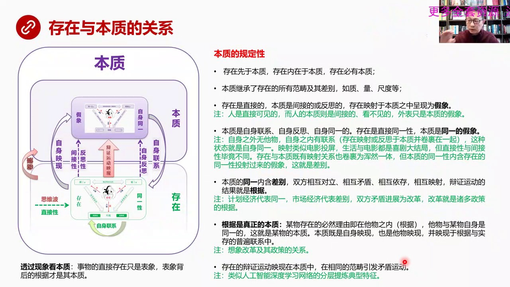

存在和本質之間究竟是什麼關係這就需要通過一張圖來展示存在和本質在本質這個階段中我們來看存在它是底層的先有存在這個邏輯存在下面然後本質是在它上面或者說繪圓果在一起了繪圓果的意思就是存在被包在本質裡面存在是油條本質我們現在可以想像它是外糖那個面餅但是它不僅僅是繪圓果的關係它還有硬設的關係這個硬設是我們最...

<strong>Cleaned narration</strong>

> 存在和本質之間究竟是什麼關係這就需要通過一張圖來展示存在和本質在本質這個階段中我們來看存在它是底層的先有存在這個邏輯存在下面然後本質是在它上
> 面或者說繪圓果在一起了繪圓果的意思就是存在被包在本質裡面存在是油條本質我們現在可以想像它是外糖那個面餅但是它不僅僅是繪圓果的關係它還有硬設的
> 關係這個硬設是我們最難以理解的是最燒腦的我們在第一堂核心課裡面曾經用過思維波這個概念來理解什麼是我們對這個世界的認知在西方哲學如果帶有上帝視
> 角它認為思維和思維對象是分開的思維就好跑比是一種波打到思維對象之後會有反射波反射波我們是通過研究反射波來認識這個思維對象的所以思維波打到存在
> 上面存在是任何事物都有存在打到是存在上頭這是一種直接性是就像光一樣是直接打到事物上這叫直接性而在存在上被打上離數光或者說被打上了一個雷達的電
> 磁波之後它會產生反射效應這個反射到了本質之中本質就好比一個電影評論存在好比現實事物現實事物東西被頭色被頭影被硬射到了本質之中所以這叫間接性或
> 者叫反思細這個是本質論中最繞人的地方你想很久在這問題上都會錯亂所以兩者之間的關係存在和本質剛才我說的第一種理解形象理解就是見面果子存在是有條
> 本質面餅把它包在裡頭了同時兩者雖然被包裹在一起但還有另外一層關係是硬射存在東西通過頭射頭射在本質的屏幕上這反映了一種間接性所以本質一切的本質
> 都是非直接性的只要你能看見的東西都不是本質本質一定是反射性的一定是間接的一定是肉眼看不見的也是你摸不著的這個是本質最重要的一個定義那麼除了這
> 個定義之外還有我們看這張圖你會看到本質是一種自身硬線它硬線自身就是本質硬線存在硬線的本質之中然後本質跟存在是具有自身聯繫的存在把整個自己投射
> 到這個本質之中這叫自身反思而且存在中的各種變徵運動也會投射在本質之中所以它是從各個方面我們剛剛是從各個方面來看本質和存在之間的關係相當符的而
> 且相當繞人在未來不同的我們在解讀概念和本質之間的關係的時候我們都需要回到這張圖或腦子面都需要想到這張圖然後你才能夠逐漸理解本質和存在之間那些
> 非常細小非常精微的概念以至於你的懷疑黑個人怎麼能用語言把它說得清楚但是它說清楚了而且說完之後如果我們通過圖星再加以理解你會覺得它說得是對的但
> 是這種精細化的描述這種很細小差別這是一種極其強大的哲學的手術刀是一個非常封力的手術刀一般人的思維不經過長期的磨練是達不到這麼精細的程度的我們
> 看一下本質的規定性規定性一切規定性都是它的都會自動創造它的否定性這就是變成法律的精髓就是你規定本質是什麼就一定會創造它的另外一面規定性形象說
> 就是話地界圈在地界之內的這叫規定之內的接收之內的東西地界之外是什麼當然就是界內它的對立面所以做界定過程中一定會出現界內和界外天然的對立這就是
> 變正法的精髓就是我一旦界定一個東西就會出現界內和界外之間的對立這種對立就是一種矛盾這種矛盾就會帶有運動的趨勢就會是整個東西動起來這個是黑耳變
> 正法中間的精髓的精髓它的規定性一定會產生對立面當然維護變正把這點給弱化了但是我們現在先不管維護變正能怎麼說我們先徹底理解黑耳的變正法它的核心
> 就是有規定性它必然產生自己的對立面這就產生了從這一面像另外一面運動的可能和趨勢它就會有差別就會有矛盾然後就會有運動就會有變化世界就動出來了本
> 質的規定性是第一個一個規定性是什麼就是存在鮮魚本質我們剛剛已經說了一切東西沒有存在談不上任何東西所以存在鮮魚本質存在內在魚本質它是油條被裹到
> ...

---

### Slide 8

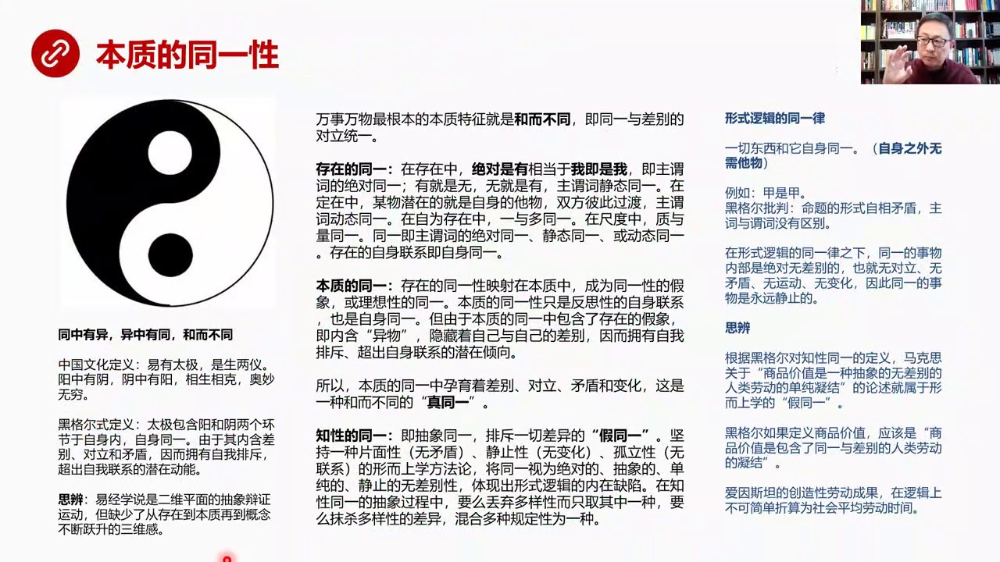

在同意中間存在是自身直接同意的它反映打到這個屏幕上就有一種應射效果它就是同意性的假象當然本質自身也是自身同意的中間內涵存在投射過來的假象所以兩者間必有差別其實我們來看中國對於同意性的理解就是陰陽圖了我們認為老總是認為萬事萬物最根本的本質特徵就是合而不同任何事物都不可能完全一模一樣所以一定是合而不同的...

<strong>Cleaned narration</strong>

> 在同意中間存在是自身直接同意的它反映打到這個屏幕上就有一種應射效果它就是同意性的假象當然本質自身也是自身同意的中間內涵存在投射過來的假象所以
> 兩者間必有差別其實我們來看中國對於同意性的理解就是陰陽圖了我們認為老總是認為萬事萬物最根本的本質特徵就是合而不同任何事物都不可能完全一模一樣
> 所以一定是合而不同的同意和差別是對立同意的這是我們本能是我們的直覺是老總沒有經過規定性我們腦子就直接反映出來了所以中國文化對這種同這個同中有
> 意一種有同合而不同這是可以直接理解的那麼在西方的這個定義中間同意性是什麼概念比如說我們在存在層面來看同意存在邏輯層上怎麼說同意呢在存在中就是
> 說我們以前核心更難準備專門講過的絕對是有這是一個非常這是一個第一階說是非常重要的階說絕對就是存在絕對是有這是一個概念這句話是一個絕對定義就是
> 我就是我沒什麼好說的我就是我所以它在主位詞上主色和位詞是絕對一樣的那麼它還有一個定義有就是無就是有這個是主位詞無和有之間主位詞它是靜態統一的
> 就是無和有在最初那個存在狀態確實是兩者可以靜態統一在定在中存在中另外一個狀態某物潛在了就是自身的他物就是你規定了自己那麼就創造了對立面所以潛
> 在就是對方雙方是可以彼此過度的這叫主位詞的動態統一就是我在運動中可以向對方運動所以這叫動態統一我潛在就是對方自為自在中一和多統一在詞作中制和
> 量統一這都是叫統一就是制就是量量就是制一就是多多就是一等等不管在存在層面中怎麼說這個統一它就是主位詞之間的要麼絕對統一要麼靜態統一要麼動態統
> 一就是主位詞是一樣的存在它的自身聯繫就叫自身統一那麼本質這個邏輯層本質這個邏輯層對統一的看法是存在統一性硬設在本質中成為統一性的假象剛剛我們
> 已經說了或者叫理想性的統一它不可能實現那樣的統一它只是一種絕對的理想本質的統一性只有只是反思性的自身聯繫也是自身統一它也是自身統一但是由於本
> 質的統一一種包含了存在的存在統一性的假象也就是說本質的統一性中內涵義務隱藏著自己和自己的差別因而擁有自我排斥超出自身聯繫的潛在傾向因為它不舒
> 服本質的統一性中還有義務它總是把這個想把義務排出去所以它就會產生對立和矛盾來自變化這是一種真正的統一黑格爾接著批判執性統一執性統一是什麼是抽
> 象的統一是排斥一切差異的假統一堅持一種片面性就是無矛盾靜止性就是無變化孤立性就是無聯性這是一種行人上學的方法論把統一是做一種絕對的抽象的單純
> 的靜止的無差別性就是這個東西內部重人又純沒有任何雜誌這叫統一性當然這是一種行事邏輯在黑格爾看來這是一種內在缺陷在執性統一的抽象過程中它認為執
> 性在抽象過程中要麼多拋棄了多樣性中間的很多其他的東西只選一種要麼把多樣性的差別給抹殺了就是把各種規定性混合成為一種所以它是批判執性的統一的這
> 就涉及到幾個重要的邏輯形式邏輯的重要的定律比如說形式邏輯的統一律一切東西和它自身統一自身統一也就是自身之外無他物比如說在形式邏輯中的統一律中
> 它的標準那一是甲式甲黑格爾對此的批判是命題的形式自相矛盾就是主責位詞沒有區別這麼表達其實異不大那麼在形式邏輯的統一律之下統一的事物內部是絕對
> 無差別的如果絕對無差別當然也就無對立無矛盾無運的無變化因此統一的事物永遠是禁止的在這裡我們要做個思辨題因為根據黑格爾對執性統一的定義我看資本
> 論說馬克思在定義商品價值的時候他是怎麼說的商品價值是一種抽象的無差別的人類勞動的單純凝結這個論述就有問題了按著黑格爾觀點這就屬於行而上學的甲
> ...

---

### Slide 9

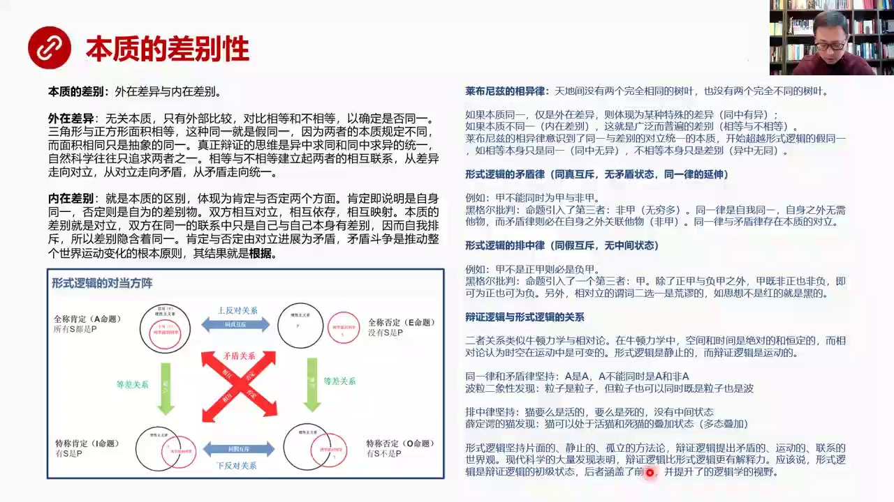

外在差異和內在差別外在我們叫差異內在叫差別外在差異就是根本之無關只有外部的比較比如說相等和不相等相等就是統一的自身統一的不相等就是不同一的比如說三角形和正方形面積相等這就是統一因為它面積相等但是黑個人認為這叫假統一因為三角形正方形的規定性不一樣不能夠遍面的追求這種統一性當然數一家無所謂所以很多自然科...

<strong>Cleaned narration</strong>

> 外在差異和內在差別外在我們叫差異內在叫差別外在差異就是根本之無關只有外部的比較比如說相等和不相等相等就是統一的自身統一的不相等就是不同一的比
> 如說三角形和正方形面積相等這就是統一因為它面積相等但是黑個人認為這叫假統一因為三角形正方形的規定性不一樣不能夠遍面的追求這種統一性當然數一家
> 無所謂所以很多自然科學家不太喜歡黑個人也有這種關係覺得黑個人這人抬槓三角形面積跟正方形直接畫等號有什麼不可以的其實黑個人從變證法的角度認為這
> 樣做只完成了問題的就是整個一個來去兩個路程的一半就是同中求一和一中求同兩個過程必須同時完成才叫真正的思想數一家只滿足我有一半路程實現了還有自
> 然科學家有時候滿足回程實現了同中求一一中求同往往只實現一半這個就是我們現在自然科學中有很多科學家腦子裡面實際上是形而上學的關鍵在推動它做科學
> 研究可不可以做出成果可以做成果但是在黑耳看來這不完備沒有真正實現哲學上的量力一種完滿或者說沒有真正達到一個更高的境界當然這也是當代自然科學中
> 包括當代現代技術研究者中間一個普遍存在的問題深刻理解黑耳之後你會發現黑耳說了非常有道理那麼什麼叫內在差別內在差別就是本質性的差別就是本質上我
> 們就不一樣規定性就不一樣了當然它體現為肯定和否定如果是肯定說明我們自身同意如果否定說明我們天然就是差別雙方相互對立相互移存相互應射就是誰也離
> 不開誰有你才有我就像司馬遺和諸葛亮一樣如果沒有諸葛亮司馬遺也就沒意思怎麼第一司馬遺實際上要看清諸葛亮才能定義司馬遺然後兩者之間相互影響相互應
> 射彼此相互反應本質的差別本質性差別是什麼它就是對立就是內部自己跟自己不一樣嘛這不就是對立嗎對立雙方就是對立在統一的聯繫中間就是自己和自己有差
> 別所以它有一種自我排斥所以差別會有一種自我排斥力排斥什麼呢想把自己想把對立物給趕出去把它排斥出去所以差別中間又隱含著統一因為這種排斥對方的感
> 覺是為了實現統一性所以差別中間又有差別中間又內含著統一性肯定和否定這是兩個對立面由對立發展於矛盾鬥爭推動整個世界發展那麼矛盾鬥爭的結果什麼呢
> 那就是根據好我們再看哲學上的一些形式邏輯和後來的變成邏輯之間有提出一些重量規律比如說來賓尼茲提出了相遇率它在瑞典的公廳裡面還是丹麥的公廳裡面
> 它跟這個國王說天底價沒有兩個完全相同的數頁也沒有兩個完全不同的數頁他說前半句話說公廳的這些手衛這些包括供女全部都到花兒裡面去找就覺得他說了不
> 對肯定能找到兩個一模一樣的這個數頁其實來賓尼茲相遇率中間就已經含著變成邏輯了也就是它已經意識到了比如說如果說本質統一僅僅是外部存在差異的話那
> 麼只是體現為某種特殊的差異性這叫同中有異兩邊數頁它的本質是一樣的只是外面大小不一樣或者它的這個顏色稍微一點差別但是本質統一的只是外在有差異它
> 體現為某種特殊的差異如果是本質不統一本質就不一樣那就是廣泛而普遍的差別比如說相等不相等所以萊布尼茲的相遇率已經意識到了統一和差別的對立統一是
> 它的本質開始超越了形式邏輯那種假統一比如說相等本身只是統一就是面積相等那就是絕對統一因為同中無意不相等只是差別因為意中無同實際上三角形和長方
> 形面積相等只是一種假統一同中是有意的就是它的面積相同但是規定性是不同的兩者不能夠絕對話等好所以這一點其實讓我們推想到很多形式邏輯之下建立的比
> 如說歐基里德幾何學那到離慢幾何時候它就不成立了兩點之間之間之間最短你是在平面上最短你用曲面試試兩條平均線永遠不相交你換個曲面你試試換個空間你
> ...

---

### Slide 10

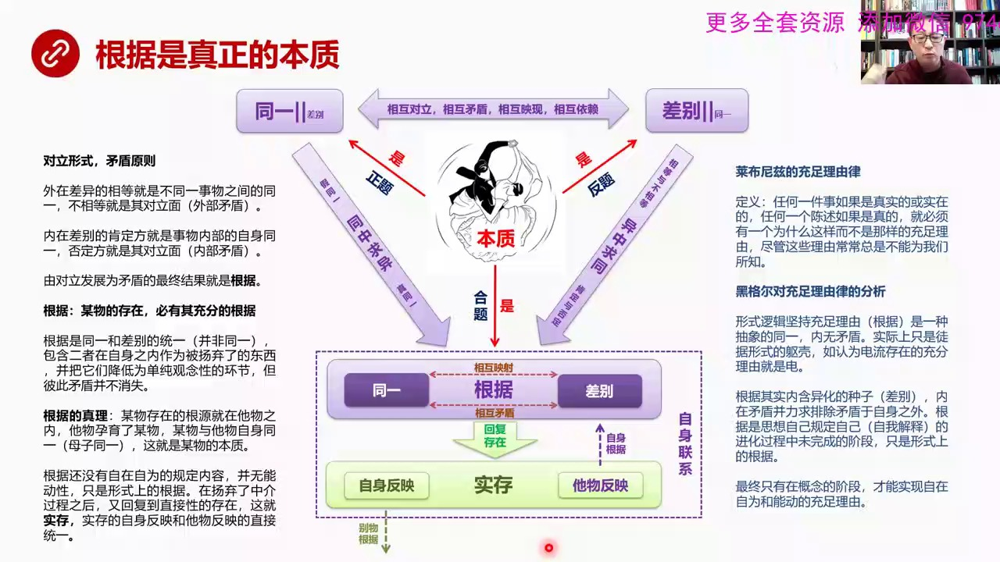

來講話就比較明顯了根據是真正的本質就是我們所說的在本質層面上研究什麼研究的是根據同一性和差別這代表正題這代表反題本質是同一的本質是有差別的本質是根據同一同一性中間有差別我們已經說過了差別中隱含著同一的傾向也說過了兩者之間相互對立相互矛盾相互隱憲相互依賴誰也離不開誰那麼在運動過程中同一項差別運動差別項...

<strong>Cleaned narration</strong>

> 來講話就比較明顯了根據是真正的本質就是我們所說的在本質層面上研究什麼研究的是根據同一性和差別這代表正題這代表反題本質是同一的本質是有差別的本
> 質是根據同一同一性中間有差別我們已經說過了差別中隱含著同一的傾向也說過了兩者之間相互對立相互矛盾相互隱憲相互依賴誰也離不開誰那麼在運動過程中
> 同一項差別運動差別項同運動雙方進行矛盾鬥爭的這個過程之中同一性貢獻了什麼同一性包括假同一在這兒假同一這是真同一同一性貢獻是同中求義的力量或者
> 同中求義的這樣的一種狀態那麼差別像根據運動的時候它是相等和不相等肯定和否定這兩組關係是一種求同在差別中尋求共同的東西所以雙方的合體同一差別然
> 後雙方矛盾對立然後向共同的一個方向發展發展為根據在根據中就有包含兩個環節因為它們兩個環節都被包含在一個更大的環節之內更大的概念之內同一和差別
> 被包含進來了但是同一和差別在這樣的狀態之下在根據裡它並不是消除了矛盾矛盾仍然存在還在鬥爭兩者相互應射相互聯繫但是矛盾並沒有消除這個是一個非常
> 重要的關鍵矛盾鬥爭的繼續鬥爭的結果就是回復到存在派生出生出了一個時存母親生下了孩子這個時存根據之間是自身聯繫在一起的也是自身同一的那麼它有兩
> 個重要的自身反應和套反應這個時存就是一個實際存在的東西了它的自身反應是反應它自己的反應本質的它無反應是反應它的母親的它從哪裡來是反應根據的而
> 它自己的本質是它自己的這個自身反應它自由的這個東西又是派生它有一天也會當母親也會生孩子或者它而是做父親也會生孩子它會成為別人的根據這就會產生
> 一系列的時存從根據中會派生出一系列的時存所有這個時存跟它有關係的都叫自身同一就是一個家族所以我們來看這個運動矛盾同一和差別運動到根據它的核心
> 原理是什麼首先是對立的形式矛盾的原則外在差異的相等首先我們說外在有差異外在差異它的相等是什麼呢就是不同一外在不同一東西彼此之間的同一性長方形
> 和三角形它的面積相等雖然形狀不一樣我們稱之為面相等它是一種外部同一性不相等就是一種自身的對立面打這都叫外部矛盾內在差別的肯定方就是事務內部的
> 自身同一否定方就是其對立面這叫內部矛盾由對立發展為矛盾的最終結果就是根據外部有外部矛盾內部有內部矛盾共同發展推動的結果就是根據根據是什麼就是
> 某屋的存在必有其充分的根據聽起來有點繞但實際上就這麼回事任何東西的存在必然有根據所以我們現實上我們看到所有的東西你都可以去追溯它的根據是什麼
> 而且是充分的根據根據是同一和差別的統一注意並非統一我剛剛已經說了統一和差別在在這裡頭仍然有鬥爭那麼這兩者是包含在他內部的作為兩個環節但是必須
> 矛盾並不消失那麼根據的真理根據到底是什麼東西是怎麼回事某屋存在的根據就在他屋之內他屋遇於了某屋某屋與他屋自身統一就是某屋子統一這就是某屋的本
> 質當我們說某屋孩子他的根據是什麼他的根據是他母親他跟他母親是統一的他的母親遇了他這就是這個孩子的本質所以你要尋求這個孩子的這個誕生的根據一定
> 往上追蹤找到他誕生的根據根據還沒有自由自在自為的規定內容並且還沒有能動性只是形勢上的根據這個要到概念中才能實現他的真正的根據也就是說現在我們
> 看到的根據只是雙方鬥爭產生的一個偶然性的或者非必然的結果他可能是這樣的一個情況也可能是量了一個情況這是因為根據在現在這個階段還沒有達到一個完
> 滿的程度到概念的時候到概念那個階段的時候反過來才會發現所有真實事物的根據都是確做的都是有道理的那麼來不及自在充分流律他講的是任何一個事情如果
> ...

---

### Slide 11

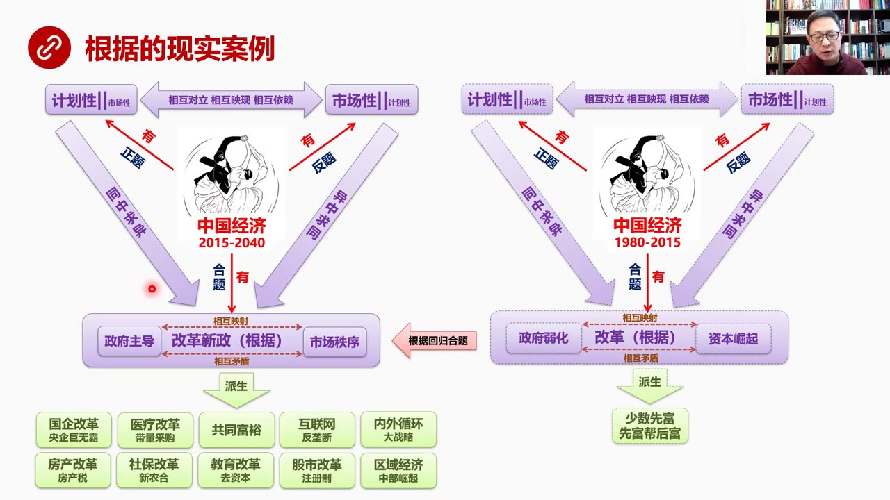

比如說我們看到中國經濟的改革開放以後80年到2015年我在這裡不想去說它的時間化分的原因以後我們有機會在專門去講實際上中國經濟是什麼呢是計劃經濟時代是一種同一性市場經濟是一種差別就是計劃經濟內部我們要求高度的均平復要求平均分配要求一切都是同一的這種性質安排的都是由政府來主導的計劃來進行這種安排而市場...

<strong>Cleaned narration</strong>

> 比如說我們看到中國經濟的改革開放以後80年到2015年我在這裡不想去說它的時間化分的原因以後我們有機會在專門去講實際上中國經濟是什麼呢是計劃
> 經濟時代是一種同一性市場經濟是一種差別就是計劃經濟內部我們要求高度的均平復要求平均分配要求一切都是同一的這種性質安排的都是由政府來主導的計劃
> 來進行這種安排而市場性是什麼市場性是一種放大差別所以市場經濟一定放大差別而計劃經濟是縮小差別但是在計劃性中間計劃市場時代在計劃性中間也天然的
> 含有市場性因為不可能做到絕對的計劃還是有一些濃貌市場有一些小的市場因為它內涵在裡頭不可不可抹上那麼在市場中間不管哪國的自由市場中間也有計劃性
> 比如說美國拉爾暫時二戰手那就要政府來組織進行大根本的採購這就是計劃性兩者鬥爭的結果就是在改革開放過程中要縮小計劃性放大差別在往市場經濟轉化過
> 程中我們看到它最後出現了根據就是改革我們統稱為改革這就是一個根據這個根據它會形成計劃性到了改革這個階段它的環節它的政府的管理能力它是處於一種
> 弱化的趨勢之中就是要檢證放權放權就是要弱化政府強大市場當然同時所對應了市場性就產生了資本崛起這樣的一個現象一直到2015年所以這個政府和資本
> 或者叫政府和市場之間仍然會有矛盾持續不斷矛盾這才會出現持續不斷的改革那麼在這個根據之下會派生出比如說少數人先付起來先付幫後付這都是由於這種根
> 據派生出來的時存當然我們現在看到現在中國經濟從2015年我認為未來可能會持續二三十年都會處於這樣的一個冠軍之中如果這是中百的話這是一個中百的
> 話那麼以前的改革是往這個偏所以現在它是自動地再往回歸和體的方向正反和計劃性市場性和改革真正的改革新政它實際上是個政反和現在以前是往這邊偏寫偏
> 市場現在又往回白洞回到和體這個和體是什麼就是改革的新政也是計劃性市場性雙方彼此矛盾彼此對立然後最後達成的一種妥協或達成雙方競爭的一個狀態這就
> 是所謂的改革新政改革新政它也成了一個新的根據它包括的兩個核心組成部分一個是政府主導不是弱化了而是要強化政府主導另外要講究市場秩序不是資本亂象
> 而是要講究市場秩序在這樣的一個新政的根據之下會派生出大量新的現象或者是要新的十存這是母這些都是子所有這些現象他們的根據都在改革新政上比如說國
> 企改革現在要搞西洋企具無霸醫療改革要搞帶量採購共同富裕這也是一個中心話題還有互聯網要反壟斷內外循環要搞大戰略區域經濟要強調中部崛起當然還有很
> 多其他區域經濟的一些現象我沒有全部列出來五分之改革我要搞註冊制備案制然後教育改革我要去資本設保改革前幾年搞出新農合還有房產改革要搞房產稅包括
> 現在房地產區綱綱等等等等這些十存他們的根據在哪根據都是改革新政而改革新政的原因是什麼原因是計劃經濟計劃性和市場性兩種力量的對立和矛盾所以這就
> 是我們要認識所有問題它的本質什麼叫認識本質找到它的根據在哪而且要意識到根據是會發生變化的由於兩種力量的鬥爭形勢或者博弈形勢的不同根據也是會發
> 生擺動的根據擺動基本上是一個中擺形狀所以我們現在看到當2015年中國往這個方向擺的時候我們就會看到會出臺一系列新的政策而未來一段時間還會出現
> 大量新的政策一定都是從這個根據中派生出來的這就是變政法它的思想工具可以直接用於我們理解現實中間所發生了大量的政策改變社會現象等等的一切是需要
> 一個總的抽象的思維能力的同一性和差異性進化出來的根據我們要把根據給吃透搞明白而且要明白根據的運動規律中擺規律然後才能夠理解現實中大量的散碎的
> ...

---

### Slide 12

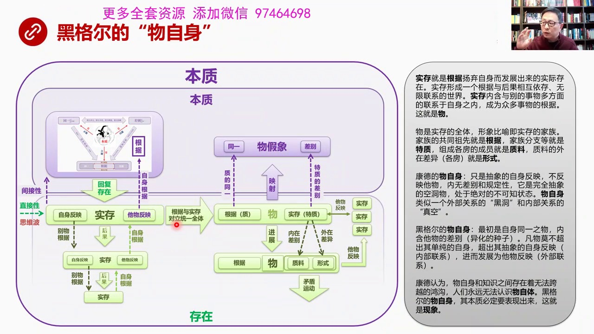

從根據中誕生了一個時存而這個時存實際上會派生出一系列的時存這就形成了一個時存的家族這就叫物那麼黑格爾它提出的概念叫物資神這個物資神當然最早是康德提出來的黑格爾物資神跟康德物資神不太一樣而且黑格爾傾向於使物這個詞來表明它對物資神的態度首先我們來看這還是本質了一個邏輯框架之下這個邏輯層之下我們來看存在和...

<strong>Cleaned narration</strong>

> 從根據中誕生了一個時存而這個時存實際上會派生出一系列的時存這就形成了一個時存的家族這就叫物那麼黑格爾它提出的概念叫物資神這個物資神當然最早是
> 康德提出來的黑格爾物資神跟康德物資神不太一樣而且黑格爾傾向於使物這個詞來表明它對物資神的態度首先我們來看這還是本質了一個邏輯框架之下這個邏輯
> 層之下我們來看存在和本質之間的關係首先剛才我們已經說了同一和差異鬥爭的結果是根據根據回復存在就是母親生下了時存生下了孩子派生出了時存那麼這個
> 時候時存呢他無反應時存就是作為一個實際存在他就開始有他無反應了因為他已經生出來了他開始認知世界他有自己的屬性也有跟別的東西的屬性那麼他無反應
> 就是回到根據他跟他母親之間的聯繫他的自身反應定義了自己之外他還是別人的根據就是其他的時存他所生下了其他的時存會反應到他自己身上所以他又是其他
> 人的根據那麼其他人又會繼續派生這就會形成一個鏈條時存產生時存再產生時存然後他們的根據彼此連結在一起這就構成了一個從根據到時存一個龐大的體系這
> 叫這個體系的自我同一性那麼我們來看時存跟根據有什麼不同根據是在本質裡待著它是間接的東西剛才我們也說過了它是時存中所有東西都是間接性的而這個時
> 存呢它是在存在中的存在中所有東西都是直接性的因為思維波直接打到存在的東西身上好 這就形成了時存帶有自身反應和套套反應然後如果他進一步發展就是
> 他發展成一個家族這就形成了根據和時存對立統一會形成一個全體這個全體中間既有時存也有時存的根據這就進化成了物這個物是什麼概念呢這個物形象說就是
> 一個時存的家族那麼這個物很有意思你看它是根據和時存對立統一那就是它的根據是在這就是本質上的根據作為它的一個組成環節另外時存是它另外一個組成環
> 節那麼根據它的原始的根據是要這個其實是來源於本質本質上的根據所以它會像它會這個物本身也會像本質投射像放在一樣的任何一個就算東西都有自己的投射
> 反正它的根據它的根據反映在這是一種統一性所以它代表製的統一它的時存另外一個環節投射過去是代表本質的差別這個物的假象也是一種物的假象它的根據反
> 映在這是一種統一性所以它代表製的統一它的時存另外一個環節投射過去是代表本質的差別這個物的假象也是一種本質本質包括兩環節統一和差別所以它投射過
> 來時存投射過來是對應於差別的好這就有意思了我們來看這個時存中它包含特質為什麼因為這個時存不是一個人它派生出了三個甚至派生出了更多所以它時存的
> 特質是一種貪污反應反映到整個家族的情況所以它有家族老大老二老三的問題這些所有家族的這些人構成了這個時存的特質或者叫特質家族這些成員其實反映從
> 本質來看有的相同有的不同就是有內部內部的差別和外在差異內部如果內部有差別這些人這些這個時存被歸為治療那麼如果外在明顯有差異的內在本質根本就不
> 一樣了這就是形式這就形成了進化到了物的下個階段就是物包括根據和治療與形式那麼形式是一種貪污反應反映這個時存治療是反應時存的內容那麼治療和形式
> 是一種矛盾是一種對立和矛盾雙方共同這個對立產生了鬥爭的結果是發生矛盾運動這個矛盾運動就會祝發新的事件好如果我們來形象理解時存就是根據楊氣自身
> 發展出來的實際存在就是母親生下孩子時存形成了一個根據和後果相互一存無限聯繫的事件時存內涵與別的事物多方面的聯繫與自身之中成為眾多事物根據這就
> 是物它形成了一個龐大體系物是時存的全體形象比喻就是時存的家族這個物就是時存的大家族家族的共同祖先就是根據家族的分支就是特製組成各房的成員比較
> ...

---

### Slide 13

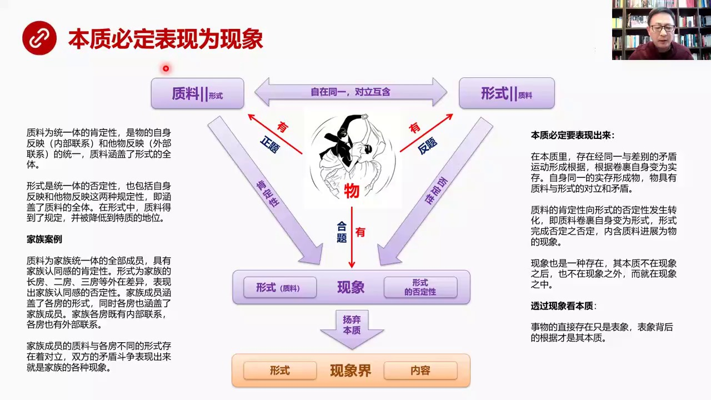

就是治療和形勢他們的矛盾所以物有治療物有形勢物有現象注意這已經不是事了改變成物了因為它已經實際存在了所以它就治療形勢和現象都是它的屬性了好治療和形勢之間治療中間內涵形勢形勢中間也內涵治療雙方對立而矛盾治療它是一種統一體就像家族統一體一樣它代表了一種肯定性家族內部是有凝聚力的對共同組織的認同所以它是物...

<strong>Cleaned narration</strong>

> 就是治療和形勢他們的矛盾所以物有治療物有形勢物有現象注意這已經不是事了改變成物了因為它已經實際存在了所以它就治療形勢和現象都是它的屬性了好治
> 療和形勢之間治療中間內涵形勢形勢中間也內涵治療雙方對立而矛盾治療它是一種統一體就像家族統一體一樣它代表了一種肯定性家族內部是有凝聚力的對共同
> 組織的認同所以它是物的自身反應它是一種內部聯繫它無反應外部聯繫的統一就像家族的臨時家族所有成員既有內部聯繫又有外部聯繫它是一個統一體而且家族
> 的治療成員這個治療涵蓋的形勢全體所有家族成員包含著三房三房這個外在形勢反過來形勢是統一體的否定性因為存在了三房三房之前有矛盾就會瓦解對家族內
> 部的認同性會瓦解家族的凝聚力所以這叫統一體的否定性它也包含自身反應它無反應那麼同時也涵蓋了治療的全體當然三房的總和就是全家族的成員在形勢中治
> 療得到了規定性並未降低到特質地位也就是治療把三房的組織起來之後每個成員都屬於一個一個房頭的屬下如果我們用家族這個案例來分析的話治療為家族統一
> 體的全體成員具有家族認同感的肯定性形勢為家族的漲房二房三房等外在差異表現出了家族認同感的否定性家族成員涵蓋了各房的形勢同時也涵各房也涵蓋了家
> 族的全部成員家族各房既有內部聯繫各房也有外部聯繫所以家族成員的治療與各房不同的形勢存在著對立雙方發生這個矛盾和對立的表現它一定會表現出來就是
> 家族發生了各種現象所以我們看到治療和形勢之間必然發生矛盾這代表它的肯定性形勢代表它的否定性代表物的否定性然後會碰撞結果會爆發出各種現象這種各
> 種現象包括什麼包括治療包括治療被捲果捲果在形勢之中然後還包括這種形勢的否定性怎麼來理解這事兒然後我們來看如果我們從這個定義中來看本質必定要表
> 現出來本質中存在經過同一和差別的矛盾運這個差別和矛盾的運動形成了根據根據捲果自身變成了十存十存就是生下了孩子自身同一的十存形成了物就是形成了
> 這個十存的家族物具有治療和形勢的對立和矛盾治療的肯定性像形勢否定性發生轉化從這兒像這邊運動發生轉化治療捲果自身變為形勢就是家族成員把自己捲果
> 在一起變成了各房大房三房二房的內部成員這叫治療捲果自身運動到的形勢那麼形勢發生這個完成了否定之否定內涵治療進展為物的現象就是三房中間包含所有
> 的治療包含所有家族的成員然後其實它會產生一種否定之否定就是對家族認同感的一種一種判離一種被禮所以它就會表現成家族內鬥的各種現象現象也是一種存
> 在其實本質不在現象之中也不在現象之外而就在現象之中這話的意思就說現象它是一種存在本質不在現象之後也不在現象之外而在現象之中就是我們看到的所有
> 現象本身就能夠就是這些現象本身就包含了本質在其中所以本質不在現象它的後面也不在它的旁邊也不在它的外面而就在現象之中這隻我們紅院有個同學畫的技
> 術曲線股票市場的技術曲線那就是一種現象而如果這句話是對的那麼這些現象就隱藏在這些本質就隱藏在現象的波形圖之中透過現象看本質事務的直接性就是直
> 接存在只是表象背後的本質是什麼是其根據所以我們研究在這個研究存在和本質這兩個層面的時候我們重點關心的是本質中間同一和差別所鬥爭形成了那個結果
> 根據只要我找到了根據我就能派爭出大量的時存這些時存就會形成家族就會形成物這個物內部分裂成了治療和形式而治療形式發生鬥爭就會發展成現象那麼在現
> 象中我們知道這是形式和形式的否定性為什麼叫形式否定性因為形式否定性就是內容主要這個內容跟治療就不一樣而治療的成員這叫治療分成三房之後進行鬥爭
> ...

---

### Slide 14

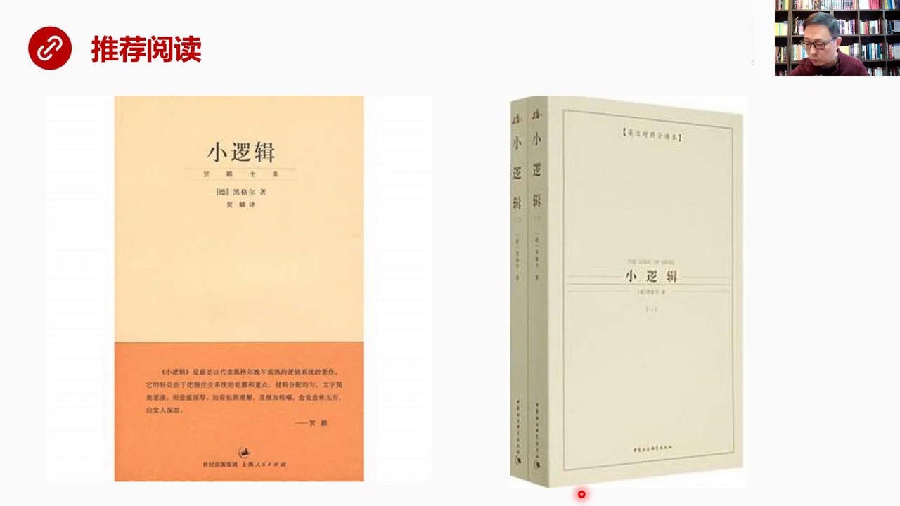

信息上太大而且邏輯抽象了這種思維會讓人的大腦攤換所以我們需要把本質化成為上下兩部分下半部分比上半部分要夥達多了所以我們得少少休息節省腦力之後推薦閱讀小邏輯兩本這個是赫林的這個小邏輯是中英對照的我兩本都看了我覺得赫林的翻譯帶有古文性質但是很傳神就是他翻譯的比較高度的凝鏈雖然讀起來有點繞但是習慣之後你會...

<strong>Cleaned narration</strong>

> 信息上太大而且邏輯抽象了這種思維會讓人的大腦攤換所以我們需要把本質化成為上下兩部分下半部分比上半部分要夥達多了所以我們得少少休息節省腦力之後
> 推薦閱讀小邏輯兩本這個是赫林的這個小邏輯是中英對照的我兩本都看了我覺得赫林的翻譯帶有古文性質但是很傳神就是他翻譯的比較高度的凝鏈雖然讀起來有
> 點繞但是習慣之後你會發現他真的是比較傳神所以這本說我覺得這是我反覆看了大概幾十遍不像幾十遍的一本書這個中英對照是當這本書有些概念我真的讀不懂
> 或者真的是讀不通的話再翻這本書查他的英文翻譯查他的英文原本從英文中去理解當然如果大家懂得文效果會更好好這就是我們上半當課的主要內容歡迎參加紅選打贏人生的貨幣戰爭

---

### Slide 15

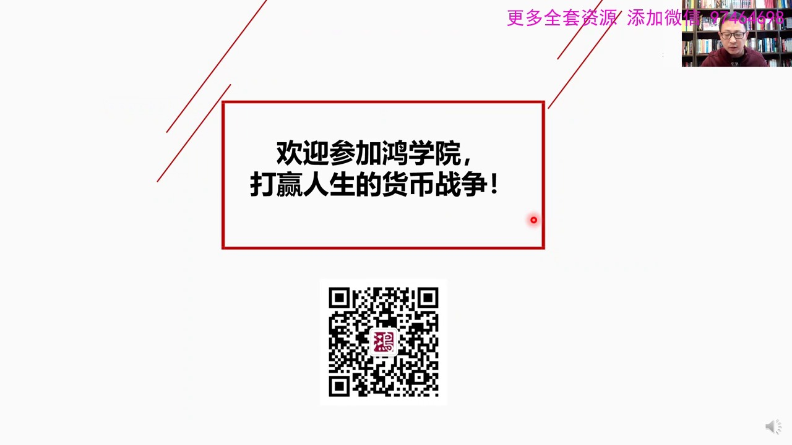

這堂課就到這裡謝謝大家

<strong>Cleaned narration</strong>

> 這堂課就到這裡謝謝大家

---

### Slide 16

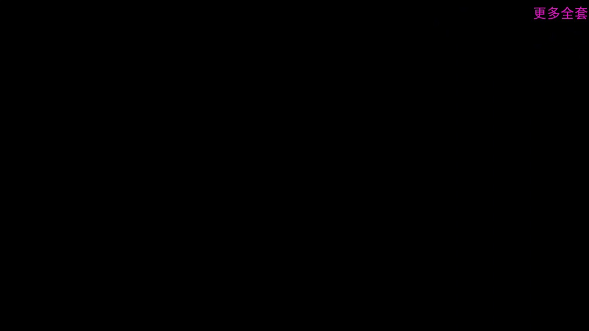

<strong>Cleaned narration</strong>

---
