# 核心课视频-85、86、87 - 黑格尔辩证法-本质论（下） — Detail Slide Notes

> **来源**：鸿学院核心课程  
> **幻灯片**：19 张

---

### Slide 1

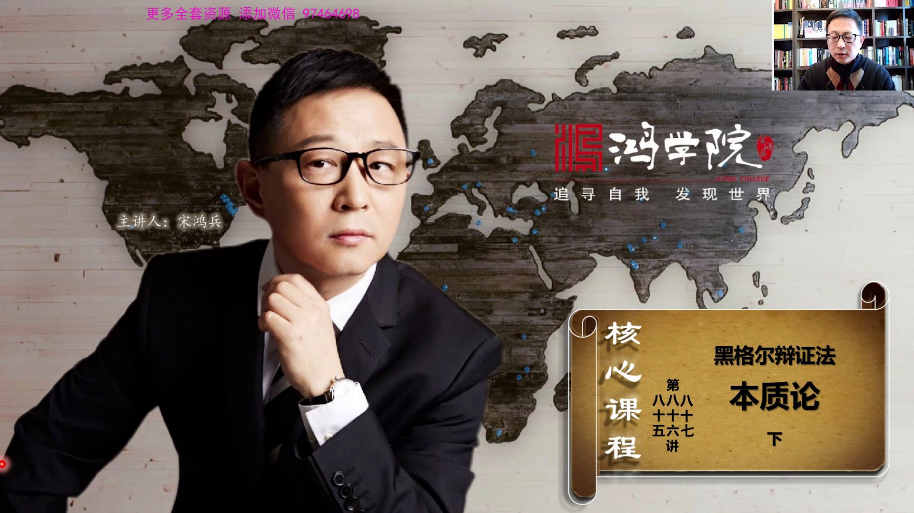

繼續講黑格爾編證法本質論的下半部分我們看畢業在上階課中我們談到了

<strong>All subtitles</strong>

> 繼續講黑格爾編證法本質論的下半部分我們看畢業在上階課中我們談到了

---

### Slide 2

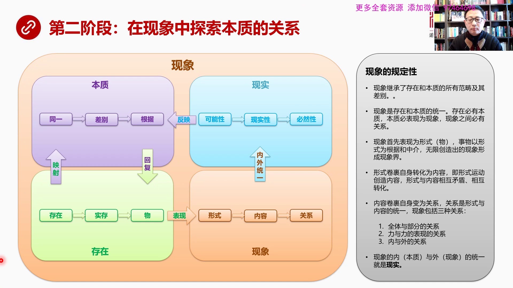

本質論的第一部分那麼我們第一部分主要講的是存在和本質這一塊今天我們重點講現象和現實講這次我們先來大致回顧一下上階課的主要內容上階課我們主要講的是第一階段存在和本質之間的關係存在是硬設在本質之中的就任何...

<strong>All subtitles</strong>

> 本質論的第一部分那麼我們第一部分主要講的是存在和本質這一塊今天我們重點講現象和現實講這次我們先來大致回顧一下上階課的主要內容上階課我們主要講
> 的是第一階段存在和本質之間的關係存在是硬設在本質之中的就任何一個事務首先是處於存在的狀態那麼一切存在的東西都會有本質所以存在必然硬設在他的本
> 質之中這個硬設是一種用黑格爾話說叫反思性的關係就是像投射電影一樣把存在的事務投射在他自己本質之中那麼在本質中投射過來的存在是一種假象所以在存
> 在中的這種直接的統一關係在本質中體現出的是一種同一性的假象所以同一性中間本質的同一性中間他是天然含有義物的所以他不是一個純粹的統一而是在同一
> 中含有一個義物含有自己一化的種子也就是說在同一中隱藏著差別那麼同一和差別當然是一種對立關係這種對立關係會使同一向他的反方向對立面差別進行轉化
> 這就過得到了差別同一和差別相互的鬥爭相互矛盾最後的結果就是根據那麼根據形成之後他會回復到存在回復到存在之後變成時存所以現實中間的很多事物我們
> 說這個事物是存在的那麼他必然有他的本質在本質中經過同一和差別之間的對立和鬥爭形成了自己的根據那麼這個根據在回復到存在中變成時存那麼也就是說現
> 實生活中所有的我們看到的實際存在的東西都有自己的根據就算不是平白無故出現的而是有自己為什麼產生背後的原因那麼時存這是一個現象若干個這個時存的
> 時存的家族吧組織在一起就形成了物物我們可以列成是時存的家族那麼在物中他既有這個物自身的特性的自身的這種特性的反應也有跟外界其他地方的關係就是
> 物是一個既有內部關係又有外部關係的一個實際存在既反應自己也反應別人也反應其他事物那麼我們還說到康德搞了一個物自體黑耳對康德的物自體持一種批判
> 的態度是因為康德的物或者他的物自體對內各種聯繫是一種真空狀態對外是沒有任何的聯繫的所以說康德的物自體對外是個黑動狀態對內是個真空狀態那麼外部
> 的人永遠也不能認識物的本質這就是康德的物自體是一種永遠無法被認識的一個純粹的像黑動一樣的東西那麼黑耳認為不對他認為物自體他的特徵他的本質一定
> 要張顯出來就像上帝一樣之所以是上帝或之所以是這個物自體他如果不能張顯出來不能表向出來他就不是真正的這種上帝或者物所以黑耳認為物的內外聯繫就是
> 自身反應和套反應如果他有本質就是有內部的有外部的那麼他就一定會張顯出來這個張顯張顯到哪呢張顯到現象這就是我們今天第一個要講的重點現象也就是說
> 物帶有本質的物通過陽氣自己或者說把自己全國起來發展到的現象那麼在現象中首先存在的是形勢就是我們看到大牽世界的各種現象我們首先看到的是這些事物
> 的它的一種外表的東西或者叫表象層的東西這個叫什麼呢這叫形勢這個形勢實際上包含了存在和本質的所有的範疇也就是說這個形勢中包含著物的治療把它就是
> 這個形勢把物這個治療全國在一起發展成了現象的形勢而現象的形勢進行轉化會形成內容這就是形勢和內容之間的關係形勢可以轉化成內容內容也可以轉化成形
> 勢這個內容跟我們上階課講的物中間的治療是完全不同的概念如果我們按加足這個角度來理解治療在物中相當於加足了每個成員它的形勢相當於大防二防三防那
> 麼這個內容呢有了大防二防三防之後三防之間的所有活動生活工作各種各樣的這種活動創造的是內容所以這個內容不是加足成員的治療的概念而是這些形勢這個
> 三防之間的這種相互的影響和他們在社會中所做了一切的事所創造出來的內容我們一般人說到形勢和內容說腦子裡面想走表空犯就是文章它的形勢和內容而已實
> 際上這個內容包含一切任何東西只要你有形勢運動都必然會產生和創造它的內容那麼內容和形勢顯然就是一種對立和矛盾形勢和內容的東西不一樣雙方鬥爭的結
> 果由於它對立它就會產生矛盾進行所謂的矛盾運動最終的結果就是關系形勢和內容相對立最後產生是關系所以在現象中我們看到的是現象與現象之間的關系這是
> 我們研究了重點那麼現象和現象之間的關系實際上不要忘記它內涵了存在和本質的所有的東西繼承過來的那麼這種關系又分成主要幾個部分全體和部分這是一種
> 關係還有由它掩盛出來的立和立的表象這是第二種關係立和立的表象在往前發展就是內與外內在和外在這件的關係然後這些關係捲滾自身到了內外統一或者叫內
> 與外統一的程度把它捲滾在一起發展為現實所以我們今天首先講的是現象這個邏輯層面的事那麼也就是說在現象中探索本質的關系這個本質通過現象表現出來所
> 以現象之間關係實際上我們談論的還是本質的關係我覺得我們需要再次強調一下西方哲學它是從規定性入手就是我首先對所有事情進行規定我一旦規定就好像給
> 這個概念化了邊界那麼立刻就會產生界內和界外這種對立就是規定性就是否定性有了界內界外這樣的差別和對立事務就可以開始運動了所以矛盾是源於我給它化
> 了邊界這個是變成法中間非常經妙的一個思想它給了我們一種用邏輯來分析任何問題的抓手要沒有這個抓手你就沒法推理就沒法去解釋運動它內在原因那麼有了
> 這樣的思想方法之後它們把這種思想方法用在對抽象對於這個萬事萬物經抽象過程中要進行精確的分層比如說存在層本質層現象層和現實層就是四個層面我們上
> 課專門講到這種分析方法就好比是人工智能的深度神經網絡我們用神經網絡怎麼來識別事務或者怎麼叫怎麼來認知事務呢實際上神經網絡把我們認識過程化分成
> 若干個層面若干個邏輯層每個層面只專注於解決本層需要解決的問題也就是抓取本層的主要特徵一層一層一層的典型特徵抓取出來之後然後進行組合然後才能實
> 別出這個東西究竟是什麼西方的哲學我覺得跟這個人工智能智本上是一樣的我們看了任何一個存在的事務實際上黑格的哲學把它分成了若干層存在層本質層現象
> 層現實層當然未來還有概念層也就是說我們看到同樣一個事務我們並不是用眼睛直接去看這個事務而是首先用深度神經網絡把它切成五個層面存在本質現象現實
> 和概念在每個層我們專門解決專門實別它的典型特徵就是我中間化了一些主要的範疇然後每一個範疇不斷的就是每一層解決的自己的這個典型特徵研究這範疇解
> 決了抓出了典型特徵之後然後不斷的向後一層傳遞這個結結提高結結推進然後層層往後傳這個事我覺得人工智能網絡也好還是現在自然科學的所有方法也好其實
> 背後都是哲學的東西在指導這也是為什麼我們比如說中國為什麼沒有首先提出人工智能的深度神經網絡這種原理呢為什麼你沒想到呢是因為我們的文化基因中間
> 天然不習慣這種思維方式我們強調是綜合一個事務要綜合在一起看從老祖宗那個時代就這樣我們非常不擅長於把認識一個存在的事務分成若干層來認識或者劃分
> 成不同的階段然後用不同的邏輯層境抽象在每一層中間抓去典型特徵這不是我們擅長的我們的文化中沒有這一點所以由於我們沒有這一點其實從根本上限制我們
> 發展自然科學理論社科學理論經濟學理論和一切學科創造理論的過程其實是理論從本人來說就是認知一個事務對他進行有效的邏輯分層然後在每層中間進行有效
> 的典型特徵的體驗而怎麼體驗典型特徵呢就要構造非常有效的概念構造非常有效的這樣的一種推理體系然後這一層一層組合起來我們才能形成一個認知的思想大
> 廈這就是理論這就是為什麼我讀黑格爾這個本質論包括他的就是我們以前講過的存在論得到了最深刻的啟發好我們具體說現象本身那麼現象的規定性包括幾個方
> 面首先現象繼承了存在和本質的所有範疇極其差別我們可以把這個這幾層如果跌在一起的話我們可以想像成他的所有特徵被本質所繼承本質所有特徵現在被現象
> 所繼承未來現實將會繼承所有在他之前三個邏輯層中間的所有的特性還有現象另外一個規定性是現象是是存在和本質的統一就是存在本質和存在兩個兩個邏輯層
> 綜合在一起形成了現象所以存在必有本質本質必表現為現象現象之間必有關係這是他的第二條規定性還有現象首先表現為形勢因為他是誤轉化過來的就是我們首
> 先看到了在現象界首先看到是誤是具體的東西是他的外表然後事務以形勢為根據和中介也就是有了一個物之後他會不斷的掩聲其他的東西其他的東西在掩聲更多
> 的東西這就會無限創造出現象大量的現象越來越多最後這些現象組成的整體叫現象界還有一個規定性就是形勢捲骨自身轉化為內容就是形勢運動創造內容形勢與
> 內容相互矛盾然後相互轉化再下一條內容捲骨自身變成關係所謂捲骨就是所謂他用的陽氣我覺得陽氣這個詞對中國來說特別繞經過我很長時間的反覆者我們我就
> 用捲骨把自己捲在一起失去跟以前的就是以前有直接性你現在捲骨在一起之後失去直接性變成一種間階的東西這種就像滾雪球那個狀態不斷的滾動越滾越大但是
> 把內盒的東西越包越深不斷滾動不斷擴大的過程那麼關係是形勢與內容的統一現象包括三種關係全體和部分立和立的表現內和外的關係那麼最後是現象了內於外
> 也就是現象了本質和他的這個現象本身這兩者的統一就是現實就發展到下個階段了好我們看下一頁先說形勢和內容形勢我想

---

### Slide 3

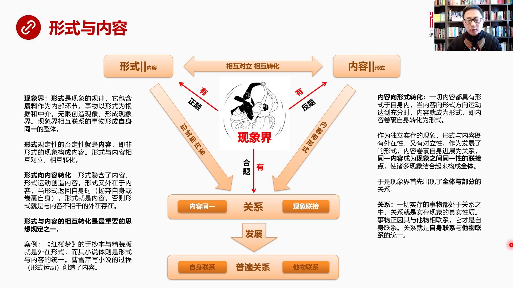

舉個簡單例子就是說咱們這個用紅龍夢作為案例吧紅龍夢這本書它是形勢和內容的統一內容當然就是夾使王削這幾個家族包括在以夾寶玉林在玉為核心故事所衍生出來了大官員中間的這些以夾寶玉和吉林士二猜他們所所共同發生...

<strong>All subtitles</strong>

> 舉個簡單例子就是說咱們這個用紅龍夢作為案例吧紅龍夢這本書它是形勢和內容的統一內容當然就是夾使王削這幾個家族包括在以夾寶玉林在玉為核心故事所衍
> 生出來了大官員中間的這些以夾寶玉和吉林士二猜他們所所共同發生的一些感情故事吧這是他的內容他的形勢是小說體所以當我們看紅龍夢的時候他實際上是內
> 容和小說內容和小說這種形勢的一種一種統一形勢是小說體內容是夾寶玉和林在玉的愛情故事好那麼我們怎麼來理解內容和形勢轉化呢其實我認為用創造可能更
> 為何事曹雪星在寫紅龍夢的過程他寫寫小說這個過程這是一種形勢在創造內容寫小說寫小說的過程就是在做形勢運動他是在一種小說的形勢在不斷創造故事情節
> 創造一種故事的發展創造悲歡離合所以形勢運動寫小說這個過程本身在創造內容這就是形勢向內容的轉化反觀來說也對因為他的故事情節越發展內涵越廣闊層次
> 越來越越來越清晰然後人物發展了邏輯越來越明顯這種內容越多反過來會強化他的形勢他會越來越知道我這個小說該怎麼寫我的形勢應該怎麼來展現是一個自我
> 強化的過程所以最後寫完了我們看到全書的內容這個愛經故事反過來也是一個形勢所以這是內容和形勢之間的關係那麼首先我們剛才從這個時存發展到物就是這
> 個存在到了本質從本質在回來回到存在然後從這個狀態轉化成了現象物怎麼轉化成現象物中間有治療有形勢是他的形勢捲滾治治療變成了物那麼當物拋棄了他的
> 或者叫揚起了他的本質進入現象界之後在現象中我們首先看到是外表就是他的形勢所以形勢是現象的規律形勢包含治療作為內部的環節事物以形勢為根據和中介
> 無限創造現象這就是現象界現象界之間相互的聯繫的事物形成自身這個自身同一的整體就是在現象界中間大量現象是有關系的是有聯繫的凡是有聯繫的這個東西
> 這一祖現象叫做自身同一的整體我們要注意這個西方爭議中大量使用比如說同一和自身同一這兩個詞這是什麼概念同一性講的是我就是我就是我自己跟我自己沒
> 有差別或者跟我完全一樣東西那跟我沒有區別這個叫同一性自身同一實際上我們舉個簡單例在理解自身同一比如說在全世界的範疇中在全世界這麼大個範圍中間
> 十四億中國人這個叫一個自身同一的整體因為他們都是屬於在中國生活的或者在中國出生的人那麼在中國人這個範疇中間在這些這麼多現象中間我們認為四川人
> 是自身同一的因為生活在四川地區的人說著四川話有一些共同的特徵四川人在中國這個範疇中他又是自身同一的那麼在四川中間成都人又可以叫自身同一因為都
> 是生長在成都這個地方有成都人的很多習慣性的思想方式和行為方式所以成都人在一個四川省了範疇之內或者在全中國範疇之內他也叫自身同一的一個整體那麼
> 成都人中間有分成成華區、東城區、西城區每個小區的這些人也叫自身同一然後我們再具體到一個單位的所有同事叫自身同一的整體我們在研究這個單位的時候
> 把這一群人當成一個整體來研究這叫自身同一再具體我們說一個家庭也是自身同一的當我們把範疇所有人那麼我們說人體之內呼吸系統是自身同一的血液循環系
> 統是自身同一的所以我們可以看到從最大的世界層面依照最小的人體的內部都可以在不同層次上說某一個東西是自身同一的所以自身同一就是一組現象有內在關
> 係或一組東西有內在關係我們把它做一個整體來研究這叫自身同一所以在這個黑耳數中大量使用自身同一在不同的層面他說的是不同的事我們一定要有這樣的一
> 個基本認識那麼形勢規定形勢規定性的否定性就是內容注意啊形勢跟我們上一課講了治療在這就不是一個概念了因為治療被形勢絕果在之中了現在形勢它的對立
> 面是什麼是形勢運動創造出來的東西是寫小說過程中創造出了故事那個故事叫內容或者叫我們在人生中你每個人生發展階段做了很多很多具體的事那些事叫內容
> 是你人生的不管你是從事比如說有些人在房間工作有些人在其他這個IT行業做在大廠做等等你只要這是一種外在形勢你在哪裡工作但是你這種工作所創造出來
> 全部的生活生活內容學習內容工作內容都叫內容從形勢和內容我們再次看到東西方對於事物進行邏輯抽象分層的這種能力的差異一般我們看了一個東西是把他當
> 整體來看比如說紅了夢我們很少會把它分成小說體和小說體中間的內容把內容抽象出來把小說體給抽象出來我們一般不這麼幹因為這不符合我們的思維習慣我們
> 不善於進行邏輯的抽象和分層但是你看如果你有了對於形勢和內容的一種非常清醒的邏輯分層這樣的習慣的話你會在很多方面進行發揮你比如說在IT行業吧I
> T行業有一個文件的形勢叫XMILXMIL是什麼呢是一種它其實是把形勢和內容做了區分XMXMIL這個文件包含包含那是具體的內容而另外它有一個詳
> 細解釋或者叫定義它的格式的XSD這個文件是專門定義XMIL中間內容的表現形式所以你會看到XMIL這種格式的發明其實在很大程上就體現了形勢和內
> 容背後的哲學理念所以我們看到你到外國網站上去下載數據的時候那些數據其實就是純內容就是中間到號無限這個一大片數據連在一起但是它同時給你提供XS
> D這樣的文件格式你只要有了這樣的文件格式不管這個內容內容量有多大不管它肉眼看起來多麼複雜但是這個格式可以把它解讀成非常優美非常清晰的你把兩個
> 結合在一起就可以看到一個非常優美非常清晰的內容的表現這種就是在科技領域在互聯網領域在技術領域中形式和內容的具體表現那麼形式向內容轉化形式是隱
> 藏了內容的形式運動創造內容但是形式有分兩種一種是形式和內容可以相互轉化的還有一種還有一種形式是完全外在於內容的相互轉化也就是說當形式一開始它
> 就內涵了這個內容比如說洪龍孟小說說它這個小說體一開始就隱涵著未來清晰的發展所以形式中是隱涵著內容的那麼內容在另外一側中間隱涵著形式我要寫甲保
> 育和林誕育來愛情我當然它不能是一個純粹的內容堆的那它必須要以一種小說故事對話和人物情節的展現人物性格的展現等等這樣東西表現出來所以這個內容腦
> 子內容我想到這個愛情故事其實已經有了相對應的形式作為隱涵隱涵的種子這兩者是矛盾的是對立的也是可以相互轉化的那麼什麼叫形式運動到了對立面之後又
> 返回呢因為黑格經常用形式返回自身形式返回自身是什麼概念就是我們看從這側形式端像這邊進行形式運動發展到了這側發展到內容的時候它在內容中在內容中
> 間突然找到了自己實際上這個運動過程到了內容它突然回到了自己這叫返回自身所以這個就是我們在讀黑格文字中間要經常碰到一些共同的問題形式運動到內容
> 就返回自身的意思說形式到了這側之後發現這個內容中內涵著自己的影子自己的種子到這就算回到了家這叫自身返回如果形式運動到內容這側根本沒有發現相自
> 己相對應的形式或者跟自己完全不同的東西它就回不來了回不來了什麼呢就叫純粹的外在形式比如說紅綸夢紅綸夢的手鈔本還是金裝本這是純粹外在的形式不管
> 它手鈔本是金裝本跟它的內容沒有天然的關係這兩者之間不會轉化也就是說曹雲寫的保育和待遇它的愛情故事跟手鈔和金裝沒有任何關係它這個內容中天然就不
> 含有手鈔本還是金裝本這種形式的種子基因就沒有所以當形式運動到內容這側它根本找不到自己的影子就回不去了這叫外在的形式或者叫不相干的外在形式那我
> 們來看內容像形式的轉化就是一切內容都具有形式於自身之內當內容像形式方向運動達到充分的時候內容就是形式比如紅綸夢最後寫完之後它的所有愛情故事體
> 現出來它完全就是一邊小說那麼作為獨立時存的現象形式與內容既有外在性又有對立性作為發展之後的這種形式內容捲過自身就進展為關系進展為關系是什麼概
> 念就是同樣一個內容或者同樣的內容成為各種現象之間的連接點同樣的內容是一個現象的連接點現象的連接點就是把大量不同的現象全部組織在一起這叫同一性
> 是內容的同一性當然這樣就出現了全體的部分之間的關系所以我們來看它從形式到內容從這個東西怎麽能推出全體的部分之間的關係它這個邏輯性在哪裡它在所
> 有的表達過程中都非常非常的強調這個現階關係或者說我在自己推到過程中我發現它每一次推到都能夠完美的符合整個邏輯鏈條的要求如果我們從這個框圖來看
> 有了這些基本概念我們再看這個框圖就簡單了形式內涵著內容的基因內容也隱藏著形式的基因兩者相互對立相互轉化形式可以轉化成內容內容也可以完全轉化成
> 形式兩者之間相互對立相互轉化我們可以把它想像成一個相互運動到了中間過程然後向下發展的關係兩者鬥爭的結果荒相互轉化的結果充分轉化之後就變成了關
> 係在這個狀態之下的形式就是內容內容就是形式所以它的三部無曲華爾茲我們可以簡單說現象界有形式現象界也有內容現象界有關係當然現象界大量現象之間必
> 有關係那麼它內涵兩個環節一個是內容同一也就是作為連接點我們所說任何現象之間的關係在哪裡怎麼體現為什麼這個現象跟那個現象有關係因為內容是一樣的
> 因為是同一個內容所以把大量現象連接起來就是內部自身反映這一塊是同樣的內容外部這一塊就是反映它物這一塊或是它物反映這一塊它是作為連接點把外部的
> 各種現象組織在一起這就會形成現象連接如果這個關係進一步發展就是普遍關係現象之間的普遍關係當然它包括兩環節就是自稱聯繫和塌不聯繫我在畫圖過程中
> 你比如說我這兒如果用白字的話表明它還是在一個過渡過程中或者在隱形狀態之下或者還沒有發展成這個階段的定形狀態所以我用黑底白字到發展到實體字的時
> 候到發展成最後成形的定形東西我就用黑體字來進行這個區別所以呢我們來看這種形在現象界發生的它這個推理過程是形式包括了捲掛著這個治療首先出現的現
> 象界出現是形式然後形式運動發生了內容然後內容和形式之間可以相互轉化然後這個牽唬轉化了一個充分轉化的結果就是關係就會發展成現象之間的關係什麼樣
> 的現象有關係呢只要是同一同一性內容了又同一同樣內容的東西就是相互聯繫在一起的這就出現了事務與事務之間的普遍聯繫那麼首先出現的當然是全部和部分
> 因為我通過一個共同的內容把所有的現象組織在一起那麼這是一個全體的概念全體概念中之中有一些是部分那麼部分跟全體就會發生現象之間的關係所以它第一
> 個出現的關係邏輯推理第一個關係是一種普遍關係中第一種是全體部分之間的關係那麼這個關係怎麼來理解的關係一切實存的事務都處於關係之中關於這個關係
> 我們中國人可能有深刻的理解我們說一切東西都要講關係但這個關係跟哲學的關係還不太一樣我們講的這個關係是人際關係哲學講的關係是一切現象之間的關係
> 那麼這種關係在我們日常生活中這種關係也是一樣比如說一個圈子的朋友大家一塊經常吃飯或者一個有共同愛好一個小圈子爬山巨了步維其巨了步或者洪選一些
> 同學經常聚會這些人的關係一定擁有一個同一內容作為連結點比如說洪選同學可能就是以洪選的內容作為連結點大家相互認識這個就叫這個所謂的同一性內容同
> 一性或者說地產大佬們經常聚會房地產就是它的內容同一性有了同樣一個內容大家才能聚合在一起所以同一內容作為關係的連結點是連結所有現象的而一切事務
> 其實都是處在某一個或者某一類關係之中你不是屬於地產巨了步的可能就是洪選的關係或者家庭的關係或者其他關係一切事務只要十存就必然處在關係之中關係
> 就是實存現象真正的本質是它是真實的性質一切實存一切現象必有關係事務正式因為與其他的東西有關係它才是自身的一種關係關係就是自身聯繫與他無聯繫的
> 統一這個就是所謂自身反應就是任何一個東西你一方面表現內在一方面表現你對外界的聯繫一方面是自我聯繫或者自身聯繫或者說明本質是一個什麼狀態當然你
> 同時還面向外部所以關係它的本質是自己內部的東西跟外部的東西它的統一自身聯繫和他無聯繫之間那種統一這叫關係好我們看下一頁在這裡我們要講一下一個案例

---

### Slide 4

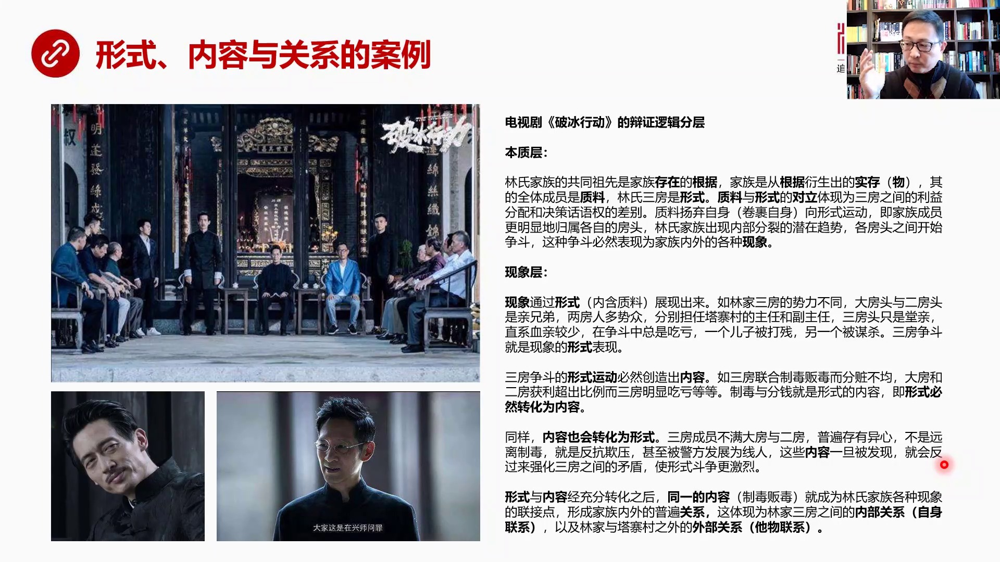

來怎麼理解形式內容和關係的這個三個概念吧首先就是我特別喜歡看這個破冰行動因為這個講的是米南的那種家族文化在現代社會中它到底是一種什麼狀態我覺得這個破冰行動這個米南人這個家族的觀念對於我們理解形式內容和...

<strong>All subtitles</strong>

> 來怎麼理解形式內容和關係的這個三個概念吧首先就是我特別喜歡看這個破冰行動因為這個講的是米南的那種家族文化在現代社會中它到底是一種什麼狀態我覺
> 得這個破冰行動這個米南人這個家族的觀念對於我們理解形式內容和關係特別有幫助特別直接特別形象比如說首先我們要理解臨時家族破冰行動這個臨時家族是
> 個範圖制度的這麼一個家族全村人都是零性分成大防二防三防然後都參與了制度範圖行動或者要絕大部分都參與了吧那麼這個片子展現的是一個家族的力量在制
> 度範圖這樣現代社會中制度範圖今天大暗中間所扮演的角色好如果我們來認知這件事認知理事家族的話我覺得我們首先可以從本製層首先把它抽象層本製層然後
> 再抽象層抽象層這個現象層還有當然還有現實層我們如果用這樣的思維方式來解讀破冰行動的話我們看這個家族應該怎麼來解讀本製層就專門提煉本製性的典型
> 特徵現象層就專門抓取現象層的典型特徵實際上用黑格的這個形式與內容還有包括他們形成的關係是可以非常精準的來理解這件事比如說在本製層我們在這個邏
> 輯抽象層上進行分析臨時家族的共同組先我們看上這個劇照是在他們磁堂裡頭宗磁裡頭臨時家族的共同組先就是整個家族存在的根據沒有祖先就不會有現在這些
> 人這就叫根據祖先就是根據沒有祖先就不會有子孫那麼家族就是從根據中從祖先中衍生出來的食存或者叫物那麼實際上是食存的組合也就是家族臨時家族的所有
> 成員那個塔债村大概有一兩萬人都姓林或者大部分都姓林臨時家族的全體成員就是治療我們這麼一想就把治療對上號了就是家族成員臨時有三房掌房二房和三房
> 他們就是刑事家族的所有成員是內容是這個治療而家族的三房掌房二房三房這是刑事治療與刑事它是對立的這種對立體現在什麼呢三房之間利益分配是不一樣的
> 還有決策話語權是有差別的那麼治療陽氣自身捲滾捲滾自身向刑事運動就是最後刑事包含了治療這怎麼來理解呢就家族成員最後明顯的分成了大房的人二房人和
> 三房的人本來我們是一個家族都姓林我們應該親密無見我們應該是是一個個體是原子對原子的關係但現在不一樣了由於我們出現的三房所有每個人都說我更多的
> 認同我是掌房的你更多認同你是二房的而我們對於臨時家族祖先共同了認同感會被我自認為是大房這個掌房會被這件事情所削弱大房二房的人他們彼此之間雖然
> 都姓林但是他們對於共同祖先的信仰會被我小團體的這種自我認同所削弱這就會導致內部家族內部出現潛在的分裂的傾向其實立朝立代自古以來吧你只要家族大
> 了最後總會走向分家為什麼就是因為大家族的認同感越來越弱而小家族的認同感越來越強這發展得最後一定是分瘋了一些各房頭之間由於自我認同感越來越強化
> 成大房的人二房的人就開始名稱暗鬥了這種鬥爭必然表現為家族內外的各種現象這是本製層我們談到的存在根據實存治療形勢最後這一切都是在本製層在這個邏
> 輯從中談談了各種關鍵的範疇然後它的運動形勢運動規律是發展到現象到跳從這個層跳到另外一個層到了現象層到了更高的一層本製層是在更下再往下是存在那
> 麼在現象層呢現象就是我們看到家族內鬥的各種現象首先是通過形勢表現出來的因為形勢內含著治療就是各房的房頭各房大房二房三房包含著它大房二房的所有
> 的成員然後來展現出來了就是首先通過形勢三個房之間的鬥爭來展現比如說這三房的勢力是不一樣的大房頭和二房頭他們兩是親兄弟這位中間林耀東還有他的弟
> 弟他們兩是親兄弟這兩房的人特別多人脈比較就是他的血脈比較發展的試頭比較好所以人多事蹤是眾分別擔任塔寨村的主任和副主任三房呢這個站在這兒呢這哥
> 們呢只是一個唐親唐表弟直系血心三房最弱所以在鬥爭中總是吃虧他的一個兒子被打殘了另外一個兒子被幹掉了三房的爭鬥就是現象的形勢的表現就是三房爭鬥
> 一定要通過現象來表現這個現象首先就是我們看到的三房的勢力不一樣三房這個中間大房和二房很強大三房比較弱小這是我們從形勢中能夠看到的東西那麼三房
> 鬥爭這是一種形勢運動就是三個房三房就是一種形勢三房爭鬥就變成了形勢運動形勢運動必然會創造內容比如說三房聯合制毒泛毒這就是一個運動創造的內容但
> 是分章部軍大房和二房獲利比例超過三房三房明顯吃虧所以我們來看形勢運動創造內容怎麼來理解就是三房制毒泛毒分錢這都是形勢運動創造出來的內容也就是
> 形勢必然轉換為內容或者形勢創造內容但是反過來也一樣內容也會轉換於形勢三房成員不滿大房和二房覺得老奢欺負所以三房的人普遍都有異心有些人遠離制毒
> 有些人反抗欺壓還有一些人被警察發展成現人所以這都是內容他的一種一種展現而這種內容一旦被大房二房發現就會反過來加強三房之間的矛盾讓這種三房之間
> 的形勢鬥爭形勢的這種表現表現出來這種鬥爭現象會更加激烈所以這些內容你所創造的內容也會反過來強化形勢這只是內容向形勢轉換形勢和內容經過充分轉換
> 之後同一一的內容就是制毒泛毒始終是三家聯合在一起或者有密切關係的同一的內容這作為一個連結點就成了林家內部各種現象的各種各樣現象都跟這個事有關
> 形成了家族內部的普遍關係然後體現成三房之間的內部關係這叫自身關係自身聯繫還有林家跟塔债村以外的外部聯繫這叫他務聯繫所以我們通過破冰行動林是家
> 族的三房來理解所有我們剛剛所講的黑耳哲學中間的相對應的概念我們可以找到非常非常精準的可以說是一對應的這種關係什麼叫形勢什麼叫內容什麼叫形勢轉
> 換生內容什麼叫內容轉換生形勢什麼叫兩者進行充分轉換之後發展成關係林家就是泛毒這個事是同一的內容然後三房之間不斷的鬥爭不斷的形勢轉換的內容內容
> 轉換生形勢然後就發展成林家對內和對外的土變關係所以這就是通過這樣的一個案例我們來理解剛才抽象的內容我們再看下一頁土變關係就是現實

---

### Slide 5

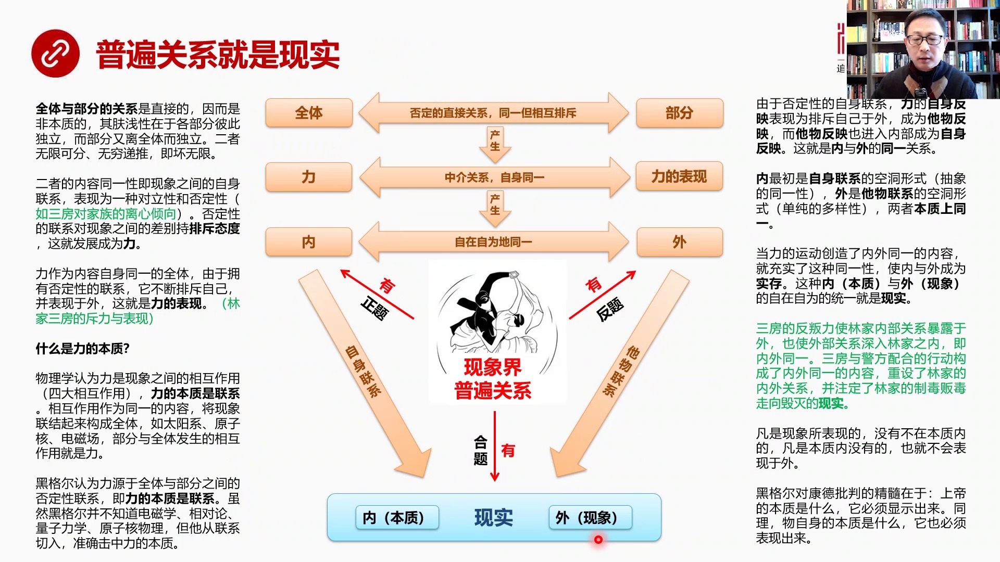

或者說現實的本質現實的最核心的東西這個現象中間最本質的東西其實就是土變聯繫土變聯繫就是一種實實在在的東西是一種現象中的現實情況我們來看全體和部分的關係這第一組關係這是一種直接關係當然所有直接的東西我們...

<strong>All subtitles</strong>

> 或者說現實的本質現實的最核心的東西這個現象中間最本質的東西其實就是土變聯繫土變聯繫就是一種實實在在的東西是一種現象中的現實情況我們來看全體和
> 部分的關係這第一組關係這是一種直接關係當然所有直接的東西我們上堂課講了所有直接的東西都是分本都是分非本質因為本質一定是間接的本質是硬設的所以
> 我們親眼看到了能夠直接摸到的東西絕對不是本質因為本質都是間接的而全部和這個部分的關係他直接他非常直接他一定是非本質的他的付錢性體現在各部分彼
> 此之間是相互獨立的而部分又跟整體是獨立的而且是可以無限細分的部分可以越分越小無窮地進這就是壞無限的典型所以第一組關係是全體和部分的關係全體和
> 部分他是一種否定性的直接關係雖然同一就是自身同一但是相互排斥怎麼來理解這個話臨時加足全體部分就是三方為什麼說他是否定性的這些關係呢他是有這些
> 關係都性零但是他的否定性體現在大防二防三防這種分法會對都性零這個臨時加足產生一種否定性就是我是大防的人時間長了我就指任大防臨時阻辭就慢慢的淡
> 化了再過若干年那大家就指任零藥都指任大防作為老祖先了再往上老祖先就被忘掉了所以他是帶有否定性的自身同一當然這是臨時加足這是自身同一的但是是出
> 現了相互排斥部分和整體是排斥的大防二防三防跟臨時總的加足他會產生一種排斥效率就是自我認同感不太一樣了所以我們來看兩者內容同一就是現象之間的自
> 身聯繫表現為一種對立性和否定性比如說三防對加足立性離德否定性的聯繫對現象之間的差別持一種排斥性的態度這就會發展成立我們剛剛所說了這種部分和整
> 體之間三防這個形式三防的部分和整體之間會有一種離心力離心離德的力量時間長了他就會分裂大加足就會變成小加足小加足再發展的大加足然後再分裂所以部
> 分和整體之間存在著排斥力這就出現了一個哲學概念的力所以權力和部分相互之間的這種關係必然會產生力我們現在說的力一說到力我們腦子在想的是物理學定
> 義中的力其實從哲學角來說整體和部分之間的相關關係就會派聲出力來那麼力呢他對應的就是力的表現因為力我們怎麼看見力力必須要通過外在形式表現出來必
> 須要通過一定的形式表現出來那麼力他也是內容自身統一的一個權體所有的物質都會有某種力的關係或者都會有力不管你是什麼樣存在你只要是存在的物體都會
> 有力所以所有有力的有力的內容統一的這些整體由於有一種否定性的聯繫這個力就像我們剛才所說整體排斥部分部分排斥整體一樣力由於是自身統一的這個權體
> 但是他有否定性的聯繫他會不斷地排斥自己並表現於外這就是力的表現比如說我們剛才所說的三房跟林氏家族這件關係他有排斥力或者要有他會有離心力這個離
> 心力是會通過各種各樣的現象表現出來了比如說這個剛才說電視劇面三房表現出來的這種排斥力的表現形式是跟警方合作做警方的內線這就是一種力的表現是一
> 種排斥產生的力以跟警方合作作為表現形式這就攝影到什麼事力了因為物理學認為力是什麼力是四大作用這個四種相互作用比如說強弱相互作用這是兩種還有電
> 磁相互作用還有外有引力我覺得我們同學中有人寫作業也在探討力的本質力的本質究竟是什麼這個問題確實很抽象我們想力我們是知道有摩擦力有各種各樣的電
> 磁力也有各種各樣的引力然後燃燒爆炸也會產生力的作用但是這個力的本質究竟是什麼物理學提電出來四大相互作用無外乎這四種那麼這種四大相互作用說刷到
> 底是什麼力的本質是什麼力的本質當是聯繫了如果沒有兩個事務如果沒有事務之間的相互作用就不會存在力呀所以沒有聯繫就不會有相互作用就不會有相互作用
> 沒有相互作用就不會有力說到底力的本質是聯繫相互作用其實就是哲學中的同一內容由於我們相互作用產生了同樣的內容然後把現象連接成了一個整體形成了全
> 體比如說太陽系太陽系九大行星圍繞太陽運轉這不就是同一的內容嗎這就要同一內容同一內容所形成這個整體就是太陽系太陽系之間的各個星球跟太陽之間的關
> 係和彼此之間的關係當然就會產生力比如說萬有引力它體現的形式就是一引力的形式體現出來的以行星運動按照軌道運動這個形式體現出來了比如說原子盒原子
> 盒也是一個同一的內容大家都是跟原子盒墊子而裡面中子制子一大堆它們所形成的也是同一內容同一內容把原子盒中間的內部的制子中子和外部的墊子這個作為
> 連結點把它連結在一起形成的原子盒當然原子盒裡面就有強弱相互作用還有墊子場墊子場也是通過同一內容墊磁力把所有跟墊子場相關的這樣的一種現象連結在
> 一起所以部分與全體發生這種相互作用其實就是力黑耳黑耳認為利源與全體和部分之間的否定性聯繫全體和部分這是否定性的它就一定會產生力這就是黑耳認為
> 利的本質是聯繫它所得出的結論跟物理學的結論其實是一樣的但是黑耳並不知道電磁學並不知道相對論因為它那個時代還沒有它比電磁學相對論還早了半個世紀
> 以上都不知道一百年以後出現了量子力學原子和物理等等所以作為一個19世紀初的人根本不知道二十世紀會發生這麼大的重大重大科學革命和技術革命但是它
> 已經從折潔上把握到了利的本質是源於聯繫這個是一個非常讓我覺得非常吃驚的地方我們再看由於是否定性的自身聯繫利的自身反應我們不要忘了利也是一種帶
> 有自身反應和塌無反應兩個重要環節的東西自身反應是反應自身套反應是反應外界一個反應自身聯繫一個反應自己內部的本質反應它跟外部世界之間的相互作用
> 那麼利的自身反應表現為排斥自己於外因為它有一種強烈的這樣一種這個勤力想把自己排斥在外面然後就排斥在外面它就成了什麼成了塌無反應而塌無反應也深
> 入深入這個東西的內部成為自身反應這就叫內外同意內在和外在是一致的它這個推理這段推理雖然我們一開始我讀書覺得非常抽象很難理解但你真正理解之後發
> 現這是一個巨大的飛躍和巨大的跳躍就是從利和利的表現從這兩個對立我們這全體的部分往這推邏輯上是推著過來的我們已經推過了利和利的表現是中介關係自
> 身同意但從利怎麼能推到內在和外在呢這個地方我當時看到的原文看黑格原文說我想了很久這兩指之間的邏輯性合在呢實際上它這話說起來比較奧口但實際上它
> 說了就是當利反應程它內在的東西和外在的東西是完全一樣就是自身反應和他無反應這兩東西話等號的時候這叫內外同意也就是家族內部三房和林家之間的相互
> 產生了這種排斥力讓它產生了一種跟外部聯繫也就是說它產生了要到警方那去做臥底這樣的一個衝動而且把它做到了這個時候你會發現實際上林家的內部關係變
> 成了外部關係外部關係也變成了內部關係就是它跟警方合作這件事情改變了林家的內外關係讓內外變成了區域一致狀態比如說它要幫警方去打聽消息實際上它就
> 成了警方的臥底這就把警方的外部關係引入到了林家內部那麼它一開始的原因這麼做的原因是由於受到這樣的一種跟林這個三房三房跟大房二房之間的矛盾擦擦
> 到外面去做這個跟警方聯繫這件事這兩件事情一旦同一了那麼內外關係就改變了內外關係外部關係進入內部內部的聯繫變外再化變成了外部理解到這一點之後你
> 立刻就會意識到立和立的表現最終會推出會必然推出內於外這就是這個這就是我用的一個三房這個例子三房反叛立是林家的內部關係暴露於外也是外部關係深入
> 林家之內這就叫內外同一三房與警方配合行動構成了內外同一的內容重設了林家的內外關係重設這個關係之後最後注定了林家制度範圍這件事情會走向毀滅的現
> 實當內外同一的時候其實就是現實所以我們來看它的這種原話表達當立的運運動創造了內外同一的內容內外同一的內容特別重要內容和形式這個轉化是整個變成
> 法中間的核心的核心就是內容和形式是立的運動創造了內外同一的內容然後這種運動實際上使這種同一性加強了使內與外都變成了時存這種內與外的同一就是現
> 實就是本質和現象同一在一起就是現實那麼按著黑耳話說凡是現象中我們這個現象所表現出來的我們看到的東西沒有不在本質內的凡是本質內沒有的也就不會表
> 現於外就是我們看到一切表象都隱含著它的本質而本質也一定會通過現象表露出來所以黑耳對康德的批判它的精采的地方最最精采的地方就在於上帝是什麼上帝
> 的本質是什麼它必須要張顯出來同理康德了物資體你本質究竟什麼你也必須要表現出來康德物資體是個黑洞從來不往外表現它只是把所有東西往裡吸或者讓外面
> 人根本看不到它它是個黑洞這怎麼能顯而黑耳認為只要你是這個物資體你就一定有內部聯繫和外部聯繫只要有外部聯繫內部聯繫和外部聯繫是密切相關的到了我
> 們說現現實這個程度兩者是內外同一的所以你的內部關係會通過外部關係展現給世人展現給外部大家都能看得到所以這個是黑耳對康德批判的一個最最精采的地
> 方那麼我們看到利益和利益的表現必然從羅教推出內和外的自在自唯的同一就是自身反應和他物反應兩者相同這叫內外同一內在的和外在的內在的關係和外在關
> 係實現了完全的一個融合狀態完全都一樣那麼這種情況就會變成現實就是自身聯繫就是內套聯繫就是外兩者都成了現實的兩個組成環節這就要現實現實的東西就
> 是內外都統一內在的自身反應和外在的他物反應兩者是一樣的這就叫現實所以來看整個這個框圖我們會發現他這個在在文字上表達非常奧口或非常會色的東西我
> 們用圖展現出來之後會變得非常的直觀容易理解三組關係是層層地盡的全體和部分的關係必然推到出利益和利益的表現的關係然後必然再往下推到出內外統一的
> 關係內的自身聯繫和外的套聯繫最終一旦相同就必然也變成現實現實就把內和外作為自身的環節包容在一起向前全國自身進展到了一個新的狀態這就是邏輯層的
> 越生我們剛剛所說的這一切都是在黃色這一切吧都是在現象邏輯層我們現在要往上奔一個新的邏輯層奔到現實的邏輯層我們看下一頁這就進入了第三階段了第三階段就是在現實中發現本質的必然性

---

### Slide 6

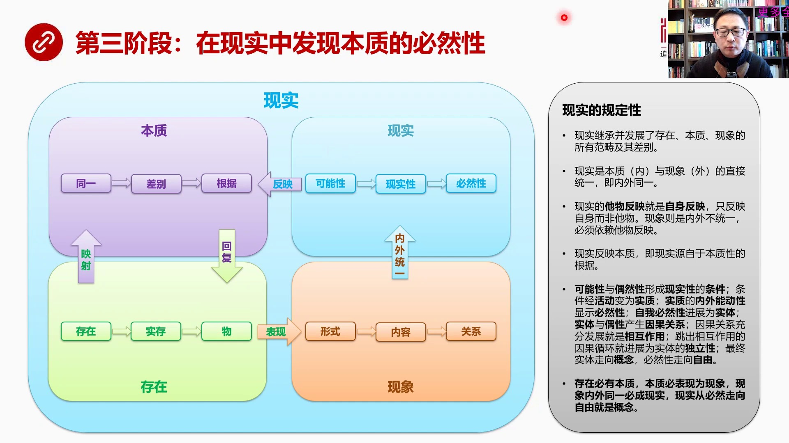

就是第三階段我們重點探討的是必然性問題這個現象這完成了三個本質的分析之後然後內與外同一了然後全國自身把現象捲在一起向前繼續滾動到了現實首先我們要記住現象已經果著本質本質已經果著存在這是一個夾心餅或者叫...

<strong>All subtitles</strong>

> 就是第三階段我們重點探討的是必然性問題這個現象這完成了三個本質的分析之後然後內與外同一了然後全國自身把現象捲在一起向前繼續滾動到了現實首先我
> 們要記住現象已經果著本質本質已經果著存在這是一個夾心餅或者叫監命果子包了四層的監命果子然後滾到現實的時候現實中了每一個環節我們說了每件每個概
> 念背後都包裹著現實也包裹著本質也包裹著存在這個是它的地規性要特別需要注意那麼現實同樣反映它的本質因為現實中間它裡頭有一層就是本質層那麼我在這
> 裡用不同的顏色帶著底色標誌著我們處在什麼樣的這個邏輯層裡頭那麼在相同的邏輯層面我一般都使用相同的顏色避免混銷保持顏色的高度一致性顏色高度一致
> 性對著邏輯層的一致性我們先看一下現實的規定性現實繼承並發展了存在本質現象的所有範疇極其差別這個就好比是一個繼承關係存在它的特徵被本質繼承了本
> 質所有的東西包括存在所有的東西被現象集成現在所有東西又被現實繼承了它是一個邏輯層的繼承關係現實是本質與現象的直接統一就是內於外的統一現實的毫
> 無反應就是自稱反應我們到現實狀態之後毫無反應和自我反應這個已經發生重大變化就是現實的反應其他的外部關係的東西其實反應是自稱那說明什麼現實中的
> 事物只反應自稱而不是他物它不關心他物了它已經到現實狀態了現象就不是這樣現象內外是不同意的所以在我們剛才在黃色的這個邏輯層裡面所有現象還必須要
> 依賴他物它的自稱反應還要反應別的東西現實反應本質即現實源於本質性的根據我們一切看的東西都要源於它的根據沒有它就不會有現實和現象所以現實它的一
> 切東西都會反應在本質上或者都反應本質上的根據現實從哪裡來的我這個現實我的源頭在哪裡我的祖先在哪裡我的根據在哪裡可能性與偶然性形成了現實的條件
> 這是現實中間討論的幾個重要的思想的範疇可能性現實性和必然性但是每一個這個每一個環節中間實際上都設立了不同的範疇可能性與偶然性他們倆構成了現實
> 現實性的條件條件經過活動變成了實質實質的內外能動性顯示出了必然性然後這還是外在必然性它在發展到自我必然性那就進展到實體實體與偶性產生英國關係
> 而英國關係充分發展就成了相互作用跳出相互作用的英國循環就進展為實體的獨立性從獨立性最後發展成一個最終狀態實體走向概念必然性走向自由所以歸納起
> 來就是存在必有本質本質必表現為現象現象內外同一必成現實現實從必然走向自由就是概念這是它的一個邏輯地勁的關係好我們看下夜現實的初始狀態我們剛才講了內外同一了

---

### Slide 7

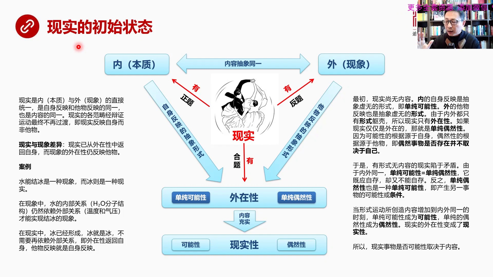

這是在現象層是在剛才較低的一個邏輯層上現象層內外同一了內外同一的原因是立在發生作用立在這個形式運動不斷在唱到內容然後充實了這個同一內容的這個同一性同一性的水位慢慢升高達到了內外同一就是內部的反應跟外部...

<strong>All subtitles</strong>

> 這是在現象層是在剛才較低的一個邏輯層上現象層內外同一了內外同一的原因是立在發生作用立在這個形式運動不斷在唱到內容然後充實了這個同一內容的這個
> 同一性同一性的水位慢慢升高達到了內外同一就是內部的反應跟外部反應是一樣的達到這個狀態這就變成了現實那麼現實的初始狀態我們假設這個水位還很低或
> 者還沒水就是只有形式而沒有內容情況之下那麼內於外是一個抽象的現實性是個什麼狀態現實是內於外的直接同一是自身反應和塌無反應的同一反應自身和反應
> 塌無是一回事因為塌無就是反應自身的而不反應其他的東西然後也是內容同一我們談到內於外一定是談到它的內容是同一的現實的各範疇經過變正運動最終不再
> 過度了不是你變成他他又變成他最後大家都不過度了即限制反應自身而非塌無就限制的東西它的對外反應反應的是它自己現實與現象是有差異的這兩個邏輯從差
> 異在哪呢現實已經不反應塌無了就是它的外在性反回的自身不再反應塌無只反應自己而現象的外在性仍在反應塌無舉個簡單例子水能階兵是一種現象而兵則是一
> 種現實已經階層的兵是一種現實在水能階兵還沒有形成兵的時候在這個現象中水的內部關係當然就是HRO分子結構這體現了水的自身就是所謂自身反應它就是
> 這樣的一個結構分子親和養就作為分子結構它就是親和養源你只作為這這種分子的內部結構吧它就是天然這麼存在的這就是我的自身反應但是這個自身反應仍然
> 要依賴外部關係就是外部的氣溫必須要低到零度一下氣壓必須要比如說政府零或者是海拔是按著這個海拔這個這個某個海平面的這個海拔海拔高度是零日的狀態
> 我們來折算大氣呀這個大氣呀在這種情況之下是零度那麼你就會接兵也就是說在現象中水還沒有接成兵的情況之下HRO分子結構必須要依賴它無反應反應外部
> 情況的這個東西必須要依賴它或者必須要對它就是對外部的東西要依靠外部的條件才能實現接兵這種現象但是在現實中呢情況不一樣現實現實中兵已經是兵了兵
> 就是兵我不需要再考慮外部的氣溫和氣壓我在討論兵的時候外部的東西已經不重要了我已經擺脫了外部性了外部外在性已經返回自身了它無反應就是反應自我所
> 以我不需要關注外部了這就是現實和現象最本質的差別那麼內和外一開始是內容抽象內外是同一的但是是一種抽象同一內就是內在的東西是什麼是自身反應的抽
> 象形式外是它無反應抽象形式這兩東西都是絕對抽象只有一個干殼只有一個外在的區殼那麼內它的抽象形式是什麼就是單純的可能性這個事物只有一個單純的可
> 能性它可以360度往各個方向都變化都可能因為它是抽象的絕對抽象的區殼所以它擁有任何的可能性外是套反應抽象形式那就變成了一種單純的偶然性因為偶
> 然性是外在的是決定於外部的而單純性這個可能性是決定於內在的就是性質自我這個所謂我們說內在的本質吧一個人的本質它具有360度全方位發展可能但是
> 由於外部的偶然性由於外部的這種限制使它本來可以發展成一個好人結果發展成壞人了主要此類的所以內在的東西是單純的可能性外在的東西是單純偶然性這體
> 現了現實的什麼體現了現實了外在性因為這兩者都是區殼沒有內容所以它只有形式從這個角度來說只有形式而沒有內容的我們稱之為是外在的因為內容是內在的
> 那麼這個框獨說明現實有內現實有外現實有外在性那麼我們來看怎麼來解讀就是現實如果還沒有內容的話一開始的時候現實還是空的沒有內容只有形式那麼內的
> 自身反應是抽象虛無的形式即單純可能性外的套反應也是抽象虛無的形式由於內外都只有形式的區殼所以現實只是一個外在性如果現實僅僅是外在的那就是單純
> 的偶然性偶然性我們第一次說到偶然性第一次過腦子的時候你會覺得偶然性不就是隨機嗎隨機不就是莫名其妙就變出來了嗎實際上在哲學中我們要想它最最深的
> 概念或者能夠提煉能夠把萬事萬物所有的偶然性給提煉從本質的東西是什麼實際上偶然性就是根源不在自己而在別人偶然性的事物它是否存在並不取決自己而取
> 決於別人這個叫偶然性我也是一開始在想偶然性的時候我覺得偶然性不就是隨機嗎隨機但是無法再把隨機性再往再往深去想看了這個小邏輯之後我覺得它中間所
> 有精彩的東西全部是在它支援片有之中全部是在細節之中可能性是源於內在的是自己決定自己的偶然性的事物永遠是取決於別人取決於外部它是否存在不決定於
> 自己而取決於他人這是偶然性的本質這比隨機性要深刻太多了隨機性我們就想不到決定它存在是否存在到底是誰決定呢我們不會查到這個方向想或者我們就好像
> 穿著救生衣無法淺水一樣浮在水面上而下不去我覺得把偶然性進行這樣定義是我覺得看到這時候突然就覺得把它的問題本質給抓住了偶然事物是否存在不取決於
> 自己這是偶然它最全部最本質的核心其他的外國描述包括隨機呀包括這個莫名其妙發生啊包括什麼這個所謂無歸歷性呢這都是它的表現形式而已於是有形式無內
> 容的現實它就現於矛盾了在這種無內容情況之下就是有形式無內容在這種情況之下現實是矛盾的因為它是內外同意的單純性是等於單純偶然性的這就出問題了因
> 為單純可能性它就是應該自存的因為我有我有向各方向發展的可能所以我應該是存在的但是單純偶然性這兩種也相等意味著什麼意味著它的存在不取於自己取決
> 於它物這不就矛盾了嗎所以干核情況之下或者叫抽象現實性是天然矛盾的反過來說如果說這可以畫等號那麼單純偶然性也是一種單純的可能性也就是說偶然性可
> 以變成另外一個事物誕生的一種條件或者說單純偶然性有可能會又發新的事物的出現就是成了新的事物的可能性這一點非常關鍵這兩者之間的等號就是內和外同
> 意所以引起的自身的反應和套反應必須相同這一點相當關鍵對未來的推理會起到重大作用當形式運動所創造的內容增加到內外同意的時刻就是我們知道形式運動
> 在現實中不斷在創造內容創造內容多到一定程度說水位上來了這種單純的可能性以前只有純粹的形式的可能性就會從單純變成真正的可能性偶然性單純偶然性也
> 會變成真正的偶然性現實性的外在性變成了現實性就是這回是真有可能出現了在沒有內容情況之下他是純粹的屈殼所以通過這個分析我們其實已經意識到我們說
> 一個東西是不是可能的我們不能夠空口把牙的亂說比如說很多情況之下我們看網上的很多文章就是大家會平白無故創造出很多可能性一個說中國這個中國革命如
> 果是在如果不往東北方向發展那就必然會失敗其實假設是一種可能例如這種可能性很多或者假設中國比如說在唐朝就有坦克了或者在宋朝就有飛機了將會把蒙古
> 打的西德華拉把療金把金屋珠他們打了一拜土地我們很多的文章很多的這種想法有一種可能性的一種這種絕對話或者把他想象上任何東西都有可能每一件事都有
> 可能我們可以說月亮今天晚上就會掉到地球上我們認為這也是一種可能在所有的腦洞大開裡面絕大部分腦洞大開的東西所說是可能性都是屬於這種意想天開的可
> 能性但是我們不知道怎麼補吃這個東西我們覺得你還不真不好你知道他是很荒謬但是你還真不好反駁為什麼因為你沒有理論分析的工具你沒有哲學的深度和配備
> 的思想武器你就無法反駁很多沒有論的東西實際上黑格爾的推論已經說了很清楚了任何東西的可能性是一種單純可能性在沒有內容的情況之下是單純可能性你說
> 什麼可能都可以但是反過來你也可以說一切都是可能的反過來我也可以說一切都是不可能的因為你沒有內容所以什麼東西是現實的可能性是真實能夠發生的可能
> 性取決於內容這就是我們其實對於很多東西會有一種理論性的一種反擊的工具就在於你明白了內容決定一切單純的形式不管用沒有內容只有只有這個形式的區殼
> 的話就會是一切的一切可能性都可能發生月亮掉了地球上這事靠譜嗎當然不靠譜怎麼反駁它因為你只有區殼你說是單純偶然性單純偶然性它的對立面就是單純的
> 不可能性你說了每一條可能性都我都可以反駁生不可能原因是你這種單純的可能性沒有內容單純偶然性也沒有內容所以這就是為什麼我覺得看了這個小邏輯之後
> 對於內容和形式這兩詞變了非常的敏感因為在往後我們看到在每一個邏輯層上都要用到形式和內容的轉化我們再看下一這就涉及到了可能性偶然性和現實性三個關係的

---

### Slide 8

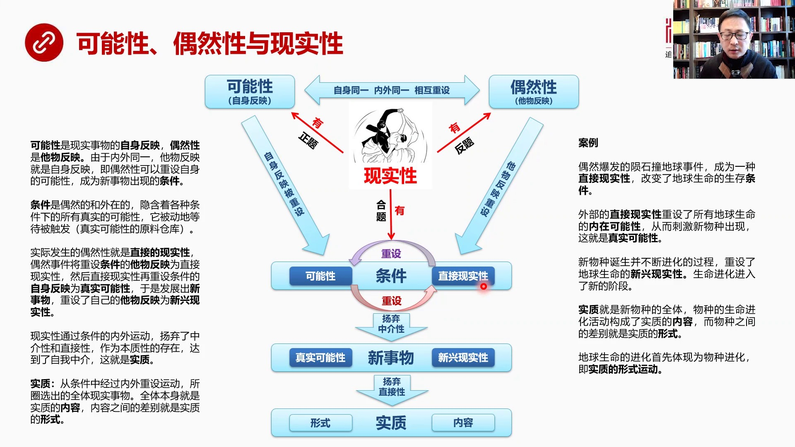

它的一種聯繫了可能性和偶然性可能性當然是自身反應是我自己有可能366全方位進化偶然性是他無反應反應外在的東西反應一種命運不掌握在自己手上這樣的一種外部的限制性所以可能性和偶然性他們自身是同一的因為任何...

<strong>All subtitles</strong>

> 它的一種聯繫了可能性和偶然性可能性當然是自身反應是我自己有可能366全方位進化偶然性是他無反應反應外在的東西反應一種命運不掌握在自己手上這樣
> 的一種外部的限制性所以可能性和偶然性他們自身是同一的因為任何事務包含在這個任何事務的屬性中它既有可能也有偶然所以它是一個自身同一的很多類似的
> 事務都可以組織在一起成為一個整體這叫自身同一它也是內外同一的任何一個在這個自身同一的中間的個體它們自身反應這個套反應是一致的是的話等號相互重
> 設這非常重要就是由於你是內外同一的所以你發生在一個事務上的現實事務中的內自身反應和套反應是可以相互重設的就是外部出現了一個套反應會被直接等於
> 它的自身反應自身反應也會反過來直接等於套反應所以這兩者之間這種戶社就會帶來震盪就會帶來循環我們一會會具體說到那麼現實性有可能性現實性也有偶然
> 性那麼這兩者相互運動它的結果是發展為條件現實性是有條件的就自身反應被重設它無反應這個套反應重設會導致自身反應被重設我們來看一下它的定義可能性
> 是現實生現實事務的自身反應偶然性是套反應由於內外同一套反應就是自身反應可以畫等號既偶然性可以重設自身的可能性成為新事務的條件這中間出現了一個
> 非常關鍵的詞彙這學概念叫條件條件是偶然的也是外在的引寒著各種條件下的所有真實的可能性它被動的等待被觸發我們可以把條件想像成一個所有真實可能性
> 真實可以發生的東西的一個原料倉庫原材料倉庫就是所有可能的和所有偶然的經過這樣的運動之後所形成的一個巨大倉庫這個倉庫裡面運寒著各種各樣的真實可
> 能發生的這個可能性它是源於內在可能性也源於外部的限制反應在一起就是真實的一個可能性的一個巨大的倉庫這就是條件當然條件就包括著可能性它們作為自
> 身反應也包括著另外一個套反應在這裡我們被智患成了或被重射成了直接現實性怎麼來理解偶然性永遠存在偶然東西出這個發生之後比如說小星星撞地球這就是
> 個偶然事件偶然事件就會時就會使它變成一個什麼變成一種直接現實性因為它已經發生了它是一種現實的東西了這種東西叫直接現實性它就會重射條件的這個套
> 反應這就是一個實際發生的東西是一個直接的現實性把套反應給設置了套反應本來是一個變量的話一開始是等於空的現在我給你設置了設置成直接現實性小星撞
> 地球了這事發生了雖然是偶然的但是發生了這個直接現實性馬上就會因為內外同醫馬上就會重射可能性可能性是單純的單純366進化都可以結果現在小星撞地
> 球好加護現實情況這個這個整個你360度的發展可能性就只剩下15度了或只剩下30度了其他進化路徑給堵死了所以直接現實性會重射它然後366度全面
> 發展的可能性被重射之後它就變成一個有線的或者叫真實的東西它又會反過來再重射塌無反應因為這兩個都是相等所以它會重射它它發生了變化之後內部這個可
> 能性發生變化會進化出去很多新的東西新的東西反過來又重射塌無反應就反應成了一種新的東西這種現實情況下一種新的現實條件所以這一個重射的循環會導致
> 條件這個殘酷中間很多東西被篩選出來或者叫圈選出來因為它是個圈子圈選出來洋氣中介性變成了新的事物直接現實性重射了內在可能性之後它就變成了一個新
> 的事物的可能性了它就可以發展成新的東西所以一定會誕生新事物新事物它的自身反應就是變成了真實的可能性而套反應變成了真實可能性之後重射直接進之後
> 變成了新興的現實性為什麼叫洋氣中介性就是現實性它是經過條件作為中介發展成了新的事物的現實性現在聽過通過條件的循環或者叫重射的循環它擺脫了對現
> 實性的依賴變成了新興的現實性然後新的事物在洋氣直接性就發展到了實質實質當然有內容和形式形式的內容我們再來輸理一下從文字上再給輸理一下剛才所說
> 條件是個殘酷這個概念非常的重要它是形成真實可能性的原料殘酷實際發生了軟性就是直接現實性偶然是將重射條件的套反應把它設置成了直接現實性然後直接
> 現實性再重射條件的自身反應為真實可能性它把它重射就變成了它於是發展出新的事物有因一把它內在可能進化的種子給改變了所以它就會進化出新的東西於是
> 發展出了新事物重射套反應為新興現實性就是新事物會把它的套反應重射成為新興現實性在全文中間黑格使中沒有用重射這種概念因為這都是後來發展計算機科
> 學之後大家知道變量可以不斷的重射所以現在我們如果用很多技術的數據來描述黑格的哲學反而變得更加容易理解但是在18幾年那是沒有這些技術進步的條件
> 的所以你很難用建的大家都理解的這種技術詞彙很準確的技術詞彙來描述哲學那麼現實性通過條件的內外運動就是內外的重射運動揚起了終界性和直接性作為本
> 質性的存在達到了自我終界這就是實質其實實質是一種自我終界的狀態不在於依賴其他的東西來作為一個就好像去終界或者要自我終界就是自己從自己就能創造
> 出一個新的自我而不再需要今首其他人什麼是實質實質就是從條件中經過內外重射的循環運動所圈圈出了全部的現實事務到了實質就是通過各種條件的重射圈圈
> 出了全部的現實的東西它已經是實在存在了那麼這種全部現實的東西就是本質它就是這個實質的內容內容之間的差別就是實質的形式這就是一道我們所說的本質
> 論中間一開始我們談到了差別是什麼差別這個內容之間的差別其實就是這個體這個個體跟另外一個個體它的差別在這體現為一種形式這個人和那個人不一樣這就
> 作為一種形式所以實質包含著形式和內容我們看一個案例來理解這張圖就會變得非常非常直接和清楚偶然爆發了隕石撞力球事件這是一種直接現實性發作了變成
> 了現實而且直接的它改變了地球生命的生存條件所以這個偶然事物通過重射地球生命條件的它無反應把它設計成直接現實性對地球造成重大影響外部直接現實性
> 重射了所有地球的內在可能性小心撞地球這個直接現實性重射了條件的全部內在可能性帶來了比如說流星帶來了巨大的粉塵遮天壁日陽光減少了等等等等這些生
> 命了內在條件內在可能性發生了巨大變化重射了當然這種重射就刺激了新物種的出現這種新物種就是真實可能性比如說大恐龍在一種小型撞力球的生態之下是無
> 法生存的但是不有動物崛起了不如動物人家本來就生活在像小老鼠一樣生活在地動裡在朱朱寄那個時代因為大恐龍太強的所以小號子們不如動物的祖先是生活在
> 地下的就像號子那麼的恐龍滅絕了生命條件就改善了它才從動力爬出來然後才獲得了進化的可能性因為競爭對手少了然後絕類植物也沒了現在變成被子植物戰獨
> 戰天下開花了結果了出現這種植物這都是一些巨大的這個由於生命重射之後改變了內在可能性之後出現了新的新事物的真實可能性新物種誕生而且不斷進化了過
> 程重射了地球生命的新興現實性看到了人類崛起不如動力崛起最後發展上人類然後再看到絕類植物沒了後來變成餐天大樹開花結果自然界變得越來越豐富所以它
> 就會重射地球的這個套反應把它設置成一個新興現實性於是生命進入了新的發展階段實質是什麼就是新物種的全體比如說你出現了不如動物出現了這個被子植物
> 以前沒有這些或者你以前幾個機梯不發達或者說處在潛在狀態新物種的全體就是實質被圈選出來的被大自然的競爭淘汰出來的剩下的東西就是新的物種的全體實
> 質就是新物種的全體物種在生命進化過程中形成了實質的內容你新物種人類出現了它這麼一發展一會發明火一會發明新世紀舊世紀一會兒修個草房一會兒去打獵
> 所有這些都是實質它的內容就是這種新物種所創造出來的生命的內容而物種之間的差別就是實質的形式所以我們再看到實質的形式和內容的時候我們首先想到這
> 是指著實質的物種實質當然就是物種的總和新物種的總和這是指著物種形上的差別這是指不同物種所創造出來的生生吸吸所創造出來的巨大的內容所以生命進化
> 首先體現為物種進化我出現的新物種不入動這就是一個首先出現的一個重大的變化那麼新物種出現它其實體現為實質的形式運動因為形式這個物種之間的這種差
> 別就是形式所以首先是形式運動形式和內容形式轉化成內容或者形式創造內容好我們看下一那麼這就發展到實質了實質能動性產生一種必然性

---

### Slide 9

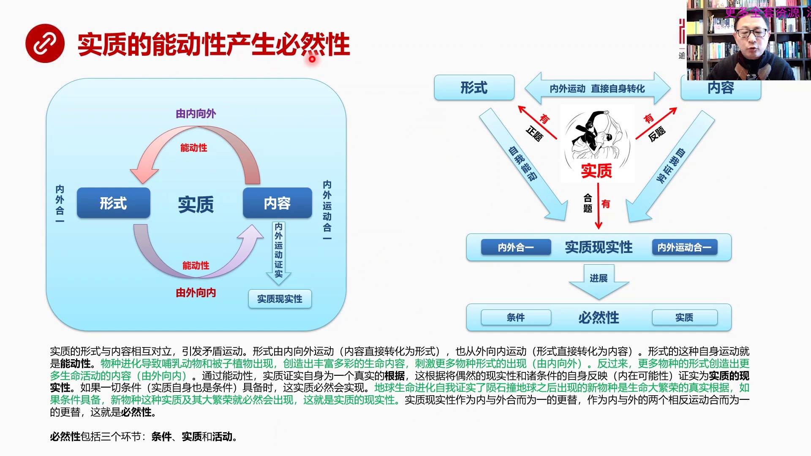

這個是一個特別需要深入理解的概念我們剛剛所說的形式產生的形式之後形式和內容會發生轉化首先我們看看形式和內容是怎麼轉化的形式和內容有一個非常有意思的轉化就叫有內向外有外向內所謂能動性這個概念我們經常看哲...

<strong>All subtitles</strong>

> 這個是一個特別需要深入理解的概念我們剛剛所說的形式產生的形式之後形式和內容會發生轉化首先我們看看形式和內容是怎麼轉化的形式和內容有一個非常有
> 意思的轉化就叫有內向外有外向內所謂能動性這個概念我們經常看哲學書特別是馬哲馬克思主義這套哲學書裡面大量使用能動性一個人是不是有能動性一個單位
> 一個組織每個成員都需要有能動性什麼叫能動性能動性就是源於黑耳對實質的實質中間形式和內容相互轉化中提出了一個概念形式和內容我們看到它會出現一個
> 油這個油內向外就是從內容內向外運轉到形式然後再從形式運轉到內容有外向內它會組成一個循環組成一個圓圈按著黑耳經常用圓圈這個詞一定要把圓圈這個詞
> 畫出來大家才能理解就是這種形式和內容轉化是一個圓圈形圓圈的這種形狀內容不斷轉化成形式形式不斷轉化成內容形式運動的這種於畫圈這個過程就叫它的能
> 動性就是形式必須要有這樣的運動方式必須要有這樣的運動方式和運動的意圖它才叫有能動性最後畫圈圈出來的內容就是實質實質的全體這些實質的全體它從內
> 容上來說實質的全體就是內容同時這個內容的差別就是形式所以它體現出來的是一個畫圈運動怎麼來理解這件事比如說我們看到從這張圖上來看實質這個它有形
> 式實質也有內容這兩者是進行內外運動所以這張圖是對這張圖的一種解釋形式和內容有內外運動而且是直接自身轉化實質有形式實質有內容然後實質有實質的現
> 實性形式運動表現出一種自我能動內容和形式之間轉化表現成一種自我證實最終形式和內容轉化運動的實質的現實性體現為內外合移內外運動合移實質現實性再
> 往前發展就是必然性包括條件和實質兩個組成部分兩個內部環節怎麼來理解這張圖實質的形式和內容是相互對立的相互對立就會引發矛盾運動然後我們看到首先
> 是形式由內向外運動形式運動開始了由內向外就是內容直接轉化為形式同時也從外向內運動形式直接轉化成內容直接轉化為內容形式這種自身運動就叫能動性我
> 們用剛才物種來解釋抽象這種話什麼意思物種運化了就是小心撞了地球之後帶來了博物動物帶來的背子之物的出現比如說博物動物和背子之物出現了這兩種新物
> 種就會創造出豐富多彩的生命生命內容然後自己出更多物種這種形式的出現這就是從內向外我們看到新的生命內容出現了新的生命內容就會導致新的物種出現了
> 新的物種包括什麼呢包括數你以前都是絕類的現在變成開花的變成了有綠葉的然後變成了那個有包粉有包子然後有了這個開花結果有果實它的傳播效率會一代比
> 一代強然後物種不入動物呢又發展出了從包括這個我們看到飛琴走瘦這些走瘦這一類吧然後一直到人類發展出了這麼多的新物種就是新的就是我們看到這個這個
> 雲石狀地球之後新的生命內容從內向外轉化成形式出現了越來越多的新物種動物的植物的海中的天上飛的越來越多的新物種出現了這是有內向外的形式運動反過
> 來更多的物種更多的物種就是更多的形式會創造更多的生命活動的內容就是從外在向內我有了更多的物種之後那這些物種的每個生物再去每個生命再去活動會創
> 造更多的生命內容反過來會使內容越來越多所以這個賺圈形式由內向外這就是新的生命內容不斷地放大擴大形式形式範疇讓物種越來越多而越來越多了物種反過
> 來再往形式方向就是從外向內運動又會創造越來越豐富的內容生命越來越多生命這個種類多了之後內容越來越多所以它是一個相互強化的作用還有一個並沒有強
> 調它的強化作用我在這裏要強調它是個正反虧機制越來越強所以這是我們對於這個實質實質的形式運動所進行了深入的這樣的一種理解那麼首先它體現成內外合
> 移就是內在的和外在是合移的同時又是內外運動的合移因為它是由由內向外由外向內的兩種運動的合而為一所以內外合移和內外運動合移就體現體現在這個實質
> 現實性再往前發展就是必然性那麼我們繼續看它的內容通過能動性形式的能動作用實質正實自己為一個真實的根據還有一個原話以此於一些毒是比較繞人的這根
> 據將偶然的現實性和珠條件的自身反應也就是內在可能性正實為實質的現實性如果一切條件具位也包括實質自己也是條件這實質必然會實現這就是必然性怎麼來
> 得及這句話綠色都是我的舉例和標註也就是說生命進化自我證實了與時撞地球之後出現了巨大的生命繁榮生命大繁榮說明什麼說明與這個與時撞地球之後出現了
> 這些心物種就是生命大繁榮的真實根據他自我證實自己我就是比如說不如動物出現證明不如動物就是生命大繁榮的一個根據所有現在我們看到大繁榮大繁榮都是
> 源於輩子植物和不如動物出現所以現在我們所看到自然界的一切繁榮景象都是源於心物種這就是通過能動性剛才我們說了物種和生命內容的這種轉化這就是能動
> 性實質證實自己為一個真實根據實質是什麼就是心物種心物種自己就是一個真實根據這根據將偶然的現實性和主條件自稱反應正是為實質的現實性所以我們看到
> 生命大繁榮的根據就是心物種如果心物種外部的各種各樣條件具備包括它內部條件具備那麼心物種這種實質極其它所衍生出來大繁榮就必然會出現看上面必然性
> 是這麼出來的必然性是源於能動性實質的能動性實質的形式運動由內向外由外向內這個運動證實了或者驗證了必然性一定會出現所以實質現實性作為內與外和而
> 為一的根體作為內與外兩個運動兩個相反運動的和而為一的根體這就是必然性我們在想什麼東西是必然的我們腦子就想到這個抽象者類概念或者我們自己去推理
> 的話我們往往深入不下去什麼東西是必然的我們仔細想像這個概念我能說任何東西是必然的嗎我為什麼不能夠深入去用手術刀一般的封立的思想工具去解剖必然
> 性呢是因為我們缺少這種訓練是因為我們從小缺少規定性及機箱反性這種最基本的邏輯訓練所以我們沒有刀沒有邏輯的解剖刀你就無法分析出什麼東西是必然存
> 在的必然性到底是什麼東西但是通過黑格一整套的推理從有絕對是有開始的從混沌一直推到必然想想中間經過了多少邏輯過程所有邏輯過程都延似合縫這是我們
> 文化中所這是我們傳統中我們的哲學中和我們文化中特別欠缺的也是西方得以決起最本質的東西所以要搞東方的衣服行我們一定要把這種工具學學透要吃透要熟
> 練掌握你不熟練掌握這個他最好的東西最精華的東西那怎麼能搞出更牛的更牛的東西呢所以我們來看必然性是實質他的形勢形勢運動所具有了能動性產生的一個
> 結果就是能動性產生必然性那必然性包括三個環節條件實質和活動好我們看下一頁那麼必然性的本質是什麼必然性的本質是自我必然性

---

### Slide 10

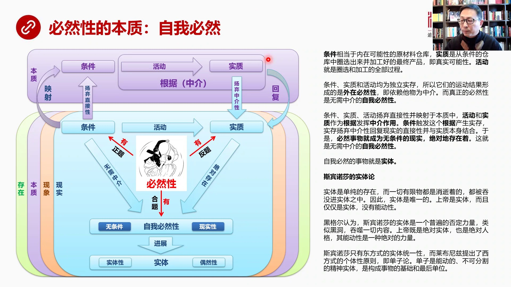

剛才我們所說的那種必然經過能動性那種必然叫外在必然性關鍵的必然性最重要必然性是自我必然性怎麼形成的條件相當於內在可能性的原始強調庫原材料的倉庫我們一開始說了條件是倉庫實質實質是從條件倉庫中圈選出來然後...

<strong>All subtitles</strong>

> 剛才我們所說的那種必然經過能動性那種必然叫外在必然性關鍵的必然性最重要必然性是自我必然性怎麼形成的條件相當於內在可能性的原始強調庫原材料的倉
> 庫我們一開始說了條件是倉庫實質實質是從條件倉庫中圈選出來然後加工好最終的產品最終產品是什麼就是真實可能性活動就是圈選和加工的全部過程用這張圖
> 來表現條件和實質中間是活動條件是倉庫活動把倉庫的免東西搬出來圈選出來之後經過金加工最後變成了實質也就是變成了新物種這些物種是經過活動、
> 簡選和加工出來的但是這麼一來這個東西是個什麼過程這三個環節必然性的三個環節全部都是獨立時存獨立時存就是我一個必然的東西還要通過獨立於外的它是
> 一種獨立於外的東西產生我的一種必然性不是自我出現的自我演化到這必然會出現的東西而是要依賴外部的這叫外在性所以他們是一種外在的必然性就是要依賴
> 它無為終界而真正必然性是無虛終界的自我必然性我們先看一下這張圖或者這種畫法這其實是把四個邏輯層面疊著在一起存在是在最底層然後是本質然後是現象
> 然後是現實所以我們要想像一個監命果則的話現實應該是包在外頭的存在應該是包得最核心的那麼在現實中我們一定要記住現實是繼承了它裡頭三層的所有的所
> 有的那種屬性所有的那些範疇和它的規定性極其差別現實全部繼承了就是現實既有存在的東西又有本質的東西又有現象的東西它全有所以它是捲果一層一層捲果
> 出來的這是我們建立的第一個概念第二概念是我們現在看到現實看到現實的問題中間我們要知道這個現實是會投射在本質中的就是本質在它裡頭現實是在我們這
> 個看著現實的地方但是現實的東西在本質中是有折射的是有硬射的包括現象包括現實包括存在在本質層中都有硬射所以這一段叫本質論這一點要首先明確那麼我
> 們看這種必然性首先必然性有條件必然性有實質然後條件到實質之間的簡選和加工就叫活動那麼條件和實質這種相互運動最後產生的一種合力或者產生了一個最
> 終結果對立鬥爭最後結果什麼呢最後結果是無需中介條件運動的時候把直接性陽氣了回拉的時候又把中間陽氣所以它是叫無需中介實質最後得出的結論是絕對存
> 在經過這一圈之後是絕對存在所以必然性就發展成了自我必然性無條件和現實性就是無條件現實絕對的存在者的東西就叫自我必然性這樣的東西是啥呢它就變成
> 了實體進入下一個新的概念層當實體性實體中有實體性和偶然性這就是我們以後要講到的關鍵是怎麼理解這一塊我們先來看一下文字條件實質和活動陽氣直接性
> 並硬設於本質之中這是我們看到條件活動實質在必然就在現實這個層面上但是不要忘了它是可以向它裡頭內層進行硬設的所以條件活動和實質都會在本質層中有
> 硬設這是一個硬設關係條件活動和實質那麼硬設關係中活動和實質這兩個合併在一起被稱之為是一種根據就是我們想到本質論中講到就是同一差別和根據這兩個
> 活動和實質構成的是一個根據根據起到的是中介作用條件是觸發的條件形成了通過根據起到的中介作用變成了一種實存實存在從本質中回到實質跟自己就是他的
> 頭影跟自己在從一結合在一起這就變成實質這叫回復回來國際上這個過程起到了一個非常重要的作用這是在邏輯上推導的時候是非常非常重要就是條件觸發了根
> 據之後產生實存實存陽氣中介性回復到了現實的直接性並與實質本身形結合於是這個必然事物就成了無條件的現實絕對的存在著這就是無需中介的作必然性這個
> 過程說明什麼問題首先我剛才所說了僅僅由這三個活動產生了必然性這個叫外在必然性因為這三個條件活動和實質都是獨立實存的也就是你一個必然性的東西要
> 靠外界獨立實存的東西作為中介才能夠得到那你叫什麼必然呢這不是一種嚴重依賴外部依賴別人嗎所以他的發展過程是需要有個去中介過程的去中介就是三者往
> 這頭射這叫去掉了直接性在本質裡面都是間接的然後經過條件觸發經過中介活動然後回到實質這塊就揚起了中介性在本質這個層面中揚起了中介性回到了實質這
> 就是整個的自我必然性運動了基本規律經過本質這一圈繞過來之後依賴這三個條件三個外部實存的東西的依賴性沒了變成了自我必然性無條件現實性這一塊其實
> 我們看到本質之所以繞人就是因為他大量使用了頭射硬射然後硬射活動經過了一圈活動之後回到現實回到現實中就把硬射中所發生的一些東西作為玩家的東西就
> 包括在自身中回來了所以以前的這一些具體的外在性的東西被包裹進來運動後完了之後又包裹又把這個本質中的東西包裹之後又運動回來之後一切的過往的東西
> 都包含在自我之中了它就變成了一種無虛中介絕對存在的自我必然性撤給理解這一點是需要大量號腦是需要燒腦細胞的但是你一旦真正明白之後才發現黑鬼的演
> 藝邏輯也相當的牛因為我們現在所說的變證邏輯很多認為變成邏輯不是演藝邏輯變成邏輯當然是高於演藝邏輯但是它的演藝邏輯它的公立也相當強大因為每一個
> 步驟是怎麼推出來這完全是靠演藝的所以小這個小邏輯本質論這個這個部分給我非常強烈就是以一個帶著一個變證思想高度人再做演藝推理的時候仍然是低水不
> 漏那麼自我必然東西是啥當然就是實體實體有實體性也有偶然性這是它兩個最重要的屬性那麼實體這個概念其實是源於斯賓諾沙的在黑鬼之前的另外一個哲學彈
> 牛斯賓諾沙認為實體就是單純的存在一切有限有限的這些事物都是會消失的都是不穩定的都是破碎的都是逐漸會被吞末進實體之中的因此實體是唯一的實體如果
> 是唯一的話那麼上帝就是實體而且僅僅是實體其實斯賓諾沙暗指上帝是沒有能弄性的它就是一個黑洞黑鬼認為呢斯賓諾沙的實體實際上是一個普遍性的否定力量
> 就是它把一切一切的關係都給摧毀了一些內容都給消毀了就像黑洞一樣吞是一切內容而黑鬼認為這個實體是不對的上帝既然它既是絕對實體也是絕對人格就是上
> 帝一定既是實體性又有能弄性它是有人格的它是能弄的是能夠進行內外循環的其能弄性是一種絕對性的力量那麼他認為斯賓諾沙所提出的實體論只是一種實際統
> 一論是東方式的東方式就是沒有個性了有一個巨大的實體那最後就是上帝所有的個體是不存在的來不尼茲最早提出了西方性的個體性原則就是單子論單子論就是
> 每個單子是能弄的不可分割的即使精神的又是帶有物質性的一種這樣的一種精神實體是構成萬事萬物的基礎和罪頭單位其實我們可以看到來不尼茲到黑耳他們這
> 個發展陷落中間就已經體驗出斯賓格勒在西方末洛中所講到那些最深刻的東西了比如說力量空間無限比如說個體性東方是強調整體性實體統一性沒有個體的概念
> 但西方的單子論為什麼西方人會提出單子論或者日爾曼人會提出單子論因為他們特別特別有一種個人以個人自我意識為主導的世界觀所以他要覺得東方都是統一
> 的實體那我個人怎麼放或者個體怎麼放這不行我一定要創造出一種新的理論來強調個體性所以東方社會西方社會一個非常重要的本質性區別就在於對個體性的強
> 調西方是突出極大的突出弱化極體性突出個體性而東方正好相反我們是強化極體性弱化個體性其實這種現象在歷史上一直存在包括我們看到了斯賓諾莎他是個猶
> 太人他提出來的這個實體他其實就是一個大實體統一實體而來不及一次提出了這個補充這個單子就是個小實體個體性的實體而且具有能動性那麼實體這個概念其
> 實是黑梗哲學中間非常重要的一個一個組成部分就是從實質到實體這有一個邏輯邏輯層的一個變化和飛躍我們一會再講到其實在現實中間在現實這個邏輯從中間
> 他又分成三個小的或者叫更細微的邏輯層就是層上再進行堆疊比如說現實就是最底層的基底現實之上的一個就是在我們在整個現實這個抽象界面上抽象邏輯層中
> 間他又分成基底層就是現實層比如說他專門探討可能性偶然性和條件然後在現實層上又堆疊出一個細分的脖子層就是實質我們剛剛所講的一切都是在實質這個邏
> 輯層上發現了都是在實質的邏輯層中所探討的比如說必然性的問題現在我們馬上要跳到另外一個邏輯層了還是細分的就是實體從現實到實質到實體這是在第四個
> 層面上又分成三個小的邏輯層所以我覺得我們在學習黑格的這個本質論說對我最大的衝擊和最深刻的印象是黑格的層這個邏輯抽象層的概念和他的強烈這種想法
> 是非常清晰的一切都要進行邏輯分層在一個層面上我討論的集中討論這個層面的典型特徵或者這個層面的這個概念和範疇他們的運動規律這一點是構造理論的最
> 核心的東西你怎麼進行邏輯分層層域層之間怎麼跳從這層跳到另外層這個轉接和跳躍是不是順暢或者在邏輯上是不是必然這是很高水平的比如說我們看到自我必
> 然性的東西就是實體這就是一個層級跳躍從實質層跳成到實體層我們看下一頁首先到實體層中中間

---

### Slide 11

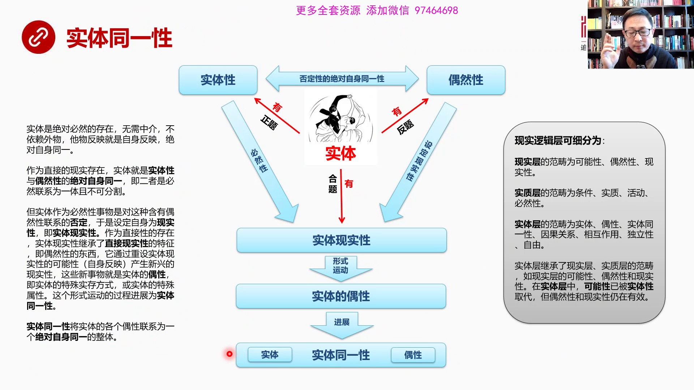

第一個概念跳上來之後第一個概念是實體同一性實體有實體性實體也有偶然性大家會覺得奇怪偶然性的概念我們不是一開始討論了嗎怎麼還會有這個概念呢還是那句話現實邏輯層可以細分為現實層實質層實體層那麼現實層討論的...

<strong>All subtitles</strong>

> 第一個概念跳上來之後第一個概念是實體同一性實體有實體性實體也有偶然性大家會覺得奇怪偶然性的概念我們不是一開始討論了嗎怎麼還會有這個概念呢還是
> 那句話現實邏輯層可以細分為現實層實質層實體層那麼現實層討論的是可能性有然性現實性實質層討論是條件實質運活動和必然性實體層它的範疇是實體偶性實
> 體性實體同一性還是英國關係相互作用獨立性和自由等等實體層其實繼承了現實層實質層的範疇比如說現實層裡面我們討論的可能性偶然性和現實性在實體層中
> 間繼承了這三個屬性但是可能性被替代了因為可能性我們已經進化成了必然性進化成了必然性之後又變成了實質實質又變成實體所以可能性被實類性所取代但偶
> 然性繼承下的屬性仍然有效在現實中仍然有效還有現實性也是有效的這就是繼承的邏輯和關係我們看看它的書中有大量這樣的跨越層面的一些概念有時候你如果
> 不從一個立體的更高的角度去看你不太理解它為什麼討論過這概念怎麼又出現了實際上你要理解它是一個多層級的層層繼承的關係以前的層面中討論的邏輯概念
> 在新的層次中有些被 override就被有些被重置了被重新寫了有些仍然保留仍然繼承著所以實體有實體性實體性當然中間就有一種必然性偶然性仍然存
> 在因為任何實體實體只不過是經過地球進化之後篩選出了心目的那叫實質實質又經過各種能動性的變化然後證明它是一個必然性的存在而且是自我必然性的存在
> 那不還是宇宙宇宙撞地球之後發生了結果嗎這個東西怎麼能逃得出未來發生了偶然性的變化呢當然逃不出來偶然性是個持久的永久的過程或者持久的存在實體也
> 不能逃出偶然性的魔爪所以在實體中間最困難的在實體這個概念中最困難就是實體性和偶然性被綁在了一起就是任何實體哪怕你是自身絕對必然產生的實體你仍
> 然要跟偶然性長期困擾在一起兩者是被困擾在一起形成了絕對自身同一性但這種絕對自身同一性帶有否定性因為實體性認為我代表必然性你偶然性就說你根本不
> 是必然性你的一切的存在要取決於外務那你當然不是必然的你是一個偶然的你把我一個必然東西跟你偶然對綁一塊就不難受嗎這叫否定性否定性的絕對自身同一
> 性繞不繞很繞想明白這個道理其實需要很長時間但是借助圖借助這個框圖可以使大家能夠快速的抓住問題的本質所以實體性中間是包含必然性的偶然性中間實際
> 上是設定現實性的就是與時撞地球這是一個設定的現實性變成直接現實性了那麼這兩者矛盾競化他會有鬥爭會有否定主意他已經不轉化了他實體這個階段已經不
> 自我轉化了不相後轉化了實際上就是設定了就是否定和設定的問題偶然性一旦發生了他就設定成必然性實體性他代有必然性所以這兩者運動的結果是實體現實性
> 他是一個現實的實體也就是說實體代有現實性主要現實性的詞這個概念也是從基底層繼承過來的我們一開始討論現實性中間就有可能性偶然性條件我們把這東西
> 繼承過來發展到這實體現實性就是實體也有可能也有偶然也有條件等等一樣所以實體現實性這個現實性是從基底層繼承過來的範疇這個實體現實性經過形勢運動
> 會變成或者叫運動道或者叫過度道實體偶性實體偶性在進一步發展變成了實體同一性實體同一性中間包括實體和偶性兩個組成環節怎麼來理解看看黑格聯文吧實
> 體是絕對必然的存在無需中介不依賴外務他無反應就是自身反應絕對自身同一這個我們剛剛已經強調過了大家都理解了作為直接的現實存在實體就是實體性實體
> 就是實體性和偶然性的絕對同一就是他們強行綁得了一起絕對自身同一但是是否定性的繼二者必然聯繫為一體而且不可分擇很難受但是不得不把我們一起而且沒
> 辦法分開但實體作為必然性事務是對這種還有偶然性聯繫的一種否定當然了必然東西跟偶然東西聯繫在一起他很難受然後他選擇了就是設置自身為現實性這就是
> 我們剛剛談到現實實體的現實性但是作為直接性的存在你既然是現實的實體具有現實性你就是一種直接存在了你又是被設定出來的那你就繼承了直接就是繼承了
> 他就繼承了這個直接現實性就是實際上我們講的直接現實性就是允實狀地球產生的偶然事件是一種直接現實所以他就繼承了直接現實性的特徵那就說明什麼還是
> 一種偶然的東西那麼我們來看這兩者的矛盾導致了他設定為現實性但現實性中間由於含有直接現實性這樣的一個偶然性因素而且這個偶然性因素他的形勢運動體
> 驗在跟他我們已經那張前面那張圖像已經講過了就是直接現實性會重射另外一個現實的另外一個他自身的一個內在的可能性他把他重射之後就會生長發一艘新的
> 事物就是宇宙就是我們剛剛所說的允實狀地球之後那些條件新的條件成了一個什麼呢直接現實性導致新的條件的自身發展了很多可能性被阻斷了被重射了然後就
> 進化出新的物種實力現實性在這發生了就是同樣的情況實力現實性經過這種形勢運動會產生大量新興的其他現實性這就是實體的偶性這個偶性這個詞上也是一個
> 從亞里斯多德那個時代一直到康德那個時代都在探討什麼是偶性偶性其實講的是實體的概念或者是實體的一個特殊存在的方式或者叫特殊的屬性偶性在很多人理
> 解就是屬性但實際上偶性也是一種實體那麼實體在形勢運動中會不斷的向自己的偶性過度或者叫進化這個過程這就是形勢運動的過程最後形成的是實體和自己偶
> 這個偶性實體的一個總的統一體這就是實體的統一性實體統一性就是一個實體向360度所有方向進展出自己的偶性實體那麼所有的這個實體和它的偶性結成一
> 個整體形成了統一性就大家是聯繫在一起的是一會兒實體統一性將實體的各個偶性連接為一個絕對自身統一的整體所以偶性跟實體的關係兩個都是實體實體向自
> 己的偶性是過度過去的是發展成自己的偶性那麼這種偶性我們可以理解成實體的一種它的一種屬性或者帶有一種特殊形勢的存在這就是實體和偶性之間的主要差
> 別那麼實體統一性它包括實體和偶性那麼這兩者之間是存在的對立和矛盾的這就進化到了下一步我們看下一頁這就出現了兩個實體的關係兩個實體的關係

---

### Slide 12

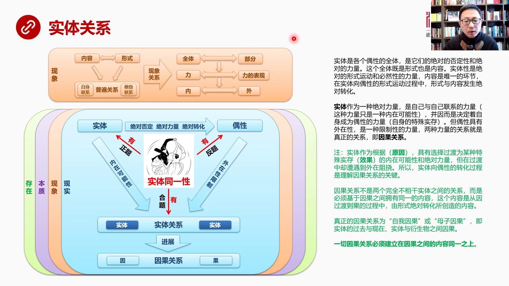

或者叫若干實體的關係這再次到了又回到了關這個關系這個層面關系層面是在現象界是在現象這個邏輯層的是在這層的這層所對應的現象之間的關係跟實體之間的關係就不一樣了現象的關係我們做一個簡單數以就是內容、形勢相...

<strong>All subtitles</strong>

> 或者叫若干實體的關係這再次到了又回到了關這個關系這個層面關系層面是在現象界是在現象這個邏輯層的是在這層的這層所對應的現象之間的關係跟實體之間
> 的關係就不一樣了現象的關係我們做一個簡單數以就是內容、形勢相互轉化最後形成普遍關係自身聯繫、
> 踏步聯繫這個現象的關係進一步進化變成了三個主要關係全體和部分立和立的表現內和外然後內外同一內外同一捲過自身發展到了現實現實又經過三步退遇三步
> 跳躍從現實基底層發展成實質層然後現在再到實體層我們現在是在實體層探討實體之間若干實體組成一個整體組成個這個實體層一性的一個整體每個實體跟他老
> 性之間這種運動這種變化會有什麼樣的規律或者說它是成像一種什麼樣的關係那麼我們可以從這張同仗可以看到實體層一性當然有實體有它的偶性也就是偶性實
> 體這兩者之間的關係是絕對否定絕對立兩和絕對轉化這話怎麼理解絕對否定實體進化到它的屬性或者進化到它的一個特殊形態這當然不是它的全部了因為我有3
> 60度進化的可能怎麼你就把我進化到那兒去了或者我決定自己往那兒進化但是這只是我360度可能中間的一個選擇所以我進化到那兒實際上對於是對我更全
> 面的可能性的一種否定這叫絕對否定所謂絕對在實際的層面我們可以直接把它翻譯成就是必然嘛它是一種必然的否定性當然用絕對這個詞我們容易容易把它想偏
> 了因為中國人對於絕對的理解不太一樣它又是一種絕對的力量就是它一定會轉化到自己的奧運一定會進化像奧運方向進化或者叫轉變它必然要做這個事那麼絕對
> 轉化呢絕對這種話是形式和內容的轉化因為實體它的全體就是既是形式又是內容所以它的形式向內容的轉化是絕對會發生的就是必然會發生的這三個條件使得實
> 體向它的奧運實體轉變過程中所必然會發生的東西而且它有一種絕對的力量去做這個事或者自我推動去做這個事但是偶興是什麼偶興是一種是一種代表外在的東
> 西你往366你往這個方向進化你就不能往其他方向進化那麼這個方向的確定實際上帶有外在性或者帶有一種限制性力量而我是絕對力量我覺得對力量碰到了一
> 種外在的阻礙這當然就很難受這兩種力量的較量就是關係就是實體的關係兩個實體的關係是什麼關係首先就是英國關係所以英國關係的推論英國關係整個邏輯推
> 導是這麼推出來了是實體和實體之間是實體向自己奧運實體過渡過程之中自己的那種必然力量受到偶興天然外在性的限制之後產生了一種效果這叫因和果是因實
> 體和果實體兩種力量鬥爭的結果我們看一下黑格爾是怎麼表述這個問題的黑格爾說實體是個個個是個個偶興的全體是他們的絕對的否定性和絕對的力量這個全體
> 既是形式也是內容實體性是絕對的形式運動和必然性的力量內容是唯一的環節在實體向偶興運動的過程之中形式與內容發生絕對轉化這是我剛剛已經說過了這一
> 切剛剛已經解釋過一遍了實體作為一種絕對力量是自己和自己聯繫的力量這種力量只是一種內在可能性因為它是360度可以全方位進化向自己的偶興進化因而
> 這個並因而是決定著自己成為偶興的力量就是我到底我自己有強大力量有絕對量我可以超360度所有偶興方向進化所以我能決定我成為哪個偶興我是有這個力
> 量的這個偶興當然就是實體的特殊十存也就是另外一個就是它的某種特殊狀態代表它屬性跟它屬性有關但偶興具有外在性是一種限制性的力量兩種力量關係就是
> 真正的關係這些還是表層的關係這個才是真正的關係這個真正關係是什麼首先就是英國關係注意啊這個地方我們需要注意實體作為根據就是它派生出偶興所以它
> 是根據也就是作為原因具有選擇過度為某種特殊十存就是特殊的偶興它是由選擇的這樣一種內在可能性和絕對力量這個它的偶興就是它的效果或者叫過實體英式
> 體格果實體之人關係英式體具有著全部內在可能性和絕對的力量過度到國就是像那轉化但在過度過程中卻遭遇到外在的阻撓就是這個偶興它具有外在性對它是一
> 種限制我是自我的必然的我有一種絕對力量我又可以自由選擇但是外面我怎麼會受到東西的干擾呢阻撓呢所以實體在向偶興轉化過程中它這個轉化過程是我們理
> 解英國關係的關鍵英國關係並不是兩個完全不相干實體之間的關係這一點是我們往往是我在讀小邏輯之前都沒有注意到的一個非常精細的差別我們說這個是英那
> 個是果這是英國關係我們腦子面從來沒想到從來沒想過這是兩個實體之間的力量較量我們從來沒想過這兩實體必須要內容同一就是英國內容必須要是一樣的否則
> 它就沒有英國關係我們亞哥就沒有意識到這個問題所以讀了小邏輯讀了英國關係讀到這段之後一拍大腿非常的興奮當然讀了很多遍之後才拍的大腿一開始拍腦門
> 因為想實在想過明白他這個表達什麼意思一會兒大家看了他英國關係的表達你也會暈但他講的實質就是這個實質英國關係必須基於英國之間擁有同一樣就是同一
> 的內容一樣的內容否則就不叫英國關係這個內容是怎麼來的這個內容是因到就是這個這個實體向他偶性運動過程之中由他的形式絕對轉化成他的內容就是他的形
> 式絕對轉化成內容這個內容是英國之間同一的內容必須的是同一內容如果不同一就沒有英國關係所以真正的英國關係是自我英國或者叫五子英國因為他們擁有這
> 一樣的同一的內容而兩個不相干的事是絕對沒有英國關係的什麼叫自我英國那就是現在了我和二十年前了我是一個實體但是存在的時間就是我從過去變成現在過
> 去的我是現在了現在我的原因我們都說性格決定命運性格就是你的英命運是你的果但是你還是你你是一個實體過去的實體它變成了現在的實體但是是同一個實體
> 這個叫自我英國母子英國是個派什麼關係是實體和它衍生物衍生出來的另外一個實體之間的邏輯關係或者叫力量英國之間的這個關係由於是母子由於是母子所以
> 你一定有內容同一性在裡面這就是我們理解一切英國關係的最核心的東西就是一切英國關係必須建立在英國之間的內容同一之上英國之間必須要有同樣的內容否
> 則就不叫英國關係好我們看下一頁我們來看一下英國關係圖實體的英國關係

---

### Slide 13

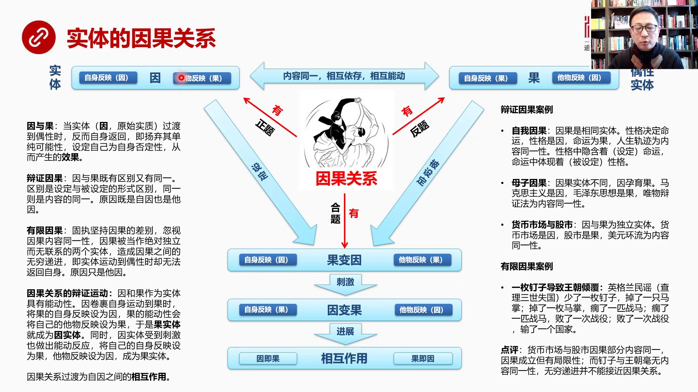

實體這是英實體這邊是果偶性是它老性實體英國關係有英英國關係有果但英國果之間是什麼關係首先因它在自身反應中第一自己是因它無反應中另一是果就是它有一個對立面它有一個跟它相依賴的果存在所以它設定自己為因設定...

<strong>All subtitles</strong>

> 實體這是英實體這邊是果偶性是它老性實體英國關係有英英國關係有果但英國果之間是什麼關係首先因它在自身反應中第一自己是因它無反應中另一是果就是它
> 有一個對立面它有一個跟它相依賴的果存在所以它設定自己為因設定自己為因就必然意味著它有個果它這個果在哪呢是在這所以它無反應是反應果那麼果也一樣
> 果是被設定是被它設定為果的所以它自身反應就是我的性質我貼個標籤我是效果我是結果但它的它無反應反應的是原因所以因而果是必須要依賴在一起的內容同
> 一這是剛才我們反不強調同時相互移存同時相互能動關鍵是相互能動這是理解英國關係的一個非常非常有意思的地方我們來看它是怎麼運動的因果關係因這個實
> 體向果的方向運動運動到果運動到果之後就是因變成了果它就會對果進行重設你比如說它把果這個自身反應因為它已經到哪已經到達果了之後它就會把果它的自
> 身反應這個標籤摘掉貼上它的標籤把這貼成因然後果也是個實體剛才我已經反不強調過黑格的實體是具有能動性的它會自己動它是主動的果一看你把我的標籤撕
> 了換成了因我也乾脆把我的標籤這個它無反應的標籤因我也換了換成果所以它的進化結果就是通過備設定之後變成了一個新的狀態就是果變因了當因運動到果的
> 時候果居然變成了原因因為自身反應它標籤變成因這是被它設的然後它設的它設成因之後果又把自己主動把自己的標籤也反這個反應它無的標籤也換了換成果這
> 就變成因和果這跟這個因和果是一回事所以這叫果變因運動到這這個結果居然變成了一個因實體就果變因變成另外一個實體了同樣由於這兩東西是自我同一的也
> 就是它們是之一它們是不可分的是這個內容同一的而且也是自身同一的它們兩分不了所以你在對立面中發生了變化這當然會影響到我因為你把自己設成了一個因
> 那我怎麼辦所以當你把自己設成因的時候我就得把自己設成果因受到它的刺激之後就會把自己這個因設成果然後把自己的果設成了因黑格爾在描述這段說非常非
> 常非常非常地繞因為它沒有用一種計算機 語言的這樣的一種模式把它做一遍兩個變量兩遍讓之間的互相重射而已如果你有這樣的思路理解它其實並不費盡但是
> 沒有這樣的思路黑格爾沒有學過計算機的變成語言那這個表達就複雜了這段你繞一個月就在這麼三五頁之中間繞一個月也不一定繞著明白它在說什麼其他說的就
> 是這張圖因果關係結果就是運動的結果是果變因在果變因情況刺激之下由於同一性導致因在變果那麼這就出現了新的一個關係相互作用在相互作用一說因就是果
> 果就是因這就發展到一個下一個關係好我們看看黑格爾是怎麼解釋它的原話是怎麼樣的絕對把大家獨飛了黑格爾說什麼是什麼情況之下實體是因是原因當實體也
> 就是作為一個原始實質過度的偶信時反而自身反回寄揚器期單純可能性設定自己為自身否定性從而產生的效果剛才我解釋了一遍之後大家對這句話讀起來你就讀
> 吧你讀了十遍二十遍你讀了十遍二十遍反過來頭來看你到這段還是會被卡住你不知道它的說什麼實體過度偶信反而自身反回這是什麼叫反而自身反回就是在因裡
> 面就是因過度這事找到了它自己它自己不就是它不反應嗎所以它到這它運動到國相當於回家呀但是黑格爾它如果話出來這話並不難以理解但是它不話我這天這話
> 讀起來就繞人了寄揚器期單純可能性當然你要運動到這揚器單純可能性你就把人家來這個就是把這個標籤給換了換成自己的標籤了把國國裡面這個自身反應換個
> 標籤揚器就是轉過自身到人家那把這個標籤給把別人給換了設定自身為否定性那當然你到這運動的時候你把標籤換之後國就變因了當然就自己就跟自己過不去了
> 自身否定最後產生了一個效果而且這個效果是現實的而且必然的就這麼跟意思這就叫因什麼叫因這就叫因實體運動產生的因那麼我們來看一下變成因果什麼叫變
> 成因果就是因和果既然有這個既有區別又有同一區別是設定和被設定的形式區別同一是內容同一原因既是他因既是自因也是他因就原因我剛才已經說自我的原因
> 它是自因也是別人的原因比如說派生出來也是另外一個東西的原因有些因果有些因果就是故制堅持因果的差別忽視因果內容的同一性因果被當成絕對獨立而無聯
> 繫了兩個實體結果造成造成什麼因果之間的無窮地進兩個就是實體運動到偶性時沒法自爭返回不斷的往前無限推進這就是壞無限的典型原因只是他因所有的原因
> 都沒有自因都是其他東西影響的變成這個因果的變成運動就是因和果作為實體都具有能動性因全果自身運動到果將果的自身反應受為因果的能動性會將自己的套
> 反應受為果於是果實體就變成因實體同時由於雙方是聯繫在一起的互相射的彼此互射的因實體受到了果實體的改喚標籤他這個受到他的刺激之後也會做出能動反
> 應將自己將這個因的自身反應設置成果將他無反應受設置成因就變成了果實體因果關係過度為其實這兩個是因實體的果實體是什麼都是因的對吧果變因和因變果
> 其實說明這兩個東西都是兩個自因之間的相互作用兩個都變成了因因實體那麼他們之間會有什麼關係因自己過國際其實這兩個都是因我們幾個例子吧變成因果案
> 例自我因果自我因果比較容易理解就是因果是相同的實體性格決定命運就是很典型的一個例子性格是因命運是果人生軌跡所發生的一切是內容的同一性性格中引
> 寒著或者就要被設定了這個設定了自己的命運性格中就包括你的命運了命運中也體現著性格命運中這個性格也受訓一個影響所以這是一個因果關係沒問題自我因
> 果母子因果呢因果實體不同因預預過比如說馬克思主義就是原因毛澤東雖然是結果維護變成論或者是維護變成法是內容的同一性雙方的在這個方面產生的內容是
> 一致的所以我們一定要在談因果關係的時候一定要想明白什麼叫內容同一性沒有內容同一的東西那就根本不叫因果關係第三個例子我們同學講的美元環流就是貨
> 幣市場和股市之間的關係因與國為獨立實體貨幣市場是貨幣市場美國股市或者全世界的股市是另外一個獨立體所以兩個是相後獨立的實體貨幣市場當然是原因因
> 為貨幣一緊縮美元環流一緊縮那麼股市必然爆點股市是結果美元環流為內容同一性我們是靠美元環流這個內容統一兩個獨立的實體所以這兩者是有因果關係的注
> 意啊我們第一次想到了它背後的哲學原理其實我們提出美元環流的時候當然我們直覺知道這個是中間有因果關係但是你沒有具體的你沒有非常非常具有強烈主動
> 性強烈敏感都知道這兩者之間的因果關係究竟是什麼是因為他們有同樣的內容是因為我們用美元環流把他連接在一起了有些因果案例最明顯的就是一個著名的英
> 國的民謠一顆丁子導致王朝侵複一顆丁子毀了一個國家這主要講這個查理三世丟掉了他的國家戰死查理三世我們知道就是最後金融化王朝中講到的督督王朝崛起
> 過程中把查理三世給幹掉了這個民謠講的是什麼呢在一場最後的決戰中查理三世去跟恨意這個戰鬥結果呢他的弓箭他的馬將由於輸互少打了一顆丁子他的馬掌中
> 少了一顆丁子結果少了一顆少了一枚丁子掉了一隻馬掌掉了一隻馬掌缺了一批戰馬他正在關戰鬥的關鍵時候他這個戰馬缺了缺了一批戰馬伴立場戰役皇帝這個國
> 王查理三世掉地上周圍所有人覺得哇查理三世掉地上是以為他死了所以大外大外虧輸然後對方反攻一舉成功把他拿這個把他給砍死了辦了一場戰役輸了一個國家
> 我們來看這麼聽起來好像很有英國關係啊少了一枚丁子確實會掉一批這個掉一隻馬掌掉了一隻馬掌這個馬就缺了缺了一批馬之後國王掉地上了當然打敗一場戰役
> 這個輸了一場戰役很正常輸了一場戰役又是決定戰役結果國家就沒了但是他整個推理你發現聽起來之後有道理結果創他一起一枚丁子導致王朝侵複這事靠譜嗎這
> 是英國關係嗎不是但是我們不知道怎麼反駁有了這樣的哲學理念之後你會知道丁子和王朝之間毫無內容同意性不像貨幣上跟股市有著美元還留作為同意內容所以
> 英國關係是成立的當然是有局限性因為它不是完全的內容同意它是部分內容同意所以獨立的實體你比如說貨幣上有它的前因股市暴跌有它的後果這還是一個無窮
> 地盡的過程這叫有限的有限的英國關係就是內容並不完全的一樣丁子和王朝毫無同意性我們找不出任何的同意的內容是形式運動創造出來的把兩者聯繫在一起的
> 所以你再怎麼推無窮地盡也不能接近英國關係的本質它就不是英國關係好我們看看下一頁相互作用相互作用很有意思剛才說

---

### Slide 14

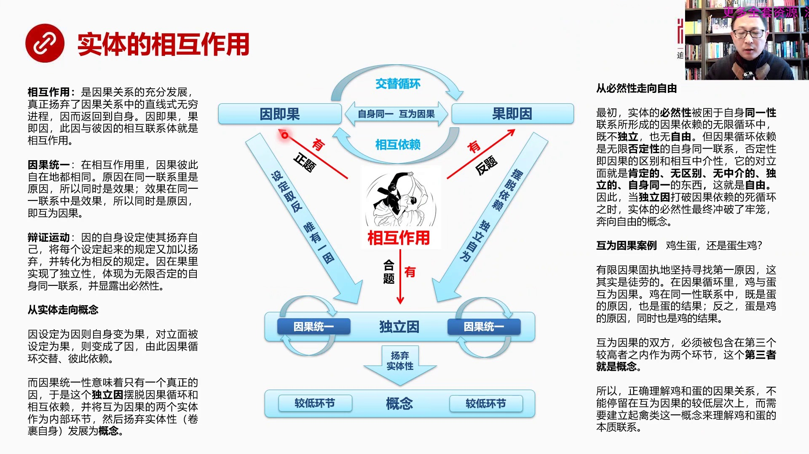

因計是過果計是因兩個都是原因實際上沒有區別設定和備設定其實在因這個因計是過果其實因這個情況之下沒區別所以所有所有的東西其實到了相互作用都是原因是兩個原因之間的兩個原因之間的相互作用這兩個原因之間的相互...

<strong>All subtitles</strong>

> 因計是過果計是因兩個都是原因實際上沒有區別設定和備設定其實在因這個因計是過果其實因這個情況之下沒區別所以所有所有的東西其實到了相互作用都是原
> 因是兩個原因之間的兩個原因之間的相互作用這兩個原因之間的相互作用就很有意思了首先它相互依賴它是個死循環因變過果變因因變過果變因然後是交替循環
> 因為它可以護射所以相互作用有死因相互作用有比因這兩個都是因相互作用最後實際上有一個獨立因這個是一個偉大的哲學跳躍是一個邏輯的一個由緣到人的一
> 個跳躍怎麼來理解這件事因計過果基因我們看看黑格爾是怎麼說的相互作用黑格爾認為這是因果關係的充分發展真正揚氣的因果關係中直線無窮的進程因而返回
> 到自身因計是過果計是因此因和比因的相互聯繫就是相互作用因果統一關鍵是這有一個因果統一的概念在相互作用裡因果彼此自在的都相同就是因果都一樣其實
> 都是原因原因在統一性裏是原因這個原因在一個相互是兩者之間是相互統一自身統一的原因在統一的聯繫裏是原因所以同時是效果就是它在這它要定義成因實際
> 上它就把它定義成果但它同時又是因它同時又是又是果所以自己唯一的時候第一對方為果的時候你也定義自己為果就這個意思原因在統一性的聯繫裏是原因所以
> 同時是效果效果在統一的聯繫中是效果所以同時是原因記互為因果說白了它們倆互為因果這是因果統一性變成運動我們看它是怎麼動的因的自身設定使其陽氣自
> 己將每個設定起來的規定又加以陽氣並轉化為相反的規定因在國裏實現了獨立性體現為無限否定的自身統一的聯繫並顯露出必然性這段話就是黑耳這個話讓正常
> 人理解沒法理解它太抽象也不知道它說什麼你獨30遍獨20遍獨30遍沒有用確實繞不清楚它在說什麼其實這個時候你需要結合以前的東西和現實的東西和生
> 活經歷和各種學科的東西來綜合理解才能搞清楚它什麼什麼意思簡單來說這不就是一個從實體到概念轉化的過程嗎我用一個同樣簡單的話可以把這個話說得更明
> 白就是因設定這個因設定為因自身變成果就是我把它設定成因的時候它就自然自動的變成了果對立面被射為果則變成了因由此因果循環交替彼此依賴當我他們兩
> 個是因果關係時候就是兩個這個因極果果是果積因這樣的一個關係的時候我把它如果主動設成因同時我就自動變成了果這邊也是我如果把它定成果它就自動變成
> 了因而我這邊一變就會牽著它它要重新變它變了之後它又反過來刺激它它又會變所以這是個周恩復始的過程是個震盪的過程你設定自己就會自動趨返你這個設定
> 自己設定也同時設定對方然後設定對方它一被設定它也自動趨返而且兩者相互依賴用無出頭之日這就是變成個死循環這就是它講了這個意思而英國統一意味著只
> 有一個真正的因其實英國統一就是只有一個因嗎你這兩個雖然是互於英國的東西但實際上兩個都是因兩個都是因實際上你說的是真正的原因只有一個這就推倒出
> 了獨立因這個新的概念但是獨立因是黑耳沒有用的事物我發明一個詞我認為用獨立因來概括最恰當獨立因就是獨立於這個死循環的一個真正的因兩個都是原因在
> 一起轉轉轉轉高速的轉交互震盪就是相互這個不斷震盪互相的依賴然後死循環在這轉實際上轉轉轉去你發現它說的都是一個因大家都是因實際上會有一個獨立的
> 因出現獨立因就是真正的因是擺脫了英國循環和相互依賴並將相互英國的兩個實體包捲在內部作為自身環節然後揚氣實體性發展為概念所以什麼叫揚氣什麼叫這
> 個這個包裹這兩東西作為內部這不是一個死循環嗎使用我們把這兩個環節包括在內部它還在循環沒關係你們繼續轉著但是你們作為我的兩個環節在我的內部轉我
> 認為你們並不矛盾本來他們在這是死循環相互依賴非常矛盾非常困難現在我把你們作為內部環節你們倆在我內部繞轉永遠的轉無所謂這就是一個雞這就是彈雞生
> 彈還是彈生雞這就是一個英國的死循環英國死循環怎麼辦我認為不重要你們就在我這裏頭作為我的兩個環節你們在裏頭繼續轉繼續矛盾著繼續插著我把你們作為
> 內部環節這就是獨立英獨立英跳出了死循環變成了一個真正的獨立性所以黑而所說的獨立性無限的否定性的自身的什麼同意的那種關係它那種表達確實比較複雜
> 但是它說的本質跟我剛剛所描述的本質是一樣的這種獨立英跳出了英國循環跳出了必然性的受到英國循環的束縛相互依賴束縛所以發展成了一個獨立東西這個獨
> 立東西一方面拋棄了死理性變成了概念一方面它獲得的自由也就從必然會走向自由然後概念再把這兩個獨立英面的兩個環節包含進來這就發展成了概念我們來看
> 一下從必然走向自由其實也是個道理實體的必然性我們這二因和果都是實體實體都有必然性必然性都很牛我一定要怎麼怎麼樣但必然性一開始被困在自身統一性
> 裡面自身統一性就是這個死循環裡面自身統一轉來轉去繞不出來英國死循環所以這個必然性很郁悶它既不獨立也不自由因為它被困在死循環裡面自由嗎不自由雖
> 然你有必然性但是被束縛度了根本就有必然性但是沒有自由很難受也不獨立因為英和果相互依賴誰也離開誰但英國循環這種依賴是一種無限否定性的自身統一性
> 聯繫這就是黑格爾表達這是無限否定性的自身統一聯繫為什麼說它是否定性的呢這個死循環實際上是個帶有否定性的因為否定性是說英國之間還有區別因積國國
> 基因但是英和果畢竟還不一樣所以那不是有區別的然後這兩者是相互中介的有從它變到它再從它變到它所以他們倆是相互中介的如果內部有區別然後兩者有中介
> 這其實是一種否定因為統一中介如果還有差別它就會它就會排除差別與自身之外它有一種強烈的排除排除對方的這麼一種衝動所以這就叫否定性那麼否定性會導
> 致它的對立面成為它運動的方向對立面是什麼那就是肯定的無區別無中介的獨立的自身統一的東西這東西是啥那不就是自由嗎肯定性無區別性無中介性這個徹底
> 獨立自身統一這就是自由世界所以當獨立因這個當獨立因正是出現的時候從羅將推出必然存在獨立因打破英國一來的死循環知識實體的必然性最終衝破了老龍奔
> 性了自由了概念我們來看會議因果爛力機盛誕還是誕生機我們知道這個事兒已經照了好幾百年中學課中基本上都要討論但是我們在討論這個問題的時候永遠說不
> 清楚到底機盛誕還是誕生機為什麼因為我們在有限因果中間固定的堅持一定要找到第一原因機是第一原因還是誕生第一原因啊誰也有說不清楚這其實是圖牢無功
> 的黑耳早就認為護衛英國的東西這是個比較低層次的東西我們不能陷於這個泥潭之中打賺為什麼從邏輯上從搭著這個剛開從我們所畫這個框脫來看因果關係循環
> 中機益和誕在英國循環中機益和誕是護衛英國的護衛英國就是這種關係那麼在統一性裡面就是機合誕的統一性面在這種統一性聯繫中間機機是誕的原因也是誕的
> 結果反之在統一性裡面伴是機的原因同時也是機的結果這叫護衛英國護衛英國的雙方必須要被包含在一個第三者一個更高的第三者之內作為兩個內部環節這個第
> 三者其實就是概念這是一個重大啟發在此之前我們從來沒有有意識意識到至少我沒有有意識意識到當你看到兩個矛盾非常堅持而且護衛英國逃脫不了互相依賴互
> 相此循環的命運受你一定要想到我要創造一個更大的概念第三個環節把兩個東西納入自身內部作為自身的環節這就需要概念性的認識也就是以概念性的認識來包
> 含護衛英國這種死循環所以正確理解機和彈的英國關係不能僅僅停留在護衛英國這種較低層的上而需要建立起勤類我們需要創造一個叫加勤類這樣的一個更大的
> 概念來理解機和彈它的內在的本質聯繫你有了這個概念在產售這個概念和它的各種特徵特性規定性的時候實際上就已經把機和彈的關係說清楚了這是一個巨大的
> 原理有了這個原理之後你在解決任何工作生活學習中的一切死循環矛盾的時候都會想到我需要一個站在更高的位置創造一個更大的概念把兩者納入其中作為環節
> 然後來解釋整個整體整個整體說明白了規定做好了它們兩個矛盾就不稱之為矛盾了它們兩個就變成一個可以自恰的東西好我們再看下一頁這就發展到一個

---

### Slide 15

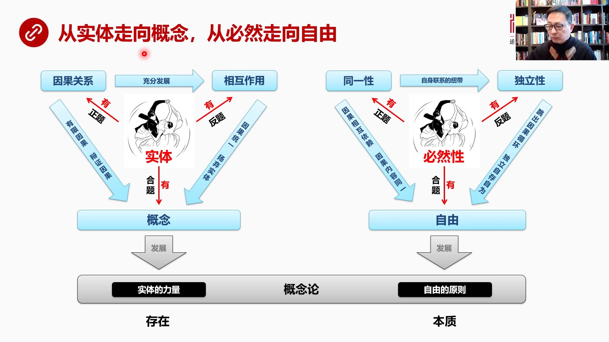

這個本質論的最後階段了從實體走向概念從必然走向自由主要我們剛才是一點點分析出來了一點一點一步一步推倒出來了為什麼實體會走向概念必然會走向自由從實體這個概念來看就是英國關係充分發展之後變成相互作用英國關...

<strong>All subtitles</strong>

> 這個本質論的最後階段了從實體走向概念從必然走向自由主要我們剛才是一點點分析出來了一點一點一步一步推倒出來了為什麼實體會走向概念必然會走向自由
> 從實體這個概念來看就是英國關係充分發展之後變成相互作用英國關係裡面它是有限英國有變成英國相互作用裡面是有英國同一性還有英國的還有這個獨立性然
> 後陽氣實體性變成了概念所以實體有英國關係實體有相互作用實體是有概念的概念最終會把這兩者包括在內那麼必然性必然性我們講的英國必然是內容同一的要
> 不然就不是英國關係那麼內容同一性它就成了一個扭帶把各種東西聯繫在一起然後發展到獨立性獨立性我們已經知道是要跳出邏輯死循環的跳出英國依賴的所以
> 必然性是有同一性的就是英國關係中內容必然同一必然性也是有獨立性的因為必然性發展到一定階段就會跳出死循環所以我們來看同一性是英國相互依賴英國內
> 容同一獨立性是跳出英國循環獨立自存自為所以必然性經過同一性獨立性之後必然走向自由這支必然性跳到自由這是一個非常難以理解的轉化就是它怎麼跳出死
> 循環的怎麼跳出依賴的就是那個獨立音的出現獨立音是個邏輯推倒了必然這就是實體最後要進化成概念必然要走向自由而這兩者其實構成了下一個結段的中心環
> 節就是實體實體的力量自由的原則這就是概念論最核心的量兩項實體對應著存在自由的原則對著本質在黑耳看起來一切存在的本質是什麼都是必然性而必然性最
> 後都是自由性所以一切東西發展到最後的階段發展到概念階段都是自由的概念但這個自由概念不是任性不是我想幹嘛就幹嘛而是經過大量的中介運動我們剛所說
> 的從可能和必然發展中條件再從條件然後經過活動體驗出實質然後再從實質經過它的能動性內外的能動運動然後才到實質的現實性從現實性才到外在必然性從外
> 在必然性再發展到後來的擺脫經過本質運動之後擺脫中介性然後才變成了真正的自我必然性自我必然性居然還被困到英國循環裡面出不來我的天最後還要跳出英
> 國關係變成獨立音才真正到了自由境界這中間經過多少艱難困苦所以我們如果沒有哲學理念的話你會想的是這是一件事自由就是自由就是任性就是我想幹嘛幹嘛
> 其實不是經過詳細推倒之後你會發現實現自由這事相當之難我們再看下一頁這就睡到本質論存在論和概念論三者之間的關係

---

### Slide 16

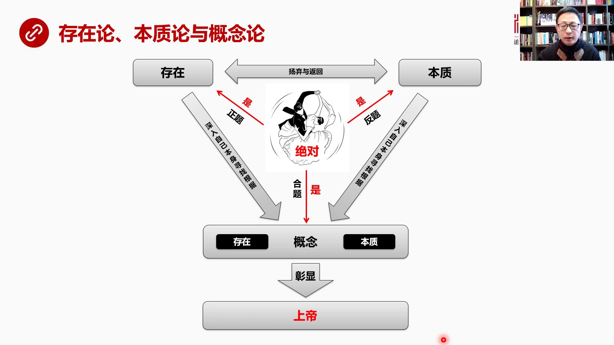

我們已經講過存在論了我們今天又講了本質論以後有機會再講概念論存在和本質是一個陽氣和反回的關係存在深入自身然後尋找根據這就到了概念根據都是在概念裡本質的根據也在概念裡也就是概念是他們的根據或者說概念派生...

<strong>All subtitles</strong>

> 我們已經講過存在論了我們今天又講了本質論以後有機會再講概念論存在和本質是一個陽氣和反回的關係存在深入自身然後尋找根據這就到了概念根據都是在概
> 念裡本質的根據也在概念裡也就是概念是他們的根據或者說概念派生出了存在派生出了這個本質那概念是啊概念就是上帝囉上帝創造了絕對理念這種絕對的東西
> 創造了那個創造了一切眼生所以絕對作為神經過這樣一個循環存在到本質然後再到概念概念包括存在和本質作為自稱的環節整個這個運動是什麼它最終目的是為
> 了張顯上帝所以這就是我們看到這三個理論之間的內在的關係存在比有本質本質最後一定會發展到概念反而說概念就是存在和本質的根據從概念中實際上會創造
> 這個創造內容那麼我們也可以說一個這個借說上帝是概念所以這個借說是上帝實在上帝是本質下一步我們要進入概念層就是上帝這個絕對是概念我們才再看最後一頁總結一下哲學這個西方哲學的起源我覺得是起源於規定性

---

### Slide 17

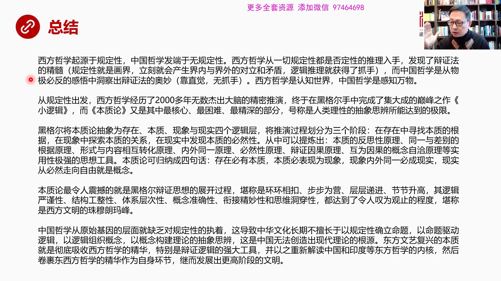

中國哲學發端於無規定性西方哲學從一切規定性都是否定性這個切入點差進去發現了變政法的精髓就是規定性就是化界立刻就會產生界內和界外的對立和矛盾這樣一來邏輯推理就有了抓手要不然我分析啥呀與宇宙剛形成的時候道...

<strong>All subtitles</strong>

> 中國哲學發端於無規定性西方哲學從一切規定性都是否定性這個切入點差進去發現了變政法的精髓就是規定性就是化界立刻就會產生界內和界外的對立和矛盾這
> 樣一來邏輯推理就有了抓手要不然我分析啥呀與宇宙剛形成的時候道生一一生二二生三生萬物你這個道生一是怎麼生的呀中間沒有任何細節因為我沒有抓手我這
> 個刀切不進去呀但他說規定性絕對是有或者倒是存在立刻就會產生相反的效果因為你把存在化出來了那存在的反面是什麼呀那就是沒有存在了沒有存在不就是無
> 嗎好這兩者之間又會相互轉化就會運動出第三個第三個東西來概念就這麼一點一點進化進化出來越來越負擔越來越成體系而東方哲學由於沒有規定性不強調不執
> 著一規定性所以我就沒有辦法獲得一種界內界外這種矛盾和對立我就沒有抓手所以中國哲學是從物質必反的感悟中間動查出了變成法拉方面我是感覺出來的我是
> 直覺我是敦務所以我是靠直覺靠敦務但是我沒有抓手沒有認知的抓手所以西方哲學是認知世界中國哲學是感知萬物從規定性出發西方哲學經歷了2000多年無
> 數結束大腦的精密推演提出了諸多的理論和概念最後終於在黑閣手中完成了極大成的顛峰施作小邏輯而本質論是小邏輯中間最核心最困難最精深的部分號稱是人
> 類理性的抽象思辨所能達到的極限就是駐門朗馬峰是抽象思辨的駐門朗馬峰黑閣將本質論抽象為存在本質現象現實是四個邏輯層實際上中間還有一些更細的邏輯
> 層然後將推演過程化分為三個極端在存在中尋找本質的根據在現象中探索本質的關係在現實中發現本質的必須是一切的本質本質是一切的根據原理同一與差別的
> 根據原理就是一切的東西都要有根據有根據才能派聲所以你看到了現象萬事萬物一定有一個共同的如果它是自身同一的一定有一個共同的根據所以你看到的現象
> 萬事萬物一定有一個共同的根據所以你看到的現象萬事萬物一定有一個共同的根據如果它是自身同一的一定有一個共同的根據找到這個根據這就是本質第三個原
> 理形勢與內容相互轉化的原理我們剛剛所說的一切內容和形勢我們以前的理解都是非常膚淺的內容與形勢相互轉化它的不停的這種變化實際上是形成與咒萬事萬
> 物不管是物種還是生命的內容都是一個最核心的原理還有內外同一就是自身萬一就是自身萬一和它無反應是一致的是一樣的就在在這個現實中間那麼這會使你帶
> 來很多新的推論變成性原理不用說了就是什麼是事物的必然性怎麼找必然性然後變正因果原理變成因果跟有限因果是不一樣的變成因果是一個自我因果和母子因
> 果的關係而且我們再聽到什麼鼎子和一批戰馬推翻一個王朝這種這種所謂因果這種密無誤物的話我立刻就會指出來因為它的內容不同意這怎麼能作為因果關係列
> 出來呢以這個內容同意性越少因果關係越差還有後尾因果後尾因果是死循環怎麼打破死循環需要概念自洽就是用概念把兩個環節全部融入一身讓他們繼續在裡頭
> 轉封火輪它就自洽了這樣的原理也是非常有效的所以這是一系列非常隨便已抓一體驗就能體驗出大量的實用性極強的效率極高的思想工具最後本質論可以蓋過蓋
> 過程四句話存在必有本質本質必表現為表現為現象現象內外同意必成現實現實從必然走向自由就是概念那麼本質論吧令人最震撼了就是黑格爾辯證思想的展開過
> 程堪稱是華換相扣步步為營藏層地進階階身高它的邏輯嚴謹性結構的公正性體系的層次性概念的準確性和閒戒的精妙性乃至思維的動穿性都達到令人探圍關止的
> 程度堪稱是整個西方文明幾百年以來所達到的朱姆勞馬峰最高境界一直到今天還無人能超越中國哲學從原始基因的層面就缺少對規定性的執著這是中華文化長期
> 不擅長於以規定規定性來確定命題以命題來推動邏輯邏輯來組織概念以概念來構造理論的抽象思變這是我們非常不擅長的這也是中國為什麼無法創造出現在這個
> 當代理論現在理論的一個重要根源東方文義復興他的本質是什麼就是要徹底消化和吸收西方哲學中的精華特別是變正邏輯的強大思想工具然後用這種思想工具來
> 重新解讀中國印度乃至其他的地區的東方哲學的內核然後絕過東西方哲學的精華作為自身緩解這就已經有著黑個耳的表達方式了最後發展出更高階段的文明好這就是我們今天課程是主要內容推薦閱讀特林的小邏輯

---

### Slide 18

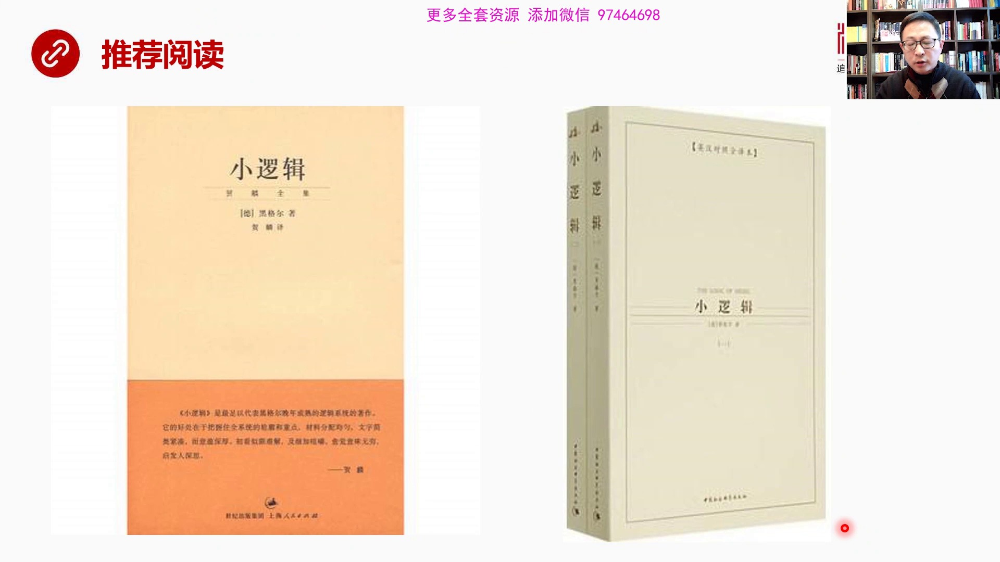

這是主要閱讀的參考物這個翻譯的中英文對照的小邏輯可以作為實在看不懂去查閱他的英文翻譯好這就是我們今天的本質論的主要內容

<strong>All subtitles</strong>

> 這是主要閱讀的參考物這個翻譯的中英文對照的小邏輯可以作為實在看不懂去查閱他的英文翻譯好這就是我們今天的本質論的主要內容

---

### Slide 19

謝謝大家祝大家生活愉快

<strong>All subtitles</strong>

> 謝謝大家祝大家生活愉快

---
