# 核心课视频-88、89、90 - 现代货币创造 — Clean Slide Notes

> **来源**：鸿学院核心课程  
> **幻灯片**：28 张

---

### Slide 1

同學們大家好今天我們又開始講核心課程今天咱們重點說一說現代貨幣創造的四大理論下面我們翻第一頁現在貨幣創造有四大理論

---

### Slide 2

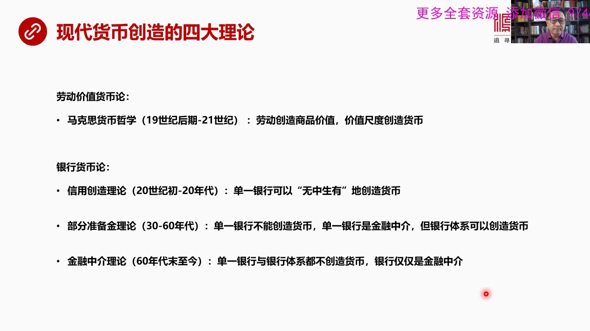

第一大理論就是勞動價值貨幣論這主要是馬克思的貨幣哲學就是以資本論第一卷出版作為一個起點在19世紀後期它的影響力一直持續到現在馬克思貨幣哲學的主要觀點是什麼就是勞動創造商品的價值而價值尺度又創造了貨幣所以貨幣它是有一套背後的馬克思主義的哲學思維方式作為支撐的這是馬克思的貨幣哲學那麼除此之外就是西方的銀...

---

### Slide 3

馬克思主義它的一種核心的學說時間是19世紀後期一直到今天包括在中國還是很多國家它都具有這強大的影響力我們翻下一頁什麼是勞動價值論

---

### Slide 4

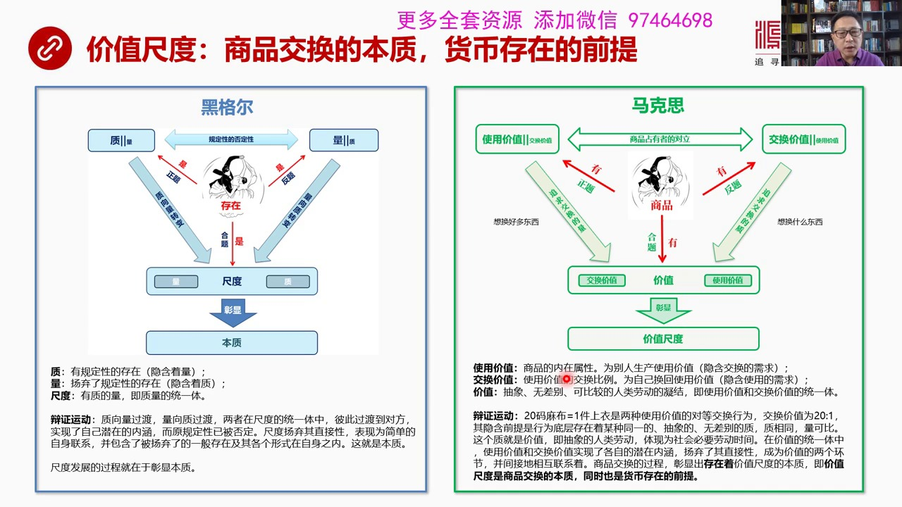

那麼馬克思在資本論第一卷的頭幾張中間探討了商品的起源商品的價值到底是什麼創造的探討了商品的這個實用價值商品的交換價值和商品的價值然後推出了價值尺度這個概念那麼價值尺度再往後推價值尺度實際上是商品交換的一種本質然後也是再往後推的新的結論也是貨幣存在的前提我們在資本論中間我們會發現馬克思的思想受到黑格爾...

---

### Slide 5

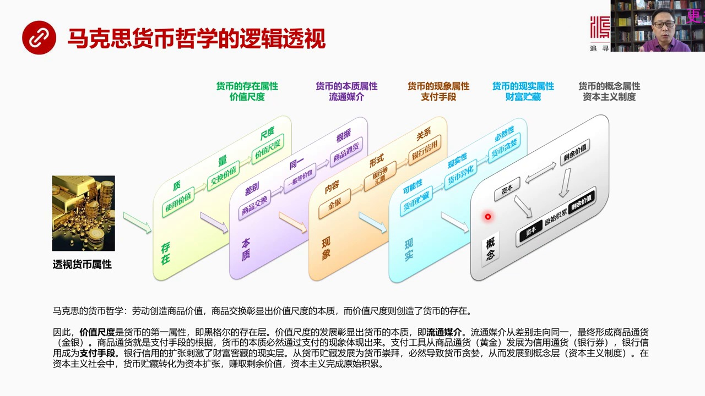

進行邏輯透視的話當然這個邏輯透視還是嚴用黑格爾的邏輯分層法我們怎麼去透視貨幣的屬性或者叫貨幣的最根本的一系列屬性我們可以用黑格爾小邏輯中所產數的五大邏輯層把貨幣分層進行表述在每個層子上在探討辯證每個概念範疇辯證運動的規律然後每一層像下一層如何過度在下一層中間再對典型特徵再對這些典型的概念範疇進行邏輯...

---

### Slide 6

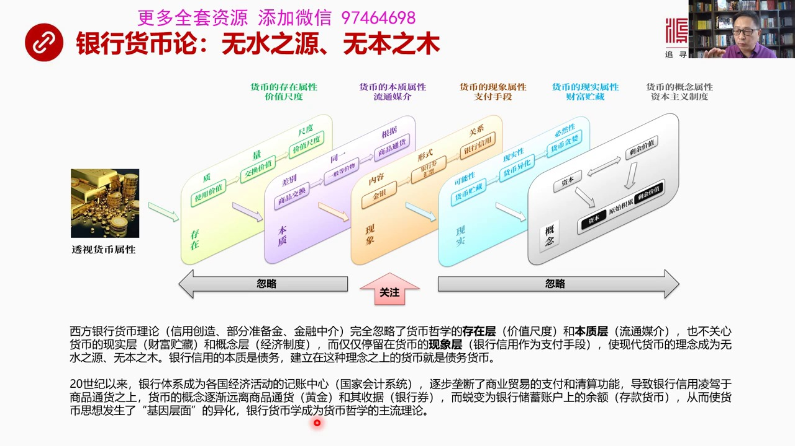

我們再來看現代的銀行貨幣論就會發現現代的西方的這種銀行貨幣論是一種無水之源無本之目為什麼因為我們從這張圖上可以看到實際上銀行貨幣論僅僅聚焦在現象層最後的銀行信用它完全忽略了貨幣的存在層和貨幣的本製層因為現代銀行的貨幣理論不管是信用創造還是部分準備金還是金融中介都沒有談到價值尺度的問題都沒有談到流通媒...

---

### Slide 7

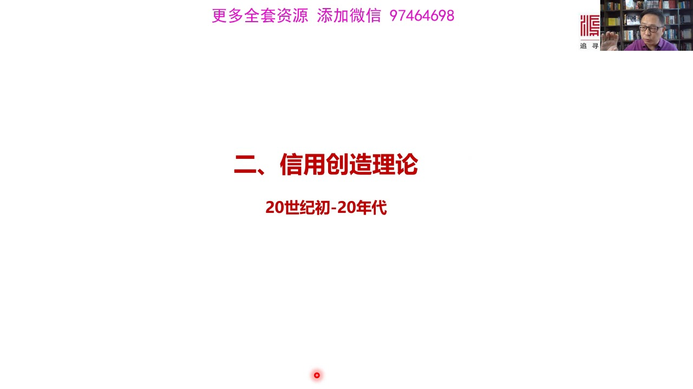

跟現代銀行貨幣學最本質的差別在哪就在於現代西方的銀行貨幣並不探討貨幣哲學中間的五大邏輯層中間的四個邏輯層它並不深入去探討被它忽略了它只是一個解釋性的東西解釋為什麼現在銀行很牛逼為什麼現在銀行信用是全是會支付手段的唯一的這樣的一種類似於貨幣功能的東西它只是在解讀這件事而沒有真正去探討貨幣哲學中最深刻的...

---

### Slide 8

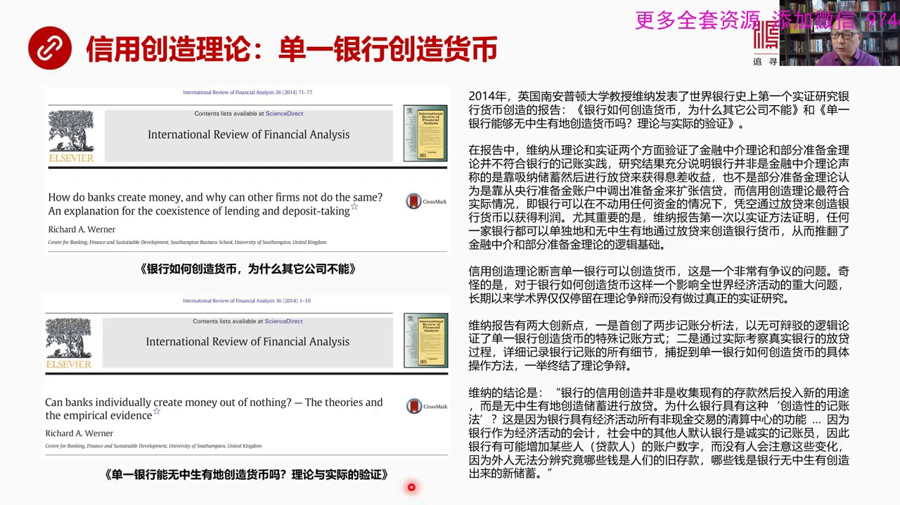

單銀銀行一個銀行就能夠創造貨幣當然這個信用創造理論後來被其他的西方主流的學說逐漸淹沒大家認為這非常不靠谱單銀行是不能創造貨幣的比如說部分準備金理論認為單銀行不可能創造貨幣金融中介說不僅單銀行不能創造貨幣銀行整體也不能創造貨幣他們只是簡單的中介那麼信用創造理論最近又開始贏得一種新的輿論的支持或者理論的...

---

### Slide 9

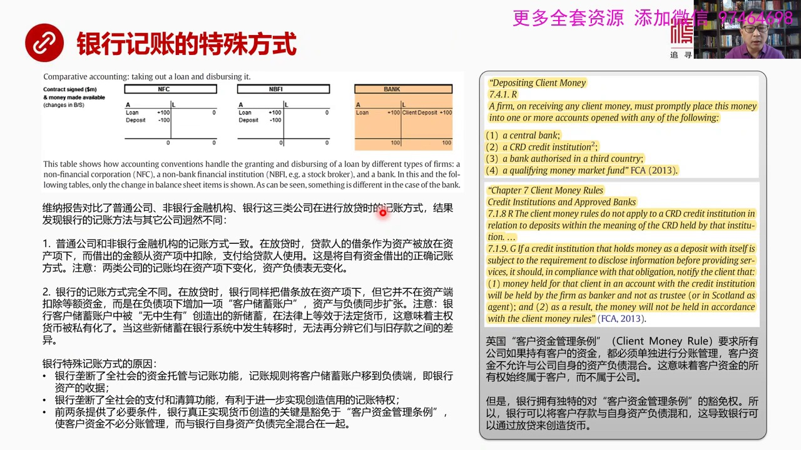

不同類型的公司的濟漲方法比如說一般的普通公司我們會發現這是它的資產負債表資產是A 負債是L我們看到它的資產中間如果發生了借貸會出現什麼問題會怎麼濟漲我們知道一家普通公司跟我們普通個人是一樣的如果你漲上有100塊錢或者金教裡面或者你的保險箱裡面有100塊錢現金如果你借給別人的話你一定會把它的收據作為你...

---

### Slide 10

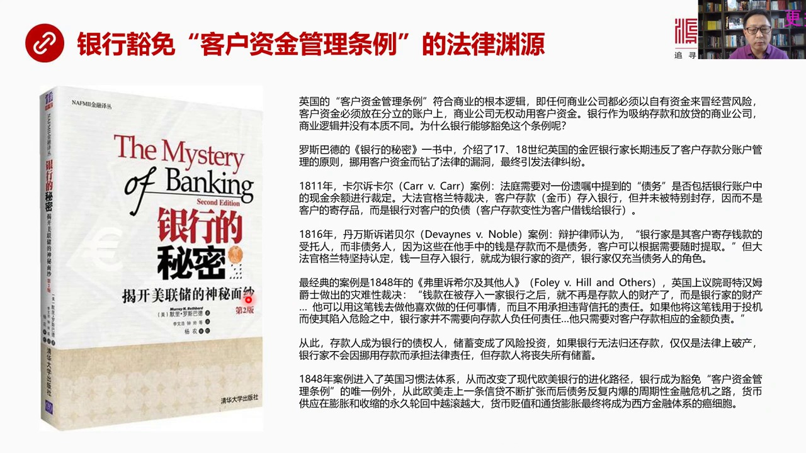

在這本書裡面羅斯把德把法律的圓圓解釋得非常清楚就是銀行為什麼能夠貨免客戶資金管理條例呢它是有法律圓圓的那麼英國客戶資金管理條例本來它是非常符合商業的基本邏輯就是所有商業公司必須於自己的資金來冒險客戶如果脫管在你這兒的資金必須要進行分贊戶管理商業公司是無權動用客戶資金的銀行如果作為新那處去進行放待了商...

---

### Slide 11

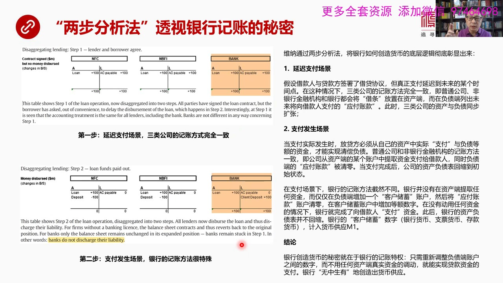

這個是維納的一個非常突出的一個貢獻它把底層邏輯全部張顯出來什麼叫兩部分析法兩部分析法就是我們首先假設第一步延遲支付場景就是我們簽署了貸款協議之後但是貸款要一個月之後再發生真正支付貸款這個獲得貸款金額一個月之後真是發生那麼在這種情況之下怎麼記仗這一招非常的高因為延遲支付的場景就會使三個不同類型的公司的...

---

### Slide 12

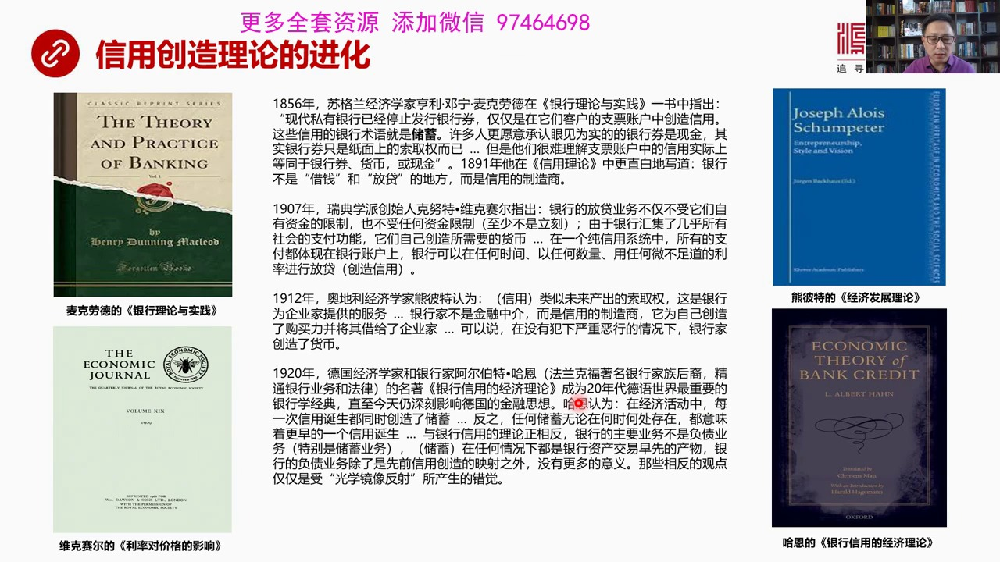

首先最早是1856年蘇格蘭經濟學家麥克勞德在銀行理論與實現這是一本民主在這本書中他談到現代私有銀行已經停止發行銀行券了僅僅是在他們的客戶的支票賬戶中創造信用這些信用在銀行數以中就叫儲蓄許多人更願意承認眼見為實熱銀行券是現金其實銀行券只是指面上的所謂權而已但是他們很難理解支票賬戶中的信用就是處於賬戶中...

---

### Slide 13

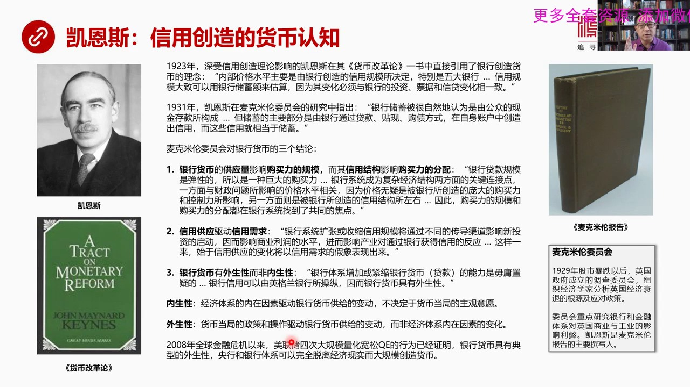

1923年深受信用創造理論影響了凱斯在他的這個一本書貨幣改革論當然這是他貨幣思想完全成熟之前的一個重要作品是1923年寫的他在這本書面直接引用了銀行創造貨幣的理念內部價格水平主要是由銀行創造了信用規模所決定特別是五大銀行英國五大銀行創造了大量信用就是創造了大量的儲蓄儲蓄存款當然就會影響價格信用規模大...

---

### Slide 14

第二個主要理論叫部分準備經部分準備經理論它的主要的新剩時間是三年代到六十年代我們來看下一頁部分準備經理論首先它是怎麼寄贊的

---

### Slide 15

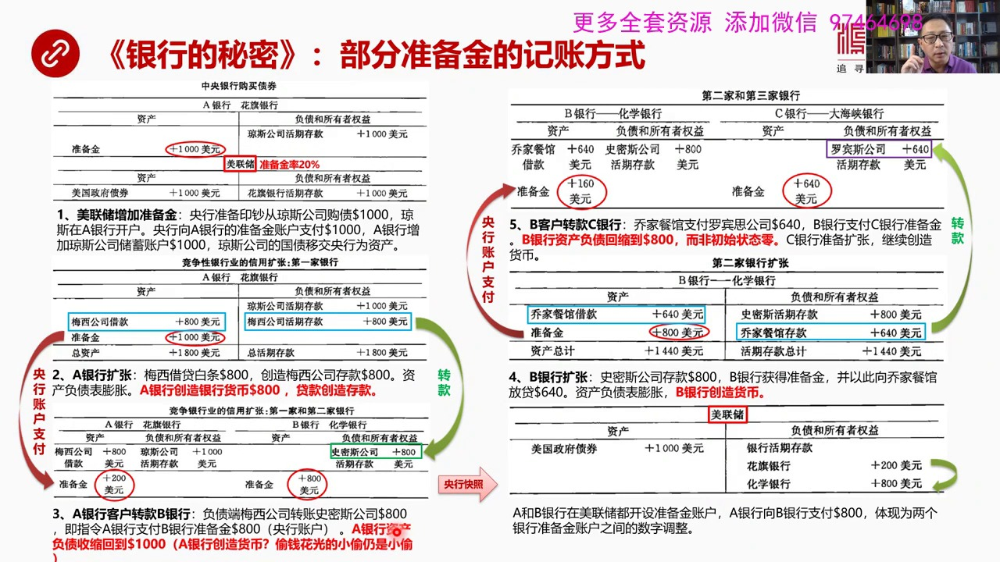

我們省要從寄贊角度來理解什麼叫部分準備經理論銀行秘密這本書羅斯保德這本書中間有對部分準備經濟贊有一個非常完整而且非常嚴謹非常仔細的資產負債表變化的一張圖我們把這張圖如果全部集中在一起應該是這樣的一個情況分成幾步分成幾步來看第一步美聯儲增加準備經就是美聯儲向銀行投放比如說一千美元的準備經這件事情怎麼做...

---

### Slide 16

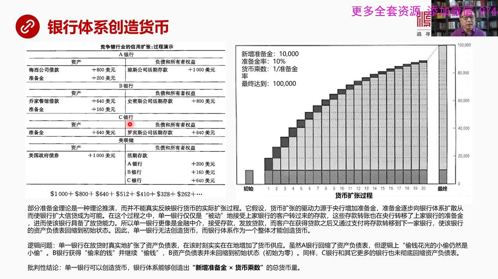

攝鷹航和美聯儲銀行就是我們剛才所說的銀行一開始有這個賣國債窮司公司賣了一些美元給美聯儲他有獲得了一些美元的準備金然後他向梅西公司界這個他叫梅西公司放貸放貸的800準備金被轉走了800還是有200窮司公司這個存款還是1000就是賣國債這個然後幣銀行收到了幣銀行收到了這個準備金之後收到800之後然後可以...

---

### Slide 17

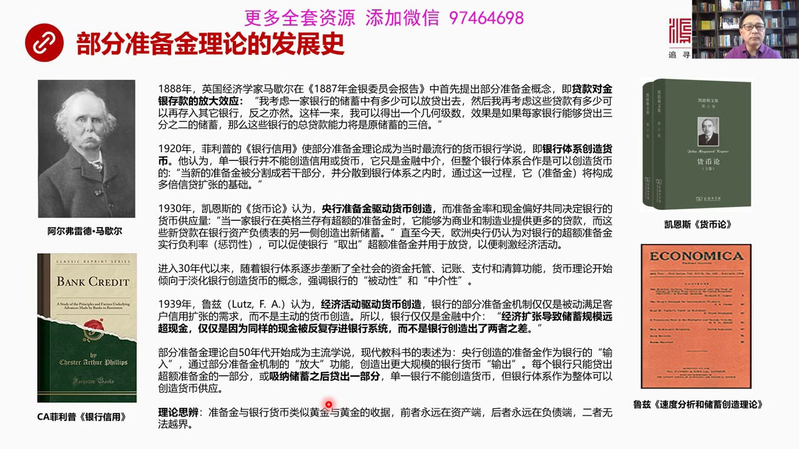

首先這個1888年英國經歷學家重明英學家馬歇爾在他的一份報告中1887年金英委員會的一個報告在這個報告中首先提出了部分準備金的概念1888年提出的他發現什麼呢就是貸款對於金銀存款他具有放大效益就是金存款比如說存進來100整個銀行體系能夠把它放到到300的銀行信用這是怎麼回事呢他在做我們這個事他的原話...

---

### Slide 18

都是一個主流的理論我們看一下金融中介理論它的基本原理是就是銀行不管單銀行

---

### Slide 19

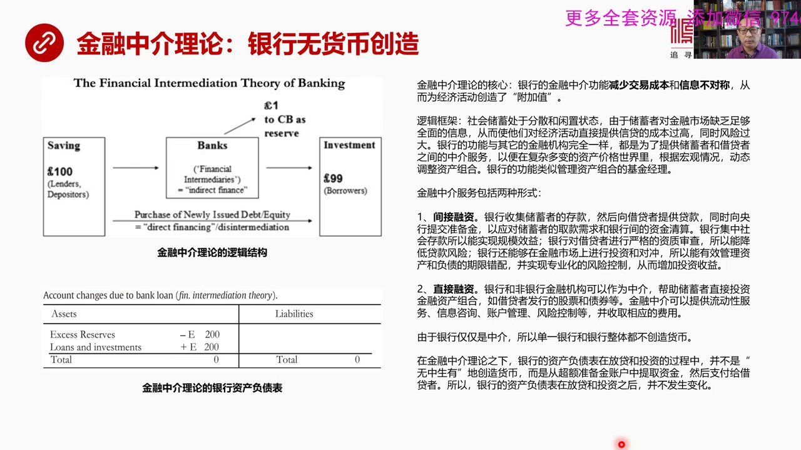

還是銀行體系都不創造貨幣那就更離譜了這是現在最流行的理論是銀行完全是無辜完全傻眼就是完全被動它只是做的一個有增加值的一個工作但是沒有創造任何貨幣不要怪它它挺好而且經濟模型中也不要把銀行創造貨幣這件事放進理論模型因為銀行不創造貨幣當然這樣一來你就會嚴重的誤判經濟發展因為銀行創造貨幣是個事實而你連這個事...

---

### Slide 20

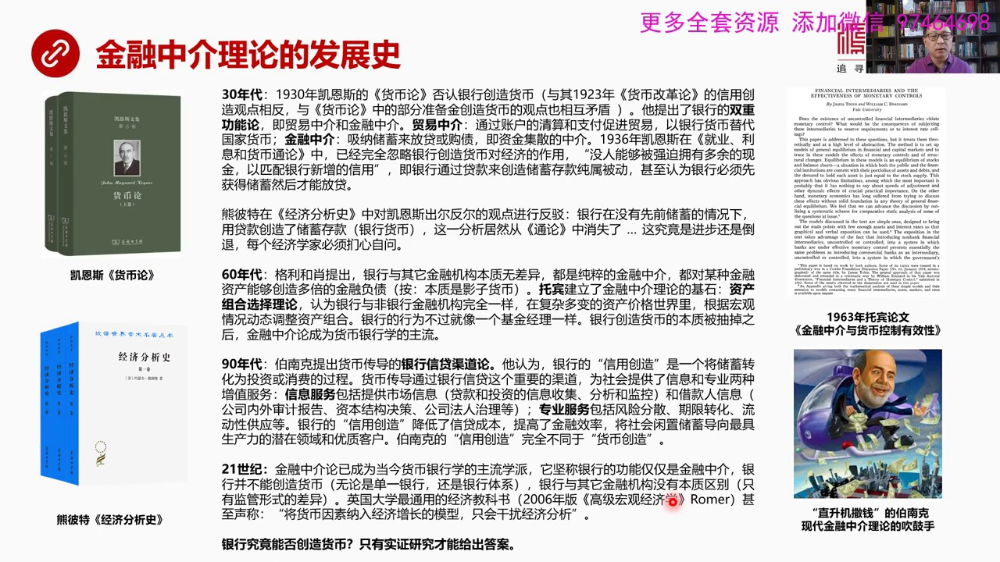

最早是凱恩斯提出來的他在貨幣論三十年貨幣論我們剛說到貨幣論面有好幾種思想他在貨幣論中間否認了銀行創造銀行創造貨幣的這種提法這跟他1923年貨幣改革論我們來說到過貨幣改革論論中間他提到信用創造信用創造了這個觀點是完全相反的與這本書中部分準備金創造貨幣的觀點也是矛盾的所以凱恩斯你會看到他三本書兩本書出現...

---

### Slide 21

機器反思下頁這就是維納做的

---

### Slide 22

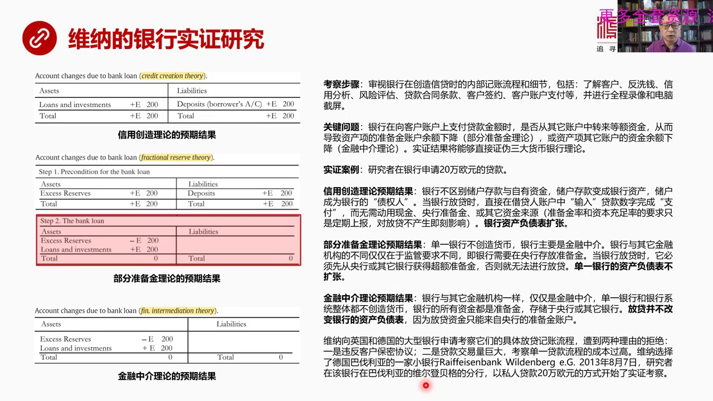

首次做了銀行的實證研究首先我們來看它的考察部它的考察部就是要審視銀行在創造信貸的時候內部計漲流程的所有細節包括什麼呢17部從了解客戶反洗錢信用分析風險評估貸款合同的條約然後怎麼跟客戶簽然後客戶賬戶怎麼支付然後進行了全程的錄像包括電腦階屏一共有17部一會兒我們會具體想到它怎麼操作那麼它的關鍵問題要驗證...

---

### Slide 23

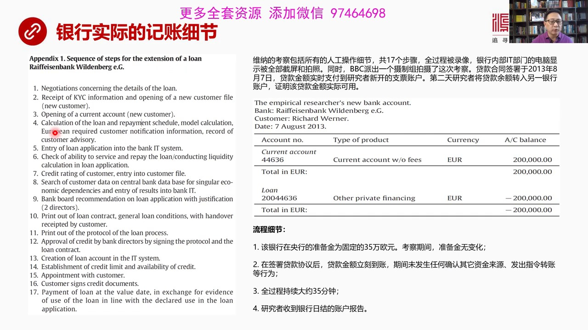

如果大家感興趣可以一步一步去核查我們在這個後面的這個參考資料中參考文項中也給大家指出這個文件它的出處和應該怎麼來看它的原文那麼圍娜的考察包括所有人工操作細節一共17步全過程被錄像銀行內部IT部門的電腦顯示全部被捷平還有拍照同時BBC英國的BBC還派出了一個設置組對這件事情非常好奇他們就實力拍攝了這次...

---

### Slide 24

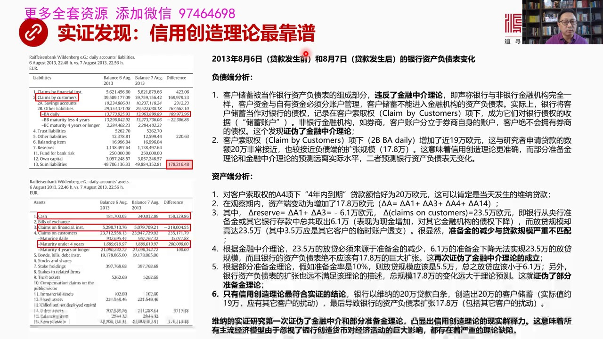

那麼他結取了8月6號貸款發生錢和8月7號貸款發生後的銀行資產貸款變化圖就是這一天發生的貸款8月7號發生的貸款所以貸款之前和貸款之後我結一天的數據首先他進行了負債段的分析這是負債段我們看到銀行儲蓄被當成銀行資產負債表中的組成部分這違反了金融中介理論因為中介理論認為銀行跟分銀行的金融機構是完全一樣的客戶...

---

### Slide 25

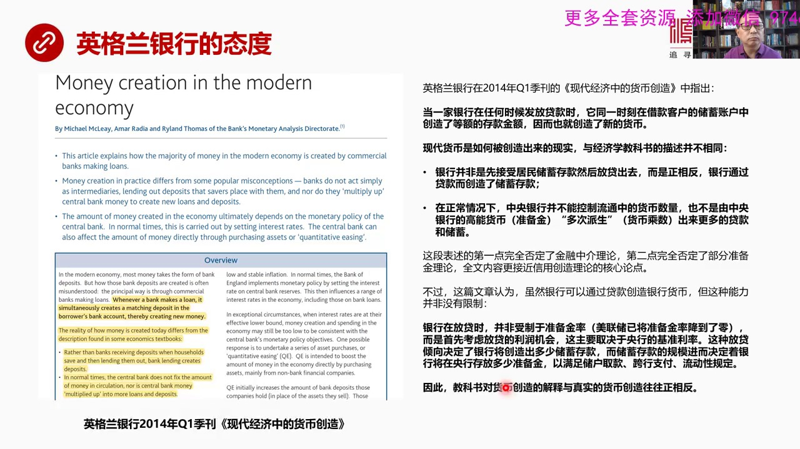

銀行銀行我剛剛說BBC已經全程拍了這個過程銀行通過理論和實際的對比他也不得不承認在2014年第一季度的寄刊上英國銀行他們內部的開幕上有發表一篇文章現代經濟中的貨幣創造不得不承認這個實證研究還包括很多人提出了信用創造理論實際上是合乎實際情況比如說在這篇文章中他指出當一家銀行在任何時候發放貸款時他同一時...

---

### Slide 26

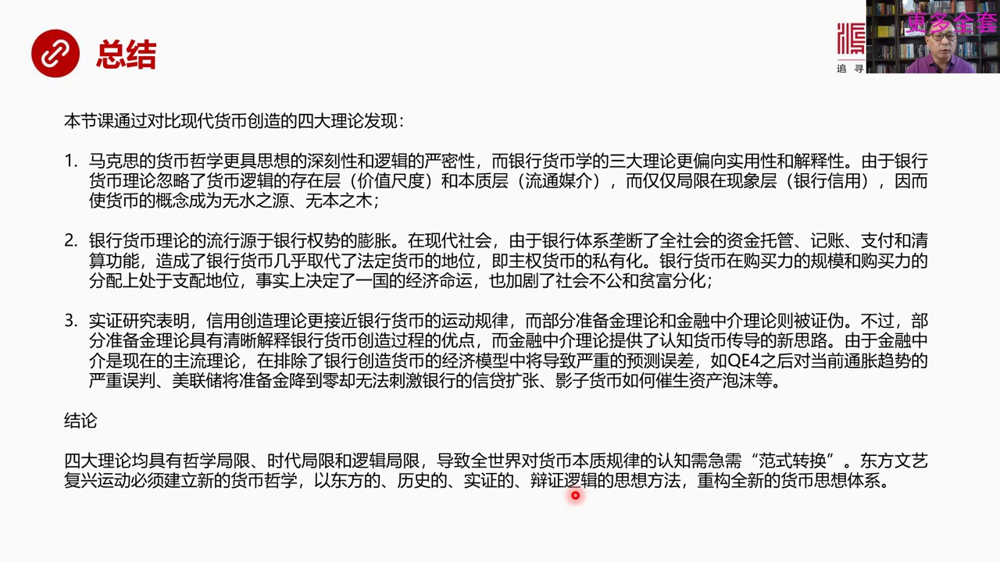

四大理論的對比我們發現第一馬克思的貨幣哲學更具有思想的深刻性和邏輯的嚴密性而銀行貨幣學的三大理論更偏向實用性和解釋性由於銀行貨幣理論貨幣理論忽略了貨幣邏輯的存在層就是價值始動本質層就是流通媒介而經濟局面在現場層也就是銀行信用因而是貨幣的概念成了無稅之言無本之目整個貨幣哲學思想委縮了第二銀行貨幣理論的...

---

### Slide 27

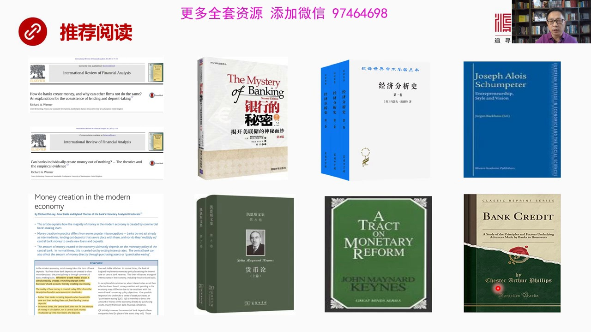

參考資料包括維納的兩篇論文包括銀行銀行的論文Lospa的零行秘密這個坦斯的貨幣論等等如果大家有興趣可以去讀一下這些援助從援助中去體會那些最優秀的大腦在思考貨幣問題的時候他們繞了多久也多痛苦得出了很多思考過程之中的答案其實他們的這種推理過程要比它的結論要比我們看來標準最後說的結論要重要的多推理的過程才...

---

### Slide 28

---
