# 核心课视频-91-94 - 现代货币创造（二） — Clean Slide Notes

> **来源**：鸿学院核心课程  
> **幻灯片**：33 张

---

### Slide 1

現代貨幣創造了第二部分金錢的實踐我們翻下一關於金錢的實踐首先我們來看

---

### Slide 2

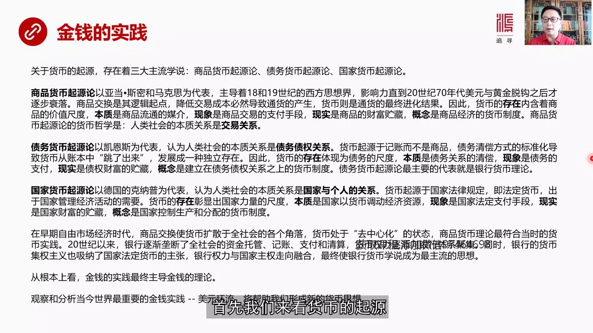

貨幣的起源目前存在這三種主流學說第一種商品貨幣權論第二種債務貨幣權論第三種國家貨幣權論商品貨幣權論當然我們知道是以亞當斯密和馬克思為代表這種學派基本上主導著18世紀、19世紀西方的思想界它的影響力一直到20世紀七年代就是1970年美元和黃金透露以後然後這種思潮才逐步的衰落商品貨幣這種基本的邏輯抓點是...

---

### Slide 3

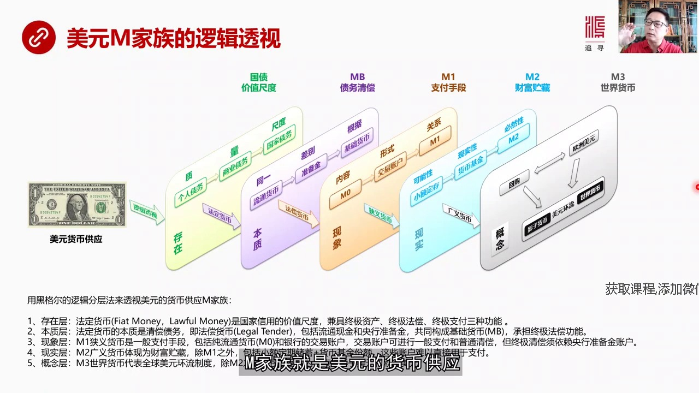

M-L-M-E-M-R等等美元這個M家族我們怎麼來進行分析要進行邏輯透視怎麼進邏輯透視還是要用黑格的小邏輯所提煉出來的對萬事萬物對一切事務的同用分析方法就是邏輯分層法我們讀了黑格的書讀了黑格的小邏輯並不是為了記住你得學概念關鍵是要會用怎麼用這個是靠水平的黑格在小邏輯中展示分析任何問題任何性質的問題無...

---

### Slide 4

存在層是債務是貨幣的價值程度我們先講這一層再看下一頁首先我們來看一下古今中外

---

### Slide 5

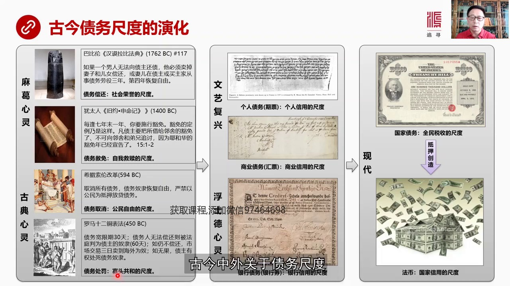

關於債務尺度債務是一種尺度它的演化情況比如說在我們最左邊這是代表公元錢比如說8比倫時期一直到希拉羅馬時期那麼這可以作為一個古典時代的代表比如說8比倫我們大家可能都知道哈姆拉比法典公元錢1762元大概是這個時間段制定的那麼8比倫的這個哈姆拉比法典它中間有一條講到債務的問題他說如果一個男人無法向債主環債...

---

### Slide 6

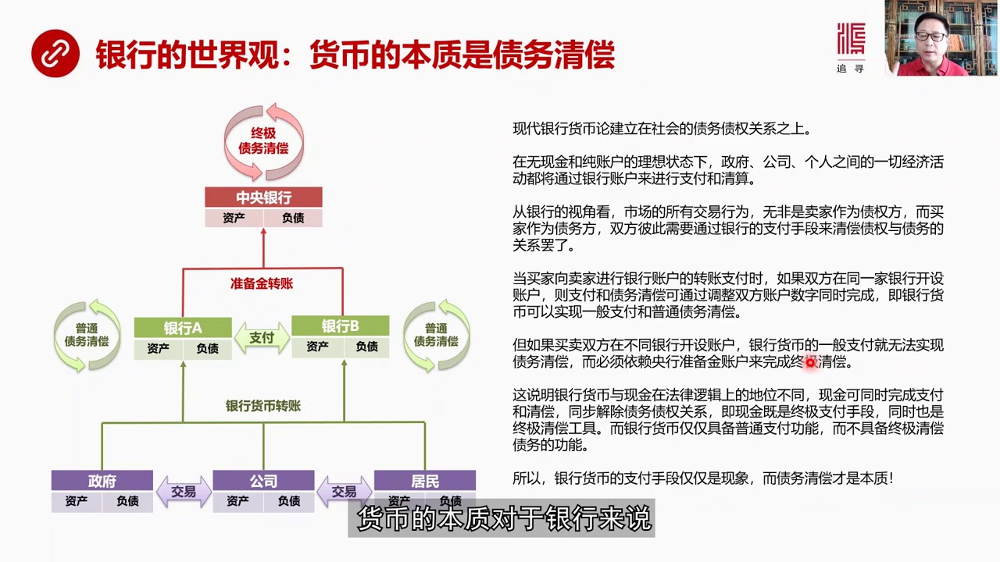

對銀行來說就是債務清藏其實我們看到現代銀行這個貨幣體系主要是建立在一個社會的債務和債權關係之上如果我們想像一個社會是完全沒有現金是一個無現金和純賬戶的理想狀態之下那麼不管你是個人還是公司還是政府所有人自然負債表和所有交易其實都是在銀行進行清算大家都是從過銀行聯繫在一起的那麼你的所有市場中的買賣行為不...

---

### Slide 7

從銀行貨幣的本質來看實際上它的本質是基礎貨幣作為最終債務清場的方式這是銀行貨幣的本質我們仔細來看下一頁首先我們得搞明白什麼叫基礎貨幣

---

### Slide 8

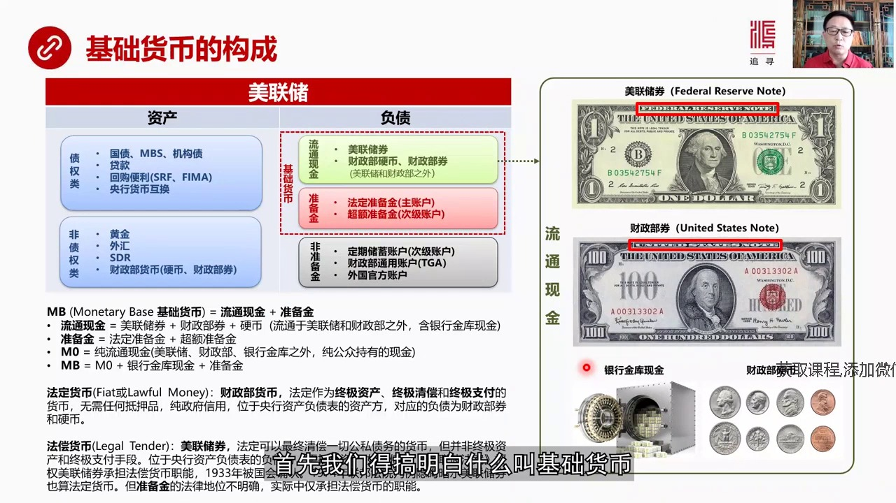

剛才我已經談到了基礎貨幣就是流通現金再加上準備金好我們來看一下這話說起來簡單自己分起來分析起來還有點負責這是美聯儲的資產負債表左邊永遠是資產美聯儲的資產包括債權類還有非債權類兩部分債權類有什麼呢美國國債兩方債還有各種它的GSE機構債還有呢貸款當然美聯儲的貸款也是資產它帶給很多金融機構還有回購便利美聯...

---

### Slide 9

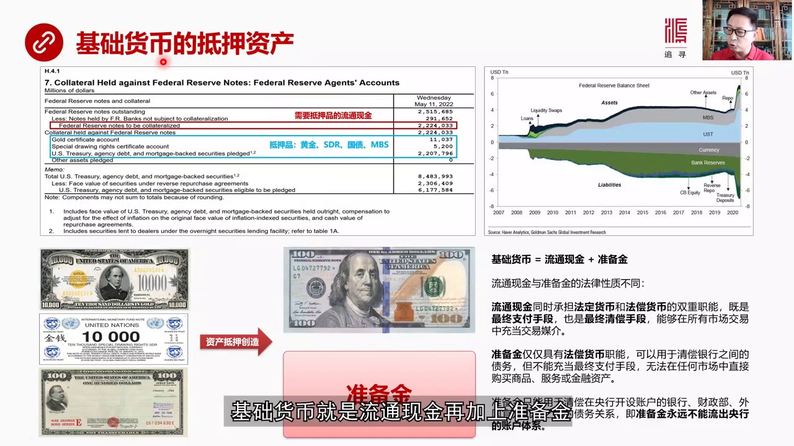

流通現金再將準備金它的抵押自然究竟是啥比如說美聯儲自然負債表比如說我們看H.4.1這個表它的流通貨幣美聯儲美聯儲距爾流通了貨幣需要抵押的這個流通貨幣它現在總額流通量是2.2萬億這些美聯儲距爾是需要被抵押是需要抵押品的需要抵押品的流通現金2.2萬億它背後的抵押自然是什麼三種抵押品就是黃金、SD2、國債...

---

### Slide 10

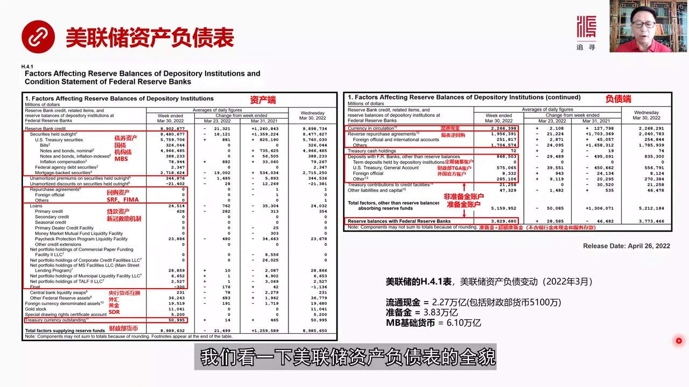

包括哪些資產呢債券資產國債機構債MBS我們看來的總資產負債表這是4月26號取得一張表它的總的資產是8.9萬億包括債券類的資產國債機構債MBS還包括什麼回購回購資產包括長輩的回購便利海外回購便利都在這現在我們看這數基本是零就是沒人使用因為有人使用說明金上出問題了這兩是危機性號如果有人本來可以在回購在貨...

---

### Slide 11

NB下野貨幣它主要單當是一般支付手段我們看下野首先我們要明白銀行有3種錢

---

### Slide 12

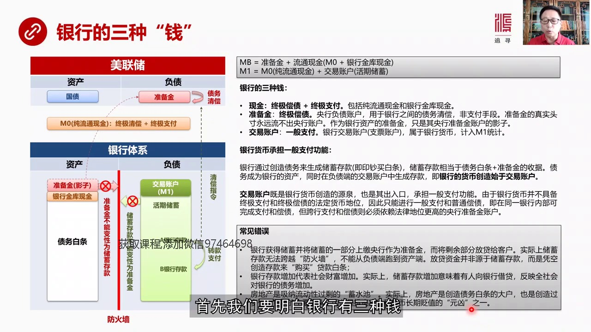

一種錢叫現金還有叫準備金還有叫銀行貨幣3種錢性質法律性質是永然不同背後的貨幣邏輯也永然不同首先我們來負債NB就是基礎貨幣等於準備金加上流通現金流通現金就是純流通現金加上銀行金貨現金NB等於純流通現金注意這是M0純流通現金加上交易賬戶我們中國的銀行體系經常成為活氣賬戶實際上叫交易賬戶交易賬戶就是用於平...

---

### Slide 13

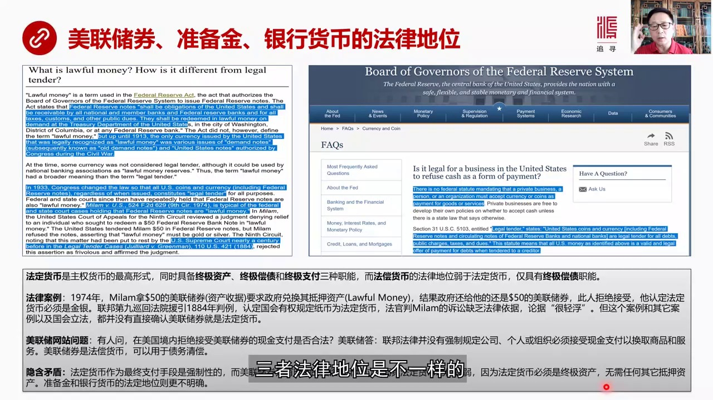

三者法律地位是不一樣的你比如說這是一個法案我們看到首先我們再回顧一下法定貨幣是什麼是主權貨幣最高形勢同時具有三種智能中積資產、中積長債、中積支付法定貨幣永遠居於資產銀行貨幣表的資產資產方它是中積資產不需要任何其他東西它不是任何其他東西的收據所以叫中積資產不需要任何抵押品而法長貨幣的法律地位要弱於法定...

---

### Slide 14

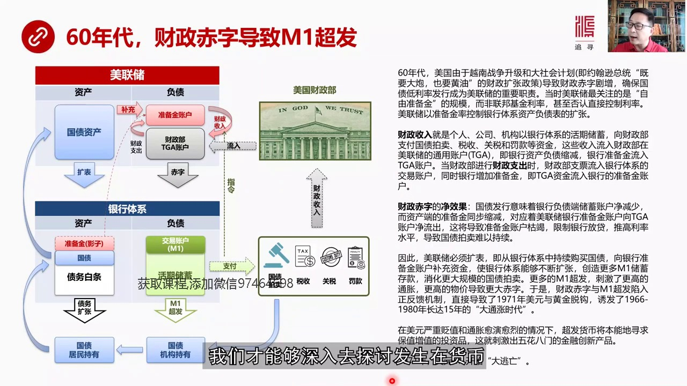

這個貨幣叫金錢實現中的一系列的問題六十年代美國為什麼會出現通過膨脹其實本質上來說就是財政赤字導致M1超方然後導致通過膨脹然後導致利率上漲然後導致金本位結體所有問題歸根到底最有源頭只有一個財政赤字我們來看一下這個邏輯圖首先六年代的時候美國由越南戰爭升級還有大社會計劃就是冤軍總統當時說我既要大炮也要黃油...

---

### Slide 15

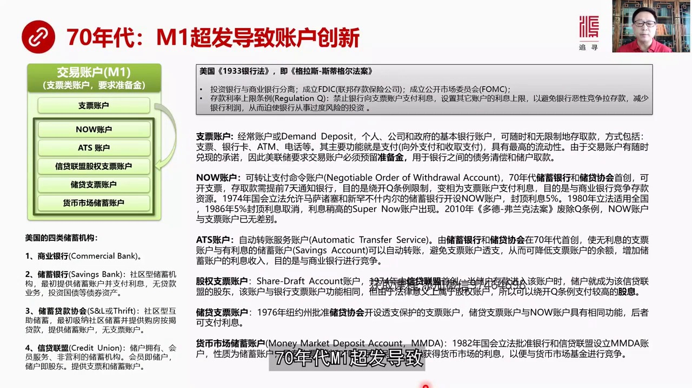

首先是導致帳戶創新我們來看交易帳戶ME交易帳戶什麼呢就是支票類帳戶支票類帳戶是要求準備金的因為你是隨近隨出經常要面對別人要去款要轉款都必須要這個帳戶要有錢你如果帳戶中沒有錢寫帳支票如果沒有錢那不是就出問題了嗎如果一個銀行完全完全不能夠對應和支付人家日常的這個生活來這種轉帳區你這個銀行就倒閉了或者叫發...

---

### Slide 16

廣義貨幣M2廣義貨幣M2追求什麼追求的是財富的住藏我們看下一頁這就是涉及到處續帳戶的轉變了我們剛剛說的是

---

### Slide 17

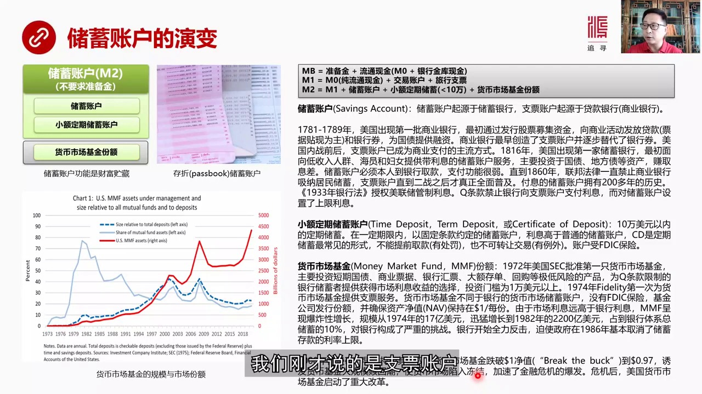

支票帳戶或者叫交易帳戶現在我們來看處續帳戶它是什麼變化首先處續帳戶第一個印象或者第一個我們的認知是處於帳戶是不要求準備金的為什麼因為處於帳戶不是拿來花的處於帳戶是用來存的所以每年處認為你只有經常發生交易的你才需要綠流準備金如果你不經常發生交易或者一年都不怎麼動的這錢叫處去這錢是不用交準備金的注意這是...

---

### Slide 18

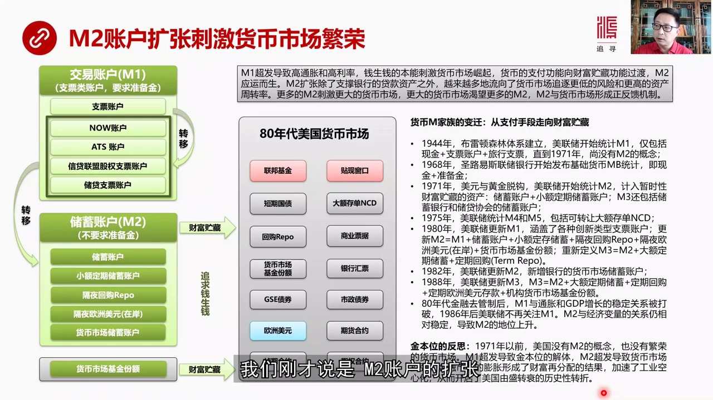

就是它不斷地在膨脹這個擴張實際上刺激了美國貨幣市場的繁榮我們來看美國的M2兩種贊護它的一個邏輯關係M1贊護就是交易贊護它是支票類的要求準備金最早只有單純的支票贊護後來由於M1超發財政制製造M1超發導致了M1的錢要在體制之內進行轉移就出現了鬧贊護ATS贊護信貸聯盟的這個股權支票贊護還有處貸支票贊護等等...

---

### Slide 19

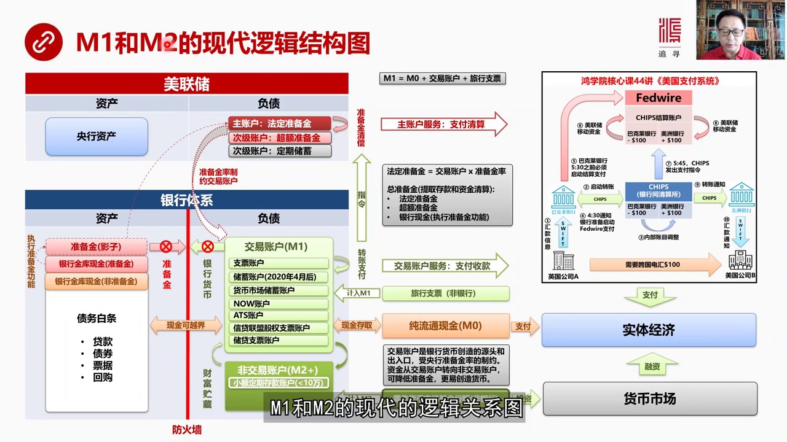

究竟是什麼樣呢美聯儲我們看到這是美聯儲資產負債表央行資產負債呢主賬戶是法定準備金刺激賬戶超過準備金刺激賬戶定期存款這個定期儲蓄這個賬戶現在基本沒人用因為有了隔壹密回購有了其他的還有給這個錢給了更多一些它沒必要再用這個賬戶好那麼對應的商銀銀行呢上銀行的準備金這是它的資產這是個影子實際上是指向主賬戶的還...

---

### Slide 20

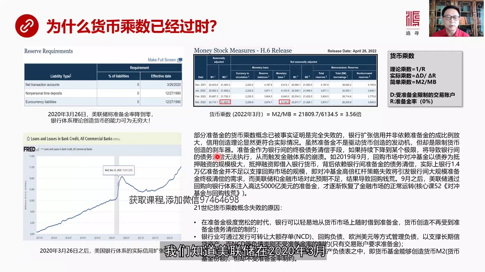

每年儲在2020年3月26號將準備金降到0現在各種準備金率全是0理論來說您要體系這個創造貨幣的能力應該無限大我們知道貨幣成數有不同的這個具體不同的算法理論成數是準備金率的導數實際成數是準備金變化多少導致儲蓄存款增加了多少這個地的變化是受準備金控制的交易帳戶的數據這個底泡塞的變了多少兩者構成了實際成數...

---

### Slide 21

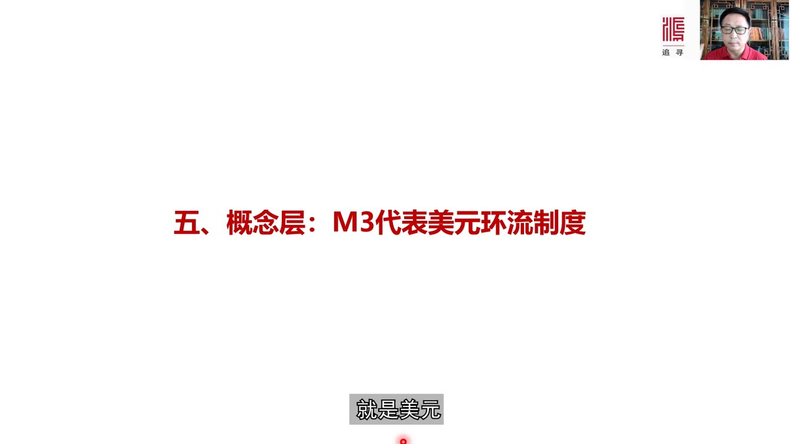

M3代表這完流制度代表了世界美元現在這就是M3所代表的概念層再翻下一頁首先我們看M3的歷史演變

---

### Slide 22

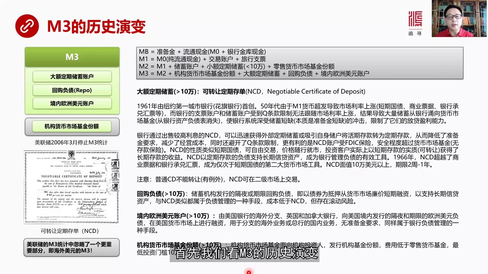

M3的賬戶包括什麼大額的定期儲蓄賬戶回購的負債包括境內的歐洲美元賬戶還包括機構貨幣基金市場份額這個被包含在美聯儲的統計數據之內但是2020年美聯儲停止了M3的統計所以現在我們不知道M3到底是個什麼情況我們來看首先先呼吸一下MB等於準備金加溜通現金就是純溜通現金和銀行金庫的總和M1等於M0純溜通現金加...

---

### Slide 23

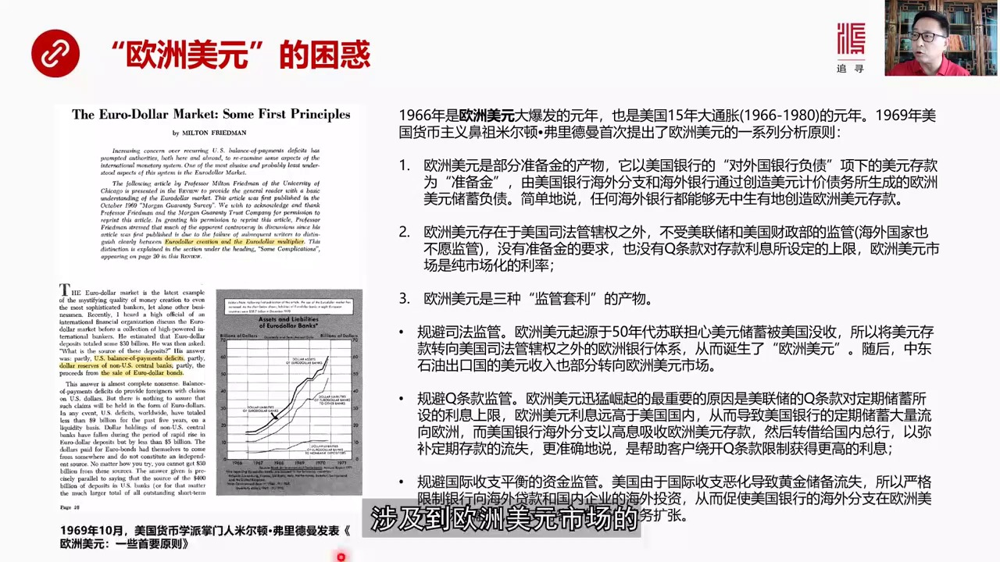

在美國本土的市場就是在岸在岸的歐洲美元其實更重要的是黎岸歐洲美元黎岸歐洲美元就是在美國司法管理員全之外的美元它是最重要的規模也好還有它的複雜性也好而這一點其實並沒有包括在美國的M3統計之中但應該包括否則你對所有價格的判斷都失誤了因為那是創造美元貨幣最大了一頭你把它忽略了那怎麼還搞得清楚整個美元到底有...

---

### Slide 24

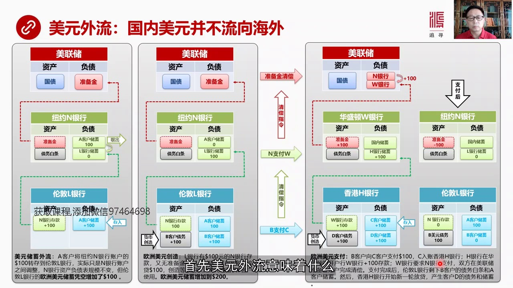

美國的美元並不會流向海外這是第一個重要的結論什麼叫美元外流美元儲蓄於外流我們看第一張圖美元儲蓄外流就是A客戶是紐約N銀行的大客戶它要將一百塊錢轉到倫敦的L銀行倫敦我們要守字母實際上發生了什麼實際上只是N銀行它的賬戶之前進行數字調整銀行自然分開表的規模是不變的但是倫敦L銀行的歐洲美元儲蓄貧空增加了一百...

---

### Slide 25

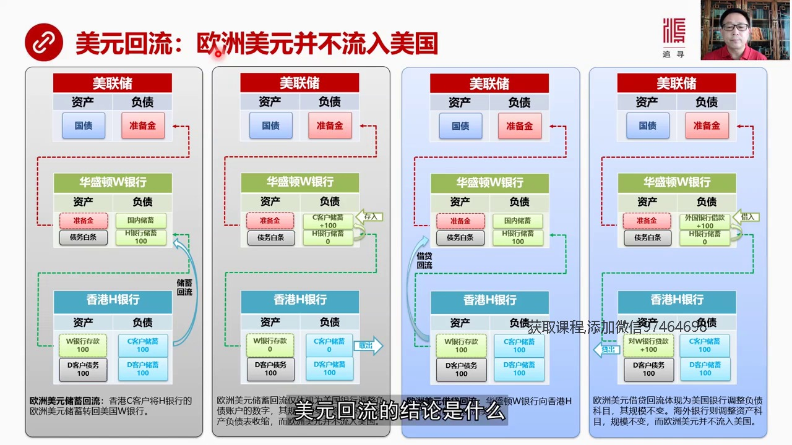

你比如說我們考慮這個情況考慮兩種情況歐洲美元處去回流歐洲美元的借貸回流看這兩種情況資產責表面應該怎麼計歐洲美元處去回流就是香港C客戶我們把香港C客戶資產責表搬過來它把H銀行的歐洲美元處去因為這可能是一個要在美國經常生活的人他回到美國他說我想把香港的歐洲美元轉回到美國華人頓W銀行好這個操作怎麼來進行我...

---

### Slide 26

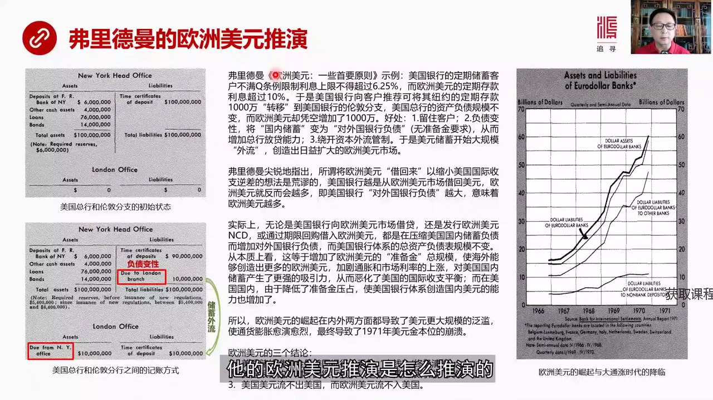

他用了一個漁幹力一家扭約的這個總公司或者叫總航嘛和一家倫敦的分航之間的狀態倫敦的總航一開始這邊的資產這邊做對應的負債一億美元然後倫敦他的分公司就是分航呢資產負債是零好這個時候他舉這個例子就是這家總航的客戶很不滿意啊這個不滿意什麼Q條款給我這力氣太低我在這存了比如說他存了一千萬美元然後你才給我是6.2...

---

### Slide 27

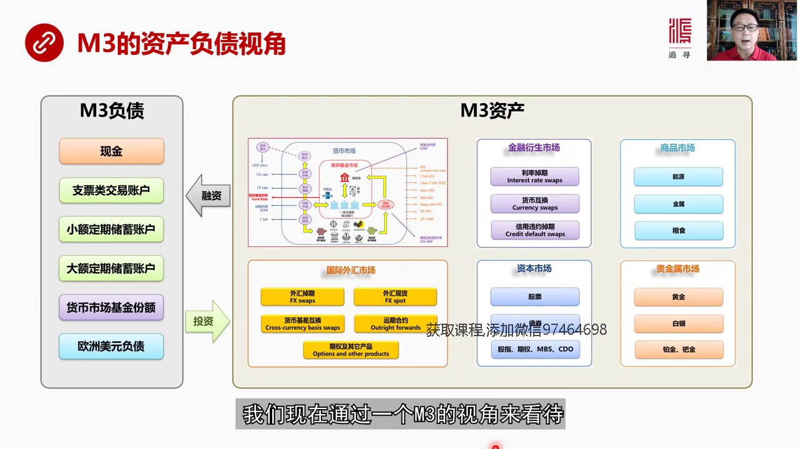

來看待M3是怎麼回事為什麼我們說它是一種貨幣制度M3我們在這裏如果從負債角度來說它包括現金包括支票雷帳戶小額定期處於帳戶大額定期處於帳戶這個貨幣市場的基金份額包括歐洲美元負債等等這都是代表我們如果用資產負債方式這個概念來說代表負債它的資產它所對應的資產呢當然就是各種各樣的被M2催生出來的被M3繼續放...

---

### Slide 28

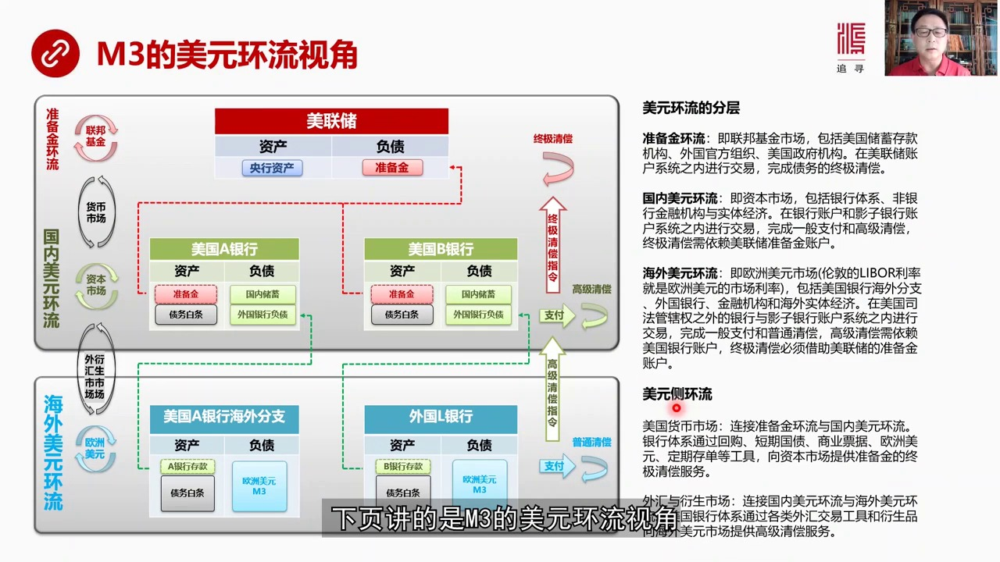

實際上我們來看美聯儲在這兒資產他的銀行資產和準備金他所對應的美國的銀行和這些銀行在海外的所對應的銀行是這樣一種關係其實我們看到從環流視角來看美元環流應該分成三個層次分層的三個市場三個環流第一我稱之為是準備金環流這是在央行賬戶裡賺第二是國內美元環流這是在美國的銀行資產負在表裡賺第三是海外美元環流是在海...

---

### Slide 29

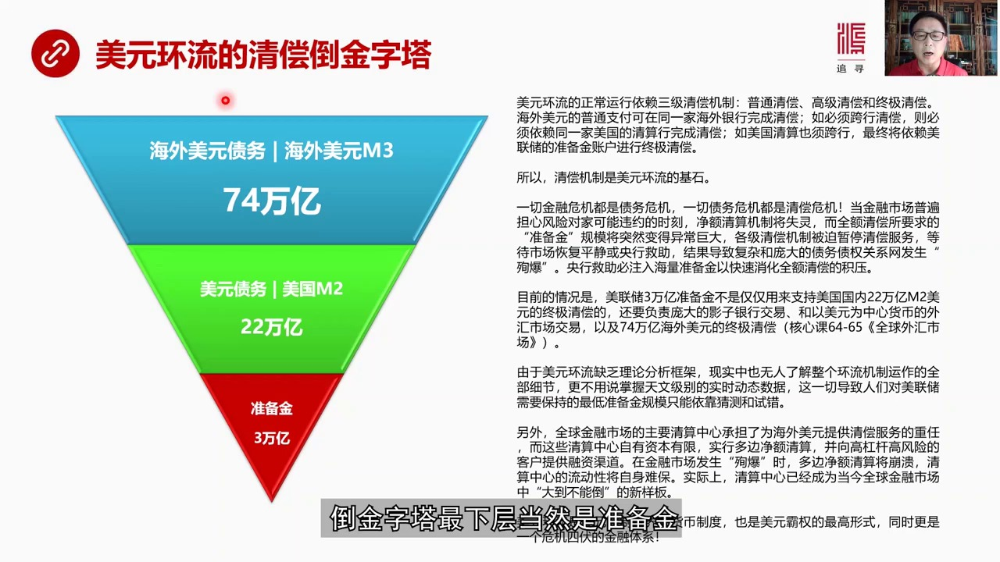

最下層當時準備金然後用準備金要清算美國國內的22萬億M2同時還要承擔海外M3的其實4萬億美元的這樣的規模所有的清算任務全部壓在他壓在這上這個數夠不夠呢天之老所以我們來看美元環流的他的清場是三級清算制普通清場高級清場和終極清場清場這種機制是美元環流的機實因為銀行就關心最後我怎麼做清場終極清場這是我必須...

---

### Slide 30

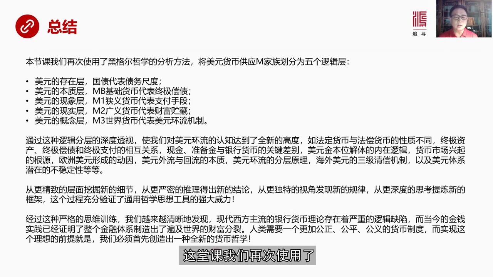

黑耳的哲學分析方法將美元貨幣供應的M家族劃分成了五個邏輯層美元的存在層國債代表債務持度美元的本質層MB基礎貨幣代表終極長債美元的現象層M1下一貨幣代表支付手段美元的現實層M2廣義貨幣代表財富住層美元的概念層M3世界貨幣代表美元環境機制我覺得通過這種邏輯分層的深度透視使我們對美元環境的認知達到了一個全...

---

### Slide 31

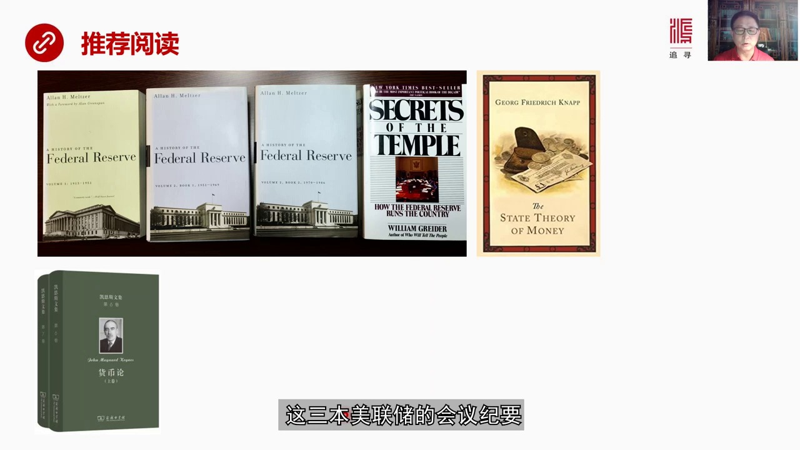

它所形成的非常有意思的一個深度的解讀美聯儲所有理論思想變化的這麼一個過程還有就是關於美聯儲如何運作包括貨幣論還包括關於國家貨幣起源的一種學說當然還有資本論這都是我們今天探導了主要參考的一些讀物除此之外還有一些推薦的文章比如說我剛剛說到的福利德曼寫的論文

---

### Slide 32

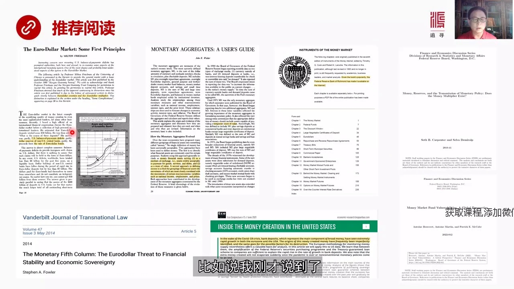

包括美國財政部還有美國的美聯儲銀行推薦了一些特別好的一些介紹美聯儲貨幣市場的一些工具還有就是美聯儲的歷史比如說怎麼統計MEMM203什麼時候統計什麼為什麼要做調整還有財政部美聯儲的一些內部的研究報告除此之外還有一些學術界分析比如歐洲美元到底怎麼回事還有一些投資銀行對於量寬鬆對於縮表對美聯儲的貨幣創造...

---

### Slide 33

---
