# 核心课视频-95-98 - 现代货币创造（三）影子货币-上 — Detail Slide Notes

> **来源**：鸿学院核心课程  
> **幻灯片**：26 张

---

### Slide 1

現在貨幣創造的影子貨幣部分上半部因為影子貨幣這個問題比較複雜花了不少時間進行研究特別是影子貨幣現在還沒有一套成熟的理論所以我們一邊研究市場研究市場中發現的新的問題一方面要故意讓和總結提烈理論就是我們美...

<strong>All subtitles</strong>

> 現在貨幣創造的影子貨幣部分上半部因為影子貨幣這個問題比較複雜花了不少時間進行研究特別是影子貨幣現在還沒有一套成熟的理論所以我們一邊研究市場研
> 究市場中發現的新的問題一方面要故意讓和總結提烈理論就是我們美元還流這個市場體系中涵蓋了普通的貨幣也涵蓋了影子貨幣所以我們實際上這堂課是理論提
> 烈內容量比較大所以我們把課程分成了幾個部分今天講的是第一部分影子貨幣的一些相關理論現在我們看第一頁為什麼會有影子貨幣這件事

---

### Slide 2

包括影子貨幣理論為什麼現在引發了很多人的關注當然最主要的問題是2008年的金融危機2008年金融危機它主要是源於影子銀行體系發生了崩盤然後引發了影子貨幣的流動性的危機在2008年以前雖然美國和全世界也...

<strong>All subtitles</strong>

> 包括影子貨幣理論為什麼現在引發了很多人的關注當然最主要的問題是2008年的金融危機2008年金融危機它主要是源於影子銀行體系發生了崩盤然後引
> 發了影子貨幣的流動性的危機在2008年以前雖然美國和全世界也經常爆發各種各樣的金融上的問題但是性質不同你比如說在2008年之前上一次是200
> 1年的IT泡沫破裂當時也曾經出現過重大的股票市場暴跌但是它的基本性質是科技股的暴跌而不是美國銀行體系出了重大問題在往前是90年代初美國也出現
> 了嚴重的經濟衰退也出現了包括按階貸款就是貸款協會的重大運規輯但是只是涉及到金融體系中間那個很小的部分在往前87年股票市場暴跌但是也是局限於股
> 票市場本身並沒有形成全面的大規模的金融系統的危機所以從7年代以來美國脫離金門位之後一直到2008年之前事實上並沒有影子影子銀行回擊和影子貨幣
> 的危機2008年是第一次主要這個危機爆發的它的原點它的其實點是在我們知道次代就是不合格的貸款人銀行降低了貸款標準然後給他們提供了大量的按階貸
> 款而這些人實際上是三個人員沒有固定收入沒有固定的系用沒有很好的系用然後沒有固定的這種資產等等由於他們到了2008年出現了嚴重的違約2007年
> 到2008年之間吧所以使得資產證據化就是把刺激貸款打包成的NBS以及由NBS這些刺激貸款打包的一些其他的衍生物比如說CDO這種資產多垃圾還有
> 包括給CDO進行這個保險的CDS訊息也掉漆然後都出現了問題然後引發了回購市場被凍結然後引發貨幣市場大混亂然後使得持有這些資產的獨拉基的這些大
> 量的銀行保險公司對衝基金貨幣市場基金出現了大面積的問題所以2008年2008年金融危機的根子是出在影子貨幣體系這就提出了一個重大問題影子貨幣
> 是怎麼回事啊為什麼會出這麼大問題呢而且影子貨幣究竟是什麼這些問題促使學術界開始對於現代貨幣理論進行反思就理論過去的銀行創造貨幣的銀行貨幣體系
> 或者或者叫銀行創造貨幣的一整套理論包括金融中介還是紅官經濟學的很多這樣的理論體系模型在2008年金融危機爆發之前都沒有能夠預測出來這說明一個
> 問題就理論已經難以解釋現代金融市場出現了一些最新的最新的一些做法或者是要最新實踐更加沒有辦法去準確預測什麼時候會出現金融風暴嗎什麼時候會爆發
> 金融危機啊所以現代金融體系迫切需要一種統一認識傳統貨幣和影子貨幣的一種新的理論框架當然要做到這一點首要的問題就是要深入理解影子貨幣的它的內涵
> 它到底是什麼那麼我們按照黑格爾的邏輯透視法把影子貨幣這個問題把它分解成五個層面存在層它的問題是什麼價值齒度那麼對於影子貨幣而言首先是什麼是影
> 子貨幣啊這都是存在層的問題影子貨幣跟銀行貨幣央行貨幣還有法定貨幣有什麼不一樣啊我們上堂課專門講到了法定貨幣 法長貨幣 銀行貨幣還有包括現金 
> 現鈔 印幣等等這幾類貨幣其實性質是完全不同的法定貨幣的地位最高代表著終極支付和終極清長雙重功能當然在美國我們知道真正的法定貨幣其實只有財政部
> 券央行貨幣當然準備金屬於央行貨幣其實美元也屬於央行貨幣 就是基礎貨幣銀行貨幣當然就是銀行創造出來的儲蓄 銀行儲蓄我們上堂課反覆強調過錢跟錢是
> 不一樣的法定貨幣 地位最高央行貨幣期策然後才是銀行貨幣銀行貨幣永遠不能變成央行貨幣央行貨幣也不能變成法定貨幣所以我們上堂課專門介紹了一系列這
> 種概念我們老子面應該有個非常清晰的認識那麼影子貨幣呢影子貨幣跟銀行貨幣是什麼關係啊它跟央行貨幣的法定貨幣又是什麼關係啊這是屬於存在層的問題價
> 值尺度用什麼來頻派用什麼來衡量影子貨幣第二個邏輯層是本質層的問題本質層從銀行貨幣發生論這個體系來看的話本質是債務清場因為銀行體系把所有的交易
> 看成一種債務債權的一種清場關係那麼在這個層上我們要理解影子貨幣首先要問誰在創造影子貨幣啊因為創造者創造影子貨幣人實際上是一種承諾承諾未來支付
> 未來以真正的前來支付所以創造影子貨幣是非常重要的一個本質性問題然後這個影子貨幣創造出來就是我創造出了一種承諾創造成一種未來支付了這麼一種保證
> 那它是以什麼為最終的清場手段呢就是影子貨幣是一種承諾承諾未來以真正的前來進行清算進行清場這兩者是什麼關係呢什麼是支付手段什麼是它的清場手段清
> 場手段或者叫清場的東西就是本質問題第三個邏輯層現象層的問題就是支付手段當我們知道以什麼東西來進行最終清場的時候本質就出現了本質就存在了那麼本
> 質透射出來張線出來實際上要通過現象這個現象是什麼就是支付手段影子貨幣是怎麼進行支付的我到底是拿什麼在買東西他究竟又能買到什麼東西這都是屬於支
> 付手段這個層面的問題第四個邏輯層現實層的問題就是我們知道現象經過一段實驗發展變化或者叫固化寧固之後形成現實現實在貨幣邏輯透視中屬於財富駐藏就
> 是我支付完了之後它會逐漸形成財富的累積在影子貨幣中間我們首先要搞明白影子貨幣到底是怎麼測算的怎麼來進行統計影子貨幣是怎麼來實現財富駐藏作用的
> 第五個邏輯層是概念層的問題就是世界貨幣這個概念層就是當你一種現象營固成現實而現實最終形成了一種制度這種制度是什麼就是影子貨幣它是怎麼實現跨國
> 界還有跨資產領域的它對全世界的經濟和國際金融市場又會造成什麼樣的影響然後如何來監管這件事所以我們看到最後概念層就是影子貨幣的制度問題的時候一
> 定會涉及影子貨幣是跨國界的大量的美元的影子貨幣是在海外生成的或者在美國影子銀行體系內部生成的它是跨資產領域的所以它既可能存在在歐洲美元市場也
> 有可能存在在美國金融體系內部然後跨資產它可能會涉及到國債可能會涉及到股票可能會涉及到衍生產品可能會涉及到大宗商品等等它是跨資產領域和跨國界的
> 這一套制度就是影子銀行的或者叫影子貨幣的世界貨幣的這樣的一種概念所以我們現在要從這五個邏輯層逐層來理解這個事當然這不是這堂課所能完成的我們將
> 會在後續幾堂課中分別來產數我們再看下一頁首先咱們這堂課重點介紹在影子貨幣這個領域中

---

### Slide 3

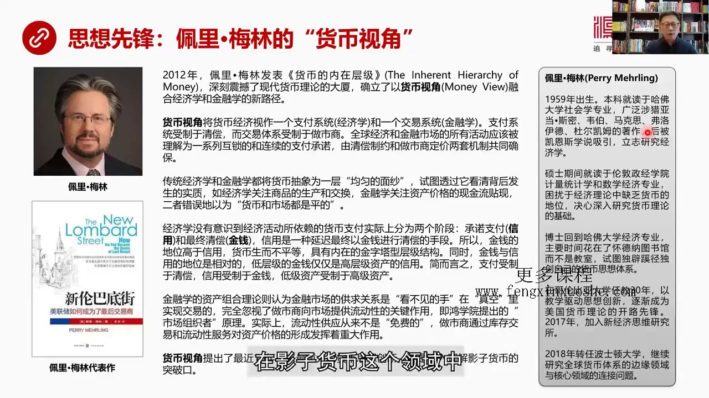

一個重要的開拓者我稱之為是影子貨幣或者叫現代貨幣體系的一種思想先鋒這個人叫佩里莓林它最重要的一個理論吧就是提出了一種我們稱之為是貨幣視角的這樣的一種思想體系首先我們要看一下這個佩里莓林是個什麼樣的人因...

<strong>All subtitles</strong>

> 一個重要的開拓者我稱之為是影子貨幣或者叫現代貨幣體系的一種思想先鋒這個人叫佩里莓林它最重要的一個理論吧就是提出了一種我們稱之為是貨幣視角的這
> 樣的一種思想體系首先我們要看一下這個佩里莓林是個什麼樣的人因為他的他的教育背景還有他做事的方法他對什麼感興趣這些問題在很大程度上會引導我們去
> 理解他為什麼會這麼想佩里莓林他是1959年出生的本科是哈佛大學讀社會學專業的注意啊他反而強調自己不是經濟學和金融學的所謂的這種科班出生吧他是
> 研究社會學的那麼研究社會學的人跟研究金融和經濟的這種科班的人最大差別就是社會學研究他的射力面非常廣他會讀很多思想思想史和哲學史會讀很多研究社
> 會很底層的一種理論比如說他在射力到經濟學方面的時候在本科說讀過壓當思密讀過馬克思維博還有馬克思佛羅伊德多爾凱姆等等這些呢著作當然也讀過凱恩斯
> 他在上大學的時候對凱恩斯的理論特別是凱恩斯關於流動性的產數把他深深信中他覺得流動性這詞很有意思走夢了好多年然後他的說實呢就到了倫敦政經學院學
> 的是機量統計和數學經濟專業因為他的他自己表述他的數學能力很強所以他想研究經濟肯定要從樹裡方向就是從樹裡邏輯來切入來理解整個經濟體系之間的韓助
> 關係就是我給你一個輸入通過一個韓宿韓宿的這種表達體系最後輸出是什麼找到中間的韓宿關係是一種機械論的思維方式所以他在碩士基間專門研究這個但是他
> 越研究跟著他的導師越研究越發現這個思想體系有問題就是現代的宏觀經歷學院的理論體系中基本上沒有貨幣的地位這是讓他非常的困擾就是說如果我們研究經
> 濟中間告訴你貨幣其實沒用貨幣只是一台巨型經濟機器外面包裹了一層面紗你要做的就是透過面紗看到它是本質看到生產和消費產品它是到底是怎麼真實發生的
> 錢不重要貨幣不重要他在研究生期間就在讀碩士間就深深地感受到這套理論當然也是現在直到目前仍然是佔主導地位的經濟學思想體系他認為是不靠譜的或者說
> 用這種方法是不可能真正抓住問題的本質就是當我們研究經濟你連貨幣都抽上走了只把他當中一個面紗他認為這個思路有嚴重問題但是後來我們看到佩玲莓林專
> 門探討過這個問題就是當一套理論體系你說你你是一個完備的精緻的一套理論體系如果你連零八年精緻危機都沒看出來這個體系有嚴重問題跟他早年的讀書期間
> 的這種認識是一致的所以他在碩士期間就決心不走這條路樹理經濟或者從數學建模從這個模型方式去研究經濟他覺得詞路不通他要研究更本質的貨幣理論的基礎
> 所以他博士的時候回到了哈佛大學經濟學專業這才真正的開始深入的理解經濟體系還有金融貨幣體系兩指之間的關係是在大學是在博士的時候進行了深入的探討
> 深入的研究所以他說他主要時間是花在了哈佛大學的圖書管理統而並不是在教師面聽課他的閱讀量是非常驚人的所以通過這個人的基本上發展陸近你可以看出他
> 很年輕的時候就在試圖建立一套讀幣吸進建立一套新的貨幣思想體系這是他的定位這個站位比較高海挖高度比較高後來這個梅林到了哥倫比亞大學當教授幹了3
> 0年做戲主任他說他做這個事最大好處是可以自己給自己安排課程我想講什麼就講什麼所以佩玲梅林的課在哥倫比亞大學是非常知名的來自全界很多很多人都在
> 看因為他的講法和他的思維方式跟傳統經濟學理論那真的是完全不同而且你聽他的課就覺得這個建築要比一般的經濟學理論要深刻了多因為他設立到很很底層的
> 哲學問題所以他是以教學作為驅動他思考的重要的手段他寫的書並不多只有三本但是他把大量時間用在教學上跟學生對話然後接受學生的反饋某種意義上有點像
> 柏拉圖的那種他們的那種教學方法所以這個人是當今是會一個非常少見的這麼一種人他不是靠法論文寫專注來提升自己的學術地位而是把大量時間大量經歷花在
> 真正搞明白貨幣經濟到底是怎麼回事而不是提之稱這是這個人很了不起的地方後來在2017年他他加入了這個新經濟思維研究所然後2018年現在他從這個
> 哥倫比亞離開之後呢去了博士頓大學也是在記憶部聯就因為他在紐約是在待凡了然後想換個更輕敬的地方趁下心來把傳統事情給徹底搞明白所以他現在還在繼續
> 研究全球貨幣體系的一些邊緣領域比如說未來的儲備貨幣應該是什麼樣他首先提出應該是一種商品儲備貨幣類型而不會再是現在這種以美國國債以美元體系為中
> 心的貨幣體系所以他的很多思維方式是源於他自己的成長經歷他自己成長經歷其實是源於他這個人的本質這個人的本質就是想把事情搞明白所以他跟一般的大學
> 的這些理論家們有有很大差異那麼2012年的時候他發表了一篇論文這個題目是貨幣貨幣的內在層級我覺得這篇文章出來之後可以說非常深刻地震撼了很多人
> 就是他顛覆了現在貨幣理論的大廈跟這個根基他提出了我們應該用貨幣視角來融合經濟學和金融學應該走一條新的道路什麼是貨幣視角貨幣視角其實是把經濟貨
> 幣經濟看成一個支付系統支付系統我們知道他其實背後就是傳統的經濟學就是你購買原材料生產產品供應鏈然後最後銷售都是一整套的支付廠家支付給源頭 源
> 頭在支付給上油然後最後消費者在支付最終產品一整套的經濟體系可以提煉成一個支付體系另外貨幣經濟另外組成部分是一個交易系統這是金融學研究的關鍵的
> 環節就是到底這個東西在市場中怎麼交易不管是食物還是金融資產交易這個體系至關重要那麼他說我們應該用貨幣視角把這兩個支付體系和這個交易體系融合在
> 一起他本來就是一回事就不應該把它割裂支付體系受制於清廠我們知道一切支付銀行貨幣支付受制於準備金的清廠交易體系實際上受制於做事商我覺得這篇文章
> 給我最大的一個震撼實際上是他對於做事商的偷側的產數我們以前覺得市場交易不就是交易嗎不就是你買我賣嗎當然我們洪炫的以前的核音客提出了市場組織者
> 這個概念但這個概念還比較虛而佩里梅林直接把這個市場組織者的概念落到了實處就是交易商交易商組織市場交易商負責用他的庫存來實現市場流動性的提供這
> 樣一下就把市場組織者這個概念給落到了實處而且從交易商試角來看實際你立刻會把很多供求關係中間的這個抽象理論沒有涉及道路細節全部給拎出來而如果沒
> 有這些細節所謂供求關係曲線決定價格等等這一套學說都飄在半空之中那麼全球經濟和金融市場所有的活動都應該被理解成一系列相互鎖定和連續不斷的支付的
> 承諾這樣才能構成完整的經濟和金融的鏈條那麼整個全球經濟和金融體系都是由互鎖和連續的支付承諾構成的然後由清藏制約和做事商定價兩套機制共同保證所
> 以我們看當一個人站位比較高的時候海拔高度比較高的時候他馬上能看清全局的問題而且把全局中間最重要的部分提煉出來然後構架一個完整的思想狂價來解釋
> 方向面面的所有問題所以佩玲莉莉我覺得可能是最近十年以來吧全世界在貨幣思想體系中貢獻最大的一個人那麼在他看來傳統經濟學和金融學都放了一個最大了
> 就都放了一個嚴重的這個毛病就是他們把貨幣抽象成一個均勻的面紗均勻的面紗這個面紗完全是同志同這個各方向是完全均勻的和同志量的然後試圖通過這一層
> 面紗來看清背後發生了問題的本質比如說經濟學關注商品的生產和交換金融學關注資產價格市場中交易的資產價格然後他的現金流貼線我們知道價格的形成都是
> 我未來收入多少然後根據我未來收入然後做貼線回來然後我現在我到底這個公司值多少錢這是金融學關注的重點那麼他們共同的錯誤在哪他們共同的錯誤就在於
> 他們認為市場是平的貨幣也是平的這是一個嚴重的錯誤這是經濟學和金融學犯的共同的嚴重錯誤就是經濟學其實沒有依照經濟活動一切經濟活動都必須要依賴貨
> 幣支付而貨幣支付實際上包括兩個階段第一個階段就是承諾支付我把銀行我讓銀行轉秘錢轉的我的買家或者我的賣家我從那買我就把錢支付給對方這叫承諾支付
> 承諾支付是承諾一種信用我會付你錢我們一般人腦子面包括經濟學院腦子面想到這事就完了實際上沒有完第二階段叫最終清藏就是最終清藏消耗金錢的金錢是什
> 麼當你通過指令銀行跟你轉秘錢的時候這個是從你的角度完了但是整個支付體系沒有完要取決這個銀行跟他的收款行之間在央行准备金賬戶上要做清算如果說有
> 家銀行他是准备金不夠這個支付就會失敗所以准备金是金錢而你承諾支付了銀行貨幣轉賬那就要信用金錢是高於信用的金錢是本質是負責清算的信用僅僅是承諾
> 以後我一定會用金錢來給你清藏而已所以信用是一種延遲最後以金錢進行清藏的手段那麼金錢他的地位是高於信用的貨幣生而是不平等的貨幣的體系他是具有內
> 在的金字塔行的成績結構的當然同時金錢和信用的地位是相對的你比如說銀行的貨幣對於我們老百姓來說那是金錢因為誰拿到銀行貨幣那就管用我可以用他去付
> 張餐李四王五但是對於銀行來說銀行貨幣或者銀行儲蓄僅僅是信用銀行的他的金錢是準備金是央行裡面的那個賬戶那個錢所以他是相對的銀行的貨幣對於老百姓
> 來說是金錢但是對於央行來說他只是信用這個就是我們需要理解金錢和信用這兩者之區別取決你在哪個層級上看問題那麼實際上低級就是低層級的金錢僅僅是高
> 層級資產的一種信用所以我們概括下來說就是經濟活動了一切支付受制於清藏信用受制於金錢低層級的資產受制於高層級的資產那麼我們看金融學比如說金融中
> 介理論的銀行資產組合理論這個理論認為金融事實上這個經交易是受共糾關系來決定的而共糾關系是一支看不見的手在真空裡面實現交易的注意在資產組合理論
> 中其實是很少提到共糾這個做事商的概念他認為只要有脈有脈金融資市場上有脈有脈他就自然會成交這個成交價在哪裡其實並不太重要反正他會成交只要有脈有
> 脈實際上在金融學的資產組合理論和主要理論體中間都完全忽視了做事商向市場提供流動性的至關重要的作用當然這就是我們提出的市場組織者的原理實際上流
> 動性從來不是免費的做事商是通過自己的庫存或者叫資產負債表向市場提供流動性的而這種服務他是要收費的而且這種服務對於價格的形成起到了重大作用所以
> 如果你不談作勢商就沒法談過去關係沒有辦法談市場交易因為誰在交易啊誰在提供流動性啊沒人提供流動性怎麼能成交呢這是佩里妹他的這篇論文給我一個很大
> 的起伏就是做事商的關鍵性的作用在我現在進一步提高他的觀點吧我認為沒有作勢商就不存在市場經濟整個市場經濟都是因為有作勢商存在才可能實現的而作勢
> 商他的作勢他的庫存他的資產負債表的管理有他自己獨到的一套獨特地一套經濟去原理這一套原理吃透了你才能搞明白這個市場價格究竟是怎麼形成的所以在我
> 看來佩里梅林的這個貨幣視角應該說是21世紀來吧我覺得是貨幣理論思想界最重要的突破只不過這個人很少寫什麼大眾也寫的書不多發表了文章呢他好像主要
> 時間經歷沒有放在這個上頭他主要時間經歷是放在教學上所以他並沒有在很大的圈子裡面形成巨大影響力但他的思想他的文章你看去你一看就明白前些一種但是
> 思想極為深刻所以這種文章或這種東西看就屬於超牛逼的人才寫得出來而他的這個貨幣視角也是建立影子貨幣整個思想體系的一個重要的突破口有了這個視角之
> 後再看影子貨幣的問題就能夠深入顧隨了我們再看下一頁首先來看他的第一個核心觀點貨幣內涵曾經結構

---

### Slide 4

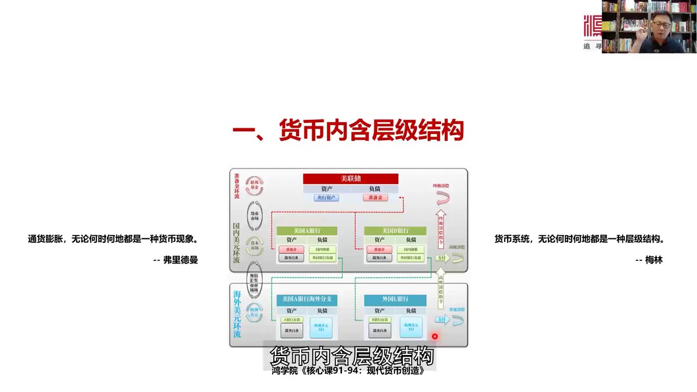

福利德曼曾經有一句名言通貨膨脹無論何時何地都是一種貨幣現象這種很有名所以人都知道一談到通貨膨脹都會以用佩里莓林也有一句名言現在還不太有名但是我認為未來會非常的有名他認為貨幣系統無論何時何地都是一種曾經...

<strong>All subtitles</strong>

> 福利德曼曾經有一句名言通貨膨脹無論何時何地都是一種貨幣現象這種很有名所以人都知道一談到通貨膨脹都會以用佩里莓林也有一句名言現在還不太有名但是
> 我認為未來會非常的有名他認為貨幣系統無論何時何地都是一種曾經結構想想看在他說這句話之前普通人哪怕是金融學經濟學這些專家們有沒有明確的這個概念
> 貨幣是分層級的大部分是沒有的專業人士同樣如此當然在我們核心課中黃炫在最近現在貨幣上到和以前的所有課中中我們已經引寒地提出貨幣是分層的比如說這
> 個我們把貨幣環流美元環流分成三個層次準備金環流國內美元環流和海外美元環流我們知道這中間是一道不同級別的清藏關係這個是我在讀梅林的論文之前做了
> 這個核心課我們已經感覺到了貨幣一定是分層前跟前是不一樣的但是看了他這個文章之後你實際上看到他把這個理論提練得更好他把他抽象化了我們只是在具體
> 的談美元環流所發生的資產費在表中間的變化讓我意識到這個美元跟那個美元是不一樣的海外美元跟國內美元是不一樣的國內美元跟央行準備金又不一樣央行準
> 備金的錢留不出來銀行貨幣體系的錢也不可能留到央行準備金裡面去美國這個金融體系或者要美國銀行的錢是不可能留到海外的海外的錢一分錢也留不回去所以
> 我們看到大量的報導中在反覆的錯誤的使用這個觀念比如說美元回流什麼叫美元回流不同資產費在表角度去看你根本就搞不懂或者是要形成錯誤的概念而且寫出
> 了文章會誤導更多人只有從資產費在表從作賬角度來理解才能理解為什麼準備金不可能被銀行拿去貸款也不可能是讓市場中去買東西為什麼美國銀行周轉的美國
> 的這個錢不可能留到海外才能真正理解這件事實際上我們在在我們的合金課裡面已經非常明確的提出美元還留分三個層次前跟前不一樣但是美零能夠把這種感覺
> 或者把這種具體事務的這種描述就是說你已經說美元分成三個環流它淋出來淋出來體驗成一個更抽象的架構而這個更抽象的架構顯而易見是一種新的思想體系所
> 以這個地方就讓我反覆的意識到其實我們中國人思維方式跟西方就是創造理論的他們這個強項相比我們還是有點弱我們弱的地方在於我們在思考問題的時候只是
> 在想這個事情本身比如說我在想美元環流的時候我聚焦於美元環流本身或者說自然不代表本身的變化太被具體事務所所吸引而忘了或者說沒有強烈的意識到需要
> 把它進行更高級別的抽象更高級別抽象之後會涵蓋更大的範圍會有更多的原理我認為中國在過去五百年沒有提出重大的理論的所有的原因就在於此我們太著重於
> 具體的事情被具體事情牢牢抓住我們的注意力而抽象往往上抽象讓你的覆蓋面更大讓它通一運更強這個思維方式我們不太具備或者我們不太習慣所以我們看到重
> 大理論西方提出來之後我們一學真是這麼回事但是當自己想實際上我們已經到了需要創造理論的時候了怎麼創造呢實際上你要跟自己傳統的過去過度被具體勢務
> 所僅僅抓牢的那種思維方式的解凸出來你要開始進行更抽象的涵蓋面更大的更結構化的這種思想否則沒法創造理論中國和西方現在的最大差距並不在生產、
> 芯片並不在生產、設備我覺得那都是叫一種思想層面東西了誤化的過程我們真正的差距實際上是在腦子裡是在腦回路上就是當你能夠創造思想理論體系的時候它
> 的誤化的結果就是你能創造大型複雜的機械大型複雜的生產裝備和非常複雜的算法其實背後的核心都是思想層面就是構造理論創造理論是一切的圓權當然這還需
> 要相當的哲學的思想高度我們看下一頁貨幣生而不平等我們看下它做的這個簡單的

---

### Slide 5

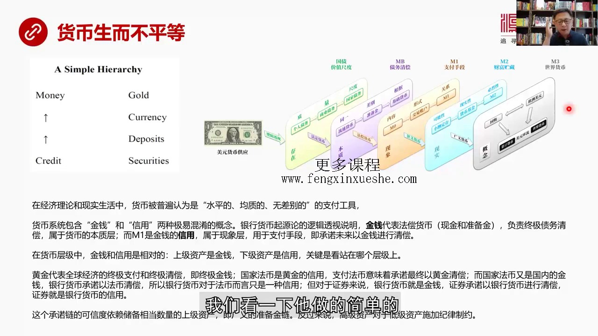

我們可以說是貨幣的層級或者叫資產層級實際上是一回事貨幣就是資產因為它就是資產的一種不管你是黃金還是法定貨幣還是銀行儲蓄還是證券債券等等你這一類的貨幣就是這一類的資產兩者是一回事所有的貨幣都是資產那麼我...

<strong>All subtitles</strong>

> 我們可以說是貨幣的層級或者叫資產層級實際上是一回事貨幣就是資產因為它就是資產的一種不管你是黃金還是法定貨幣還是銀行儲蓄還是證券債券等等你這一
> 類的貨幣就是這一類的資產兩者是一回事所有的貨幣都是資產那麼我們可以看到在它這個最簡單的貨幣層級中間它認為黃金它因為它是用一個大框架來思考問題
> 從金本唯一遇到今天所以它的很多想法是超越於當金的它認為黃金是在整個金塔的頂部這是層面最高級別最高的錢然後是主權貨幣然後是銀行創造的儲蓄然後是
> 政權市長交易的政權那麼對它來說左邊這一項對著什麼對著從系用到金錢的一個爬升過程就是高級的資產叫金錢叫盲利比它低級的是它的衍生物貨比它低級的東
> 西叫系用是錢的一種衍生也就是說主權貨幣是從黃金衍生出來的你有多少黃金準備創造多少你的主權貨幣那麼從主權貨幣或者叫RESERV或者叫準備金在派
> 聲出來的信用叫銀行貨幣你銀行沒有準備金創造什麼貨幣啊創造什麼銀行儲蓄你必須要有準備金否則你創造不出來創造出來你轉賬立刻你就破產了因為你沒有準
> 備金無法進行清藏那麼銀行儲蓄實際上又是更低級的資產就是不管你這個國債還是什麼什麼債你最後是沒有錢你怎麼能有這個債呢所以這個銀行貨幣或者銀行儲
> 蓄又是這種債券的金錢債券對於他來說又是信用所以這是一個相對的但是他的曾經結構很明確的金錢和信用的體系高級資產叫金錢低級資產比他低的叫信用信用
> 負責支付或者叫是一種支付的承諾承諾未來以金錢進行清藏所以信用是用於支付的金錢是用於清藏的而兩者之間的關係是相對的金錢在這個層面上比如說在銀行
> 這個層面上他的儲蓄對於老百姓來說是金錢但對於央行他不過就是準備金的一種信用所以金錢和信用取決於你在哪個層級上看他是相對的當然我們在銀行創造貨
> 幣創造這個理論中我們專門用這個邏輯透視法對這個概念進行的解讀比如說美元貨幣供應存在層它是價值齒動就是要有國債本製層是債務清藏就是一定要有一個
> 法定貨幣來進行清藏然後現象層是一種支付手段M1然後現實層是財富教堂M2然後世界貨幣層是美元環流實際上我們看到這兩種思維方式是不太一樣的我們用
> 的是黑格爾是邏輯透視它用的是一種金字塔型結構當然在我看來美國的很多包括這個梅林在內吧他們不太喜歡黑格爾的這種思維方式或者不太習慣但是我覺得黑
> 格爾的思維方式這個邏輯透視法應該說已經被反復證明是相當強大的這些也許是出於自己的個人偏好沒有去讀這個黑格爾說或者沒有讀明白也有可能是教育中間
> 有意的忽略的黑格爾的這個理論體系不管什麼原因吧我覺得應該把黑格爾邏輯透視法和這個貨幣層級的金字塔再加上環流我們提出了這個環流結合在一起才能得
> 到真正正確的東西或者真正更好的東西因為梅林金字塔它搞了貨幣金字塔最大的問題是比較在我看來比較僵化黑格爾邏輯透視很好把概念分了很清楚但它的問題
> 是沒有辦法跟很多具體的東西結合在一起就是它有點過度出現缺少實質的東西作為支撐我覺得美元環流我們提出美元環流實際上是用一種動態的思維這比較東方
> 化我們知道動態動態這種思維是環流這種思維是強烈的一種形象邏輯跟佩里梅林跟很多西方的包括黑格爾它們那種大型機械一個精密機械把整個世界想成一台機
> 器把整個經濟想成一台巨大無比的尺轌耀和東西這不太一樣所以我覺得這幾種思想方法底層邏輯要進行深刻的融合才能提出一個更牛的一個思想體系我們來看它
> 的具體展數在經濟和現身國中人們普遍認為錢貨幣是水平的沒有層一結構是均制的只要是錢一塊錢永遠等一塊錢中央一行一塊錢跟銀行貨幣有區別嗎沒區別你要
> 貨幣一塊錢跟銀行貨幣一塊錢有區別嗎沒區別是均制的無差別的支付工具主義這幾個概念都是錯的其實貨幣不是水平的貨幣是層一結構的貨幣不是均值的因為你
> 所在的資產的層級是分層級的還不可能是均制也不可能是無差別實際上在貨幣體中包括金錢和金錢和金錢有兩種非常容易混銷的概念沒林在這裡把金錢和信用分
> 得非常清楚就是金錢就是進行清廠最終清廠一定要用金錢用信用那只是支付支付只是一種承諾承諾還是要用金錢來清廠這就把問題講明白了而且什麼是金錢什麼
> 是信用看你在哪個層級說話我們邏輯透視吧曾經講過貨幣銀行貨幣的前論他的這個概念說明什麼呢金錢我們在用這套體系說話說金錢是什麼代表法常貨幣限定和
> 準備金我要在這個層面上進行清廠就是準備金是銀行體系的最終清廠清廠手段負責終極清廠他的目的就是做金中經廠屬於貨幣的本製層而ME呢ME是金錢的信
> 用就是是從準備金派生出來了所以他只是準備金的信用當你說我用銀行轉款進行支付從商家買一個衣服買一個鞋買個電器的時候你給他轉賬付款不論是手機還是
> 銀行卡還是信用卡還是任何這套東西實際上你是支付的銀行貨幣而銀行貨幣是種信用這個事沒有完成他收到之後並沒有真正的完成真正完成是要看對方的銀行有
> 沒有足夠的準備金來進行清廠如果對方銀行在央行的準備金沒有足夠的準備金進行清廠的話就是支付行如果沒有足夠的準備金進行清廠的話他就他就要限種麻煩
> 他必須立刻到比如說銀行間市場中去拆借準備金否則他這個支付不能最後完成所以這是兩部信用是支付但是沒有完最後清廠在準備金賬貨中金進行清廠採算支付
> 最終完成那麼M1其實是金錢的信用他是屬於現象層的是用於支付的支付了概念就是承諾未來以金錢進行清廠所以我們看到我們的邏輯透視法也可以把這個問題
> 看來很清楚M1支付在這但他清廠是在這這兩者是截然不同的那麼在貨幣層積中間金錢和信用的地位是相對的上級資產是金錢下級資產是信用關鍵是看著看你站
> 在哪個層積上當你在這個層積上說這是錢的時候在他上級來看這就是個笑話他本來就是我的信用他怎麼能是錢呢當然從下級來看銀行的錢就真的是錢站在銀行角
> 段說你算信用根本不是真錢我這個準備金才真錢但在國際上來看你這主權貨幣拿真錢你只是黃金的信用而已所以層積很重要當你說金錢和信用的時候一定要搞清
> 楚自己站哪層積是普通老外信是影子銀行還是銀行還是中央銀行還是在世界貨幣的這個高度來看問題那是不一樣的黃金代表全球經濟的中積支付和中積清場他是
> 一種中積的金錢國家法幣是黃金的信用支付法幣意味著承諾最終以黃金來進行清場而國家法幣又是國內的金錢這個銀行貨幣承諾以法幣來清場所以銀行貨幣對於
> 法幣而言只是一種信用對證券來說銀行貨幣就是金錢證券承諾以銀行貨幣來最終進行清場證券就是銀行貨幣的信用層層這個推演下去這是一個承諾鏈他的可信度
> 也就是他依賴我是不是有足夠的這個儲備上級資產的這樣的一種能力就是我有沒有足夠的上級資產是儲備我如果有比如說一家銀行我如果準備金賬貨中的錢特別
> 多我這個承諾就非常靠谱因為你無論誰轉賬我準備金面是有錢我都可以給你金錢清場所以對於每個層去來說這是個廣義的儲備金鏈就是準備金鏈對銀行來說他的
> 有足夠的準備金的儲備對於央行來說他必須要有足夠的黃金儲備或外匯儲備否則他守不住自己的匯率對於普通拉百姓來說你得有足夠的銀行貨幣的儲備或者儲蓄
> 你的銀行儲蓄得多否則你驚喜生活的毒打所以我們看到這實際上是一個儲備鏈的廣義儲備鏈的問題反過來說高級資產對於低級資產可以施加紀律制約準備金收和
> 放可以控制銀行貨幣的收和放就是準備金是高級資產銀行是信用那麼對於更下跡來說那你銀行信用的收就是銀行貨幣的減少和擴張又會影響普通老百姓和企業公
> 司做生意的人大家都會覺得銀根抽緊了我生意把我做了實際上上級資產永遠是管制下級資產的這就是貨幣生日不平等的一個主要的理論所以根據這樣的理論我化了一個貨幣金字塔這個金塔包括了他的梅林的很多概念

---

### Slide 6

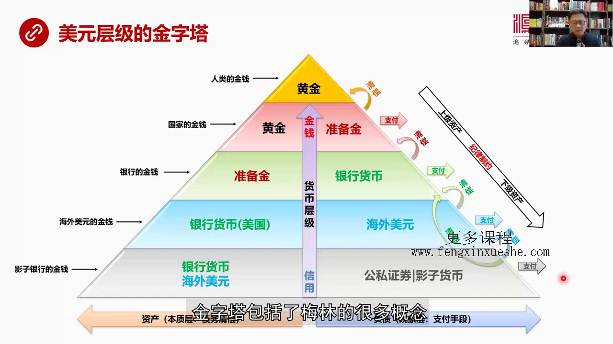

包括我自己的很多體會融合在一起我們可以看到這是一個長期金字塔黃金居於金字塔的頂端因為他不是任何人的負債他是獨立的不是其他人的負債永遠居於央行資產負債表的左端自然向下他永遠不會跑到右邊去無論什麼情況黃金...

<strong>All subtitles</strong>

> 包括我自己的很多體會融合在一起我們可以看到這是一個長期金字塔黃金居於金字塔的頂端因為他不是任何人的負債他是獨立的不是其他人的負債永遠居於央行
> 資產負債表的左端自然向下他永遠不會跑到右邊去無論什麼情況黃金不能待在負債段而其他所有的錢資產都有可能在負債短也有可能在資產短看你是在哪兒成績
> 比如說美聯儲印的美聯儲券或者叫美元超票在資產負債表的那端在負債短所以準備金也在負債短那麼他們跟他們相對應的是左邊的黃金他們是黃金的收據而已當
> 然還有他這個央行還有其他資產但是如果把其他資產排除掉僅以貨幣而論那麼黃金永遠待在資產短美元準備金基礎貨幣永遠在他的右端是他的收據而已或者是他
> 派生出來信用左邊是資產或者叫左邊是金錢右邊是信用或者上面是金錢下面是信用一樣我們看到黃金他的資產負債表一定在左端準備金是在右端這邊我們用這個
> 建筒表示這邊代表資產跟資產負債表的這個四位方式是一樣的這個負債是在右邊沒靈化的他的金層就化反了我覺得他把負債是化的這批資產化的這批而我覺得根
> 據我們正常人的資產負債表的概念的話左邊作為資產右邊作為負債更清楚所以黃金在左準備金在右黃金是金錢他就是信用但是在銀行第三層在銀行這個層級呢準
> 備金就變成資產了或者他就變成金錢了銀行貨幣或者創造了銀行儲蓄貸款創造的儲蓄就變成了負債或者變成了信用是準備金的信用準備金變成金錢再往下到了海
> 外美元體系那就是美國銀行的貨幣在海外美元體移中他又變成了金錢海外美元儲蓄變成了負債或者變成了信用在往下在影子銀行體系呢不管你是美國銀行體系的
> 這個儲蓄還是海外銀行創造了美元儲蓄都是金錢這邊影子貨幣這個叫信用影子貨幣中間又可以細分成比如說國債作為資產回購回購負債作為信用當然這是我們下
> 一步要重點探討了影子貨幣跟這套金貨體系略有不同不管怎麼樣我們可以看出這個金貨中間這是一個逐級放大的過程就是有個槓桿作用黃金最少底下這個信用最
> 大所以這個箭頭表示什麼呢最底層的下面的是信用貨幣層級按著這個貨幣樓梯不斷爬到了金錢黃金是金錢的這個最金錢的點飯那麼從資產貨幣表角都來看如果是
> 從金塔角都來看金錢在上信用在下從資產貨幣表角都來看金錢在左信用在右當然也是一樣的我們看到準備金永遠是高於銀行貨幣銀行貨幣高於海外美元還有銀行
> 高於影子貨幣所以我覺得用這樣的一套東西把他綜合體驗類企就能夠一幕了然的看清中間的邏輯結構那麼資產這邊都是屬於本質層因為他是金錢或者代表債務清
> 藏的邏輯透視的本質層負責債務清藏那麼負債這邊都是現象層它是用於支付的是一種信用是一種承諾未來用高級資產來進行清藏的這麼一種手段所以我們又把黑
> 格的這個邏輯透視整到在這上土上本質是在左現象是在右債務清藏在左支付手段在右如果從金層這個角落來說金錢在上信用在下從資產分在表角之中來說金錢在
> 左負債在右或者叫信用在右那麼我們來看一下黃金是什麼黃金是整個人類的金錢不需要任何法律規定沒有國家政府全世界政府都垮了黃金仍然是貨幣這就叫人類
> 的金錢歷經數千年顛鋪鋪貨無論你是美國存在大英帝國存在存在存在存在或者其他美國存在存在都不要緊所有國家都結體了都崩潰了人們還是會用黃金這就是歷
> 經歷史考驗人類文明的考驗的結果所以他是人類的金錢那麼黃金黃金是國家的金錢包括有黃金產生出來的這個準備金那麼銀行的金錢實際上是準備金就是銀行真
> 正對他來說什麼是金錢什麼是他的真錢準備金是上級資產那麼海外美元來金錢是什麼是美國銀行體系的錢對他來說那是真正的金錢是負責清藏的對於銀字銀行來
> 說他的金錢是什麼是銀行裡面的儲蓄不管是美國銀行還是海外銀行只要裡頭有美元的賬戶的數字那都是銀字銀行的金錢我們再從支付角度來看當這個準備金支付
> 的時候你會看到他最後是用黃金來進行清藏比如說外匯買賣如果說在金門位置下你要是把準備金或法定貨幣或者基礎貨幣支付給另外一個國際投資人那麼最終意
> 味著你的央行儲備黃金要從你的金庫中流失流到法國那麼如果在銀行體中來說比如說銀行之間兩個銀行就是你張三買李四的東西意味著你的開戶行A銀行就是你
> 刷一筆卡或者是用手機支付意味著你的開戶行A要轉一筆銀行貨幣到這個李四的開戶行BA銀行轉款到B銀行那他這個轉賬了過程真正發生的清藏是在央行準備
> 金賬戶上A銀行轉賬給B100塊錢意味著銀行的準備金賬戶中要化一百塊錢給幣銀行的準備金賬戶所以銀行貨幣上支付的時候一定是在準備金在央行上進行最
> 終清藏那麼海外美元也一樣在國際上倫敦的一家企業去購買俄羅斯石油如果必須要用美元的話好這個清藏在哪進行最終清藏是在美國蒙根納通花青銀行在他的賬
> 戶上進行進行清藏蒙根納通可能有俄羅斯天然氣的賬戶點進行銀行的賬戶可能有英國某家這個發電廠的賬戶你的轉賬當你說要付一萬美元給這個俄羅斯天然氣公
> 司的時候實際上是在美國的蒙根納通了兩個公司的賬戶中進行化轉所以為什麼美國可以切斷清算通道美元的清算通道可以讓俄羅斯啥也買不了這就是關鍵因為最
> 終清藏你在這兒用海外美元支付沒有用雖然你這個交易發生在瑞士發生在荷蘭但最終的清藏掉在美國的某家銀行清算行的兩個賬戶上而他只要美聯儲或者美國財
> 務部告他給我封鎖所有代俄羅斯的有俄國這個標誌的所有銀行的賬戶好當你發出指令在瑞士交易買一億美元的石油英國的這家公司開始化轉通知某個那通轉賬什
> 麼那通收到你這轉賬指令跟美聯儲或者美國財務部的指令一對賬發現對不起哥們收款行是俄羅斯的銀行我不能跟你轉所以這海外美元根本就用不了因為清藏被卡
> 住了這就是我跟你說當你化錢給別人你以為支付完成嗎沒有最終在清算清算行那兒進行最終的清藏這筆錢才算化過去東西才能這個交易才算完成銀資銀行貨幣一
> 樣銀資銀行貨幣因為銀資這個貨幣實際上是滲透在銀行和海外美元滲透在這兩指間而且比他們還要大但是不太容易表達所以我把它放到底部因為銀資銀行如果要
> 支付你用銀資銀行貨幣去買東西比如說你用回購回購負債去購買一個資產那麼這設計到你可以用如果你這個交易是方式在美國境內你最後的清藏是在美國銀行體
> 制內對重基金去買了貓咪貓屁買了這個貨幣市場基金的某一個比如說國債這個支付是用回購來完成的那這個清藏當然是錢是從貨幣市場基金化給你是在銀行層面
> 上是在銀行這個賬戶中進行化轉如果你是在英國做回購用的是美元做回購那就是在英國的海外美元的銀行體制中進行清藏所以這張圖我覺得把所有概念基本上全
> 部中共在一起而且我覺得我化這個東西特別是加上資產和負債這個方向顛倒過來之後會更加合理還有就是資產級別之間上級資產是制約下級資產的上級資產要減
> 小就是就像沙車或者雷馬江省一定會對下級戰的擴張產生強烈的制約作用上級戰增加底下資產不一定增加就像我如果推馬江省馬不一定會飛跑但是我拉江省馬一
> 定得贊助所以上級資產對下級資產是施加了紀律制約的好我們再看下一頁內前與外前我們可以看到

---

### Slide 7

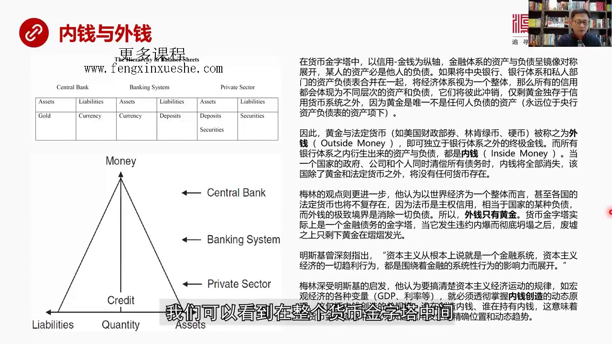

在整個貨幣金層中間金錢和信用是一個縱軸金錢和信用是個縱軸金融體系的資產和負債成競項對稱這邊這是沒力嫩的圖因為它用的是資產在左邊這個負債在左邊這兩邊右邊我覺得有點跟我這個資產負債表這個思維方式不太一樣所...

<strong>All subtitles</strong>

> 在整個貨幣金層中間金錢和信用是一個縱軸金錢和信用是個縱軸金融體系的資產和負債成競項對稱這邊這是沒力嫩的圖因為它用的是資產在左邊這個負債在左邊
> 這兩邊右邊我覺得有點跟我這個資產負債表這個思維方式不太一樣所以我把它顛倒出來但不管怎麼樣這是競項這邊是負債這邊是資產而且每集都是完全一樣就像
> 競項一樣也就是說某個人的資產必然是其他人的負債比如我們看它化的資產負債表中央銀行比如說黃金和貨幣黃金的資產貨幣就是負債對於普通上銀行而言當然
> 準備金carnancy或者叫準備金法定貨幣這肯定是資產對吧我放在資產上下負債是銀行貨幣我創造了創造了大量的儲蓄那麼對於普通老百姓或者叫企業銀
> 行的存款肯定是你資產那麼你對應的是債券我發信了很多債券在市場上當然我也可以持有別人債券我們可以發現這中間有個國衣率如果我們我們把這個央行的負
> 債和整個銀行的資產都是卡上水我們把他對銷划掉整個拿個購入把它划掉然後他的他的這個負債又是銀行的負債又是私人體系的這個資產又把它划掉最後我們發
> 現包括政券體系的這個資產和負債都是債券都划掉我們會發現整個的形容體系中由於這些對銷之後只剩下了黃金或者叫整個這個鏡像對稱的資產與負債層層每一
> 層全部一模一樣的你有多少自然我也多少負債全部給對銷掉之後只剩下黃金存在這是個非常重要的一個理念就是說如果我們想到某一個資產一定是其他人的負債
> 那麼如果將中央銀行、商業銀行和私人部份的這個部門的資產負債表合併在一起將整個經濟體視為一個整體那麼所有的信用都會體驗為不同層次的自然負債然後
> 彼此衝銷最後僅剩下黃金獨立於整個貨幣體之外因爲什麼呢黃金是唯一的一種資產而它不是任何的負債就是黃金永遠是黃金是唯一剩下的資產而且黃金這種資產
> 永遠不會成為任何人的負債所以它最牛那麼從這點我們可以看出黃金和法定貨幣比如說美聯儲的這個美國財政部券林肯綠幣印幣這都叫法定貨幣它被稱之爲是外
> 錢就是金融體系之外的錢奧散的盲利就是可以獨立於銀行體之外的終極金錢當銀行全部倒了當銀行體之內增長不在全部清銷了那麼你還能剩下黃金和這個財政部
> 券硬幣等等少數流通中的錢這個叫外錢而所有銀行體之內衍生出來的資產和負債都叫內錢這個內錢是什麼呢一個國家的政府公司和個人同時環境所有債務的時候
> 內錢將全部消失這個國家除了黃金和法定貨幣之外將沒有任何貨幣存在這個就是內錢和外錢的區別但沒了一個觀點它更走了一步它認為如果我們從這是從一個國
> 家角度考慮問題但是它說如果我們從世界經濟把它當成一個整體來考慮呢那麼甚至每個國家的法定貨幣也將不負存在因為法定貨幣不管是靈肯利益還是美國財政
> 部券財政部的這個財政部發行的這個票據你還是一種主權信用啊你還是一種信用你不是最終的金錢呢相當於這個國家的某種負債就是你以國家信用為擔保然後發
> 行的這個靈肯率幣那你還是以還是以國家未來稅收某種意義上還是以國家未來稅收作為一種抵押或者以地下的黃金礦產石油作為一種抵押然後創造它的信用而信
> 用永遠的信用地下的黃金才是金錢你這個東西如果無法兌現就是你永遠是出在一種負債的水平或者是要信用的級別你不是真正的金錢金錢是地下的金子挖出來之
> 後才採管用你跟我承諾半天沒意義所以當整個體系崩潰的時候你這個主權貨幣也沒有意義外前的最高境界極致境界就是消除一些負債當沒有任何負債的時候還剩
> 下的錢那叫真正的錢所以沒力認為外前只有黃金主權貨幣都不算貨幣金子塔實際上是一個金融債務的金子塔然後如果發生違約然後產生徹底的內暴炸垮之後貪它
> 之後肺虛之上只剩下黃金在意義發光民私基這個也是沒力非常推崇的他很多思想是原罪於民私基的民私基就從說過資本主義從根本來說就是個金融系統資本主義
> 經濟的一切驅逆行為都是圍繞著金融的系統性行為的影響力而展開就是資本主義的核心就是圍繞金子塔在賺所有的驅逆行動都是在金塔中我怎麼創造資產怎麼創
> 造對應的負債怎麼進行延遲之父等等所有的驅逆行為都可以理解成金融行為所以民私基這個觀點還是相當深刻的沒力呢深受民私基的啟發他認為要搞清楚資本主
> 義運動的這種經濟運動的最底層的規律比如說宏觀經濟觀察各種力量GDP怎麼樣然後失業率怎麼樣然後批派怎麼樣CPI怎麼樣利率怎麼樣你要把這些宏觀經
> 濟的各種變量搞明白就必須要透車的掌握內前創造了動態原理因為這都是內前創造衍生出來的這些內前是怎麼創造的內前創造了總規模式多大誰在創造內前誰在
> 持有內前在什麼倉位持有這意味著在貨幣金塔之中必須知道吸引用就是內前吸引用發生的精確位置和動態趨勢所以你看當梅林提出這樣一種思思的方法說你看看
> 他試圖用一種貨幣式角來打通宏觀經濟的很多理論體系和金融學了很多理論體系之間不相同的不堅榮的部分他要創造一種更大的統一的學說好我們現在翻下也現在第二部分講貨幣金塔的動態性

---

### Slide 8

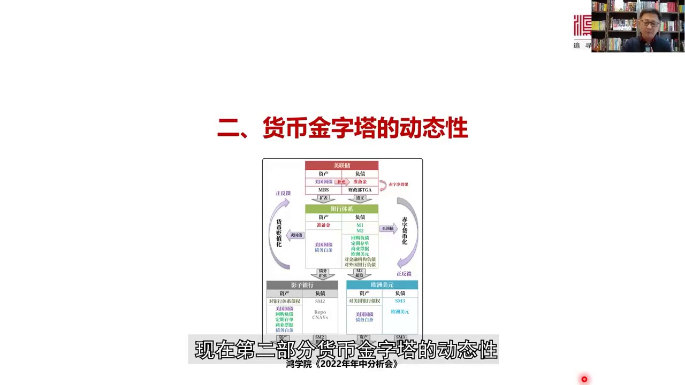

貨幣金塔我曾經在這個年中分析會2002年年中分析會總用了這張這張圖是在解讀美國在六七十年代如何進行這個擴表或者是中央一行進行擴表為了支持越南戰爭升級為了支持大社會計劃導致了後來七十年代的智障貨幣貶值美...

<strong>All subtitles</strong>

> 貨幣金塔我曾經在這個年中分析會2002年年中分析會總用了這張這張圖是在解讀美國在六七十年代如何進行這個擴表或者是中央一行進行擴表為了支持越南
> 戰爭升級為了支持大社會計劃導致了後來七十年代的智障貨幣貶值美元貶值和大同商米報漲智障了十年就用了這個資產負債表從中我們可以看到赤字貨幣化大量
> 的國債增發導致美聯儲的整個的負債表在膨脹然後又導致銀行體系的資產負債表在膨脹然後又導致底下的銀子銀行和歐洲美元海外美元的資產負債表在膨脹所以
> 這是一個可以說貨幣層級的擴張的過程這張圖表現是這個意思而媒體認為整個貨幣金坦這個層級結構不僅是存在著周期運擴張比如10年商業周期在擴張而且是
> 美食美課都在發生貨幣潮漆就是一會勇動起來一會收作回去這他的一個重要的觀點不僅是大周期而且包括一天之內他要起伏好多次我們看下一那麼梅林他認為貨幣金坦最典型的特徵就是他的動態性

---

### Slide 9

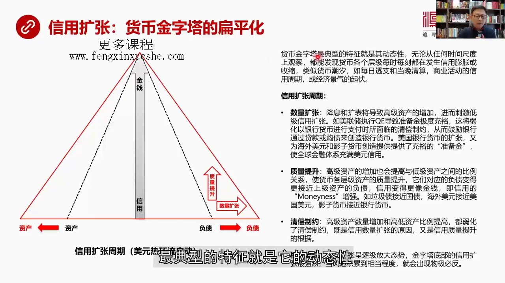

無論從任何十年齒度你從10年從百年10年還是從一年還是從一個月還是從一個星期還是從一天還是從一個小時任何十年齒度來看都能發現貨幣在各個層次上美食美課都在發生信用膨脹和收縮就像貨幣潮漆一樣比如說每天透支...

<strong>All subtitles</strong>

> 無論從任何十年齒度你從10年從百年10年還是從一年還是從一個月還是從一個星期還是從一天還是從一個小時任何十年齒度來看都能發現貨幣在各個層次上
> 美食美課都在發生信用膨脹和收縮就像貨幣潮漆一樣比如說每天透支了多少當天晚上要結算要清算商業活動的信貸周期那是個大周期或者經濟緊切的起伏那可能
> 是個更大周期所以他認為貨幣金坦隨時都在震盪一會變寬一會變窄那麼信用如果說從大周期久來說他是一個信用課章的周期那麼可以看出來金坦貨幣金坦他會出
> 現一個扁平化的趨勢就是本來金錢在這信用在這資產的這負債在這他是一個比較窄的金坦課章的時候我們會看到資產在往在往左運動負債在往右運動信用的數量
> 和質量都在發生變化這叫信用課章或者叫美元熱環流啟動了是一個意思信用課章周期首先是數量課章比如說降息縮表降息扩表這會導致什麼導致準備金增加呀美
> 聯儲印鈔票的市場上買國債把準備金注入給銀行體系整個銀行體系由於準備金增加這叫高機資產增加然後就會刺激低級信用課章銀行獲得準備金之後他就有能力
> 課章去創造銀行銀行貨幣了創造儲蓄了這叫數量刺激比如說美聯儲執行QE導致準備金極度充裕這將弱化什麼呢銀行貨幣金支付的時候他本來受到一個很強的制
> 約就是準備金夠不夠如果你準備金很多的話我這個清常制約就被弱化了我就不太擔心那個事了所以銀行就會放進大膽的進行貸款或者夠債就是銀行其實跟美聯儲
> 作的事是一樣的印鈔票買債券我從別人手中把債券買過來我就給你銀行銀行賬戶上打定一筆錢這個筆錢就要創造銀行儲蓄給你給我一個債我白一條放到我資產負
> 責表上我給你賬戶上打錢或者叫創造一個銀行儲蓄是一個性質所以買債券可以創造儲蓄買別人的貸款或者別人到你這留個白條你可以創造儲蓄到底是一樣那麼美
> 國銀行信用這個貨幣的擴張又會為美國的海外美元就是就是海外美元創造這個更多美元還影子貨幣創造更多貨幣提供了更加充裕的準備金就是美國銀行的存款貨
> 幣實際上是海外銀行創造美元的準備金也是銀行也是影子銀行體系創造很多影子貨幣的準備金這樣的話全球在擴張過程中就會充滿信用充滿美人的信用這是數點
> 擴張質量提升這個很重要就是高級資產就是準備金增加了那麼相對於第一資產比如說銀行儲蓄來說如果準備金增加了快就像擴表了初期那麼這兩者比例就發生變
> 化就高級再很多第一資產相對來說相對較少那麼這就回使這種比例增加好東西多了然後這個信用反而比較少這就會使各級資產的質量比例發生一個有利的扭卷它
> 質量會提升他們對應的負債就是銀行貨幣對應的負債如果準備金增加了銀行負債就是銀行貨幣銀行儲蓄它這種資它這種這個負債吧或者叫這種信用它的金錢性或
> 者叫moninus就會變得更像準備金同理海外美元變得更像美國國內美元或者說這個比如說銀子貨幣變得更像銀行儲蓄垃圾債更像國債所以這都是屬於在寬
> 送狀態之下第一集資產質量會被提升第一集資產質量提升因為他們所對應的信用變得更像上級的金錢這是一個非常重要的理念在寬送期信用的質量提升變成了接
> 近於金錢清藏制約當然清藏制約被弱化了因為高級資產多了第一集資產相對來說偏少這都是弱化了清藏制約這就會產成強大的槓桿效應因為這是金子塔越往底層
> 越往銀子貨幣它擴張的幅度越大或者槓桿效率越高這就是這就是銀子貨幣它膨脹了最快最猛在新來的寬送的時候所以這種槓桿效應體現在資產擴張成逐漆放大的
> 態勢金子塔底部的信用擴張最強烈當然當風險就是風險越來越多因為你擴張現在擴張到銀子成逐一定會有誤積幣反那麼底層資產或者是要長邊效應這個遠端就會
> 出現最強烈的反應這叫誤積幣反之後會在最底層或者在長邊的最遠端率先出現問題我們再看下一這就是信用緊縮進入另外周期了這個時候貨幣金塔開始倒翹化

---

### Slide 10

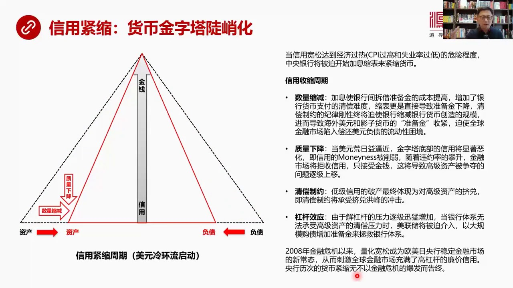

負債縮減資產也縮減然後信用質量下降數量收縮那元冷環流啟動比如說銀行這個信用當信用寬送擴張到了一定程度到了經濟過熱了比如說是一片過高事業率過低抵達了某個危險程度了中央銀行將被迫開始加稀縮表緊縮貨幣這就進...

<strong>All subtitles</strong>

> 負債縮減資產也縮減然後信用質量下降數量收縮那元冷環流啟動比如說銀行這個信用當信用寬送擴張到了一定程度到了經濟過熱了比如說是一片過高事業率過低
> 抵達了某個危險程度了中央銀行將被迫開始加稀縮表緊縮貨幣這就進入了收縮期首先數量縮減加稀是銀行之間拆借準備金的成本變高增加了銀行貨幣支付的清長
> 難度就是你借準備金變成本變高不容易了那麼我創造大量銀行貨幣我就會擔心這個清長會不會出事啊縮表呢那他更明顯了直接導致準備機降降是整個銀行體系的
> 清長發生困難清長制約的紀律剛性中將迫使銀行縮減創造信用的規模然後會導致銀資銀行和海外美元準備金收緊迫使整個全球金融市場陷入長緩美元負債因為你
> 寬鬆的時候我之所以創造這麼多貨幣是源於我有這麼多創造這麼多債務不管是夠債產生的還是別人給我寫的簽條我這個債務已經產生了是別人產生的放到我自然
> 負債表上這是剛性的你收縮了好這篇是債務收縮不了他是剛性的所以我們就會看到金融市場會陷入長緩美元負債的流動性困難這就是理解了美元環境之後你會知
> 道只要美國開始收縮意味著準備金在減少意味著海外美元的準備金在減少意味著影子銀行準備金在減少那我已經充分施展發揮槓耳力做到最大極限的美元負債能
> 不出問題嗎你一定會陷入這個流動性的問題了那大家都會去搶美元當然美元資產自然會升值或者叫美元的會議自然會升值了這就是為什麼一旦開始緊縮全球美元
> 越遠端的美元的利率越高會率美元就會大幅上漲美國越到危機會去上升越快原理就在這看明白這個收縮的金子塔底部收縮幅度最大上面逐層減少你會知道底層越
> 遠端必出問題同時質量有的下降因為美元荒越來越靠近了所以金子塔底部的這種信用附帶這邊這種所代表的信用將會顯著惡化就是Maleness的這種金錢
> 性削弱了然後委員率不斷在上升金融市場最後據收信用你再給我信任我不要我只要金錢我只要上級資產這就會導致高級資產被爭奪或者叫被幾對問題就會往上層
> 移從底層再上一個台階到上層去發生幾對這就是一道清廠紙約了低級信用了破產最終會體現為對高級資產的幾對那麼高級資產在做清廠的時候就會承受幾對洪峰
> 的衝擊因為底下這一層的規模太大我如果移動到上層銀行你不是給我負責清算嗎不管是美國銀行還是海外的銀行大家都要搶委員都要搶這個我不要這些影子貨幣
> 也不要這些海外美人了這些東西不值錢了我一定要銀行儲蓄中這個美人如果大家都搶這個那就意味著銀行發現它準備金不夠了因為大家都要這就會涉及到中央銀
> 行準備金贊貨中這個錢我夠不夠了問題如果不夠銀行就會出麻煩就會爆發銀行危機那麼這個港港效應當然這是個盜港港效應由於解港港的壓力逐級訓盟增加因為
> 底層大上面小越往上底下堆積的這個幾對壓力越大當整個銀行體系沒有辦法承受高級資產這種清廠的壓力的時候美聯儲將被迫介入以大規模構債印鈔票買債券把
> 鈔票就是準備金注入銀行體系來緩解清廠危機所以真正的危機是屬於高級資產的清廠危機高級資產不夠了第一次賺太多我的媽呀最後中央銀行必須要介入給這個
> 高級資產注入它的數量來是兩者之間實現平衡如果這個一般普通加息和說表還不足以影響這些錢因為普通加息說表銀行逐級的美金行都有一定的抵抗力就是如果
> 你們影子貨幣收縮了我這邊可以創造更多領行信用然後使你兩者之間的比例不太不至於太逆轉所以在一般情況之下小幅度的加息普通的經濟上這個衝突和收縮不
> 會破壞這個大傻的穩定性但是當幾對的規模大到一定承怒或者當縮表的幅度大到一定承怒的話這個幾對就會超過各級銀行和做事商的承受能力那就會發生重大金
> 融危機08年金融危機來量化寬鬆成為歐美日央行穩定市場的一個常態吧從而刺激的全球金融市場充滿了高貝槓杆和廉價信用央行利金這個貨幣的這個危機之後
> 每一次都是用的這個注入貨幣注入準備金來挽救所以我們看到正是由於你用的這個拯救方式讓每次都讓這個市場充滿了廉價的信貸你會發現收縮的時候央行歷次
> 加息作表沒有一次有善中一定會出事因為一次一次的鼓勵是所有人都依賴央行所以你寬鬆的時候我就拼命放貸影子影像拼命擴張幹嘛你做的做到極限你收縮的時
> 候我指望你來救我所以我你擴張是我敢幹所以每一次每年處加息作表沒有一次不出現重大的金融危機我們看到上一次2008年三次QE完成完事之後進行量化
> 寬鬆的緊縮QT到了2019年全盤崩潰每年處立刻介入其實2019年9月爆發的回購前方每年處大規模介入距離2020年3月新冠疫情爆發時間是非常短
> 的在我看來2020年3月這個新冠疫情爆發跟這個事是一脈相成的就是縮表縮表一定程度會引發一個大雷爆破每年處被迫注入5,000億的準備金結果沒多
> 久到2020年3月市場又不行了當然我們看到就是股市四次中斷了現在每年處要加息作表學大都是認為這沒事因為好像能扛了過去你如果你真懂貨幣金字塔層
> 級金字塔你真明白這種擠壓在底層會到什麼多大規模的收縮你就會很擔心這樣的收縮的力度是不是遠遠成超出了各級銀行的承受能力而大家沒如果你沒有這個理
> 論體系腦子麥跟腦袋又不是這麼長的你認為所有貨幣是平的沒有層級那你根本意識不到這是個問題因為錢有的是流動性很多呀海外美人這麼多你這貨幣更這麼多
> 然後這個美國的銀行儲蓄也這麼也這麼多準備金還這麼多你如果是水平層面看的體你會發現天啊這個流動性太好了我們錢太多了這怎麼可能收縮怎麼可能導致危
> 機呢那就是因為腦回路不對你如果有了金塔這個形狀你會明白我的天啊這個金塔這麼擠壓非出事不可所以新的理論體系對於我們理解金融危機是非常重要的我們再看下一中買效益稀缺性和彈性

---

### Slide 11

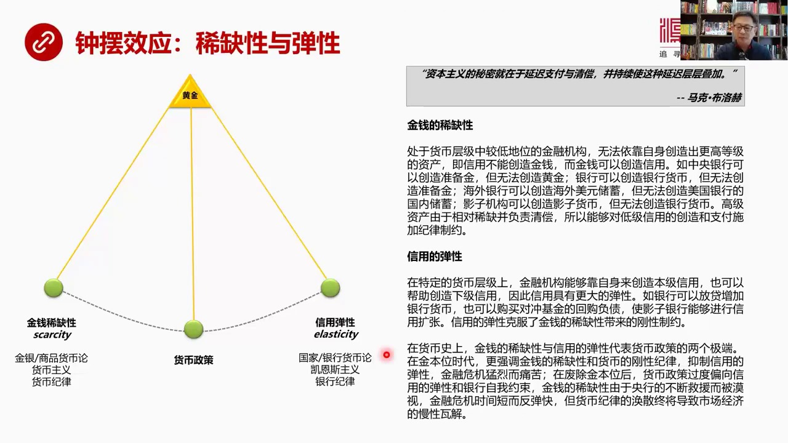

所以我們如果用一個中百來形容我們會看到這代表貨幣政策我們會看到這個貨幣的金字塔實際上就好像一個懸掛的一個懸掛的球然後它始動是從貨幣的極度寬鬆然後反向運動到貨幣極度稀缺加以縮表加了一層路然後導致金融危機...

<strong>All subtitles</strong>

> 所以我們如果用一個中百來形容我們會看到這代表貨幣政策我們會看到這個貨幣的金字塔實際上就好像一個懸掛的一個懸掛的球然後它始動是從貨幣的極度寬鬆
> 然後反向運動到貨幣極度稀缺加以縮表加了一層路然後導致金融危機金融危機導致流動性危機大家都沒錢了然後再反向運動回到貨幣的中性狀態然後再到貨幣寬
> 鬆加這個三次量的寬鬆五次量的寬鬆QE5等等然後到了應用程度它又會往回反這不僅是一個短週期或十年或五年的這種週期震盪其實從更長遠歷史來看它也是
> 兩種貨幣思想貨幣理論還有貨幣主義的較量比如說金錢稀缺性這邊它所對應的理論就是商品貨幣理論馬克思的包括從亞當斯密的馬克思他們都是商品貨幣論他們
> 是認金銀本位的強調貨幣一定要稀缺金錢一定要稀缺物以稀為貴一定要強調剛性紀律這叫貨幣主義好與它向反的貨幣談這個所謂談信用談信理論那就是國家貨幣
> 論MNT就是現在的現在貨幣理論MNT包括更早的貨幣理論實際上是這個Cupna提出來的國定論還有銀行貨幣論所以從德國人那個時代其實應該是在20
> 世紀初Kanapu他們那個時代實際上是代表了德國人一個非常強調國家政府來統統經濟的這麼一種思維方式那麼跟它向對應的就是國家只要有這個需求我就
> 要創造我們的貨幣因為貨幣是國家來法定的跟它向對應就是銀行貨幣論銀行貨幣論認為信用是是有深深信的我必須要有彈性我才能滿足經濟貿易的增長那麼它的
> 主義呢當然就是凱恩斯主義為代表因為當時英國金本位已經破產了它不搞信用擴張那英國經濟就停止不錢了沒發發展所以凱恩斯其中凱恩斯主義就是政府為了宏
> 觀的計劃宏觀經濟的發展要進行透支然後要進行花錢然後要降低利率金本位不重要金本位可以被廢棄彈性主義後來就發展中戰後了這種大政府主義然後不斷的靠
> 政府來刺激經濟包括現在我們看到一旦出事都靠政府出面然後來加大投資然後改善經濟三項馬車跑起來等等然後這個信用彈性理論實際上它所強調是一種銀行紀
> 律對應是貨幣紀律這兩者是不一樣的銀行紀律是我們可以自律我們可以自我管理像2008年金融壹之前這個美聯州主席葛林斯灣就說嘛我們現在要鼓勵金融的
> 自由化鼓勵市場競爭因為我們需要相信銀行他們是有自律精神的他們是可以自我管理的不需要政府說成倒死結果我們看到2008年金維基基本上脫垮了所有銀
> 行如果不救助的話那麼基礎體系將不負存在其實我覺得這個馬克布羅賀把這個問題看得很明白它是一句明言叫資本主義的秘密就在於延遲支付與經常並持續使這
> 種延遲層層跌加馬克布羅賀這個馬克布羅賀它是這個布羅戴爾的相當於布羅戴爾的師父是法國的著名的這種社會學家對社會問題看得非常痛對經濟問題也是一針
> 見血布羅戴爾當然就是我反而給大家推薦的地中海和菲律賀二世的地中海世界那本書就是布羅賀跟這個布羅戴爾他們是一個思想體系的所以他把資本主義的秘訣
> 找到了就是延遲支付延遲支付和經常就是我讓支付和經常發生了越晚越好我這個後皮就是拉了越長越好然後並是這種延遲層層跌加比如說黃金支付大家都用金幣
> 我的天啊那個記錄性太強後來我用了銀行券替代黃金銀行券交易然後最後到了某一個時刻大家才去對換黃金所以這就延長了支付和經常然後再往後又到了比如說
> 海外美元又到了這個影子貨幣那就是這種跌加在一起的支付和經常的過程變得更加延長而對應黃金還是這麼多所以支付和經常的延長和彈性使得資本主義能夠就
> 形成資本主義的秘密就是資本主義能夠持續不斷的存在一個最重要的原因就是延長了他的支付和經常也就是說是吸引了彈性變得非常強但是後期間拉過猛了他會
> 彈回來這次經濟危機金融危機爆發得更遠但這個馬克思在資本論中已經已經正確的描述這件事部落賀是從另外一個層次從支付和經常的延遲上反過來再說明這個
> 問題我覺得說得非常好金錢的吸血性我們知道金錢永遠是吸缺的因為處於貨幣層級比較低地位的金融機構他沒有辦法依靠自身創造更高級別的資產就是信用不能
> 創造金錢但是金錢可以創造信用金錢之所以也是吸缺的是因為下層的金融機構創造不了上層資產比如說中央銀行可以創造準備金但是無法創造黃金因為黃金高於
> 準備金銀行可以創造銀行貨幣但無法創造準備金海外銀行可以創造海外美元儲蓄但無法創造美國銀行的國內儲蓄還有銀字銀行可以創造銀字貨幣但沒有辦法創造
> 銀行貨幣高級產由於相對的吸缺而且負責清場所以能夠對低性低級的信用創造還有他的支付施加紀律的影響施加這種制約吧所以我們可以看到金錢天然是吸缺的
> 因為只有上級資產能創造上級的金錢中在他以下的沒有辦法創造比他更高的這種金錢所以金錢永遠是吸缺的信用永遠是多的那麼信用的彈性就是信用是有彈性的
> 因為在每個特定層級的貨幣層級上金融機構都是可以依靠自身來創造本級信用的也可以幫助創造下級信用因此信用具有更大的彈性比如銀行可以放貸增加銀行貨
> 幣增加本級信用也可以購買對重基金的回購負債實以能自銀行能夠進行更大的信用擴張信用的彈性克服了金錢的吸缺性帶來的剛性制約所以這兩者天生是矛盾金
> 錢的吸缺性和信用的彈性這永遠是處在變成矛盾之中的在貨幣史上金錢的吸缺性和信用的彈性代表著貨幣政策的鏈子金錢的吸缺性和貨幣的剛性紀律一致信用的
> 彈性所以金融危機爆發的時候會非常的猛烈和痛苦在廢除金本位之後貨幣政策過度偏向信用的彈性和銀行自我約束金錢的吸缺性由於央行不斷的救助不斷注入準
> 備金慢慢這個事就被淡忘了所以後來的金融危機爆發的時候所以後來的金融危機時間短而反彈快最明顯就是2020年3月爆發的金融危機時間非常短特別快但
> 是它的代價是什麼代價是貨幣紀律的換散或者當然無存最終將導致整個市場經濟體系的慢性瓦解誰讓你看了金市場反彈很快你以為它經濟好嗎整個市場經濟所有
> 交易體系的本質被瓦解了市場經濟的效率會越來越低因為所有人都在指望央行的幫助而央行這樣這樣來看的話它是整個市場的資源配置出現了嚴重的扭曲該死人
> 大量的存在而且活得很好結果本來想著壯成長的新生的經濟的描頭描著全被那些佔用了過多的資源的那些本該死去的經濟部門所佔用你就一直新的東西的發展整
> 個這樣的發展人總的趨勢是金融市場反應越好痛苦越是短暫那麼你整個實際經濟就會變得越差而且是逐漸的瓦解市場經濟體系的瓦解是整個效率的不斷降低從傳
> 染來看這不就是大國衰退了嘛大國就衰落了我們再看下夜這就需要我們理解

---

### Slide 12

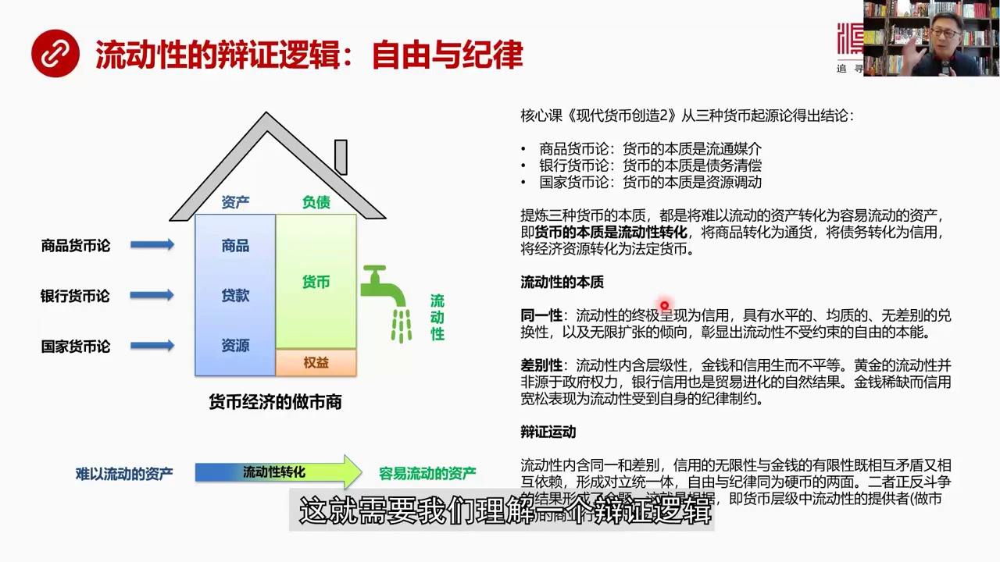

一個變正邏輯就是流動性的自由和紀律為什麼是流動性為什麼我們要強調流動性其實我們在現在貨幣創造核心課中第二部分我們講到了三種貨幣起源銀行貨幣論商品貨幣論銀行貨幣論和國家貨幣論對於商品貨幣論而言貨幣的本質...

<strong>All subtitles</strong>

> 一個變正邏輯就是流動性的自由和紀律為什麼是流動性為什麼我們要強調流動性其實我們在現在貨幣創造核心課中第二部分我們講到了三種貨幣起源銀行貨幣論
> 商品貨幣論銀行貨幣論和國家貨幣論對於商品貨幣論而言貨幣的本質是流通媒介馬克思的流通媒介是商品貨幣的本質它就是要出境流通的銀行貨幣論貨幣的本質
> 是什麼是債務清藏國家貨幣論貨幣的本質是資源調動國家為了完成一個偉大的東西需要調動經濟資源所以貨幣的本質是用它來調動資源提煉三種貨幣的本質這三
> 個本質有什麼共同性嗎流通媒介債務清藏資源調動實際上它共同的本質都是將難以流動的資產轉化為容易流動的資產所以提煉出來貨幣真正的本質無論這三種貨
> 幣怎麼說貨幣的本質是什麼是流動性的轉化就是將商品轉化成貨幣商品貨幣論的主要的觀點將債務轉化成系用高度流通性的系用這是銀行貨幣的觀點將經濟資源
> 轉化為法定貨幣這是國家貨幣論的觀點所以三種本質提煉起來在進行進一步抽象實際上是一種本質就是流動性轉化這就是貨幣真正的本質這當然也是紅圈以後再
> 探討以後貨幣探討一些貨幣的一個中心的出發點流動性如果形象來說這就好比我們可以用一個資產貨幣表來來做一個形象說明資產一個國家我們可以把這個作為
> 一個國家整體它這資產有商品貸款經濟資源它的負債就是貨幣還有當然國家的這個剩下最有資本金或者叫權益這是國家資產率表我們可以看到商品貨幣論是將商
> 品轉化成貨幣這是馬克思所說的一切商品相互競爭在身上中競爭都會永限出通過來通過最後又會經常成黃金所以商品最終是通過這個過程轉化成了貨幣然後這個
> 國家就像水中頭一樣扭開之後就會有大量流動性這就代表是這個所謂的市場的流動性意味著什麼意味著市場的活動流動性越強說明市場越活越市場活越說明整個
> 經濟發展越繁榮所以商品貨幣商品貨幣論是將商品通過貨幣的貨幣經濟的做事商把這種不可流動的東西轉變成高度流動性的貨幣轉變成流動性促進整個市場繁榮
> 那麼一樣貨幣論呢是把貸款貸款當然沒法流動比如說你貸給張三五百萬因為他買了一套房這個東西怎麼轉上給李思啊不好轉上所以銀行貨幣論是把不可轉移的很
> 難運動的貸款轉變成貨幣就是我買了一貸款創造了銀行儲蓄銀行儲蓄就是錢就是銀行貨幣呀一美元算一美元一人民幣都可以迅速地通過流動性轉化進行對市場的
> 刺激它可以直接花呀你花這個錢背後實際上不可移動是不可流動的貸款國家貨幣論國家貨幣論講的是將國家資源比如說一個礦山一個油田一個大型的一個資源本
> 來不可流動轉變成國家的貨幣法定我認為整個我以它為抵押創造多少流動性創造多少貨幣來流動性就直接可以這麼做所以整個國民經濟無論你是商品銀行還是這
> 個國家貨幣論都是把商品貸款的資源進行了流動性的轉化而做這件事情的最主要的一個最關鍵的角色或者是市場經濟的核心是誰是做事商做事商擁有庫存再把這
> 些庫存轉變成流動性這是要付出巨大代價的所以我們可以看到整個貨幣的本質就是將難以流動的資產這三種轉變成容易流動的資產就是流動性轉化所以貨幣的本
> 質是什麼是流動性轉化那麼流動性的本質是什麼這就有意思我認為這叫從從特別是從黑格爾的本質論的規律中我們可以去探討一番因為黑格爾在談到本質本質中
> 間有個非常重要的規律就是我們變成法裡面其實並沒有強調就是投一性和差別性之間的變成矛盾這就是本質本質的唯一的什麼叫一個這個一個事物的本質首先它
> 有同一性然後同一性中隱藏著差別性兩者之間的變證鬥爭或者叫正反和運動最後會產生一個根據咱們在去年的核心課面專門講黑格爾的這個本質論壽專門探討過
> 如果大家忘了可以回個頭去看一看首先同一性同一性是什麼就是一個流動性它最終的表現形式是信用就是充分的完全流動的東西那麼流動性如果都是水就像水一
> 樣它當然是平的而且是均質的水分則和水分子沒區別而且是無差別的它必須要有水平性均質性無差別的對換性就這個貨幣和另外一個貨幣完全是一對換的沒差別
> 所以水平均質無差別是流動性的同一性同時流動性還具有無限擴張的本能傾向就是它會自我擴張這張顯出流動性不受約束的自由本能因為它就像水一樣只要有個
> DUR的地勢我就流過去不受一致不受約束這是流動性的本質是流動性的追求自然追求自由的一種本能但是流動性內在又有差別這個差別是什麼它有層級呀天然
> 就有層級性金錢和信用生而不平等我不敢也說了半天金錢和信用不相等那麼黃金流動性比如說黃金流動性它不是源於政府的權利銀行的信用它是貿易進化的自然
> 結果這些東西是天然形成的而天然形成的流動性就分層次所以它分這個層次從根本來說蓋過生育句話就是金錢是稀缺的而信用的信用是寬鬆的信用是有彈性的這
> 就使得流動性這個概念充滿了矛盾一方面它是水平的無差別的均勻的一方面它是層級的因為中間有些金錢更稀缺信用更有彈性這不是天然的矛盾嗎就是一個要追
> 求自由一個受自身就是一個在追求自由的天性的過程中又受到自身的激烈性的約束這是典型的黑格爾式的矛盾同一和差別的矛盾所以就一定會引發變成運動流動
> 性內含同一和差別信用的無限性信用可以無限課章和金錢的有限性兩者寄相互矛盾又相互依賴形成了對立同一體所以自以這個流動性的自由和流動性自我內含的
> 紀律同一硬幣的兩面那麼這兩者會發生正反的矛盾鬥爭就是正題和反題相互博弈相互鬥爭最後會計畫出或叫形成合體這合體是什麼就是根據就是貨幣層級中的流
> 動性的提供者也就是做事商他做任何商業行為的出發點我們知道同一差別他這是正題反題合體什麼是根據這根據是什麼是別人衍生出來的別人做事的根據由著根
> 據出發做事商流動性的供應者做事商會採用這樣的方式去做事會這樣提供流動性所以這就是我們對流動性變正邏輯的這種思維方式這也是在於在我看來這也是梅
> 林也好還有很多這個美國的學者他們尤其不擅長或者尤其不喜歡用這種變正邏輯的思維方式他們表示中都是比較機械化的比較機械的比較單一的實際上我們如果
> 加上變正運動的概念會是整個概念活起來整個體系會有更大的動力這就是我們要做到一方面融合一方面超越我們再看下一頁做事商我們剛剛所說的

---

### Slide 13

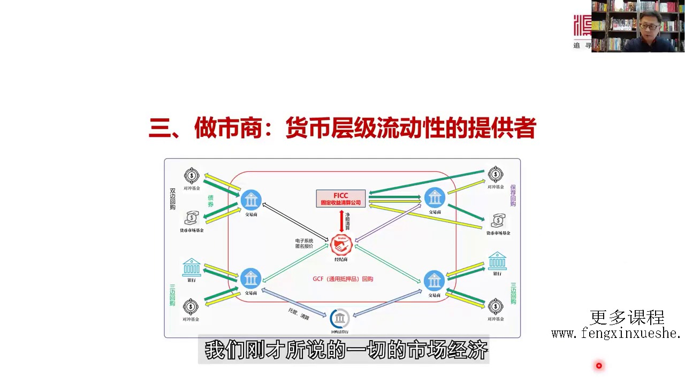

一切的這個市場經濟實際上都是由做事商來提供的流動性沒有流動性就不會有市場經濟嘛所以做事商是整個市場經濟的核心或者叫我們所說的市場組織者他的一個點形代表做事商金融的做事商也為整個貨幣成績每個成績都要提供...

<strong>All subtitles</strong>

> 一切的這個市場經濟實際上都是由做事商來提供的流動性沒有流動性就不會有市場經濟嘛所以做事商是整個市場經濟的核心或者叫我們所說的市場組織者他的一
> 個點形代表做事商金融的做事商也為整個貨幣成績每個成績都要提供流動性他是貨幣金子塔的流動性的提供者我們以前和印克中曾經多次談到過美國的做事商制
> 度他跟中國不一樣中國的經濟中間非常缺少做事商比如說我們的股票都是集合進價全都是經濟系統並綽合的而美國的川普那斯大克之外其他主要的債券商股票上
> 都是有做事商的我們長期來非常低估做事商的作用而且我們要甚至要幹掉所有中間商幹掉所有中間庫存這個思路沒有比這個思路更偏離市場經濟的這個基本的原
> 理我們這思路是完全錯誤的因為市場經濟就是要靠做事商沒有做事商的話市場經濟就不符存在了想想看如果沒有做事商提供流動性當整個市場逆轉的時候比如說
> 股票市場大家都買了立刻市場中毫無流動性這個價格的暴跌會出現非常嚴重的局面比如說現在房地產典型出現就是缺乏流動性缺乏流動性整個市場賣不動了所有
> 的人依靠房地產不管是企業也好還是個人也好還是房地產商也好還是銀行也好如果沒有流動性提供者會都死在這個問題上或者說就像長江水系如果沒有洞丁湖沒
> 有不洋湖這些巨大的水這種水域來吞吐長江洪水然後在乾汗的時候利用這些水提供為乾汗的這個裝家提供流動性提供這個灌蓋那長江江會變成一下暴雨天就是洪
> 水飯爛結果一乾汗那整個長江間點這個就不叫市場經濟了如果市場經濟發生的那樣這個經濟體會變得非常脆弱我們看下一頁廣義的做事商是什麼是市場經濟的組織者

---

### Slide 14

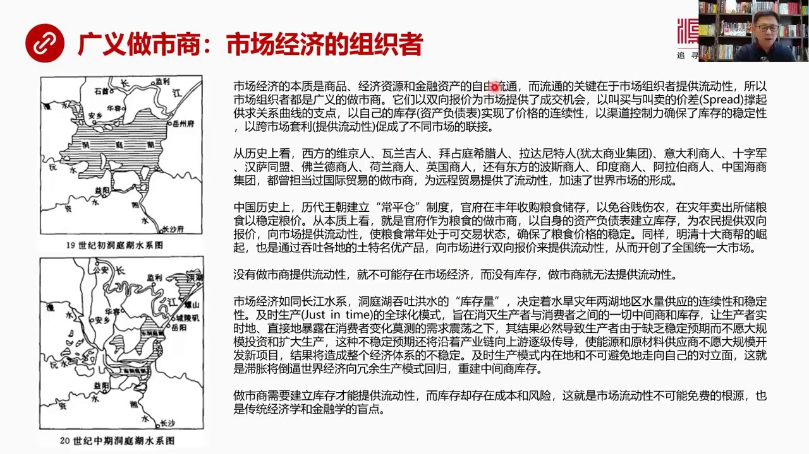

因為我們想市場經濟本質是什麼就是商品經濟資源和金融資產的自由流動而流這個自由流動的關鍵就是流通之所以能流通起來就在於有市場組織者提供流動性所以所有市場組織者都是廣義的做事商做事商是一個典型特點是雙向暴...

<strong>All subtitles</strong>

> 因為我們想市場經濟本質是什麼就是商品經濟資源和金融資產的自由流動而流這個自由流動的關鍵就是流通之所以能流通起來就在於有市場組織者提供流動性所
> 以所有市場組織者都是廣義的做事商做事商是一個典型特點是雙向暴價為市場提供成交的機會教賣價和教賣價的價差用這個教賣價和教賣價的價差來支撐幾共求
> 關係的支點所有我們的傳統經濟學面將共求關係的時候都忘掉了教賣價和教賣價的價差做事商為什麼要幹這個事所以研究共求關係的基本的出發點是研究做事商
> 的經濟學他為什麼要這麼做這麼做他怎麼盈利你要把這個問題搞清楚才能理解共求關係因為他抱著價實際上是最後市場的成交價如果你不理解他為什麼要搞庫存
> 為什麼貿逢險為什麼提供流動性那你怎麼能算得出來或者怎麼能看得清這個共求關係這個價格形成在哪個點呢實際上這個價格形成永遠不是在一個點而是在幾個
> 而是在一對這個價格之間的某一個隨機的位置上他是測不準的實際上做事商是以自己的庫存或者叫資產費代表實現了價格的連續性然後用渠道的控制力確保了庫
> 存的穩定性然後以跨市場套利跨市場套利就是我可以做這個市場國債我也可以做股票也可以做海外的市場其實套利就是提供流動性這種行為促進了不同市場的連
> 接當然我們以前核心靠專門講過歷上的維經人瓦蘭級人拜登廷希臘人拉丹尼特人還有他們是猶太集團了上一集還有義大利商人石子均漢薩同盟富蘭德商人荷蘭商
> 人和英國商人西方列商人還有東方的商人呢波斯人印度人阿拉伯人還有中國海商集團都曾擔當過國際貿易的做事商啊正是由於他們會遠程貿易提供了流動性才形
> 成了世界市場啊中國歷上呢做事商有嗎存藻就有歷代王朝從漢朝就開始搞長平艙的制度什麼叫長平艙就是官府在大風收之年糧食賣不動股建商農政府就說你賣給
> 我吧實際上是雙向報價在風年時候我給你報價這個收購價報得比較高然後你把糧食買進來在借在债年的時候把糧食儲存糧食在賣出去賣的價格比較低實際上官府
> 就是糧食的做事商然後以自身的資產負擔表借利庫存為農民提供雙向報價呀這項糧食市場提供了流動性啊這種行為使得糧食市場長年出於可交易狀態你隨時可以
> 把糧食只要你賣不出去你都可以賣給官倉或者你只要買不到糧食都可以從官倉去買這叫是糧食市場交易長年出於有流動性的狀態這種行為確保了糧食價格論穩定
> 同樣還有民旗實大商幫的崛起也都是在雙向報價中實現的流動性的供應比如說我在福建採查在福建這個賣查五一山的查很好我萬里條條賣的內蒙我賣到外蒙甚至
> 俄羅斯那邊是較賣那邊是賣出價這邊是買入價這也是個愉晚城的雙向報價你如果不考慮空間距離把它結合在一起就是在一個市場上一邊較賣一邊較賣呀這種雙向
> 報價通過它提供了庫存時間上空間上庫存向所有地方吞吐各地的土特產比如說我從蒙古那邊帶來羊皮狼皮或者野獸了各種珍惜的這種野獸的這種可以做中藥的那
> 種特產吧然後在五一山我這邊用查在這個湖南懷畫我採查然後在西亞地方採集其他的這個土特產品我在各市場上都在做套利都在做這種雙向報價不斷的買金這邊
> 賣出那邊如果把它想像成一個虛擬市場大家都在一起的話它就是雙向報價通過雙向報價向所有地區的商業提供流動性從而開創了全國統一大市場所以沒有做市場
> 提供流動性就不可能存在市場經濟而沒有庫存做市場就沒法提供流動性市場經濟就好像洞廷湖長江水系洞廷湖吞吐洪水的這個庫存量是決定一切的因素他決定了
> 水害災黏兩湖地區還有長江下游地區水量供應是否能夠連續是否能夠穩定過去的極致生產模式加斯因探的這種全球化模式它的主要目的是消滅生產生產者和消費
> 者之間的一切中間商業庫存我認為這是個要命的思路你這麼趕下去一定會要你自己的命為什麼因為你這麼看就懂一讓生產者直接面向消費者無差別的直接的暴露
> 在消費者面前而消費者的變化是需求是變化默測的它每年可能要變好幾次那麼當你生產者面臨這麼強烈的震盪了需求震盪的時候你就什麼都不敢做了就是你沒有
> 穩定率期你怎麼敢投投資怎麼敢擴大生產線呢由於缺乏穩定率期你生不都不敢做這種不穩定率期還要沿著生產鏈足跡向上傳導最後是能源商原材料供應商生產石
> 油的開彩貼人氣的還有挖掘煤炭人都不敢大規模投資新項目結果將造成整個經濟體系的不穩定所以極致生產模式將亞縮投資亞縮新項目開發導致最低水平的供應
> 然後凌酷存然後導致生產商供應商和整個整個上下游的整個生產供應鏈體系大家都人人自危因為消費者變化太多短了我怎麼不透討所以這樣的體系發展到最後就
> 是你會看到走向自己的反面走向自己的反面不管你是疫情導致的還是由於烏克蘭沖統國務戰爭導致的還是由於海上有時候傳承了把這個隨時運合給堵了只要這種
> 事情發生都會成大面積的震盪使得全球供應鏈體系出現大問題這就是長期的讓生產者暴露在消費者的需求高度問題需求之下產生必然惡果所以極致生產模式必然
> 會走向自己的對面就是全球化會分裂全球化會倒退倒退的結果是什麼產生智障智障反過來又倒逼全世界經濟向一個相反方向運動就是要搞容易生產模式重建中間
> 上的庫存所以這個是我們真正理解經濟體系之後你一定要首先理解做事實上是幹什麼的他為什麼這麼重要消滅做事上等於消滅流動性消滅流動性等於承受要麼是
> 撈災要麼是乾汗汗要汗的時候汗死你撈的時候醃死你這樣的市場就不是市場經濟這樣的市場就一定會走向他的反面做事上需要建立庫存才能提供流動性而庫存卻
> 存在這成本和風險這就是流市場流動性不可以免費我們在經濟學理論中學的共存關係那是假設市場是個有充足流動性的一個市場問題是這東西從哪來的流動性是
> 免費的嗎為什麼有人要免費提供這件事這個前提假設就不對市場流動性一定是有人提供的而提供流動性這個人這個做事上有他背後自己的經濟規律他不可能免費
> 提供他要他要風險一架他要流動性一架這也是傳統經濟學和金融學的盲點比如說金融學中研究資產配置的時候研究資產價格的時候也忽視了做事上的作用性沒有
> 研究比如說美聯儲那個代表美國財政部代表美聯儲管理帳戶的那個交易櫃台和他背後龐大的一個資產庫存他的交易思路他的庫存的規模水平極大成長影響了整個
> 市場的利率水平影響整個市場的甚至包括匯率水平那他對整個經濟發生了全居性的影響力但是在你教科書中提都沒有提還有債券市場做事上24個EG交易商他
> 們的庫存的變化直接影響了債券的價格也會影響利率這些問題在教科書中提都沒有提做事上以什麼樣的經濟規律來做事以什麼樣的經濟規律來提供流動性他應該
> 怎麼收費他怎麼來提供交易的這種流動性的服務怎麼來進行這個價值的補償都沒有進行系統的研究這當然不可能把市場經濟搞明白好我們看下一頁做事上必須有庫存才能夠做事

---

### Slide 15

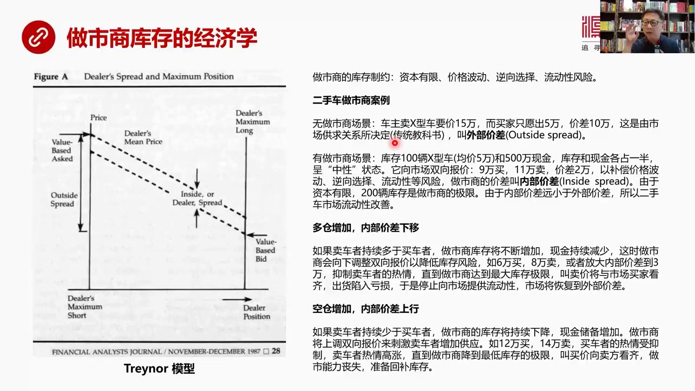

而他保持多大的庫存怎麼來定價怎麼來進行雙向爆價叫買價要賣價怎麼來定這是有經濟學原理的他有自己的一套經濟學簡單來說就是吹那模型這是1987年他在研究金融市場主要研究國債市場研究國債庫存的時候提出了這麼一...

<strong>All subtitles</strong>

> 而他保持多大的庫存怎麼來定價怎麼來進行雙向爆價叫買價要賣價怎麼來定這是有經濟學原理的他有自己的一套經濟學簡單來說就是吹那模型這是1987年他
> 在研究金融市場主要研究國債市場研究國債庫存的時候提出了這麼一套理論沒令認為這套理論其實可以解決一個通用性的問題我在這裡用一個二手車的做事商的
> 案例來解釋我把它更加範荒我認為做事商的原理不僅停留在金融市場而且要放大到理解整個市場經濟的高度實際上我們的這個高度可能提得更高一些就是所有市
> 場經濟的市場組織者實際上都是流動性的提供者而流動性提供者遵循普遍的共同的經濟規律那麼做事商要維持庫存他肯定要受到制約比如說你的自由資本金有限
> 所以庫存是規模是受到限制比如說價格會波動你持有庫存如果地價怎麼辦貶值怎麼辦那將會承受巨大損失還有逆向選擇就是你在買貨賣貨過程中賣貨給你人永遠
> 比你要知道這個貨是怎麼回事舉個例子就是美國2008年金融危機的時候那做這個刺激貸款的這幫人他很明白這個貸款其實很差因為底下有好幾萬戶這個都是
> 三務人員沒有固定收入早晚會違約但是很多比如說房地媒或者其他的投資商他們並不真正瞭解底層資產的情況所以在別人在賣給你NBS的時候你並不知道裏面
> 有多少貸款可能會違約這叫逆向選擇就是別人細期比你多而你作為做事商在通貨在健康層時候你不如對方瞭解所以你很可能買了假貨你買了假貨在賣出去的過程
> 中整個市場中流通的假貨會越來越多當然就覺得好好東西我就收起來了我把壞都可以賣給賣給這個做事商吧好這就會導致裂壁驅出糧壁的效應會使整個的市場不
> 斷的惡化這個做事上一看你們要這麼來我就提高報價整個市場經濟就會走向相反的方向逆向選擇很重要還有流動性風險我保持這麼大褲子我現金就有限了我現金
> 有限如果說我要遇到一個風水草動我要遇到一個需要現金地方我就會現流動性風險所以做事商是要冒具大風險的資本有限價格波動逆向選擇和流動性都是他要面
> 臨風險所以他要為大家提供流動性服務我一定得收費我一定得有賺錢的可能而我怎麼賺錢呢就是這張圖吹奶魔形做電船交易商首先要搞明白這是交易商這個航舟
> 代表交易商的倉位交易商最大的空倉倉位和最大的多倉倉位在這多倉倉位是這個線最大空倉倉位是這個線所以他在最大空倉和最大多倉之間進行庫存的管理在管
> 理的時候他要進行報價對外叫買和叫賣高縣市低買低縣市是買高縣市賣低買高賣嘛他一定要賺錢這個叫內部價差insidespread或者叫deler 
> spread好他其實我們會看到他這兩個縣市在一個區間之內在有意的這個外部實際上是一個更大的制約這叫外部價差外部價差怎麼形成的誰來實現外部價差
> 外部價差就是在市場中有很多真正的價值投資投資者他們願意在這個價位賣願意在這個價位賣所以這兩者之間形成一個巨大的落差叫外部價差這個外部價差實際
> 上是一種強大的市場的真正的共求關係力量只不過在沒有做事上受這兩者叫買價差就夠大市場成交不好你比如說密二手車做事上做了一個案例如果沒有做事上的
> 這種場景就是有個車主想賣這個價值投資者想賣一個車型要價15萬我這個車很好才開這麼點距離很不錯而買家真正的買家在這只願出5萬好家後外部價差2者
> 之間差距10萬這就是傳統的共求關係所決定的價格好這個價格能成交嗎顯然一線成交不了或者流動性比較差這個一年半載這個才成交一兩輛好家貨你這個幾乎
> 沒有這個市場雖然你說有共求關係但價格由於缺少流動性這個價格很差成交不了好現在出現的做事上做事上開始要做這個買賣了我們看看他是怎麼做的假如他有
> 100輛這個X車型的這個庫存建立了他一開始批量的買了100輛由於批量買給他一個很大的折扣價5萬他可以買進然後他有500萬的現金這個時候他有5
> 00萬的庫存和500萬的現金各佔一半我們可以簡略的描述他出於中信狀態我既有現金又有庫存各佔一半然後他向市場雙向報價他可以9萬買11萬賣比如說
> 他給9萬買11萬賣他只賺2萬塊錢價差2萬以補償價格波動風險因為我為什麼要賺2萬呢因為我有風險我吞這麼多貨這些車油可能越來越不值錢而且還有這個
> 這幫人這個車主也許給我倒什麼鬼然後賣給我這個車是一讓更破了更舊的車還有流動性我還佔用這麼多資金我缺錢怎麼辦由於我有這麼大風險所以我賺你2萬我
> 覺得是很合理的要不然我就不做這個生意我不做生意事實上沒有流動性了他收了這個錢這個2萬的價差叫內部價差我們看到外部價差很大10萬內部價差只有2
> 萬內部價差這個低了或者這個做事商在一個巨大外部價差中只賺一點錢由於他資本有限所以他不能庫存不能太大他有極限上限下限200這樣庫存是他的極限由
> 於他的內部價差遠遠小於外部價差所以二手車的流動性改善了因為這中間有人報價了這個人願意5萬買一看賣家掛15萬我覺得太高了我不願買但是如果人這個
> 人掛牌他11萬就賣他總比15萬強所以就有很多買家來他這買車當然也有很多賣家到這來賣車因為他能賣家再怎麼招也比直接賣給賣家要強這個落差10萬對
> 他來說不可接受但是賣給他可能差個3萬5萬還行所以由於他的存在市場教育量爆漲10倍20倍100倍這個市場就有流動性了這個市場就轉起來就活起來了
> 他所提供的這種流動性不就是市場流動性不就是市場活動性嗎不就是市場活動嗎市場活動不轉換過來就是GDP嗎就是經濟發展嗎就是各種各樣的紅冠經濟指標
> 嗎所以你一旦理解的做事商的經濟學和他這個爆價體系你就會明白原來他對紅冠經濟會產生巨大的影響但是在我們教科書提的沒提過都不知道有這個模型我們看
> 他怎麼爆價的他在庫存如果在中衛線的時候就是他如果庫存和現金倡多這叫中性未知的時候這是一種爆價隨著他庫存的逐漸的減少庫存越來少他的爆價會上漁叫
> 賣價會上漁越來越高到了極限時候他車全部賣光了都是現金了這個時候你看他的買價在上漁中買到他已經他已經沒貨了他已經這個沒貨就做不了事了這個時候他
> 價格將向上跳升就是有人賣15萬賣就是一直卡那不願意降價他就只有向上去追求那個價格才能夠買到一輛車否則的話你會看到整個這個市場中交易商將不負存
> 在又回到了一個外部價差這個控制整個市場交易情況這上流動性又會變差好如果他的中性未知像又偏益也就庫存越來越多庫存越來越多你會看到他庫存多了車多
> 了好家貨這個車這個車型如果不太走翹價格要下跌我不是虧慘了嗎所以他的爆價將會越來越低叫賣價叫賣掉越來越低來刺激買價趕緊入場幫我把這個貨消掉吧然
> 後來遏制這個賣價你別把太多車賣給我讓我成了那麼多風險所以他的價格爆價會下跌跌到極限售他整個的現金沒了全是庫存了好家貨他又麻煩了到了他最大的庫
> 存量這個時候他的賣價咱也不能要求這麼高賣價了實在是對我來說這個風險太大了我們沒有錢了所以他這個售賣價會向下靠近市場的賣價向下跌向市場的賣價你
> 說吧5萬就5萬我把這車處理給你我好回收現金的我好上這個庫存往回移動回歸中性所以我們可以看到多倉增加內部價差下移如果賣車的人持續都與買車的人這
> 邊大家都賣給他覺得他這個價格很好或者不看好這種車型他這個庫存會越來多價格將會不斷來往下坐著上的庫存增加現金持續減少坐著上將會向下調整雙向爆價
> 降低庫存風險比如說他就降到那就6萬買8萬賣他以前是9萬買11萬買他可以向下降或者放大內部價差到3萬來移至賣車者熱情直到坐直上達到最大庫存極限
> 全部變成庫存沒現金了較賣價將於市場的買家看齊他會掉下來然後他在這種情況下出貨他是虧損的因為我認識馬衛我還是花這麼多電話費還有這個電費等等這東
> 西我是讓沒賺的這個錢我還承受這麼大風險所以他在那個情況下停止著向市場提供流動性市場恢復到了外國假差那就變成了這種情況了因為坐著上提供停止提供
> 流動性了另外空倉增加內部假差上行如果賣車者持續少於買車者大量都到這來買車然後賣車人越來越少也就是說大家看好這個車型一定會未來升值就逼著他這個
> 倉位向左移動向左移動他的價差就會向上條那麼坐著上的庫存將會下降現金儲備增加坐著上向上調整雙向報價來刺激賣車趕緊多賣幾張車給我吧比如說我可以提
> 高報價12萬買14萬賣你就12萬賣給我吧我以前是11萬收我現在給你漲漲漲趕緊賣給我賣車這個買車者的熱情受到意志因為你賣價越來高了賣車者的熱情
> 得到恢復直到坐著上降到了最低庫存的極限他的這個車全部都沒了全賣光了他的叫買價將向賣放看起坐式能坐著上的能力喪失了然後他這個是要準備回補庫存他
> 庫存為0也做不了事了所以經濟中的所有坐著上遵循的經濟學都是這個簡單模型所展現出來了這個模型意義重大對於我們理解市場經濟理解教科書所沒有講到但
> 是又是至關重要的東西就有著重大的價值我們看下一那麼坐著上怎麼才能實現庫存

---

### Slide 16

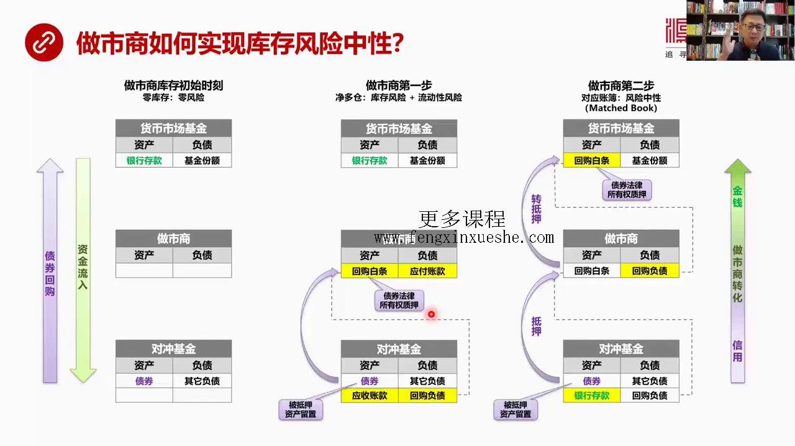

風險中性呢我們知道你坐著上要存一百兩車車的價格暴跌暴漲你就罷了你賺了但是暴跌呢這個東西怎麼防範所以真正的防範是要做空的是要有做空手段的或者是需要實現庫存風險的中性的我如果存過的話我就一定要有做空的手段...

<strong>All subtitles</strong>

> 風險中性呢我們知道你坐著上要存一百兩車車的價格暴跌暴漲你就罷了你賺了但是暴跌呢這個東西怎麼防範所以真正的防範是要做空的是要有做空手段的或者是
> 需要實現庫存風險的中性的我如果存過的話我就一定要有做空的手段讓風險吃平好我們來看一下金融做事上或者叫貨幣層級做事上怎麼實驗這個風險這個庫存風
> 險中性我們舉個例子假如對中基金現在想增加他現在這個他的資產費表上有債券有各種各樣的負債他現在想擴大自己的資產費表就是我要玩耗感我這點債券正來
> 的錢這個扣掉負債的成本那麼我生的錢收益太低了我現在加槓杆加槓杆就是我需要到貨幣上貨幣上基金上去借錢借了錢之後再買債券然後擴大資產費表然後我就
> 可以加槓杆然後實驗更大收益好這個時候我的這個要借錢的對方是貨幣市場基金他那有銀行銀行現金有存款但是怎麼做呢要通過做事上來做因為沒有做事上我都
> 找不到人家人家找不到我共產生經濟很難實現對接這個時候他要做的實際上是一個債券的回購就是我要把這個債券作為抵押抵押給貨幣市場基金讓他把錢給我這
> 樣的話我會把債券這個抵押給對方然後現金留給我留入到我出來債券回購就是說比如說我要抵押一天一個晚上抵押過去之後然後我承諾明天早上我還以前再加回
> 購利息就是借錢嘛抵押融資再加上一個利息然後你把債券還給我我把錢還給你外加利息當然實際上不會一天了他會滾動每天都滾動滾動到比一個星期一個月這個
> 時候他賺的什麼錢呢因為我把債券抵押給你的時候這個債券的所有權或者叫收益權比如說這個債券正好到分利息這個利息歸誰啊歸我仍然停留在對重基金賬不上
> 我抵押給你的只是他的法律所有權但是收益權還在我上這是回購計賬或者是要回購快劑中間的明確規定因為你這個實際上不是出售資產雖然貌似賣出去了實際上
> 你是以資產作為抵押來獲得融資而自然抵押所有風險這個資產本身的所有風險還在你上所以你的收益應該在你上這就是一個簡單回購我們這個時候我們可以可以
> 看到在出使時刻的時候作實商是沒有資產的也沒有負債零風險零酷酸零風險這是作實商的出使時刻好我們來看第1部第1部為什麼我其實這是兩部第1部第2部
> 是聯合在一起發生的但是我們在這裡用維納的就是我們上階課講的維納的思維方式把他拆分針兩部讓本質的原理暴露得更清晰所以我們學到維納的一部拆分我中
> 間用第2用這個拆分針兩部我把這個細節解答的就是解析得更清楚好首先第1部是什麼第1部是對衝基金找到作實商說我要向貨幣上基金去借錢然後或者說我要
> 從你借做商沒問題我來我來給你辦您也不用去再找其他人了我在這就全程運處理了我把錢借給你好我們來看這個帳等做黃色部份就是雙方作賬了第1部對衝基金
> 這邊借券還在他資產負責表上其他負債沒變他寫了一個回購負債寫給作商就說我今天向你借錢以借券作為抵押明天早上還給你然後還錢再加上回購利息對於做商
> 而言他的回購負債就是他的回就是相當於這個作為他的資產就變成了回購白條就是對衝基金寫了回購負債作為一張白條給了作實商放著他的資產向下好那麼做商
> 的那麼對衝基金寫了這個欠條之後錢呢他資產向下要對應寫一筆應收賬款作商還沒給我但是這是我應收的所以這是我的資產兩邊賬目是平的黃的就代表他第一步
> 是會這麼做賬回購負債經過這條線留到了作實商的資產負債表上變成了回購白條使他的資產因為調成早上這筆資產會意味著這種基金會給我現金流這個利息回購
> 利息實際上你也可以把這個回購白條就是認為是一種逆回購他是回購是借錢逆回購對他來說是相反的操作那麼我們在這兒用回購白條更直接一些更明瞭一些對他
> 來說就是資產因為對衝基金承諾要給他利息好那麼作實商這寫了一個回購白條有這個資產之後他對應的負債什麼你錢還沒付呢所以應付賬款寫了這應付和應收這
> 是我們從維納報告中維納的這個他對銀行的那個分析中得到了一個經驗非常有用所以對於做商來說這是應付賬款作為負債那麼這個債券按照回購的原則他是被抵
> 押的資產流質還在這個地方待著不變但他的所有權就是他的身體流在這他的靈魂法律所有權發生了轉移靈魂飄走了飄到了作實商的資產負債表在回購白條的下面
> 他代表債券的法律所有權轉移了從對衝基金轉移了作實商所以回購白條但是對於這個作實上來說資產是國債還是回購白條是回購白條因為抵押品過來的只是法律
> 的這個所有權並不是他的收益權你真正做這個事的主要目的是為了吃回購利息所以對衝基金開了回購白條這是真正的資產法律所有權的轉移就是活著飄過來我用
> 一會這是第二個第三步我們看到作實商第三步做什麼呢作實商這邊我有了對衝基金給我的回購白條剛剛我們也說在這然後我本來是應付賬款我沒錢我沒錢怎麼辦
> 我得去借我找誰借我找貨幣市場基金去借所以我又給貨幣市場基金寫的回購負債然後流轉到貨幣市場基金來貨幣市場基金看作實商這有名讓大家都知道雷曼這明
> 顯大了所以他寫回購白條我覺得很靠譜作為我的資產很好流到我的資產貨幣表上這個時候你看貨幣基金的資產貨幣表發生了變化他的現金存款被回購白條所取代
> 基金份額還是沒有變好這個時候他的現金去哪了被轉到了對衝基金賬上對衝基金這個應付賬款變成了銀行存款這個貨幣基金的錢轉過來了好那麼回購白條你以什
> 麼作為抵押呀貨幣市場基金說你光共開個白條不夠抵押這不行所以作實商又把法律所有權這個債券的法律所有權又從自己賬轉抵押給了貨幣賬基金作為這個白條
> 背後的支撐對於貨幣基市場基金而言回購白條是他真正的資產抵押品這不是他就是一個保險或者叫擔保那麼我們來看這個裡頭的資產貨幣表最有意思是作實商他
> 的回購白條是他的資產他的回購負債是他的負債兩者的期限完全一樣他貿什麼風險呢他沒有貿太大風險因為債券我要借給你錢而我沒錢然後你給我寫的白條然後
> 我用你這個白條和背後抵押品又去到別人那去借而且這兩者匹配資產貨幣同樣一個時間所以我啥風險也不承擔這叫風險中性作實商我而的就是這個但是他這麼做
> 是使他這麼做的他這麼做的意義是使整個市場充滿了流動性如果沒有他那麼對重基金和貨幣上基金很難直接交易因為對重基金民頭不是太好或者雙方有一戶不認
> 識這個交易很難做但是作商大家都認識雷曼兄弟或者是高盛他什麼什麼大家都到這來做生意所以這就使得整個的交易市場的流動性增強了創造了交易機會而他的
> 保持著風險中性那麼對於作商而言他做的事情是把一個流動性比較差的信用比如說債券是一種信用相對於銀行貨幣來說通過他的流動性轉化變成了金錢你看對重
> 基金不是有錢了嗎銀行存款不是在這嗎我把一個沒有流動性的信用給你轉化成一個有流動性的或者是要流動性很好的一個金錢你不就可以金投資金做其他事了嗎
> 所以某種意義上債券市場的作實商就是在向市場提供流動性將比較難轉化的比較難流動的資產變成可流動的資產高度流動性的資產比如說現金或者銀行貨幣這就
> 是他的意義我們再看下一受到作實商這個思維起發我們有一堂這個威克堂直播課

---

### Slide 17

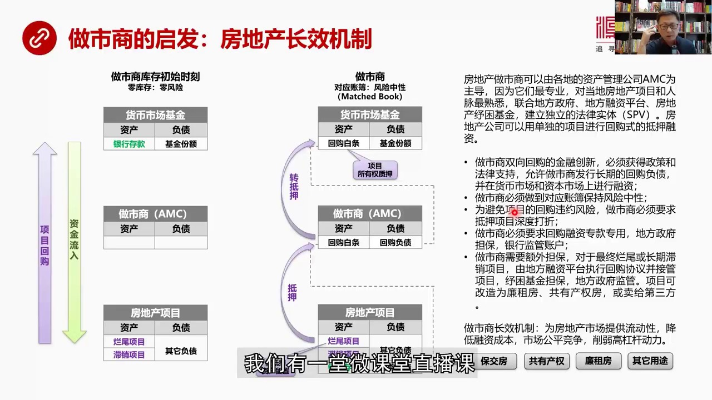

我在想房地產的長效機制也在於其實需要有一種作實商的概念我們中國其實很少有人提到作實商和作實商對於市場流動性貢獻的重要性實際上作實商無處不在無實不在房展市場現在全部的問題在於流動性太差所以房展明前了爛尾...

<strong>All subtitles</strong>

> 我在想房地產的長效機制也在於其實需要有一種作實商的概念我們中國其實很少有人提到作實商和作實商對於市場流動性貢獻的重要性實際上作實商無處不在無
> 實不在房展市場現在全部的問題在於流動性太差所以房展明前了爛尾了爛尾之後老百姓拒絕提供拒絕再繼續阿傑迭帶款來嘗試這就是問題繼續惡化然後各種各樣
> 的就住機制出了很多但是沒有從根本上解決問題尤其不能從長遠上解決問題主要思路就是他們缺乏作實商的思維方式我們來看一下現在情況我如果我們用作實商
> 的思維方式怎麼來解決這個問題呢其實我們來看房展項目現在大量出現爛尾製銷大量房產還有其他的負債然後我們現在實際上是利用剛才那個思路要做項目回購
> 房展商把項目製壓給有錢有錢的資金充派的充派的貨幣上基金然後把資金借回來完成爛尾項目製銷項目在想辦法處理但是它直接這麼做是不行的因為貨幣上基金
> 跟它是兩個市場根本沒法去借拿什麼借呀你你寫借條人家也不認所以中間需要做實商AMC就是所謂自然管理公司現在要處理這些爛賬了處理爛項目怎麼做我覺
> 得可以做的一個金融創新就是雙項回購爛尾項目首先還留在房地產這個公司自然負債表上這些爛尾項目或是要項目可以作為製壓回購製壓房地產公司像AMC做
> 商提供回購白條說我欠你這麼多錢你能不能借給我錢做商說可以然後你給我的這個白條背後是有項目做的抵押的但是我要求你給我深度打折給我打個五折吧房地
> 產公司說這五折老兄太狠了吧他說沒事啊你這反正就是短期壓的我這你又不是賣項目你有了錢稀完之後現今的回購之後所以我還給你我指證做商說我指證8%的
> 利息這個銀行已經房地產公司已經對呀對方指證8%利息因為這我融資成本大費價下降了我這項目最後又不是對方是我的因為我要回購回購指示承諾給對方8%
> 的利息而已回購知道回購之後所有東西還是我的賺大錢還是我的而我冒著風險很低而且我的融資成本從16%降到8%打了對折多好好AMC他也沒有這個錢他
> 可以收到這個這個回購白條作為資產之後他可以發行回購負債然後把他發行到貨幣市場基金那個銀行監視場去當然作為一個轉底呀他需要把項目這個轉底還是過
> 去也就是說我這個白條不是白寫的我背後有一個好幾千目的的大項目如果說我違約了這個土地幾千目的土地歸你大這一算這個土地他善半價估值給我的按照市場
> 價這一目第一百萬他只按五十萬評估給我這個風險確實很小而且這個作實商是受到國家認可的是一年會保健會中央銀行一起下輪說他就做這個事他發行了回購負
> 債等於高質量的短容等於這個央跳等於什麼國家信用背書這有增信有國家政府給他增信他就說為了解決這個問題的所以貨幣市場基金把他這個回購負債當成一個
> 最高等級的因為有國家有央行難保有財政部難保有地方政府難保有一串的難保再有項目的巨大的半折的底呀怕什麼買所以貨幣市場基金購買這個白條也就擁有了
> 項目所有權的底呀法律和有權的底呀他的基金份額沒有變那麼這個錢就被抓到了訪點項目注意作實商AMC實際上是風險風險這個中性的他的回購負債資產和負
> 債完全是同期限你這邊像我建議年我發行的負債也是像別人建議年這個過程中貨幣上基金獲得了巨大的一個比如說8%5%6%這樣一個很高的回報率的這麼一
> 個高收益的高等級高收益的一個投資產品我在對他們來說就像資產大跡荒之下赤野千里沒有升級呀沒有這個資產可吃啊這時候你給他提供這麼每位資產而且有中
> 央最高的信用平極的話為什麼不買他不怕違約因為違約之後有最高的信用再給他擔保那麼他一下就會獲得一個非常良好的資產這個時候所有人都會來搶這樣的話
> 這個資金成本轉過來的資金成本就很低了那麼可能從市面上自己的用資10%降到18%防陣項目就有了錢開工開工之後爛尾的只要修好了所謂爛尾就人家已經
> 交了錢了你沒修完而已短缺一份的資金加上水電加上這個這個土間結構花了多少錢這個這個項目就交了交了之後老百姓現金流就開始不斷地湧進來然後就可以熟
> 悔我的項目然後加上我的利息8%然後我這個項目就活了當然還有一種這個爛尾項目雖然修完了之後這是爛尾項目其實已經賣掉了只不過爛尾了還有項目呢修完
> 之後長期製銷賣不動賣不動怎麼辦但它還是有可能出現回購違約呀這個時候做事實上既然是國家讓我來做事國家讓我來承擔這個風險那麼國家要勾抵就是如果出
> 現長期製銷項目地方政府收走然後你們來執行包括地方中資平台包括這個其他的這個擔保了方誰讓我做這個事誰叫承擔一定風險這個風險就擔保風險如果出現了
> 這個違約那麼地方政府要負責把項目接走然後你們可以把它改造但是你這個接走項目的時候你也是拿了半家的土地你你也不虧呀然後你把它改造成其他的長租公
> 寓人財公寓或者共有產權房OK也可以保銷房共有產權房連租房其他租房都行好我們來看這樣的話整個項目就盤活了實際上我覺得這套機制呢我稱為是房地產做
> 事商制度就是由各個地方的自戰管理公司AMC作為主導因為他們很專業因為他們對當地的房產項目和人脈很熟悉在中國做事沒有人脈是不行的而且跟地方政府
> 關係不錯所以要聯合地方政府地方農資平台還有房地產紓困基金包括中央級別的紓困基金然後要建立獨立的法律實體SPV就這個做事商房產公司可以用單獨的
> 項目進行回購式制壓進行融資當然這需要5個條件第一做事商雙線回購這是金融創新的沒人這麼幹過所以必須要獲得政策法律的權利支持從中央到地方所有的金
> 融監管必須給我開律燈就是允許做事商在這個發行長期的回購出來比如一年甚至更長並且在貨幣市場上和資本市場上進行農資我這東西得讓我賣你不讓我賣我上
> 哪抽錢去這是作為這個做商要提的第一個條件就是如果你們需要解決爛尾樓這個問題如果你們需要做這個事那麼這就是方案我要這個條件你不給我我就不做了你
> 要給我我就可以做而且一定能做成第二條件做事商必須要做到對應賬本保持風險中心就是你容多少錢我借多少錢兩者期限一致我不冒風險第三避免項目的違約做
> 事商必須要求抵押項目深度打折防展項目你給我一千目的錢你給我打半折這樣的話你違約了我不怕防展公司一想其實我這個項目並不是賣給他我就是要有一個廉
> 價的融資成本OK沒問題第四條件做事商必須要求回購融資專款專用地方政府要擔保銀行要監管照護就是我給你的錢從我這換給你的錢實際上是從這來的你不能
> 夠再去開發其他項目你必須得把項目給我修完地方政府如果你們讓我做這個事你得必須擔保這個事必須得簽個畫家銀行必須得管住這個錢只要融資融到位這個房
> 子必須得修好而且必然能修好只要它不亂用所以需要擔保需要地方政府需要銀行監管第五個條件做事商需要額外擔保就是對於最終爛尾的長期製銷的項目怎麼辦
> 有地方融資平台執行回購協議這個AMC它是一個需要跟這個地方融資平台地方政府簽個額外的協議這個協議就說如果這個項目爛尾那麼你們地方融資平台要代
> 替它執行回購協議你把這個半價的土地收走然後這件事還需要疏困基金單保地方政府要監督這個項目地方融資平台接走之後可以改造成聯族房、
> 國有產金房或者賣給第三方所以這就提供了一個長期的長效機制長效機制是什麼呢就是為房地產市場提供流動性沒有做商制度房地產老百姓一旦不買了馬上失去
> 流動性房地產公司立刻陷入現金流崩潰然後就是整個房地產體系的市場銀行所有人的共同災難長效機制是什麼就是首先做商可以為房地產市場提供流動性降低這
> 句房地產公司的融資成本現在民營的和國營的央企最大差別就是人家的融資成本比你低十個點你怎麼玩你不加槓杆就沒法跟對方玩就沒有辦法在市場生存所以資
> 金成本過高也是房地產市場民營房地產市場被迫加槓杆的一個重要原因現在你有了融資的新的辦法降低融資成本這個市場競爭就比較公平了那麼這個時候你就開
> 始意識到我這麼加槓杆過去那樣的方法是有問題的我需要降槓杆保持我真正能夠真正能夠賺起來這就削弱了加槓杆的動力這就是一個根據做著商的理論這個我們
> 做一個虛擬的推演怎麼整個房地產有辦法其實要構建做事商的思路要通過雙向回購這樣的進入創新實際上如果這套東西真正能執行的話當然肯定能夠解決保焦房
> 共有產權什麼聯族房這些問題當然真正落地能不能行的通最關鍵的決定因素是操盤者的水平就是對上得有一整套的拿到政策拿到各種各樣法律政策支持的這種強
> 大的手段對下面擺平地頭舌的這種非常強的這種人脈關係或者叫執行能力這其實對於操盤的人要求很高理論上可行實際上操盤手非常重要好我們看下一頁下一頁是做事商層級我們剛剛說到是一個貨幣層級

---

### Slide 18

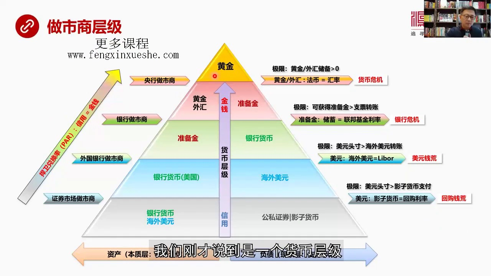

黃金準備金什麼什麼實際上還有一個是做事商也有一個層級也就是說像市場提供流動性不同的貨幣層次不同的貨幣層級有不同的做事商再做所以這個貨幣金它對應著什麼央行作為做事商它的功能央行做什麼呢它主要是黃金和準備...

<strong>All subtitles</strong>

> 黃金準備金什麼什麼實際上還有一個是做事商也有一個層級也就是說像市場提供流動性不同的貨幣層次不同的貨幣層級有不同的做事商再做所以這個貨幣金它對
> 應著什麼央行作為做事商它的功能央行做什麼呢它主要是黃金和準備金之間的買和賣央行做事商作為做事商而言我們從來不把央行當中做事商但實際上轉換一下
> 思路把央行想成做事商它在做什麼事它在把它在控制匯率也就是說它要控制黃金和準備金或者叫法幣之間的對換關係那麼它的極限什麼就是央行也有庫存我有黃
> 金儲備如果貨幣貶值了我就會賣出黃金儲備然後買我的本幣然後讓我的本幣升值穩定住所以我做這個事情的極限是我外國儲備和黃金儲備要大於零比如說四里蘭
> 卡它的貨幣崩了貨幣崩了因為它外國儲備不夠了央行作為做事商沒有辦法再提供流動性了這個市場立刻就飛了這叫貨幣危機最高級別的危機叫匯率失控叫貨幣危
> 機那麼央行作為上在中間報價是什麼就是以黃金而論就是以黃金和外匯以美元為準吧講說我們舉個好好舉的例子以美元以美元為主為準那麼它對應多少人民幣呀
> 對於6.6還是6.7還是6.9如果我們看到如果中國外儲備好近那可能一下一比十一比二十那就匯率失控了那就貨幣危機了所以央行要守住這條線實際上它
> 承擔的是捍衛兌換率信用要等於金錢就是我中央銀行所創造出的所有的信用從準備金到準備金派生出來信用移動海外這個這個信用移動整個這條線必須是一比一
> 銀行貨幣對準備金必須是一比一當然一比一是可以這個從這個比較關係對換率上是一比一當然它的價格會不一樣價格體驗成利率好我們首先來看央行做的商做的
> 是黃金和準備金之間的這種買和賣叫賣和叫賣然後它主要是防範的匯率風險控制貨幣危機的爆發那麼在兩個資產之間還有從高級展到第一次上這個過渡的這個過
> 渡線上做的商在發生作用那麼在中央銀行準備金和銀行貨幣之間銀行發揮著做的商作用它是介於資產跨界的邊界上做的商就是跨了兩個資產在這個資產上叫賣在
> 這個資產上叫賣叫賣形成一個跨界資產的這麼一個邊界那麼銀行做的商也必須要捍衛對換率就是我銀行發行的銀行儲蓄一定是等於準備金的我一定要捍衛這點事
> 一塊錢銀行貨幣等於一塊錢準備金這是我必須要捍衛這是銀行需要捍衛的所以我在箭頭上上漫步是準備金紅色的下半路是銀行綠色那麼這就意味著銀行儲蓄或者
> 銀行貨幣跟準備金之間的比例關係就是議員準備金永遠等於議員的銀行儲蓄好但是兩者之前畢竟有差別這種就是準備金比如說對於某家銀行準備金如果變少了而
> 儲蓄數量越來越多我銀行創造大量貨幣怎麼辦呢那我得去市場是借準備金這就會導致聯邦基準利率發生變化它的極限是什麼極限在於某家銀行能夠自有的準備金
> 再加上它在市場中可以借到的比如說聯邦基金市場它可以借少其他地方借它能借到的準備金的上線如果加在一起自由資本金能夠可獲得準備金加在一起總和它必
> 須要大於支票轉賬就是它這個銀行賬戶中這個支票賬戶中如果大量的錢在轉賬而且轉賬的金額超過它可議獲得準備金的總和這個銀行就出大問題了它會陷入銀行
> 危機就是它銀行儲蓄創造銀行貨幣這塊創造量太大在轉賬過程中會導致準備金不足那會什麼卸入銀行危機它這麼一幹聯邦基金利率會蒙長銀行危機出現了外國銀
> 行做商也一樣它是在海外美元坑美國銀行美元之間在做叫賣和叫賣它也是要捍衛對話率海外美元一塊錢的美元的信用海外美元儲蓄的信用等於美國億美元的銀行
> 儲蓄的信用等於它的金錢就是底層市信用上面是金錢一比一的比例是它需要捍衛的這樣的一個防線那麼也就是說如果說美元以美元計價海外美元值多少錢我們知
> 道是一比一但是實際上它兩者並不相同填在Liberary上比如說如果說海外美元的頭這個它在美國銀行體系存有的美元儲蓄的這個投寸叫美元投寸如果比
> 較少而它自己創造了海外美元太多這就意味著它的清算會出問題就是海外投寸太少了而海外美元轉賬從支票賬戶中轉賬規模太大它就會出問題無法轉賬所以這種
> 情況之下就會造成Liberary的標聲因為Liberary就是在評估這個一個海外銀行它在美國銀行體系中的存款和它創造了海外美元儲蓄之間的比例
> 如果說超過這個僅限美國它在美國這個美元投寸比較少而它海外美元轉賬太大就會導致海外美元荒當然這個美元荒也會變極美國國內好第四級做事商就是政權上
> 做事商比如說21個醫教育商他們也是做事商他們主要在債權上做事它要捍衛1比1的比例就是億美元的影子貨幣永遠等於億美元的銀行銀行貨幣那麼也就是說
> 在它的庫存中間如果它的庫存中間美元現金減少而影子貨幣量太大那麼就會填在回購利率上回購利率上就會大漲因為整個體育中美元變少了而影子貨幣回購的負
> 債規模越來越大那回購價格就會上漲填在回購利率上如果說影子貨幣體系的支付的規模遠大於美元投寸的話就會爆發美元這個回購前方所以四級做事商分別控制
> 著不同資產那邊之間的對換率保證和位他們所創造的信用跟他上級資產永遠保持一個爬就是對換率的1比1那麼這種對換率等於1比1這是對換率穩定但是他在
> 利率上會表現出來不同的價格水平的差異因為是不同資產的性質不同資產的級別當然會用利率方式體驗出來所以在極限被突破防線崩潰的情況之下我們看到最底
> 層會出現什麼回購前方在影子銀行體系然後在海外美元體會出現美元前方在美國銀行體系會出現銀行危機在中央銀行層面上突破極限會出現貨幣危機這就是做事商層級基本的理念我們再看一下央行與銀行如果從

---

### Slide 19

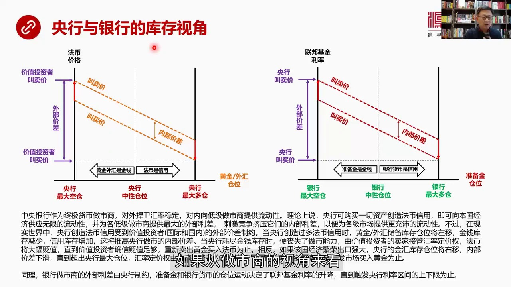

做事商的勢表來看一定要研究它的庫存它的庫存代表什麼呢我們可以看一下央行這是央行的倉位的這樣一個一個是一圖央行也有中性倉位中性倉位就是它的資產是黃金和外匯它的負債是法逼的信用準備金技術貨幣等等這兩者在中...

<strong>All subtitles</strong>

> 做事商的勢表來看一定要研究它的庫存它的庫存代表什麼呢我們可以看一下央行這是央行的倉位的這樣一個一個是一圖央行也有中性倉位中性倉位就是它的資產
> 是黃金和外匯它的負債是法逼的信用準備金技術貨幣等等這兩者在中間的時候各占一半我們稱之為是中性倉位那麼它的這個横軸代表它的資產中間的黃金外匯有
> 多少那麼央行有一個最大空倉也就是它最小的極限小的極限可能就變成零了最大庫存多到一定程度它就不想要了所以它也在最大空倉和最大多倉之間來調整匯率
> 實際上匯率是在通過庫存央行通過庫存來調整的然後它的外部是什麼呢是價值投資者就是外國投資人國內投資人對黃金感興趣的那就說比如說價值投資人的較賣
> 價就說你要在這個價格中你要把價格提到這我就賣給你黃金價值投資者較賣價就是你要黃金跌到這個程度我就賣兩者形成這是外部大規這個幅度很大的價差這個
> 市場成交是不太不太好的流動性是比較差的那麼對這條線代表是法幣價格不管是美元人民幣代表央似黃金或者億美元或者一塊錢的外匯它用法幣價格應該怎麼來
> 表示我們來看到這個倉位的中性線它是會發生偏移的我們知道央行其實作為中級貨幣作勢商對外它有捍衛匯率穩定對內要向低級的作勢商提供流動性當然林頓來
> 說央行可以購買一切資產創造法幣信用也就是說央行可以買土地買礦石甚至買普通的移買普通的石塊把它放到資產上下都能創造信用都能創造法幣沒問題法律可
> 以允許它這麼做它買量自行車也行買任何東西也行這是這些自行車本來是不可流動的或者一塊普通的石頭沒有流動性或者沒有價值它可以賦予它價值可以強行給
> 它流動性也就是說林頓來說央行可以向本國經濟提供無限制的流動性並且為底下的各級作勢商提供最大的外部立插主義所有人都受到外部立插的影響當央行創造
> 太多的法幣信用的時候黃金和外匯儲備的倉位將會發生左移我們看到這個如果信用太多買了太多不好的資產比如說一些爛帳一些石頭之類的這邊會變長這根線倉
> 位會向這邊移動把黃金外匯會擠壓扁形象來說這個箭頭會變短而這個箭頭會變長那麼如果金錢庫存這邊是叫金錢這邊叫信用如果金錢庫存不斷變小這邊的庫存不
> 斷加大然後這根線倉位左移這將會推高央行做著商的內部價差它的爆價比如說黃金將會價格越來越高比如說三百人民幣一克它會變成三百五然後再往這邊黃金越
> 來越少它會變成四百四百我賣然後比如說中間差十塊錢三百九我賣再過一段時間可能變成五百和四百九它這個爆價會越來越高因為它庫存量越來越少如果央行最
> 後好進了金錢庫存黃金沒了外匯沒了變成四百蘭卡那個情況情況了那怎麼辦叫買價買不著了直接往上奔吧外部投資者要多少錢就是多少錢而且外部投資者往往會
> 抬高這個發幣價格那是說一美元本來是比如一比一百那現在就變成一美元比一千這個時候央行好進基金庫存它就是喪失的做事能力它這個整個控制權就全部用外
> 部投資者來接管了匯率盯上錢轉移了法幣將會大幅貶值直到投資價值投資者確信外部投資者決定你這扁了一千了扁了一萬了OK了四百蘭卡還有些東西可以超底
> 這個時候我在賣出黃金買你的四百蘭卡貨幣然後這個時候你的價格才會重新的評問下來央行庫存才能重新建立所以央行穩定匯率的基礎是它一定要有外匯儲備或
> 者叫黃金儲備的庫存基本上這個要是黃金儲備現在是外匯儲備如果沒有這個庫存你就控制不了匯率就有就會有外部價值投資者來接管相反如果這個國家經濟特別
> 好就像一戰之前的美國二戰之前的美國好大量的大量的資金流向美國這就會導致它的黃金儲備越來越多然後法幣信用越來越短這個箭頭被壓縮了整個倉位在往這
> 邊壓黃金這邊越來長法幣這邊越來越短那意味著央行金庫的庫存增加向右移動內部爆價下滑央行越來越不想要吃有這麼多黃金了直到超出最大倉位到達這個到達
> 這個點了央行說我這吃有黃金菜的趕緊賣給別人吧賣給投資者了這個時候它的突破它的最大倉位之後它的較賣價將會下跌直接跟市場較賣價這個靠近所以我們可
> 以發現這是個零行交易價是個零行結構在這邊是這樣然後較賣價是這樣然後下跌然後降上升所以這個研究這個零行區域是很有意思的那麼如果它庫存突破這個極
> 限那它的賣價將直接向買家靠攏買家就覺得現在這個以美元計價這黃金怎麼越來越便宜適到買的時候出手這個時候會對金價將由價值投資者買家接手法幣升值黃
> 金貶值一直觸發到市市場開始買入黃金為止同理對於銀行來說也是一樣央行的內部價差受制於外部國外投資人當然也包括國內價值投資人的外部價差央行是在這
> 個價差之內提供一個內部的價差給市場提供流動性確保外匯市場平穩交易但是央行的內部價差對於銀行來說對它下跌來說就變成了外部價差央行的較賣價和這個
> 較賣價和較賣價就形成了銀行體系的外部立場外部價差而銀行在央行的外部價差之下形成自己比較小的內部價差較賣價和較賣價銀行還買賣什麼呢當然是買賣準
> 備金準備金是它的金錢銀行貨幣是它的信用所以它的資產是準備金它的負債是銀行貨幣銀行的儲蓄這是準備金倉位形成的價格較聯邦基準利率或較聯邦基金利率
> 銀行做的商在它的外部立場央行來制約準備金和銀行貨幣的倉位運動決定了聯邦基準利率直到駐發央行利率的區間的上下線為止比如說這條線是中央線中性倉位
> 如果說如果說銀行的準備金越來越少像這邊越來越少越來越少那麼顯然對於它來說它要去市場去借借準備金如果說整個央體系都變得越來越少準備金的利率一定
> 會上升上升到這個點所有這個銀行或者這家銀行的準備金庫存沒了那麼它將會跳升央行給我一個什麼價或者外部這個投資給我一個什麼價我就一定要拿到準備金
> 這個時候就是央行的政策利率上限比如說美聯儲現在是它的政策利率是3.25到3.5之間這個價叫賣價就是在3.5的時候我就要介入上好這就是它上限央
> 行利率的下限3.25我在3.25和3.5之間做事而銀行準備金的買賣是在0.25個百分點之間這個區間之內形成一個更小的立場更小的價差相對應如果
> 說銀行體系準備金越來越多或者某家銀行準備金越來越多它內部爆價當然越來越低代表著聯盟基準利率在不斷的下降但是也不能突破央行的這個叫賣下不能突破
> 央行的底突破央行的底市場就接手了或者叫央行就接手了做事實上的功能就失去了我們再看銀子銀行海外銀行銀子銀行的庫存也是同樣的道理

---

### Slide 20

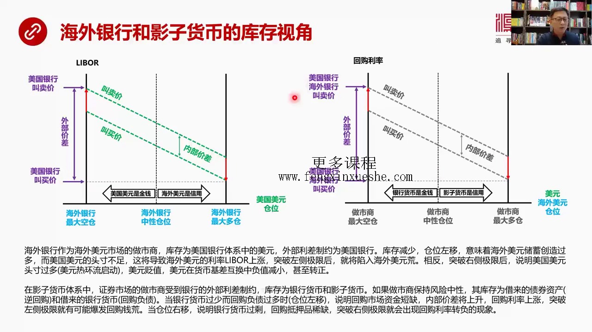

海外銀行就是這張圖它也有藏位它是海外美元市場的做事商它的庫存是美國銀行體系的美元就是美元投寸是存在美國銀行體系的存款外部立插是美國銀行市家的叫賣價叫賣價那麼如果庫存減少藏位左移美國美元是金錢海外美元是...

<strong>All subtitles</strong>

> 海外銀行就是這張圖它也有藏位它是海外美元市場的做事商它的庫存是美國銀行體系的美元就是美元投寸是存在美國銀行體系的存款外部立插是美國銀行市家的
> 叫賣價叫賣價那麼如果庫存減少藏位左移美國美元是金錢海外美元是信用如果美國美元少了在美國美國銀行體中存了少了當然叫賣價叫賣價就會上升這體現為L
> iberary率Liberary率就是其實評估的是海外銀行體系所擁有的美元的儲蓄美國銀行的美元儲蓄和他們創造的海外美元儲蓄之間的落差有多大或
> 者是比例有多懸殊這個比例越懸殊Liberary率越高如果說突破左側極限海外美元海外銀行突破左側極限之後這將會導致海外美元爆發美人荒相反如果突
> 破右側極限海外美元信用越來越少而美國的美元太多了這是說明美元進入了熱環流美元投通過多美元進入熱環流了海外美元還沒來得及擴張這個說美元將會扁執
> Liberary率會下降體驗在貨幣機上互換中就是美元相對於歐陽日元使用出在負值美元越稀缺負值越越嚴重但是在美元環流轉熱情況之下美元的機差互換
> 這個負值會越來越潛本來是潛水狀態會越來越靠近水面最後還能衝出成員變成政治所以如果說突破這個極限貨幣機上換中美元將會有負轉證在影子銀行體系中回
> 購市場利率也是同樣道理在影子銀行體系中政權市場的做事商受到銀行的外部立場限制銀行海外銀行美國銀行它們施加外部立場它的庫存是銀行貨幣和影子貨幣
> 買賣的是貨幣它的庫存銀行貨幣是金錢影子貨幣是信用如果做事商保持風險中心它的庫存是借來的債券資產就是你回購我們剛剛說過借來的這個債券資產和借來
> 的銀行貨幣這是回購負債它自己向貨幣上進進借的當銀行貨幣太少而回購負債太多的時候這個叉會將會左移整個市場中銀行的錢很少而影子貨幣的錢很多叉會左
> 移如果這說明什麼呢如果左移的話說明回購市場自己暖缺那麼內部利率將會就是內部價叉將會上漲體現為回購利率上漲突破了左側極限就有可能爆發回購錢荒如
> 果到這個程度發生跳升這個跳升過程就是錢荒爆發了那麼如果倉會右移說明銀行貨幣太多了影子貨幣信用不夠體現為回購抵押品短缺比如說很多錢但是國債太少
> 大家瘋狂搶國債最後突破右側極限就會出現回購利率辯負我們經常在美國環球報告中紅線每天環球報告中都會發現怎麼有時候回購利率辯負負值甚至到6%4%
> 這說明突破了做得上最大的多倉極限這個錢太多抵押品太少也會出現那個欠向所以當我們把做事商的思路和酷頭的思路整合在一起之後我們立刻會理解再跟美元
> 環球體系融合在一起的時候我們立刻會理解出現了不管是哪個貨幣成績這樣出現問題我們現在都能夠完整的理解它背後的原因是什麼就是因為我們現在有了一個整體的思維方式整體的蘋果架構好我們再看縮表的場面效益

---

### Slide 21

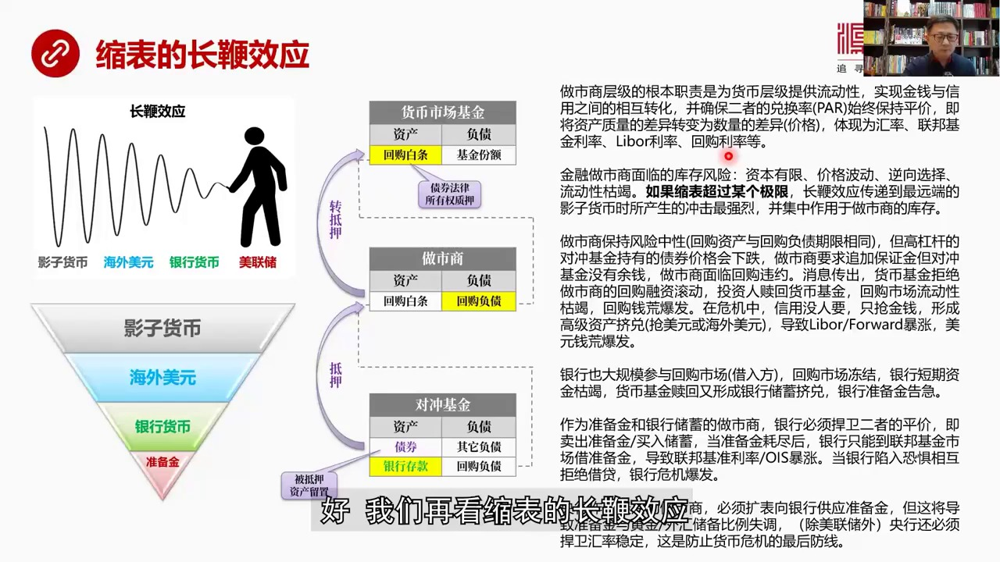

做得上成績對它的根本職責是為貨幣成績提供流動性實際金錢與信用之間的相後轉化並且確保兩者節對換對換率這個帕爾始終是保證一架就是要保持保證資產智量差異轉變為數量差異這個價格就是價格體現委會率價格聯盟基金利...

<strong>All subtitles</strong>

> 做得上成績對它的根本職責是為貨幣成績提供流動性實際金錢與信用之間的相後轉化並且確保兩者節對換對換率這個帕爾始終是保證一架就是要保持保證資產智
> 量差異轉變為數量差異這個價格就是價格體現委會率價格聯盟基金利率的價格還有Liberary率回購利率等等那麼做事商面臨酷存的風險因為它資本有限
> 價格波動還有印象選擇流淨酷節等等跟二手車做得上面臨的問題是一樣的在這種情況之下如果縮表央行縮表超過某個極限做商的酷存將會出問題也就是長邊效應
> 傳導到最遠端的影子貨幣時將會產生著衝擊最強烈並且集中作用於做事商的酷存當超過某個極限手做商的酷存將會承受不了對於說長邊效應每年處手一抖這邊輕
> 輕一震美國銀行受到衝擊但幅度比較小海外銀行海外美元受到衝擊更大而影子銀行受到了衝擊的這個政府最為強烈也就是說從流動性角度來看這是個盜金盜金卡
> 型的這個結構準備金很小你如果不斷的縮表就在挖這個盜金卡的根部這回是整個金卡越來越不穩本來這個金卡就不穩盜金卡就天然不穩你如果再把這個監越搞越
> 小整個金卡有可能會倒掉現在就是縮表超過某個機械整個庫存就會出問題坐上層級坐上的庫存都會出問題為什麼因為坐上保持風險中心回購資產與回購負債企業
> 形容沒問題但是它的風險對家是對於重機金雖然我這兩邊是平衡的欺騙結構是一樣但是這一個老兄有可能出問題因為高貝尷尬對重機金他持有的債券市場有可能
> 債券價格有可能下降家賢縮表之後都會導致債券市場價格往下跌利息高了準備已經少了清算變得困難了債券市場價格下跌那麼我這個抵押品就不值錢了抵押品不
> 值錢坐上就不幹了坐上就會要求對重機金增加保證金而對重機金賬上沒有賢錢因為他已經把這個銀行存款也變成了債券他這個滿復合運轉高貝尷尬金錢很少好對
> 重機金如果沒有錢那麼坐上就會面臨回購違約的壓力這個消息一旦傳出來貨幣上基金就會拒絕給做事商的回購滾動農資別忘他的回購負債是隔夜後隔夜回購負債
> 他是將貨幣上基金那些錢而且每天都要滾動每天晚上都要滾動一次結果第二天消息傳出說這哥們的這個回購白天有可能由於對重基金做砸了他有可能違約那貨幣
> 上基金不及了你還想找我借錢算了吧咱借菜吧那麼這個時候貨幣上基金將會拒絕給做事商提供資金滾動同時貨幣上基金那些大的投資人都是機構投資人一聽這個
> 貨幣上基金參與了做事商的這個行為我的媽呀那貨幣上基金可能會出事我這個基金份額存在這本來是為了對重銀行比如說銀行只保證25萬美元的資產而我又有
> 25萬美元兩億五千萬美元我存在一家銀行倒閉我這個大型機構不是虧慘了嗎所以我不如把這個錢分在入幹貨幣上基金上結果現在聽說你捲入了這個事這個做商
> 這麼不靠譜是個做商投了更不靠譜的對重基金那我持有你的份額那不是封眼太大軍族不立為強制下得咱撤吧機構投資人會擠對貨幣市場基金貨幣市場基金將會擠
> 對做事商的流動性做事商將會擠對這個對重基金就會發生一層一層流動性的控制好這就會出現什麼這個投資人輸回貨幣市場基金貨幣市場基金如果被輸回那麼就
> 會導致做事商沒錢做事商隔夜你這個隔夜回購資金中斷的話就會導致回購市場爆發流動性哭解的問題回購市場錢荒就出現了那麼在危機中沒人要信用了我只要金
> 錢你這些資產我都不要我就要上級資產低資產我不要這就會形成高級資產的幾對就是要強就在領子央中所有人都封了我一定要什麼你給我這個債那個債我都不要
> 我只要美元或者海外美元那個賬戶上那個那個錢這就會導致Liber利率Fourword這種利率元其實這個利率一起爆漲這就是為什麼我們的美元回這個
> 環流這個報告中要重點觀察這些數據就是因為回購上出現錢荒了這就會導致美元荒的爆發同時銀行也大規模參與回購市場的借這個借債銀行的資金大量都是從回
> 購上借來的借的是貨幣上基金的錢所以銀行短期融資也是靠回購市場他作為借入房借錢那麼回購市場一旦凍結了銀行短期資金也就哭解了還有貨幣上基金的賬戶
> 是開在銀行的如果貨幣市場基金被大機構幾對那麼貨幣市場基金就會形成對銀行儲蓄的幾對銀行的準備金立刻告急因為你的儲蓄被轉走了你的準備金立刻就會被
> 轉走準備金如果不夠銀行就出問題了銀行準備金就會告急那麼作為準備金和銀行儲蓄的做事上銀行必須要捍衛兩者敵人的評價就是他必須要賣出準備金買入儲蓄
> 如果你這準備金耗盡之後銀行就只能到聯邦基金市場去借這就會導致聯邦基金市場那個基準利率和OS利率就會爆炸如果當銀行陷入恐懼大家都嚇到了這家銀行
> 怎麼會這樣相互擔心不願意互相拆解資金銀行危機就爆發那麼央行作為最後做事上必須進行擴表買國債像銀行這個市場去買國債供應這個供應準備金但是這將導
> 致準備金和外匯資產的比例失調在金門位之下你要創造這麼多信用好家貨那外匯就少了或者是黃金就少了相對而言那麼你的匯率就會貶值除了美聯儲之外因為它
> 世界貨幣的發行者其他央行都會碰到這個制約央行還必須要穩定匯率所以它向內救援售它很可能穩不住匯率因為它創造的準備金量太大導致它庫存增加導致它央
> 行那個庫存向左偏偏到了極限偏出極限黃金準備耗盡美聯儲備耗盡它的貨幣就崩了所以央行是防止貨幣危機的最後防線看這邊如果我們有倉位有做事上這個理念
> 你馬上把所有的咱們以前講過了所有的貨幣漲的東西全部串了一塊都想明白了所有的問題在理頓上都實現了自恰我們再看下野那麼這就社交中央銀行是怎麼從中級貸款人現在變成中級做事商的

---

### Slide 22

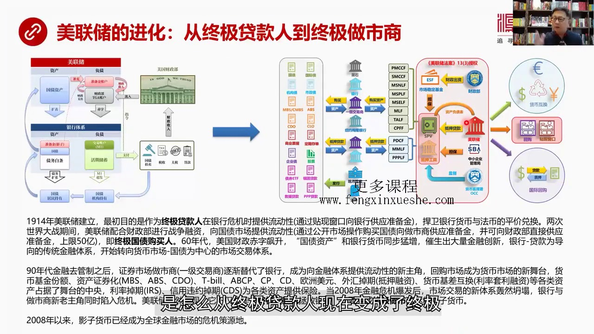

美聯儲備進化我們這張圖是核心客中講美國當時擴充國債擴充資產負債表然後來保證這個越南戰爭升級還有這個大社會計劃形成了財政的赤字的需求實際上是個擴表的過程然後在這個美聯儲力上這當然只是一個階段更早階段是1...

<strong>All subtitles</strong>

> 美聯儲備進化我們這張圖是核心客中講美國當時擴充國債擴充資產負債表然後來保證這個越南戰爭升級還有這個大社會計劃形成了財政的赤字的需求實際上是個
> 擴表的過程然後在這個美聯儲力上這當然只是一個階段更早階段是1914年美聯儲成立它最初的目的是作為中級貸款人在銀行線路危機的時候提供流動性來晚
> 就銀行危機怎麼提供流動性啊通過聽電廠口向銀行供應準備金主要是為了捍衛銀行貨幣和法幣之間的評價評價對換就是銀行出現危機之後我要供應準備金否則了
> 法幣和銀行貨幣就崩了兩次世界大戰期間美聯儲配合財政部進行戰爭融資要發國債要進行戰爭向國債市場提供流動性主要是通過公開市場操作向一交易商做商提
> 供準備金然後從你們那買國債並且在那個時間段可以向財政部直接去買國債當然是有上限的美聯儲法案修改過在戰爭中一直修改但是這個上限是50億美元就是
> 用於財政部的短期資金如果周轉不開怎麼辦直接到美聯儲拿國債到美聯儲直接對換成現金就是美聯儲直接從財政部購買國債這個創造創造貨幣那種情況之下美聯
> 儲相當於終極國債的購買人從終極貸款人也化到了終極國債購買人當然六十年代美聯儲財這個美國財政赤次飆升國債資產和銀行貨幣同步的增加這就會催爭大量
> 金融創新銀行貸款為導向的金融體系傳統金融體系開始向貨幣市場和國債為中心的市場交易體系進行進化這張圖表現就是這個進化過程之中錢也多了然後越來越
> 多的金融的工具出現了市場交易越來越繁榮然後就朝這個方向進化這就是美聯儲拯救經濟危機拯救金融體系變成了最後做事商的這麼一種圖90年代之後金融去
> 管制政權市場做事商就是一機要商逐漸代替了銀行成了金融體系供應流動性的主角回個市場成了貨幣市場的新舞臺或者叫最大舞臺所以我們看到貨幣市場基金份
> 額資產增加化的不管NBSABS還是CDO還有短期國債還有這個資產底壓的商業票劇CP商業票劇還是科轉賬的存單還是歐洲美元還是外匯調期代表底壓融
> 資貨幣加貨幻這是利率套利融資等等各種資產越來越多然後利率調期、信用業調期這成了各類資產的提供保護的保險那麼當2008年經危機爆發之後整個交易
> 體系崩潰了然後新的體系崩潰之後老的做事商銀行和新的做事商這個就是債券市場的這幫這幫人同時陷入危機美聯儲存的發現他不僅要作為中期貸款人拯救銀行
> 還要成為終極做事商來拯救銀行資體系這就是我們看到2012年3月整個銀行資體系再度再度崩潰美聯儲搞出了很多很多比如說這是一交一商的舊助工具通過
> 他主要舊助一交一商他成了美聯儲通過這些東西收購一交一商手上的資產這些資產包括各種各樣的資產點正面化的包括債券的包括商業票劇的存單的等等等等一
> 交一商收這些資產然後賣給美聯儲通過這樣的一個舊助的法案實際上相當於美聯儲成為了金融市場的最終的做事商使用美聯儲假他之手向市場提供流動性當然他
> 還是最大貸款人因為很多銀行垮了美聯儲還要作為終極貸款人拯救各大銀行所以美聯儲的進化路徑是從一開始終極貸款人現在變成了終極做事商而且同時還要作
> 為終極貸款人2008年以來影子貨幣已經成了全球金融市場的危機的測源地這就是我們看到了為什麼研究影子銀行這麼重要總結一下今天這堂課本節課介紹了配理梅林的貨幣視角

---

### Slide 23

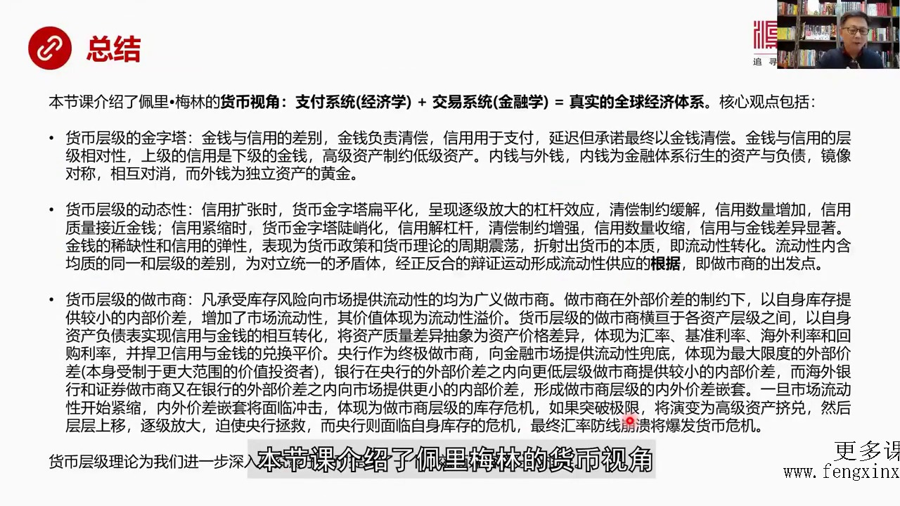

也就是說一個支付系統代表經濟學一個交易系統代表金融學加在一起才能形成一個真實的全球經濟體系的這麼一個理解它的主要核心觀點包括三個第一是貨幣層級的金字塔金錢與信用是有差別的金錢是否得清長的信用是用於支付...

<strong>All subtitles</strong>

> 也就是說一個支付系統代表經濟學一個交易系統代表金融學加在一起才能形成一個真實的全球經濟體系的這麼一個理解它的主要核心觀點包括三個第一是貨幣層
> 級的金字塔金錢與信用是有差別的金錢是否得清長的信用是用於支付的延遲但是承諾最終於金錢支付這是信用的原則金錢和信用它的層級又是相對的上級的信用
> 是下級的金錢高級資產是製約低級資產的當然整個金融體系還有內錢和外錢之分內錢是金融體系衍生的對秤性的資產和負債是競項的是相互可以對銷的對銷之後
> 只剩下外錢外錢就是獨立資產的黃金它不是任何人的負債只有它獨立於金融體系之外那麼貨幣層級的動態性不僅是個金塔這個金塔還是個動就是信用擴張的時候
> 金塔是扁平化呈現出逐級放大了一種槓耳效應清藏的製約這個時候會緩解信用了數量會增加信用的製量會接近金錢那麼當它緊縮的時候信用開始緊縮的時候貨幣
> 金塔將會抖翹化信用解讓耳清藏製約怎麼搶這會導致信用數量收縮信用和金錢差異顯著越來越大金錢的吸收性和信用的彈性表現為貨幣政策和貨幣理論的周期震
> 盪反射出來或者叫折射出來貨幣的本質是什麼貨幣的本質不管三大理論哪一種體驗出來都是流動性的轉化而流動性呢內涵製的同一和層級的差異就是軍制是同一
> 性層級是差別這兩者之間同為流動性的一個硬幣的兩面形成了對立統一的矛盾但這是這當然是我的觀念配理媒體已經絕對想不到這些他只談他的動態性而我把流
> 動性他的矛盾性體驗出來而這種正反合著矛盾運動對立統一的運動他的變成運動會形成流動性供應的根據流動性供應這種根據就會指導作實商怎麼進行流動性供
> 應就是作實商的商業的出發點第三個重要的觀念就是貨幣層級的作實商其實也是一種層級在這裡我實際上擴大了他這個觀念就是凡是承受酷存風險而向市場提供
> 流動性的都叫廣義作實商不光是金融體系任何比如說實大商幫民進實大商幫比如說歷史發生的那些什麼這個猶太人意大利商人等等他們提供都是作實商作實商的
> 服務都是提供流動性作實商實際上存在一個外部的架插的制約然後用自身的內部酷存提供較少的內部架插這就增加市場了流動性了他的價值體現為流動性依價流
> 動性有沒有價值有因為他承擔那麼的風險所以他會有流動性依價貨幣層級的作實商恆更於貨幣層級各個層級之間然後用自身的自產出來表來實現不同層級資產的
> 質量的轉化或者叫信用和金錢的相互轉化將資產的質量差異抽象為資產的價格差異體現為匯率基準利率海外美元的利率來賓或者叫回購利率還有包括回購利率並
> 且捍衛信用和金錢之間的對換評價央行作為最終的終極作實商像金融市場提供流動性都抵所有流動性都是有央行提供體現為最大限度的外部架插就是央行給所有
> 金融市場流動性會有一個架插這個架插外部架插是最大化的因為他本身要受制於外部的更大規模的更強大的價值投資者就市場還有一個力量制約央行你的流動性
> 架插這個外部架插不可以超過市場的容忍限度就是更強大市場力量制約這央行央行又給下集的所有流動性下集的所有作商提供流動性的這個外部架插銀行在央行
> 的外部架插之下像更低層級的作商提供較小的內部立場叫小了這個內部架插而海外銀行和政券商作實商又在銀行的外部架插之下像市場提供更小的內部架插這就
> 形成作商曾經這個內外架插的一個欠套外面喇叭口或者叫那個長邊那個墓最遠端那個提供的最大的架插是央行提供了央行確保然後越往裡越往下這個架插越小這
> 是一個架插欠套的結構一旦市場流動性開始緊縮內外架插欠套將會面臨巨大衝擊體現為作實商各級作實商的庫存都會爆發危機如果庫存突破極限就是在左側突破
> 的極限將會以演變為高級資產幾對由於第一季資產數量更大幾對高級資產高級資產在被攻破在幾對更高級資產會形成跌加衝擊的效益就會是這個幾對層層上一逐
> 級放大最後破是央行著舊而央行怎麼也對這自身庫存的危機央行又有庫存它的庫存是黃金和外有儲備如果它的拯救市場用力過盲它的外有儲備和這個黃金儲備不
> 斷下降那最終將會導致匯率防線崩潰這將會爆發貨幣危機所以整個貨幣層級理論為我們進一步研究影子銀行貨幣影子銀行和影子貨幣提供了一個非常有效也非常
> 堅榮的分析架構當然這跟我們紅旋這個美元環流體系結合在一起包括我們所從從黑梗那借件來的邏輯透視從馬克思那借件來的辯證運動辯證矛盾的運動包括從砍
> 斯那借件過來的流動性還有包括我們從貨幣創造理論中還有商品貨幣中還有這個國家貨幣中從各種不同理論體中所提煉出了各種精華在美元環流這個框架書我們
> 正在形成一種會流包括這回梅林的新的他的貨幣視角貨幣層級理論使我們現在紅旋的美元環流的底層架構可使用的工具和模塊越來越多而我始終堅持環流的思想
> 比純粹的機制塔和純粹的機械的概念要更科學所以我們現在實際上正在不斷在提煉不斷在西納新的思想不斷在提煉和抽象貨幣環流的理論我們正在走向形成完備
> 的貨幣環流思想體系的或是要理論體系的進化路徑之上這就是這堂課咱們能夠學到一個重要的思想新的思想的一個視角貨幣視角好今天咱們的課就到這裡謝謝大家推薦閱讀這是他的三本民眾新論嗎底

---

### Slide 24

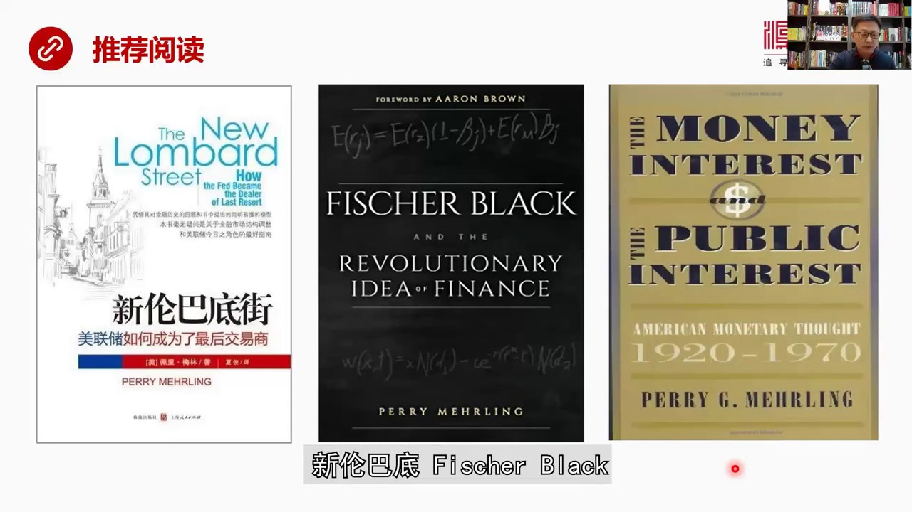

這些是Black的他的傳記還有這是他寫他當教授要當中教授寫的一個對美國貨幣思想的一個總結他其實對這本書最不滿意對這本書最滿意對這本書覺得獲得了重大啟發當這本書他認為還沒有把他的整個的思想體介紹清楚新作...

<strong>All subtitles</strong>

> 這些是Black的他的傳記還有這是他寫他當教授要當中教授寫的一個對美國貨幣思想的一個總結他其實對這本書最不滿意對這本書最滿意對這本書覺得獲得
> 了重大啟發當這本書他認為還沒有把他的整個的思想體介紹清楚新作還展示沒有但是他寫了不少文章這篇文章就是我們今天這個課程主要介紹了他的思想體系

---

### Slide 25

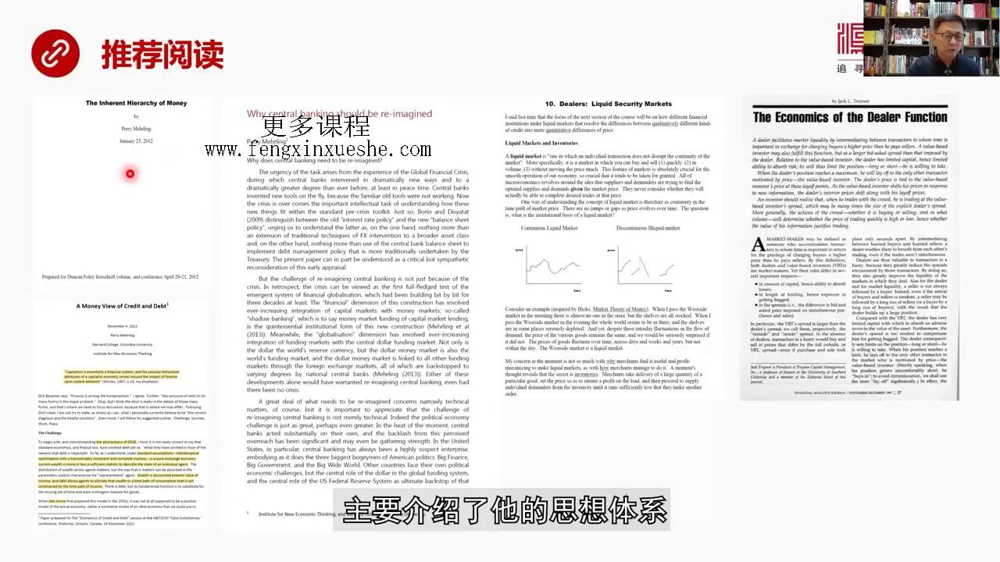

當中間我還加了很多我們紅穴的思想另外這是他的貨幣視角對於信用和債務之間的分析和判斷怎麼區別信用什麼叫債務統一用貨幣視角怎麼來看紅穴經濟怎麼來看這個金融市場還有他為BS世界經段國際清算銀行寫的一些文章包...

<strong>All subtitles</strong>

> 當中間我還加了很多我們紅穴的思想另外這是他的貨幣視角對於信用和債務之間的分析和判斷怎麼區別信用什麼叫債務統一用貨幣視角怎麼來看紅穴經濟怎麼來
> 看這個金融市場還有他為BS世界經段國際清算銀行寫的一些文章包括他發表一些其他的這個是Triner我剛剛講的這個褲存交易商褲存或者叫做上褲存的
> 經濟學的一篇重要的文章1987年這個人寫的這篇文章告訴我們做得上如何在外部教察之下限制之下形成他的報價的原則他這個經濟學他這個是怎麼思考問題
> 他經濟學的原理是什麼非常有意思好今天我們的課就到這裡然後希望大家後面繼續聽我們的

---

### Slide 26

貨幣的第二第三部分

<strong>All subtitles</strong>

> 貨幣的第二第三部分

---
