# 核心课视频-99-102 _ 现代货币创造（四）影子货币-中 — Detail Slide Notes

> **来源**：鸿学院核心课程  
> **幻灯片**：27 张

---

### Slide 1

今天的主题是现代货币创造影贼银行的第二部分首先提醒大家一下这场课是它的内容量不较大而且关于影贼银行的细节部分比较多所以可能很多人会觉得一遍看起来会比较吃力但是不要紧今天我们讲的比如说影贼银行的逻辑地图...

<strong>All subtitles</strong>

> 今天的主题是现代货币创造影贼银行的第二部分首先提醒大家一下这场课是它的内容量不较大而且关于影贼银行的细节部分比较多所以可能很多人会觉得一遍看
> 起来会比较吃力但是不要紧今天我们讲的比如说影贼银行的逻辑地图这是像昨儿坦这样的人花了七年的时间非常认真仔细研究和汇职出来的假如我们用七天的时
> 间能够把它吃透 看懂然后逐渐的琢磨出来它背后的全部的这些重要的支持点那么仍然相当于我们用了一比三百六的杠杆绿时间杠杆绿我们非常合算我们头容易
> 一天时间 相当于它花了一年的时间所以从这个议来说咱们的学习效率是非常高的我希望通过关于现代货币创造特别是影贼银行系列课程大家能够对现代货币的
> 制度包括现代金融市场最核心的部分能够有一个透彻的了解然后再看国际金融 再看世界的金融市场的变化就能做到心中有数好 我们看第一页首先我们要讲一下影贼银行它的崛起背景是什么

---

### Slide 2

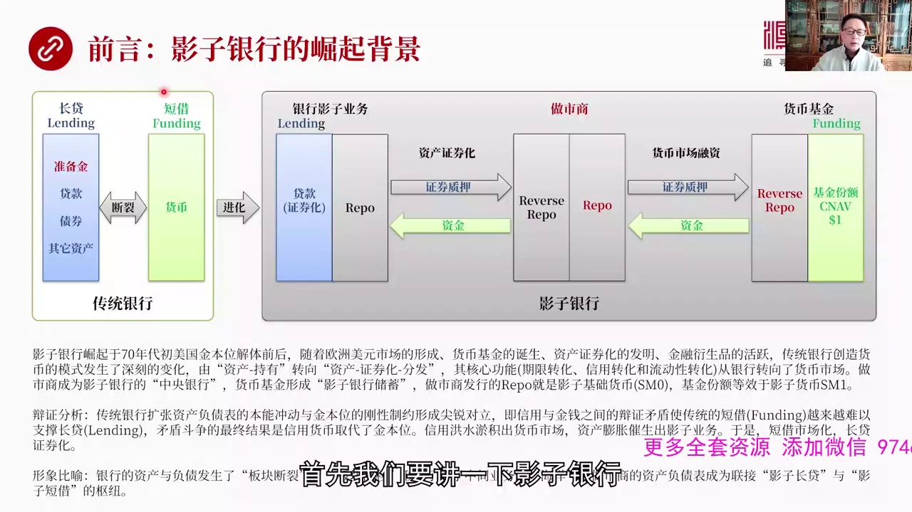

我们知道美国的货币制度 乃至全球的货币制度在整个二十世纪意识到1971年之前 都是金本位或者说 从二战之后意识到1997年之间 叫金会对本位制就是全界的货币跟美元挂钩而美元跟黄金挂钩那么美国确保三叔美...

<strong>All subtitles</strong>

> 我们知道美国的货币制度 乃至全球的货币制度在整个二十世纪意识到1971年之前 都是金本位或者说 从二战之后意识到1997年之间 叫金会对本位
> 制就是全界的货币跟美元挂钩而美元跟黄金挂钩那么美国确保三叔美元对换一样草黄金这就是金会对本位制度核心那么在这样的一种金本位之下银行是怎么操作
> 的我们来看银行的资产费代表 传统银行其实现在以前的银行它的资产费代表是典型的短界和长代就是用短期界代的所谓的方顶来支持长期的这些资产的轮顶它
> 的资产包括戴款 债券和其他一切能够产生现金流的这些东西都叫资产那么短界什么意思我们在现在货币创造这个系列课程中专门说过银行是通过创造通过戴款
> 来创造处序这给人一种强烈印象就是 银行创造货币是他随意而为他想创造多少 就创造多少其实不是银行创造处序 当然他自己可以随便创造爱多少 就有多
> 少但是你创造出的处序 别人是会动用的也就是说当别人支付 把处序赞过中的钱支付给另外一家银行的时候那么这个支付行为会向央行发出指令因为他需要清
> 长债务清长债务是靠央行准备金在准备金账楼上进行资金化转所以当你从银行处序账楼中支付写支票或者现在用手机都一样支付一百块钱的时候意味着央行接受
> 到您的指令必须把你在准备金账护上了一百块钱支付给另外一家银行假如这家创造处序的银行在央行准备金账楼上没有一百块钱呢那支付是无效的支付无法完成
> 因为准备金清长无法執行所以我们所说的短借就是创造的处序从本质上来看实际上是在准备金账楼上去借其他银行的准备金而已所以短借借什么借的是准备金短
> 借的准备金来支持长代的各种各样的资产这是传统银行的标准模式那么在实践中大家生成一笔贷款之后创造相对应的处序那么创造贷款之后银行会持有这笔资产
> 一直到他到期为止这就是资产持有创造资产并且持有到期这是一种基本模式那么基本为结束之后就是1997年米克松在8月17号宣布我们美国的货币制度跟
> 黄金托勾这是发生在1997年那个货币制度的重大转变在那之后美国银行体系创造美元的钢性制约没有了那么海练的货币被创造出来所以我们看到70年代出
> 现了全球通脏在美国出现了制脏就是个道理那么在那样的一种情况之下当你能够无限创造货币的时候不再受黄金制约的时候就会使得货币量大增实际上会于己产
> 生于己就像河水发红水一样发了红水之后会于己出一个黄范区这个黄范区是什么其实就是货币市场诞生了一个非常活跃流动性非常强的货币市场就像黄范区一样
> 形成了同时大量美元增发有像欧洲又形成了欧洲美元体系在美国内部形成了货币市场的高度流动性再加上与直向半随的货币市场基金诞生了还有资产争券化被发
> 明出来了还有金融衍生产品越来越活跃这几个因素加在一起导致传统银行创造货币的模式发生了深刻变化就是由那种以前的创造贷款或者叫资产然后持有到期转
> 向了创造资产之后然后进行政券化然后进行分发就是创造资产把他打包卖掉银行不再持有贷款到期这就是资产政券化和分发的模式为什么会出现这样的一种方式
> 或者这种方式他意味着什么其实他意味着传统银行的三大核心功能比如说期限转化还有性转化还有流动性转化这三个核心功能都从传统的银行转向了货币市场由
> 货币市场的主要玩家来分别承担相应的职能如果形象来看的话这个变签或者叫传统银行转型我们可以用这张图来做一个适应就是在金本位之下传统银行扩张自己
> 资产费的表是一种强烈的本能但是他受到了金本位刚性的制约所以货币不能无限扩张形象说这两者之间资产和负债或者叫长代和短届之间产生了一个非常强的一
> 个张力最后形成了短裂短裂之后就好像大陆飘移一样我们看到这个银行的长代业务他出现证据的话那么他短届这个板块飘到另外一边如果我们形象来说就是这个
> 长径和短代这两个板块发生了分裂板块断裂了然后相互越飘越远中间就形成了个巨大的空间我们可以想象一下地中海张开了所以海水灌进来了这中间就形成了一
> 个引资银行的业务海洋在这个业务海洋中间最重要的是做事商我们可以看到做事商的资产负赛表某种意义上类似于一个年纪纪或者叫连接的书扭他实际上通过做
> 事商资产负赛表把戒和带这两者两个资产负赛表实际上通过做事商这个年纪纪把它年纪在一起所以做事商是整个引资银行最重要的核心部门相当于引资银行的中
> 央银行那么它的业务流程就是传统银行的业务比如说贷款进行了政权化这个过程相当于银行在进行引资业务这个轮定部分那么政权化的结果是什么呢就是把贷款
> 比如按键点贷款制造成了标准化的NBS债券或者进一步价工成了CDO然后以这些标准化的债券为抵押发行或者叫创造Report回购也就是回购相当于一
> 种借款的方式它用什么做的抵押做的抵押用标准化的NBS债券或者CDO做的抵押然后把这个借条Report这个借条想做实商这个方向转移它用资产作为
> 抵押因为NBS债券作为抵押向做实商去借钱质疑它的政权作为资产抵押那么做实商在它的资产复材表上这个回购的白条显示为你回购好做实商收到了这样的一
> 个债有白条和抵押的资产之后它也没有钱它怎么办?它自己在以这个资产抵押作为抵押发行自己的Report或叫回购的负债向货币基金来借钱所以这个Re
> port借据带着它的抵押品一起在流向了货币市场基金货币市场基金收到了这个资产之后创造基金份子所谓的资产禁止必须要大于亿美元创造这个份子之后由
> 谁购买?由外部投资者比如说资产管理机构他们来购买基金所以我们来看到整个这个业务流程是传统银行的开始做政策化的业务相当于它进入了影子业务它的贷
> 款被做成标准化的证券然后通过银行的repo进行资产的抵押支付到了做事商的资产负债表上做事商把它做为资产同时发行自己的回购负债再把这个抵押品继
> 续流转到货币市场基金货币市场基金把做事商的这个借据也就是它的拎回购作为它的资产相对应创造或者叫发行基金份额发行基金份额由外部的资产管理部门进
> 行购买这就是整个影子银行的业务的全部的流程从这张图上我们可以看到做事商相当于中央银行把银行业务的贷款和它过去的借款把这个所谓的长代和短借通过
> 做事商自然负债表连接在了一起这就是影子银行的核心那么如果说做事商相当于影子银行的中央银行的话那么货币市场基金相当于影子银行的处序那么做事商我
> 们来看它的资产负债表它所收到了一银行支付给它的repo在它资产负债表上显示城市逆回购这两者是一回事那么在这相当于它的资产然后这笔资产它的本质
> 是什么本质是由抵押产品的或者叫由抵押的资产的同时这个借据本身是有力气收入的因为它抵押向你融资会有回购利率所以这对于做事商来说这是它的核心资产
> 它发现的repo做事商发现的repo就比较类似于中央银行发行的基础货币所以做事商发现了repo当然包括它的抵押品相当于影子银行的基础货币SM
> 0那么这个基础货币转移到了货币上基金货币上基金相当于传统意义上的银行那么就相当于传统银行的准备金而银行或者叫货币上基金由于有了准备金它可以发
> 放自己的发行自己的处序在这里相当于货币上基金创造自己的基金份量所以这就是影子银行和传统银行可以类比的地方那么如果我们从变政法的角度来分析一下
> 这个传统银行像影子银行为什么会这么进化愿意合在如果我们用变政法的思想怎么来思考这个问题首先要找到变政的矛盾矛盾是什么矛盾是传统银行扩张资产表
> 它有一种本能的冲动那么这种本能冲动与金本位刚性制约之前形成了尖锐的对立一个要扩张一个不让它扩张这就是一种变政矛盾换句话说就是信用和金钱之间的
> 矛盾冲突这是我们上场客所讲的信用和金钱是不一样的金钱是上级资产信用是派生出来的而信用天然有扩张的本能而金钱是有限的两者之间必然产生矛盾这种矛
> 盾激化到一定程度就会是传统的短界越来越难以满足长代的需求这个方订和伦订传统模式不再能够正常运行最后到这个结果是什么是信用货币制度取代了金本位
> 这样一来货币超发了信用了红水越来越大这就预籍出了货币市场同时资产越来越膨胀这就催生出了影子业务因为资产膨胀太多贷款量太大就必然是银行想一个办
> 法把资产货币表中间的贷款资产由于欺骗太长风险太大想进一件办法想把它转移走转架这个风险所以就会由于资产膨胀刺激影子银行业务的出现然后出现的结果
> 就是短剂市场化长代正确化这就是传统银行向影子银行过渡的一种逻辑分析或者叫辩证矛盾的分析所以形象比越来说银行的资产与复债发生了半块之间的断裂半
> 块漂移短剑制度越漂越远这就会形成中间业务的影子业务的海洋座实商它的资产贷表成为连接影子长代和影子短届之间的重要的书牛这就是影子银行崛起它的背
> 景和它的逻辑的必然性我们看下一頁那么影子银行的实践它到底是怎么做的

---

### Slide 3

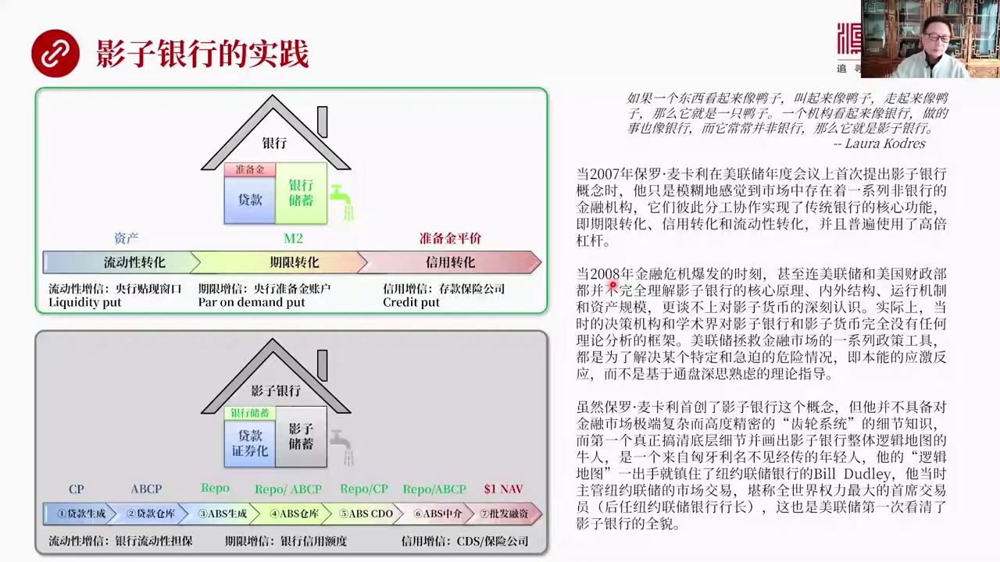

如果我们来看这两张图这是传统银行的核心功能三大功能流动性转化、旗舰转化和性转化它是怎么做的传统银行当然它有准备金资产向下有贷款它的复债是银行处去就是货币然后产生了为社会提供了流动性那么它的转化首先是把...

<strong>All subtitles</strong>

> 如果我们来看这两张图这是传统银行的核心功能三大功能流动性转化、旗舰转化和性转化它是怎么做的传统银行当然它有准备金资产向下有贷款它的复债是银行
> 处去就是货币然后产生了为社会提供了流动性那么它的转化首先是把资产要把资产变成一个可流动的东西就是把一个不可流动的贷款一笔贷款在市场上很难买买
> 基本上没有流动性转化成可以自由流动的货币所以首先设计的是流动性转化然后呢第二个转化是旗舰转化什么叫旗舰转化就是贷款是一个30年的贷款而银行处
> 去呢是老百姓到了银行双口你马上就得支付所以这两者是旗舰是不匹配的所谓短届长贷所以要进行旗舰转化就把一个长期的30年之后才能完结的贷款转变成美
> 食美克老百姓来了之后刚性的一种要求这就是贷款长贷和短届之间的旗舰进行了巨大的转变然后呢第三个转化是性转化就是银行处去你所创造出来的每一块钱理
> 论上必须要等于准备金的价值也就是说你银行创造的信用必须要跟这个准备金或者叫基础货币要等价要不然老百姓拿点收你的钱呢所以这就涉及到一个信用增强
> 的问题这叫准备金评价我们可以看到在三个转化过程中实际上相当于做工相当于有了能量之后对整个体积做工都需要进行增强首先是流动性增强你要靠什么央行
> 听言传口或者叫这个是一种单报央行对银行进行单报为什么叫流动性增强当这个银行流动性资金滚动出了问题或者说出现了严重了困难那么他们可以去找央行敲
> 听言传口去借钱借什么借得实际上是准备金来还解流动性好在七验证划过程中同样涉及到七骗增强靠的是央行准备金账户就是帕亚底曼的铺子这话怎么来理解就
> 是说当你给老百姓的承诺美食美课你拿都可以拿钱到银行来区馆都可以拿着银行卡来区馆那么如果我银行没有这么多准备金如果准备金耗金了怎么办实际上央行
> 准备了他的提供的准备名账户上可以给你一个选择你可以通过天廠口是一种方式还一种方式是找其他银行紧急拆借也就是说A银行准备金不够了他可以去找B银
> 行去借钱借准备金这就形成了联邦基金利率市场那个基准利率之所以能做到这点是因为大家在央行都有准备金账户所以在央行拥有准备金账户这件事为银行提供
> 了七线证信那么信用证信所谓credit put是什么概念就是有存款保险公司FDS1存在那么老百姓的储蓄是一旦出现损失那么保险存款保险公司会保
> 证每个储户账户上上线我给你单保了上线是25万美元这样一个上线的额只要你亏损不超过25万保险公司会陪你超过25万之外的那是你自认倒霉这个就是信
> 用证信为什么叫信用证信因为当这些损失没有存款保险公司来单保的话所有损失当然是原则于贷款的损失都会导致银行自由资本金的亏损当贷款损失超过了自由
> 资本金你成了资本金那就出了问题了所以所谓信用就是指银行不破产的信用存款保险金保护储户的25万美元实际上等于帮助银行去西纳贷款损失当全部损失由
> 准备存款保险公司西纳之后你的银行的自由资本金不就受到了保护吗你的信用不就得到了增强吗所以存款保险公司做的事是向银行体系提供不破产的单保这就是
> 银行的信用那么我们来看银资银行其实大同小艺它的逻辑上是一致的银资银行也有自己的准备金当然是银行的处序因为它的所有人这个银资银行的业务最后都是
> 资金在周转那么它的贷款当然要进行证券化它对应的是银资处序这就是我刚刚所说的货币市场银资银行的基金份额相当于银资银行的处序然后流出了流动性那就
> 是基金份额它的流动运转化欺验转化和信用转化三大转化呢实际上被分成了七一个步骤当然一会我们讲昨儿谈的这个逻辑地球的时候会详细的分析首先贷款生成
> 这跟传统一样一样然后第二步是贷款参户生成贷款之后放进参户里保存起来然后是从参户里面去生成第三步是生成ABS或者叫NBS标准证券化的产品得到证
> 券化然后在生成第四步把生成的资产证券化的东西再放进一个新的参户ABS参户第五步如果有必要再把ABS这种标准化的产品合成为CDO然后第六步是由
> 一个像SIV或者叫特殊的这么一个法律实体持有这些资产然后进行中进最后第七步是像货比上进行批发就是大批量卖给货比上进进这要批发融资卖把资产卖给
> 货比上进进等于从货比质让进进收到钱所以它是个融资的过程资金是倒着走的资产是往这个方向而资金是往这个方向那么这也涉及到增弃了问题比如说流动性增
> 弃谁来给隐资银行体系提供流动性的增弃呢当然是银行银行会给中间涉及到各个环节在很大程度上都是银行的副属机构银行会给大家提供流动性蛋保就好比央行
> 给银行提供流动性蛋保是一个道理七件增弃就是银行会给它的领资银行中间的所有副属环节提供一种信用额度就是我确保你资金能够滚动还有信用增弃主要是靠
> CDS 信委调期还有保险公司来提供蛋保保证你的资产不受损失当然也就保证你的这个银资银行机构的信用或者说你不至于破产这是跟传统银行非常类似的三
> 个核心功能用七个步骤来实现三种增弃在银资银行体系周也有相应的增弃的方式当然同时上面我还写到了一系列的像CPABCP这是每一步做这些业务所涉及
> 到的融资手段这就是银资银行所特有的比如说CP商业票剧贷款生成很大程度上是由商业票剧来支持那么贷款参户是靠资产底压型的商业票剧来支持那么生成A
> BS或者NBS这种标志化证券产品的时候作为商靠什么呢它是靠repo来实现靠回够来实现融资那么再往后它可能用repo加ABCP或者repo加C
> P或者repo加ABCP最后形成了融资是靠资金份额货币上基金份额大家可能一开始接受这些信息或者接受这些名词看到这样的一个这么多步骤会觉得头疼
> 不要紧反复的学习反复的去习惯熟悉之后熟能生巧你慢慢就接受了好我们来看这个隐资银行在理论界大家是怎么认为的就是怎么认知隐资银行体系的首先研究隐
> 资银行体系的有一个人叫Laura Cortes他有一个比较有名类一句话被很多人所引用他借用了美国一句言名他说如果一个东西看起来像鸭子叫起来像
> 鸭子走起来也像鸭子的话他就是一直鸭子那么一个机构如果看起来像银行做的事也像银行而他常常并非银行他就是银资银行当然这是一个非常形象和有趣生动的
> 比喻但实际上他讲的就是传统银行做的三大转化流动性期限和性转化而银资银行做的也是这三大转化所以他应该叫做银资银行实际上这个词会这个词是2007
> 年有宝罗麦卡利他在于有一次美联处的年会上首次提出了这个概念什么叫银资银行但是宝罗麦卡利这个人呢他是搞理论的搞学术的他只是蒙龙的模糊的感觉到市
> 场中存在着一系列非银行的机构他们之间通过彼此的分工协作实现了传统银行的三大核心功能而且普遍使用了高背尴尬所以他觉得这应该叫做一种向银行又不向
> 银行的东西所以他给他下了个定义这叫银资银行这是第一次出现银资银行这个概念当2008年经营危机爆发之后其实当时甚至连美联处和美国财政部的很多决
> 策者都并不完全理解影子银行的核心原理因为只有个概念根本没有理论体系他到底内外结构是怎么样怎么运行的还有他有多大的规模中间摄像哪些风险谁参与了
> 什么都不知道因为并没有一套理论框架但是对影子货币的认识更谈不上了实际上学术界和决策机构对影子银行和影子货币没有理论分析的框架这就导致美联处拯
> 救金融危机所採取了一系列政策工具其实都是为了解决某个特定的问题和某个特别极破的危险的问题处理就是应机本能力应机反应而不是说我事件已经理解了影
> 子银行体系我知道应该先救谁谁最重要应该怎么拯救他没有一套成熟和通盘的考虑虽然我们看到这个宝倫马卡利手创了这个概念影子银行但是由于他是搞理论的
> 他并不真正知道金融市场非常复杂的这套体系是怎么架构起来的就是所谓的底层的高度精密的齿轮系统是怎么相互咬合的他没有这种细节的知识而第1个真正搞
> 明白底层细节并且画出整个影子银行体系全图的或者叫逻辑地图的这个人是一个来自熏亚利的名不见金转的年轻人他用了七年的时间研究清楚了所有底层的齿轮
> 和齿轮之间应该如何咬合所有细节搞清楚之后画出了他这张逻辑地图所以他把这张地图卸给了扭约连处银行的鼻尔度的力当时鼻尔度的力正在主管扭约连处银行
> 的市场交易部门当然处在这个位置上的人实际上是管着整个美联处的资产表上的资产的交易可以号成是世界上首席的交易员当然后来鼻尔度的力身为扭约连处银
> 行的行长而扭约连处银行我们都知道是12家连处银行中最重要最关键实际上是美联处的核心那么这个明不见金转的虚药力年轻人实际上是张松线地图把他的保
> 图线给了美联处之后美联处在第一次看清了引资银行的泉帽这张图我们今天要讲了一个重要的内容好这就翻下一页我们要正式进入

---

### Slide 4

引资银行的逻辑地图了这张地图是左耳弹这个虚药力人花了七年的时间详细的了解了所有齐乐的细节然后了解了特别是他通过自然分代表的方式来进行展现他需要了解自然分代表中间的变化情况和上下有了关系包括怎么进行担保...

<strong>All subtitles</strong>

> 引资银行的逻辑地图了这张地图是左耳弹这个虚药力人花了七年的时间详细的了解了所有齐乐的细节然后了解了特别是他通过自然分代表的方式来进行展现他需
> 要了解自然分代表中间的变化情况和上下有了关系包括怎么进行担保怎么进行增弃如何实现三大功能等等等等全部用这张引资银行的全图展现出来所以刊成是张
> 松把八鼠地区的全部地形的细节交给了刘黄书好我们看下一页这个图看起来究竟是什么样这就是引资银行体系的全图

---

### Slide 5

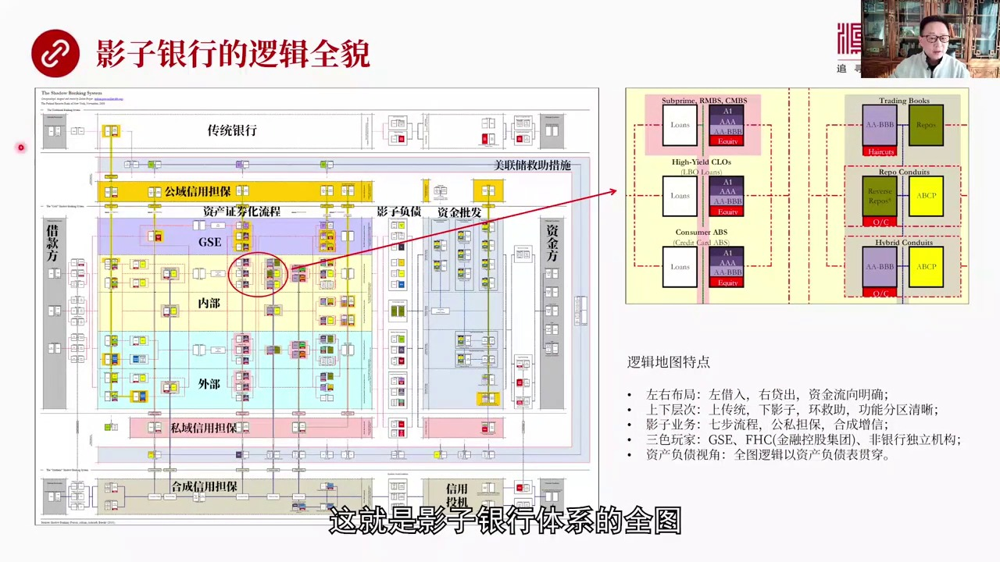

我们知道如果我们看这张图的话第一印象是什么第一印象我的天哪这么多秘密门秘密瓦瓦的这些小方块看起来特别像芯片的设计图高度集成看起来非常的复杂谁让我第一次看这个图的时候脑子也晕了我的天哪这个图该怎么看应该...

<strong>All subtitles</strong>

> 我们知道如果我们看这张图的话第一印象是什么第一印象我的天哪这么多秘密门秘密瓦瓦的这些小方块看起来特别像芯片的设计图高度集成看起来非常的复杂谁
> 让我第一次看这个图的时候脑子也晕了我的天哪这个图该怎么看应该怎么来理解觉得特别复杂但是当你反复研究用了几个月把它彻底研究明白之后我现在再看这
> 张图非常地清晰每个部分你看就知道它在说什么怎么来看这张图我们可以看到这看起来像个芯片设计图如果我们把这小块进行放大放大出来其实是这样这就是资
> 产负代表比如说我们看到次议带的NBS或者叫致等秀的或者叫住房的RNBS或者叫Commerce秀的就是商业地产的CNBS实际上是一个道理它的构
> 成资产负代表左边当然是代管了右边是对应的被分析的证据化产品所以每一个部分包括CIO这个资产地亚证据化产品这边是做是商的它的交易的账户我们可以
> 看到它的资产负代表看起来是这样所以任何资产到它这儿作为底交易商会发行Ripple或者发行ABCP向影子银行的处殊部门也就是后比基金去融资你把
> 这个所有模块一块一块一个一个自己看了之后就会明白其实也没有什么难以理解很简单当然要求我们要花很多时间把它全部看懂每一个模块每一个小方块和它上
> 下有了关系和它所设计到处在整个影子银行业务的哪一步它完成的是什么功能是欺骗转化还是刘德定转化还是信用转化是完成了什么功能它有什么方式去融资它
> 发现什么票举去融资等等都要搞明白还是它怎么增新那么如果我们来看这张图我觉得这张图画的从整体来看我们首先要从整体上看出它的逻辑结构它的基本特点
> 是什么左右布局这是它第一个特点左边是资金方右边是需要资金的借贷方整个资金是从这边流出向这边流动从右边流出流向左边所以从这个角度来说左右代表资
> 金的供应方和需求方资金是从从右向左流非常清楚上下层次也非常分明上面这代表传统银行业务传统银行业务就是代管持有到7等等那么下面这就是影子银行体
> 系了那么中间这一块我们看到有一个这样一个环保型马梯铁形状的方块这代表着美联储对影子银行体系的救助2008年之后出现金融危机美联储建立起了一个
> 马梯铁形的一个保护层来保护整个银行体系所对应的小方块都是各种各样的拯救医疾交易商的拯救困难资产的拯救其他的各种各样的代款的各种各样的方式全部
> 列在这边这上面是进行单保信用单保的这下面这些方块是代表信用增强的还有这边是代表资金放了供应等等它做了一个环型的马梯铁形的这样一个框图来代表美
> 联储的救助所以它的功能基本上看起来是非常清晰的我们再看中间的黄色部分这代表着公寓信用单保体性什么叫公寓信用单保体性就是美联储听见双口这算公寓
> 的FDS1这当然是公共领域的等等这些公寓信用单保保护着资产证券化的一个部分那么似乎那么体系保护着其余的部分好这个就是功能分区很清楚然后我们再
> 看中间中间涉及到资产证券化的流程这是从第一步到第七步然后这是整个影子银行的资产证券化的部分怎么把贷款逐步变成可流动性的非常高的这样一种证券化
> 的产品最后形成影子银行的最终产品或者叫影子银行的负贷然后最后怎么被这个货币上基金索西纳或者叫批发给他们那么我们来看这就是影子银行业务七步流程
> 公司单宝合成争信底下就是私有的争信部门信用投机公有的信用单宝和私有的信用单宝一起来单宝整个这套体系后来还不行崩了再加上美联处的金刚照才把整个
> 这套体系给维持住好三色玩家是什么呢GSE还有内部子系统还有FHCFHC就是指的金融控股集团还有呢非金融非银行的独立机构这叫外部体系所以从这三
> 种玩家也可以看出来它用不同颜色标准传很清楚GSE两方还有联邦代管公司联邦的房屋代管公司等等这都是一政府资助的机构它用紫色标准内部机构它专门指
> 的就是金融控股集团FHCFinancial holding company这些金融控股集团往往拥有整个影子银行流程的所有的核心部门都是它自己
> 拥有的比如说银行上银行是控公司下属的一家银行比如说这个做事商是它控公司下属的做事商包括甚至包括这个货币市场积金也是金融控股集团下属的货币市场
> 积金整个流程它全部包干这叫内部紫系统那么在内部紫系统中间实际上这个比较有意思的业务就是欧洲银行就是欧洲银行做的银子业务或者叫欧洲美元的银子银
> 行业务实际上是外包给了美国的金融控股集团有一部分是外包给了金融控股集团它的做事商它的包括它的这个货币市场积金还有它的销售渠道来做资产争券化的
> 部分来做最后产品的销售部分所以欧洲银子银行部分也被涵盖在内部体秩中在这一块它把业务外包给了美国的金融控股集团当然欧洲银行也有很多自己的在美国
> 的分支机构比如说得知银行在美国有自己的投行在美国有自己的这个机构他们也帮助完成一部分这算在美国的内部紫系统中间还有呢他们除了这个跟银行控股集
> 团合作还跟外部系统合作也有一份业务是包给他们的所谓外部紫系统这样它强调的就是银子银行体系的不属于银行控股集团的独立的这些参与者比如说很多机构
> 它没有商业银行但它有工业代管公司有这个金融公司也可以进行代管这个是独立于金融控股集团的还有呢做事商做事商也有独立的做事商比如说雷曼比如说高盛
> 比如说这个包括这个贝尔斯登有五个它不属于任何银行它不是属于控股集团的它是独立的在金融危机之前它属于独立的五大的做事商也有还有呢当然就是货币上
> 基金也有不属于任何银行体系的比如说2008年跌破禁止的这个Rezer放的它就属于独立的正是因为它独立所以它出了问题没有银行拯救的所以它破产了
> 它跌破的禁止还有一点就是这张图展现出来是资产负赛表视角所有的模块全是资产负赛表放大之后你会看到大量的这种资产负赛表之间的相互关系这整个这张图
> 就是用资产负赛表它的全部的逻辑就是用资产负赛表一以贯之的把它贯成在一起的所以昨儿谈最重要的就是提供了资产负赛表的分析方式把所有的银银行用这样
> 的一个全图得以清晰的展现我们看下一页这个制图师我们以前提到过很多次

---

### Slide 6

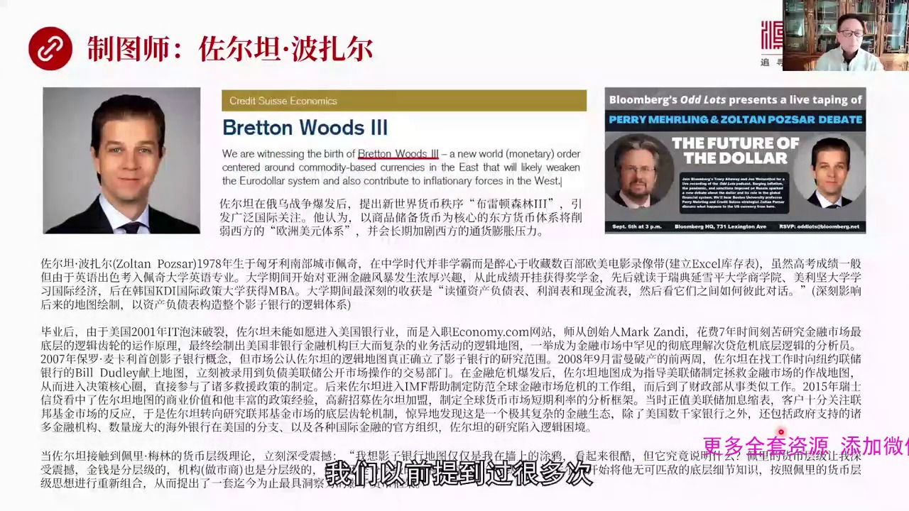

就是这个昨儿谈波战这是一个需要利人最近这个昨儿谈很多观点非常受到关注特别是它提出了在这个卫物战争爆发之后20它是应该是2022年3月提出了一个所谓布雷顿森林体制三的一个新的购想就是世界货币秩序要进化到...

<strong>All subtitles</strong>

> 就是这个昨儿谈波战这是一个需要利人最近这个昨儿谈很多观点非常受到关注特别是它提出了在这个卫物战争爆发之后20它是应该是2022年3月提出了一
> 个所谓布雷顿森林体制三的一个新的购想就是世界货币秩序要进化到布雷顿森林体制三了要形成一种新的世界货币秩序了当然这个说法引起了全世界的广泛关注
> 它认为以商品儲备货币为核心的东方货币体系将会削弱西方的所谓的欧洲美元体系或者叫信用货币体系并且会长期加剧西方的通货膨胀家里在今年的9月6号还
> 有一个对谈就是佩里梅林和左尔坛的对谈在谈未来的美元的趋势当然这两个人关系是非常好可以说左尔坛认为佩里梅林就是他的师父因为这两个人的特点非常不
> 一样左尔坛是非常精细于他非常擅长于了解精细的细节对细节扣的非常头而佩里梅林呢是一个具有大智慧具有哲学思考能力和理论购价能力的大师这两者的结合
> 是一种相当完美结合他提供迟罗是怎么运转的他作为工程师告诉这个厂房应该怎么来见这就是两者这样关系首先我们来看左尔坛他的他的精力为什么我们需要研
> 究一个人精力因为你研究他的理论或者研究他的提出了很多想法你要看看这个人他成长的过程然后这个成长过程会帮助你去了解他的思维方式特别是根据他成长
> 过程你会看到这个人他是不是有真正的战略定理比如说佩里梅林我们上次上街课专门说过30年如一日就研究这一件事所以你如果看他的很多很多讲了东西的话
> 你会发现他是一个非常有定理的人要把一个问题真正要研究透向下挖能挖得很深所以这种人的观点就值得高度地关注左尔坛是一个非常擅长于研究细节的人他是
> 七八年出生于学院立南部的城市佩琪在中学时代他不是一个学帮但是他有一个特长他特别喜欢收集电影当然当时电影电影并没有留媒体和这个正常手机都是录像
> 带他收集了好几百步五六百步这个录像带这当然是我看金融时报对他有个专访我觉得很有意思就是这些细节最有意思你看他怎么去收集跟我们跟我们很多人不一
> 样我们收集完了就往那一堆他可不是他专门用Exo表建立了一个库存然后在库存中详细列出每部电影的名字导演是谁主要演员是谁还有各种各样的相对应他看
> 多少遍等等要进行精确的统计这就是一个细节说明此人非常擅长非常喜欢研究细节问题当然由于他看了几百步美国电影还有欧洲电影所以他的英语很好虽然其他
> 成绩一般但是英语成绩特别好然后他考入了佩吉大学的英语专业在学习期间开始比如说关注一些国际新闻亚洲金融风暴也就是他上学期间出现了一个重大事件他
> 突然对亚洲金融风暴发生了能够兴趣然后开始真正研究金融当然只要像这样的人一用心在任何领域中可以很快的学得很好那么他的成绩立刻变得很好后来得到了
> 奖于金先后就得于瑞典的研究平大学商学院后来到了美国皇上顿的美丽间大学学习国际经济然后到韩国KDI国际政治大学获得了NBA他在整个学习间访难中
> 他提到一个让我一项特别深的一句话他说他学了这么多年最深刻的收获是什么就是一个教授说的上课的时候说一定要独懂资产非常表利润表和现金流表然后看他
> 们这三个表之间如何彼此对话这是他在访谈中谈到他从大学一照研究生期间中唯一提到了一个在学校一个老师告他的一句话实际上我们知道具体的知识重要的是
> 降了一种感悟所以这就是他的最大收获也正是由于他对资产负贷表对快击金对快击学非常重视或者叫对以快击的视角来理解金融理解货币非常擅长所以这就会深
> 刻影响他未来怎么化这个影子银行逻辑地图使用资产负贷表的方式来谎可以说对他整个的思维方式形成产生到重大影响这就是细节后来他毕业之后本来想进入美
> 国的金融业特别是美国银行业但是由于美国当时2001年还就泡沫破裂没有进入就是没有能够顺利进入银行业但是他由于他的研究细节能力非常强他进入了美
> 国的一个网站这个创始人马克战黎是一个挺厉害的人所以他跟着他进行了大量的对金融市场数据的收集和分析马克战黎提出了一整套分析金融市场的方法建立了
> 很多分析模型模式那么昨天跟着他花了七年时间客口研究金融市场的最底层的逻辑扯楼的运作原理特别是他们有具量的数据海当数据可以进行各种各样的在整个
> 金融市场中每个领域每个细节的这种数据分析这是他得天都后的一个优势最终划出了美国非银行机构巨大而复杂的业务的链条形成了一张地图当他划出这张地图
> 说金融市场没有办法他当时已经成为整个金融市场中非常罕见的能够深层次理解次代危机最底层逻辑的非常罕见的一个分析人所以后来2007年这个麦克力创
> 造了影子银行的概念但是市场公认是左尔坦的地图真正确定了影子银行的研究范围可以说左尔坦对于影子银行的研究和对影子银行体系的分析包括监管都起到重
> 大作用而他花了七年搞出这张地图之后在2008年的9月雷曼兄弟公司破坛的两周之前他正在找工作离职了开始找工作他发了三份建立另外两个发给了对中基
> 金的经历结果别人没搭理他第三个建立他发给了纽约连处银行的铁耳朵的力当时就被铁耳朵的看重了来面试面试一问这张地图把立课大为震惊就觉得哇塞还有还
> 有一个这样的人能够对整个这个业务题这么了解马上就说露用了露用到哪露用到纽约连处银行最重要的公开市场操作的交易部门这也是管理这整个美联处所有资
> 产负贷表的核心部门那么金融已经爆发之后昨儿谈把他的地图往墙上一挂打出了一张巨大的地图因为这张地图普通打一机打出来太小他就把这张地图挂到了墙上
> 然后大家来来会会去把他这张图当成作战地图因为拯救金融危机说没有人脑子里有泉帽不知道谁跟谁是什么关系雷曼到底会怎么牵上某家对中基金这家对中基金
> 和雷曼又怎么牵上到AIGAIG怎么又会搞垮了两房天哪如果你没有一张地图的话脑子里面一片混乱想不清楚因为太复杂所以他这张地图挂到墙上之后大家说
> 应该怎么省救金融危机呢应该出台什么政策呢昨儿谈指着地图告诉大家说你们现在谈论了只是这张地图的十分之一的部分要看经全图才能够真正找到解决问题的
> 方案当然后来他就进入了绝策圈和新圈参与了很多救援政策的制定从美联筑出来之后他又进入iMF国际货币基金组织也是被请过去去研究怎么防范全球的金融
> 市场的危机啊这当然也需要一个上昨儿谈这样了解全局的人后来又跟着这个当时美联筑的纽约银行的行长后来调到美国财政部部长作为部长这个盖长纳跟着他又
> 到了财政部做的也是封面防控这方面的工作2015年瑞士信贷看中了昨儿谈这个地图具有着丰富的商业价值但是他还有非常非常丰富的这个行政和这个政策制
> 定的经验然后就把它高兴请过去让他制定全球货币让短期利率的分析框架我们应该怎么看美联筑加息之后全球短期利率市场将会方向什么样的变化呀当时很多瑞
> 士信贷的客户非常关注美联筑不断加息缩表这会对联邦机机市场产生什么样的影响所以昨儿谈就结果了这个任务开始研究美国联邦机机市场的底层的耻轮运作的
> 机制但是他一旦进入细节突然发现这是一个非常非常复杂的进入生态除了美国八千多家银行之外还有各种各样的金融机构包括政府支持的诸多金融机构向两方还
> 有房地产的贷款银行联邦房地产的贷款银行塞丽妹等等还有数量旁大的海外的银行在美国的分支还有各种各样的国际金融机构比如说是银行比如说货币基金组织
> 还有各种各样的这种亚洲开发银行等等等等他们都在联邦基金市场中参与了一个巨大的交易网络非常复杂所以昨儿谈一看这么复杂的东西应该怎么找手去研究它
> 的研究其实陷入了一种逻辑上的困境应该怎么来区分这跟它以前研究银行又不一样了也就是在这个时候昨儿谈接受到了配理梅林的货币层级理论配理梅林很早就
> 提出我们上这个也讲到过货币是分层级天然就天然就是货币生而不平等天然就不是一个层次的问题所以当我们说美联处了一块钱千万不要认为它等于银行处蓄了
> 一块钱银行处蓄一块钱绝对不会等于一块钱的影子银行货币或者一块钱的货币上基金的钱每一种钱都不一样因为它分层次分等级这个观点让昨儿谈深受震撼它以
> 前没有想过货币分层次的所以它立刻的受到了起发它说我想影子银行地图仅仅是我挂在墙上的一个图压看起来很酷但它究竟说明什么实际上昨儿谈画地图的时候
> 它并不真正利益在画的是什么但是佩里梅林一看它就明白了佩里梅林的货币层级让我深受震撼它说金钱是分层次的机构包括做事商也是分层级的价格还是分层级
> 的立差同样是分层级的所有的一切都是分层级的这对昨儿谈一个巨大的起发和震撼所以昨儿谈开始用它无可披离的这种底层系列知识按照佩里梅林的货币层级理
> 论进行组合创新所以它提出了一套气尽为止最具动察力的影子货币的分层的框架这是我们下次内容的主要的部分我们这次首先讲听它的地图它的地图再受到佩里
> 梅林的起发形成了我们下讲要讲的它的新的影子货币的分层框架我们看下一核心子一头我们刚才所说

---

### Slide 7

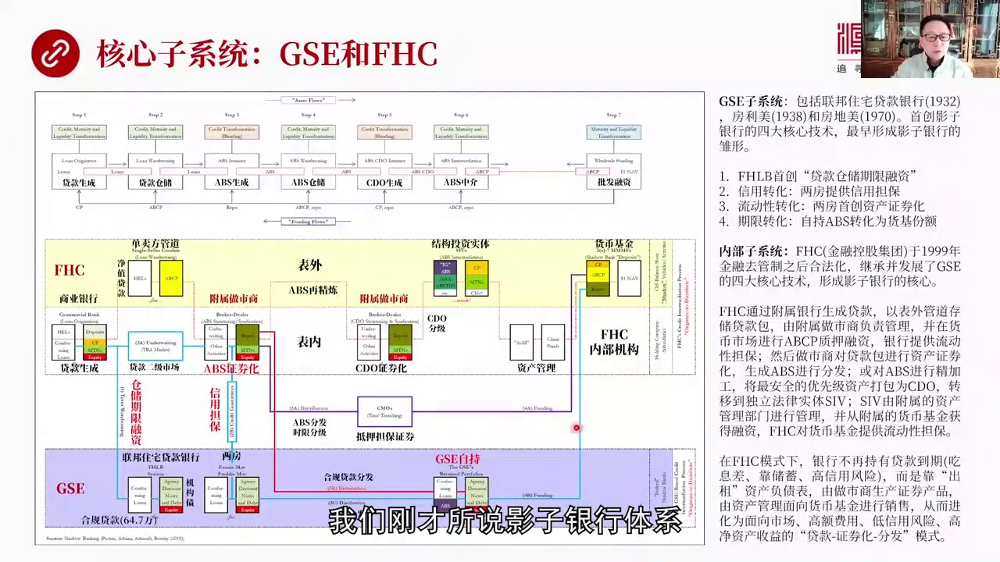

影子央挺细昨儿谈的地图周它的核心子系统包括两个一个是JSE一个是金融控武集团JSE是紫色的金融控武集团是黄色的那么黄这个这一块代表着金融控武集团白色部分代表表内这一部分代表外然后这就是资产证券化了七个...

<strong>All subtitles</strong>

> 影子央挺细昨儿谈的地图周它的核心子系统包括两个一个是JSE一个是金融控武集团JSE是紫色的金融控武集团是黄色的那么黄这个这一块代表着金融控武
> 集团白色部分代表表内这一部分代表外然后这就是资产证券化了七个步骤我们看一下在整个步骤中流程中我们看到从第一步到第七步资产是这个方向流动资产流
> 是从左向右资金流是从右向左资产流是什么资产证券化你把它打包成了标准化的证券之后它的运动方向资金流呢就是从货币市场基金出来的钱是怎么运动回来的
> 这就是两者之间的差别首先我们看第一步第一步当然是贷款生成贷款生成使用的融资办法是通过商业票据这就是第一步我们看到资产金融化第一步如果对应下来
> 之后我们看底下的细节左而谈通过资产分代表把这个细节解读得更清楚在金融控股集团情况之下商业银行是控股集团的组成部分或者说商业银行是属于控股集团
> 的商业银行资产分代表我们可以看到左边是资产右边是否债他的业务在这块代表贷款生成贷款生成了两种贷款一种H1L这什么Home Aquatic L
> oan就是房屋的禁止贷款这是怎么回事我们中国没有这样的业务比如说你买了一个一百万的房子你已经守护在家里例年付的这个本金加在一起已经有二十万了
> 还有八十万是欠银行的钱那么二十万这二十万一百万总的房价中的二十万相当于这个房子的禁止相当于属于你的禁止贷款另外八十万是借的那么这个房子如果你
> 有二十万的禁止在一口你可以把这二十万作为抵押作为禁止进行像银行进行抵押银行可能能够带给你十五万这就是禁止贷款H1L底下呢抗方命弄这什么概念呢
> 抗方命弄主要指是房地产按接点贷款所谓的抗方命弄它指的是和规贷款和谁的规和两房的规两房作为美国最大的金融机构最大的这个非银行金融机构它的主要职
> 责是购买银行的房地产贷款但它购买的前提是你必须要符合我的条件比如说这个人的信用分数得是多少比如说它守护和贷款的比例是多少比如说它的收入和支出
> 的比例是多少它有一系列标准化的流程来确定银行所给这个老百姓生成的这个按接点贷款它要还是不要如果你要想卖给房里买马上套线马上套线走人的话也必须
> 符合我的标准所以它会有一个贷款的一个规范符合这个规范了就叫和规贷款这在两房在金融2007年08年时候这个数还比较低大概是40万美元现在长到6
> 4万7也就是低于64万7的按接点贷款是属于两房认可的和规贷款包括若干条件好那么上银行生成这两种贷款之后生成这两种贷款它是用什么东西来方定的我
> 们知道这是属于长贷那么你短界是靠什么东西来支撑它的当然首先第一部分是银行处去可以理解老百姓存的钱所以我用老百姓存的钱来支撑我这个这些资产长期
> 资产这是可以的但老百姓存钱随时可能来取所以这个是有相当的风险和压力第二种呢cd就是通过商业票剧银行发行社会商业票剧发行给谁发行给货币市场然后
> 由货币让基金和其他的参与者购买除了这个之外还有中期的一些票剧比如说五年的这个银行发行的贷券等等还有equity是它自己的自由资本金这几个家内
> 企来支撑它发行这么多贷款短界常带好我们再看下一步它的声称贷款之后留下分成两个去处禁止贷款卖给了或者叫转移到了单卖房管道扛方便路合规贷款转移到
> 了联邦住宅一贷款银行这又是怎么回事首先单卖房管道这是一个存储存储这个经济贷款的一个倡库或者叫我们可以理解为资产池拿了一笔贷款先放着再来一笔再
> 放着再来一笔再放着极了一个成千上万个然后我觉得可以了我可以把这么多贷款打成个包去进行政权化了它是在打包之前的一个倡厨的过程那么谁在管理做事伤
> 来管理倡厨的过程资金参户搞好了搞好了运给我过开生产加工这是单卖房管道当然这都属于银行控股集团下属的一个法律实体那么这个合规贷款去了哪儿合规贷
> 款去了联邦住宅银贷款银行联邦住宅贷款银行的主要责任是什么它的主要责任是提供倡厨七线融资就是所谓微orhousing的这样的一种方利Term微
> orhousing七线的倡厨的融资这什么概念就是你生成了扛方面路生成了合规贷款比如说62万美元的合规贷款好你伤银行的目的是为了把这个贷款卖走
> 卖给其他的人然后回融资金再做下一笔贷款然后其他人把贷款拿去做成债券好你是要快进快出的好生成这笔贷款到卖出这笔贷款之间是有一个时间的比如说你在
> 6月1号生成了一笔62万美元的贷款那么你可能要到8月1号才能顺利把它卖出去卖给下家进行资产证据化你中间有两个月的时间在你手上那么家这两月就会
> 压到你的资金是不是所以对于银行来说我需要最好有人能够给我提供这里一个月的信贷让我能够生成贷款马上我就有这个资金来帮助我做这个事谁来做这个事连
> 帮助防贷款银行手创了这个业务模式他们提供的朵丸期贷款或者叫倉儲期限融资就好像过桥贷款一样我就给你提供一笔贷款商议上提供一笔贷款期限就是两个月
> 或者他不定期限决定于你什么时候把贷款卖掉也许一个月也许两个月在这个期间我给你提供贷款提供这个融资这叫倉儲期限融资这是一个重大的金融创新期限贷
> 好 大家说那么连帮助贷银行的钱又是从哪来的呢他其实他的钱他要吃进这个贷款吃有两月他也要发行债券来融资支撑他的贷款他发现什么呢就是所谓的机构债
> 还有他自己的自由资本金这个机构债发行在哪儿还是发行在货币市场基金在这个体系中有货币上基金认购有很多投资人对中基金等等保险公司都会认购机构债还
> 有两方债还有国债这都属于美国政府丹宝和剑剑丹宝这种债券属于最高等级的所以他发现机构债没问题非常信用非常高好我们来看当两个月期限到了之后这被贷
> 款就是被的卖掉了卖是在哪儿卖在这个TBA市场TBA什么这个Tubi AnnounceTubi Announce的这个市场是二手贷款就是属于按
> 照俩贷款生成之后银行卖贷款的二手贷款交易市场这个市场每年交易额会有几万亿美元规模也非常大好谁是他的买家我们可以看到他的下家是做事商或者是做事
> 商和两房是他的买家两房专门吃尽在这个TBA上中专门吃尽卖出来的合归的按接点贷款他就做这个业务的所以两房是他的一个重要买家当然做事商也是他的一
> 个也是他的一种买家两房把这个贷款合归贷款吃尽来之后放上他资论贷款那么两房用什么来资来这个方便他呢来融资来支撑他呢两房发行自己的债券也是在货币
> 上发行然后这个包括两房贷来支撑他所持有这些合归贷款然后两房的主要功能是把这个合归贷款加工制造成所谓的NBS就是按接点贷款证券然后对这个证券进
> 行信用单保信用单保是两房那个手创也是七十年代这是一个重大的金融创新就是我两房单保我的NBS肯定不会伟约那么谁来单保我两房呢这是美国国会间接在
> 单保两房如果出了问题我让财政部保你你肯定不会破产所以零八年我们看到两房申请破产但他不会破产因为他是由美国政府间接单保的所以两房的自战证券化这
> 个做成了NBS到了副主做商做商就是他是一方面是制造生产制造这个NBS这种证券化的这种生产公司他同时又是销售公司两房在他可以卖同时他自己也生产
> 制造他也可以在这个二手贷款市场中买贷款同时他可以把单卖房管道中间的进入贷款拿过来进行资产证券化单卖房管道中我要持有这么多资产我必须要发行什么
> ABCP资产底压的商业票剧发行到货币市场积金发行到货币市场中由他们来认购用这笔钱来支撑我吃有了资产不管是来自禁止贷款的贷款还是来自二手市场的
> 贷款还是来自两房的NBS已经做好了实际上都在这个做事商进行会计做事商也是属于金融控公司的做事商对这些贷款有些要进进行证券化有些要进行其他的处
> 理比如说销售等等好我们看到做事商要维持这个资产负债表资产他需要进行融资任何的资产都要有负债相匹配他怎么进行融资他可以发repo 发回够借条他
> 可以发自己的中期的票剧中期的相对应的这种债券也可以用自己的equity用资有资本金来承担来支撑资产这个过程就是生产车间进行加工金生产把它做成
> 了证券化的东西证券化产品叫ABSassetback securityNBS在这里我觉得总产主要使用ABS概念实际上NBS是ABS的一种就是A
> BS是资产抵押证券NBS是按接抵押证券按接当然是资产的一个组成部分它是它的一个一种当然资产还包括其他的商业的资产也算其他的包括老百姓的消费的
> 贷款包括信用卡的贷款包括公司的应收账款都可以做成资产抵押证券所以我们可以广义地认为ABS在很大冲赏它是一个更广泛的一个通称NBS值它的一个组
> 成部分昨天喜欢用ABS那我们就按了它的思路来这个叫ABS证券化然后生产出来ABS呢有可能可以进行再度经练这就到第二道工序生产加工CDO这个N
> BS或者一个ABS跟CDO人有什么区别ABS相当于一个信托这个信托是从法律师体来看它是个信托就把成坚上万了贷款了所有的比较按钮贷款了所有的现
> 金流每个月都有人给你还本复习吗留入这个信托之后这个信托把它做成标准化的按着现金流切分把它做成标准化的债券然后实际上NBS是以这个信托和它背后
> 所拥有的现金流作为抵押发行的NBSNBS相当于债券它有固定现金流好ADOCDO是什么概念CDO实际上是把NBS产生这个现金流再进行进行所谓的
> 极购化处理也就是说我可以把某些现金流比如说期限比较短的打成一个作为一种创起作为一个模块把例如外一个比如说风险比较高的比如说自己带款人它所产生
> 现金流作为一个模块然后把不同的现金流产生根据时间期限根据比如说风险偏好根据各种各样的其他的标准做成不同的模块这个模块就是所谓的CDO的产品分
> 成不同的模块每个模块代表着特定的风险特定的期限专门面向不同的投资人比如说有些投资人他愿意冒我风险我想要高回报那你就买那些等级比较低的比如说自
> 己带款人所生他的现金流所生的模块你买他好了因为他回报了一高有些人说我一定要安全我不想冒这么大风险行你就买那些最有客户所对应的CDO这个这一块
> 也行另外你还可以你还有有些人说我就要5年期的那也有这样的相对应的产品总之结构化有不同的分法有不同的做法根据市场需求市场需求什么我就能够把这些
> 这个ABS产生现金流组合成不同的模块然后我可以卖给不同的投资人你有不同的欣赏不同的偏好我就卖给你不同的产品而且我的每一个模块都可以进行进行什
> 么进行信用评级比如说我可以把它评称3.1如果这是最有客户的带款他所产生现金流或者把这个相对应的评称可投资级别的等等所以这个就是CDO跟NBS
> 他们之间的区别好如果把CDO做出来之后把它放进另外一个法律实体结构投资实体然后中间包括各种不同的CDO的模块或者相对应的这个ABS的不同级别
> 的东西这叫结构化了投资实体相对应发行什么发行为它提供融资的像Repo像Commercial Paper就是商业票剧或者是中期的这个戒剧等等另
> 外这是我们看到了这个ABS最后通过CDO进行处理化之后形成了CDO放到了结构投资实体这也是在表外或者是我不走这条通道这是ABS要再经练我也可
> 以把这个相对应的带款打成包之后用CMO的方式来进行处理CMO跟CDO本上比较类似它也是对现金流根据时间时间的期线进行分割或者根据什么特定标准
> 进行分割也是发到做成各种各样的模块那么它背后可能直接就是按照遭带款作为直接的支撑它不一定通过ABS这种证捐化的现金流它可以直接从这个若刚刚带
> 款迟里面我抽取这个现金流然后进行打包然后CMO卖给谁卖给货币上基金或者说货币市场的钱用来支撑它的这个业务除此之外ABS还可以进行分发分发给G
> SE自持也就是说两方比如说房里美房地美它都有自持的自产我自己团结我自己的MBS存货可不可以没问题我也可以同意一些自己的合为带款我不着急把它全
> 部证据化所以房里美房地美都有一些自有的资产这些自有的资产它也可以发行也可以发行相对应的这个它的公司的债券来支撑它的资金这就是通过货币上了货币
> 市场基金来售卖所以这就是几种不同的模式那么投资结构实体它所它最后的买家谁呢实际上是由资产管理部门这也是控股结构的内部的一个组成部份它可能是个
> 独立的公司资产管理公司它来管理这个投资市底它管理的主要目的是帮助它销售最后卖给最终的消费者投资人货币市场基金和相对应的结构投资人然后我们看到
> 货币市场基金它的资产货币表非常清楚地体现了它持有的资产包括商业票剧包括资产底压商业票剧包括回购它发行的是所谓资产进俄金金分额的禁止保证它在亿
> 美元资产禁止不变最好不要跌破禁止货币经营一旦跌破禁止它就出现了精微机了如果我们把这张图基本逻辑讲清楚之后我们再看对应的这7个步骤就很清楚了贷
> 款生成对应着商议行生成贷款贷款藏处对应着单外方的管道然后它是用了ABCP的方式金融资然后这个资产转移到了做事商这做事商把它生成加工生成成AB
> S债券做事商用Ripple金融资可以然后第四步到了什么呢第四步到了这个ABS藏处然后主要是使用AB这个ABCP和Ripple进行这个资助第五
> 步呢生成CDO就在这相当于CDO然后它用CP或者用Ripple进行进行融资来支撑它然后这些资产再转移过来进入了SIV这就变成了它的最后的AB
> S的中间它用什么呢用Ripple和ABCP进行融资这一步完成之后就是销售了那就是批发销售或者叫批发融资把大量的这些资产CDO资产ABS资产卖
> 给大批量了卖给货币上基金同时大批量收回钱所以叫批发融资Hose要防离这个大概就是它的整个业务流程搞明白这个之后我们再看一下每个资系统它的特点
> 皆是意思系统主要包括联邦住宅贷款银行是1932年成立的房地美1938年成立的房地美1970年成立的那么JSE手创引贼银行的四大核心技术最早形
> 成了银贼银行的出行第一个技术是什么手创技术就是联邦住宅贷款银行它所创造的贷款倡儲期限融资我刚才已经说了都用红字标住船了第二个重大金融创新是性
> 转化的创新这是两房提供的信用单保在这儿也是红字标出来的单保它的NBS不会违约第三个重大金创新是流动性转化的创新这是两房手创自展争券化他们在青
> 年代首次发行自展争券化产品生产制造出了NBS这样的产品第四个创新是亲戚转化就是两房自持ABS资产然后最终把它转化成了基金份额这也是一种重大创
> 新实际上是把期限把一个更长期的期限转化成了流动性很强的货币上基金的份额这就是四大创新这是核心体系此系统出现了四个创新内部此系统实际上是借助了
> GSE所创造了四大核心技术既不发展和扩大然后形成了现在影子匠体系的核心内部此系统讲的是金融控集团他们在1999年由于金融确管制立法可以说搞控
> 公司了所以废除了1932年制定的限制投资银行和善银行之间毁业经营的这样一些一系的限制现在一个大的银行控集团金融控集团既可以搞银行又可以搞投资
> 银行又可以搞这个做事商什么都可以做这是1999年通过立法所以去管制了那么金融控集团终于合法化它合法之后继义成并发展了GSE的四大技术最后形成
> 了整个影子银行体系的核心是让这一块是真正影子体系的核心包括它对应的业务那么它的控控集团有自己的付出银行由付出银行声称贷款然后用表外管道存储贷
> 款包让我们来影响到由付出做事商负责管理这个付出商付出做事商管理这个单方管道然后在货币上上进行ABCP的制压融资卖给谁还是卖给自己的货币上基金
> ABCP卖给它然后银行来提供流动硬单宝就是银行说不管是对于单方管道还是对于付出商付出的做事商只要你们流动硬出了问题我单宝包括货币上基金你们如
> 果出现几对我来给你出钱这叫流动硬单宝然后做事商对贷款包进行资产争券化的处理声称ABC进行分发这是我们刚才讲到了在这把这些贷款拿过来之后进行资
> 产争券化然后分发或者进进一步加工或者对ABC进行金加工将最安全最优先的等级资产打包成为CDO比如说进入结构化的实体在这然后由SIV这个结构化
> 实体由谁管理呢由资产管理部门来进行管理然后他把这些东西卖给货币上基金这也是他自己下手的货币上基金整个这个银行控集团对所有的业务提供资产党宝还
> 有信用党宝在这种模式之下银行不再持有贷款到期持有贷款到期这叫持利性靠处序然后是高风险高性用风险现在转面尝试什么呢靠出租资产贷表由做事商生产政
> 权产品由资产管理公司面向货币市场基金进行销售从而转化成面向市场高额费用第一信用风险高进行资产收益的贷款政权化分发了模式所以在这种模式之下银行
> 商银行的资产负贷表这好比参互一样是可以出租的我可以出租给比如说自己的做事商你可以使用我这个我也可以出租给比如说我圈外的外部体系的商业贷款公司
> 有很多专门做房按阶调贷款的贷款公司你们可以租用我的仓库来生成和贵贷款或者租用给其他人任何人都可以租用我的资产贷表进行这个贷款而我收的是租金所
> 以我们可以把银行资产贷表想上成一个参互这个参互由于各种监管导致参互的成本越来越高所以他现在越来越多的不是想自己生成贷款而是我能够把我的参互租
> 给别人让别人来成当梦检我只收租金这不是无风险套利吗无风险利润吗这就是整个银资产体系最核心最重要的组而产地主中最核心最重要的全流程包括它的组成
> 部分包括各种链条之间怎么先接好 我们看下一页有了这个基础之后我们再看外部仔细头和欧洲美元的银资产体系

---

### Slide 8

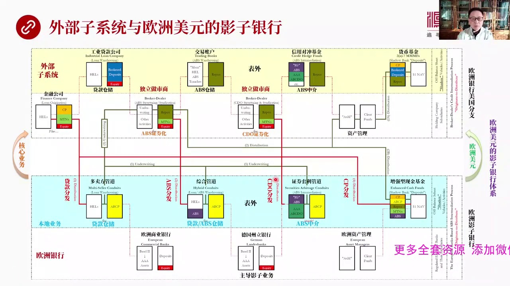

就比较容易了因为你已经有了基础知识了外部仔细头和欧洲美元银资产我们刚才已经说了欧洲美元体系的它的银资活动可以外包给银行控股集团内部仔细头来处理也可以外包给外部仔细头来处理所以它介绍两者之间那么什么叫外...

<strong>All subtitles</strong>

> 就比较容易了因为你已经有了基础知识了外部仔细头和欧洲美元银资产我们刚才已经说了欧洲美元体系的它的银资活动可以外包给银行控股集团内部仔细头来处
> 理也可以外包给外部仔细头来处理所以它介绍两者之间那么什么叫外部仔细头外部仔细头就是不是由银行控股集团所控制所下属的做事商商业代表公司还有各种
> 各样的货币基金等等这一系列都是独立的所以应该叫外部仔细头应该叫独立的这个系统参与者他们所形成的银资产体系那么欧洲美元银资银行是怎么回事我们这
> 欧洲也有很多银行欧洲银行也做银资业务但主要做的都是美元欧洲美元的银资业务这就是我们看到欧洲商银行等等他们都会参加银资银行业务的这个银资银行业
> 务的这个运营所以通过银资银行业务我们可以看到实际上欧洲银资银行体系是把在欧洲的美元我们称之为欧洲美元不断的向美国进行回流就是他投资美国的各种
> 各样的资产政治化产品是想相当于资金回流同时呢他欧洲的银行做不了美国这么复杂的像ABS政军化CGO政军化他们操作不了所以他们是把这个核心业务尤
> 其是资产政军化的核心业务他是转移给委托给美国的工美国的这些做伤和美国的应对洋体系来带做或者叫带工当然他们也做不了美国的销售体系资产管理这还是
> 由美国来做这就是欧洲商业这个欧洲影子银行跟美国影子银行之间的逻辑关系好我们来看一下这个过场首先最基本的业务是在哪里发生谁生成的贷款金融公司主
> 要现在外部自己统没有银行了因为他们自己不拥有银行但是有很多金融公司反而是他们的这些金融公司可以租用商业银行的资产出来表来声称贷款比如说金融公
> 司可以声称什么呢可以声称禁止贷款防务禁止贷款然后金融公司也可以发行商业票剧中期借贷的这些票剧还有用它自己的自由资本金来支撑这个负贷好现在金融
> 公司声称的这个禁止贷款有两个去处一个去处我们先看它可以分发到欧洲银行中间的这也是欧洲银行的表外提醒欧洲银行了多卖房管道就是这个多卖房管道跟单
> 卖房管道就是它有好多人可以参与进来这个贷款可以卖给它那么它靠什么融资这个多卖房管道但是属于欧洲上银行来金融合管理的它可以靠商业这个ABCP就
> 是按揭或者叫资产底下的商业票剧来进行这个融资它的哪发行还是在美国的货币市场中发行或者叫美元的全球的货币市场上进行发行来融资支撑它所持有的禁止
> 贷款欧洲上银行是通过这个方式来参与倡处倡处的融资和借贷所以欧洲上银行把最核心的业务外包给美国的影子羊体系它自己经营是经营是非核心业务包括贷款
> 的倡处包括ABS的倡处包括ABS中介它主要做这几方面业务商业银行当然也可以给它提供信贷持有这些资产好这些资产持有了完之后累积到一定程度做成资
> 产包到了打包的程度之后把它送到美国的独立做事商体系来进行政券化的加工这些化的加工我们也说过无非是用repo 经营融资然后用这种票率等等经营融
> 资它所生产出来最终结果就是ABS和CDU这是一条同道还一条通道是往上走实际上也是把这个经营贷款卖给了工业贷款公司工业贷款公司类似于独立做事商
> 它自己没有所属的银行它没有上家没有一个体积之内的银行体系但它可以拥有工业贷款公司工业贷款公司可以做一些简单的金融业务或者叫简单版的银行业务比
> 如说它可以做这种业务这个简直贷款它可以持有另外它可以发行一种新的票剧或者叫新的融资的办法就是属于代理的储蓄代理储蓄概念有点像CD就是定义成馆
>  定义成单我们知道贵贷款公司和银行样银行可以发行CD或者NCD可转让了大额存单在银行间交易上终找其他银行融资工业贷款公司可以发行类似的东西叫
> 代理储蓄代理储蓄是什么回事呢就是如果说我现在需要储蓄好比说我现在需要CD一样我可以找一家代理找一家公司做我的代理这些代理有可能它有自己的渠道
> 可以找到某家大型的公司比较认识苹果的主管资产管理人苹果有的是现金苹果当然可以买代理所发行的BD产品就是代理储蓄相当于苹果把钱借给工业代管公司
> 这是可以的中间经过代理代理人所以它发现了一种票剧叫BD这种票剧类似于CD经过代理人转卖给了苹果的资产管理公司或者苹果的资产投资部门苹果的钱到
> 了这它是靠这个办法来支撑借付这代管的然后打包到一种程度它也转到做得上来进行生产加工生产ABS和CDOABS进入了交易账户这个交易账户也是独立
> 做得上的交易账户然后把它按着等级分成若干个等级或者要分成若干个模块有优先级有略后级有刺激有优级等等那么这些模块可以用repo来进行资助来进行
> 融资来支撑好同时还有另外一个管道ABS分发可以进入综合管道这个综合管道就是到欧洲银行体系中你的这个进账款我仍然保留然后你生产ABS我也可以吃
> 进我什么都可以卖然后我发行ABCP进行融资在整个欧洲银行体系中实际上德国州理银行是主导影子体系的主导这个业务的因为欧洲德国的州理银行可以大量
> 持有类似的产品除此之外再进一步如果说ABS还要进一步生产CDO再次进入作质商的自然负赛表由他进行生产生产合成出来之后进入了信用对中基金他来作
> 为ABS中介而不是我们来所说SIV这就是一个外部体系由于不具有SIV这样的一种法律实体他用对信用对中基金作为替代信用对中基金把中间不同等级的
> 不同等级信用分类的不同等级了这些模块类的产品作为资产持有同时以report的方式进行融资另外ABS做事商和CDO做事商他们生产的最终产品也可
> 以进入政权套利的管道他持有CDO持有这个标准化高频级的各种样ABS然后用ABCP来进行融资也可以这也是欧洲银行业所精英管理的所参与这个影子银
> 行业务的主要业务模式之一然后欧洲的自然管理公司当然也可以持有这些资产并把他们卖给欧洲的增长型现金基金这些增长型现金基金也是持有这些资产之后发
> 行他的资金份额那么我们从这个图形中基本上可以看出来最后切面换化所有的这个最终产品要么进入欧洲体系的增强基金要么通过自然管理进入美国的货币市场
> 基金最终渠道都是卖给这些有钱的机构或者货币市场基金形成影子银行的储蓄这都叫影子银行的储蓄所以欧洲的影子银行他们在美国有自己的分支机构有些分支
> 机构像得一支银行像瑞士信贷等等他们在美国都有自己的做事商他们可以可以做类似业务也可以找到美国的五大独立做事商像雷曼破产了贝尔斯内破产了高盛还
> 在还有其他的美临等等都可以做这种业务或者是包给美国的这个银行控集团来做都行这就是外部子系统或叫独立独立的做事商体系和欧洲美元影子银行体系之间的互动过程我们看下一页好现在我们进入系用增强工具箱

---

### Slide 9

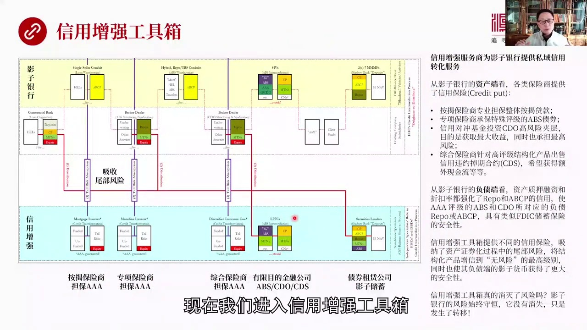

这个部分的介绍就是所有影子银行业务它由于没有这个政府的单保也没有美联储和FDS的单保所以它必须要用私人的方式来对这条体系进行单保那么如果我们来看这张图的话这是影子银行的业务流程刚才我们已经讲过了在这里...

<strong>All subtitles</strong>

> 这个部分的介绍就是所有影子银行业务它由于没有这个政府的单保也没有美联储和FDS的单保所以它必须要用私人的方式来对这条体系进行单保那么如果我们
> 来看这张图的话这是影子银行的业务流程刚才我们已经讲过了在这里不再重复新用增强靠什么靠保险比如说有一种叫按揭保险按揭保险的这种供应商它们专门提
> 供对于某种资产比如说打包的资产或者原始资产或者整个按揭得要贷款一个整个贷款提供一个3A的单保就说如果出了问题我们全培所以用这个办法来吸收微博
> 风险上银行发行的贷款在这好它说我对这个贷款全面提供单保所以你这些做伤不用担心了它不会出现坏账有坏账我来赔第二种是专线保险商来单保三个A的评级
> 对特定的这种金融资产还有就是租和保险商也是三A评级的单保单保什么呢单保某些特定的比如说CDU产品或者ABS产品特定凭级和特定的一些资产的一些
> 3A保险还有就是有限目的的金融公司它主要是通过CDS这是一种产品来提供保险它这种保险主要是保险比如说我吃有的CDO会不会有约如果会有约的话我
> 还是要增持一些CDS作为这个资产的保险CDS从哪来这些公司卖所以这些公司比如说这是地方政府的它的投资的地方政府的一种投资的渠道这些人往往是会
> 卖CDS的来赚钱当然很多保险公司也干这事然后还有债券租临公司也做类似的业务这都是提供保险增强的信用增强工具的这样的一些方式和玩家那么我们来看
> 信用增强服务商为影子银行提供私欲信用转化服务就是信用转化我要提供它的信用要给它增强要给它做工谁来提供这些人来提供那么从影子银行的比如说整个影
> 子银行的资产端来看如果我们看它的左边给资产端可以看到什么呢各类保险商提供了信用保险credit code这提供都是信用保险都是保它的资产的按
> 揭保险商这个单保整个按揭得要再快专项保险商它来承保特殊评计的ABS债券信用对冲基金主要投资CDO高风眼加层目的是为了获得最大收益同时也要承担
> 最高的风险还有综合保险商针对高平级的结果化产品出售信用维料期合约CDS主要是为了获得额外的现金流所以不同人出于不同的目的投资单保不同的东西获
> 取额外的现金流这是从资产端来看从复债端来看资产之鸦这是一种回购融资这个回购融资中这回购融资中睡到折扣率就是你给我抵押品我会打个98折或者95
> 折这对我来说是一种保护还有就是它都是有抵押的而且它这个ABCP也是有抵押的这个回购融资的方式和折扣率都强化了这个Ripple融资和ABCP这
> 种复债的信用就是我用这两种方式的金融资我的信用和债啊是因为我背后抵押的资产都是被增加了就是都是打了折的100块钱我只当98块钱算所以我的信用
> 更高一些还有3A平级使得它对应的资产变强那么它的负债Ripple和ABCP的信用也会增强某种意义上这些一切的手段使得影资产所发行的这些复债具
> 有这类似于被FDS1单保储蓄的量了一种功能具有这有被单保的这样的一种储蓄的安全性信用中增强工具还提供了这个不同的这种信用保险所以它吸纳了整个
> 影资产运作过程中它的微卜风险然后使坚化了这些产品达到了最高性平级也使负债端的这些影资负债达到了相当高篮权性所以信用中增强工具对影资产体系是不
> 可获缺的但是信用中增强难道真正消灭了信用风险吗实际上不可能因为影资产体系所创造出来的总风险它是手环的就是如果你的原始的出始的资产不行自己贷款
> 这个出始资产质量太差那么你整个的风险是没有办法进行消灭的只能进行转移是从这一家公司的资产表达到它占呢还是从这儿转移到这儿只是转移的方法和最终
> 承担风险的风险对家不一样而所以风险不能够被消除只是发生转移而以我们再看公益单宝和私与单宝公益单宝就是

---

### Slide 10

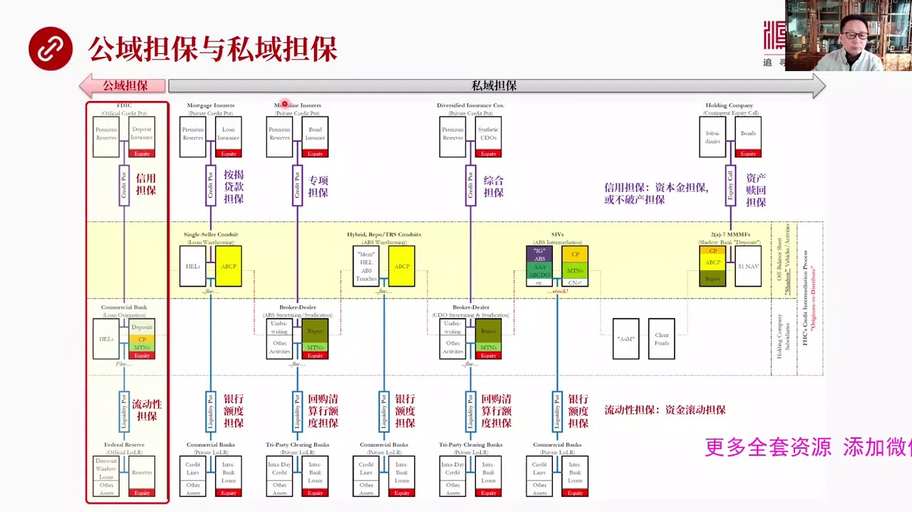

我们可以看到公益单宝是这一块代表着美国政府所出去的各种单宝比如说FDSE它单宝商业银行的处去老百姓的处去在一定额度之内如果出现亏损FDSE来负责赔偿赔偿给老百姓实际上就是整就商业银行的自由资本金否则的...

<strong>All subtitles</strong>

> 我们可以看到公益单宝是这一块代表着美国政府所出去的各种单宝比如说FDSE它单宝商业银行的处去老百姓的处去在一定额度之内如果出现亏损FDSE来
> 负责赔偿赔偿给老百姓实际上就是整就商业银行的自由资本金否则的话它资本自由资本金要先赔赔光为止它就倒闭了这叫信用单宝那么美联储提供的是流动一单
> 宝流动一单宝是单宝什么呢单宝资金滚动就是这个商业银行如果缺乏资金到一定程度比如说准备金靠近我支付完成不了了所以它单宝是这边单宝是它的准备金准
> 备金能够顺利完成清场这个叫这个requited code或者叫流动一单宝所以信用单宝是单宝它不至于破产流动一单宝是单宝整个金融机构它的资金资
> 金滚动不出问题那么保养公司提供是按揭贷款的单宝然后所对应是商业银行对于这些影子机构提供银行额度单宝这是流动信用单宝就是一旦你滚动不了了我来帮
> 你滚动提供资金帮你滚动还有就是专项单宝专项单宝公司单宝是一种特定的这个做事商的一种产品这是单宝资产的另外一种单宝是来自于这个流动的单宝是来自
> 于回够清算银行比如说蒙大通比如说纽约梅中银行这都是清算啊回够清算啊它会有一些紧急额度来给做事商提供就说你真的碰到什么问题了我可以给你一天两天
> 的短期资金拆借让你自己能够顺利滚动这叫流动信单宝另外当然银行也会给各种各样的这种这个影子机构提供银行额度单宝那么做额单宝呢也一样提供的是给做
> 商提供的是一种要么特定产品要么是特定的这个级别的分析的这种资产的单宝回够清算行提供的是额度单宝那么银行也对ACV提供这个信带额度当然我们看到
> 最终是靠持有的就是银行控公司只有所有中间机构的控公司还要提供资产熟悔单宝就是假如我拥有一家这个货币基金货币基金遭到几对那么它的上级公司只有这
> 个控集团它有一个单宝就说如果你卖不掉全部卖给我我全吃这也是资产熟悔单宝所以通过各种不同的单宝来确保整个影子央体系的正常运作综合起来看大体分成
> 信用单宝和流动应单宝信用单宝实际上是单宝资本金或者不破产单宝确保它不至于破产流径的单宝主要是单宝资金滚度或者单宝它的资金链不会断裂这是两者最
> 大的区别那么影子央体系由于缺乏供应的单宝所以主要靠私语的单宝通过这种形式来确保这套体系正常运作我们看下野还有一部分需要理解就是货币基金

---

### Slide 11

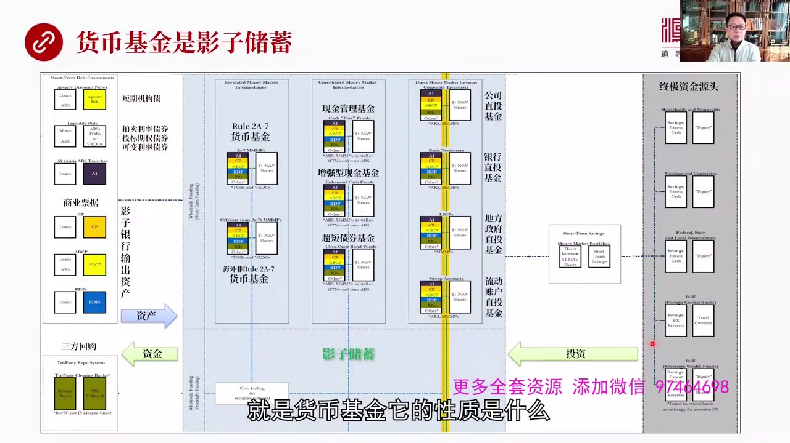

它的性质是什么是整个影子央体系的处序相当于银行传统的商银行的作用老百姓的处序存在商银行那么货币市场基金是投资人结果投资人的钱存在货币市场基金所以它形成是影子处序如果我们看这张组织谈的地图我切下是它一个...

<strong>All subtitles</strong>

> 它的性质是什么是整个影子央体系的处序相当于银行传统的商银行的作用老百姓的处序存在商银行那么货币市场基金是投资人结果投资人的钱存在货币市场基金
> 所以它形成是影子处序如果我们看这张组织谈的地图我切下是它一个局务专门讲货币市场基金这个局务我们可以看到整个影子央体系生产了这么多产品就是加工
> 把原始的贷款和银行资产加工程正确化的产品然后最后准备卖给货币市场基金包括哪些呢包括短期机构战我们已经说了不管两方还是美国联邦的房屋贷款银行都
> 会发行自己的机构短战它就是一种资产它背后抵押品当然是按钮抵押贷款或者一BS但是这种以这些资产为抵押的这些短期战对于货币市场基金来说这就是很好
> 的资产无封验资产跟美国国债是一样的除此之外还有各种各样的比如说对于地方政府赞它所对应的有很多这个可投资的产品可投资的资产比如说拍卖利率债券投
> 标期权债券可编利率债券等等还有一BS所生成的各种各样的资产产产品商业票剧包括普通的CP还有包括ABCP还有包括BDP就是我刚才所说的代理的储
> 蓄的这样的一种票剧这都是资产当然还有三方回够回够Report也是一种资产这些资产都是货币市场基金非常需要的需要买金的东西好货币市场基金买金这
> 些资产之后所对应生成的负债就是金金贩责他的禁止必须要在亿美元保持在亿美元以上不能跌破那么货币市场基金分成两大类一种是什么呢所谓的2.1.7这
> 种类型的货币市场基金当然就是符合货币SEC的一个特殊规矩这个规矩要求货币市场基金特别是在08年金融危机之后是Rezer放的他也是货币市场基金
> 跌破亿美元禁止之后SEC出台场的新政策这个政策就要求对货币市场基金进行了严格要求比如说要求你们持有这些各种各样的资产期限比较非常短比如说短于
> 60天不能超过60天比如说你所持有的所谓的3a的评级必须要占绝大部分非3a的评级不能超过3%除此类的有一系列的规定和要求确保货币基金不至于再
> 出问题这就是受到严格管理的2a钢7这样的货币上基金当然国带你可以买商业票就可以买然后这个ABCP也可以买但是发行商一定要靠谷一定是大的有信用
> 的这些特别是最好是银行控公司所下属的有单保的这样的做事商所发行的票据才靠谷当然还有一些海外的不受2a钢7这个制度管理的这种货币基金比如说英国
> 的德国的他们有所谓没有这么高的要求反正我就吃有的是一种各种各样短期限的资产当然有的信用好有的信用不好但是我为了获得更高收益我不在乎或者说要求
> 没有这么严这是一类货币上基金还有一类呢另外一类基金也是发行自己的份额但是他们是不同类型的基金管理没有这么强比如说现金管理基金Catch Pl
> us这种放了还有现金增强的这种基金就是欧洲和美国都有还有就是超短债超短债劝基金是有超短债这也是一种一种基金的方式这是构成了第二类购买人第三类
> 购买人呢就是投资公司就是很多这个公司比如说苹果它拥有上万亿美元的这个巨额的资金怎么办我自己成立价基金好了封闭是的我自己的直投基金可不可以没问
> 题你也当然也可以买货币金也可以买现金管理基金或者是增强基金或者买这种也行也可以自己搞一个基金实际管理也没问题还有呢银行的直投基金也可以搞地方
> 政府的直投基金也没问题流动性账或者直投基金等等所以这分成三种不同类型的机构投资者这些机构投资者买的都是影子银行生产出来各种各样的票举资产放在
> 他们的资产象下他们发行的这些份额都是面向最终投资人最终投资人是谁呢当然就是终极资金的源头比如说有家庭有飞飞营丽组织还有飞金融的大公司包括美国
> 地方州和联邦的政府的投资机构他们自己的一些现金管理部门还有呢包括外国中央银行还有财富主权基金等等各类投资人他们最后的出现方他们投资这些基金或
> 者投资这些基金或者投资这些钱是从终极原头往影子银行流的所以资金是这么滚斗形成影子银行处序影子银行处序是让通过购买资产流向了这个影子的业务这就
> 是货币市场基金的关键作用我们再看下一部分这就是佩里梅林看到了卓尔坦的地图之后

---

### Slide 12

深受起发当然卓尔坦对于金融体系的细节了解肯定是在佩里梅林之上了但是佩里梅林通过研究卓尔坦地图之后发现就像我刚才所说的两个小时内容大家肯定已经脑子已经听证太多细节记不住佩里梅林看之后她要对她进行解画和抽...

<strong>All subtitles</strong>

> 深受起发当然卓尔坦对于金融体系的细节了解肯定是在佩里梅林之上了但是佩里梅林通过研究卓尔坦地图之后发现就像我刚才所说的两个小时内容大家肯定已经
> 脑子已经听证太多细节记不住佩里梅林看之后她要对她进行解画和抽象这是佩里梅林比卓尔坦高明的地方就是她的抽象能力更强我们看一下她是怎么抽象卓尔坦地图的首先她提出了三个观点第五个观点是

---

### Slide 13

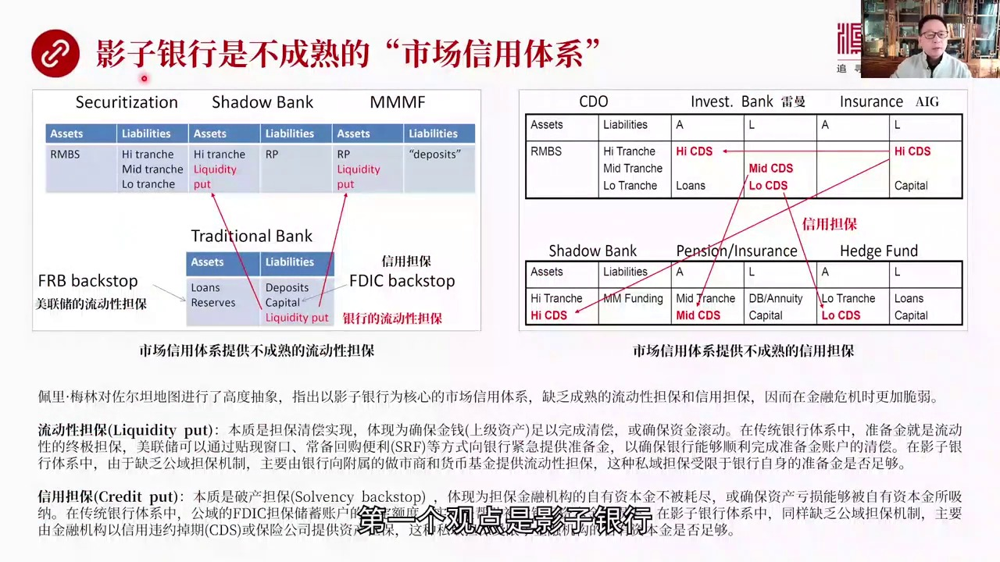

影子银行是不成熟的市场性用体系注意你看这理论高度马上就出来了卓尔坦虽然换了很多地图就是把所有细节都放对了位置所有的标注也很清晰所有细节都很准确但是她没有理解她画出来这些细节到底是她的理论高度合在她没有...

<strong>All subtitles</strong>

> 影子银行是不成熟的市场性用体系注意你看这理论高度马上就出来了卓尔坦虽然换了很多地图就是把所有细节都放对了位置所有的标注也很清晰所有细节都很准
> 确但是她没有理解她画出来这些细节到底是她的理论高度合在她没有能力建立起一个更高的理论框架但是你看佩里梅林上来就发现这是一套市场性用体系而且不
> 成熟她把卓尔坦地图高度简化成了这么一张这么一个三个字杖字杖表自然争据画的过程不过不就是你的自然争据画的产品所对应的复债也就是CDO你是高等级
> 的中等级的还是低等级的就是三种模块这不就是整个自然争据画所做的全部事吗高度概括不就是这么两行吗两列吗还有影子银行做着伤不就是接受这个东西作为
> 抵押发行发行Ripple发行自己的复债这个复债转移给了货比上基金然后货比上基金用它为抵押发行的储蓄这个储蓄卖给了投资人不就是这么两事吗所以它
> 用自卫张图概括了刚才我们看到昨儿谈地图的所有的细节高度概括那么传统银行呢它比较了影子银行传统银行传统银行这不是贷款吗贷款所当初的贷款还有准备
> 金贷款所对应的不就是储蓄吗除了储蓄银行还有自己的自由资本金然后我们来看传统银行它是有美联储的流动硬胆保的就是天传狗或者你可以通过准备应杖或找
> 别人去借或者是隔夜你回够隔夜回够等等都可以借信用胆保就是FDSC提供的银行的流动性保证你这银行出了严重问题自展出了严重问题你的资本金抄不住了
> 这个FDSC先帮你扛一刀然后这个叫这个FDSC提供的信用胆保或者叫美联储提供的流动硬胆保一个是胆保银行它的资金周转或者是资金链不至于出问题另
> 外信用胆保是胆保它的资本金不会出问题你看当配的梅林把这个剑头我们立刻就明白实际上信用胆保或不破产的胆保是这玩意儿不能被耗盡这一下执行问题的本
> 质你看昨儿的胆地图画了很多很多剑头很多标签但是其实你看不出来这个信用胆保胆保是什么好那么传统银行实际上又负责为引资金行提供胆保比如说传统银行
> 主要提供流动银胆保就是传统银行提供的是流动银胆保相当于在它资产处在表上出于这两个位置多清楚那么它认为这种市场信用体系提供的流动银胆保不太成熟
> 所以传统银行提供的是流动银胆保相当于在它资产处在表上出于这两个位置多清楚那么它认为这种市场信用体系提供的流动银胆保不太成熟因为传统银行你自己
> 也有一个破产性的问题你也不能无限制的这个无限制的拥有无限大了资本金每天处对你流动银胆保也是有限度的传统银行如果破产整个这条银行影子银行体谁来
> 担保这是一个问题第二个问题是市场信用体系提供了不成熟的信用胆保刚才我说这个信用胆保在这但是在影子银行体系中没有足够的信用胆保刚才我们说FDS
> 只是单保银行而银行只是对影子银行体系提供了流动银胆保但是没有提供足够的信用胆保那么在影子银行体系信用胆保靠什么呢主要靠保验公司和CDS比如说
> 这代表影子银行CDO这个也有这边是你的自然底正确化的产品MBS这边是对你的CDO的各种不同的这个级别的CDO好这边是做日商或者叫投金银行比如
> 说雷曼这边是资产管理部闻比如说保验公司如比如说这个像AIG那么这边呢代表着影子银行的业务这个CDO产品还有它的影子银行的一种融资手段包括货币
> 上基金融资手段这边是保验公司他们的自然分代表这边是对中基金的自然分代表它这张图画的是一张信用胆保关系图如果你存在着这些不同类型的玩家那么大家
> 自然分代表看一下应该什么样的好我们来解读一下它是什么意思首先在这个影子银行体重间如果你持有的是比如说高级的CDO那么你会这个买一种高级的CD
> S作为保险为什么呢因为它的等级表高伟约风员比较低所以高等级的CDS价格比较便宜或者我不买也没关系但是我还是买吧确保万无一失好这种高等级的CD
> S谁来发行实际上是保险公司发行的这样的一种保险对于保险公司来说这它是它复债对于影子银行来说我买了一份保险这是我的资产那么它为什么要做这个事A
> I继续会想哎呀本来人家持有的是高等级的CDO这玩意是三一评级不会出事我风员很小只是由于监管说它必须要买个保险我和不顺水人情卖这个保险我还可以
> 收一笔额外的现金收入这是它的主要动机它卖出高等级的CDS为了获得额外现金流增加我保险公司的回报率这是一个这是一个卖保险的思路另外呢我们可以看
> 到这个雷曼雄的公司它也介入了它也介入了这个影子银行业务那么一方面它作为它持有贷款或者持有很多高等级中等级的这些CDO产品它也需要保险那么它的
> 高等级的CDS从哪买也是从AIG买同时呢它自己还卖保险它卖保险比如它卖中级和低级的保险CDS保险卖给谁呢比如它卖给阳老基金和保险公司阳老基金
> 持的是中等级的CDO所以它需要中等级的CDS谁来谁卖给它这个保险雷曼卖给它还有对中级金特别是一种信用节的对中级金特别追求高回报我不怕风险我就
> 怕没回报所以说我持有是低等级的CDO伟月风险是表大但是我的回报率很高为了避免出问题我一定要买低等级的CDS保险也就是这个保险费会很高因为它保
> 的是低等级的CDO谁卖给我雷曼卖雷曼卖给我这个产品所以我们从这两份表上看到雷曼是再次我高风险的对度它来卖中低风险的这样的CDS实际上这意味着
> 这意味着它承担了很高的风险因为面向低等级的CDO的CDS应该是价格最贵的它其次这种嗨CDS价格最低的我们来看这个整个平衡表中间大家都可以一对
> 应唯一不能一对应的就是AIG它实际上卖了两份保险这就是属于AIG作为整个市场中或者保险公司属于尽所谓裸卖CDS的公司它是让没有对应资产就是想
> 开多少开多少那就会在市场中积累巨大的风险一旦进入危机爆发市场风险对家伟约那么你这套体系就完蛋了你的资本金就会被亏光所以派里梅尔银对左尔坦地图
> 进行的这种高度抽象它指出了以影子银行为核心的市场信用体系它是一种缺乏成熟的流动性难保和信用难保因而在金融危机的时候会非常脆弱那么流动性难保指
> 着是什么本上是单保清长实现体现为确保金钱或叫上级资产足以完成清长或叫确保资金滚动这是我们自己对于这个概念的体链这个配理梅尔银倒不是这么说的但
> 是我觉得从本质角度来分析不就是确保清长吗在传统银行中准备金就是确保清长但是它体现出来是上级资产要足够准备金要足够然后它最表面上显示是流动性不
> 出问题则今天不会断裂或者叫资金滚动不出问题在传统银行中准备金就是流动性的中级难保美联储可以通过天液双口长辈回够便利这种方式向银行提供紧急的准
> 备金救助确保银行能够完成准备金清长就是债务清长或者叫银行货币支付清长在影子货币体移中由于缺乏公益难保机制公益难保机制主要由银行向付出的做事商
> 还有对中基金提供流动性难保但是这种私欲难保受限于银行自有的资本金是不是足够这是流动性难保存在的缺陷信用难保存在的同样的缺陷信用难保本质是破产
> 难保或者叫不破产难保体现为单保金融机构的自有资本金不被耗尽或者说是确保资产亏损能够被自有资本金所牺扰就是你自然亏损自有资本金能够填着哭了在传
> 统银行提供公益的FDS1单保处去账户一定额度实际上是帮助补常银行资本金的损失在以资产提供同样缺乏公益单保的机制主要由金融机构以兴委员调七CD
> S或者保险公司提供资产难保来实现当然这种私欲难保受限于金融机构自有资本金是我足够比如说AI寄亏光了之后资本金亏光之后他就倒闭了所以这两种方式
> 这两种单保流动性和性用单保都不足够我们再看下一眼那么佩里梅林提出的第2个重要的观点是

---

### Slide 14

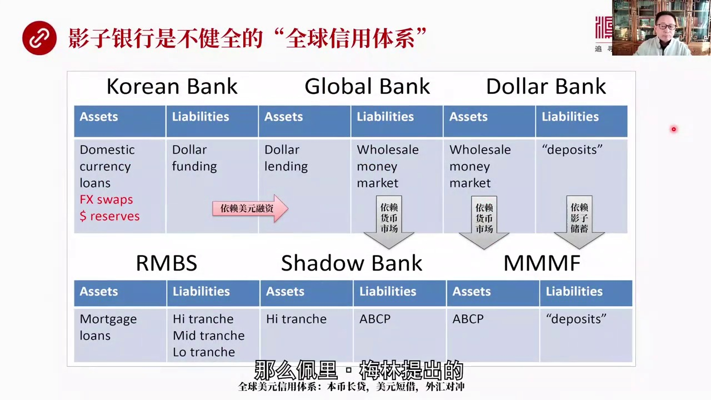

影资银行是不健全的全球信用体系刚才说他是一种不成熟的市场市场信用体系现在他又说他是不健全的全球信用体系这就是佩里梅林站在全球融资的高度在看这个问题他从左耳弹地中中看到欧洲美元还流欧洲美元这个像美国这个...

<strong>All subtitles</strong>

> 影资银行是不健全的全球信用体系刚才说他是一种不成熟的市场市场信用体系现在他又说他是不健全的全球信用体系这就是佩里梅林站在全球融资的高度在看这
> 个问题他从左耳弹地中中看到欧洲美元还流欧洲美元这个像美国这个影资银行进行回流的过程中肯定想到的这一点他把他做成个非常简单的模型比如说一家韩国
> 银行还有对应的中间是一个全球线的大银行比如说毛根大通还有就是美国的地方银行或者是提供美元的一种中小银行下面代表着影资银行他把全球信的传统银行
> 和影资银行所发生的业务进行对比当然影资银行就是自战争交化来过程包括影资银行的做事商的这样的一种行为包括货币市场基金的一种模式影资银行的自战争
> 交化无非是你持有暗接连贷款之后我把它最终切成了三个优先等级高等级 中等级 低等级然后做事商持有高等级然后发行他对应的复债ABCP或者repo
> 然后这些复债被货币市场基金当中资产然后货币市场基金西纳投资人结果投资人来处去购买这些资产购买这些资产 持有这些资产那么本丽银行呢如果说我们看
> 这个传统银行体系也一样韩国银行以美元方订以美元作为这个融资来源来支撑本地货币韩元的亲带扩张当然 如果你要这么干就一定需要买一个保险就叫外汇掉
> 期的保险外汇掉期货换同时你最后还要有美元的处去比如说你在某个大通还有美元处去账户两种都得有或者至少必须有一样否则的话你这个风景外汇风险就太大
> 了所以韩国银行的本地货币账货帐是依赖美元融资的要靠这种全球银行来提供全球美元银行呢他对韩国提供了贷款体现为他的资产但是他的负债呢他的负债是靠
> 短期融资的是靠货币市场进行隔夜融资的这是非常不同的传统的美国银行小银行他的处去是靠老百姓爷奶呢大国大妈们到那儿存钱是靠这个处去的但是现在也在
> 转型靠这个机构投资人还有呢传统银行他是靠这个依赖货币上来给他提供资产的所以这就构成了全球信贷的货帐依赖短期美元他的货币上的融资这就形成了一个
> 大问题所以配领美临把这样的一个现象提炼出来称之为是全球美元性体系的一个不见全的一个方面就是本币长代韩元就是一个例子本币做长代但是靠美元进行短
> 期而且外货要进行对冲高度概括了融资养体系的第二个确证就是他是一种全球的美元融资体系而且在全球融资体系中间传统银行必须越来越依靠影资银行进行融
> 资我们再看下眼所以配领美临得出了第三个结论影资银行是形成中的现代性体系

---

### Slide 15

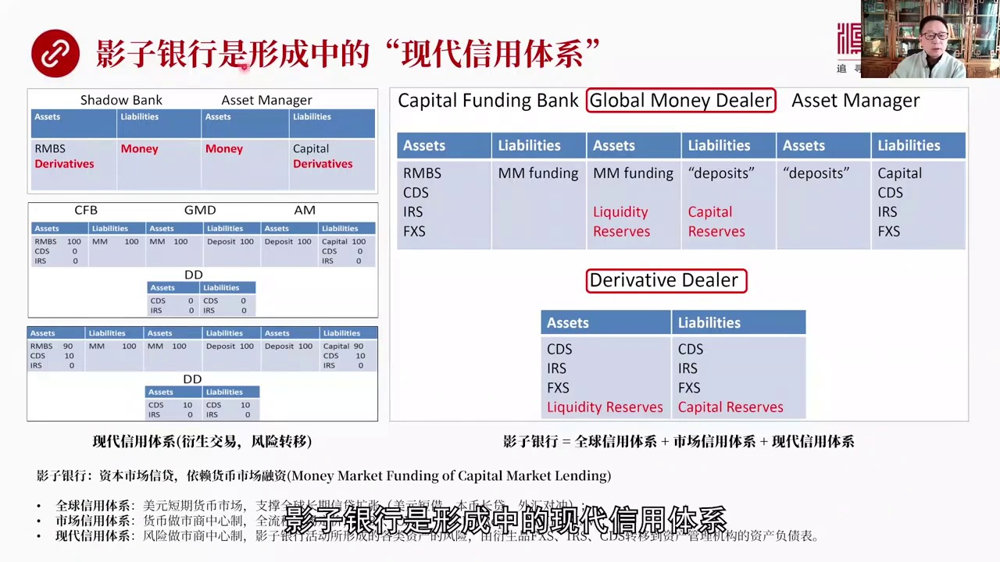

还没有完善所谓现代性体系他用简单的方式最概括的方式来进行表达不过就是影资银行和资产管理之间的邪统这两个资产代表影资银行你的资产最后发行的是比如说Ripple或者ABCP那么这些RippleABCP被资...

<strong>All subtitles</strong>

> 还没有完善所谓现代性体系他用简单的方式最概括的方式来进行表达不过就是影资银行和资产管理之间的邪统这两个资产代表影资银行你的资产最后发行的是比
> 如说Ripple或者ABCP那么这些RippleABCP被资产管理不满比如说货币基金吹用作为资产然后他用自己的所以有资本金来进行支持他的资产
> 所以对于这套体来说影资银行发行的Ripple相当于钱支付给了资产管理公司他把它作为相当于一种某种意向相当于他的处序存在着而且同时两边都需要做
> 风险防护比如说影资银行体系就要买各种各样的保险来对冲资产的损失而这些保险最终的处处在哪呢最终处处是源于资产管理的部门所以资产管理把保险卖保险
> 放到他的复债而影资银行体系买保险人放到他的资产也就是说如果这些资产出了问题这些资产管理部门资产管理的这套体系要支付他的损失而且要消耗通过消耗
> 他的资本金来支付这个损失这就是他的全部含义如果我们把这张图具体画来看所谓的capital funding bank和 global mone
> y bank还有smanager之间的关系如果用资料代表来看的话你会看到funding bank就是提供代管的这些人比如说他用了资产一百块钱
> rmbs他会买cds来对冲他的风格买rs来对冲持有这个资产的利率风格好那么你所发行的所谓repo也就是货币上的这种复债是一百好你的持有方持有
> 你的复债当成他的资产一百然后他在发行处序然后这个处序在作为资产管理的处序然后对应他的资产资本只有资本金然后资产管理公司在发行cdsrs作为风
> 险的卖保险一开始进入保险协议手这两个元是都是零因为双方同时进入的时候这个风险没有发生变动所以都是零好中间这个相当于什么相当于眼生产品的做事商
> 延产品做事商持有两个相对趁的或者叫风险对冲的或者叫参谓匹配的这样一个协议他把他的要求把他的合约拿到这把他的合约拿到这然后进行匹配好我们来看这
> 个模型实际上对应的真实情况是这样的一个情况这个提供融资品行和资产管理公司包括全球的所谓猫铃低垣这个就是货币的做事商还有金融风险或者叫眼生产品
> 的做事商放到中间这个就是说配理梅林把做事商全部放到中间其他的人围绕做事商两边排列在这个观众我们可以看到持有资产的银行必须需要购买大量的金融眼
> 神产品不管是CDS还是外贵调期都一样他所发行的负债就是格罗布银行的他的资产然后他所发行的负债就是这个资产管理的资产而资产管理部门卖保险CDS
> 这个外贵调期等等好在这样的情况之下这两边是匹配的同时这个金融眼神产品的交易商把这两组需求组合在一起形成他的资产和负债完全匹配的情况之下资产负
> 债表看成这样那么在这种情况之下需要什么呢做事商需要足够的流动性的处备也需要足够的最有资本金的处备同样的道理对于金融眼神产品做伤也是一样他也需
> 要流动性处备和资本金的处备好明白这个道理回来我们再看这张资产资表实际上现在听信用体系的核心是眼生交易风险转移实际上眼生体一切眼神品们作用都是
> 为了从资产中剥离风险无论你是委员风险还是信用还是利率风险就是信用风险都从资产中要剥离出来转移给其他人从资产持有者转移到其他人的头上比如说保险
> 公司金融眼神产品的全部全部核心就在于此风险转移那么来看如果说在一开始情况之下我持有100块钱的R&B S这首资产资表全部是平的但是过了几个月
> 我的R&B S贬值了贬到90了这意味什么意味着我的CDS开始转移虽然我持有资产少了10块钱但是我买了新闻维调期对方给我保险说我少10块钱才过
> 加10块钱所以这增加10块钱其他没有变在这没有变但是在资产国内公司这边变了由于它开始出现亏损这边出现亏损它答应陪别人所以从零增加到了10这是
> 要排队方的钱同时这个损失要由资本金面扣除所以100变成90那么在衍生产品交易商的资产资表上出现这样的情况CDS这变成了10这边增加变成10最
> 后这10块钱必须要通过转让方式转到这边来转到这边这边CDS清零这边恢复到100这边CDS清零这边它必须要追加它的自由资本金所以这就是我们看到
> 了整个这套体系的它的变化所以现代性体系它的核心是衍生交易风天转移那么影子洋体系等于什么呢实际上概括起来就等于全球性用体系加上市场性体系再加上
> 现代性体系三合一就叫影子就叫影子银行这就是配领域给出了一个高度的概括那么影子银行它的核心是什么就是资本市场性代依赖货币市场融资这它给它的高度
> 概括全球性用体系是指的美元的短期货币市场扩币市场支撑全球长期性代的扩张也就是美元短借本币长代外汇对冲这是它的概括起来就这一句话那么市场性用体
> 系呢是做事伤中心制全流程由市场定价比如说NBSCDOABCPRepo还有基金份额这都是市场定价的随时随地都在发生变化所以全流程市场定价只要你
> 是有市场就必须需要做事伤所以它是做事伤中心制现代性用体系呢概括起来也是这个做事伤中心制而且是风险做事伤中心制因为影子银行的活动所形成的各类的
> 资产都是有风险的而这些风险必须有眼神产品比如说外汇调期比如说这个行为调期这些必须要期等等将资产中间的各种风险转移到其他部门的资产费在这上就是
> 把资金把资格风险转移走所以配率明天概括起来影子银行是什么影子银行就是全球规模的短界长代而且短界界的是美元而且是通过影子银行体系界的而影子银行
> 体系无非是三个体系的综合全球信用体系市场信用体系和现在的信用体系所以我们通过配率明天的总结我们一下对影子银行体系上升到了一个理论高度马上把它
> 的所有的最重要的方面全部列传这就是配率明天的理论思维的能力那么我们红旋如果对配率明天的框架仅再进一步抽象

---

### Slide 16

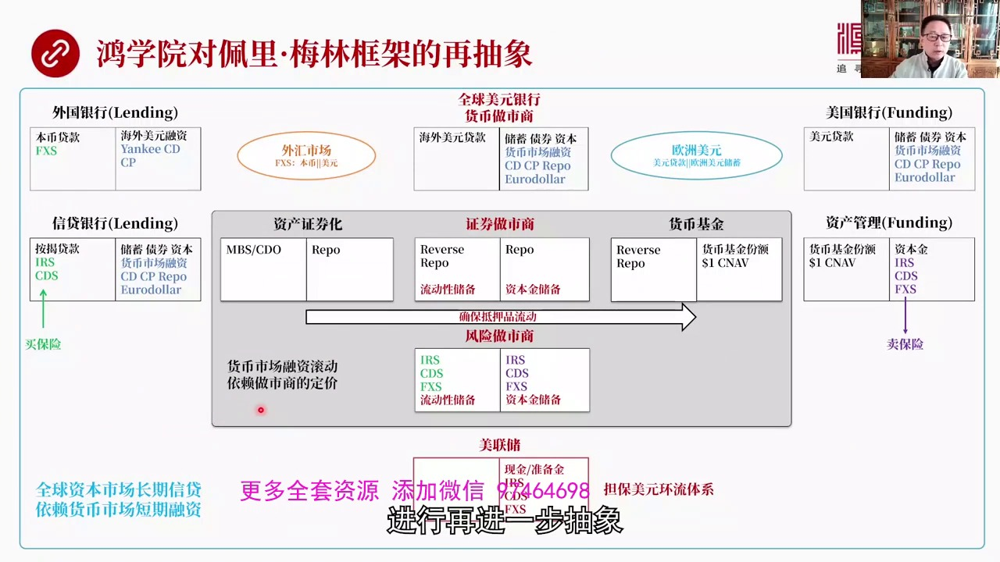

因为它把很多东西散散在很多地方我觉得中国在一起会看得更清楚比如说外国银行这是负责放贷的本币放贷它进行海外美元融资那么它需要进行外会调期的风险对冲海外美元融资是当然可以向美国银行借贷贷管当然它也可以发行...

<strong>All subtitles</strong>

> 因为它把很多东西散散在很多地方我觉得中国在一起会看得更清楚比如说外国银行这是负责放贷的本币放贷它进行海外美元融资那么它需要进行外会调期的风险
> 对冲海外美元融资是当然可以向美国银行借贷贷管当然它也可以发行在欧洲美元市场也可以发行cd 也可以发行cp 商业票剧在欧洲美元市场可以进行融资
> 当然也可以向美国银行借贷那么它如果要进行外会风险对冲的话就必须需要外会市场所以我把外国市场放到这进行本币和美元的互换到一定期限之后再互换后来
> 规矣币会率风险好 全球美元银行指的是大银行像蒙美大通 华清银行这些它主要是作为货币的做事上这个是配理为例没有单独分我把它分成货币做事上正确做
> 事上和风险做事上三个不同类型做事上货币做事上当然就是导致不同的货币形成会率市场的那么对他们来说它可以向美元海外这个银行进行美元放贷这是它的资
> 产然后它的传统的融资手段包括处序 包括发债 包括它自由资本金但是传统银行体系进化到了现在银行体之后他们主要更加越来越依赖货币市场融资比较大银
> 行其实没有这么多门店没有这么多新大处序的点没有这么多网点所以它更加依赖货币市场融资包括什么呢包括像货币市场发行CD发行CP发行repo 发行
> U2D 就是欧洲美元的戒剧等等通过这个市场来借钱或者通过银资体系来借钱而美国银行体系它是提供美元贷款这是一方面还有它传统的处序 发债 资本来
> 进行支撑但是它也可以进行货币上融资包括这些新的类型好 那么在影子扬体系中我们可以看到银行和自然管理两大部分分裂左右新带银行就专门放带的生产带
> 管的比如说生成了暗接疗戴管但是暗接疗战是长期带管它是有风险的利率风险我需要买利率要七作为对冲如果它的伟约风险我需要买CDS作为对冲所以我是买
> 保险的 放在我的资产上下我的融资跟其他银行一样 传统融资和货币上融资然后我把暗接疗戴管打成资产包进行资产政权化 变成NBS或者CDU然后通过
> 我的一个法律师体系SIV发行repo以他们为抵押 发行这个回够复债给谁呢 向谁借钱呢 实际上做事商借钱做事商把它作为reverse repo
>  把它作为这个所谓逆回够对它的事实逆回够 实际上是同样的东西把它放成资产 因为背后有抵押而且你既然用这个东西向我借钱你要向我支付回够利率所以
> 这是一个可以带来现金流的资产以此为抵押 做事商政权做事商发行自己的repo向谁发行 向货币上基金发行然后说我以它作为抵押 来借贷资金货币上基
> 金 把做事商的资产把它的repo作为它的资产 因为它招做事商招我借贷 你也得付我回够利率所以这也是我的资产有了这个资产之后 我就可以对应了发
> 行货币基金份额保持基金进额在亿美元然后我在把货币基金份额发售给谁呢发售给资产管理部门他们持有我的这个基金份额作为资产那么它用它的资本金作为支
> 撑同时资产管理部门还卖保险 卖利率RS 利率较期 CDS和外汇较期然后在整个过程中要确保抵押品的流动就是我的NBS CDO要能够从自然负贷表
> 这个这个SIV自然贷表要能够顺利流到做事商涨 还要从做事商涨能够顺利流到货币基金涨所以需要三方回够 需要一个清算的清算行 回够清算 回够这个
> 清算银行比如说某个大通 比如说紐约梅龙银行都是清算行 他们来负责这些资产的化转除此之外 还有一个做事商就是风险做事商专门做 新专门做这个衍生
> 产品交易的我把这边的需求 这次的需求放到这把这次的供给放到这 然后进行匹配当然 所有做事商都需要流动性 除辈和资本金除辈 然后让他们形成交易
> 当然 最终是美联储对整个体系 对整个美元环流体系进行担保就是这个环流体系如果撑不住了太破产了 太破产了 怎么办我会用我的资本现金 我会用我资
> 本这个准备金可以扩大资本责表 把你们的资产买了 来救你们所以 美联储 他可以用这个准备金比如说买国债 增发五万亿的准备金然后来收购所有做事商
> 你们的资产 你们不就活了吗这叫担保美元环流体系同时 美联储还作为最终的做事商这是最终救助商 最终的代款人这是最终的做事商 风险做事商我要把做
> 事商如果也破产了他需要把这边负债全部转移到我这儿来 我跟市场对做所以我需要最终承受整个这个市场中所有需要保险的这些资产的各种各样的也正产品我
> 需要跟他们对做 所以他需要持有这些东西作为负债这就是美联储作为最终代款人和最终风险的做事商要担保整个美元环流体系的运作这就是我们对他的全部的
> 总结那么配理梅林所提练出来的核心观点是什么就是全球资本市场长期信贷依赖货币市场短期融资这是最大的一个概括 所有符合这样的条件都属于这个体系而
> 货币市场这个融资轨动依赖做事商的定价因为他是高度市场化的所以我们用这两句话来概括整个影子扬体系他要做的事情的全部这就是红旋对配理梅林框架进行这个再次抽象我们再看下夜下夜就是关于做事商

---

### Slide 17

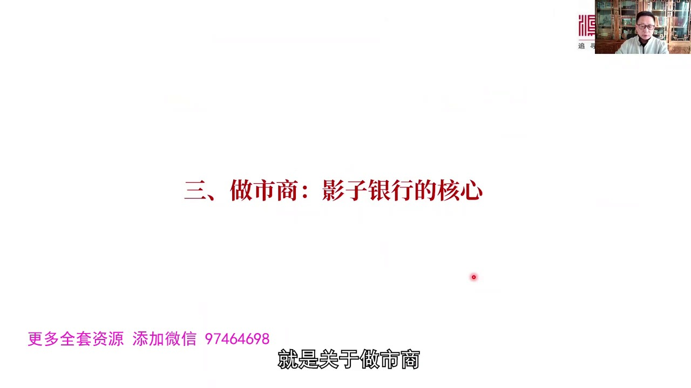

其实配理梅林对于左尔坦的地图进行了一个抽象过程中最重要的是他发现了做事商其实是影子银行的中心或者叫影子银行的中央银行这个是左尔坦自己没有发现的左尔坦虽然在图中标出了那就是做事商也把它放到相对靠中间的位...

<strong>All subtitles</strong>

> 其实配理梅林对于左尔坦的地图进行了一个抽象过程中最重要的是他发现了做事商其实是影子银行的中心或者叫影子银行的中央银行这个是左尔坦自己没有发现
> 的左尔坦虽然在图中标出了那就是做事商也把它放到相对靠中间的位置上但他没有意识到他们是中央银行他们是整个影子银行的中心这个就是理论高度不够这个
> 就是配理梅林的水平如果我们看下夜配理梅林牢牢地抓住了做事商这个概念

---

### Slide 18

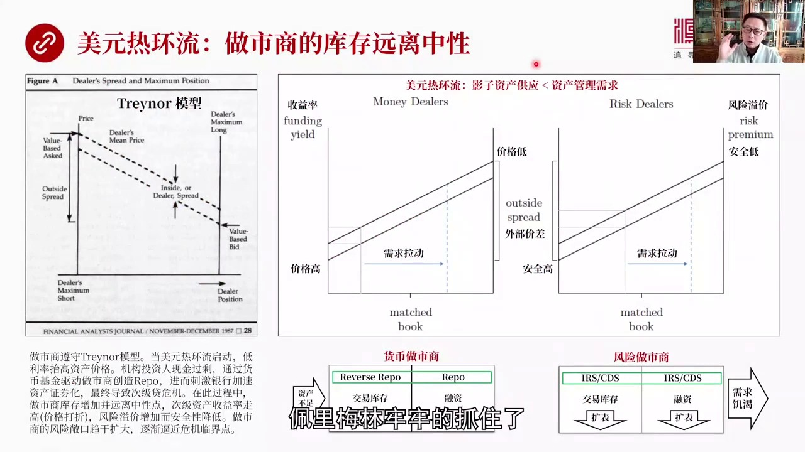

这其实给我们一种巨大的区域上一场客我专门讲过这个问题市场经济的核心在于做事商中国和西方市场经济的差别最关键差别可能也在做事商中国可能是国家长期担任做事商的只能而西方是私人担任做事商的只能两者是不一样的...

<strong>All subtitles</strong>

> 这其实给我们一种巨大的区域上一场客我专门讲过这个问题市场经济的核心在于做事商中国和西方市场经济的差别最关键差别可能也在做事商中国可能是国家长
> 期担任做事商的只能而西方是私人担任做事商的只能两者是不一样的因为国家作为做事商和私人做事商它取得立差是不同的这个我们马上会详细讲到如果用配理
> 梅林对于做事商库存的这样的一种理解来整个来看每员热环流启动每员冷环流启动所发生现象我们就会看了问题会发现配理梅林这个理论模型非常好用比如说梅
> 林冷这个热环流启动就是梅林处降息梅林处这个扩表那么做事商的库存一定会远离中性它会向右偏为什么这是我们上谈课专门讲的吹的模型所有做事商的模型都
> 是它的眼声在这里有一个外部的立差这就相当于价值投资人就是只有买卖价差大到一定程度我才觉得这个事合算比如说买房子100万房子如果是买卖差距差2
> 0万我觉得这个事我检查了这个卖家搭买我就会去买这当然是一个价值投资人的思路但是做事商的思路不一样假如房间还有做事商做事商那可能就在上下5万之
> 间进行交易所以他们这个立差叫内部内部立差外部立差是由价值投资人来进行就是超过外部立差价值投资人必然介入而在外部立差之内是做事商的田地他们在专
> 业性方面更强他们在信息方面更临他们在判断上更准确对价值分析更临你所以他能吃内部价差一般人吃不着但是当金融危机爆发的时候中央银行介入直接就进入
> 到外部价差应该介入到外部价差来控制体系仍然应用仍然应该用这个交易商做事商来进行内部价差的做事但实际上美联储不是这么干的美联储进来之后首先一下
> 就买就是把内部的他直接进入内部价差的做事把做事商的功能完全取代了这就是美联储的就是方式好 我们来看一下我们来看一下左边这样图右边这样图看起来
> 明显不一样为什么这边是向下斜的而库存这边是斜向上的呢其实这个配理媒体在这个过程中它用的是不同的方法这边是传统的比如说汽车比如说商品商品量势当
> 然它的价格肯定是库存也高我当然是叫买教卫价越低这是和国逻辑的而这种情况为什么向斜呢实际上它把债券特别是国债你想想一下如果它扇着收益率这么化的
> 你如果按照价格它也会反过来也会跟这个人一样它扇着收益率来化收益率的话就是高收益率的时候国债价格低啊低收益率的时候国债价格高啊所以当收益率最高
> 手实际上是国债价格最当收益率这个偏低的时候实际上是国债价格最高的时候而收益率如果很高说明国债价格降下降了很低所以它的曲线是斜的是这样像这边斜
> 如果你要用这边如果这个做标改成做标走改成价格那么它仍然是跟这边一样也是这样条线它如果用收益率那么它就是这样的条线这个大家明白就行还有风险做日
> 商也是这个道理风险也是我这个做标如果用风险异价的话那风险异价越高说明我这个越不安全了所以我安全性高的一定在底下它风险异价越低说明我安全性越高
> 风险异价越高就是风险太大我保险费收了很高说明它安全性很低所以这两者都是一个道理为什么跟它写线不一样写的方样不一样原因就在这儿好搞明白这个道理
> 的时候我们看每员热换六的时候实际上出现情况是隐自银行的供应敢不上资产管理的需求这是一个最重要的一个结论就是做日商的所有的行为其实也否则吹到模
> 型热换要起动低利率会抬高资产价格抬高资产价格同时由于你发现发多了机构投资人会有大量现金现金过胜资产击荒找不到好资产所以机构投资人通过货币上基
> 金因为他们要买货币上基金来投资他手上前那多烧得厉害怎么办呢我一定要向货币上基金去买你的份额好这种强大的需求迫使货币上基金来求做日商你赶紧给我
> 创造更多的回购资产因为我这边的需求压力太大所以我要把这个需求压力传较给做日商做日商一看这边货币上基金需要我这么多锐炮而我的锐炮必须要靠前端的
> 资产政策的话给我听过大量的ABS或者CDO这种产品我才能发出来CDO我才能发出来以他们为底下我才能发出来的锐炮所以做日商就会向前端去要求它的
> 银行它的所谓一个大散之下的这种银行你赶紧给我做资产政策的话银行受到这种刺激之后就开始降低贷款标准因为实在找不到足够的贷款人了怎么办降低标准你
> 如果条件不够我也把按钮点的贷款贷款带给你这就是刺激贷款人出现了所以最终这种资产的质量在下降资产政策的话的产品所谓的刺激的NBS和CDO导致了
> 我们看到金融风暴刺激贷款危机等等那么在这个过程中我们看到实际上资产需求在这边非常基础我把它这个锐头画得比较大而这边的供应资产政策的供应CDO
> 这种NBS供应不足这就会产生一个巨大的压力迫使风眼做成商扩大资产不代表交易商扩大资产不代表它本来是Matchbook本来是倡位中性的没办法它
> 要求太强烈我只能扩表对做商来说也是一样我的repo不够我只能最后通过扩表这个交易扩存金扩表才能够满足这边的需求因为我要提供流动性对方有需求我
> 就必须要跟它做交易我做交易就必须要扩大资产不代表才能够满足越来越多的交易那么我的库存也必然要增加所以虽然我一开始这是一个匹配的库存但是由于对
> 方的要求太大交易量太大我不得不发现更多的repo但是这边交易交易的东西我就变了我已经找不到最合适的资产了我开始用其他的低质量资产来替代然后导
> 致我这边发现的repo的价值下就实际上它的含金量下跌了其内有了风险但是我资产是来表会扩大如果用这一档土来看就是资产管理的需求太大导致我这个本
> 来这是倡位中心在这我倡位在这本来我风险挺低的但是需求那太大迫使我把倡位不断的变高也自然负责表会扩大倡位越来越大当然这边也是需求那种使我的风险
> 倡位越来越大那意味着什么意味着我有极累的风险越来越高特别这边风险长口越来越高所以随着我倡位变大我叫买家叫买家反而越来越高因为资产升值了这边需
> 求太强烈资产管理的需求太强烈所以我好卖这就是热换流情况我们看下议我们再看一下美园如果出现冷换流情况将会变成什么样

---

### Slide 19

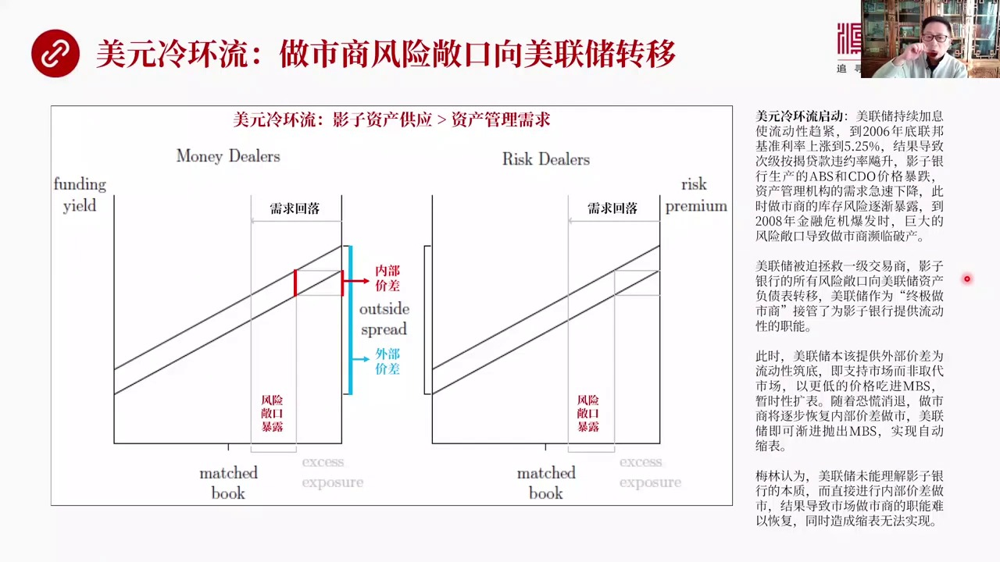

美园出现冷换流就是美园筹加息缩表在严重情况之下甚至有可能引发金融风暴或者叫金融危机这个时候当爆发危机的时候做事让风险长口就必须要向美园出转移了所以美园冷换流的时候出现情况就是资产需求下降影资展供应过剩...

<strong>All subtitles</strong>

> 美园出现冷换流就是美园筹加息缩表在严重情况之下甚至有可能引发金融风暴或者叫金融危机这个时候当爆发危机的时候做事让风险长口就必须要向美园出转移
> 了所以美园冷换流的时候出现情况就是资产需求下降影资展供应过剩或者叫供过于求资产需求下降很好理解你供应了大量的MBS cdO刺激代管的cdO导
> 致我这边资产除问题了因为这些人委屈了那我资产管理部人显然不再需要这个东西了你肯定卖不动了那这边就过剩了这一过剩不得了需求回落了徐仇回落了 徐
> 仇回落了我徐仇回落之後 我本來我的封眼場口 我還能夠匹配 用其他方式匹配但是我如果徐仇 徐仇回落太厲害我封眼場口就會暴露我在這個眼神戰彌中 
> 中間存在同樣的問題這個時候 外部價叉和內部價叉我們來看對於央行就是應該怎麼就 這就出現差異了所以我們來看一下這邊當美元冷化來的啟動 美聯儲持
> 續加稀是整個市場流動性變 變得越來越緊張比如說到2006年年底 聯邦基準利率已經上漲到5.25% 這非常高了結果導致刺激彈 偽略率飆升影子銀
> 行的生產的ABS CDO價格暴跌當然自展管理公司的需求 極速下跌不需要 他就過上了這個時候 座實商的庫存風險暴露出來到了08年經歷機爆發的時
> 候據於大的封眼場口導致座實商這些座實商的自由資本金不夠流動性和自由資本金都不夠 怎麼辦兵零破產 比如說雷曼就是最典型的例子貝爾斯登 這都是交
> 易商都是一級交易商 都是座實商而美聯儲被迫拯救他們影子銀行所有的分享場口都向美聯儲自然分在表發生轉移美聯儲就成了終極座實商了特別是終極的風險
> 座實商結果呢 影子銀行提供流動性的全部的功能這個時候 美聯儲本銀提供外部價差讓這幫座實商在裡頭賺錢也就是支持市場 而不是取代市場他只是在舊座
> 所以更低的價格吃進大家拋售的資產 給資產助底就行了如果說市場價格有底的話 出現了底部的話那麼這種恐慌就會逐步地消退那麼他在助底過程中會少部分
> 的增持資產也就是少量扣表 或者叫戰士性扣表但是隨著恐慌消退 座實商靠內部差價又開始賺錢了那麼這些人就都願意跟座實商做而美聯儲也有機會把增持的
> 這些資產拋售給座實商恢復到內部價差這個狀態那麼美聯儲他就可以實現所謂的自動作表只要你讓座實商恢復內部價差作勢那麼美聯儲擴表這部分就可以不斷地
> 拋出來讓座實商接盤 讓市場稀浪 這叫自動作表這其實是個非常重要理念所以美聯認為美聯儲沒有能夠理解影子銀行的本質而直接進行了內部價差作勢結果導
> 致座實商 它是只能難以恢復因為你它的執程被你取代了同時造成美聯儲作表無法實現因為你就在裡頭做內部價差你賣給誰但是都賣給你 而你不可能賣向市場
> 這就是美聯儲從2008年之後一直到現在搜標始終 搜不回去 原因就在於此可以說配理美聯一下抓住了問題的本質我們再看下一頁那麼美聯儲西納風險窗口 風險場口究竟有多大呢

---

### Slide 20

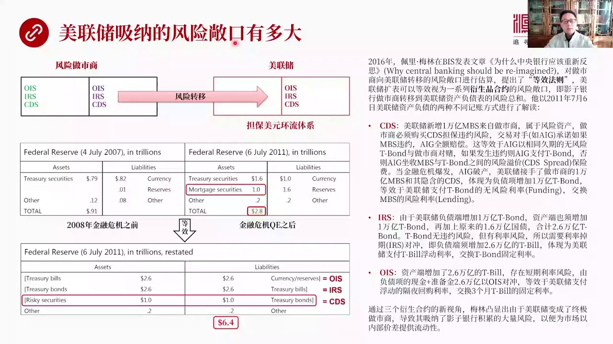

因為一交易商破產了 它的所有的這些信委員的這些 包括這個利率信委員的這些衍生產品全部要轉移到美聯儲自然分別表上雖然美聯儲自然分別表沒有顯示出來但實際上發生了配理美聯 它在2016年發表了一篇文章在這個...

<strong>All subtitles</strong>

> 因為一交易商破產了 它的所有的這些信委員的這些 包括這個利率信委員的這些衍生產品全部要轉移到美聯儲自然分別表上雖然美聯儲自然分別表沒有顯示出
> 來但實際上發生了配理美聯 它在2016年發表了一篇文章在這個BS的就是國際新疆銀行發表了一篇文章叫為什麼中央銀行應該重新反思它提出了非常重要
> 的一個法則叫等效法則它主要用於評估這個做事上到底向美聯儲轉移了多少風險窗口怎麼進行評估和估算呢這個等效法則是什麼意思就是美聯儲擴表這個行為可
> 以看成是一系列金融衍生產品合約的風險窗口的總和那麼影子銀行向美聯儲轉移的資產和這些資產所以隱藏的這個隱藏的衍生產品合約的總和風險窗口就是美聯
> 儲西納的市場風險的總和它在2021年7月6日美聯儲自然分別表跟2007年經歷及爆發之前的自然分別表進行比較而且提出了一種新的不同的極章方式然
> 後解讀了這件事我覺得這個等效法則是一個非常重要的創新性思路我們知道風險做日商美聯儲擴表把做日商的資產買過來了同時其實也把所對應的金融衍生產品
> 的風險窗口也買過了雖然資產分別表上沒有顯示但是可以算出來怎麼算這是美聯儲資產分別表在2007年7月4日就是金融危機之前它的自然分別表這是金融
> 危機之後的自然分別表這個配理美聯進行了等效法則的轉化之後你會發現兩者之間的差異巨大這邊才0.910.91萬億美元就是在金融風險爆發之前只有9
> 000多億的資產分別表在金融風險之後變成了2.8萬億當然我們知道這個持續量大量的資產擴大了1萬億但實際上經過等效原則轉化之後這商2.8萬億中
> 間所運藏的金融風險或者叫風險場口由這幫人轉移過來了可不止2.8萬億而是6.4萬億的觀念是怎麼算的這是個非常有意思非常驚人的一個算法首先美聯儲
> 吃進了這麼多資產之後實際上意味著這些資產必須要進行風險對衝要進行金融衍生產品的對衝所以這些資產可以改寫成下面的資產代表用一系列金融衍生產品的
> 合約來替代比如說CDS合約底下這下就叫CDS興尾調期就是美聯儲在市場中吃進了做事商的1萬億美元的NBS債券產品這是美聯儲資產稅表以前沒有的我
> 是競爭的這1萬億如果被放到這兒這相當於一個風險資產因為NBS是有可能違約的所以我必須要防範它也就是我必須要買一個CDS來對衝這個風險由於美聯
> 儲沒有辦法跟別人交易它相當於自己跟自己交易它用什麼呢它這個CDS是用同樣數量同樣期限假設我可以用同樣數量1萬億同樣期限跟你一模一樣的期限不管
> 年25年30年我反正做的跟你一模一樣用同樣數量的美國的國債進行CDS的對衝CDS的本質是什麼CDS的本質不就是無風險了就是不能出現違約風險它
> 從本質上來看相當於我持有1萬億美元別是我覺得有風險所以我要找個風險對家做交換也就是說對方要承諾我一旦出現了違約你就要給我無風險的資產然後你拿
> 走有風險的資產無風險資產是什麼當然是國債等期限等數量的國債一旦出現違約一把這1萬億的國債給我我就沒事了我就沒有風險了所以這是CDS的本質那麼
> 在自然負來表上你如果持有1萬億的NBS就必須要持有1萬億的美國國債跟他進行對重長期國債進行對重這就是CDS合約所以我們來看每天主新增1萬億這
> 個NBS來自於做事商屬於風險資產做事商必須購買CDS來擔保違約風險比如說交易對手誰呢AIG承諾如果NBS違約AIG將會全額賠償這等效於AIG
> 以相同97的無風險T棒來跟做商進行對路如果發生違約那麼保險公司將支付T棒來交換他的NBS否則的話如果不發生違約沒有爆發金融危機AIG做收NB
> S和T棒之間的風險預價就是你要向我保證保險費這就是CDS spread就是他的風險預價作為保險費者收入好 當金融危機爆發之後AIG破產了美聯
> 儲被迫接受了做事商的1萬億的NBS和他隱含的CDS合約所運含的風險上投體現為在美聯儲資產出來表上這邊加了1萬億NBS這邊必須要加1萬億T棒等
> 效於美聯儲支付T棒的無風險利率來交換NBS的風險利率這什麼意思其實我們來看也是短階長大的道理我這邊是融資這邊是借貸我融資的成本是什麼我要支撐
> 這邊1萬億的資產我融資成本不就是三十年國債或者十年國債給我的固定的收入嗎我的利益收入嗎我這邊支付的這邊我付出的成本我支付的成本是我要支出這個
> 國債利息我這邊資產收入的是風險資產更高比這個國債收益更高的利率回報所以體現為什麼體現為美聯儲支付無風險利率來方領只有這邊資產它它的負債是支出
> 固定的無風險利率交換NBS的有風險的利率從這邊進從這邊出所以這等於是個CDS合約好如果你這邊增加了1萬億的提棒那麼顯而易見你這1萬億的提棒跟
> 你以前所持有的這個售所持有的國債要相加加在一起是你心的總和那麼這1萬億加上這1.6就變成了2.6所以提棒的就會變成2.6萬億那麼它所對應的是
> 什麼呢你要擁有這麼多提棒的難道不需要做風險對重嗎需要雖然提棒的或者叫美國的中長期國債沒有委員風險但你有利率風險這2者要剝離開來第一個是進行是
> 違約風險提棒的沒有違約風險但提棒的有利率風險因為你九七比較長利率波動怎麼辦所以你要是收益率高相當於你資產免值提棒的價格下跌所以為了對重這個風
> 險你必須要進行利率調期來進行對重那麼提棒的怎麼來進行利率調期對重呢用T bill也就是短期三個月六個月的短期國債對長期國債進行利率調期的對重
> 因為短期國債三月那麼每年處這個或者市場利率加稀減稀對它的價格影響就比較有限因為它九七非常短所以當你持有2.6萬億增加了1萬億這個變成2.6萬
> 億之後你要進行全部的這個RS對重你負債方需要增加2.6萬億的這個T bill這才能實現RS的對重所以由於每年處負債的增加了1萬億T bill
> 資產段也需要增加1萬億T bill加上原來的1萬億1.6萬億的國債合計為2.6萬億那麼T bill沒有違約風險但有利率風險所以需要利率調期作
> 為對重表現為負債段需要增加2.6萬億的T bill那麼最終這樣的一個表達方法意味著什麼意味著每年處支付T bill像這邊支付T bill的浮
> 動利率交換T棒的固定利率也就是短劍常在一個道理我短期融資的成本是什麼呢無非是T bill的浮動利率T bill每天都在變它的浮動利率在變然後
> 我持有的資產是長期資產它帶來的現金融資固定的財政部每年給我這麼多錢所以這也是短劍常帶一種方式好再下一步我們可以看到由於你持有了這麼多T bi
> ll那麼T bill實際上合資產段如果增加了2.6萬億T bill它仍然存在著短期利率風險就是哪怕你有三月它還是會有一點點風險那麼它對它進行
> 對衝的是什麼就跟它進行對衝的是現金和準備金這邊以萬億再加上這邊有1.6萬億加在一起2.6萬億所以他們形成了一種這種風險對衝這可以稱之為是Oi
> s對衝就是隔夜的利率的這種指數利率的調期這邊是什麼這邊是隔夜的隔夜的這個回購融資利率我對衝你三個月的或者六個月的這種短期國債的利率風險所以如
> 果你這邊擁有2.6萬億的T bill存在短期利率風險那麼我這邊對應的是2.6萬億的現金和準備金那麼對應是2.6萬億相當於我是現金狀態所以我就
> 類似於隔夜隔夜的Ois對衝它的風險這等效率每年處支付隔夜利率浮動的隔夜利率交換三個月的T bill的固定利率這就是三個合約加在一起加在一起你
> 看看三個月加在一起這就變成6.4萬億而不是標準資產是在表達2.8萬億這說明一個問題說明你的2.8萬億中間所運藏的是6.4萬億的全部風險場口而
> 之所以會有這麼大的風險場口是因為你買金了這麼多債券所以買金債券一方面增加了你資產代表實際上你的隱含的信用風險或者金融掩盛產品的交易沒有被記住
> 在內要全部記住在內就是6.4萬億了所以通過三個掩盛合約的新視角配理梅林第一次突演出了梅林處變成了終極的做事商特別是終極的風險做事商這導致他吸
> 引了影子銀行積累了大量的影子銀行積累的全部的這種信用風險委員風險全部轉移到他這來了只有這樣做他才能夠為市場提供所謂的內部立差然後才能提供流動性我們看下一這是一個重要的思想方法和一個重要的突破

---

### Slide 21

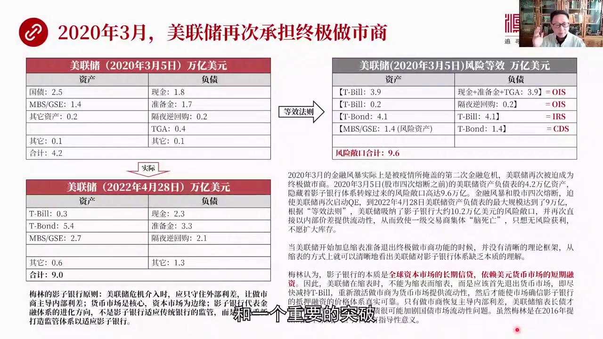

我們明白這點之後我們來看2023、2021年3月美股4次融斷美國又鬧了次金融危機美聯儲再次承擔終極的做事商我們看他到底轉移了多少風險在我看來2020年的3月這場金融風暴實際上是被疫情所掩蓋的第二次金融...

<strong>All subtitles</strong>

> 我們明白這點之後我們來看2023、2021年3月美股4次融斷美國又鬧了次金融危機美聯儲再次承擔終極的做事商我們看他到底轉移了多少風險在我看來
> 2020年的3月這場金融風暴實際上是被疫情所掩蓋的第二次金融危機它的危機程度不亞於第一次2008年只不過大家通過疫情把它壓住了掩蓋住了要不然
> 美股會40融斷嗎要不然美聯儲會瘋狂擴大資產費代表增加5萬億嗎翻了一倍這都比2008年相比它的衝擊力一點不亞於2008年而且在美聯儲和美國才能
> 夠拯救金融體系的過程中他所出產業政策的時候是在3月初當時中國才剛開始瘋狂美國還沒有病例所以說那個時候美國還沒有開始瘋狂你要說是疫情導致金融危
> 機那是絕對不可能的實際上是美國所謂的拉機站還有槓槓帶款導致金融危機那麼在這次第2次金融危機中每年總再次被迫成為了中機做的傷如果我們看資產費代
> 表2020年3月5號也就是股市4次融斷之前那個欺騙資產費代表它的總資產是4.2萬億這是在金融危機這個金融風報爆發之前那個時刻但是這4.2萬億
> 中間其實運藏著大量的金融風險實際上這4.2萬億中間運藏著從金融體系中轉移過來的風險如果我們用等交法則來計算的話實際上相當於9萬億9萬億的風險
> 所以資產費代表這4.2萬億實際上它中間隱藏的NBSGSEGSE還有其他的資產包括國債交易中間的銀行的眼神眼神的風險上口總數是9.6萬億怎麼辦
> 呢道理、邏輯、算法跟剛才一樣你每年主持有的NBS這是風險資產在這1.4萬億我對應就得有1.4萬億的提棒給你做對衝這是性微調期的對衝我如果有1
> .4萬億的新增的提棒我叫跟舊的提棒的就是已經用了提棒的進行跌加跌加完之後這就變成了3.9然後再加上這中間還有個硬硬回購個硬硬回購這新出現的實
> 際上個硬硬回購跟現金準備金是一個道理它也是短期融資支撐長期性彈所以這增加0.2萬億提幣有跟它對衝加在一起使得提棒的4.1提棒的4.1萬億的提
> 棒的由4.1萬億的提幣進行對衝這是力力調期對衝然後這兩者在由隔夜和現金準備金加提階提階是讓你也是一種也是一種短期負債來進行OS對衝哪家在一起
> 它的真正分岩長口是9.6萬億好為什麼要算這個算這個數是為了知道在美聯儲開始瘋狂印超票進行這個QE過程中一直到2022年4月使美聯儲資產費代表
> 從4.2萬億高到9萬億這個過程中這個風險長口的基數線我從哪開始算因為這是金融風爆爆之前的風險長口金融危機爆發之後的新的風險長口是多大呢從中我
> 可以計算出這兩者之間的差異這兩者之間的差異就是美聯儲在第二次危機中西納的全部金融危機所爆發之後的影子養體系所寒所產生的這個違約風險長口那麼如
> 果經過計算我會發現到2020年4月28號美聯儲資產費代表它扣大了最大的規模是9萬億這就是2022年4月28號頂風根據等下法則美聯儲實際上吸納
> 了影子銀行大約10.2萬億的風險長口下夜我會講具體的算法也就是說經過折算這9萬億相當於1919萬億多19點8萬億的全部風險長口以跟這個時刻經
> 對比相當於增加了10.2萬億風險長口的轉移所以我們知道這次風險第二次經風爆爆發之後免除大概吸納了多大規模的風險長口這是一個非常重要的一個計算
> 方法而且美聯儲介入市場之後再次以內部價叉提供流動性從而使美國一交一商沒事可幹了它變成集體腦死亡只想無風險套力不願意擴大庫存這就是為什麼美聯儲
> 現在還有美國參與部抱怨為什麼一交一商不增加國債庫存呢不增加做事呢不增加流動性呢全靠著美聯儲嗎原因就在於你如果介入市場等於危機直接以內部價叉來
> 提供流動性的話而不是以外部價叉的話那麼一交一商什麼事就沒他什麼事了他就腦死亡了不幹了當美聯儲開始加期鎖表準備退出終極作業商這個功能時候其實並
> 沒有真正理解這個這個影子央體系的本質所以缺少理論的框架配理媒體認為影子央的本質是全球資本市場上的長期信貸依賴美元貨幣市場的短期融資所以美聯儲
> 物在鎖表的時候不能夠未鎖表而鎖表現在就是典型未鎖表而鎖表我就每個月縮950億而且是長債為主短債是拼份美聯儲不應該這麼幹而是應該首先退出貨幣市
> 場就首先應該簡直TBL為什麼因為你是全部依賴全球性貸是依靠貨幣上的短期融資短期融資靠的都是TBL你現在只有太多TBL不好你應該把它全部拋空讓
> 做事商首先恢復貨幣上的做事功能就是重新激活做事商未貨幣上提供流動性的這樣的功能才能夠使得整個市場確信整個影子銀行體系它的抵押融資的價格體系抵
> 押融資我到底壓多少錢回購利率多少這個東西真是可靠而不是一直靠美聯儲拖著只有做事商恢復主導內部立差美聯儲的縮表才能夠特別是長債的縮表才有可能實
> 現你才可能賣給做事商因為市場大家信任做事商了然後做事商才能把長債再賣給投資人否則的話美聯儲縮表長期債券的這種縮表很可能會加劇國債市場流動性它
> 的困境就像現在出現的情況是一樣的因為大家不信任做事商當做事商被迫賣美聯儲這個國債的時候那麼市場會對您很懷疑這就沒人要或者財政部發行新國債的時
> 候流動性會變得很差因為沒人敢要因為大家還不相信這套定價體系是真正市場體系那麼從這個角度來看雖然沒這個梅林蘇的2016年提出這個觀點但是這個原
> 則直到今天的縮表其實也是具有直到意義就是美聯儲在縮表過程中方法是錯的它應該先拋空TB有短機國債而讓這個做事商恢復貨幣上的做事特別是以內部價叉
> 做事美聯儲才能退著出來然後它才能請長期的縮表長期債券才能賣出去這是縮表的關鍵關鍵但是美聯儲限的做法是正好相反他們是首先剪長債同時把短債作為拼
> 奉比如說950億中間如果剪了多少億之後還是差20億30億我用短債來替代這是說明根本沒有理解影子體系運作的核心或者沒有理論體系沒有理解全球資本
> 市場是依賴貨幣上的短期融資的而貨幣上的短期融資完全是要依賴做事商的這套體系如果沒有的話就不可能想像它能採取正確的縮表方式所以這是為什麼縮表你
> 看吧往後縮一定會觸發金融危機因為流動性會不夠而最終證明它還是退不出來跟08年情況一樣縮表不可能成功那麼總結一下梅林的影子銀行原則它提出根本原
> 則包括什麼美聯儲危機介入的時候應該只守住外部立場讓做事商主導內部立場這種情況會導致即便短期扩表也會自動縮表當危機結束的時候縮表就完成了這是最
> 好的辦法還有貨幣市場是核心資本市場是邊緣影子銀行代表金融體系進化的一種方向不是影子銀行是印傳統銀行的監管而是需要重新打造監管體系以適應影子銀
> 行的發展這個是佩里梅林對於整個影子銀行它所得出的一些重要的原則性結論好 我們看下一頁下一頁我們要計算一下如果爆發下次經微機

---

### Slide 22

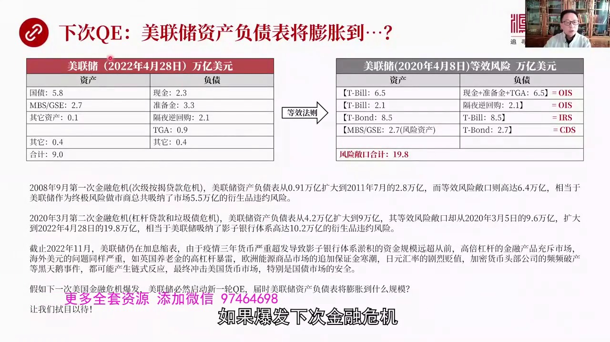

每年出再搞一輪新的QE的話每年儲自然負來表將會膨脹到什麼程度這是我們的問題那麼我們來做一個推算就是4月28號每年儲自然負來表最高達到了9萬億而最高9萬億它所對應的風險場口合計達到了10.8萬億這是計算...

<strong>All subtitles</strong>

> 每年出再搞一輪新的QE的話每年儲自然負來表將會膨脹到什麼程度這是我們的問題那麼我們來做一個推算就是4月28號每年儲自然負來表最高達到了9萬億
> 而最高9萬億它所對應的風險場口合計達到了10.8萬億這是計算方法跟剛才計算方法是一樣的好 如果從這樣那個風險場口我們可以得出一個結論2008
> 年9月第一次經歷微機爆發的時候是由於次1代款帶來的影子銀行微機次1代款會約每年儲自然負來表從0.9萬億跨達到2021年7月28萬億那麼它等效
> 風險場口高達6.4萬億相當於每年儲作為終極風險做日商總共悉納了市場5.5萬億的衍生產品微約風險這是第一次200年3月第二次經歷微機這場微機在
> 我看來是屬於槓杆貸款和拉機債貸款的微機每年儲自然負來表從4.2萬億擴張到了9萬億其等效風險場口卻從3月5號的9.6萬億跨達到了4月28號今天
> 4月28號的10.8萬億相當於每年儲悉納了影子銀行體系全部高達10.2萬億的衍生產品微約的風險這就是我們最終得到這個數據10.2萬億的風險被
> 轉移到每年儲了截止到2012年11月每年儲仍然再加一所表那麼由於疫情3年美聯儲的貨幣嚴重超方導致影子養體系預計了資金的規模遠遠超過從前黃泛區
> 黃泛區的規模比以前大多了所以這種高貝槓杆的金融衍生產品可以說充斥著整個市場海外美元的問題同樣非常嚴重你比如說最近爆發的英國養老金的高槓杆爆雷
> 還有歐洲能源商品市場追加保證金的韓朝還有日元還有很多其他的貨幣對美元匯利的大幅的貶值還有加密貨幣投步公司的大量破產等等這都屬於黑天鵝事件黑天
> 鵝事件背後都是高槓杆引起的這種聯索反應而這種反應有可能記憶部擴張最終影響到美國貨幣上特別是美國國債市場完全假如下一次美國金融危機爆發美聯儲必
> 然會啟動新一輪的量寬鬆到那個時候美聯儲資產費代表將會膨脹到一種什麼樣的規模這就讓我們拭目以待吧好這就是今天這堂課的主要內容我們總結一下

---

### Slide 23

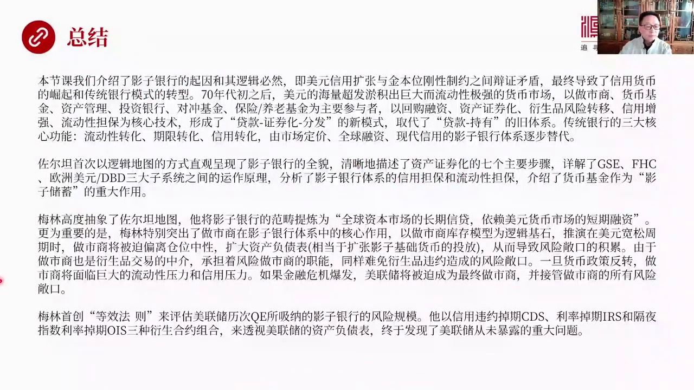

本堂課我們介紹了影子銀行他的崛起的原因和他的邏輯的必然性這就是美美國的美元信用擴張和金本位之間的剛性制約他有天然的矛盾這種矛盾的鬥爭最後導致了信用貨幣體系的崛起和傳統銀行模式的轉型特別是在70年代出之...

<strong>All subtitles</strong>

> 本堂課我們介紹了影子銀行他的崛起的原因和他的邏輯的必然性這就是美美國的美元信用擴張和金本位之間的剛性制約他有天然的矛盾這種矛盾的鬥爭最後導致
> 了信用貨幣體系的崛起和傳統銀行模式的轉型特別是在70年代出之後吧美國海量超發的美元預計成了一個規模巨大流動性非常好的貨幣市場在這個市場中有一
> 大群新的玩家特別是以作勢商貨幣基金資產管理投資銀行對衝保對衝基金保險和養老基金這幫人成了主要的新的參與者然後他們使用了全新的金融技術比如說回
> 購融資資產證券化眼睜品的風險轉移還有信用增強流動性擔保等等所以就形成了一種新的模式從傳統銀行的貸款證券化分發了模式變成了取代了傳統的貸款和持
> 有模式過去是貸款和持有現在變成了貸款證券化分發那麼傳統銀行的三大核心功能比如說流動運轉化期限轉化和信用轉化現在都有市場硬價全球融資現在信用的
> 影子影響體系逐步加以替代那麼昨日它首次以邏輯地圖的方式直觀的呈現出影子影響的全部並且清晰的表述資產證券化了七個主要步驟詳細分析了GSEE包括
> 銀行控股公司包括歐洲美元包括獨立的做日商三大子系統之間的相互關係的原理並且分析了影子影響體系的信用擔保和流動運擔保的方法介紹了貨幣市場基金作
> 為影子影響儲蓄的重大作用可以說這張圖全方位的介紹了影子影響體系的所有的細節而梅林呢它的戰衛更高它是高度抽象的族而坦的地圖它把影子影響的範疇提
> 煉為全球資本市場的長期現代依賴美元貨幣上的短期融資降了一個重要的結論更重要的是梅林特別突出了做日商在影子影響體系中的核心作用就是以做日商酷存
> 模型為一種邏輯的基石推延美元寬鬆周期在那種情況之下做日商它的倉位將會怎麼變為什麼會越來越高為什麼會偏離倉位中性而擴大自然出來表相當於擴張影子
> 基礎貨幣的投放具體的這個推論我們會在下當課進行詳細分析那麼這個過程將會導致做事上風險場口的不斷的積累由於做日商其實也是衍生產品交易的中計所以
> 它承擔著風險做日商的主要職能所以只要風險做事這些金融衍生產品的發生違約對家違約的問題如果是出現這個問題都會形成巨大的風險場口同樣作用在做日商
> 的自然分析表上一旦貨幣政策反轉熱環流變成冷環流做日商必將面臨巨大的流動性壓力和性壓力在相當的程度之下這個壓力大到相當程度之下整個體現會崩潰這
> 就是精微機爆發了在這種情況之下美聯儲將被迫成為最終的做事上並接管做日商所有的市場風險場口那麼佩里莓林手創了等效法則來評估美聯儲力次QE所西納
> 的影子銀行的風險規模那麼它以性為調期CDS利率調期IRS和隔夜指數利率調期OS三種 三種衍生產品合約的組合來透視美聯儲自然分析表終於發現了美
> 聯儲自然分析表上從來沒有暴露出來的重大問題就是美聯儲究竟消化西納了市場中多大的衍生產品風險那麼下一次當下一次危機爆發時候這個規模又會大到什麼
> 程度這是非常重要的一個問題再看下夜這就是我們推薦了幾本書佩里莓林的三個最主要的重

---

### Slide 24

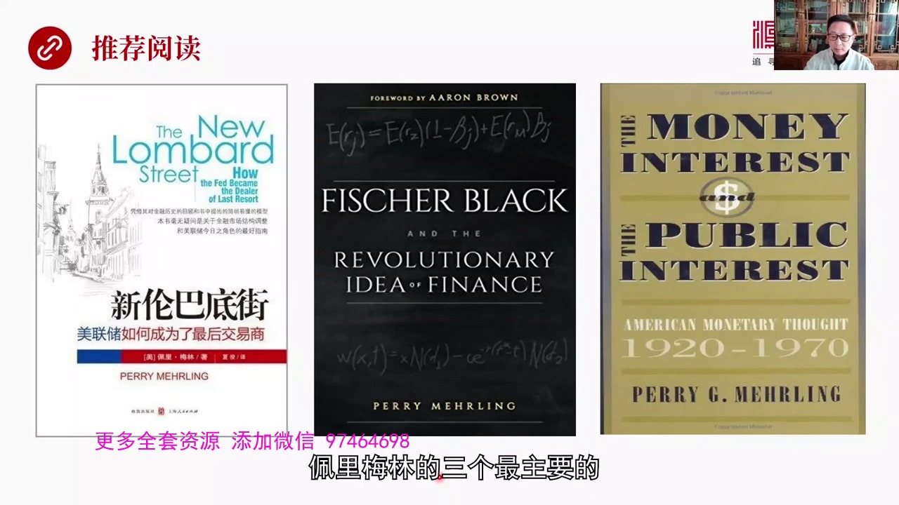

最主要的作品還有下一頁這就是我們這堂課中重點引述的

<strong>All subtitles</strong>

> 最主要的作品還有下一頁這就是我們這堂課中重點引述的

---

### Slide 25

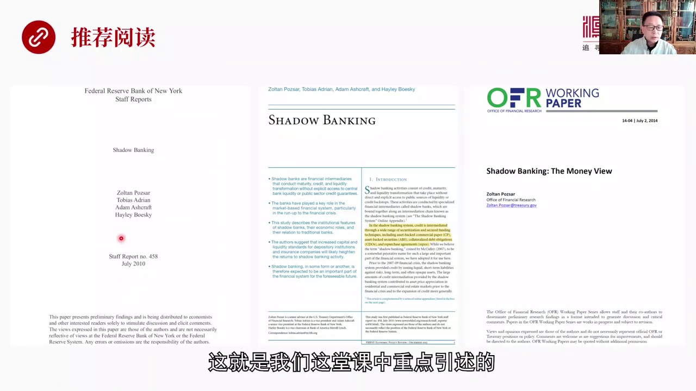

左耳彈的幾個重要文章由美聯儲的內部報告因為美聯儲銀行內部的分析報告這就是它的地圖所在的報告還有就是它在關於影子銀行的一系列論述還有就是這也是這個作耳彈的一篇文章

<strong>All subtitles</strong>

> 左耳彈的幾個重要文章由美聯儲的內部報告因為美聯儲銀行內部的分析報告這就是它的地圖所在的報告還有就是它在關於影子銀行的一系列論述還有就是這也是這個作耳彈的一篇文章

---

### Slide 26

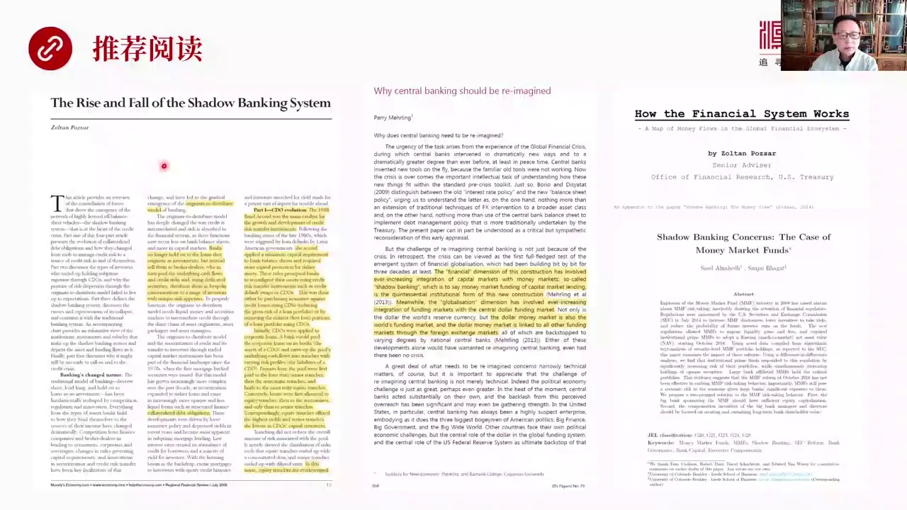

還有就是佩里莓林寫給這個BS國際貨幣侵算銀行的雜誌的一篇文章還有這個作耳彈它對於整個金融體系的運作方式的理解是個大型的PPT還有一些其他的關於影子銀行還有貨幣上基金的一些分析這就是我們今天課程的主要的...

<strong>All subtitles</strong>

> 還有就是佩里莓林寫給這個BS國際貨幣侵算銀行的雜誌的一篇文章還有這個作耳彈它對於整個金融體系的運作方式的理解是個大型的PPT還有一些其他的關
> 於影子銀行還有貨幣上基金的一些分析這就是我們今天課程的主要的內容

---

### Slide 27

我們下當課將會重點去分析影子貨幣的核心理論和它的重要原則今天課就到這裡謝謝大家

<strong>All subtitles</strong>

> 我們下當課將會重點去分析影子貨幣的核心理論和它的重要原則今天課就到這裡謝謝大家

---
