# 核心课视频-103-106  现代货币创造（五）影子货币-下 — Detail Slide Notes

> **来源**：鸿学院核心课程  
> **幻灯片**：35 张

---

### Slide 1

现代货币创造的影子货币部分咱们今天是第三奖前两奖中间我们主要介绍了配领梅林的货币层级还有左尔坦的影子货币的逻辑地图那么第三奖我们将重点谈这个影子货币部分那么这也是我们红旋应该说常试着创造属于我们自己的...

<strong>All subtitles</strong>

> 现代货币创造的影子货币部分咱们今天是第三奖前两奖中间我们主要介绍了配领梅林的货币层级还有左尔坦的影子货币的逻辑地图那么第三奖我们将重点谈这个
> 影子货币部分那么这也是我们红旋应该说常试着创造属于我们自己的理论所以今天这场课内容量比较大主要是有很多新的观念、
> 新的体系和新的框架所以我们会设计了面表宽内容量也确实比较大这也是我们常试着去根据现有的关于影子货币的所有的各方面的材料综合组织在一起奠定红旋
> 自己的理论框架所以这场课非常重要我们现在看第一页首先我们第一个问题是

---

### Slide 2

究竟什么是影子货币名司机曾经有一句名言她说每个人都能发现货币问题是别人是否会接受我觉得这句话问得很有意思就是我们每个人都可以写张介条或者发行自己的指币关键是在市场能不能流通别人会不会接受其实这个问题对...

<strong>All subtitles</strong>

> 究竟什么是影子货币名司机曾经有一句名言她说每个人都能发现货币问题是别人是否会接受我觉得这句话问得很有意思就是我们每个人都可以写张介条或者发行
> 自己的指币关键是在市场能不能流通别人会不会接受其实这个问题对于影子银行或者叫影子银行中间的机构也同样存在什么人 什么机构发行的这种戒剧或者叫
> 票剧能够在市场中被所有人接受实际上这就是影子货币必须要面对的第一个大问题我们看下一页关于影子银行

---

### Slide 3

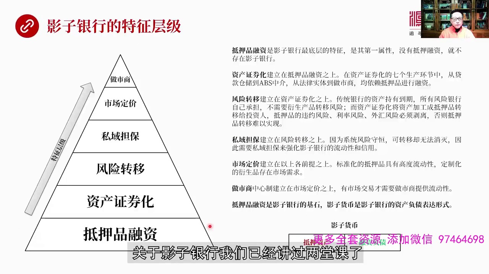

我们已经讲过两堂课了首先我们需要回顾一下特别是左尔坦对于影子银行那张逻辑地图我们可以把左尔坦地图中间关于资产证券化中间所设计到各种影子银行的最核心的东西那些核心特征 拎出来在这里我们建立了一个影子银行...

<strong>All subtitles</strong>

> 我们已经讲过两堂课了首先我们需要回顾一下特别是左尔坦对于影子银行那张逻辑地图我们可以把左尔坦地图中间关于资产证券化中间所设计到各种影子银行的
> 最核心的东西那些核心特征 拎出来在这里我们建立了一个影子银行特征的这样一个金字塔我试图把影子银行中间所有关键的最重要的特征按着一个逻辑顺序搭
> 建成了这个金字塔从这个金塔中我们可以看到对于影子银行而言最重要最基本的特征是什么我称为是抵押品的融资然后是资产证券化然后是风仙转移然后是私余
> 单宝然后是市场定价最后是做事商的中心质为什么要按着这个顺序来体列影子银行的特征原因在于我认为影子货币最基本的或者叫它最根本的特征也就是它的第
> 一属性应该就是抵押品融资假如没有抵押品融资这个概念的话也就不可能存在影子影子银行我们回想昨儿谈所讲的那张地图中间的每一个步骤实际上都需要抵押
> 品融资有了抵押品融资之后才能够建立其他的影子银行来这些特征比如说资产证券化实际上必须要建立在抵押品融资之上因为在资产证券化的七个生产环节中间
> 基本上都会涉及到抵押品融资比如说从一开始银行把自己的贷款打包放到倡库里就是贷款倡处然后到做事商对它进行ABS加工CDO的加工最后形成ABS的
> 中介也就是ABS这种证券化之后的倡处每个过程都涉及到抵押品融资还包括比如说发行这些票剧的倡处票剧的法律实体不管是那种Conduct就是管道还
> 是ASIV这都叫法律实体还有做事商它们都是基于抵押品融资这个概念来发行的ABCP就是资产抵押的商业票剧或者是回够复债Repeau那么每一个环
> 节每个中间的实体都需要依赖抵押品融资所以证券化资产证券化是建立在抵押品融资最基本的机会之上的然后因为要做资产资产证券化所以涉及到风仙转移了问
> 题或者说风仙转移是要建立在资产证券化了基础之上的为什么因为传统银行不存在资产转移了问题不存在资产和风仙转移的这样的一个顾虑为什么因为传统银行
> 持有贷款一直到到期10年贷款30年贷款我持有到期所以在持有过程中所有贷款发生了违约所有利息的波动所有各种各样的外部的变化所带来的一切风险由传
> 统银行自己承担因此它没有必要也没有需求去发展延伸品去转移这种风险所以我们看到金融延伸品的崛起实际上是在资产证券化这个过程之中逐渐派生出来的那
> 么资产证券化把这种贷款这种资产加工成了底压品转移给了投资人这个时候底压品的五约风险利率风险包括这种外汇风险这些风险就必须要剥离了传统银行不用
> 但是你要把它加工成底压品要转移给别人这些风险就需要剥离否则的话底压品的转移很难以很难实现因为别人一看有风险我不愿意去买不愿意去接受在市场中它
> 就没有需求那么再次资上是资予单保资予单保是建立在风险转移之上的因为系统有风险而风险是少黄的风险可以被转移却没有办法消灭所以你的底压品以及底压
> 品衍生出来的各种风险虽然可以转移但无法被消灭那么就整个系统就会有风险存在你要让整个影子银行体系要流动起来就必须要增加资予单保这就是我们上台课
> 讲的左尔坦所提到了各种各样的资予单保的工具你只有有了资予单保这些底压品包括它的衍生品在市场中才会真正能够具有细用才能真正流动起来再次直上才是
> 市场定价也就是说市场定价必须要建立在刚才我们所说的底压品融资资予单保然后才能形成市场那么标准化的底压品它就会具有高度的流动性定制化的衍生品自
> 然会存在市场需求这样才会形成市场定价体系好有了市场才会需要做事商因为做事商中心制一定要建立在市场定价之上有市场交易才会需要做事商来提供流动性
> 所以我们这个金字塔是把所有影子银行的特征抓取出来之后按照演艺逻辑的思路把最重要的和最重要的所以衍生出来的一步步衍生出来的其他特征做成这个金字
> 塔正是因为我们提链除了特征金字塔我们才能把影子银行的最根本的东西给抓住那就是底压品融资所以底压品融资是整个影子银行体系的基石而影子货币实际上
> 是影子银行的资产负债的表达形式简单说我们可以用这样一个简略的表达方式来表达影子货币是什么资产这边我们把它高度农缩成这个底压资产那么负债这边就
> 是融资负债可以说影子银行就是这么一个很简单的类似于一个纸片类似于一个资产底压和它的收据合并在一起的这样一种表达方式我认为用这种表达方式可以非
> 常简略的概括影子货币的核心好 我们再看下一正是由于我们建立了链品的层级

---

### Slide 4

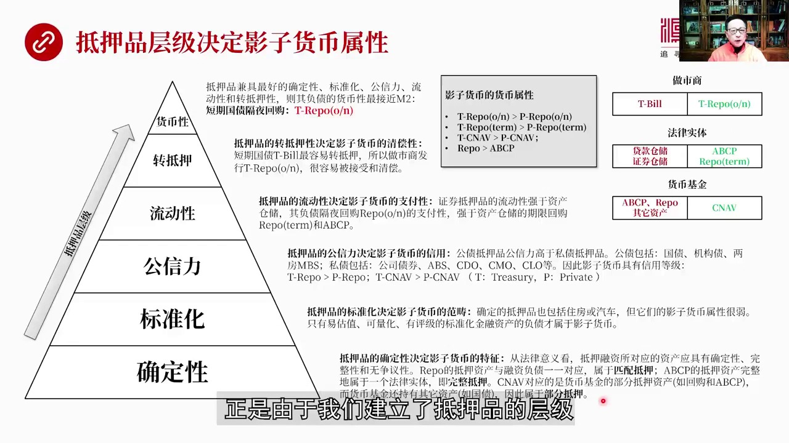

那么我们从这里出发就能够看到由于我们有链品的层级这个金子塔那么我们又知道它是影子银行最重要的一个判别标准所以我们可以把金子塔中间的基石链品层级作为判断影子货币属性的一个判断的基准也就是说我们这个时候可...

<strong>All subtitles</strong>

> 那么我们从这里出发就能够看到由于我们有链品的层级这个金子塔那么我们又知道它是影子银行最重要的一个判别标准所以我们可以把金子塔中间的基石链品层
> 级作为判断影子货币属性的一个判断的基准也就是说我们这个时候可以把链品再做出一个层级来再搞成一个金子塔因为链品非常重要它是整个影子链行的基石那
> 么这个基石我们再体验一下又能够得到一个链品的层级金子塔在我看来链品最重要最基本的基石是什么呢是首先它必须要确定性在确定应质上是标准化有了标准
> 化之后才谈得上公信力然后再往上才会设计流动性再往上是转抵押最后金子塔的顶家是它的货币性所以链品层级决定了影子货币的属性为什么我们把确定性列为
> 低要素或者叫低属性呢就是链品的在我看来链品的确定性决定了影子货币的特征因为从法律角度来看链品所对应的资产应该具有的确定性完整性和无争议性就是
> 我们说到链品融资这个链品必须要完全的确定的没有争议的属于链方否则的话融资谈不上你压给我一个车压给我个房子但是你这个房子并不属于你那我怎么敢把
> 我的钱借给对方呢你压给我了房本压给我了车本必须要是只属于这个人而不能有争议性不能说另外一个人说我也拥有他那就没法搞融资了所以确定性是第一特征
> 最重要没有确定性第二种资根本他们上比如说repo回够的抵押资产和他的融资负债是一对硬的我有一个国债那么他所对应的负债就是repo他们俩是一对
> 硬的抵押资产和他的借据两者是完全对硬的这个叫匹配抵押一对一这当然属于最确定的最无争议的最完整的抵押那么另外一种ABCP资产抵押的商业票剧他的
> 抵押资产是什么呢是属于个法律实体比如说这个法律实体我为了要把贷款放到一个仓处里头所以我专门设立一个法律实体来拥有这个贷款仓库所以从法律角度来
> 说这个贷款仓库中的所有贷款都完全的属于或者叫完整的属于这个法律实体那么这个法律实体所发行的票剧ABCP就具有着完整抵押性就是我所发行的ABC
> P对应的是有抵押的整个仓库里面所有贷款都是我的抵押品这叫完整抵押当然完整抵押跟匹配抵押相比匹配抵押最精确最完整最无争议完整抵押稍刺一籌那么还
> 有一种叫部分抵押比如说货币基金所发行的这个份额它只是部分抵押原因可在原因在于货币基金持有着很多种资产比如说它持有着回购回购复债也持有着ABC
> P这都是有抵押的资产但是货币基金还持有其他的资产比如说它持有国债或者它持有其他的包括银行的CD等等所以在货币基金的资产这边除了抵押资产之外还
> 有一些其他的资产所以当你拥有货币基金的收据它的份额的时候你其实并不完全拥有抵押品并不完全拥有全部的抵押品你只是部分拥有它所以这叫部分抵押但是
> 部分抵押比完成抵押又差了一仇好我们谈到了抵押品的确定性决定了影子货币的特征所以我们可以得到一个结论所有影子货币都必须要有它的抵押品的确定性如
> 果没有这个特征的话就谈不上是影子货币好那么有了确定的抵押品就一定是影子货币吗那也未必这就要涉及到标准化了问题了抵押品的标准化决定了影子货币的
> 范愁也就是说有确定的抵押品并不一定就完全属于影子货币比如说确定了抵押品当然包括驻房汽车但是驻房和汽车收据能叫影子货币吗我们可以说它的影子货币
> 的属性很弱那么哪些财算影子货币呢一定要那种可以估值的非常容易估值的然后可以精确定量化的还有最好有评级的那种标准化的金融资产这些抵押品所对应的
> 收据也就是它的复债财算影子货币所以我们在这看抵押品实际上是它的资产那么它对应的收据这个叫影子货币所以抵押品它的两个最重要的即时确定性决定了影
> 子货币的基本特征如果抵押品没有确定性那就不叫影子货币了那么第二个特征是什么呢就是抵押品最好是标准化的金融资产否则它的影子货币的属性也会非常的
> 弱有了这两个即时之后再往上当然就是公信力抵押品的公信力决定了它的收据的信用那么公信力怎么看当然公债这种抵押品的公信力是非常高的它是高于私债的
> 公债包括什么国债 机构债两房的NBS这都叫公债那么私债呢比如说公私债券A,B,S还有C,D,OC,M,OC,L,O这些正确化的东西这都叫私债
> 所以影子货币它是有信用层级的它的信用层级什么呢那就是T,T,T是代表Trashery也就是财政部财政部的国债作为抵押的Ripple它的回够复
> 债它的信用要高于P,P就是私债好 这两种回够中一种是以公债作为抵押的收据一种是以私债作为抵押的收据两种收据比较起来公债的供信力更高那么相对应
> 也一样货币基金所发行的贩额也是以公债为抵押的或者以公债为部分抵押的货币市场基金的贩额它的信用或者它的供信力要好于以私债作为资产的货币市场基金
> 的贩额好 再往上当然就是流动性第二品有流动性吗当然有不同的抵押品的流动性是不一样的就是融不容易在市场上进行交易或者你这个抵押品在市场交易中你
> 是不是会打折打的比较厉害比如说你如果抵押品是国债是债券当然它的流动性就会比较好如果它的抵押品是什么呢如果是贷款的仓库中间放了3000个贷款那
> 么3000个3000比贷款的市场的流动性显然要弱于同等数量的但是是债券的抵押品的流动性因为你在市场中交易比说100亿100亿的贷款和100亿
> 的债券谁好交易当然债券好交易它的流动性更强它的这个在市场中的折扣会很少而你贷款必须要打个很深的折扣才卖得出去所以这就说明一个问题抵押品的流动
> 性决定了影子货币的可支付性也就是说你背后的抵押品越是那种流动性好的资产标准化的资产那么你所对应的收据就越容易被别人所接受所以我们来看正券抵押
> 品它的流动性要好与资产倡处那么正券类的抵押品它的负债格业回购而且是这个比如说国债的格业回购欧恩就是Overnight格业它的支付性就在市场中
> 你要付给别人别人很容易接受你如果是个资产倡处所对应的收据比如说期限回购repo term或者是ABCP在市场中当然人家就不太容易接受或者说不
> 太容易流通所以抵押品的流动性决定了影子货币的可支付性好 再往上转抵转抵是什么意思呢就是当你把抵押品转给了这个转给了这个下家之后下家可以用这个
> 抵押品再转给另外一家就抵押品可以被转抵抵押品的转抵押性决定影子货币的清长性清长性什么概念就是你付给别人的比如说你是国债这是你的抵押品同时它的
> 收据支付给别人别人接受这个收据实际上它为什么接受因为它知道有抵押品那么这个抵押品它接受收据的时候抵押品其实也随之到了下家所以这就叫清长我收到
> 收据之后我知道我还是把抵押品拿过来这就清长了这个收据那么短期国债提毕有它当然最容易转抵押因为它欺骗很短然后又是国债所以没有纽约风险所以国债的
> 转抵押它的转抵押性是最强的那么做事伤根据国债它所发行的收据Triple隔夜的是最容易被接受和清长的好在网上最高级别就是货币性了货币性什么就是
> 如果抵押品同时具备了最好的确定性最好的标准化最佳的供信力包括最好的流动性和转抵押性那么这种复债就是这种抵押品所对应的收据它的货币性最接近传统
> 银行的MR当然在所有的这个影子货币中间排第一的货币性最强的是什么反其国债Triple所对应的收据隔夜回够就是Triple overnight
> 这个东西的货币性是最接近于前的或者叫银行货币MR的好我们来看这边这张图我们来看做事伤它所发行的以Triple作为抵押品所对应的收据Tripl
> e overnight就是隔夜回够这个收据是流动性最好的或者叫货币应最强的这个影子货币好还有呢法律实体法律实体也就是在自然正确化过程中它涉及
> 到融资会有贷款仓储或者叫证券仓储他们所对应的收据比如说ABCP或者叫期限回够这也是一种收据但它的流动性肯定或者叫它的货币属性肯定要弱于Tri
> ple那么货币市场基金它也发行它的收据这个份额所对应的资产中间有一部分是有抵押的抵押品ABCP或Ripple好我们来看整个影子银行的货币属性
> 根据我们抵押品层级来得出货币属性我们会发现在所有的影子货币中间Triple隔夜的它的货币属性最强它比Priple隔夜要更像货币好如果我们再比
> 期限回够当然还是以国债作为抵押的期限回够这个收据它的货币性要强于用私债作抵押的期限回够那么在往下同样的道理以国债作为资产的货币市场基金贩额它
> 的供信力或者它的货币属性要强于以私债为资产的货币市场基金的贩额同时最后我们可以看凡是回够由于它时间比较短隔夜的回够它的货币属性会强于ABCP
> 这个是我们可以通过抵押品层级来看影子货币的属性同时据备确定性标准化供信力流动性转抵亚和货币性的所有特征都是最佳的它的货币属性就最强这点是我们
> 红旋应该说对货币影子货币这个问题提出了非常独特的一个间谍其他关于影子货币的各种学术中间没有谈到抵押品它的层级决定了影子货币属性这个问题好我们再看下一有了这个概念之后我们来找一找昨儿谈地图中间所设计了

---

### Slide 5

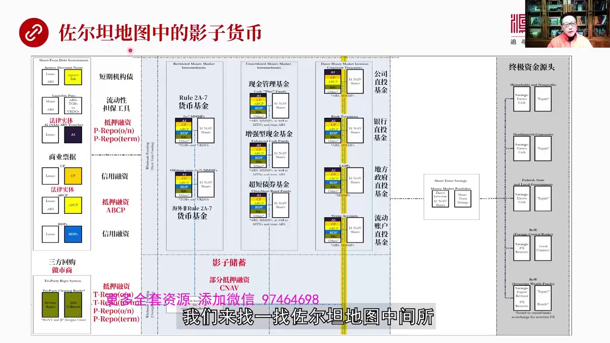

这些复债哪些算是影子货币呢首先抵押融资的这种复债或者叫由抵押品的收据它肯定属于影子货币比如说我们可以从这边看到短期机构债这不叫抵押融资所以它不算还有呢这个流动性单保工具这些也不算因为它不是抵押融资好这...

<strong>All subtitles</strong>

> 这些复债哪些算是影子货币呢首先抵押融资的这种复债或者叫由抵押品的收据它肯定属于影子货币比如说我们可以从这边看到短期机构债这不叫抵押融资所以它
> 不算还有呢这个流动性单保工具这些也不算因为它不是抵押融资好这个算不算这个算因为它是法律实体根据根据它的抵押资产所发行的这个票剧所以这种戒剧它
> 算抵押融资所以由此产生的屁锐破不管是隔夜的还是期限的都算影子货币这是一种还有呢商业票剧纯商业票剧是信用融资这不是抵押融资商业票剧比如说某家银
> 行在美国货币账上发行商业票剧它是用自己的信用作为作为融资的这种方式所以叫信用融资这不叫抵押融资因为它并没有抵押拿出一个具体的东西来抵押注意抵
> 押和信用这两种融资方式最根本的区别就是抵押品在法律上被承认为一旦无论你这个发行方式否破产你只要把它抵押出去在法律上这个抵押品完全属于被抵押方
> 假如你发生伪月的话但是如果你拿到是一个信用的融资的比如说商业票剧那这个银行倒闭你你能拿到啥呢不知道因为还有一些优先债权人牌在你前面人间先刮分
> 资产剩下的然后还如果还有剩下来这才是信用融资这些普通债权人们所能分的东西所以信用融资和抵押融资在法律上是不一样的那么另外一种ABCP为什么他
> 叫抵押融资呢因为ABCP他是个法律实体他中间的贷款的库存完全属于这个实体而这个实体把所有的这里头参考里面的所有东西全部压出去了所以他所发行的
> 收据ABCP这叫抵押融资所以ABCP这算影子货币但是CP不算那么BDP呢就是银行所所发行的通过这个中介商所发行的比如说这种定习存款他也是一种
> 信用融资也不算好另外做事商做事商肯定算因为做事商所发行的不管是根据国债作为抵押的回够无论是隔夜还是期限或者以私债作为抵押的隔夜或者期限回够都
> 是有抵押品的因为他们要做比如说匹配藏位就是我有一张债券这边发现一张收据那那张收据肯定是一对硬的无论抵押品是公债还是私债都是一对硬的所以他的这
> 些票剧都算影子货币除此之外影子处序也就是这些货币市长基金所发行的复债借据他们算因为他们中间有一部分比如说有ABCP有这些回够还有各种各样的抵
> 押品所以货币市长基金他所发现了份额对应了资产中间有一部分是有抵押的这种借据作为资产当然CP不算BDP不算其他的算所以我们有了这个概念之后我们
> 对影子货币的定义对他的范愁就很清楚了所有有抵押的这种收据就算影子货币好我们再看下一抵押品管理谁让谁管理抵押品

---

### Slide 6

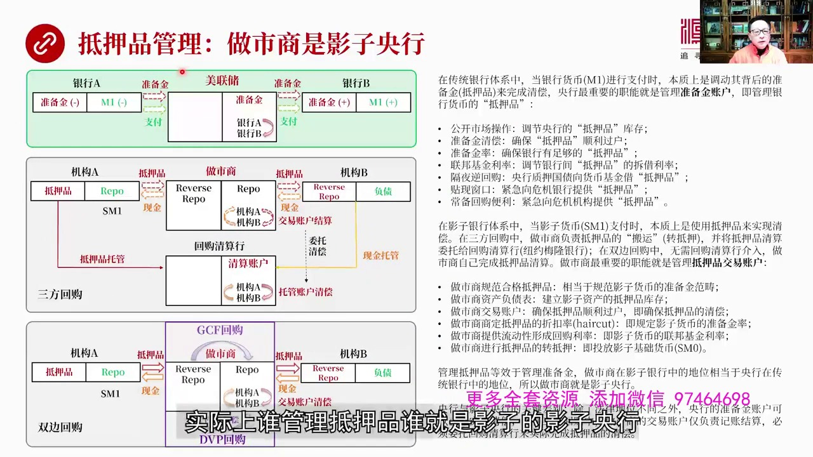

谁就是影子银行当然做事伤肯定是管理抵押品的所以他一定是影子银行里面的中央银行比如说我们做个简单例子对比一下传统银行我们看在传统银行中银行货币M1可以进行支付但他的本质是调动背后的准备金准备金是什么也是...

<strong>All subtitles</strong>

> 谁就是影子银行当然做事伤肯定是管理抵押品的所以他一定是影子银行里面的中央银行比如说我们做个简单例子对比一下传统银行我们看在传统银行中银行货币
> M1可以进行支付但他的本质是调动背后的准备金准备金是什么也是一种抵押品所以当M1进行银行货币进行支付的时候实际上是靠背后的准备金来完成清查或
> 者用或者用我们现在的话说是用抵押品来完成清查银行最重要的执程就是管理准备金账户也就是管理银行货币的抵押品这个概念如果我们放到这样图上大家一看
> 就一目了人了银行A他的自然负赛表简化成货币形式就是左边资产是准备金右边复债是M1M1什么是准备金是收据好当银行A支付比如说他的客户要支付给银
> 行B真正他所设计的当然是M1银行A和银行A这间要做负债的调整但真正完成清查那是准备金也就是抵押品所以我们来看当这个支付过程发生的时候在这儿我
> 画了虚线说明这是一个虚拟的流动过程真正的过程发生在这我们来看当这个银行A支付的时候通过中央银行中央银行实际上是把准备金从A银行画到了并银行画
> 到了并银行然后并银行在他的准备金向下加同样的数那么在他的负债向下也增加同样的数这样这个支付就完成了实际上支付是A银行和并银行他们在负债向下做
> 调整数字做调整但真正完成清查的是在准备金账户下来进行完成的这是传统银行的支付方式那么我们来看传统央行最重要的是管理准备金账户假如A银行你要这
> 么支付而你在央行准备金账户上没有足够的钱这个支付会失败的当并银行要调整这个数字他给中央银行打电话说你把A银行的准备金转到我这儿来吧每天从发现
> A银行要转一百块钱A银行只有90这个钱话不过来那你不是康乐并银行吗这个交易会失败就会回滚滚回去支付不了所以央行最重要的一个功能就是管理准备金
> 账户确保每一家银行在准备金账户上有足够的钱用于清算或者叫用于清长那么也就是必须要有足够的银那么每连处公开市场操作他做的是什么实际上是调节调节
> 每连处的底压品库存公开市场操作不就是在做准备金到底有多少实际上是每连处的底压品库存准备金清长是为什么呢主要是为了确保底压品顺利过护A银行的准
> 备金能够顺利转到病银行这叫准备金清长也就是底压品从A银行转到病银行什么叫准备金率准备金率就是确保银行A有足够的准备金在里头你每创造一比M1你
> 得相对应在这个准备金用上得有比如说10%准备金率你得有10%的M1的创造量放到这已被转账用这叫准备金率它是确保每家银行有足够的底压品那么连帮
> 基金利率呢主要是每天出来调节银行之间底压品的拆解利率大家在准备金市场上借准备金借着什么其实借着是底压品底压品就是准备金是银行货币的底压品那么
> 格议你会够呢当然就是每连处制压国债向货币市场基金去借底压品所以我们看到当你一回够做得特别大的时候我们会发现每连处的复债表上有一个格议你回够格
> 议你回够数字会上涨那个数是从哪儿涨上来的它这个钱是从哪儿转的实际上是从银行体系的准备金转向了格议你回够因为我们知道货币市场基金它的开户银行他
> 们的真正的钱或者叫真正的货币金的钱是存在银行账户上实际上当货币基金说我要买每连处的格议你回够买这个理财了好他们就会通知自己的开户行把这笔准备
> 金从准备金账户上化给格议你回够账户那么贴床口呢贴床口我们知道是应急的那就是有银行出事了那么中央银行会向出事的银行来提供抵押品提供准备金长辈回
> 够便利到底是一样的如果有影子机构有金融机构出问题了也是通过质压来向央行来借这种抵押品所以在这里我认为抵押品和准备金我们要把这两个概念统一再起
> 它实际上是一回事只不过在传统央中我们称之为准备金在影子央中大家更常用抵押品好如果我们对应来看隐自银行的支付体系其实跟这个也非常类似比如说在三
> 方回够中机构A它的影子货币是什么情况呢抵押品在这儿是资产repo是它的收据跟这儿情况是一样抵押品是准备金收据是ME它在支付的时候我们看也是经
> 过中间的一个重要的中纪在传统央中是美联厨是中央银行在影子央中是做事商我们会发现你机构A要把这个要完成这个支付支付给机构币你会发现实际上它发生
> 了什么是抵押品经过做事商之后转给了机构币这个支付实际上是一个借钱的过程唯一抵押品向机构币来借钱好它发生的情况是抵押品是这么流过来的穿过做事商
> 自然代表到达机构币那么机构币的现金穿过做事商到达机构A所以机构A是抵押品作为融资向机构币来借钱回够是它的一张收据这个收据也就是说首先机构A要
> 向机构币借钱必须要通过做事商做事商因为它们俩并不见得直接认识做事商所谓做事就是无论你A找谁借钱你不一定需要知道这边的情况你跟我做然后我再找其
> 他人来做所以做事商的功能就是无论你什么时候要跟我做我都可以随时满足你要求也就是它向市场提供了一个东西无论是A还是B大家都跟做事商来做所以机构
> A如果想借钱首先是找事商说它要借钱怎么借呢你抵押品作为抵押向你开个收据repo那么做事商呢好收到你的repo之后再做事商这边显示是是一个Re
> verse Repo或者叫密会购实际上这俩俩的是一样的你把收据给我我就当成资产因为这是一个你未来要还的而且要加利息还的对于我来说这是有现金流
> 的当然这就是资产你的抵押品也转到我这但是我呢我自己并没有钱借给你我把你的抵押品作为抵押再生成一个做事商的回购的借据去向机构币借所以做事商开一
> 个收据又到了机构币机构币把它作为逆回购放到资产上下然后抵押品也转过来所以做事商在中间建立了一个匹配账户使得机构A的抵押品穿过了做事商留到了机
> 构币它真是发生的也是做事商有交易账户它真是发生了就是它把A的抵押品转给了币又把币的现金转给了A注意我这儿画的是虚线这儿都画的是虚线也就是真实
> 的交易并不在这儿完成但是账本上是这么完成的这叫交易账户结算在三万回购中真正的前过户还有这个抵押品过户是在清算行完成的比如说纽约没龙银行就专门
> 做这个事实际上机构A和机构币的现金和脱管的抵押品都是在清算行进行画账做事商它在交易账户中完成之后会委托清算行你来真正把我转账清算行来具体做这
> 个事这个是三万回购其实我们看到这个银行支付过程中非常像这儿一个美联储来做这个事它是一家就把两家事给做了在影子行中做事商跟回购清算行他们要分开
> 做但是功能是一样的那么在双面回购中情况也类似机构A要通过做事商借钱也是你开Ripple这个收据做事商把它当成资产然后你把抵押品付给它它以这个
> 抵押品在开另外一张收据然后把抵押品和收据一起支付给机构币机构币把这个Ripple当成它的资产然后把抵押品自己收好双边回购就没有清算行做事商来
> 自己完成自己来完成清算当然这个是普通的双边回购还有一种叫通用抵押品回购就是GCF回购GCF回购是指了做事商们就是做事商之间他们有一个小圈子他
> 们来进行回购交易这个回购交易主要是在FICC来进行清算当然FICC也提供双边回购的清算这就是DVP回购这个我们后来再往后会专门讲到也就是这是
> 一种另外的特殊方式如果是GCF回购或者叫DVP回购它的清算是由FICC来进行如果是双边回购普通双边回购是由做事商来进行清算不管怎么样它的核心
> 道理跟传统一样支付是很类似的我们可以从中看到美联储这叫阳行做事商在这个过程中也起到了类似的作用那么在影子阳体重我们刚刚所说的当影子货币SME
> 来支付的时候本身是使用抵押品来进行清长三方回购中做事商负责抵押品的颁运就是要它要进行转抵并且将抵押品清算伟托给回购清算银行扭约没龙银行现在应
> 该是回衣力加以前还有某个大通现在某个大通退出了清算行它不做了那么在双边回购中实际上没有清算行卷入不需要清算行做事商自己完成抵押品的清算所以做
> 事商最重要的只能跟央行最重要的只能是一样央行是管理者明星账户做事商最重要的只能是管理抵押品交易账户抵押品交易账户实际上这个账户跟准兵账户是一
> 个概念是同等重要因为他们都在都在管理和处理抵押品的过护抵押品的转移那么我们来看做事商做的这些事跟中央银行比较也是非常类似的做事商首先它有规范
> 什么叫合格抵押品相当于它有制定一个规则什么叫影子货币它的准备金什么叫影子货币的准备金12345比说国债两方债机构债这肯定算另外还有某些债券我
> 认为这个我可以接受作为抵押品所以它相当于在制定准备金的很多政策所以做事商在这个功能上非常类似央行还有做事商的自然负代表它其实就是要建立影子银
> 行的抵押品的库存这个央行的扩表是一个道理央行也要调节库存做事商也做了也是这个事还有做事商的交易账户这就是准备金账户确保抵押品能够顺利过户也就
> 是确保抵押品的清长做事商还要跟这个交易方共同商令确定抵押品的折扣率PairCart这个概念什么意思就是抵押品比说国债在我这里我给你打酒吧这个
> 一百美元的我给你算我给你算98打一个酒吧折然后我给你这么多钱这个规定这个折扣率是在定理论上来说就是做事商还有融资方借钱内方他们俩共同商令商令
> 之后很难改所以折扣率折扣率也是做事商参与制定那么这个折扣率什么意思当然就是影子银行的准备金率因为折扣率决定了它在市场中能够转抵押多少次转抵押
> 多少次实际上就它带着它能够扩张多大的信用相当于准备金率还有做事商提供流动性就是做事商做事嘛像市场提供了流动性有了流动性才能形成价格这个价格就
> 是回够利率回够利率其实就是影子货币体系中的联邦基金利率还有做事商进行抵押品的转抵押其实就是相当于投放影子的基础货币SM0或者SMB是一个道理
> 所以我们可以通过这个比较会发现做事商所做的在影子银行所做事跟美联储在传统银行中做的事非常类似的所以我们称做事商是影子银行那么管理银行其实就等
> 效率管理准备金做事商在影子银行中的地位跟中央银行在传统银行中的地位是相当的但是两者还有一个关键的差别我们知道关键差别是美联储这是有法律地位的
> 这是通过国会立法成立的中央银行所以它发行的准备金那就是法长货币这是法律地位当然影子银行做事商是没有这种法律地位来确保的出来这个之外央行准备金
> 账户是可以直接实现清常的我们已经说它自己在这就完成了但是在三方回够中做事商的交易账户仅仅是负责寄账结算真正的过户是要伟陀清算行的所以这也是两
> 者有差别的地方不管怎么样我们已经可以看出在影子银行体育中做事商是影子银行我们看下一页做事商其实不仅管理不仅它要管理底下品它其实要管理一眼生品

---

### Slide 7

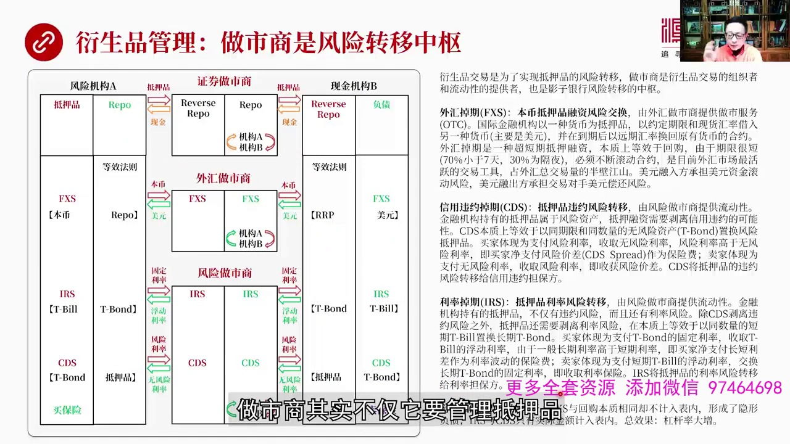

它管理眼生品实际上它就是整个风险转移的中书我们知道眼生品最大的功能最核心的功能就是风险转移所以你做事商在做这个事而且是转移风险的中书那当然所有风险也都集中在做事商眼生品的交易我们刚才说了是为了实现底下...

<strong>All subtitles</strong>

> 它管理眼生品实际上它就是整个风险转移的中书我们知道眼生品最大的功能最核心的功能就是风险转移所以你做事商在做这个事而且是转移风险的中书那当然所
> 有风险也都集中在做事商眼生品的交易我们刚才说了是为了实现底下品的风险转移做事商是这个眼生交易的组织者也是流动性的体用者当然也是影子银行风险转
> 移的中书它涉及到几种风险转移首先是外汇掉漆还有信用围掉漆还有利率掉漆在这儿我画了一张简单的图比如说这个我们刚才所说的普通的回够我们知道做事商
> 分极种证券做事商外汇做事商风险做事商证券做事商就是我们刚才所说的A机构像B机构借钱底下品底下给做事商做事商以这儿当然它的借据被做事商拿来当成
> 它的资产底下品被做事商拿来再转底下然后再发行做事商自己的收据然后支付给机构机构币机构币把做事商的收据当成资产收到这另外把它的底下品通过要么是
> 三方清算通过回回够的清算行梅龙银行存在梅龙银行上伙上要么是做事商来自己来做清算把这个债券转给机构币好这个是我们刚才讲的是这一部分好现在还涉及
> 到眼省部分也就是你这个底下品底下品刚才我说了你要想转底你要想转一个别人因为这是资产政策券化的结果那么你这个带有风险人家为什么要收呢就不容易机
> 背市场接受所以你必须要剥离很多风险这些风险包括比如说外汇调期风险比如说利率调期风险还有新闻伟调期风险这都要剥离好这个剥离过程中我们可以看到这
> 是比较有意思了这就涉及到了外汇做似商和风险做似商怎么来进行做事比如说我们来看风险机构现金机构这两者的差别是现金机构非常有钱但是它这个钱没有很
> 好投资的渠道风险机构是它非常需要加短矿要追求收益所以他们俩之间是可以做交易的风险机构把抵牙品抵牙给现金机构获得资金这是一种方式还有呢风险机构
> 它由于持有的这个抵牙品或持有的这个其他的高风险的自然比较多所以它需要做各种风险对冲比如说它如果有外汇借带的话或者说比如说它做外汇调期的话它叫
> 找风险对家来帮它承担外汇调期的风险当然现金机构来跟它对之做所以这个外汇调期相当于一个保险或者说相当于外汇保险之下的抵牙融资这就要设计到什么叫
> 外汇调期了外汇调期实际上是以本币抵牙品继续融资然后这种融资设计到风险交换就是风险机构A用比如说韩元为底去向现金机构B去拆借美元所以它等效率在
> 这里我们使用了配理梅林的等效原则这是它的本币韩元然后是它的收据然后支付给做事商像做事商借美元做事商再把这个收据以它这个收据作为资产再生成自己
> 的收据把韩元转移过来再支付给机构B机构B收到这个收据之后把它作为自己的资产同时把美元支付给对方所以这个等效原则我们可以看到机构B把外汇做事商
> 的合约形成一个资产然后它把美元借个对方这中间涉及到什么呢涉及到融资的涉及到外汇吊漆中间的很多具体的融资的细节比如说什么叫外汇吊漆它就是以本币
> 抵押来借外壁来借主要是借美元的一种风险的交换这两者之间是A和B之间是交换风险的外汇吊漆当然这是由外汇做事商来提供做事服务主要是OTC跪它交易
> 也就是A机构以韩元作为抵押品然后用约定的期限比如说7天然后线会线获得这个会率借入美元然后再到期的时候7天之后然后我们约好远期会率然后换回韩元
> 我先用韩元去借美元到一个星期之后我们再用约定好的会率再换回来那么外汇吊漆实际上是一种超短期融资就是以本币作为抵押去借外壁借美元主要是所以它本
> 质上抵它本质上跟回购是一样的当然期限是很短我刚刚所说70%的外汇吊漆都小于7天70%是隔夜所以我们知道回购中间是有风险的这个风险体验在滚隔夜
> 是有自行滚动风险的万一市场不好你想再滚动是滚动不了这就出问题了当然外汇吊漆是市场上最活跃的外汇市场最活跃的交易工具现在占外汇总交易量的一半那
> 么这个时候双方的风险对于机构A来说那就是我到隔夜滚动的时候滚动不了在美国这边滚动不了美人滚动不了这是一种风险还有对于机构B来说我借给你美元你
> 到时候如果你那边闹美人滑你还不上怎么办要说金融风爆售那当然韩国很多银行还不了或者像现在这个这个英国和美国比如说英国养老金它跟美国这个做货币互
> 换的时候做这个外汇吊漆的时候也有这个问题我们在威克上面专门检过他们要跟黑石因为养老金要卖率的保险给黑石当然他首先得做外汇吊漆因为他没美元但是
> 到时候你还不上怎么办所以机构必要承担一个风险就是交易对手委约怎么办美元尝环出现风险怎么办所以这是一个双方的所各自承担的抵押品融资的风险还有信
> 用围吊漆风险机构你要持有这个抵押品你可能还会有或者签了风险资债你还会有信用围约的这样的风险你想把他也玻璃掉所以你需要买一个信用围约的保险从哪
> 买呢从机构币从他这来买当然你并不是直接从他那买大家所有的交易一定要通过做折伤你要找风险做折伤去跟他说我要一个保险来保证我抵押品出现委约你来陪
> 我风险做折伤说OK没问题我可以帮你做这个事好我以你的这个合约作为抵押我在生成另外一个反向的合约然后我再跟机构币做实际上最终结果是风险做折伤把
> CDS直接传导过来实际上是A和B在做做折伤只是在中间做一个拼合那么实际上我们可以看到机构币就是卖保险的首先卖外汇保险然后卖信用围约保险这一侧
> 风险机构都是卖保险的这个关键CBS怎么来理解CBS它在它的主要功能是底压平纹约风险也要转移走就是我风险机构为承担了很多我持有大量的底压品这有
> 纹约风险我想把它把所有风险纹约的这种风险全部转移转移到B这来好那么根据等效原则配里面临的等效法则CDS等于是你用一个有风险的资产去制换用这个
> 有风险的资产去制换一个无风险的资产比如底压品你要是NBS30年的然后金额是一个议那么实际上你需要找一个单保方来给你做制换就说我一旦我持有这个
> NBS出了问题纹约了那么你能不能给我同期线也是30年的然后完全没有风险的国债呢实际上它是用两个对等的资产进行制换风险机构想找一个风险对家说你
> 如果当这个我的持有这个资产出现纹约你把无风险资产换给我我把有风险资产给你不就完了吗好这些风险机构所要买的保险CDS好 卖保险这个人正好相反就
> 说他要用一个无风险的资产去交换有风险资产如果出现纹约的话所以双方的等效的这个等效的这个根据等效法则他资产风险表看起来应该是这样卖保险的是什么
> 呢也就是我资产持有的是所谓无风险资产美国长级国债跟抵亚品同期线的抵亚品是有风险的NBS好这个对于风险机构的而言这意味着什么呢意味着我的资产这
> 边我的收入是一个比较低的收入因为它是固定的它是一个长级国债的一个收入而有风险的抵亚品它肯定收约率要高所以我的资产的收约率低而我复债收入这个支
> 出的利率要高所以对于我来说现金流肯定是往这边流的就是我要支付风险利率这是较高的利率我收获是无风险利率就是国债的利率所以这个高这个低资金是这么
> 流过来的好这就是对于机构为来说我相当于支付保险金给机构机构并机构并是卖保险的卖保险这边持有的是风险资产所以对应的是无风险资产好高风险资产带来
> 的收入高这是风险率的高这笔钱是我的资产我收入了我支出的我的负债方相当于我支出的是无风险利率这个比较低所以对于卖保险的机构并而言我的资产的收益
> 大于我负债的支出也就是说我的我用一个叫低成本的方式进行融资获得了较高收益的资产当然对我来说是赚钱的这就是它收货的保险费这就是最根本的卖保险卖
> 保险这两方最根本的差异实际上支付着什么风险机构为支付的是高风险资产和无风险资产之间的信用立差这么支付过来的它收入卖保险的收入这个保险费也是这
> 个立差这是二者之间的根本区别所以根据等效原则我一下我们一下可以把这个资金流还有双方的资产费的表给画得很清楚否则的话如果没有等效原则你这儿就很
> 难算了清楚了就很难直接一目了然的看清它背后的真正的底层逻辑除了买CDS这个保险这个CDS当然是吧伟约的风险从机构A转向的机构B买了它的伟约风
> 险转移过来了除了这个风险之外还有一个风险就是利率风险利率会波动你要得要品这个这个东西要真正实现转移的话不仅有外汇风险如果你是外壁如果是做有外
> 壁业务的话不仅有外汇调期的风险不仅有新委员的风险还有利率风险利率风险根据等效原则又可以支换成一个短期的国债和长期国债的资产复债也就是说对于买
> 风险的人而言它支付的从这支付的是固定利率长期国债支付的是一个固定利率它的资产这边收入是个浮动利率那么我们知道固定利率和浮动利率浮动利率短期所
> 以它应该比较低而固定利率高我就是支出要多于收入那显然现金流是这么流过来的通过风险做事上流到了机构壁机构壁这边正好跟它相反我的资产是长期的或者
> 叫收入是固定的一个利率偏低而这个偏高而这边我支出的是一个浮动利率是短期的所以对于我来说我收入高而支出低卖保险的收的是这个保险费这就是通过这个
> 外汇调期讯委调期还有利率调期是三种方式风险机构能够成功了把自己持有了抵押品这些所有风险全部转移到壁杖而对于壁来说它持有这些它卖保险的主要目的
> 是为了获得额外的收入因为这是保险费这是保险费现金流都往这边负当然我就赚钱了这就是双方一个它为什么要做金融交易的一个主要的动机那么眼上品的效果
> 是吗当然总的效果一定是加干干因为外汇调期和回够本账是一样的但是回够是要记住资产费表的而外汇调期不用外汇调期被记得表外所以它会形成隐性负债RS
> ,CDS只有实际经额计算而不计算它的风险长口其实如果说我们在配理梅林的等下原则把这个数直接填进来的话这个资产费表会变得非常大实际上是一个很大
> 的资产费表因为它中间设计要大量的风险长口但是由于现在机场方法这些东西就只剩合约上的这些真正成交的几个那很小所以感觉起来资产费表很小实际上很大
> 那么这就意味着如果是一张很大的资产费表你这张风险机构有多少最有资本金呢你搞这么大张表你的干盖那不是变得非常大了吗所以金融眼省品的一个很大问题
> 是它加大了尴尬率好我们再看下一那么做实商实际上是整个美国货币市场跳动的心脏

---

### Slide 8

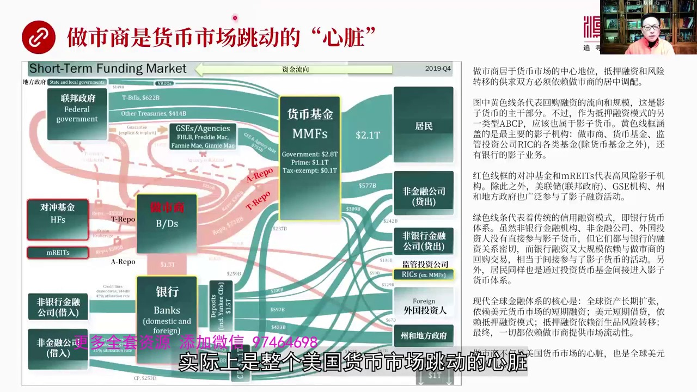

如果我们看这张图可以看得非常清楚做实商在这里所有的资金运动基本上都是围着它的进行我们来看这是美国短期借贷市场资金这边是从右流向左这边是所有储序方这边是所有的贷款方或者需要资金的这边是优有资金的所以资金...

<strong>All subtitles</strong>

> 如果我们看这张图可以看得非常清楚做实商在这里所有的资金运动基本上都是围着它的进行我们来看这是美国短期借贷市场资金这边是从右流向左这边是所有储
> 序方这边是所有的贷款方或者需要资金的这边是优有资金的所以资金是从优有资金这一方储序方流向的借贷方从右流向左那么我们可以从这儿看到有最明显的是
> 有一些有一些影子机构当然最重要核心部分是做实商做实商我们可以看到连接它的线都是一种黄色的线条为什么是黄色线条这都是抵押融资它的特点你看我们这
> 儿看到它跟货币市场基金这个是锐破融资上面多少钱7381T锐破主要是两者之间比如说做实商以国债作为抵押向货币市场借钱货币市场的资金留给做实商做
> 实商在分发给对中基金或者M-reitz或者其他的需要借钱的包括银行在内包括政府政府里面也包括美联储等等这个是一种还有我们可以看到GSE两房跟
> 它之间当然也是有抵押的也是有这个抵押融资的比如说以两方债为抵押进行融资联邦政府美联储或者财政部你要卖国债当然也是做实商帮你卖做实商拿到国债之
> 后它自己并不电自己的钱而且以这些国债作为质押再向货币市场借金和其他有钱的机构比如说银行再向他们融资他才能建立一个比较大的库存来这个帮政府卖国
> 债所以银行跟做实商之间也有大量资金拆解关系比如说银行在很大程度上他的资金也是要从做实商上借的其实就是银行发行锐炉以国债作为质押向做实商借钱做
> 实商再把这些锐炉再把这些国债通过锐炉形式再发行给货币市场借金然后实际上是货币市场借金通过做实商到了银行有时候也反过来这样流或者反过来这样流那
> 么我们会看到整个这套体系是一个以做实商为中心的这样一套体系那么做实商是在整个货币市场的中心地位抵押融资和风险转移的供求双方都必须要依赖做实商
> 居中协调黄线这就代表抵押融资当然这在这里主要是回够融资它的流向还有规模这是影子银行的最主要的部分不过在我看来还有一个应该算抵押融资没有被划进
> 来就是商业票剧ABCP自产抵押的商业票剧我们看到通过银行经过商业票剧发行给货币市场借金这个应该也是黄线因为它是属于抵押融资按着我们的定义这就
> 叫影子货币如果要划钱这个线也应该划钱这是2019年第四季度所有的各种融资方式的金额还有它的规模还有它的性质黄线线框涵盖的主要是影子银行的机构
> 比如说做事商这是黄线但是它有一半是不同的颜色这代表它有一些其他的业务货币账基金当然也是影子银行的重要的组成部分还有监管投资公司RSERSE是
> 一种通用型的就是一种公司实际上各种基金都是属于RSE货币市场基金除外他们也要做大量的跟做商做大量的这种抵押融资的借款它是借出方把钱借给做商做
> 商的基金分派然后这些都是影子银行的主要参与方红色线框的这边对中基金还有Amrits这肯定是高风险的所以它化成红色线框当然连方政府每连处JSE
> 还有周和地方政府在这这些也都是参与影子银行业务的那么绿色线条绿色线条代表是传统的业务传统业务就是所谓的信用融资就是影行货币体系这是用的绿色线
> 框虽然很多飞银行金融机构还有飞银行公司飞金融公司还有外国投资人他们并没有直接参与我们看了这些人并没有直接参与外国投资人并没有直接参与这个影子
> 银行业务但是实际上他们是通过影行因为他们都跟影行有很多资金来往这项银行借钱这也要项银行借钱这边要把钱投给银行存到银行他们实际上是通过银行跟影
> 子银行体系跟影子货币体系发生关系银行会把这些资金跟坐着商进行拆借或者跟坐着商之间进行回够的融资所以这些表面上没有参与的金融机构也通过银行间接
> 参与了货币银行影子货币银行除此之外居民居民也是间接参与的因为居民这个部分是通过比如说他们投了21000亿的美国美国的货币市场基金居民是通过投
> 资货币市场基金来参与到影子银行业务中间来的所以通过这一张图我们可以非常明显地看到坐着商整个就是美国货币市场的跳动心脏而现代全球金融体系的核心
> 是什么概括起来就是全球资产的长期扩张依赖美元货币市场的短期融资全世界外围的所有人都是通过这个市场来借钱的美元躲机借贷又是依赖抵押融资模式依赖
> 这个黄线这个模式而抵押融资模式又是依赖掩盛品风仙转移因为抵押融资掩盛品风仙转移不出去这就没法融资所以最终一切都要依赖坐实商为市场提供流动性我
> 们看到全世界这么多国家这么大的资本市场要发展其实最终的资金是源于这所以坐实商非常重要它不仅是美国货币这样的心脏也是全球美元还流体系的心脏它要
> 是出了问题全世界的金融都会出问题这就是我们建立了对影子银行的深刻理解之后你就知道美国这21家21家一交一商他们的地位和他们的重要性在现在金融
> 中间是何等的关键好 我们再看下议这个是关于什么是影子货币的一个大体介绍

---

### Slide 9

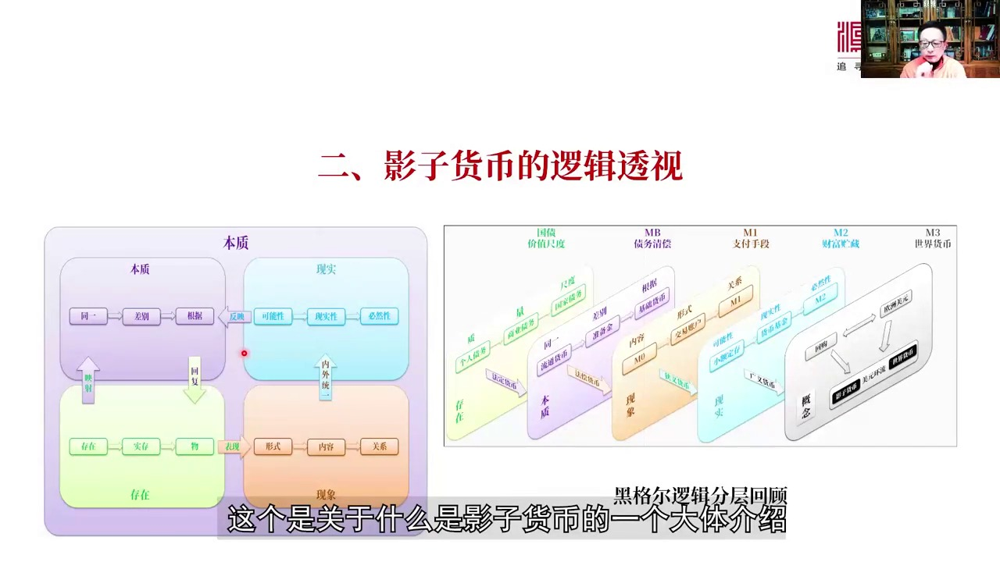

我们现在看第二部分第二部分是我们对影子货币有个大体了解之后现在需要更仔细的进行逻辑分析这就是影子货币的逻辑透视当然在这里我们就要用黑耳逻辑分层一层一层一层的来分析影子货币的它应该怎么来分层解析在这里我...

<strong>All subtitles</strong>

> 我们现在看第二部分第二部分是我们对影子货币有个大体了解之后现在需要更仔细的进行逻辑分析这就是影子货币的逻辑透视当然在这里我们就要用黑耳逻辑分
> 层一层一层一层的来分析影子货币的它应该怎么来分层解析在这里我们以前核心特别专门讲过黑耳的小逻辑在小逻辑中间讲到存在讲的本质讲的概念当然我们今
> 天所设计的主要是本质这个部分我们知道从存在到本质再到现象再到现实这个轮回中间设一个很多关键的环节比如说存在就是从存在实际上硬设到了本质本质它
> 有三个重要的环节同一差别最后走向根据再从根据到后来回复到存在然后张显成现象现象有包括形式和内容的先互转化最后变成关系通过关系在进入内外统一进
> 入现实而现实中当然现实一方面是本质反映一方面它有可能性现实性最后走向必然性从必然性最后跳到概念的层次这个是大概黑耳小逻辑对于哲学对于它是小逻
> 辑是一种我认为是一种代表西方明所能够达到了最高的哲学层次它把万事万物的普遍规律概括成一系列的矛盾运动概括成一系列变成运动然后无论我们谈的是什
> 么领域的问题包括我们说的影子货币包括任何领域都可以用这个通用的思想方法和通用工具来进行解析这是我觉得相当牛的地方因为让我们想想一下你要提练一
> 套概念提起提练一套哲学和逻辑要能够概括人世间的万事万物概括所有学科所有领域是一种通用的思想工具这个事怎么做呀黑格尔它的做它的这个小逻辑提供了
> 一个非常好的分析方法或者叫通用思想工具有了这套工具我们可以解析所有的事物这就是为什么黑格尔我们用了一年世界来深入研究当然我们跟可能专门研究哲
> 学人又不一样对他们来说可能满足于背住了黑格尔很多结论对于我们来说其实要深入理解之后关键是拿来用如果你不会用实际上你没有真正掌握而在用的过程中
> 在不断去反向思考它这个体系或者这个工具在这里好不好用在那里有问题为什么有问题然后才能更加深入理解这个黑格尔思想体系当然最重要并不是为了了解它
> 最重要是要发明创造我们自己的新的体系怎么发明创造没有别人没有前人努力你不能凭空创造你也不可能从轮子开始发明一直到现在文明内所有的一切这不可能
> 所以一定要借钱人借钱人的经验和现有的思想工具然后进行组合创新我们也用这套逻辑分层的方式分析过美国的银行货币就是传统银行货币我们把它分成了五个
> 逻辑层根据存在本质现象现实到概念分成了价值尺度债务清长支付手段财富住藏还有世界货币这其实就是马克思提出的五个货币属性我们通过黑格尔的思想其实
> 马克思跟黑格的思想或者叫它的辩证逻辑是寄成黑格尔的东西但是它把维吾主义加进去跟黑格尔的微信的核心本质不太一样所以我们其实可以看到马克思这样来
> 提到货币的几大属性而我们在以前学的学金融的时候或者学教科书的时候往往是死际隐备我们觉得什么支付手段财富教堂货币还有战争尺度好像没有前后顺序好
> 像没有关系其实有比如说战争尺度就是存在没有这个存在其他一切都谈不上所以它是叫第一属性然后债务清长或者叫马克思在商品货币中它用了交易媒介在银行
> 货币中当然是变成债务清长然后这个是属于本质层是最重要的本质层本质章显为现象变成支付手段支付手段在走向现实成了财富住藏财富住藏在往前发展变成了
> 世界货币实际上马克思所列出的这种概念我们需要经过变正思想推导之后我们知道它是有逻辑顺序的不能够轻易地变到它的顺序我们现在要用这样的一套思想方法分析影子货币我们看下眼首先我们要探讨存在层

---

### Slide 10

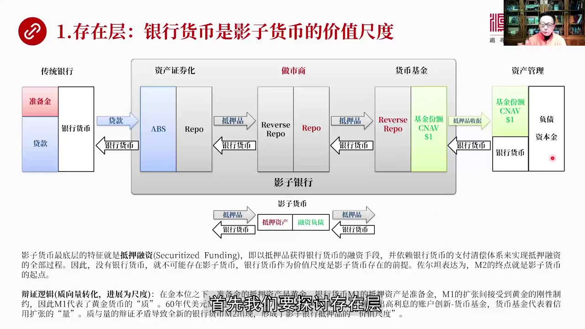

存在层什么是影子货币的存在这个层次的这个层面的最根本的东西我的定义是影子货币是这个银行货币是影子货币的价值齿度就是首先你得有银行货币没有银行货币就不可能有影子货币这是它的第一属性为什么这么说如果我们来...

<strong>All subtitles</strong>

> 存在层什么是影子货币的存在这个层次的这个层面的最根本的东西我的定义是影子货币是这个银行货币是影子货币的价值齿度就是首先你得有银行货币没有银行
> 货币就不可能有影子货币这是它的第一属性为什么这么说如果我们来看这张图传统银行当然简单自然货币就准备进行货币好自然争军化之后我把货币打包做成比
> 如ABS在做过程之中我需要融资融资把ABS作为底压品交给做成商做成商以底压品再发行自己的回够然后再把这个底压品传统给货币市场基金货币市场基金
> 把做成商的Raport当成Reverse的对付当中它的资产它来发行基金份额基金份额的卖给谁呢卖给资产管理公司资产管理公司拥有基金份额相当于资
> 产管理公司收到了底压品的收据那么与此同时资产管理公司的现金就是影行货币交给了货币市场基金货币市场基金给了做成商做成商传统给资产中军化的过程最
> 后到了影行影行卖贷款收回的资金这样的一个过程中如果我们进行体验不就是这样的一张图吗减化起来来看影子货币抵押资产和融资负债这是做成商所发行的或
> 者以做成商的事要来看那么这边收到底压品我这边写张借条然后再把底压品转底压出去然后收到影行货币我再把它还给我的再把它传给这个底压融资方所以我们
> 来看从这场简单图来看就是底压品和影行货币这两者是密不可分的如果没有影行货币这一切都谈不上所以这个就叫他是他的第一属性或者叫存在如果不存在影行
> 货币就不会存在影子货币所以我们来看影子货币最底层的特征当然就是底压融资这是我们刚才曾经经压也专门讲到了就是以底压品或者影行货币的融资手段并且
> 依赖影行货币他的支付清爽体系来实现底压融资的全部过程这个影行货币怎么传导你还需要传统影行的支付清算体系前他过得来所以没有影行货币就不能存在影
> 子货币影行货币作为价值尺度是影子货币存在的前提用拙谈的表达方式就是M2的重点是影子银行的是影子货币的起点这个表达我觉得比较的简单而且一听就懂
> 那么如果我们做辩证分析我们在这里不仅需要看到邏輯分层而且要用黑格尔斯路把每一层中间的辩证运动的过程描述出来那么在存在程实际上是智像量的变化最
> 后进展为尺度大家还记得我们的存在论智量和尺度三者之间的转化就是由智转变成量然后再往前就是进展为尺度那么这句话怎么来理解在影子货币中我们可以结
> 合历史背景来对它进行解读比如说在金本卫之下准卫金的抵押资产是黄金我们知道以黄金是在金本卫之下黄金是资产准卫金是负债现在当时替华人国债是资产然
> 后准卫金负债反正准卫金是待在负债房所以黄金的收据是准卫金那么银行货币的M1又是在赢行资产负债表现准卫机又是它的资产银行创造银行货币M1又是它
> 的负债所以我们可以看到这个逻辑关系就是以前在金本卫之下这个准卫金背后的抵押资产是黄金那么银行货币是一样通过准卫金间接是被黄金穿定的或者叫索死
> 的这就意味着M1的扩张间接受到黄金的钢性制约因此M1代表了黄金货币的质或者叫金钱的质它的本质代表它是个内核内涵当时60人代我们看到美元超发M
> 1过度膨胀导致70年代出基本卫解体然后催生出了很多由于Q条款不让很多支票账户给利息后来催生出了很多高利息的账户创新其中也包括货币基金也是那个
> 时候创新出来的新人在创新出来的货币基金账户还有货币基金这个理念所以货币基金代表着信用货帐的量我们讲过佩里梅林讲它的理论货币曾经理论就是金钱是
> 资产你这个信用是负债金钱制约着信用因为信用是负债负债负债但是清朝要靠资产要靠金钱好如果我们说这个M1一开始是代表黄金这种质那么当它货帐到了M
> 2然后到了这个货币市场基金的时候实际上它就越来越体验出量就是信用货帐的量这个概念了所以质和量它是存在变成矛盾的就是这个黄金它是有收缩和纪律作
> 用而信用这个量是有膨胀的这样天然的本能两者之间是会发生矛盾的这种矛盾运动最后导致是金本位的结体出现了全新的铃行货币M2青年代弹成了M2的概念
> 青年以前不存在M2只有M1所以M2出院之后它就进展到了新的一种货币或者新的铃行体系铃子铃行体系它的一个价值耻度了铃子铃行也是那个时候出现的铃
> 子货币也是那个时候出现的所以M2的出现是铃子铃行底压品的价值耻度这就是它变正逻辑的表述我们再看下一页本质层什么是铃子铃行的本质当然铃子铃行的本质在我看来

---

### Slide 11

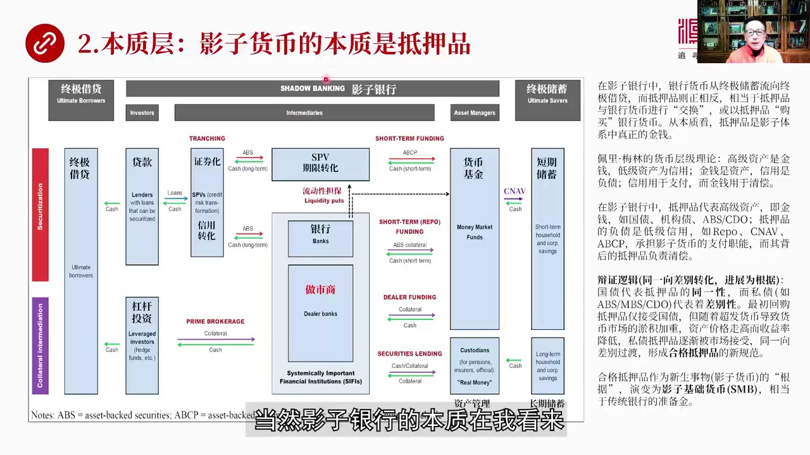

它就是背后的底压品如果我们从这张铃子铃行稍微回顾一下这个跟我们上阶客讲的大同小艺这边是中级处区方这边是中级界的方处区方短期处区长期处区然后现金是这么流过来的现金是从处区方从右向左流到界代方而界代方这边...

<strong>All subtitles</strong>

> 它就是背后的底压品如果我们从这张铃子铃行稍微回顾一下这个跟我们上阶客讲的大同小艺这边是中级处区方这边是中级界的方处区方短期处区长期处区然后现
> 金是这么流过来的现金是从处区方从右向左流到界代方而界代方这边资产底压资产或者底压品是从左向右进行流动的这个说明一个问题就是在铃子铃行整个这个
> 运作过程之中铃行货币是从中级处区从右向左流向中级界代而底压品正好相反这意味着什么呢这意味着底压品在跟铃行货币进行交换或者说所有交换都是购买或
> 者说我们用一个更直接的说法就是底压品购买铃行货币因为交换你用离换一个桃你可以说我是用离支付购买桃直到我们最后进化出了货币黄金我们其实也可以表
> 达成我用几个离子换一颗黄金或者说我用几个离子购买黄金但是人们一般表达习惯是用黄金去购买其他东西本身是一样所有的货币其实都是某种商品都是所谓购
> 买就是交换从这个议来讲我们看到在整个影子银行体系里面是底压品和铃行货币在互换实际上货币可以说是底压品在购买现金所以底压品支付然后买后来现金那
> 么根据配理梅林的货币曾经理论高级资产是金钱低级资产是信用金钱是资产信用是负债信用主要用于支付而金钱用于清长这个表达了非常清楚那么在影子银行中
> 间底压品代表着高级资产比如说国债机构债还有ABSCDO这些东西叫金钱因为它是资产那么这些资产所对应的收据或者叫底压品的负债是低级信用比如说r
> epo回购比如说货币市场基金贩额ABCP这都是收据凡是收据的都叫信用真正金钱是收据背后的底压品那么这些收据实际上承担了影子银行的支付功能背后
> 清长是靠这些底压品来做的所以我们想象一下当你说到影子货币手影子货币是什么是收据收据所对应的东西是什么是底压品底压品是资产收据是负债这就是影子
> 银行那么我支付收据的时候收据是用于支付的我支付收据的时候别人之所以接受我的收据是因为我会把底压品给它它才会接受这个收据就像传统银行我之所以接
> 受银行转账是因为当老百姓不知道但实际上银行的人都知道是因为我获得了银行转账之后我就间接获得了央行准备金那个东西是银行的钱裸剂底层裸剂是一样的
> 所以影子货币本质是底压品而回购负债还有ABCP或者其他的这些东西还有这个货币金份额这是支付手段那么这个变成裸剂怎么来理解其实就是本质的变成规
> 律我刚才已经讲了本质包括什么呢包括最重要的定律或者最重要的规律是同一向差别转化然后进展为根据那么怎么理解这个话国债其实代表的底压品的同一性就
> 国债都一样他的都没有违约的风险都是财政部发行的所以他的信用最高私债不管你是ABS,NBS,CDO这都代表着差别因为他千差万别不同的公司发现了
> 不同的私债那么在变证运动了一开始在早期阶段70年代刚刚出现回购这个业务的时候或者回购的早期这时代回购底压品他只接受国债这代表的同一性但是货币
> 越发越多出现了智障80年代、90年代继续超发货币一直2008年精神危机前越来越多利率越来越低怎么办资产收益越来越差越来越差的话国债也不够了这
> 个时候大家开始逐渐考虑接受私债因为私债的收益率比国债高所以大家开始慢慢接受私债所以这就代表了市场从同一性向差别过度最后各种各样的私债放在一起
> 总能有个规范吗这就叫合格底压品建立了新的规范合格底压品作为新生事物也就是作为影子货币的一个新出现的东西这就变成了像未来发展的一种根据也就是未
> 来新发展东西是要基于这一点的合格底压品的那么这种根据往后逐渐也变成了影子基础货币就是SNB相当于传统银行的准备金我们知道也就是事务变化你的根
> 据从哪来你的根据实际上是从合格底压品来那么你要向哪去这是你的发展的根据这是你向未来进化的根据要向哪去呢未来就要往就是演变成了基础货币之后那么
> 再往后就要派生出支付手段了所以再往后一个阶段支付手段实际上建立在根据之上建立在合格底压品来根据之上我们看下一件这就是现象层现象层就是支付手段就是所有本质都要通过现象

---

### Slide 12

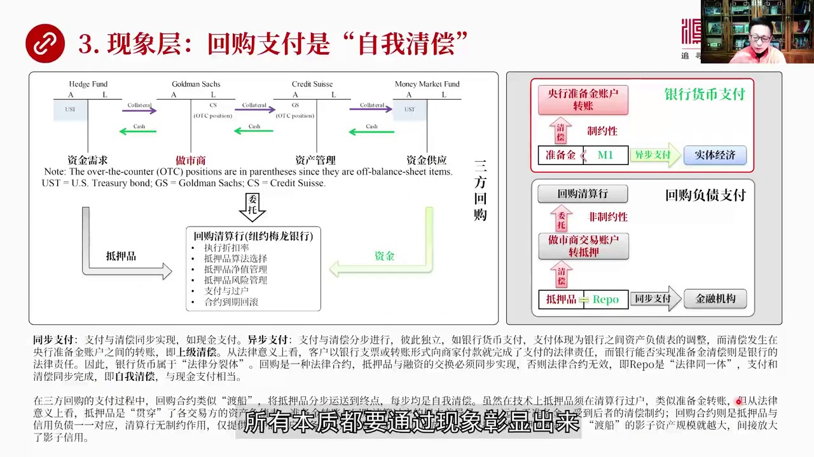

张显出来本质是清长是底压品底压品要做清长那么现象当然是支付第一个支付第一种方式就是回够支付当然还有一种方式ABCP也是一种我们可以说也是一种潜在的支付手段那么从回够支付角度来看我们可以看到回够支付它的...

<strong>All subtitles</strong>

> 张显出来本质是清长是底压品底压品要做清长那么现象当然是支付第一个支付第一种方式就是回够支付当然还有一种方式ABCP也是一种我们可以说也是一种
> 潜在的支付手段那么从回够支付角度来看我们可以看到回够支付它的本质是什么我称为是自我清长如果从这张图上来看比如说一个对冲基金这中间是做日商高胜
> 然后这般资俩官的公司瑞信这边是货币市场基金这四者之间的关系比如说需求资金需用方当然是对冲基金永远缺钱它把国债作为底压支付给了做日商做日商以它
> 为底压以这个底压品为转底压再发行自己的这个回够支付给了资产官的公司当然同时资产也跟着过来了然后资产官的公司再发行回够带着底压品再到再运动到货
> 币市场基金货币市场基金持有这个回够作为它的资产同时发行贩额所以贩额是支付给资产官的也是支付给其他资产官的公司所以支付我们得看这是一种支付回够
> 在货币市场基金这儿体验为另外一种支付就是基金贩额发行或者发行基金贩额这两种是支付手段或者我们称之为是一种支付现象好那么我们刚才所说整个这种交
> 易往往是要委托第三方的所以这叫三方回够第三方就是要委托回够清算行纽约没龙银行不管是谁吧你只要要做三方回够抵押品要抵押在这然后资金要抵押在这要
> 把抵押品和资金全部要在这进行倾算回复倾算行呢它主要执行比如说折扣率它来定这个它来执行完成折扣率的执行比如说抵押品你这个对中基金把什么样的国债
> 是一年期的还是五年期还是三年期的它还有个抵押品的算法这个算法会自动帮你选最合算的比如说你要抵押一年期的这个债它会帮你选哪个发行序号的然后它流
> 动性怎么样对于那时候最划算它有个抵押品算法它会帮你自动的选抵押品帮这个对冲基金当然它帮所有人都可以做这个事然后抵押品禁止管理如果你抵押抵押品
> 如果贬值了利率上涨了你这个抵押品贬值怎么办它会让你它会通知发出这个警告告诉座商应该让它居家保重金了还有风眼管理一旦出现了伟约如何如何它也要发
> 出警告所有跟它连通的机构都会掉用这种服务然后来查询或者推送这种警告服务还有它要帮你完成支付也就是现金从这个客户转给另外一个客户过户把抵押品从
> 某个客户转给另外一个客户当然还有合约到期回滚就是七天的两天的隔夜的到了期限转奔回来抵押品回环现金加利息支付完成所以这个过程这个就是三方回够所
> 要做的事那么在这个过程中实际上如果我们对比银行的支付其实也非常类似我们先让到银行它支付这个比如说支付M1实际上背后是带着它实际上是要用准备进
> 来清算所以当你支付M1给实体的时候实体它的银行是另外一家银行就会发出指令然后让银行把这个准备金转到另外一个这个银行所以当一家银行支付的时候它
> 一定会它的准备金一定会损失掉在央行准备金被转走这叫一部支付回够支付跟它不一样回够是同步支付比如说回够也是抵押品和收据回够是一次进入支付过来就
> 像现金一样它是一张合约所以它是同步支付跟现金支付是一个道理而银行少分两部M1先支付然后另外一部单独的分部的是夭央行来进行清算然后这边虽然理论
> 上也存在着这个过护的问题但是实际上回够有清算行并不制约过护这件事我们一会儿回够逃来再说这个问题所以这就涉及到一个什么叫同步支付什么叫一部支付
> 同步支付就是现金和清长就是支付和清长同步是现一起完成现金支付是最明显的意思当我们要买东西的时候你把现金给对方对方一收东西拿走完成了但是如果你
> 用银行刷卡的话就不是怎么回事或者要刷微信支付就不是怎么回事是要分成两部也就是你刷二维码用这个用支付或者微信支付实际上这是涉及到两个银行之间的
> 转账就是如果你是开户行是工商银行商家是建成银行实际上你刷二维码发出的指定是工商银行要把一笔权装给建成银行这两个银行要做资产负责表的调整同时还
> 没完事他们俩要调整的话必须要通过央行准备金账户要帮他们做清算所以一部支付他的支付和清长是分布进行的彼此是独立的就像这个银行货币支付的时候支付
> 体现为银行之间的资产负责表的调整而清长发生在央行准备金账户之间的转账其实这就是属于上级清长银行本身清商不了必须要上级央行来清长那么从法律议上
> 来看客户比如说我写银行支票支付或者我转账或者二维码向商家支付我只要账上有这么多钱我这么一笔钱就转过去了这个支付我的法律责任就完成了但是银行能
> 不能实现准备金清长这是银行自己的法律责任比如说有一家特别不靠谱的银行我确实在在这儿存足够的钱但是我在转账过程之中银行由于他特别不仅慎干领特别
> 高以至于他在准备账户中没有足够的钱我转100万但是好准备账户上没有100万只有90万这个银行那就叫发生了几对他就出问题了但是这不是我的责任不
> 是客户的责任是银行的法律责任所以这是两个法律主体产生了两个责任这叫异不清长所以银行后面他天然属于法律的分裂体支付和清长这分别属于两个法律上的
> 实体这边完全没问题但是另外一边有可能出问题导致整个支付失败回够他就不一样了回够是一个完整的法律合约抵押品和融资的交换必须同步完成否则的话这个
> 法律合约就无效你就没法进行这个事儿没法进行所以回够是法律的同一体而不是分裂体支付和清长是一步完成的同时完成的所以这叫自我清长这个就与现金支付
> 是完全一致在这么多关于回够中间的认识中我觉得我还没有看到谁是从法律角度来看这个回够支付它实际上是一步清长这也是为什么做个这个左尔坦它一直觉得
> 影子一样没有支付因为没法清长没有发生清长实际上我认为发生了它叫自我清长那么在三方回够支付过程中我们看到这个回够这一步一步的回够就好像是度传样
> 的从这家公司有所传过了一条盒把你把底下品运到另外一个口碗然后底下品又上了一条传再从高盛运到了瑞信这是另外一条传然后下了传之后到第三条盒再换一
> 条传最后运到货币市习近那么底下品是分布运送到重点每一步都是自我清长就是它是通过三个交易完成的每一个交易都是用回够支付拿到了现金买到了现金三个
> 独立的支付每一步都是自我清长当然在技术上底下品还是要在清算银行过户类似准备金转账但是从法律议上来看自战负代表是贯穿了底下品是贯穿了所有自战负
> 代表打穿了准备金转账和回够清算过户的根本差别是什么这两者之间有什么差别是有的在银行的情况之下我们会看到银行真正发行了M1的数量要远远到一条准
> 备金我们知道准备金率涉成10%就是你只有1块钱准备金你可以创造10块钱来M1那意味什么意味着M1要它的数量远远大于它所以当你转账售必须要格外
> 小心如果不放足够准备金转账就会出问题所以由于M1大于准备金央行在转账售对你来说就有清长制约的问题如果准备金不够清长制约支付支付完成不了但是在
> 回够中没有这个问题回够中底压品和它的收据是一对硬的一个底压品只有一张收据所以回够清算行并不是制约性是非制约性我就仅仅是把你过护提供这个简单服
> 务就完成这是两者最本质的区别当然表面上看起来回够一个底压品在对应只对应一张收据这好像没有放大信用不像传统银行这明显是放大信用这好像没有但实际
> 上不一样这个情况不一样底压品可是度了好几条盒而且每条盒上都有一艘传这是三艘传三艘传每条传都是资产的当你转移的过程之中这个资产一直留在资产处在
> 表上所以一个底压品创造了三条度传的资产当然你底压品的转转移压次数越多度传资产的规模也就越大就是影子复债也会变大资产这个复债表的规模也会膨胀实
> 际上这等于是间接放大了应行信用跟应行这就一样我们后面还会说到这个问题好我们再往后看下一我刚才说了这是回够支付还一种货币市场基金支付

---

### Slide 13

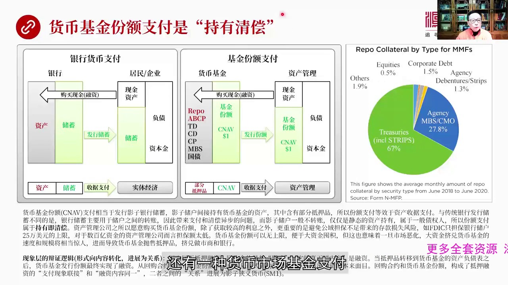

它的份额也是一种支付手段它是怎么清长的持有清长刚才回够是自我清长基金份额支付是一种持有清长因为基金份额是发行给资产管理公司的资产管理公司持有份额相当于就清长了如果我们对比应行货币支付和基金份额支付的话...

<strong>All subtitles</strong>

> 它的份额也是一种支付手段它是怎么清长的持有清长刚才回够是自我清长基金份额支付是一种持有清长因为基金份额是发行给资产管理公司的资产管理公司持有
> 份额相当于就清长了如果我们对比应行货币支付和基金份额支付的话你会看到应行资产货币表这边是它资产这边是这个处序那么实际经济居民和企业这边是现金
> 还有各种资产这边是应行处序这边是复债资本金等等好应行发行处序就是应行实际上是应行支付给你一个签条或者叫收据然后你把现金给它比如说我们存我们存
> 钱把现金存给应行发商的就是这个过程你把钱存到应行这在过去应行会给你一个收据或者叫给你一个处区赏本上会写一个赏你拿那个处医赏本其实就是收据这个
> 过程叫应行发行处序而你把现金支付给人对方变成了对方的资产而你这边呢把应行给你的这个处序本当成你的这个处序好这个叫什么呢这个其实叫这个银行这边
> 是它背后的资产对应它的收据是处去这叫收据支付支付给了事业经济一把现金给了银行形成银行的资产其实对于金金份额来说我们可以看到类似情况也是收据支
> 付在迹金货币市场迹金中它持有抵押资产包括repo回够比如说做事上给它开的回够还包括ABCP资产抵押了商业票剧这都是有抵押的资产像TD银行发行
> 的这个定存包括可转让的CD还有包括商业票剧这些都是无抵押的包括国债这都是没有抵押的所以这叫无抵押的资产这个是有抵押的资产跟这个相对应迹金货币
> 上迹金发行进额一块钱的份额发行给谁当它买了一个当它接受了做事商的回够协议之后它就发行相对应的份额发行给资产管理公司资产管理公司持有这个份额把
> 自己的现金资产转这个交换给它实际上这也是购买现金发行份额购买现金这叫融资也可以理解为购买现金所以这也是一种收据支付因为份额的背后是一部分的抵
> 押品支付给谁支付给资产管理公司那么如果我们看一下这个货币资产积金所持有的一个repo作为它的资产的话包括背后的抵押品包括什么呢但主要是国债币
> 占67%还有机构债MBSCMO大概占7.8剩下就是什么还有企业债还有股票还有各种各样的其他的票剧占比比较小所以我们知道这个货币赏积金持有的r
> epo背后大部分还是国债好我们看到这两者之间的相似性体现在哪就是货币赏积金份额相当于它这个支付这个份额相当于发行影资银行的处去跟银行发行处去
> 是一样的那么影资处户就是资产管理公司这叫影资处户它间接持有货币积金的资产你如果有积金份额你就间接拥有了repo或者间接拥有了repo背后的国
> 债其中它所拥有的这个repo是含有部分的压品的所以份额之负等效率资产收据之负那么与传统银行发行处去不同的事银行处去主要用于处户之间的转账就是
> 居民有了银行处于之后居民和企业居民和居民之间是要用这个账户进行转账的那么当它用转账用来转账的时候就会产生支付和清长异部的问题就是你从一个客户
> A转给客户B转钱的时候就会税到央行异补清算的问题而影资处户一般不转账资金资产管理公司持有金金份额它就一直持有着相当于间接持有repo背后的包
> 括国债和其他两方债之类我持有我就一般不转账我不会这个自然管理公司把我的份额转给另外一家一般不这么干仅仅是静态持有属于一般债全人所以份额支付属
> 于持有进行转账我只要你支付给我收据我拿到了我就相当于已经拥有这个资产了这就有清长了这就有持有进行转账资产管理公司为什么会持有基金的份额呢为什
> 么要这么做呢当然一方面是货币战基金给的利息高一些比存银行更划算更重要的是避免公寓单保不足带来的资金损失比如说资产管理公司我存这个资产管理公司
> 管了100亿美元而银行的储户保险FDIC只单保25万你想想看一家大规模的基金公司我如果把钱存在一家银行这也太不保险了而且你一家公司开10个账
> 号没有在一家银行开10个账号等于一个只拍25万你要这个银行倒闭了我这100亿都没了那会亏亏很散众但是我又不能找一百家银行这么去干那也太累了所
> 以为了避免这种损失这个大的基金公司和大的资产管理公司愿意去购买货币基金份额因为货币基金份额可以无上限这个基金的份额就是便于大基金图级的不过这
> 也带来一个风险由于少数几家资产管理公司拥有基金的大量的份额一旦这少数几家发现市场恶化了他要几对起来就说我不要份额了你把钱还给我这立刻就迫使货
> 币赏基金赶紧卖Ripple卖它背后的抵押资产去找做伤给我赶快把这个我的资金还给我做伤再找他的交易对手去去卖然后就会产生一个资产炮售资产炮售就
> 会导致几对赢行几对做伤所以这对于金身而言还是风险相当大的就是货币基金一旦被资产管理公司所几对那对赢行的冲击愿愿大于散户几对的风险那么这两种知
> 识方式一个是回够知复一个是货币市场基金份额知复都是现象层的我们来看现象层的变成逻辑实上我们从黑蕩的关系中已经看到了就是它是形式像内容转化最后
> 进展为关系怎么来理解这个话其实我们看一个回够合约它主要是用来抵牙融资的而回够合约是抵牙融资的一种形式它的内容是什么它的内容是融资这就是我们用
> 哲学的一个很高的这样的一个概念来具体用于融资用于用的影子货币上形式和内容转化我们这就是哲学的概念形式转化成内容内容转化成形式但是当我们用到具
> 体寿众什么是形式什么是内容这个就需要创造性的哲学的思考和理解力回够合约就是融资的形式而内容就是融资那么当做日常把抵牙品转移到了货币基金的资产
> 货币表转移过来之后货币基金发行份额然后给资产管理公司最终实现了融资这个过程好我们来看这个全过程实际上是从回够合约到货币是让基金份额的发行完成
> 了从形式到内容的完全转化形式什么合约内容是什么当你最后到货币市场基金发行份额完成了你也拿到钱了这个事儿就是从形式到内容已经完全转化了这个时候
> 就张显出了融资的本来面目那么回够合约和货币市场基金份额构成了什么呢构成了抵牙融资的支付现象连接和融资内容同一这其实就是关系这就是哲学在小逻辑
> 中讲了关系它就是现象连接内容同一那么在我们影子货币中支付这是两种现象回够支付还有货币市场基金份额支付这是两种现象连接在一起了融资内容同一就是
> 其实不管是回够还是发行问额目标都是融美元所以它内容是同一的这叫关系这两者之间的关系最后发展进化到了侠义的影子货币就是SM1这就是变正逻辑的推导我们再看下一页下一页就是第四个层次叫现实层

---

### Slide 14

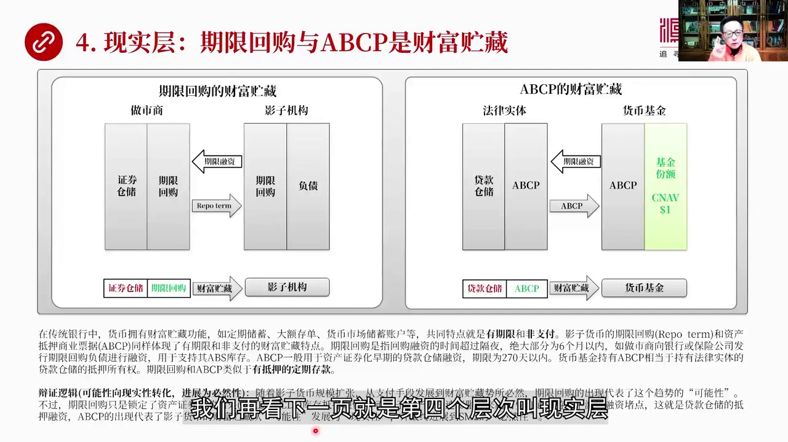

现实层是什么七线回够和ABCP他们代表了财富的住藏影子货币的第四个层次是现实层如果我们来看这张图七线回够这是财富住藏ABCP也是财富住藏七线回够比如说做伤发型七线回够做伤它拥有政权倡厨比如ABCS的政...

<strong>All subtitles</strong>

> 现实层是什么七线回够和ABCP他们代表了财富的住藏影子货币的第四个层次是现实层如果我们来看这张图七线回够这是财富住藏ABCP也是财富住藏七线
> 回够比如说做伤发型七线回够做伤它拥有政权倡厨比如ABCS的政权的倡厨它如果是需要一个一个月的回够七线普通是个业我就需要这一个月来把ABCAB
> S的倡厨尽快地实现它的下一步转化或者卖掉如何如何如何那么我就要发行七线回够七线回够发行给谁呢这个Reveal Term发行给影子机构比如说银
> 行愿意持有保险公司或者其他的某个机构它有钱因为持有这种七线机构利率更高收益更大所以它愿意把七线融资借给做伤这就变成了政权藏厨作为抵押资产发行
> 七线回够的收据这相当于财富助藏发行给了影子机构影子机构持有了这个收据之后获得了更高的利息这相当于一种财富教肠还有ABCP也是一个道理法律实体
> 比如说我要做一个某家银行要把三千米贷款做成一个倡厨然后让一个法律实体管理它这个法律实体以它的名义发行ABCP这就是贷款藏厨ABCP方式进行融
> 资ABCP卖给谁卧比市长基金我们刚才已经说了它持有当中资产然后向它提供七线融资因为ABCP实验有的实验表长277线之内所以这也是个长期线的融
> 资教长期线的融资它的形式就是以账厨以贷款藏厨作为抵押发行ABCP这实际上是一种财富教肠的作用发行给货比市长基金好我们来看这个说明实际上在传统
> 银行中货币具有财富住藏的功能比如说定期存款大额存单还有货币市场这个货币市场的主席帐货等等这都有一个共同的特点就是有一定期线不能动而且不是拿来
> 支付的就是有期线和非支付是这种财富住藏的货币就是MR的很多这个共同的特点就是有一定期线的非支付的定期的出去或定期的存款那么影子货币它的期线回
> 够还有ABCP跟它的道理是一样的它也是有期线的也不是用于支付的因为支付是隔夜的回够或者是这个基金贩额基金贩额随时都会对线所以它比隔夜还要强它
> 的对线性还要强所以ABCP和期线回够是带有财富住藏特点的某种意义上等于定期出去期线回够就是回够融资的时间超过隔夜大部分在6月以内那么ABCP
> 是期线上270以内货币金持有ABCP相当于持有法律实体的贷款仓储的这个抵押所有权这两者都类似于什么呢它从性质上类似于有抵押的定期存款实际上还
> 是定期存款的概念变成逻辑就是从可能性向现实性转化最后进展为必然性这是现实层面的三个环境可能性指着什么随着影子银行不断发展影子货币越来越多支付
> 手段从支付手段发展到财富住藏这是与一定是有必然性的前多了之后它一定要追求财富住藏欺骗回够它出现叫早它代表了这个趋势的一种可能性欺骗回够我们刚
> 才讲做日商为了持有政权ABS这个倡儲在受卖之前它会发一个欺骗回够融资较短的时间然后来支持这个倡儲这是代表了财富住藏发展一种可能性也就是说有影
> 子机关有这个像保险公司这样人愿意借钱给他持有他的这种欺骗的资产因为利率较高对于保险公司来说这就是一个住藏财富住藏那么欺骗回够代表这种趋势可能
> 性不过我们可以看到欺骗回够只是所订的资产政权化的最终结果就是你已经做到最后一步ABS参加下一步就卖了实际上更需要融资的就是这是下游的这个欺骗
> 的这种倡儲更需要融资的是什么呢就是资产影子自然发展太快了这个资产膨胀非常快我现在上游面临独点了就是中上游面临独点就是我银行的搞出一笔贷款这些
> 贷款变成个贷款倡儲说没人给我融资这个使得整个的这个影子银行业务发展非常不顺那么再往后就要出现贷款倡儲的底下融资了这就是ABCP出现的原理所以
> 欺骗回够出现代表了一种财富助藏的可能性而发展到ABCP它就代表了影子银行财富助藏从可能性进化到了现实性那么再往后发展就会变成一种SM2的必然
> 性就是广义的影子银行货币这就变成一种必然一定会超这个方向发展我们再看下一节这就到了第五个层第五个逻辑层概念层概念层讲的是世界货币的概念

---

### Slide 15

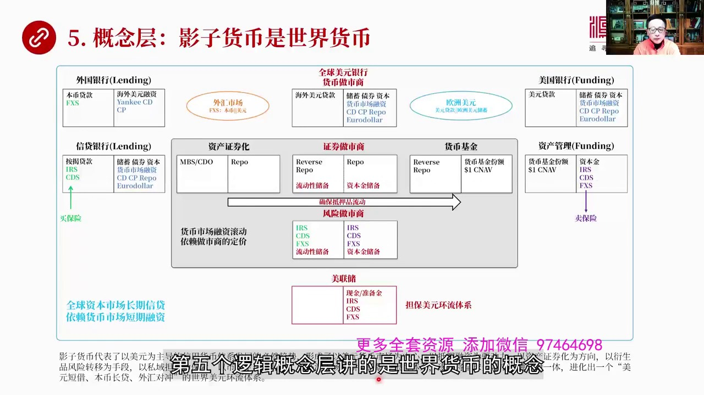

其实在我们在我们这里谈到的就是影子货币其实就是一种世界货币我们上级讲到上级课讲的配理梅林那张图的时候一看这张图你就知道你做事上唯一中心以货币市场为短期融资然后你会看到外国银行看到全球美元的银行看到美国...

<strong>All subtitles</strong>

> 其实在我们在我们这里谈到的就是影子货币其实就是一种世界货币我们上级讲到上级课讲的配理梅林那张图的时候一看这张图你就知道你做事上唯一中心以货币
> 市场为短期融资然后你会看到外国银行看到全球美元的银行看到美国的银行所有的金融体系和金融市场在通过外汇的吊七外汇市场欧洲眉上是联系在一起的所以
> 这是一套影子货币体系也是一套世界货币体系就是影子货币代表了以美元为主导的信用货币发展的一种必然趋势摆脱金本位进步发展发展成银行货币M1M2M
> 3再往后发展呢当然就发展成了影子银行最后形成了一个以美元货币市场为中心以抵押融资为驱动力以资产政策划为方向以演生产品风险转以为手段以资予单保
> 为保证以市场定价为标准形成以货币市场为较量的整个的全球影子银行体系然后把世界各个金融市场连接在一起或者叫融为一体进化出了一个美元短贷本美元短
> 贷本币长贷外汇对冲的全球美元的环流体系这就是一个世界货币体系好我们再次下一页做完刚才上述的分析之后我们再把这张图画出来大家一看就会非常清楚

---

### Slide 16

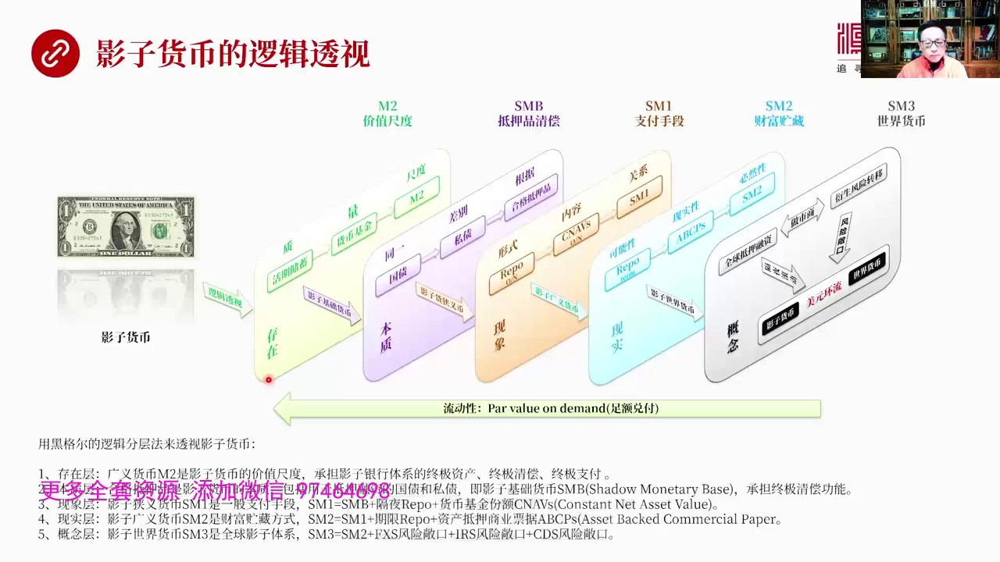

营资货币对他进行逻辑透视存在层质量耻度这是黑格的概念在我们这儿对应是什么就是传统银行货币的活起处去M1转化到了货币市场基金然后发展到了M2M2就成了影资货币的一个价值尺度所以在往后发展影资货币就会发展...

<strong>All subtitles</strong>

> 营资货币对他进行逻辑透视存在层质量耻度这是黑格的概念在我们这儿对应是什么就是传统银行货币的活起处去M1转化到了货币市场基金然后发展到了M2M
> 2就成了影资货币的一个价值尺度所以在往后发展影资货币就会发展出一影资基础货币就是蝶蝶影资基础货币蝶蝶这层是负责清长的在本质层也就是蝶蝶这层我
> 们可以看到黑格的定义是同一差别和根据也就是说同一性国债就代表同一性一开始早期的回复上只接收国债随着影资货币越来越多大债也开始接收私债因为国债
> 收益实在太低私债变得比较高所以私债也可以了也就是从同一性的国债同一性的地牢品像差别性的地牢品过渡最后必项建立一个合格地牢品的规范合格地牢品规
> 范就形成了下一步发展的根据这个根据由从这根据出发再往后发展就会发展成这个狭义的影子货币SME这就是发展到的现象这种现象就叫支付手段影子银行的
> 支付手段按着黑格来表达方式是形式内容和关系在我们这里表达成格业回够然后向这个货币市场基金形式向货币市场基金这个方向变成内容因为表面上这是两个
> 支付实际上它的形式是两种合约实际上它的内容是什么内容是融资所以形式和内容经过这一系列发展之后形成了关系就是两者的内容是一致的两者的形式是连接
> 的这就是关系这关系就必然进化成一种影子银行的支付手段然后现象最后发展成了现实从关系进化到现实变成影子广义货币广义货币涉及到黑格的概念是一道可
> 能性现实性和必然性就是期限回够还有ABCP然后发展成SM2那么现实性从我们这个角度来看那当然是先有的期限回够期限回够代表着按接代款的早期代表
> 它的最后阶段变成ABS的倡厨了那么在往后发展实际上要把整个自然争秀化的早期代款倡厨也进行底下代款也进行底下融资ABCP这样的话全链条就打通了
> 然后持有这些期限融资的当然是为了获得更高的收益率这就进化成了一种财富住藏的必然性再往前发展当然就变成影子世界货币体系在这里有两个重要感觉一个
> 是全球底下融资另外是眼生风仙转移就是底下品和眼生品构成了世界货币体系最核心的两个就是世界影子货币体系最核心的两个概念一个是底下底下融资底下品
> 另外一个是眼生品进行风仙转移的那么做事商居中协调那么通过比如说格业滚动这是它的特点眼生风险是带有巨大的风景长口共同形成了全球美元环流的体系所
> 以美元环流我们以前讲的是一个银行环流体系后来加上海外银行环流体系现在在加上这个影子美元的环流体系这就形成了一个真正的全面的美元环流框架中间既
> 包括影子货币也包括世界货币这样的两个核心的环界那么在这样的一个体系中间这个箭头代表什么代表组合对付性也就是它的流动性或者说更像MR的程度当然
> 我们可以看到整个这个概念倒退后来你会发现海外的世界货币当然跨境的还有各种各样的国家的货币都是以美元为底所以他们的货币属性比美元的这种底下平耀
> 弱因为你说是日元的或者欧元的你得先换回美元所以越往外为越往海外的它的货币属性越弱那么倒退回来我们看到这个财不住藏的所所谓SM2它当然流动性要
> 差一些它就不如SM1就是repo个月repo或者货币上基金那么更像真正的货币然后这两个东西毕竟是收据你还是不如背后的底下平国债私债和国债更像
> 而私债又不如国债像真钱那么国债最后你还是不如真钱直接的真钱那么属于直接可以被接受国债还差里层因为你在市场上卖说不定你还是亏着卖所以这就是流动
> 性作对付的一个镜头所以用黑格的邏輯分层法来透视影子货币我们会发现分层五层存在层广义货币M2是影子货币的价值耻度承担着影子银行体系的中积资产中
> 积清长和中积支付本质层合格的亚品是影子银行的本质包括用于底下融资的国债和私债就是影子基础货币承担着中积清长功能现象层影子货币的SME是一般支
> 付手段SME等于SMB加上格业回购再加上货币基金份额这构成了下一货币第四现象层现实层现实层是影子广义货币SM2它是财富住藏的方式SM2等于S
> ME加上期线的repo和ABCP这是财富住藏第五是概念藏就是影子世界货币SM3是全球影子体系也是全球美元换流体系那么SM3等于SM2再加上外
> 汇调期的风险场口还有信用委员调期和利率调期的风险场口也就是你要把眼生产品的风险场口算进来这才构成了一个世界货币和影子货币共同的华流体系所以S
> M3必须要加上风险场口加上眼生品的风险场口这就是我们通过这一张图可以把刚才我们所讲的一切东西全部集中在一起我们看下夜下夜我们是从底压品视角

---

### Slide 17

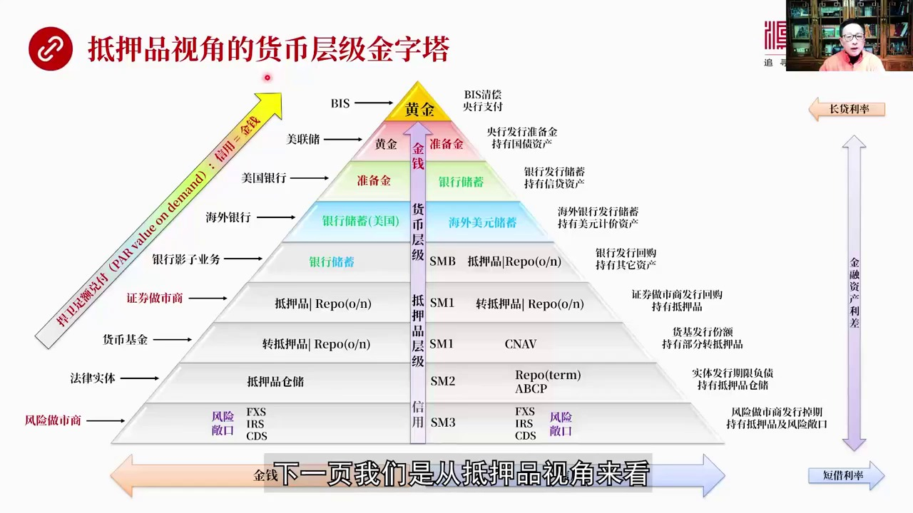

来看整个货币层积金字塔我们在前几场课中间讲的是一部分讲的是传统货币部分这就是有彩色的这部分实际上我们今天要把加上影子银行海外银行 影子银行全部加在一起这个镜塔看起来是什么样就是这样首先我们来看在镜塔的...

<strong>All subtitles</strong>

> 来看整个货币层积金字塔我们在前几场课中间讲的是一部分讲的是传统货币部分这就是有彩色的这部分实际上我们今天要把加上影子银行海外银行 影子银行全
> 部加在一起这个镜塔看起来是什么样就是这样首先我们来看在镜塔的顶层是黄金在它的底部我们看到中间这个镜头是代表着从信用走向金钱在影子银行体移中是
> 经过底压品层积然后到传统货币中间在经过货币层积最后攀上了天梯黄金这就是从信用最后走向金钱的一个层积那么从左边来看这边跟字塔分代表一样它是代表
> 资产也是代表金钱右边这边是代表负债或者代表信用很大层上它是负责支付这边是负责清长那么这张图我们可以仔细看一下它最顶层是黄金就是中央银行的中央
> 银行世界清算银行他们是用黄金来解算的各个国家的央行彼此之间支付在BIS这它是主要用黄金的在我看来黄金虽然现在是被非货币化但是各国央行处备中一
> 定会有黄金资产而且最终它一定也会被重新货币化那么在金本位情况之下包括现在它是直播现在它是隐性的那么再往下一集是美联储或者中央银行这个层次的级
> 别就是它所拥有的资产黄金和国债所对应的负债是准于金所以我们可以说央行发行复债发行准备金是为了持有国债资产或者持有黄金资产这是美联储这个层次再
> 往下是美国的银行的层次他们是把准备金当成资产就是准备金实际上是美国银行的真钱美国银行的钱是这个那么他们所发行的银行处序是准备金的收据当然除了
> 准备金之外它还会衍生出大量的信贷资产比如贷款 按阶底 车贷 防赖 信用卡贷款那是再往后的事所以最后应行处序是变成准备金再加上信贷资产所有东西
> 的收据但在我们这个视角来看我们抓问题的本质时候一样处序跟准备金它是它的资产或者叫银行处序是准备金的收据那么银行发行处序是为了持有信贷资产再往
> 下一层海外银行海外银行就是海外银行所持有的美元处序就是每个海外银行的资产需要它在美国的某家开户行或者叫清算行有一个美元户头比如说中国的工商银
> 行它的美元投寸是存在美国的对于工商银行而言这就是它的美元处序实际上是美国银行中间的投寸与支相对应它可以发行自己的收据叫海外美元处序工商银行所
> 有银行都能创造海外美元就是这个道理那么这就是海外银行发行处序持有美元计价资产就是谁用美元来贷款我就把它作为资产比如说在中国在香港在任何地方工
> 商银行都可以创造美元的贷款只要有人来借我就把它放到资产上下对应我发行海外美元处序但是海外美元处序转账的时候必须要美国的你在美国账户上来帮你进
> 行支付帮你进行清长所以对于海外的美元来说美国银行的处序相当于它的准备金就像银行和中央银行之间的关系好 再往下一层银行的影子业务就是各大银行自
> 己也可以开展一部分业务是属于影子业务的比如说影子银行这个影子银行业务包括它可以用银行持有的资产中的国债作为质压去向做事商融资所以它是以银行处
> 序作为抵压发行的收据发行的什么收据呢融资收据抵压品是国债我发行一个格业回够的这样收据去借钱银行也要借钱吗要对它来说这是负债这个成本越低我赚钱
> 越多所以银行发行回够持有为的是持有更多的资产其他资产好银行发行的回够的协议被谁持有啊这就是再下一层证券作质商那么证券作质商把银行的回够当成自
> 己的资产当然也包括过来了抵压品好证券商实际上银行没有足够的钱去借给银行他要找别人借所以他以这个抵压品国债进行转抵压发行自己的回够格业回够借据
> 就是做伤发行回够持有抵压品好持有抵压品的目的是什么示威了借钱上谁借想货币上基金借这就到这一层所以货币上基金是吧做伤的转抵压作为作为这个抵压品
> 同时持有做伤的借据作为他的资产然后他发行这个奋额发行基金负奋额发行为谁啊发行给外部的资产管理公司资产管理公司不算这个金卡之内的人了他们把钱给
> 他他在百钱交给资产上资产在把钱给银行银行在持有些资产好在往下是什么是法律实体法律实体就是在资产中央2过程中那些持有抵压品倡处的这些SIV或者
> SPV或者Continued管道这些人他们持有的资产是抵压品的倡处不管是贷款还是ABS这十个巨大的倡库他们以这个倡库中间的所有资产作为抵压发
> 行期限回够或者发行ABCP如果是在靠钱在资产抵压政权化的前期贷款倡处主要发行ABCP到后期主要是发就是到ABS已经做完了可能主要发行Ripp
> le期限Ripple好在往下就是风险做事上因为你所做的一切的抵压品包括资产政权化的过程都会涉及到风险这个风险包括外汇调期的风险包括这个利率调
> 期的风险和信用委员调期的风险而这些风险集中在做风险做事商的资产负在表上所以对它来说这边有很多风险投资者要买要买这个保险这边资产管内公司有很多
> 卖保险的人为了多互的收益所以两边把合约全部集中到这来做有做事商来做所以体验在它资产负在表的两边一对应这叫匹赔账户但是这中间含给了大量的风险场
> 口我们一开始已经分析过了外汇调期中间你实际上是巨大的引擎美元负债没有记住在表内在表外Rs企业都是相对应的风险场口所以这些风险场口是影子货币必
> 须要涵盖的内容也就是说做事商发行这种调期这个收据持有了底牙品比如说外汇调期持有用本币持有交换美元当然你这本币就是底牙品包括这些底牙品所衍生出
> 来各种风险RsCDS等等然后在整个这张图中我们可以看到斜线我们这画了一个捍卫对付这个图和对付也就是信用要等于金钱在每个层级上在这个交界处都有
> 相对应的人在捍卫他的一比一的比例金钱信用一定要等于金钱一块影子货币一定要等于一美元准备金谁不能够捍卫这个对换比例谁就会破产所以所有的这一个金
> 塔必须每个层次的人都要是死捍卫信用等于金钱这个评价评价关系就是底下的信用一块钱等于上面的一块钱如果对线不了如果捍卫不了整个金融体系就出现他方
> 了就爆发金融危机了好我们再看这边这边实际上我们可以看到这边所有银行所有影子银行体系的右侧是他的复债复债就是他的短界长代了这边是他的长代这边是
> 短界债的成本一定要低带的收益一定要高所以长代利率和短界利率这个短界利率中间的所有的这些东西就是金融体系影子银行体系他的资产的立差我们可以看到
> 每一层都这样比如说信用做事商这个风险做事商他持有这些持有这个复债和持有这些资产这边产这边的复债的支出一定要小这边获得收益一定要大要不然他这个
> 资产复债表他就亏了每一层都这个道理那么如果我们把这个金融体系做为一个整体来看整个这个金塔如果曾经越多这个金塔规模越大这不就意味着所有左边所有
> 右边的这些右侧这个复债的利率都低于左边资产的收益率这个金塔规模越大说明这个体系赚钱越多说明这个体系已经力能力越强了这就导致了金融体系的所谓的
> 我们所说的经常有人说空转什么叫金融体空转就是这个层次越眼上越多这才眼上几层你还可以往后再眼上很多层金塔可以做得越来越大每一层都是资产复债资产
> 和复债资产和复债而每一层都要赚钱从哪儿赚所有这个金塔赚的钱都是来于10亿这边的资金留过来那么你这个金塔规模越大也就意味着整个经济体的复债越大
> 你们这个经济行整个这条体系诈取10亿现金流的压力越大实际上这就叫金融空转所以金融空转形象说就是金塔中间的内部曾经越来越多而且体积和规模越来越
> 大这就叫金融空转在金融体系之内自己在眼上出距离多这个越来越多的这种资产复债的形式这就叫金融空转看明白这张这个从底压品视角来看的货币金塔之后其
> 实我们已经对整个的货币体系已经建立起了一个相当全面的认知我们再看下一页好我们现在进入第三部分讲讲左坦的货币局则

---

### Slide 18

因为左坦2014年也建立了自己新的货币的思想它这个货币思想跟我们不太一样我们看下一页那么左坦的理论领则货币理论

<strong>All subtitles</strong>

> 因为左坦2014年也建立了自己新的货币的思想它这个货币思想跟我们不太一样我们看下一页那么左坦的理论领则货币理论

---

### Slide 19

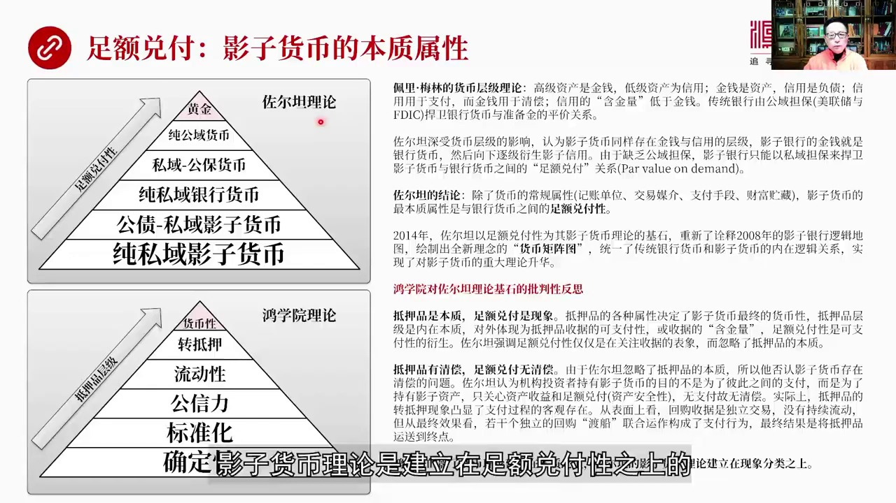

是建立在阻额对付性之上的它是为阻额对付是领则货币最本质的属性配给梅林的货币曾经理论我们刚才说过在这再重复一下高级资产是金钱低级资产为信用金钱是资产信用是复债信用主要用于支付而金钱是用来清藏的信用了含金...

<strong>All subtitles</strong>

> 是建立在阻额对付性之上的它是为阻额对付是领则货币最本质的属性配给梅林的货币曾经理论我们刚才说过在这再重复一下高级资产是金钱低级资产为信用金钱
> 是资产信用是复债信用主要用于支付而金钱是用来清藏的信用了含金量肯定比金钱要低传统银行是由公寓担保也就是美联储天涨狗还有DIC来捍卫银行货币和
> 央行准备金率之间的评价关系这是传统银行由公寓担保来做这个事由于深受配给梅林的货币曾经理论的影响左坦有点大事大悟觉得这一下一下子搞明白它以前画
> 的这个逻辑地图画影响逻辑地图的时候实际上它没有意识到这东西是分层级的做伤应该在中心做伤是最重要的这都是受配给梅林思想的影响那么收到这个影响之
> 后它认为影资货币同样应该存在金钱和信用之间的层级影资银行的金钱是什么呢它认为影资银行的金钱就是银行货币然后向下逐渐的衍生城逐渐衍生城衍生出这
> 个好多层次的影资信用由于缺乏公寓单宝影资银行只能以私誉单宝来捍卫影资货币和银行货币之间的左对付或者叫贫价关系所以左坦的结论是什么除了货币常规
> 的属性就是寄账单位交易媒介支付手段财富住堂等等之外影资货币最根本的属性最本质属性是与银行货币之间的左对付性这一切影资银行的所有东西都是为了保
> 障它的所以它认为左对付性应该是所有的影资货币理论中最重要的一条也是围着它建立了它的整个理论体系所以左对付性是左坦影资货币理论的基石2014年
> 左耳弹用左对付性作为它的理论基石从新化了一张图根据这个08年影资银行的逻辑地图重新会治了货币举镇图在这个图中统一了传统银行这种货币和影资货币
> 之间的内在逻辑关系对于左耳弹而言这是对影资银行和影资货币这种理解的一个重大的理论的生活左耳弹的货币理论基本上我们可以用足够对付性来概括这是所
> 有的逻辑主线或者叫逻辑基石理论基石就在这条上就是影资货币必须要向前要多向要1比1的向而且随时要对付随时要对线满足这条满足这条它的影资货币属性
> 就很强不满足这点那它属性就很弱所以它把货币分成了弱干的层级最底层的最远离这个左对付性是纯撕玉影的货币然后是公債撕玉影的货币也就是它发行是公債
> 然后它就在撕玉里面这种影子货币要比纯撕玉好一些我们一会儿看下一张图就能理解它定义这些词的意思了然后在网上是纯撕玉影银行货币在网上是撕玉的但是
> 是公共保保险的公共单保的银行货币在网上是纯公余的货币在网上但是黄金那么红穴的理论跟它不一样红穴是从底压批入手它是从复债角度它是从收据来研究我
> 们是从资产方向去研究所以我们建立体系是首先要研究底压品的确定性然后研究它的标准化程度然后研究它的工信力然后来看它的流动性然后看它转底压性最后
> 所有的一切都非常好的情况之下它的货币性自然非常强那么红穴这套理论跟它相比就是一个在强调本质一个在强调现象在我们看来红穴对左尔坦的理论即使实际
> 上是有一种批判态度因为我觉得左尔坦把左尔对付性就是把收据靠不靠谱它只终于只终是收据是否向前这一点是否特别像M2而我们认为更根本的因素是看你底
> 压品靠不靠谱底压品靠谱决定收据靠谱所以底压品是本质足够对付只是现象底压品的各个属性决定了影子货币最终的货币性底压品曾经才是它的内在本质对外体
> 现为底压品的收据的可支付性或者叫收据的含金量或者叫左尔坦所说的足够对付性这都是可支付性的眼声左尔坦强调足够对付性仅仅是在关注收据的表象而忽略
> 了底压品的本质底压品有清长而足够对付性它是没有清长的左尔坦一直强调影子货币不存在清长的问题这主要是由于左尔坦忽略了底压品的本质所以它否认影子
> 货币存在清长左尔坦认为机构投资者持有影子货币的目的不是为了彼此之间交易转账而是为了持有资产所以他们只关心资产收益率和足够对付性也就是资产安全
> 性所以没有支付这就不会有清长左尔坦认为影子货币体系没有支付现象在我看来这是非常伟贝实际情况实际上我们可以看到底压品的转底压现象就是我们刚才看
> 到的从对中基金底压品留到了高胜这个做伤再留到的微信然后再留到货币基金你会看到底压资产国债一直在流动这当然是支付现象这种支付现象是什么呢是自我
> 在清长所以我们可以看到这种连续流动由每个单独的回够合约构成的连续运动这当然是支付行为而且是属于自我清长的支付行为底压品自我清长了回够复债是一
> 种支付的工具或者叫支付手段但是它就像现金一样的一步一步进行了自我清长最后联合起来构成了完整的支付流这就是左尔坦并没有看到这一点实际上是有支连
> 续支付的然后也有连续的自我清长那么相对而言我认为红旋的影子货币理论是建立在本质之上而左尔坦的影子货币理论是建立在现象分类之上这是两者中间的根
> 本区别我们再看下一这就是左尔坦化的货币举真图我称之为是货影子货币现象的分类

---

### Slide 20

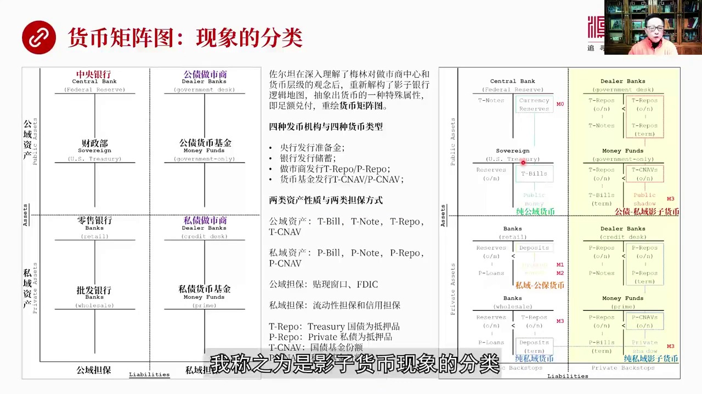

比如说唐认为他在了解了配理梅林的理论之后他把这个图重新化了一下唐认为有四种发币机构发行了四种货币类型中央银行财政部唐认为也算一种银行还有零售银行批发银行还有公債做事商或者叫做事银行做事商银行还有公債货...

<strong>All subtitles</strong>

> 比如说唐认为他在了解了配理梅林的理论之后他把这个图重新化了一下唐认为有四种发币机构发行了四种货币类型中央银行财政部唐认为也算一种银行还有零售
> 银行批发银行还有公債做事商或者叫做事银行做事商银行还有公債货币基金私债货币做事商或者叫私债货币基金分成这么不同集中类型然后不同的发币机构首先
> 央行发行的是准备金是在这这是梅林银行发行的是处序银行发行是银行的处序相当于收据这是央行的收据准备金是央行的收据然后这个银行处序是准备金的收据
> 然后做事商发行的是什么呢T-repo和P-repo我们刚才已经讲了做事商发行的也是两张收据T和P这是T-repo这是P-repoP-repo
> 和T-repo的区别是这是国债作为抵押的回购得业回购这是以私债作为抵押品的得业回购所以这是两个不同的收据还有货币基金也发行两种不同的收据一种
> 是所谓以国债为抵押的份额或者以私债为抵押的份额P和P在这T和P当然不是格业它是随时的所以我们来看整个货币包括什么呢准备金银行处序然后国债为抵
> 押的回购私债为抵押的回购国债为抵押的为资产的这个公债基金份额这个是私债为抵押的商业基金份额那么它把它分成几种货币类型我们来看它资产货带表上面
> 是公共的资产下面是私有资产这边是一个公共的单宝这边是私营的单宝或者私营的单宝这边是公益单宝所以它把它化成了续镇在这一块这是属于纯公益货币比如
> 说这是个法律保障的这个准备金法律规定它就是法长货币还有财政部发行的短期国债永远不会有约这都是公共的钱或者叫纯公益货币底下这块呢注意这是私人资
> 产因为所有银行都是私有的所有银行所发行的收据都是私有的收据所以我们说银行处序银行处序是私有的它是可以破产的破产你是可以完蛋的除非它有FDSE
> 给你保险所以有保险的这块叫私欲公宝货币虽然它是私人发行的收据但是它有公共单宝这个公共单宝就是FDSE保证25万美元在一个账户当银行倒闭的时候
> 25万美元你还可以拿的回来差过25万以上的所有钱都损失关了所以当然这是属于私有货币体系那么除了这个之外还有存私欲货币存私欲的银行货币这当然都
> 是属于私欲公宝的银行货币和存私欲的银行货币这都是银行体系之内的货币存私欲的银行货币就是超过25万美元以上的那些负债那些欠条比如说我要发行银行
> 的定级通过案或者叫CD那当然是存私欲的货币存私欲的银行货币这是完全没有单宝的是完全没有FDSE或者国家来给你单宝那赔了就是赔了一分钱都不胜好
> 除了这些货币之外还有一种叫公债私欲影子货币这边黄色这边叫影子货币公债私欲是什么意思呢公共的资产所以持有着公债我们看到它抵押品是什么抵押资产是
> T-RippleT-Ripple背后是这个国债T-Node是长期国债这边是短期国债这种货币基金也是T-Ripple是长期国债T-BL短期国债
> 所以这叫公债私欲虽然它是在私欲中间这一流是私欲就是私人单宝没有公用单宝但是它持有着公共债务或者公共资产底下就是纯私欲影子货币了比如说它的收据
> 是P-Ripple当然是私债抵押品是私债或者货币商业型的货币基金它发现的是私债的为资产的这样的一个收据或者叫基金份子这当然是纯粹私欲的影子货
> 币完全没有任何单宝全靠完全没有公用单宝全靠私欲单宝同时也是私人资产这就是我们看到它所画分的货币旧镇所以它把它分类之后私欲资产公益资产公益单宝
>  私欲单宝那么这就是它把传统银行了货币跟影子货币之间建立起了一种深刻的逻辑关系比如说这些银行之间它是怎么进行资产相互持有的在后面的途中我们会讲到我们再看现业货币曾经这个总产认为族俄对付

---

### Slide 21

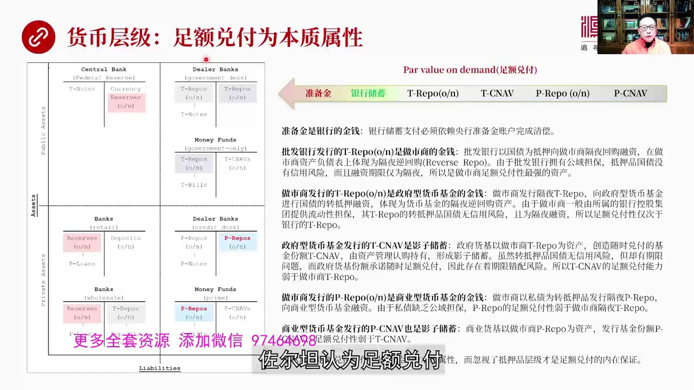

这是影子货币的本质属性族俄对付把它的概念画出来之后我给它归纳一下就是这个图准备金这当是法定货币然后比它差一点是银行处去这在正常情况之下应该是1比1在银行危机这时候这也有可能变成零除非每连处去保它银行破...

<strong>All subtitles</strong>

> 这是影子货币的本质属性族俄对付把它的概念画出来之后我给它归纳一下就是这个图准备金这当是法定货币然后比它差一点是银行处去这在正常情况之下应该是
> 1比1在银行危机这时候这也有可能变成零除非每连处去保它银行破产了这个就清零了但是在正常情况之下它跟准备金的比例应该是1比1否则就叫金融危机那
> 么在往后更差一点是T-repo就是做事伤以国债为底所发行的回够格业的比它的族俄对付略差一些在往下在往后是货币市场基金以国债为底而货币市场基金
> 的份额在往后是私人的回够的格业收据在往后是私人的私债为底这样的一种货币市场基金的份额所以这是它的族俄对付性所画出来图它觉得越往这个方向靠准备
> 金方向靠这些回够复债或者这些影子货币的地位越高那么如果从这张图来看中央银行发行准备金准备金被银行所吃有发行所对应的收据或者叫处去那么这个是属
> 于零售银行大型银行或者叫批发银行也是这样吃有准备金作为资产发行相对应的收据或者叫复债T-repo因为以大型银行往往处去它没有很多分店或者说没
> 有这么多处去的来源或者不认为处去来源应该是到最重要的资金来源它主要靠T-repoT-repo就是以大型银行所持有的国债作为抵押去借钱找谁借从
> 这点到这找做事商去借那么做事商持有大型银行所抵押的国债发行自己的把它转抵押发行自己的回够收据发行给谁发行给货币产积金政府型或者叫公债型国债型
> 和货币产积金那么它持有做事商的这个资产之后发行相对应的这个相对应的份额发行给谁发行给外面的资产管理公司同时商业银行同时这个做事商还可以发行持
> 有私人债务发行以它为抵押的私有的这个回够发行给谁发行给货币市场积金这主要商业型货币市场积金商业型货币市场积金相对应发行商业型的货币市场积金的
> 份额给专门投资的这个资产管理公司所以对它对这个左手坦而言准备金是银行的金钱银行处序必须支付必须依赖这个银行准备金账户完成清场银行处序要支付那
> 银行准备金这账户上必须要足够的准备金否则清场完成不了批发银行发行的T-Ray Po是做事商的金钱我们刚才已经讲了做事商发行的T-Ray Po
> 是政府型货币市场积金的钱那么政府货币市场积金发行的这样的一个回够份额是影子处序刚才我们也说这是影子处序这也是影子处序做事商发行的P-Ray 
> Po也就是私人债务为底下的回够戒聚这是商业型货币积金的金钱在这儿我们标志出来银行所发行的回够是影子银行的金钱他所发行回够是货币市场积金的金钱
> 他所发行的回够是这个商业型货币市场积金的金钱他讲的就是什么是金钱这些是金钱什么是他的负债什么是他的信用这边是他的信用那么昨日谈把族俄对付信作
> 为整个货币层级的本质属性但是他忽略了底下品层级才是族俄对付信的内在保障好我们再看下一个根据族俄谈的思路

---

### Slide 22

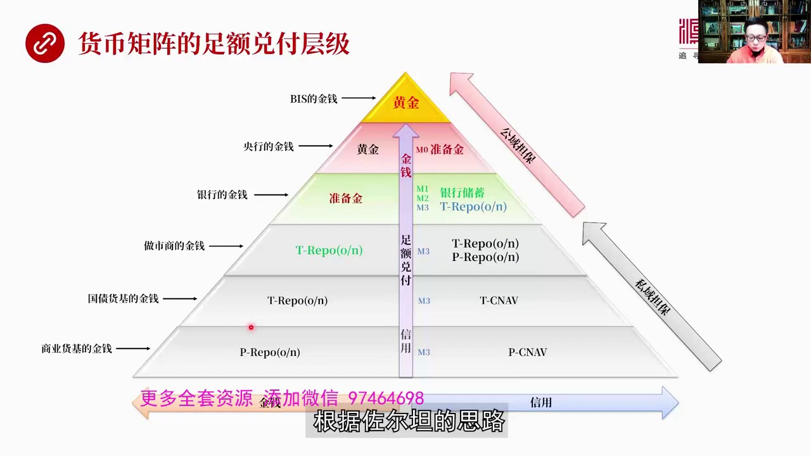

博伯他也化成一个货币层级就是族俄谈货币举政所对应的族俄对付的这样一个层级那么在族俄谈这个体系中间BIS的金钱当然是黄金央行的金钱黄金国债所对应的MLA这是他的准备金金行的金钱准备金然后银行处序和他所发...

<strong>All subtitles</strong>

> 博伯他也化成一个货币层级就是族俄谈货币举政所对应的族俄对付的这样一个层级那么在族俄谈这个体系中间BIS的金钱当然是黄金央行的金钱黄金国债所对
> 应的MLA这是他的准备金金行的金钱准备金然后银行处序和他所发行的T-repo以国债做质压向做日商借的钱然后做日商的金钱是银行发行的T-rep
> o以他为抵压做日商发行T和P和两种回购两种阁业回购的收据这两种阁业回购的收据分别被国债行基金和商业行基金作为他们的金钱他们发行对应的金钱分额
> 传统银行又供应胆保领罪行又私预胆保这边是金钱这边是信用然后从信用到金钱是通过足恶对付这样的一个层级爬上上去的这个大概就是卓尔坦的货币举真正足
> 恶对付层级不过帮他总结和体练的主要是为了跟我们那个进行比较大家如果回过头去看我们刚才的那个图你就会发现两者是不太一样的所以卓尔坦在他的货币分
> 层中并没有涉及到影子银行货币的分类方法他只涉及到这是M3都是M3这是M1和M2M0M1M2M3他没有对应资货币没有进行进行不分类而我们刚才如
> 果我们回过头去看刚才我们是进行了分类比如说什么是影子货币的基础货币

---

### Slide 23

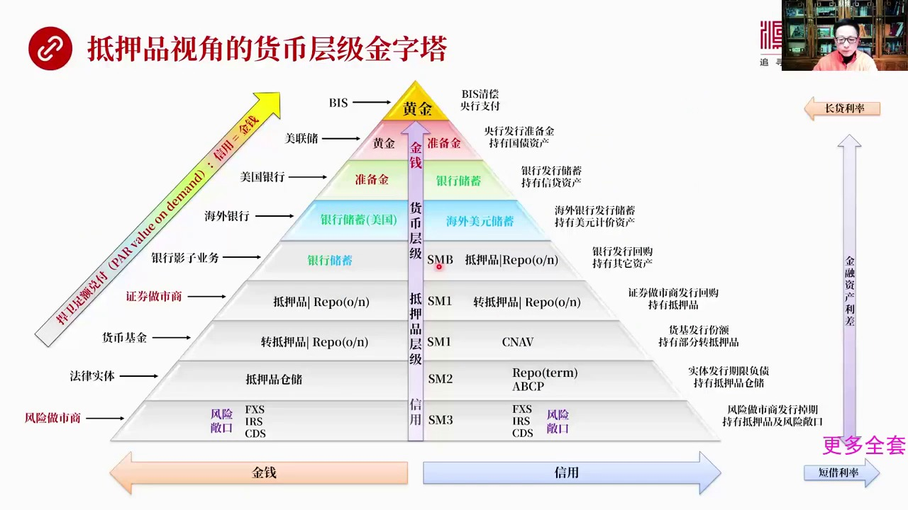

当然这是与国债为抵押的这样一个回够协议然后什么是他的下一货币SM1两个支付一个是作质上发行的格业回够另外一个是货币市长基金发行的份额这是两种支付方式然后SM2广义货币包括旗线回够和ABCPSM3当然我...

<strong>All subtitles</strong>

> 当然这是与国债为抵押的这样一个回够协议然后什么是他的下一货币SM1两个支付一个是作质上发行的格业回够另外一个是货币市长基金发行的份额这是两种
> 支付方式然后SM2广义货币包括旗线回够和ABCPSM3当然我认为应该包括风眼长口这也是昨儿谈没有涉及到他没有提到风眼长口应该归类于影子货币体系我们再回过头去看昨儿谈讲的

---

### Slide 24

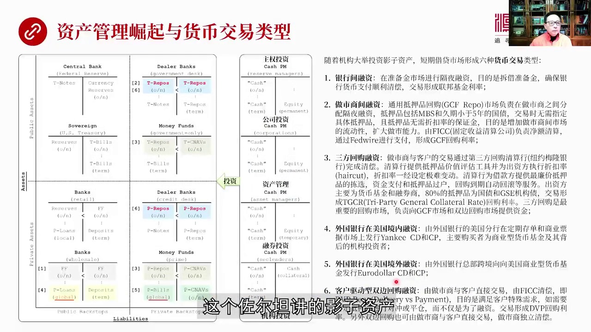

影子资产就是影子管这个影子银行崛起的背后的原因是什么当然是资产管理公司崛起了资产管理公司崛起之后实际上又形成了很多融资新的融资关系这就会衍生出虚拒多多的货币交易的类型就是影子机构崛起了资产管理公司崛起...

<strong>All subtitles</strong>

> 影子资产就是影子管这个影子银行崛起的背后的原因是什么当然是资产管理公司崛起了资产管理公司崛起之后实际上又形成了很多融资新的融资关系这就会衍生
> 出虚拒多多的货币交易的类型就是影子机构崛起了资产管理公司崛起了他们开始大举的投资影资资产然后短期借带市长就会形成新的交易类型这些新的崛起的资
> 产管理公司包括主权基金主权投资公司的大公司像苹果这样又有好几千亿上万亿现金的公司公司投资资产管理公司像黑石等等还有龙卷投资专门借出债券拿回现
> 金再把现金用于投资的这些都叫机构投资人机构投资人对于这样的一个影子货币体系进行了大规模的投资改变了整个这个体系的运作方式形成了一系列新的原则
> 新的交易的方式就是货币交易类型在这里呢左尔坦用123包括456这些符号相对应它归纳了6种这个货币交易的模式首先第一个银行间融资我们看了这是F
> F当然是这个Fifre放的这个银行间融资是什么呢是准备金市场准备金市场进行隔夜融资目的是拆解准备金确保货币支付最后交易形成了联盟基金利率第二
> 呢是做事商监融资做事商监融资就是做事商之监进行彼此的资金拆解是当然通过通用的抵押品回购GCAF来做的GCAF市场我们刚才已经说过它主要是负责
> 在做事商之监分配隔夜融资它是从三方三方这个回购应该是最主要资金入口然后从二大量拆解来资金到做事商做事商之监的融资市场GCAF市场来进行调配但
> 是抵押品就是NBS还有97小鱼5年的国债然后交易时候不需要指定具体的抵押品所以叫GJNL不需要指定我要几年期的国债要哪个发行的品种它不做这个
> 事只要是我要五年国债任何的国债都可以性质接近就行而且这个抵押品没有这个保重金折扣率一般是需要保重金的它不需要保重金目的是增加做事商之监的流动
> 性做事商是让最需要是流动性我们做事商之监大家彼此配合能够让整个我们的做事能力普遍都能够有所提高然后这个市场使用FICC固定收益清算公司他们来
> 进行进俄清算最后呢通过FATLWIRE就是支付体系我们先和一个人讲过通过它来进行支付形成的是GCAF会够利率使让美国有好几个回够市场GCAF
> 是做事商之监的回够市场它所形成利率是做事商之监的回够利率除了它之外还有三方回够就是第三三方回够我们看到这还有这三方回够就是做事商和客户的交易
> 要通过第三方回够清算行比如说做事商和这个货币上基金要通过第三方回够清算行比如说纽约没龙银行来完成清算行清算行提供什么呢抵押品价值评估给你提供
> 这样的服务而且为出自方执行折扣率折扣率一般商定好了之后就很难变首先是出自方和做事商之监谈他们要设定好这到底是97%还98%但是一旦定好之后这
> 个折扣率就由清算行自动之行一般是很难改变的清算行同时为借款方提供一个连价的抵押品减选这是用算法算法来选只要是同类型的然后我给你挑最便宜的作为
> 抵押抵押给别人所以它是两边钓押提供服务还有自信支付抵押品过护还有回够到接之后自动回滚这是清算行要提供的服务出自方主要是货币基金还有龙券方主要
> 是这帮人参加这个市场80%的抵押品都是国债还有借S意的机构债交易形成的利率这个回够利率TGC2这就是TGC2的回够利率三方回够利率三方回够这
> 个市场是最重要的回够市场负责向GCF市场和双边回够提供资金这是回够市场的大门所有的大型的投资机构都是通过三方市场融资进来然后三方市场在调配到
> GCF市场进行资金的在各个座商之间分配然后再进到双边回够市场进行分配双边回够市场就是6我们可以看一下这个6双边回够市场就是由客户驱动的不管是
> 政府债还是商业债都可以交易商都可以做做商都可以做但是是由客户来驱动双边这个回够做商和客户进行直接交易然后比如说DVP回够DVP回够就是一方面
> 我支付另外一方面我也付款就是付款和交额同时进行这主要是由FICC来清朝这个是DVP回够DVP也是双方回够它主要的目的是满足客户特殊需求比如说
> 我特别需要某一种债券某一种期限的某一种发行品种的发行号的国债一个我找为什么呢因为我需要特定的点品来进行对冲或者平仓而不是不简单是为了融资这个
> 就是客户驱动型的双边回够当然除了这个它这个交易形成是DVP回够回够利率这又是个利率第三个利率另外还有双边回够呢是不通过FICC来进行清朝的是
> 客户和坐着上直接进行交易坐着上来独立清朝坐着上清朝当然也睡到最后过护这东西它得自己去找其他人来提供服务比如说你可以找清算行清算行可以找FIC
> C或者找其他人帮你这个委托他们来给你做但是清朝工作有你来做最后交颗让别人去做所以双边回够分成两个DVP是其中一个另外是不经过FICC这是另外
> 一个双边回够市场所以回够市场就包括两个三方市场是最重要的一个然后是GCF这个回够这就是极者之间关系第四第四种融资方式是说外国银行在美国境内融
> 资我们可以看到在这外国银行在美国境内怎么融资呢就是外国银行在美国的分支比如说会风银行在纽约有会风银行的分支分行他们在美国的货币市场的定期存单
> 还是商业票局市场上发行比如说Yankee的这种CD这也是一种定存或者是CP或者是商业票局主要购买者是商业型的货币基金当然还背后他们的机构投资
> 者这是会风在美国的银行那么会风总部比如说在香港他怎么在美国他怎么的这个跨境进行境外融资就是他在香港要在美国怎么进行融资就是外国银行总部要跨境
> 向美国商业货币市场基金融资的办法他可以通过发行欧洲美元的CD或者CP所以我们可以看这有在影子货币形成了全球货币之后实际上外国银行他的美国的分
> 支机构还有外国银行自己都在美国的货币市场上来进行融资各种各样的主要是抵押融资各种各样的形势来操作这件事好我们再看下一眼抵押品和衍生品这两种东西共同形成了影子货币体系的高官岗问题

---

### Slide 25

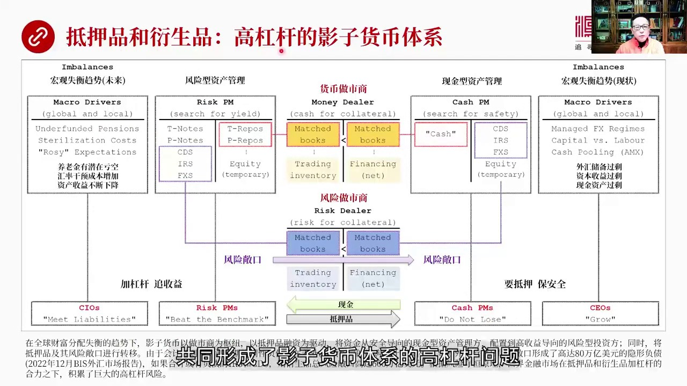

这个是昨日谈话的一个我觉得这张图画的很好这张图实际上是表达了所有的趋势性的东西比如说红关的试行这是现状这是未来红关市场是什么呢比如说这次挖挥储备过上比如说中国外储备太多但有些国家外储备有很少还有一些资...

<strong>All subtitles</strong>

> 这个是昨日谈话的一个我觉得这张图画的很好这张图实际上是表达了所有的趋势性的东西比如说红关的试行这是现状这是未来红关市场是什么呢比如说这次挖挥
> 储备过上比如说中国外储备太多但有些国家外储备有很少还有一些资本收益过上比如说苹果赚钱赚的太多现金资赚过上比如说有些基金养老金有些现金充裕的这
> 种公司有很多那么这是一种试行就是这些人很有钱但是另外一边试行那是可能未来会存在问题的或者现在已经有问题了比如说养老金有钱在亏空比如说英国养老
> 金就是很明显的例子他的负债是一种固定负债就是我已经答应别人30年之后当到退休我一个月一定要负他2500亿万这叫固定负债但是我现在资产产生不了
> 足够的收入去满足未来的固定负债这就要潜在的亏空他们现在很着急还有就是各国中央银行由于要保证自己的汇率稳定然后美元流入多了我叫做对冲干预汇率干
> 预汇率也会增加成本这种也是带来一种红关试行还有资产收益不断下降由于过去几年力率越来越低过去几十年力率越来越低导致资产大几荒啊所以这就两种红关
> 就是形成了两种不同的资产管理他们的思路一种叫现金行一种叫风险行风险行是什么呢就是它一定要它要大量的去加槓杆要投资所以它会持有大量的这些各种各
> 样的这种资产比如说私债和公债当然还有其他的债务那么相对应它会发行抵押品以这些为抵押品发行这个回够不管是国债抵押还是私债抵押发行大量的回够借据
> 向谁借钱向座商借钱座商通过匹配账户然后座商发行自己的借据发行给现金行的管理公司然后他们把座商的借据当成资产然后把现金支付过来让他们这些人获得
> 现金然后再去扩大方杆这是一个方面还有一个方面是什么呢由于它持有大量的风险资产而且加这个杆杆很高所以他们需要买很多保险CDS、
> IRS还有这个外汇调期我们刚才说过了它这个保险又通过风险座的商卖给谁了呢实际上是卖给他们卖也是卖给了这个现金行的资产管理公司也就是他要买保险
> 这边要卖保险这边来单保单保这边所以风险长口是过来了卖保险的人这是在他的复债坊在资产表的复债坊他们相当于为风险行资金进行单保他买了这些保险之后
> 就觉得杆杆加了很高但是我不是很怕因为有人给我单保所以风险长口是流过来了那么在整个过程中现金往这边流风险长口往这边流底下品是往这边流的双方的态
> 度有什么不一样这边就是一定要比如说英国养了公司一定要买足未来固定的复债他的需要所以我们必须得加上杆要追一这种收益不加上杆我没收益没收益我怎么
> 能买足未来复债还有一定要激败市场就是我一定要比我来这个其他的基金回报高所以我要加上杆我要追收益而对于这一方人来说这些现金进行过剩的和现金行资
> 点管理的他要的是什么我一定要抵押要安全要抵押保安全就是对方一定要给我抵押品否则我不敢借我不要保守但是我还是要赚钱不过赚钱也不能太冒险我需要有
> 抵押品然后这边是要求增长那么无论是要抵押还是要增长这边是不能输这边是要增长他其实都是需要抵押需要保他们的投赞权这是两种不同红关趋势施衡然后产
> 生的两种不同的资产管理的大类基本上就是这样一种这种态势中间是货币做日商或叫政权做日商还有风险做日商居中进行资金和风险包括抵押品的调配那么如果
> 我们来看全球财富分配越来越适衡影子货币以做日商作为书牛以抵押品融资作为驱动把资金实际上从这边调配到这边然后把风险和抵押品转移到这边同时我们可
> 以看到这种风险转移会带来问题比如说快就准则把外汇掉期这种钢性复债留在了表外跟本身相同的回够必须要记住表内所以这就变成表外的影性复债这就导致外
> 汇衍生品的飞验场口形成了一个非常大的场口具2012年12月BIS的外汇上报告这个非常场口高达80万亿美元的影性复债藏在这里面外汇较期底如果再
> 加上ARS和CBS的货友复债这个是钢性复债只不过没进入表内这个叫货友复债就是它伟约的时候它就变成真实债务了货友复债这两者加在一起高达600万
> 亿美元我们知道整个金融体系我称之为有一个基本规律或者叫基本定律叫风险手横原理整个金融体系的风险手它是风险手横的所以无论从这转移到这还是从这转
> 移到这不重要重要是整个风险场口有这么大所以世界这种体系在底下屏和眼省屏两个方向上都在加上钢在这种合理之下整个这个体系集理了巨大的金融风险或者
> 叫高钢钢的风险好我们看下一页这就是第四部分我们现在需要谈一下影子货币的风险问题了我们再看下一页首先各种风险都像底下屏在汇聚

---

### Slide 26

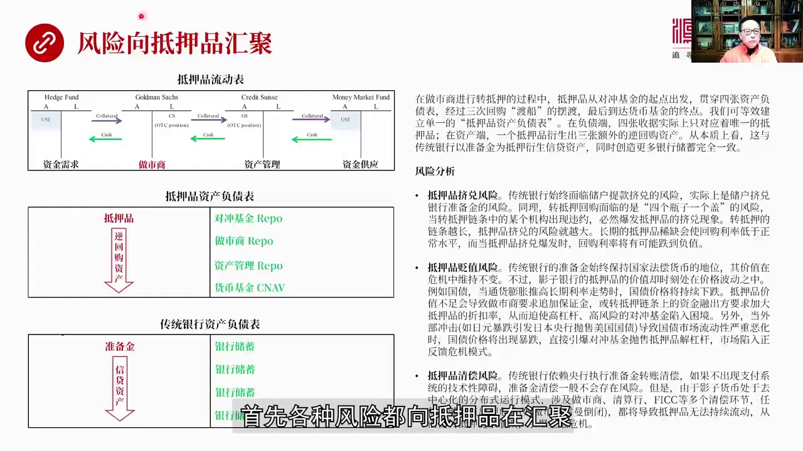

我们刚才展现这张图就是我说底下屏不断的流动从左边有到右边实际上如果我们做个等效的转化我们其实可以把底下屏想象成为底下屏建立一个自展负载表这个底下屏自展负载表我们马上就能看清实际上底下屏只有一个只有一个...

<strong>All subtitles</strong>

> 我们刚才展现这张图就是我说底下屏不断的流动从左边有到右边实际上如果我们做个等效的转化我们其实可以把底下屏想象成为底下屏建立一个自展负载表这个
> 底下屏自展负载表我们马上就能看清实际上底下屏只有一个只有一个美国的国债但是飘了这么远飘了这么远之后在这儿留下了自己的资产在这儿留下了收据在这
> 儿又留下了收据所以我们可以看到实际上这会产生一个底下屏会产生握干张收据比如说对于这个对重基因来说你这一个底下屏当然会有对重基金的repo有它
> 的借据repo就会在这儿产生一个逆回够的资产这个做伤把它当资产做伤反手又发行了自己的借据发行了资产管理公司资产管理公司又把它当成逆回够当成资
> 产然后就是让它发然后又产生了相对应资产所以我们可以看到一个底下屏产生了弱干张收据同时产生了严生出了更多的资产这就形成了什么在复债端四张收据实
> 际上只对应着唯一的底下屏只有一个国债在资产端一个底下屏严生出了三张额外的逆回够资产从本质来看这和传统银行以准备精为底下严生性贷资产同时创造更
> 多银行处去这是完全一样的如果我们对比传统银行做了也是同样的事一份准备精产生一份的银行处去然后我创造大量性贷资产产生相对应的银行处去实际上这么
> 多银行处去真正要几对的时候只有一份准备精对吧所以这个风险就很明显一看这让我们就知道首先面临是风险几对底下屏几对怎么办就是所谓几对风险底下屏的
> 几对就像银行几对准备精一样储户觉得这个银行有危险到这儿来几对处去一个人取走处去之后准备精就没了就转给其他银行了剩下第二个人来对不起取不出钱来
> 了没钱了这个银行就倒闭了吗所以传统银行始终怕银行几对这是一个重大风险实际上储户几对的是准备精同理转底压回够面临的也是类似的问题这叫四个平子一
> 个盖四个平子只有一个盖怎么办转底压链条越长比如说这个资料出来表拉了越长如果中间某一个机构就容易出现伟约一旦出现伟约这就必然会导致底压平的几对
> 因为有人伟约了大家一惊慌就说我要底压平你赶快把底压平还给我这个时候找谁去肯定找找做事商啊一层一层都找做事商因为大家都在做事商交易底压平底压平
> 几对的风险就会变得越来越大那么长期如果说我们把自负债表做得特别大或者叫底压平周转速度周转的次数特别多这就会产生底压平不足的问题转底压链条越长
> 底压平几对风险越大然后长期底压平吸缺会使回够利率低于正常水平我们在红旋每次没有环流评估的时候我们都在讲为什么底压平为什么我们看到回够利率是低
> 于所谓的地板利率或者叫中间利率的很大成功上说明底压平是吸缺的说明中间收据是多于底压平的而且长期这样的话就会产生这个问题如果爆发了几对底压平如
> 果开始几对了我们甚至可以看到底压率回够利率可能会跌到副数其实我们在红旋每人环流报告中经常看到2018年2019年多次出现副指回够利率的变副如
> 果持续好几天的话那就是底压平爆发危机了爆发几对了所以这是一个重大风险还有底压平贬值也是个重大风险因为传统银行准备金始终是国家的货币所以没有什
> 么贬值的问题永远是法定永远是法长货币所以危机中也不变但是影子银行的底压平它的价值确在始终的变化你比如说国债变变可能变通过膨胀高了国债就会贬值
> 收益率会上升这个时候底压平价值不足就会导致做事上要求追求保存金或者转抵而练条中那些出钱的那边不干了底压平的折扣率所以这样一来就会破石底压练条
> 上那些高罐杆高风险的对重基金就会出问题出麻烦或者说陷入金黄施措开始拋售资产另外还有外部风险外部风险也会重基底压平比如说日本我要捍卫我的日元会
> 率我怎么办我这个卖美国国债回龙资金买日元这么一卖美国国债美国国债如果扛不住了流动性恶化到一定程度国债暴跌国债暴跌底压平就暴跌了底压平要暴跌那
> 整个这个底压练条也崩了那么对重基金就会拋售底压平来解冠感这样的话市场就进入了一个犯正反亏的危机模式对重基金越拋国债 国债跌得越衡国债跌得越衡
> 对重基金越被追求保存金它就得越拋所以它一垮就会把所有这个练条上其他案子都拖下水这是底压平贬值风险另外还有底压平还有清长风险传统银行只有一个清
> 算的环节就是在鸦航准明金如果鸦航的支付系统不出技术故障准明金进行一般是不会出风险的但是由于影子货币它是一种去中心化分布式的运行方式税到好几个
> 税到做日商税到清算行税到FICC好几个清算环节任何一个环节调链子出危险比如说做日商中间雷曼就倒闭过那么它一倒闭就是会是整个底压平的支付的这个
> 支付流断掉底压平如果不流动了那也完蛋了那所有中间的转底压的练条都会崩所以这也会引爆进行危机这就是风险各种风险特别是在高利率越来越高的情况之下
> 通过门上越来越高的情况之下就会导致各种风险都向底压平方向聚集好再看下眼第二风险是什么所有的风险都向眼生品会聚

---

### Slide 27

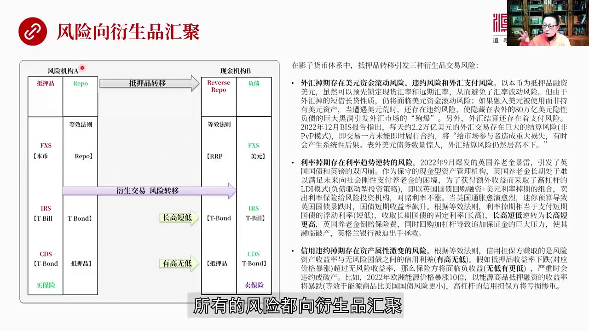

刚才说风险再向底压平同时风险再向眼生品聚集我们想想看底压平转移这件事情本身眼生出了派生出了眼生交易如果没有底压平转移其实不存在眼生品就是因为如果银行持有资产到期不需要转移那么银行自动承担所有风险不需要...

<strong>All subtitles</strong>

> 刚才说风险再向底压平同时风险再向眼生品聚集我们想想看底压平转移这件事情本身眼生出了派生出了眼生交易如果没有底压平转移其实不存在眼生品就是因为
> 如果银行持有资产到期不需要转移那么银行自动承担所有风险不需要发明和交易任何眼生品但是如果你要把底压平进行转移这就会使底压平的风险暴露出来那就
> 一定要玻璃玻璃就要通过眼生品交易来进行风险转移那么在影子上底压平转移风险底压平转移引发了这个风险就是我们刚才所说的三大风险外汇掉漆新纹约的掉
> 漆还有绿绿的掉漆机构币是卖保险的机构为是买保险的我们来看一下如果出现这个问题它为什么会带来风险首先外汇掉漆存在着引性附带的问题存在着资金滚动
> 的风险存在着纹约的风险就是纹约引引附带太大一旦暴露出来之后我还不上这个钱了这不就纹约了吗还有包括外汇支付风险因为以本币为底压进行融资美元当然
> 我们知道它其实可以锁定现货汇率和这个远级汇率好像可以避免汇率波动风险但实际上它的本质是短接常带它是回够所以它仍然会面对美元资金滚动如果美元市
> 场出现问题资金滚动不了它就出事了或者是你介入了美元被使用了而不是只有美元资产而这个时候一旦美元荒报发了那么也会产生五约风险比如说英国养老养老
> 基金跟黑石做力汇率要漆做力率要漆做力率要漆之前它签得做外汇要漆因为英帮和美元必须要换成美元来才能做这个生意好如果说英国保险公司换到的美元最后
> 赔给的黑石我们这黑石转了50亿美元而整个英国保险经济器亏锁了1200亿英帮也就是英国要保险公司英国养老公司把外汇吊漆获得了美元又排出去了裴光
> 了而这个时候英帮暴跌英国国债暴跌那么你怎么锁的能怎么能锁定这个汇率风险呢你还得到市场上去找美元如果找不到找不到美元就会引发引发巨大的所谓引性
> 复债的美元引性复债的循报因为你是要找不到美元但是你这个复债又是刚性的必须得复美元而在整个英国市场上假如最极端情况下美元荒找不着了怎么办我就伟
> 约了我这一伟约马上表外的80万亿美元被外汇吊漆引操的风险都会暴露出来因为大家一看如果有一家公司伟约这个市场所有交易对手都不干了立刻让你还钱而
> 大家都找到美元谁也找不着因为美元本来就不够大家都是加了杠杆的你上哪去找怎么能还得清所以这80万亿潜在的80万亿美元潜在的引性复债会立刻表面化
> 还有外汇结算也存在着支付风险我们以前核心课专门讲过这问题而且这个BIS报告也指出每天有2.2万亿美元外汇交易都存在着所谓结算风险就是它不是P
> WP不是马上实实到账特别是2013进以后新上国家加入之后有很多并没有加入PWP的支付也就是说可能存在支付和到账之间的一个时差这就是有一方交易
> 晚了没有及时领约这将会给整个市场带来不可估量损失还有可能会产生系统性后果这就是BIS的一个他们的一个判断因为表外的美元债务经人外汇结算风险仍
> 然聚高不下以前就因为这个问题德国导霍银行而且牵岛了世界好多家银行1974年那么这是外汇调期存在的风险还有利率调期存在这利率趋势义转的风险我们
> 说到英国的养老金的问题其实就是典型的这个问题它的高官岛LDi这个模式它其实就是一个英国国债作为回够融资再加上美元利率调期的组合跟黑时对做它做
> 单保方结果呢结果的情况是什么呢对赌输了就是它赌利率不涨结果利率涨了英国通过膨胀越涨这个越演越烈然后当时这个手架特拉斯在搞这个迷你预算然后英国
> 国债暴跌短期收益率飞飞升那么短期收益率飞升意味着什么我们来看这就是卖保险的英国养老金的责责表你本来是长高的短低来赚钱就是T棒的的它的收益率高
> Tb有短期收益率低所以你支出了少而收入的多长端搞短低你才能收入现金流吧但是现在搞的被迷你预算都被搞这玩意儿飞升飞升的结果什么呢它甚至比它还高
> 那怎么办那我们就排了吗所以这个长高短低逆转为了这个长高短更高英国老这个保险金本来是转保险费结果现在改成赔保险费它这么一赔不要紧它还加了杠杆它
> 还把国债融资出去了加了好几倍杠杆国债在暴跌追加保陈金这个电话打得没完没了它面临巨大的压力这个时候这边在赔那边在追加保陈金这就使整个英国保险公
> 司这个阳老基金陷入兵林破产的境地应该来一行必须得拯救否则的话英国的这个阳老基因估计就出大事了就得连骗了倒闭所以这个叫利率趋势如果一旦逆转存在
> 这重大风险还有呢纪委调期存在这资产属性机变的风险这怎么回事呢其实我们根据等校法则你可以看到单保方或者叫卖保险是这边它的抵押品作为它资产这边是
> 风险资产高风险的高风险所以它的收益率高提棒的是低风险是无风险资产所以它收益率低所以我资产产生的收益大于我复债支出的两者是有信用立插的这边支出
> 少这边受了多所以这个叫风险立插但是如果出现相反的情况如果出现这边比它还低呢风这个风险的压品的时候率如果突然变低了好那我不就成了赔钱了吗我本来
> 是资金是这么有就是有风险的高无风险低如果我变成了无风险的低有风险的更低我低到这来了好那我收入少了这边支出没变好我就会尽亏损什么情况会出现这种
> 情况有啊比如说我们九个例子2022年欧洲能源价格暴涨十倍那么以能源商品来抵押融资的这种能源上去本来是高风险的资产你用它进行融资它收益率它的利
> 率应该很高它收益率应该很高但是由于一打仗能源价格暴涨十倍相对抵押品飞升抵押品的是什么概念就是你用房子去抵押贷款好房屋的利率这个贷款利率是一个
> 但是如果房价暴涨那么整个房子的收益率会下降跟国债道理是一样国债价格上涨收益率下降你抵押品如果价格暴涨那就意味着以前说美国国债是无风险现在你这
> 个买天然气气货可能更没风险因为它会涨十倍所以在抵押品暴涨情况之下它的收益率会下降会低过这边那么这就会产生到的现金流钱就向外出了卖保险的非贷没
> 有收益的钱反而倒赔你想想看如果我是加保险加了干干的卖保险的那现在不出大问题了所以这就是用等效原则你会一眼看到在什么情况之下发生什么样的变化哪
> 些人会赔而且你一旦知道哪家公司是用这种模式在运转比如说特别是把能源的气货作为抵押品或者把能源的各种眼生品作为抵押品然后这家公司同时还是卖保险
> 的那你就知道它在现在这个情况之下应该是处近非常地糟糕我们再看下一好如果各种风险抵押品的风险

---

### Slide 28

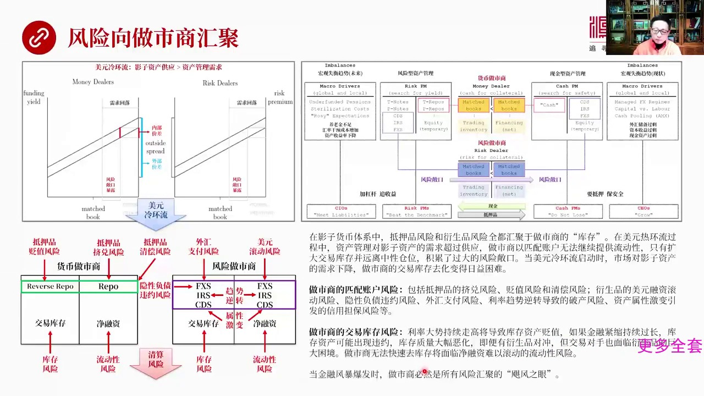

还有眼神病风险都集中往哪集中吗当然是往做事伤上集中集中因为做事伤是两个抵押品和眼神品的中书交换的中书所以我们来看如果我们把上集课配理梅林这个库存图不管你是货币作伤还是风险作伤都有自己的库存而现在在热环...

<strong>All subtitles</strong>

> 还有眼神病风险都集中往哪集中吗当然是往做事伤上集中集中因为做事伤是两个抵押品和眼神品的中书交换的中书所以我们来看如果我们把上集课配理梅林这个
> 库存图不管你是货币作伤还是风险作伤都有自己的库存而现在在热环的情况之下已经偏高了一旦变成冷环流立刻风险长口暴露一旦暴露冷环流来了怎么办各种风
> 险集中爆发比如说对于货币作伤的匹配帐户而言它有没有风险有抵押品贬值风险抵押品对换了风险抵押品轻常的风险那对于风险作伤匹配帐户有没有也有外汇支
> 付就是风险已经复债就是刚刚所说的你要是找不到美元了这会产生委约风险这都会经济在外汇调期上还有还有美元滚动风险你在美国货币上上滚动不了这也会出
> 风险还有利率调期会出趋势反转就是趋势逆转的风险也会是卖保险的赔死还有CDS会出现资产属性激变就是我们刚刚所说的突然你认为有风险风险高着资产突
> 然变成风险力了那也会出事除此之外还有库存风险因为在热环流情况之下交易商的做事商的库存偏高偏高之后它会必须要建立交易库存否则无法提供流动性正常
> 情况下它只需要匹配库存但是如果说这边的需求特别旺盛有一边需求特别旺盛它就必须得跟对方做好那就会形成交易库存风险这边也会形成交易库存交易库存越
> 大如果航轻一转它去库存就会变得非常的艰难去库存非常艰难会出现什么问题会出现我这边都是进融资我的交易库存前头脑来我也是借的如果说我去库存卖不掉
> 或者说每年初加息说表时间搞了太长那我持有这些交易库存中很多债券是会有纽约的不管是借债还是房地产债都有可能出现纽约纽约的话如果资产就会恶化恶化
> 我就更难卖更难卖我这边现金流就会出问题即便是我有有一些风险的眼上品的交易但是实际上我的交易对手其实现在情况也不妙这就会使得整个的问题变得非常
> 糟糕那么它的进融资部分有可能陷入难以滚动的风险这叫流动性风险所以风险做着伤在热宽流情况之下建立了大量的库存交易库存如果太大的话在冷宽流情况之
> 下就会面临一个融资的滚动风险或者叫流动性风险所以我们看看做着伤到处都是风险流动性风险最后做着伤了所有的风险一起爆发那就进入危机就出现了而且进
> 入危机一旦爆发的话那一定是做着伤是巨峰之眼所有风险都会及到它身上那怎么办这个风险还会继续地往前推进那就变成了清算风险好我们看下一就是做着伤的危机一定会向清算中心

---

### Slide 29

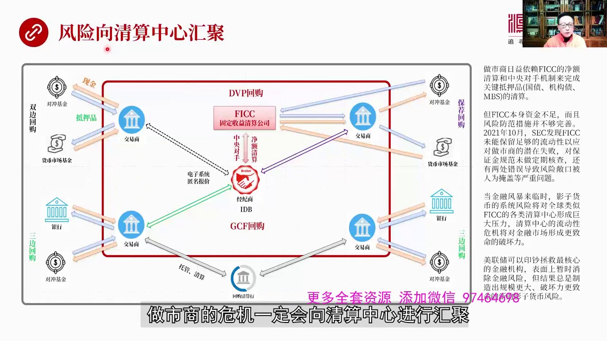

进行汇聚我们看到做着伤在在GCAF回够市场中它们形成了做着伤的这样一套体系不管双边回够还是三边回够还是DVP回够最后你会发现做着伤们都需要通过内部这个市场来分配资金而这个内部市场又是电子匿名报价的通过...

<strong>All subtitles</strong>

> 进行汇聚我们看到做着伤在在GCAF回够市场中它们形成了做着伤的这样一套体系不管双边回够还是三边回够还是DVP回够最后你会发现做着伤们都需要通
> 过内部这个市场来分配资金而这个内部市场又是电子匿名报价的通过IDB就是它的电子这个报价体系跟FCC进行进额清算FCC实际上它是中央对手房无论
> 谁跟我做我都跟它做而且是进额清算所以FCC应该是所有交易伤了风险最后的集中方大家把所有风险都军中它这了我的流程出了问题我的流动性也出了问题我
> 也出了问题而你要给我承担你要给我承担中央对手你不也有问题吗你要给我提供进额清算我这边让我约你不也出更大的问题吗所以最后所有风险会向清算中心会
> 剧但真正问题在于FCC本身资金是不足的而且风险防范措施很不完善我看报导说去年10月份2021年10月FCC就罚过他们的款主要是发现他们没有能
> 够保留足够的流动性以便应对做伤潜在了失败假如这个做伤它了怎么办如果这个做伤破产了怎么办像雷曼那个公司出现那个情况FCC发现美国政策会发现你们
> 这些人这么重要就是你这个系统这么重要居然你没有考虑到有任何做伤失败的风险那你就没有留够足够的流动性有一个如果破产你就破产了还有对于保证金规范
> 你没有做定期合查什么情况下说多少保证金双边的三边的应该定期合查应该定期的做这种检查但是它没有做还有还有几处错误导致风险场口被人为掩盖是故意的
> 这都是严重问题所以对他们进行罚款那么我们看到当金融风爆发的时候所有做伤因为雷压品和衍生品的风险全部集中在它这做伤身上做伤扛不住了所有风险都会
> 转移到它这而这儿的资本金本身就不足再加上防范的不够措施也有限那么我们会看到这样的情况会对全界所有类似afsac的各类各种类型的期货的比如说倫
> 敦金属交易所的还有这种回够市场各种类型的清算中心都会承受巨大的流动性价利那么如果清算中心倒掉几家那就不得了他们的流动性如果出现危机产生破产会
> 对整个金融市场全球金融市场造成更致命的破坏力当然美联储可以因潮票拯救最核心的包括afsac这样的清算中心或者交易商做着商这种重要的机构但是美
> 联储立次的拯救市场的办法你会看到最后的结果什么表面上展示消除了金融风险实际上最后总是加了钢尬总是使金融风险变得更大使钢尬率变得更高使金融体系
> 越来越处在一种高弓尬和高风险之下也就是影子艇影子银行的总的风险越来越大而不是减少了我们再看下一所以这就涉及到一个影子银行未来到底应该怎么

---

### Slide 30

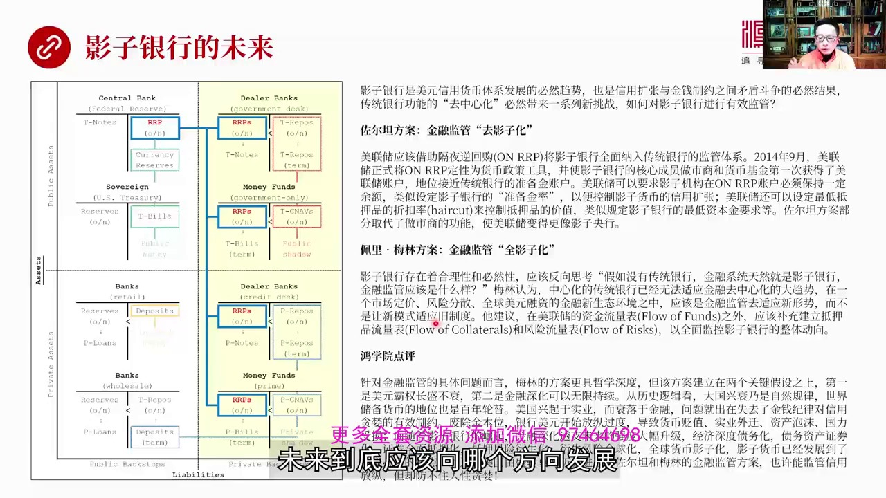

向哪方向发展应该怎么来进行监管我们知道影子银行是每员性体系发展的必然趋势它一定会朝这个方向发展当然也是信用扩张和金钱制约这种变成矛盾斗争产生的必然结果传统银行一定会去重银化当然这就会带来大量的挑战包括...

<strong>All subtitles</strong>

> 向哪方向发展应该怎么来进行监管我们知道影子银行是每员性体系发展的必然趋势它一定会朝这个方向发展当然也是信用扩张和金钱制约这种变成矛盾斗争产生
> 的必然结果传统银行一定会去重银化当然这就会带来大量的挑战包括我刚刚所说各种金融风险特别在金融风报之下那怎么监管影子银行呢昨日坦提出的方案叫什
> 么叫金融监管去影子化也就是把影子银行变成透明银行跟普通银行一起监管一样的监管这就是它说的要利用隔夜逆回构我们知道现在这是理财双口是这个货币金
> 理财双口这个货币金把多一约现金通过理财双口存到美联储存到隔夜逆回构这个账户上这样的话还可以转一些逆回构的利息所以昨日坦认为美联储应该把这个工
> 具利用钱把根据逆回构当成准备金账户我们知道普通银行都有准备金账户那么隔夜你以后不也相当于所有影子机构的准备金账户这样的话这不就可以把影子银行
> 全面纳入传统银行的先管模式吗因为我们知道2014年9月美联储正式把隔夜逆回构定性为货币政策工具那么这样一来就会使很多21家1交易商当然在美联
> 储有账户但是还有很多不同层级的更低层级的交易商是没有的还有大量对中基金从来没有现在很多的对中基金都已经申请了成为美联储的交易对手也就是在美联
> 储账户有了自己的账户了有了自己的交易账户等于是相当于传统银行拥有了美联储的准备金账户那可不得了这些很了不起的事那么美联储可以利用这个隔夜逆回
> 构工具要求所有影子机构必须要在隔夜逆回构账户上存一定的钱保持一定的娱乐就像他要求所有上银行必须要留有一定准备金是一个道理就相当于他可以给影子
> 鸦设定准备金率这样一来就可以控制整个影子鸦体系信用扩张的能力这是一点还有一点美联储也可以设定最低的底牙品的折扣率通过运回构如果说我来给你国债
> 然后你来给我现金然后我说我这个国债就八折然后这是一个卫视场这个底牙品制定价格的这么一种方式我也可以定成95折我也可以定成99折我通过调整它的
> 折扣率我可以确定底牙品到底值多少钱我如果把它调低一点我就会使整个影子鸦它的相当于调低了它调低或调高这个影子鸦最低资本金的要求你必须要准备多少
> 的资本金就可以达到这个效果所以昨儿谈的方案其实它的基本方向是部分取代做事上的影子鸦行的功能让美联储越来越像一个影子鸦行或者干脆就变成影子鸦行
> 传统银行影子鸦行它一块馆这是昨儿谈方案佩里梅林它的方案是金融监管全影的话这什么意思佩里梅林认为影子鸦行存在着合理性和必然性它就一定会朝着分布
> 式飞中心去中心化方向发展所以它说应该反过来问这个问题金融监管应该反向问反向怎么问假如没有传统鸦行所有鸦行都是影子鸦行天然就是在这种情况之下我
> 们的金融监管应该是什么样所以我觉得佩里梅林提的这个水平显然这个哲学的深度是比较高的佩里梅林认为在一个去中心化的传发展态势之下传统银行已经不太
> 适应了这个新的金融的生态是什么是一个市场定价的风险分散的全球美元融资的这是一种新的生态环境应该是金融监管去适应新的形式而不是让新的形式或新的
> 这种金融模式去适应旧的制度所以佩里梅林建议在美联储的资产这个资金流量表Flower Fund之外就是这是美联储现在在它金融账户中专门监测经济
> 的各个板块之间各个门内之间它们的资金使用和来源的流向就是资金怎么流从在经济部门中它怎么流它建议在这个流量表之外在应该补充建立抵押品流量表还有
> 风险流量表这样才能全面看清影子银行的动向我们知道资金流量表这个概念比较早当时就说有国民收入账户这个概念之后但是国民收入账户基本思路是它就是一
> 个物交易的体系没有考虑到金融融资没有考虑到钱从哪来好像是所有人工厂和工厂之间都在进行以物一物的交易所以后来六人来提出应该是四年代就已经发展到
> 现在的主院称刑形成了资金流表这样的现金流表这样的一个概念就是我得把这个表配合到国民收入表才能看清楚经济各个部门之间资金是怎么运动的但是配理没
> 理认为你这个资金流量表是正在工业化时代而我们现在进入了影子货币这个时代传统银行你用资金流量表还行影子货币我们不是资金在流动资金不仅是资金在流
> 动还有蝶蝶也在流动还有风险也在流动你光丁的资金你不丁蝶蝶你不丁风险其实没意义所以要监控影子银行必须要把这两个表也复加进去但是昨日坦认为除了这
> 两表还以外欧洲美元的流向也加进去三个表来补充资金流量表才能够有效监管整个影子银行体系的流动情况那么我们的点评是什么红穴的点评是针对金融监管的
> 具体问题而言我觉得配理美临的方案更有哲学深度但是配理美临的方案其实建立在两个关键假设之上第一个假设是什么就是美元霸权长胜不刷第二个假设是金融
> 身化可以无限持续但是如果我们从历史上来看大国新刷它是自然规律世界储备货币的地位也是大概一百年一轮替我们现在看到美国实际上它星期于10月但衰落
> 于金融问题出带了金钱的纪律对信用的贪婪的这种制约逐渐丧失了非洲金本位以美国的应该说银行美元开始大幅的增发放纵过度当然结果就是美元贬值10月外
> 签资产泡沫国力受损这就是我们看到的青年代智障那个时代但是后来随着隐正央的崛起美国开始了金融身化而金融身化实际上就把一切都债务化透支未来实际上
> 它透支未来的强度有了隐正央之后这个强度是大幅升级就是经济深度债务化债务资产正捐化正劝资产全面抵押化抵押风险眼声化眼声风险全球化全球货币影子化
> 所以影子货币已经发展到了顾及必反的观点在我看来实际上是在加速美元和美国游盛转摔的历史进程那么昨日谈和梅林不管你提什么样的金融监管方案吧也许能
> 够监管信用放纵但是却防不住人性的贪婪就常用而言还是没有什么太大作用的好 我们再翻译最后看总结

---

### Slide 31

我觉得我们今天这场课讲的影子银行概括起来就是一句话一个中心两个基本点就是一美元融资为中心以抵押融资和风险转移为基本出发点这就是影子银行全部的内容美元中心抵押融资加上衍生品风险转移那么对于影子货币我觉得...

<strong>All subtitles</strong>

> 我觉得我们今天这场课讲的影子银行概括起来就是一句话一个中心两个基本点就是一美元融资为中心以抵押融资和风险转移为基本出发点这就是影子银行全部的
> 内容美元中心抵押融资加上衍生品风险转移那么对于影子货币我觉得也可以概括成一句话就是抵押品流动之后留下的复债的痕迹痕迹利利贷幕抵押品以不知所踪
> 啊那么我们为什么要研究影子银行和影子货币我觉得根本目的在于理解货币进化的内在规律历史经验表明货币始终是在金钱制约和信用扩张这一对变成矛盾之中
> 以新的形式不断轮回而已影子货币是抵押抵押品派生出来的一种复债它是有收据而抵押品本身原本就是复债它就是债务那么这个债务在转抵押过程之中又创造出
> 更多的债务更多的债务以后衍生出更大的风险而这些风险的衍生品本质上还是债务所有债务叠人在一起就好像如山的重复沉重地压在了实业微博的现金流之上我
> 们现在看这样的信用扩张显然已经走向自己的反面所以我觉得现在历史正在轮回货币也正在轮回全球化这种分裂的态势我觉得势必产生一个多极化的货币体系大
> 家相互竞争也就是我说的货币的战国时代来临了那么在战国时代每一种货币都会尽可能的权力吸收对手的合理之处以强化自己的优势那么影子货币作为美园体系
> 发展的最高阶段我认为确实是有它的过人之处的它的高效性、它的灵敏性、它的变结性这是有优势的比如说抵押品融资、
> 风傘风险分散还有做事商中心制回够市场、资产中间化还有专业分工、市场定价、信用增强流动性单宝等等这种金融技术还是相当值得学习的这些都是未来构建
> 东方新的货币体系可资借账之处如果说我们能够合理去吸收它比如说抵押品、去债务化、衍生品、
> 去投机化做事商、去特权化以黄金、资源、能源和商品作为回够的核心把实体经济所产生的真实信用然后进行资产政变化那么我觉得其他的技术都可以为我所用
> 这样就可以做到做收起立而必其害那么东方新货币体系主要目标是重建货币纪律、约束信用扩张搬走债务大山、
> 形成高校市场实现财富均衡使金融真正服务于实业让世界经济受益于新的东方货币秩序这就是我们这个影子银行的全课的总结那么下面我还是推荐阅读配理梅林的基本书

---

### Slide 32

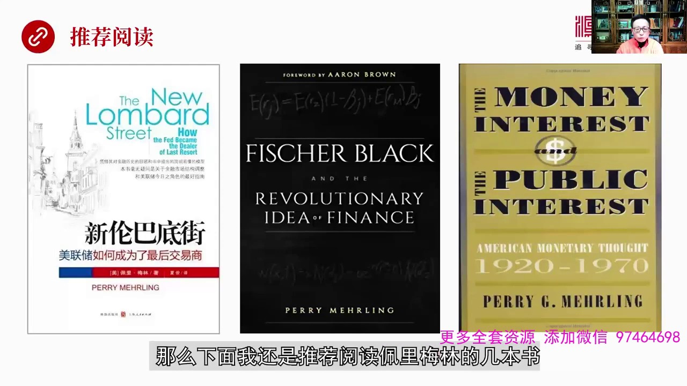

然后还有上次我们推荐的一些左尔坦的相关文章还有就是这些课我们设计到的外汇市场那些统计报告

<strong>All subtitles</strong>

> 然后还有上次我们推荐的一些左尔坦的相关文章还有就是这些课我们设计到的外汇市场那些统计报告

---

### Slide 33

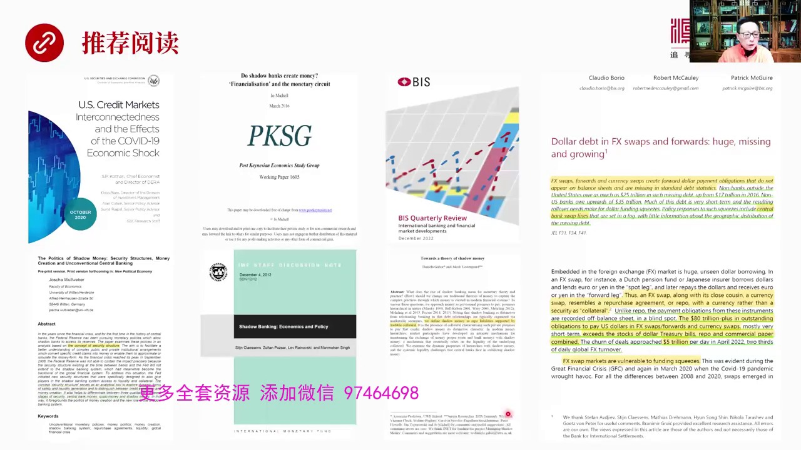

包括2022年、三年的BIS统计的数据还有一些新的BIS报告在这这个是新冠疫情之前美国SEC对于美国短期货币市场的资金图的报告非常好还有就是关于外汇调期所隐藏的巨大的80万亿美元复债的这些文章MF有关...

<strong>All subtitles</strong>

> 包括2022年、三年的BIS统计的数据还有一些新的BIS报告在这这个是新冠疫情之前美国SEC对于美国短期货币市场的资金图的报告非常好还有就是
> 关于外汇调期所隐藏的巨大的80万亿美元复债的这些文章MF有关货币影子货币还有影子银行的一些文章那么最后还有一些相关的关于财政部的

---

### Slide 34

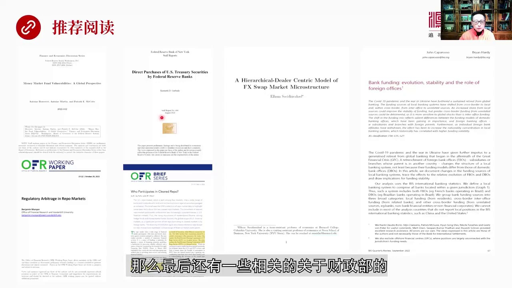

还有一些美国其他的一些机构发表的各种各种各样的有关警察货币的文章如果大家有兴趣都可以读一下今天我们的课就到这里谢谢大家欢迎参加轰炫打赢人生的货币战争

<strong>All subtitles</strong>

> 还有一些美国其他的一些机构发表的各种各种各样的有关警察货币的文章如果大家有兴趣都可以读一下今天我们的课就到这里谢谢大家欢迎参加轰炫打赢人生的货币战争

---

### Slide 35

欢迎参加轰炫打赢人生的货币

<strong>All subtitles</strong>

> 欢迎参加轰炫打赢人生的货币

---
