# 核心课视频-107-110_2023年欧美银行危机深度解读 — Clean Slide Notes

> **来源**：鸿学院核心课程  
> **幻灯片**：30 张

---

### Slide 1

重點來深度解讀一下2023年歐美銀行危機爆發的原因以及它未來的發展趨勢這張課我準備了很長時間大概將近兩個月之間主要是閱讀了大量關於銀行危機的報導還有大概上百篇各種各樣的深度分析的文章包括許多論文主要的目的在於把這次銀行危機當成一個契機然後把銀行危機所爆發出來的很多新情況、新素材然後跟我們紅旋的美元還...

---

### Slide 2

看這場2023年3月爆發的歐美銀行危機進行一次驗證好我們看下一頁首先我們的理論架構

---

### Slide 3

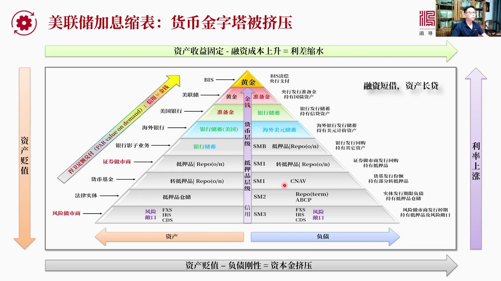

實際上是一個貨幣金字塔的這樣的一個形狀就是我們貨幣金字塔的理論架構這其實是我們美元還留體系中一個非常核心的這麼一個邏輯結構在我們的核心課中也反覆強調了它的重要性咱們有一系列的關於影子銀行這樣的系列核心課這個是這堂課的中心那麼我們如果從這個金字塔來看發生的銀行危機我覺得基本上可以一幕兩人看清它的根源首...

---

### Slide 4

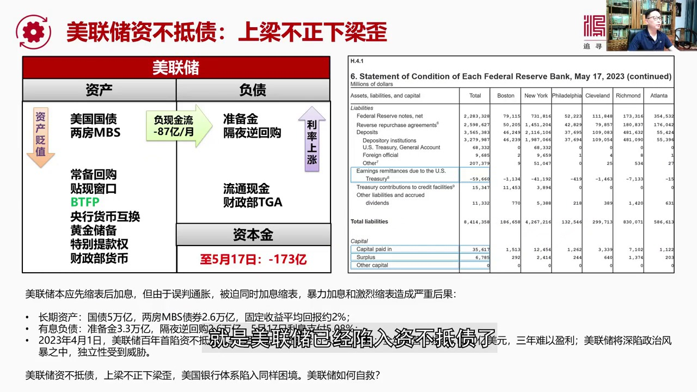

這就是所謂上涼不正下涼歪那麼如果我們來看美聯儲的資產分代表出了哪些問題當然跟我們剛剛看到的金塔的全圖是一樣的這篇歷律在上涼這篇資產在貶值因為美聯儲持有了國債資產和兩方NBS資產都是屬於長期的固定收益而且他買金的時候就是量換寬鬆那個時代就是他的收益率還非常低大概也就2%左右所以你在這持有一個龐大的幾萬...

---

### Slide 5

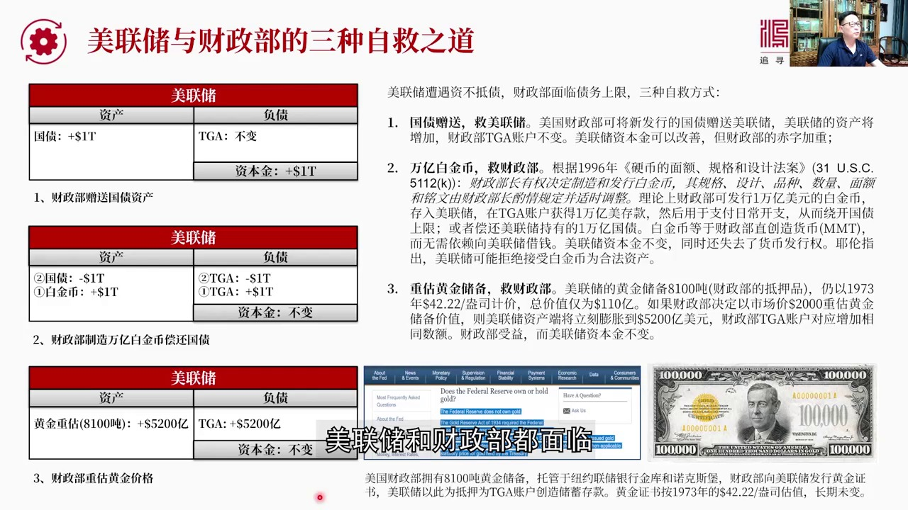

現在都面臨困境美聯儲當然滋不得代財政部呢財政部是債務上限到現在為止還沒有一個結果6月初我們看到美國有可能財政的資金就不夠了甚至有可能出現違約如果兩黨不能夠達成財務上限的協議的話那國債就會違約後果將極其嚴重所以現在美聯儲和財政部難兇難地面臨同樣的困境怎麼辦調整自戰費代表有三種方式比如說現在如果要救美聯...

---

### Slide 6

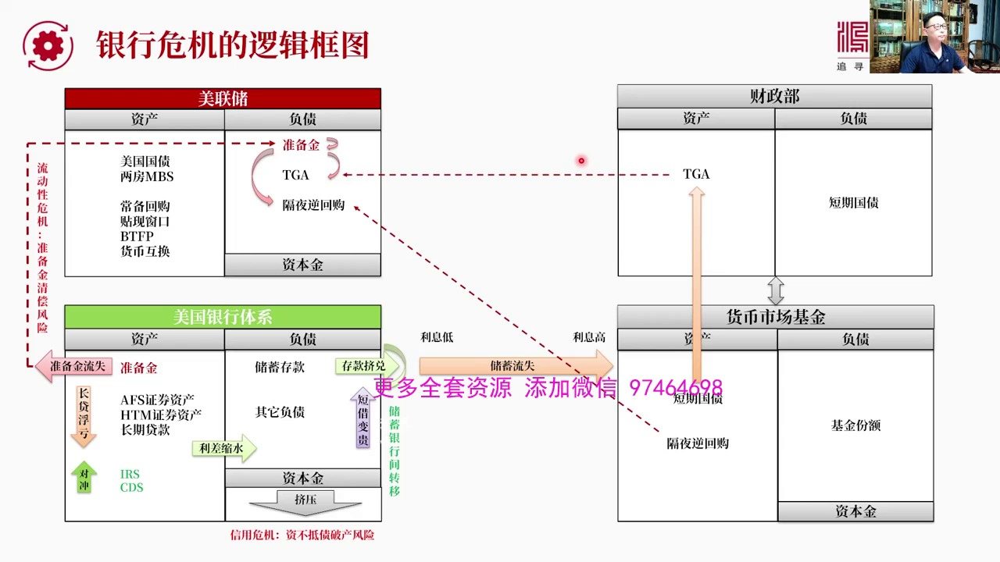

我們需要用邏輯框圖的方式加以展現大家螢幕了然能夠看清楚是怎麼回事首先這是美聯儲自然責表國債、兩王債長輩回購便利體驗窗口這是新的BTFP這是就銀行的這是貨幣貨幻當然體驗窗口跟BTFP是有差別的體驗窗口它的利率更高或者叫創發性利率是5.25%加稀之後BTFP比它要低而且低壓接受低壓品的類別也不一樣BTF...

---

### Slide 7

有什麼條件就是在什麼情況之下銀行會出現這種幾對為什麼歸股銀行他幾對了而其他有些銀行沒有出現幾對這就是這部分的重點我們看下一頁那麼在下頁中間

---

### Slide 8

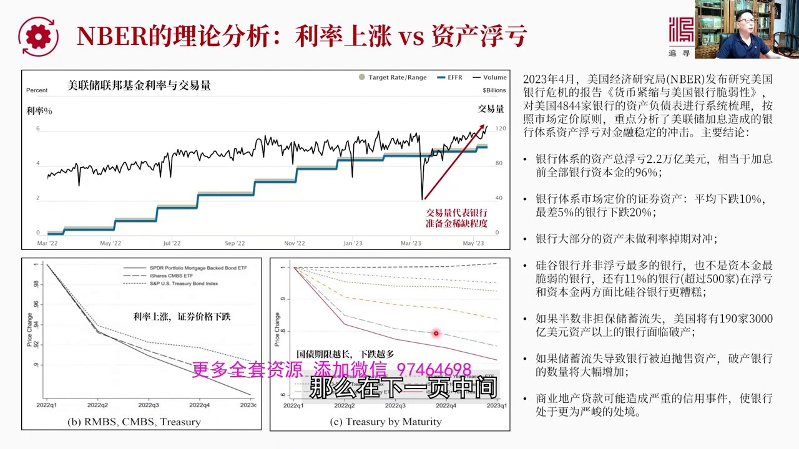

首先我們來看美國經濟研究局NB12他們發表的一篇非常重要的論文我們從他這個論文的分析來入手解讀為什麼會有些銀行出現幾對有些銀行並不發生幾對這個美國經濟研究局當然是美國一個重磅級的一個經濟研究機構像我們看到了什麼時候美國出現衰退這都是由他們來最後確定的2023年4月美國經濟研究局發布了一篇非常重量級的...

---

### Slide 9

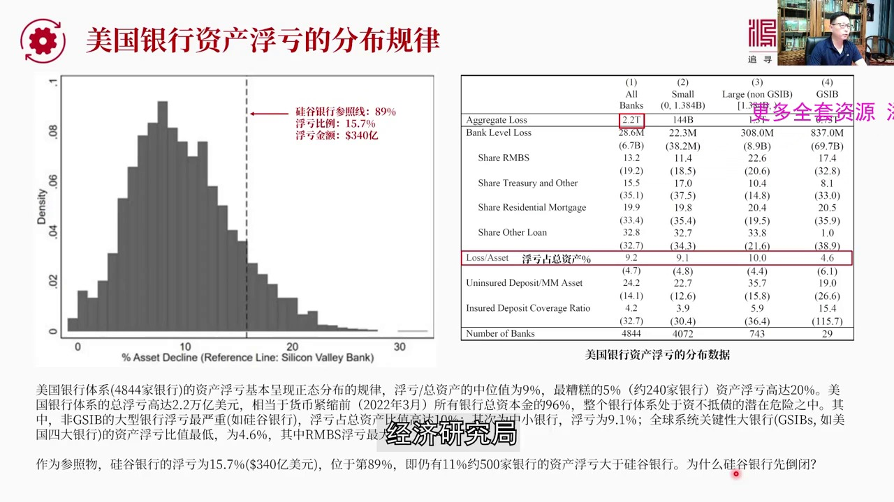

4800家銀行的資產福規做了統計分析之後發現了一個分布規律分布規律是什麼我們看這張圖分布規律就是比如說這根中間的虛線這是代表著參照參照線這是一個規谷銀行作為參照線規谷銀行處在所有銀行的89%的位置上福規比例是15.7%它站著福規來排序然後你排到89%福規就是資產下跌占全部自然的比例是15.7%當然我...

---

### Slide 10

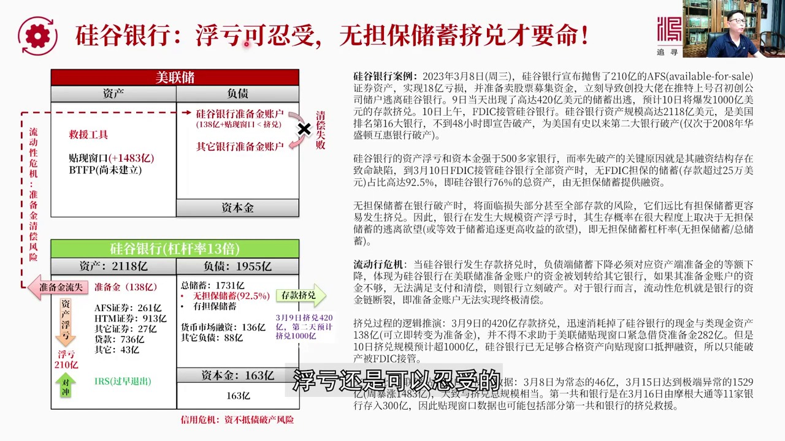

但是無擔保儲蓄的幾對這是要命的如果我們看歸股銀行的資產出來表你會看到歸股銀行尬尬率大概是13倍就是你的資本金敲動多少資產163億的資本金或者叫能夠擁有的資產是2118億這是2022年歸股銀行的資產是在它的財務報表上的數據這些都是財務報表的數據那麼我們看到它的負債是1955億資本金163所以這兩邊是平...

---

### Slide 11

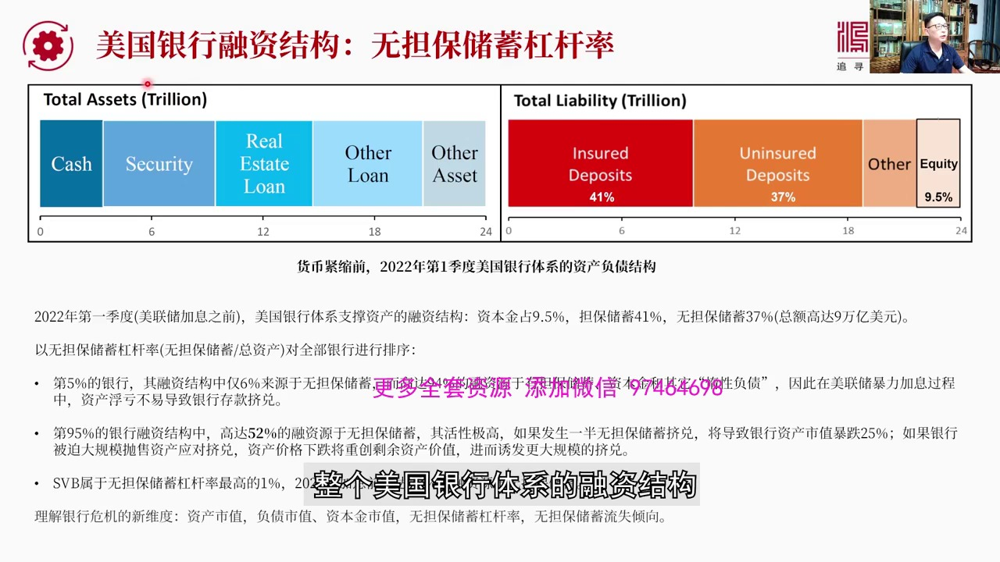

體系的融資結構也有一定的問題關鍵就要看乎擔保儲蓄看看率就是乎擔保儲蓄佔這個總儲蓄的比例我們如果看一下這個這是銀行危機錢就是在貨幣緊縮之前相當於2021年2022年第一季度美國銀行體系自然與負債的結構這邊是融資結構這邊是自然結構總為王24萬億這邊24萬億然後美國銀行的主要的資產現金所對應的數量級還有證...

---

### Slide 12

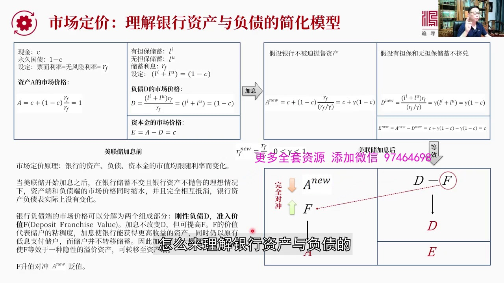

我們要做一個簡化的模型首先我們來看每個主價實際產業和價值之後美國銀行的資產負債表到底發生什麼變化首先我們來看這個就是美國經濟研究局他們的這個計算模型首先一家這個最對於所有美國銀行做一個整體來看的話它有現金資產這是C那麼它還有國這個國債我們假設這個國債是永久性國債不考慮它的97這是假設性的那麼如果我們...

---

### Slide 13

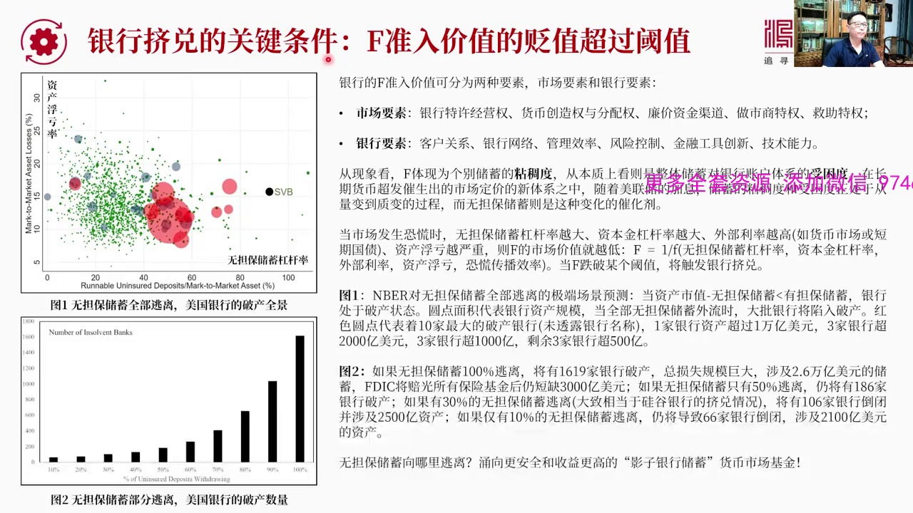

我們如果把這個條件體驗出來就是F代表準路價值的貶值超過預值其實F是相當於處戶的年仇度如果大家都不動加息其實不影響銀行資產負債和它的資本金全都不發生變化假如一個處戶一分錢都不走的話這就代表準路價值極高但是如果處戶開始大量流失而且非常快的流失代表準路價值在快速變值一旦貶到一定預值之下這叫銀行就不可就要會...

---

### Slide 14

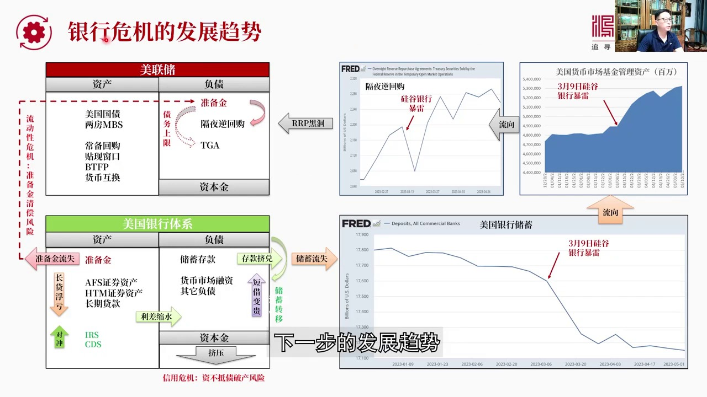

其實我們看懂了這張圖就夠了美國銀行體系只要處去繼續流失那麼如果從統計數據來看我們可以看得很清楚美國銀行統計從這個處去的流失數字可以通過H.8表每天說H.8表來得到這些數據你會看到3月9號歸股銀行爆雷之後銀行處去大幅下降然後一照現在一直持續不能再下降一日到5月中這些銀行處去流上了哪呢當然流向了貨幣市場...

---

### Slide 15

這個浮潰因為利率上漲資產一定會浮潰為什麼不做利率對通為什麼不使用利率調期原因可在我們看下一頁這就要涉及涉及到利率用回顧了我們知道

---

### Slide 16

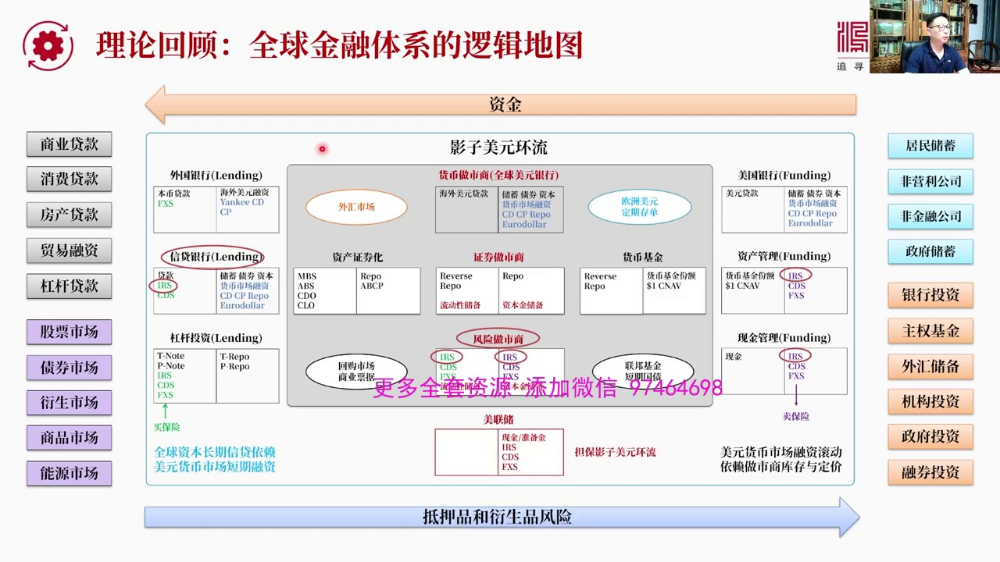

這個咱們核心課面專門講過這張全球金融體系的邏輯地圖從邏輯地圖上你可以看到很清楚這邊是資金的需求方這邊是資金的供應方然後雙方通過中間的做事商後裔做事商證券做事商風險做事商包括美聯儲來實現資金從這邊向這邊轉移同時抵押品從左向右的轉移當然還有眼神風險都在往這邊轉移資金是往這邊流動其中跟我們這個銀行V相關的...

---

### Slide 17

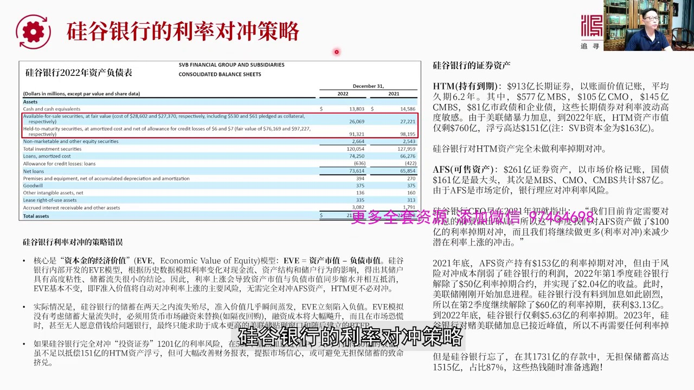

這是規谷銀行2022年自然代表我們看到它的兩項資產可交易的債券還有持有道歉的債券分別是這麼多這是2021年這是2022年底261和913億那麼它首先它的問題在哪它的問題是規谷銀行它的利率對重的策略犯了重大錯誤為什麼因為它的核心策略就是資本金的經濟價值EVE這個EVE跟我們剛才講的所有銀行認為利率上漲...

---

### Slide 18

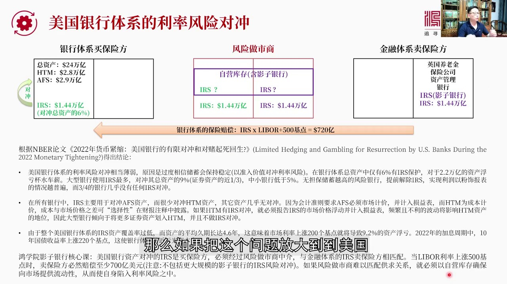

美國整個銀行體系有多少銀行做了利率對衝呢其實我們可以看到這個美國經驗第二天調查局這幫人寫了另外一篇論文叫2022年貨幣緊縮美國銀行的有限對衝和對度其次回升這篇文章得出了一個基本結論就是美國銀行體系利率風險對衝相當薄弱沒做到了對衝原因是什麼原因還是過度相信這個儲蓄會保持穩定不會大幅度的流失就是主入價值...

---

### Slide 19

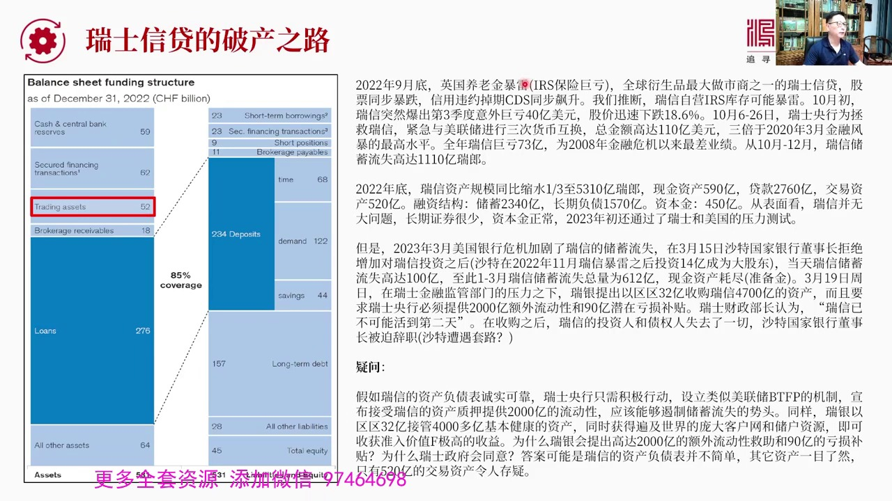

我們可以看了一幕了然去年年底公布的財報這邊它的貸款2761它的存款2341大概覆蓋了85%它的現金還有在央行的準備金榨戶中大概有591都是累了還有還有它的交易資產比較有意思521問題就存在在這裡它還有其他資產另外其他負債這邊是它的融資結構看起來也比較簡單短期融資個月回購等等還有這個這個融資融券的東西...

---

### Slide 20

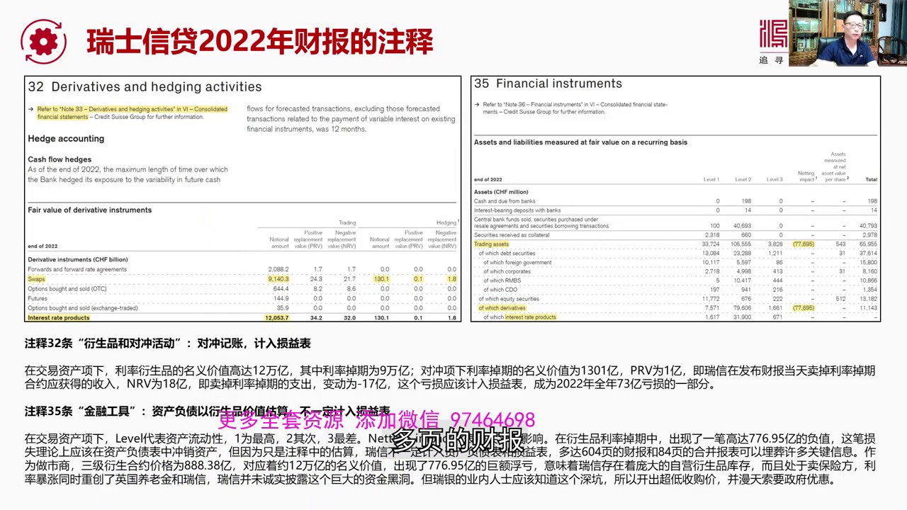

再加上80多頁的他的補充報告或者是合併報表加在一起你要找資產費代表以外在另外一本報表中間的某一個注視中間的小字還得拿到放到鏡比如說這兩張圖其實是我用放大的尺寸要不然大家根本看不清這些字也看不清這些字實際上他的財報中間的注視有兩條非常關鍵第一條是第一個是32條就是他的衍生品和他的對充活動這是有專門的機...

---

### Slide 21

首先如果不救

---

### Slide 22

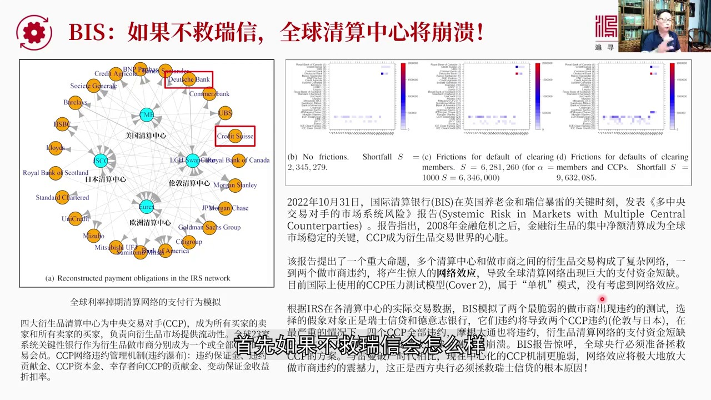

瑞士信會怎麼樣BAS正好在那期間做了一個報告這個報告就說如果不救瑞士信全球侵犯中心將會崩潰這個也是非常有意思的一個報告去年10月31號2022年10月30號國際侵犯銀行正好是在英國來揚勞金和瑞士信爆雷的關鍵時刻發表了一篇重棒級的文章當然知道好像很少不太多因為月頭量不太大這篇文章叫多中央交易對手的市場...

---

### Slide 23

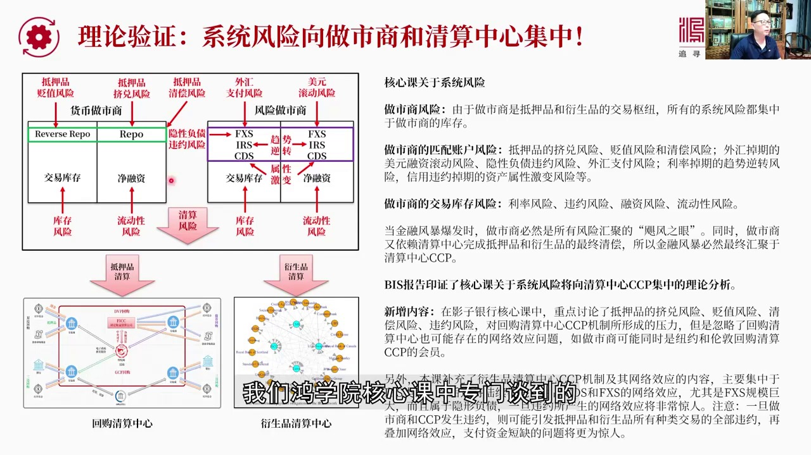

專門談到的在影子央體中間最後所有風險都會向做事商做事商再向清算中心進行集中這是我們的理論推演為什麼呢因為做事商要為所有的抵押品和衍生品做這個中介它是交易輸扭所以整個系統的風險是向做事商集中而做事商最終又向清算中心集中比如說它的這個交易庫存匹配帳戶交易庫存它有多種風險抵押品免支抵押品幾對還有抵押品清場...

---

### Slide 24

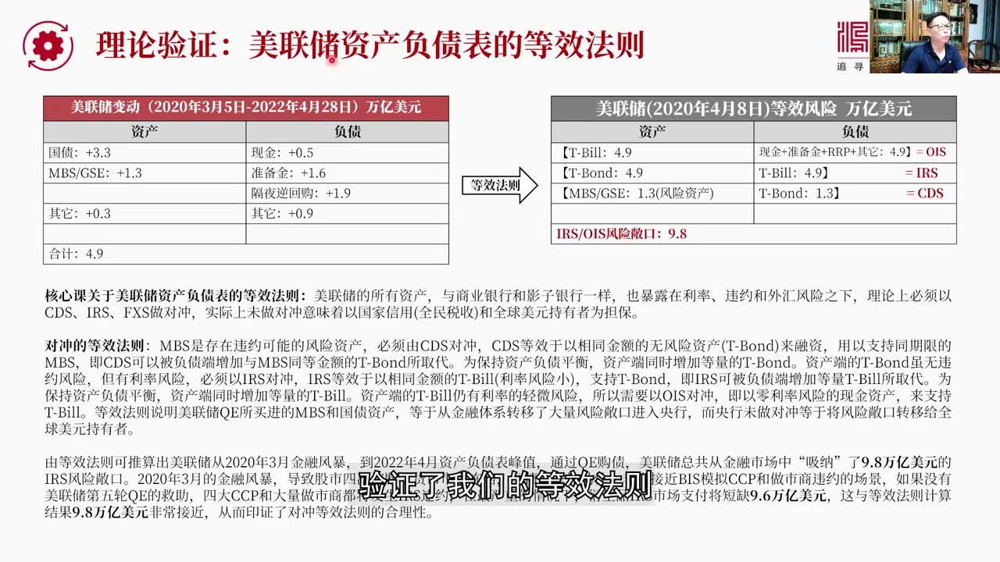

法則咱們在這個核心肯定來專門講過我們分析美聯儲自然負債表售有個等效法則等效法則其實可以通過BIS這個報告反向來驗證為什麼這麼說就是你會看到當一家精散中心倒掉或者倒掉兩家然後還有這個幾家發生違約的時候整個精中體系整個這個眼睛眼睛品的教育上是完全被凍結住因為自徑無法周轉沒有辦法支付9萬億誰也拿不出這個錢...

---

### Slide 25

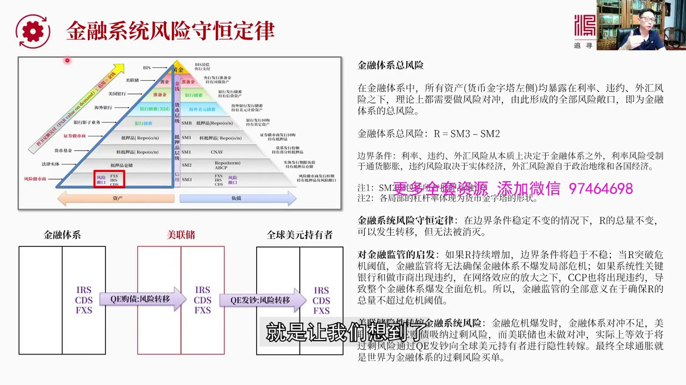

進一步提煉提煉成金融系統的風險手工定律首先我們要定義什麼叫金融體系的總風險金融體系中間其實就用金產移目了人所有資產就是金產的阻我冊從央行一直到底下的所有的對中基金保險公司銀行全部加在一起所有資產它的左邊就是這個金產的左邊就是所有資產這一塊這些所有的東西都暴露在風險之下利率違約外匯風險理論上來說所有左...

---

### Slide 26

欧美银行危机其实爆了出很多金融体系的新问题但是也提出了很多新素材还有新思路这让我们能够把这些东西整合在一起融合到我们美元化流体系就会使我们的架构我们的逻辑结构变得更加的具有遇见性解释力就会变得更加的完备这就是我们讲这个核心客的最主要的目的那么我们在这个银行危机中看到哪些新问题呢其实我们看到了一系列新...

---

### Slide 27

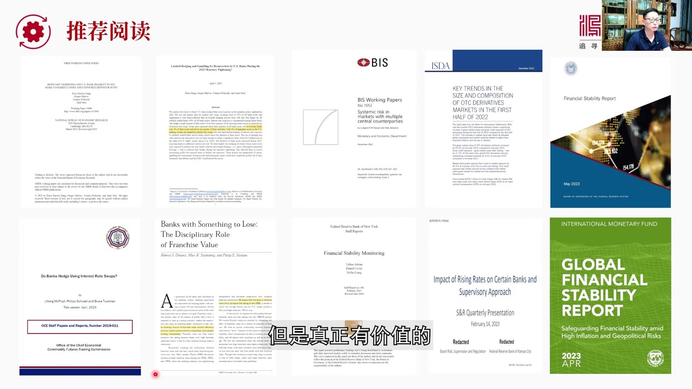

有最主要的就是这边这边是引用比较多的就是关于美国444家银行的自然副照片进行统一整理然后得出了一系列多少家银行在多少处序无代码处序他把金融之下会倒闭等等他做了一些这篇文章做了非常深入的分析当然这是第二篇文章这个是做的过于对冲方面的就是这是一伙人一帮人似的都一样写到两篇论文这篇论文主要是分析为什么美国...

---

### Slide 28

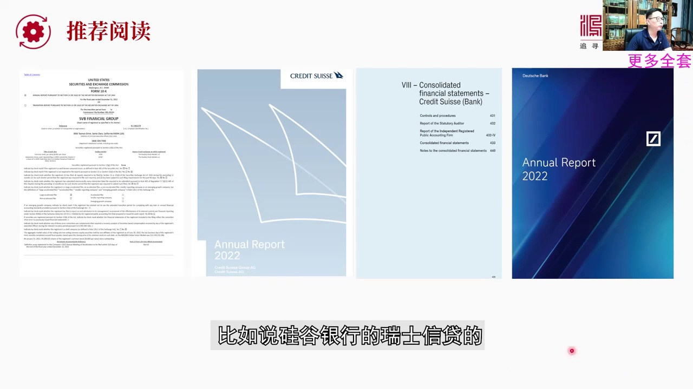

瑞士印代的他的报表还有他的补充的还有得一只银行的报表其实你看不清楚这些背后的底层的或者最深的那些树藏了哪里你如果装出这个树或者不理解它这个账怎么做的特别是那些账做完之后不具体告诉你是什么类别也不具体告诉你它是怎么怎么这个树子来于哪它就告诉一个种树而且是柱式而且这个树还不进入还不进入这个损一表也不填在...

---

### Slide 29

学习进步

---

### Slide 30

---
