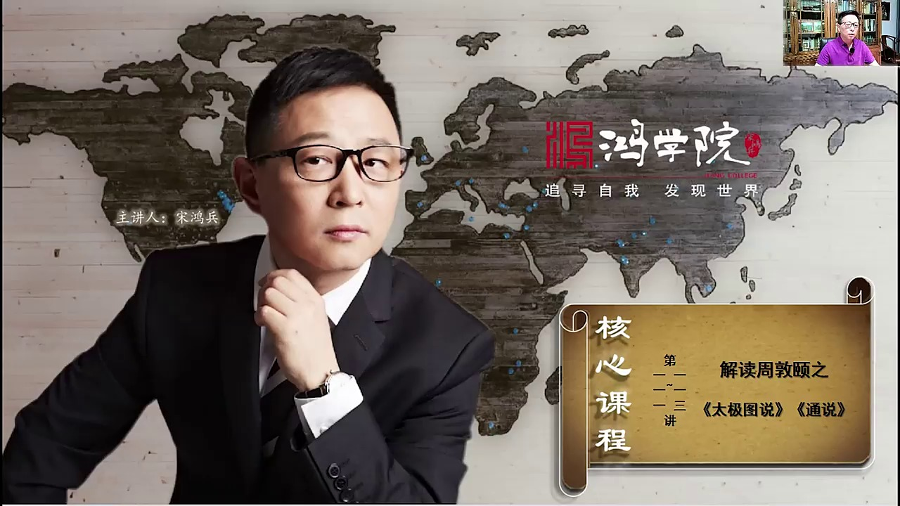
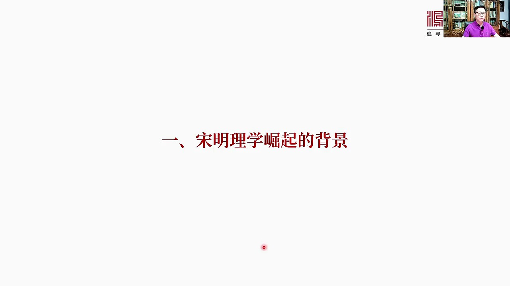
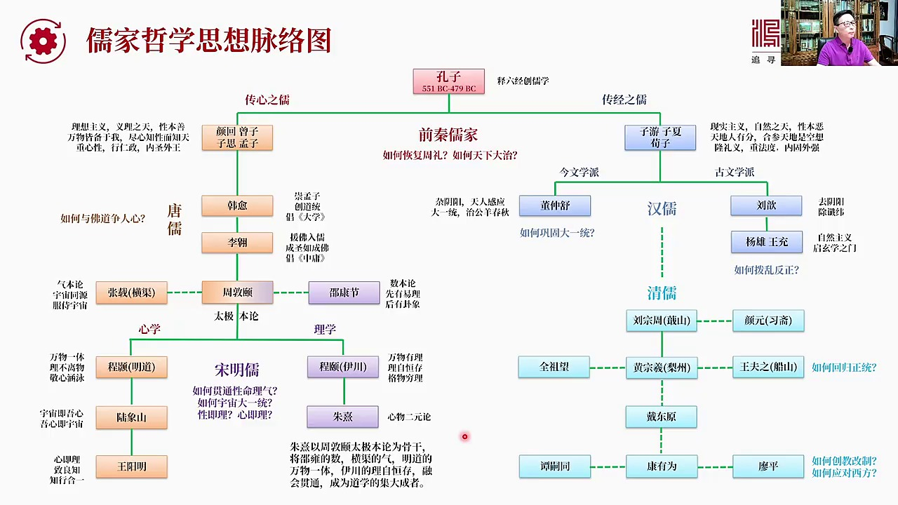
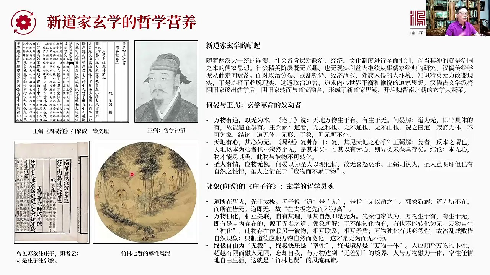
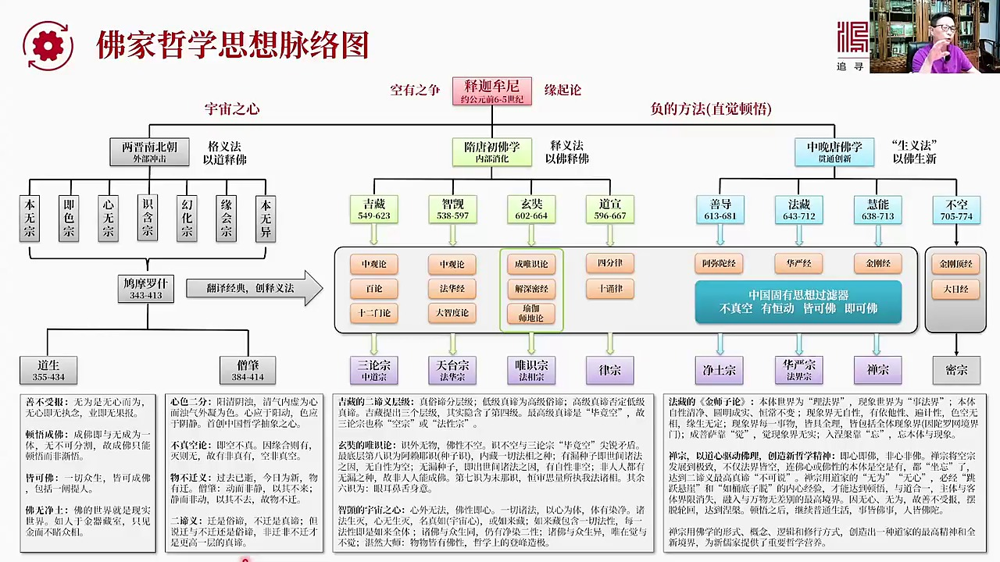
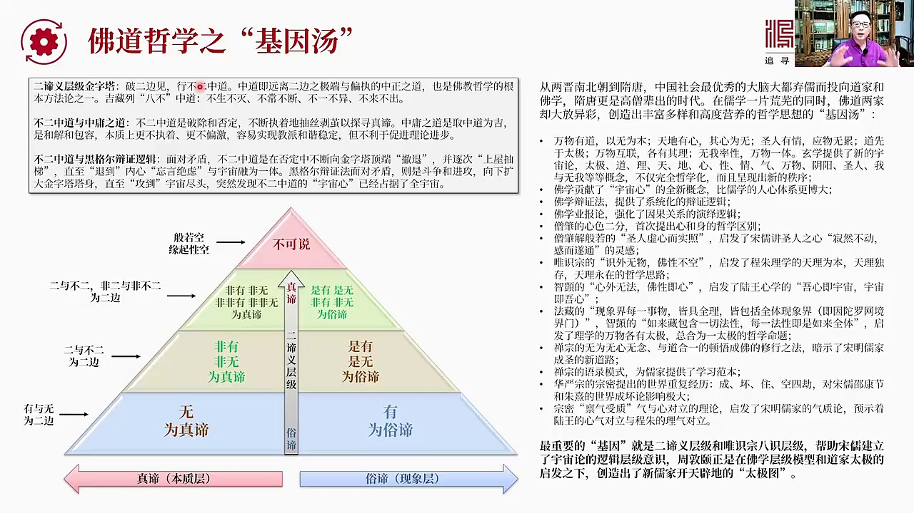

# 核心课视频-111-113_解读周敦颐之《太极图说》《通说》上 — Detail Slide Notes

> **来源**：鸿学院核心课程  
> **幻灯片**：7 张

---

### Slide 1

重点解读一下周敦一的态极图说和通说本来这个是作为我们读书会的收官解读但是后来通过挖掘发现周敦一这个态极图说和通说一意重大所以做了深度的发掘之后应该说越挖越深面也是越扑越广结果最终花了一个多月的时间把新...

<strong>All subtitles</strong>

> 重点解读一下周敦一的态极图说和通说本来这个是作为我们读书会的收官解读但是后来通过挖掘发现周敦一这个态极图说和通说一意重大所以做了深度的发掘之
> 后应该说越挖越深面也是越扑越广结果最终花了一个多月的时间把新如家崛起前后的他的背景他的前一后果进行了深度发掘然后进行了仔细的逻辑层面的分析所
> 以才有了这样一个比较庞大的核心课我们从收官解读把它正式列为核心课的课程因为我觉得周敦一这态极图说和通说非常重要对于我们理解如家思想他的中心一意重大我们看下一首先就是宋明理学崛起的背景

---

### Slide 2

我们知道李学或者如家学说吧他到了宋明时代发生了一次突变重大的便宜在我们大多数的脑海里觉得如家思想似乎是从孔子时代一照现在一意冠职没有明显变化实际上不是这样从孔子梦子之后其实在两汉进行两汉以后的很长一段...

<strong>All subtitles</strong>

> 我们知道李学或者如家学说吧他到了宋明时代发生了一次突变重大的便宜在我们大多数的脑海里觉得如家思想似乎是从孔子时代一照现在一意冠职没有明显变化
> 实际上不是这样从孔子梦子之后其实在两汉进行两汉以后的很长一段时间如家学说是在走下坡路的特别是在未尽南北朝随堂的时候其他的学说比如说道家的佛家
> 的崛起了而如家思想逐渐的被人们所遗忘虽然在堂戴以后他一直是科区考试就是考公园闭考的内容但是实际上他已经失去了心力失去了对人们的感召力变成了一
> 个酷味的东西就是大家虽然学他但是也不信一直到宋明李学宋明的这个李学星期的时代发端于周登一才彻底改变了如家思想大概有1000年衰落的进程那么到
> 底这件事情是怎么发生的这就是我们这部分要讲的内容我们看下一首先要搞明白

---

### Slide 3

如家思想他的发展的卖落我们需要用一张图来把这个问题全面展示出来这就是如家哲学思想的卖落图孔子当然是如家思想的创始人他通过解释六斤注释六斤创造了如家思想的整个体系那么六斤大家都知道包括一斤师书里一月春秋...

<strong>All subtitles</strong>

> 如家思想他的发展的卖落我们需要用一张图来把这个问题全面展示出来这就是如家哲学思想的卖落图孔子当然是如家思想的创始人他通过解释六斤注释六斤创造
> 了如家思想的整个体系那么六斤大家都知道包括一斤师书里一月春秋那么孔子是在于注释这些其实从周代以来的经典的思想然后通过注释解读教学逐渐形成了自
> 己的理论体系那么孔子之后实际上他的如家思想分裂成了两种派系分裂成了两支一支呢我称为是传心之如还有另外一支是传经之如两者是有差别的甚至在很多观
> 点上是截然相反的虽然他们都推崇孔子作为思想的源头但是他们的发展路数是不一样的传心之如就是重点研究人的心性传经之如是重点研究孔子的言行包括六斤
> 的这些理论知识那么传心之如他的主要代表人物包括严回曾子子思和孟子所以叫思孟学派那么这一派主要的主张是可以说是一种理想主义的思维方式他们讲的是
> 毅力之天有天这个天不是自然之天是毅力然后人性是本善的然后核心观点比如说包括孟子的万物皆被与我所以我们只要进心知性然后就可以知道天所以他是一种
> 重心性然后主张行人正强调内圣外亡的学说另外一派就是紫油紫下特别是寻子他们这一派主要观点是一种现实主义的观点讲究自然之天明确强调人性本饿那么对
> 于孟子他们所说的所谓万物皆被与我只要我知道自己的心性就能够知道天的大道这个县实主义不是这么认为的他们认为太理想主要观点是什么呢就是天地人各有
> 各的分配的工作老天爷的事你别管人的事做好人的事就行所以这是有分别的那么从这个观点来出发他们认为孟子那一派说你要残合天地这是空想做不到所以这一
> 派强调一定要重礼儀要重法度只有内固才能外强所以我们看到这两派的观点是非常相反的就是一个理想主义一个是县实主义那么从思梦之后呢当然我们知道后来
> 建立了这个秦汉秦汉那个时代这个学派其实并不吃香因为他走心而秦汉那个时代我们知道循子的弟子有两非常著名的人物一个是寒非子一个是这个李思这两个人
> 都是法家的人物所以他们用循子的理论创建了法家的思想也用法家思想来治国导致了秦国崛起最后统一六国建立了这个大一统的时代当然秦很快被推翻进入到了
> 汉朝那么汉武第那个时代从这个汉岛组到汉武第那个时代实际上是最重要的一个问题就是如何鞏固国家的大一统局面我们知道在前期时代最重要的课题或者叫命
> 题叫如何恢复周理这是孔子招丝业响的一件事我们只有回到周理才能使国家大致因为春秋战国太乱了军部军陈不臣社会的秩序大乱所以对于孔子那个时代最重要
> 的就是如何客气复理恢复周理然后才能实现天下大致好到汉辱的时代天下已经统一了那么如何鞏固大一统局面呢这个时候其实星期是董众书的学派这叫金文学派
> 强调的是要把阴阳学说还有五星学说全部包容在一起纳入如家体系所以董众书强调天人感应主要是为了实现大一统的意识形态的这种工作就让他跟汉务地所提的
> 不仅是要有一个皇位上的皇上还要立一个精神上的皇上全是这个全社会才能够统一思想大一统才能得到孔雇所以这个是西汉时期以董众书为代表的金文学派当然
> 到了东汉就出现了孔文学派因为孔文学派非常不满如家思养纳入了很多阴阳学说还有所谓的称为的各种各样的五星八卦全部都融进来了以刘星威代表的人说这不
> 行这把如家思养完全搞混乱了这根本不是孔子以前的原知原味的如家学说所以一定要去阴阳出称了当然在他之后在东汉时代以阳熊王冲为代表他们那个时代最关
> 心的是如何拨乱反正让如家思想重新回到孔子的证归所以他们强调不要搞这么多阴阳不要有这么多五星要把阴阳五星这些感出如家把称了这套理论彻底山厨恢复
> 到孔子的原本的思路上来强调自然主义不要搞这么的天人感应然后这样的一种学派其实启动了后来两进的选学这是汉如所以在这400年中间孟子这一派基本上
> 摔落了没有人继承当然东汉之后我们知道天下大乱然后就是未尽南北朝一直到随堂这中间有好几百年时间思孟这一派了所谓传心之路的学术没有一个很好的继承
> 这个一直到堂代的我们知道汉如汉如是在堂代算是一个如学大家再次继承了孟子的思想所以汉如非常重上孟子所谓道学的盗统也是汉如最早提出来的那么这个时
> 候我们知道45经中大学就是汉如提倡后来被厚世的这些如家纳入了庇学课程那么汉如之后还有一位比较重要的堂代的思想家或者是如学家李遥他们当时面临的
> 最主要的问题堂如面临最主要的问题就是如何与佛道争人心因为当时佛家和道家选选那套东西特别是毛全社会的精英知识分子都去学习佛道而不去学如家所以怎
> 么才能够跟这两派去争多人心或者叫按照现在话说抢流量呢那么汉玉提出了崇梦子李遥她主要主张是元佛入如就是把佛学了很多思想借见到如家学之中当然还有
> 道家的思想所以她提出承圣如成佛就是人们要成为圣人其实跟佛家所说的成佛是一个道理办法也是类似的那么李遥她主要提倡是中庸所以大学中庸这是唐如汉玉
> 和李遥把她纳入的如家经典的体系那么唐朝的后期盘始之乱然后是五代时国天下又出现了巨大的混乱这中间如家学说又不被人所认可所以从整个思梦这个子思和
> 梦子这个时代到周敦余跨越了上千年在这上千年的时代如家学说基本上是被人淡忘了特别是传心之如传心的这种这种走心的主家学派他们的理论不被重视直到周
> 敦余一直出现那么周敦余可以说是一个话实代人物跨越千年上街梦子和孔子向下起发了宋明如家所谓新如家的几百年的发展甚至一直引擎到今天所以周敦如从宋
> 代其实某种意义上一直引擎到以后的一千年中国的社会包括政治包括所有的思想的发展的脉落这是一个非常重要的人物那么他的理论是什么呢我称之为是太极本
> 论就是以太极为本建立起来的天理学说周敦余从他这从他这之后分成了两派这个宋明如一派是所谓的新学另外一派是所谓的理学我们知道北宋有五个北大的思想
> 家或者叫如学大家周敦如是成上起家的关键人物除了他之外还有张宰所谓的杭区先生杭区先生主张什么呢他是气本论周敦余是太极本论张宰张杭区是气本论一切
> 都是气所推演所推动形成的宇宙那么他提出宇宙同源就是整个宇宙的万事万物实际上是都是由气产生的所以我们对待宇宙的所有万事万物由于我们同源嘛所以人
> 和各种生物包括大自然的石头这个水木党等一切大家都是平等的所以我们要有像服饰副母量的形态来服饰整个宇宙的万事万物所以我们可以看到宋如很有意思坦
> 把自己的境界拔得非常高到了全宇宙真理这个高度那么当然他是偏偏心血这种倾向的那么跟他同时带的还有一位了不起的人物就是少庸少康杰少康杰当然最有名
> 是研究意经成了一个活神界算挂无有不准的所以在宋朝非常有名他的思想体系可以称之为是数本论就是向数理论以数为核心有数之后才有向有向之后才有挂所以
> 他提出先有意力后有挂向然后推演整个宇宙发生发展的全过程所以他的民主黄极经事能够到推十万年整个宇宙到底是怎么形成的怎么发展的我们现在出在什么时
> 代我们甚至可以从少庸的书一直推到现在现在应该是个什么情况应该每一年大概是一个什么什么跨向主导的年份这都是原则于少康捷当然它这种数本论或者叫这
> 个意书这套东西是理学的特别讲究推理特别讲究这个所有万事万物的理和数所以它是偏理学的那么再往后发展这个周敦一收了两个学生一个是成号也就是明道先
> 生还有一个是他的弟弟成一也就是一串先生这两个兄弟分别成为新学和理学的真正的创始彼祖那么成号和成一兄弟俩都是周敦一的学生但是他们的思想方法不太
> 一样成号提出万物这个万物都是一体的然后理是不离物的所以我们需要进心然后含有进心含有才能体会这个理的大道那么成义一串它更偏向理学这边它手创的是
> 万物都有理理字横存所以我们需要成亲以便于格物穷理我们后来讲到了王阳明用格物穷理的这套理论去格主子最后啥也没格出来所以他甘粹就转转到了新学发现
> 了更大的道理那么成一这套理论是什么意思就是万物背后都有理那么这种理就好像我们说所谓自然世界中间的比如说万有引力定律吧万有引力定律这个定律就是
> 一个公式这个公式跟这个哪个天体没有关系有没有天体都有万有引力公式这个公式是横存的永远存在而且可以脱离天体独自存在所以我们要认识这样的大道这样
> 的不管是只能方程还是万有引力定律我们需要非常成亲成义的去格每一个万物背后的这种万物之理这个叫格物穷理所以它的基本理论就是世界上存在着某种类似
> 于公式的东西而这个公式跟这个事务本身是可以分离的当然我们就可以看到这是一个二元世界有万事万物还有它背后的公式而公式不依赖于万事万物可以独立存
> 在永远存在当然这往后发展就是朱希的理论了朱希就是新的二元论那么成号的地址也有很多人继承它新学传统的当然最有名是陆向山陆向山有一句名言宇宙几乌
> 新、乌新、计宇宙就是实际上我们的心才是最重要的我们心包容整个宇宙我们的心就是宇宙所以任何的万事万物都是由于我们心念动了它才存在如果没有我们的
> 心啥都不存在它这套新学理论从成号陆向山一直老王阳民发展到了最高峰王阳民认为新就是离所以所谓格物并不是说你去格主子背后那个离而是要把自己的心放
> 进去把自己的心跟万事万物结为一体何为一体你才能误到这个离所以王阳民强调智良之就是我们的心我们的行必须要知心合一我们只有通过知心合一把自己的心
> 真正真的跟万事万物融为一体才能够真正发现所以最高的这种天理最高的这个东西其实跟我们心是完全完全合一的那么宋明如他们的那个时代碰到了最大问题是
> 什么他们的时代挑战的关键问题是如何惯通性命理器诸多的这些哲学范愁还有呢如何实现与咒各种关键的大一头各种语咒论怎么同一在一起还有当然就是最重要
> 的分歧比如说性距离还是心距离珠西这派李学认为性距离王阳明路向山这个城号他们这派认为心距离所以到底是哪派说得有道理呢那么珠西他实际上是以周敦遗
> 的太极本论作为他的思想的股干然后将少庸的数本论还有张宰的气本论还有明道提出的万物一体还有伊川提出的李自恒存把这几个人的理论融会惯通在一起所以
> 成为了道学也就是宿民礼学的极大成者当然在老后就是轻辱了轻辱其实没有做出什么突出的创建以这个天地或者叫宇宙论的这样这样的伟大的学说他们没有搞出
> 来他们的追踪的或者说这个承认的政宗是汉如他们讨厌宋明辱所以在清朝有这宋学汉学的争论为什么呢因为轻辱觉得其实就是明辱的很多搞法使得明朝灭亡被这
> 个清朝所统治被异足统治了所以他们非常看不惯宋明辱那种号高物源理论宗衡然后上谈宇宙下谈人心觉得这套东西非常的空洞非常的虚所以他们不喜欢这个他们
> 喜欢汉如这种传经之血就是做考据做这个讯估每个字到底是出住在哪谁跟谁是什么关系谁说的哪个理论他是伟书谁说的肯定是对的他们要把这些东西要整得非常
> 清楚所以轻辱做的主要贡献其实是建立了严密的考据体系然后把古代流传下来了各种图书不光是书家包括各门各派的学说进行了一次彻底的清理由于有了这种彻
> 底的清理以至于我们现在再看各种各样的书就知道他的前一后果结少了大量事件和经历所以轻辱面临的时代问题跟宋明如又不一样了他们面临的问题就是如何回
> 归正统回归汉如这个正统当然在往后以带动员带政带动员为唯一个中心人物实际上掀起了清朝如家思讲了一次极大成的一次革命某种意义上带动员的地位有点像
> 周敦宜但是他并没有开创性的像周敦宜建立了一套新的学说新的如家体系他没有做到这一点不过在清理中间还算一个相当了不起的人物但再往后那就是近代了谈
> 似统康有为料评这样的人他们基本上最主要的问题是如何创造改制就是面临西方的强大的压力中国要想崛起没有自己的宗教怎么能行呢西方有基督教中国得把如
> 家思讲变成如教得变成李教所以得有一个宁具人心的强大的思想武器或者叫意识形态所以他们后来搞的是所谓吃人的李教我们现在中国的后代们最讨厌的从乳训
> 开始到五四运动所谓要把孔妙给毁了这帮人其实说的或者最近的最强烈的反感是李教也就是在清朝后期这帮如家所搞出来的这样的一种所谓吃人的李教非常姜化
> 非常姜此毫无生命力所以这个大概是如家思想或者叫如家哲学的基本的卖入图看清楚这一点之后我们大概能够找到周敦遗他的他的位置在整个如家思想的位置可
> 以说他是千年中转站往上一千年一千多年接上梦子和孔子往下一千年一直影响到甚至包括轻辱轻辱的各种思想说到底你还是要探讨李气性命这样的关键关键词你
> 探讨这些关键词的理论学说都是源于周敦一样实际上一直影响到民国时代甚至影响到今天我们再看下野除了这个

---

### Slide 4

如家思想在这一千年变动之外还有一个重要的思想节的变化就是新到家也就是选学崛起了特别是在未尽南北朝时代那么选学提供了大量的营养的物质让后来送如能够吸收有效的吸收当然不止是这个道家还有佛家的东西所以送如才...

<strong>All subtitles</strong>

> 如家思想在这一千年变动之外还有一个重要的思想节的变化就是新到家也就是选学崛起了特别是在未尽南北朝时代那么选学提供了大量的营养的物质让后来送如
> 能够吸收有效的吸收当然不止是这个道家还有佛家的东西所以送如才能开创一种全新的气象那么新到家选学为什么会崛起主要原因是我们知道两岸大一红崩溃了
> 东汉末年天下大乱三国崛起最后的两进也不稳定那么社会各阶层由于统一这个国家的摔网所以他们要对政治对经济对文化制度要进行全面的反思和批判怎么反思
> 怎么批判手当其冲的就是治国之本的如家思想就如家思想这套学术不行而且到了未尽南北朝之后国家已经碎片化没有办法再统一起来所以那时候在学如家的这种
> 思想没有什么太大意义整个社会经济层没有兴趣也没有现实利益去从事如家经典的研究思考或者创造新的如家学术汉如传经的学术当然也就从此走向摔落传心的
> 学术更不靠谱了那么面对政治分裂还有各种战乱经济交标并还有外足入侵的比如说这个这个五胡乱华北方的十六国大动荡时代中国社会这些知识经营无力改变现
> 状所以他们只能选择超脱现实某种意义上也是为了逃避政治迫害以便追求一种内心世界的平衡或者叫一种愉悦按照我们现在的话说叫躺平而且不是一般的躺平是
> 深度的往下躺躺着躺着还要挖一个深坑躺的坑里然后再不断地深入去挖越挖越深直到把地球挖穿能够从另外一边掉到宇宙太空中跟宇宙和威一体所以选学这套东
> 西他是一种新的道家思想那么我们知道刚才我们说过道家思想他是从汉如中间主要是由于汉如的古文学派东汉那帮人把阴阳学家把五星那帮人赶出如家学派之后
> 阴阳家转而跟道家融合在一起这就形成了新道学的思潮这种新道学未尽南北朝时代引发了选学的大繁荣那么收到选学有两个重要的思想家必须要提一个是合业合
> 业是什么人就是我们看三国演义中间一开始提提这个时常事不是把大将军合进给干掉了吗合业就是大将军合进的孙子当然也是世族出身的合业是非常了不起的同
> 时还有一个哲学神统二十几岁就死了这个人叫王毙我记得红旋同学中有人说我们要看一斤看谁的一斤王毙的周一柱可以说是个代表性的非常重要的一步周一柱他
> 其实开创了毅力学派扫相数我们这汉代对于毅力的住室把很多阴阳家的东西加了进来所以远离了周一的本相所以从王毙开始毅扫就是王毙扫相把相数理论排除在
> 外专门讲毅力其实开创了解读周一一直到现在几千年以来的一个新的气象就是这个哲学神统二多最死掉的王毙这人很了不起相当有天赋这两个人和验和王毙其实
> 某种意义上相当于悬学革命的发动者当然这两个人也通如家学术对于如家的很多经典也是研究了非常透比如说我们都伦语的时候你会看到有合验对于伦语的很多
> 住室非常的经典这两位其实是未尽南北朝悬学革命的启动者或者叫发动者他们最主要观点归纳起来有三条第一条万物有道以无为本第二条天地有心其心为无第三
> 条圣人有情因物无泪我们知道万物有道以无为本这是伦语劳子所说的天地万物生于有有生于无但实际上大家对于有生于无这个无的理解劳子并没有给出他自己的
> 解读实际上他讲的是到这个东西很悬妙以至于我们没有办法用一个名字去称呼他实际上有生于无是有名和无名的概念他没有名字因为没人说了清或者叫不可说那
> 么何言对这句话是怎么理解的他说到为无如果说到的本质是无的话那么他是指他非具体的非具体的有所以说他是无因为他不是具体的有所以他能变在群友也就是
> 他虽然不是某个有但是在所有的有中间都有他这是无王毕的解读是什么呢盗者无知诚言无不同也无不由也矿之约盗既然无体不可微笑所以综合这两位的解读就是
> 盗无体盗无形盗无下但无所不在注意实际上他们这种解读把老子的原因做了一定的挥这个发挥老子说到实际上是没有办法用名字来解读的或者不能给他下规定性
> 因为他是最高的第一意我没有办法给他肯定的一个描述没有办法给他下肯定的规定性从产宗这个角度来说你要给任何的第一意下一个肯定的规定性那叫死语那该
> 打是否会打你的他们对这个无其实下的规定性就是盗没有体盗没有形盗没有下无所不在这是河宴和王毕对他对这个无的巨大的发挥然后天地有心气心为无这也是
> 非常重要的一句话天地有心这句话其实原因已经的富卦富卦的探约什么叫富见天地之心呼就是富期限天地之心是什么意思就是一样来富我们知道在周一中六非常
> 重要过了六七是什么七就回到了一所以一样来富就是天地之心代表天地横长的不变的一种心但这个心某种意上还不是后来佛家的心但是它更像一种物理的一种横
> 长的性质或者叫一种道理那王毕对这句话的解释是什么负责反本之位也就是反回到自己的原本天地以本为心者就是天地是有本的这个本就是我们称之为他为心这
> 个本和心是什么样呢既然制无世纪本也就是他非常的就是就像无一样的跟无没什么区别既然没有任何的生没有任何的行没有任何的向若其以有为心就是这个东西
> 它一定是无为什么呢因为它如果有的话那么万事万物一类未获据存疑就是万事万物都不能够近期来呀所以它的结论是什么本是没有心的只有本无心物才能够近期
> 来呀而且这个物和内物是彼此不可转化的物就是物这个此和笔是永远不能够相互转化的好第三个重要观点胜仁有情因物无内何言以为他以为什么呢就是胜仁是以
> 情以理化情比如说如果说某个胜仁的亲人去世当然他会很难过但是由于他知道这是天理这是不可围抗的所以他可以用这个道理来使自己的卑情得到这种话这个叫
> 以理化情所以胜仁呢没有喜怒哀乐因为他们的水平很高他们能够以理化情但是王毕这个哲学神童他的哲学理念更高一些他认为胜仁虽民理他虽然懂得很多道理但
> 也有自然的性情我们不能否认他有悲欢离合他有喜怒哀乐那么胜仁之情在于什么呢因物而不累于物就是虽然这个时刻由于这个事情我的自然本能会感到难受但是
> 我能够很快放下这个事过了之后我立刻就能放下所以这叫因物而不累而不累于物这样的观点最以后中国的产宗和对中国的后来的宋明如产生的巨大影响除了这两
> 位之外还有郭向和向秀不知道他们谁住的装子住也许是合住也许是相互参照无所谓那么这个装子住实际上代表了一种非常高的玄学的哲学灵魂体现在这边书里头
> 它里面也有三个观点主要观点是倒所在皆无道先于太极这个某种意义上有点像他们这个在往前的合眼和王毕的万物有道以无为本有点像但是他明确提出倒是在太
> 极之前的比如说老子说倒是无我们刚才说了他是指无语明之类似就是没有办法给他教一个名字没有办法给他下规定性郭向是怎么理解的倒无所不在而所在皆无就
> 是倒是无所以因为他是无所以他在太极之仙而不比太极更高因为他没有但是有无所不有所以我们可以看到玄学在这个问题上争论了好几百年这个本到底有还是没
> 有有人归纳成纯粹的虚无纯粹的空有人认为他其实有他的有体验在虽然看不见但是他却无所不在这是郭向的观点但是除此之外他提出的第二个中央观点是万物独
> 华什么叫独华就是万物是生于有有生于无这是传统道家的观点那么传统道家认为这个所谓的有是一种自为存在他是源于无名无法命名的道那么郭向对此的解释是
> 无不能转化为有有也不能变成无万物是自生就是自我发生自我进化的这叫独华那么这话什么意思就是万物的诞生是源于宇宙之间所有事物之间的相互联系不是有
> 一个具体的东西一定会产生它那么当然这就存在了一个这个物和内个物之间的关系就是此物和笔物之间的依赖性有依赖性因为一个物的存在要依赖好多的相互关
> 系所以万物是普遍互联的既然是普遍互联他们中间就有冲突有矛盾所以他的推论是万物独华有其必然性各个事物发展有其自身的规律那么有此再发挥就是社会也
> 好国家也好制度也好他的成败衰亡制乱这都是自然现象因为各自独华嘛所以那些点那些点章啊那些道德啊那些李这个各种理数啊等等应该顺应万物自然就是你要
> 顺着万物自然的本性走这才是无微而无微所以他把无微把到家的无微上升了一个更高的程度就是如果万物独华这个理论成立的话那么我们应该顺着事物的本性来
> 这叫无微好这就引发了第三个观点既然万物和王朝国家如此那人不也一样吗人都有自己与生距来的天性啊所以所谓的无微对于个人来说就是顺着自己的天性一点
> 都不要去违反自己的天性所谓帅性而为这样才能达到终极快乐终极自由还有终极的境界那么终极自由是什么终极自由就是无我就把我都给忘了把我跟外界事物彼
> 此之间这个界限给忘掉了这叫做忘终极快乐是什么是帅性只要我按着自己的语生就来的天性做任何事情帅性而为呀终极境界就是我跟万物成为一体完全没有彼此
> 的界限自我忘却达到跟万物无差别的境界如果人跟万物融为一体帅性自由自在的生活这不就是竹林七嫌他们所代表那种风流生活的真地嘛风流生活讲了不就这个
> 事吗所以他的哲学的源头是在郭向他的装子住当然有一句这个名言很有意思就是有人说曾见郭向住装子其实是装子住郭向这说话什么意思就是郭向拼命在理解装
> 子在给他一条一条下规定性其实输不知你所做做了一切这事情实际上是装子思想的展开是他在住你这是有点黑个耳励的意思了就是绝对就像宇宙大爆炸那个原点
> 实际上中间隐藏着万事万物所有的原理和所有发展的进程所有的关系全部在那个点里头随着事务的发展宇宙爆炸炸开之后一切万事万物的相互关系其实早在以前
> 就已经注定了万事万物的展开都是为了一方面是为了诸节所谓的绝对或者叫上帝的意志另外方面也是上帝意志的自然展现这两者是相复相成的所以新到家选选提
> 供了大量的营养哲学营养而这东西是在以前的春秋战魔时代那个如家思想是完全不具备这样的图养的当时没有人提出这么多非常先进非常学妙而且很有深度的思
> 想那就是我们所说任何思想都要源于当时社会能够提供的思想的营养这个图养飞握数就长得高如果当时整个社会没这些营养那你的思想大数是无法成长的我们再看下一頁下一頁就是佛家就是佛教进入中国之后

---

### Slide 5

佛家哲学思想了麦洛图这张图我花了很多时间因为需要主要是依靠朋友兰的三本书一本检史中国思想了这个哲学思想检史还有两本他的详细的介绍可以说朋友兰这两本这三本书提供了巨大的帮助因为否则的话你要把佛家这个各门...

<strong>All subtitles</strong>

> 佛家哲学思想了麦洛图这张图我花了很多时间因为需要主要是依靠朋友兰的三本书一本检史中国思想了这个哲学思想检史还有两本他的详细的介绍可以说朋友兰
> 这两本这三本书提供了巨大的帮助因为否则的话你要把佛家这个各门各派的思想和他的精华体验出来我们知道佛星可成天上万哪从哪去找话你从哪去找这一句话
> 他最重要的几句话他最重要的哲学观点是什么那可真是汉牛冲动的经典对于一个人来说你号手群精也来不及所以朋友兰这三本书其实我反复研究大概有七八变然
> 后把所有的佛家的重要的这些大家大思想家的哲学观点他的佛教的学说倒不是特别重要观点是他佛教学说所建立的哲学的方法论我们重点关注这个那么哲学传入
> 中国施加蒙尼创造了这个佛家思想吧这个基本上跟孔子同时代他大概是公元前五到五十几活六十几具体时间不清楚因为印度人对于记载一些具体的事务或者时间
> 不是太在意因为转世轮回一轮一轮了几千几万年根本不算上所以他们对时间的精确性没有这么关注那么施加蒙尼创立的佛学主要当时就已经出现了他的核心观点
> 是远起论就是一切的行为都会有音源火这个音源业报由于有了音源业报所以你会在轮回的轮子上不断的成肤然后你要想解多出来就必须得认识到问题的本质就认
> 识到其实一切都是空认识到这一点之后你才能摆脱这个英国轮然后才能摆脱报应才能摆脱这个所谓轮回之苦然后才能达到叶盘基本思想中间最重要的要涉及一个
> 这个所谓空有之争其实我们看到佛家和道家为什么有很多共同之处道家讲有和无到底有没有他的本体究竟是有还是无而佛家也在争论这个问题就是空和有了问题
> 就是佛性或者叫佛体到底是空的还是有这个问题争论了很多很多年一直到我们看到一直到现在其实还有人在争论空有之争那么佛家思想对中国哲学的最大的贡献
> 有两部分一个是宇宙之心在佛家思想进入中国之前我们所说的这个天地之心亦经中间那个天地之心还是天物理性质还不是真正的心性不是真正的我们所说的这个
> 心这个是由于佛家的引入佛家哲学的进入中国带来了宇宙之心的概念还有呢就是父的方法父的方法是冯友兰的说法其实他的基本含义就是靠职军和顿勿我们是要
> 西方哲学是靠推理不管是压力是多德还是黑格不管是变成逻辑还是演义逻辑都一样他其实靠推理一层一层的增加内容或者增加知识量父的方法是直觉动物越往高
> 实际上需要的知识越少到最后一直达到无物那是最高境界当然这个就涉及到两种不同的方法论一会我们会讲到二第一层级的时候会进一步发挥这一点那么他的这
> 两个宇宙之心和父的方法直觉动物对中国的影响首先在两近南北朝的时代佛家思想刚刚传入中国不久应该是从西汉莫东汉出进入中国但是当时还不是一种特别有
> 影响力到两近南北朝的时候形成了巨大社会冲击这个叫外部冲击那么在这个时代最主要的理解佛学的方法叫格议法就是以道是佛用道教思想来解读佛经的含义你
> 比如说在两近时代两近南北朝这时代吧曾经出现了六家七宗其实都是以道学都是以道家的学说来解识佛学原理本无宗和本无异宗两者其实是一回事讲了都是这个
> 佛性的本体这个佛的本体到底是有还是没有他们认为是没有是空就是真正的空啥也没有这是受道教思想的影响有生于无万物生于有有生于无无就是啥都没有当然
> 还有记色中记色中中间要分成两派你比如说有粗色细色就是像原子电子那叫细色还有表面上了物质填出的颜色或者叫属性他们提出粗的色这是空的细色不空就是
> 原子电子那个东西是真实的而表面上显出的比如说一个金属他的表面不管黄金白衣那个你看那个表面的性质那是空的当然还有一派认为只要是色都是空其实这还
> 是在用一种道家思想在用有无的思想在理解佛学所谓格议就是我们接受到一种新的思想之后首先我们会从自己的经历从自己的知识中去寻找对我能够打动我的那
> 一点是什么一听到有和无明白明白无因为我们成天在争论有和无真这个问题争论了好几百年所以他认为佛家的东西不过如此跟我们这事相通的是一样的其实这当
> 然是有一点歪曲或者有一点这个不能够这个就是经常会犯一篇概权的这个错误就是因为人家是有人家的逻辑体系和逻辑结构的而你只是看到了一点你用你自己最
> 熟悉一点去胖觉得人家那点起发了你但实际上他是个体系不了去体系仅是靠点对点理解那是不高的心无宗时寒宗幻化宗这都类似还有原会宗就是原曲一切都是起
> 于原分原起带来一切幻化宗讲的就是这个人生如梦一切都像梦幻万事万物都是梦幻其实这是源于装子的这个装周梦迪到底装周梦胡迭还是胡迭梦装周啊等等这全
> 是道家的理论所以六家七宗这套东西到了后来就被逐渐放弃了所以中国的所谓佛家中我们很少听说还有这些因为这些已经被淘汰了是进化早期的产物是各一法以
> 道是这个以道是佛的那个时代一个最根本的改变是由于邱摩罗时到中国了公园四百零一年进入长安然后组织了一大批学者翻译佛学真正的经典因为在更早时代佛
> 学经典来了还比较少没有系统的大规模翻译而且翻译了非常不准确邱摩罗时他是一个非常水平非常高的计通繁文又通汉语所以他的分析非常的准确创造了大量直
> 到今天我们还使用了佛家的词汇其实佛学的思想对中国大概贡献了两万多个我们日常经常用到的词汇什么一差那什么立地成佛等等等等都是源于那个时代他的大
> 规模翻译这个翻译过程中邱摩罗时创造了试一法试一法就是用佛家的理论体系用这个佛学的他的逻辑结构来解读佛学所以他组织一大王人翻译了大量的这些大量
> 的佛学经典都是那个时代翻译的然后这些佛学经典对于后来创造中国自己的佛学体系产生的重大作用当然在他手下有好多特别出名的学生其中有两位一个是道生
> 一个是森兆这两人特别对中国哲学使影响特别大道生有四个重要的哲学观点第一叫善不受暴论就是如果说我们做任何事情都会有业报就是都会有报应的话有因有
> 果那么那是因为你有职念假如你没有职念呢你是无心为之呢你是没有用心是无为而做的呢无心就没有职念没有职念就不应该有果报啊你的业就不应该有果报这叫
> 善不受暴论非常重要还有呢顿目成佛这也是中国独特的因为在印度的佛学中间人要转世轮回好多好的圈积累大量善行然后各种业报然后要慢慢的积累直到经过若
> 干独儿了轮回之后你才有可能误成佛但是道生提出顿误成佛就是成佛什么叫念盘什么叫念盘就是我跟无结尾一体了我跟这个虚无结生一体了那么无这个东西是不
> 可分割的什么叫无便有就是无所不在这个叫无他怎么分割呀分割不了所以我要想跟无结尾一体而无法分割那么成佛就只能是对无而不可能是见误关于见误论和对
> 无论在佛家立上又争论了很久很久第三观点叫激可佛一切众生都有佛性都可以成佛包括一产提认就是那些见明没有佛性的人在印度是有一些人永远不能成佛的指
> 着就是这些人但是道生提出结可佛所有人都可以成为佛他当年提出这个观点的时候被他在南京奖学被很多这个道家人被很多佛家的高森痛骂就把他赶走了就因为
> 这个跟佛学的经典讲法不一样直到后来新的经书被翻译过来之后才发现确实人家经典都是要蒙你提到过一切众生皆有佛性他是可以成佛的这是我这个道生的第一
> 位大大提高因为他是通过逻辑推演出来的所以这叫有道高森还有呢服务进图论就是佛不是一定要在西方的某个极乐世界那儿待着佛的世界就是现实世界就好像一
> 个人藏这个在惊气的一个收藏实力头他满眼看到的都是惊气有各种样有动物有各种雕像等等但是对他来说这些像不重要他看到了全是惊所以就是对于这个所谓眼
> 中只有惊而没有像的人来说他只看到本质不看像他在哪生活是一样的就是在在乌卓的现实世界他也不会受影响只见惊而不堵重相也就是在现实生活中他只看到佛
> 性只看到佛而没有其他任何东西所以这叫佛务进图论松藏也是四个中民观点就是首先新色二分也就是说他用到家的比如说阴河阳他认为阳是代表一种清阴是代表
> 一种卓那么清气就会向内成为新而卓卓气向外凝成色那么新是对于阳动阳动就是让新会动色是对于阴境所以这个松藏首创中国非常抽象的哲学抽象的概念就是新
> 和色这是二分的这叫第一次把新从一经中天地之心上升到了哲学之心松藏是首创第二个重要理论非常关键叫不真空论什么叫不真空论就是空不真没有真正的空什
> 么是空吗阴河就有阴河散了就没有比如说我们现在看到了这张桌子它是因为有树树有种子然后还有工匠最后把木材砍起来工匠把它做成了这张桌子所以它是由于
> 阴河各种阴河机会它才存在如果这些阴河散了没有这些阴河它就不存在从这个医来讲它就空所以这个叫有非真空就是它的空是源于这种阴河机会从物的表象从物
> 的层面来看阴河机会所以源聚在一起就有阴河散了它就没有从这个角度它就空但是真正的佛性它并不是这个有非真有空非真空这个佛性本身可不一定是空的这个
> 是不真空论的观点它的观点的核心它实际上在谈佛本体和外面的所谓的法性和各种外部世界之间的关系还有一个重要观点叫物步签论就是过去的已经过去了今天
> 的东西是新的东西这就大部分都会这么认为这叫物有签比如说这个我来自于成都成都二十年前跟现在显然是大不相同那么过去的成都和现在的成都不一样了所以
> 我认为物有签成都这件事务发生了变化僧照认为动而飞进一起不来进而飞动一起不去顾物步签比如说用到成都这个例子上成都是进还是动成都过去了成都永远停
> 的比如说1990年的成都他就是那样他不会到今天来那今天的成都也不会像其他地方去所以每个时刻的成都都是一个横久的存在都是用横从这个以来讲物步签
> 成都没变每个时刻他的成都都是真实的用横的那个状态所以物步签他为什么要扯这个事呢物变还是物不变有什么意思呢有什么意义呢主要是为了说明二利益二利
> 益就是俗底和真底一般老百姓或者一般人吧他们认为事务是在变化这叫俗底就是通俗认为的真理如果认为成都没有变化就是不签这个是真底就是佛家这些人会认
> 为你们所说成都一直的变化其实这是一个俗人的观点那么从佛家对了来说其实没有变不签是真底但是说签与不签呢这两者都是俗底成都到底变还是没变其实我们
> 纠结与这两个东西到底是真是假就是太偏制这个还是俗底我们应该说成都没有变变这个他非签非付签就是非变非不变这个才是更高一级的真底当然这个是二利益
> 理论他是有一个层级论的那么早老后我们看到这个是格议法的时代到了是一法时代就开始以佛来是佛了就是与佛学的经典和佛学的体系逻辑结构来解读佛学就像
> 我们现在一样中国现在我们读的全是西方的各种学们从经济学到政治学到社会科学到逻辑学等等我们通过读黑格尔的小逻辑来理解黑格尔自身的意思而不是从到
> 家如家或者佛家的某一个概念听黑格尔讲他也讲有也讲无这个我们懂了其实不是这个回事你是要用他的体系才能真正理解他的含义这个叫是一法是一法在随堂期
> 间随堂出期吧这是佛家的一个主要的趋势就是开始进入内部消化了以体系来理解体系在这个时代出现了很多大师中国的基本上八大这个所谓佛教的体系都是在随
> 堂那个时代主要是随堂这个时代还有随之前的这个比如说极藏创到三论中这个是在之前然后天台中为是中绿中进主中华盐中这个包括产宗秘宗这都是堂代这个随
> 堂之后创建的比如说极藏创建的三论中主要依据就不落实翻译的三本著作中官论百论十二门论什么意思呢极藏他所提的三论中极藏最重要的一个贡献这个大师最
> 重要的贡献是提出了二第一层级论就像我们核心科讲到流动性的层级论或者叫货币层级论是一个道理分层级就是真地和俗地是要分层级的在低级的真地这个低级
> 我们说他是真地他在高级来看就是俗地主要这跟我们的准备金和这个银行创造的信用包括影子银行体系是一模一样的思路我们一会看这个二第一层级图我会用类
> 似层级度画出来大家一目了人在这里就需要记住二第一是分层级的低级真地在高级是俗地高级的真地是要否定低级真地的然后还有呢级藏提出一共有三个层级其
> 实隐含了还有第四级一会我们看到这个图的时候我们一目了然否则用语言说很容易把脑子说乱这就是研究佛学的时候其实有点像研究黑格因为它的理论体系非常
> 严密非常严密就得很烧脑那么这是一种三论中或者中道中它是一种比较佛家中一个比较靠空的这样的一个宗害它认为最高级的真地是什么是毕竟空所以东西都是
> 空的所以三论中也被称之为是空中或者是法性中法这个性最后是空的毕竟空那么与它相对立就是玄葬唐僧与金取回来了很多真金比如说成为一师论这都是它自己
> 翻译的这个不是舅目罗士它这套体系它自己找了一帮人从印度带了十六年回来之后带了大量的成为一师论的这样的一套理论体系进行了深度的翻译创造了维持中
> 或者叫法象中这个玄葬的维持中它强调什么实施最重要实外无物这个实就有点像我们跟它所说本体它是本体的概念本体之外实之外是没有任何东西的佛性不可能
> 是空的纳根极藏所说的毕竟空这起不去直接矛盾吗对他们是直接矛盾而且尖锐的矛盾实不空和三论中的最后的毕竟空讲的都是佛的本体就是佛学本体到底是空还
> 是有那么维持中认为十分八个层次比如说最底层也就是第八十是阿拉耶什也叫种子石里面藏着所有法象的种子一切法象的种子都在这个实力头那么所有这种子可
> 以分成两类有漏种子和无漏种子有漏种子就是即是尖法即是世界各种各样的法象它的原因因为它是种子嘛它有因就会有果这些有漏种子所产生的一切猪象因为它
> 没有自信所以是空的它还是靠阴源没有阴源它自己啥也不是这叫有漏种子无漏种子就是初事件主法的这种根本的因它是有自信的有自信就是它有自我存在的依据
> 所以它不是空它是空那完蛋了所以它认为法性不空佛性不空佛性不空的原理就在于无漏种子它自信它有自信有自信就不可能是空但是并不是人人都有无漏种子的
> 所以不是人人都能成佛其实它这个问题在这个到生这个年代到生已经批判过了但是选藏带回来的经书它仍然有这个看法不是人人能能成佛那么这是最底层的种子
> 石或者叫阿拉耶石在网上到处第二层第七十是默纳石默纳石就是一种审渗思量一直在想一个问题一直在追踪一直在考察一直在这个直于我魔法猪象就是它一直在
> 思考这个问题它当然代表了一种我直法直这样的一种这样的一种意识当然到处第三层第六层就是所谓的意识跟它类似但是比它要钱所以除了这个最底层的阿拉耶
> 石第七层是默纳石然后在网上是意识然后在网上是盐尔比蛇身等等我们现在所说的意识其实就是第六十所以佛家创造了大量了比如说意识形态这个意识哪来的佛
> 学来的维持中来的所以佛学对中国思想其实起到了巨大的推动作人创造了大量的概念那么还有所以这两派是坚决坚决矛盾的坚决冲突那么在两者之间就是质疑大
> 师创造了法华宗天太宗也叫天太宗也叫法华宗这是中国第一个本土创造的佛家学术这一大师提出了与周心的概念就是心外无物佛心最重要心之外是没有本体之外
> 是没有其他的诸法的佛性就是心这跟维持论又不一样了这个又有所不同了他是介于两者之间的一种理论一切诸法都是以心为体第一次明确提出心是体而这个体有
> 然有静就是又有好的又有坏的这是天生的种子类就有的即便你成了佛还是会有染静之分那么诸法生灭心无生灭这个叫什么这个叫真如也就是与周心这个与周心是
> 横存的不可能他是灭的从这个叫来说跟极藏的毕竟空是不同的他称之为这叫真如或者叫如来藏当然也有人说是如来藏就是这个如来藏里面藏有一切法性包含一切
> 所有的法性而每个法性都是如来的全体那么诸佛和众生是完全一样的他成了佛还是有染静有静染二性所以诸佛与众生相同从这个角度来说相同而不同地方在于他
> 有意识他绝还是不绝众生是不绝而佛成佛的人他是有这个知觉的当然就是天太宗他后来的大使战然大使提出这个更重要的观点就是物物皆有佛性石头杀力每个都
> 有佛性好家伙本来佛是指了是有性情之物有生之物而他把它变级到了宇宙的层埃每个层埃都有佛性这在哲学上达到了登峰造集的这样的八高程度好我们来看到了
> 中晚堂这个时候中国的佛学开始进入第三阶段我称之为是生意法格异是意志当然都是佛家的教法生意法是我们自己创造出了一个新教法就是开始以佛家的意理来
> 创造新的学说表达新的意境比如说表达到家的意境表达佛这个如家的意境是用佛的佛学的意理和他的表达方式来表达中国的东西所以他叫意佛意佛意来创造新的
> 新的佛学或新的意思这当然最著名的就是陈宗那么进土宗包括法座那时创造了华盐宗还有会能六组创造了陈宗大家都已经很熟了当然还有不空那时创造了蜜宗这
> 个跟中土的关系稍微远一点那么实际上我们看到这些各种各样的经书实际上他们就像漏斗一样要经过中国的思想过的预期中国是有固有思想的比如说度真空这就
> 是我们看到了森罩所提的没有真正的空空不真这是中国跟身帝国的一种说法包括道家中我们刚才所说的其实是无并不是真正无是无所不在无所不由这个叫无除非
> 你走了特别偏计说真的是彻底啥都没有但是这种在我们看到刚才很多的国项像他们并不是这个看法还有不真空有行动就中国强调疫精中君子自强不稀啊怎么能停
> 下来呢而印度佛教那个念盘是绝对的既然的禁止这在中国是行不通的因为中国强调必须要永远的就像前道一样必须要生生不稀君子自强不稀所以这些东西强调的
> 是在中国他的哲学脸中必须动必须是行动永远都有动不能够强调某个东西绝对禁止这个我们的观念是接受不了的还有接可佛我们来所说的倒是能观点这是原子一
> 梦子人接可为遥顺的每个人都是平等的所以所有人都可能成佛即可佛即可佛是什么意思不仅仍然可以成佛而且马上就能成佛精生就能成佛不用等能回这么多圈因
> 为中国的思想体中对轮回是非常陌生的而且直到今天大部分中国人是不接受轮回这个概念的所以印度的佛教到中国之后必须要经过过律这个过律就是我们要想成
> 佛人人可成佛而且精生就要成佛怎么办所以我要顿物为什么顿物就是因为我们不相信有轮回这个概念所以你说精生成了佛那其他东西都白谈都白扯没意义所以经
> 过中国的这种思想过了一期之后我们看到形成了三个比较稳定的影响比较大的现在仍然影响比较大的产宗进土中华盐宗稍微弱点 天台中也稍微弱点主要是进土
> 和产宗的它的后续的衍生衍生派别吧那么我们可以看到在这个三大的中国自创的体系的包括天台应该是四个比重要体中间这个法藏大师提的它的主要观点是通过
> 金屍子论当年五泽天问他什么是你的华盐宗的最根本的原理啊你用一句话给我说清楚那怎么说的清楚所以法藏就用大门口电台门口的屍子说这个金屍子我用它可
> 以做理论是给你解释一下什么叫华盐宗就是什么是不体什么是什么是本体什么是表象本体世界就叫离法界现象世界叫是法界那个金子那个本体和它表面表露出来
> 那个黄金的那个颜色或者黄金的那些外表或者那个像这叫是法界本体自信清静原名城市横昌不变当然我们可以通过这个描述可以看到华盐宗也认为佛的本体佛学
> 的本体是有的绝不可能是空是横昌不变的而且原名城市自信是清静的现象界没有任何自信这是基本上所有的宗派统一的观点都是因缘那么它就会有一塌性就是依
> 赖其他的东西变辑性就是变辑所执性这个变辑所执性就是对很多东西的偏制或者叫我们说叫执心执念色空无效当然色当然是空的因为它也是源于各种样的因缘机
> 会像也是不存在的原生无地主要是由原原生原原灭来决定的所以这些东西的无自信都是空那么现象界每个事务接触全力而且都包含全体现象界这一点很重要这个
> 跟这个如这个如来脏提出的观点是非常相似的就是如来脏里面藏有所有法性每一个法性都是如来全体而它提的是什么呢现象界的每一个事务都具有内在内在具有
> 佛的全部的理都在里头而且包含全部现象界它称之为是英陀罗英陀罗网的一种境界门什么叫英陀罗网如果具体形象来说就是佛家讲了一种像英陀罗那种猪子是一
> 种绝对清澈绝对能够有反射性的这种猪子所有猪子掛在一个门连上每个猪子可以相互把对方的所有的对方的猪子全部印照在自己里面而对方也能把这个猪子彼此
> 之间相互印照层层疊疊就像我们看两面镜子放在一起层层疊疊你可以看到无穷无尽的东西这个英陀罗英陀罗网讲的就是这些猪子能够相互彼此应设能够每个东西
> 都代表对方的全体或者代表所有的所有的这些一切法性所以这个东西很像全息理论每个局部都代表全体的佛性这都代表如来的如来脏了没有所有的东西那不就是
> 全息吗所以这是个非常重要理论这对于后来宋明如夏特别是对珠希提的这个太机一语万之间的关系有重大的影响那么法当认为成谱在这儿靠绝就是这个现象界是
> 无实的要绝查到这一点最高进届是逆盘进入逆盘要靠望望什么呢望自己的本体和现象之间的差别无差别你就到了望这个进届当然还有这个潜宗潜宗宗看来它是以
> 道心道家选学之心在驱动佛里创造新的一种哲学的体系或者是哲学精神虽然还是用佛的思想和表面来表达但是它是一种全然不同于印度佛学的纯粹的中国的佛教
> 潜宗是最明显的一个例子它提出就是既行祭佛飞行飞佛潜宗把空宗发展到的极致三论宗的时候我们谈到闭禁空潜宗把这个理论发展到了发展到了最极致的状态不
> 仅法界借空就是外面的万法借空就是所有的看到的猪像都是空甚至连佛心或者佛心这个本体到底是空还是有我都做忘了我都不知道因为无法区别这就达到二第1
> 二第1的最高境界最高征地是什么不可说所以潜宗的最高境界是你不可不可以对第一意下任何规定性只要你说肯定的规定性都是死予都该来打那么潜宗其实是用
> 到家了无心无为来创造一种心的东西创造一种心的境界而且它必须要经历跳越悬崖这样的一种心理经验或者叫同底子漏跳越悬崖就是你明明觉得自己跳不过去但
> 是一定要有信心你得赶跳实际上你跳了过去这叫动物动物还有一种感觉就要同底子你本来这个一桶一桶水装了装了人生的各种各样的疑惑各种问题但是有一天突
> 然就好像同底子一下掉了没了所以东西花了一下全部脱落了不是说你解决了所有问题而是这些问题根本就不存在了必须要有这种心理经验才能达到顿物然后才能
> 达到预到合一主体和客气之间的界限完全消失也就是这个融入了与万物无差别的这种境界所以无心无为故善不受报摆脱了轮回达到了铁盘那么顿物之后呢该干嘛
> 干嘛继续过你的普通生活这个时候所有事情都是佛士你看到周围的一切都是佛陀这个叫顿物之后还要白石肝头更进一步实际上就是还是像普通人正常生活但这个
> 时候你已经跟原来那个境界完全不同了因为你已经跳业悬崖了所以他极大的启发了送如送明如对于圣人的理解圣人不是说高高在上远离城市在进土中待着圣人就
> 是最普通的一般人他已经达到了城圣成佛那种境界他已经完全跟万物结尾一体他已经完全融入没有就是达到物我的境地所以他做所有日常生活生活的事没有任何
> 的跟普通人没有任何区别但是他是有知觉的这就是本质差别所以到了后来为什么王爷明说知形智良知要知形合一就是我们在日常生活中的每一点具体的事情每一
> 件具体的事情中都可以成佛都可以成圣这就是源于陈宗的哲学理论所以陈宗用佛学的形式概念和逻辑包括修行方式等等创造出了一种到夹最高的境界和全新的一
> 种精神当然也也为如家提供了很多重要哲学思想我们看下野那么佛道哲学提供了大量的基因汤

---

### Slide 6

就是从两进一直到北宋之前吧创造了大量的哲学营养使得整个新如家思想生长那个土壤极其废物比如说二第一刚才我们说的这个金字塔就像这样一个金字塔实际上跟我们的货币成绩金字塔基本上是一样的说明西方的很多逻辑是相...

<strong>All subtitles</strong>

> 就是从两进一直到北宋之前吧创造了大量的哲学营养使得整个新如家思想生长那个土壤极其废物比如说二第一刚才我们说的这个金字塔就像这样一个金字塔实际
> 上跟我们的货币成绩金字塔基本上是一样的说明西方的很多逻辑是相通的这个金字塔什么意思右边我们称之为是现象层代表俗地普通人认为的真理左边代表着真
> 地代表着本质层但是这个真地的俗地又不是仅仅在一个层面上它又呈现一个仓积性底下,月尔,最好却跃下越是磁滴越往上越到真地实际上我们可以明眼看至少
> 分成四个层级比如说如果我们说有这个一般人说的lood普通人认为这是真理成都变了变了很多人说变了其实是一个磁滴真地什么成都没有变20年以前三十
> 年前每个时刻的成都都是永航的所以这叫一空破游就是如果你是俗地的话我一定是破好这样一来了话有和无就成了一个就是说无这是真地这个是代表一个更高水
> 平了一个真地这就好像是用资产创造信用那么低级的资产实际上是高级的信用到更高一级他又成了俗地了当你还在说有还是无是有事无的时候这又成俗地了在更
> 高层之上那你这个东西还是有就是所谓的是普通真理吧真正真理什么以得说非有非无这个是比你更高级的真理为什么我们可以看到这就设计到有和无这是折设这
> 个佛家折缺了一套分析方法有和无日吗有有语无这是二边二边代表了两个矛盾各处一边所以见二边就要否定见二边就必须破这叫不二中道一定要走中间的道路走
> 中道只能往上走走到上一个成绩才能把下面的矛盾否定掉好当我们说是有事无数这又是俗地实际上他是真地在这个层子上第二层级上非有非无这才是真地因为你
> 说的二二是什么有和无这不是二吗不二呢非有非无这还是两边呢两边就得否只要我看你出现了偏制只要我发现你存在任何的偏积或者任何站一边的时候都得否那
> 一否就往更上已经否得第三级了所以在第二级是真理的东西到第三级又是俗地了这个支持好像银行的准备金你到了中央银行到了美联储这哪还是准备金呢你不就
> 是美联储的信用是美联储的复债他所对应的就是真正的资产了当然我们所说非有就是所谓是有事无还有非有非无这又成了俗地为什么叫俗地因为你心中还是会有
> 一种有和无的差别你只要存在这有和无这样的意识这不还是偏积吗所以我们所说的他的左边二和不二这个是有事无这是二不二就是非有非无左边这一边资产向下
> 或者叫本质层你说的是非二和非不二这两个非非非非有非非无非有非无这叫非二非不二这两边不还是两边吗你只要是两边就必须要否就必须要破那就破到第一层
> 了第一层是什么第四级所以极藏的所谓三级分层论是不科学的你一定还有第四级这个逻辑上是必然到第四级就是剥热空了最高智慧了空的原起信空到这个到这个
> 层子上按到产东说吧就不可说了这个时候再说就不行了再说就要打板子了因为第一没有规定性其实我们该看到非非有非无这其实中国有句成语叫想入非非为什么
> 叫想入非非就是因为大量使用非这样的词到第三级的时候当你想有和无道地是有还是无成都到底是千还是不千成都变还是没有变到了非非这个程度你就一定想不
> 明白了太绕太绕太绕所以我们形容某个人想入非非的时候其实就是脑子想不清楚了脑子成降火了这叫想入非非所以对佛家对于中国词汇对于中国的文化创造了大
> 量的这种概念这个二零一的层级图如果不用图来表达用语言表达大家想多了看多了一定会晕就是因为它不直观所以向逻辑一往这一百什么有还无什么有还是无或
> 者千还是无千任何东西都是公事往上一套就完了对吧你不用过脑子因为它就是公事有这个公事其他东西你根本不用你换成A还是非A可以你换成有还是无E还是
> 无型千还是不切都一样没区别所以用公事用向逻辑可以大大接生脑力你会觉得二零一这么高生二零一不过如此就是因为你有了图而且这张图跟我们红券的核心客
> 中所讲的货币的层级图没有本质区别所以你会发现所有的这些真正的真理背后有大量的东西是共同的藏级论应该是个普遍原理普遍于普遍英语所有的行业所有的
> 学科所有的一切都会有这样的一个所谓资产信用再更高一级它又是信用它对于这新的资产这个资产在上级又是信用等等是一回事所以二利益金字塔告诉我们必须
> 要破二边界行不二中道中道就是要远离两边的级端和偏制所以叫中正之道这是佛学的根本方法论那么极致让大师列出了这个八步中道就是八个步步伤不灭步长不
> 断不一不一步来不出你把这些字带到里头去只管带你根本不用管它到底什么意思也不用去想按着这个逻辑层级按着这个公式一带就完事了但是对于普通人如果用
> 文字表达好 你去想吧什么叫不一不一什么叫不来不出那真是要想死人的你的脑花根本不够会大量耗損你的脑力那我们再看博二中道和中拥知道两者有什么区别
> 呢博二中道是破除和否定不断执着不断执着的进行波斯抽检然后一定要找到最后的真地它代表了一种相当强的执着中拥知道中拥知道很简单中拥知道是取中道这
> 边有矛盾我取中间就是不偏就行中道为极这是意经的核心理论一定要走中道而这个印度人印度佛教是中道是往上走一只要逼到最高一层这个咱们的意经没有这么
> 复杂就是有何无中间我取中间我不走两边走中间所以意经所代表了中拥知道是核解和包容的意思本质上更加不执着不偏激而印度的佛学他们这一层这个他们这些
> 破闸门可不一样成天几千年来成天琢磨这个事越琢磨越偏激它一定会往上走所以对于中国的这个中拥知道呢它比较容易实现教派的核解比如说我们看到这个后世
> 的很多佛学大师做的就是调解这个事咱别谈到底空还是不空有没有空还是有咱们用一个更大家都能接受的理论不说它空也不说不空不就核心稳定了当然可以解这
> 个问题但是不利于理论进步只有偏激的这套理论才能不断推进理论越走越精深我们再看博尔中道和黑格来变成逻辑也很像但是方法不一样有后无所有层级都是矛
> 盾面对矛盾博尔中道是在否定中不断向机子塔的顶端进行撤退它是倒退不断的向后退然后每次往上走一级就把底下踢子给抽走就是实际上我到这儿我就知道你是
> 你是俗地我就把这个踢子给否定了然后我在推这儿我在把第二级否定了到第三级我在把第四级在把第三级撤退否定了这叫上无抽踢往上退退到哪呢退到最高层就
> 是退到内心最后达到了望严举率我也不知道该说什么了我也不想任何事了只有到这个程度我跟宇宙人为一体了直到这个地方为止一直退到精彩的顶端黑格尔变成
> 法它是面对矛盾是斗争和进攻就是只要有正有反应我就必有核有核之后我就不断的向下扩有核又会产生新的对立面对立面之后再有新的核再有它的对立面层层往
> 下退然后让整个精彩的塔神越变越旁大一直攻到宇宙镜头涵盖五万十万物所有东西的真理为止结果你会发现黑格尔要这么干的话或者黑尔哲学西方哲学要这么干
> 的话你会中有一天发现在整个你攻到宇宙镜头数突然发现博尔中道这个佛家的博尔中道已经占领了全宇宙因为它是不是让自己的心跟整个宇宙万物融为一体你哪
> 儿你哪儿有它快呀所以这就是博尔中道和黑格尔或者叫东方哲学跟西方哲学最本质的差距就在于我们强调对务这是富的方法一路往后撤黑格尔方法是往前打它是
> 正的方法推延创造越来越多的知识而佛家讲到第一到最高级的时候人不需要任何知识因为任何知识都是规定性而规定性跟最高智慧没有任何关系最高智慧是没有
> 任何知识因为任何知识都是规定性到最高级别是全错了所以人们要想达到最高智慧只有不断了忘记知识才能达到最高境界达到虐盘达到最高智慧好我们来看这些
> 基因佛家的基因在这样到夹的基因在南从这个两近南北朝一朝随堂全中国最优秀的大脑在这几百年上千年这个过程中全部在道教和佛教的李敦忠摸爬滚打当然随
> 堂更是高生被出的时代创造了大量的大量的哲学思想所以虽然如家摔落了荒物了但是道家和佛家一起创造了高度营养和丰富多样的基因堂比如说万物有道这是道
> 家的万物有道以无为为本天地有心其心为无胜人有心因无无泪到先于太极万物向互联系各有其理就是万物独化我率性万物一体这就是达到跟万物融为一体这个程
> 度还有学学提供了新的宇宙论包括太极道瓦里天地心性情包括万物阴阳胜人由我无我所有的概念全部哲学化而且呈现出了新的逻辑秩序这是道学或者叫选识贡献
> 的基因堂佛家当然贡献得更多佛家首先宇宙心是一个全新的概念这比前勤的那个时代的人心体系要拨大了多而且要复杂多了还有佛学辩证法包括二第一层机层级
> 它提供了系统化了辩证逻辑的思维方式它是一套辩证体系业报论当然是因果关系强调的演艺逻辑这也有贡献还有这个森赵律师这个新塑尔分提出了新和深的哲学
> 区别还有这个所谓圣心虚心这个圣人虚心而实罩就是讲剥惹启发了宋如谈到圣人之心叫既然不动感而碎通启发这种灵感为师宗就是实外无物佛性不空启发了常诸
> 礼学它是天理为本天理读存天理永在的哲学思络成理这个常诸的礼学非常像为师宗当然为师宗后来它没有传下去因为要达到为师宗那个高度需要高森得到高森需
> 要意识逻辑非常清醒还有精致有精致逻辑结构这种人否则它怎么能够变实自己心向中就是心的这种八种的变化状态因为有八十你得实实刻刻关注它怎么变的你得
> 修炼这个难度太大一般人受不了或者一般水平的水平人达不到还有质疑的心外无法佛性继心这当然是陆王心学的屋心剧宇宙宇宙剂屋心的启蒙者法藏的法藏提出
> 什么呢每现象界的每一数都包含全部的道理包含全部现象界的英陀罗英陀罗网的那套东西至于大使提出来如来脏包含一些法性每一法性继续如来全体这当然启发
> 了礼学万务各有态极总和在一起又是一个态极的哲学命体还有这个产宗的无为无心无念与道合衣然后动物成佛这是种修行方法启示了宋明如学讲究所谓成圣会有
> 新的道路产宗大量搞了很多羽露这当然为如家思想包括我们看到了后来的珠西搞了很多所谓羽露包括后来我们看到文革期间也大量用羽露其实都是源于产宗的创
> 造还有华盐宗周秘大师提出了世界经历的所经历的四个阶段成坏驻空当然对宋朝的比如说少庸和珠西提出了世界成坏成坏论影响非常巨大还有宗命提出了并气受
> 质所谓气质这个概念就是源于宗命提出了并气受质并气受质它提出了气和新的相对利的理论这当然在宋朝引发了宋明如引发了气质论新学陆王学强调什么心和气
> 是对立的程中理歇强调理和气是对立的但最重要的还是这个二第一层级还有我们刚才所说卫视中的八十分层级这帮助宋如建立了宇宙论的逻辑层级意识以前好家
> 伙你在秦朝在汉朝的时候在前秦的那个春秋战国时代根本没有这么精细化的体系也没有这么丰富的充满营养的各种学说的鸡银汤周遂宜正是在佛学层级论还有道家的太急五行的启发之下才创造出新入家开天屁地的太急图

---

### Slide 7

<strong>All subtitles</strong>

---
