# 核心课视频-114-116_解读周敦颐之《太极图说》《通说》下 — Clean Slide Notes

> **来源**：鸿学院核心课程  
> **幻灯片**：17 张

---

### Slide 1

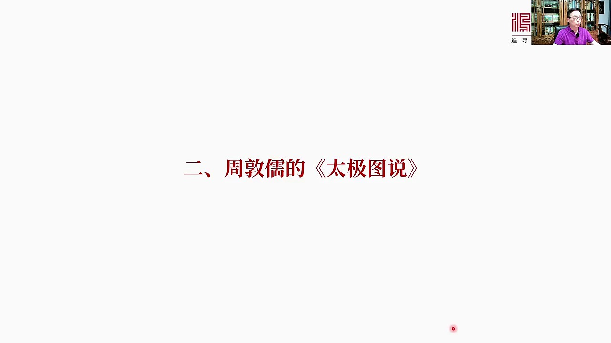

其實很簡單,我們翻下一頁他只有一張圖,再加上249字但是卻開啟了宋明新入家的時代

---

### Slide 2

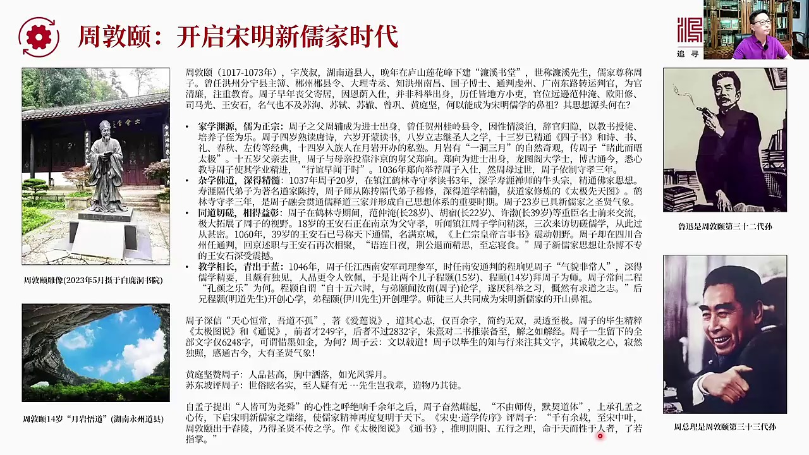

周敦儀是誰呢?這回我專門去這個爐山角下了白露洞書院看到了周敦儀的介紹當然以前知道周敦儀但是對周敦儀的理解比較膚淺比如說二連說我們知道是周敦儀寫的100多個字,傳唱簽股除於你而不染,中國人進人皆知但是除了二連說除了他知道他是儒家的一個宗師之外沒有更進一步的了解這次到了白露洞書院自信看的時候我覺得這人很...

---

### Slide 3

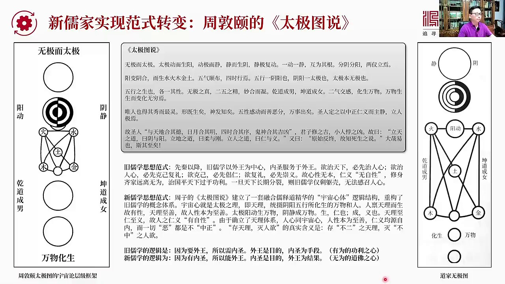

其實提出了新如家的犯事大轉變也就是他的太極徒說太極徒說說到底很簡單就是這麼一張圖偉大的向邏輯營這個營鏈成一張圖這什麼呀這就是宇宙宇宙論的框架層級從無疾變太極無疾而太極太極然後到陰陽陽動陰鏡然後生出五行之氣進步水果土進步水果土在往下就形成了形有形之物前道城昆前道城南昆道城女就出現了兩性然後萬物生化變成...

---

### Slide 4

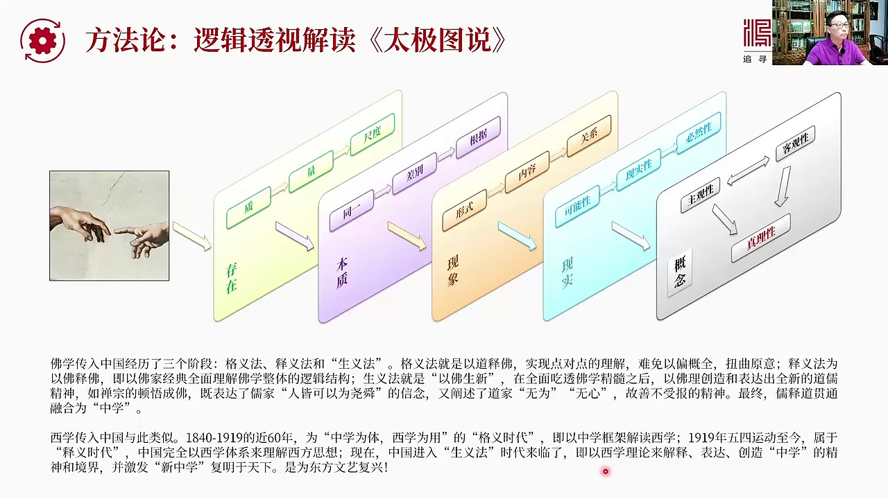

這個邏輯鏡透視怎麼透視他的他已經說還是老辦法黑個兒的小邏輯展現的邏輯分層法我們之所以要用黑個兒的方法去解讀儒學道理是根據佛家進入中國的三個階段剛才我說了格毅、世意和生意格毅就是用道來解釋佛當然就是非常的勉強而且一篇概權歪曲原意是一法是以佛是佛就是以佛家經典的全面邏輯結構來理解佛家自身生意法是以佛生心...

---

### Slide 5

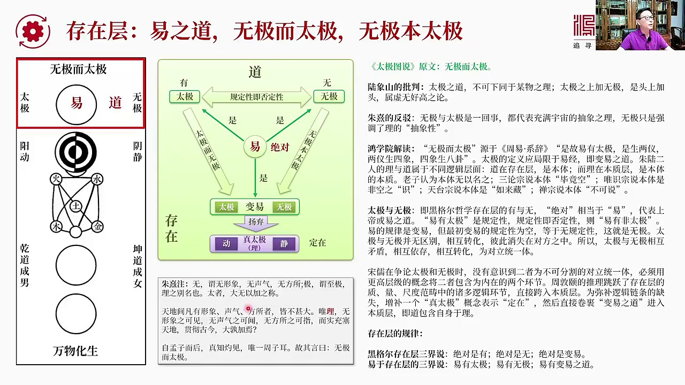

意義之道無疾而太疾無疾本太疾首先我們看這張圖太疾圖我把它用紅框化為這個畫出來這是第一階段是道也就是存在層本體這都叫道或者黑耳的存在層在這中間我把意義放到中心把道這邊代表這一系列我要加的每個邏輯層的名字把道放到中間把意義放到中間把太疾放到左邊把無疾放到右邊代表無疾和太疾是個平行概念是一對矛盾在圖中我們...

---

### Slide 6

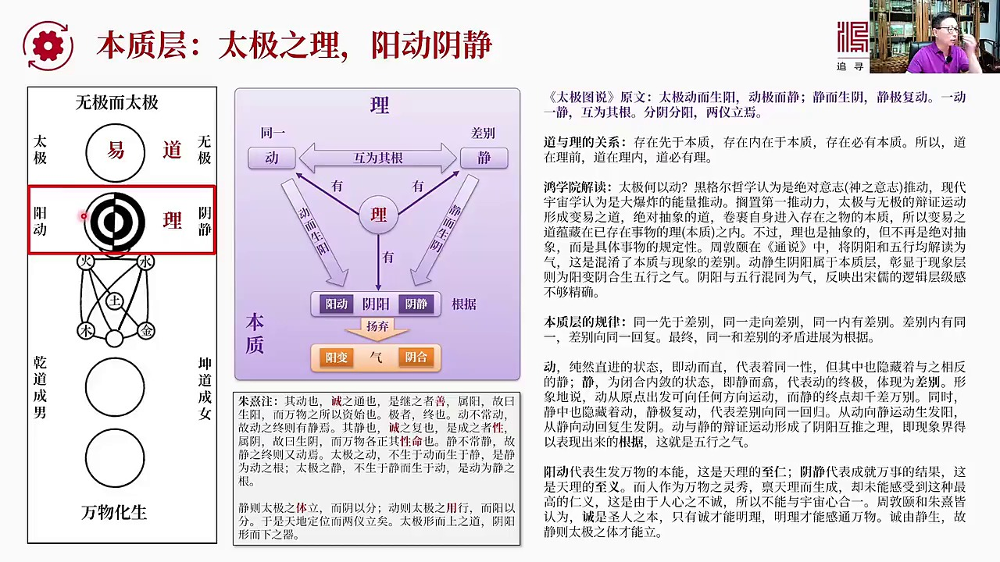

到是存在理呢理是本質那麼我們先來看太極圖的原文太極動而生養動極而靜靜而生因靜極互動移動一靜互為其根分音分養兩一粒粒在兩極粒煙好他這段話說到這個意思我們一看基本上明白那麼我們首先來區分它在邏輯上的道和理之間的關係我們知道從小邏輯的觀念來看存在先於本質存在內在於本質存在幣有本質所以道在理前道在理之內道幣...

---

### Slide 7

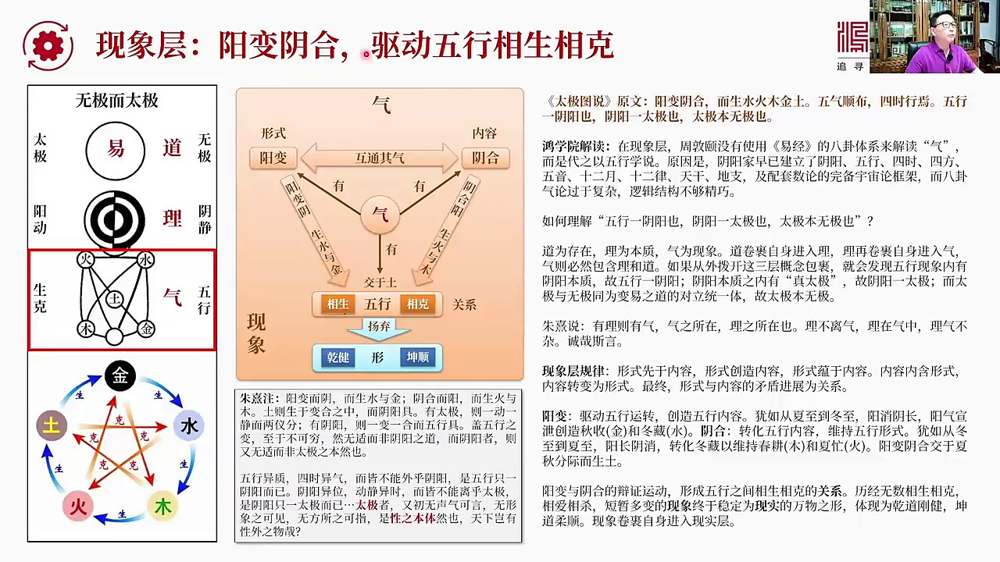

五行相聲相課我們現在來到第三級就是氣道理氣氣是什麼現象有五行五行有聲課基本上這個聲課圖就是這樣所謂比香聲健香課這個是當年董珠書提出的著名理論金生水這是比香聲水生木比香聲健香課就是建格一個一個下一個往往是相反的比如說金課木水課火又課金等等所以這叫比香聲課這是他們的關係我們來看從這樣圖其實可以明顯看到為...

---

### Slide 8

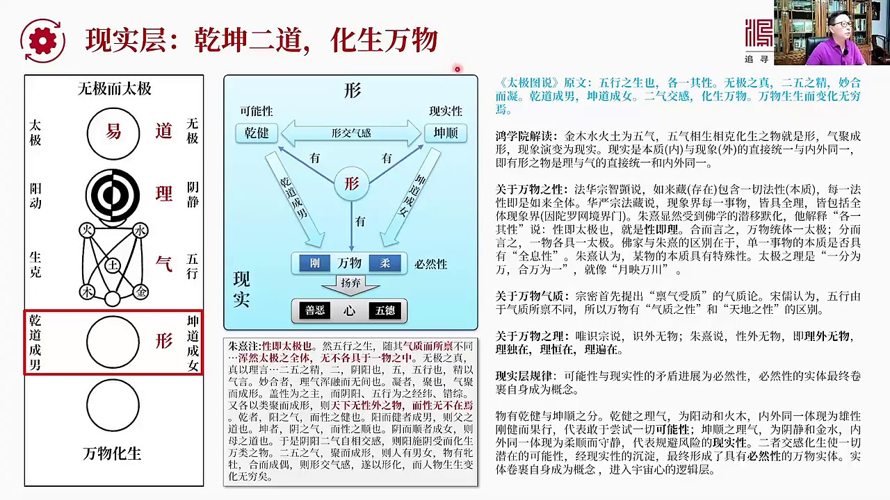

就是行我們看到行包括什麼行有前前代表界行有昆的表順這是可能性這是現實性行還有萬物它最後可以生成萬物萬物當然從前到來看前到乘男昆到乘女這就自然剛和柔這就是必然性只要你有借有順有錢和坤既它就必然會遇遇出萬物來這就是現實我們看到我們現在進入這個階段了昆到乘女前到乘男他已經圖說的原文是五星之生也各一其性五集...

---

### Slide 9

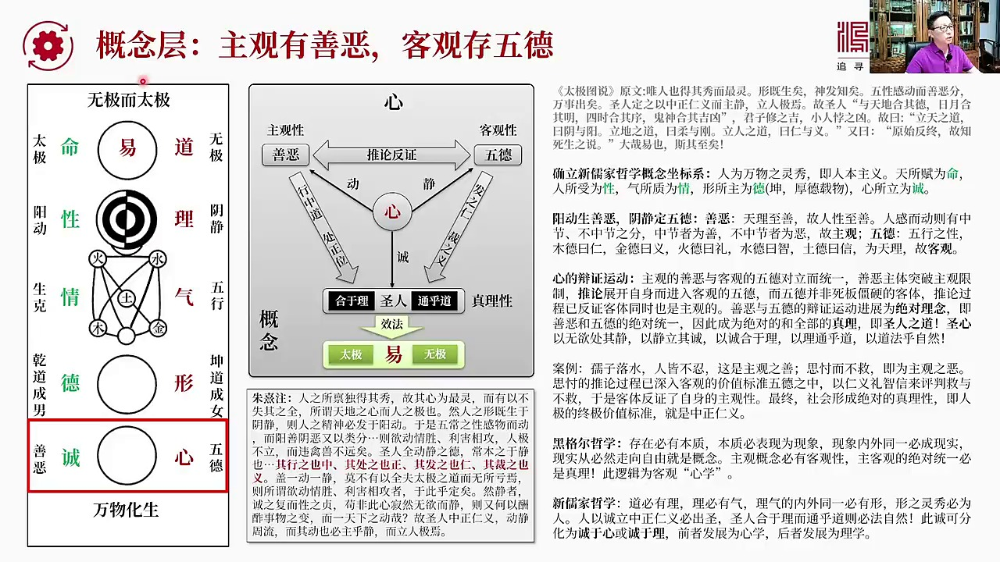

客觀存舞德這話怎麼理解首先我們看這張圖我們看這張圖我們剛剛已經把道理氣行心定死了他們就分別對應於存在本質現象現實現在我們談到概念了那麼綠的是什麼綠的就是如果說我們說道理氣行心這是講的萬事萬物和人都通用那麼綠色的這幾個概念代表是人特有的比如說命什麼是命對應於道是道的層次是存在和本體的層次人生有命富貴在...

---

### Slide 10

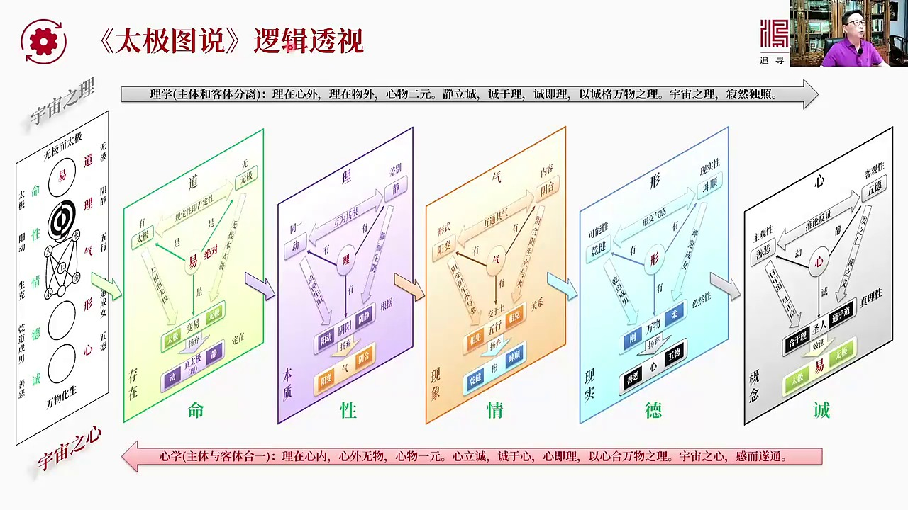

做一個全套事跌在一起大家一目了人這邊就是太極圖太極圖既包括宇宙之理又包括宇宙之心剛才邏輯的推演體現的事包括人對於人來說命性情得誠對於我們的邏輯層叫道理氣行心當然對應著存在本質現象現實和概念所以每個儒家的基本的概念全部鎖死定義在這個作標系統體質內不應該不會再亂好我們再看它的宇宙之理宇宙之理我們稱為李學...

---

### Slide 11

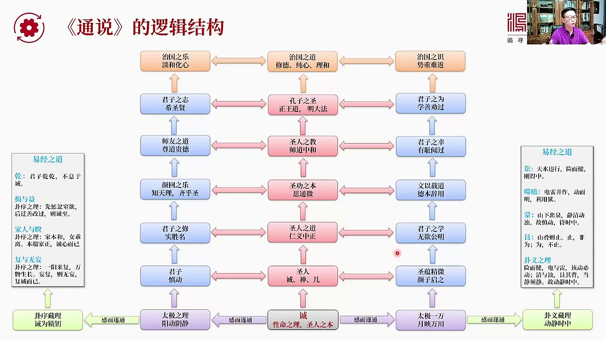

我提煉出來了這個毒古人的儒家的思想其實最重要的是什麼呢就是要分裔它的結構因為它們寫的都向羽露一條一條一條前後關係和美軍化之間的關係其實並不太講就邏輯的這個對應性我把它它這個一共是40張就是40張其實就是40段話每段話進行同類向合併比如說講月的三條我合併成一條合併成一條給它打上一個標籤比如說治國之月中...

---

### Slide 12

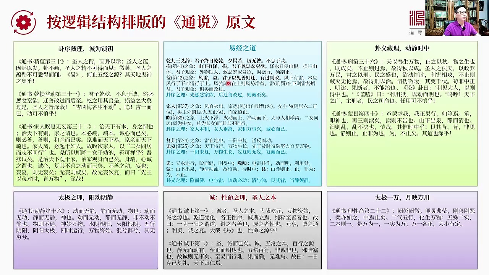

底下代表著長乃這個性命之理上人之本然後這邊是太激之理這個兩側應該在太激之理的左邊但是由於我這個展不開要不然自而太小所以只能把它往上堆已經知道本來是兩邊駐式由於我把它放了兩邊正好把已經知道放的中間這些如果大家仔細看我會把這個中間主要內容提煉成他的標題同時把掛每個掛向他怎麼他為什麼會這麼推掛向原始的表達...

---

### Slide 13

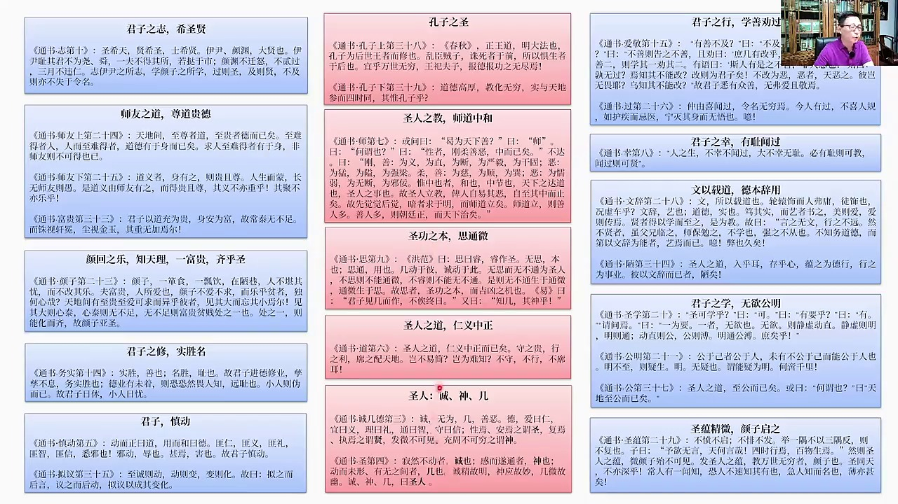

所以大家如果看到那個模塊圖如果想找原文按著這個順序到處第一或第二你馬上就能找到當然名字也是一模一樣的左邊和右邊也是按著順序來排列的這邊當然就是君子應該做的事再往後就是其實是剛才框圖這最上方智國之道這寫給皇帝的其實就是

---

### Slide 14

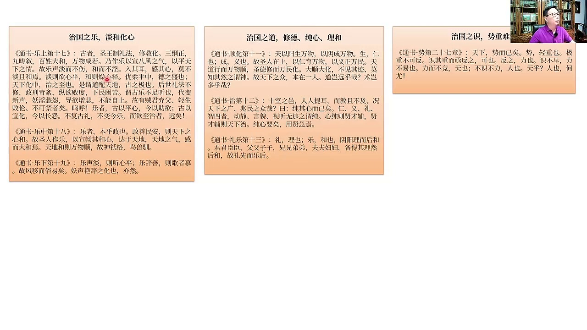

告訴皇帝應該怎麼來修得怎麼來存心怎麼來理和怎麼能讓國內的這些好的人越來越多朝廷就會充滿正氣智力國家就會變得簡單和容易這個是他的基本的開機通說的這個是他通說的2834通說並不是完全用於解讀開機圖的通說是一經的一種感想其實是通意或者叫一通是他獨一的筆記好我們看下一頁現在我們進入總結就是從兩項到隨堂揉下思...

---

### Slide 15

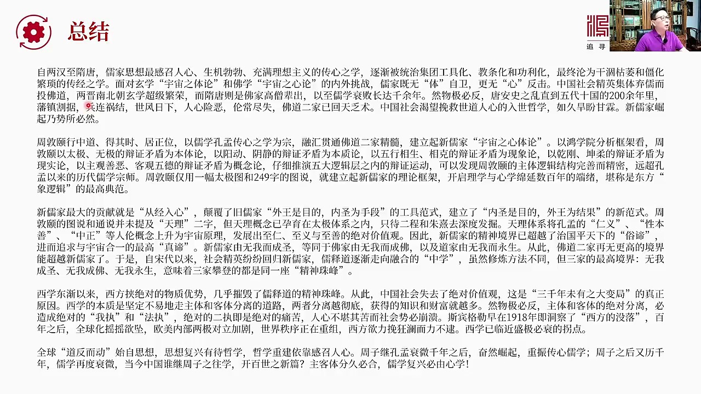

那些最感人的升級伯伯的充滿零項主義的傳心之學逐漸被統治集團工具化教教化和功力化最終淪為了這種肝和哭尾和薑化繁瑣的傳經之學所以在後來面對學學的宇宙宇宙的知體論就是宇宙知體論還有佛學的宇宙知心論一個是實際上是遭遇的內外挑戰儒家思想的當時寄無體自衛更無心反擊因為你的本體本體論沒有建立起來也沒有心學也沒有辦...

---

### Slide 16

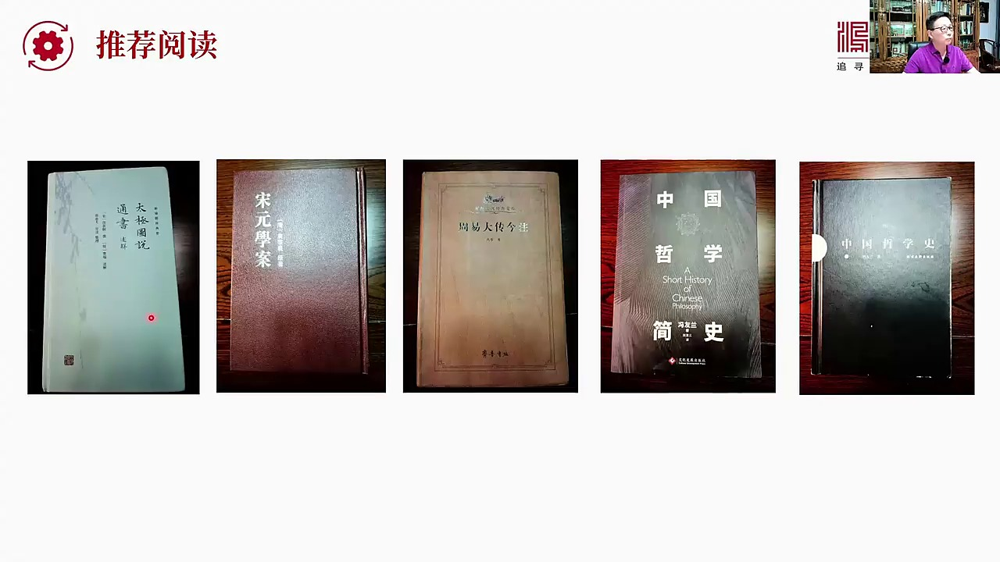

宋元學案還有周役大段驚訝中國這些事中國這些事的一共三本吧進行的書理和解讀這就是我們今天核心課的主要內容謝謝大家

---

### Slide 17

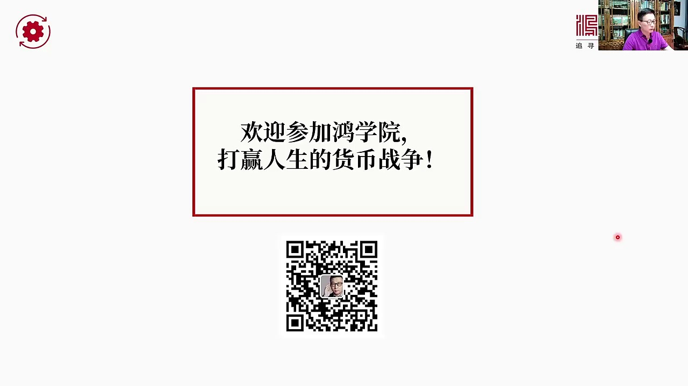

---
