# 核心课视频-117-120 _ 北宋五子之邵雍 上&描述标题= — Clean Slide Notes

> **来源**：鸿学院核心课程  
> **幻灯片**：199 张

---

### Slide 1

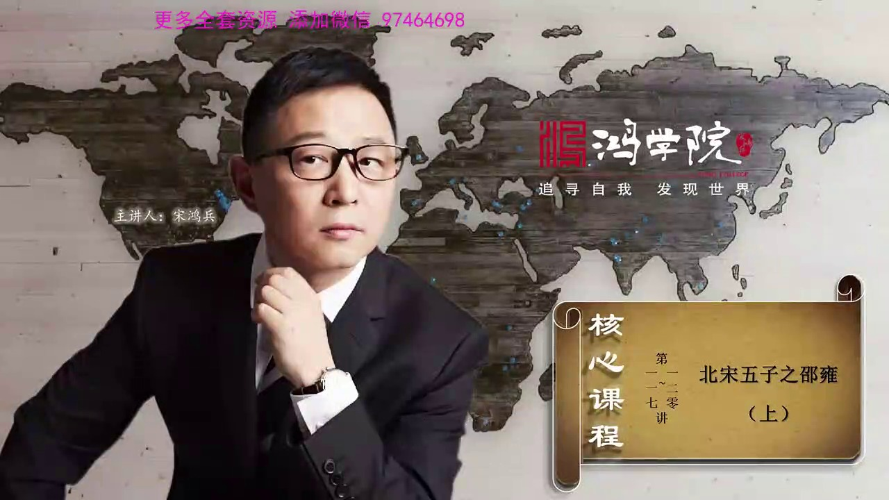

今天我們講的是第一部分下面我們看第一頁首先我們要介紹一下少庸這個人我們知道少庸是北宋五子中間的一個

---

### Slide 2

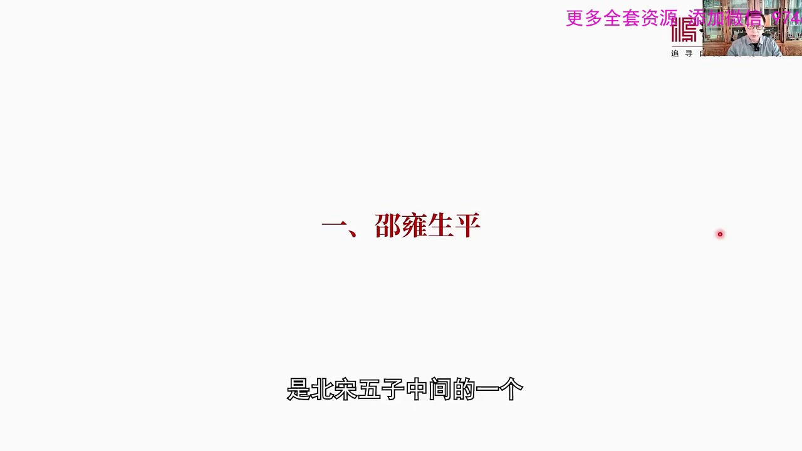

而少庸跟其他的四子相對比他最大的特點就是他以數學或叫數字作為整個立學的基礎我們看下頁的人物關係圖這是北宋五子的關係圖

---

### Slide 3

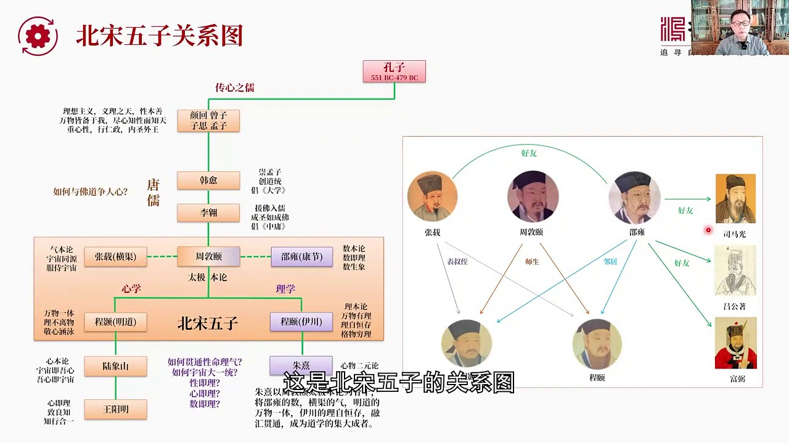

我們講周末一的時候用過這張圖的一半孔子創立了儒血儒血分兩個分支已經是傳心之如還有的是傳經之如漢儒那幫人一直到清如我們關心的是北宋也就是傳心之如的這一派那麼這一派下了之後從孔子之後就是孟子是最大的集成人孟子之後唐儒的韓語作為一個非常重要的集成關係在傳承到北宋形成了北宋立學或叫北宋倒學的思想體系就是我們...

---

### Slide 4

他的本質就是我們透過現象看本質少庸這個人是本質是什麼我歸納上了八字如體到新一魂數本什麼叫如體他從從小到大讀得書的主要部分是如家學說

---

### Slide 5

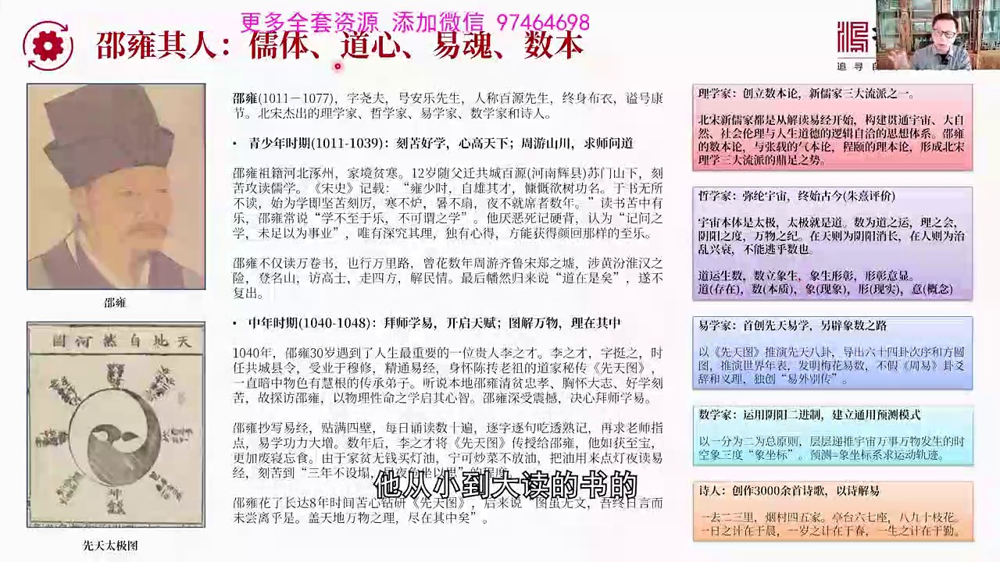

他所開創的數本論其實也是李學的一個分支

---

### Slide 6

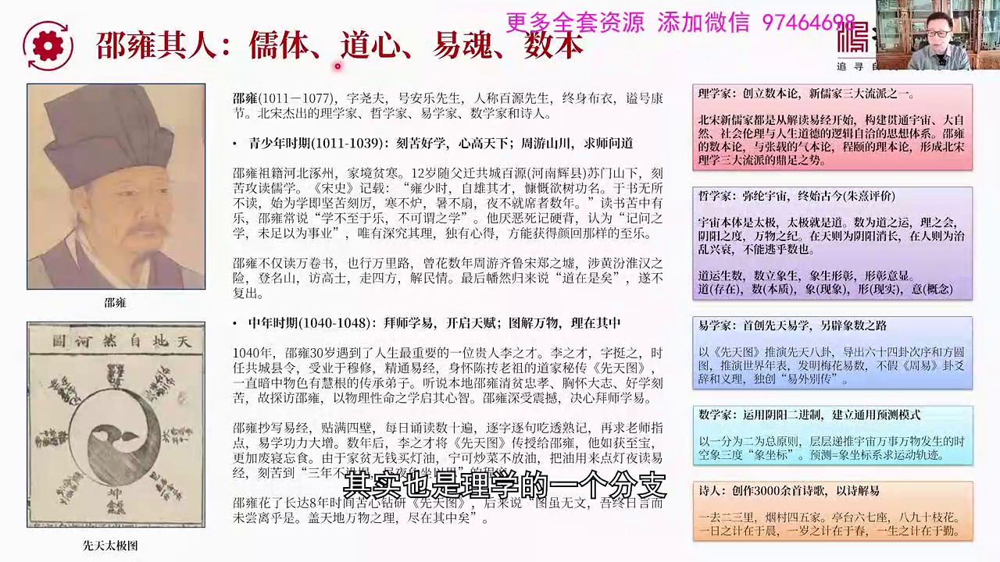

或者叫一個重要的支柱所以他的體是如家學派

---

### Slide 7

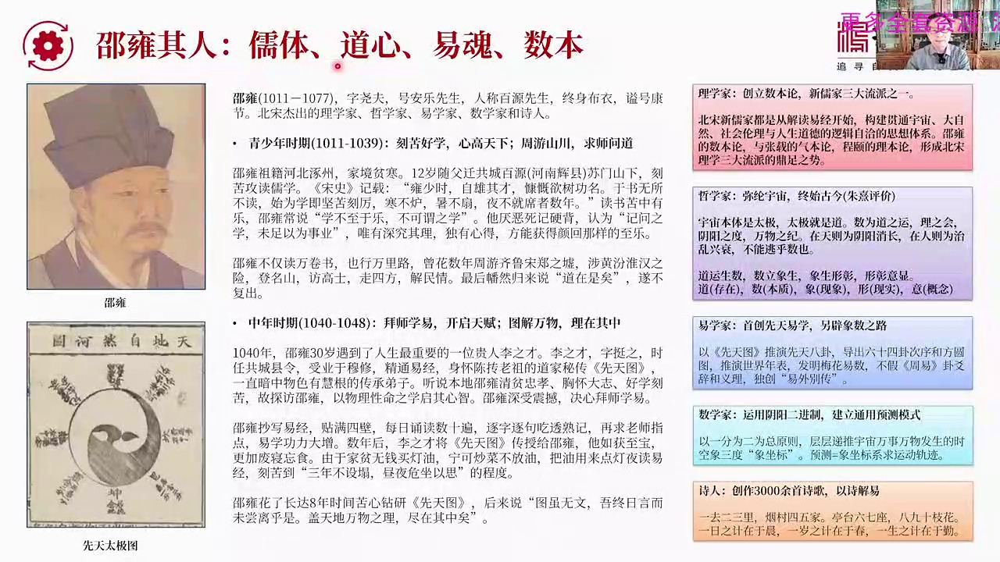

但是他的新少庸這個人的新我認為他是有一種強烈的道心也就是不太願意去餐貨這個朝廷中間的事也不太重視公民理路他成人活得很撒脫

---

### Slide 8

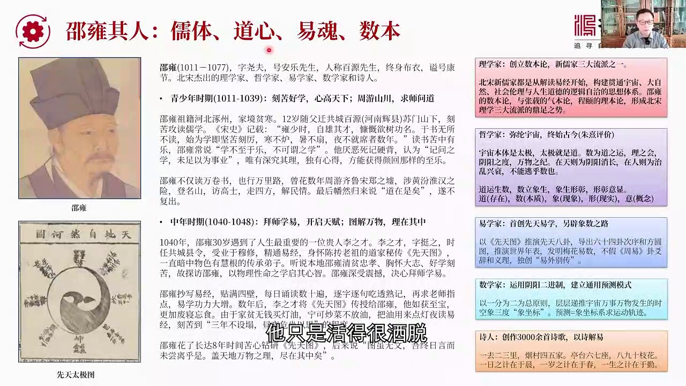

就是跟現實社會保持了相當的距離有利於現實鬥爭之外所以他有一種道心超脫

---

### Slide 9

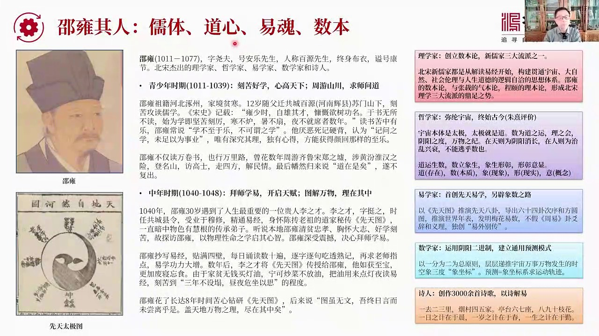

飄逸和超脫那麼為什麼說叫逸魂就是他的整個思想體系雖然是服務於如家學說的雖然他有一顆道心但是他的靈魂是逸經

---

### Slide 10

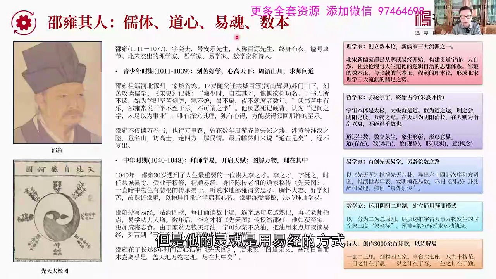

是用逸經的方式逸經的這樣一種靈魂來做所有的事所以他的所有的推演都是基於逸經的體系那麼數本呢數本就是雖然他是嚴重逸經的但是他跟傳統的一家學派的所有的流派都不一樣他是開創了一種新的解駐逸經的方式是純粹從數的角度來進行數理邏輯推演創造出一種逸經的新的研究方式和這個

---

### Slide 11

包括預測的方式這是非常不一樣的跟以前的傳統逸學有著根本性的區別那麼我們來看少庸這個人

---

### Slide 12

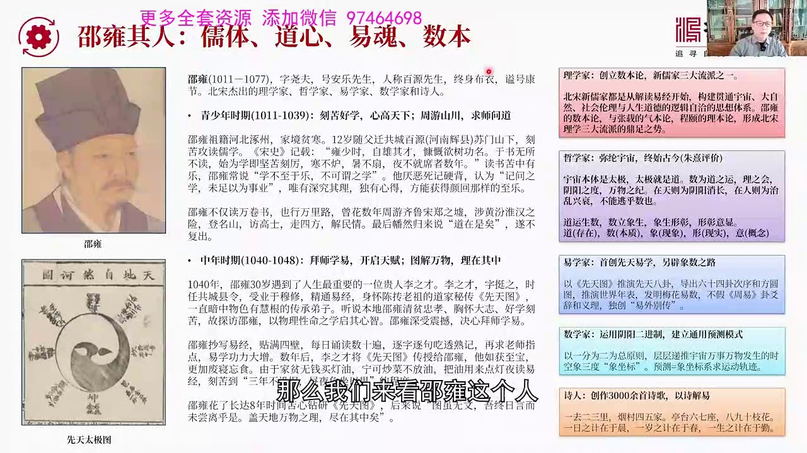

他在生活的大概的大概的17吧他是從101年到2017年基本上跟周東遺是同時代人他自遙夫所以我們今天看到古神上些遙夫如何如何講的就是少庸那麼他有一個號叫安樂先生就是自稱他自己住在安樂窩裡所以他就自號安樂先生那麼另外有人稱他是百元先生這跟他早年的生活有關我們以後會說到少庸這個人終身不一他沒有當過國安沒有...

---

### Slide 13

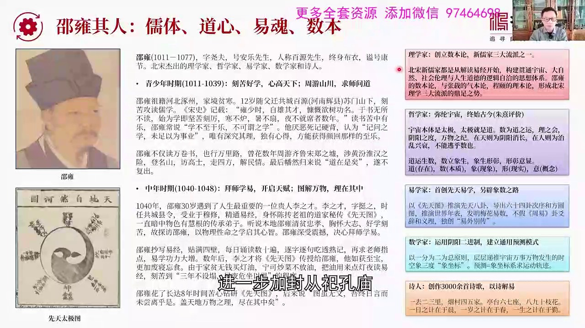

那就更厲害了少庸這個人在北宋是一個非常節出的逸學家 哲學家逸學家 數學家和師人為什麼說他是李學家我們知道少庸最重要的貢獻就是創立了數本論李學中的數本論可以說是新儒家的三大儒派之一我們講宗哲宗儀的時候還有我們現在講少庸

---

### Slide 14

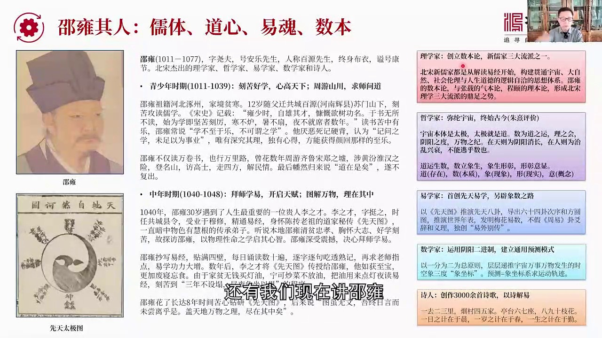

包括以後講張宰二成你會發現他們所有的人都是一學的高手他們解讀萬事萬物都是首先從意經開始找源頭就是通過解讀意經來構建一個龐大思想體系和邏輯體系

---

### Slide 15

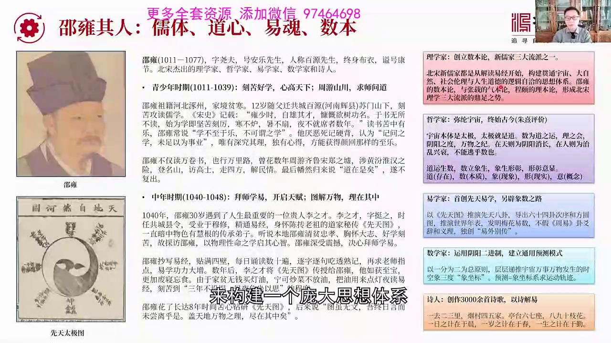

這種邏輯體系要貫穿宇宙大自然社會 包括人生

---

### Slide 16

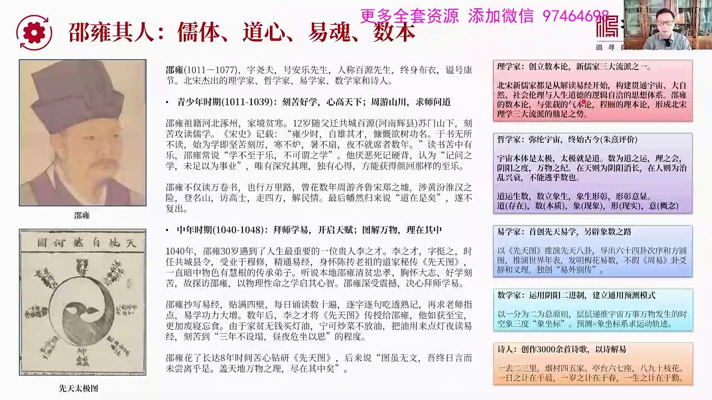

從倫理道德一直到治國安邦平天下整個這套體系是自從一體的邏輯自恰的

---

### Slide 17

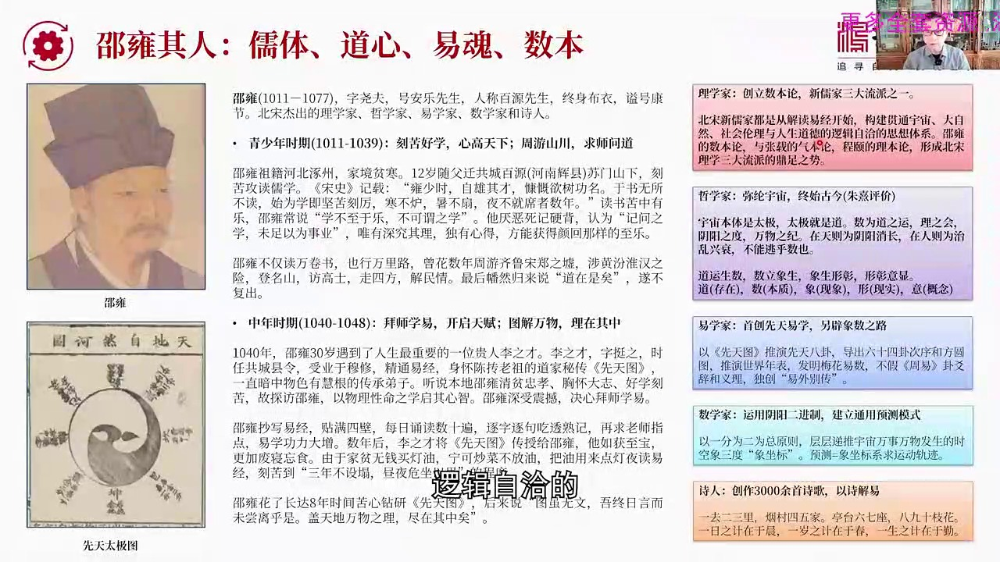

源頭都是從解讀意經開始周宗儀是如此少庸也是這樣那麼少庸創建的數本論與張宰的氣本論成一的離本論形成了北宋的三大儒派形成了頂足之事所以他一定首先是利學家那麼粗子之外他還是哲學家朱錫對於少庸是非常推崇的

---

### Slide 18

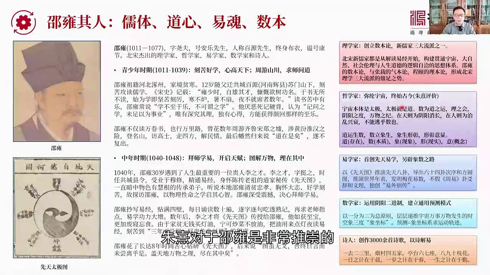

朱錫給少庸的評價就是這個迷倫宇宙忠實古今

---

### Slide 19

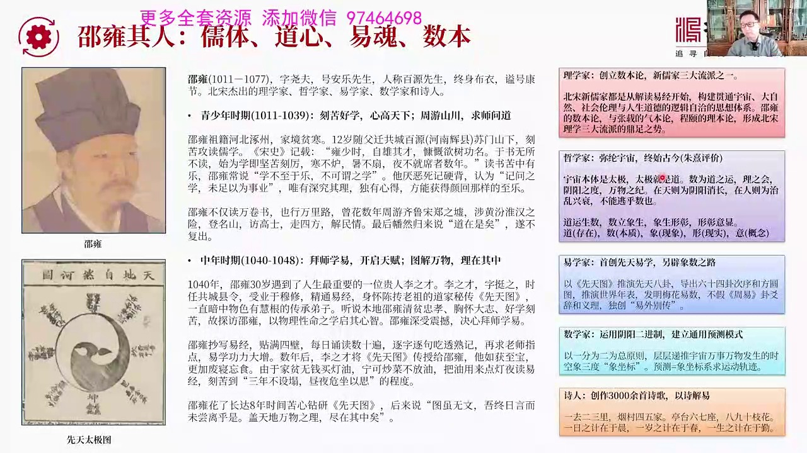

也就是少庸所建立的思想體系是包含整個宇宙學說的而且同股道經沒有他所不能包容的

---

### Slide 20

這個評價是非常之高那麼在少庸看起來宇宙的本體是什麼呀宇宙本體是太極

---

### Slide 21

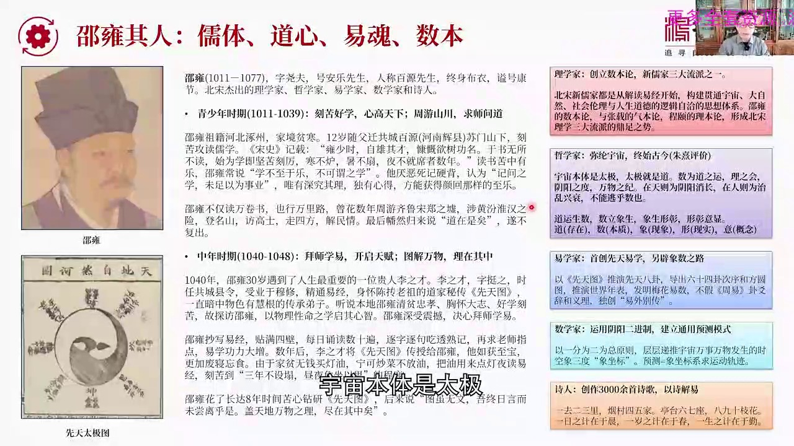

這跟周宗儀是一樣的而太極什麼太極就是道那麼少庸認為數是道之運理之會音揚之動萬物之技這什麼意思就是無論是太極還是理還是音揚還是萬物他們都跟數有關那麼道中實際上包含著數理宗也包含著數音揚它的尺度也是數那麼萬物的綱進仍然是通過數來表現的

---

### Slide 22

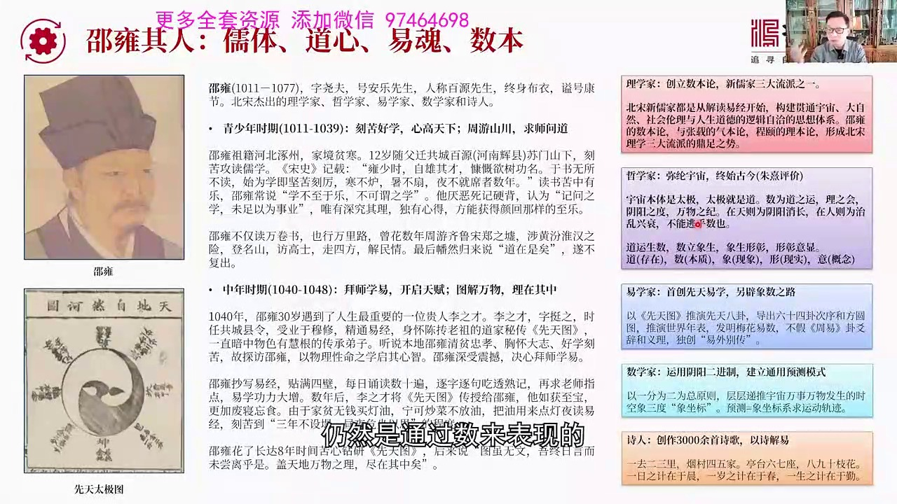

所以數是一切的根本那麼在天也就是在天道看來實際上是表現為音揚調整

---

### Slide 23

那麼體現在人類社會那就是置亂清衰所有的一切萬事萬物從古之經宇宙八方一切的一切都不能淘乎數的來源也就是數決定了一切歸大起來我們可以認為道庸提出了一種數本論的思想就是道運聲數數歷聲數歷向聲向聲 行章 行章 一切就是道中間運藏著數而數可以聲出向向可以聲出行行可以聲出異議如果用黑格爾的思想來解答

---

### Slide 24

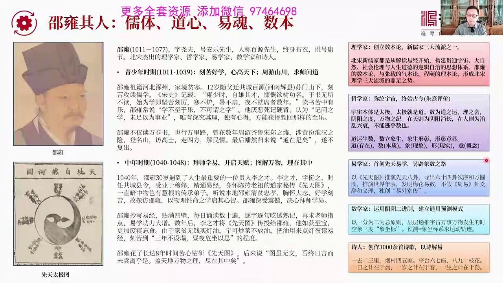

分成邏輯層的話那道竟然是存在沒有太極 沒有道那一切都不用談了

---

### Slide 25

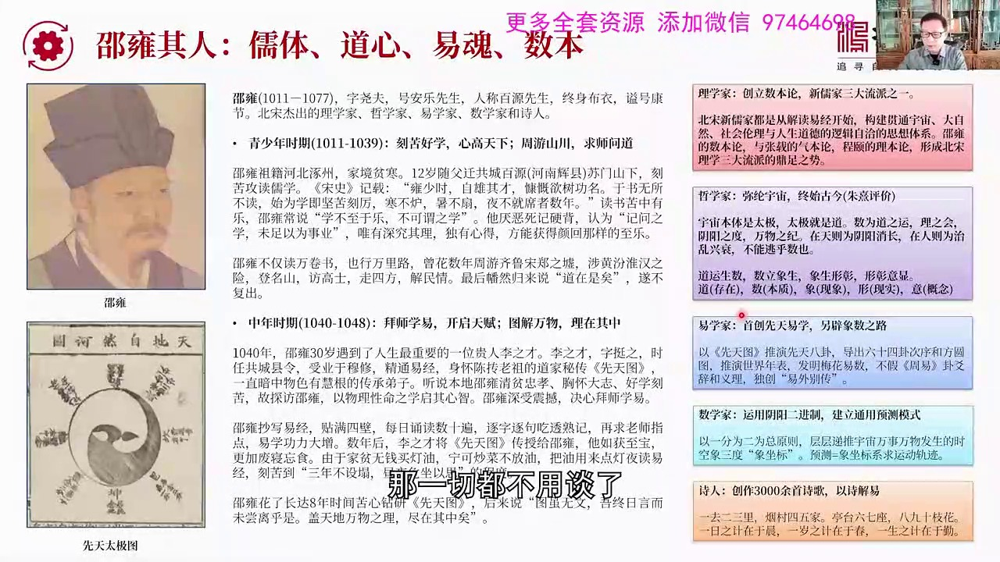

所以道是存在數是什麽 數是本質道中運藏著數數又可以體現為現象就是向那麽有了向之後再往後發展就變成現實了那就是行出現了有形有體的東西那麽再往後就是意意就是概念意是什麼意的本質就是心就是人心所以從這個角度來說少庸他的數作為本質藏但他的意義

---

### Slide 26

實際上跟周登宜的想法有一半是類似的最後都是規則心上所以他認為宇宙包括太極道這個東西最後跟人心是完全同意的那麽從夢子角度來說就是萬物皆被遇我在我的內心中有宇宙的萬事萬物都在我的心中這也很像佛家的這個如來藏或者叫如來藏內心包含著所有的全面萬化有萬法之原全部在心中少庸其實也是這個觀點雖然他是強調數作為一切...

---

### Slide 27

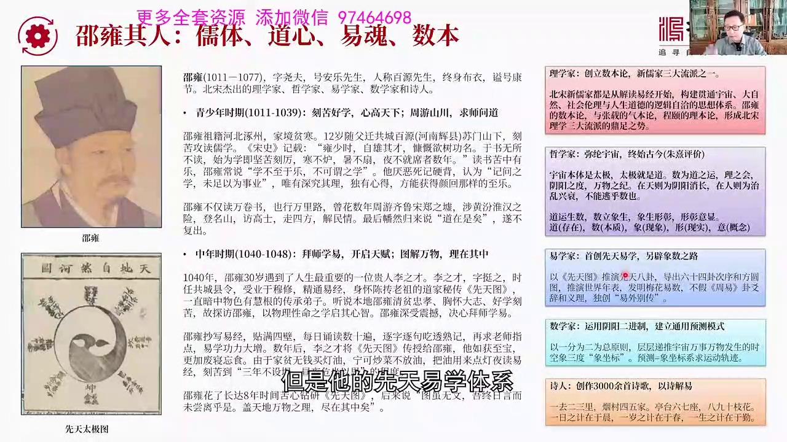

那是跟前人的體法是完全不同的他是創造了另外一套意經的研究方法特別是向數

---

### Slide 28

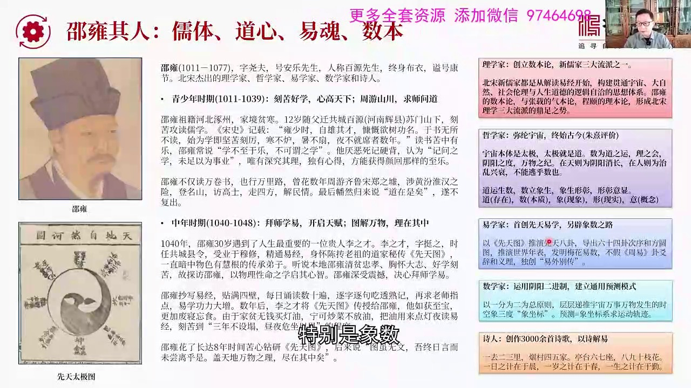

雖然向數學從漢朝就有但是他的研究方法他的推理方式跟漢如是完全不同的

---

### Slide 29

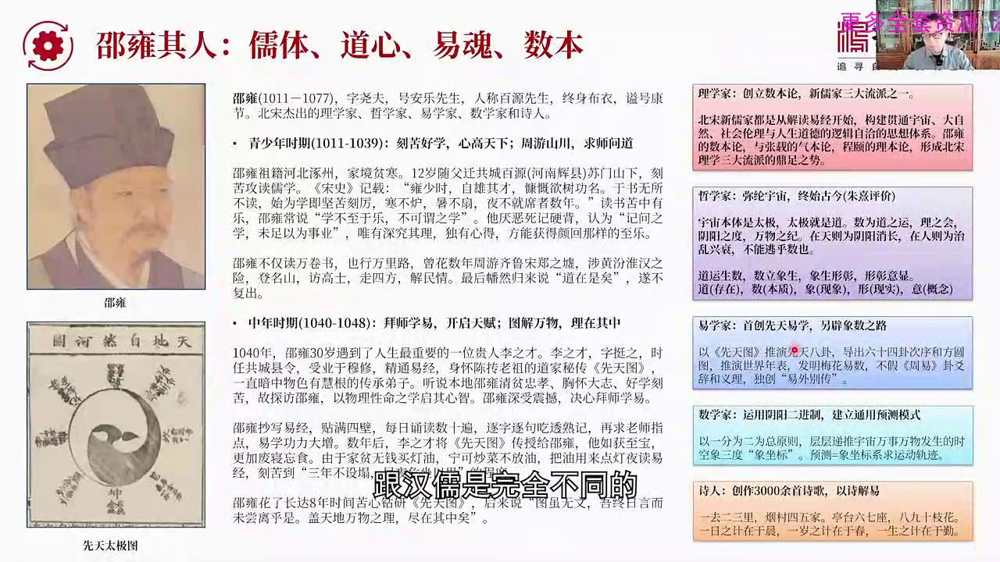

所以他繼承了向數漢義的向數但是完全走了另外一條路周登宜就是從陳團老總的繼承了到家了無極圖而少庸也是從陳團老總的繼承了另外一張圖這就是先天圖他是以先天圖來推演先天八卦然後用邏輯推演的方式邏輯推導推導出了64卦的他的次序還有方位還有方園圖等等然後用同樣的邏輯體系創造了一個世界年表就是人類文明的他的一個周...

---

### Slide 30

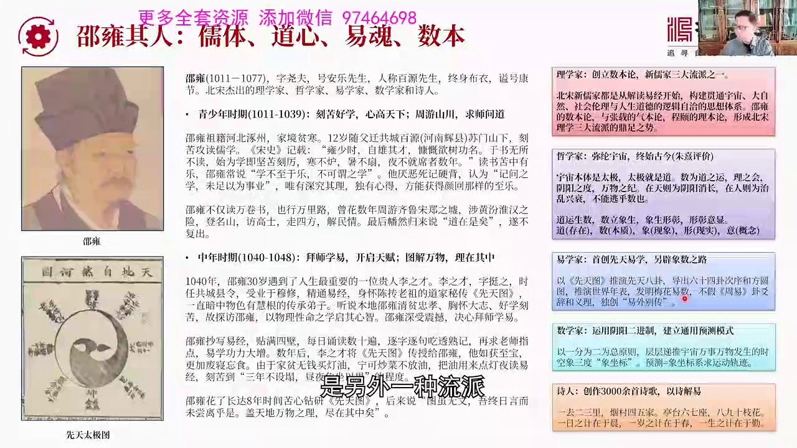

另外一套體系第四少庸還是個數學家就是他首先運用了鴻羊二斤制

---

### Slide 31

建立了通用的預測模式我們知道意經他的核心就是鴻羊鴻羊是什麼

---

### Slide 32

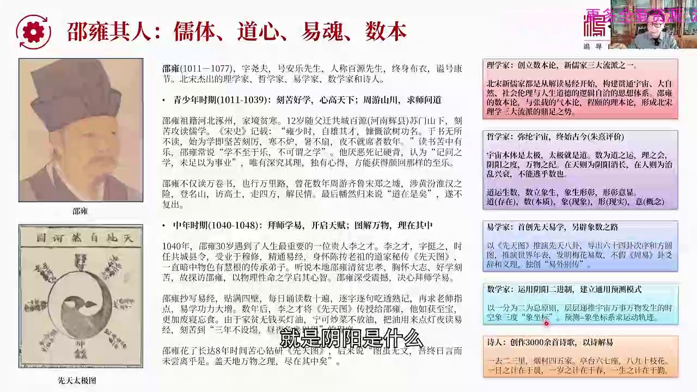

本來就是二斤制那麼少庸是利用了這種二斤制有意識利用二斤制推演出了一個巨大的宇宙萬物的一套預測的方式我稱之為是通用一側模式他的核心就是一分雷二我們先來講一分雷二源頭就是少庸就是少庸以一分雷二作為總的原則然後層層地推宇宙萬事萬物發生的時空向這個三個圍度創造一套向作標體系向作標體系這是我給他灌的名

---

### Slide 33

一般人不這麼叫但是我覺得叫向作標體系讓大家更容易理解

---

### Slide 34

為什麼叫通用預測什麼叫預測預測其實就等於向作標體系裡面求運動軌跡所以很多人認為算命是純粹是迷信你研究完少庸之後你會看到少庸這套東西完全是理性推的跟黑格沒有區別他早黑格早得多比黑格早七八百年而他用的這套思想體系跟黑格用的思想體系從本上是一回事那麼他第五個比較重要的標籤就是師人

---

### Slide 35

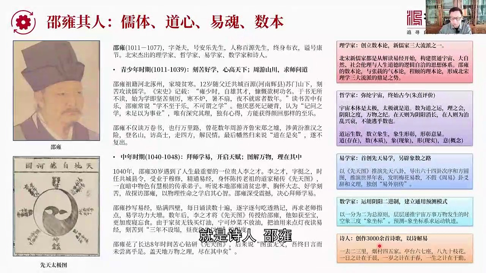

少庸一生創造了三千多首師可以說是一個產量巨大的師人當然他的師孫有好幾類但是主要部分是寫師來解讀異經或者表達他的異經一種心理感受比如說我們很多人都知道這首師

---

### Slide 36

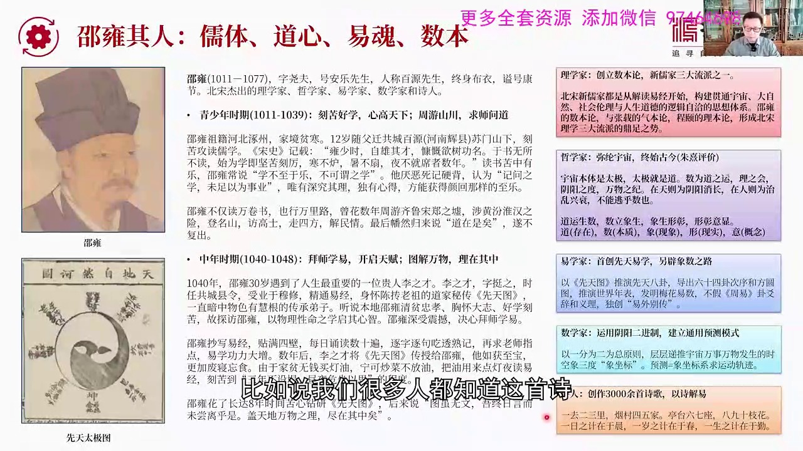

但是不知道他是源於少庸一去於二三里煙村四五家庭台六七座八九十之花

---

### Slide 37

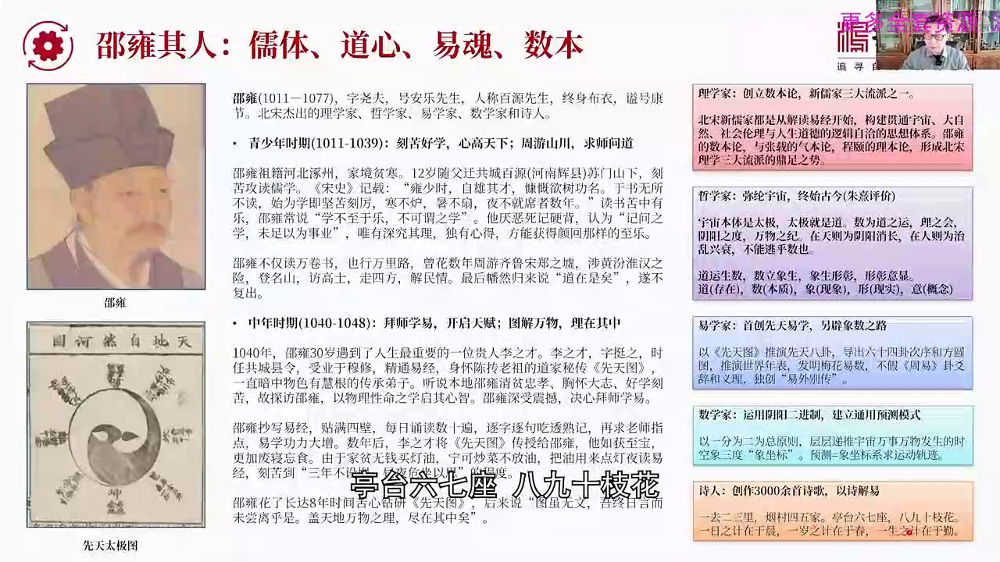

這都是二叔能強的一首一首小師原則於少庸我們可以看到他這裡面大量用了數

---

### Slide 38

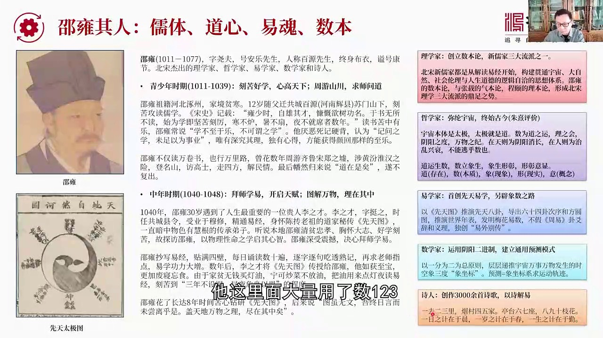

一二三四五六七八九十所以少庸其實在寫時的時候他是有意識的在產名或叫書發他對異經對這種數本論的一種認知和感受但除了這個之外他還有一句名言這個一日之際在於臣一歲之際在於春一生之際在於晴這也是少庸的名言我們現在經常說但是不知道原則於哪個老祖宗現在大家知道是源於少庸

---

### Slide 39

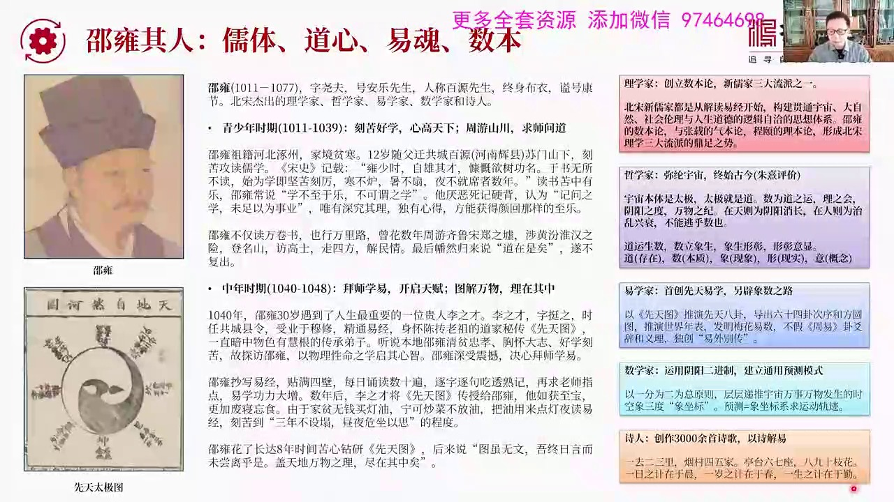

包括一日之際在於臣這其實就是異經對於比如說對於這種塑掛的一種深度的看法我們一會兒會記憶不說到

---

### Slide 40

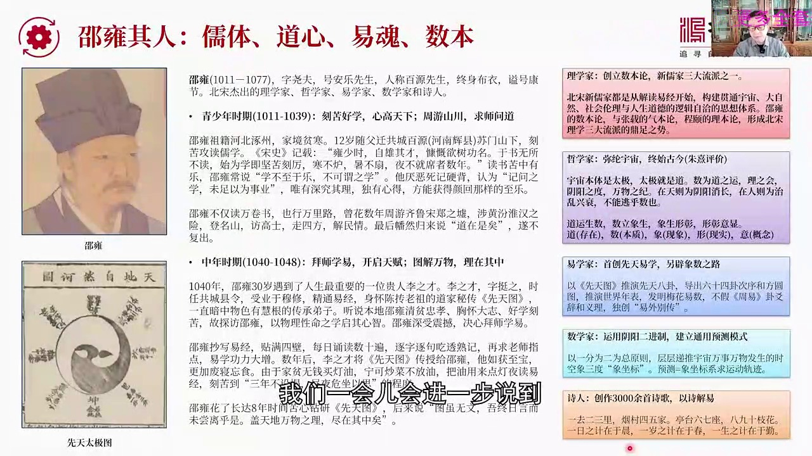

在一天也好一年也好春或者早晨這個時刻是非常重要的我們現在看一下少庸的常長經歷吧首先是少庸的青少年時代從他出生101年到1039年在這個時期少庸表現出來的最大特點就是特苦好學新高天下周游山川求師問道少庸的祖籍在河北的桌周他家庭是比較平寒的

---

### Slide 41

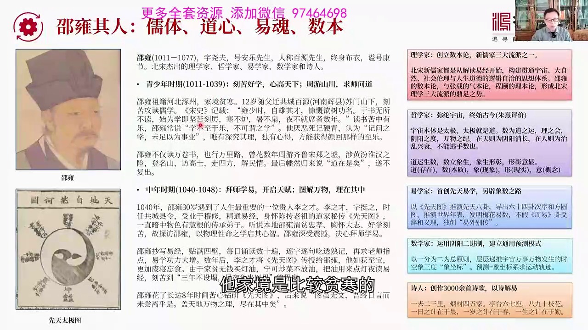

祖父和父親都沒有當過國安也沒有參加過科技但是十字

---

### Slide 42

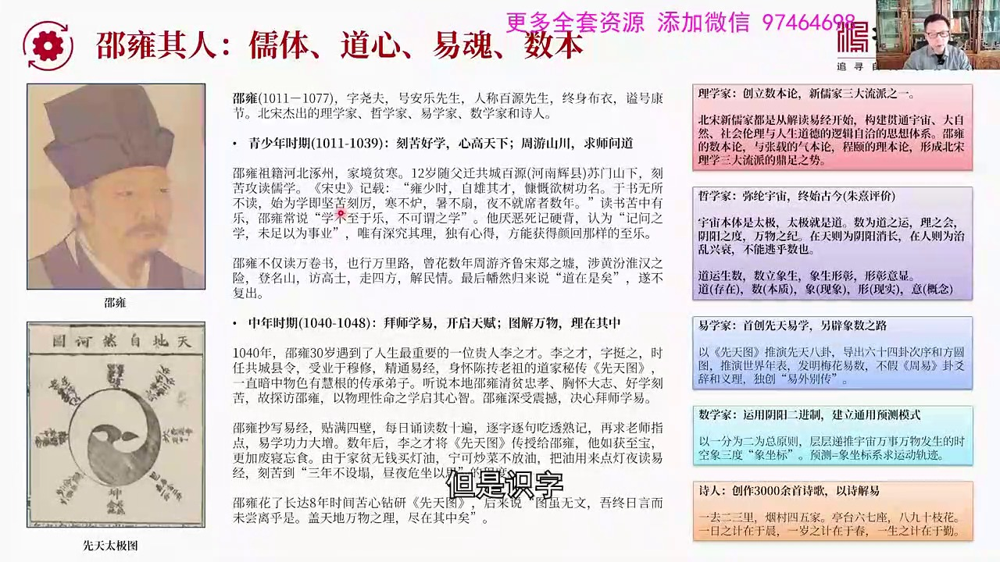

所以全家的經濟條件還是比較普通的就是家庭相當平寒吧12歲的時候少庸跟著父親簽聚到了共成共成了百元就是現在的河南灰線在那裡有一個蘇門山簽到蘇門山下他為什麼叫百元先生就是因為他在蘇門山住了很長時間然後那段時間少庸基本上是一個完全的儒家的儒家為使命了這麼一個青少年吧一心就想做大事要建立公民碰過儒學參加科考...

---

### Slide 43

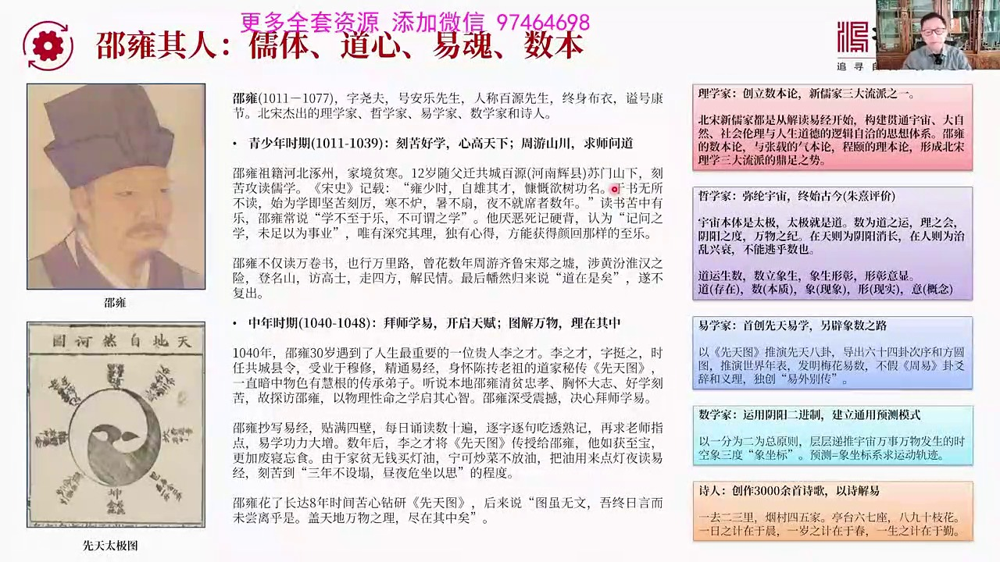

所以宋使中專門記載就是少庸小的時候自行其才就覺得自己才華非常的了不起所以他有一種建立公民的

---

### Slide 44

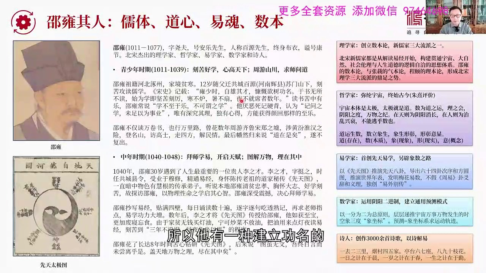

偉大的理想和願望有了這種智相之後當然他就可以說是漁書無所不讀各種樣數只要他找到他都讀而且他最大的特點是學習特別艱苦克力著名的這個說法就是含不如數不善冬天再冷夏天再熱冬天再冷他不生爐子夏天再熱他不刪善子為什麼磨煉一致再冷的天他也扛也要扛再熱的天也不打善就是不管外部條件怎麼變化無論外部條件多麼惡劣他讀書...

---

### Slide 45

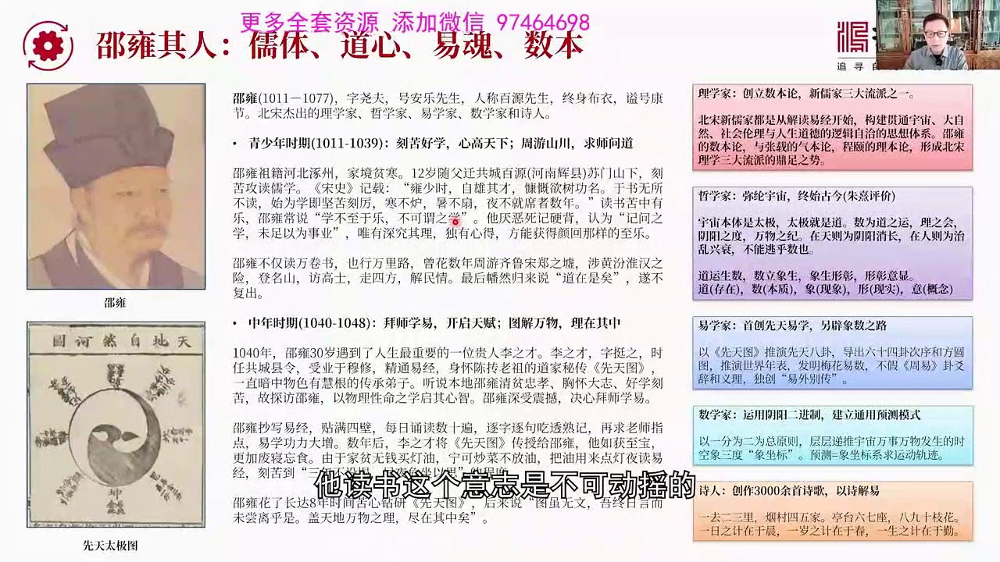

所以外業條件無論多麼艱苦都不可影響他讀書求學的這種頑強的意志

---

### Slide 46

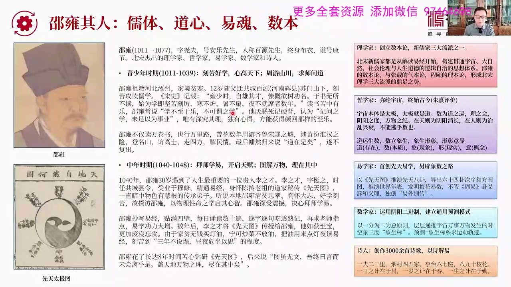

而且說他業不就習者數年晚上他就是坐著不肯就是說不倒下睡覺長達數年為什麼因為倒下睡覺會耽誤時間影響他看書所以我們可以通過這種歷史的這種直接的記載可以看到少庸青少年時在那種非常客苦好學的精神狀態當然讀書還是苦衷有樂少庸自己又常說學不至於樂不可未知學就是我們學習如果不打到那種通過學習找到一種

---

### Slide 47

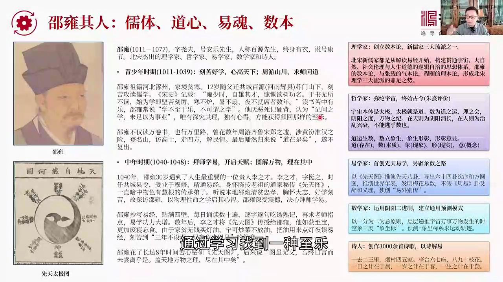

知識樂找到一種快樂這張一種境界根本不叫學所以我們可以看到少庸這種精神跟我們當代所說的什麼時間碎片化學習碎片化

---

### Slide 48

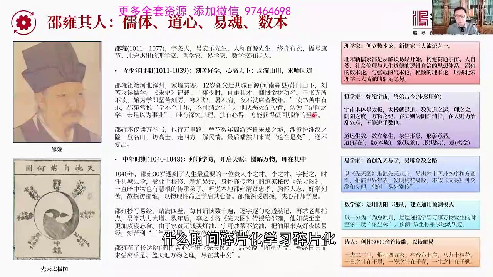

這完全不是一回事我們現在重視是學習知識碎片而少庸講的是一定要學出樂

---

### Slide 49

而這種樂不是一般的樂不是哈哈傻笑是人生知識樂達到最高境界的快樂如果我們讀書學習打不到這種感覺找不到這種感覺打不到這種境界那就根本不能叫學習而且少庸這個人非常討厭此基硬碑所以他認為紀憶問這學為足以為事業就是凡是要你去把它此基硬碑然後只是老師提問你知道一個標準答案或者在工作中或者在人生中你都是靠此基硬碑...

---

### Slide 50

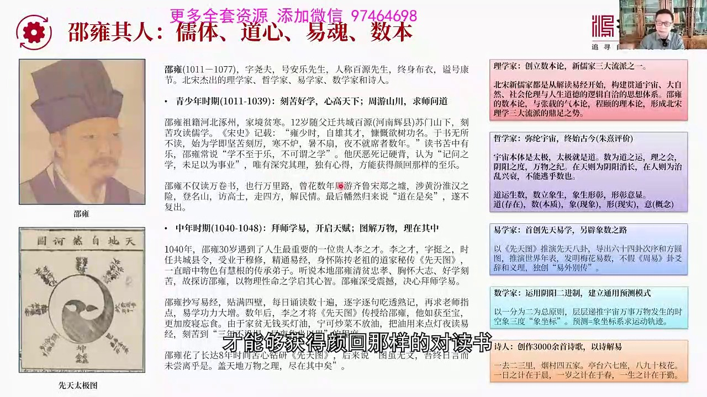

對學習那種制樂那麼少庸不僅要讀萬卷書而且還行萬還行萬里路

---

### Slide 51

所以他曾經花費好幾年的時間在中原大地去周游

---

### Slide 52

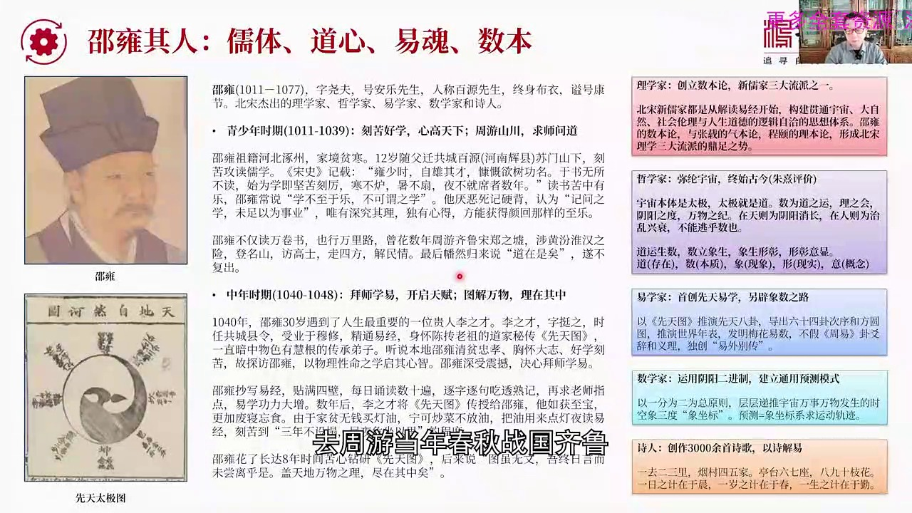

當年這個春秋戰國祈祿送證他們的國都費虛就是去探訪明勝古祭越過黃河粉河懷河漢水大江南北到處去探賢登明山反高市主要目的是為了了解封土人群當然走了幾年之後回來他就說倒在世以走了一圈覺得自己對於自然風光對於這種明山大川對於這些高市的走坊已經讓他意識到了倒是在哪裡其實倒是在他的心裡就是孟子所說萬物皆被遇我

---

### Slide 53

我們不用在自己身外再去尋找真理沒必要為什麼因為所有的大道都在自己的心裡那麼少人通過自己的讀書也好

---

### Slide 54

行走也好慢慢體乎到了真正的學習或真正的這種大道太極是在內心的所以他以後就不再出去倒出走了因為他已經知道太極這個大道是在哪裡了就只能從自己內心中去追尋

---

### Slide 55

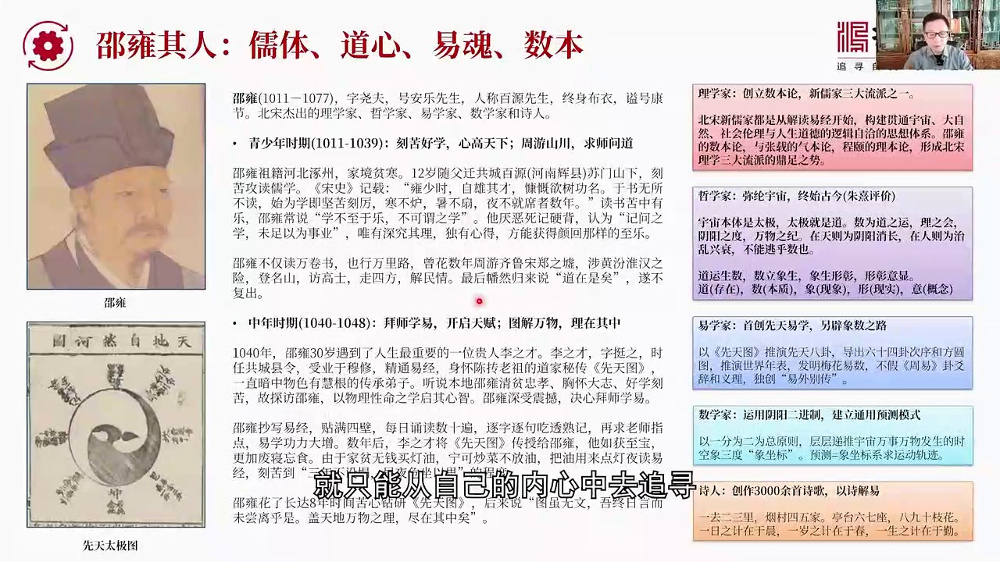

那麼中年時期也就是少庸從出生一日到28歲這是他的親少年時期中年時期是從1040年到1048年這8年也非常重要他30多歲的時候非常重要因為他趕上了個重要時機

---

### Slide 56

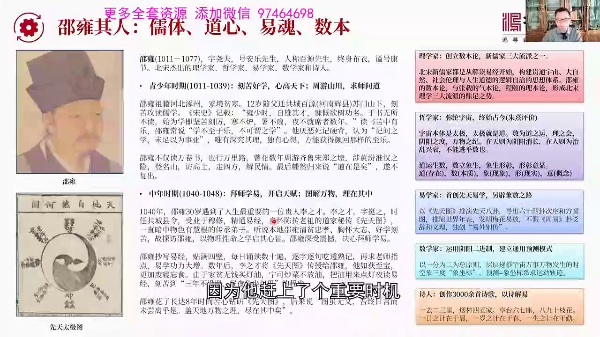

就是拜師學藝開啟天賦徒解萬物理在其中拜師學藝就是

---

### Slide 57

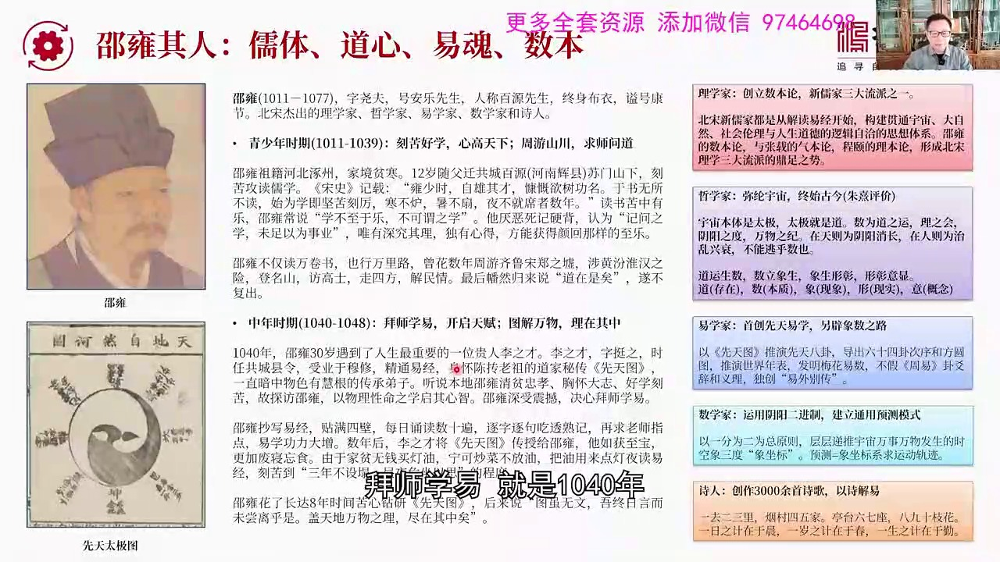

1040年少庸到了30歲的時候碰到了人生的貴人這個貴人可以說什麼叫貴人就是能夠在人的一生中影響你重要的命運貴接著人

---

### Slide 58

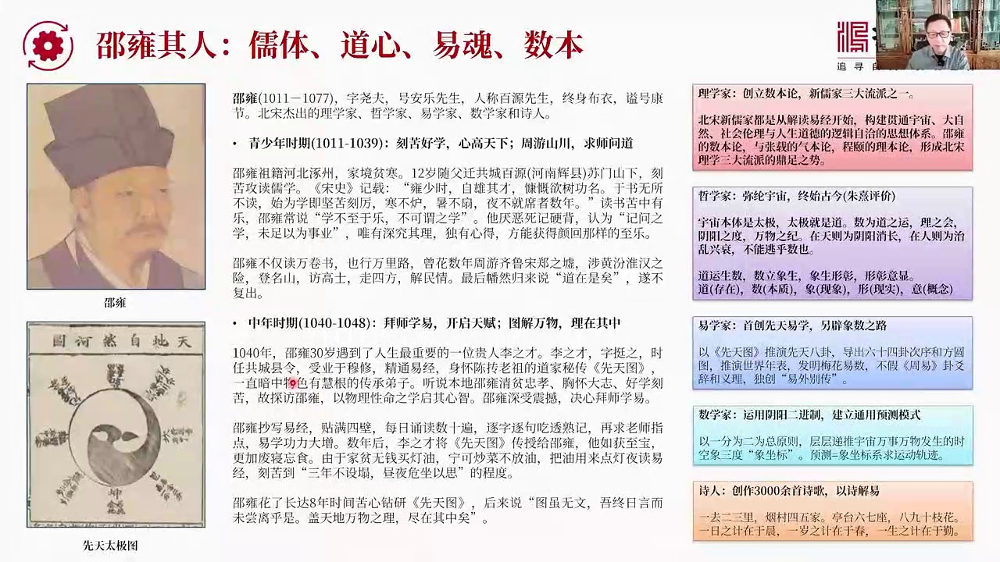

這叫貴人無論一句話是點播還是給你重要的這種幫助提供機遇或者是這種投資等等都算這叫貴人就是有了這樣的人之後你的命運貴既會發生重大改變少庸三歲的時候碰到這個貴人這叫什麼叫李之財李之財自挺之他當時是共成的憲慮就是少庸他住了這個縣的父母官但是李之財並不是個簡單的官員

---

### Slide 59

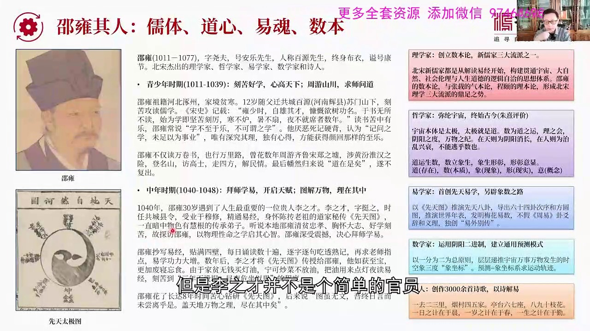

他實際上是有師父傳承的

---

### Slide 60

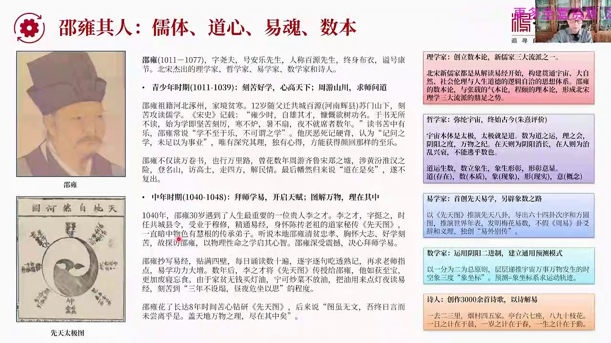

他的老師就是穆修我記得我們講到周敦儀的時候專門講到過周敦儀的老師也是穆修穆修給周敦儀傳授過

---

### Slide 61

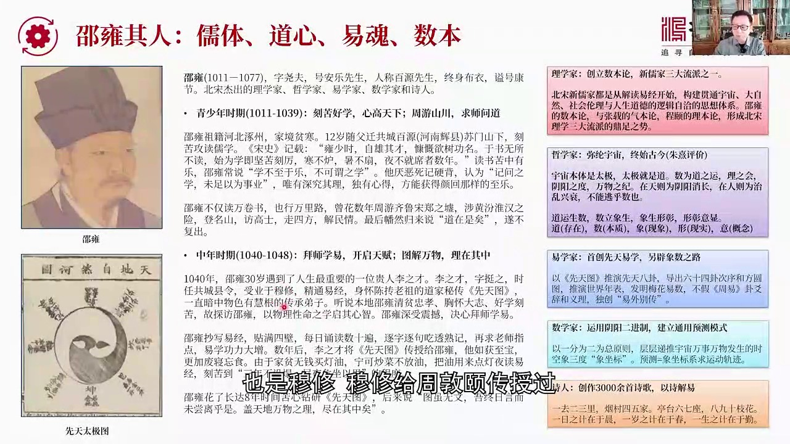

先天的道家先天徒那麼穆修實際上這是個異經大師金通異經那麼他的師父他師父的師父就是陳團老祖所以陳團老祖是道家的一個非常重要的活神線

---

### Slide 62

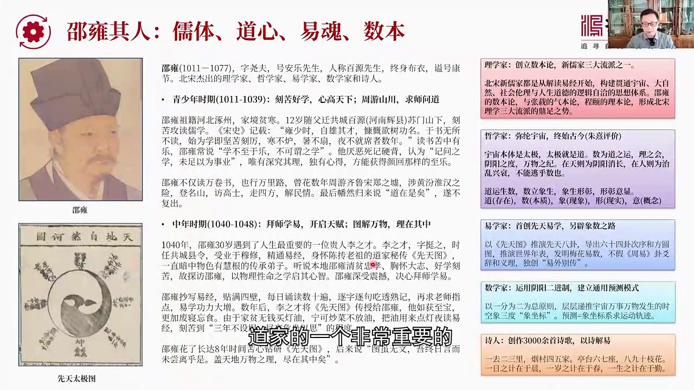

老神線或者118歲陳團老祖有一個道家的祕傳叫先天徒

---

### Slide 63


陳團老祖把先天徒傳給了自己的徒弟重放重放又傳給自己的徒弟穆修穆修就一直在

---

### Slide 64


穆修在周圍到處穆修有沒有這種有會根的弟子

---

### Slide 65

能夠傳成這個道家祕傳所以對於表面上這是個官員共成限定但實際上他是有一個師父傳承關係的一定要把師傳的最重要的傳家寶先天徒要傳給後人但是又不能隨意傳必須要經挑戲選有會根的傳承弟子所以他在周圍打聽一圈聽說本地有個青年裁劇叫少庸而少庸家庭非常親頻而且又是個大笑子胸懷大致學習非常認真客苦所以這個理智裁案中探訪...

---

### Slide 66


命就是性命之學就講的是先天與生聚來的與性和命之間的關係那麼物理性命實際上講的是鄧向我們現在所謂的物理學或者叫物理哲學自然哲學

---

### Slide 67


也就是我們關心的不光是一種倫理道德方面的性命之學我們還得深入去瞭解

---

### Slide 68

萬事萬物背後的物理學原理或者叫自然哲學的原理但少庸對這個方面當然是不太清楚的然後理智裁就說如果我們不能瞭解物或者叫物理背後的性命之學那麼其實我們瞭解的如家的倫理道德的性命之學就沒有跟機啊因為你不能瞭解事物背後本質性的原理就像我們以前說過王陽明格竹子但是如果你沒有物理學的支持

---

### Slide 69


你就靠你腦子去想這個竹子背後有什麼原理那能想的清楚嗎

---

### Slide 70


少庸聽到這個啟發之後就覺得非常受證判就覺得以前自己從來沒有接觸過這個領域的支持它有非常的好學所以它就決心拜師學藝那麼首先當然就要對疫情非常熟悉所以少庸這個在理智裁指導的理智裁說首先你必須把這個疫情搞得非常熟然後我們再說你哪地方不懂所以少庸就開始把疫經手抄了手抄疫經好幾側好幾遍吧然後把這張紙一張一張的...

---

### Slide 71

疫經幾十遍的程度逐字逐句要吃透而且要寄手吃透寄手之後

---

### Slide 72


如果還有疑問再去向理智裁指求教當然它本身的儒家的基礎非常牢固那麼學醫經它所不理解的

---

### Slide 73


沒有吃透的往往就是物理性命這學的那套東西再加上理智裁的電波所以幾年之內少庸的醫學功力大增那麼後來理智裁就把先堅圖傳售給了少庸哎呀這架子少庸如火製飽每天看了先堅圖費勤旺食到什麼程度就是它家裡很平重沒有錢去買燈油所以它寧可炒菜不放油也要把燈油省下來用來點燈夜獨已經獨這個先堅圖那麼尺料記載它刻骨到什麼程度...

---

### Slide 74

就是三年連床都沒有它不射床就是因為它必須要把異經這個原理給吃後咒夜微作以酥

---

### Slide 75

白天晚上全部正經微作在那去去圖理解先堅圖背後的它的真正的大道是什麼所以我們看到少庸花了長大八年時間苦心酸炎先堅圖後來它就說圖酸物文就是這個圖陳腸老祖這張圖一個文字都沒有但是我每天所說的一切都離開這張圖這張圖印在我腦子裡了因為天地萬物之裡近在其中一所有天地萬物的道理都在這張圖上這張圖究竟是什麼

---

### Slide 76


就是左邊這張圖天地自然合圖我們可以看到這張圖其實就是陳腸老祖據說就是陳腸老祖

---

### Slide 77


它的後代最後到了少庸手上先天太基圖我們紅穴也反覆強調圖的重要性我們還成講過

---

### Slide 78

左耳坦自己畫的畫了八年時間畫了一個美國的影子影響地圖有的這張圖我們可以看到少庸花了八年時間再研究新年圖左耳坦這樣人畫了八年時間畫了給影子影響地圖就是它有了圖非常直觀的能夠看到所有的原理所以我們紅穴的核心科裡面也非常重視畫圖我們也有一張美元環流圖就是一張圖剩過千年萬語所以少庸看這張圖研究了八年它才把異...

---

### Slide 79


最本質的東西徹底理解了以至於它後來不管它是寫黃金金是還是後來做梅花藝術等等它講學它所有講的東西腦袋都有這張圖其實就像我們上維克堂我們講核心科我腦子沒一直一直有那個影子影響我們畫了影子影響地圖有了那個之後你腦子裡面才會清楚現在我們看到新門中出現了這種情況內容情況究竟在圖中對應什麼位置我相信少庸的這一方...

---

### Slide 80


這就是少庸青少年時代买著中年時代的經歷我們再看下一頁那麼少庸除了其人

---

### Slide 81


我們再看其形我認為少庸的他異生所做的事灰納鞋也是八個字講學住書安樂操托就是像到家人是一樣非常的自由自在這就說到他的中年以後他的生活的經歷了中年以後他從共成就從河南的揮線搬到了洛陽為什麼要搬到洛陽呢因為在北宋時期洛陽叫西京東京是在便洋就是現在的開封當時的西京洛陽是全國的文化中心

---

### Slide 82


某種以上也是政治的副中心因為很多大官衛人全部都在洛陽待著在洛陽有全國的最高學府

---

### Slide 83


國子界就相當於現在的科學院世科院北大清華全在那還有很多民如雅士佛道的這些僧眾還有很多群賢遊走四方的嫌人還有從政策退起來的一些顯貴全部會在西京洛陽而洛陽本身經濟發達所以他的人文的土壤非常好這正式少庸發展自己理論體系的風水保地所以少庸的後半生主要是在洛陽生活的那麼洛陽為什麼這麼牛在當年為什麼是西京

---

### Slide 84


當然宋朝有見了四個經西京為什麼選的洛陽其實宋太祖趙框印非常希望把都城建在洛陽

---

### Slide 85

洛陽建讀的最大好處就是它的地理我們可以看到洛陽的地理形狀它是四面環山這中間是個洛陽盆地七邊不用說小山韓古官等等還有審爾山洛和伊河建河等等這些四水都流進洛陽盆地這邊是松山南邊是各種觀察北邊是黃河天寫所以在洛陽建讀最大的好處怕安全而且非常的顯故一手難攻那麼泛中央曾經北宋曾經有兩派人一直在蒸到底在哪兒建讀...

---

### Slide 86


我們知道黃河的水位是比較高的而運河是比較低的所以你要把江南的物資要向上提一二十米

---

### Slide 87


才能放到黃河上才能沿黃河上走繼續往上走這個物資轉運的成本非常高這就是為什麼北宋要定讀在開封定讀在電陽因為那個地方離運河非常方便不用當然古代沒有起降機不用大型的調裝不用換船所以物資運出成本地但是開封最大的問題是它是四戰之地周圍沒有可以防守的這種選擇一旦出現變故那不得了很快會輪線洛陽它比開封優勢在於它的...

---

### Slide 88


在這個河南的南部還有湖北的北部得到大發展為什麼我們看到金週後來變得特別重要就是水利灌蓋咱們講中國水利史的時候專門講過講水利那個課程專門講過所以整個中國的首都是以生產中心財富中心經濟中心它的運輸成本當然也包括它的顯要程度來共同決定了北宋建讀的原則繁榮研技術原則就是它說洛陽很好它是個周圍很顯過的地方變形...

---

### Slide 89


這就是它為什麼洛陽長了西軍也是為什麼少庸最後會以洛陽為這個

---

### Slide 90


它的發展自己學說建立體系的崩水寶地就是因為洛陽的獨特的地理和經濟地位包括文化中心的宗和條件那麼在壯年時期也就是從1049年到1061年這段時間少庸創立了先天議學自成體系用一分為圍二的原則以樹生下建立了一套全新的思想全新的學問那麼1049年的時候我們看到少庸39歲搬到了洛陽全家搬過來他當時母親去世之後...

---

### Slide 91


很窮啊所以少庸一邊講壽如學開館講學然後講異經同時還得打臺來貼不家用可以想像少庸從這個1049年到1061年他的生活的盡力還是不太好就是物質生活條件還是比較差有12年時間還是屬於比較輕苦但是他講學卻非常有特色因為他吃透了異經之後再講如學他的講法就非常不通了然後再加上他異學講別開身面所以他的名氣也越來越...

---

### Slide 92


少庸檢課因為少庸講的比那些勞辜董學問家講的更更深刻更有趣而且能執止問題的本質當然還有很多世生的子弟也來投靠少庸所以少庸在末陽的名氣也是慢慢地打開了知道他人也越來越多不過整體來說少庸在這段時間裡面物質生活條件還是比較平困的所以到43歲還是毒生異人沒有舉妻太窮了當然後來他這些學生們有關的尤其是有錢人這人...

---

### Slide 93

樂神大伙樂神大伙側面有四個大對這就是這個寫這四個字了就是少博文少庸的兒子大家有有時間有興趣到樂神大伙可以去看一下這四個最大的大字那就是少博文他所提寫的雖然物質上很辛苦但這12年對於少庸來說確實他學問大長的時候這個時候他的就是一分為二作為他的總原則用數來生意用數來生這個異經中的下所以創造出了千天的八卦...

---

### Slide 94


有很多流傳到了四川所以有一種說法不僅因為少博文去了四川還有一種說法是少庸首畫的好多圖流進了四川所以在四川有一幫人研究已經是非常厲害的所以在藝學界有一種說法

---

### Slide 95


是藝學在屬藝學的金華有一部分是保留在刺穿進去的那麼這些圖這些畫都是貫通了宇宙自然社會和人生發展變化其實產出它的總的邏輯更重要的是少庸發展出來發展出了一種獨特的戰補之術或者叫側算之術非常地精準極為精準民政洛陽整個洛陽沒有人不知道少庸它這個梅花藝術是非常厲害的所以不管是朝廷當大官的還是做生意想發財的還是...

---

### Slide 96


這就是少庸為什麼在洛陽後來民企非常大乃至於整個北宋大家都知道少庸是個神人就是因為它的梅花藝術但是梅花藝術是建立在先天藝學的思洋體系之上了那麼少庸的最後一個階段

---

### Slide 97


就擦了晚年階段1062年到1077年這個時候這個階段它最大的貢獻是寫出了黃極金式這位偉大的就做陣數古今的雖然能看懂的人不多立朝立代專民研究黃極金是很少很少因為獨不懂但是過了一千年之後我們現在再看黃極金式的時候我們也會下一大跳好家庫這可比這可比黑格爾那樣東西要燒腦多了而且它的精密程度它的思洋體系的龐大...

---

### Slide 98


並不是我的真本事而且我要做撞遠的話那對其他學子不公平了要求辭掉撞遠這個撞號我們可以想像一下

---

### Slide 99


咱們現在有七十多年從建國以上現在七十多年了改革開放

---

### Slide 100


你以來也有這麼多年了你有沒有聽說過哪高考撞遠說我考之前老師給我做過這道題所以我寫信說

---

### Slide 101


我要辭掉我這個高考撞遠的名頭有嗎絕對沒有宋超有說明什麼人心這是一個非常非常了不起的時代北宋五子都生活在那個時代你看周圍天人都學什麼人居然還有人這麼啥到要辭去自己的撞遠的名頭就因為它是先做個考題那現在誰要是考場上先做了一套題考這種考到那不笑笑著半言之笑醒過來嗎

---

### Slide 102


這就是兩個時代人心的差距也正式在那個時代那些如學家

---

### Slide 103


那些偉大的送儒們才會去想這種宇宙方面的問題才會去想這麼龐大的這麼了不起這麼灰紅的思想體系現在我們這些學者很多有很多的研究經費但是我覺得他們進階基本上可以說叫英英狗狗就是我們一點小問題這跟當年的這個宋北宋的那幫人完全不是這個思想進階差距太大那麼斯馬國王負幣王孟辰這都是少庸的好朋友他們一看用到50多了還...

---

### Slide 104


別人那個剩下的木材給他建的房王孟辰今天買了花園等等每個一塊入資的大概有十二位十二位

---

### Slide 105


他的期貌有一塊給他建了一個有帶花園的有這個有門臉的然後有藏書的地方這樣一個很好的一個家少庸52歲時候終於搬進了自己的新家開心之餘非常開心他一輩子都住露室終於有了這麼一個專瓦的有院子的一個家所以他把它取名為安樂屋我們中國社會線中所有安樂屋的概念就是源於少庸他起了這個把自己的住宅叫取名叫安樂屋安樂屋現在...

---

### Slide 106


除了司馬光雜岗這個事其實少庸也是個非常著名人物也就是說如果你不好學習偷懶或者你去開小餐少先生你一算馬上就會知道你在偷懶你說說他這個名氣改有多大那麼少庸每次出門的時候都找人拉著小車他那個車谷都駕著駕著這麼一翔整個糧城都知道噢噢少庸出來了少先生出來了所以每家美戶已經少庸出來了大家正向恐怖想把少庸請到自己...

---

### Slide 107

他都非常非常這個願意跟大家交往因為他是通大道人所謂奇萬物到家那個那個境界有萬物與我相同

---

### Slide 108


我心就是太極那麼尋常老百姓找他問什麼呢曾經有一些這個家庭糾紛不管是走歷還是孤操之間有什麼矛盾大家就把這些事都說給少庸聽然後各種矛盾少庸一聽然後一分析然後他又特別會說話所有人都開開心心的非常的高興非常開心所以尋常百姓都不稱少先生所有人都稱他為是我們家的先生來了無家先生質疑可見人們對少庸這種親切感這種重...

---

### Slide 109

十二個大戶修建了十二個安樂歐的行歐因為皇上叫行公那麽少先生出門呢他就叫行歐

---

### Slide 110


大家可以想像少庸在當年的受歡迎的程度當然明期大了朝廷就說兩次讓少庸出來做官別在家裡閒著這麽大本事為什麽不為國家做貢獻為什麽不出來這個當官治了一方擺治了一方水土然後對於很多百姓來說那天大的好事嗎但是少庸你看他是個盜心他願意自由自在他願意安樂我不想享受大戶大會他願意大戶大會對於他來說是一種負擔

---

### Slide 111


他覺得現在這種安樂清閒自由超脫這是他最喜歡的所以朝廷不管怎麽怎麽來讓他當官他都晚言拒絕甚至皇上直接下罩他不能說這個頂壯皇上的罩書他只是同意了但是最後有稱令去不了所以他就一輩子待著安樂羅里後半輩子一直在的安樂羅里幹什麽主要創造他金絲三十年的偉大柱子皇級精釋這本書古往進來能賭懂人不足就是因為我們無法真正...

---

### Slide 112


少庸是在2017年去世的宋哲宗當時是宋哲宗次事號康傑為什麼大家叫少康傑

---

### Slide 113


就是他的事號叫康傑康溫良浩樂為康什麼叫傑能顧所守最叫傑所以他的事號是康傑當然到了南宋少庸被進一步追封加官進決特別重要是從此恐妙我們知道少庸是一屆步一他是沒有任何的這個官員身份的只是一個普通人能在恐妙中享受千年相伙你看看這得是多麼了不起的儒家的人物那麼我們看一下少庸寫了很多詩其實異方面在名誌異方面在解...

---

### Slide 114


讓我印象特別深有很多說我要追求紅符但是你的命如果侯不住的話紅符最難說是災難清符是什麼清符就是安樂

---

### Slide 115


很平安很喜樂沒有什麼生活事業什麼這個重任在你身上可以像清符這個少庸的新安寅新安身子安生安世子寬心與生俱安何是能相干誰為一生小其安若泰山誰為一世小寬如天地間這在住在毛氏中間住在那種漏氏中間他就是這樣一種新安的狀態就是誰弱的屋子小啊我只要新安就好像天地我的小房子就像天地一樣寬咱們現在很多人為什麼要追求大...

---

### Slide 116


就是他的思想是怎麼發展變化的首先我們看一下陳團老祖是被送如學新如學的一個非常關鍵的這個源頭思想源頭陳團老祖這個生於唐唐諾唐朝的這個後期一直到被送的初年活了118歲人們都說陳團是號稱是陳團老祖因為他對道家的貢獻非常大特別手碰了練類單這樣的一個提法這個陳團之前大家說道家的那種都是練外單而陳團建立了練類單...

---

### Slide 117


李敦廷體系究竟是什麼我們翻下一頁首先我們要站在

---

### Slide 118


假如你是少庸當然假如你像少庸一樣當時第一次聽到了李志裁說的物理性命之學然後李志裁跟一張圖你的第一印象是什麼你有哪些疑問我們要把自己還原回去因為只有這樣才能夠理解少庸是怎麼推領的那麼我認為先天圖他的來源那當然是我剛剛說了他是臉子來自於到家的練單練內單陳川老祖首創的練內單之術或者思楊體系那麼九宫格我們也...

---

### Slide 119


她這個新天八卦她這個邏輯推理是怎麼來的因為到家畫圖的那個新天圖實際上要轉化成掛向就變成這樣一個掛向這跟後天圖當然不一樣後天前昆世的這個位置前在這昆在這在後天鄭南政委這是梨和砍在鄭南政委他們要賺過來了所以這張圖怎麼來理解為什麼陳昌老祖轉化成了掛圖跟漢義的這個圖不一樣呢這個時候她為什麼會研究八年研究八年...

---

### Slide 120


然後關鍵這張圖背後有什麼樣的理論價值呢這個是少勇必須要解決的問題它的邏輯結構先天八卦是符合異經說話的也是符合這個異經說話咱們都有基礎都有理論基礎異經說話怎麼描述的天地定位雷封相博水火不相射八卦相錯我們先來看前慢段天地定位前和坤這新天八卦圖這叫小園圖前坤定位對吧天地定位你看上面天地著地定了位了山則山則...

---

### Slide 121


相錯就是每謠都區反這就正好相錯所以根據這個描述這段描述太正確了再往後呢述王者順之來者異事故異事故異異數也我們都知道一個成語述王述王之來這個成語實際上就是源於周異述王其實是述王就是述它是這個為什麼叫述這個述王之來呢其實我們可以看到根據周異的根據周異的這種根據這個異經的描述或者周恩疑他們的解讀版天是生於...

---

### Slide 122


也就是我們看到事務開始運動但是運動最後結果是什麼我們不知道所以需要匿料

---

### Slide 123


就是需要預測匿從本人來說就是個預料未來的變數就是這麼一個學問那麼我們可以看到這個意味中有個說法天左全地右段那麼從天就是一二三四為什麼是這個掛序是這樣呢就是從前一直轉到正一二三四走這個順序但是走完正之後按著到臉說應該四五六七八一天在這但是沒有它換成迅砍更坤這麼轉根據意味說法這叫天左全地右轉天的到是左全...

---

### Slide 124


可以衍生出來的向這就說明這套體系新疆八卦建立了十空向這張圖把十空向三個東西全部融合在一起這實際上是個向做標圖向做標系我們再看新疆八卦的核心邏輯新疆八卦包括幾個重要的核心邏輯先天八卦的核心邏輯實際上就是先天八卦的理論體系首先是建立了宇宙的本體論宇宙的本體是太極那麼我們來看一下它的存在層太極當然就是道道...

---

### Slide 125


概念層概念層這個意是什麼意就是新的新中太極和宇宙太極是同一的就是萬物具備於我所以我新就是宇宙孟子就欠八路向山後面這句話直接表達出來所以新中的太極跟宇宙的太極應該是兩者完全一致那麼我們根據黑二講的自身捲果向前滾動的原理這個我們和您特別講過大家如果忘了可以去看一下就是到捲果自身變成樹樹捲果自身變成像向捲...

---

### Slide 126


萬物之內各有一太極萬物之中都有定數我們現在看萬物之中各有一太極這跟周敦義的說法是完全一樣周敦義也是也是這個結論萬物之中都有定數這個是少用獨特的一個貢獻就是我們就說秘書定數萬事萬物包括人生都有數這就是源於少庸的這樣的一種思想起氣少庸就是個數等同於周敦義的理或者叫張宰的氣兩個都是事物的本質所以我們說數本...

---

### Slide 127


少師來說明他這個他這套思想體系一物其來有一身一身還有一前坤能之萬物皆被我肯把三才立別根天象一中分體用人於心上起精輪天人天人也有兩班意倒不虛情只在人這有師你看他所有師都是哲理師實際上是產數自己的理論起氣一物其來有一身就是每個事物中間他都有自己的一個前坤所以我們需要知道萬物皆被我都我們自己的人心中間有宇...

---

### Slide 128


它都是在人心上起的精輪都是元於人心所以天人應該是同意的天人怎麼會有兩班的含義呢不可能天於它真理一致的道不虛行只在人就是道道不虛行了都是由人心出發這就是它這個師所產出的宇宙本體論除此之外還有宇宙發生論宇宙發生論是遵循一分為二和分與交的總規則我們知道從太極兩儀四項到八卦這都是從太極分為二英和陽在各自分為...

---

### Slide 129


眼之為萬它從根本來說是非常類似於宇宙大爆炸我們知道宇宙是處於一個原點然後大開之後形成了萬事萬物這兩者是非常類似的有分必有交就是你只要是一分為二就一定是一道從其他的這個其他的這個鷹和羊之間要互相相交才會有分才會實現分所以分和交是對立統一的分羊幣交鷹分鷹幣交鷹幣交鷹幣交鷹所以鷹和羊一定是相交才能夠一分為...

---

### Slide 130


你怎麼才能做到分工你必須要實現交換所以分工和交換必須同時發生而且是對立統一的所以所以這跟各種學科的最本質的原理都是相同的我們再看它第三個核心邏輯是樹理邏輯樹理邏輯就是偏機地有三為真術我們繞羊這是代表一鷹代表二所以異經它的真術是三這中間還是這一道三天兩地的這樣的一個異經的樹學的這種理論為什麼叫三天兩地...

---

### Slide 131


演的根據心中太極和宇州太極相同一的這個原理我們可以看到算掛的時候就是擺掛的時候打掛的時候所謂的大演跌這個跌勢就是起掛如果我們以後專門講以及核心的時候會專門講這個起掛它是怎麼起的中間有一個非常重要的一個原理背後的原理是什麼就是從少庸的思想體育中間出發它指的是人心中就已經有宇州宇州的一切真理了一切的東西...

---

### Slide 132


擺掛的過程跟宇州大爆炸所發生的過程本上是一回事這是一個非常重要的原理很多人說我們算掛這個東西怎麼這是民信這個東西怎麼可能你可以預測未來這不是民信嗎實際上這要取決於一個前提條件這個前提條件就是我們人心中間跟人心中間這個太極跟宇州的太極是不是兩者是同一的如果你長任兩者同一的你就必然承認擺掛的過程模擬宇州...

---

### Slide 133


這個數字非常關鍵的在打掛過程中你會發現你左邊屬右邊屬兩堆是草都是以四為一組一組一組牌然後看最後上下來的漁數是多少然後再到夾到手指中間這個別之以四就是以它以這個過程來模擬四十或者叫模擬四下所以少勇認為四是生掛的關鍵數這是一個非常關鍵的數字

---

### Slide 134


也是重妙之所要這是通下神奇的妙用的妖使那麼這就是我們看到了如果以四作為一個作為一個這麼關鍵的數那麼四成九四成以天的數就是三十六三十六是什麼老洋之數老陰之數就是六因為六代表陰四六二四二十四就是老陰之數這當然

---

### Slide 135


我們以後專門說到這個擺掛的時候咱們恐怕也得錄像然後也得用這種這個當時它這個過程看看這個孔子所描述的周恩王擺掛的過程大家就明白了什麼叫老陰什麼叫老洋什麼叫跌至以四像是一像四十然後還有一個重要的核心邏輯叫便義邏輯這個便義邏輯我們這個這是我自己提出來的過三避遍過六遍反這不是哨勇體的是咱們自己提的過三避遍就...

---

### Slide 136


也就是前掛前掛之後變成夠就是出現了一音然後夠再往下一直繞到昆然後昆之後又是復所以他是周而復始那麼周而復始就是六十四掛走一圈怎麼辦運行一圈之後

---

### Slide 137


必反了一定會反回到復掛所以這就是過六必反的道理哪怕宇宙無窮大這個東西可以無限演生但是都是六步六步六步所以不管這個原有多大走過小六步或大六步之後都會都會出現過六必反這個原理還有一個重要的理論但是也是我們提出來的藍色就是我龜納提煉出來了就是實空向的作標系四十四為四項這是少雲提的四為四十四為四項它實際上造...

---

### Slide 138


我認為這代表的未來就是我們要看到那種通用的預測模式一種原始出行在少庸這就已經形成了我們再看下一頁一分為二邏輯推演繼續往前推

---

### Slide 139


從小旁圖我們可以推出大旁圖和大圓圖就是走六步剛才是太極第一步洋 陰和洋兩一然後是四下再往前推八掛然後再推三步一二三最後就可以推出六十四掛這中間就是二來六次方了六十四掛然後我們再按個剛才這個原因中間給了切一段切切開組成兩個半圓然後按著剛才我們說的小圓圖切分切開之後這個白髮就可以維成大圓圖這個大圓圖中間...

---

### Slide 140


附身就是富卦但是如果你从来没有修炼过到家这种阳生之道的话你大概只能维持一个时辰然后人就永远没了但是到家这帮人成天的练子石练五十练子石这些人他就非常重视每到一样声说要跟天地打通要与天地与宗太极要同步经过长年的修炼那他到回光反照这个人生了最后一个时辰的时候他能够把全部的以前的修炼东西能够使得他在最后回光...

---

### Slide 141


那么方圆图我们可以看到这就是64卦的方圆图方圆图就是外面是圆这就是我们刚刚看到大圆图里面还有一个方圆图这就有意思了这代表一看这代表的中国古代的这种哲学思想天元地方这不就是天元地方的典型代表吗关键这个方圆图怎么来的它有什么样的有趣的规律谁让这个方圆本来是圆图丰格刚才我们看到漢固中间有丰格我认为少用是看...

---

### Slide 142


然后这是个网络形的方正我们看这是明显的一个方正结构相亲相反相亲相反就是所有对着元心的挂比如说坤和钱每挂都相反就是每摇都相反区反就对了披和态态在这边披在这边也是每摇区反就对了然后你可以看到不管剥和这个怪还是负和够都满足这个原理所有的挂向不管是最外外一圈还是中间这圈还是最里面这圈全部都是相亲相反这个图就...

---

### Slide 143


而我们数学中也有二禁制到底谁发明了禁制这中间需要一个定义首先我们知道二禁制我们现在普遍所说的数学二禁制是来不尼茲发明的来不尼茲当然就是生于康新年间

---

### Slide 144


他是德国诚学德国著名的社会家和数学家当然我们知道他最重要的两大贡献危机分还有二禁制

---

### Slide 145


以发明危机分二禁制文明天下当然还有什么脱步论也他搞的来不尼茲

---

### Slide 146


他从很年轻的时候就有一个非常坚定的信念他相信什么人类思想是可以计算的所有的思想都可以分解成这个数量不多的这种简单的思想模块然后就以简单的思想模块按照一定的规则

---

### Slide 147


可以自由组合成任何复杂的思想就像数据运算一样数据运算就是把简单的数字通味最刺激的规则能够算出无限复杂的数字他认为人的思想是可以计算的而且是有规则的当然这到后来我们知道推出了不耳袋数就是讲的语霍门这道东西

---

### Slide 148


语霍非这道东西然后最后变成计算机然后变成我们现在用互联网用二斤制代表的一切万事万物

---

### Slide 149


不管是从文字还是到图像还是到声音还是到一切互联网我们看到的一切都是基于二斤制这个二斤制实际上就是最简单的思想模块一个0一个1那么一斤音和阳在我看来就是简单到刺激的思维模块

---

### Slide 150


音和阳跟零和一是一样的阳代表一音代表阳代表一音就代表零

---

### Slide 151


所以它也是个制检的大道制检思想模块一分为二就是最简单的万事万物的推理原则所以中国古人其实早就在用八卦二斤制或者叫音量二斤制来计算思想和急凶整个周一不就在计算思想和急凶吗在做推论吗少用所做的一切不都在计算这个人类社会的新方设论

---

### Slide 152


这当然在计算思想而且也用梅花艺术在异议梅花艺术在预测急凶了

---

### Slide 153


所以我们早就在用了而且这个音和阳这种制检模块再加音分为二减单的推理规则这套东西在中国已经不是不是说准这个理论

---

### Slide 154


而且已经用了几千年了那么来不尼茲他在1679年

---

### Slide 155


赚写的二斤制算数这个是作为他对二斤制的一个重要的贡献用梅花艺来表示数字然后制定了加点成图的四则运算就是一位这些运算规则

---

### Slide 156


但是这篇文章并没有发表为什么没有发表来不尼茲虽然这么算但是他想来想去搞不清楚这个东西有什么用

---

### Slide 157

我们知道中国古人早就在用了而他想了二斤制想了半天这东西怎么用没有用那怎么发表

---

### Slide 158


没有使用价值后来是忙后其他事了直到1696年他向德国的奥古斯都

---

### Slide 159


深圳王马基国奥古斯都的工决介绍二斤制他介绍二斤制用来

---

### Slide 160


用在什么方面用在圣经上就是他可以计算出神造万物背后的原理灵代表虚无一代表世界

---

### Slide 161


从虚无创造万油用衣就够了然后伊河灵一切数字生气的圆圆都是造主来源于上帝这是造主美妙的典范所以他是把二斤制首先计算思想用到神界上

---

### Slide 162


中国早就用了几千年一直在计算思想计算历史新双计算集中毁力

---

### Slide 163


那么早在来不尼斯之前600多年我们看到少庸已经在用二斤制来计算以周万物的发生过程而且少庸还算出来

---

### Slide 164


以周万物的物种所谓动物和植物的总数2.9亿种物种而且计算除了人类文明在最近12万9千600年的清出来的时间量当然就是已经有伊河二斤制在中国已经派上了巨大的用场

---

### Slide 165


而来不尼斯在这个时候还不知道怎么用1698年我们看到2月28号法国参加是白季白季就是当时是康熏

---

### Slide 166


招购康熏数学当时在北京写信向来不尼斯第一次介绍了福西掛图但他没有把图结过去只是文字介绍来不尼斯稍这份信之后

---

### Slide 167


他在给有人写信中间就提到了白季给他介绍了一种中国古老的图形符号来不尼斯自己就说

---

### Slide 168

他说我从青年时代开始就想创造了一种新的文字他不仅能向中文那样表达意识而且能对我们现在脑子面哼

---

### Slide 169


模糊的推理做精确的计算这个时候他只是听说了福西掛图但是没见过而且听了这个八卦这个描述之后

---

### Slide 170


他说这种文字很有意思计表意同时用能计算又代表数到了170年12月8号白季从北京给来不第一次又写了一封信这封信中介绍福西是什么人是人类最早的法典制定者我们知道这是他的说法从法公角代说他是一个法典制定者那么福西这个掛图是中共文化最早的原始的这些符号而且文字也是请于八卦

---

### Slide 171


具有完整的全社上学体系他背后是有哲学的就是意经哲学白季认为这些符号既然有算数和语言两种功能既可以表达意思同时又可以计算

---

### Slide 172


那么来得及一次收到这封信他是在170年12月15号还有给白季写回信这个时候他应该还没有理解白季给他说的掛图是什么意思他还在向白季介绍他的通用制服

---

### Slide 173


还有二斤制他说二斤制就像实斤制一样

---

### Slide 174


就是敬卫到到二斤卫就完了用两数就能表达实斤制的所有数而且还提到了二斤制的运算法则包括给他寄了一份

---

### Slide 175


从零到三十一的二斤制的数表而且还建议白季把二斤制介绍给康熙皇帝为什么呢因为二斤制代表的神创世界的理论

---

### Slide 176


他说中国人这个砍了二斤之后会一下脑洞达开会很容易接受机构教他不知道中国老总早就比他在这之前

---

### Slide 177


几千年就已经大量升二斤制了那么白季本来就是数学家看他二斤制了和运算原则马上就明白了这是二斤制数学原来是这么重要的东西但是他马上也联想到了千天图少庸岗在这个方圆图

---

### Slide 178


这不就算二斤制的这个使用吗所以他在一七零一年是月四号又给来不及是借去了一个少庸的八六四挂的方圆图而且明确指出只需要把这个图中间的洋变成一把因代表的趋线代表换成零每一挂就对应着一个二斤制的数字而方圆图就是按照二斤制的规则来排列的整个这个方圆图

---

### Slide 179


整个这个排队数学全部都是二斤制而且是按照言杆的二斤制的数学排列所以白季在信中还准备写到他说您不应该把二斤制是为一种新的科学

---

### Slide 180


因为中国的福西早就发明了确实在中国八卦是非常早

---

### Slide 181


可以追踪到两朝我们话那是六千五百年前甚至比福西那个时代还要早但是这一封信感转周达到一七零三年四月二号才到了来不及之手中

---

### Slide 182


然后来不及之马上就对这个新天八卦图方圆图进行了研究而且在每一卦上标制住了二卦图数字然后确认挂出中间的排列顺序和二斤制的序数是完全一致的

---

### Slide 183


所以他一下非常吃惊然后对白季的这个观点是非常认同的就是这是一个偉大的二斤制的应用实力

---

### Slide 184


再来不及之下来因为他一直没有找到这个东西怎么用一看中国这个福西大卦图少用这个方圆图立刻到裡面

---

### Slide 185


哇塞 它还有这么大的用处所以他本来继续的论文医生没有发表或者他要求不发表但是看了这张图之后立刻他就重新给法兰希克院写信

---

### Slide 186


把论文也借过去了把白近这张新天图也收到了二斤制的论文中间

---

### Slide 187


而且论文题目是论单纯使用零和一的二斤制算数接论二斤是用图二斤制的用图以及中国古代福西福号的意义实际上这篇论文已经充分的

---

### Slide 188


体现了这个少用的方圆图对于他二斤制论文的影响力因为他一开始没有发表主要原因是找不到使用的方向而看张图之后发现多早就在大面积的几千年的用因二斤制了这个时候他才把这个文章发表出来所以论文在1703年5月5号

---

### Slide 189


继续往法兰希克院后来发表在1703年的黄江克学院年见这就是莱布尼斯发明二斤制的全部的过程

---

### Slide 190


所以如果我们问谁发明二斤制一定要加一个定义率只要学二斤制还是数学二斤制

---

### Slide 191


从哲学角度来看那当然是中国最早发明二斤制因应二斤制那比莱布尼斯早太多了早几千年但是从纯数学学院来看

---

### Slide 192


莱布尼斯应该说再次发现二斤制其中二斤制的数学并不是莱布尼斯的手套

---

### Slide 193


在之前还有法国还有德国还有世纪早到埃及这个时代都有人用二斤制比如说埃及人用二斤制来寄良这个酒水的多少

---

### Slide 194


或者寄良这个大迷小麦的这个容量等等他们也是用二斤制而后来的数学家每一代都有一些

---

### Slide 195


都多少少碰过二斤制而莱布尼斯是把二斤制把他整理成了一套体系加上运算规则所以从这个角度来说应该是他再次发现二斤制

---

### Slide 196


那么数学二斤制我们知道可以计算思想后来网已经告诉我们他可以计算一切东西声音图像 文字我们能想象犯任何东西

---

### Slide 197


都能计算那么我们现在需要问的是因应二斤制能不能够计算未来能不能真正进行预测呢有没有通用的预测原理呢这个就是我们下半部分要重点讲了内容好 今天我们的课就我上到这里我们下次专门讲用因应二斤制怎么来计算也就是涉及到黄基金式和没关系数了二斤制能不能计算未来呢

---

### Slide 198


我们下回课在重点介绍好 咱们的课就到这里谢谢大家

---

### Slide 199

---
