# 核心课视频-121-124 _ 北宋五子之邵雍 中&描述标题= — Slide Notes

> **来源**：鸿学院核心课程  
> **幻灯片**：24 张

---

### Slide 1

今天我們講核心課的北宋五子的少庸部分的第二部分我們上集課講到了少庸的新天八卦和新天八卦推到出來的新天64卦然後我們這堂課重點介紹少庸的黃金金式也就是說從新天64卦繼續往前推演推演整個歷史的年表這是我們這堂課的重點我們看下一頁首先來看黃金金式這本書

<strong>Cleaned narration</strong>

> 今天我們講核心課的北宋五子的少庸部分的第二部分我們上集課講到了少庸的新天八卦和新天八卦推到出來的新天64卦然後我們這堂課重點介紹少庸的黃金金
> 式也就是說從新天64卦繼續往前推演推演整個歷史的年表這是我們這堂課的重點我們看下一頁首先來看黃金金式這本書

---

### Slide 2

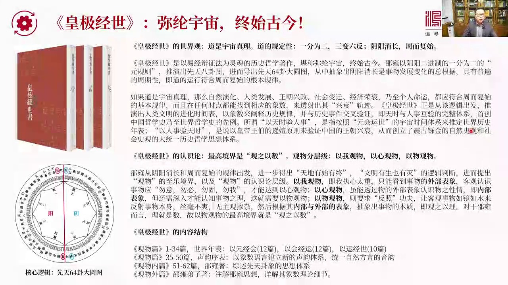

它是一本什麼樣的書概括起來珠西的評價我覺得非常的恰當就是迷倫宇宙中時古今那麼黃金金式這本書寫於11世紀那麼到現在已經有一千多年了在這一千年中間有不少的儒學家還有些研究數數的人都在分析和研究黃金金式這本書內在的規律和道理我們這堂課是從我們紅穴的角度或者說是從一種西方邏輯的思維方式來試圖站在少庸的角度推...

<strong>Cleaned narration</strong>

> 它是一本什麼樣的書概括起來珠西的評價我覺得非常的恰當就是迷倫宇宙中時古今那麼黃金金式這本書寫於11世紀那麼到現在已經有一千多年了在這一千年中
> 間有不少的儒學家還有些研究數數的人都在分析和研究黃金金式這本書內在的規律和道理我們這堂課是從我們紅穴的角度或者說是從一種西方邏輯的思維方式來
> 試圖站在少庸的角度推演從邏輯上推演它整個這套體系它的合理性邏輯的嚴謹性等等首先黃金金式它的世界觀是什麼我認為它談到的重點是道道是宇宙真理那麼
> 道的規定性是什麼就是一分為二三變六反陰陽小長周而復始一分為二和三變六反講的是事物形成發展的這樣的一個過程宇宙是什麼怎麼創造的怎麼誕生的陰陽小
> 長周而復始講的是創造宇宙萬事萬物之後它的運行規律這也是東方哲學跟西方哲學一個非常重要區別我們的道規根到底總結成四個字就是周而復始那麼黃金金式
> 這本書實際上是已經變正法作為它的靈魂來產數歷史哲學的著作少庸以陰陽二金制的一分為二作為總的規則我們可以稱之為是原規則然後推演出了先天八卦這是
> 我們上一課講的重點內容然後從先天八卦中演著一分為二的邏輯記憶部推到出了先天六十四卦大圓圖這個大圓圖非常關鍵那麼從這個大圓圖的它的走勢來看我們
> 可以明顯的從中看出一種陰陽銷漲規律而這種陰陽銷漲規律被少庸提煉成為是萬世萬物發展變化的總的根據所以它具有普遍性而且具有周期性所以道的運行是符
> 合周而復始的這個根本規律的當然如果說道是宇宙真理那麼自然演化人類的發展王朝的清衰還有社會變遷包括經濟的融衰乃之我們每個人的命運那麼都應該符合
> 道的這種規律也就是周而復始而且它所建立的體系可以讓我們在整個宇宙的這個時間的作標系中不管在哪一個時點都能夠找到相應的項數也就是掛項通過這個掛
> 項我們可以透射出這個事物在這個時間點上它的新衰的軌跡就是下一步它會項什麼方向發展那麼黃金金是這本書也就是基於這種邏輯所以它能夠進一步向前推演
> 推演整個人類文明的計畫的實驗表或者我們也可以說叫世界年表那麼用項數來產數這種歷史人類在規律更重要的是它還能夠與歷史事實交叉驗證也就是說天使和
> 人勢互相驗證的一個完整的體系我認為這一點非常重要實際上它手創了這就是乃至世界這就是它的一種先例前所未有在稍微用之前不管是兩合流域的文明還是希
> 臘的羅馬的文明埃及倫敏包括印度文明也包括中國的歷代先哲從來沒有人試圖用一個這麼大的體系包含宇宙的這種體系來推演不僅推演還要精確計算不僅精確計
> 算而且還要用掛向來反過了驗證這是一套龐大的思想體系可以說少用做了一個前屋古人我們不敢說後來者吧至少到目前為止還真沒有人把這套黃金金是它內在的
> 原理吃透那麼它這套以天使來驗人勢是什麼意思呢也就是說少用提出了它的時間的一個體系我們可以稱之為是宇宙時間體系也就是原會運勢用這四個表大的更大
> 持度的時間來推演世界歷史的年表或者叫人類文明的年表那麼以人勢來驗天使它講的是如果我們了解了歷史的發展的規律之後我們可以用掛向去驗證那麼它要產
> 出一個歷史哲學就是皇帝、王、博或者叫王霸它的地善的規律然後來說明中國歷代王朝的新衰當然了我覺得這一點跟司馬光的自通見有一曲同工之妙司馬光展現
> 的也是中國歷史背後的規律它所採檢的史實目的是為了說明背後的規律那麼這一點跟少用可以說是非常氣和的當然兩個人之間的關係也非常好所以在少用寫作皇
> 帝經市的三十年中也正是司馬光集中經歷創造它的自治通見的時刻兩者是同步的所以我相信他們倆人在寫歷史在總結規律的時候一定會相互的討論所以我們看到
> ...

---

### Slide 3

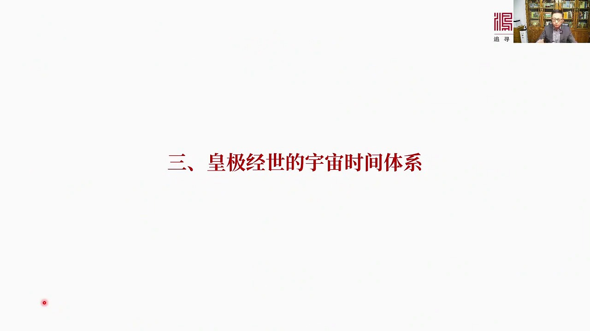

第三部分首先我們要解讀黃金式這本書它所構造了宇宙實驗體系它是怎麼搞的怎麼去構造的因為看不懂它的宇宙實驗體系當然這本書就沒法看所以我們要先要研究它怎麼定義時間好我們看下一頁這就是黃金式展開打開書

<strong>Cleaned narration</strong>

> 第三部分首先我們要解讀黃金式這本書它所構造了宇宙實驗體系它是怎麼搞的怎麼去構造的因為看不懂它的宇宙實驗體系當然這本書就沒法看所以我們要先要研究它怎麼定義時間好我們看下一頁這就是黃金式展開打開書

---

### Slide 4

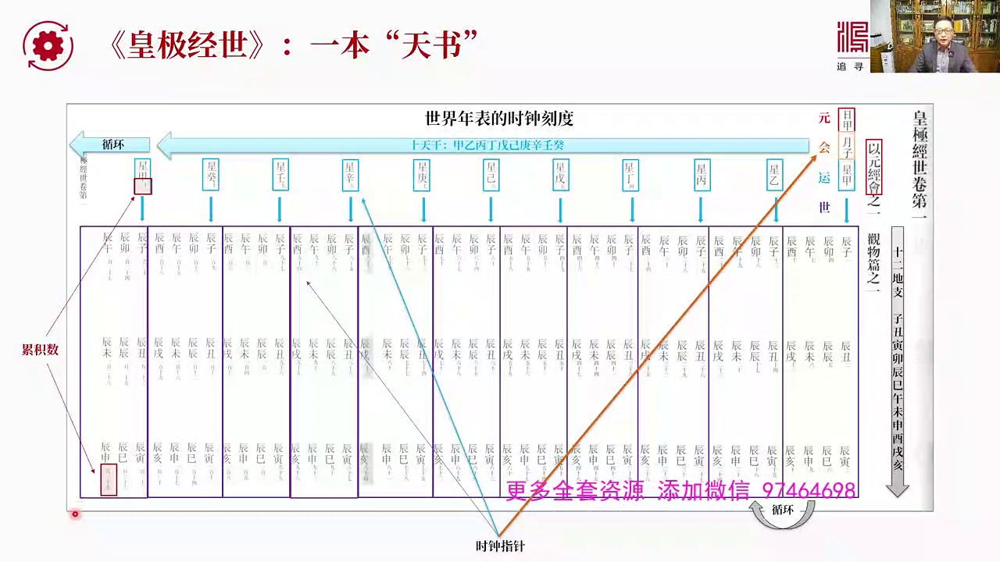

第一頁第二頁的主要內容我把它合併在一起用掃描移掃描的大家看這本書之後如果沒有我畫這東西你也看下去覺得這是天書因為這樣的內容延續了好幾十頁整個以元金會的大部分大部分內容都是這樣看起來什麼這是什麼玩意兒看也看不懂標註了這個天干地址然後包括數字但是很少出現內容所以一般人看起來首先翻了幾十頁都是這個圖表這什...

<strong>Cleaned narration</strong>

> 第一頁第二頁的主要內容我把它合併在一起用掃描移掃描的大家看這本書之後如果沒有我畫這東西你也看下去覺得這是天書因為這樣的內容延續了好幾十頁整個
> 以元金會的大部分大部分內容都是這樣看起來什麼這是什麼玩意兒看也看不懂標註了這個天干地址然後包括數字但是很少出現內容所以一般人看起來首先翻了幾
> 十頁都是這個圖表這什麼玩意兒所以看起來就像一本天書我想掃描這麼寫的主要目的這些空白之處其實是有帶號人填的每一個空白之處實際上都可以填充內容只
> 不過掃描沒有時間和經歷把人類文明的整個周期12萬9600年的所有的考古工作還有這個技術工作全部一做到位但是它這麼裂是把所有的時間表按一張像日
> 曆一樣的方式把它全面裂出那麼首先我們來讀一下這個它主要的內容以原經會我們一會兒再去講什麼叫原會運勢首先來看它這些字的主要部分比如說最上面有個
> 日假第二個是月子第三是新假第四部分是陳子這一聽或者一看我們就覺得這好像有點規律日月新陳再加上假子假子這一聽就有點意思了首先日假它對應是原月子
> 對應是會新假對應是運然後底下這個陳子陳寶這些對應是勢那麼假當然我們知道這是天乾十天乾假以餅丁物極更新人鬼那麼子呢當然就是對應的是十二地之子首
> 一毛陳子五位身有虛害所以我們來看它這樣的一種標誌法這什麼意思呢就是在最大了時間尺度上它用的是天乾假以餅丁物極更新人鬼叫小一個第二層次的會它用
> 的是子首一毛用的是十二地之然後到運又用天乾到事再次用地之那麼我們來看比如說我們先看小的最小單位是一事是大概多少年一事大概對應是三十年那麼我們
> 來看它這個這個陳子它是怎麼讀的子首一毛陳子五位身有虛害所以它是數碗的要這麼讀要這麼讀這就是十二地之十二地之在配數我們可以看到一二三四一直到十
> 二地之然後到了陳害的時候開始循環循環又變成陳子陳醜陳銀陳毛然後到十到二十四之後注意這是一個累極數也就是說從宇宙的開天PD的人類文明第一天一照
> 現在這個數一直在累極怎麼累極不斷的循環不斷的地質不斷的循環不斷的循環一照這我們可以看到這已經累極了129所以這是一個累極數首先要記住這點那麼
> 天干天干也是累極的比如說我們看運新疆新疆新疆加以餅丁誤己更新人鬼到了這之後新鬼之後下一個跳過來又是新疆而且這個數到了十到了十十天乾完了之後這
> 是十一這個數也是累極數所以十天乾也是運營到十之後重新跳回來從假又開始然後不斷的循環這個循環這個尺度我們可以想像它可以循環一直循環到現在所以我
> 們可以看到天干和地質在兩個方向上不斷循環是構成了它這個紀年份的一個統一的規範同時數字在不斷的累極這是累極數所以不僅是新和城市這個規律這個原和
> 會也是這個規律只不過它們俩尺度更大會的尺度更大它也是自首移貿層次五位身有學害也是走十二地之好搞明白這些東西之後我們就不會再覺得這個東西像天書
> 至少你搞清楚了是怎麼回事我們再看直觀的這一頁這一頁只是給人的感覺是什麼我稱之為是世界年表的時鐘刻度這個時鐘刻度被掰直了就是它本來是個胡醒的就
> 像中表它應該是胡醒的當然由於時間太漫長十二萬年你怎麼弄所以在每一個局部就像一個橫圖就像那個大橫圖小橫圖把它彎過來就是圓圖所以我們可以把它想像
> 成是一個掰直的時鐘刻度我們在時鐘刻度上可以看得有不同的指針比如說我用黃色代表會那麼用藍色代表這個運用紫色代表試好那麼我們可以想像一下這個指針
> 在不停的移動只不過這個會這個指針移動的比較慢而紫色這個指針移動最快那麼怎麼來理解這個日月星塵它為什麼要用這四個字原會運式是它創造出來的新詞會
> ...

---

### Slide 5

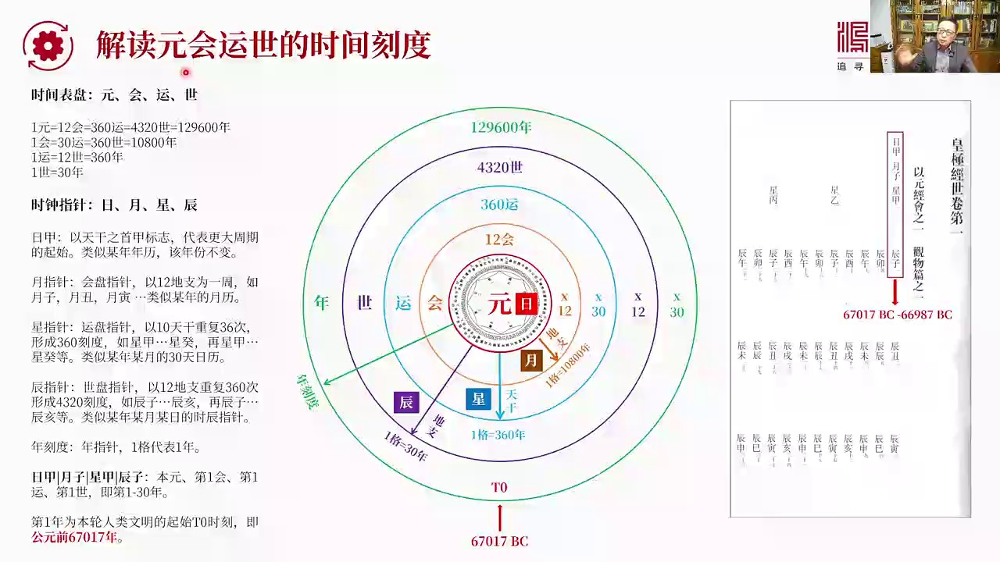

它這個時間課度到底是怎麼怎麼來運行的首先我剛才已經說了我們可以把把它想像成個表盤原會運式就是形容它的不同的表盤原來是最重要那個時間尺度最大的會是比大家小一些運和式越來越具體越來越細所以這是4個以表盤4個中表盤那麼具體而言議員等於12會就像一年等於12個月那麼12會也等於360運就好像一年有360天3...

<strong>Cleaned narration</strong>

> 它這個時間課度到底是怎麼怎麼來運行的首先我剛才已經說了我們可以把把它想像成個表盤原會運式就是形容它的不同的表盤原來是最重要那個時間尺度最大的
> 會是比大家小一些運和式越來越具體越來越細所以這是4個以表盤4個中表盤那麼具體而言議員等於12會就像一年等於12個月那麼12會也等於360運就
> 好像一年有360天360運又等於4300243002是相當於一年有這麼多個這個時辰當然在往後就是12900這是更小的尺度相當於分了那麼這個時
> 候我們用年來標記的話我們可以想像議員它是一個12900600年的一個尺度我們把這個叫議員所以這是一個比我們年月日時要更大的多的尺度但是是同比
> 方大因為是跟我們的年月日程年月日時時趁是相對應的所以這個是我們對於議員的理解那麼一會等於30運就好像一個月等於30天一樣那麼等於360個時趁
> 或者等於這麼多10800個更小的尺度那麼一運等於12是然後12是等於360年1是又等於30年這個是它整個的尺度基本上它的規律就是12和30反
> 覆相成這個就是我們對於大的表彈的理解如果形象來話我覺得這樣的話可能會看得更清楚一些比如說議員其實它是最大的一個時間概念但是如果我們要把議員對
> 應的就必須要把它放到最小放到最裡面這個表彈它就代表今天是哪一天或者代表今年是哪一年它是不變的在整個周期中它一直是較假所以它稱之為是日假那麼在
> 它外圍一圈比它這個時間尺度更細一些的就是會議員等於12會在往外是運這個一會等於30運一運再等於12是12是然後再成30就12900年所以它是
> 原成以12再成以30再成以12再成以30不斷地向外推延注意再往外還可以增加再往外增加再往外繞那就是年再往下就是多少個月一月來計再往外那就是以
> 天來計再往外就是多少就是議員等於多少等於多少年議員等於多少個月議員等於多少多少天議員等於多少十成甚至最後我可以到好秒到秒然後到好秒到微秒到那
> 秒就看這個圈怎麼擴大所以我們這個體系是原不斷往外擴大尺度越來越小可以無限地小下去但是它也可以往理縮往理縮這個尺度就會變成更大的尺度就是以12
> 900年為尺度如果這個圈往理頭再來個會再來個運再來個勢再來個年越來越小的話相當於把這個整個體系往外膨脹我們最後會看到它可以膨脹成167億年所
> 以這套體系是往外無限擴大往內可以無限縮小都是同構的原理原會運勢對應著比如說年越日成所以同構都是12成30反覆相成那麼我們剛剛所說的日月星塵這
> 是表盤日月星塵相當於指針比如說我們在一個鐘上你可以看到1點到12點我們說這個中表的時候我們知道它是指了一個表盤但是我要說幾點幾分的話我只能用
> 時間來表達只能用課度來表達所以為什麼它需要兩套命名標準因為這是說的這是一個大表盤運這是會表盤這是視表盤但是你要說到底我們現在走到哪一步了走到
> 哪個課度了那當然需要指針我們用指針來描述日不變它就相當於一個日曆的2023年這個日曆好這個日曆在這兒永遠不變整個翻完36060頁的這個日曆它
> 都不變它都是2023年所以日在這兒不變的月呢用的是地址12地址一格它跳12格一格是10800年然後新新的指針是用天乾新的指針一共有360格你
> 看360運代表這個圓圈上可以課出360個課度每走一個課度是360年成就是地址地址在這個圓上可以課出4,320個課度每走一個相當於跳30年那當
> 然年年這個課度就是一個一個走這一圈走下來一共有12,900個課度所以每走一個課度是一年搞明白這個東西之後我們就知道它的課度它的指針還有表盤三
> ...

---

### Slide 6

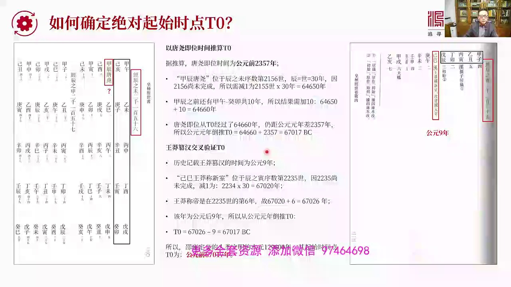

我們怎麼知道12萬9600年因為這個少庸說是一個絕對的數這個數的起點在哪我們怎麼能把它固定住所以我們用兩種方法來交叉驗證首先黃基金式是以糖謠我們知道謠順語糖謠登基的時間來推算T0歷史上是有記載的根據當時的天下據這種推算糖謠記輪的時間是公元前2357年公元前2357年當然這個考古學界還不敢這麼肯定因為...

<strong>Cleaned narration</strong>

> 我們怎麼知道12萬9600年因為這個少庸說是一個絕對的數這個數的起點在哪我們怎麼能把它固定住所以我們用兩種方法來交叉驗證首先黃基金式是以糖謠
> 我們知道謠順語糖謠登基的時間來推算T0歷史上是有記載的根據當時的天下據這種推算糖謠記輪的時間是公元前2357年公元前2357年當然這個考古學
> 界還不敢這麼肯定因為他們需要找到更直接證據但是根據當年的新項很多人認為歷學家們認為從古至今大家基本都認同這個時間公元前2357年那麼在黃基金
> 式中我們可以看到它有個紀錄就叫什麼呢就是這個京城之位2156這什麼意思呢就是糖謠登基的這年叫甲城年甲城年到底是哪一年我們現在打個問號要求這個
> 數那麼它這個城之位也就是我們知道它是天乾和地質的搭配在我們的整個序數表裡頭在整個的序號中間從市這個角度來看它是第2156式它已經列出來這是個
> 累積數我們剛剛已經說了市這個層面它一直在累積包括運營它也在累積包括會也在累積我們如果知道它這個市我們知道城和市是相當的概念都是30年那麼在2
> 156式中間的第11年這個時候我們需要理解的是它這個2756其他還沒有完成它只走到了一半它耗了還有好多年所以還好多個市所以我們在這裡就不能用
> 2156這個數應該用2155就像剪掉一個數也就是用已經完成的那個數來推算我們知道儀式等於30年所以在這裡我們可以用2155是來成以30年得出
> 了這個就是少庸的時間或者叫少庸的它所定義的時間是6萬4650年可以簡稱為少利6萬4650年我們現在要折算它大概相當於公元錢多少年我們知道在這
> 假城堂謠之前還有假武以為秉升等等這還有還有多少年還有10年那麼也就是堂謠繼位的假城年之前還有10年所以我們要把這10年給加上去剛才是計算到上
> 一個2155式的總數是這麼多那麼再加上它之前的10年所以假城年我們就可以得到一個結果就是6460加上10年當然就等於6460年好這意味著什麼
> 意味著堂謠繼位是從T0時刻經過了漫長的歲月經過了6460年我們知道它登基這是公元錢2357年經過了6萬多年之後仍然還沒有到公元的元年離公元元
> 年還差2357年所以這兩數加在一起就是T0時刻T0時刻等於6460加上2357等於公元錢67017這就是這麼算出來的好這個東西到底對不對呢我
> 們還可以找另外一些數來驗證比如說王馬串漢歷史上有明確記錄而且我們知道它的公元多少年準確說就是公元第九年王馬串漢這在歷史上也有記載黃基金市中它
> 是這麼記載的也就是陳之銀陳銀在這個陳之銀這個這個記錄中間是2235是中間的1235第六年所以我們可以根據這樣的記錄在這個幾四年王馬串漢市王馬
> 串地了改國號微信時間是公元九年那麼它的位置是在第2235是當然2235是還沒有完成所以簡1是2234是誠意30年因為儀式等於30年我們得出6
> 2020年那麼王馬串地是在這一世中間的第六年因為前面還有五年它是第六年所以要把前面已經結束這個年正在加上6那麼絕對數少庸時間的絕對數是670
> 26年我們知道這個數已經過了公元了是公元之後的第九年所以我們倒退公元元年的時候從元元年倒退T0的時候就用67026簡去九年得出的結論一樣還是
> 67017年大家可以隨便挑一個數秦日皇統一中國公元千二百二十一年這個宋朝建立公元九百六十年然後你用它這個紀錄倒著退會得出同樣的結論每一個有固
> 定的時間節點的年份倒著退都能推出同樣的結論一年都不會錯所以少庸這套東西是它為什麼一個數一個數的劑就是為了保證絕對不出錯在古代沒有計算機也沒有
> ...

---

### Slide 7

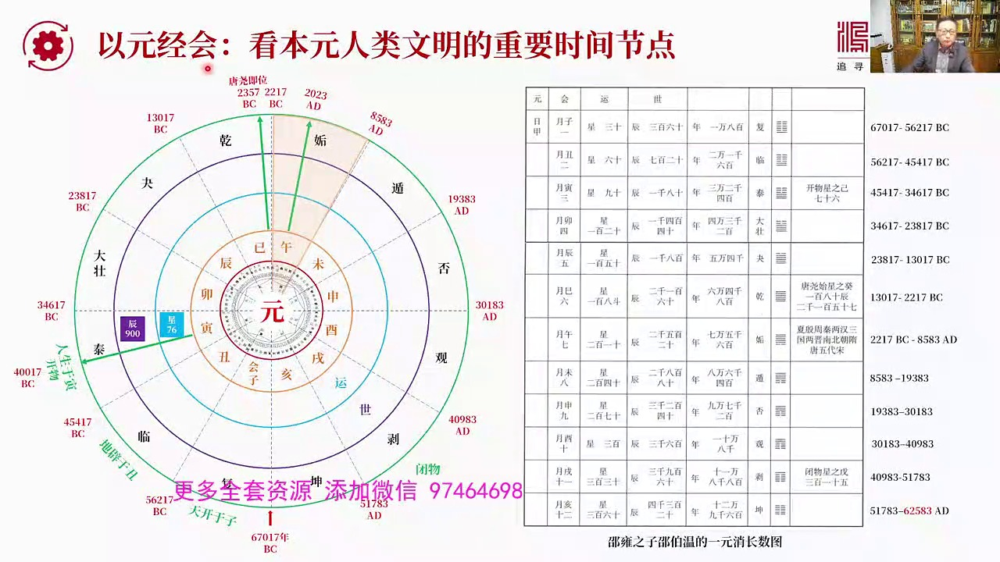

它到底在講什麼?我用一句話來概括,就是看本輪或者叫本源,人類文明的重要時間節點如果用這張圖來畫的話,向邏輯,我們先用向邏輯來看也就是說,T0時刻是公元前六萬七千零一十七年時間是這麼走的,從復掛開始,就是從紫石開始然後這樣繞,繞一圈,下來是十二萬九千六百年然後結束,本輪文明好,在繞了過程中,首先我們來...

<strong>Cleaned narration</strong>

> 它到底在講什麼?我用一句話來概括,就是看本輪或者叫本源,人類文明的重要時間節點如果用這張圖來畫的話,向邏輯,我們先用向邏輯來看也就是說,T0
> 時刻是公元前六萬七千零一十七年時間是這麼走的,從復掛開始,就是從紫石開始然後這樣繞,繞一圈,下來是十二萬九千六百年然後結束,本輪文明好,在繞
> 了過程中,首先我們來看它對應了一些綜合的一些新的一些內容比如說,我們可以用詞炒銀毛塵寺五位,身有虛害來定義十二會那麼同時我們又知道它代表時刻
> ,比如說紫石同時它又代表復掛,我們這叫十二個掛叫十二屁掛,就是漢朝漢義那幫人搞的根據十二個掛項來模擬純下秋冬季節的十二個音漲陽銷、
> 音銷陽漲的變化情況所以時間就是所謂的東智這一天相當於這個時刻的開始伊陽復生伊陽復始,所以復掛,或者叫紫石是每一個周期的開始那麼按照黃金金式的
> 說法,就是天開於紫當伊陽復始的時候,本來是純粹的冬季特別特別冷結果到了紫石,過了東智的在那天的十二點過去一點點就開始伊陽復始了那個時候地氣開
> 始慢慢的有一點點暖氣了有一點點地氣開始回升了,陽氣開始回升了所以這叫復掛,從掛上上可以看得非常明顯六搖中間第一掛變成陽掛了,本來是坤,六個都
> 是音搖現在第一搖變成了洋搖這代表開始,陽氣開始有一點點上升了這叫天開於紫,對應的年份是六萬七千年到五萬六千年BC對應是一萬零八百年,這是一個
> 刻度是一萬零八百好,第二句話是地批於醜,就是在零掛這個時刻從五萬六千年到四萬五千多年之前這段時間代表地批於醜,它對應是零掛或者叫醜石,我們來
> 看零掛,零掛跟復掛最大的區別是第一揚之後,現在第二搖也變揚了,我們可以看到這個整個搖向它的揚搖越來越多,只說明春天在靈敬了第三句話非常重要,
> 人生於贏,也就是開悟首先,天開了,然後地批了,第三是人出來了這個開悟所對應就是太掛太掛我們可以看到很清楚,它是三根揚搖,三根音搖就是內在的東
> 西已經變成揚搖,外面的東西還是音這個叫三揚開胎,為什麼叫三揚開胎三個揚搖在底下,在內部已經揚氣越來越阻了外部在外掛上表現了還是音,但是實際上
> 說明樹發展的規律,它是越來越朝著春天、朝著夏天方向去進化它寫的開悟星是幾76,這代表什麼呢?代表的是運走的76運,運也是從這兒開始慢慢一隔一
> 隔運動運動到這兒運動了76了,早於全是三百六運動到了76,這個時候人出現了,或者叫人生於贏那它所對應的成,或者對應的這個時辰大概是第九百大家
> 可以用三十去成九百,大概是兩萬七千年也就是從少庸這個時辰時間,換成成絕對時間往這邊走兩萬七千年,也就是公元四萬,公元錢四萬零一十七年這個時候
> 人類出現了,對應是太廣然後再往後大壯,我們聽這個名字覺得春天的七七越來越強壯大壯當然就是第四遙也變洋了現在我們可以看到,底下是四洋,上面是二
> 音當然就是越來越靠近夏天,第七越來越暖然後再往前就是怪掛,怪掛就是五根洋全洋了還有最上面一根洋還沒有洋,這就已經非常接近於現代了這已經到了公
> 元錢一萬零三千零一十七年這就已經非常靠近今時期時代了好,到錢掛,錢掛當然全部轉洋了錢掛的時候,在這一掛中間,我們看到唐遙,幾位對應時間公元錢
> 兩千三百五十七年那麼正中間這個位置,錢掛走完了這個位置正好對分的這個位置是公元錢兩千二百一十七年而我們現在二零二三年是在這我們大家一看就覺得
> 整個人類文明在這個大十中中間就只有這麼一小段就是所謂的新時期時期文明以來的一直到今天也就是一萬一萬多年也就走了這麼一小段然後再往我們現在所出
> ...

---

### Slide 8

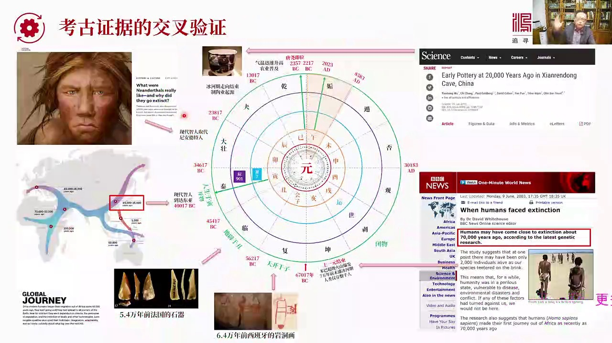

首先我們來看一下上一次結束就上一次人類文明結束的時候出現了什麼上一輪是什麼那當然是我們是晚期之人還有早期之人年德特人就是早期之人還有更早的一些其他的這些人我們可以看到上一元結束的時候出現了一次重大的自然災害就是印尼的多巴超級火山爆發了大約爆發在7萬年前那就是最後一次聖兵七當時據說這次爆發是得整個人類...

<strong>Cleaned narration</strong>

> 首先我們來看一下上一次結束就上一次人類文明結束的時候出現了什麼上一輪是什麼那當然是我們是晚期之人還有早期之人年德特人就是早期之人還有更早的一
> 些其他的這些人我們可以看到上一元結束的時候出現了一次重大的自然災害就是印尼的多巴超級火山爆發了大約爆發在7萬年前那就是最後一次聖兵七當時據說
> 這次爆發是得整個人類的存活數量只剩下了幾千人BBC有一個分析當然它這個是引述引述科學家的研究就是人類非常就是在7萬年前人類有一次非常靠近滅絕
> 當然這是指著致人晚期致人這一次可能爆發導致了整個人類大概還剩2000人左右整個人類當然東非這一代不用說了他們都跑到吃到這個地方躲著大概存活了
> 2000人怎麼知道呢根據DNA的研究這個是BBC2003年的一個研究報告然後它做了一個分析和報導根據我們現在人類的DNA進行追蹤追蹤上來我們
> 的這個原始祖先大概還剩我們的直系的原始祖先大概還剩2000人所以在上一輪的最後一個階段一萬多年遭受了非常慘重的這個冰期冰科期是最嚴重的這個墨
> 詞剩冰期導火所還有可能是一次超級印尼的超級火山爆發當然也有人是說是因為其他原因不管怎麼樣這是上一輪的昆掛所對應的自然現象當然這有確做的是歷史
> 證據和科學研究的這個證據來作證好經過漫長的10800年的冬季終於來到了公元前67017年進入了富掛進入了紫石進入了七一輪文明的起始一央富石就
> 像冬至之後第一天開始了新的一個周期天台與子我們可以看到對應的考古學發現這大概是6萬7到5萬6之間那就是我們可以看到在這期間發現了考古學證據包
> 括6萬4000年前西班牙的嚴動化咱們在我們的核心課裡面人工智能講算法的時候還專門用過這張話這就是6萬4000年前它的嚴動化就是人類已經產生了
> 抽象思維能力因為你想想看你要把話化成這樣代表著這是梯子然後這個它所它所運喊的含義是當你能畫圖的時候就已經有超級的抽象思維能力了就能夠把客觀的
> 事物牛啊馬啊這些客觀事物能夠抽象成一個具體的符號代表著這個新一輪的文明的重大的飛躍最早的壁畫基本上沒有超過這個年份的大家可以看一下考古學報告
> 這代表著新的時代開始了天開與子當然我們不能夠竹子竹具的理解少文的話天開與子講的是一種新的文明的前昆出開天地出開的狀態考古學中我們已經看到人類
> 在這個階段中產生了重大的飛躍好第一批於醜這是對應的時間是56000-45000年我們可以看到發現了54000年前的法國的時期已經做得相當精美
> 這張凸太小如果拉開的話你會看到就實際時代這個考古學在那個時刻已經達到了一種頂峰經營剔透而且非常的就像現在加工過養用機器加工過養相當的精緻所以
> 開天屁地了人們開始使用新的工具了而這種新的工具要遠遠強於上一個上一個輪迴這幫人滅亡的時候所生產的工具這是有本質性的飛躍的再往後這一點特別重要
> 太掛出現了人人生於營開誤了我們推測是4000-117年BC我們如果對應一下看看這是美國雜誌的他們會的人類簽一圖你看一看晚期致人運動到中國的時
> 間是多少是距今3萬5千年到4萬5千年正好對應著太掛他的時間從當然我們要加上公元2000年大概其實從3萬5到4萬5可以說穩和的非常非常的好從4
> 萬5千年一到3萬5千年好像非洲出來了最後一批那2000人祖先上下那幫人最後運動到中國的時候運動到亞洲的時候這個時間跟太掛時間幾乎是顏色和縫的
> 對應也就是現代致人到達東亞到達了中國時間是4萬0一是7年BC當然考古學還沒有給出這麼進確的時間但是我們可以發現這個現代致人到達東亞時間跟少勇
> ...

---

### Slide 9

五會我們現在是應該是這會叫五我們看看自首銀馬城四五就是五會七它是第七運第七第七會中間一共有三十運我們看到十二運就夠了十二運就是從公元公元前二二二要七年一直到公元兩千一百零三年現在還差好幾十年還差八十年了所以我們只要看第一運到十二運就夠了在這一輪中間在五會七中間我們看十二運總數是三十運我們看頭是二運夠...

<strong>Cleaned narration</strong>

> 五會我們現在是應該是這會叫五我們看看自首銀馬城四五就是五會七它是第七運第七第七會中間一共有三十運我們看到十二運就夠了十二運就是從公元公元前二
> 二二要七年一直到公元兩千一百零三年現在還差好幾十年還差八十年了所以我們只要看第一運到十二運就夠了在這一輪中間在五會七中間我們看十二運總數是三
> 十運我們看頭是二運夠了因為我們整個人類文明和我們感興趣的時間都在這一段那麼我們現在所在時間二零二三年對應著總的運勢總的這個運勢是第一百九十一
> 百九十一運對於我們這一會來說是十二運連就是十二運就夠了它要賺一圈回來那就是那就是到運三十了三十運了這一圈從公元前二二二要七年賺一圈二十多長時
> 間一會是一萬零八百年就相當於一個我們新時期時代意照現在的文明的周期最後繞回來之後是在比如說是在公元後八五八三年所以我們來看這張圖你會看到原來
> 是這麼回事從下朝開始下商州按照這個時間的數據這麼牌一直到清晨皇統一中國比如說我們把清晨皇統一中國公元前二二二十一年做一個標竿實際上是研究第六
> 運的問題當第七運第八運一直到現在最後一運第十二運對我們來說最關心是1743年前龍年間一直到現在是在這一段第十二運那麼如果我們看第六運清晨皇統
> 一中國的時候他所對應的新是186也就是如果我們把這個數誠意這個36我們會得到相對應的這個年份然後他所對應的誠是二二要對這個一直到二二三三誠就
> 已經能夠準確到三十年了這個所以我們這個運六第六運他所對應的186186新所對應的誠是這這個三十年這就是我們通過這張圖可以看到原來清晨皇在這段
> 時間清晨統一是在這段時間所以我們可以找到黃金金是這本書翻開找到他所對應的年份的描述來看這就是黃金金這個黃金金是以會經運所他所展現的形式也很簡
> 單比如說我們可以看到這些數什麼意思呢當然這個就是具體的年份剛才我們試的時候只有三十年現在具體課度最小課度已經到年份了這些年份是什麼意思這些年
> 份實際上是代表周王朝周王比如說周列王元年周列王二三四五六七周顯王多少多少多少年這前面第一排是代表正宗代表周王他的紀念周列王記憶紀位之後這是他
> 的年年後那麼在下一排呢代表周猴比如說近他排的最上面近其宋楚晴包括韓趙慧這是後來三家分禁之後就是禁結束了我們可以看到這個禁王之後就跳到這兒韓趙
> 慧接著排那麼周猴也是齊歡宮二三四五六然後齊威王的多少年然後宋屁宮又是多少年這就是按著這個這些王宮就是按著這個這些宮或叫博按著他們的年號來記錄
> 東州的列國的他們的時間然後楚王楚宣王等等等等你會看到他的年份列在這兒秦鑑宮他的年份列在這兒包括秦鑑宮我們知道這已經快到了秦鑨皇了韓趙慧好我們
> 看到這些韓趙慧這個猴這個猴他們有多少年所以以會經韻我們看的只能看到王朝星衰的時間的關鍵節點也就是以王以猴他們什麼時候繼位再位多少年看不到細節
> 比如說我們在這兒可以看到這個在往後還可以看的新王統一包括新王統一之前滅到東州那麼這就是以會經韻看的不是特別仔細但是已經可以看到王出現了只有王
> 了年號和他在位多少多久這就是以會經韻你看這個書他在這部分到187頁的時候寫的都是這些東西其實你看不到太多具體的具體的內容因為你首先首先你搞明
> 白他的時間刻度是怎麼運軟的然後對應著看真正的內容還要往後那麼我們在往後看一下以韻經式以韻經式就可以詳細到30年了

---

### Slide 10

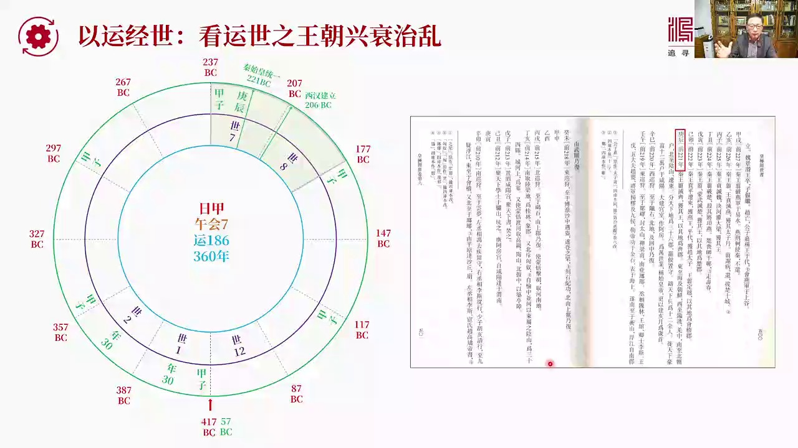

剛才我們說秦始皇那段時間我們比較感興趣我們回到這兒看秦始皇這一段時間第六運日假

<strong>Cleaned narration</strong>

> 剛才我們說秦始皇那段時間我們比較感興趣我們回到這兒看秦始皇這一段時間第六運日假

---

### Slide 11

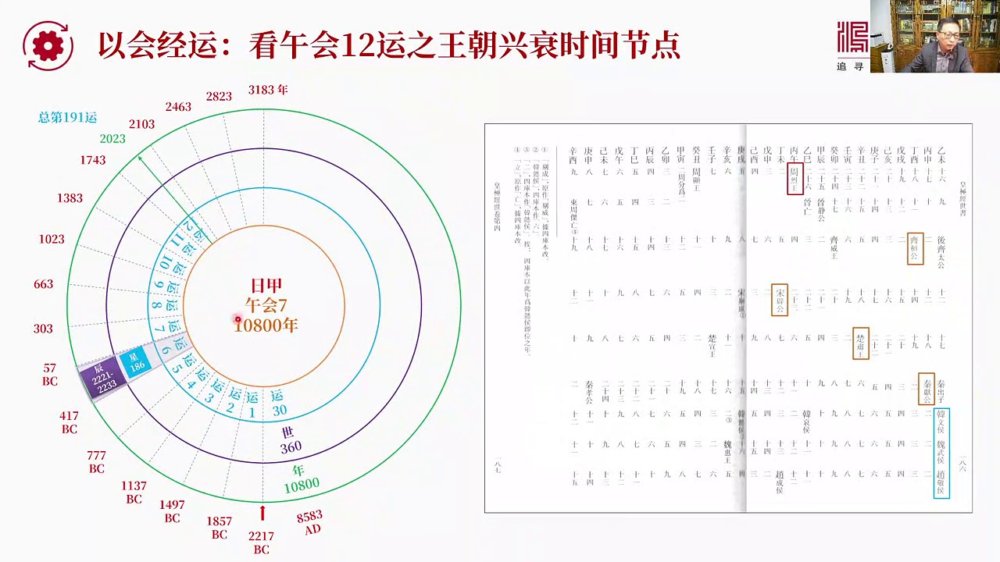

這個五會七中間的第六運是從417年BC到57年BC好我們把這塊再把它放大把它放大成這個元就是下頁這個元從公元前417年繞一圈360年

<strong>Cleaned narration</strong>

> 這個五會七中間的第六運是從417年BC到57年BC好我們把這塊再把它放大把它放大成這個元就是下頁這個元從公元前417年繞一圈360年

---

### Slide 12

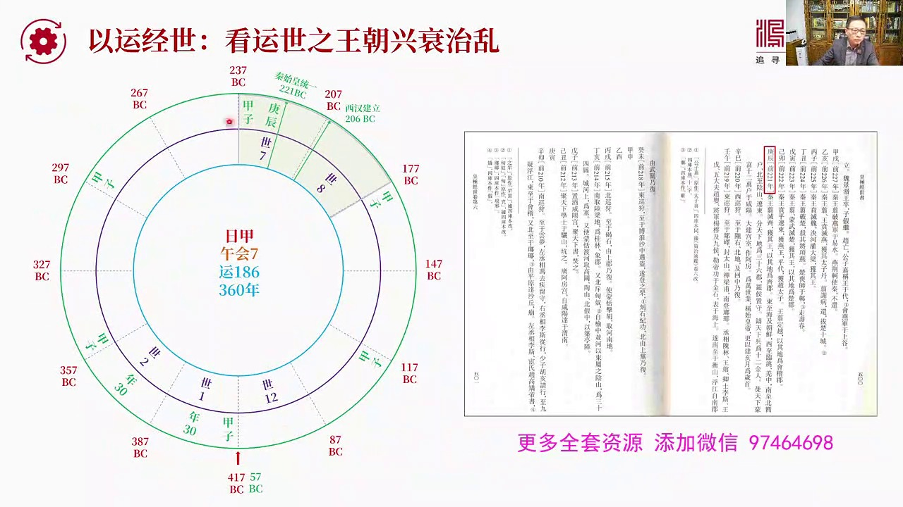

到公元前57年這就是以韻第186運總韻然後在五會七中它是第六運這一運轉一圈藍色轉一圈這是360年中年沒有五了也沒有假了因為我們現在是以韻經式以韻經式就是通過就像這個日例一樣我不用知道它是哪一年因為我知道我已經知道它哪一年了現在我某一月我已經翻過去了我現在就想知道它是它是星級級在幾號是星級級所以我們這...

<strong>Cleaned narration</strong>

> 到公元前57年這就是以韻第186運總韻然後在五會七中它是第六運這一運轉一圈藍色轉一圈這是360年中年沒有五了也沒有假了因為我們現在是以韻經式
> 以韻經式就是通過就像這個日例一樣我不用知道它是哪一年因為我知道我已經知道它哪一年了現在我某一月我已經翻過去了我現在就想知道它是它是星級級在幾
> 號是星級級所以我們這個整個同性源越來越簡單越來越簡單這就到了以韻經式它主要目的是為了看運勢運勢中間的王朝星衰置亂怎麼新的怎麼王的記錄的就比較
> 詳細了比如說從這個時間節點我們可以看到這個以韻有12式從11繞一圈78然後11繞12美式是30年兩式是一個假子一假子是60年所以它在美式的一
> 開始一二的一開始是假子三四一開始是假子然後按著這個規律來所以我們來看我們最關心的是公元前1221年清朝皇什麼是統一的是在這那麼它是在它是在第
> 七式和第八式這兩式比較有意思因為是一道清朝統一是一道西漢建立所以是第七和第八兩式這中間就會有越來越多的細節出現因為這第七式對應著30年如果我
> 們有課多了30年基本上已經可以把它課出來了那麼每一年對應了紀錄的這一條就是我們看到了這些內容西漢建立也是公元前多少多少年然後我們可以看到這個
> 西漢還沒有我們在這看到是公元前221年清朝建立是在這個時間點上這個條目對著條目就對你到書中了這一部分比如說秦王姊滅祈然後抓了祈王復活祈王然後
> 把他的土地作為祈禦然後滅掉了最後一個最後一個強國統一了中國然後把所有的兵器全部收到鹹洋住在十個大精神等等這些如果說我們這個我們這個圖足夠大的
> 話你可以把所有這些內容全部放在圓圖中間甚至用剛才十二萬九千六百年那個大圓圖然後把對應的事件分別列在這個圖旁邊這樣的話你一看歷史哇塞這不是很清
> 楚嗎秦王這段時間從這個這個其實開始到這又是午後了這就是我們在每一個輪迴中間來看它處在勝衰新衰的什麼樣的一個狀態這三百六十年這是一個大運在這個
> 運中它又是處在午後這是中午這是此時這是中午然後它又偏了偏到十二點多了也就是整個這個在運中它又是偏午後的這就是代表我們越來越細的把尺度放大因為
> 用放大鏡不斷加高倍數看得年份越來越細看得甚至到每一天它所對應的掛向或者它所對應的一個運動軌跡新衰的軌跡我們看著這肯定是這個過了最頂升的時候然
> 後再走向這一運的往後走這就是我們看整個黃金金式它前半部分時間表大概就是這麼排的這個瞭解這一段最主要的目的是忘了為了幫助大家熟悉這個書該怎麼看
> 這是什麼意思為什麼要這麼寫其實說到底就是一個大圓盤中間可以把每條記錄對應到每個課度上當然如果沒有足夠大的這個當然用電子化的東西可以實現用足夠
> 大的圈就能夠那種全部列在這個圈上而且通過這個圈通過這個12P周日富士這個狀態我們可以馬上看出每一年所對應的大體的新衰的走勢如何這就是這個黃金
> 金式主要的時間表的那種好我們再看下一頁現在有了時間表我們搞明了時間表

---

### Slide 13

那麼第四部分我們就需要去研究黃金金式它的跨向應射這套體系是怎麼建立的比如說我們現在知道公元1221年我們知道2023年我們也大體知道它在整個的這個盤子裡整個的129000600年這個大的運盤中間它所處的大致的方位也就是知道它的大概的剩衰的一個非常粗的一個這樣一個應射我們已經有了但是我們現在希望我們能...

<strong>Cleaned narration</strong>

> 那麼第四部分我們就需要去研究黃金金式它的跨向應射這套體系是怎麼建立的比如說我們現在知道公元1221年我們知道2023年我們也大體知道它在整個
> 的這個盤子裡整個的129000600年這個大的運盤中間它所處的大致的方位也就是知道它的大概的剩衰的一個非常粗的一個這樣一個應射我們已經有了但
> 是我們現在希望我們能夠不斷的縮小能夠把尺度不斷的變得更加精細我們希望能看到每一年所對應的跨向這個東西該怎麼推它是有一套推理規則的這個推理規則
> 我們這部分要講的重點好我們看下一頁首先這個少用的全部的推理規則是基於164塊大圓圖的我們是上次課獎的

---

### Slide 14

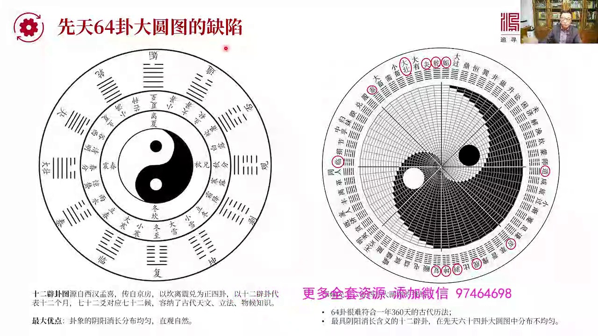

是它的所有的邏輯的核心但是這個164塊大圓圖它是有缺陷的這個缺陷填在哪呢比如說如果我們對應12p塊12p塊圖這個是漢漢異就是漢朝的這些學搞異學的就幫人比如說蒙襲它最早創創立的這個12p塊學說當然有可能是其他人但是大家都傳是蒙襲搞的然後蒙襲然後又它又又師父它可能叫這個金房到底誰搞了其實我們現在也不一定...

<strong>Cleaned narration</strong>

> 是它的所有的邏輯的核心但是這個164塊大圓圖它是有缺陷的這個缺陷填在哪呢比如說如果我們對應12p塊12p塊圖這個是漢漢異就是漢朝的這些學搞異
> 學的就幫人比如說蒙襲它最早創創立的這個12p塊學說當然有可能是其他人但是大家都傳是蒙襲搞的然後蒙襲然後又它又又師父它可能叫這個金房到底誰搞了
> 其實我們現在也不一定說的明白但是我們知道從金房蒙襲這個體系中產生了12p塊這樣一個體系然後它這個體系就是所謂的傳統的後天八卦但是後天這是上映
> 給它寫的名字後天八卦先天八卦最大的不同是它的正式卦不一樣就是東南西北正向的東西不一樣在先天八卦中我們看到梨河砍是在上河下或是南河北鎮和對是在
> 東河西這個跟我們這個後天八卦這個錢和坤這是不一樣的所以後天八卦和先天八卦它的正位不一樣正位不一樣就會導致導致我們對事務的理解會有所差別先天八
> 卦它有這個後天八卦它12p塊一個非常大的優勢就是它可以把最具有代表性的這12個掛從復掛到零掛陽氣逐漸增加到太掛變成了三雲開太到大壯四到怪是五
> 到錢是錢就是六都是了夠掛首先底下出搖變成了陰然後陰不斷增加一直到波和坤全部變陰每一掛都非常非常有代表性代表陰陽銷掌這個代表性非常強規律性很明
> 顯很自然而且它可以直接對應的劫棄比如說復掛對應東智12月22號每年東智之後然後小韓大韓立春雨水這個金澤春氛波羅這樣繞一圈下來到最後立東到昆掛
> 就是小雪大雪然後再到東智所以它可以把劫棄和掛像最有代表性的陰陽銷掌的掛像全部穩和在一起而且每一掛還有6遙6遙12掛就是72遙而72遙可以對應
> 72後每一掛對應一個月然後72遙對應72後所以它把古代的天文立法物猴這樣的知識這是一個非常簡單非常的自然一幕了然的這個很棒的理論體系而且陰陽
> 銷掌是非常分這個分布是非常均勻的正好每一掛都正好是跟陰陽銷掌的這個力量對比正好是成對應分布但是64掛大源圖從1分為2從這個1月2金質的推理說
> 非常完美但是它推出了這麼一個情況錢和坤是在這這個問題倒不是很大但是最具代表性的屁掛的掛向比如說負臨太大壯怪錢這邊是均勻分多的從負到錢這是很均
> 勻但是在這那邊跳了好多才到跳了好多掛才到臨本來是竟然是臨的臨又跳了一些掛才到太太跳了三掛就到了大壯大壯跳過大有就到怪怪和构之間沒區別所以我們
> 可以看到當然這個從反方樣來看也是一樣构然後一直到頓跳了很多個掛才到頓然後到屁到官到波到昆均勻這是個很討厭的一件事看起來不舒服但是某種意義上從
> 自然的劫氣來看比如說生活在北方在北京伊陽富士的這個這個富掛東製比如說12月22號之後如果啊這臨太這很快就到春天了但實際上我們會看到這個東製之
> 後要過好久要過要到大概三月份三月中旬才挺暖氣到四月初天天接著足夠的才微微有段短所以我們的感覺是從好像春天開始了到我們能夠感覺到春天已經到了四
> 月份快五月份了四月中旬所以從春天一開始其實還是還是很冷雖然叫立春了雖然叫這個伊陽富士了但是冰冰天雪地的還要一直到立春然後慢慢慢慢在天氣轉暖到
> 我們能夠感受到春天手實際上已經到零了已經到零過到四五月份了而從零從四月份到夏天到六五月份那你會看到這個它是熱的速度是加速的很能說北方沒有春天
> 從這個外向中我們可以看到它確實沒有越往後加速升溫越快春天很快就過就到夏天了它以後很快就到剩下冬天也是我們知道從這個購物化開始6月22號開始它
> 就已經進入購物化了但是七、六、七、八、三個月非常的熱這個三個月時間非常熱甚至還有秋老虎到動過之後才開始逐漸變冷而且冷也是後來加速越來越越來越
> ...

---

### Slide 15

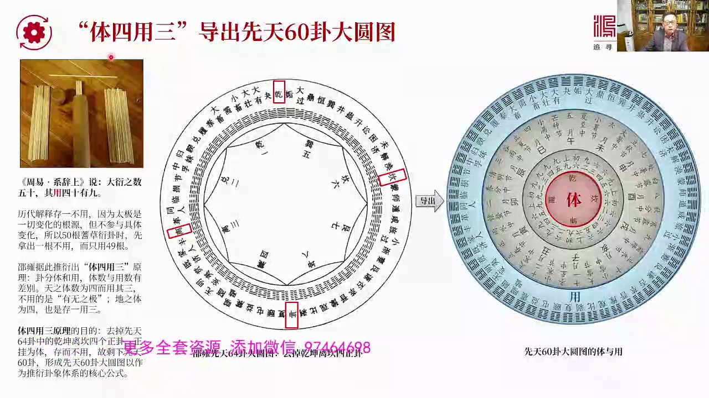

掛不進有體還有用體數和用數是不同的體4用3有1有1有1個東西不用存而不用通過這個原理導出了先天60個大源頭當然我們靠人在研究少庸說一說什麼體3體3用4這好像是天然的東西不對我們不能這麼思考應該回到原點去推它為什麼要發明體和用這兩種思路因為以前人大家不這麼說是它手創的手創了目的它為什麼創造這個東西就是...

<strong>Cleaned narration</strong>

> 掛不進有體還有用體數和用數是不同的體4用3有1有1有1個東西不用存而不用通過這個原理導出了先天60個大源頭當然我們靠人在研究少庸說一說什麼體
> 3體3用4這好像是天然的東西不對我們不能這麼思考應該回到原點去推它為什麼要發明體和用這兩種思路因為以前人大家不這麼說是它手創的手創了目的它為
> 什麼創造這個東西就是因為解決剛才我們說的不自然機上的不平衡12屁掛跟64掛之間的不平衡至少我是這麼推理我覺得這麼推舒服或者說我認為少庸也是這
> 麼推的只有這麼推才合理為什麼要發明體和用什麼意思為什麼一定要有這個好如果說我們還原到當初它是為了解決內在的先天64掛的邏輯矛盾這就說了過去了
> 關鍵體和用你也不能瞎編哪為什麼會有體會有用呢你得在周一中間要找要找原文就好像我們現在做事要找馬克思主義一定要找到資本中間某一條你看馬克思說過
> 什麼或者矛選中間矛主義說過什麼以這個東西作為推演自己理論的一個基石所以少庸要發明體和用這種理論也得在周一中間去找基石找理論推理的基點周一中細
> 思上中有一句大眼之數50啟用49注意啊這出現一個用字也就是說我們如果用世草擺掛的話掩掛的話你會發現50跟世草首先拿出一個來擺的前頭擺的頂上號
> 稱這是中藥不動的老本或者這是體不動用剩下的49跟世草然後隨意分成兩波然後拿出一個來夾到小手指頭上然後疊四四個一組四個一組疊完左邊再疊右邊然後
> 看最後的漁樹然後把手上掛了那個跟兩邊的漁樹加在一起然後算那個樹對應的掛十有八遍才能搞出一掛基本上得折成一個多小時但是我們以後講已經說要都要介
> 紹怎麼算在這裡我們最需要注意的是不管50跟誰誰來打掛第一件事情要做的抽出50跟抽出一個擺的上手不動也就是說大眼之數是50用50個世草來算但是
> 只用49跟有一個是不動的啟用49那麼這個是叫什麼呢少女覺得這個可以叫體體也就是這個體是50但是我只用49打歷代對於存一不用存這個一根不用它是
> 有不同說法的比如說少女認為這是太極太極是變生變萬事萬物的根源它是原點它是生萬物的老本或者叫本體但是它不參與任何具體變化所以我們不能用它它在關
> 問篇中在解釋這個周一大眼之數是57用49的時候它是倒過來解釋的正是因為它是體所以我們把它擺著不動我們只用49根那麼少用根據這個一句話這一個字
> 這個用啟用49推出了體4用3但是它這個體關於篇講它的體的時候有很多種用法在這裏我們就講體4用3就是體4天數體4地數體4怎麼來理解呢我們看這是
> 八卦天生八卦前對離證這不就是四個代表天因為這邊是陽這邊是因迅坦跟坤代表是因所以天數是4我們不用要保存1用3前我不用我用對離證那麼地掛呢地數也
> 是4坤不我不用存1然後我用迅坦迅坦根大體上它是怎麼來解釋的就是天體天之體數用這個是4用其3有一個不用因為它代表無極地也是一樣體3用4的原理是
> 什麼就是去掉先天的64卦中間的前坤離開我要把它幹掉把它幹掉把離和砍幹掉對應在這就是前坤砍離砍和離把這4卦拿掉之後我就會剩下60卦這就變成了先
> 天60卦的大源土這是從這倒出來的背後的原理是什麼體4用3體4用3我們會看到什麼的體呢這4個體被包到中間了前坤離開這叫體它不殘女變化那麼把這4
> 個抽掉之後你看本來怪和購物中間是前結果前沒了前面哪裡頭了坤呢剝和副之間是坤坤被提到裡頭離和砍也被提進來了所以其他的跨向就連在一起這就變成了6
> 0卦這就是用我用60卦但是我的體是其中的4卦這樣一解釋哇我覺得少勇可能想這點覺得自己無比的聰明因為這樣很完美又有體又有用多好啊然後又是60卦
> ...

---

### Slide 16

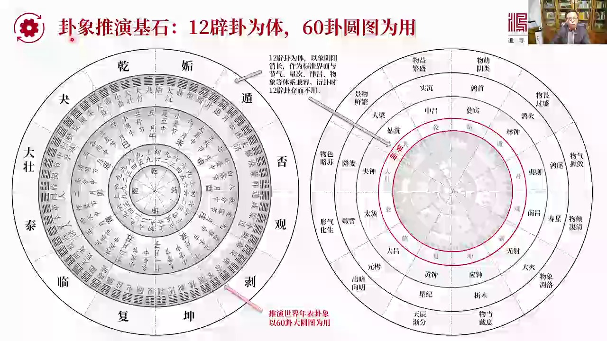

12屁掛作為體在這外頭作為體不用64卦大源土才是真正是用的好那麼如果我們從這張圖來看他怎麼叫體什麼叫用這個外頭這個12屁掛概念非常好他一定要一定要把這個概念結合進來但結合進來真正的推演是又不這麼用但是為什麼結合進來因為他概念邏輯非常的簡單清晰自然他可以用這12屁掛的這些這個12掛來綜合更多的理論體系...

<strong>Cleaned narration</strong>

> 12屁掛作為體在這外頭作為體不用64卦大源土才是真正是用的好那麼如果我們從這張圖來看他怎麼叫體什麼叫用這個外頭這個12屁掛概念非常好他一定要
> 一定要把這個概念結合進來但結合進來真正的推演是又不這麼用但是為什麼結合進來因為他概念邏輯非常的簡單清晰自然他可以用這12屁掛的這些這個12掛
> 來綜合更多的理論體系比如說我們如果把這個圖放小12屁掛在這這裡等60卦在這首先他可以把結器給難貨進來這中間又涉及到清晰節古語然後涉及到什麼冬
> 至小韓大韓立春等等可以把結器給難貨進來結器是跟12屁掛直接相關的所以他作為一個標準界面能夠跟結器能夠有效整合起來能夠跟心刺就是心現在什麼位置
> 就是這些代表心刺存受征火春尾等等受興大火當然起步還是從心季從心季這是對應的富心季元蕭等等這樣拍代表心刺綠綠綠綠就是自古以來綠綠和結器是相通的
> 比如說黃中大旅太粗等等這個綠綠是什麼回事這個綠綠據南海景介紹是把12跟長短不一的可能直徑是一樣長短不一的這種主頭裡面封上很多這種燒的這種灰然
> 後在在外面就是在這個管口這兒蒙上一個竹子的磨很薄然後長短不一的12跟竹管裡面裝滿了草木會插到圖禮當然那就是最後的表面是平奇的所以這12跟插到
> 圖禮的管子的深度是不一樣的比如說黃中他所對應的那個管可能插得最深然後是這些逐漸變遣那麼每當東治過後第七

---

### Slide 17

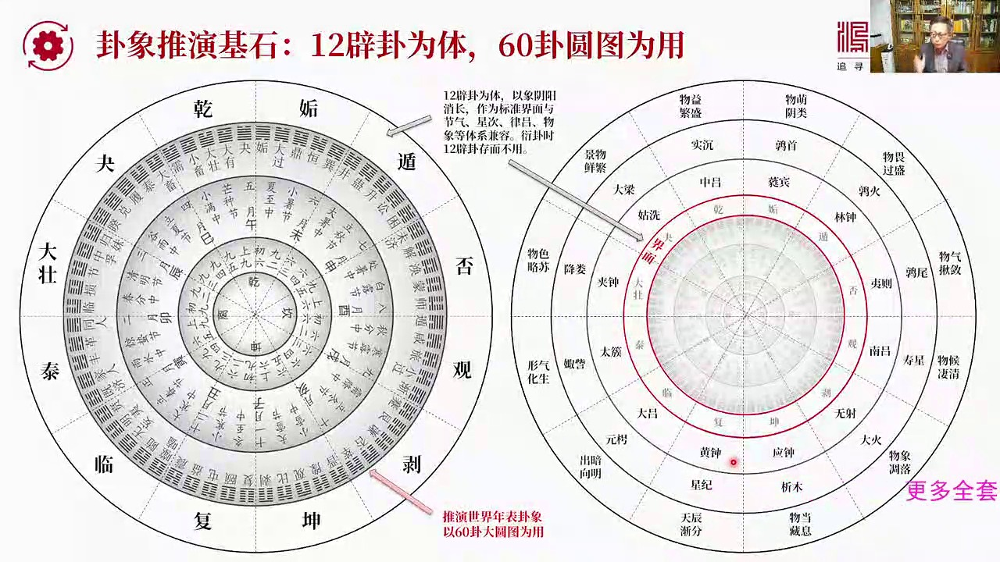

也就是這個洋開始起來了洋起來之後就會在圖裡面會把這個草木灰的竹管會使它增加洋氣壓壓力越來越大到某個時候噴一下那個蓋子上面的竹磨被吹破了灰就噴發而出一定是它先噴出竹灰來第二個也才是大綠然後才是大粗然後才是假中這個過程中插得最深那個管噴出來那個草木灰這說衝破竹磨的時候它會發出一種獨特的聲音這種聲音這種音...

<strong>Cleaned narration</strong>

> 也就是這個洋開始起來了洋起來之後就會在圖裡面會把這個草木灰的竹管會使它增加洋氣壓壓力越來越大到某個時候噴一下那個蓋子上面的竹磨被吹破了灰就噴
> 發而出一定是它先噴出竹灰來第二個也才是大綠然後才是大粗然後才是假中這個過程中插得最深那個管噴出來那個草木灰這說衝破竹磨的時候它會發出一種獨特
> 的聲音這種聲音這種音律被定義成標準的黃中也就是我以這個時刻這麼深的管發出來這個音作為天地萬物音的覆掛相當於對應那個歧史的標準第二個大綠噴一響
> 它的聲音跟它的聲音就不一樣然後第三個月然後太掛手太粗本太響了所以中國古人是利用利用這樣一個這樣一個原理能夠把音律給定下來要不然我們怎麼定音呢
> 定音也是個很大的問題定時間定日慮定聲音定結器要把所有東西全部整個在一起那你想想這個規律跟誰更接近跟十二屁掛更接近所以十二屁掛就成了一個聯通內
> 外體系的標準介面就像電腦中間我們的操作系統就是標準介面普通人員普通的這個用戶根本不用了解理頭的程序怎麼寫的程序源那是馬農幹的事一般用戶不需要
> 我只需要知道標準介面怎麼用就行而理面的標準介面理頭的這些程序源也需要通過標準介面跟外面打交道比如說還有物猴從復掛紫石比如說紫石這個東製所對應
> 的復掛對應黃中星際這個時候對應天塵建分日月開始天地開始慢慢地從混沌開始建建分開了然後出案向民逐漸的天空越來越亮和整個混沌情況變得越來越好然後
> 慢慢慢慢地物色開始復蘇然後進物開始繁盛然後這樣到這個購掛以後就是這個物又出現了因因氣越來越多然後回到物向雕零最後回到這個物當藏西所以通過這個
> 標準介面十二屁掛它可以把理頭的體系用通過這個介面跟其他的東西連在一起它實際上起到一個介面作用所以這就是我們這就是我在研究中對於它為什麼要使用
> 這個概念十二屁掛屁掛的概念但是在推推演掛向的時候又不這麼用它的原因就在於它要建成一個整個大一桶的體系綜合綜合這個物好綠綠新次劫棄還有很多其他
> 的領域的東西把它形成個大的思想體系它需要有標準介面那它真正用是什麼它真正怎麼用呢比如說賦掛賦掛它用的不是直接用了賦它用的是賦所對應的五個掛向
> 賦儀零義鎮用它用這五個掛向而不只直接用賦零它就用適刻隨無瓦民儀和弊用這五個掛而不用零太它也不用這樣太而用這五個掛每一個十二屁掛它用的直接就用
> 這五個來進行推演這就是它最就是讓我繞了很久其實沒有想明白它背後的邏輯為什麼它要這麼繞現在我們把邏輯搞同了其實少用還是再用它的先天六十掛而借用
> 十二屁掛的概念作為借面跟其他體系建立連接真正用五掛五啊對應一個對應一個推演這就是它的基本的邏輯方法掌握這點之後我們再看後面的推演就會變得比較簡單好我們再看下一頁首先我們要進行這個六十掛大圓圖的

---

### Slide 18

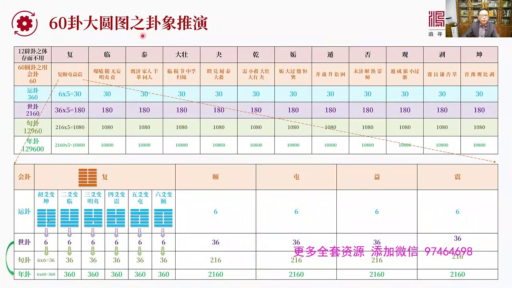

掛向推演背後它怎麼推演邏輯什麼跟它我說了我們現在可以把這十二屁掛就是它那個外圍內圈把它搬直了它本來是糊形嘛我們把它掰直了之後就是副林太大狀怪錢購頓疲官這個波吞它本來是一個圓形的我們現在把它搬直那麼我剛剛說說了在掰直的這個在圓形中間它的六十圓掛對應著不同的這個十二屁掛對應著對應下來是五掛五掛一組五掛一...

<strong>Cleaned narration</strong>

> 掛向推演背後它怎麼推演邏輯什麼跟它我說了我們現在可以把這十二屁掛就是它那個外圍內圈把它搬直了它本來是糊形嘛我們把它掰直了之後就是副林太大狀怪
> 錢購頓疲官這個波吞它本來是一個圓形的我們現在把它搬直那麼我剛剛說說了在掰直的這個在圓形中間它的六十圓掛對應著不同的這個十二屁掛對應著對應下來
> 是五掛五掛一組五掛一組五掛一組它的對應關係是這樣這正好是十二個屁掛每一個屁掛中間對應五個六十六十掛大圓圖的四十二分之一的那個相當於屁塞屁塞餅
> 一個餅上就有五個掛向比如說副掛就是天開於子天開於子這個副它所真正推演的不是用副而是用這五個掛副一尊副一尊一陣這五個掛如果我們把它展開因為要展
> 開才能看得明白所以我用了這樣一個箭頭把它放大把它放大放大層這樣我們看這張圖就好看了這個叫什麼呢按照它後面學生的定義這種掛叫精掛實際上就是會掛
> 金和尾它用金和尾來替代那麼第一個這個第一個十二分之一第一個就是會掛的第一個會一共是十二十二格它走的第一個實際上是要有五個掛向相對應的就是副一
> 尊一陣那麼副掛的掛向我們現在要研究具體掛向了那就是六搖六搖的第一搖它從坤全音到第一搖便揚上面古搖都是音這叫副掛副是整個六十四掛中間它的雖然它
> 不是正式掛但是它的含義最深刻基本上是中國哲學的根或者我們稱之為副天地之心就是副掛是一上代表天地之心這就是周一中的原話副在代表所有東西繞一圈之
> 後都會周而復始為什麼叫周而復始原周最後副掛在第一掛所以叫周而復始這成語就源於副掛也是源於這個掛向好這個副掛我們會看到這是一個經掛或者叫繪掛它
> 又對應著六個尾掛經尾這個尾掛什麼意思就是尾掛是它的每一搖會發生變化每一搖發生變化之後對應六個不同的掛向其實這就是韻掛比如說副第一搖如果發生變
> 化那就是楊變成音了楊變成音其他沒有變那不就是坤嗎所以出搖變這變成坤好如果我們二搖變二搖變這個地方還是實的我們在第二搖如果發生變化這變成楊就是
> 底下兩個都是楊上面四個是音這是什麼這是零零掛上面是天底下是這個底下是對或者叫責天責零地責零上面是地底下是責地責零然後第三搖變第三搖變就是這個
> 這兩搖不變還是楊音這變成楊這變成楊底下就變成火了就是離掛了上面還是地地火就是名移所以上面是地下面是或者叫內掛是火外面是地這個變成地火名移如果
> 第四搖變如果我們看一二三四如果這搖變那就這變成楊這要變成楊上面是什麼上面是正就是正是雷底下也是正這是雙雷正這就變成上下兩個雷疊在一起那當然正
> 是余龍第五搖變如果這二變那上面就是砍上面是音這中間是楊兩個音加一個楊這是砍砍是水底下是雷水雷尊水雷就是中國這就是水這就是鎮就是雷如果是第一個
> 變就是上搖就是上六如果變變成楊這一掛就變成一掛我們可以看一如果直觀來看就是兩張嘴兩個楊是代表兩張嘴中間都是肉咖啥一口吃多高興所以我們可以通過
> 一些簡單的直觀的一個方法來想來理解或者來記憶這個掛象所以一就是一張大口中間吃的全是軟呼呼的肉想起來很 happy很美所以我們可以看到在這個覆
> 掛中間對於五個掛這五個掛中每一個掛又對應六個尾掛它可以發生搖便變成六一變六那麼一也是一樣如果同學們感興可以自己去畫一把一放到這然後從第一要開
> 始變一也會生成六條尊嚴一樣一陣是都一樣所以這是一變六這就是六六所以這是五個六五個六當然就是三十三十如果是這是一個這是這是第一會如果是十二會那
> 就加在一起這就是三百六十運它代表三百六好我們再往下看如果說它變成了這個六尾掛之後尾掛還可以繼續變或者叫尾指尾掛比如說坤坤可以繼續變這右變成腹
> ...

---

### Slide 19

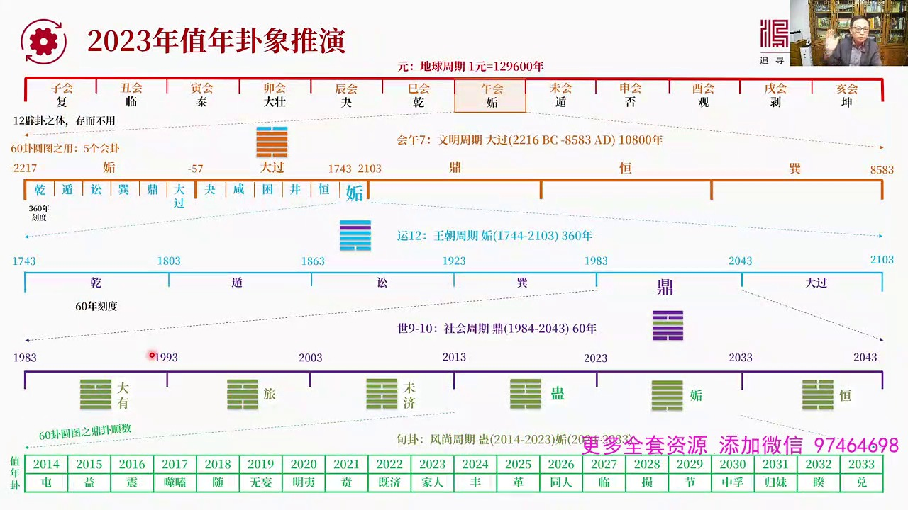

2023年直年掛了掛向這個年掛到底怎麼推到底怎麼我怎麼知道今年是哪一年今年是什麼掛首先首先我們把議員展開議員有12會子仇一毛陳詞五位深有虛害我們知道我們現在是在五會中間肯定是在五了過了政府了人類文明過了這個中間了他所對應是夠掛但是夠掛是提從而不用的所以我們真正在推演過程中不用他這是個概念作為界面跟其...

<strong>Cleaned narration</strong>

> 2023年直年掛了掛向這個年掛到底怎麼推到底怎麼我怎麼知道今年是哪一年今年是什麼掛首先首先我們把議員展開議員有12會子仇一毛陳詞五位深有虛害
> 我們知道我們現在是在五會中間肯定是在五了過了政府了人類文明過了這個中間了他所對應是夠掛但是夠掛是提從而不用的所以我們真正在推演過程中不用他這
> 是個概念作為界面跟其他題一接口的議員當然就是12萬9600年好我們現在把五會五會中間這個這個夠掛把它展開我們知道大源途中間夠掛對應著五個金掛
> 或者叫會掛對應著五個就是夠大過頂橫迅好我們如果忘了的話可以回去先看一下夠掛所對應的五個掛

---

### Slide 20

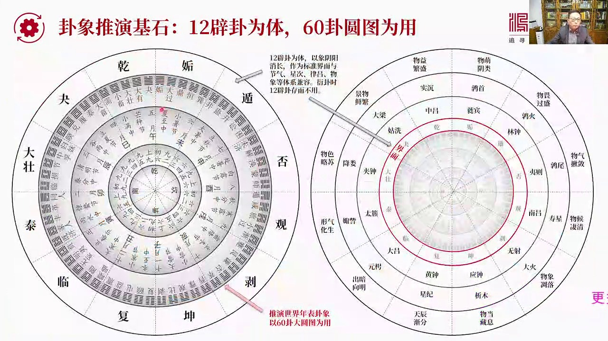

夠大過頂橫迅好我們回到這一頁夠

<strong>Cleaned narration</strong>

> 夠大過頂橫迅好我們回到這一頁夠

---

### Slide 21

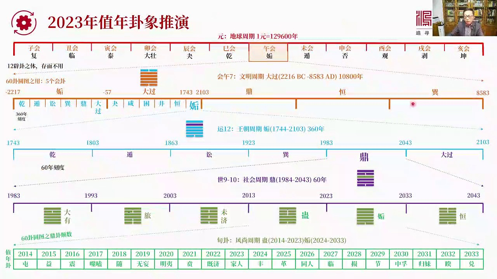

大過頂橫迅他所對應的年份一個五會我們知道他的時間是10800年對應的年份我們可以因為剛才算年表我們可以精確的開始真正開始紀年是第二年這是這年的年末然後他持續到10800年之後就是公元後8583年年齡現在還有6000年還早了所以我們真正的生活時間持度沒有這麼長這個頂橫迅我們展示用不上主要生活在前兩個五...

<strong>Cleaned narration</strong>

> 大過頂橫迅他所對應的年份一個五會我們知道他的時間是10800年對應的年份我們可以因為剛才算年表我們可以精確的開始真正開始紀年是第二年這是這年
> 的年末然後他持續到10800年之後就是公元後8583年年齡現在還有6000年還早了所以我們真正的生活時間持度沒有這麼長這個頂橫迅我們展示用不
> 上主要生活在前兩個五個掛上中的前兩個所代表的是公元前二二一七年到公元前這個57年而大過所對應的年份是公元前57年到公元後2003年其中每一個
> 掛都有自己的尾掛或者他的六搖發生變化就會變成前比如說夠掛了六個尾掛就會變成粗搖變變成了前二搖變變成頓三搖變送四搖變迅五搖變頂六搖變大過大過掛
> 就是這樣上面就是一個很大樓屋子洞糧糧兩邊都很弱所以就有這種洞糧承受不住的這種既想所以叫大過房子垮了那可能要如果粗搖變那就是怪上面只有只有一個
> 音搖那就是怪掛二搖變鹹三搖變困四搖變頸五搖變横六搖是我們關心的六搖就是最上面這個變那是什麼這一變那不就是又成了夠了嗎夠是一這個一因使如果他也
> 變成洋那上面五個都是洋底下就變成只有一個因這就是夠就是我們現在生活實現一從1743年到2013年整個一個366366年所以我們最關心的就是2
> 023年就是在這個夠掛裡頭所以我們看到我們2023年生活在什麼呢大的地球周期地球周期是在這個夠是在五會就是夠那麼這個五會期他所對應的這個叫地
> 球周期會周期對應是文明周期文明周期就是一萬年人類文明一萬年一萬零八百年那麼在文明周期中我們對應的大過是公元前二一六年的公元後八五八三年這是大
> 過那麼我們再往下看為什麼你看大家看我這個上頭黃子疊用是藍字呢我想我們可以把它想像成一個文件加系統文件加叫圓但是中間的每個文件是會其實是具體的
> 12個月的月份向對應的這些內容所以在上面的部分和在下面下面是代表下跡的上面這個是一個圓文件還之後裡面就是子醜一毛子會醜會銀會什麼意識到五會等
> 等那麼在會在會掛在會的這個文件家裡面裡面也是打開比如說第七第七會五會七它裡頭是五個文件家每個文件家所對應的就是我們看到它這個是五個是從構意識
> 到迅然後每個文件家打開之後對應的又是六又是六個掛代表下跡所以用不同的顏色來進行標度好我們現在在進一步把構打開從141743到2013如果把它
> 展開的話那就變成藍色從藍色的這個體系了從171743188318631923198320432043這就看得更清楚了然後它所對應的掛向夠掛如
> 果是看到這個底下是一音上面是五揚就是一音聲如果說夠掛發生變化出搖那當然就是變成錢六文都是揚二搖變變成蹲三變成蹲四搖變變成迅我們最關心的是五搖
> 五搖變為什麼1983到2043我們就生活在這這一遍這就是頂上面這一遍這就變成了這就變成上面是火離火離火底是迅是風這就變成了火和風火風頂就是這
> 個火上面是迅迅就代表夢實際上是上面一口鍋底下燒木頭燒著燒著底下不就上面的鍋不就廢糖了嗎用這個頂來幹嘛當然是頓東西煮肉煮骨頭煮各種各樣吃的東西
> 所以頂在周一中間它的概念是頂顧隔心就是我把一個肉皮在火上在頂裡都燒燒熬的足夠長那肯定就化掉了就出現新的東西了所以我們是這個所謂頂顧隔心所謂頂
> 和隔這個成語也是源於周一那麼一看這掛向我們其實一看這其實有一點意思因為我們可以望門生意掛了面起的方法其實就是把這掛著掛向中間用一個字來概括以
> 後我們講周一系列課的時候會詳細去分析每一掛它的掛向但是我們望門生意看一下也能看出個名堂來這個時候這就是60年一個課度了從1743年到1883
> ...

---

### Slide 22

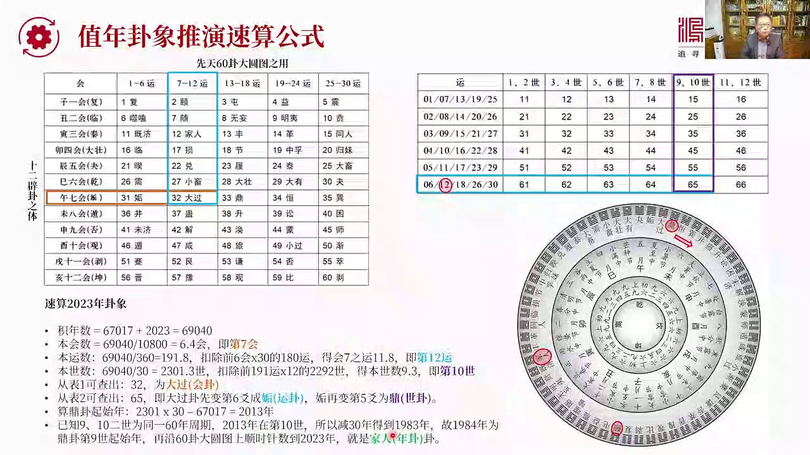

就是速老師要向你這麼推要推秦始皇那年可就麻煩他了或者要推比如說20000年或者1789年或者任何一年有沒有比較快的辦法當然如果有人已經做出了129600年的年表年和掛著最近表當然很好如果沒有如果我們隨意指出隨意說一個年份能不能速算呢是可以速算的直年掛速算表速算公式是有的這是一個表這是一個表這兩個表結...

<strong>Cleaned narration</strong>

> 就是速老師要向你這麼推要推秦始皇那年可就麻煩他了或者要推比如說20000年或者1789年或者任何一年有沒有比較快的辦法當然如果有人已經做出了
> 129600年的年表年和掛著最近表當然很好如果沒有如果我們隨意指出隨意說一個年份能不能速算呢是可以速算的直年掛速算表速算公式是有的這是一個表
> 這是一個表這兩個表結在一起就能夠很快算出來這個表一看這是會會表底下這1212掛是什麼呢12P掛12P掛12P掛它是體不用的傅林太大壯怪錢夠盾
> 疲觀波坤這個是這個是圓圖上12P掛的圓12P掛圓形的12P掛圖上的作為體的不用這些是作為用的先天六十掛大圓圖之用比如說一到六我們會看到這是第
> 一排什麼負一尊一正這就是從這開什麼負一尊一正這是第一個五掛然後在往後第二五掛從適合隨五掛到名移適合隨五掛到名移到B這又是五掛所以它是一排代表
> 五掛從這一隻鼠一圈鼠回來這是從一這是五掛這是五掛這是五掛一隻鼠最後六十鼠的波我們知道它的佈局了然後這邊運呢它代表式這個運低運或者低運第二第三
> 第四第五第六第七第八第九它是這麼排的如果是一七十三十九二十五運它如果是在對應一到二十七到八十九到十十兩個是作為一個假子對應一個掛像我們就能夠
> 對應找出一個數有了這個數我們就能夠快速的運算今年是哪一掛好我們來做個實驗還是以二零二三年作為作為一個樣板作為幹力速算二零二三年掛像首先我們要
> 算今年數二零二三年像像稍庸時間的多少年當然這可以算出來六七零一七BCE這是其實的T0時刻再加上這個二零二三年AD就是公元錢加公元後一共等於六
> 九零四零四零就是六萬九千零四十就是從七點一趙現在這是稍庸時間有了稍庸時間我們就可以來算它的會數就是我們這一會第七會到底是不是第七那辦法很簡單
> 就用因為這個這個一會最後等於一會我們知道是一萬零八百年你用稍庸時間六萬九六萬九千零四十直接處理一零八零零就能夠得到現在的會數現在是六點四會我
> 們知道那就是六已經過了我們記住第七會了所以這是第七會沒錯我們剛剛測到半天都是第七會好我們這是本會數推出來了我們在算這個本運數在第七會裡面它是
> 第幾運呢這就需要做進一步的運算了還是稍庸時間我們知道一運是三百六十年處理三百六這會得出一百九十一點八這是運數而運數呢這是一個總的累極的運數我
> 們必須要扣出前六會已經過去的那個所有的運才能算出剩下的就是我們這一會的第幾運其實我們剛剛六元初中我們已經看到這是現在是第十二運那是怎麼算呢一
> 百九十一點八簡去前六會每一會要成以三十這就是一百八十運因為一會等於一會等於三十運那麼一百九十一點八簡去一百八十運得到是十一點八運十一點八運當
> 然就是十一運已經過完了我們現在進入十二運了所以它是第十二運我們在算在第十二運中間它是第幾事呢我們知道一運中間又有好多事直接算還是用稍庸時間處
> 理三十因為一事是等於三十年算起來是兩千三百零一點三是好我們還是要把已經過去的所有事全部給扣除掉才能算出本運這是第幾事而前面我們知道這已經過了
> 一百九十一運了這個已經過去了每運呢成以十二就會得到兩千兩百九十二事這已經過完了所以兩個相檢二千三百零一點三檢去二九二那麼它應該是在本運的第九
> 點三是九點三十也就是第九十過完了我們現在應該出在第十事好我們現在有了七會十二運第十事我們到這個表中去查五會七對應的是這條線然後我們現在又是十
> 二運數著來在這所以我們可以找到原是三十二是大過當然我們剛剛已經推演過了它確實是大過過是繪掛從三十二中也能直接查出來好我們再查第二張表第二張表
> ...

---

### Slide 23

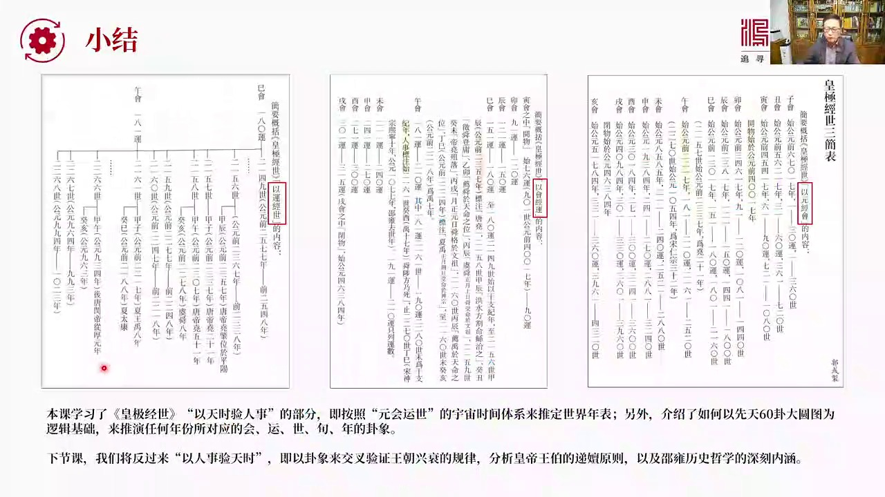

黃金氏如果從文字上從內容上看可以歸納成三張簡表這就是黃金氏這最後的副錄三張簡表第一個是以原金會就是人類文明的幾個重要實驗階點它這兒列出了主要階點有公元錢4.017年這個我們剛才已經說這個是這個晚期智人到達東亞還有一個實驗階點是當然它中間越過了很多具體的任何事到宋人宗了宋人宗32年但這個是少庸的它可能...

<strong>Cleaned narration</strong>

> 黃金氏如果從文字上從內容上看可以歸納成三張簡表這就是黃金氏這最後的副錄三張簡表第一個是以原金會就是人類文明的幾個重要實驗階點它這兒列出了主要
> 階點有公元錢4.017年這個我們剛才已經說這個是這個晚期智人到達東亞還有一個實驗階點是當然它中間越過了很多具體的任何事到宋人宗了宋人宗32年
> 但這個是少庸的它可能就寫了宋人宗後來不寫了到後來明朝的時候黃金好像一直寫到一直追到明太宗我就再往後我們這些後人應該把前面的考古學的那種加進去
> 再把現在正在發生的從明朝結束之後一直到現在每年所積累的更多資料能夠用一種我稱之為是這個一般這種數據庫是一種relational的這個數據庫能
> 用一種心壯的數據庫或者叫離散式的數據庫把它把這些所有那種組合在一起如果還能夠同時生成一個大大的巨型圖可以向上延長十二萬九千六百年或者更大往小
> 的可以縮到微秒那秒能縮到這個程度那是更好所以呢這個就是黃金鏡式的議員金會第二部分是以會金運這個就講的是一些帝王的時間表或帝王登基和他在位的時
> 間表然後在這中間比如說標誌糖咬是在什麼時候在假承年然後當時正在發洪水然後下令讓滾去致去治理等等這些最粗的一些內容然後開始出現人事的標記181
> 運之後出現了這個人事具體在做哪一事就更細一些了一直到這個宋神宗新宁十年他就說這種他這個總結方法就是告訴你每一個部分他記錄這個事情會系到什麼程
> 度這個就只能寄人類的重要時間節點這個可以寄王朝中間的主要的事情王朝的中間皇帝國王他們在位年份登基年份和在這個時間指導之內做的一些重要的事情大
> 事以運金式這就比較細了運金式就可以寄得更細了以三十年來做一個指導更多的事情比如說我們看這個記錄就比較的詳細了比如說這個帝搖趙薇趙薇平洋在哪地
> 方登基的在於多少多年然後還有一些更細的一些內容包括其中王公約二百二十公約二百二十一年然後消滅了七國然後把七國那個地方封城七軍然後怎麼怎麼樣大
> 金人弄好然後容烈這就是三個主要的黃金金式的語言金會以會金運合以運金式三大塊的就是年表方面主要那種所以今天我們學習了黃金金式的它是兩部分第一部
> 分是一天實驗人式就算著這個原會運式的宇宙時間體系來推演世界年表另外我們還介紹了如何用先天六十掛就是如果用先天六十四掛去掉四個掙掛演生出六十掛
> 來六十掛大源圖主要目的是為了解決這個一年三百六十天跟六十四掛不匹配還有它的跟這個12匹掛之間不協調的問題而真正的用還是用的先天六十掛作為推演
> 作為邏輯基礎有了這個邏輯基礎就可以推演任何年份或者叫大到無窮小到無限任何一個實驗界點所對應的原會原這個會運式尋年掛就是不管你多大也不管你多小
> 我都可以按著這幾集結構把每一集結構的掛向給你復原出來而且告訴你這個原是在上級領導之下形成了一個總體的掛向體系所以你不能只看黏用這個黏掛來解讀
> 今年怎麼樣你還考慮到它上面的巡掛或者考慮到上面這試掛再往上的運掛再往上的繪掛都得考慮到只有這樣才能夠最有效的最準確的解讀歷史解讀歷史世界當然
> 這就是我們下集課的主要內容這集課我們主要講以天使驗人士下集課我們重新是以人士驗天時就是從掛向來反過來或者叫交叉驗證王朝新帥的規律然後分析皇帝
> 王伯帝善的原則為什麼說皇帝王伯他是這麼也便的還有更關鍵是少庸歷史哲學他深刻的內涵未來我們怎麼用怎麼使用他如果說這套底輪體系成立的話那他就已經
> 建立一種通用的預測原則我可以預測到12,900年之後我可以預測到公元這個8535就8500多年以後所以他當然帶有強烈的通用的這樣的一種這樣的
> ...

---

### Slide 24

它的黃金金式的這個部分黃金金式的一部分下部分我們還有下集或者下堂課我們還會講黃金金式的下半部分就是怎麼反過來驗證好今天這是我們的課程者內容謝謝大家祝大家愉快

<strong>Cleaned narration</strong>

> 它的黃金金式的這個部分黃金金式的一部分下部分我們還有下集或者下堂課我們還會講黃金金式的下半部分就是怎麼反過來驗證好今天這是我們的課程者內容謝謝大家祝大家愉快

---
