# 核心课视频-125-128 _ 北宋五子之邵雍 下&描述标题= — Clean Slide Notes

> **来源**：鸿学院核心课程  
> **幻灯片**：22 张

---

### Slide 1

我们看下一頁前两堂课我们讲到了少庸的他的

---

### Slide 2

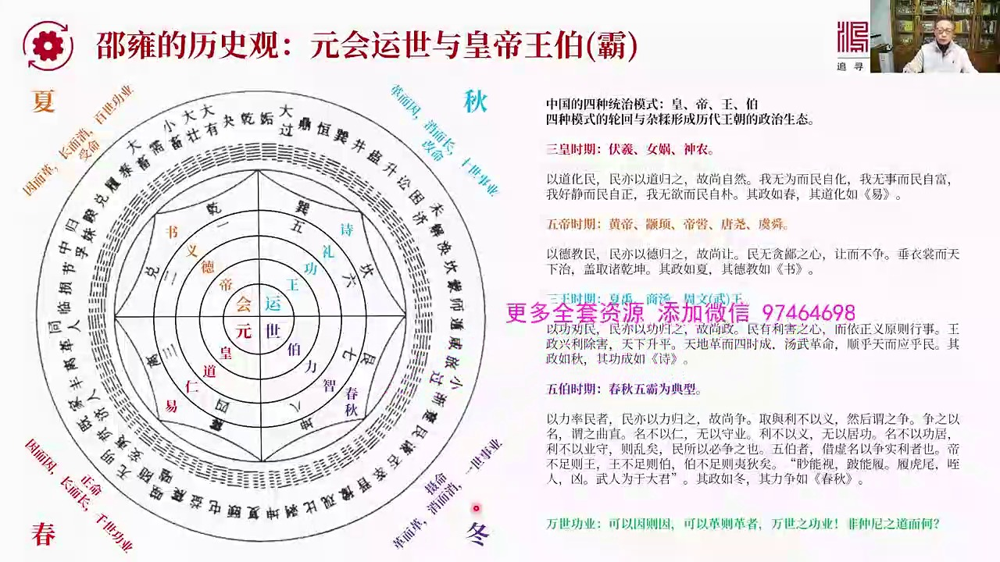

先天八卦然后从先天八卦推出的先天的64卦大元图然后再推到出了先天的60卦大元图那么从此建立起来了一套世界年表就是以历史这个时间来推测未来的世界或者叫以天使来验人士那么今天这场课我们将反过来从人士反向来验证天使就是根据世界年表所列出的各种挂向反过来来验证这些挂向对历史世界的描述全是到底准确还是不准确那...

---

### Slide 3

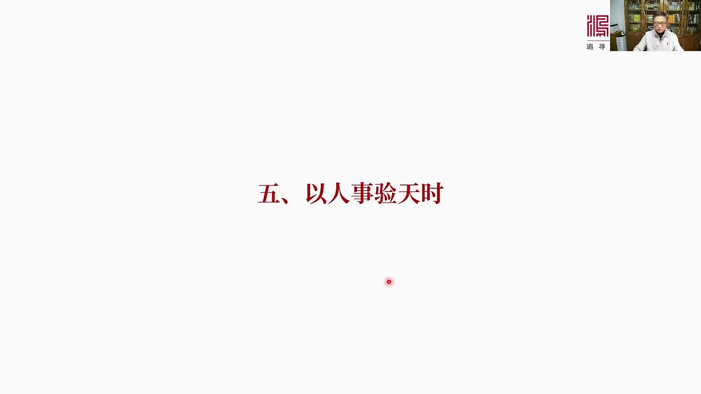

以人事来验天时这就是最有意思的地方了到底哨勇推了半天事情年表这个事业年年表给出这种挂向的准还是不准呢咱们现在反过来验证了就是要解解挂或者分析这个挂向跟历史事实之间到底稳不稳和皮不皮配我们看一下也当然最重要的我最感兴趣的是秦统一

---

### Slide 4

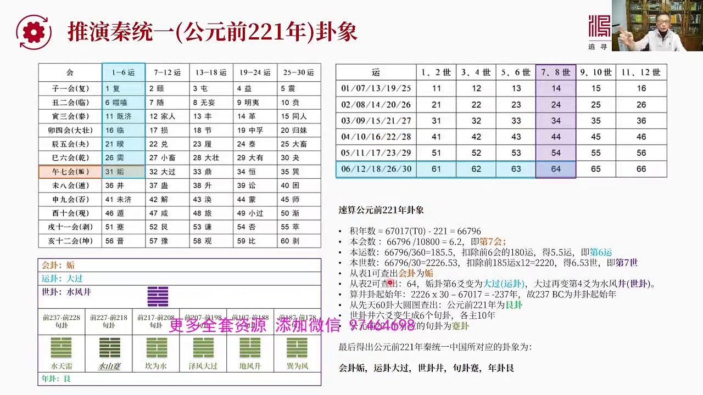

公元钱二百二十一年当然非常重要对于整个中国历史来说这应该是至关重要的一年大一同中央集权建立了那么我们来看看公元钱二百二十一年的挂向究竟是个什么挂向上这颗我们讲到了一个速算的公式根据公元钱二百二十一年这个年份我们可以迅速的倒推它所有的对应的这个会挂运挂事挂寻挂和年挂公元钱二百二十一年当然我们首先求他的...

---

### Slide 5

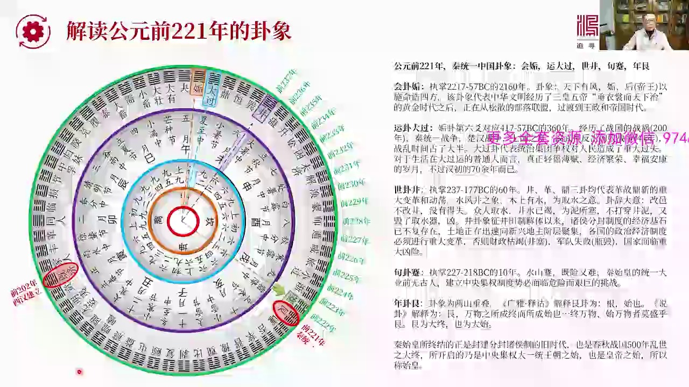

首先我还是用咱们的中表盘类似于中表盘的模式来做一个直挂的解读会挂是最主要的一个最主要的一个挂会挂职账二千一百六十年从公元钱二一要七二一要七年到公元钱五十七年所以他指向是够挂指向这个方向我们一看我先看这个最大的原来指向这这当然是五号的感觉然后大这个然后他的运挂是大过是在这然后事挂我们刚才说事挂是紧我们...

---

### Slide 6

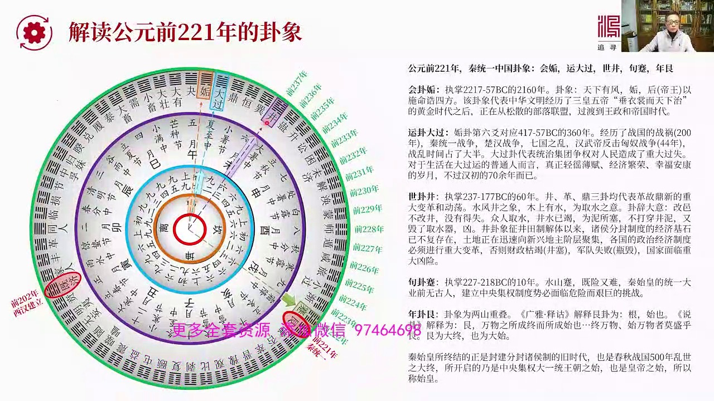

他所对应的七十年是公元钱二百三十七年然后我们就属一个一个属属属属到公元钱二百二十一年我只知道原来这对应是更然后在通过刚才速程公事我们可以知道这对应是这个寻挂是剑他是在剑挂着十年中之中当然我们这还可以看到原来西汉建立是在这因为属下来一年一年属属过来是公元钱二百二二百二二年他所对应的挂向是积极好通过这样...

---

### Slide 7

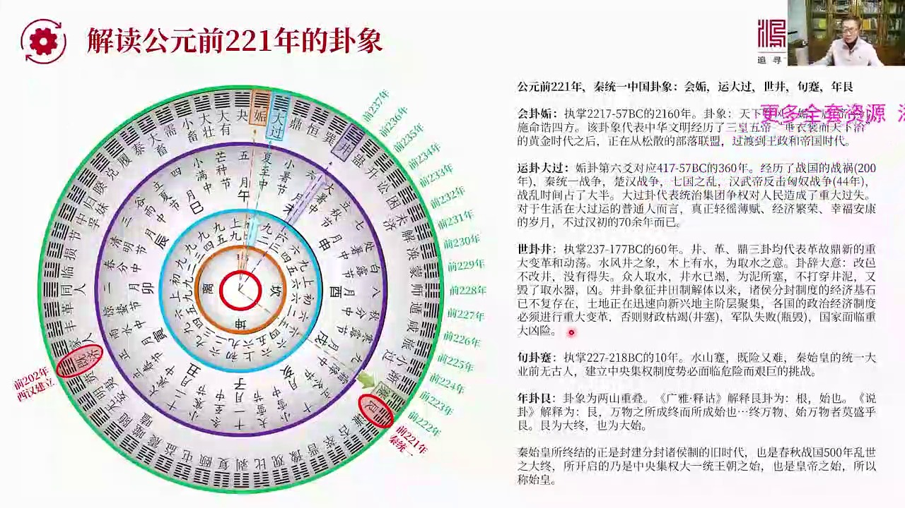

我们现在还原意经还原意经的挂向时尚某种意义上你得全息还原把所有信息到还原的公元钱211年所以你不能只看挂向所描述那几句话要深刻理解这几句话背后整个社会在发生了动胆那少不了经济少不了军事少不了这个各种样的当时新生事物只有收集到越来越多的信息信息越多为那么你对当时理解就越整确再看巡刮巡刮质他是指掌10年...

---

### Slide 8

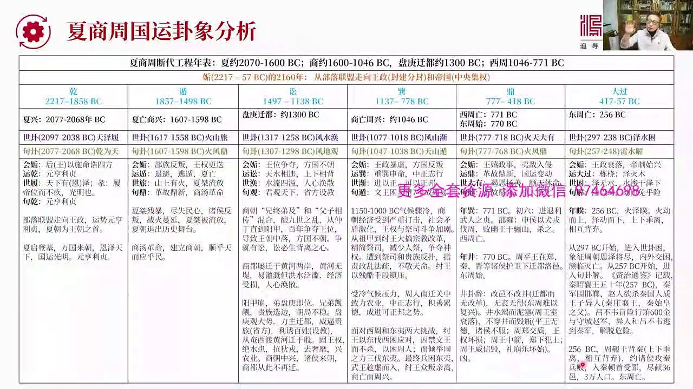

公元钱二百二十一年说了比较准其他年份呢这堂课我们要系统输了一下中国立朝立代的主要的时间断点所以一开始我们要从下伤周来分析它的国运挂向到底说是准不准当然下伤周特别是下河伤没有明确的几年所以下伤周断在工程也只能大概齐描述了一下我们很难说清楚哪一年具体发生什么事但是我们有一个时间的大体的范围根据下伤周的断...

---

### Slide 9

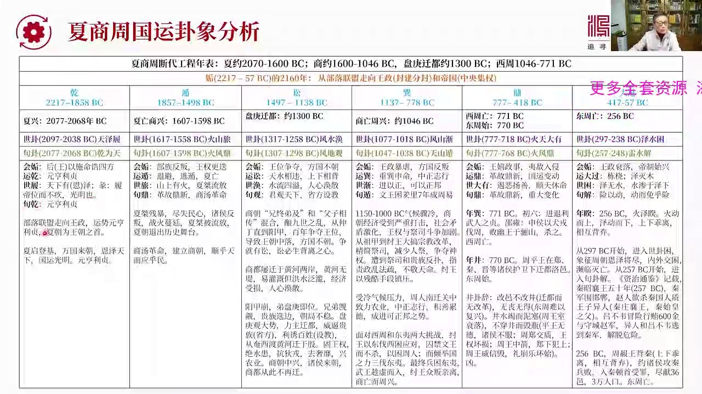

这当然是很不错的据大家说就是布洛联盟走向了王政整个运试是袁亨利针夏朝作为王朝之首出现了那么下起登基万国来朝恩泽天下国韵光明所以他叫袁亨利针怎么样非常的准对夏星期的这段描述是很准确的我们再看第2个对应的实验段盾挂从公元前1857到公元前1498他所对应是夏朝灭亡了商草星期了商堂革命了具体发生时间大约是...

---

### Slide 10

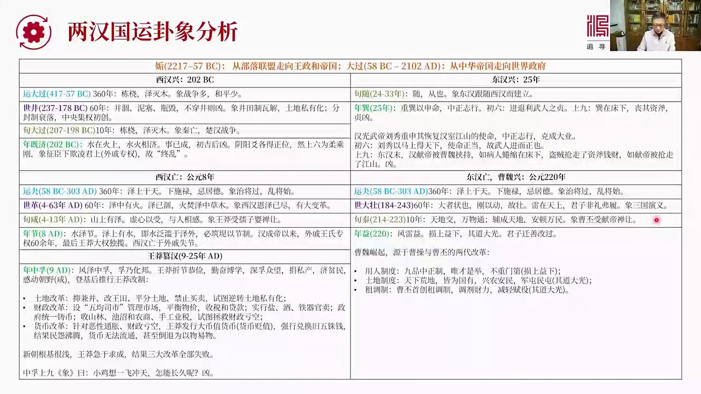

我们可以接下去看下两汗两汗的国域当然还是构挂公元前27年到57年部落联盟走向王政那么当然中间他跨了一个跨了一个汇挂从构挂跨越到了大构挂大构是公元前58年到202年两汗跨越了挂跨越了汇挂当然大构挂我认为我们可以用一个更大的尺度来描述就是中华帝国本来都是中国之内的事情到2022年也就是剧情还有80多年2...

---

### Slide 11

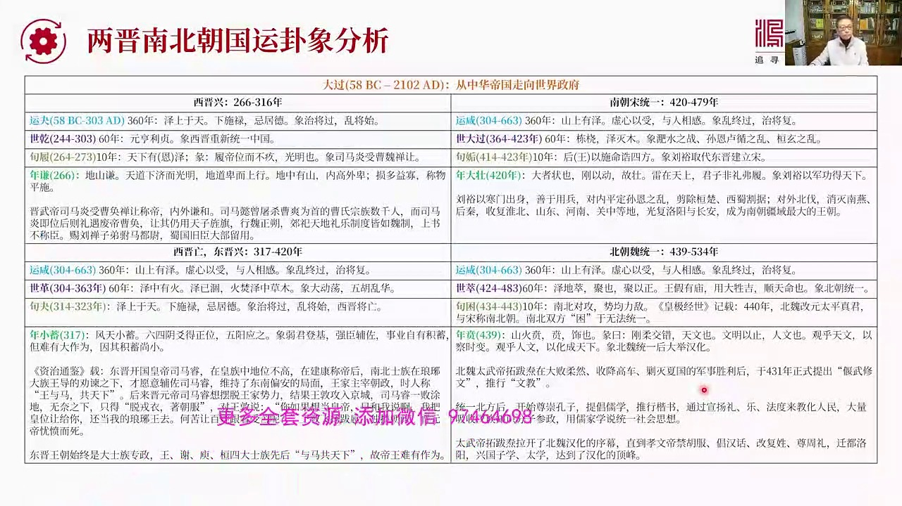

首先我们来看习近星期他所对应的这个运挂是怪刚刚我明说过智疆过乱疆时他的事挂是钱这60年的钱挂员和立针象征着习近将会重新统一中国他的寻挂是履刚刚我明说履是非常极强的天下有恩则呀履地位而不救光明也因为他的道路是光明是他的这个符合天道的象征司马言会接受曹威的善让他的年广是签第三签注意司马言得天下用的是签这...

---

### Slide 12

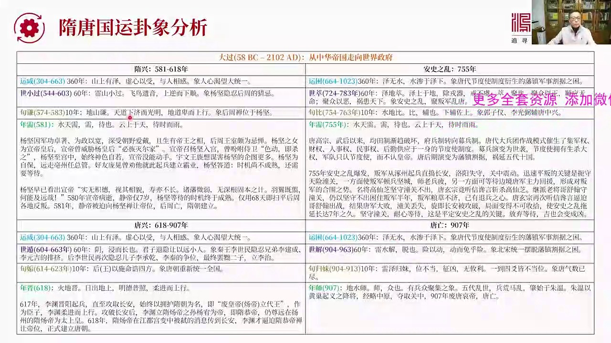

星期五百八十一年一直到六百一十八年他所对应的挂向先挂向着这人心肯往大统一小过挂这个六十年雷山小过雷山小过的挂向是非鳥一鳥月非月高是因为月听月小这不是一个好的情况应该应该代表什么呢不要再往上飞了再往上飞就是听不着了应该应该说是上逆而下顺应该往下走往下来千万别再往上走向着这雷山小过向着这洋肩不断的营允透...

---

### Slide 13

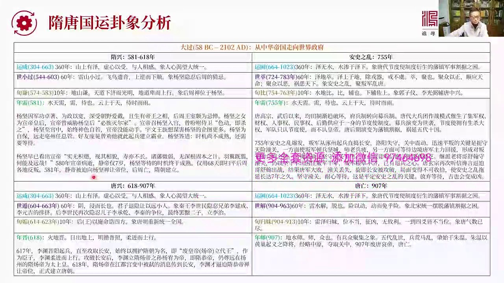

后周亡随朝建立但是洋肩也把尽力给堵死了这就说明这个善位的善位之君99%的不得好死但是从整个洋肩建立随朝这个过程中我们发现最重要的一件事是什么就是等待就是虚一定要等待他早动手就完蛋了等待时机等到宣历死他一举多天下这就是洋肩随朝建立他为什么用虚挂或者说为什么是虚挂来代表随朝建立这难道是巧合吗这太巧了因为...

---

### Slide 14

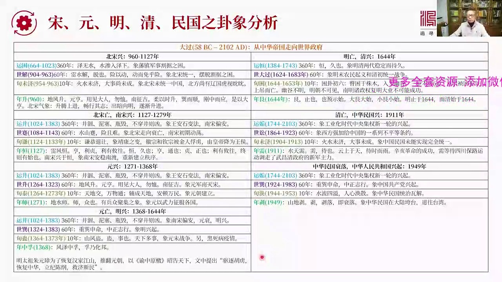

一些主要大事新摔了大事的一些戒毒那么北宋兴960年到127年我们来看韵挂是困这个困当时走水象制着军法格剧他的这个军法格剧之困这是从600多年从唐朝延续到宋朝到宋朝解决这个问题了世界事挂是解对应60年雷水解脱潜移动象征北宋统一最终摆脱了格剧之困解开了寻挂是危机宋朝他是出在危机挂10年水耗危机大事上位完...

---

### Slide 15

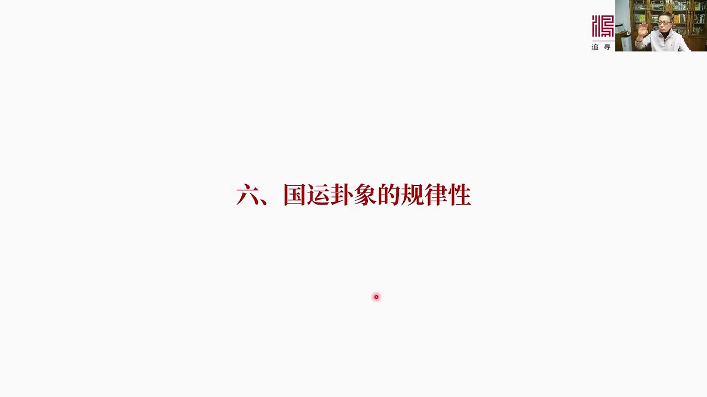

因为我们知道从科学研究的脚度来看你跟他所说的一切哪怕都准但是这个东西有没有统计学的归律呀这个问题值不值研究呢非常值得研究我们看下一由于这个由于你要想研究统计学归律所以必须要建立

---

### Slide 16

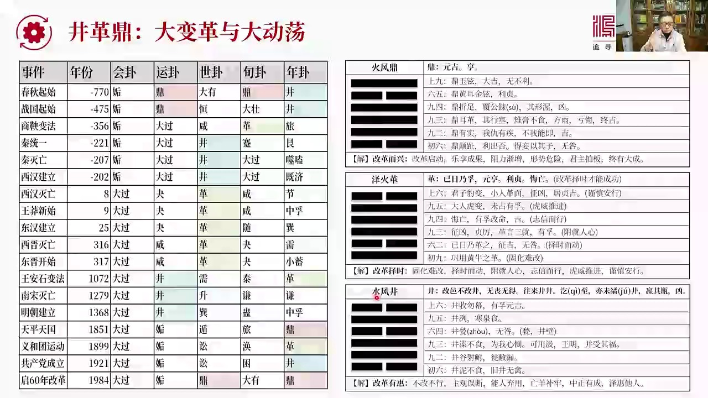

一个完整的挂像表也就是从文明有文明这四千多年嘛当然我们是有12万九千六百年的所有的挂像只有有这个所有的挂像你才能进行统计和分析才能算甚至算概率分佈但是我们刚才解读过程中其实已经有了一强烈的概念知道有些挂像他所对应的事情是有明显指向性的比如说谨格和顶这三挂对应着大变革和大动荡时代所以如果我们把这些立上...

---

### Slide 17

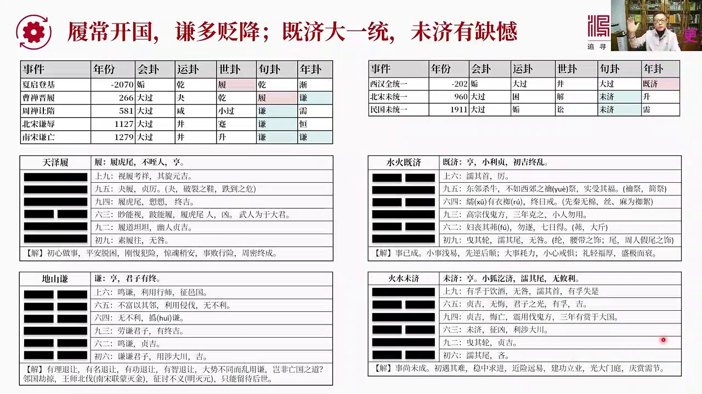

我总结为履昌开国签多贬价计计大一头 汇集有缺汗如果我们来看履华当然你看到下几灯机都是前光明等等然后这个司马盐让曹华让位对应是履然后他是签周擅让随羊肩擅这个这个夺权的时候用的是签北宋用签结果是辱国汇集两地被抓走了南宋用签结果王国两个签当然肯定是王国了然后计计和汇集呢汇汗全国统一所以叫计计北宋没有统一所...

---

### Slide 18

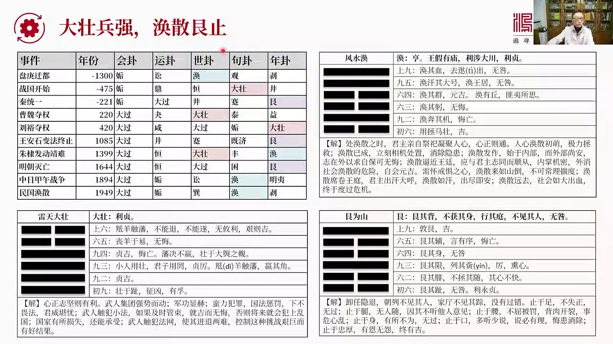

军罚割剧 要五周多权等等换 代表散更 当然就是指所以我们看到盘更签中他对应是换 往朝换散大水来烟然后这个兄弟征权 等等 所以他签中战国开始用着大状当然就是战国战国时代了那些猪猴 崛起了秦统一用着更大使大众曹卫夺权必不汉献地让卫用着大状流域夺权 也是大状 往事变法最后背破中指用是更搞不下去了朱地发难就...

---

### Slide 19

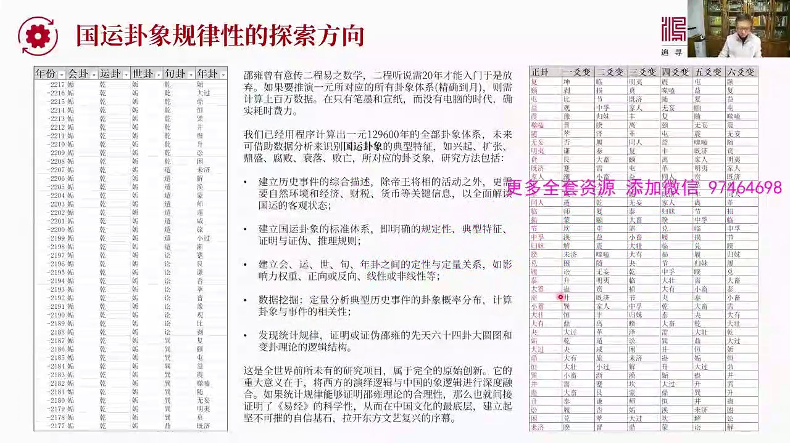

但是需要进一步探索需要进步探索首先我们就要有这个巨大类的色标因为在这我们可以进行数据的选择数据的挖掘可以根据条件进行组合少庸曾经想说把这个议学他的这个美华议数还是他的所谓一支数学传给二成这俩兄弟听什么需要学二十年才能入门干脆放弃了为什么因为要推演议员所对应的所有挂上体系比如说精确的2月需要计算上百万...

---

### Slide 20

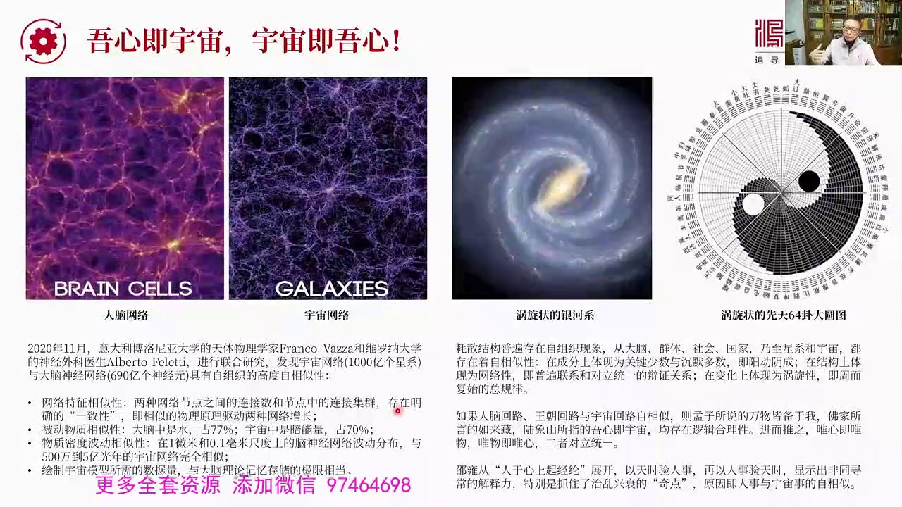

当然这有待于研究但背后我们可以去思考一下它科学用源于哪我们知道这个路线上一句名言巫星巨宇宙宇宙既一巫星我们当时也听过哇这纯属的微星主义太不靠谱了难道没有你也没有你的新宇宙就不存在吗这不是开国就玩笑吗但是我们越到随着时间增长随着年龄增长随着跃离增加随着建的东西越来越多随着知识储备量越来越大随着对东西方...

---

### Slide 21

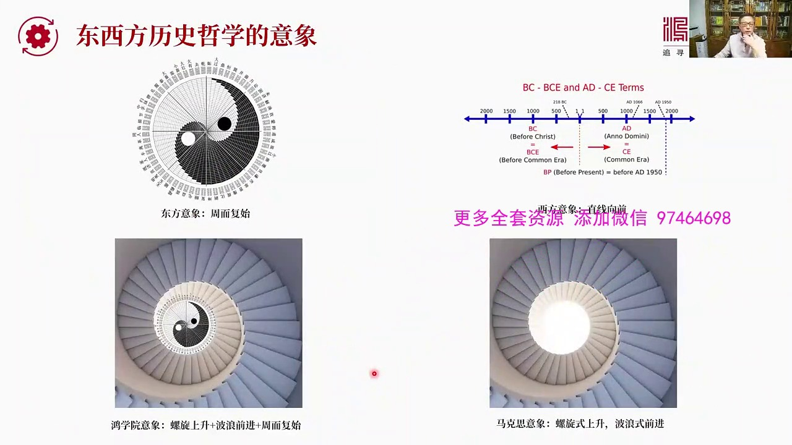

历史哲学东方西方怎么看东方印象少庸已经化了很明白了周恩富士西方的意义向呢历史哲学哲学印象就是直线向前看这个实验中公元前公元后公元前两个剑头直线往前走没有中间的所谓的周恩富士西方人永远不会认为他脑灰露面永远不会认为历史还能和这样专不可能历史只能往前发展只有钱只有一个方向而中国认为这不是很正常吗所以中国...

---

### Slide 22

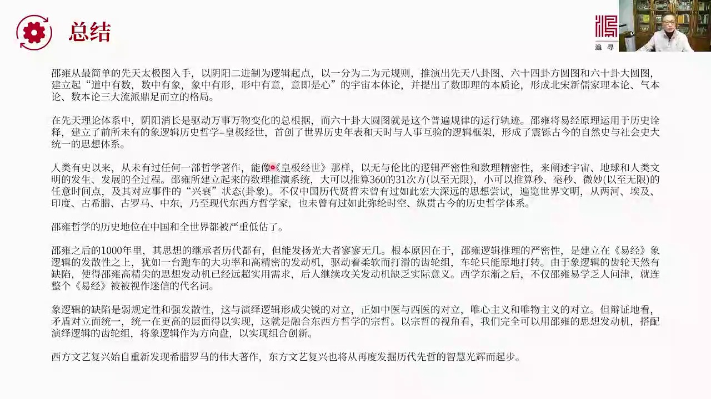

我一开始其实没有想把这个课做得这么大只是一个简短的介绍少庸和黄映京市本来就准备做四重五分钟就够了结果越研究越深越挖掘东西越多然后越来越觉得这套体系太龐大了好家伙特别你想到少庸公元前公元十一世纪就是一千一千多年的时候少庸居然在想宇宙的事居然在计算好几十一年上百一年或者几百一年甚至几万一年这么大的迟动在...

---
