# 核心课视频-129-132 _ 资本论辩证法1-商品与货币&描述标题= — Slide Notes

> **来源**：鸿学院核心课程  
> **幻灯片**：23 张

---

### Slide 1

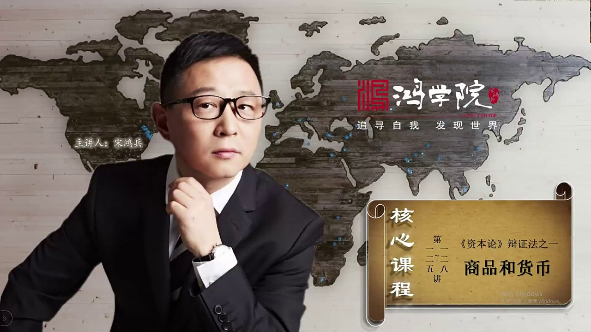

這堂核心課我們重點講資本論中間的變種法今天是講其中的第一部分商品和貨幣也就是整個資本論的第一券的第一篇我們翻下一頁為什麼要講資本論的這個

<strong>Cleaned narration</strong>

> 這堂核心課我們重點講資本論中間的變種法今天是講其中的第一部分商品和貨幣也就是整個資本論的第一券的第一篇我們翻下一頁為什麼要講資本論的這個

---

### Slide 2

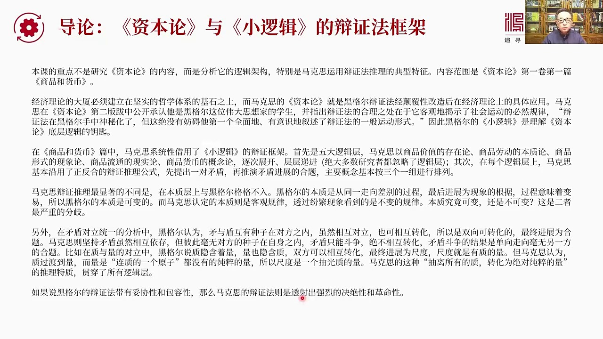

關於開始變成法的分析在我看來我們這堂課重點並不是在研究資本論的內容本身因為它的內容本身包括結論我們在中學和大學都學過很多了可以說是二書能詳咱們今天這堂課關鍵是要分析它的邏輯結構特別是馬克思運用變證法進行推理的一些點形特徵當然今天我們的範圍就是商品和貨幣這部分這麼做的目的是什麼這麼做的目的是我們希望能...

<strong>Cleaned narration</strong>

> 關於開始變成法的分析在我看來我們這堂課重點並不是在研究資本論的內容本身因為它的內容本身包括結論我們在中學和大學都學過很多了可以說是二書能詳咱
> 們今天這堂課關鍵是要分析它的邏輯結構特別是馬克思運用變證法進行推理的一些點形特徵當然今天我們的範圍就是商品和貨幣這部分這麼做的目的是什麼這麼
> 做的目的是我們希望能夠對比幾類變證法它中間的共同之處你比如說一經有一經的變證法黑個有黑個變證法咱們今天要分下馬克思變證法它的特點是什麼就是要
> 把三種變證法我們要形成一種對比然後要找到變證法的一些基本的思想方法目的是什麼目的是為了未來我們能用這種變證法的邏輯再加上演藝邏輯歸納邏輯和我
> 們的向邏輯能夠把它組合在一起形成一種新的立倉邏輯我們現在已經開始做這個事了這就是我們以前說的要建立宗責實現東方文藝復興必須要有哲學的突破突破
> 在哪就是要建立宗責那麼怎麼建立咱們黑個小邏輯分析過了所以我們現在重點轉向資本論轉向馬克思它的變證法跟黑個變證法到底有什麼不一樣我們知道所有的
> 理論也包括經濟理論不管這個大善有多高它都必須要建立在一個堅實的哲學體系的機師之上就是任何理論背後一定要有哲學思想那麼馬克思的資本論呢其實就是
> 黑個而的變證法經過馬克思對他進行了徹底的顛覆性改造之後在經濟理論上的具體應用那麼馬克思在資本論第二把的拔中他也公開承認他是黑個而這位偉大思想
> 家的學生而且指出變證法的合理之處就在於他能客觀的皆是社會運動的必然規律不過馬克思認為變證法在黑個而手中被神秘化了儘管如此這也沒有妨礙黑個而是
> 第一個全面的有意識的敘述了變證法的一般運動形勢換句話說馬克思承認黑個而是變證法的真正的地造者和創始人至少從西方的角度來看從西方哲學這個是要來
> 看是這樣的那麼我們以前讀過黑個小邏輯這本書非常重要咱們喝音客裡面講過很多講過好幾個系列所以理解小邏輯這是我們理解資本論底層邏輯的一把鑰匙如果
> 大家還沒有看過小邏輯的核心客可以回過頭去再參考一下那麼在我們今天要講的這個部分中就是商品和貨幣馬克思實際上是系統性的借用了小邏輯的變證框架首
> 先這種借用體驗在五大邏輯層那麼馬克思它也是用五大邏輯層建立它的概念的層層地徑的體系那麼首先存在層是什麼就是商品價值存在論這是我給它請的名字它
> 實際上是專門分析商品價值的部分然後本質層是商品勞動的本質論現象層是商品價值形式那麼現實層專門講商品流通它的規律概念層就是它的貨幣論實際上是商
> 品貨幣的概念論然後馬克思在推理過程中是按著這五大邏輯層主層的展開層層地徑其實我看了這麼多分析資本論包括小邏輯的學者我覺得他們一個最大的忽略之
> 處就是沒有提到邏輯層實際上我覺得黑耳對變成法最大的貢獻是它把概念梳立成了弱干邏輯層就比較類似咱們現在人工智能中神經的網絡我覺得這代表一種普遍
> 的認識論一定要分層然後在每個邏輯層上在用辯證邏輯經推理馬克思基本上也是掩用了黑耳這套方式正反合這是辯證法的推理公式首先從各種事物中不管你研究
> 什麼類型的事物首先零出一對主要矛盾然後在推演矛盾之間相互鬥爭相互轉化然後發展到合體完成一個邏輯循環就像我們所說的華爾自舞跳三步然後進入下一個
> 層次那麼這個層次的內容是讓被全國起來移到了下一個層次再以它為出發點再進行新的議論推演所以資本論的協法也符合這個規律在資本論中每一篇每一個部分
> 它的基本概念都是三個一組進行的排列那麼這是類似的部分不同的部分呢我覺得馬克思的辯證法跟黑格爾辯證法最顯著的不同式填在資本論中是什麼呢就是在本
> ...

---

### Slide 3

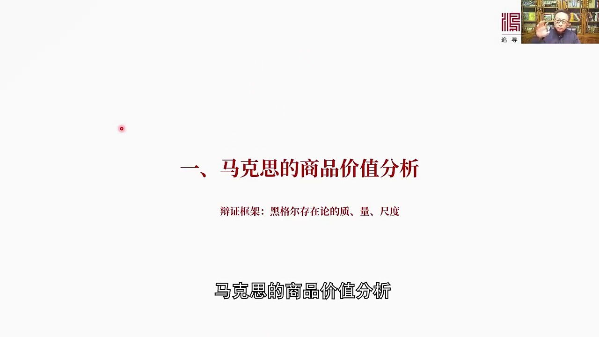

它是怎麼分析商品的價值的那麼變征框架它的思想方法實際上是用了黑格存在論的智利和尺度三要素我們看下一頁在這裏我們首先要回顧一下黑格存在論的基本內容

<strong>Cleaned narration</strong>

> 它是怎麼分析商品的價值的那麼變征框架它的思想方法實際上是用了黑格存在論的智利和尺度三要素我們看下一頁在這裏我們首先要回顧一下黑格存在論的基本內容

---

### Slide 4

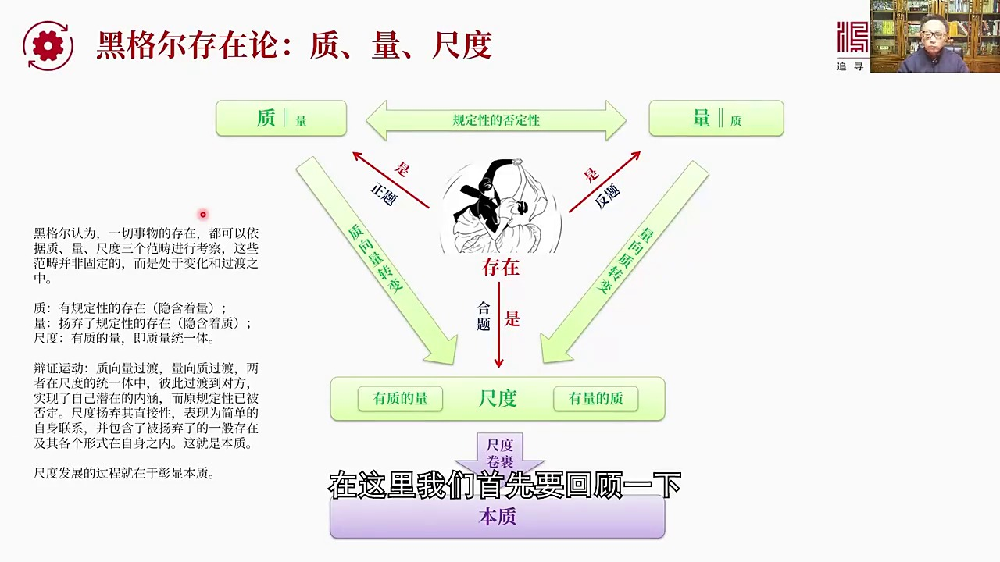

就是尺這個智量尺度這三者之間到底什麼關係當然我們在這裏並不去詳細論述它的內容我們主要看這張圖我們會發現在黑格的範疇中這個智這個概念中間是隱含著量的量中間也隱含著智這兩者相互對立相互矛盾智和量當然是什麼叫智就是有規定性的東西那麼你一旦有規定性就會產生規定性的否定性同時產生形象說如果說你要界定一個概念這...

<strong>Cleaned narration</strong>

> 就是尺這個智量尺度這三者之間到底什麼關係當然我們在這裏並不去詳細論述它的內容我們主要看這張圖我們會發現在黑格的範疇中這個智這個概念中間是隱含
> 著量的量中間也隱含著智這兩者相互對立相互矛盾智和量當然是什麼叫智就是有規定性的東西那麼你一旦有規定性就會產生規定性的否定性同時產生形象說如果
> 說你要界定一個概念這就是化一個邊界你化了邊界說這個邊界內部都叫這個事同時就會產生邊界外部的東西你沒有定義的東西那是什麼那就是跟它相反的或者叫
> 規定性的否定性也就是說你在定義任何事務的時候都會自動地生成它的對立面也就是規定性的否定性邊界之外的東西那麼實際上這兩者之間是有聯繫的就是在任
> 何界定的過程中邊界內和邊界外都有著相互相對方過度的潛制或者叫潛能當然黑格爾在描述這個問題的時候它是用了一種精神實體就是這個概念本身是帶有精神
> 能動性的它是會主動跨越自己的限制運動到邊界的另外一邊邊界的另外一邊外邊也一樣會往裡運動所以這個是馬克思最不能容忍的說你這個叫微信主義當然從黑
> 格爾小段說我本來就是站在一個上帝的角度來看問題就是絕對絕對什麼絕對是上帝或者叫絕對精神絕對精神自我展開也就是說絕對精神絕對是制絕對也是量絕對
> 是耻度這個絕對包含所有事情就像佛家所說的如來藏藍般佛法藍般法門都藏在如來藏裡頭所以未來世界的進化實際上是如來藏或者叫這個絕對精神的自我展開就
> 像開花一樣的所有具體的事物是開花的過程這個是黑格爾所謂客觀微信主義的核心但馬克思不這麼認為他從微物主義的角度來看你這個什麼絕對的神絕對上帝不
> 存在這個東西所以任何東西都應該是個客觀的物質性的一個東西或者叫真正的實體 客觀的實體不能是一個主觀實體他不會自己動應該是有其他的因素才能引發
> 他的運動這就是兩者根本的區別那麼從這個我們可以看到制和量這個矛盾中間他們可以相互過度等到達一個非常就是你也可以說是矛盾也可以是相互過度等到達
> 一個充分程度之後他們就會進展到合體就是尺度所以制向量轉變我們用這個箭頭來表示量向制轉變我們用這個箭頭來表示所以最後形成的合體叫尺度尺度裡面寄
> 包括有制的量也包括有量的制量者在尺度中間達成了一個矛盾的完成的過度的形態就是制和量尺度在相互轉化只有到尺度中他們倆才安靜下來也就是這兩環節才
> 進入一個安靜的狀態所以我們來看這個表達方法存在存在是制存在也是量存在是尺度那麼這個尺度絕過自身最後進展到了本質尺度就是為了彰顯本質所以我們看
> 黑格爾對這個三個要素的定義是什麼黑格爾認為一切事務的存在都可以按照制量尺度這三個範疇來進行考察當然這些範疇並不是固定的而是處於變化和過度之中
> 的什麼叫制就是有規定性的存在這中間隱含著量什麼叫量就是陽氣了規定性的存在這中間隱含著制所以尺度是有制的量也就是說是制和量的統一體那麼它的變成
> 運動就是制向量過度量向制過度量者在尺度的統一體中彼此過度到了對方實現了自己潛在了內涵而原來的規定性被否定掉了或者叫被陽氣掉了它的直接性但這種
> 陽氣在我看來你把它形容成卷果把它卷起來了當然直接性就喪失了可能比理解它的這些陽氣要容易一些所以尺度裡面表現為簡單的自身聯繫而且包括了被陽氣或
> 者叫被卷果的一般存在和它的各種形式這就叫發展到了本質當然尺度的發展它的這個過程目的就為了張銜本質所以我們可以把它存在從質量發展到尺度然後就是
> 制包括自己卷果自己發展的量量卷果自己發展到尺度卷果自己就是制卷果到了量當然量中就一定還有制那麼制呢就是量也可以向它的反方向向制過度然後這個量
> ...

---

### Slide 5

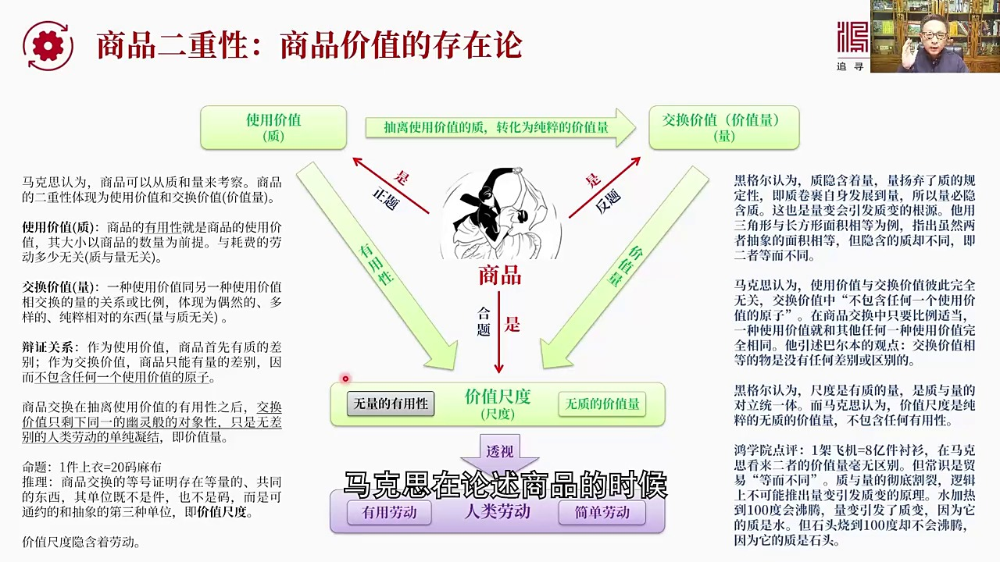

就是套用了這個公式變成法的公式就是本質論這個智量和尺度三指時間的一個變成關係的公式馬克思使用了二重性他說商品我們怎麼來看在商品商品是具有二重性的當然我稱之為這是馬克思的商品價值的存在論任何商品必然存在兩個屬性或者並然存在一對這個對立的矛盾一個叫使用價值使用價值對應這存在論中間的智使用價值是一種特質是...

<strong>Cleaned narration</strong>

> 就是套用了這個公式變成法的公式就是本質論這個智量和尺度三指時間的一個變成關係的公式馬克思使用了二重性他說商品我們怎麼來看在商品商品是具有二重
> 性的當然我稱之為這是馬克思的商品價值的存在論任何商品必然存在兩個屬性或者並然存在一對這個對立的矛盾一個叫使用價值使用價值對應這存在論中間的智
> 使用價值是一種特質是一種有用的特質所以我們稱之為使用價值任何一個商品要想成為商品他自己首先必須先有用沒有用的東西就沒人要那麼他所對應的叫交換
> 價值就是使用價值是有用然後他代表了一種特質但是他在市場中怎麼表達自己他的價值究竟是多少他實際上需要有一個交換價值跟他相對應那麼這個交換價值馬
> 克思稱之為純粹的量他不太喜歡用交換價值這個價值量或者叫交換價值就對應著剛才存在論中間那個量然後馬克思認為注意這是個單向見頭馬克思認為這個運動
> 是從使用價值出發抽離使用價值的智一定要把它抽空轉變成純粹的價值量然後發展的量然後再從量進展到價值尺度所以我們看使用價值他這個智體現為他的有用
> 性有用了特質他的量體現為價值量雙方在價值尺度形成了統一我這個地方之所以用沒有量的有用性無量的有用性就是因為馬克思不強調有用性所以我這兒用灰色
> 的標誌代表這個環節那麼他中間包含的其實真正的東西是沒有智沒有特質的價值量所以我們看這個邏輯關係就是商品商品是使用價值商品也是交換價值商品是價
> 值尺度這是正題反題合體然後價值尺度原果自身或者叫透過價值尺度在這兒不是進展是透視價值尺度的本質是什麼是人類勞動這當然包括有用勞動和簡單勞動兩
> 個環節這就是他整個的一個思想方法如果我們看他的具體規定性馬克思認為商品也可以從智和量兩方面來考察商品二重性體現為使用價值還有交換價值或者叫價
> 值量所以馬克思所說的二重性一切他提到二重性都在指他從這個事務中抽象出了一對矛盾這個矛盾體現為兩極這兩極就是二重性什麼叫使用價值呢馬克思認為使
> 用價值就是商品的有用性也就是商品的使用價值有用性就是他使用價值使用價值大小這個有用性大小怎麼來行量呢去看這個商品有多少個那麼當我們說到智的時
> 候是完全不談量的所以他與生產使用價值或生產這個商品所耗費多了個小時多了天毫無關係我們指論智而智中沒有量所以這叫使用價值是他的論述也就是智和量
> 是無關的當馬克思探到交換價值的時候他認為一種使用價值從另外一種使用價值進行交換得出的純粹的量的比例或者關係那麼這種關係體現為偶然的多樣的純粹
> 相對的東西也就是這個量和智沒有關係所以在馬克思的矛盾對立這張圖中劍頭永遠是單向的交換價值不能反過來變成使用價值只有使用價值抽離抽離他的智變成
> 純粹的量這在以後的所有論述中通通都是這個規律就一旦把它轉化成了純粹的量那麼這個量是完全不記得他的前生到底是什麼變來的到底是一個狼頭換成了這個
> 貨幣還是一個手機換成了貨幣他根本不記得我們可以用失意來描述這個概念就是交換價值到我們談到價值量的時候他根本不知道自己從哪來的只剩純粹的量那麼
> 我們看兩者的變成關係作為使用價值商品首先有制的差別他首先是有用的制這個制和另外一個制是不一樣的這叫它的特質商品的特質手機就是手機查戶就是查戶
> 制的它的制的差別那麼作為交換價值商品只能有量的差別注意在這邊只能有量的差別這是一個非常重要這都是它的原話它的原話說在價值量中間不包含任何一個
> 使用價值的原子也就是在這邊毫無這標的任何一個原子這還是專門強調的一句話它就要表現它的絕對的不可逆性絕對的毫無特質是純粹的量這就是馬克思退一個
> ...

---

### Slide 6

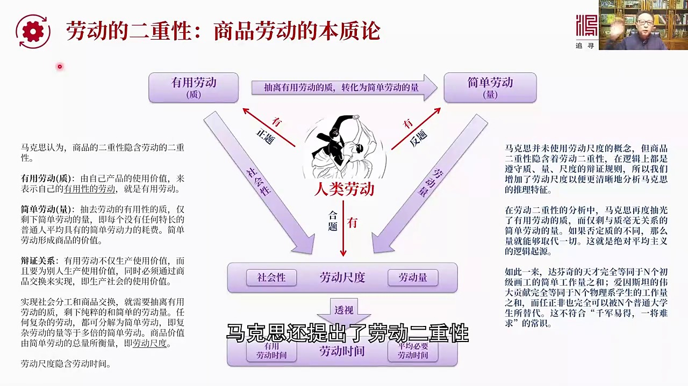

就是我稱之為商品勞動的本質論因為它認為這是本質當然它沒有用黑個人那個同一到差別到根據來描述它本質論它仍然是用的存在論的質量和齒度那麼我們首先來看這個結構人類勞動這是這個相當於主詞人類勞動包括有用勞動有用勞動是一種質我做一個生產一個手機生產一個東西這是帶有特質的我這麼生產是會帶來有用價值的一種勞動那麼...

<strong>Cleaned narration</strong>

> 就是我稱之為商品勞動的本質論因為它認為這是本質當然它沒有用黑個人那個同一到差別到根據來描述它本質論它仍然是用的存在論的質量和齒度那麼我們首先
> 來看這個結構人類勞動這是這個相當於主詞人類勞動包括有用勞動有用勞動是一種質我做一個生產一個手機生產一個東西這是帶有特質的我這麼生產是會帶來有
> 用價值的一種勞動那麼與它相對應就是簡單勞動沒有任何的指向性沒有任何的方向性它是簡單的量馬克思認為有用勞動如果抽離它的制轉化成簡單勞動的量這就
> 過度過來了變成簡單勞動了那麼簡單勞動和勞動勞動是社會性因為我生產一個東西不光是為我自己我是為別人生產有用而這個使用價值或者說我是為社會在生產
> 使用價值那麼有用勞動最後被單純化簡單化變成了簡單勞動量當然這就變成了齒度價值齒度中間寄包含著社會性勞動齒度中間包含著社會性也包含著純粹的勞動
> 量簡單的純粹的勞動量如果我們透視再往下透視勞動齒度背後一定包含勞動時間也就是有用勞動時間和社會平均必要勞動時間我們看馬克思的推馬克思認為商品
> 二重性中間引寒著勞動二重性什麼叫有用勞動就是由自己生產使用價值來表示自己從事的事有用勞動這就從事是一種有價值的有用性的勞動這個就叫有人勞動簡
> 單勞動它是一種量就是超卻勞動了有用性的智謹剩下簡單的勞動的量這就相當於沒有這個它指的是這個社會中每個沒有任何特長的普通的人它的有機體從事一個
> 簡單的勞動所消耗的時間這種消耗形成了商品的價值就是那個價值量實際上是由簡單勞動的量來決定的就是一個毫無特長的人靠體力純粹從事一個機械工作所花
> 多少個小時形成了商品的價值量注意馬克思在簡單的勞動這兒再次完全抽光了有用勞動的智這兩者變成關係是什麼就是有用勞動不僅生產使用價值而且要為別人
> 生產使用價值同時必須要通過商品交換來實現所以它從事是社會的有用價值那麼實現社會分工和商品交換就需要抽離有用勞動的智剩下純粹和簡單的勞動量馬克
> 思重點強調任何複雜的勞動都可以分解為簡單勞動繼複雜勞動的量等於弱干貝簡單勞動的量注意任何複雜勞動任何複雜勞動它的量都可以用安倍簡單勞動的量得
> 出來商品價值有簡單勞動量的總量來衡量這就叫勞動尺度當然勞動尺度中隱含著勞動時間我們現在看這個推理有沒有問題我們首先看首先馬克思並沒有使用勞動
> 尺度這個概念但是商品二重性中間隱藏著勞動二重性這在邏輯上是符合智量尺度的變成規則所以我們把一些它沒有提到明確提出的概念加進去這是為了更好的反
> 應它的推理的框架框架的框架性和它推理的特徵我們看到你在勞動二重性的分裔中馬克思再度抽光了有用勞動的智謹慎下和智毫無關係的簡單的勞動量好那麼如
> 果你否定勞動智的不同量就能取代一切這其實是各個國家中間這個絕對平均主義的邏輯起源就是無論你做多麼負擔的工作我都可以用簡單勞動來替代但是這一定
> 會產生一個常識上的沒有論比如說達文奇它的天才是不是能夠完全等於100個初級化工的簡單工子讓支合呢馬克思認為可以那麼安斯坦的偉大的貢獻相對論它
> 的貢獻是不是等於一萬個物理系的學生它的工作量支合呢我相信不會有人這麼認為否則中國一年培養一千萬個大學生培養了70年當然以前沒有這麼多最近幾年
> 培養這麼多累計培養了這麼多人但是也沒有出於安斯坦他們的工作時間加在一起遠比安斯坦一輩子從事物理學研究長得多還有人正非也可以完全被N個普通大學
> 的學生所替代但是這嚴重違反了常識我們知道天軍一得一將難求這是一個從歷史發展過程中從各種社會現象中都可以得到這個普遍的常識也就是說偉大的藝術家
> ...

---

### Slide 7

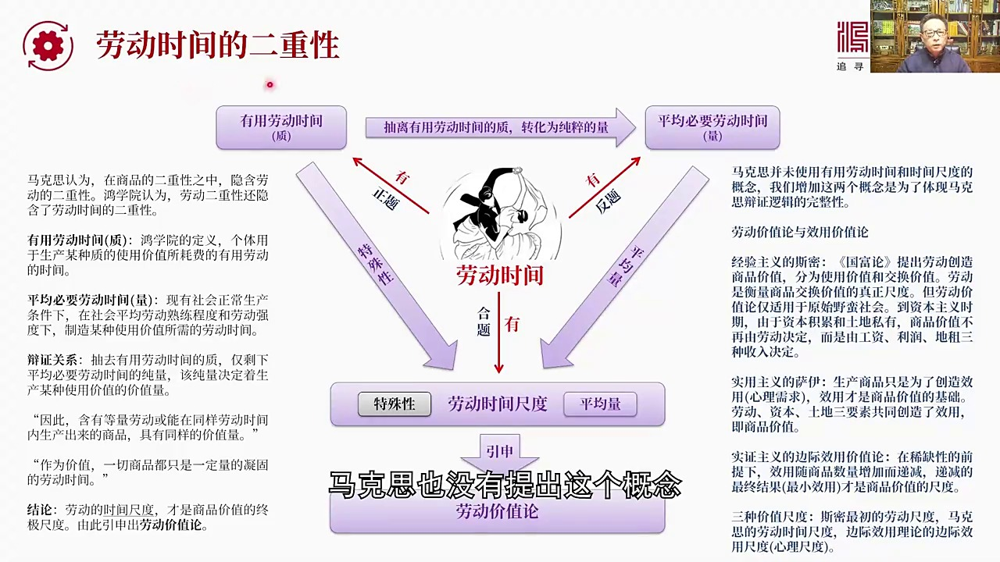

這是我們按著它的推理邏輯給它補充上去的為了還是讓整個邏輯結構完整我們先看這個邏輯結構勞動時間當然有有用勞動時間這是它的制有社會平均勞動時間這是它的量還是那個老辦法抽離有用勞動時間的制把它轉化成純粹的量但是有用勞動時間帶著特殊性平均勞動時間代表平均量這就構成了勞動時間尺度這個才是真正的馬斯說的商品價值...

<strong>Cleaned narration</strong>

> 這是我們按著它的推理邏輯給它補充上去的為了還是讓整個邏輯結構完整我們先看這個邏輯結構勞動時間當然有有用勞動時間這是它的制有社會平均勞動時間這
> 是它的量還是那個老辦法抽離有用勞動時間的制把它轉化成純粹的量但是有用勞動時間帶著特殊性平均勞動時間代表平均量這就構成了勞動時間尺度這個才是真
> 正的馬斯說的商品價值的真正的價值尺度指的是它但是它通過三層推也得到這個結論這個尺度中間特殊性我把它用灰色標誌出來因為馬斯不承認有特殊性存在我
> 們只能看平均量所以它適合契勒特殊性之後勞動尺度那就是一個絕對的平均量從這兒它已針出了勞動價值論好我們再看它的它是怎麼來產出這個問題的馬斯認為
> 商品二重性隱涵著勞動二重性而紅線認為勞動二重性隱涵了勞動時間二重性什麼叫有用勞動時間什麼叫這一塊呢按照我們自己的定義就是個體用於生產某種制的
> 使用價值所耗費的有用勞動的時間這個比較直白什麼叫社會平均勞動時間呢這是存量就是在現有社會正常生產條件之下在社會平均勞動熟練強度勞動程度和勞動
> 強度之下製造某種使用價值所需要的勞動時間平均下來生產一個手機需要多少時間那麼這兩者的辨證國際是什麼就是抽去有用勞動的有用勞動時間的制僅剩下社
> 會平均勞動時間的存量這個存量決定的生產某種使用價值的真正的價值量按照馬斯的言話來說就是因此還有等量勞動或能在同樣勞動時間之內生產出來的商品具
> 有著同樣的價值量或者作為價值一切商品都只是一定量的寧故的勞動時間把它抽象成時間之後那所有的商品都一樣沒有任何本質差別所以它的結論是勞動的時間
> 齒度才是商品價值齒度的終極齒度這當然會隱身出勞動價值論好 我們來看勞動價值論跟西方現在主要流行的效用價值論這兩者之間到底是怎麼個關係在我看來
> 馬斯黑格這一派是屬於日曼或者叫日曼加猶太文明的一個基本的推理思路是有一個非常鮮明的強烈的頂層設計這樣的一種邏輯框架它首先有個頂層設計然後在形
> 成這個哲學體系然後在從哲學體系推演經濟推演經濟學理論但是日曼這個昂陸三個訊人他們的思想方法與此不同他們是經驗主義加實用主義再加實證主義所以我
> 們看歐美學派形成了經濟學理論跟日曼學派或者叫德國學派包括馬克思這一派它是有很大差別的比如說經濟學開展比組要當私密它是屬於英國經驗主義這個哲學
> 體系的那麼它的國夫論其實國夫論首先提出了勞動創造商品價值而且商品價值中間分為使用價值和交換價值然後李家徒經營不論說我讓到馬克思這兒對他們進行
> 批判用這種變成法的思路進行批判然後得出了馬克思的使用價值和交換價值勞動這個當年亞動斯密也認為勞動其實是行量商品交換價值的真正尺度不過亞動斯密
> 認為這種勞動價值論只適合於原始的野蠻社會因為當時大家沒有形成一定的制度都是獨立的自由人那麼當然勞動很重要創造商品亞動斯密認為到資本主義時代就
> 是已經形成了現在社會的規範了已經有法律了已經有財產權了已經有生產關係已經有資本了在這種情況之下他認為情況變了就是由於資本積累和土地私有商品價
> 值不再由勞動決定而是由工資利潤地租這三個方面的收入來決定這當然我們就很熟悉了好到了薩伊薩伊是使用主義他用使用主義這種哲學無論他有意識還沒有意
> 識他是讓背後是有哲學體系的叫使用主義他是用使用主義來產數經濟他認為生產商品只是為了創造效用就是心理需求比如說我吃饅鬥我惡了想吃饅鬥這是一種心
> 理需求這叫效用這個商品首先他必須要有效用為了滿足我現在積惡的需求而且我越是積惡我對他的需求越強烈這個東西才是商品價值的基礎所以他是個純心理的
> ...

---

### Slide 8

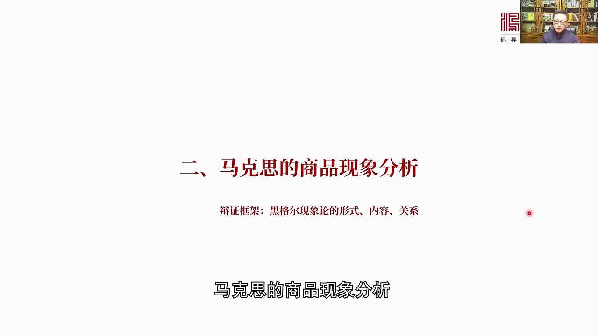

我們看到了商品價值作為存在首先是存在的然後又看到商品價值背後的本質也就是實際上是勞動人類勞動或者叫人類勞動的時間這是它的本質現在我們要過度到現象了商品也是一種現象這種現象我們怎麼來分析那麼馬克思在這裡用的變成框架是黑格爾的現象論中間的形式內容和關係這三個要素或是叫推理的框架我們看下一頁首先還是要回顧...

<strong>Cleaned narration</strong>

> 我們看到了商品價值作為存在首先是存在的然後又看到商品價值背後的本質也就是實際上是勞動人類勞動或者叫人類勞動的時間這是它的本質現在我們要過度到
> 現象了商品也是一種現象這種現象我們怎麼來分析那麼馬克思在這裡用的變成框架是黑格爾的現象論中間的形式內容和關係這三個要素或是叫推理的框架我們看下一頁首先還是要回顧一下或是要浮習一下黑格爾

---

### Slide 9

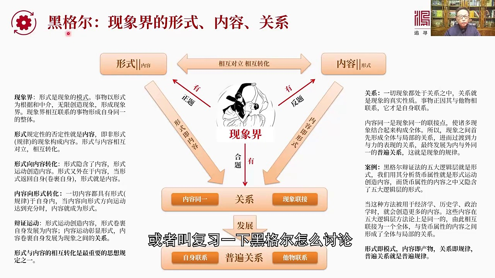

怎麼討論現象界這三個要素形式內容和關係首先我們從這張圖上可以看到黑格爾的現象界包括形式內容和關係存在要素形式中間包含著或者叫隱含著內容內容中間也隱含著形式兩者是可以相互轉化的從這兒轉化到這兒或者從這兒轉化到這兒其實是一個意思我把它分開鏈大家可以看得更明顯所以兩者是相互對立的形式和內容肯定是對立的當然...

<strong>Cleaned narration</strong>

> 怎麼討論現象界這三個要素形式內容和關係首先我們從這張圖上可以看到黑格爾的現象界包括形式內容和關係存在要素形式中間包含著或者叫隱含著內容內容中
> 間也隱含著形式兩者是可以相互轉化的從這兒轉化到這兒或者從這兒轉化到這兒其實是一個意思我把它分開鏈大家可以看得更明顯所以兩者是相互對立的形式和
> 內容肯定是對立的當然也可以相互轉化要注意我們現在經常說的形式主義或者我們現在所理解的形式這是我們日常用語而不是哲學概念哲學概念對形式有專門的
> 定義形式是什麼形式就是一種模式形式就是一種規律這種形式運動指的是這種模式不斷的在運動創造出了一系列的個別案例這個叫形式內容呢所有也就是說內容
> 的規定就是所有不是模式的東西而是具體的非模式的具體的東西都叫內容這個我們現在說開會講形式主義或者社會中很多東西都是形式主義完全不是一回事不能
> 夠這麼去想形式雖然內容開會那個形式也代表某種這個意思但是我們必須要從正確的哲學的範疇那個概念來理解否則的話就會理業不了它在說什麼或者理解會有
> 偏差那麼現象首先有形式然後現象形式運動現象又出現了內容但是實際上形式它是發展不斷向對方過度是可以變成內容的形式技內容像這個同理內容繼續往前發
> 展也會變成形式那麼兩者在現象中就會這個呈現出關係你創造這麼多內容這些內容之間彼此是相關的這個內容和那個內容或這個內容和整個的全體的內容是相關
> 的內容同意是什麼凡是由同樣一種模式出來了一系列的這種現象用同樣來源於同樣一個模式所展現出的所有現象這叫內容同意那麼什麼叫現象連接現象連接指的
> 是由內容同意所構成了這個整體中間的所有現象之間是彼此有聯繫的是聯繫在一起的作為一個整體來看待所以任何這個現象都和它全體會構成一種關係這就是全
> 部和局部的關係當然進一步衍生還有其他的關係那麼這種關係比如說立和立的表現然後還有這個內於外這三重關係最後捲果自身發展成普遍關係普遍關係也就是
> 自身聯繫塌無聯繫就是內部的關係和外部關係形成了一種同意義的狀態或者叫內外統一內外統一在一起形成了這麼一種普遍的聯繫這叫普遍關係普遍關係當然就
> 是現象界出現的任何一個現象或者諸多現象的普遍規律好我們來看這個定義現象界還有一個定義是形式是現象的模式或者是形式是現象的規律事物以形式為根據
> 和中介無限的創造現象形成了現象界現象界相互聯繫的事物形成了自身同意的整體什麼叫形式形式規定性的否定性就是內容非形式的東西就是如果不是規律而只
> 是具體的東西具體的現象這就是內容形式與內容相互對立但可以相互轉化形式向內容轉化它的方式是就是為什麼它會向內容轉化因為形式中間隱藏了或者叫隱含
> 了內容形式運動創造了內容當然形式又外在於內容就是規律比如說牛頓定律慣性定律由於慣性定律這個模式如果創造出了大量的現象比如說你殺車人會往前衝比
> 如說星球在軌道中運行還有騎晶車華冰都是屬於同樣一個慣性形式所創造出來大量的內容但是慣性定律外在於開車殺車騎晶車華冰或者是星球運動這叫形式外在
> 於內容那麼當形式返回內容就絕過自身發展它內容有大量大量這種越來越多的內容這個形式越來越多的創造內容時候形式就變成內容大家一看原來是這樣的一個
> 規律一眼就能看明白當它充分創造達到足夠量的時候大家就能從形式中直接看到這個形式它就直接變成了內容同樣內容也可以向形式轉化一切內容都具有著形式
> 就是任何一個溜冰騎晶車中間都包含著過性定律對吧所以任何形式裡面都有任何內容中都內涵的形式那麼當內容向形式運動達到充分的時候內容就變成形式當足
> ...

---

### Slide 10

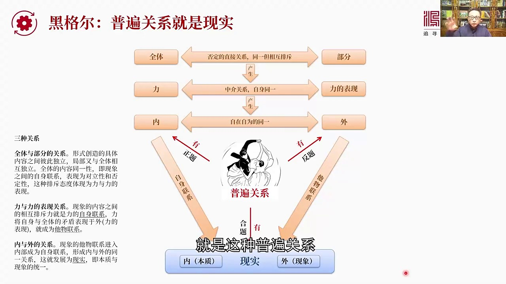

實際上是有幾個部分組成的第一個部分全體和部分我們已經講了首先出現是這對關係然後全體和部分它是一個否定的直接關係內容統一但相互排斥比如說我們說的關心領律產生了這麼多現象但是華民和開車殺車人往前衝這畢竟是兩件不同性質的事兒畢竟是兩個不同的性質、特質都不一樣的現象好你把這麼多不同的這種現象搞成一個整體他們...

<strong>Cleaned narration</strong>

> 實際上是有幾個部分組成的第一個部分全體和部分我們已經講了首先出現是這對關係然後全體和部分它是一個否定的直接關係內容統一但相互排斥比如說我們說
> 的關心領律產生了這麼多現象但是華民和開車殺車人往前衝這畢竟是兩件不同性質的事兒畢竟是兩個不同的性質、
> 特質都不一樣的現象好你把這麼多不同的這種現象搞成一個整體他們雖然是有同樣的規律同樣的模式創造出了形成的一個整體但是彼此之間還是有相當大的不同
> 這種不同會產生排斥這是黑耳的邏輯因為它代表神在創造萬物所有的這種範疇之間都有一種能動性我要主動的要怎麼著要突破自己界線所以相互之間一定會產生
> 衝度這種衝度會發展成一種力就是排斥力排斥力以自我為中介形成自身統一體現成力的表現最後形成一個自身統一的結果會產生一個自為自在的內外統一就是內
> 部的關係和外部的關係完全一致這就發展成了現實也就是在對內方面表現成自身聯繫對外方面表現成他物聯繫這就構成了現實現實是什麼是內於外的統一是本質
> 與現象的統一這就成了一個普遍關係就發展成了現實就固化了長期以來形成了這種這樣的一種習慣它就成了一個固定的東西所以我們來看還有一個三個關係剛才
> 我們已經基本解釋過三個關係的內容了在這裡我們就不再多說好 我們翻下一馬克思也是借用了現象

---

### Slide 11

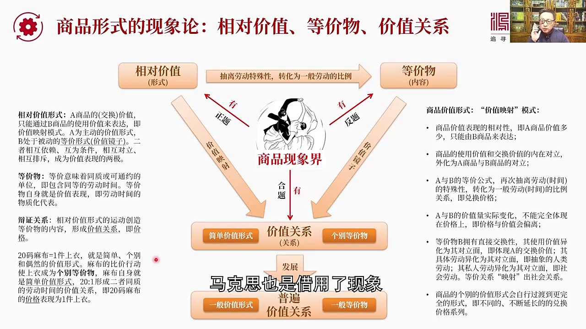

黑格的現象分析的方法就是形式內容關係這個變證法的公式現象界的變證法的公式來推演商品的價值形式比如說它提出商品的價值形式包括首先相對價值形式這是就是那個模式是什麼相對價值形式就是它就是向關係利率它是一種模式它所對立面是什麼是等價形式或者叫等價物這就是內容相對價值形式運動最後會產生它的產物就是等價物這是...

<strong>Cleaned narration</strong>

> 黑格的現象分析的方法就是形式內容關係這個變證法的公式現象界的變證法的公式來推演商品的價值形式比如說它提出商品的價值形式包括首先相對價值形式這
> 是就是那個模式是什麼相對價值形式就是它就是向關係利率它是一種模式它所對立面是什麼是等價形式或者叫等價物這就是內容相對價值形式運動最後會產生它
> 的產物就是等價物這是形式與內容的過度怎麼過度呢還是超離勞動的特殊性轉變成一般勞動的比例就是這個勞動最後變成了多少勞動它最後要算這個價格這個商
> 品和那個商品到底幾筆擠實際上是等價物要起這個作用實際上也是抽光了所有勞動的特殊性或者叫商品的特質然後剩下的不就是時間和時間的比較嗎我幹這個事
> 花了三小時你幹那個事花了五小時那我們就三比五了三個我這個東西換五你那個東西嗎這其實就是價值關係所以商品現象有相對價值也有等價物這兩種形式那麼
> 相對價值最重要的一個特點就是要價值硬設它是通過價值硬設來反應自身的這是黑個這是黑個本質論中間反覆強調了所有東西的關係都是一種硬設關係馬克思把
> 這個借件過來了它認為所有價值的自我展現就是你說你很牛但是你不能證明你很牛你只有被別人所證明就是你在社會觀音中被所有人都認可你才叫牛你的價值填
> 在別人身上或者說我一個手機比如說五千塊錢我可以換這個多少其他的商品也就是說五千塊錢的手機它的真正的價值在商品世界中它是通過其他商品來展現出來
> 了其他商品是什麼就是等價物所以等價物和相對價值之間等價物就好比是價值的鏡子一個商品也要想照出自己到底值什麼值多少就必須要找到它的等價物照一照
> 照一照我才明白我值多少所以這首五千形成了價值硬設它一定要硬設到別人身上同時等價物是價值鏡子其他價值鏡的作用把對方的價值給照射出來雙方形成的就
> 是價值關係是一個你到底值多少個比如說一件一件上一到底值多少多少馬麻布1比20這個1比20其實就是價格價值關係講的就是價格序列我一個麻布換多少
> 上一我一個上一換多少麻布一個上一能換多少悲茶或多少兩茶一個一個一件上一可以換多少具體東西這會形成個價值序列這個價值這個價值關係講了就是價格那
> 麼由於我們這考慮是個單一的我們現在的考慮比如說是一件上一花二十八麻布這是個單一的過程這邊是這個麻布這邊是上一兩者形成的是一個簡單的簡單的價值
> 形式而這邊的等價物是一個個別的等價物就是一個特殊商品對照一個特殊的性子這麼照出來的東西這個叫簡單的價值形式和個別的價物它的發展是最終發展到普
> 遍價值關係也就是從簡單的價值形式變成一般的價值形式然後出現一般等的等價物好我們來看這個規定性相對價值形式也就是A商品是相對於在這邊B商品在這
> 邊A商品要照鏡子那個商品它的價值或者它的交換價值只能通過B商品的使用價值來表現也就是說如果這是A它只能用B這個B等價物它的使用價值來表達自己
> 所以這叫價值應射模式整個我們剛剛所說的馬克思的這個商品價值形式都是應射這種關係都是應射模式所以我們說一提到馬克思所說商品價值形式是什麼呀是各
> 種各種的關係都是應射那麼A商品是主動的價值形式因為它主動照鏡子B商品是被動的等價形式所以它承擔鏡子的職責兩者當然相互依賴護衛條件相互對立護牆
> 排斥成為價值表現的兩極也就是說我們怎麼表現一個價值啊一個商品的價值就一定要把兩個東西擺在一起一個是處在相對價值讓那個形式狀態之下另外一個說的
> 等價物這是表達價值形式的兩極然後呢什麼叫等價物等價物就是同志的或者是要可通約的單位當然背後就是同等的勞動時間那麼等價物自身它就是價值形式就是
> ...

---

### Slide 12

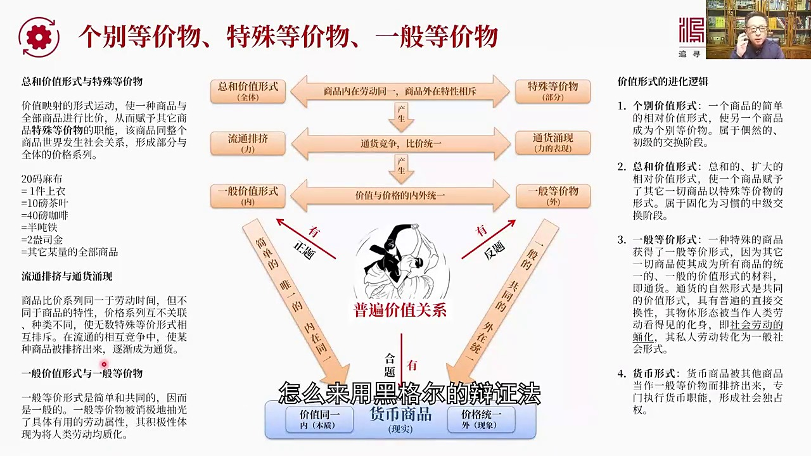

這個用黑個人的變成法來推演這個事我們來看到什麼全部具這個全體局部立和立的表現內和外這都是哲學黑格哲學術語或者叫哲學的概念相當地抽象我們也不知道立和立的表現到底是什麼樣好我們看看馬克思是怎麼用立和立的表現內和外的關係把它的學說把這個它的商品價值形式的學說給發展出來給推演出來的看它這個邏輯細節很有意思首...

<strong>Cleaned narration</strong>

> 這個用黑個人的變成法來推演這個事我們來看到什麼全部具這個全體局部立和立的表現內和外這都是哲學黑格哲學術語或者叫哲學的概念相當地抽象我們也不知
> 道立和立的表現到底是什麼樣好我們看看馬克思是怎麼用立和立的表現內和外的關係把它的學說把這個它的商品價值形式的學說給發展出來給推演出來的看它這
> 個邏輯細節很有意思首先我們可以看到這三個關係我們把全體和部分還標誅在這它實際上代表一個總和的價值形式就是整體價值形式然後它對應的是特殊等價物
> 剛才是個別等價物單一價值形式對應個別等價物現在變成總和的了總和就是我用麻布去跟好多東西相比跟所有商品相比這個叫比出了一堆價值價格序列這個叫總
> 和價值形式特殊價值物特殊價值物就是我跟成績上萬個商品每個都是我的靜子每個商品都是成績上萬個商品都是我的特殊等價物就是我照的靜子有成績上萬個或
> 叫所有市場中能看到商品如果我去照靜子那麼每個商品都是我的靜子而每個商品每個靜子都叫一個特殊等價物是我的特殊等價物好這就存在這個問題了商品內在
> 內在同一指的是勞動時間A商品B商品你跟誰比都一樣都是在比時間所以它內在是同一的但是商品外不特性它是相互排斥的就是你這個比如說我要換蘋果還是我
> 要換上一上一和蘋果這玩意兒差距太大而且我有成績上萬個或者叫市場中所有看見商品那五花八門彼此沒有任何的關係看起來也千七百怪的他們就會產生一種赤
> 裂也就是說在不停的交換過程中會產生排斥的力量這叫競爭你會看到一個價值序列這個價值序列比如說20碼碼不等一件上一等於10萬茶葉等於40萬咖啡半
> 吞鐵兩萬四黃金還有其他全部的商品某個數量的一個所有上面有都可以列出來這是不過列不下而已好所謂的排斥力我們看馬克思是怎麼巧妙利用這個推理的利用
> 黑格這個推理所謂排斥力就是通貨的排擠我們會看到你經過無數字的比價比得越多你會發現比得越來越多你會發現某種東西的概率而且不只拿這一個上面比我還
> 可以用一件上一可以跟無數上面比我還可以用茶葉跟無數上面比無數商品的無數價值鏡子反覆的照射的結果這就是流通在流通中不斷交換不斷比價最後的結果你
> 會發現在這個價值等式中某一種東西的概率出現的概率越來越頻繁比如說黃金後來你會發現茶葉要兌換也換成黃金或者半輪鐵也換成黃金或者上一麻布最後大家
> 都出現一個像黃金看齊的局面至從如果我們在社會中把每個商品單獨兌換都打出一張表來打出這個價格表我們會發現在每個表中間金黃金的出現的頻率越來越高
> 一直發展到最後基本上全用黃金來表價這就叫流通排擠這是一種力因為它是商品競爭競爭通貨在競爭之中表現為力的表現是什麼通貨用線出來了逐漸越來越清晰
> 了出現了金和銀作為通貨的這樣的一種發展發展態勢趨勢看到了好那麼最後再往再往後就是我們看這是通貨牌幾個通貨銀線那麼再往後就是一般價值形式代表內
> 部一般等價物它是代表一個代表相當於內外的關係一般價值形式就是什麼呢簡單的唯一的內在同一的這樣的一種價值形式比如說通貨最後大家所有的人都用單一
> 的通貨因為它簡單唯一而且所有比價的內容都是跟這一個商品來比所以這叫內容同一那麼外部關係就是由於它等價物要跟所有商品發生關係它外部關係它體驗為
> 它是一般的共同的大家所有人都共推的而且是一般的一個外在的統一就是這個貨幣商品通貨變成了貨幣商品之後它對內是價值統一對外是價格統一這叫內外或者
> 叫本質與現象的統一統一和統一這叫價格價值和價格的內外全部統一在一起了對內是統一對外是統一所以它變成了貨幣商品那麼如果我們來看價格這個價值形式
> ...

---

### Slide 13

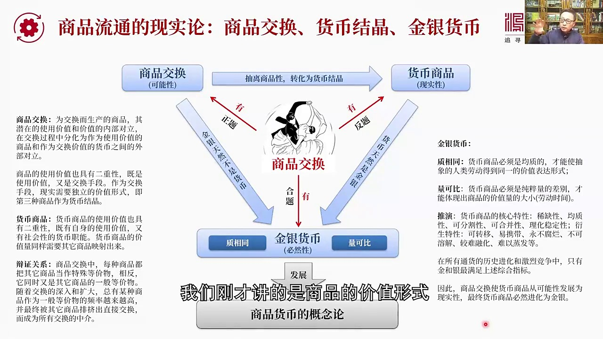

這是一種現象我們現在來講現實現實是什麼商品開始流通了我們剛剛說的都是靜態的比較不管你是使用價值還是交換價值這是一種靜態的一種一種分析剛才所分析的價值形式也是靜態的你這個貨幣你這個商品和另外一個商品進行比較趙靜子但是實際上還沒有真正發生流通發生流通這叫現實現實論就進入現實這個邏輯界面了這中間三個核心概...

<strong>Cleaned narration</strong>

> 這是一種現象我們現在來講現實現實是什麼商品開始流通了我們剛剛說的都是靜態的比較不管你是使用價值還是交換價值這是一種靜態的一種一種分析剛才所分
> 析的價值形式也是靜態的你這個貨幣你這個商品和另外一個商品進行比較趙靜子但是實際上還沒有真正發生流通發生流通這叫現實現實論就進入現實這個邏輯界
> 面了這中間三個核心概念是商品交換貨幣商品和基因貨幣我們首先看商品交換商品交換這個時候我們看到馬克思還是用了黑耳的線這個現實論現實邏輯從中間的
> 可能性現實性和必然性來進行他的邏輯推演用的是同樣的公式首先商品開始交換了這是這個概念帶著商品交換當然商品交換就是諸多的可能性那麼商品交換最後
> 發展變成了貨幣商品擠出來了把貨幣商品通貨給擠出來了這個過程是什麼抽離商品性轉化為貨幣結晶就是商品性的那些那些所有的特製要被徹底抽光你才能轉化
> 成貨幣商品所以呈現上萬的商品在一起競爭流通中進行機械競爭最後融現出來的貨幣結晶一定是被抽離了他的商品性他就直接他就最終變成了一個單純的通貨這
> 個叫貨幣商品所以在這個發展過程中商品交換必然他這個可能性會變成那種現實性一定會出現貨幣商品或者叫貨幣結晶而貨幣結晶結果自己他就必然會發展成基
> 因貨幣這個就是一個邏輯推演所以我們看到所有聚明言基因天然不是貨幣貨幣天然是基因這句話就出在論述商品流通這個部分就在資本論這個部分中他提出這句
> 話所以我們可以看到商品交換貨幣商品為什麼貨幣商品天然是基因因為基因貨幣量相同量可比這是非常關鍵的是完全一致的軍制化量可比它是純粹量的關係都能
> 夠得到很好展現當然這就發展成了商品貨幣的概念論就是下一步我們要講的首先看商品交換作為就是如果我這個商品是為了交換而生產它的潛在使用價值和價值
> 的內部對立現在在交換過程中就分化為使用價值代表使用價值商品和作為交換價值的貨幣就變成外部外部的對立了剛才我們說的價值形勢的時候它還是潛在的在
> 這個分析這個時候就是任何商品內部都有使用價值和交換價值這是內在的或者叫內部的潛在的關係商品流通起來之後它就外化了外化成了兩個東西的對立交換另
> 外一個是就是商品和貨幣變成外部對立商品交換就會導致貨幣商品的湧現當然這個商品的使用價值也有二重性就是使用價值也可以分成一對矛盾就是使用價值它
> 既是使用價值又是交換手段因為我是用於為別人生產的作為交換手段現實就是如果我要用這個商品去交換別人的東西或者交換這個這個貨幣交換別人的東西最好
> 是最後永遠出一個通貨所以這種交換的過程它現實的強烈的需要有一種獨立的價值性式通貨就是所以需要第三種商品作為貨幣貼金好貨幣商品貨幣商品這使用價
> 值也需要二重性既有自身使用價值比如黃金可以香芽金芽又有社會的貨幣智能這個貨幣商品的價值量反過來我們說一樣是黃金它的價值量怎麼體現呢它自己不能
> 體現它只能通過跟全社會所有商品進行對比硬設在別人身上才能體現所以即便它是等交物即便它是貨幣它也不能單獨的一樣是黃金怎麼說我值多少你就一定要用
> 一樣是黃金去買使馬麻布你才知道我這個東西原來可以換到使馬麻布或者換半噸鐵或者換什麼什麼你才知道我到底擁有多少價值所以貨幣商品等交物和普通商品
> 一樣都必須要通過硬設才能反映自己真正的價值所以在商品它是變成關係商品交換中每種商品都把其他商品當成特殊等交物相反它同時又是其他一切商品的一般
> 等交物所以隨著交換的深入和擴大總有某種商品作為一般等交物它的頻率越來越高剛才我們分析過了最終被其他商品擠出來了擠出流通了成為所有交易的中介這
> ...

---

### Slide 14

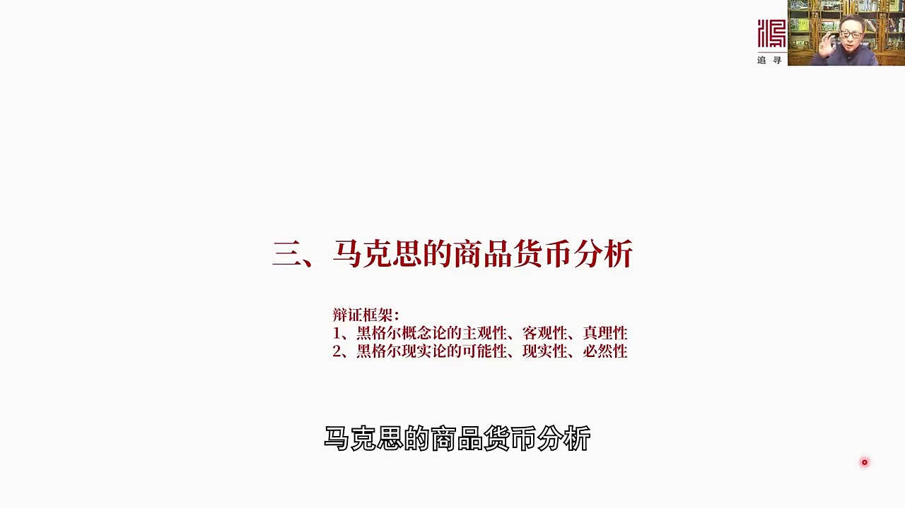

這是它的貨幣論了它的變成框架用了概念論的主觀性客觀性和真理性還用了現實性的可能性現實性和必然性它為什麼要用兩種呢為什麼不純粹用概念論呢因為它不認同黑格爾的那種微信主義的理念它不喜歡所以它在這個框架中仍然用了除了概念這個貨幣概念的時候講價值史都說用的是概念論那麼其他的五個它有五個貨幣只能第一個價值史都...

<strong>Cleaned narration</strong>

> 這是它的貨幣論了它的變成框架用了概念論的主觀性客觀性和真理性還用了現實性的可能性現實性和必然性它為什麼要用兩種呢為什麼不純粹用概念論呢因為它
> 不認同黑格爾的那種微信主義的理念它不喜歡所以它在這個框架中仍然用了除了概念這個貨幣概念的時候講價值史都說用的是概念論那麼其他的五個它有五個貨
> 幣只能第一個價值史都用的是概念論其他四個主要還是用現實論來經分析比較符合維護主義的特點好我們再看下一頁那麼價值史都我們知道這叫貨幣第一支能

---

### Slide 15

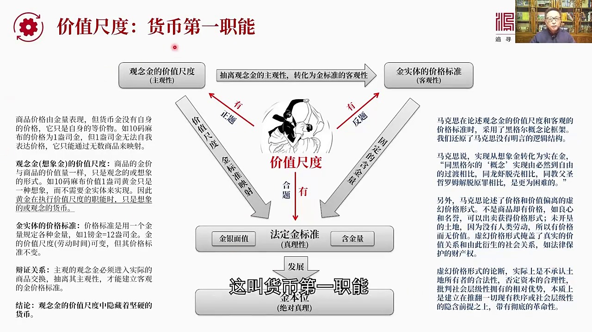

咱們在紅旋的講銀行貨幣的這個系列課中我們講過我們的分按著邏輯分層它的排列的順序和原理那麼馬克思它的分析方法基本一致但是順序稍有不同首先價值史都這個是貨幣第一支能是存在級別的支能那麼價值史都首先它列出了第一個這種範疇概念的範疇叫關鍵金的它是關鍵金的價值史都所以它代表一種主觀性關鍵金是什麼就是這個韓金量...

<strong>Cleaned narration</strong>

> 咱們在紅旋的講銀行貨幣的這個系列課中我們講過我們的分按著邏輯分層它的排列的順序和原理那麼馬克思它的分析方法基本一致但是順序稍有不同首先價值史
> 都這個是貨幣第一支能是存在級別的支能那麼價值史都首先它列出了第一個這種範疇概念的範疇叫關鍵金的它是關鍵金的價值史都所以它代表一種主觀性關鍵金
> 是什麼就是這個韓金量是想像出來的並不是真實存在的或者並不需要馬上真實存在所以它代表一種主觀性然後它所對應的是客觀性這都是概念論中間的核心範疇
> 客觀性是什麼是金實體的價格標準是它的客觀性那麼第三個概念叫法定金標準比如說一昂絲這個黃金跟一半黃金怎麼比啊比如說一半黃金等於12昂絲這個叫法
> 定金標準然後再往後發展金標準又發展成了一英棒中間還有多少韓金量等等這個叫法定金標準了好我們再看它的推演關係從主觀性的關鍵金這個價值史度也是首
> 先抽離了關鍵金的主觀性然後把它徹底轉變成金標準的客觀性所以才能形成金標準的價格標準然後我們看到主觀的這個價值史度實際上這個價值史度需要應設在
> 金標準上這金標準是一個是它的鏡子這個主觀的價值史度要應設到金標準上才能展現它的客觀性那麼金標準就是這個金實體的標準它是一種固定的韓金量的規定
> 當然在歷上這個固定標準一直在變化因為各國主權貨幣它所什麼應棒法狼這東西它也是隨著時間而不斷地改變的一開始純粹的金幣後來金幣用多了摩損了好我就
> 法定說一個不滿一洋絲可能只有0.98洋絲的這個金幣仍然相當於一洋絲金幣這就是這就是一種我說它是固定韓金量它就是很有這麼多再往後發展到更多的東
> 西就是一絕符號東西來替代它到了指幣等等那是後來的事所以在金標準在價值尺度這個金標準上就是它會出現一個精英面質比如說一個錄影15的頭像這個是它
> 的面質上面寫的多少法狼實際上它同時含規定了韓金量我規定它應該價值漸實際上它可能摩損了那麼最之後發展的標準一定是這套體系最終發展標準一定是變成
> 金本位這就是從主觀性、客觀性發展到真理性以後我們看它怎麼推演的從真理性最後發展到絕對真理就是絕對理念這就是黑耳的推演方式那麼馬克思是怎麼用這
> 個推演方式的首先我們來看商品價格是由金量來表現的就是這個比如說這個一鍵上一可以換兩個兩岸絲金幣所以它的價格是黃金但是這種貨幣金它自己沒有自己
> 的價格剛剛我們說了你不知道一岸絲到底是等於它自身價值多少你只有跟其他東西來比它才能夠反應射才能反映出自己價格我們來看第一個概念主觀金或者是要
> 想象經驗的價值尺度為什麼價值尺度是想象的呢當然我們看這概念一般人會非常吃驚我們的價值尺度應該是剛性的不馬克思認為這是想象的而且馬克思確實說了
> 有道理它是觀念金商品的金價和商品的價值量一樣它主要是一種觀念和想象的形式比如說這個石馬麻布價值樣子黃金只是一種想象或者是要推它還沒有拿去交換
> 呢就像我們說我這個房子價值一百萬實際上你沒到市場上去賣但是你腦子賣已經形成了我想像於這個房子有一百萬的現金就好像它放到保險箱裡實際上那只是觀
> 念只是你顯現出來因為它還沒有進入流通在那個狀態之下它是不需要金實體來實現了你只需要想象我認為我一見上一能值量兩次黃金這是我在交換之前我頭腦中
> 的想像現在還不需要真的黃金來實現交易所以黃金在值金這個黃金在值金價值尺度這個值能的時候只是停留在想像和觀念中這是個非常非常牛逼的一個概括這一
> 點實際上把問題拆了更細了這一點值得我們學習首先這種想像的主觀的東西是跟我們以前理解是不一樣的它認為這是先是從想像和主觀的東西最後怎麼跟實際的
> ...

---

### Slide 16

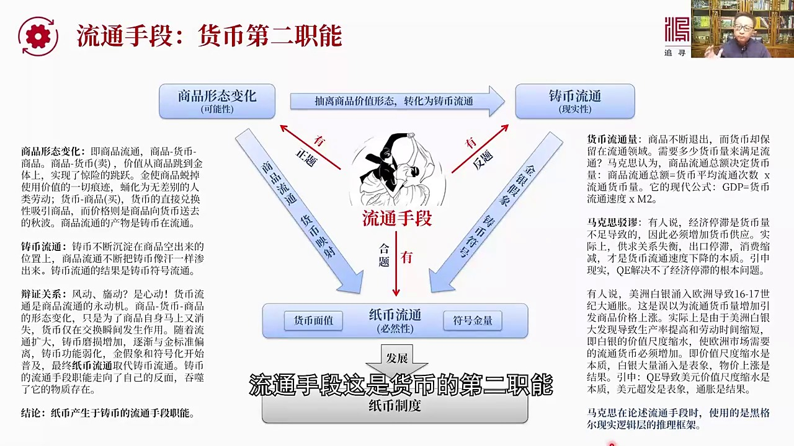

這是貨幣的第二是能好我們看流通手段中間有商品形態的變化其實這就是講了商品形態變化講了就是這個商品流通商品流通它所對應的另外一個概念是駐幣流通到底誰在流通嗎馬斯認為商品形態變化這是我們看到的我們在整個社會現實中看到是駐幣流通金幣在換手銀幣在換手實際上它是表象背後實際上是商品在流通商品背後實際上是勞動的...

<strong>Cleaned narration</strong>

> 這是貨幣的第二是能好我們看流通手段中間有商品形態的變化其實這就是講了商品形態變化講了就是這個商品流通商品流通它所對應的另外一個概念是駐幣流通
> 到底誰在流通嗎馬斯認為商品形態變化這是我們看到的我們在整個社會現實中看到是駐幣流通金幣在換手銀幣在換手實際上它是表象背後實際上是商品在流通商
> 品背後實際上是勞動的時間勞動的價值在發生變化在發生對話等等所以它認為商品流通和駐幣流通這兩者是相對利的一對矛盾怎麼變化就是商品流通一定要抽光
> 或者抽離商品的價值形態轉化為駐幣的流通還是要把商品的價值形態比如說你一開始商品然後變成貨幣然後又變成商品這是價值形態要把抽光抽光之後變成純粹
> 的駐幣流通注意還是抽離的思路好 變成純粹駐幣就是從可能性商品交換它有各種各樣的可能性最終它這個流通最後發展的結構一定我們看到的是駐幣流通從可
> 能性變成了現實性現實性在往前發展就會變成指幣流通這就出現了一個指幣流通的幣燃性我們來看它這個邏輯結構首先流通手段有這個商品流通駐幣流通那麼商
> 品流通實際上它需要追求一種貨幣應射商品流通的目的賣東西的目的就是為了獲得錢有錢再去買東西這就是所謂商品形態變化所以商品流通的全部目的是為了追
> 求貨幣應射我的價值商品流通的價值必須要反映在貨幣流通之上否則我就體現不了自己價值所以我們看它每層概念的地勁商品投射到貨幣上而商品流通投射到貨
> 幣流通上所以每層級的概念都在不斷往前推要注意這個細節那麼駐幣流通呢駐幣流通它會出現基因假象就是所謂金假象或者銀假象這個現象為什麼因為商品換成
> 貨幣再換成商品只有在換的那個時刻那1秒這個貨幣才有用這就導致我金幣其實起到金銀幣起到的作用就在換手那個時刻才發生作用這晚就明顯它就可以替代了
> 那麼為什麼一定要拿金幣去換呢因為它實現這麼短而且整個這個商品流通就是從商品變成這個變成貨幣我再買其他商品這個過程中最終目的商品都是為了退出的
> 這個貨幣或者叫金銀幣在這待著它發生的作用是短暫的是順時的所以這都會導這種這晚它不一定要在那嘛我拿東西來替代不行嗎這就會產生金假象金假象再往前
> 推就是駐幣會變成一種符號如果存流通的話我不一定需要駐幣存在我用符號可以替代駐幣實現交易實現這個流通沒借的作用這當然最後就會必然進化出指幣來當
> 然這個指幣比如說一英棒它有貨幣面職英國女王維多利亞那個大頭線往哪裡放它所對應的實際上還有符號含金量就是雖然我是指幣但是我是黃金的代表我背後是
> 黃金而且我的指幣上規定了英棒等於多少含金量雖然是符號但是實際上背後你要去中央銀行對話你是可以拿到金幣的這叫指幣流通這是一種必然型最後發展到指
> 幣制度好我們來看這個這個邏輯概念商品形態變化指著就是商品流通商品流通指的是從商品變成貨幣再從貨幣變成商品第一個形態叫商品到貨幣這是賣賣我的東
> 西換錢這個過程馬克思形容為價值從金從商品跳到金體上實現了金錢的跳躍這個這句話非常的形象生動就是因為你要想把你手上的東西賣出去不管你是做什麼行
> 業你想賣都非常的困難你只要賣出去拿到了貨幣這就相當於實現了價值的金錢跳躍這個金是商品退掉了使用價值的一切痕迹永化成無差別的人類勞動馬克思永遠
> 用這種話一旦你換成的金幣換成了黃金背後你到底減頭髮換得了黃金還是賣水果換得了黃金還是這個其他換來黃金其他勞動換來黃金通通不重要因為在這已經變
> 成了無差別的人類勞動永化了拿到金子之後不問你以前是幹啥的金幣是讓折擋了背後一切的一切的這種商品流通的特質所以它實際上是一種這個勞動這種貨幣實
> ...

---

### Slide 17

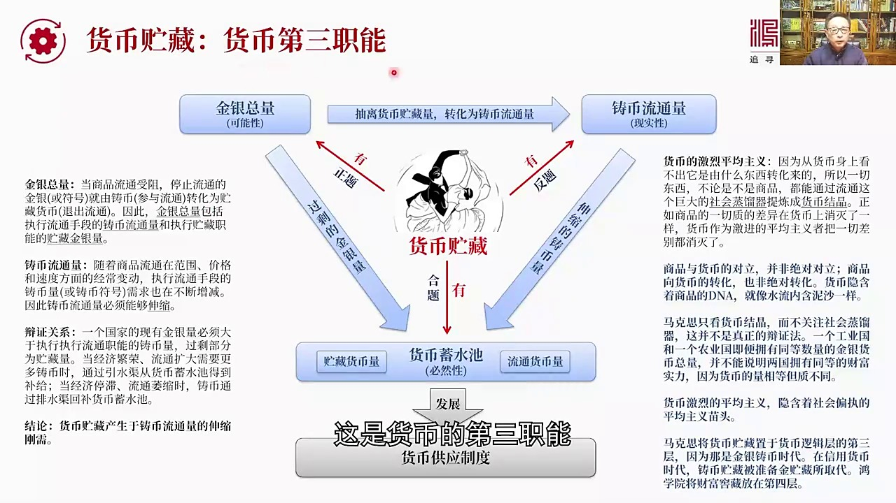

貨幣住藏我們看它的邏輯結構首先是金銀總量這是代表可能性還有助幣的流通量是代表現實性第三概念是貨幣的序水池代表一種必然性這是什麼概念呢就是金總量中間其實包括流通用於流通質能的這個助幣助幣流通量還有一部分呢就是助幣流通量如果用不了這麼多貨幣還有部分被住藏起來了形成貨幣序水池所以貨幣序水池包括住藏的貨幣量...

<strong>Cleaned narration</strong>

> 貨幣住藏我們看它的邏輯結構首先是金銀總量這是代表可能性還有助幣的流通量是代表現實性第三概念是貨幣的序水池代表一種必然性這是什麼概念呢就是金總
> 量中間其實包括流通用於流通質能的這個助幣助幣流通量還有一部分呢就是助幣流通量如果用不了這麼多貨幣還有部分被住藏起來了形成貨幣序水池所以貨幣序
> 水池包括住藏的貨幣量也包括流通貨幣量它的總和所以一個國家如果要想使市場有足夠貨幣這個國家所擁有的金銀量必須要大於流通貨幣量一定要有一個榮譽有
> 個序水池如果交易中間需要越來越多的貨幣經濟發展了如此類的那麼序水池將會把這個序出的水通過排水池供應到流通貨幣量中但如果助幣流通量太大需要不了
> 它會通過排水池排到序水池中間所以這相當一個一個金銀的一個庫存調節流通貨幣量這就是三者之間的關係金總量這是個總數這代表可能性它既可能是助幣流通
> 也可能是住藏那麼首先要抽離貨幣住藏要抽離這個貨幣住藏量剩下的轉化為這個助幣的流通量這也是抽離思路然後這個金銀總量往這邊的關係是過剩的金銀量變
> 成貨幣序水池這邊就是深縮的助幣量因為整個市場交易尺度會變化或者是商品經濟會這個繁榮也會衰退等等都會導致美食美克市場中所需要的貨幣流通量是不同
> 的它是使用在變化的所以你這個助幣流通量它必須不能是剛性你必須要是具有深縮性必須要有彈性多了它就流到序水池少了就盜貫那麼貨幣序水池這就必然會有
> 貨幣序水池要沒有的話這個國家就出問題了所以它包含兩個量助幣量助長量還有流通量這個貨幣序水池最後發展成貨幣供應這套體系好我們來看這個基本上我們
> 剛才解釋了是這樣的關係我們再看它的辯證辯證關係一個國家現有精力量必須要大於執行流通執能的貨幣這個助幣量過剩部分為處長量經濟繁榮的時候流通擴大
> 需要更多的助幣然後通過淫水淫水池從貨幣序水池池水當經濟停滯流通尾縮的時候助幣通過排水池排水池回補序水池結論是什麼貨幣助長產生於助幣流通量的深
> 縮剛需為什麼需要有這個助長就是這個東西是深縮的這是一個剛性需求所以我必須得有個貨幣序水池好馬斯提出另外一個重要的概念叫貨幣的激烈平均主義就是
> 這個話什麼意思就是從貨幣身上看不出它是有什麼東西轉化而來的不管你是簡頭髮的還是賣白菜的還是上班的還是寫代碼的我不知道你是從哪來因為你給我的都
> 是一張貨幣所以一切東西不論是不是商品也不能夠通過流通這個巨大的社會徵流器體驗成貨幣結晶而貨幣結晶是失益的正如商品一切製的差異在貨幣上被消滅了
> 一樣貨幣作為激烈平均主義者把一切差別都消滅了這又是代表馬斯非常典型的推理特徵就是它認為貨幣它任何它的對應物不管它是怎麼來的這個貨幣就是一個絕
> 對的東西那麼我們知道商品與貨幣的對立其實並不是絕對的對立因為雙方都有彼此在自己的內部商品像貨幣轉化也不是絕對的轉化所以貨幣隱藏著商品的DNA
> 就像水流隱藏著這個泥沙是一個道理馬斯只看貨幣結晶而不關注社會徵流器這並不是真正變成法一個工業國和一個農業國即便擁有投等數量的金銀貨幣總量也不
> 能說明兩個國家擁有投等的財富實力或者是財富創造力因為貨幣的量相等但是制不同就像英國1840年的英國和中國中國的貨幣總量遠超英國中國的基地率是
> 英國的四倍為什麼被打得滿地找牙因為你是農業國你的生產力低它是工業國它的整個經濟體系更複雜比我們更先進這就是如果我們只看貨幣結晶只看金銀總量那
> 很可能中國是英國的四倍或者更多難道用馬斯邏輯能夠到著說中國比英國富四倍嗎不能這麼說因為你要看發展趨勢所以它提出這個貨幣的激烈的平民主義我覺得
> ...

---

### Slide 18

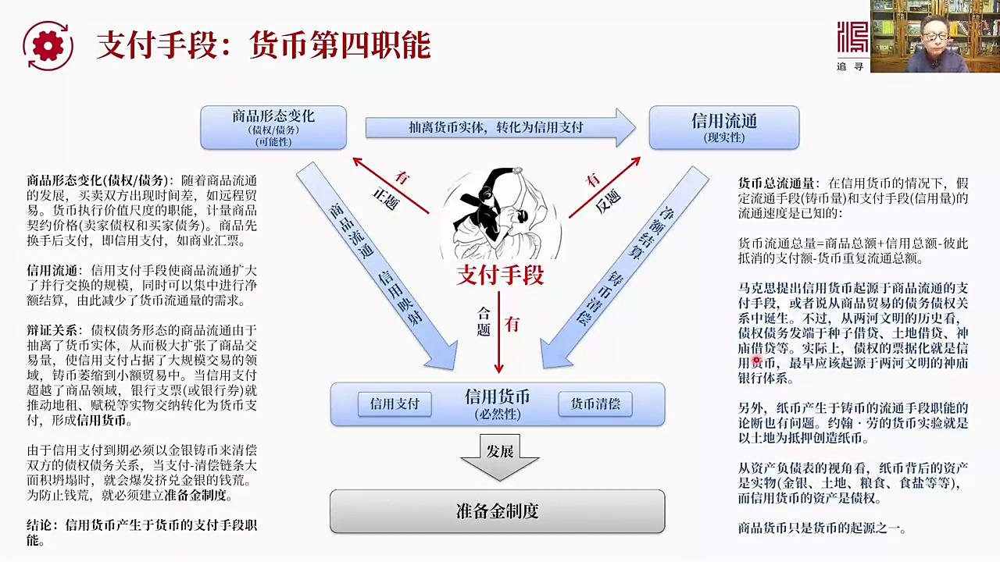

那麼支付手段它的邏輯框架包括三部分商品形態變化但是注意這裡這是雖然指著貨幣商品流通但是它的條件發生變化就是債務債權關係剛才我們所說說商品流通是從商品到貨幣到商品它現在變成了債務債權關係差到中間了這導致是商品流通的形態發生了重大變化另外一個對應的概念就是商品流通這邊對應是信用流通剛剛是駐幣流通現在是信...

<strong>Cleaned narration</strong>

> 那麼支付手段它的邏輯框架包括三部分商品形態變化但是注意這裡這是雖然指著貨幣商品流通但是它的條件發生變化就是債務債權關係剛才我們所說說商品流通
> 是從商品到貨幣到商品它現在變成了債務債權關係差到中間了這導致是商品流通的形態發生了重大變化另外一個對應的概念就是商品流通這邊對應是信用流通剛
> 剛是駐幣流通現在是信用流通也是可能性到現實性最後必然性是嗎信用貨幣所以支付手段它對應著什麼呢商品流通信用流通和信用貨幣好這兩者怎麼發生轉變呢
> 還是同樣的思路馬克思超離貨幣的實體轉化為純粹的信用支付這就是它的基本變化這個發展方向也是單件頭你由於有大量債務債權關係形成了商品的流通的這種
> 關係實際上最後就變成了我不用基因幣去付了我就用匯票就用銀行支票或者用這種票據性的東西來支付到期到了一個月三個月六月之後我在真正發生交易這叫信
> 用流通那麼有了信用流通之後我們會發現信用流通是只各種承諾未來我在支付給你金幣在這段時間裡面會同時並發大量的商品貿易因為信用流通之後會極大的刺
> 激貿易的量所以會並行處理很多貿易而這些並行處理很多貿易中間債務債權關係是可以相互抵銷的這個叫進額結算我們以前核心客們都講到過進額結算就是只要
> 是債權關係我可以把所有債務債權關係進行對銷以前我的我現在的現在現在最好我一對銷真正需要支付的現金或者真正支付需要的金幣會很大成長縮小那麼最後
> 仍然是要用駐幣來清藏的那麼從商品形態變化它還是一種商品流通現象只不過是債務債權關係那樣的形態的商品流通而已這種商品流通仍然是要硬設出來的硬設
> 在哪硬設在信用上所以叫信用硬設那麼最終必然結果什麼就是信用流通的最終結果必然會出現信用貨幣信用貨幣包括信用支付就是到一個時間段以後我在付你錢
> 匯票、遠程匯票是最明顯例子然後最後還要用駐幣來清藏貨幣來清藏那麼發展結果是一定要建立準備金制度我們來看規定性商品的形態變化債務債權關係這個類
> 型的也就是隨著商品流通的發展買賣雙方一定會出現時間差特別是遠程貿易你在意大利他在這個比如說在軍產領導你們要做遠程貿易怎麼做你不可能是一手交錢
> 一手交貨只能是遠程的只能是財取匯票來清支付否則這個貿易沒法做那貨幣執行價值持多的智能貨幣首先要要執行價值持多因為他低智能計量商品的企業價格就
> 是企業價格什麼的比如說你要買香料給人家一張匯票那麼在中東內口案軍產領導在一層布爾現在一層布爾人家收到這個匯票之後馬上就會給你發貨這個時候他其
> 實還沒有拿到錢貨就已經運出來了這個時候他相當於債權人這個買家相當於債務人因為你是三個月六月之後才支付所以你在這段時間裡面你是出在債務人狀態之
> 下只有到六月之後你通過銀行通過這個其他的這個中介把金幣付給別人之後你才傾銷了或者債務債權關係所以在這種情況之下是貨商品先換手然後再支付這就叫
> 信用支付比如說我們剛才所提到信用支票商業匯票等等那麼信用流通就是信用支付手段當然會使商品的交易量大幅度增加然後一方面可以集中清算減少貨幣流通
> 量一方面促進商品貿易發展變成關係就是債務債權關係這種形態的商品流通由於超離了貨幣實體然後這就能極大的放大交易量這就是信用支付佔據了大規模交易
> 的領域駐幣流通逐漸萎縮了只停留在小額交易的日常貿易日常的交易中間遠程貿易基本全部被信用支付取代了這個時候銀行的支票會票銀行卷這些東西越來越多
> 而當這些信用支付手段超過了商品流通的意義所需要的範圍我不需要這麼多量但是信用手段越來越多信用這個銀行支票會票銀行卷越來越多超過了商品流通的需
> ...

---

### Slide 19

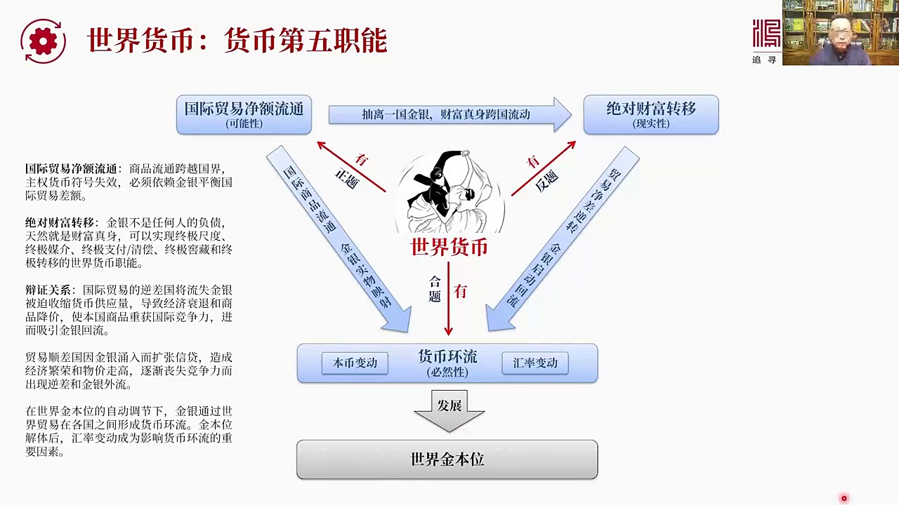

世界貨幣相對比較簡單世界貨幣指的是三個核心點一個是國際貿易的進俄流通逆差順差這是可能性它所對應的對立面這個現實性是什麼是絕對財富的移動那麼第三個要素就是貨幣還流這代表必然性怎麼來理解呢國際貿易如果出現了逆差這是一種可能性所以你這個國家貨幣會流走就是經營會外流這叫抽離一國的經營那麼經營代表什麼財富真身...

<strong>Cleaned narration</strong>

> 世界貨幣相對比較簡單世界貨幣指的是三個核心點一個是國際貿易的進俄流通逆差順差這是可能性它所對應的對立面這個現實性是什麼是絕對財富的移動那麼第
> 三個要素就是貨幣還流這代表必然性怎麼來理解呢國際貿易如果出現了逆差這是一種可能性所以你這個國家貨幣會流走就是經營會外流這叫抽離一國的經營那麼
> 經營代表什麼財富真身財富真身就跨國流動了就跑了所以它對應著絕對的財富移動這就變成了一種現實當你出現貿易一開始你順差也可能逆差這是可能性所以有
> 出現逆差然後經營外流這導致絕對財富的轉移這就變成了現實性那麼國際貿易它代表了不就是國際商品流通嗎國際商品流通它也要硬設往哪硬設硬設到經營實務
> 上因為國際貿易必須要用經營幾算為什麼主持人貨幣一出國境失效了你這個法國法國皇帝法國國王這個頭像如果是指幣到其他國家人家不認你就必須要用經營所
> 以這個世界貨幣的一個非常重要的值能第一大值能就是用來平衡國際貿易的差額那麼絕對財富轉移了這會出現貿易進差的它會最終發展會出現貿易進差的逆轉比
> 如說你是赤字你會變成營餘會自動翻轉成營餘營餘之後經營就會啟動回流這當然就會形成貨幣環流這必然會形成貨幣環流這就是基本運作的這樣的一個模式就是
> 國際貿易如果你是出現逆差你會流失經營流失經營之後這個國家就被迫緊縮貨幣供應量這就會導致經濟衰退商品降價商品降價之後便宜了便宜經營又回流了還有
> 如果你是順差國在這邊順差國因為經營融入大規模擴張性帶然後經濟繁榮經濟繁榮物價走高物價走高你就會逐漸喪失競爭力而出現逆差然後經營就開始又出現回
> 流出現外流所以這個在基本面情況之下這是一個自動調節的機制經營是通過世界貿易在各國之間形成了貨幣環流當然基本面接近之後匯率變動也成為影響貨幣環
> 流是重要因素所以我們提出了美元環流貨幣環流其實馬斯很早就已經提出了類似的概念只不過它沒有把貨幣環流的名稱提列出來馬斯的表達方式是這個經營食物
> 經營會在各國市場中來回不斷的流動這不就是貨幣環流嗎所以我們可以看到貨幣環流寄包括本幣的變化就是流徑和流出經營量也包括匯率的變化特別是升值扁值
> 都會影響貨幣環流那麼要想在基本面之下維持一個自動平衡的貨幣環流就必然會發展成世界性的金本位這就是大英帝國建立的全球金本位制度好我們現在看下一馬斯商品價值論

---

### Slide 20

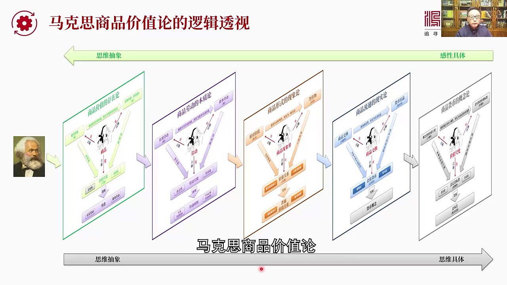

我們現在對它做一個邏輯透視這個邏輯透視你會發現商品價值存在論商品勞動的本質論商品形式的現象論還有商品流通的現實論最後是商品貨幣的概念論實際上它這個牌類順序跟黑格的那個五大邏輯層是一致了中間推理的過程馬克思用了單向推理法就是絕對抽離絕對抽光這個左邊的特質讓它變成右邊所有的邏輯推理基本上都是都是這個同樣...

<strong>Cleaned narration</strong>

> 我們現在對它做一個邏輯透視這個邏輯透視你會發現商品價值存在論商品勞動的本質論商品形式的現象論還有商品流通的現實論最後是商品貨幣的概念論實際上
> 它這個牌類順序跟黑格的那個五大邏輯層是一致了中間推理的過程馬克思用了單向推理法就是絕對抽離絕對抽光這個左邊的特質讓它變成右邊所有的邏輯推理基
> 本上都是都是這個同樣特徵抽離致只剩下存在量然後它的三段論的就是這個變正法的公式用法也基本一致所以呢我們可以看出馬克思的整個私洋體系就是在資本
> 論中它第一部分所展現出來的商品和貨幣的它的基本邏輯是使用了這個黑格的變成邏輯的基本框架而且除了本質論之外其他大體上還有這個推理的方法太絕對化
> 之外基本的其他情況都比較類似那麼馬克思還提出一個重要的學說或者重要的說法而且這個說法也比較有意思它說在研究經濟學院問題上有兩條道路也就是說我
> 們從感性的具體的現象出發比如說我們看到商品貨幣經營幣到再到處流動這個已經填在最後一層了最外層我們看的是貨幣在流動錢再走然後每個人都想掙錢這是
> 個感性具體的現象那麼第一種研究問題的方法是從感性的這些現象體驗體驗成抽象的概念比如說我通過這種大家都喜歡掙錢我得出貨幣然後大家都忙著去找工作
> 我得出什麼叫分工什麼叫貨幣什麼叫價值什麼叫什麼這個叫感性從感性具體的現象進行思維抽象最後得出了一系列概念然後形成經濟學的體系這個叫這個主要發
> 生在經濟學形成初期比組們基本上都這麼幹了我看了一個現象我進行抽象然後體驗抽一個概念我把各種概念組在一起形成了一個比如說交換價值然後使用價值然
> 後形成這個價值這些東西都是逐漸這麼形成的這是一種從感性到抽象思維然後進行抽象而馬斯認為第二種道路這是第二種道路他認為更好或者說他選的這條道路
> 他認為這條道路應該說更高明我們可以把這條線路稱之為是王克魯薩克訓人那種經驗主義實證主義他們喜歡我看了一個現象我進行體驗而馬斯這種日慢和猶太文
> 明他這個推理思路是他提出第二種道路就是從思維的抽象上升到或者叫過度到思維的具體這什麼意思呢比如說整個資本論這個第一部分這個協法就是他其實的推
> 理方法像交換價值使用價值這都是抽象的理念什麼有用勞動簡單勞動相對價值形式等價物等等等等這都是抽象出來的思維抽象出來的一些概念了他實際上推理過
> 程是把抽象的這些概念經過推理經過組合再讓他變成思維的具體的內容或者是思維具體的現象他得出了所有這些推論全是思維的具體的體現所以他從抽象這個思
> 維的抽象走向思維的具體他的推演方式是符合第二條道路的而Uncle Sox信任很多很多理論建立是從感性具體到思維抽象日爾曼人猶太人的推理方式是
> 從思維抽象走向思維具體這個具體不是現象上我們看到的具體跟你眼睛跟你的觀感沒有關係是思維推理過程中產生了重要的思維的結果或者用思維來影響控制整
> 個最後推出來的各種各樣的理性的東西這就是馬克思推理的一個比較值得重視的地方我們最後總結一下首先我們來看一下

---

### Slide 21

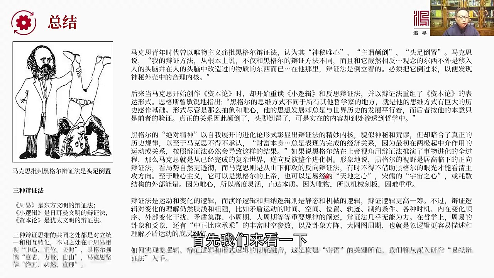

馬克思他對於黑耳的基本的態度馬克思青年時代曾經他用維護主義來痛批黑耳變成法認為黑耳變成法它是神秘的微心的而且是主位顛倒的或者叫投足道志的神秘微心這不用說黑耳老說絕對絕對是什麼絕對精神這當然是神秘和微心的主位顛倒指的是黑耳的說法永遠是那個主詞更大的範疇更大的概念這個位詞是個比較小的概念我們通常正常的表...

<strong>Cleaned narration</strong>

> 馬克思他對於黑耳的基本的態度馬克思青年時代曾經他用維護主義來痛批黑耳變成法認為黑耳變成法它是神秘的微心的而且是主位顛倒的或者叫投足道志的神秘
> 微心這不用說黑耳老說絕對絕對是什麼絕對精神這當然是神秘和微心的主位顛倒指的是黑耳的說法永遠是那個主詞更大的範疇更大的概念這個位詞是個比較小的
> 概念我們通常正常的表達方式是一個從小概念往大概念進行推倒而比如說絕對絕對是存在絕對是本質絕對是概念其實概念存在本質這都包含在絕對裡頭它其實是
> 一個開花形它是個自我展現型的邏輯所以一開始這個主詞特別大包含著萬事萬物所以它主詞是一個無限大的概念它的位詞是個具體的事物這叫主位顛倒正常人都
> 是反過來說那麼這點讓維護主義者非常的不爽維護主義者說你這個一開始這個巨大無比的無邊無界的這個這個絕對這個東西這個東西跟我們維護主義是相反的維
> 護主義不能這麼說所以這就是主位顛倒頭髮到致我們在這兒有張圖這就是馬斯蘭的黑格爾說你頭髮到致頭在下腳在上怎麼能這樣呢這指的就是黑格推演了這個進
> 化論的思路就是自我展現這個思路是馬斯非常討厭的馬斯說我這辯證法從根本上說不僅跟黑格爾變成馬不同而且和他結論相反觀念的東西就是說絕對怎麼怎麼樣
> 絕對怎麼怎麼樣這種觀念的東西不過這個不過是從外界移入到人們的大腦之中並且在我們大腦中經過改造的它還是物質性的東西而以但是在黑格爾那變成法是道
> 歷著的必須把它倒過來以便發現神秘外科中的核心這個合理的內核它為什麼說它倒著的就是它是從一個點向外展開的從絕對開始開花結果的是進化論世的馬斯覺
> 得推理不能這麼推這麼推這跟我們的習慣是完全相反的我們的推法是我們已經看到現實世界了這個現實世界它現象各種現象都已經存在了我們應該到這到這來我
> 們應該看具體事務之間的關係應該看這個現象之間的關係進行科學研究所以必須把這個變成法倒過來才能夠找到中間有價值的東西才能把它提煉出來把它內核給
> 挖出來後來過了十幾年馬斯再不提變成法了它就已經把它披倒披臭了但是當馬斯真正開始具體創作資本論的時候它就開始重新研究小伯伎研究黑格然後開始反思
> 變成法而且它以變成法的思想方法重組了資本論的表達方式就是我們今天講課的內容N個詞曾經敏銳的點評點評它這個這個馬斯對變成法的看法它說黑格的思維
> 方式不同於所有其他哲學家的地方就是它的思維方式有巨大的歷史感作為基礎形勢上儘管是那麽抽象和微信它的思想發展卻總是與世界歷史發展平行政而後者按
> 著它的本意只是牽著了驗證真正的關係已經自點倒了頭腳倒置了可實在的內容卻倒出滲透到哲學中N個詞這個點評是非常敏銳而且相當的聖課就是黑格的表達方
> 式看起來很怪而且給人感覺是墊倒了但是它的這個推理卻總能跟世界歷史和事實相應證所以它說它有一種強烈的巨大的歷史感這套推理方法帽子很荒謬實際上老
> 是跟歷史的事實和發展的這個結果相本合這就有意思了黑格的絕對精神它是以自我展開了進化論的形式張顯出變正法的精妙的內合帽子神秘和荒謬但是卻按和了
> 真正的歷史規律以至於馬克思不得不承認財富本身總是表現為完成的經濟關係因為最初在兩級其中界作用的運動和關係按照變正法必然會導致這樣的結果這什麼
> 意思就是我們來畫推理圖三角形總是從兩個矛盾開始走向合體而且走向合體馬克思看到馬克思研究說總是看到合體那個財富馬克思到底想這個財富怎麼形成的一
> 看裡面全是各種各樣的社會關係經濟土地關係資本關係經濟關係它已經集合在財富本身中間了你看到的是合體看的是結果最初起作用的那些初始變化條件和初始
> ...

---

### Slide 22

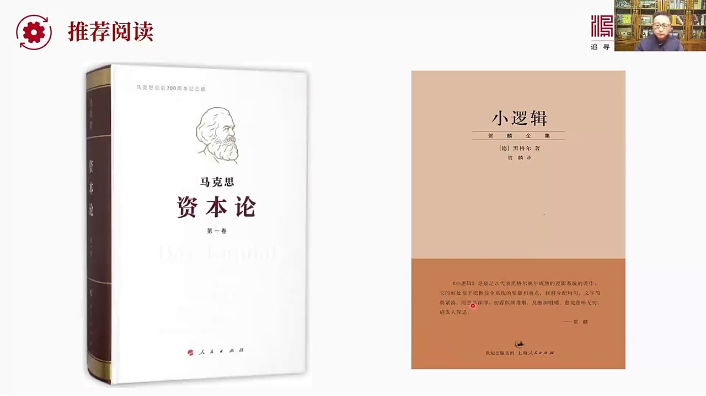

當然還有我們核心課講小邏輯的這個系列課程好這就是我們今天主要內容謝謝大家祝大家

<strong>Cleaned narration</strong>

> 當然還有我們核心課講小邏輯的這個系列課程好這就是我們今天主要內容謝謝大家祝大家

---

### Slide 23

這個學習不斷的進步

<strong>Cleaned narration</strong>

> 這個學習不斷的進步

---
