# 核心课视频-133-136 _ 黄金环流&描述标题= — Clean Slide Notes

> **来源**：鸿学院核心课程  
> **幻灯片**：29 张

---

### Slide 1

今天的題目是講《黃金環流》我們看第一頁首先《黃金環流》是一種新的邏輯框架

---

### Slide 2

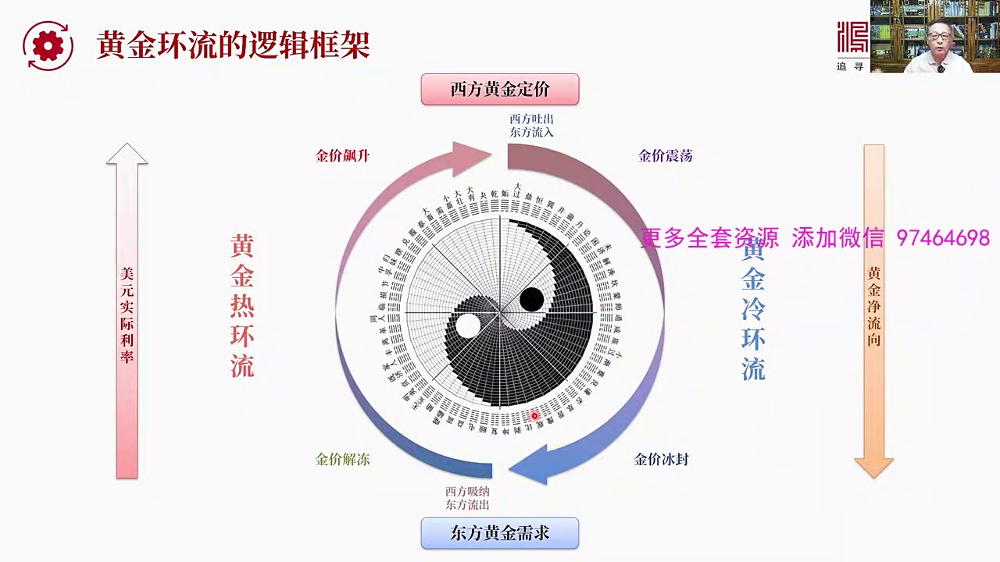

用來認知世界黃金價格的走勢它跟以前的框架有著明顯的區別以前是孤立的去分析某一個市場靜態的分析,它的供給關系或者技術分析或者是包括一些金融和經濟的分析比如說通脹率比如說這個美元匯率等等但是每一種方法都是一種單打一的在某一個局部和彼此割列的我們用《黃金環流》這個新的邏輯框架實際上是把所有東西串在一塊兒去...

---

### Slide 3

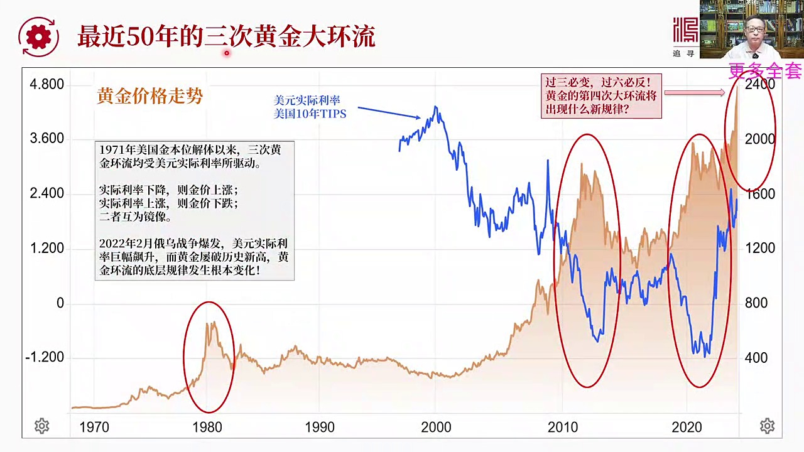

為什麼是最近50年當然是從1997年美元脫離金本位關閉黃金床口然後開始的市場的黃金運動形成了三個環流第一個環流當然就是第一次高峰期1980年黃金衝到850美元從1971年之前的35美元衝到850所以這一輪上漲是非常猛烈的那麼這個過程實際上分成熱環流就是欣納就是熱環流還有冷環流就是突出就把金價給壓下來...

---

### Slide 4

黃金價格定價究竟是怎麼定價的遵循什麼樣的規律我們一般大家收到黃金都認為黃金是大宗商品大宗商品有自己的定價規律但實際上我們這節要講的是黃金定價並非是遵循大宗商品的交易所形成的定價規律它更像是貨幣更像是貨一種貨幣所以它遵循是貨幣原理或者說叫匯率原理而不是商品交易好 我們看下頁具體分析首先我們要搞清楚黃金...

---

### Slide 5

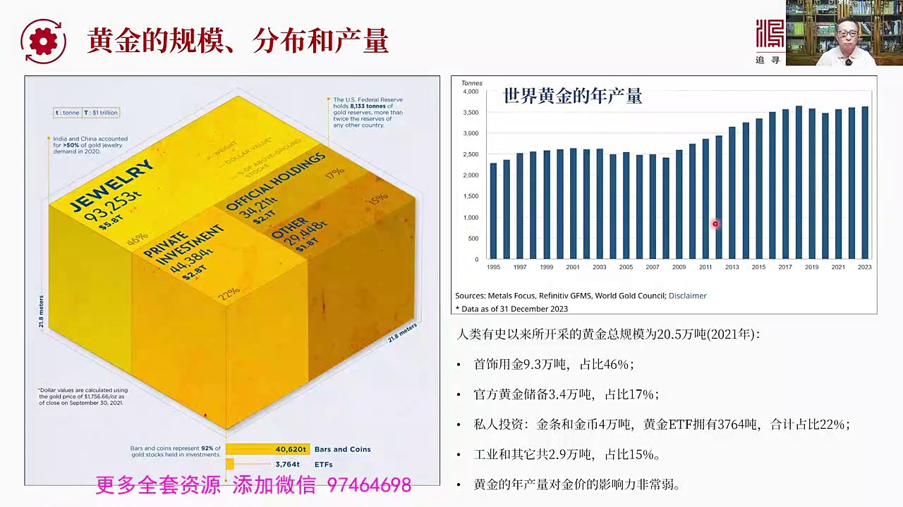

包括產量這張圖形象直觀的反映出了全世界5000年以來所挖出的所有的黃金總量截止到2021年是20.5萬噸20.5萬噸有多大呢大概相當於4個20匹個標準有用持的體積這就是全界5000年以來所開發所開採出來的全部黃金的總量那麼在這麼多黃金中間它的使用情況或者叫分佈首先最大一頭是黃金手勢黃金手勢一共用了9...

---

### Slide 6

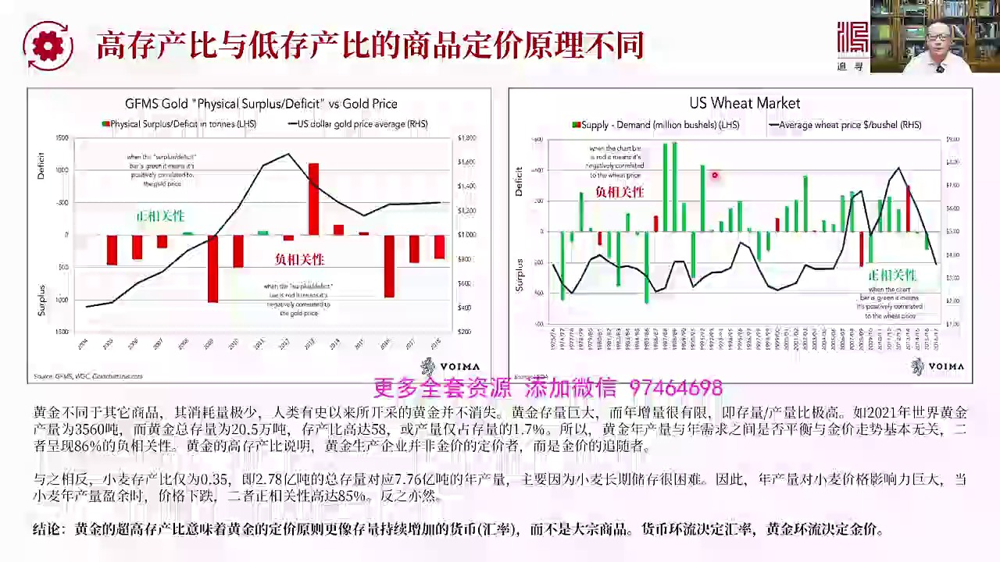

這中間要涉及到一個新的概念叫存產筆就是總存量和總產量年產量之間的比例關係黃金是屬於高存產筆的產品那麼還有一些是屬於低存產筆的商品比如一般大總商品都是這個規律都是低存產筆糧食我們知道糧食的每年的產量極大但是庫存量比較小為什麼因為它的糧食儲存是受時間限制的一般儲存三五年還行如果超過十年這個糧食就不能吃了...

---

### Slide 7

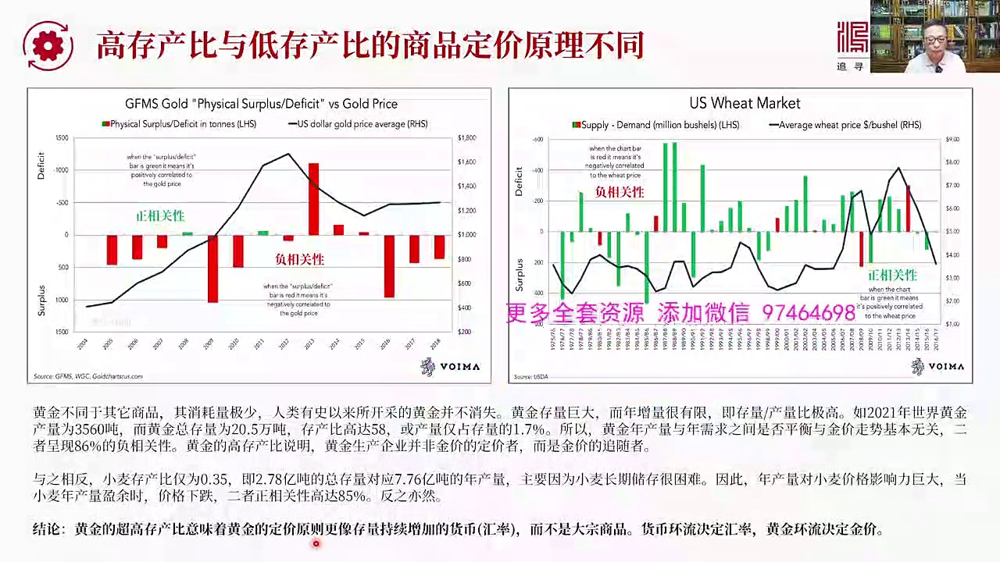

那麼我們知道貨幣基本的定價原理和它基本的價格原理實際上是一種匯率或者叫這個貨幣環流決定匯率咱們研究美元環流其實就在強調美元熱環流那麼一旦啟動熱環流美元匯率會下跌實際上是環流在決定匯率同時我們也可以看到做同樣推理黃金環流實際上決定著黃金的價格兩者是類似的但是驅動貨幣環流的是利率包括流動性各方面的問題驅...

---

### Slide 8

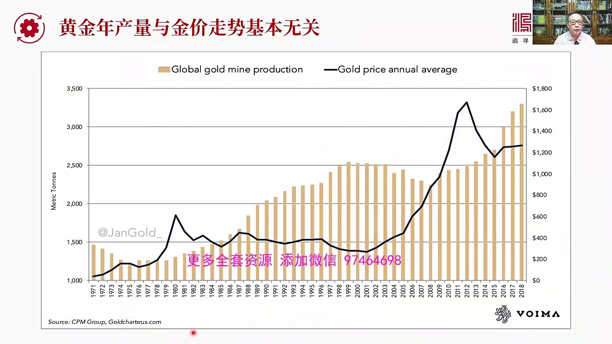

跟金價走勢基本無關從這張圖上我們已經可以分明了看到這些數條代表黃金每年的礦產金的產量每年就是2000噸到3000噸多噸黑線代表黃金的價格走勢我們其實可以看到你這兩者基本上沒有共同之處這個黃金產量低的時候它有時候價格低有時候價格高黃金產量最高的時候有時候價格低有時候價格還很高所以這兩者並沒有什麼真正的...

---

### Slide 9

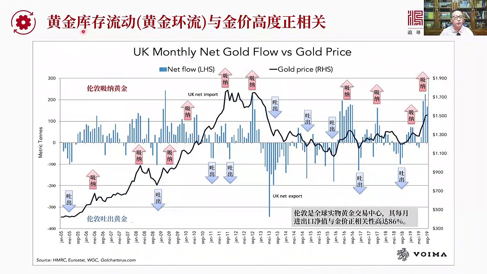

也就是黃金環流黃金環流無非是從倫敦的金庫流向香港的金庫在流向上海金交所的金庫或者流向紐約這個期貨金的金庫無非是金庫之間的運動這個就叫黃金環流黃金庫存流動或者黃金環流跟金價是高度的正相關的但首先我們要用數字來體現這一點這是英國海關的數據英國海關數據它統計每個月倫敦那個食物黃金定價中心它的流出流入這個禁...

---

### Slide 10

還有背後的規律就研究它的黃金具體流動是跟金價是密切相關的那麼我們第二部分要重點介紹黃金環流的運動規律就是黃金環流分幾個階段每個階段中會有什麼樣的特徵這些特徵會產生一種什麼樣的變化趨勢或者叫價格的運動規律我們看下野首先我們剛才強調過

---

### Slide 11

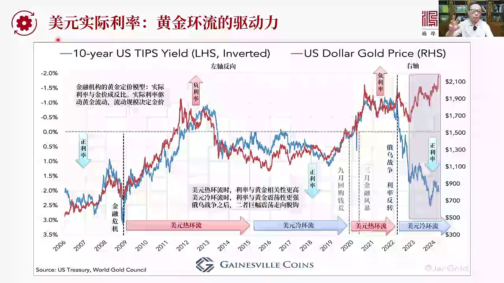

美元實際利率是黃金環流的所以根本的驅動力它跟貨幣環流是一個道理跟美元環流是同樣的道理因為它就是貨幣所以研究它實際上用要用貨幣環流的思想來理解黃金環流然後才能理解黃金的價格這張圖是美國十年的這個國債tips抗通上這個國債它體驗在左側而且是反向的它把它倒過來倒過來目的是為了跟金價進行很好的對比我們可以從...

---

### Slide 12

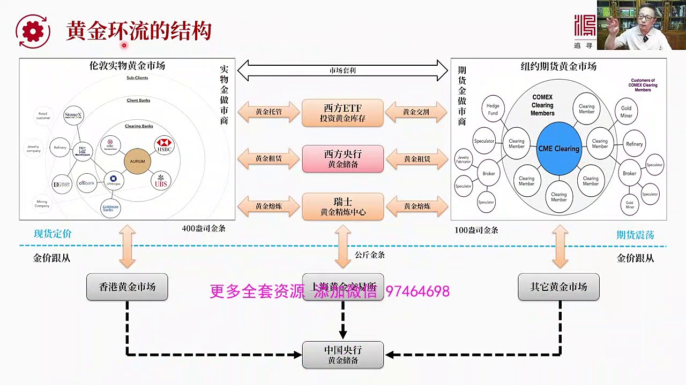

這個在黃金市場中它的結構什麼樣因為我們在研究金價的時候你必須要搞清楚市場結構就像我們研究美聯儲的貨幣政策或者研究美元冷環流熱環流我們得搞清楚什麼叫做格益逆回購誰在掌握格益逆回購什麼叫做天天窗口誰在運作天天窗口什麼叫Soft利率那麼回購市場上誰是主要參與者市場結構很重要而大多數人如果你看不懂美元的這個...

---

### Slide 13

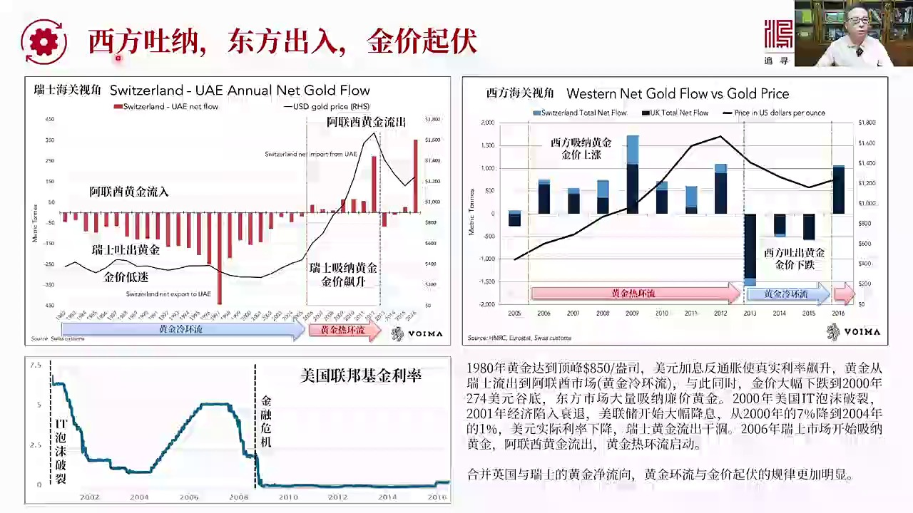

土納土出還有西納黃金東方出入東方我用出入一個跟隨的意思土納是主動的你主動呼氣然後主動吸氣然後產生黃金的流動流入東方或者從東方流出所以是西方土納東方出入金價發生起伏好如果我們看東方是怎麼跟西方進行這個黃金土納和東方出入的比如說我們用瑞士海關的視角這是瑞士海關的統計數據來看瑞士跟阿聯球之間的黃金流出流入...

---

### Slide 14

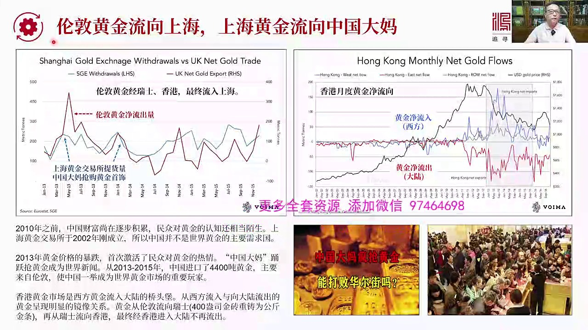

它也是通過一系列連接的比如說倫敦黃金流向上海怎麼流向上海呢首先是要經過瑞士倫敦420的金金條變成專門為中國生產了一公斤的高純度的黃金就是99.995以上的然後瑞士黃金經過經驗之後再轉往香港運到香港通過香港最後流入上海上海市場那麼如果我們來看倫敦金它只要一流出一進流出量跟上海黃金交易所的體貨量就是倫敦...

---

### Slide 15

在過去幾年過去幾十年他的黃金環流的基本的運動規律我們第三部分重點講2022年10月以後黃金環流出現了非常奇怪的現象出現了顯著的異常這是怎麼回事瞭解進入這件事才能幫助我們理解未來幾年黃金的大體走勢好我們看下一黃金環流突然出現異常我們首先看正常狀態吧

---

### Slide 16

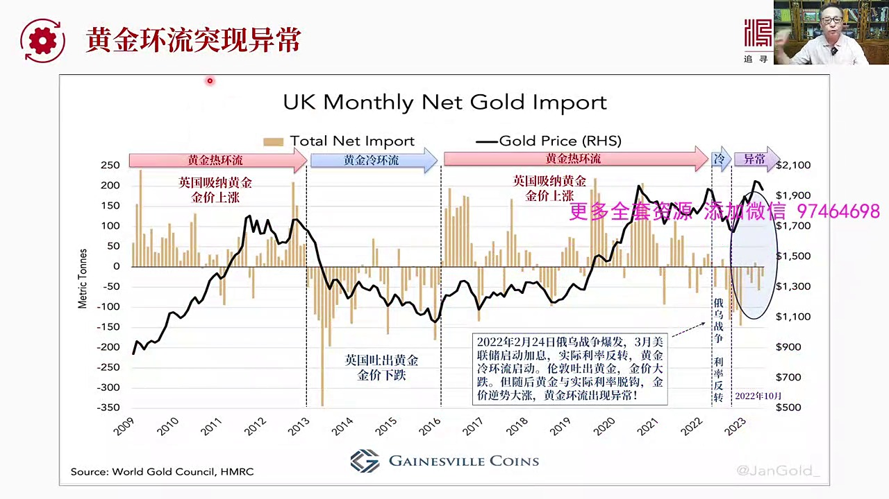

這還是用英國這個每月黃金的進出口的進質來看黃金的環流在這裡我開始標註黃金熱環流和冷環流了首先09年金融危機爆發這當然每月開始搞量寬鬆每月實際利率是下降的到了副利率所以這顯然是黃金熱環流啟動了倫敦那邊開始吐這個熱環的啟動是倫敦那邊開始因為看著這個利率要往副利率方向走這個時候金價還很低倫敦開始西納黃金這...

---

### Slide 17

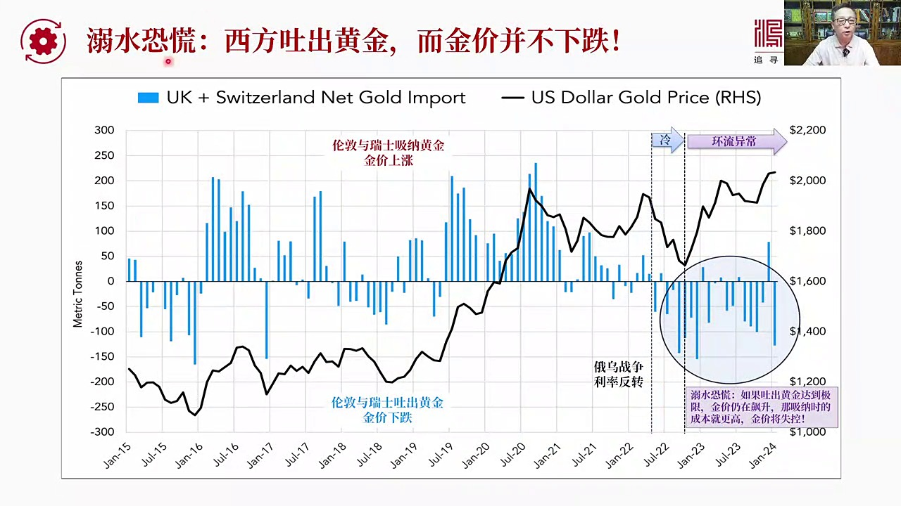

就是西方吐出黃金但是金價並不下跌我們舉個例子就好像一個人在淺水就是挖泳有著有著就每游一下然後頭埋在水裡然後吐氣然後下一步然後就浮上水面換氣吐氣就是吐著黃金把金價往往下壓但是你需要抬頭換氣如果你發現你抬不了頭換不了氣那你說你交不交率那你說抓不著狂恐不恐慌因為你換不了氣水一直埋著頭一直埋著水裡你可能會被...

---

### Slide 18

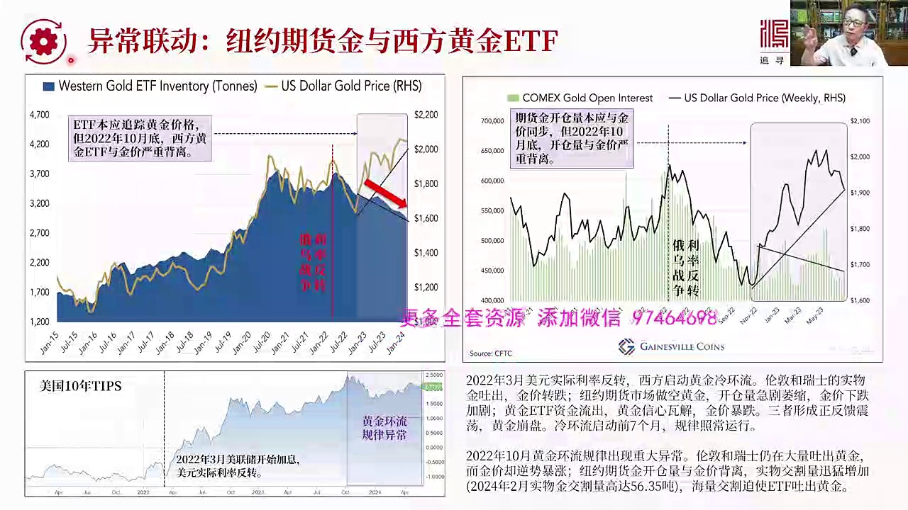

還產生了一系列聯動你會看到不僅是倫敦和瑞士的黃金出了問題砸不動了紐約氣貨金還有西方的黃金ETF也出現了也出現了重大異常比如說ETF這是西方這個ETF黃金ETF就是它應該是追蹤黃金價格的在歷史上也一貫是跟價格走是基本上穩和有些時候有些出入但很快就會談回來而且出現出現出入哪怕出現出入出現出入它的形狀波形...

---

### Slide 19

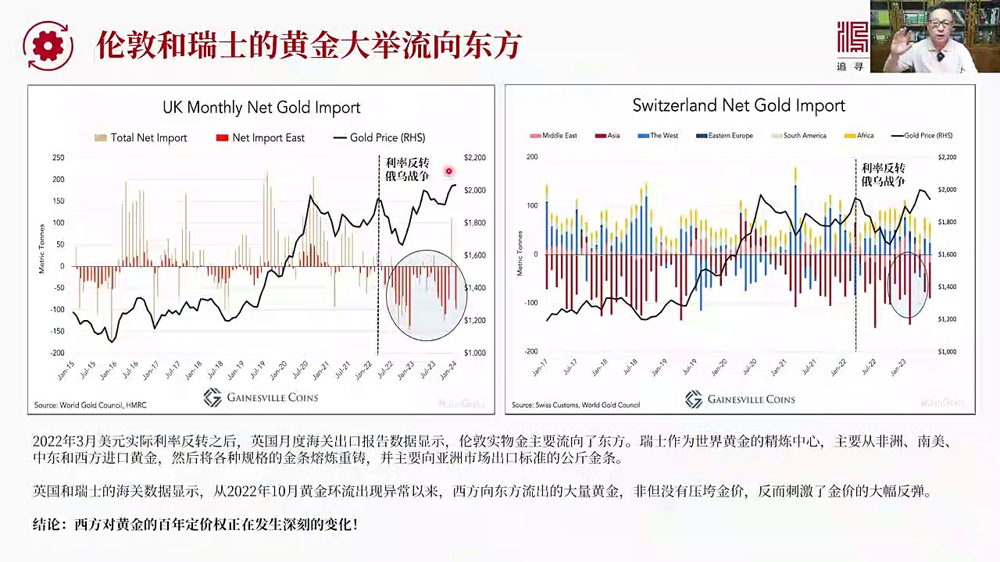

黃金環流異常情況之下倫敦和瑞士黃金大舉流向東方是用於壓價格用於把價格吐出黃金價格壓垮但是沒有壓住我們可以看到英國的黃金進出口的報告在這中間我們會看到進出口的進出口向東方的進出口就是用紅色的標誌來體現在異常就是2022年10月之後我們會看到大量的紅線都是向亞洲出口所以我們肯定倫敦的黃金大量有向亞洲當然...

---

### Slide 20

背後的原因是什麼好下一頁首先要搞清楚到底誰造成了二年10月之後的黃金異常

---

### Slide 21

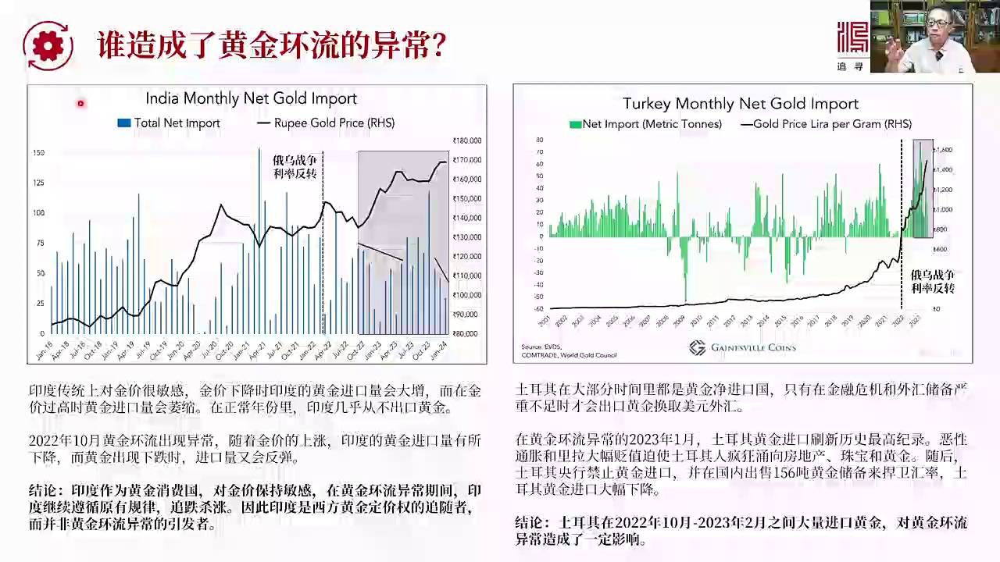

黃金環流的異常誰是幕後的推手首先我們知道英國倫敦的黃金流向瑞士瑞士大量流向的亞洲關鍵是亞洲的誰這要對比好幾個國家的海關數據首先來看印度每個月的黃金進出有量我們可以看到印度基本上只是進口黃金不出口而印度最大的特點印度市場對黃金的最大特點是什麼呢就是對金價非常敏感因為印度人買黃金主要是用做手勢裝飾品那麼...

---

### Slide 22

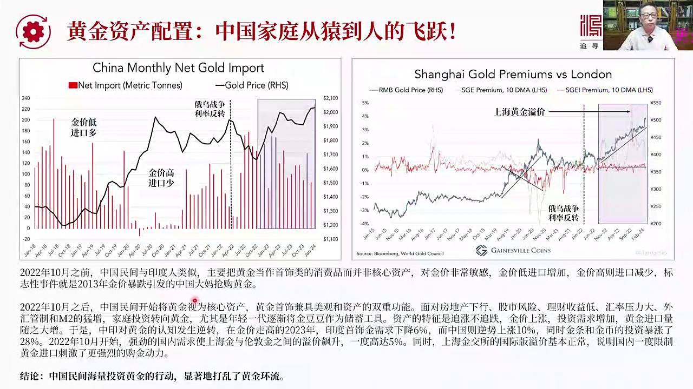

特別是中國的家庭進行開始進行黃金資產配置了以前是從來沒有這個概念的2013年到15年大家家庭都配置黃金資產是很少的但現在不一樣了出現了黃流異常主要原因之一就是中國家庭開始配置黃金資產我稱之為是從緣到人的飛躍如果我們看中國的黃金進出口的數據你會發現中國一開始就是在2022年10月之前異常之前跟印度人差...

---

### Slide 23

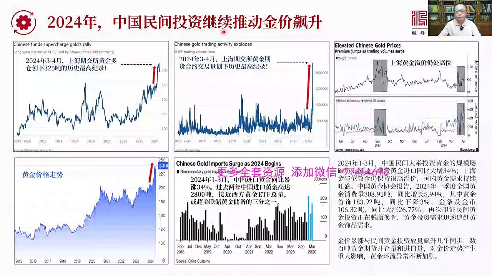

黃金價格的爆炸如果我們看今年的3到4月上海七交所黃金多倉開多倉的創下了325噸的歷史最高紀錄這個325噸這個紀錄往前一招2015年再往前就根本找不到這麼大的多倉的量說明大量投資著投資黃金期貨是明顯的看多黃金而且看多量非常驚人達到了創紀錄的325噸是以前的翻倍了那麼我們看到這個標生的幅度跟世界黃金價格...

---

### Slide 24

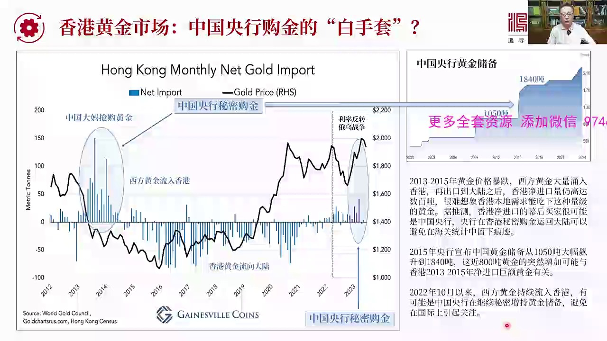

中國央行一個重要的購買黃金的市場就是從香港市場買香港黃金市場是中國央行購買黃金我稱之為是白手套如果我們從香港海關的進出這個統計中可以看到2013年金價暴跌然後到2015年這是黃金的冷環流大量的黃金用向了香港西方的黃金大量比如香港這個規模非常大那麼在這個過程中我們看到海關統計這個進流量這是進的考慮到已...

---

### Slide 25

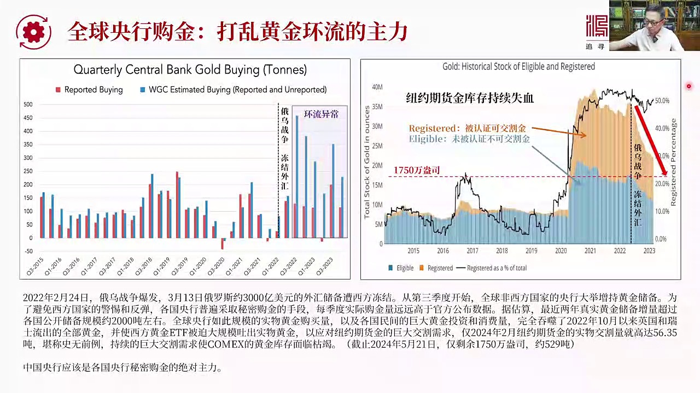

黃金還流徹底穩亂的真正就是使它徹底穩亂真正的這個主力是誰是全球央行這叫看每個季度中央銀行的購買黃金的量這是世界黃金學學會他們公布的紅色的是這個官方自動公布的我增持黃金儲備多少我買多少黃金藍色的實際上是這個國際各路分析師們對於央行悄悄秘密購買黃金量的預測或叫孤算我們看到2022年2月24號俄羅斯戰爭爆...

---

### Slide 26

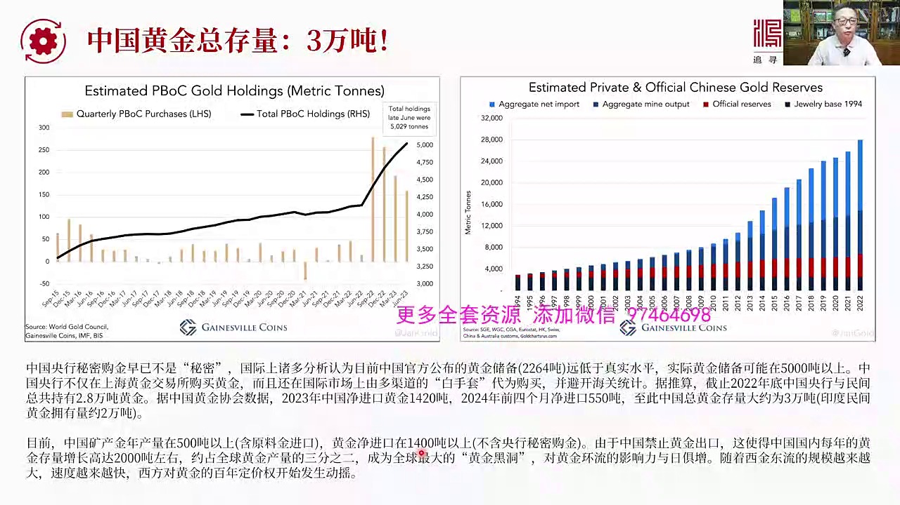

經過各路推算大概應該是三萬噸左右有人這個有分析時預估中國真正的央行儲備不是兩千二百六十四噸而遠遠高於這個水平就是中國央行秘密購金這早就不是秘密了真實的中國黃金儲備應該達到了五千噸以上中國央行它不僅是在上海金交所購買黃金主要不是在這買它還在國際市場上有各種渠道的白手套帶為購買比如說中國上銀行購買黃金也...

---

### Slide 27

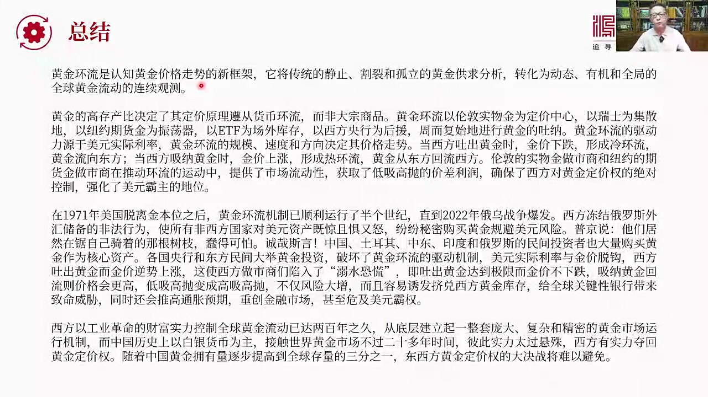

它把傳統的禁止的孤立的各立的黃金顧求關係的分析轉號為動態的有機的和全局的全球環境流動的連續觀察黃金的高存產比決定了黃金定價原理遵從貨幣環流而不是大宗商品黃金環流以倫敦食物金為定價中心以瑞士為極散地以紐約七個金為震盪器以一貼付為廠外庫存以西方央行作為後員周圍富士的進行黃金的吞吐或者叫黃金的吐納黃金環流...

---

### Slide 28

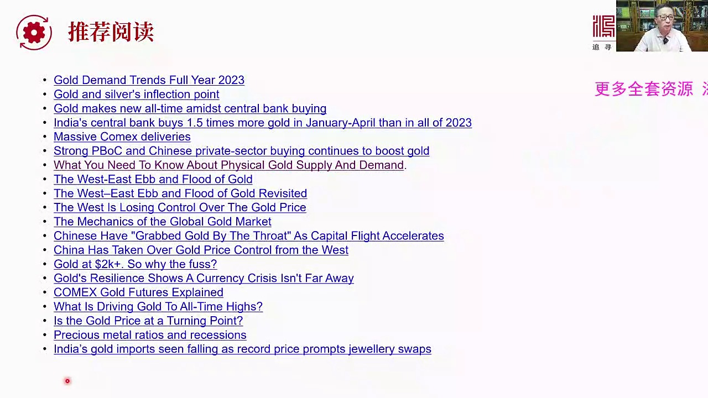

包括一些數據分析當然一些官方數據我這兒裡沒有列大家可以在他們的官網上查到這就是我們今天課程的主要內容謝謝大家祝大家生活愉快

---

### Slide 29

學習進步拜拜

---
