# 核心课视频-137-140 _ 易经辩证法（上）&描述标题= — Clean Slide Notes

> **来源**：鸿学院核心课程  
> **幻灯片**：13 张

---

### Slide 1

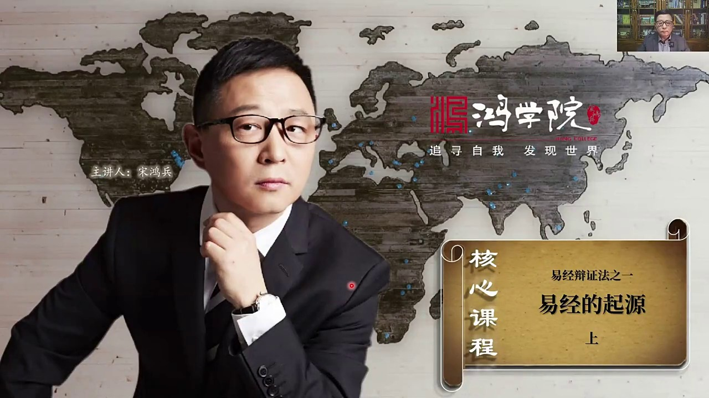

同學們大家好今天我們講異經辯證法這個系列課程了第一節就是異經的起源本來我以為這個內容比較簡單就是講異經的起源但是隨著研究事業的擴展比如說你要談的異經就會涉及到戰衛但是一旦進入戰衛你會發現大量文件中把戰衛計次還有包括污術這些概念全部混在一起然後你要想把所有概念分清楚就必須要進入更深入的研究的層次這就導...

---

### Slide 2

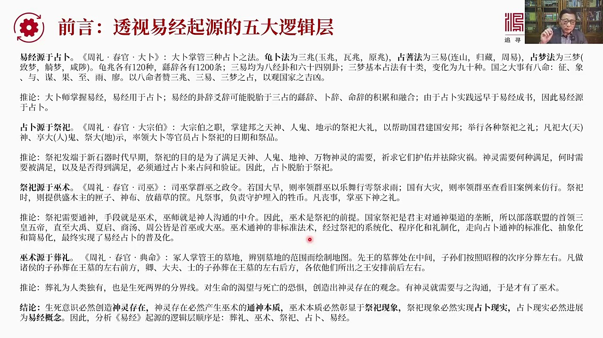

怎麼來研究異經首先要把異經的起源搞清楚我覺得還是要採取黑格變成法的邏輯分層我們把異經也把它分成五大邏輯層來進行層層的透視首先我們的第一關點是異經起源於戰衛如果我們看周理春冠大博周理我們知道他的原名是周官講周代的關制的配置在周冠中又分成天冠地關春夏秋冬春冠是主要負責祭祀李一方面的在春冠中有一種就是大部...

---

### Slide 3

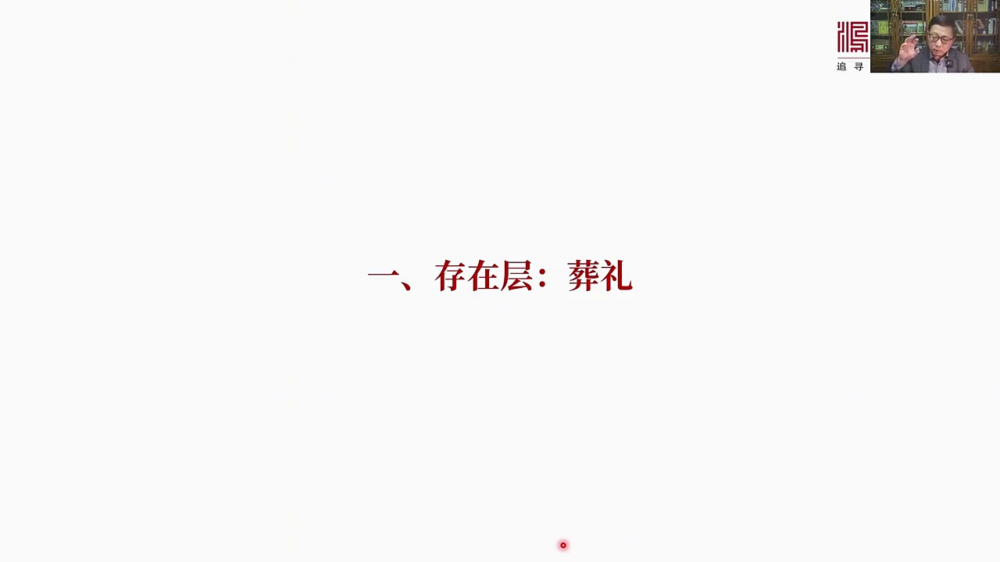

暫停這就是考察異經的第一層首先得研究清楚什麼叫暫停我們看下一頁暫停在我看起來是人類通過死亡

---

### Slide 4

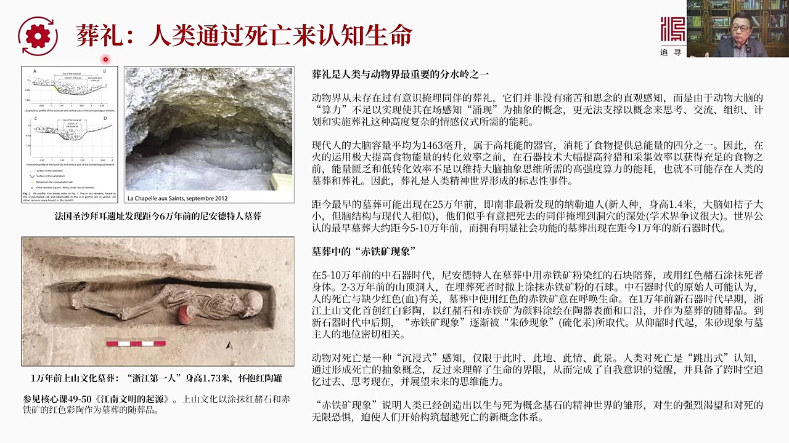

來認知生命是這麼一個過程和這樣一種現象首先暫停是人類和動物界最重要的分水領之一我們在動物界從來沒有看到過有動物有意識的野脈同伴的進行暫停哪怕是猴子也沒有更別說老虎蝕子或者各種各樣的比如說這個南非的列狗還有各種各樣的動物雪爆等等沒有一種動物會有埋葬同伴有意識進行埋葬同伴的形成木葬並且進行葬禮這樣的行為...

---

### Slide 5

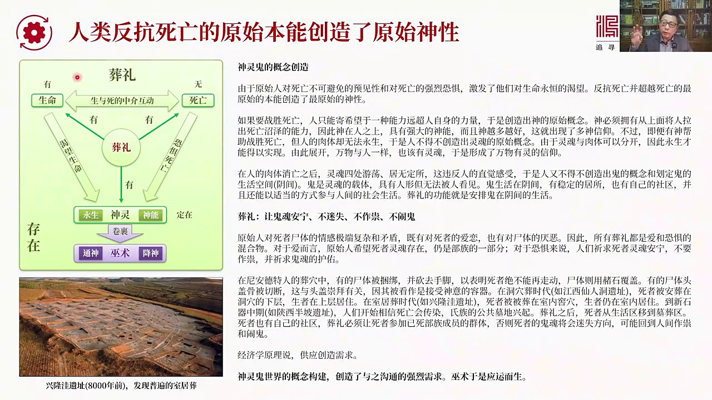

就是人類反抗死亡的原始本能創造了原始的神性所以首先就是神靈鬼的概念創造這個過程究竟是什麼樣考古學上提供了證據從這證據中我們可以進行推演我們知道原始人對死亡不可避免的遇見性還有對死亡的強烈恐懼激發了他們對生命永恆的渴望反抗死亡並且超越死亡的最原始的本能創造了最原始的神性只要人會死只要我們一直到這點我們...

---

### Slide 6

本質層是什麼是無數好再翻下一頁我們現在一般人提到無數就覺得這是個特別特別

---

### Slide 7

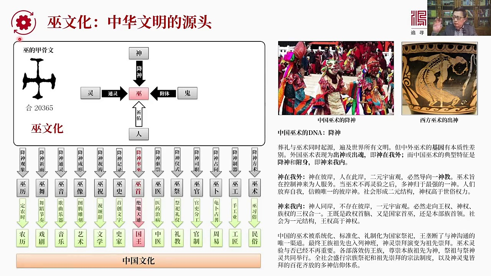

這個迷信或者說根本不知一提這個無數這個東西就是早期人類啥都不懂所以畏懼自然畏懼是什麼然後這些東西完全是糟薄根本就啥也不要有不要這個在宣揚什麼無文化實際上要正確看待無文化就是我們要知道它是中華文明的源頭沒有無文化就不可能有中國的文化這就好比我們說存在層存在都不存在那麼以後的所有東西哪有什麼本質哪有什麼...

---

### Slide 8

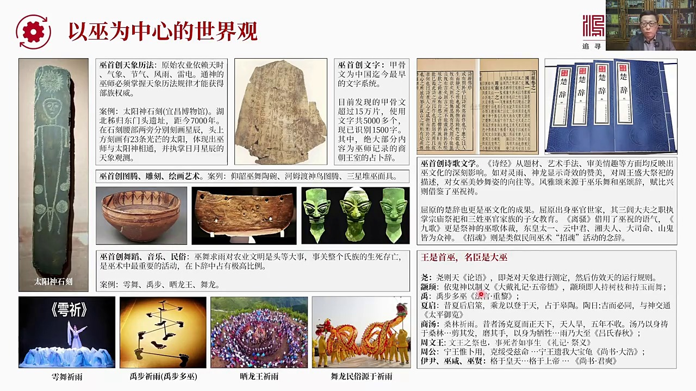

對於早期中共文化的研究需要一種無數作為中心世界觀的這樣的一種意識我們要從無的角度來看待周朝以前的中國社會的發展因為所有的方向都跟無數有關如果我們不具備這樣的視角我們其實很難理解考古發現中了大量的這種考古的這個不管你是法器還是它的預期還是各種計次用的東西你沒有辦法整體別的因為你缺少一個以無數作為中心的...

---

### Slide 9

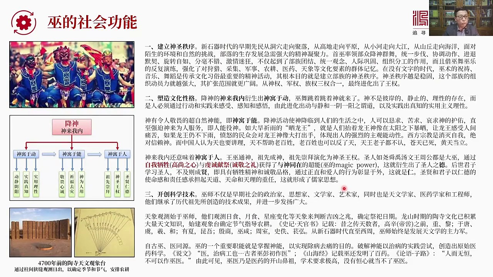

是源於藏理藏理又是源於對生死和神靈的一種感悟我們知道有神靈所以需要有巫術這都屬於個人層面的隨著巫術的發展它越來越多的運用於社會的層面就是私人巫術逐漸演化成了公共巫術那麼它在實現社會功能上有哪些其他哪些作用首先我們可以看我認為它應該有三大作用第一是建立神聖秩序因為新時期時代早期一萬年前鮮民從洞穴中走出...

---

### Slide 10

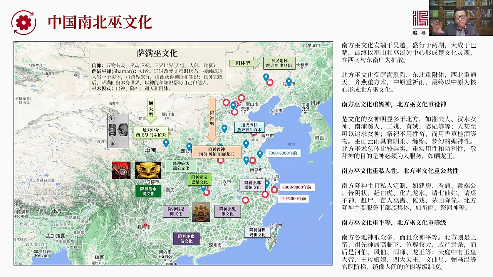

各種無文化做了一個總結這個總結基本上從這張圖上大家可以看出一個苗頭來這個苗頭是什麼呢就是我們可以看到中國的巫術巫文化是分區的在中國的北方遼闊的歐亞大草原上盛行的是薩滿的巫文化薩滿教那麼薩滿的巫文化它的核心是什麼它的細啊就是萬物有零零魂不死而且世界分成三界天堂 地獄 人間那麼薩滿教也有自己的巫師基本上...

---

### Slide 11

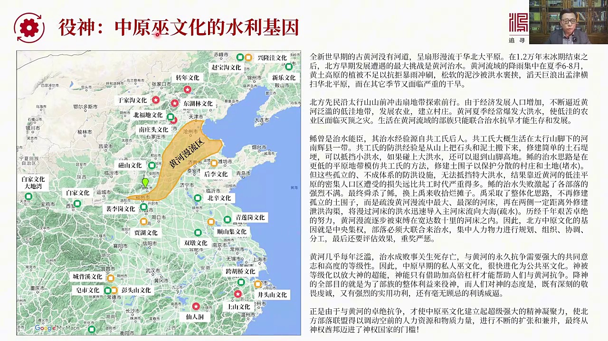

因為我們現在講的是周一的起源而周一的起源當然是發生於中原文化所以我們用中原文化做一個特例來分析它為什麼中原文化它會出現異神其他地方有些是通天有的是成熙兒有的是復體但中原文化最大特點是異神這個基因是怎麼來的為什麼會要降神降神並異神呢這個主要的文化基因我認為是來源於水利之水黃河之水從這張圖上我們可以看到...

---

### Slide 12

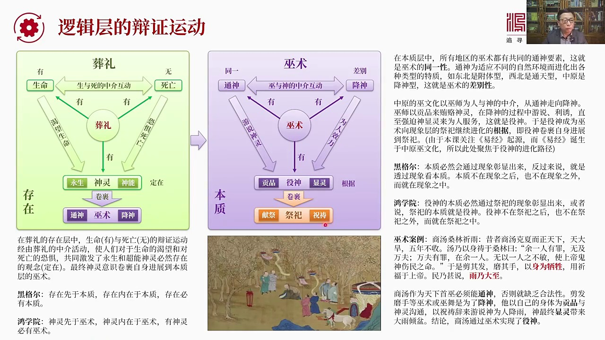

我們在這一頁重點來談藏理作為存在層和無數作為本質層它的邏輯關係或叫辯證運動比如說在藏理上有和無定在對應著生命死亡和神靈藏理中藏理這是存在層生命就是有死亡就是無這兩者之間的辯證運動經過藏理作為中介使人們對於生命的渴望和對死亡的恐懼共同激發了一種永生和超能的神靈必然存在的觀念這就形成了定在最終神靈意識卷...

---

### Slide 13

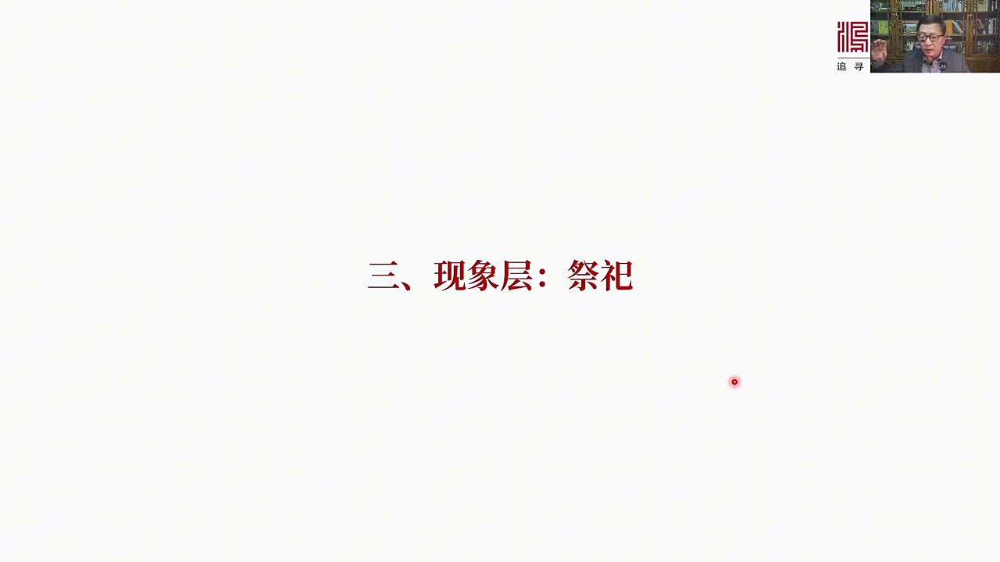

我們這個這堂課前講到這祭祀這個問題包括後來的戰捕和周一我們將會放到下一堂課進行給大家進行分析好今天我們的課就先上到這裡謝謝大家

---
